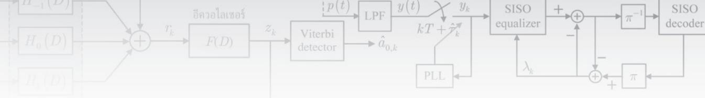

## บรรณานุกรม

[1] ปิยะ โควินท์ทวีวัฒน์, การประมวลผลสัญญาณสำหรับการจัดเก็บข้อมูลดิจิทัล เล่ม 1: พื้นฐานช่องสัญญาณ อ่าน. ศูนย์เทคโนโลยีอิเล็กทรอนิกส์และคอมพิวเตอร์แห่งชาติ (เนคเทค), 2550.

[2] S. B. Wicker, Error control systems for digital communication and storage. New Jersey: Printice Hall International, 1995

[3] C. Berrou, A. Glavieux and P. Thitimajshima, "Near Shannon limit error-correction coding and decoding: Turbo-codes," in Proc. of ICC'1993, pp. 1064 – 1070, Geneva, Switzerland, May 1993.

[4] J. R. Barry, D. G. Messerschmitt, and E. A. Lee, Digital Communication. Springer, 3rd ed., 2003.

[5] E. M. Kurtas and B. Vasic, Advanced Error Control Techniques for Data Storage Systems. CRC press, 2006.

[6] Hitachi Global Storage Technologies [online], Available http:/www.hitachigst.com/ internaldrives/mobile/travelstar/travelstar-5k500b [Access: October 17, 2010]

[7] J. Moon, "The role of signal processing in data-storage," IEEE Signal Processing Magazine, pp. 54 – 72, July 1998.

[8] B. Vasic and E. M. Kurtas, Coding and Signal Processing for Recording Systems. CRC press, 2005.

[9] K. A. S. Immink, "Runlength-limited sequences," in Proc. of the IEEE, vol. 78, no. 11, pp. 1745 – 1759, November 1990.

[10] ปิยะ โควินท์ทวีวัฒน์, การประมวลผลสัญญาณสำหรับการจัดเก็บข้อมูลดิจิทัล เล่ม 2: การออกแบบวงจร ภาครับ. ศูนย์เทคโนโลยีอิเล็กทรอนิกส์และคอมพิวเตอร์แห่งชาติ (เนคเทค), 2550.

[11] J. W. M. Bergmans, Digital baseband transmission and recording. Boston/London/ Dordrecht: Kluwer Academic Publishers, 1996.

[12] T. A. Roscamp, E. D. Boerner, and G. J. Parker, "Three-dimensional modeling of perpendicular recording with soft underlayer," J. of Applied Physics, vol. 91, no. 10, May 2002.

[13] G. D. Forney, "Maximum-likelihood sequence estimation of digital sequences in the presence of intersymbol interference," IEEE Trans. Inform. Theory, vol. IT-18, no. 3, pp. 363 – 378, May 1972.

[14] J. Moon and W. Zeng, "Equalization for maximum likelihood detector," IEEE Trans. Magnetics, vol. 31, no. 2, pp. 1083 – 1088, March 1995.

[15] P. Kovintavewat, I. Ozgunes, E. Kurtas, J. R. Barry, and S. W. McLaughlin, "Generalized partial response targets for perpendicular recording with jitter noise," IEEE Trans. Magnetics, vol. 38, no. 5, pp. 2340 . 2342, September 2002.

[16] B. Sklar, Digital communications: fundamentals and applications. Prentice Hall, 2nd-ed., 2001.

[17] R. Gallager, 'Low-density parity-check codes," IRE Trans. Inform. Theory, vol. IT-8, pp. 21 – 28, January 1962.

[18] L. R. Bahl, J. Cocke, F. Jelinek and J. Raviv, "Optimal decoding of linear codes for minimizing symbol error rate," IEEE Trans. Inform. Theory, vol. IT-20, pp. 248 – 287, March 1974.

[19] J. Hagenauer and P. Hoeher, "A Viterbi algorithm with soft-decision outputs and its applications," in Proc. of Globecom'89, pp. 1680 – 1686, November 1989.

[20] B. Zhou, L. Zhang, J. Kang, Q. Huang, Y. Y. Tai, S. Lin, and M. Xu, 'Non-binary LDPC codes vs. Reed-Solomon codes," in Proc. of Information Theory and Applications Workshop, San Diego, CA, pp. 175 – 184, January 27 - February 1, 2008,

[21] C. Douillard, M. Jezequel and C. Berrou, "Iterative correction of intersymbol interference: Turboequalization," Eur. Trans. Telecommun., vol. 6, no. 5, pp. 507 – 511, September – October 1995.

[22] R. Koetter, A. C. Singer, and M. Tüchler, "Turbo Equalization," IEEE Signal Processing Magazine, vol. 21, pp. 67 – 80, 2004.

[23] P. Robertson, E. Villebrun, and P. Hoeher, "A comparison of optimal and sub—optimal MAP decoding algorithms operating in the log domain," in Proc. of ICC'95, pp. 1009 – 1013, 1995.

[24] P. Robertson, P. Hoeher, and E. Villebrun, "Optimal and sub-optimal maximum a posteriori algorithms suitable for turbo decoding," European. Trans. Telecomm., vol. 8, pp. 119 – 125, Mar.-Apr. 1997.

[25] C. E. Shannon, "A mathematical theory of communication," Bell System Technical Journal, vol. 27, pp. 379 – 423, 623 – 656, July, October, 1948.

[26] S. A. Barbulescu and S. S. Pietrobon, "Interleaver design for turbo codes," Electron. Lett., vol. 30, no. 25, pp. 2107 – 2108, December 1994.

[27] M. Oberg, A. Vityaev, and P. H. Siegel, "The effect of puncturing in turbo encoders," in Proc. Int. Symp. Turbo Codes and Related Topics, Brest, France, Sept. 1997, pp. 184 – 187.

[28] D. Divsalar and F. Pollara, "Turbo codes for PCS applications," in Proc. of ICC'95, Seattle, WA, June 1995, pp. 54 – 59.

[29] S. Benedetto and G. Montorsi, "Unveiling turbo codes: some results on parallel concatenated coding schemes," IEEE Trans. Inform. Theory, vol. 42, no. 2, March 1996, pp. 409 – 429.

[30] T. Souvignier, A. Friedmann, M. Oberg, P. Siegel, R. Swanson, and J. Wolf, "Turbo decoding for PR4: parallel vs. serial concatenation," in Proc. of ICC'99, vol. 3, pp. 1638 – 1642, 1999.

[31] S. Benedetto, D. Divsalar, G. Montorsi, and F. Pollara, "Serial concatenation of interleaved codes: Performance analysis, design and iterative decoding," IEEE Trans. Inform. Theory, vol. 44, pp. 909 – 926, May 1998.

[32] R. D. Cideciyan, F. Dolivo, R. Hermann, W. Hirt, and W. Schott, "A PRML system for digital magnetic recording,"IEEE J. Selected Areas Commun., vol. 10, no. 1, pp. 38 – 56, January 1992.

[33] A. R. Nayak, Iterative timing recovery for magnetic recording channels with low signal-tonoise ratio. PhD thesis, Georgia Institute of Technology, Georgia, June 2004.

[34] P. Kovintavewat, Timing recovery based on per-survivor processing. PhD thesis, Georgia Institute of Technology, Georgia, October 2004.

[35] P. Kovintavewat and J. R. Barry, Iterative Timing Recovery: A Per-Survivor Approach. VDM Verlag Publisher, September 2009.

[36] P. Kovintavewat, "Timing recovery strategies in magnetic recording systems," IEICE Trans. Fundamentals, vol. E93-A, no.7, July 2010.

[37] P. Kovintavewat and S. Koonkarnkhai, "Joint TA suppression and turbo equalization for magnetic recording channels," IEEE Trans. Magnetics, vol. 46, no. 6, pp. 1393 – 1396, June 2010.

[38] W. Koch and A. Baier, "Optimum and sub-optimum detection of coded data disturbed by timevarying intersymbol interference," in Proc. of Globecom'90, San Diego, CA, Dec. 1990, pp. 1679-1684.

[39] M. P. C. Fossorier, F. Burkert, S. Lin, and J. Hagenauer, "On the Equivalence Between SOVA and Max-Log—MAP decodings," IEEE Comm. Letters, vol. 2, no. 5, May 1998, pp. 137 – 139.

[40] T. K. Moon, Error Correction Coding: Mathematical Methods and Algorithms. New Jersey: John Wiley & Sons, 2005.

[41] R. H. Morelos-Zaragoza, The Art of Error Correcting Coding. 2nd edition. West Sussex: John Wiley & Sons, 2006.

[42] B. Vucetic and J. Yuan, Turbo Codes: Principles and Applications. 2nd edition. Norwell, MA: Kluwer, 2000.

[43] S. X. Wang and A. M. Taratorin, Magnetic Information Storage Technology. San Diego: Academic Press, 1999.

[44] R. M. Tanner, "A recursive approach to low complexity codes," IEEE Trans. Inform. Theory, vol. IT-27, pp. 533-547, September 1981.

[45] D. J. C. Mackey and R. Neal "Near Shannon limit performance of low density parity check codes," Electronics Letters, vol. 33, pp. 457-458, March 1997.

[46] T. Richardson, A. Shokrollahi, and R. Urbanke, Design of capacity approaching irregular lowdensity parity-check codes," IEEE Trans. Inform. Theory, vol. 47, pp. 619 – 637, Feb. 2001.

[47] M. Yang and W. E. Ryan, "Lowering the error rate floors of moderate-length high rate LDPC codes," in Proc. of ISIT'03, Jun-July 2003.

[48] S. Y. Chung, R. Urbanke, and T. Richardson, "Analysis of sum-product decoding of low-density parity-check codes using a Gaussian approximation," IEEE Trans. Inform. Theory, vol. 47, pp. 657-670, Feb. 2001.

[49] S. Y. Chung, G. Forney, R. Urbanke, and T. Richardson, "On the design of low-density paritycheck codes within 0.0045 dB of the Shannon limit," IEEE Comm. Letters, vol. 5, pp. 58-60, Feb. 2001.

[50] F. R. Kschischang, B. J. Frey, and H.-A. Loeliger, '"Factor Graphs and the Sum-Product Algorithm," IEEE Trans. Inform. Theory, vol. 47, no. 2, pp. 498-519, February 2001.

[51] J. Hagenauer, E. Offer, and L. Papke, "Iterative Decoding of Binary Block and Convolutional Codes," IEEE Trans. Inform. Theory, vol. 42, pp. 429–445, March 1996.

[52] H. El Gamal and A. R. Hammons, Jr., "Analyzing the Turbo Decoder using the Gaussian Approximation," in Proc. of ISIT'00, page 319, Sorrento, Italy, June 2000.

[53] Wikipedia [online], Available http://en.wikipedia.org/wiki/Gaussian\_elimination [Access: November 13, 2010]

[54] J. L. Fan, "Array codes as low-density parity-check codes," in Proc. of the 2nd Int. Symp. Turbo Codes, France, pp. 543-546, Sep 2000.

[55] E. Eleftheriou and S. Olcer, "Low-density parity check codes for digital subscriber lines," in Proc. of ICC'02, pp.1752-1757., April – May, 2002.

[56] A. R. Nayak, J. R. Barry, and S. W. McLaughlin, "Joint timing recovery and turbo equalization for coded partial response channels," IEEE Trans. Magn., vol. 38, no. 5, pp. 2295 – 2297, Sept. 2003.

[57] J. R. Barry, A. Kavi, S. W. McLaughlin, A. R. Nayak, and W. Zeng, "Iterative timing recovery," IEEE Signal Processing Magazine, vol. 21, no. 1, pp. 89 – 102, Jan. 2004.

[58] J. Moon and J. Lee, "Timing recovery in conjunction with maximum likelihood sequence detection in the presence of intersymbol interference," IEEE Trans. Circuits Syst. I, Regular Papers, vol. 55, no. 9, pp. 2884 – 2897, 0ct. 2008.

[59] J. Lee, J. Moon, T. Zhang, and E. Haratsch, "New phase-locked loop design: understanding the impact of a phase-tracking channel detector," IEEE Trans. Magn., vol. 46, no. 3, pp. 830 – 836, Mar. 2010.

[60] R. Raheli, A. Polydoros, and C. K. Tzou, "Per-survivor processing: a general approach to MLSE in uncertain environments," IEEE Trans. Commun., vol. 43, no. 234, pp. 354 – 364, Feb/Mar/Apr. 1995.

[61] H. K. Thapar and A. M. Patel, "A class of partial response systems for increasing storage density in magnetic recording," IEEE Trans. Magn., vol. 23, no. 5, pp. 3666 – 3668, Sept. 1987.

[62] P. Kovintavewat, J. R. Barry, M. F. Erden, and E. Kurtas, "Per-survivor timing recovery for uncoded partial response channels," in Proc. of ICC'04, vol. 27, pp. 2715 – 2719, Paris, Jun. 20- 24, 2004.

[63] P. Kovintavewat, J. R. Barry, M. F. Erden, and E. Kurtas, "Per-survivor iterative timing recovery for coded partial response channels," in Proc. of Globecom'04, vol. 4, pp. 2604 – 2608, Texas, Nov. 29 – Dec. 3, 2004.

[64] P. Kovintavewat, J. R. Barry, M. F. Erden, and E. Kurtas, "Method and apparatus for providing iterative timing recovery," US Patent 2006/0067434, Mar. 30, 2006.

[65] P. Kovintavewat, J. R. Barry, M. F. Erden, and E. Kurtas, '"Reduced-complexity per-survivor iterative timing recovery for coded partial response channels," in Proc. of ICAssP'05, Philadelphia, USA, vol. 3, pp. i11/841 – i11/844, Mar. 19 – 23, 2005.

[66] A. N. Andrea, U. Mengali, and G. M. Vitetta, "Approximate ML decoding of coded PSK with no explicit carrier phase reference," IEEE Trans. Commun., vol. 42, no. 234, pp. 1033 – 1039, Feb/Mar/Apr. 1994.

[67] K. H. Mueller and M. Müller, '"Timing recovery in digital synchronous data receivers," IEEE Trans. Commun., vol. COM-24, pp. 516 – 531, May 1976.

[68] H. Shafiee, "Timing recovery for sampling detectors in digital magnetic recording," in Proc. of ICC'96, vol. 1, pp. 577 – 581, January 1996.

[69] H. Meyr, M. Moeneclaey, and S. A. Fechtel, Digital communication receivers: synchronization, channel estimation, and signal processing. New York: John Wiley & Sons, Inc., 1997.

[70] S. E. Stupp, M. A. Baldwinson, P. McEwen, T. M. Crawford, and C. T. Roger, "Thermal asperity trends," IEEE Trans. Magn., vol. 35, pp. 752 – 757, March 1999.

[71] M. F. Erden and E. M. Kurtas, "Thermal asperity detection and cancellation in perpendicular magnetic recording systems," IEEE Trans. Magn., vol. 40, no. 3, pp. 1732 - 1737, May 2004.

[72] K. B. Klaassen and J. C. L. van Peppen, "Electronic abatement of thermal interference in GMR head output signal," IEEE Trans. Magn., vol. 33, pp. 2611 – 2616, September 1997.

[73] V. Dorfman and J. K. Wolf, "A method of reducing the effects of thermal asperities," IEEE J. Select. Areas Commun., vol. 19, pp. 662 – 667, April 2001.

[74] V. Dorfman and J. K. Wolf, "Viterbi detection for partial response channels with colored noise," IEEE Trans. Magn., vol. 38, pp. 2316 – 2318, September 2002.

[75] G. Mathew and I. Tjhia, "Thermal asperity suppression in perpendicular recording channels," IEEE Trans. Magn., vol. 41, no. 10, pp. 2878 – 2880, October 2005.

[76] P. Kovintavewat and S. Koonkarnkhai, "Thermal asperity suppression based on least squares fitting in perpendicular magnetic recording systems," Journal of Applied Physics, vol. 105, no. 7, 07C114, March 2009.

[77] P. Kovintavewat and S. Koonkarnkhai, "Joint TA suppression and turbo equalization for coded partial response channels," IEEE Trans. Magn., vol. 46, no. 6, pp. 1393 – 1396, June 2010.

[78] J. M. Ruigrok, R. Coehoorn, S. R. Cumpson, and H. W. Kesteren, "Disk recording beyond 100 Gb/in2: hybrid recording?," J. Applied Physics, vol. 87, no. 9, pp. 5398 – 5403, May 2000.

[79] R. Wood, '"The feasibility of magnetic recording at 1 terabit per square inch," IEEE Trans. Magn., vol. 36, no. 1, pp. 36 – 42, Janauary 2000.

[80] R. Wood, M. Williams, A. Kavcic, and J. Miles, "The feasibility of magnetic recording at 10 terabits per square inch on conventional media," IEEE Trans. Magn., vol. 45, no. 2, pp. 917 – 923, Feb 2009.

[81] R. L. White, R. M. H. New, and R. F. W. Pease, "Patterned media: a viable route to 50 Gbit/in2 and up for magnetic recording," IEEE Trans. Magn., vol. 33, no. 1, pp. 990 – 995, January 1997.

[82] J. Guan and J. G. Zhu, "Investigation of patterned thin film media for ultra-high density recording," IEEE Trans. Magn., vol. 36, no. 5, pp. 2297 – 2299, September 2000.

[83] L. F. Shew, "Discrete tracks for saturation magnetic recording," IEEE Trans. Magn., vol. 51, no. 3, pp. 532 – 532, March 1963.

[84] S. Lambert, I. Sanders, A. Patlach, and M. Krounbi, "Recording characteristics of submicron discrete magnetic tracks," IEEE Trans. Magn., vol. 23, no. 5, pp. 3690 – 3692, 1987.

[85] S. E. Lambert, I. L. Sanders, A. M. Patlach, M. T. Krounbi, and S. R. Hetzler, "Beyond discrete tracks: Other aspect of patterned media," J. Appl. Phys., vol. 68, no. 8, pp. 4724 – 4726, 1991.

[86] Y. Kitade, H. Komoriya, and T. Maruyama, '"Patterned media fabricated by lithography and argon-ion milling," IEEE Trans. Magn., vol. 40, no. 4, pp. 2516 – 2518, July 2004.

[87] B. D. Terris and T. Thomson, "Nanofabricated and self-assembled magnetic structures and data storage media," J. Phys. D: Appl. Phys., vol. 38, pp. R199 – R222, 2005.

[88] S. Hosaka, H. Sano, K. Itoh, and H. Sone, "Possibility to form an ultrahigh packed fine pit and dot arrays for future storage using EB writing," Microelectron. Eng., vol. 83, pp. 792 – 795, 2006.

[89] M. Sachan, C. Bonnoit, C. Hogg, E. Evarts et al., "Self-assembled nanoparticle arrays as nanomasks for pattern transfer," J. Phys. D, vol. 41, pp. 134001–134005, June 2008.

[90] C. A. Ross, "Patterned magnetic recording media," Annu. Rev. Mater. Res., vol. 31, pp. 203 – 235, 2001.

[91] M. Albrecht, A. C. Moser, T. Rettner, T. Thomson, and B. D. Terris, "Writing of high-density patterned perpendicular media with a conventional longitudinal recording head," Appl. Phys. Lett., vol. 80, no. 18, pp. 3409 – 3411, 2002.

[92] J. Moritz, L. Buda, B. Dieny, J. P. Nozieres, R. J. M. Van de Veerdonk, V. Crawford, and D. Weller, "Writing and reading bits on pre-patterned media," Appl. Phys. Lett., vol. 84, no. 9, pp. 1519 – 1521, 2004.

[93] M. Albrecht, S. Ganesan, C. T. Rettner, A. Moser, M. E. Best, R. L. White, and B. D. Terris, "Patterned perpendicular and longitudinal media: a magnetic recording study," IEEE Trans. Magn., vol. 39, no. 5, pp. 2323 – 2325, September 2003.

[94] B. D. Terris, M. Albrecht, G. Hu, T. Thomson, and C. T. Rettner, "Recording and reversal properties of nanofabricated magnetic islands," IEEE Trans. Magn., vol. 41, no. 10, pp. 2822 – 2827, October 2005.

[95] H. J. Richter, A. Y. Dobin, R. T. Lynch, D. Weller, R. M. Brockie, O. Heinonen, K. Z. Gao, J. Xue, R. J. M. v. d. Veerdonk, P. Asselen, and M. F. Erden, '"Recording potential of bit-patterned media," Appl. Phys. Lett., vol. 88, pp. 222 512-1 – 222 512-3, May 2006.

[96] J. G Zhu, Z. Lin, L. Guan, and W. Messner, "Recording, noise, and servo characteristics of patterned thin film media," IEEE Trans. Magn., vol. 36, no. 1, pp. 23 – 29, January 2000.

[97] J. F. C. Windmill and W. W. Clegg, "A novel magnetic force microscope probe design," IEEE Trans. Magn., vol. 36, no. 5, pp. 2984 – 2986, September 2000.

[98] M. Albrecht, C. T. Rettner, A. Moser, M. E. Best, and D. Terris, "Recording performance of high-density patterned perpendicular magnetic media," Appl. Phys. Lett., 81(15):2875–2877, 2002.

[99] M. M. Aziz, C. D. Wright, B. K. Middleton, H. Du, and P. Nutter, "Signal and noise characteristics of patterned media," IEEE Trans. Magn., vol. 38, no. 5, pp. 1964 – 1966, September 2002.

[100] G. F. Hughes, "Read channels for patterned media," IEEE Trans. Magn., vol. 35, no. 5, pp. 2310 – 2312, September 1999.

[101] G. F. Hughes, "Read channel for pre-patterned media with trench playback," IEEE Trans. Magn., vol. 39, no. 5, pp. 2564 – 2566, 2003.

[102] S. K. Nair and R. M. H. New, "Patterned media recording: Noise and channel equalization," IEEE Trans. Magn., vol. 34, no. 4, pp. 1916 – 1918, July 1998.

[103] M. M. Aziz, B. K. Middleton, and C. D. Wright, "Signal-to-noise ratios in recorded patterned media," IEE Proceedings-Science, Measurement and Technology, 150 (5), pp. 232 – 236, Sept. 2003.

[104] P. W. Nutter, D. Mc. A. McKirdy, B. K. Middleton, D. T. Wilton, and H. A. Shute, "Effect of island geometry on the replay signal in patterned media storage," IEEE Trans. Magn., vol. 40, no. 6, pp. 3551 – 3558, November 2004.

[105] P. W. Nutter, I. T. Ntokas, and B. K. Middleton, "An investigation of the effects of media characteristics on read channel performance for patterned media storage," IEEE Trans. Magn., vol. 41, no. 11, pp. 4327 – 4334, November 2005.

[106] I. T. Ntokas, P. W. Nutter, and B. K. Middleton, "Evaluation of read channel performance for perpendicular patterned media," J. Magn. Magn. Mater., 287: 437–441, 2005.

[107] M. Keskinoz, '"Two-dimensional equalization/detection for patterned media storage," IEEE Trans. Magn., vol. 44, no. 4, pp. 533 – 539, April 2008.

[108] S. Nabavi, Signal processing for bit-patterned media channels with inter-track interference. Ph.D thesis, Carnegie Mellon University, Pittsburgh, December 2008.

[109] S. Karakulak, From channel modeling to signal processing for bit patterned media recording. Ph.D thesis, University of California, San Diego, 2010.

[110] P. W. Nutter, I. T. Ntokas, B. K. Middleton, and D. T. Wilton, "Effect of island distribution on error rate performance in patterned media," IEEE Trans. Magn., vol. 41, no. 10, pp. 3214 – 3216, Oct. 2005.

[111] I. T. Ntokas, P. W. Nutter, C. J. Tjhai, and M. Z. Ahmed, "Improved data recovery from patterned media with inherent jitter noise using low-density parity-check codes," IEEE Trans. Magn., vol. 43, no. 10, pp. 3925 – 3929, 0ctober 2007.

[112] S. Karakulak, P. H. Siegel, J. K. Wolf, and H. N. Bertram, "A new read channel model for patterned media storage," IEEE Trans. Magn., vol. 44, no. 1, pp. 193 – 197, January 2008.

[113] H. J. Richter, A. Y. Dobin, O. Heinonen, K. Z. Gao, R. J. M. v.d. Veerdonk, R. T. Lynch, J. Xue, D. Weller, P. Asselin, M. F. Erden, and R. M. Brockie, '"Recording on bit-patterned media at densities of 1 Tb/in2 and beyond," IEEE Trans. Magn., vol. 42, no. 10, pp. 2255 – 2260, October 2006.

[114] S. W. Yuan and H. N. Bertram, "Off-track spacing loss of shielded MR heads," IEEE Trans. Magn., vol. 30, no. 3, pp. 1267 – 1273, 1994.

[115] K. Wiesen and B. Cross, "GMR head side-reading and bit aspect ratio," IEEE Trans. Magn., vol. 39, no. 5, pp. 2609 – 2611, 2003.

[116] S. Khizroev and D. Litvinov, "Parallels between playback in perpendicular and longitudinal recording," J. Magn. Magn. Mater., vol. 257, pp. 126 – 131, 2003.

[117] Y. Shiroishi, K. Fukuda, et al., "Future options for HDD storage," IEEE Trans. Magn., vol. 45, no. 10, pp. 3816 - 3822, October 2009.

[118] S. H. Ahn, Example of 2D convolution [online], Available http://www.songho.ca/dsp/ convolution/convolution2d\_example.html [Access: May 12, 2011]

[119] S. Nabavi, B. V. Kumar, and J. A. Bain, "Mitigating the effects of track mis-registration in bitpatterned media," in Proc. of ICC'08, Beijing, China, pp.2061 – 2065.

[120] S. Koonkarnkhai, N. Chirdchoo, and P. Kovintavewat, "Iterative decoding for high-density bitpatterned magnetic recording," submitted to I-SEEC 20l1, Nakhon Pathom, Thailand, December 15-18, 2011.

[121] S. Koonkarnkhai, N. Chirdchoo, and P. Kovintavewat, '"Two-dimensional cross-track asymmetric target design for high-density bit-patterned magnetic recording" submitted to ISPACS 2011, Chiangmai, Thailand, December 7 – 9, 2011.

[122] J. Ashley, "Holographic data storage," IBM, vol. 44, no. 3, pp. 341 – 368, 2000.

[123] W. M. J. Coene, D. M. Bruls, A. H. J. Immink, A. M. et al. "Two-dimensional optical storage," in Proc. of ICASSP'05, vol. 5, pp. v/749 – v/752, March 18–23, 2005.

[124] E. Kurtas, J. G. Proakis, and M. Salehi, "Coding for multitrack magnetic recording systems," IEEE Trans. Magn. vol. 43, no. 6, pp. 2020–2023, November 1997.

[125] N. Kogo, N. Hirano, and R. Kohno, "Convolutional code and 2-dimensional PRML class-IV for multi-track magnetic recording system," in Proc. of ISIT'00, 2000.

[126] S. Nabavi and B. V. K. Vijaya Kumar, "Modifying Viterbi algorithm to mitigate inter-track interference for bit-patterned media," IEEE Trans. Magn., vol. 43, no. 6, pp. 2274-2276, 2007.

[127] B. Vucetic and J. Yuan, Turbo Codes: Principles and Applications. 2nd edition. Norwell, MA: Kluwer, 2000.

[128] T. W. McDaniel, W. A. Challener, and K. Sendur, "Issues in heat-assisted perpendicular recording," IEEE Trans. Magn., vol. 39, no. 4, pp. 1972 – 1979, July 2003.

[129] H. F. Hamann, Y. C. Martin, and H. K. Wickramasinghe, "Thermally assisted recording beyond traditional limits," Applied Physics Letters, vol. 84, no. 5, pp. 810 – 812, 2004.

[130] T. Rausch, Experimental and theoretical investigation of heat assisted magnetic recording. Ph.D. thesis, Carnegie Mellon Univ., Pittsburgh, PA, USA, 2003.

[131] T. Rausch, J. A. Bain, D. D. Stancil, and T. E. Schelesinger, "Thermal Williams-Comstock model for predicting transition length in a heat-assisted magnetic recording system," IEEE Trans. Magn., vol. 40, no. 1, pp. 137 – 147, Jan. 2004.

[132] M. Fatih Erden, T. Rausch, and W. A. Challener, "Cross-track transition location and transition parameter effects in heat-assisted magnetic recording," IEEE Trans. Magn., vol. 41, no.6, pp. 2189 – 2194, Jun. 2005.

[133] R. Radhakrishan, M. Fatih Erden, C. He and B. Vasic, "Transition response characteristics of heat-assisted magnetic recording and their performance with MTR codes," IEEE Trans. Magn., vol. 43, no. 6, pp. 2298 – 2300, Jun. 2007.

[134] Mark H. Kryder et al., "Heat Assisted Magnetic Recording," Proc. of the IEEE, vol. 96, no. 11, pp. 1810 – 1835, November 2008.

[135] W. A. Challener, T. W. McDaniel, C. Mihalcea, K. Mountfield, K. Pelhos, and K. Sendur, "Light delivery techniques for heat-assisted magnetic recording," Jpn. J. Appl. Phys., vol. 42, pp. 981 – 988, 2003.

[136] M. L. Williams and R. L. Comstock, "An analytic model of the write process indigital magnetic recording", in Proc. 17th Annu. AIP Conf., 1971, pp. 724 – 738.

[137] A. M. Taratorin, Magnetic recording systems and measurements. San Jose Research Center Hitachi Global Storage Technology, 2004.

[138] O. Karlqvist, "Calculation of the magnetic field in the ferromagnetic layer of a magnetic drum," Trans. R. Inst. Technol. Stockholm, vol. 86, pp. 3 – 27, 1954.

[139] R. Radhakrishan, Detection and decoding for magnetic storage systems. Ph.D thesis, University of Arizona, Arizona, May 2009.

[140] H. N. Bertram, H. Zhou, and R. Gustafson, "Signal to noise ratio scaling and density limit estimates in longitudinal magnetic recording," IEEE Trans. Magn., vol. 34, pp. 1845 – 1847, July 1998.

[141] J. C. Mallinson and H. N. Bertram, "On the characteristics of pole-keeper head fields," IEEE Trans. Magn., vol. 20, no. 5, pp. 721 – 723, September 1984.

[142] J. Caroselli and J. K. Wolf, "A new model for media noise in thin film media," in Proc. of SPIE – Coding and Information Theory, vol. 2605, pp. 29 – 38, 1995.

[143] J. S. Goldberg and J. K. Wolf, "Implementation and analysis of nonlinear effects in the microtrack model," IEEE. Trans. Magn., vol. 35, pp. 2256–2258, Sept. 1999.

[144] A. Kaewpukdee, N. Chirdchoo, and P. Kovintavewat, 'Transition characteristics of longitudinal heat-assisted magnetic recording systems," submitted to I-SEEC 2011, Nakhon Pathom, Thailand, December 15-18, 2011.

