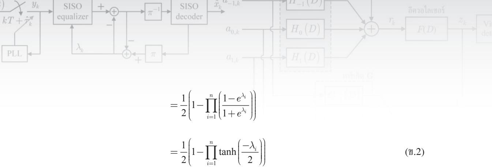

# 附录 B

# 双曲正切规则

本附录将证明方程(4.30)中的双曲正切规则（tanh rule），如下所示。设奇偶校验函数 $\Phi ( \mathbf { c } ) \in \{ 0 , 1 \}$ 为 $n$ 比特数据集 $\mathbf { c } = [ c _ { 1 } , \ c _ { 2 } , \ . . . , \ c _ { n } ]$ 的奇偶性，其中 $c _ { i } \in \{ 0 , 1 \}$，则奇偶校验函数 $\Phi(\mathbf{c})$ 可通过下式求得

$$
\Phi \left( \mathbf { c } \right) = \frac { 1 } { 2 } \Bigg ( 1 - \prod _ { i = 1 } ^ { n } \left( 1 - 2 c _ { i } \right) \Bigg )\tag{ข.1}
$$

由于 $\Phi ( \mathbf { c } ) = 0$ 对应 $\mathbf{c}$ 中 1 的个数为偶数，而 $\Phi ( \mathbf { c } ) = 1$ 对应 $\mathbf{c}$ 中 1 的个数为奇数。此外，概率 $\stackrel { \mathrm { d } } { \bar { \eta } } \Phi ( \mathbf { c } ) = 1$ 等于 $\Phi ( \mathbf { c } )$ 的期望值，即

$$
\begin{array} { r l } { \operatorname { p } _ { t } [ \Phi ( \mathbf { x } ) - 1 ] = E \left\{ \Phi ( \mathbf { x } ) \right\} } \\ { \ } & { = ( 1 ) \operatorname { P r } _ { [ \tilde { \mathbf { e } } ] } ( \mathbf { x } ) = 1 ] + ( 0 ) \operatorname { P r } _ { [ \tilde { \mathbf { e } } ] } ( \mathbf { \Phi } \mathbf { e } ) = 0 ] } \\ { \ } & { = \frac { 1 } { 2 } \Bigg ( 1 - E \left[ \underset { \mathrm { i } \sim 1 } { \overset { \times } { \prod } } \left( 1 - 2 \epsilon _ { s } \right) \right] } \\ { \ } &  = \frac { 1 } { 2 } \Bigg ( 1 - \underset { \mathrm { i } \sim 1 } { \overset { \times } { \prod } } \left( 1 - 2 E \left[ \epsilon _ { s } \right] \right) \Bigg ) \quad \ ( \underset { \mathrm { i } \sim 1 } { \overset { \cdot } { \prod } } \mathrm { a r s i m m a n ~ m a x i n ~ f i a \bar { \mathbf { k } } \bar { \mathbf { q } } \cdot \mathbf { n } \bar { \mathbf { q } } \bar { \mathbf { n } } \tilde { \mathbf { n } } \tilde { \mathbf { n } } \tilde { \mathbf { n } } \tilde { \mathbf { n } } \tilde { \mathbf { n } } \tilde { \mathbf { n } } ) } \\ { \ } &  = \frac { 1 } { 2 } \Bigg ( 1 - \underset { \mathrm { i } \sim 1 } { \overset { \cdot } { \prod } } \left( 1 - \frac { 2 E ^ { d } } { 1 + \epsilon ^ { k } } \right) \Bigg ) \quad \ ( \underset { \mathrm { i } \sim 1 } { \overset { \cdot } { \prod } } \mathrm { a r s i m m a \bar { \mathbf { n } } } ) \mathrm  a r s i n ~ f i a \bar { \mathbf { k } } \bar { \mathbf { q } } \cdot \mathbf { n } \bar { \mathbf { n } } \tilde { \mathbf { n } } \tilde { \mathbf { n } } \tilde { \mathbf { n } } \tilde { \mathbf { n } } \tilde { \mathbf { n } } \tilde { \mathbf { n } } \tilde { \mathbf { n } } \tilde { \mathbf { n } } \tilde { \mathbf { n } } \tilde { \mathbf { n } } \tilde { \mathbf { n } } \tilde  \mathbf  n \end{array}
$$

其中 $E [ . ]$ 为期望算子，且由于 $\mathrm { P r } \big [ \Phi ( \mathbf { c } ) = 0 \big ] =$ $1 - \mathrm { P r } \big [ \Phi ( \mathbf { c } ) = 1 \big ]$，因此 $\Phi ( \mathbf { c } )$ 的对数似然比（LLR）值为

$$
\lambda _ { \Phi ( \mathbf { c } ) } = \log \left( \frac { \operatorname* { P r } \bigl [ \Phi \left( \mathbf { c } \right) = 1 \bigr ] } { \operatorname* { P r } \bigl [ \Phi \left( \mathbf { c } \right) = 0 \bigr ] } \right) = \log \left( \frac { 1 - \prod _ { i } \operatorname { t a n h } \left( - \lambda _ { i } / 2 \right) } { 1 + \prod _ { i } \operatorname { t a n h } \left( - \lambda _ { i } / 2 \right) } \right)\tag{ข.3}
$$

利用性质 $\operatorname { t a n h } \left( - \lambda / 2 \right) = \left( 1 - e ^ { \lambda } \right) / \left( 1 + e ^ { \lambda } \right)$，并令 $\Psi = \prod _ { i = 1 } ^ { n } \operatorname { t a n h } \left( - \lambda _ { i } / 2 \right)$，可得

$$
\operatorname { t a n h } \left( \frac { - \lambda _ { \Phi ( \mathbf { c } ) } } { 2 } \right) = \frac { 1 - \left( \displaystyle \frac { 1 - \Psi } { 1 + \Psi } \right) } { 1 + \displaystyle \left( \frac { 1 - \Psi } { 1 + \Psi } \right) } = \frac { ( 1 + \Psi ) - \left( 1 - \Psi \right) } { ( 1 + \Psi ) + ( 1 - \Psi ) } = \Psi = \prod _ { i = 1 } ^ { n } \operatorname { t a n h } \left( \frac { - \lambda _ { i } } { 2 } \right)\tag{ข.4}
$$

与方程(4.30)一致，得证。

