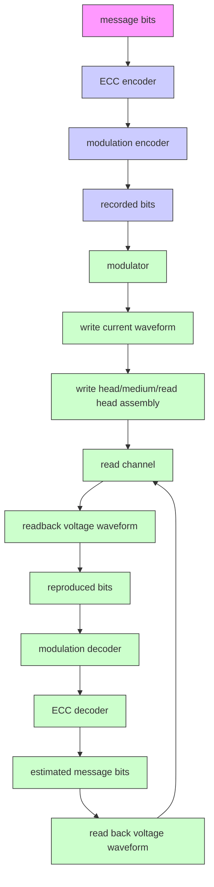
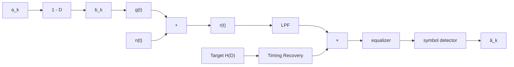
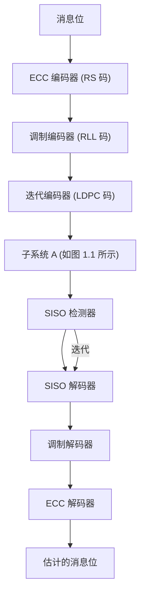
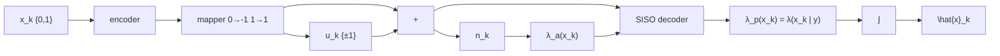

本书适用于具有硬盘驱动器信号处理基础知识的读者。本书是《数字存储信号处理》第一卷（读写信道基础）和第二卷（接收机电路设计）的延续。因此，作者建议读者在阅读本书之前，先学习并理解前两卷的内容，以便更快速地掌握本书中的各项内容。本书将详细阐述硬盘驱动器中采用的迭代解码技术，以及BPMR和HAMR技术，旨在以易于理解的方式供读者自学。

本书基于作者在硬盘信号处理领域的科研经验编写。作者于2001年开始在米国佐治亚理工学院（Georgia Institute of Technology）攻读博士学位。此外，作者还在美国匹兹堡的希捷研究中心（Seagate Research Center）工作了一年。本书分为两部分：第一部分介绍新一代硬盘驱动器中开始采用的迭代解码技术，首先阐述当前采用的垂直磁记录（PMR）系统的运作原理；第二章讲解迭代解码技术的基础Turbo码和用于新一代硬盘驱动器的Turbo均衡器，其中涉及软检测器与LDPC解码器之间的软信息交换；第三章和第四章将分别详细探讨软检测器和LDPC解码器的工作原理；第五章将举例说明如何将迭代解码技术应用于解决硬盘信号处理系统中的定时恢复（Timing Recovery）和热粗糙度（Thermal Asperity）问题。第二部分涉及未来将取代当前垂直记录技术的先进磁记录技术，其中第六章介绍BPMR技术基础，第七章详细讲解BPMR系统中的目标响应（Target Response）和均衡器的设计。

本书的完成离不开许多人的帮助与鼓励。作者衷心感谢在学习期间提供知识、指导和建议的所有老师，特别是 Prof. John R. Barry 和 Prof. Steven W. McLaughlin，以及希捷研究中心的 Dr. Erozan M. Kurtas, Dr. M. Fatih Erden, 和 Dr. Inci Ozgunes，感谢他们给我机会从事硬盘信号处理的研究。同时，作者永远不会忘记家人，尤其是 พญ.ศิรสุดา โควินท์ทวีวัฒน์。此外，感谢国家科学技术发展局（NSTDA）、国家电子和计算机技术中心（NECTEC）、硬盘驱动器研究所、硬盘组件联合研究中心、国家研究委员会以及 lนครปฐม 皇家大学（Nakhon Pathom Rajabhat University）在本书撰写期间提供的支持与便利。感谢来自国王蒙库特科技大学北都校区工程学院的博士生 Santi Kunkarnkhai 和 Adisorn Kaewphakdee 协助校对本书。

最后，作者尽最大努力使本书易于自学，以便读者能快速高效地掌握内容。若书中存在任何不足之处，恳请读者将宝贵意见和建议发送至电子邮箱 piyล@nprน.ac.th，以便作者在下次印刷时进行改进。有关本书的更多信息，请访问网站 http://home.npru.ac.th/piya

副教授 Piya Kovinthaveewat 博士
 Nakhon Pathom 皇家大学
2011年8月

# 第一章
# 引言

本章将介绍用于代表硬盘驱动器中磁记录系统 (magnetic recording system) 的读信道 (read channel) [1] 的数学模型，使读者能够了解硬盘驱动器的信号处理系统，这为后续章节的学习奠定了基础。此外，本章还将阐述在硬盘驱动器信号处理系统中应用迭代解码 (iterative decoding) 技术 [2-5] 的概念和基础，使读者理解迭代解码技术的优势，该技术已在新型硬盘驱动器中实际采用 [6]，能够显著提高系统性能。

# 1.1 数字数据存储系统

硬盘驱动器中的数字数据存储系统 (digital data storage system) 可以通过图 1.1 [1, 5, 7] 的框图来模拟。当信息位 (message bits) 被发送到纠错编码器 (ECC encoder) 时，通常采用硬盘驱动器中常用的 RS (Reed Solomon) 码 [2, 8]。随后，编码后的数据将再次通过调制编码器 (modulation encoder) 进行编码，以调整数据的特性，使其适应硬盘驱动器的信道。常用的调制码是 RLL (run-length limited code) [5, 9]。调制编码器的输出数据被认为是将要写入存储介质的数据，称为“记录位 (recorded bit)”。之后，记录位将被发送至调制器 (modulator)，将数据位转换为写电流波形 (write current waveform)，然后输入到写头中将数据写入存储介质。


<details>
<summary>flowchart</summary>


</details>


图 1.1 硬盘驱动器数字数据存储系统的框图 [9, 10]

对于读取过程，读头 (read head) 从存储介质中读取数据。当读头移动到磁化状态 (magnetization) 发生变化的区域时，会产生一个通常被称为“读回信号 (readback signal)”的电压波形信号。随后，该读回信号被送入读信道进行处理，读信道由多个组件组成，例如：低通滤波器 (LPF: low-pass filter)、采样器 (sampler 或 analog-to-digital converter)、均衡器 (equalizer) 以及符号检测器 (symbol detector) 等。最后，输出数据将依次通过调制解码器 (modulation decoder) 和纠错解码器 (ECC decoder) 进行解码，以获得所需信息位的估计值。


<details>
<summary>flowchart</summary>


</details>


# 1.2 硬盘驱动器信道模型

图 1.1 中的子系统 A (system A) 可以通过图 1.2 [1, 10] 的数学模型来表示。当一个比特周期为 $T$ 的二进制输入数据序列 $a_k \in \{0, 1\}$ 通过一个多项式为 $1 - D$ 的理想微分器 (ideal differentiator) 时（其中 $D$ 是延迟 $T$ 个单位的延迟算子），将产生一个状态转移序列 (transition sequence) $b_k \in \{-1, 0, 1\}$。其中 $b_k = \pm 1$ 表示正向或负向的状态转移 (positive or negative transition)，而 $b_k = 0$ 表示没有状态转移 (no transition)。随后，状态转移序列 $b_k$ 通过一个冲激响应为转移脉冲信号 $g(t)$ 的信道，并受到噪声 $n(t)$ 的干扰，从而产生读回信号 $r(t)$。其数学表达式为：

$$ r(t) = \sum_k b_k g(t - kT) + n(t) \tag{1.1} $$

随后，在接收端，读回信号 $r(t)$ 通过低通滤波器 (LPF) 以消除带外噪声，并在定时恢复 (timing recovery) 系统的控制下进行采样 [10]。采样电路的输出数据被送入均衡器和符号检测器，以寻找最可能的输入数据序列 $\hat{a}_k$（即 $a_k$ 的估计值）。


<details>
<summary>line</summary>

| t/T | ND = 2 | ND = 2.5 | ND = 3 |
| --- | --- | --- | --- |
| -5.0 | 0.05 | 0.06 | 0.07 |
| -4.0 | 0.10 | 0.12 | 0.14 |
| -3.0 | 0.25 | 0.30 | 0.35 |
| -2.0 | 0.50 | 0.60 | 0.70 |
| -1.0 | 0.80 | 0.90 | 0.95 |
| 0.0 | 1.00 | 1.00 | 1.00 |
| 1.0 | 0.80 | 0.90 | 0.95 |
| 2.0 | 0.50 | 0.60 | 0.70 |
| 3.0 | 0.25 | 0.30 | 0.35 |
| 4.0 | 0.10 | 0.12 | 0.14 |
| 5.0 | 0.05 | 0.06 | 0.07 |
</details>


<details>
<summary>line</summary>

| t/T | ND = 2 | ND = 2.5 | ND = 3 |
| --- | --- | --- | --- |
| -5.0 | -1.0 | -1.0 | -1.0 |
| -4.0 | -1.0 | -1.0 | -1.0 |
| -3.0 | -0.8 | -0.8 | -0.8 |
| -2.0 | -0.4 | -0.4 | -0.4 |
| -1.0 | 0.0 | 0.0 | 0.0 |
| 0.0 | 0.4 | 0.4 | 0.4 |
| 1.0 | 0.8 | 0.8 | 0.8 |
| 2.0 | 0.9 | 0.9 | 0.9 |
| 3.0 | 0.95 | 0.95 | 0.95 |
| 4.0 | 0.98 | 0.98 | 0.98 |
| 5.0 | 1.0 | 1.0 | 1.0 |
</details>

รูปที่ 1.3 สัญญาณพัลส์เปลี่ยนสถานะสำหรับการบันทึก (a) แบบแนวนอน และ (b) แบบแนวตั้ง

对于纵向记录 (longitudinal recording) 系统，转移脉冲信号（通常称为 Lorentzian 脉冲）的表达式为 [11]：
$$ g(t) = \frac{1}{1 + \left(2 t / \mathrm{PW} _ {5 0}\right) ^ {2}} \tag {1.2} $$
其中 $\mathrm{PW}_{50}$ 是 $g(t)$ 脉冲在高度为最大值一半处测得的脉冲宽度。而垂直记录 (perpendicular recording) 系统的转移脉冲信号表达式为 [12]：
$$ g(t) = \operatorname{erf} \left(\frac {2 t \sqrt {\ln 2}}{\mathrm{PW} _ {5 0}}\right) \tag {1.3} $$
其中 $\ln(\cdot)$ 是自然对数 (natural logarithm)，$\mathrm{PW}_{50}$ 是 $g'(t)$（即 $g(t)$ 的导数）在高度为最大值一半处测得的脉冲宽度，$\operatorname{erf}(\cdot)$ 是误差函数 (error function)，其定义为：

$$ \operatorname{erf} (x) = \frac {2}{\sqrt {\pi}} \int_ {0} ^ {x} e ^ {- t ^ {2}} d t \tag {1.4} $$

在硬盘驱动器的记录系统中，归一化记录密度 (normalized recording density, ND) 定义为 [11]：
$$ \mathrm{ND} = \frac {\mathrm{PW} _ {5 0}}{T} \tag {1.5} $$
这表示记录数据的密度，其中 $T$ 是一个信息位的周期，称为比特单元 (bit cell)。ND 值表明 $\mathrm{PW}_{50}$ 区域内可以存储多少个比特。图 1.3 展示了在不同 ND 水平下，纵向记录和垂直记录的转移响应。可以看出，两种记录方式的转移脉冲信号都覆盖了多个比特单元的时间范围。特别是随着 ND 值的增加，符号间干扰 (ISI: intersymbol interference) 将变得更加严重，因为相邻的转移脉冲信号之间出现重叠 (Overlap) 的可能性更高。


<details>
<summary>line</summary>

| x    | ND = 2 | ND = 2.5 | ND = 3 |
| ---- | ------ | -------- | ------ |
| -5   | 0.0    | 0.0      | 0.0    |
| -4   | 0.05   | 0.05     | 0.05   |
| -3   | 0.1    | 0.1      | 0.1    |
| -2   | 0.2    | 0.2      | 0.2    |
| -1   | 0.4    | 0.4      | 0.4    |
| 0    | 0.5    | 0.4      | 0.4    |
| 1    | -0.5   | -0.4     | -0.4   |
| 2    | -0.2   | -0.2     | -0.2   |
| 3    | 0.0    | 0.0      | 0.0    |
| 4    | 0.05   | 0.05     | 0.05   |
| 5    | 0.0    | 0.0      | 0.0    |
</details>
(a) t/T


<details>
<summary>line</summary>

| x    | ND = 2 | ND = 2.5 | ND = 3 |
| ---- | ------ | -------- | ------ |
| -5.0 | 0.0000 | 0.0000   | 0.0000 |
| -4.0 | 0.0000 | 0.0000   | 0.0000 |
| -3.0 | 0.0000 | 0.0000   | 0.0000 |
| -2.0 | 0.0000 | 0.0000   | 0.0000 |
| -1.0 | 0.0000 | 0.0000   | 0.0000 |
| 0.0  | 0.8900 | 0.7200   | 0.6000 |
| 1.0  | 0.0000 | 0.0000   | 0.0000 |
| 2.0  | 0.0000 | 0.0000   | 0.0000 |
| 3.0  | 0.0000 | 0.0000   | 0.0000 |
| 4.0  | 0.0000 | 0.0000   | 0.0000 |
| 5.0  | 0.0000 | 0.0000   | 0.0000 |
</details>
(b) VT

图 1.4 纵向记录 (a) 和垂直记录 (b) 的双比特脉冲信号。

如图 1.4 所示，该双比特响应被视为硬盘驱动器记录系统中“信道 (channel)”的代表。

通常，磁记录系统中使用最广泛的符号检测器是维特比检测器 (Viterbi detector) [10, 13]。由于维特比检测器的复杂度随信道记忆 (channel memory) 的增加而呈指数级增长，因此必须使用均衡器来调整整个系统的综合响应，使其符合预期的目标响应 (target response) $H(D)$ [10, 11, 14]，从而降低维特比检测器的复杂度。在实践中，这种目标响应通常被称为“部分响应目标 (partial response target)”或 PR 目标。在纵向记录系统中，被广泛采用的 PR 目标表达式为 [11]：
$$ H(D) = (1 - D)(1 + D)^n \tag{1.7} $$
而在垂直记录系统中，其表达式为 [14, 15]：
$$ H(D) = (1 + D)^n \tag{1.8} $$
其中 $n$ 为正整数。


<details>
<summary>line</summary>

| x    | Channel response (ND = 2) | Channel response (ND = 2.5) | PR4 [1 0-1] (n = 1) | EPR4 [1 1-1-1] (n = 2) | EEPR4 [1 2 0-2 1] (n = 3) |
| ---- | ------------------------- | --------------------------- | --------------------- | ------------------------ | --------------------------- |
| 0.00 | 0.00                      | 0.00                        | 0.00                  | 0.00                     | 0.00                        |
| 0.05 | 0.80                      | 0.90                        | 0.70                  | 0.60                     | 0.50                        |
| 0.10 | 0.95                      | 0.98                        | 0.85                  | 0.75                     | 0.65                        |
| 0.15 | 0.98                      | 0.99                        | 0.90                  | 0.85                     | 0.75                        |
| 0.20 | 0.99                      | 0.99                        | 0.95                  | 0.90                     | 0.80                        |
| 0.25 | 0.98                      | 0.98                        | 0.98                  | 0.95                     | 0.85                        |
| 0.30 | 0.95                      | 0.95                        | 0.95                  | 0.90                     | 0.90                        |
| 0.35 | 0.90                      | 0.90                        | 0.90                  | 0.85                     | 0.85                        |
| 0.40 | 0.80                      | 0.80                        | 0.80                  | 0.75                     | 0.75                        |
| 0.45 | 0.70                      | 0.70                        | 0.70                  | 0.65                     | 0.65                        |
| 0.50 | 0.60                      | 0.60                        | 0.60                  | 0.55                     | 0.55                        |
</details>
(a) 归一化频率 (fT)


<details>
<summary>line</summary>

| n    | Channel response (ND = 2) | Channel response (ND = 2.5) | PR2 [1 2 1] (n = 2) | EPR2 [1 3 3 1] (n = 3) | EEPR2 [1 4 6 4 1] (n = 4) |
| ---- | ------------------------- | --------------------------- | --------------------- | ------------------------ | --------------------------- |
| 0.00 | 1.0000                    | 1.0000                      | 1.0000                | 1.0000                   | 1.0000                      |
| 0.05 | 0.9500                    | 0.9400                      | 0.9600                | 0.9300                   | 0.9200                      |
| 0.10 | 0.8500                    | 0.8200                      | 0.8800                | 0.8400                   | 0.8100                      |
| 0.15 | 0.7500                    | 0.7000                      | 0.8000                | 0.7500                   | 0.7000                      |
| 0.20 | 0.6500                    | 0.6000                      | 0.7200                | 0.6800                   | 0.6200                      |
| 0.25 | 0.5500                    | 0.5000                      | 0.6500                | 0.6000                   | 0.5500                      |
| 0.30 | 0.4500                    | 0.4000                      | 0.5800                | 0.5200                   | 0.4800                      |
| 0.35 | 0.3500                    | 0.3000                      | 0.5000                | 0.4500                   | 0.4000                      |
| 0.40 | 0.2500                    | 0.2000                      | 0.4200                | 0.3800                   | 0.3200                      |
| 0.45 | 0.1500                    | 0.1000                      | 0.3500                | 0.3000                   | 0.2500                      |
| 0.50 | 0.0500                    | 0.0000                      | 0.2800                | 0.2200                   | 0.1800                      |
</details>
(b) 归一化频率 (fT)

图 1.5 不同信道记录方式 (a) 纵向和 (b) 垂直记录的目标响应频率响应对比。

图 1.5 比较了不同目标响应的频率响应。信道的频率响应即为公式 (1.6) 中双比特脉冲信号的傅里叶变换 [1]。方括号 [.] 中的数字表示目标响应中每个分接头 (tap) 的系数。例如：
- PR4 [1 0 -1] 表示 PR4 (PR class-IV) 目标，其 D 域传输函数 [1] 为 $H(D) = 1 - D^2$；
- EEPR2 [1 4 6 4 1] 表示 EEPR2 目标，其 D 域传输函数为 $H(D) = 1 + 4D + 6D^2 + 4D^3 + D^4$。

由图 1.5 可知，随着信道 ND 值的增加，所采用的目标响应应具有更多的分接头（即 $n$ 值更大），以使目标响应尽可能地接近信道的实际响应，从而提高维特比检测器的运行效率（详见 [10] 第三章）。

此外，由公式 (1.7) 和 (1.8) 可知，所有 PR 目标的系数均为整数。然而，如果使用系数为实数的 $\text{GPR (generalized partial response target)}$ 目标，系统的整体性能将远优于传统的 PR 目标。有关适合硬盘驱动器信道的均衡器和目标响应设计技术的详细信息，请参考 [10, 14, 15]。
<details>
<summary>flowchart</summary>

```mermaid
graph LR
    A["a_k"] --> B["H(D)"]
    B --> C["s_k"]
    C --> D["q(t)"]
    D --> E["+"]
    E --> F["r(t)"]
    F --> G["LPF"]
    G --> H["×"]
    H --> I["symbol detector"]
    I --> J["â_k"]
    J --> K["timing recovery"]
    K --> H
    E -->|w(t)| D
```
</details>

รูปที่ 1.6 แบบจำลองช่องสัญญาณอุดมคติ

# 1.3 理想信道模型

图 1.2 中的信道模型被认为是“真实信道模型 (realistic channel model)”，因为其运行特性与硬盘驱动器读信道架构 [1] 中的关键组件非常接近。在本节中，我们将介绍“理想信道模型 (ideal channel model)”，该模型常用于研究和分析硬盘驱动器信号处理系统的基础工作原理，因为其结构简单，易于理解。

因此，如果假设系统具有完美的均衡过程 (perfect equalization)，图 1.2 中的模型可以简化为图 1.6 所示的理想信道模型。在这种模型中，比特周期为 $T$ 的二进制输入数据序列 $a_k$ 被送入信道 $H(D) = \sum_i h_i D^i$（其中 $h_i$ 是信道的第 $i$ 个系数），随后与理想奈奎斯特脉冲 (ideal Nyquist pulse) $q(t) = \sin(\pi t/T)/(\pi t/T)$ [16] 进行调制，并在受到噪声 $w(t)$ 的干扰后，产生读回信号：
$$ r(t) = \sum_k s_k q(t - kT) + w(t) \tag{1.9} $$
其中 $s_k = a_k * h_k$ 为信道的输出数据，$\ast$ 表示卷积算子 (convolution operator)。随后，在接收端，读回信号 $r(t)$ 通过低通滤波器并在定时恢复系统的控制下进行采样，最后将采样输出送入符号检测器以寻找最可能的输入序列。

# 1.4 迭代解码

图 1.2 中的信道模型是一个“非编码系统 (uncoded system)”模型。然而，在许多实际应用中的接收端电路会同时采用均衡技术 (equalization) 来处理信道失真 (distortion)，以及纠错编码 (error correction coding) 来处理信道产生的错误。通常，采用了 ECC 码的系统被称为“编码系统 (coded system)”。

实际的硬盘驱动器信号处理系统（见图 1.1）同样采用了纠错码（通常采用 RS 码，因为它可以纠正连续的突发错误）。也就是说，信息位被发送到纠错编码器和调制编码器，从而产生图 1.2 中的输入序列 $a_k$。随后，在接收端，检测到的输入序列 $\hat{a}_k$（见图 1.2）被发送到调制解码器和纠错解码器，以获得可用于实际应用的信息位估计值。这种硬盘驱动器信号处理系统的运作方式从过去一直延续至今，被称为“单向处理 (one-way processing)”，即符号检测器独立于 ECC 解码器工作。

然而，相关研究 [2-5] 表明，“迭代解码 (iterative decoding)”——即符号检测器与 ECC 解码器之间的协同工作——可以显著提高系统的整体性能。采用迭代信号处理系统的硬盘驱动器结构如图 1.7 所示，系统中增加了迭代编码器 (iterative encoder) 和 SISO (soft-input soft-output) 解码器。此外，子系统 A 中使用的符号检测器必须从维特比检测器更改为 SISO 检测器。迭代编码器本质上是一种纠错编码器，通常采用 LDPC (low-density parity-check code) 码 [17]，因为 LDPC 码是性能最优的 ECC 码 [2, 5]（关于 LDPC 码的详细信息请参阅第四章）。

目前，新一代硬盘驱动器已经采用了迭代解码技术（见图 1.7），在电路之间交换软信息 (soft information) [2]。


<details>
<summary>flowchart</summary>


</details>

图 1.7 硬盘驱动器迭代信号处理系统的框图

SISO 检测器和 SISO 解码器，其中用于迭代解码的 SISO 检测器可以基于 BCJR 算法 [18] 或 SOVA（软输出维特比算法，soft-output Viterbi algorithm）[19] 发展而来（详见第 2-3 章），而用于解码 LDPC 码的 SISO 解码器则基于消息传递算法（message passing algorithm）[17] 发展而来（详见第 4.4.4 节）。

迭代解码技术的工作过程始于 SISO 检测器对接收到的数据进行检测，然后将得到的结果（即软信息）发送至 SISO 解码器。随后，SISO 解码器将解码结果返回给 SISO 检测器，以便再次进行检测。这一过程将重复进行，直到达到预设的迭代次数（iterations）。之后，SISO 解码器将最终的输出数据发送至调制解码器和 RS 解码器，以进一步对数据进行解码。

注：从图 1.7 可以看出，系统中同时使用了 RS 码和 LDPC 码。然而，在实践中 [20] 发现，如果在迭代解码中使用 LDPC 码，则可能不需要使用 RS 码。因此，用户可以选择将 RS 码和 LDPC 码结合使用，或者仅使用 LDPC 码，两者的性能非常接近。

# 1.5 基础知识与重要术语

在本节中，将解释与迭代解码相关的基础知识和重要术语，以便读者在学习第 2-4 章的内容之前，能够理解这些术语的含义。

# 1.5.1 硬决策与软决策

在数字通信系统的接收机电路中，检测器和解码器可以选择使用硬决策 (hard decision) 或软决策 (soft decision)。

硬决策是指从检测器或解码器中获得的数据位或符号 (symbol) 的估计值，其结果被称为“硬信息 (hard information)”。例如，如果检测器接收到的数据值为 0.9，它可能会判定发送端发送的数据位为 1。

软决策是指利用接收机拥有的所有信息，由检测器或解码器确定数据位或符号的可靠性 (reliability)，其结果被称为“软信息 (soft information)”。例如，如果解码器输出的软信息值较大，则表明该解码器输出的数据位或符号估计值的可靠性较高，即正确概率较高。

对于二进制通信系统，数据位的可靠ถือเป็น "อัตราส่วนควรจะเป็นแบบลอการิทึม (LLR: log-likelihood ratio)"。即假设 $x \in \{0, 1\}$ 为二进制随机变量，则 $x$ 的 LLR 定义为：

$$
\lambda (x) = \ln \left(\frac {p (x = 1)}{p (x = 0)}\right) \tag {1.10}
$$

其中 $\ln(\cdot)$ 是自然对数，$p(x)$ 是 $x$ 的概率密度函数 (pdf: probability density function)。此外，$\lambda(x)$ 的绝对值即为数据位 $x$ 的软信息或可靠性值，而 $\lambda(x)$ 的符号则为数据位 $x$ 的硬信息或估计值，即：

$$
\hat {x} = \left\{ \begin{array}{l l} 1, & \text { if } \lambda (x) \geq 0 \\ 0, & \text { if } \lambda (x) <   0 \end{array} \right. \tag {1.11}
$$

# 1.5.2 对数似然比

对数似然比 (LLR) 是在各种迭代解码算法（如 BCJR、SOVA 和 LDPC 等）中广泛使用的一种信息度量 (metric)。在本书中，使用符号 $\lambda(x)$ 表示数据位 $x \in \{0, 1\}$ 的 LLR 值，即如公式 (1.10) 所定义的，它是概率 $p(x=1)$ 与 $p(x=0)$ 之比的自然对数。


<details>
<summary>line</summary>

| p(a = +1) | 对数似然比 (LLR) |
| --------- | ----------------- |
| 0.0       | -6.0               |
| 0.1       | -2.0               |
| 0.2       | -1.0               |
| 0.3       | -0.5               |
| 0.4       | 0.0                |
| 0.5       | 0.5                |
| 0.6       | 1.0                |
| 0.7       | 1.5                |
| 0.8       | 2.0                |
| 0.9       | 3.0               |
| 1.0       | 7.0                |
</details>

图 1.8 数据位 $a$ 的 LLR 值与概率 $p(a = +1)$ 的关系图。

对于采用极性二进制输入数据 $a \in \{-1, 1\}$ 的通信系统，LLR 定义为：

$$
\lambda (a) = \ln \left(\frac {p (a = + 1)}{p (a = - 1)}\right) \tag {1.12}
$$

这种定义在解码算法中非常流行，因为 $\lambda(a)$ 的符号可以直接用作数据位 $a$ 的估计值（即硬信息）。同样地，$\lambda(a)$ 的量级则表示数据位 $a$ 的可靠性（即软信息）。图 1.8 展示了数据位 $a$ 的 LLR 值与概率 $p(a = +1)$ 的关系：当 $p(a = +1) > 0.5$ 时，$\lambda(a)$ 为正，这意味着数据位 $a$ 为 1 的可靠性高于 -1；当 $p(a = +1) < 0.5$ 时，$\lambda(a)$ 为负，意味着数据位 $a$ 为 -1 的可靠性高于 1。此外，如果 $p(a = +1) = 0.5$，则 $\lambda(a) = 0$，这意味着数据位 $a$ 为 1 和 -1 的概率相等。

由于 $p(a = +1) = 1 - p(a = -1)$，公式 (1.12) 可以改写为：

$$
e ^ {\lambda (a)} = \frac {p (a = + 1)}{1 - p (a = + 1)} \tag {1.13}
$$

以及

$$
p (a = + 1) = \frac {e ^ {\lambda (a)}}{1 + e ^ {\lambda (a)}} = \frac {1}{1 + e ^ {- \lambda (a)}} = \frac {e ^ {\lambda (a) / 2}}{e ^ {\lambda (a) / 2} + e ^ {- \lambda (a) / 2}} \tag {1.14}
$$

$$
p (a = - 1) = \frac {e ^ {- \lambda (a)}}{1 + e ^ {+ \lambda (a)}} = \frac {1}{1 + e ^ {+ \lambda (a)}} = \frac {e ^ {- \lambda (a) / 2}}{e ^ { \lambda (a) / 2} + e ^ { \lambda (a) / 2}} \tag {1.15}
$$

由此可知，对于 $C \in \{-1, +1\}$，有：

$$
p (a = C) = \frac {e ^ {C \lambda (a) / 2}}{e ^ {\lambda (a) / 2} + e ^ {- \lambda (a) / 2}} \tag {1.16}
$$

# 1.5.3 信道的软输出

考虑一个二进制通信系统，其中数据位 $x \in \{0, 1\}$ 通过映射器 (mapper) 转换为 $u \in \{-1, 1\}$，然后通过一个无记忆信道。接收端接收到的信号为 $y = u + n$，其中 $n$ 是均值为零、方差为 $2\sigma^2$ 的加性高斯白噪声 (AWGN: additive white Gaussian noise)。

条件概率密度函数 (conditional probability density function) $p(y|x)$ 表示在给定 $x$ 时的概率密度。反之，如果给定 $y$，则 $p(y|x)$ 作为 $x$ 的函数被称为“似然函数 (likelihood function)” [4]。

在实践中，接收机在收到数据 $y$ 之前，$x$ 的先验概率 (a priori probability) 为 $p(x=1)$ 和 $p(x=0)$。然而，在收到数据 $y$ 之后，$p(x=1|y)$ 和 $p(x=0|y)$ 变为后验概率 (APP: a posteriori probability)。根据贝叶斯定理 (Bayes' rule)，可得：

$$
\begin{array}{l} p (x = i \mid y) = p (x = i; y) / p (y) \\ = p (y \mid x = i) p (x = i) / p (y) \tag {1.17} \\ \end{array}
$$

其中 $i \in \{0, 1\}$，且 $p(a; b)$ 是随机变量 $a$ 和 $b$ 的联合概率密度函数 (joint pdf)。因此，给定 $y$ 时数据位 $x$ 的 LLR 定义为：

$$
\lambda (x \mid y) = \ln \left(\frac {p (x = 1 \mid y)}{p (x = 0 \mid y)}\right) \tag {1.18}
$$

根据贝叶斯定理可得：

$$
\begin{array}{l} \ln \left(\frac {p (x = 1 \mid y)}{p (x = 0 \mid y)}\right) = \ln \left(\frac {p (y \mid x = 1)}{p (y \mid x = 0)}\right) + \ln \left(\frac {p (x = 1)}{p (x = 0)}\right) \\ = L _ {c} y + \lambda (x) \tag {1.19} \\ \end{array}
$$

其中 $L_c$ 是信道的软输出，被认为是与数据位 $x$ 相关且由数据 $y$ 产生的软信息；而 $\lambda(x)$ 被称为“先验信息 (a priori information)”，即接收机在收到数据 $y$ 之前关于数据位 $x$ 的信息。如果在接收端没有先验信息，则设定 $\lambda(x) = 0$。

通常，公式 (1.19) 中的 $L_c$ 被称为信道可靠性 (channel reliability)，它取决于信道的特性。例如，在 $n_k$ 为 AWGN 噪声的情况下，可得：

$$
\begin{array}{l} \ln \left(\frac {p (y \mid x = 1)}{p (y \mid x = 0)}\right) \equiv \ln \left(\frac {p (y \mid u = + 1)}{p (y \mid u = - 1)}\right) \\ = \ln \left(\frac {\exp \left(- \frac {1}{2 \sigma^ {2}} (y - 1) ^ {2}\right)}{\exp \left(- \frac {1}{2 \sigma^ {2}} (y + 1) ^ {2}\right)}\right) = \frac {2}{\sigma^ {2}} y \tag {1.20} \\ \end{array}
$$

即 $L_c = 2 / \sigma^2$。

# 1.5.4 SISO 解码器

SISO (soft-input soft-output) 解码器是一种处理软信息 (soft information) 的解码器。它接收软信息作为输入进行处理，并输出软信息。


<details>
<summary>flowchart</summary>


</details>

图 1.9 使用 SISO 解码器的数字通信系统

考虑图 1.9 所示的通信系统。当信息序列  \in \{0, 1\}$ 通过编码器 (encoder) 和映射器 (mapper) 转换为序列  \in \{-1, 1\}$ 时，SISO 解码器对信号  = u_k + n_k$ 进行解码（其中 $ 为 AWGN 噪声）。该过程依赖于 $\lambda_a(x_k)$ 序列，其中 $\lambda_a(x_k)$ 是信息位 $ 的先验对数似然比 (a priori LLR)，定义为：

57842
\lambda_a(x_k) = \ln \left(\frac{p(x_k = 1)}{p(x_k = 0)}\right) \tag{1.21}
57842

这表示在接收机收到序列 $ 或所有数据 $ 之前的关于信息位 $ 的信息（即独立于 $）。同样地，如果接收机没有先验信息，则对于所有 $ 设定 $\lambda_a(x_k) = 0$，这意味着每个信息位 $ 出现的概率相等。

随后，SISO 解码器将输出信息位 $ 的后验对数似然比 (a posteriori LLR)，即：

57842
\lambda_p(x_k) = \ln \left(\frac{p(x_k = 1 \mid \mathbf{y})}{p(x_k = 0 \mid \mathbf{y})}\right) \tag{1.22}
57842

信息位 $ 的估计值可以通过将 $\lambda_p(x_k)$ 送入阈值检测器 (threshold detector) 得到，其关系如下：

57842
\hat{x}_k = \left\{ \begin{array}{l l} 1, & \text{if } \lambda_p(x_k) \geq 0 \ 0, & \text{if } \lambda_p(x_k) < 0 \end{array} \right. \tag{1.23}
57842

注：关于信息位 $ 的 LLR 值 $\lambda(x)$，本书定义如下：
- 若 LLR 带有下标参数 $，如 $\lambda_a(x)$，则表示信息位 $ 的先验 LLR (a priori LLR)。
- 若 LLR 带有下标参数 $，如 $\lambda_p(x)$，则表示信息位 $ 的后验 LLR (a posteriori LLR)。

# 1.6 本章小结

本章介绍了用于代表磁记录系统的读信道数学模型（包括图 1.2 中的真实信道模型和图 1.6 中的理想信道模型），以便读者能够将这些模型用于分析硬盘驱动器的信号处理系统。

由于目前市场上销售的新一代硬盘驱动器采用了迭代解码 (iterative decoding) 技术，能够显著提高系统性能，因此本章阐述了迭代解码技术的概念和基础，包括 SISO、先验概率、后验概率、软信息以及对数似然比 (LLR) 等含义，为读者在接下来的第 2 至 4 章中学习 SISO 检测器和解码器的工作原理做好准备。

# 1.7 本章习题

1. 请描述图 1.1 中硬盘驱动器数字数据存储系统的工作原理。
2. 请使用 SCILAB 程序绘制以下图像（访问 http://home.npru.ac.th/piya/webscilab 或 http://www.scilab.org）：
    2.1) 图 1.3 中不同 ND 值下的状态转移脉冲信号。
    2.2) 图 1.4 中不同 ND 值下的双比特响应。
3. 请证明纵向记录系统的双比特响应 (t)$（见公式 1.6）的傅里叶变换为：
   58432 M(\Omega) = \exp \{- \pi | \Omega | \mathrm{ND} \} (1 - \exp \{- j 2 \pi \Omega \}) 58432
   以及垂直记录系统的双比特响应为：
   58432 M(\Omega) = \frac{T}{j \pi \Omega} \exp \left\{ -\frac{\pi^2 \Omega^2 \mathrm{ND}^2}{\ln 16} \right\} (1 - \exp \{- j 2 \pi \Omega \}) 58432
   其中 $\exp\{\cdot\}$ 是指数函数，$\Omega = fT$ 是归一化频率， $ 是以赫兹为单位的频率，$|x|$ 是 $ 的绝对值， = \sqrt{-1}$。
4. 根据第 3 题的傅里叶变换结果，请使用 SCILAB 绘制图 1.5 中不同 ND 值下的信道频率响应。
5. 请说明图 1.2 中的真实信道模型与图 1.6 中的理想信道模型的区别。
6. 请描述图 1.7 中硬盘驱动器迭代信号处理系统的工作原理。
7. 请解释软信息 (soft information) 的含义。
8. 请解释对数似然比 (LLR: log-likelihood ratio) 的含义。
9. 请解释先验 LLR 和后验 LLR 的含义。
10. 请解释 SISO 检测器和 SISO 解码器的含义。

