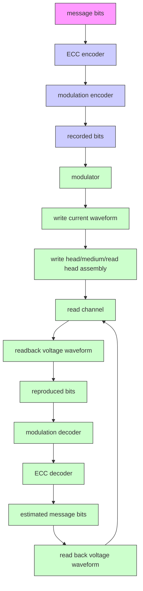
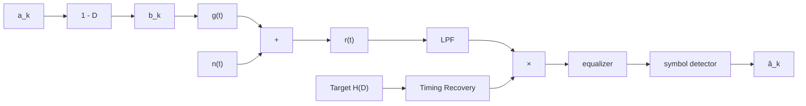
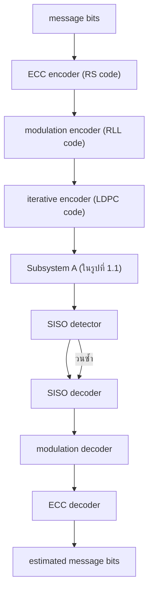
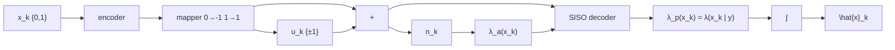

# 第一章

# 引言

本章将介绍用于表示硬盘驱动器中磁记录系统的读信道 (read channel) [1] 的数学模型，使读者了解硬盘驱动器的信号处理系统，为后续章节的学习奠定基础。此外，还将解释在硬盘驱动器信号处理系统中使用迭代解码技术 (iterative decoding) [2–5] 的概念和基本原理，使读者理解迭代解码技术的优势——该技术已开始应用于新型硬盘驱动器 [6] 中，因为它能显著提升系统性能。

# 1.1 数字数据存储系统

硬盘驱动器中的数字数据存储系统 (digital data storage system) 可用图 1.1 [1, 5, 7] 所示的框图进行建模。信息位 (message bits) 被送入纠错编码器 (ECC encoder)。RS (Reed-Solomon) 码 [2, 8] 是硬盘驱动器中常用的码。然后，编码后的数据再次通过调制编码器 (modulation encoder) 进行编码，以调整数据特性使其适合硬盘驱动器的信道。常用的调制码是 RLL (run-length limited) 码 [5, 9]。调制编码器的输出数据就是要写入存储介质的数据，称为"记录位 (recorded bit)"。之后，记录位被送入调制器 (modulator)，将数据位转换为写电流波形 (write current waveform)，再送入写磁头将数据写入存储介质。


<details>
<summary>flowchart</summary>


</details>

1.2
图 1.1 硬盘驱动器数字数据存储系统框图 [9, 10]

在读取过程中，读磁头 (read head) 从存储介质读取数据。当读磁头移动到磁化状态发生变化的区域时，会产生电压波形信号，通常称为"回读信号 (readback signal)"。然后，回读信号被送入读信道进行处理，读信道由以下组件组成：低通滤波器 (LPF: low-pass filter)、采样器 (sampler 或模数转换器)、均衡器 (equalizer) 和符号检测器 (symbol detector) 等。输出的数据随后依次通过调制解码器 (modulation decoder) 和纠错解码器 (ECC decoder) 进行解码，以得到所需信息位的估计值。

# 1.2 硬盘驱动器的信道模型

图 1.1 中的子系统 A (System A) 可以用图 1.2 [1, 10] 所示的数学模型来表示。当二进制输入数据序列 $a_k \in \{0, 1\}$（比特周期为 $T$ 单位时间）通过一个理想微分器 (ideal differentiator)（其多项式形式为 $1 - D$，其中 $D$ 是 $T$ 单位时间的延迟算子）时，得到转换序列 (transition sequence) $b_k \in \{-1, 0, 1\}$，其中 $b_k = \pm 1$ 表示正或负的转换 (positive or negative transition)，$b_k = 0$ 表示无转换 (no transition)。然后，转换序列 $b_k$ 被送入冲激响应等于转换脉冲信号 $g(t)$ 的信道，并受到噪声 $n(t)$ 的干扰，得到回读信号 $r(t)$，其数学表达式为


<details>
<summary>flowchart</summary>


</details>

图 1.2 硬盘驱动器的信道模型

$$
r(t) = \sum_{k} b_k \, g(t - kT) + n(t) \tag{1.1}
$$

然后，在接收端，回读信号 $r(t)$ 通过低通滤波器 (LPF) 以滤除带外噪声，并在由定时恢复电路 (timing recovery) [10] 控制的时间点进行采样。采样器的输出数据被送入均衡器和符号检测器，以寻找最可能的输入数据序列 $\hat{a}_k$（即 $a_k$ 的估计值）。

对于水平记录系统 (longitudinal recording)，转换脉冲信号（通常称为洛伦兹脉冲 (Lorentzian pulse)）的方程为 [11]

$$
g(t) = \frac{1}{1 + \left(2t / \mathrm{PW}_{50}\right)^2} \tag{1.2}
$$

其中 $\mathrm{PW}_{50}$ 是脉冲信号 $g(t)$ 在半峰高度处测得的脉冲宽度。而对于垂直记录系统 (perpendicular recording)，转换脉冲信号的方程为 [12]

$$
g(t) = \operatorname{erf}\left(\frac{2t \sqrt{\ln 2}}{\mathrm{PW}_{50}}\right) \tag{1.3}
$$

其中 $\ln(\cdot)$ 是自然对数 (natural logarithm)，$\mathrm{PW}_{50}$ 是脉冲信号 $g'(t)$（即 $g(t)$ 的导数）在半峰高度处测得的脉冲宽度，而 $\operatorname{erf}(\cdot)$ 是误差函数 (error function)，定义为


<details>
<summary>line</summary>

| t/T | ND = 2 | ND = 2.5 | ND = 3 |
|-----|--------|----------|--------|
| -5.0 | 0.05 | 0.06 | 0.07 |

图 1.4 显示了水平记录 (a) 和垂直记录 (b) 的脉冲响应。该脉冲响应被视为代表硬盘驱动器数据记录系统的"信道 (channel)"。

在磁记录系统中，常用的符号检测器是维特比检测器 (Viterbi detector) [10, 13]。由于维特比检测器的复杂度随信道记忆长度 (channel memory) 呈指数增长，因此均衡器是必不可少的——它用于将整个系统的总响应整形为所需的"目标响应 (target response)" $H(D)$ [10, 11, 14]，从而降低维特比检测器的复杂度。在实际应用中，该目标通常称为"部分响应目标"或 PR (partial response) 目标。水平记录系统中公认的 PR 目标方程为 [11]

$$
H(D) = (1 - D)(1 + D)^n \tag{1.7}
$$

而垂直记录系统的 PR 目标方程为 [14, 15]

$$
H(D) = (1 + D)^n \tag{1.8}
$$

其中 $n$ 为正整数。


<details>
<summary>line</summary>

| x    | Channel response (ND = 2) | Channel response (ND = 2.5) | PR4 [1 0-1] (n = 1) | EPR4 [1 1-1-1] (n = 2) | EEPR4 [1 2 0-2 1] (n = 3) |
| ---- | ------------------------- | --------------------------- | --------------------- | ------------------------ | --------------------------- |
| 0.00 | 0.00                      | 0.00                        | 0.00                  | 0.00                     | 0.00                        |
| 0.05 | 0.80                      | 0.90                        | 0.70                  | 0.60                     | 0.50                        |
| 0.10 | 0.95                      | 0.98                        | 0.85                  | 0.75                     | 0.65                        |
| 0.15 | 0.98                      | 0.99                        | 0.90                  | 0.85                     | 0.75                        |
| 0.20 | 0.99                      | 0.99                        | 0.95                  | 0.90                     | 0.80                        |
| 0.25 | 0.98                      | 0.98                        | 0.98                  | 0.95                     | 0.85                        |
| 0.30 | 0.95                      | 0.95                        | 0.95                  | 0.90                     | 0.90                        |
| 0.35 | 0.90                      | 0.90                        | 0.90                  | 0.85                     | 0.85                        |
| 0.40 | 0.80                      | 0.80                        | 0.80                  | 0.75                     | 0.75                        |
| 0.45 | 0.70                      | 0.70                        | 0.70                  | 0.65                     | 0.65                        |
| 0.50 | 0.60                      | 0.60                        | 0.60                  | 0.55                     | 0.55                        |
</details>

(a) 归一化频率 (fT)


<details>
<summary>line</summary>

| n    | Channel response (ND = 2) | Channel response (ND = 2.5) | PR2 [1 2 1] (n = 2) | EPR2 [1 3 3 1] (n = 3) | EEPR2 [1 4 6 4 1] (n = 4) |
| ---- | ------------------------- | --------------------------- | --------------------- | ------------------------ | --------------------------- |
| 0.00 | 1.0000                    | 1.0000                      | 1.0000                | 1.0000                   | 1.0000                      |
| 0.05 | 0.9500                    | 0.9400                      | 0.9600                | 0.9300                   | 0.9200                      |
| 0.10 | 0.8500                    | 0.8200                      | 0.8800                | 0.8400                   | 0.8100                      |
| 0.15 | 0.7500                    | 0.7000                      | 0.8000                | 0.7500                   | 0.7000                      |
| 0.20 | 0.6500                    | 0.6000                      | 0.7200                | 0.6800                   | 0.6200                      |
| 0.25 | 0.5500                    | 0.5000                      | 0.6500                | 0.6000                   | 0.5500                      |
| 0.30 | 0.4500                    | 0.4000                      | 0.5800                | 0.5200                   | 0.4800                      |
| 0.35 | 0.3500                    | 0.3000                      | 0.5000                | 0.4500                   | 0.4000                      |
| 0.40 | 0.2500                    | 0.2000                      | 0.4200                | 0.3800                   | 0.3200                      |
| 0.45 | 0.1500                    | 0.1000                      | 0.3500                | 0.3000                   | 0.2500                      |
| 0.50 | 0.0500                    | 0.0000                      | 0.2800                | 0.2200                   | 0.1800                      |
</details>

(b) 归一化频率 (fT)
图 1.5 各种目标的频率响应——(a) 水平记录信道，(b) 垂直记录信道

图 1.5 比较了各种目标的频率响应 (frequency response)。信道的频率响应是脉冲信号 [1] 在方程 (1.6) 中的傅里叶变换 (Fourier transform)。方括号 [.] 内的数字表示目标各抽头的系数。例如：

- PR4 [1 0 –1] 表示 PR4 (PR class-IV) 目标，其 D 域 [1] 传递函数为 $H(D) = 1 - D^2$
- EEPR2 [1 4 6 4 1] 表示 EEPR2 目标，其 D 域传递函数为 $H(D) = 1 + 4D + 6D^2 + 4D^3 + D^4$

从图 1.5 可以看出，当信道的 ND 值增大时，所使用的目标应具有更多的抽头（更大的 $n$ 值），以使目标的响应尽可能地接近信道的实际响应，从而使维特比检测器更有效地工作（详见 [10] 第 3 章）。

此外，从方程 (1.7) 和 (1.8) 可以看出，所有 PR 型目标的系数都是整数。然而，如果使用系数为实数的目标（称为"广义部分响应目标"或 GPR (generalized partial response target)），系统整体性能会比使用 PR 目标更好。感兴趣的读者可以在 [10, 14, 15] 中学习针对硬盘驱动器信道的均衡器和目标设计技术。


<details>
<summary>flowchart</summary>

```mermaid
graph LR
    A["a_k"] --> B["H(D)"]
    B --> C["s_k"]
    C --> D["q(t)"]
    D --> E["+"]
    E --> F["r(t)"]
    F --> G["LPF"]
    G --> H["×"]
    H --> I["symbol detector"]
    I --> J["â_k"]
    J --> K["timing recovery"]
    K --> H
    E -->|w(t)| D
```
</details>

图 1.6 理想信道模型

# 1.3 理想信道模型

图 1.2 中的信道模型被视为"实际信道模型 (realistic channel model)"，因为其工作特性接近包含硬盘驱动器读信道架构中重要组件的实际系统 [1]。本节将介绍"理想信道模型 (ideal channel model)"，该模型常用于研究和分析硬盘驱动器信号处理系统的基本工作原理，因为它不复杂且易于理解。

因此，如果假设系统具有完美的均衡过程 (perfect equalization)，则图 1.2 中的模型可以简化为图 1.6 所示的理想信道模型。二进制输入数据序列 $a_k$（比特周期为 $T$）被送入信道 $H(D) = \sum_i h_i D^i$，其中 $h_i$ 是信道的第 $i$ 个系数。该信号与理想奈奎斯特脉冲 (ideal Nyquist pulse) $q(t) = \sin(\pi t/T) / (\pi t/T)$ [16] 进行调制，并受到噪声 $w(t)$ 的干扰，得到回读信号

$$
r(t) = \sum_{k} s_k \, q(t - kT) + w(t) \tag{1.9}
$$

其中 $s_k = a_k * h_k$ 是信道的输出数据，$*$ 是卷积算子 (convolution operator)。然后，在接收端，回读信号 $r(t)$ 通过低通滤波器后，在由定时恢复电路控制的时间点进行采样，采样器的输出数据被送入符号检测器以寻找最可能的输入数据序列。

# 1.4 迭代解码

图 1.2 中的信道模型是"未编码系统 (uncoded system)"的模型。然而，实际应用中使用的接收端同时使用均衡 (equalization) 来处理信道失真 (distortion)，以及纠错编码 (error correction coding) 来处理由信道引起的错误。通常，使用 ECC 码的系统称为"编码系统 (coded system)"。

实际的硬盘驱动器信号处理系统（见图 1.1）也使用纠错码（使用 RS 码，因为它能纠正多个连续比特错误）。也就是说，信息位被送入纠错编码器和调制编码器，得到图 1.2 中的输入数据序列 $a_k$。然后，在接收端，图 1.2 中检测到的输入数据序列 $\hat{a}_k$ 被送入调制解码器和 ECC 解码器，得到信息位的估计值以供使用。这种硬盘驱动器信号处理系统的运行方式从过去到现在一直使用，被称为单向处理 (one-way processing)——即符号检测器独立于 ECC 解码器工作。

然而，研究 [2–5] 表明，"迭代解码 (iterative decoding)"——即符号检测器和 ECC 解码器之间的协作——可以显著提高系统整体性能。使用迭代信号处理系统的硬盘驱动器结构如图 1.7 所示，其中在系统中增加了迭代编码器 (iterative encoder) 和 SISO (soft-input soft-output) 解码器。此外，子系统 A 中使用的符号检测器必须从维特比检测器改为 SISO 检测器。而迭代编码器是纠错编码器的一种，通常使用 LDPC 码 (low-density parity-check code) [17]，因为它是性能最优的 ECC 码 [2, 5]（关于 LDPC 码的详细信息可参见第 4 章）。

如今，新一代硬盘驱动器已经采用了迭代解码技术（如图 1.7 所示），其中 SISO 检测器和 SISO 解码器之间会交换软信息 (soft information) [2]。用于迭代解码的 SISO 检测器可由 BCJR 算法 [18] 或 SOVA (soft-output Viterbi algorithm) [19] 实现（详细信息可参见第 2-3 章）。而用于解码 LDPC 编码数据的 SISO 解码器则由消息传递算法 (message passing algorithm) [17] 实现（详细信息可参见第 4.4.4 节）。


<details>
<summary>flowchart</summary>


</details>

图 1.7 硬盘驱动器迭代信号处理系统的框图

迭代解码技术的工作流程如下：SISO 检测器对所接收的数据进行检测，然后将结果（软信息）发送给 SISO 解码器。随后，SISO 解码器将解码结果送回 SISO 检测器，用于新一轮的检测。这个过程一直持续到达到指定的迭代次数后，SISO 解码器才将输出数据发送给调制解码器和 RS 解码器进行后续解码。

注：从图 1.7 中可以看出，系统中同时使用了 RS 码和 LDPC 码。然而，实际应用中发现 [20]，当使用 LDPC 码进行迭代解码时，可能不再需要 RS 码。因此，用户可以选择同时使用 RS 码和 LDPC 码，或者仅使用 LDPC 码，两者仍能提供相近的性能。

# 1.5 基本概念和重要术语

本节将解释与迭代解码相关的基本概念和重要术语，以使读者在学习第 2-4 章之前理解这些术语的含义。

# 1.5.1 硬判决与软判决

在数字通信系统的接收端，检测器和解码器可以选择使用硬判决 (hard decision) 和软判决 (soft decision)。

**硬判决**是从检测器或解码器中获取数据位或符号的估计值，其结果称为"硬信息 (hard information)"。例如，如果检测器接收到的数据值为 0.9，则可以判定发送端发送的数据位为 1。

**软判决**是根据接收端拥有的所有信息，获取数据位或符号的可靠性 (reliability) 度量，其结果称为"软信息 (soft information)"。例如，如果解码器输出的软信息值很大，则说明该解码器获得的数据位或符号估计值具有较高的可靠性或正确的可能性很高。

对于二进制通信系统，数据位的可靠性由"对数似然比 (LLR: log-likelihood ratio)"衡量。即，设 $x \in \{0, 1\}$ 为二进制随机变量，则 $x$ 的 LLR 定义为

$$
\lambda(x) = \ln\left(\frac{p(x=1)}{p(x=0)}\right) \tag{1.10}
$$

其中 $\ln(\cdot)$ 是自然对数 (natural logarithm)，$p(x)$ 是 $x$ 的概率密度函数 (pdf: probability density function)。此外，$|\lambda(x)|$ 是软信息或数据位 $x$ 的可靠性值，而 $\lambda(x)$ 的符号则是硬信息或数据位 $x$ 的估计值，即

$$
\hat{x} = \begin{cases} 1, & \text{if } \lambda(x) \geq 0 \\ 0, & \text{if } \lambda(x) < 0 \end{cases} \tag{1.11}
$$

# 1.5.2 对数似然比

对数似然比 (LLR) 是在迭代解码过程中各种算法（如 BCJR 算法、SOVA 和 LDPC 等）中广泛使用的度量 (metric) 或信息度量。本书使用符号 $\lambda(x)$ 表示数据位 $x \in \{0, 1\}$ 的 LLR 值，即方程 (1.10) 所定义的位置 1 和位置 0 的概率之比的自然对数。


<details>
<summary>line</summary>

| p(a = +1) | Log-likelihood ratio (LLR) |
|-----------|----------------------------|
| 0.0       | -6.0                       |
| 0.1       | -2.0                       |
| 0.2       | -1.0                       |
| 0.3       | -0.5                       |
| 0.4       | 0.0                        |
| 0.5       | 0.5                        |
| 0.6       | 1.0                        |
| 0.7       | 1.5                        |
| 0.8       | 2.0                        |
| 0.9       | 3.0                        |
| 1.0       | 7.0                        |
</details>

图 1.8 数据位 a 的 LLR 值与概率 p(a = +1) 的关系

对于使用双极性二进制输入数据的通信系统，即 $a \in \{-1, 1\}$ 时，LLR 定义为

$$
\lambda(a) = \ln\left(\frac{p(a=+1)}{p(a=-1)}\right) \tag{1.12}
$$

这种形式在解码算法 (decoding algorithm) 中最为常用，因为 $\lambda(a)$ 的符号可以直接用作数据位 $a$ 的估计值（即硬信息）。同样，$|\lambda(a)|$ 的大小用于表示数据位 $a$ 的可靠性（即软信息）。图 1.8 显示了数据位 $a$ 的 LLR 值与概率 $p(a=+1)$ 的关系。当 $p(a=+1) > 0.5$ 时，$\lambda(a)$ 为正值，即数据位 $a$ 更可能是位 1 而非位 -1；当 $p(a=+1) < 0.5$ 时，$\lambda(a)$ 为负值，即数据位 $a$ 更可能是位 -1 而非位 1。此外，如果 $p(a=+1) = 0.5$，则 $\lambda(a) = 0$，这意味着数据位 $a$ 成为位 1 和位 -1 的概率相等。

由于 $p(a=+1) = 1 - p(a=-1)$，方程 (1.12) 可以重新排列为

$$
e^{\lambda(a)} = \frac{p(a=+1)}{1 - p(a=+1)} \tag{1.13}
$$

以及

$$
p(a=+1) = \frac{e^{\lambda(a)}}{1 + e^{\lambda(a)}} = \frac{1}{1 + e^{-\lambda(a)}} = \frac{e^{\lambda(a)/2}}{e^{\lambda(a)/2} + e^{-\lambda(a)/2}} \tag{1.14}
$$

$$
p(a=-1) = \frac{e^{-\lambda(a)}}{1 + e^{-\lambda(a)}} = \frac{1}{1 + e^{+\lambda(a)}} = \frac{e^{-\lambda(a)/2}}{e^{-\lambda(a)/2} + e^{\lambda(a)/2}} \tag{1.15}
$$

# 1.5.3 信道的软输出信息

考虑一个二进制通信系统。数据位 $x \in \{0, 1\}$ 被送入映射器 (mapper) 转换为数据位 $u \in \{-1, 1\}$，然后通过无记忆信道传输，使得接收端收到的信号为 $y = u + n$，其中 $n$ 是均值为零、方差为 $\sigma^2$ 的加性高斯白噪声 (AWGN: additive white Gaussian noise)。

定义条件概率密度函数 (conditional probability density function) $p(y \mid x)$，即给定 $x$ 时随机变量 $y$ 的概率密度函数。反之，给定 $y$ 时，作为变量 $x$ 的函数的 $p(y \mid x)$ 被称为"似然函数 (likelihood function)" [4]。

在实际应用中，在接收端收到数据 $y$ 之前，$x$ 的先验概率 (a priori probability) 为 $p(x=1)$ 和 $p(x=0)$。然而，在接收端收到数据 $y$ 之后，概率 $p(x=1 \mid y)$ 和 $p(x=0 \mid y)$ 变为后验概率 (APP: a posteriori probability)。根据贝叶斯定理 (Bayes' rule)，有

$$
\begin{aligned}
p(x=i \mid y) &= p(x=i; y) / p(y) \\
&= p(y \mid x=i) \, p(x=i) / p(y) \tag{1.17}
\end{aligned}
$$

其中 $i \in \{0, 1\}$，$p(a; b)$ 是随机变量 $a$ 和 $b$ 的联合概率密度函数 (joint pdf)。因此，在给定 $y$ 的条件下，数据位 $x$ 的 LLR 定义为

$$
\lambda(x \mid y) = \ln\left(\frac{p(x=1 \mid y)}{p(x=0 \mid y)}\right) \tag{1.18}
$$

根据贝叶斯定理，可得

$$
\begin{aligned}
\ln\left(\frac{p(x=1 \mid y)}{p(x=0 \mid y)}\right) &= \ln\left(\frac{p(y \mid x=1)}{p(y \mid x=0)}\right) + \ln\left(\frac{p(x=1)}{p(x=0)}\right) \\
&= L_c \, y + \lambda(x) \tag{1.19}
\end{aligned}
$$

其中 $L_c$ 是信道的软输出信息，即与从数据 $y$ 中获得的数据位 $x$ 相对应的软信息；而 $\lambda(x)$ 称为"先验信息 (a priori information)"，即接收端在收到数据 $y$ 之前关于数据位 $x$ 的信息。在接收端没有先验信息的情况下，设 $\lambda(x) = 0$。

一般来说，方程 (1.19) 中的 $L_c$ 称为信道可靠性 (channel reliability)，取决于信道的特性。例如，当 $n_k$ 为 AWGN 噪声时，有

$$
\begin{aligned}
\ln\left(\frac{p(y \mid x=1)}{p(y \mid x=0)}\right) &\equiv \ln\left(\frac{p(y \mid u=+1)}{p(y \mid u=-1)}\right) \\
&= \ln\left(\frac{\exp\left(-\frac{1}{2\sigma^2}(y-1)^2\right)}{\exp\left(-\frac{1}{2\sigma^2}(y+1)^2\right)}\right) = \frac{2}{\sigma^2} y \tag{1.20}
\end{aligned}
$$

即 $L_c = 2 / \sigma^2$。

# 1.5.4 SISO 解码器

SISO (soft-input soft-output) 解码器是一种处理软信息的解码器，它接收作为软信息的输入数据进行处理，并输出软信息。


<details>
<summary>flowchart</summary>


</details>

图 1.9 使用 SISO 解码器的数字通信系统

考虑图 1.9 中的通信系统。数据序列 $x_k \in \{0, 1\}$ 被送入编码器 (encoder) 和映射器 (mapper)，得到数据序列 $u_k \in \{-1, 1\}$。然后，SISO 解码器对信号 $y_k = u_k + n_k$（其中 $n_k$ 是 AWGN 噪声）进行解码，并借助序列 $\lambda_a(x_k)$ 的帮助，其中 $\lambda_a(x_k)$ 是数据位 $x_k$ 的先验 LLR (a priori LLR)，即

$$
\lambda_a(x_k) = \ln\left(\frac{p(x_k=1)}{p(x_k=0)}\right) \tag{1.21}
$$

这表示在接收端收到整个数据序列 $y$ 或数据 $y_k$ 之前关于数据位 $x_k$ 的信息（即独立于 $y$）。同样，如果接收端没有先验信息，则设 $\lambda_a(x_k) = 0$ 对于所有 $k$，这意味着每个数据位 $x_k$ 出现的概率相等。

随后，SISO 解码器输出数据位 $x_k$ 的后验 LLR (a posteriori LLR)，即

$$
\lambda_p(x_k) = \ln\left(\frac{p(x_k=1 \mid \mathbf{y})}{p(x_k=0 \mid \mathbf{y})}\right) \tag{1.22}
$$

数据位 $x_k$ 的估计值可以通过将 $\lambda_p(x_k)$ 送入阈值检测器 (threshold detector) 获得，其关系如下

$$
\hat{x}_k = \begin{cases} 1, & \text{if } \lambda_p(x_k) \geq 0 \\ 0, & \text{if } \lambda_p(x_k) < 0 \end{cases} \tag{1.23}
$$

注：对于数据位 $x$ 的 LLR 值 $\lambda(x)$，本书定义如下：

- 如果 LLR 的下标为 $a$，如 $\lambda_a(x)$，则表示数据位 $x$ 的先验 LLR (a priori LLR)
- 如果 LLR 的下标为 $p$，如 $\lambda_p(x)$，则表示数据位 $x$ 的后验 LLR (a posteriori LLR)

# 1.6 章末小结

本章介绍了用于表示磁记录系统的读信道模型（包括图 1.2 中的实际信道模型和图 1.6 中的理想信道模型），以便读者能够将这些模型应用于硬盘驱动器信号处理系统的分析。

由于市场上销售的新一代硬盘驱动器使用迭代解码技术 (iterative decoding)，因为其能显著提高系统性能，因此本章解释了迭代解码技术的概念和基本原理，以及 SISO、先验概率、后验概率、软信息和对数似然比 (LLR) 等术语的含义，为读者后续学习第 2-4 章中 SISO 检测器和 SISO 解码器的工作原理做好准备。

# 1.7 章末习题

1. 请解释图 1.1 中硬盘驱动器数字数据存储系统的工作原理。

2. 请使用 SCILAB 程序绘制以下图形 (http://home.npru.ac.th/piya/webscilab 或 http://www.scilab.org)：
   2.1) 在不同 ND 值下的转换脉冲信号，如图 1.3 所示
   2.2) 在不同 ND 值下的脉冲响应，如图 1.4 所示

3. 请证明：水平记录系统中脉冲响应 $m(t)$（方程 (1.6)）的傅里叶变换等于

$$
M(\Omega) = \exp\{-\pi |\Omega| \mathrm{ND}\} \left(1 - \exp\{-j 2\pi \Omega\}\right)
$$

而垂直记录系统的傅里叶变换等于

$$
M(\Omega) = \frac{T}{j\pi\Omega} \exp\left\{-\frac{\pi^2 \Omega^2 \mathrm{ND}^2}{\ln(16)}\right\} (1 - \exp\{-j 2\pi\Omega\})
$$

其中 $\exp\{\cdot\}$ 是指数函数，$\Omega = fT$ 是归一化频率 (normalized frequency)，$f$ 是以赫兹为单位的频率，$|x|$ 是 $x$ 的绝对值，$j = \sqrt{-1}$。

4. 根据第 3 题中脉冲响应的傅里叶变换结果，请使用 SCILAB 程序绘制在不同 ND 值下信道的频率响应，如图 1.5 所示。

5. 请解释图 1.2 中的实际信道模型与图 1.6 中的理想信道模型之间的区别。

6. 请解释图 1.7 中硬盘驱动器迭代信号处理系统的工作原理。

7. 请解释软信息 (soft information) 的含义。

8. 请解释对数似然比 (LLR: log-likelihood ratio) 的含义。

9. 请解释先验 LLR 值和后验 LLR 值的含义。
