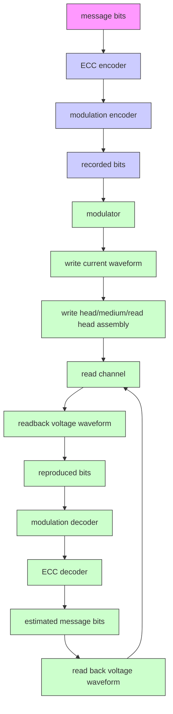

# 第一章

# 引言

本章将介绍用于表示硬盘驱动器中磁记录系统的读信道 (read channel) [1] 的数学模型，使读者了解硬盘驱动器的信号处理系统，为后续章节的学习奠定基础。此外，还将解释在硬盘驱动器信号处理系统中使用迭代解码技术 (iterative decoding) [2–5] 的概念和基本原理，使读者理解迭代解码技术的优势——该技术已开始应用于新型硬盘驱动器 [6] 中，因为它能显著提升系统性能。

# 1.1 数字数据存储系统

硬盘驱动器中的数字数据存储系统 (digital data storage system) 可用图 1.1 [1, 5, 7] 所示的框图进行建模。信息位 (message bits) 被送入纠错编码器 (ECC encoder)。RS (Reed-Solomon) 码 [2, 8] 是硬盘驱动器中常用的码。然后，编码后的数据再次通过调制编码器 (modulation encoder) 进行编码，以调整数据特性使其适合硬盘驱动器的信道。常用的调制码是 RLL (run-length limited) 码 [5, 9]。调制编码器的输出数据就是要写入存储介质的数据，称为"记录位 (recorded bit)"。之后，记录位被送入调制器 (modulator)，将数据位转换为写电流波形 (write current waveform)，再送入写磁头将数据写入存储介质。

flowchart

1.2
图 1.1 硬盘驱动器数字数据存储系统框图 [9, 10]

在读取过程中，读磁头 (read head) 从存储介质读取数据。当读磁头移动到磁化状态发生变化的区域时，会产生电压波形信号，通常称为"回读信号 (readback signal)"。然后，回读信号被送入读信道进行处理，读信道由以下组件组成：低通滤波器 (LPF: low-pass filter)、采样器 (sampler 或模数转换器)、均衡器 (equalizer) 和符号检测器 (symbol detector) 等。输出的数据随后依次通过调制解码器 (modulation decoder) 和纠错解码器 (ECC decoder) 进行解码，以得到所需信息位的估计值。
