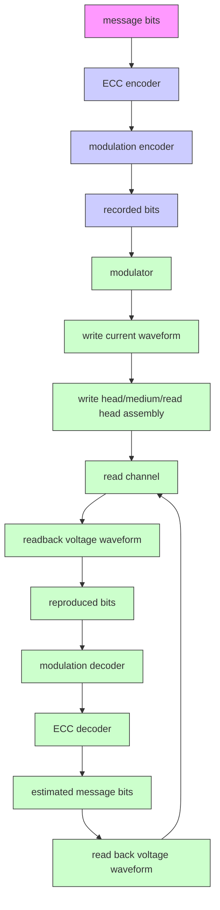

本书适用于具有硬盘驱动器信号处理基础知识的读者。本书是《数字存储信号处理》第一卷（读写信道基础）和第二卷（接收机电路设计）的延续。因此，作者建议读者在阅读本书之前，先学习并理解前两卷的内容，以便更快速地掌握本书中的各项内容。本书将详细阐述硬盘驱动器中采用的迭代解码技术，以及BPMR和HAMR技术，旨在以易于理解的方式供读者自学。

本书基于作者在硬盘信号处理领域的科研经验编写。作者于2001年开始在米国佐治亚理工学院（Georgia Institute of Technology）攻读博士学位。此外，作者还在美国匹兹堡的希捷研究中心（Seagate Research Center）工作了一年。本书分为两部分：第一部分介绍新一代硬盘驱动器中开始采用的迭代解码技术，首先阐述当前采用的垂直磁记录（PMR）系统的运作原理；第二章讲解迭代解码技术的基础Turbo码和用于新一代硬盘驱动器的Turbo均衡器，其中涉及软检测器与LDPC解码器之间的软信息交换；第三章和第四章将分别详细探讨软检测器和LDPC解码器的工作原理；第五章将举例说明如何将迭代解码技术应用于解决硬盘信号处理系统中的定时恢复（Timing Recovery）和热粗糙度（Thermal Asperity）问题。第二部分涉及未来将取代当前垂直记录技术的先进磁记录技术，其中第六章介绍BPMR技术基础，第七章详细讲解BPMR系统中的目标响应（Target Response）和均衡器的设计。

本书的完成离不开许多人的帮助与鼓励。作者衷心感谢在学习期间提供知识、指导和建议的所有老师，特别是 Prof. John R. Barry 和 Prof. Steven W. McLaughlin，以及希捷研究中心的 Dr. Erozan M. Kurtas, Dr. M. Fatih Erden, 和 Dr. Inci Ozgunes，感谢他们给我机会从事硬盘信号处理的研究。同时，作者永远不会忘记家人，尤其是 พญ.ศิรสุดา โควินท์ทวีวัฒน์。此外，感谢国家科学技术发展局（NSTDA）、国家电子和计算机技术中心（NECTEC）、硬盘驱动器研究所、硬盘组件联合研究中心、国家研究委员会以及 lนครปฐม 皇家大学（Nakhon Pathom Rajabhat University）在本书撰写期间提供的支持与便利。感谢来自国王蒙库特科技大学北都校区工程学院的博士生 Santi Kunkarnkhai 和 Adisorn Kaewphakdee 协助校对本书。

最后，作者尽最大努力使本书易于自学，以便读者能快速高效地掌握内容。若书中存在任何不足之处，恳请读者将宝贵意见和建议发送至电子邮箱 piyล@nprน.ac.th，以便作者在下次印刷时进行改进。有关本书的更多信息，请访问网站 http://home.npru.ac.th/piya

副教授 Piya Kovinthaveewat 博士
 Nakhon Pathom 皇家大学
2011年8月

# 第一章
# 引言

本章将介绍用于代表硬盘驱动器中磁记录系统 (magnetic recording system) 的读信道 (read channel) [1] 的数学模型，使读者能够了解硬盘驱动器的信号处理系统，这为后续章节的学习奠定了基础。此外，本章还将阐述在硬盘驱动器信号处理系统中应用迭代解码 (iterative decoding) 技术 [2-5] 的概念和基础，使读者理解迭代解码技术的优势，该技术已在新型硬盘驱动器中实际采用 [6]，能够显著提高系统性能。

# 1.1 数字数据存储系统

硬盘驱动器中的数字数据存储系统 (digital data storage system) 可以通过图 1.1 [1, 5, 7] 的框图来模拟。当信息位 (message bits) 被发送到纠错编码器 (ECC encoder) 时，通常采用硬盘驱动器中常用的 RS (Reed Solomon) 码 [2, 8]。随后，编码后的数据将再次通过调制编码器 (modulation encoder) 进行编码，以调整数据的特性，使其适应硬盘驱动器的信道。常用的调制码是 RLL (run-length limited code) [5, 9]。调制编码器的输出数据被认为是将要写入存储介质的数据，称为“记录位 (recorded bit)”。之后，记录位将被发送至调制器 (modulator)，将数据位转换为写电流波形 (write current waveform)，然后输入到写头中将数据写入存储介质。

flowchart

图 1.1 硬盘驱动器数字数据存储系统的框图 [9, 10]

对于读取过程，读头 (read head) 从存储介质中读取数据。当读头移动到磁化状态 (magnetization) 发生变化的区域时，会产生一个通常被称为“读回信号 (readback signal)”的电压波形信号。随后，该读回信号被送入读信道进行处理，读信道由多个组件组成，例如：低通滤波器 (LPF: low-pass filter)、采样器 (sampler 或 analog-to-digital converter)、均衡器 (equalizer) 以及符号检测器 (symbol detector) 等。最后，输出数据将依次通过调制解码器 (modulation decoder) 和纠错解码器 (ECC decoder) 进行解码，以获得所需信息位的估计值。
