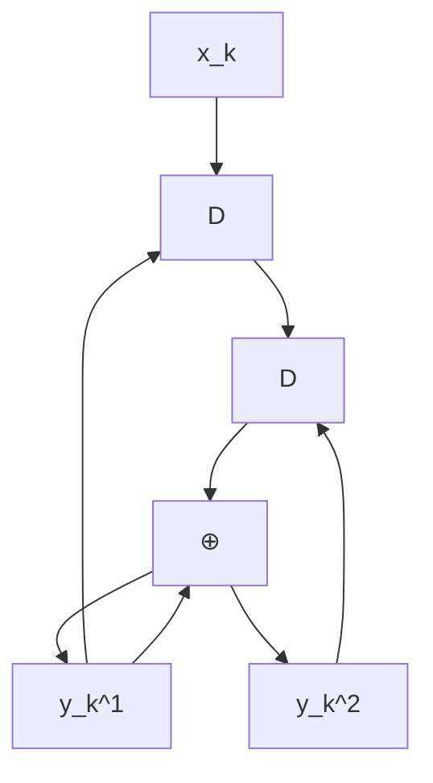
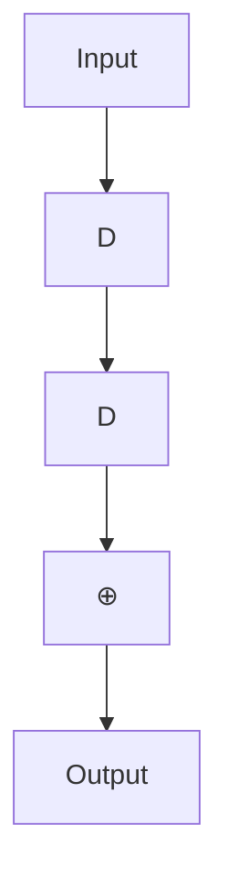
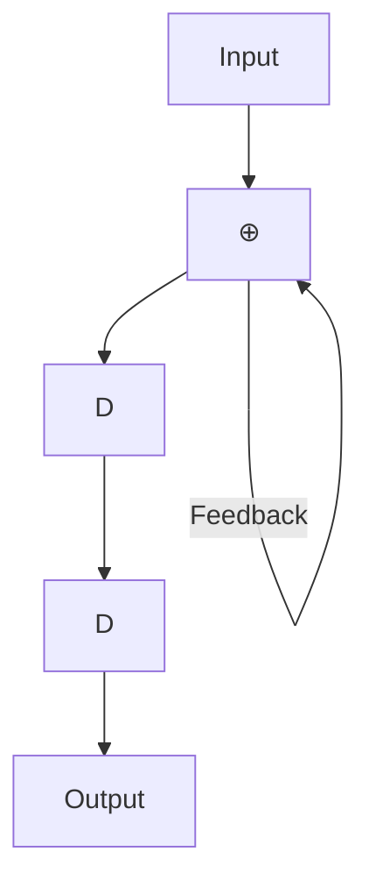
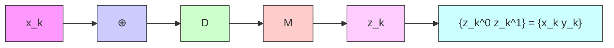
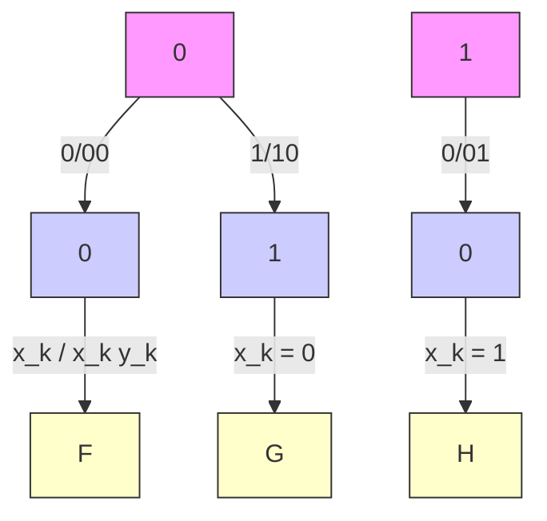
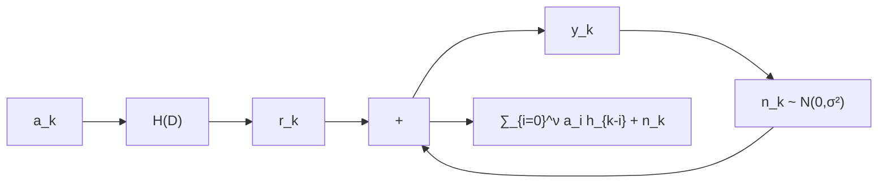

```mermaid
graph TD
    A["0/01"] -->|0/11| B["0/10"]
    B -->|0/10| C["1/10"]
    C -->|1/01| D["1/01"]
    D --> E["1/11"]
    E --> F["0/11"]
    F --> G["0/11"]
    G --> H["0/11"]
    H --> I["0/11"]
    I --> J["0/11"]
    J --> K["0/11"]
    K --> L["0/11"]
    L --> M["0/11"]
    M --> N["0/11"]
    N --> O["0/11"]
    O --> P["0/11"]
    P --> Q["0/11"]
    Q --> R["0/11"]
    R --> S["0/11"]
    S --> T["0/11"]
    T --> U["0/11"]
    U --> V["0/11"]
    V --> W["0/11"]
    W --> X["0/11"]
    X --> Y["0/11"]
    Y --> Z["0/11"]
    Z --> A["0/11"]
    A -->|1/11| B
    B -->|0/10| C
    C -->|1/10| D
    D -->|1/01| E
    E -->|1/11| F
    F -->|0/11| G
    G -->|0/11| H
    H -->|0/11| I
    I -->|0/11| J
    J -->|0/11| K
    K -->|0/11| L
    L -->|0/11| M
    M -->|0/11| N
    N -->|0/11| O
    O -->|0/11| P
    P -->|0/11| Q
    Q -->|0/11| R
    R -->|0/11| S
    S -->|0/11| T
    T -->|0/11| U
    U -->|0/11| V
    V -->|0/11| W
    W -->|0/11| X
    X -->|0/11| Y
    Y -->|0/11| Z
    Z -->|0/11| A
    style A fill:#f9f,stroke:#333
    style B fill:#f9f,stroke:#333
    style C fill:#f9f,stroke:#333
    style D fill:#f9f,stroke:#333
    style E fill:#f9f,stroke:#333
    style F fill:#f9f,stroke:#333
    style G fill:#f9f,stroke:#333
    style H fill:#f9f,stroke:#333
    style I fill:#f9f,stroke:#333
    style J fill:#f9f,stroke:#333
    style K fill:#f9f,stroke:#333
    style L fill:#f9f,stroke:#333
    style M fill:#f9f,stroke:#333
    style N fill:#f9f,stroke:#333
    style O fill:#f9f,stroke:#333
    style P fill:#f9f,stroke:#333
    style Q fill:#f9f,stroke:#333
    style R fill:#f9f,stroke:#333
    style S fill:#f9f,stroke:#333
    style T fill:#f9f,stroke:#333
    style U fill:#f9f,stroke:#333
    style V fill:#f9f,stroke:#333
    style W fill:#f9f,stroke:#333
    style X fill:#f9f,stroke:#333
    style Y fill:#f9f,stroke:#333
    style Z fill:#f9f,stroke:#333
```

```mermaid
graph TD
    A["Input"] --> B["π⁻¹"]
    B --> C["+"]
    C --> D["OUTER DECODER a priori"]
    D --> E["λ(xₖ)"]
    E --> F["001"]
    F --> G["1/1"]
    G --> H["101"]
    H --> I["1/0"]
    I --> J["110"]
    J --> K["0"]
    K --> L["0"]
    L --> M["0"]
    M --> N["2"]
    N --> O["2"]
    O --> P["0"]
    P --> Q["0"]
    Q --> R["10"]
    R --> S["1"]
    S --> T["1"]
    T --> U["1"]
    U --> V["1"]
    V --> W["1"]
    W --> X["1"]
    X --> Y["1"]
    Y --> Z["1"]
    Z --> AA["1"]
    AA --> AB["1"]
    AB --> AC["1"]
    AC --> AD["1"]
    AD --> AE["1"]
    AE --> AF["1"]
    AF --> AG["1"]
    AG --> AH["1"]
    AH --> AI["1"]
    AI --> AJ["1"]
    AJ --> AK["1"]
    AK --> AL["1"]
    AL --> AM["1"]
    AM --> AN["1"]
    AN --> AO["1"]
    AO --> AP["1"]
    AP --> AQ["1"]
    AQ --> AR["1"]
    AR --> AS["1"]
    AS --> AT["1"]
    AT --> AU["1"]
    AU --> AV["1"]
    AV --> AW["1"]
    AW --> AX["1"]
    AX --> AY["1"]
    AY --> AZ["1"]
    AZ --> BA["1"]
    BA --> BB["1"]
    BB --> BC["1"]
    BC --> BD["1"]
    BD --> BE["1"]
    BE --> BF["1"]
    BF --> BG["1"]
    BG --> BH["1"]
    BH --> BI["1"]
    BI --> BJ["1"]
    BJ --> BK["1"]
    BK --> BL["1"]
    BL --> BM["1"]
    BM --> BN["1"]
    BN --> BO["1"]
    BO --> BP["1"]
    BP --> BQ["1"]
    BQ --> BR["1"]
    BR --> BS["1"]
    BS --> BT["1"]
    BT --> BU["1"]
    BU --> BV["1"]
    BV --> BW["1"]
    BW --> BX["1"]
    BX --> BY["1"]
    BY --> BZ["1"]
    BZ --> CA["1"]
    CA --> CB["1"]
    CB --> CC["1"]
    CC --> CD["1"]
    CD --> CE["1"]
    CE --> CF["1"]
    CF --> CG["1"]
    CG --> CH["1"]
    CH --> CI["1"]
    CI --> CJ["1"]
    CJ --> CK["1"]
    CK --> CL["1"]
    CL --> CM["1"]
    CM --> CN["1"]
    CN --> CO["1"]
    CO --> CP["1"]
    CP --> CQ["1"]
    CQ --> CR["1"]
    CR --> CS["1"]
    CS --> CT["1"]
    CT --> CU["1"]
    CU --> CV["1"]
    CV --> CW["1"]
    CW --> CX["1"]
    CX --> CY["1"]
    CY --> CZ["1"]
    CZ --> DA["1"]
    DA --> DB["1"]
    DB --> DC["1"]
    DC --> DD["1"]
    DD --> DE["1"]
    DE --> DF["1"]
    DF --> DG["1"]
    DG --> DH["1"]
    DH --> DI["1"]
    DI --> DJ["1"]
    DJ --> DK["1"]
    DK --> DL["1"]
    DL --> DJ["1"]
    DJ --> DK["1"]
    DK --> DL["1"]
    DL --> DJ["1"]
    DJ --> DK["1"]
    DK --> DL["1"]
    DL --> DJ["1"]
    DJ --> DK["1"]
    DK --> DL["1"]
    DL --> DJ["1"]
    DJ --> DK["1"]
    DK --> LL["1"]
    LL --> DR["1"]
    DR --> DL["1"]
    DL --> DR["1"]
    DR --> DL["1"]
    DL --> DR["1"]
    DR --> DL["1"]
    DL --> DR["1"]
    DR --> DL["1"]
    DL --> DR["1"]
    DR --> DL["1"]
    DL --> DR["1"]
    DR --> DR["1"]
    DR --> DR["1"]
    DR --> DR["1"]
    DR --> DR["1"]
    DR --> DR["1"]
    DR --> DR["1"]
    DR --> DR["1"]
    DR --> DR["1"]
    DR --> DR["1"]
    DR --> DR["1"]
    DR --> DR["1"]
    DR --> DR["1"]
    DR --> DR["1"]
    DR --> DR["1"]
    DR --> DR["1"]
    DR --> Dr["1"]
    DR --> DR["1"]
    DR --> DR["1"]
    DR --> DR["1"]
    DR --> DR["1"]
    DR --> DR["1"]
    DR --> DR["1"]
    DR --> DR["1"]
    DR --> DR["1"]
    DR --> DR["1"]
    DR --> DR["1"]
    DR --> DR["1"]
    DR --> DR["1"]
    DR --> DR["1"]
    DR --> DR["2"]
    DR --> DR["2"]
    DR --> DR["2"]
    DR --> DR["2"]
    DR --> DR["2"]
    DR --> DR["2"]
    DR --> DR["2"]
    DR --> DR["2"]
    DR --> DR["2"]
    DR --> DR["2"]
    DR --> DR["2"]
    DR --> DR["2"]
    DR --> DR["2"]
    DR --> DR["2"]
    DR --> DR["2"]
    DR --> DR["2"]
```

# 第二章 Turbo 码

在不同的应用场景中，通常需要极高纠错能力的系统，这就要求编码和解码电路具有很高的复杂度。一种简单且有效的解决方案是采用级联编码 (concatenated coding)，即通过串行或并行地连接多个编码器，并借助交织器 (interleaver) 的帮助来实现。随后，编码后的数据将由相应的解码器依次进行解码。尽管这种方法的结果被认为是次优的 (sub-optimal)，但它在纠错能力与编解码过程的复杂度之间取得了良好的平衡。

迭代解码 (iterative decoding) 技术 [2, 3] 能够进一步降低系统的误比特率 (BER: bit-error rate)。Turbo 码 [3] 的解码就是迭代解码的一个典型例子，目前已广泛应用于移动电话和卫星通信系统等领域。此外，用于 Turbo 码解码的 Turbo 原理还可以应用于均衡过程，称为“Turbo 均衡 (turbo equalization)” [21]。这种迭代解码过程已在新型硬盘驱动器中实际采用 [6]，其性能优于以往不使用迭代解码技术的硬盘驱动器。

本章将首先介绍卷积码 (convolutional code) 和 BCJR 算法 [18]，它们是 Turbo 码的核心组成部分。这将帮助读者理解应用于硬盘驱动器信号处理系统的编码与迭代解码技术。

## 2.1 卷积码

纠错码，也称为前向纠错码 (FEC: forward error correction code)，常用于处理信道产生的噪声和错误。一般来说，纠错码可分为两大类：分组码 (block code) 和卷积码 (convolutional code) [2]。此外，还出现了一些基于迭代解码技术的新型 ECC 码，如 Turbo 码 [3] 和 LDPC 码 [17] 等，它们的性能比卷积码更接近香农信道容量 (Shannon's channel capacity)。在本节中，我们将简要介绍卷积码的工作原理，因为它是 Turbo 码的重要组成部分，具体内容将在 2.3 节中详细讨论。

### 2.1.1 编码

卷积编码器 (convolutional encoder) 使用移位寄存器 (shift register) 和模 2 加法器 (modulo-2 adder) 对数据进行编码。它将一组输入数据序列进行编码，并产生一组数量大于或等于输入序列的输出数据序列。如果卷积编码器将 1 位输入数据编码为 $n$ 位输出数据，则该卷积编码器的码率 (code rate) 为 $R = 1 / n$。图 2.1 展示了一个码率为 $R = 1 / 2$ 的卷积编码器示例。其中 $D$ 为单位延迟算子 (unit delay operator)，代表一个移位寄存器。在实践中，卷积编码器可用生成多项式 (generator polynomial) 来表示，其表达式为 [1]：

$$
G (D) = \sum_ {i = 0} ^ {\mu} g _ {i} D ^ {i} \tag {2.1}
$$

其中 $\mu$ 是卷积编码器的存储容量（即移位寄存器的数量），如果延迟 $i$ 个单位的输入数据位对当前输出数据位产生影响，则 $g_i = 1$。例如，图 2.1 (a) 中的卷积编码器具有如下生成多项式：

$$
G (D) = \left[ G _ {1} (D), G _ {2} (D) \right] = \left[ 1 \oplus D, 1 \oplus D ^ {2} \right] \tag {2.2}
$$


<details>
<summary>flowchart</summary>


</details>

(a)


<details>
<summary>flowchart</summary>


</details>

(b)


<details>
<summary>flowchart</summary>


</details>

(c)

图 2.1 (a) 卷积编码器，(b) 系统卷积编码器，以及 (c) 递归系统卷积编码器。

其中 $\oplus$ 为模 2 加法算子，$G_1(D)$ 是输出数据 $y_k^1$ 的生成多项式，$G_2(D)$ 是输出数据 $y_k^2$ 的生成多项式，且存储容量 $\mu = 2$。

此外，系统卷积编码器 (systematic convolutional encoder) 是一种特殊的卷积编码器，其其中一组输出数据与输入数据完全相同，如图 2.1 (b) 所示，其生成多项式为 $[1, 1 \oplus D^2]$。而带有反馈回路的系统卷积编码器被称为递归系统卷积编码器 (recursive systematic convolutional encoder)，如图 2.1 (c) 所示，其生成多项式为 $[1, 1 / (1 \oplus D^2)]$。通常，递归系统卷积编码器比其他类型的卷积编码器更受欢迎 [2]。

通常，卷积码的分析依赖于有限状态机 (FSM: finite state machine)，这是一种描述输入数据、初始状态、下一状态以及系统输出之间关系的模型（详见 [10] 第 4.3.1 节）。图 2.2 (左) 展示了图 2.1 (a) 卷积编码器的有限状态机，该编码器共有 $2^\mu = 4$ 个状态，分别为 00, 01, 10 和 11。箭头表示状态转移路径，箭头旁的 $x / y^1 y^2$ 分别代表输入位 $x$ 以及输出位 $y^1$ 和 $y^2$。此外，可以使用格图 (trellis diagram) 来描述卷积码在时间维度上的状态转移。图 2.2 (右) 展示了图 2.1 (a) 卷积编码器的格图。在第 $k$ 阶段的格图中，显示了编码器从时间 $k$ 的某个状态转移到时间 $k+1$ 的所有可能状态。箭头旁的数值即为有限状态机中的 $x / y^1 y^2$。由于沿着格图行走的每一条路径都对应于一个唯一的分支序列（每个时间阶段一个分支），因此每一个码字 (codeword)（即卷积编码器的输出数据）在格图中都对应唯一的一条路径（见图 2.5）。


图 2.2 图 2.1 (a) 卷积编码器的有限状态机和格图。


**例 2.1** 请演示图 2.1 (a) 卷积编码器的编码过程，已知输入数据位为 $\{x_0, x_1, x_2, x_3\} = \{1, 0, 1, 1\}$。

**解**：图 2.1 (a) 可重新表示如图右侧所示。将数据位 $\{x_k\}$ 输入卷积编码器的具体工作步骤如下：


**第一步**：设定所有移位寄存器的状态，即 $S_1$ 和 $S_2$ 均为 0（处于状态 00）。此步骤仅为编码器的准备阶段，尚未输入数据位。

**第二步**：输入第一个比特 $x_0 = 1$。此时 $Y_1 = X \oplus S_1 = 1 \oplus 0 = 1$，且 $Y_2 = X \oplus S_2 = 1 \oplus 0 = 1$。因此，第一个比特的编码输出为 $11$。

**第三步**：输入第二个比特 $x_1 = 0$。此时寄存器中的值发生移位，$\mathbf{S}_1 = 1$ 且 $\mathbf{S}_2 = 0$。计算得 $Y_1 = X \oplus S_1 = 0 \oplus 1 = 1$，且 $Y_2 = X \oplus S_2 = 0 \oplus 0 = 0$。因此，第二个比特的编码输出为 $10$。

**第四步**：输入第三个比特 $x_2 = 1$。此时寄存器值再次移位，$\mathbf{S}_1 = 0$ 且 $S_2 = 1$。计算得 $Y_1 = X \oplus S_1 = 1 \oplus 0 = 1$，且 $Y_2 = X \oplus S_2 = 1 \oplus 1 = 0$。因此，第三个比特的编码输出为 $10$。

上文所述的编码示例在图 2.3 中展示。如果将其表示为状态转移图，则如 图 2.4 所示；如果将其表示为格图，则如 图 2.5 所示。可以看出，图 2.3-2.5 的结果是一致的。

此外，卷积编码也可以通过 D 变换 (D-transform) [1] 来实现。也就是说，卷积编码器产生的输出数据可以表示为：

$$
Y _ {i} (D) = G _ {i} (D) X (D) \tag {2.3}
$$


图 2.3 例 2.1 的卷积编码过程


图 2.4 例 2.1 的状态转移图


图 2.5 例 2.1 的格图（仅显示唯一的码字路径）

当 $Y_i(D) = \sum_k y_k^i D^k$ 是输出数据 $y_k^i$ 的 D 变换结果（其中 $i \in \{1, 2\}$），$G_i(D)$ 是输出数据 $y_k^i$ 的生成多项式，且 $X(D) = \sum_k x_k D^k$ 是输入数据的 D 变换结果。例如，在例 2.1 中（基于图 2.1 (a)），可得 $X(D) = 1 + D^2 + D^3$，且 $G_i(D)$ 遵循方程 (2.2)。因此，两组编码输出数据 $\{y_k^1, y_k^2\}$ 的值为：

$$
\begin{array}{l} Y_1(D) = G_1(D) X(D) = (1 \oplus D)(1 + D^2 + D^3) \\ = (1 + D^2 + D^3) \oplus (D + D^3 + D^4) \\ = 1 + D + D^2 + D^4 \\ \end{array}
$$

$$
\begin{array}{l} Y_2(D) = G_2(D) X(D) = (1 \oplus D^2)(1 + D^2 + D^3) \\ = (1 + D^2 + D^3) \oplus (D^2 + D^4 + D^5) \\ = 1 + D^3 + D^4 + D^5 \\ \end{array}
$$

即 $\left\{ y_0^1, y_1^1, y_2^1, y_3^1, y_4^1, y_5^1 \right\} = \{1, 1, 1, 0, 1, 0\}$ 且 $\left\{ y_0^2, y_1^2, y_2^2, y_3^2, y_4^2, y_5^2 \right\} = \{1, 0, 0, 1, 1, 1\}$，这与图 2.3-2.5 中得到的结果一致。


<details>
<summary>flowchart</summary>


</details>

图 2.5 例 2.1 的格图（仅显示唯一可能的码字路径）

$$
\begin{array}{l} Y _ {1} (D) = G _ {1} (D) X (D) = (1 \oplus D) \left(1 + D ^ {2} + D ^ {3}\right) \\ = \left(1 + D ^ {2} + D ^ {3}\right) \oplus \left(D + D ^ {3} + D ^ {4}\right) \\ = 1 + D + D ^ {2} + D ^ {4} \\ \end{array}
$$

$$
\begin{array}{l} Y _ {2} (D) = G _ {2} (D) X (D) = \left(1 \oplus D ^ {2}\right) \left(1 + D ^ {2} + D ^ {3}\right) \\ = \left(1 + D ^ {2} + D ^ {3}\right) \oplus \left(D ^ {2} + D ^ {4} + D ^ {5}\right) \\ = 1 + D ^ {3} + D ^ {4} + D ^ {5} \\ \end{array}
$$

即 $\left\{ y _ { 0 } ^ { 1 } , y _ { 1 } ^ { 1 } , y _ { 2 } ^ { 1 } , y _ { 3 } ^ { 1 } , y _ { 4 } ^ { 1 } , y _ { 5 } ^ { 1 } \right\} = \left\{ 1 \ 1 \ 1 \ 0 \ 1 \ 0 \right\}$ 且 $\left\{ y _ { 0 } ^ { 2 } , y _ { 1 } ^ { 2 } , y _ { 2 } ^ { 2 } , y _ { 3 } ^ { 2 } , y _ { 4 } ^ { 2 } , y _ { 5 } ^ { 2 } \right\} = \left\{ 1 0 0 1 1 1 \right\}$，这与图 2.3 – 2.5 中得到的结果一致。

**例 2.2** 考虑图 2.6 中的卷积编码器，其生成多项式用八进制表示为 $( g _ { 1 } , \ g _ { 2 } ) = ( 1 7 , \ 1 1 )$，等同于二进制的 (001111, 001001)，其中 $g _ { 1 }$ 称为反馈多项式 (feedback polynomial)，$g _ { 2 }$ 称为前馈多项式 (feedforward polynomial)。在某些书籍中，生成多项式可能表示为 $D$ 域的分式：$\begin{array} { r } { \frac { g _ { 2 } ( D ) } { g _ { 1 } ( D ) } = \frac { 1 + D ^ { 3 } } { 1 + D + D ^ { 2 } + D ^ { 3 } } } \end{array}$。请绘制其有限状态机图，并对输入数据位 11011100 进行编码（最左侧的比特为首先被编码的数据）。

**解**：该卷积编码器的有限状态机图如图 2.7 所示。对于输入数据位 11011100 的编码过程，步骤与例 2.1 类似：首先将所有移位寄存器的初始状态设为 0，然后逐位输入数据，计算编码器的输出。在所有输入比特输入完成后，继续输入尾比特 (tail bits) 直到移位寄存器全部恢复为 0。


<details>
<summary>flowchart</summary>


</details>

图 2.5 例 2.1 的格图（仅显示唯一可能的码字路径）

$$
\begin{array}{l} Y _ {1} (D) = G _ {1} (D) X (D) = (1 \oplus D) \left(1 + D ^ {2} + D ^ {3}\right) \\ = \left(1 + D ^ {2} + D ^ {3}\right) \oplus \left(D + D ^ {3} + D ^ {4}\right) \\ = 1 + D + D ^ {2} + D ^ {4} \\ \end{array}
$$

$$
\begin{array}{l} Y _ {2} (D) = G _ {2} (D) X (D) = \left(1 \oplus D ^ {2}\right) \left(1 + D ^ {2} + D ^ {3}\right) \\ = \left(1 + D ^ {2} + D ^ {3}\right) \oplus \left(D ^ {2} + D ^ {4} + D ^ {5}\right) \\ = 1 + D ^ {3} + D ^ {4} + D ^ {5} \\ \end{array}
$$

即 $\left\{ y _ { 0 } ^ { 1 } , y _ { 1 } ^ { 1 } , y _ { 2 } ^ { 1 } , y _ { 3 } ^ { 1 } , y _ { 4 } ^ { 1 } , y _ { 5 } ^ { 1 } \right\} = \left\{ 1 \ 1 \ 1 \ 0 \ 1 \ 0 \right\}$ 且 $\left\{ y _ { 0 } ^ { 2 } , y _ { 1 } ^ { 2 } , y _ { 2 } ^ { 2 } , y _ { 3 } ^ { 2 } , y _ { 4 } ^ { 2 } , y _ { 5 } ^ { 2 } \right\} = \left\{ 1 0 0 1 1 1 \right\}$，这与图 2.3 – 2.5 中得到的结果一致。

**例 2.2** 考虑图 2.6 中的卷积编码器，其生成多项式用八进制表示为 $( g _ { 1 } , \ g _ { 2 } ) = ( 1 7 , \ 1 1 )$，等同于二进制的 (001111, 001001)，其中 $g _ { 1 }$ 称为反馈多项式 (feedback polynomial)，$g _ { 2 }$ 称为前馈多项式 (feedforward polynomial)。在某些书籍中，生成多项式可能表示为 $D$ 域的分式：$\begin{array} { r } { \frac { g _ { 2 } ( D ) } { g _ { 1 } ( D ) } = \frac { 1 + D ^ { 3 } } { 1 + D + D ^ { 2 } + D ^ { 3 } } } \end{array}$。请绘制其有限状态机图，并对输入数据位 11011100 进行编码（最左侧的比特为首先被编码的数据）。

**解**：该卷积编码器的有限状态机图如图 2.7 所示。对于输入数据位 11011100 的编码过程，步骤与例 2.1 类似：首先将所有移位寄存器的初始状态设为 0，然后逐位输入数据，计算编码器的输出。在所有输入比特输入完成后，继续输入尾比特 (tail bits) 直到移位寄存器全部恢复为 0。


<details>
<summary>flowchart</summary>


</details>

图 2.7 图 2.6 中卷积编码器的有限状态机 (FSM) 图

如果执行正确，则需要输入到编码器中的尾比特为 111，编码结果为 10101110001。


<details>
<summary>flowchart</summary>


</details>

(a) 卷积编码器


<details>
<summary>flowchart</summary>


</details>

(b) 格图

图 2.8 (a) 卷积编码器和 (b) 格图

## 2.1.2 解码

在实践中，使用卷积码编码的数据可以通过基于 Viterbi 算法 [13] 构建的解码器（称为 Viterbi 检测器）进行解码。下面将给出卷积码解码的示例。

**例 2.3** 考虑图 2.8 (a) 中的卷积编码器及其对应的格图（见图 2.8 (b)）。假设 $\left\{z_{k}\right\}$ 是解码器需要解码的数据序列，请对数据序列 $z_{k} = \{ 1 1 \ 0 1 \ 1 0 \ 1 1 \ 0 0 \}$ 进行解码。

**解**：定义 $(u, q)$ 为从状态 $u$ 转移到状态 $q$ 的状态转移，在第 $k$ 阶段的支路度量 (branch metric) 定义为

$$
\rho_ {k} (u, q) = \left| z _ {k} ^ {0} - \tilde {x} _ {k} (u, q) \right| ^ {2} + \left| z _ {k} ^ {1} - \tilde {y} _ {k} (u, q) \right| ^ {2}
$$

其中 $\tilde { x } _ { k } (u, q)$ 和 $\tilde { y } _ { k } (u, q)$ 是与状态转移 $(u, q)$ 相对应的比特 $x_{k}$ 和 $y_{k}$。此外，定义时间 $k+1$ 时状态 $q$ 的路径度量 (path metric) 为


生成多项式
27936rac{g_2(D)}{g_1(D)} = rac{1 + D^3}{1 + D + D^2 + D^3}27936


图 2.6 生成多项式以八进制表示为 (g1, g2) = (17, 11) 的卷积编码器


图 2.7 图 2.6 中卷积编码器的有限状态机 (FSM) 图


如果操作正确，需要输入到编码器的尾比特为 111，且编码后的结果为 10101110001


(a) 卷积编码器


(b) 网格图 (Trellis Diagram)


图 2.8 (a) 卷积编码器和 (b) 网格图


# 2.2 BCJR 算法

Viterbi 检测器 [1, 13] 是一种最大似然 (ML, maximum-likelihood) 检测器，用于解码卷积码编码的数据。其输出结果是待检测数据序列的估计值。也就是说，ML 检测器能够使数据序列的整体错误率最低，但不能保证序列中的每个比特都是最优的。这意味着 ML 检测器不能使每个单独的比特错误率达到最低。

此外，Viterbi 检测器不能用于迭代解码系统，因为该系统在检测器和纠错解码器之间需要交换软信息 (soft information)。因此，迭代解码系统必须使用最大后验概率 (MAP, maximum a posteriori probability) 检测器。MAP 检测器能够保证所检测的每个比特都是最优的（即每个比特的错误率最低）。

本节将介绍 BCJR 算法 [18] 的工作原理，因为它是构建 MAP 检测器的基础。该算法由 Bahl, Cock, Jelinek 和 Raviv 提出，用于在存在符号间干扰 (ISI) 和加性高斯白噪声 (AWGN) 的信道中检测最大后验概率 (APP, a posteriori probability) 信号。

# 2.2.1 信道模型与格图 (Trellis Diagram)
考虑图 2.10 所示的信道模型。当接收端接收到的信号（或待解码信号）在第 $k$ 个序列时为：


<details>
<summary>流程图</summary>


</details>

图 2.10 信道模型


<details>
<summary>流程图</summary>

```mermaid
graph TD
    A["时间 k"] -->|γ_k(u,q)| B["时间 k+1"]
    C["时间 k"] -->|α_{k+1}(q)| D["q (ψ_{k+1} = q)"]
    D -->|β_{k+1}(q)| E["时间 k+1"]
    F["时间 k"] -->|α_k(u)| G["时间 k"]
    G -->|β_k(u)| H["时间 k"]
    I["时间 k"] -->|γ_k(u,q)| J["时间 k+1"]
    J -->|α_{k+1}(q)| K["时间 k+1"]
    L["时间 k"] -->|α_k(u)| M["时间 k"]
    M -->|β_k(u)| N["时间 k"]
    O["时间 k"] -->|α_k(u)| P["时间 k"]
    P -->|β_k(u)| Q["时间 k"]
    R["时间 k"] -->|α_k(u)| S["时间 k"]
    S -->|β_k(u)| T["时间 k"]
    U["时间 k"] -->|α_k(u)| V["时间 k"]
    V -->|β_k(u)| W["时间 k"]
    X["时间 k"] -->|α_k(u)| Y["时间 k"]
    Y -->|β_k(u)| Z["时间 k"]
```
</details>

图 2.11 格图中第 k 阶段的状态转移 $(u, q)$

$$
y_{k} = \sum_{i=0}^{\nu} a_{i} h_{k-i} + n_{k} \tag{2.4}
$$

其中 $a_{k} \in \mathcal{A}$ 是从字母表 $\mathcal{A}$ 中选择的输入数据位（例如，对于二进制系统，$\mathcal{A} = \{0, 1\}$ 或 $\{-1, 1\}$）。$H(D) = \sum_{k=0}^{\nu} h_{k} D^{k}$ 是离散信道，$h_{k}$ 是信道的第 k 个系数，$\nu$ 是信道记忆长度，$n_{k}$ 是均值为零、方差为 $\sigma^{2}$ 的加性高斯白噪声 (AWGN)，记为 $n_{k} \sim \mathcal{N}(0, \sigma^{2})$。$r_{k}$ 是信道输出数据，$L$ 是输入数据序列 $\{a_{k}\}$ 的长度。通常，一个扇区的数据长度为 $L = 4096$ 比特。假设发送端发送了 $L$ 个比特的输入数据序列 $\mathbf{a} = [a_{0}, \ldots, a_{L-1}]$，每个数据位的可能值在集合 $\mathcal{A}$ 内，并且在 $k < 0$ 和 $k > L-1$ 的时间段内没有数据发送。因此，根据公式 (2.4)，接收端接收到的所有信号以向量形式表示为 $\mathbf{y} = \{y_{l}\}_{0}^{L+\nu-1} = [y_{0}, \ldots, y_{L+\nu-1}]$。

图 2.11 显示了信道 $h_{k}$ 的格图，其中 $\Psi_{k} \equiv [a_{k-1}, a_{k-2}, \ldots, a_{k-\nu}]$ 是时间 k 的状态（即时间 k 时所有移位寄存器的值），$Q = |\mathcal{A}|^{\nu}$ 是可能的状态总数，第 k 阶段是时间 k 和时间 k+1 之间所有可能的分支集合，$(u, q)$ 是用于表示从状态 u 到状态 q 的状态转移的符号。如果每个状态编号为 0 到 Q-1，则状态 0 即 $\psi_{k} \equiv [0, 0, \ldots, 0]$ 表示空闲状态，适用于 $k \leq 0$ 和 $k \geq L+\nu-1$。因此，可以说图 2.11 显示了格图的第 k 阶段，其对应于第 k 个输入数据位 $a_{k}$、第 k 个信道输出数据 $r_{k}$ 以及接收端接收到的第 k 个数据 $y_{k}$。

# 2.2.2 最优检测器

在实际应用中，MAP 检测器被认为是最优检测器 (optimal detector)，因为它能够保证每个数据位的错误概率最小。例如，在判定第 k 个数据位 $a_{k}$ 时，MAP 检测器计算后验概率 (APP) $\operatorname{Pr}[a_{k} \mid \mathbf{y}]$，即给定数据序列 $\mathbf{y}$ 时数据位 $a_{k}$ 的概率。对于每个数据位 $a_{k}$，选择使 $\operatorname{Pr}[a_{k} \mid \mathbf{y}]$ 最大的值。MAP 检测器将重复此过程，直到处理完所有 L 个比特。在实际中，如果知道格图中所有状态转移 $(u, q)$ 的后验状态转移概率 $\operatorname{Pr}[\psi_{k}=u; \psi_{k+1}=q \mid \mathbf{y}]$，则可以方便地计算 $\operatorname{Pr}[a_{k} \mid \mathbf{y}]$。

BCJR 算法是一种高效的求解后验状态转移概率的方法，其通过将 $\operatorname{Pr}[\psi_{k}=u; \psi_{k+1}=q \mid \mathbf{y}]$（在时间 k 的状态转移）分解为三个部分来简化计算：

1) 第一部分取决于所有过去接收到的数据：$\mathbf{y}_{l<k} = \{y_{l}; l < k\} = \{y_{l}\}_{0}^{k-1}$
2) 第二部分取决于当前接收到的数据：$y_{k}$
3) 第三部分取决于所有未来接收到的数据：$\mathbf{y}_{l>k} = \{y_{l}; l > k\} = \{y_{l}\}_{k+1}^{L+\nu-1}$

根据贝叶斯法则 (Bayes' rule)，$\operatorname{Pr}[\psi_{k}=u; \psi_{k+1}=q \mid \mathbf{y}]$ 可重新整理为：

$$
\operatorname{Pr}[\psi_{k}=u; \psi_{k+1}=q \mid \mathbf{y}] = p(\psi_{k}=u; \psi_{k+1}=q; \mathbf{y}) / p(\mathbf{y})
$$

$$
= p(\psi_{k}=u; \psi_{k+1}=q; \mathbf{y}_{l<k}; y_{k}; \mathbf{y}_{l>k}) / p(\mathbf{y})
$$

$$
= p(\mathbf{y}_{l>k} \mid \psi_{k}=u; \psi_{k+1}=q; \mathbf{y}_{l<k}; y_{k}) p(\psi_{k}=u; \psi_{k+1}=q; \mathbf{y}_{l<k}; y_{k}) / p(\mathbf{y}) \tag{2.5}
$$

其中 $p(x)$ 是 x 的概率密度函数 (pdf)。根据有限状态机模型的马尔可夫性质 (Markov property) [4]，对于任何信道，时间 $k+1$ 的状态信息会取代时间 k 的状态信息以及 $y_{k}$ 和 $\mathbf{y}_{l<k}$。因此，方程 (2.5) 可简化为：

$$
\begin{array}{l} \operatorname{Pr}[\psi_{k}=u; \psi_{k+1}=q \mid \mathbf{y}] = p(\mathbf{y}_{l>k} \mid \psi_{k+1}=q) p(\psi_{k}=u; \psi_{k+1}=q; \mathbf{y}_{l<k}; y_{k}) / p(\mathbf{y}) \\ = p(\mathbf{y}_{l>k} \mid \psi_{k+1}=q) p(\psi_{k+1}=q; y_{k} \mid \psi_{k}=u; \mathbf{y}_{l<k}) p(\psi_{k}=u; \mathbf{y}_{l<k}) / p(\mathbf{y}) \tag{2.6} \end{array}
$$

同理，利用马尔可夫性质整理方程 (2.6) 可得：

$$
\begin{array}{l} \operatorname{Pr}[\psi_{k}=u; \psi_{k+1}=q \mid \mathbf{y}] = \frac{p(\psi_{k}=u; \mathbf{y}_{l<k}) p(\psi_{k+1}=q; y_{k} \mid \psi_{k}=u) p(\mathbf{y}_{l>k} \mid \psi_{k+1}=q)}{p(\mathbf{y})} \\ = \alpha_{k}(u) \times \gamma_{k}(u, q) \times \beta_{k+1}(q) / p(\mathbf{y}) \tag{2.7} \end{array}
$$

由此可见，参数 $\alpha_{k}(u)$ 是时间 k 时状态 u 的概率，取决于过去接收到的数据 $\mathbf{y}_{l<k}$；参数 $\beta_{k+1}(q)$ 是时间 $k+1$ 时状态 q 的概率，取决于未来接收到的数据 $\mathbf{y}_{l>k}$；参数 $\Upsilon_{k}(u,q)$ 是从时间 k 的状态 u 转移到时间 $k+1$ 的状态 q 的概率，取决于当前数据 $y_{k}$（各参数见图 2.11）。通常，参数 $\alpha_{k}(u)$ 和 $\beta_{k+1}(q)$ 称为状态度量 (state metric)，参数 $\Upsilon_{k}(u,q)$ 称为分支度量 (branch metric)。

如果定义 $S_{a}$ 为所有与数据位 a 相对应的可能状态转移 $(u,q)$ 的集合，则后验概率 $\operatorname{Pr}[a_{k}=a \mid \mathbf{y}]$ 可由下式求得：

$$
\begin{array}{l} \operatorname{Pr}[a_{k}=a \mid \mathbf{y}] = \sum_{(u,q) \in S_{a}} \operatorname{Pr}[\psi_{k}=u; \psi_{k+1}=q \mid \mathbf{y}] \\ = \frac{1}{p(\mathbf{y})} \sum_{(u,q) \in S_{a}} \alpha_{k}(u) \gamma_{k}(u,q) \beta_{k+1}(q) \tag{2.8} \end{array}
$$

当已知所有状态转移 $(u,q)$ 和所有阶段的 $\alpha_{k}(u)$、$\gamma_{k}(u,q)$ 和 $\beta_{k+1}(q)$ 值时，方程 (2.8) 即可方便地求解。

# 2.2.3 BCJR 算法参数的计算

根据公式 (2.8)，BCJR 算法的参数为 $\gamma_{k}(u,q)$、$\alpha_{k}(u)$、$\beta_{k+1}(q)$ 和 $p(\mathbf{y})$，其计算方法如下。

# AWGN 信道的分支度量 $\Upsilon_{k}(u,q)$ 的计算

BCJR 算法与维特比算法 [13] 的不同之处在于，BCJR 算法沿两条路径进行计算：

1) 前向路径 (forward pass) — 从接收到的第一个数据开始向前计算，直到最后一个数据。
2) 后向路径 (backward pass) — 从接收到的最后一个数据开始向后计算，直到第一个数据。

此外，BCJR 算法的分支度量由下式计算：

$$
\begin{array}{l} \gamma_{k}(u,q) = p(\psi_{k+1}=q; y_{k} \mid \psi_{k}=u) \\ = p(y_{k} \mid \psi_{k}=u; \psi_{k+1}=q) p(\psi_{k+1}=q \mid \psi_{k}=u) \tag{2.9} \end{array}
$$

对于 AWGN 信道，接收信号为 $y_{k} = r_{k} + n_{k}$，其中 $n_{k} \sim \mathcal{N}(0, \sigma^{2})$ 是加性高斯白噪声。设 $\hat{a}(u,q)$ 和 $\hat{r}(u,q)$ 分别是对应于状态转移 $(u,q)$ 的输入数据位和信道输出数据，则方程 (2.9) 右边的第一项等于：

$$
p(y_{k} \mid \psi_{k}=u; \psi_{k+1}=q) = \frac{1}{\sqrt{2\pi\sigma^{2}}} \exp\left\{\frac{-1}{2\sigma^{2}} |y_{k} - \hat{r}(u,q)|^{2}\right\} \tag{2.10}
$$

其中 $\exp\{\cdot\}$ 是指数函数。方程 (2.9) 右边的第二项为：

$$
\begin{array}{l} p(\psi_{k+1}=q \mid \psi_{k}=u) = p(a_{k}=\hat{a}(u,q); \psi_{k}=u) / p(\psi_{k}=u) \\ = p(\psi_{k}=u \mid a_{k}=\hat{a}(u,q)) p(a_{k}=\hat{a}(u,q)) / p(\psi_{k}=u) \end{array}
$$

由于 $p(\psi_k = u \mid a_k = \hat{a}(u,q)) = p(\psi_k = u)$（即状态 $\psi_k = u$ 与数据位 $a_k = \hat{a}(u,q)$ 同时发生的概率归一化后等于 $\psi_k = u$ 的概率），因此方程简化后可得：

$$
= p(a_k = \hat{a}(u,q)) \tag{2.11}
$$

在实际中，方程 (2.11) 中的概率称为数据位 $a_k$ 的先验概率 (a priori probability)。将方程 (2.10) 和 (2.11) 代入方程 (2.9)，可得 BCJR 算法的分支度量等于：

$$
\gamma_k(u,q) = \frac{1}{\sqrt{2\pi\sigma^2}} \exp\left\{\frac{-1}{2\sigma^2} |y_k - \hat{r}(u,q)|^2\right\} \times p(a_k = \hat{a}(u,q)) \tag{2.12}
$$

由此可以看出，BCJR 算法的分支度量相比维特比算法 [4] 的分支度量多了一项 $p(a_k = \hat{a}(u,q))$。当所有数据位 $a_k$ 具有相等出现概率时，先验概率 $p(a_k = a)$ 是一个与 a 无关的常数。因此，在这种情况下，BCJR 算法的分支度量等于维特比算法的分支度量。然而，当各个数据位 $a_k$ 的出现概率不相等时，如果预先知道关于每个 $a_k$ 的信息，则将有助于提高数据解码的准确性。

# 状态度量 $\alpha_k(u)$ 和 $\beta_{k+1}(q)$ 的计算

方程 (2.7) 中的状态度量 $\alpha_k(u)$ 和 $\beta_{k+1}(q)$ 可以利用马尔可夫性质和递归技术方便地计算。由方程 (2.7) 可得：

$$
\alpha_{k}(u) = p(\psi_{k}=u; \mathbf{y}_{l<k}) \tag{2.13}
$$

因此：

$$
\begin{array}{l} \alpha_{k+1}(q) = p(\psi_{k+1}=q; \mathbf{y}_{l<k+1}) \\ = p(\psi_{k+1}=q; y_{k}; \mathbf{y}_{l<k}) \\ = \sum_{u=0}^{Q-1} p(\psi_{k+1}=q; y_{k}; \psi_{k}=u; \mathbf{y}_{l<k}) \\ = \sum_{u=0}^{Q-1} p(\psi_{k+1}=q; y_{k} \mid \psi_{k}=u; \mathbf{y}_{l<k}) p(\psi_{k}=u; \mathbf{y}_{l<k}) \end{array}
$$

$$
= \sum_{u=0}^{Q-1} p(\psi_{k+1}=q; y_{k} \mid \psi_{k}=u) p(\psi_{k}=u; \mathbf{y}_{l<k})
$$

$$
= \sum_{u=0}^{Q-1} \gamma_{k}(u,q) \alpha_{k}(u) \tag{2.14}
$$

同理，由方程 (2.7) 可得：

$$
\beta_{k+1}(q) = p(\mathbf{y}_{l>k} \mid \psi_{k+1}=q) \tag{2.15}
$$

因此：

$$
\beta_{k}(u) = p(\mathbf{y}_{l>k-1} \mid \psi_{k}=u)
$$

$$
= p(\mathbf{y}_{l>k}; y_{k} \mid \psi_{k}=u)
$$

$$
= \sum_{q=0}^{Q-1} p(\mathbf{y}_{l>k}; y_{k}; \psi_{k+1}=q \mid \psi_{k}=u)
$$

$$
= \sum_{q=0}^{Q-1} p(\mathbf{y}_{l>k} \mid y_{k}; \psi_{k+1}=q; \psi_{k}=u) p(y_{k}; \psi_{k+1}=q \mid \psi_{k}=u)
$$

$$
= \sum_{q=0}^{Q-1} p(\mathbf{y}_{l>k} \mid \psi_{k+1}=q) p(y_{k}; \psi_{k+1}=q \mid \psi_{k}=u)
$$

$$
= \sum_{q=0}^{Q-1} \beta_{k+1}(q) \gamma_{k}(u,q) \tag{2.16}
$$

# $\alpha_k(u)$ 和 $\beta_{k+1}(q)$ 初始条件的确定

本节描述的 BCJR 算法假定方程 (2.15) 和 (2.16) 在开始计算时，状态度量 $\alpha_k(u)$ 和 $\beta_{k+1}(q)$ 使用如下初始条件：

$$
\alpha_{0}(u) = \left\{ \begin{array}{ll} 1, & u = 0 \\ 0, & \text{其他} \end{array} \right. \quad \text{和} \quad \beta_{L+\nu}(q) = \left\{ \begin{array}{ll} 1, & q = 0 \\ 0, & \text{其他} \end{array} \right. \tag{2.17}
$$

这适用于格图中所有分支起始于状态 $\psi_0 = 0$，并且强制所有分支终止于状态 $\psi_{L+\nu} = 0$ 的情况。即，前向递归中的所有分支必须终止于状态 $\psi_{L+\nu} = 0$，后向递归中的所有分支必须终止于状态 $\psi_0 = 0$。

然而，在不强制格图中所有分支终止于状态 $\psi_{L+\nu} = 0$ 的情况下，通常将状态度量 $\beta_{L+\nu}(q)$ 的初始值设为等于状态度量 $\alpha_{L+\nu}(q)$，即：

$$
\beta_{L+\nu}(q) = \alpha_{L+\nu}(q) \tag{2.18}
$$

对于所有状态 $q \in \{0, 1, \ldots, Q-1\}$，因为 BCJR 算法在时间 $L+\nu$ 时没有关于每个状态概率的先验知识。

# $p(\mathbf{y})$ 的计算

在实际中，用于根据公式 (2.8) 计算后验概率 $\operatorname{Pr}[a_k \mid \mathbf{y}]$ 的 $p(\mathbf{y})$ 值可以忽略，因为 $p(\mathbf{y})$ 对于所有时间 k 都是常数。因此，最大化 $\operatorname{Pr}[a_k \mid \mathbf{y}]$ 的过程仍然得到相同的结果。然而，这里将展示 $p(\mathbf{y})$ 的计算方法如下。由于所有事件的条件概率之和始终等于 1，因此由方程 (2.7) 可得：

$$
\sum_{u=0}^{Q-1} \sum_{q=0}^{Q-1} \operatorname{Pr}[\psi_k=u; \psi_{k+1}=q \mid \mathbf{y}] = \sum_{u=0}^{Q-1} \sum_{q=0}^{Q-1} \left(\frac{\alpha_k(u) \gamma_k(u,q) \beta_{k+1}(q)}{p(\mathbf{y})}\right) = 1 \tag{2.19}
$$

即：

$$
p(\mathbf{y}) = \sum_{u=0}^{Q-1} \sum_{q=0}^{Q-1} \alpha_k(u) \gamma_k(u,q) \beta_{k+1}(q) \tag{2.20}
$$

由方程 (2.16) 可得：

$$
p(\mathbf{y}) = \sum_{u=0}^{Q-1} \alpha_k(u) \beta_k(u) \tag{2.21}
$$

方程 (2.21) 表明，格图中所有状态 u 的 $\alpha_k(u)$ 和 $\beta_k(u)$ 的乘积在每个时间 k 都相等，且等于 $p(\mathbf{y})$。因此，由方程 (2.17) 可得如下关系：

$$
p(\mathbf{y}) = \beta_0(0) = \alpha_{L+\nu}(0) \tag{2.22}
$$

# 2.2.4 二进制数据位的 BCJR 算法

当输入数据位为二进制时，即 $a_k \in \{-1, 1\}$，方程 (2.8) 中的后验概率 $\operatorname{Pr}[a_k=a \mid \mathbf{y}]$ 可由 $\operatorname{Pr}[a_k=1 \mid \mathbf{y}] = 1 - \operatorname{Pr}[a_k=-1 \mid \mathbf{y}]$ 或比值 $\operatorname{Pr}[a_k=1 \mid \mathbf{y}] / \operatorname{Pr}[a_k=-1 \mid \mathbf{y}]$ 确定。在对数域中可写为：

$$
\lambda_p(a_k) = \ln\left(\frac{\operatorname{Pr}[a_k=1 \mid \mathbf{y}]}{\operatorname{Pr}[a_k=-1 \mid \mathbf{y}]}\right) \tag{2.23}
$$

其中 $\lambda_p(a_k)$ 是数据位 $a_k$ 的后验 LLR 值。因此，由方程 (2.8) 可得：

$$
\lambda_p(a_k) = \ln\left(\frac{\sum_{(u,q) \in S_1} \alpha_k(u) \gamma_k(u,q) \beta_{k+1}(q)}{\sum_{(u,q) \in S_{-1}} \alpha_k(u) \gamma_k(u,q) \beta_{k+1}(q)}\right) \tag{2.24}
$$

用于二进制数据位的 BCJR 算法使用公式 (2.24) 计算从发送端发送的每个数据位的 LLR 值。该 $\lambda_p(a_k)$ 值将用于判定数据位 $a_k$ 的估计值，以使错误概率最小化，采用如下判定规则：</think>

