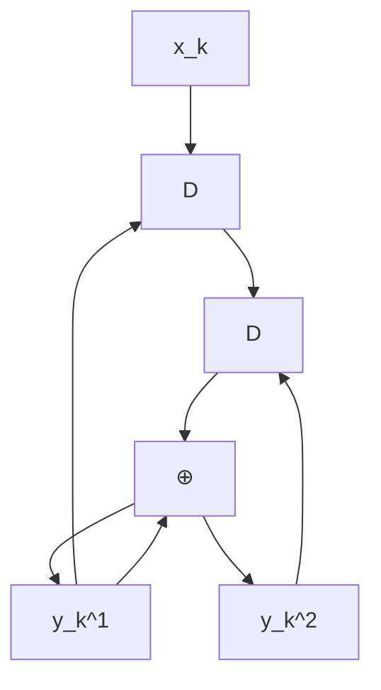

# 第二章 Turbo 码

在大多数应用中，尤其是那些需要高纠错能力的场合，通常需要使用非常复杂的编码和解码电路。一种简单的解决方法是采用级联编码 (concatenated coding)，即通过串行或并行地将多个编码器连接起来，并借助交织器 (interleaver) 的帮助。随后，编码后的数据由相应的解码器进行解码。尽管这种方法的结果被认为是次优的 (sub-optimal)，但它在纠错能力与编解码过程的复杂度之间取得了平衡。

迭代解码 (iterative decoding) [2, 3] 技术能够有效降低系统的误码率 (BER: bit-error rate)。Turbo 码 [3] 的解码就是迭代解码的一个典型例子，目前已广泛应用于移动电话和卫星通信等领域。此外，用于 Turbo 码解码的 Turbo 原理还可以应用于均衡过程，称为“Turbo 均衡 (turbo equalization)” [21]。这是一种已经在新一代硬盘驱动器中实际采用的迭代解码过程 [6]，其性能优于以往不采用迭代解码技术的硬盘驱动器。

本章将首先介绍卷积码 (convolutional code) 和 BCJR 算法 [18]，它们是 Turbo 码的核心组成部分，旨在帮助读者理解硬盘驱动器信号处理系统中采用的迭代编解码技术。

# 2.1 卷积码

纠错码，或称为前向纠错码 (FEC: forward error correction code)，常用于处理信道产生的噪声和错误。通常，纠错码可分为两类：分组码 (block code) 和卷积码 (convolutional code) [2]。此外，还出现了一些基于迭代解码技术的现代 ECC 码，如 Turbo 码 [3] 和 LDPC 码 [17] 等，它们的性能比卷积码更接近香农信道容量 (Shannon's channel capacity)。本节将简要介绍卷积码的工作原理，因为它是 Turbo 码的重要组成部分，将在 2.3 节中进一步探讨。

# 2.1.1 编码

卷积编码器 (convolutional encoder) 使用移位寄存器 (shift register) 和模 2 加法器 (modulo-2 adder) 进行编码。它将一组输入数据序列编码为一组数量相等或更多的输出数据序列。如果卷积编码器将 1 个输入比特编码为 $ 个输出比特，则该编码器的码率 (code rate) 为  = 1/n$。图 2.1 展示了一个码率为  = 1/2$ 的卷积编码器示例，其中 $ 是单位延迟算子 (unit delay operator)，代表移位寄存器。在实践中，卷积编码器可以用生成多项式 (generator polynomial) 来表示，其表达式为 [1]：

61914
G (D) = \sum_{i=0}^{\mu} g_i D^i \tag{2.1}
61914

其中 $\mu$ 是卷积编码器的存储量（即移位寄存器的数量），如果延迟 $ 位的输入比特对当前输出比特有影响，则  = 1$。例如，图 2.1 (a) 中卷积编码器的生成多项式为：

61914
G (D) = [G_1(D), G_2(D)] = [1 \oplus D, 1 \oplus D^2] \tag{2.2}
61914

flowchart

(a)

\`\`\`mermaid
graph TD
    A["Input"] --> B["⊕"]
    B --> C["D"]
    C --> D["D"]
    D --> E["Output"]
    B -->|Feedback| B
\`\`\`

(c)

图 2.1 (a) 卷积编码器，(b) 系统卷积编码器，以及 (c) 递归系统卷积编码器。

其中 $\oplus$ 是模 2 加法算子，$G_1(D)$ 是输出数据 $y_k^1$ 的生成多项式，$G_2(D)$ 是输出数据 $y_k^2$ 的生成多项式，且存储量 $\mu = 2$。

此外，系统卷积编码器 (systematic convolutional encoder) 是一种使其中一组输出数据与输入数据相同 的卷积编码器，如图 2.1 (b) 所示，其生成多项式为 $[1, 1 \oplus D^2]$。而具有反馈结构的系统卷积编码器被称为递归系统卷积编码器 (recursive systematic convolutional encoder)，如图 2.1 (c) 所示，其生成多项式为 $\left[ 1, 1 / (1 \oplus D^2) \right]$。通常，递归系统卷积编码器比其他类型的卷积编码器更为常用 [2]。

卷积码的分析通常基于有限状态机 (FSM: finite state machine)，该模型能够展示输入数据、起始状态 (start state)、下一状态 (next state) 以及系统输出数据的变化过程（详见 [10] 第 4.3.1 节）。图 2.2 (左) 展示了图 2.1 (a) 中卷积编码器的有限状态机，共有 $2^\mu = 4$ 个状态，分别为 00, 01, 10 和 11。其中，箭头表示状态转移路径，箭头旁的 $x / y^1 y^2$ 分别代表输入比特 $x$ 以及输出比特 $y^1$ 和 $y^2$。此外，可以使用格图 (trellis diagram) 来描述卷积码在每个时间段的状态转移。图 2.2 (右) 展示了图 2.1 (a) 中卷积编码器的格图。在时间 $k$ 的格图中，展示了从时间 $k$ 的某个状态转移到时间 $k+1$ 时刻所有可能的转移路径。箭头旁的 $x / y^1 y^2$ 与有限状态机中的定义一致。由于在格图上行走的一条路径代表了一组分支（每时间单位一个分支），因此每个码字（即卷积编码器的所有输出数据）在格图中必须对应唯一的一条路径（见图 2.5）。

其中 $\oplus$ 是模 2 加法算子，$G_1(D)$ 是输出数据 $y_k^1$ 的生成多项式，$G_2(D)$ 是输出数据 $y_k^2$ 的生成多项式，且存储量 $\mu = 2$。

此外，系统卷积编码器 (systematic convolutional encoder) 是一种使其中一组输出数据与输入数据相同 的卷积编码器，如图 2.1 (b) 所示，其生成多项式为 $[1, 1 \oplus D^2]$。而具有反馈结构的系统卷积编码器被称为递归系统卷积编码器 (recursive systematic convolutional encoder)，如图 2.1 (c) 所示，其生成多项式为 $\left[ 1, 1 / (1 \oplus D^2) \right]$。通常，递归系统卷积编码器比其他类型的卷积编码器更为常用 [2]。

卷积码的分析通常基于有限状态机 (FSM: finite state machine)，该模型能够展示输入数据、起始状态 (start state)、下一状态 (next state) 以及系统输出数据的变化过程（详见 [10] 第 4.3.1 节）。图 2.2 (左) 展示了图 2.1 (a) 中卷积编码器的有限状态机，共有 $2^\mu = 4$ 个状态，分别为 00, 01, 10 和 11。其中，箭头表示状态转移路径，箭头旁的 $x / y^1 y^2$ 分别代表输入比特 $x$ 以及输出比特 $y^1$ 和 $y^2$。此外，可以使用格图 (trellis diagram) 来描述卷积码在每个时间段的状态转移。图 2.2 (右) 展示了图 2.1 (a) 中卷积编码器的格图。在时间 $k$ 的格图中，展示了从时间 $k$ 的某个状态转移到时间 $k+1$ 时刻所有可能的转移路径。箭头旁的 $x / y^1 y^2$ 与有限状态机中的定义一致。由于在格图上行走的一条路径代表了一组分支（每时间单位一个分支），因此每个码字（即卷积编码器的所有输出数据）在格图中必须对应唯一的一条路径（见图 2.5）。

如果操作正确，则需要输入编码器的尾比特 (tail bits) 为 111，编码后的结果为 10101110001。

flowchart

\`\`\`mermaid
graph LR
    A["x_k"] --> B["⊕"]
    B --> C["D"]
    C --> D["M"]
    D --> E["z_k"]
    E --> F["{z_k^0 z_k^1} = {x_k y_k}"]
    style A fill:#f9f,stroke:#333
    style B fill:#ccf,stroke:#333
    style C fill:#cfc,stroke:#333
    style D fill:#fcc,stroke:#333
    style E fill:#fcf,stroke:#333
    style F fill:#cff,stroke:#333
\`\`\`

(a) 卷积编码器

flowchart

\`\`\`mermaid
graph TD
    A["0"] -->|0/00| B["0"]
    A -->|1/10| C["1"]
    D["1"] -->|0/01| E["0"]
    B -->|x_k / x_k y_k| F
    C -->|x_k = 0| G
    E -->|x_k = 1| H
\`\`\`

(b) 格图
图 2.8 (a) 卷积编码器 和 (b) 格图

**例 2.1** 请展示图 2.1 (a) 中卷积编码器的编码步骤，已知输入数据比特为 $\{x_0, x_1, x_2, x_3\} = \{1, 0, 1, 1\}$。

**解**：图 2.1 (a) 可重新绘制如右图所示。将数据比特 $\{x_k\}$ 使用卷积编码器进行编码的步骤如下：

flowchart

\`\`\`mermaid
graph TD
    X --> D1["D"]
    D1 -->|S1| D2["D"]
    D2 -->|S2| D3["⊕"]
    D3 --> Y1["Y1"]
    D3 --> Y2["Y2"]
    D1 -->|⊕| Y1
    D2 -->|⊕| Y2
\`\`\`

**第一步**：设定所有移位寄存器的状态 $\mathrm{S}_1$ 和 $\mathrm{S}_2$ 为 0（即状态 00）。此步骤仅为编码器的准备阶段，尚未输入数据比特。

**第二步**：开始输入第一个比特 1（即 $x_0 = 1$）。此时 $\mathrm{Y}_1 = \mathrm{X} \oplus \mathrm{S}_1 = 1 \oplus 0 = 1$，且 $\mathrm{Y}_2 = \mathrm{X} \oplus \mathrm{S}_2 = 1 \oplus 0 = 1$。这就是第一个比特编码后的输出数据。

**第三步**：输入第二个比特 0。电路中的所有值向后移一位（此时 $\mathrm{S}_1 = 1, \mathrm{S}_2 = 0$）。由此可得 $\mathrm{Y}_1 = \mathrm{X} \oplus \mathrm{S}_1 = 0 \oplus 1 = 1$ 且 $\mathrm{Y}_2 = \mathrm{X} \oplus \mathrm{S}_2 = 0 \oplus 0 = 0$。这就是第二个比特编码后的结果。

**第四步**：输入第三个比特 1。电路值再次移位（此时 $\mathrm{S}_1 = 0, \mathrm{S}_2 = 1$）。由此可得 $\mathrm{Y}_1 = \mathrm{X} \oplus \mathrm{S}_1 = 1 \oplus 0 = 1$ 且 $\mathrm{Y}_2 = \mathrm{X} \oplus \mathrm{S}_2 = 1 \oplus 1 = 0$。这就是第三个比特编码后的结果。

**第五步**：输入第四个比特 1。电路值再次移位（此时 $\mathrm{S}_1 = 1, \mathrm{S}_2 = 0$）。由此可得 $\mathrm{Y}_1 = \mathrm{X} \oplus \mathrm{S}_1 = 1 \oplus 1 = 0$ 且 $\mathrm{Y}_2 = \mathrm{X} \oplus \mathrm{S}_2 = 1 \oplus 0 = 1$。这就是第四个比特编码后的结果。

**第六步**：注意到卷积编码器的状态并未返回到全零的初始状态（目前处于状态 11）。因此，需要输入 2 个合适的尾比特 (tail bits) 使电路返回到全零状态，从而完成整个编码过程。

**最后一步**：选择尾比特的原则很简单，即寻找能使移位寄存器全部清零的输入比特。在本例中，连续输入两个 0 将使编码器返回到状态 00。第一个尾比特产生输出 $\mathrm{Y}_1 = 1, \mathrm{Y}_2 = 1$；第二个尾比特产生输出 $\mathrm{Y}_1 = 0, \mathrm{Y}_2 = 1$。

上述编码过程如图 2.3 所示。若将其表示为状态转移图，则如图 2.4 所示；若表示为格图，则如图 2.5 所示。可以看出，图 2.3 至 2.5 的结果是一致的。

此外，卷积编码也可以通过 D 变换 (D-transform) [1] 来实现。也就是说，卷积编码器的输出数据可表示为：
$$ Y_i(D) = G_i(D) X(D) \tag{2.3} $$

图 2.6 卷积编码器，其生成多项式以八进制表示为 $(g_1, g_2) = (17, 11)$。

图 2.8 (a) 卷积编码器 和 (b) 格图

# 2.1.2 解码

在实践中，由卷积码编码的数据可以使用基于维特比 (Viterbi) 算法 [13] 的解码器进行解码，这种解码器也被称为维特比检测器。下面通过一个示例来演示卷积码的解码过程。

**例 2.3** 考虑图 2.8 (a) 中的卷积编码器及其对应的格图（见图 2.8 (b)）。假设解码器需要解码的序列为 $z_k = \{1, 1, 0, 1, 1, 0, 1, 1, 0, 0\}$。

**解**：设 $(u, q)$ 表示从状态 $u$ 到状态 $q$ 的状态转移，则在时间 $k$ 的分支度量 (branch metric) 定义为：
$$ \rho_k(u, q) = | z_k^0 - \tilde{x}_k(u, q) |^2 + | z_k^1 - \tilde{y}_k(u, q) |^2 $$
其中 $\tilde{x}_k(u, q)$ 和 $\tilde{y}_k(u, q)$ 是与状态转移 $(u, q)$ 相对应的编码比特 $x_k$ 和 $y_k$。此外，时间 $k+1$ 时状态 $q$ 的路径度量 (path metric) 定义为：
$$ \Phi_{k+1}(q) = \min_u \{ \Phi_k(u) + \rho_k(u, q) \} $$

因此，维特比检测器的解码步骤可概括如下：
1) 对于每个时间间隔 $k$：
   - 对于每个状态 $q$：
     - 计算所有到达状态 $q$ 的分支的分支度量 $\rho_k(u, q)$。
     - 选择路径度量最小的分支。
     - 更新状态 $q$ 在时间 $k+1$ 的路径度量 $\Phi_{k+1}(q)$（对所有状态 $q$ 重复此过程）。
   - (对所有时间间隔 $k$ 重复此过程)。
2) 根据路径度量最小的路径回溯，解码出输入比特序列 $\hat{x}_k$。

图 2.9 展示了基于格图的解码步骤，其中仅显示到达每个状态的生存路径 (survivor path)。分支上的数值为对应的分支度量 $\rho_k(u, q)$，而状态节点上的数值为路径度量 $\Phi_k(q)$。由图可知，该卷积解码器得到的输入比特估计值为 $\hat{x}_k = \{1, 0, 1, 1\}$。关于维特比检测器解码步骤的详细内容，可参考 [10] 第 4 章。

然而，如果将卷积码用作 Turbo 码的组成部分，则不能在 Turbo 解码器中使用维特比检测器。因为 Turbo 解码器仅处理比特的软信息，而维特比检测器仅提供硬输出（即比特的估计值）。因此，用于解码卷积码的 Turbo 解码器必须采用基于 BCJR 算法 [18] 或 SOVA (Soft-Output Viterbi Algorithm) [19] 的检测器。相关内容将在 2.2 节和第 3 章中分别详细讨论。

# 2.2 BCJR 算法

维特比检测器 [1, 13] 是一种最大似然 (ML: maximum-likelihood) 检测器，用于解码卷积码。其输出是所需解码序列的最优估计，也就是说，ML 检测器使整个序列的错误概率最小，但不能保证序列中的每个比特都是最优的。换言之，ML 检测器并不保证每个比特的误码率最低。

此外，维特比检测器无法直接用于迭代解码系统，因为该系统需要在检测器和纠错解码器之间交换软信息。因此，迭代解码系统必须使用最大后验概率 (MAP: maximum a posteriori probability) 检测器。MAP 检测器能够保证解码出的每个比特都是最优的（即每个比特的误码率最低）。

本节将介绍 BCJR 算法 [18] 的工作原理。该算法由 Bahl, Cocke, Jelinek 和 Raviv 提出，用于实现 MAP 检测，旨在检测经过具有符号间干扰 (ISI) 和加性高斯白噪声 (AWGN) 信道传输的信号的后验概率 (APP: a posteriori probability) 最大值。

# 2.2.1 信道模型与格图

考虑图 2.10 中的信道模型。在接收端，第 $k$ 个时刻接收到的信号（或需要解码的信号）为：

flowchart

\`\`\`mermaid
graph LR
    A["a_k"] --> B["H(D)"]
    B --> C["r_k"]
    C --> D["+"]
    D --> E["y_k"]
    E --> F["n_k ~ N(0,σ²)"]
    F --> D
    D --> G["∑_{i=0}^ν a_i h_{k-i} + n_k"]
\`\`\`

图 2.10 信道模型

当输入比特序列 $\mathbf{a} = [a_0, \dots, a_{L-1}]$ 长度为 $L$（通常一个扇区 $L=4096$ 比特），且假设在 $k < 0$ 和 $k > L-1$ 时没有数据传输，则接收端收到的信号向量为 $\mathbf{y} = \{y_l\}_{0}^{L+\nu-1} = [y_0, \dots, y_{L+\nu-1}]$。

图 2.11 展示了信道 $h_k$ 的格图。其中 $\Psi_k \equiv [a_{k-1}, a_{k-2}, \dots, a_{k-\nu}]$ 表示时刻 $k$ 的状态（或移位寄存器中的当前值），$Q = |\mathcal{A}|^\nu$ 为所有可能状态的总数。第 $k$ 级 (k-th stage) 包含时刻 $k$ 到时刻 $k+1$ 之间所有可能的状态转移分支，使用 $(u, q)$ 表示从状态 $u$ 转移到状态 $q$。若状态定义为 $0$ 到 $Q-1$，则状态 $0$（即 $\psi_k \equiv [0, 0, \dots, 0]$）代表空闲状态 (idle state)，适用于 $k \leq 0$ 和 $k \geq L+\nu-1$。因此，图 2.11 描述了与第 $k$ 个输入比特 $a_k$、信道输出 $r_k$ 以及接收信号 $y_k$ 相对应的格图级。

# 2.2.2 最优检测器

在实践中，MAP 检测器被认为是“最优检测器 (optimal detector)”，因为它可以保证每个比特的误码率最低。例如，在判定第 $k$ 个比特 $a_k$ 时，MAP 检测器计算其后验概率 (APP)，即在给定接收序列 $\mathbf{y}$ 的条件下，$a_k$ 取某个值的概率 $\text{Pr}[a_k \mid \mathbf{y}]$。通过选择使该概率最大化的 $a_k$ 值，MAP 检测器会对每个比特进行最优判定。这一过程将针对所有 $L$ 个比特重复进行。

在实际操作中，若已知格图中所有状态转移的后验概率 $\text{Pr}[\psi_k=u; \psi_{k+1}=q \mid \mathbf{y}]$，则可较为容易地计算 $\text{Pr}[a_k \mid \mathbf{y}]$。其表达式为：

$$
\begin{array}{l} \operatorname{Pr} [\psi_k = u; \psi_{k+1} = q \mid \mathbf{y}] = \frac{p(\psi_k = u ; \mathbf{y}_{l < k}) p(\psi_{k+1} = q ; y_k \mid \psi_k = u) p(\mathbf{y}_{l > k} \mid \psi_{k+1} = q)}{p(\mathbf{y})} \\ = \alpha_k(u) \times \gamma_k(u, q) \times \beta_{k+1}(q) / p(\mathbf{y}) \tag{2.7} \\ \end{array}
$$

其中，参数 $\alpha_k(u)$ 是时刻 $k$ 状态 $u$ 的概率，取决于过去接收到的数据 $\mathbf{y}_{l < k}$；$\beta_{k+1}(q)$ 是时刻 $k+1$ 状态 $q$ 的概率，取决于未来接收到的数据 $\mathbf{r}_{l > k}$；而 $\gamma_k(u, q)$ 则是从状态 $u$ 转移到状态 $q$ 的转移概率，取决于当前接收到的数据 $y_k$（详见图 2.11）。通常，$\alpha_k(u)$ 和 $\beta_{k+1}(q)$ 被称为状态度量 (state metric)，而 $\gamma_k(u, q)$ 被称为分支度量 (branch metric)。

若定义 $S_a$ 为所有与比特 $a$ 相匹配的状态转移 $(u, q)$ 的集合，则后验概率 $\text{Pr}[a_k = a \mid \mathbf{y}]$ 可通过以下公式计算：

$$
\begin{array}{l} \operatorname{Pr} [a_k = a \mid \mathbf{y}] = \sum_{(u, q) \in S_a} \operatorname{Pr} [\psi_k = u; \psi_{k+1} = q \mid \mathbf{y}] \\ = \frac{1}{p(\mathbf{y})} \sum_{(u, q) \in S_a} \alpha_k(u) \gamma_k(u, q) \beta_{k+1}(q) \tag{2.8} \\ \end{array}
$$

# 2.2.3 BCJR 算法参数的计算

BCJR 算法（见公式 2.8）中的参数 $\gamma_k(u, q)$、$\alpha_k(u)$、$\beta_{k+1}(q)$ 以及 $p(\mathbf{y})$ 的计算方法如下：

**AWGN 信道的分支度量 $\gamma_k(u, q)$ 计算**

BCJR 算法与维特比算法 [13] 的不同之处在于，BCJR 算法通过两次遍历来计算：
1) **前向遍历 (forward pass)**：从接收到的第一个数据开始向后计算。
2) **后向遍历 (backward pass)**：从接收到的最后一个数据开始向前计算。

此外，BCJR 算法的分支度量计算公式为：
$$
\begin{array}{l} \gamma_k(u, q) = p(\psi_{k+1} = q; y_k \mid \psi_k = u) \\ = p(y_k \mid \psi_k = u; \psi_{k+1} = q) p(\psi_{k+1} = q \mid \psi_k = u) \tag{2.9} \\ \end{array}
$$

对于 AWGN 信道，接收信号为 $y_k = r_k + n_k$，其中 $n_k \sim \mathcal{N}(0, \sigma^2)$ 是加性高斯白噪声。设 $\hat{a}(u, q)$ 和 $\hat{r}(u, q)$ 分别为与状态转移 $(u, q)$ 相对应的输入比特和信道输出，则公式 (2.9) 的第一项为：
$$ p(y_k \mid \psi_k = u; \psi_{k+1} = q) = \frac{1}{\sqrt{2\pi\sigma^2}} \exp \left\{ -\frac{1}{2\sigma^2} | y_k - \hat{r}(u, q) |^2 \right\} \tag{2.10} $$
其中 $\exp(\cdot)$ 为指数函数。而公式 (2.9) 的第二项为：
$$
\begin{array}{l} p(\psi_{k+1} = q \mid \psi_k = u) = p(a_k = \hat{a}(u, q); \psi_k = u) / p(\psi_k = u) \\ = p(\psi_k = u \mid a_k = \hat{a}(u, q)) p(a_k = \hat{a}(u, q)) / p(\psi_k = u) \\ \end{array}
$$

BCJR 算法是一种高效地计算后验状态转移概率的方法。通过将后验状态转移概率 $\text{Pr}[\psi_k = u; \psi_{k+1} = q \mid \mathbf{y}]$ 重新组织，可以将其分为三个部分：
1) 第一部分取决于过去接收到的所有数据 $\mathbf{y}_{l < k} = \{y_l; l < k\} = \{y_l\}_{0}^{k-1}$。
2) 第二部分取决于当前接收到的数据 $y_k$。
3) 第三部分取决于未来接收到的所有数据 $\mathbf{y}_{l > k} = \{y_l; l > k\} = \{y_l\}_{k+1}^{L+\nu-1}$。

根据贝叶斯定理 (Bayes' rule)，后验状态转移概率可重新表示为：
$$
\text{Pr}[\psi_k = u; \psi_{k+1} = q \mid \mathbf{y}] = p(\psi_k = u; \psi_{k+1} = q; \mathbf{y}) / p(\mathbf{y})
$$
$$
= p(\psi_k = u; \psi_{k+1} = q; \mathbf{y}_{l < k}; y_k; \mathbf{y}_{l > k}) / p(\mathbf{y})
$$
$$
= p(\mathbf{y}_{l > k} \mid \psi_k = u; \psi_{k+1} = q; \mathbf{y}_{l < k}; y_k) p(\psi_k = u; \psi_{k+1} = q; \mathbf{y}_{l < k}; y_k) / p(\mathbf{y}) \tag{2.5}
$$

其中 $p(x)$ 是 $x$ 的概率密度函数 (pdf)。根据有限状态机的马尔可夫性质 (Markov property) [4]，对于任何信道，关于时间 $k+1$ 的状态信息将取代关于时间 $k$ 的状态信息以及 $y_k$ 和 $\mathbf{y}_{l < k}$ 的信息。因此，公式 (2.5) 可简化为：
$$
\begin{array}{l} \text{Pr}[\psi_k = u; \psi_{k+1} = q \mid \mathbf{y}] = p(\mathbf{y}_{l > k} \mid \psi_{k+1} = q) p(\psi_{k+1} = q; y_k \mid \psi_k = u; \mathbf{y}_{l < k}) p(\psi_k = u; \mathbf{y}_{l < k}) / p(\mathbf{y}) \\ = p(\mathbf{y}_{l > k} \mid \psi_{k+1} = q) p(\psi_{k+1} = q; y_k \mid \psi_k = u) p(\psi_k = u; \mathbf{y}_{l < k}) / p(\mathbf{y}) \tag{2.6} \\ \end{array}
$$

同样地，利用马尔可夫性质对公式 (2.6) 进一步整理，可得：
$$
\begin{array}{l} \text{Pr}[\psi_k = u; \psi_{k+1} = q \mid \mathbf{y}] = \frac{p(\psi_k = u; \mathbf{y}_{l < k}) p(\psi_{k+1} = q ; y_k \mid \psi_k = u) p(\mathbf{y}_{l > k} \mid \psi_{k+1} = q)}{p(\mathbf{y})} \\ = \alpha_k(u) \times \gamma_k(u, q) \times \beta_{k+1}(q) / p(\mathbf{y}) \tag{2.7} \\ \end{array}
$$

可以看出，参数 $\alpha_k(u)$ 是时刻 $k$ 状态 $u$ 的概率，取决于过去接收到的数据 $\mathbf{y}_{l < k}$；$\beta_{k+1}(q)$ 是时刻 $k+1$ 状态 $q$ 的概率，取决于未来接收到的数据 $\mathbf{r}_{l > k}$；而 $\gamma_k(u, q)$ 则是从状态 $u$ 转移到状态 $q$ 的转移概率，取决于当前接收到的数据 $y_k$（详见图 2.11）。通常，$\alpha_k(u)$ 和 $\beta_{k+1}(q)$ 被称为状态度量 (state metric)，而 $\gamma_k(u, q)$ 被称为分支度量 (branch metric)。

若定义 $S_a$ 为所有与比特 $a$ 相匹配的状态转移 $(u, q)$ 的集合，则后验概率 $\text{Pr}[a_k = a \mid \mathbf{y}]$ 可通过以下公式计算：
$$
\begin{array}{l} \text{Pr}[a_k = a \mid \mathbf{y}] = \sum_{(u, q) \in S_a} \text{Pr}[\psi_k = u; \psi_{k+1} = q \mid \mathbf{y}] \\ = \frac{1}{p(\mathbf{y})} \sum_{(u, q) \in S_a} \alpha_k(u) \gamma_k(u, q) \beta_{k+1}(q) \tag{2.8} \\ \end{array}
$$

# 2.2.3 BCJR 算法参数的计算

BCJR 算法（见公式 2.8）中的参数 $\gamma_k(u, q)$、$\alpha_k(u)$、$\beta_{k+1}(q)$ 以及 $p(\mathbf{y})$ 的计算方法如下：

**AWGN 信道的分支度量 $\gamma_k(u, q)$ 计算**

BCJR 算法与维特比算法 [13] 的不同之处在于，BCJR 算法通过两次遍历来计算：
1) **前向遍历 (forward pass)**：从接收到的第一个数据开始向后计算。
2) **后向遍历 (backward pass)**：从接收到的最后一个数据开始向前计算。

此外，BCJR 算法的分支度量计算公式为：
$$
\begin{array}{l} \gamma_k(u, q) = p(\psi_{k+1} = q; y_k \mid \psi_k = u) \\ = p(y_k \mid \psi_k = u; \psi_{k+1} = q) p(\psi_{k+1} = q \mid \psi_k = u) \tag{2.9} \\ \end{array}
$$

对于 AWGN 信道，接收信号为 $y_k = r_k + n_k$，其中 $n_k \sim \mathcal{N}(0, \sigma^2)$ 是加性高斯白噪声。设 $\hat{a}(u, q)$ 和 $\hat{r}(u, q)$ 分别为与状态转移 $(u, q)$ 相对应的输入比特和信道输出，则公式 (2.9) 的第一项为：
$$ p(y_k \mid \psi_k = u; \psi_{k+1} = q) = \frac{1}{\sqrt{2\pi\sigma^2}} \exp \left\{ -\frac{1}{2\sigma^2} | y_k - \hat{r}(u, q) |^2 \right\} \tag{2.10} $$
其中 $\exp(\cdot)$ 为指数函数。而公式 (2.9) 的第二项为：
$$
\begin{array}{l} p(\psi_{k+1} = q \mid \psi_k = u) = p(a_k = \hat{a}(u, q); \psi_k = u) / p(\psi_k = u) \\ = p(\psi_k = u \mid a_k = \hat{a}(u, q)) p(a_k = \hat{a}(u, q)) / p(\psi_k = u) \\ \end{array}
$$

**状态度量 $\alpha_k(u)$ 和 $\beta_{k+1}(q)$ 的计算**

状态度量 $\alpha_k(u)$ 和 $\beta_{k+1}(q)$（见公式 2.7）可通过马尔可夫性质和递归技术计算。首先，$\alpha_k(u)$ 定义为：
$$ \alpha_k(u) = p(\psi_k = u; \mathbf{y}_{l < k}) \tag{2.13} $$

因此：
$$
\begin{array}{l} \alpha_{k+1}(q) = p(\psi_{k+1} = q; \mathbf{y}_{l < k+1}) \\ = p(\psi_{k+1} = q; y_k; \mathbf{y}_{l < k}) \\ = \sum_{u=0}^{Q-1} p(\psi_{k+1} = q; y_k; \psi_k = u; \mathbf{y}_{l < k}) \\ = \sum_{u=0}^{Q-1} p(\psi_{k+1} = q; y_k \mid \psi_k = u; \mathbf{y}_{l < k}) p(\psi_k = u; \mathbf{y}_{l < k}) \\ \end{array}
$$
$$
= \sum_{u=0}^{Q-1} \gamma_k(u, q) \alpha_k(u) \tag{2.14}
$$

同样地，$\beta_{k+1}(q)$ 定义为：
$$ \beta_{k+1}(q) = p(\mathbf{y}_{l > k} \mid \psi_{k+1} = q) \tag{2.15} $$

因此：
$$
\beta_k(u) = p(\mathbf{y}_{l > k-1} \mid \psi_k = u)
$$
$$
= p(\mathbf{y}_{l > k}; y_k \mid \psi_k = u)
$$
$$
= \sum_{q=0}^{Q-1} p(\mathbf{y}_{l > k}; y_k, \psi_{k+1} = q \mid \psi_k = u)
$$
$$
= \sum_{q=0}^{Q-1} p(\mathbf{y}_{l > k} \mid \psi_{k+1} = q) p(y_k, \psi_{k+1} = q \mid \psi_k = u)
$$
$$
= \sum_{q=0}^{Q-1} \beta_{k+1}(q) \gamma_k(u, q) \tag{2.16}
$$

**$\alpha_k(u)$ 和 $\beta_{k+1}(q)$ 的初始条件**

BCJR 算法假设以下初始条件：
$$ \alpha_0(u) = \begin{cases} 1, & u = 0 \\ 0, & \text{otherwise} \end{cases} \quad \text{以及} \quad \beta_{L+\nu}(q) = \begin{cases} 1, & q = 0 \\ 0, & \text{otherwise} \end{cases} \tag{2.17} $$
这适用于所有路径都从状态 $\psi_0 = 0$ 开始并强制结束于 $\psi_{L+\nu} = 0$ 的情况。如果在结束时没有强制要求状态为 $0$，则通常设定 $\beta_{L+\nu}(q) = \alpha_{L+\nu}(q)$（公式 2.18），因为在 $L+\nu$ 时刻，算法对各状态的概率分布并无先验知识。

**$p(\mathbf{y})$ 的计算**

在计算后验概率 $\text{Pr}[a_k = a \mid \mathbf{y}]$（见公式 2.8）时，由于 $p(\mathbf{y})$ 对所有 $k$ 都是常数，因此在寻找最大值时可以忽略。但若需具体计算，根据全概率原则，所有可能状态转移的概率之和必须为 1：
$$ \sum_{u=0}^{Q-1} \sum_{q=0}^{Q-1} \frac{\alpha_k(u) \gamma_k(u, q) \beta_{k+1}(q)}{p(\mathbf{y})} = 1 \tag{2.19} $$
由此可求得 $p(\mathbf{y})$。
即：
$$ p(\mathbf{y}) = \sum_{u=0}^{Q-1} \sum_{q=0}^{Q-1} \alpha_k(u) \gamma_k(u, q) \beta_{k+1}(q) \tag{2.20} $$
根据方程 (2.16) 可得：
$$ p(\mathbf{y}) = \sum_{u=0}^{Q-1} \alpha_k(u) \beta_k(u) \tag{2.21} $$
方程 (2.21) 表明，在任何时刻 $k$，状态图（trellis）中所有状态的 $\alpha_k(u)$ 与 $\beta_k(u)$ 之积的和恒等于 $p(\mathbf{y})$。因此，根据方程 (2.17)，可以得出以下关系：
$$ p(\mathbf{y}) = \beta_0(0) = \alpha_{L+\nu}(0) \tag{2.22} $$
### 2.2.4 二进制数据位的 BCJR 算法

在输入数据位为二进制，即 $a_k \in \{-1, 1\}$ 的情况下，方程 (2.8) 中的后验概率 $\text{Pr}[a_k = a \mid \mathbf{y}]$ 可由 $\text{Pr}[a_k = 1 \mid \mathbf{y}] = 1 - \text{Pr}[a_k = -1 \mid \mathbf{y}]$ 或比率 $\text{Pr}[a_k = 1 \mid \mathbf{y}] / \text{Pr}[a_k = -1 \mid \mathbf{y}]$ 来定义。在对数域 (logarithm domain) 中，可写作：
$$ \lambda_p(a_k) = \ln \left( \frac{\text{Pr}[a_k = 1 \mid \mathbf{y}]}{\text{Pr}[a_k = -1 \mid \mathbf{y}]} \right) \tag{2.23} $$
其中 $\lambda_p(a_k)$ 为数据位 $a_k$ 的后验 LLR 值。因此，根据方程 (2.8) 可得：
$$ \lambda_p(a_k) = \ln \left( \frac{\sum_{(u, q) \in S_1} \alpha_k(u) \gamma_k(u, q) \beta_{k+1}(q)}{\sum_{(u, q) \in S_{-1}} \alpha_k(u) \gamma_k(u, q) \beta_{k+1}(q)} \right) \tag{2.24} $$
针对二进制数据的 BCJR 算法利用方程 (2.24) 来计算发射端发送的每个数据位的 LLR 值。$\lambda_p(a_k)$ 将用于决定数据位 $a_k$ 的估计值，以使错误概率最小化，判定规则如下：
$$ \hat{a}_k = \begin{cases} 1, & \text{if } \lambda_p(a_k) \geq 0 \\ -1, & \text{if } \lambda_p(a_k) < 0 \end{cases} \tag{2.25} $$
此外，对于 $\tilde{a} \in \{\pm 1\}$，先验概率 $p(a_k = \tilde{a})$ 与对数概率函数的关系如下（见公式 1.6）：
$$ p(a_k = \tilde{a}) = \frac{\exp(\tilde{a} \lambda_a(a_k) / 2)}{\exp(\lambda_a(a_k) / 2) + \exp(-\lambda_a(a_k) / 2)} \tag{2.26} $$
其中
$$ \lambda_a(a_k) = \ln \left( \frac{p(a_k = 1)}{p(a_k = -1)} \right) \tag{2.27} $$
是数据位 $a_k$ 的先验 LLR 值。然而，由于方程 (2.26) 中的分母对于状态图 (trellis) 中的所有状态转移 $(u, q)$ 均相同，因此在计算方程 (2.12) 的 BCJR 支路度量时，可直接使用如下简化的先验概率：
$$ p(a_k = \tilde{a}) = \exp\left( \frac{\tilde{a} \lambda_a(a_k)}{2} \right) \tag{2.28} $$
由此可得：
$$ \gamma_k(u, q) = \frac{1}{\sqrt{2\pi\sigma^2}} \exp \left\{ \frac{-1}{2\sigma^2} |y_k - \hat{r}(u, q)|^2 \right\} \times \exp\left( \frac{\hat{a}(u, q) \lambda_a(a_k)}{2} \right) \tag{2.29} $$
### 2.2.5 BCJR 算法工作流程总结

BCJR 算法的工作原理可总结为图 2.12 所示的步骤。

### 2.2.6 BCJR 算法的注意事项

在实际应用中，对于图 2.12 所述的 BCJR 算法，必须对所有状态 $u$ 及所有时刻 $k$ 的状态度量 $\alpha_k(u)$ 和 $\beta_k(u)$ 进行归一化 (normalization) [22]，以避免计算机程序中的数值下溢 (numerical underflow) 问题。具体而言，在每个时刻 $k$ 计算 $\alpha_k(u)$ 和 $\beta_k(u)$ 时，一旦根据方程 (2.14) 和 (2.16) 得到了所有状态的 $\alpha_k(u)$ 和 $\beta_k(u)$，需按照以下关系对这两个状态度量进行归一化：
$$ \alpha_k(u) = \frac{\alpha_k(u)}{\sum_i \alpha_k(i)} \quad \text{且} \quad \beta_k(u) = \frac{\beta_k(u)}{\sum_i \beta_k(i)} \tag{2.30} $$
这样可以确保所有状态的 $\alpha_k(u)$ 之和为 1，且所有状态的 $\beta_k(u)$ 之和为 1。随后，再开始计算下一时刻的 $\alpha_k(u)$ 和 $\beta_k(u)$。
**BCJR 算法步骤**

1. 设定状态度量的初始值 $[\alpha_0(0), \alpha_0(1), \dots, \alpha_0(Q-1)] = [1, 0, \dots, 0]$。
2. 前向递归 (forward recursion)：
   - 对于 $k = 0, 1, \dots, L + \nu - 1$：
     - 对于 $q = 0, 1, \dots, Q - 1$：
       - 根据方程 (2.29) 计算所有满足转移条件 $(u, q)$ 的 $\gamma_k(u, q)$。
       - 根据方程 (2.14) 计算 $\alpha_{k+1}(q)$。
3. 设定状态度量的初始值 $[\beta_{L+\nu}(0), \beta_{L+\nu}(1), \dots, \beta_{L+\nu}(Q-1)] = [1, 0, \dots, 0]$。
4. 后向递归 (backward recursion)：
   - 对于 $k = L + \nu - 1, L + \nu - 2, \dots, 0$：
     - 对于 $u = 0, 1, \dots, Q - 1$：
       - 根据方程 (2.29) 计算所有满足转移条件 $(u, q)$ 的 $\gamma_k(u, q)$。
       - 根据方程 (2.16) 计算 $\beta_k(u)$。
     - 根据方程 (2.24) 计算 $\lambda_p(a_k)$。
     - 根据方程 (2.25) 判定数据位 $\hat{a}_k$。
