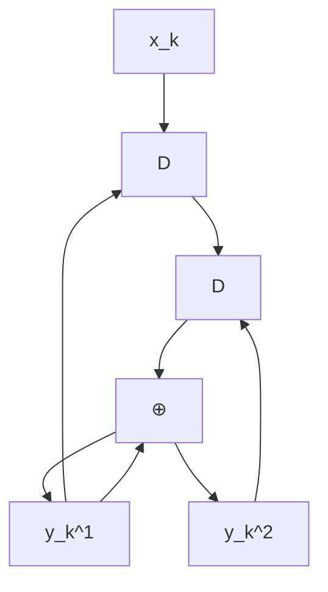

# 第二章 Turbo 码

在大多数应用中，尤其是那些需要高纠错能力的场合，通常需要使用非常复杂的编码和解码电路。一种简单的解决方法是采用级联编码 (concatenated coding)，即通过串行或并行地将多个编码器连接起来，并借助交织器 (interleaver) 的帮助。随后，编码后的数据由相应的解码器进行解码。尽管这种方法的结果被认为是次优的 (sub-optimal)，但它在纠错能力与编解码过程的复杂度之间取得了平衡。

迭代解码 (iterative decoding) [2, 3] 技术能够有效降低系统的误码率 (BER: bit-error rate)。Turbo 码 [3] 的解码就是迭代解码的一个典型例子，目前已广泛应用于移动电话和卫星通信等领域。此外，用于 Turbo 码解码的 Turbo 原理还可以应用于均衡过程，称为“Turbo 均衡 (turbo equalization)” [21]。这是一种已经在新一代硬盘驱动器中实际采用的迭代解码过程 [6]，其性能优于以往不采用迭代解码技术的硬盘驱动器。

本章将首先介绍卷积码 (convolutional code) 和 BCJR 算法 [18]，它们是 Turbo 码的核心组成部分，旨在帮助读者理解硬盘驱动器信号处理系统中采用的迭代编解码技术。

# 2.1 卷积码

纠错码，或称为前向纠错码 (FEC: forward error correction code)，常用于处理信道产生的噪声和错误。通常，纠错码可分为两类：分组码 (block code) 和卷积码 (convolutional code) [2]。此外，还出现了一些基于迭代解码技术的现代 ECC 码，如 Turbo 码 [3] 和 LDPC 码 [17] 等，它们的性能比卷积码更接近香农信道容量 (Shannon's channel capacity)。本节将简要介绍卷积码的工作原理，因为它是 Turbo 码的重要组成部分，将在 2.3 节中进一步探讨。

# 2.1.1 编码

卷积编码器 (convolutional encoder) 使用移位寄存器 (shift register) 和模 2 加法器 (modulo-2 adder) 进行编码。它将一组输入数据序列编码为一组数量相等或更多的输出数据序列。如果卷积编码器将 1 个输入比特编码为 $ 个输出比特，则该编码器的码率 (code rate) 为  = 1/n$。图 2.1 展示了一个码率为  = 1/2$ 的卷积编码器示例，其中 $ 是单位延迟算子 (unit delay operator)，代表移位寄存器。在实践中，卷积编码器可以用生成多项式 (generator polynomial) 来表示，其表达式为 [1]：

61914
G (D) = \sum_{i=0}^{\mu} g_i D^i \tag{2.1}
61914

其中 $\mu$ 是卷积编码器的存储量（即移位寄存器的数量），如果延迟 $ 位的输入比特对当前输出比特有影响，则  = 1$。例如，图 2.1 (a) 中卷积编码器的生成多项式为：

61914
G (D) = [G_1(D), G_2(D)] = [1 \oplus D, 1 \oplus D^2] \tag{2.2}
61914

flowchart

(a)

