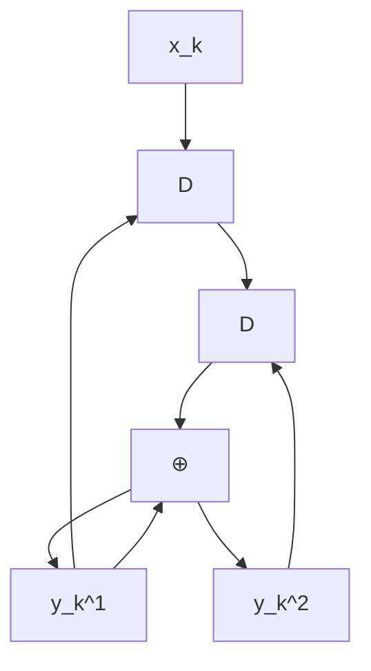

# 第二章 Turbo 码

在大多数应用中，尤其是那些需要高纠错能力的场合，通常需要使用非常复杂的编码和解码电路。一种简单的解决方法是采用级联编码 (concatenated coding)，即通过串行或并行地将多个编码器连接起来，并借助交织器 (interleaver) 的帮助。随后，编码后的数据由相应的解码器进行解码。尽管这种方法的结果被认为是次优的 (sub-optimal)，但它在纠错能力与编解码过程的复杂度之间取得了平衡。

迭代解码 (iterative decoding) [2, 3] 技术能够有效降低系统的误码率 (BER: bit-error rate)。Turbo 码 [3] 的解码就是迭代解码的一个典型例子，目前已广泛应用于移动电话和卫星通信等领域。此外，用于 Turbo 码解码的 Turbo 原理还可以应用于均衡过程，称为“Turbo 均衡 (turbo equalization)” [21]。这是一种已经在新一代硬盘驱动器中实际采用的迭代解码过程 [6]，其性能优于以往不采用迭代解码技术的硬盘驱动器。

本章将首先介绍卷积码 (convolutional code) 和 BCJR 算法 [18]，它们是 Turbo 码的核心组成部分，旨在帮助读者理解硬盘驱动器信号处理系统中采用的迭代编解码技术。

# 2.1 卷积码

纠错码，或称为前向纠错码 (FEC: forward error correction code)，常用于处理信道产生的噪声和错误。通常，纠错码可分为两类：分组码 (block code) 和卷积码 (convolutional code) [2]。此外，还出现了一些基于迭代解码技术的现代 ECC 码，如 Turbo 码 [3] 和 LDPC 码 [17] 等，它们的性能比卷积码更接近香农信道容量 (Shannon's channel capacity)。本节将简要介绍卷积码的工作原理，因为它是 Turbo 码的重要组成部分，将在 2.3 节中进一步探讨。

# 2.1.1 编码

卷积编码器 (convolutional encoder) 使用移位寄存器 (shift register) 和模 2 加法器 (modulo-2 adder) 进行编码。它将一组输入数据序列编码为一组数量相等或更多的输出数据序列。如果卷积编码器将 1 个输入比特编码为 $ 个输出比特，则该编码器的码率 (code rate) 为  = 1/n$。图 2.1 展示了一个码率为  = 1/2$ 的卷积编码器示例，其中 $ 是单位延迟算子 (unit delay operator)，代表移位寄存器。在实践中，卷积编码器可以用生成多项式 (generator polynomial) 来表示，其表达式为 [1]：

61914
G (D) = \sum_{i=0}^{\mu} g_i D^i \tag{2.1}
61914

其中 $\mu$ 是卷积编码器的存储量（即移位寄存器的数量），如果延迟 $ 位的输入比特对当前输出比特有影响，则  = 1$。例如，图 2.1 (a) 中卷积编码器的生成多项式为：

61914
G (D) = [G_1(D), G_2(D)] = [1 \oplus D, 1 \oplus D^2] \tag{2.2}
61914

flowchart

(a)

\`\`\`mermaid
graph TD
    A["Input"] --> B["⊕"]
    B --> C["D"]
    C --> D["D"]
    D --> E["Output"]
    B -->|Feedback| B
\`\`\`

(c)

图 2.1 (a) 卷积编码器，(b) 系统卷积编码器，以及 (c) 递归系统卷积编码器。

其中 $\oplus$ 是模 2 加法算子，$G_1(D)$ 是输出数据 $y_k^1$ 的生成多项式，$G_2(D)$ 是输出数据 $y_k^2$ 的生成多项式，且存储量 $\mu = 2$。

此外，系统卷积编码器 (systematic convolutional encoder) 是一种使其中一组输出数据与输入数据相同 的卷积编码器，如图 2.1 (b) 所示，其生成多项式为 $[1, 1 \oplus D^2]$。而具有反馈结构的系统卷积编码器被称为递归系统卷积编码器 (recursive systematic convolutional encoder)，如图 2.1 (c) 所示，其生成多项式为 $\left[ 1, 1 / (1 \oplus D^2) \right]$。通常，递归系统卷积编码器比其他类型的卷积编码器更为常用 [2]。

卷积码的分析通常基于有限状态机 (FSM: finite state machine)，该模型能够展示输入数据、起始状态 (start state)、下一状态 (next state) 以及系统输出数据的变化过程（详见 [10] 第 4.3.1 节）。图 2.2 (左) 展示了图 2.1 (a) 中卷积编码器的有限状态机，共有 $2^\mu = 4$ 个状态，分别为 00, 01, 10 和 11。其中，箭头表示状态转移路径，箭头旁的 $x / y^1 y^2$ 分别代表输入比特 $x$ 以及输出比特 $y^1$ 和 $y^2$。此外，可以使用格图 (trellis diagram) 来描述卷积码在每个时间段的状态转移。图 2.2 (右) 展示了图 2.1 (a) 中卷积编码器的格图。在时间 $k$ 的格图中，展示了从时间 $k$ 的某个状态转移到时间 $k+1$ 时刻所有可能的转移路径。箭头旁的 $x / y^1 y^2$ 与有限状态机中的定义一致。由于在格图上行走的一条路径代表了一组分支（每时间单位一个分支），因此每个码字（即卷积编码器的所有输出数据）在格图中必须对应唯一的一条路径（见图 2.5）。

其中 $\oplus$ 是模 2 加法算子，$G_1(D)$ 是输出数据 $y_k^1$ 的生成多项式，$G_2(D)$ 是输出数据 $y_k^2$ 的生成多项式，且存储量 $\mu = 2$。

此外，系统卷积编码器 (systematic convolutional encoder) 是一种使其中一组输出数据与输入数据相同 的卷积编码器，如图 2.1 (b) 所示，其生成多项式为 $[1, 1 \oplus D^2]$。而具有反馈结构的系统卷积编码器被称为递归系统卷积编码器 (recursive systematic convolutional encoder)，如图 2.1 (c) 所示，其生成多项式为 $\left[ 1, 1 / (1 \oplus D^2) \right]$。通常，递归系统卷积编码器比其他类型的卷积编码器更为常用 [2]。

卷积码的分析通常基于有限状态机 (FSM: finite state machine)，该模型能够展示输入数据、起始状态 (start state)、下一状态 (next state) 以及系统输出数据的变化过程（详见 [10] 第 4.3.1 节）。图 2.2 (左) 展示了图 2.1 (a) 中卷积编码器的有限状态机，共有 $2^\mu = 4$ 个状态，分别为 00, 01, 10 和 11。其中，箭头表示状态转移路径，箭头旁的 $x / y^1 y^2$ 分别代表输入比特 $x$ 以及输出比特 $y^1$ 和 $y^2$。此外，可以使用格图 (trellis diagram) 来描述卷积码在每个时间段的状态转移。图 2.2 (右) 展示了图 2.1 (a) 中卷积编码器的格图。在时间 $k$ 的格图中，展示了从时间 $k$ 的某个状态转移到时间 $k+1$ 时刻所有可能的转移路径。箭头旁的 $x / y^1 y^2$ 与有限状态机中的定义一致。由于在格图上行走的一条路径代表了一组分支（每时间单位一个分支），因此每个码字（即卷积编码器的所有输出数据）在格图中必须对应唯一的一条路径（见图 2.5）。

如果操作正确，则需要输入编码器的尾比特 (tail bits) 为 111，编码后的结果为 10101110001。

flowchart

\`\`\`mermaid
graph LR
    A["x_k"] --> B["⊕"]
    B --> C["D"]
    C --> D["M"]
    D --> E["z_k"]
    E --> F["{z_k^0 z_k^1} = {x_k y_k}"]
    style A fill:#f9f,stroke:#333
    style B fill:#ccf,stroke:#333
    style C fill:#cfc,stroke:#333
    style D fill:#fcc,stroke:#333
    style E fill:#fcf,stroke:#333
    style F fill:#cff,stroke:#333
\`\`\`

(a) 卷积编码器

flowchart

\`\`\`mermaid
graph TD
    A["0"] -->|0/00| B["0"]
    A -->|1/10| C["1"]
    D["1"] -->|0/01| E["0"]
    B -->|x_k / x_k y_k| F
    C -->|x_k = 0| G
    E -->|x_k = 1| H
\`\`\`

(b) 格图
图 2.8 (a) 卷积编码器 和 (b) 格图

**例 2.1** 请展示图 2.1 (a) 中卷积编码器的编码步骤，已知输入数据比特为 $\{x_0, x_1, x_2, x_3\} = \{1, 0, 1, 1\}$。

**解**：图 2.1 (a) 可重新绘制如右图所示。将数据比特 $\{x_k\}$ 使用卷积编码器进行编码的步骤如下：

flowchart

\`\`\`mermaid
graph TD
    X --> D1["D"]
    D1 -->|S1| D2["D"]
    D2 -->|S2| D3["⊕"]
    D3 --> Y1["Y1"]
    D3 --> Y2["Y2"]
    D1 -->|⊕| Y1
    D2 -->|⊕| Y2
\`\`\`

**第一步**：设定所有移位寄存器的状态 $\mathrm{S}_1$ 和 $\mathrm{S}_2$ 为 0（即状态 00）。此步骤仅为编码器的准备阶段，尚未输入数据比特。

**第二步**：开始输入第一个比特 1（即 $x_0 = 1$）。此时 $\mathrm{Y}_1 = \mathrm{X} \oplus \mathrm{S}_1 = 1 \oplus 0 = 1$，且 $\mathrm{Y}_2 = \mathrm{X} \oplus \mathrm{S}_2 = 1 \oplus 0 = 1$。这就是第一个比特编码后的输出数据。

**第三步**：输入第二个比特 0。电路中的所有值向后移一位（此时 $\mathrm{S}_1 = 1, \mathrm{S}_2 = 0$）。由此可得 $\mathrm{Y}_1 = \mathrm{X} \oplus \mathrm{S}_1 = 0 \oplus 1 = 1$ 且 $\mathrm{Y}_2 = \mathrm{X} \oplus \mathrm{S}_2 = 0 \oplus 0 = 0$。这就是第二个比特编码后的结果。

**第四步**：输入第三个比特 1。电路值再次移位（此时 $\mathrm{S}_1 = 0, \mathrm{S}_2 = 1$）。由此可得 $\mathrm{Y}_1 = \mathrm{X} \oplus \mathrm{S}_1 = 1 \oplus 0 = 1$ 且 $\mathrm{Y}_2 = \mathrm{X} \oplus \mathrm{S}_2 = 1 \oplus 1 = 0$。这就是第三个比特编码后的结果。

**第五步**：输入第四个比特 1。电路值再次移位（此时 $\mathrm{S}_1 = 1, \mathrm{S}_2 = 0$）。由此可得 $\mathrm{Y}_1 = \mathrm{X} \oplus \mathrm{S}_1 = 1 \oplus 1 = 0$ 且 $\mathrm{Y}_2 = \mathrm{X} \oplus \mathrm{S}_2 = 1 \oplus 0 = 1$。这就是第四个比特编码后的结果。

**第六步**：注意到卷积编码器的状态并未返回到全零的初始状态（目前处于状态 11）。因此，需要输入 2 个合适的尾比特 (tail bits) 使电路返回到全零状态，从而完成整个编码过程。

**最后一步**：选择尾比特的原则很简单，即寻找能使移位寄存器全部清零的输入比特。在本例中，连续输入两个 0 将使编码器返回到状态 00。第一个尾比特产生输出 $\mathrm{Y}_1 = 1, \mathrm{Y}_2 = 1$；第二个尾比特产生输出 $\mathrm{Y}_1 = 0, \mathrm{Y}_2 = 1$。

上述编码过程如图 2.3 所示。若将其表示为状态转移图，则如图 2.4 所示；若表示为格图，则如图 2.5 所示。可以看出，图 2.3 至 2.5 的结果是一致的。

此外，卷积编码也可以通过 D 变换 (D-transform) [1] 来实现。也就是说，卷积编码器的输出数据可表示为：
$$ Y_i(D) = G_i(D) X(D) \tag{2.3} $$

图 2.6 卷积编码器，其生成多项式以八进制表示为 $(g_1, g_2) = (17, 11)$。

图 2.8 (a) 卷积编码器 和 (b) 格图

# 2.1.2 解码

在实践中，由卷积码编码的数据可以使用基于维特比 (Viterbi) 算法 [13] 的解码器进行解码，这种解码器也被称为维特比检测器。下面通过一个示例来演示卷积码的解码过程。

**例 2.3** 考虑图 2.8 (a) 中的卷积编码器及其对应的格图（见图 2.8 (b)）。假设解码器需要解码的序列为 $z_k = \{1, 1, 0, 1, 1, 0, 1, 1, 0, 0\}$。

**解**：设 $(u, q)$ 表示从状态 $u$ 到状态 $q$ 的状态转移，则在时间 $k$ 的分支度量 (branch metric) 定义为：
$$ \rho_k(u, q) = | z_k^0 - \tilde{x}_k(u, q) |^2 + | z_k^1 - \tilde{y}_k(u, q) |^2 $$
其中 $\tilde{x}_k(u, q)$ 和 $\tilde{y}_k(u, q)$ 是与状态转移 $(u, q)$ 相对应的编码比特 $x_k$ 和 $y_k$。此外，时间 $k+1$ 时状态 $q$ 的路径度量 (path metric) 定义为：
$$ \Phi_{k+1}(q) = \min_u \{ \Phi_k(u) + \rho_k(u, q) \} $$

因此，维特比检测器的解码步骤可概括如下：
1) 对于每个时间间隔 $k$：
   - 对于每个状态 $q$：
     - 计算所有到达状态 $q$ 的分支的分支度量 $\rho_k(u, q)$。
     - 选择路径度量最小的分支。
     - 更新状态 $q$ 在时间 $k+1$ 的路径度量 $\Phi_{k+1}(q)$（对所有状态 $q$ 重复此过程）。
   - (对所有时间间隔 $k$ 重复此过程)。
2) 根据路径度量最小的路径回溯，解码出输入比特序列 $\hat{x}_k$。

图 2.9 展示了基于格图的解码步骤，其中仅显示到达每个状态的生存路径 (survivor path)。分支上的数值为对应的分支度量 $\rho_k(u, q)$，而状态节点上的数值为路径度量 $\Phi_k(q)$。由图可知，该卷积解码器得到的输入比特估计值为 $\hat{x}_k = \{1, 0, 1, 1\}$。关于维特比检测器解码步骤的详细内容，可参考 [10] 第 4 章。

然而，如果将卷积码用作 Turbo 码的组成部分，则不能在 Turbo 解码器中使用维特比检测器。因为 Turbo 解码器仅处理比特的软信息，而维特比检测器仅提供硬输出（即比特的估计值）。因此，用于解码卷积码的 Turbo 解码器必须采用基于 BCJR 算法 [18] 或 SOVA (Soft-Output Viterbi Algorithm) [19] 的检测器。相关内容将在 2.2 节和第 3 章中分别详细讨论。

# 2.2 BCJR 算法

维特比检测器 [1, 13] 是一种最大似然 (ML: maximum-likelihood) 检测器，用于解码卷积码。其输出是所需解码序列的最优估计，也就是说，ML 检测器使整个序列的错误概率最小，但不能保证序列中的每个比特都是最优的。换言之，ML 检测器并不保证每个比特的误码率最低。

此外，维特比检测器无法直接用于迭代解码系统，因为该系统需要在检测器和纠错解码器之间交换软信息。因此，迭代解码系统必须使用最大后验概率 (MAP: maximum a posteriori probability) 检测器。MAP 检测器能够保证解码出的每个比特都是最优的（即每个比特的误码率最低）。

本节将介绍 BCJR 算法 [18] 的工作原理。该算法由 Bahl, Cocke, Jelinek 和 Raviv 提出，用于实现 MAP 检测，旨在检测经过具有符号间干扰 (ISI) 和加性高斯白噪声 (AWGN) 信道传输的信号的后验概率 (APP: a posteriori probability) 最大值。

# 2.2.1 信道模型与格图

考虑图 2.10 中的信道模型。在接收端，第 $k$ 个时刻接收到的信号（或需要解码的信号）为：

flowchart

\`\`\`mermaid
graph LR
    A["a_k"] --> B["H(D)"]
    B --> C["r_k"]
    C --> D["+"]
    D --> E["y_k"]
    E --> F["n_k ~ N(0,σ²)"]
    F --> D
    D --> G["∑_{i=0}^ν a_i h_{k-i} + n_k"]
\`\`\`

图 2.10 信道模型

当输入比特序列 $\mathbf{a} = [a_0, \dots, a_{L-1}]$ 长度为 $L$（通常一个扇区 $L=4096$ 比特），且假设在 $k < 0$ 和 $k > L-1$ 时没有数据传输，则接收端收到的信号向量为 $\mathbf{y} = \{y_l\}_{0}^{L+\nu-1} = [y_0, \dots, y_{L+\nu-1}]$。

图 2.11 展示了信道 $h_k$ 的格图。其中 $\Psi_k \equiv [a_{k-1}, a_{k-2}, \dots, a_{k-\nu}]$ 表示时刻 $k$ 的状态（或移位寄存器中的当前值），$Q = |\mathcal{A}|^\nu$ 为所有可能状态的总数。第 $k$ 级 (k-th stage) 包含时刻 $k$ 到时刻 $k+1$ 之间所有可能的状态转移分支，使用 $(u, q)$ 表示从状态 $u$ 转移到状态 $q$。若状态定义为 $0$ 到 $Q-1$，则状态 $0$（即 $\psi_k \equiv [0, 0, \dots, 0]$）代表空闲状态 (idle state)，适用于 $k \leq 0$ 和 $k \geq L+\nu-1$。因此，图 2.11 描述了与第 $k$ 个输入比特 $a_k$、信道输出 $r_k$ 以及接收信号 $y_k$ 相对应的格图级。

# 2.2.2 最优检测器

在实践中，MAP 检测器被认为是“最优检测器 (optimal detector)”，因为它可以保证每个比特的误码率最低。例如，在判定第 $k$ 个比特 $a_k$ 时，MAP 检测器计算其后验概率 (APP)，即在给定接收序列 $\mathbf{y}$ 的条件下，$a_k$ 取某个值的概率 $\text{Pr}[a_k \mid \mathbf{y}]$。通过选择使该概率最大化的 $a_k$ 值，MAP 检测器会对每个比特进行最优判定。这一过程将针对所有 $L$ 个比特重复进行。

在实际操作中，若已知格图中所有状态转移的后验概率 $\text{Pr}[\psi_k=u; \psi_{k+1}=q \mid \mathbf{y}]$，则可较为容易地计算 $\text{Pr}[a_k \mid \mathbf{y}]$。其表达式为：

$$
\begin{array}{l} \operatorname{Pr} [\psi_k = u; \psi_{k+1} = q \mid \mathbf{y}] = \frac{p(\psi_k = u ; \mathbf{y}_{l < k}) p(\psi_{k+1} = q ; y_k \mid \psi_k = u) p(\mathbf{y}_{l > k} \mid \psi_{k+1} = q)}{p(\mathbf{y})} \\ = \alpha_k(u) \times \gamma_k(u, q) \times \beta_{k+1}(q) / p(\mathbf{y}) \tag{2.7} \\ \end{array}
$$

其中，参数 $\alpha_k(u)$ 是时刻 $k$ 状态 $u$ 的概率，取决于过去接收到的数据 $\mathbf{y}_{l < k}$；$\beta_{k+1}(q)$ 是时刻 $k+1$ 状态 $q$ 的概率，取决于未来接收到的数据 $\mathbf{r}_{l > k}$；而 $\gamma_k(u, q)$ 则是从状态 $u$ 转移到状态 $q$ 的转移概率，取决于当前接收到的数据 $y_k$（详见图 2.11）。通常，$\alpha_k(u)$ 和 $\beta_{k+1}(q)$ 被称为状态度量 (state metric)，而 $\gamma_k(u, q)$ 被称为分支度量 (branch metric)。

若定义 $S_a$ 为所有与比特 $a$ 相匹配的状态转移 $(u, q)$ 的集合，则后验概率 $\text{Pr}[a_k = a \mid \mathbf{y}]$ 可通过以下公式计算：

$$
\begin{array}{l} \operatorname{Pr} [a_k = a \mid \mathbf{y}] = \sum_{(u, q) \in S_a} \operatorname{Pr} [\psi_k = u; \psi_{k+1} = q \mid \mathbf{y}] \\ = \frac{1}{p(\mathbf{y})} \sum_{(u, q) \in S_a} \alpha_k(u) \gamma_k(u, q) \beta_{k+1}(q) \tag{2.8} \\ \end{array}
$$

# 2.2.3 BCJR 算法参数的计算

BCJR 算法（见公式 2.8）中的参数 $\gamma_k(u, q)$、$\alpha_k(u)$、$\beta_{k+1}(q)$ 以及 $p(\mathbf{y})$ 的计算方法如下：

**AWGN 信道的分支度量 $\gamma_k(u, q)$ 计算**

BCJR 算法与维特比算法 [13] 的不同之处在于，BCJR 算法通过两次遍历来计算：
1) **前向遍历 (forward pass)**：从接收到的第一个数据开始向后计算。
2) **后向遍历 (backward pass)**：从接收到的最后一个数据开始向前计算。

此外，BCJR 算法的分支度量计算公式为：
$$
\begin{array}{l} \gamma_k(u, q) = p(\psi_{k+1} = q; y_k \mid \psi_k = u) \\ = p(y_k \mid \psi_k = u; \psi_{k+1} = q) p(\psi_{k+1} = q \mid \psi_k = u) \tag{2.9} \\ \end{array}
$$

对于 AWGN 信道，接收信号为 $y_k = r_k + n_k$，其中 $n_k \sim \mathcal{N}(0, \sigma^2)$ 是加性高斯白噪声。设 $\hat{a}(u, q)$ 和 $\hat{r}(u, q)$ 分别为与状态转移 $(u, q)$ 相对应的输入比特和信道输出，则公式 (2.9) 的第一项为：
$$ p(y_k \mid \psi_k = u; \psi_{k+1} = q) = \frac{1}{\sqrt{2\pi\sigma^2}} \exp \left\{ -\frac{1}{2\sigma^2} | y_k - \hat{r}(u, q) |^2 \right\} \tag{2.10} $$
其中 $\exp(\cdot)$ 为指数函数。而公式 (2.9) 的第二项为：
$$
\begin{array}{l} p(\psi_{k+1} = q \mid \psi_k = u) = p(a_k = \hat{a}(u, q); \psi_k = u) / p(\psi_k = u) \\ = p(\psi_k = u \mid a_k = \hat{a}(u, q)) p(a_k = \hat{a}(u, q)) / p(\psi_k = u) \\ \end{array}
$$

BCJR 算法是一种高效地计算后验状态转移概率的方法。通过将后验状态转移概率 $\text{Pr}[\psi_k = u; \psi_{k+1} = q \mid \mathbf{y}]$ 重新组织，可以将其分为三个部分：
1) 第一部分取决于过去接收到的所有数据 $\mathbf{y}_{l < k} = \{y_l; l < k\} = \{y_l\}_{0}^{k-1}$。
2) 第二部分取决于当前接收到的数据 $y_k$。
3) 第三部分取决于未来接收到的所有数据 $\mathbf{y}_{l > k} = \{y_l; l > k\} = \{y_l\}_{k+1}^{L+\nu-1}$。

根据贝叶斯定理 (Bayes' rule)，后验状态转移概率可重新表示为：
$$
\text{Pr}[\psi_k = u; \psi_{k+1} = q \mid \mathbf{y}] = p(\psi_k = u; \psi_{k+1} = q; \mathbf{y}) / p(\mathbf{y})
$$
$$
= p(\psi_k = u; \psi_{k+1} = q; \mathbf{y}_{l < k}; y_k; \mathbf{y}_{l > k}) / p(\mathbf{y})
$$
$$
= p(\mathbf{y}_{l > k} \mid \psi_k = u; \psi_{k+1} = q; \mathbf{y}_{l < k}; y_k) p(\psi_k = u; \psi_{k+1} = q; \mathbf{y}_{l < k}; y_k) / p(\mathbf{y}) \tag{2.5}
$$

其中 $p(x)$ 是 $x$ 的概率密度函数 (pdf)。根据有限状态机的马尔可夫性质 (Markov property) [4]，对于任何信道，关于时间 $k+1$ 的状态信息将取代关于时间 $k$ 的状态信息以及 $y_k$ 和 $\mathbf{y}_{l < k}$ 的信息。因此，公式 (2.5) 可简化为：
$$
\begin{array}{l} \text{Pr}[\psi_k = u; \psi_{k+1} = q \mid \mathbf{y}] = p(\mathbf{y}_{l > k} \mid \psi_{k+1} = q) p(\psi_{k+1} = q; y_k \mid \psi_k = u; \mathbf{y}_{l < k}) p(\psi_k = u; \mathbf{y}_{l < k}) / p(\mathbf{y}) \\ = p(\mathbf{y}_{l > k} \mid \psi_{k+1} = q) p(\psi_{k+1} = q; y_k \mid \psi_k = u) p(\psi_k = u; \mathbf{y}_{l < k}) / p(\mathbf{y}) \tag{2.6} \\ \end{array}
$$

同样地，利用马尔可夫性质对公式 (2.6) 进一步整理，可得：
$$
\begin{array}{l} \text{Pr}[\psi_k = u; \psi_{k+1} = q \mid \mathbf{y}] = \frac{p(\psi_k = u; \mathbf{y}_{l < k}) p(\psi_{k+1} = q ; y_k \mid \psi_k = u) p(\mathbf{y}_{l > k} \mid \psi_{k+1} = q)}{p(\mathbf{y})} \\ = \alpha_k(u) \times \gamma_k(u, q) \times \beta_{k+1}(q) / p(\mathbf{y}) \tag{2.7} \\ \end{array}
$$

可以看出，参数 $\alpha_k(u)$ 是时刻 $k$ 状态 $u$ 的概率，取决于过去接收到的数据 $\mathbf{y}_{l < k}$；$\beta_{k+1}(q)$ 是时刻 $k+1$ 状态 $q$ 的概率，取决于未来接收到的数据 $\mathbf{r}_{l > k}$；而 $\gamma_k(u, q)$ 则是从状态 $u$ 转移到状态 $q$ 的转移概率，取决于当前接收到的数据 $y_k$（详见图 2.11）。通常，$\alpha_k(u)$ 和 $\beta_{k+1}(q)$ 被称为状态度量 (state metric)，而 $\gamma_k(u, q)$ 被称为分支度量 (branch metric)。

若定义 $S_a$ 为所有与比特 $a$ 相匹配的状态转移 $(u, q)$ 的集合，则后验概率 $\text{Pr}[a_k = a \mid \mathbf{y}]$ 可通过以下公式计算：
$$
\begin{array}{l} \text{Pr}[a_k = a \mid \mathbf{y}] = \sum_{(u, q) \in S_a} \text{Pr}[\psi_k = u; \psi_{k+1} = q \mid \mathbf{y}] \\ = \frac{1}{p(\mathbf{y})} \sum_{(u, q) \in S_a} \alpha_k(u) \gamma_k(u, q) \beta_{k+1}(q) \tag{2.8} \\ \end{array}
$$

# 2.2.3 BCJR 算法参数的计算

BCJR 算法（见公式 2.8）中的参数 $\gamma_k(u, q)$、$\alpha_k(u)$、$\beta_{k+1}(q)$ 以及 $p(\mathbf{y})$ 的计算方法如下：

**AWGN 信道的分支度量 $\gamma_k(u, q)$ 计算**

BCJR 算法与维特比算法 [13] 的不同之处在于，BCJR 算法通过两次遍历来计算：
1) **前向遍历 (forward pass)**：从接收到的第一个数据开始向后计算。
2) **后向遍历 (backward pass)**：从接收到的最后一个数据开始向前计算。

此外，BCJR 算法的分支度量计算公式为：
$$
\begin{array}{l} \gamma_k(u, q) = p(\psi_{k+1} = q; y_k \mid \psi_k = u) \\ = p(y_k \mid \psi_k = u; \psi_{k+1} = q) p(\psi_{k+1} = q \mid \psi_k = u) \tag{2.9} \\ \end{array}
$$

对于 AWGN 信道，接收信号为 $y_k = r_k + n_k$，其中 $n_k \sim \mathcal{N}(0, \sigma^2)$ 是加性高斯白噪声。设 $\hat{a}(u, q)$ 和 $\hat{r}(u, q)$ 分别为与状态转移 $(u, q)$ 相对应的输入比特和信道输出，则公式 (2.9) 的第一项为：
$$ p(y_k \mid \psi_k = u; \psi_{k+1} = q) = \frac{1}{\sqrt{2\pi\sigma^2}} \exp \left\{ -\frac{1}{2\sigma^2} | y_k - \hat{r}(u, q) |^2 \right\} \tag{2.10} $$
其中 $\exp(\cdot)$ 为指数函数。而公式 (2.9) 的第二项为：
$$
\begin{array}{l} p(\psi_{k+1} = q \mid \psi_k = u) = p(a_k = \hat{a}(u, q); \psi_k = u) / p(\psi_k = u) \\ = p(\psi_k = u \mid a_k = \hat{a}(u, q)) p(a_k = \hat{a}(u, q)) / p(\psi_k = u) \\ \end{array}
$$

**状态度量 $\alpha_k(u)$ 和 $\beta_{k+1}(q)$ 的计算**

状态度量 $\alpha_k(u)$ 和 $\beta_{k+1}(q)$（见公式 2.7）可通过马尔可夫性质和递归技术计算。首先，$\alpha_k(u)$ 定义为：
$$ \alpha_k(u) = p(\psi_k = u; \mathbf{y}_{l < k}) \tag{2.13} $$

因此：
$$
\begin{array}{l} \alpha_{k+1}(q) = p(\psi_{k+1} = q; \mathbf{y}_{l < k+1}) \\ = p(\psi_{k+1} = q; y_k; \mathbf{y}_{l < k}) \\ = \sum_{u=0}^{Q-1} p(\psi_{k+1} = q; y_k; \psi_k = u; \mathbf{y}_{l < k}) \\ = \sum_{u=0}^{Q-1} p(\psi_{k+1} = q; y_k \mid \psi_k = u; \mathbf{y}_{l < k}) p(\psi_k = u; \mathbf{y}_{l < k}) \\ \end{array}
$$
$$
= \sum_{u=0}^{Q-1} \gamma_k(u, q) \alpha_k(u) \tag{2.14}
$$

同样地，$\beta_{k+1}(q)$ 定义为：
$$ \beta_{k+1}(q) = p(\mathbf{y}_{l > k} \mid \psi_{k+1} = q) \tag{2.15} $$

因此：
$$
\beta_k(u) = p(\mathbf{y}_{l > k-1} \mid \psi_k = u)
$$
$$
= p(\mathbf{y}_{l > k}; y_k \mid \psi_k = u)
$$
$$
= \sum_{q=0}^{Q-1} p(\mathbf{y}_{l > k}; y_k, \psi_{k+1} = q \mid \psi_k = u)
$$
$$
= \sum_{q=0}^{Q-1} p(\mathbf{y}_{l > k} \mid \psi_{k+1} = q) p(y_k, \psi_{k+1} = q \mid \psi_k = u)
$$
$$
= \sum_{q=0}^{Q-1} \beta_{k+1}(q) \gamma_k(u, q) \tag{2.16}
$$

**$\alpha_k(u)$ 和 $\beta_{k+1}(q)$ 的初始条件**

BCJR 算法假设以下初始条件：
$$ \alpha_0(u) = \begin{cases} 1, & u = 0 \\ 0, & \text{otherwise} \end{cases} \quad \text{以及} \quad \beta_{L+\nu}(q) = \begin{cases} 1, & q = 0 \\ 0, & \text{otherwise} \end{cases} \tag{2.17} $$
这适用于所有路径都从状态 $\psi_0 = 0$ 开始并强制结束于 $\psi_{L+\nu} = 0$ 的情况。如果在结束时没有强制要求状态为 $0$，则通常设定 $\beta_{L+\nu}(q) = \alpha_{L+\nu}(q)$（公式 2.18），因为在 $L+\nu$ 时刻，算法对各状态的概率分布并无先验知识。

**$p(\mathbf{y})$ 的计算**

在计算后验概率 $\text{Pr}[a_k = a \mid \mathbf{y}]$（见公式 2.8）时，由于 $p(\mathbf{y})$ 对所有 $k$ 都是常数，因此在寻找最大值时可以忽略。但若需具体计算，根据全概率原则，所有可能状态转移的概率之和必须为 1：
$$ \sum_{u=0}^{Q-1} \sum_{q=0}^{Q-1} \frac{\alpha_k(u) \gamma_k(u, q) \beta_{k+1}(q)}{p(\mathbf{y})} = 1 \tag{2.19} $$
由此可求得 $p(\mathbf{y})$。
即：
$$ p(\mathbf{y}) = \sum_{u=0}^{Q-1} \sum_{q=0}^{Q-1} \alpha_k(u) \gamma_k(u, q) \beta_{k+1}(q) \tag{2.20} $$
根据方程 (2.16) 可得：
$$ p(\mathbf{y}) = \sum_{u=0}^{Q-1} \alpha_k(u) \beta_k(u) \tag{2.21} $$
方程 (2.21) 表明，在任何时刻 $k$，状态图（trellis）中所有状态的 $\alpha_k(u)$ 与 $\beta_k(u)$ 之积的和恒等于 $p(\mathbf{y})$。因此，根据方程 (2.17)，可以得出以下关系：
$$ p(\mathbf{y}) = \beta_0(0) = \alpha_{L+\nu}(0) \tag{2.22} $$
### 2.2.4 二进制数据位的 BCJR 算法

在输入数据位为二进制，即 $a_k \in \{-1, 1\}$ 的情况下，方程 (2.8) 中的后验概率 $\text{Pr}[a_k = a \mid \mathbf{y}]$ 可由 $\text{Pr}[a_k = 1 \mid \mathbf{y}] = 1 - \text{Pr}[a_k = -1 \mid \mathbf{y}]$ 或比率 $\text{Pr}[a_k = 1 \mid \mathbf{y}] / \text{Pr}[a_k = -1 \mid \mathbf{y}]$ 来定义。在对数域 (logarithm domain) 中，可写作：
$$ \lambda_p(a_k) = \ln \left( \frac{\text{Pr}[a_k = 1 \mid \mathbf{y}]}{\text{Pr}[a_k = -1 \mid \mathbf{y}]} \right) \tag{2.23} $$
其中 $\lambda_p(a_k)$ 为数据位 $a_k$ 的后验 LLR 值。因此，根据方程 (2.8) 可得：
$$ \lambda_p(a_k) = \ln \left( \frac{\sum_{(u, q) \in S_1} \alpha_k(u) \gamma_k(u, q) \beta_{k+1}(q)}{\sum_{(u, q) \in S_{-1}} \alpha_k(u) \gamma_k(u, q) \beta_{k+1}(q)} \right) \tag{2.24} $$
针对二进制数据的 BCJR 算法利用方程 (2.24) 来计算发射端发送的每个数据位的 LLR 值。$\lambda_p(a_k)$ 将用于决定数据位 $a_k$ 的估计值，以使错误概率最小化，判定规则如下：
$$ \hat{a}_k = \begin{cases} 1, & \text{if } \lambda_p(a_k) \geq 0 \\ -1, & \text{if } \lambda_p(a_k) < 0 \end{cases} \tag{2.25} $$
此外，对于 $\tilde{a} \in \{\pm 1\}$，先验概率 $p(a_k = \tilde{a})$ 与对数概率函数的关系如下（见公式 1.6）：
$$ p(a_k = \tilde{a}) = \frac{\exp(\tilde{a} \lambda_a(a_k) / 2)}{\exp(\lambda_a(a_k) / 2) + \exp(-\lambda_a(a_k) / 2)} \tag{2.26} $$
其中
$$ \lambda_a(a_k) = \ln \left( \frac{p(a_k = 1)}{p(a_k = -1)} \right) \tag{2.27} $$
是数据位 $a_k$ 的先验 LLR 值。然而，由于方程 (2.26) 中的分母对于状态图 (trellis) 中的所有状态转移 $(u, q)$ 均相同，因此在计算方程 (2.12) 的 BCJR 支路度量时，可直接使用如下简化的先验概率：
$$ p(a_k = \tilde{a}) = \exp\left( \frac{\tilde{a} \lambda_a(a_k)}{2} \right) \tag{2.28} $$
由此可得：
$$ \gamma_k(u, q) = \frac{1}{\sqrt{2\pi\sigma^2}} \exp \left\{ \frac{-1}{2\sigma^2} |y_k - \hat{r}(u, q)|^2 \right\} \times \exp\left( \frac{\hat{a}(u, q) \lambda_a(a_k)}{2} \right) \tag{2.29} $$
### 2.2.5 BCJR 算法工作流程总结

BCJR 算法的工作原理可总结为图 2.12 所示的步骤。

### 2.2.6 BCJR 算法的注意事项

在实际应用中，对于图 2.12 所述的 BCJR 算法，必须对所有状态 $u$ 及所有时刻 $k$ 的状态度量 $\alpha_k(u)$ 和 $\beta_k(u)$ 进行归一化 (normalization) [22]，以避免计算机程序中的数值下溢 (numerical underflow) 问题。具体而言，在每个时刻 $k$ 计算 $\alpha_k(u)$ 和 $\beta_k(u)$ 时，一旦根据方程 (2.14) 和 (2.16) 得到了所有状态的 $\alpha_k(u)$ 和 $\beta_k(u)$，需按照以下关系对这两个状态度量进行归一化：
$$ \alpha_k(u) = \frac{\alpha_k(u)}{\sum_i \alpha_k(i)} \quad \text{且} \quad \beta_k(u) = \frac{\beta_k(u)}{\sum_i \beta_k(i)} \tag{2.30} $$
这样可以确保所有状态的 $\alpha_k(u)$ 之和为 1，且所有状态的 $\beta_k(u)$ 之和为 1。随后，再开始计算下一时刻的 $\alpha_k(u)$ 和 $\beta_k(u)$。
**BCJR 算法步骤**

1. 设定状态度量的初始值 $[\alpha_0(0), \alpha_0(1), \dots, \alpha_0(Q-1)] = [1, 0, \dots, 0]$。
2. 前向递归 (forward recursion)：
   - 对于 $k = 0, 1, \dots, L + \nu - 1$：
     - 对于 $q = 0, 1, \dots, Q - 1$：
       - 根据方程 (2.29) 计算所有满足转移条件 $(u, q)$ 的 $\gamma_k(u, q)$。
       - 根据方程 (2.14) 计算 $\alpha_{k+1}(q)$。
3. 设定状态度量的初始值 $[\beta_{L+\nu}(0), \beta_{L+\nu}(1), \dots, \beta_{L+\nu}(Q-1)] = [1, 0, \dots, 0]$。
4. 后向递归 (backward recursion)：
   - 对于 $k = L + \nu - 1, L + \nu - 2, \dots, 0$：
     - 对于 $u = 0, 1, \dots, Q - 1$：
       - 根据方程 (2.29) 计算所有满足转移条件 $(u, q)$ 的 $\gamma_k(u, q)$。
       - 根据方程 (2.16) 计算 $\beta_k(u)$。
     - 根据方程 (2.24) 计算 $\lambda_p(a_k)$。
     - 根据方程 (2.25) 判定数据位 $\hat{a}_k$。
尽管使用 BCJR 算法的 MAP 检测器是最优检测器，因为它可以保证每个数据位的错误概率最小，但在实际应用中，BCJR 算法并不常被直接应用于信号处理芯片中。这是因为 BCJR 算法的计算资源消耗较高，且对噪声方差 $\sigma^2$ [23, 24] 非常敏感，而 $\sigma^2$ 是计算方程 (2.29) 中 $\gamma_k(u, q)$ 所必需的。在实际系统中，很难获知 $\sigma^2$ 的真实值（只能通过各种技术来估计 $\sigma^2$）。如果 $\sigma^2$ 的值不准确，将导致 BCJR 算法的所有参数发生偏差，从而显著降低 MAP 检测器的性能。因此，研究人员开发了如 Max-Log-MAP、Log-MAP 和 SOVA 等算法，这些算法的性能与 BCJR 相当，但计算开销更低，且对 $\sigma^2$ 的敏感度较低 [24]，因此能更有效地集成到信号处理芯片中（这些算法的详细工作原理将在第 3 章中介绍）。

**示例 2.4** 根据图 2.10 中的信道模型，假设输入数据序列 $a_k = \{1, -1, 1\}$，信道 $H(D) = 1 + 0.5D$，噪声 $n_k = \{-0.1, 0.3, -0.2, -0.1\}$，方差 $\sigma^2 = 1/(2\pi)$。请演示使用 BCJR 算法对数据 $y_k$ 进行解码的步骤（假设系统不获知数据位 $a_k$ 的先验信息）。

**解**：信道输出信号 $r_k$ 可由下式求得：
$$ r_k = a_k * h_k = \{r_0, r_1, r_2, r_3\} = \{1, -0.5, 0.5, 0.5\} $$
其中 $*$ 为卷积运算符 (convolution operator)，且
$$ y_k = r_k + n_k = \{0.9, -0.2, 0.3, 0.6\} = \{y_0, y_1, y_2, y_3\} $$
随后，为信道 $H(D) = 1 + 0.5D$ 构建状态图 (trellis)，如图 2.13 所示，该图包含两个状态：状态 (a) 和状态 (b)。
1. 设定状态度量的初始值 $\alpha_0(a) = 1$ 且 $\alpha_0(b) = 0$。

**前向递归**

2. 阶段 0（当 $k=0$ 时）：BCJR 算法接收数据 $y_0 = 0.9$，并根据方程 (2.29) 计算图 2.13 状态图中所有满足转移条件 $(u, q)$ 的支路度量 $\gamma_0(u, q)$，结果如下：
$$
\begin{array}{l} \gamma_ {0} (a, a) = \exp \left\{- \pi | 0. 9 - (- 1. 5) | ^ {2} \right\} \times \exp \left(\frac {(- 1) (0)}{2}\right) \approx 0 \\ \gamma_ {0} (b, a) = \exp \left\{- \pi | 0. 9 - (- 0. 5) | ^ {2} \right\} \times \exp \left(\frac {(- 1) (0)}{2}\right) \approx 0. 0 0 2 1 \\ \gamma_ {0} (a, b) = \exp \left\{- \pi | 0. 9 - (0. 5) | ^ {2} \right\} \times \exp \left(\frac {(+ 1) (0)}{2}\right) \approx 0. 6 0 4 9 \\ \gamma_ {0} (b, b) = \exp \left\{- \pi | 0. 9 - (1. 5) | ^ {2} \right\} \times \exp \left(\frac {(+ 1) (0)}{2}\right) \approx 0. 3 2 2 7 \\ \end{array}
$$
随后，根据方程 (2.14) 调整状态度量 $\alpha_1(a)$ 和 $\alpha_1(b)$：
$$
\alpha_ {1} (a) = \alpha_ {0} (a) \gamma_ {0} (a, a) + \alpha_ {0} (b) \gamma_ {0} (b, a) = (1) (0) + (0) (0. 0 0 2 1) = 0
$$
$$
\alpha_ {1} (b) = \alpha_ {0} (a) \gamma_ {0} (a, b) + \alpha_ {0} (b) \gamma_ {0} (b, b) = (1) (0. 6 0 4 9) + (0) (0. 3 2 2 7) = 0. 6 0 4 9
$$
进行归一化（根据方程 2.30），可得：
$$
\alpha_ {1} (a) = 0 / (0 + 0. 6 0 4 9) = 0
$$
$$
\alpha_ {1} (b) = 0. 6 0 4 9 / (0 + 0. 6 0 4 9) = 1
$$

3. 阶段 1（当 $k=1$ 时）：BCJR 算法接收数据 $y_1 = -0.2$，计算所有支路度量如下：
$$
\gamma_ {1} (a, a) = \exp \left\{- \pi | - 0. 2 - (- 1. 5) | ^ {2} \right\} \times \exp \left(\frac {(- 1) (0)}{2}\right) \approx 0. 0 0 4 9
$$
$$
\gamma_ {1} (b, a) = \exp \left\{- \pi | - 0. 2 - (- 0. 5) | ^ {2} \right\} \times \exp \left(\frac {(- 1) (0)}{2}\right) \approx 0. 7 5 3 7
$$
$$
\gamma_ {1} (a, b) = \exp \left\{- \pi | - 0. 2 - (0. 5) | ^ {2} \right\} \times \exp \left(\frac {(+ 1) (0)}{2}\right) \approx 0. 2 1 4 5
$$
$$
\gamma_ {1} (b, b) = \exp \left\{- \pi | - 0. 2 - (1. 5) | ^ {2} \right\} \times \exp \left(\frac {(+ 1) (0)}{2}\right) \approx 0. 0 0 0 1
$$
随后调整状态度量 $\alpha_2(a)$ 和 $\alpha_2(b)$：
$$
\alpha_ {2} (a) = \alpha_ {1} (a) \gamma_ {1} (a, a) + \alpha_ {1} (b) \gamma_ {1} (b, a) = (0) (0. 0 0 4 9) + (1) (0. 7 5 3 7) = 0. 7 5 3 7
$$
$$
\alpha_ {2} (b) = \alpha_ {1} (a) \gamma_ {1} (a, b) + \alpha_ {1} (b) \gamma_ {1} (b, b) = (0) (0. 2 1 4 5) + (1) (0. 0 0 0 1) = 0. 0 0 0 1
$$
进行归一化，可得：
$$
\alpha_ {1} (a) = 0. 7 5 3 7 / (0. 7 5 3 7 + 0. 0 0 0 1) \approx 0. 9 9 9 9
$$
$$
\alpha_ {1} (b) = 0. 0 0 0 1 / (0. 7 5 3 7 + 0. 0 0 0 1) \approx 0. 0 0 0 1
$$

4. 阶段 2 和 3（当 $k \in \{2, 3\}$ 时）：BCJR 算法接收数据 $y_2 = 0.3$ 和 $y_3 = 0.6$，并采用与步骤 2 和 3 相同的方法计算支路度量及调整状态度量 $\alpha_{k+1}(q)$（其中 $q \in \{a, b\}$）。结果如图 2.14 所示，其中支路上的数值为对应的 $\gamma_k(u, q)$，状态节点上的数值表示状态度量 $\alpha_k(u)$ 与 $\beta_k(u)$ 的比值：
$$ \frac{\alpha_k(u)}{\beta_k(u)} $$
对于每个 $k \in \{0, 1, 2, 3\}$ 和 $u \in \{a, b\}$。前向递归结束时（归一化后）的结果为：
$$ \alpha_4(a) = 0.2214 \quad \text{且} \quad \alpha_4(b) = 0.7786 $$
5. 设定状态度量的初始值 $\beta_4(u) = \alpha_4(u)$（其中 $u \in \{a, b\}$），即：
$$ \beta_4(a) = 0.2214 \quad \text{且} \quad \beta_4(b) = 0.7786 $$

**后向递归**

6. 阶段 3（当 $k=3$ 时）：BCJR 算法接收数据 $y_3 = 0.6$，计算所有支路度量如下：
$$
\begin{array}{l} \gamma_ {3} (a, a) = \exp \left\{- \pi | 0. 6 - (- 1. 5) | ^ {2} \right\} \times \exp \left(\frac {(- 1) (0)}{2}\right) \approx 0 \\ \gamma_ {3} (b, a) = \exp \left\{- \pi | 0. 6 - (- 0. 5) | ^ {2} \right\} \times \exp \left(\frac {(- 1) (0)}{2}\right) \approx 0. 0 2 2 3 \\ \gamma_ {3} (a, b) = \exp \left\{- \pi | 0. 6 - (0. 5) | ^ {2} \right\} \times \exp \left(\frac {(+ 1) (0)}{2}\right) \approx 0. 9 6 9 1 \\ \gamma_ {3} (b, b) = \exp \left\{- \pi | 0. 6 - (1. 5) | ^ {2} \right\} \times \exp \left(\frac {(+ 1) (0)}{2}\right) \approx 0. 0 7 8 5 \\ \end{array}
$$
随后调整状态度量 $\beta_3(a)$ 和 $\beta_3(b)$：
$$
\begin{array}{l} \beta_ {3} (a) = \gamma_ {3} (a, a) \beta_ {4} (a) + \gamma_ {3} (a, b) \beta_ {4} (b) \\ = (0) (0. 2 2 1 4) + (0. 9 6 9 1) (0. 7 7 8 6) = 0. 7 5 4 5 4 \\ \end{array}
$$
$$
\begin{array}{l} \beta_ {3} (b) = \gamma_ {3} (b, a) \beta_ {4} (a) + \gamma_ {3} (b, b) \beta_ {4} (b) \\ = (0. 0 2 2 3) (0. 2 2 1 4) + (0. 0 7 8 5) (0. 7 7 8 6) = 0. 0 6 6 0 5 7 \\ \end{array}
$$
进行归一化，可得：
$$
\beta_ {3} (a) = 0. 7 5 4 5 4 / (0. 7 5 4 5 4 + 0. 0 6 6 0 5 7) \approx 0. 9 1 9 5
$$
$$
\beta_ {3} (b) = 0. 0 6 6 0 5 7 / (0. 7 5 4 5 4 + 0. 0 6 6 0 5 7) \approx 0. 0 8 0 5
$$
接着，根据方程 (2.24) 计算 $\lambda_p(a_3)$：
$$
\begin{array}{l} \lambda_ {p} (a _ {3}) = \ln \left(\frac {\alpha_ {3} (a) \gamma_ {3} (a , b) \beta_ {4} (b) + \alpha_ {3} (b) \gamma_ {3} (b , b) \beta_ {4} (b)}{\alpha_ {3} (a) \gamma_ {3} (a , a) \beta_ {4} (a) + \alpha_ {3} (b) \gamma_ {3} (b , a) \beta_ {4} (a)}\right) \\ = \ln \left(\frac {(0 . 0 0 0 1) (0 . 9 6 9 1) (0 . 7 7 8 6) + (0 . 9 9 9 9) (0 . 0 7 8 5) (0 . 7 7 8 6)}{(0 . 0 0 0 1) (0) (0 . 2 2 1 4) + (0 . 9 9 9 9) (0 . 0 2 2 3) (0 . 2 2 1 4)}\right) \\ \approx 2. 5 2 \\ \end{array}
$$
由于 $\lambda_p(a_3) > 0$，因此 BCJR 算法将数据位 $a_3$ 解码为 $\hat{a}_3 = +1$。
*注：由于发射端发送的输入数据位仅为 $\{a_0, a_1, a_2\}$，因此系统中并不实际存在数据位 $a_3$。$a_3$ 是由于输入数据与信道进行卷积运算而产生的新信息。不过，$\lambda_p(a_3)$ 的值可在迭代解码过程中被利用。*

7. 阶段 2（当 $k=2$ 时）：BCJR 算法接收数据 $y_2 = 0.3$，计算所有支路度量如下：
$$
\gamma_ {2} (a, a) = \exp \left\{- \pi | 0. 3 - (- 1. 5) | ^ {2} \right\} \times \exp \left(\frac {(- 1) (0)}{2}\right) \approx 0. 0 0 0 0 4
$$
$$
\gamma_ {2} (b, a) = \exp \left\{- \pi | 0. 3 - (- 0. 5) | ^ {2} \right\} \times \exp \left(\frac {(- 1) (0)}{2}\right) \approx 0. 1 3 3 9
$$
$$
\gamma_ {2} (a, b) = \exp \left\{- \pi | 0. 3 - (0. 5) | ^ {2} \right\} \times \exp \left(\frac {(+ 1) (0)}{2}\right) \approx 0. 8 8 1 9
$$
$$
\gamma_ {2} (b, b) = \exp \left\{- \pi | 0. 3 - (1. 5) | ^ {2} \right\} \times \exp \left(\frac {(+ 1) (0)}{2}\right) \approx 0. 0 1 0 8
$$
随后调整状态度量 $\beta_2(a)$ 和 $\beta_2(b)$：
$$
\begin{array}{l} \beta_ {2} (a) = \gamma_ {2} (a, a) \beta_ {3} (a) + \gamma_ {2} (a, b) \beta_ {3} (b) \\ = (0. 0 0 0 0 4) (0. 9 1 9 5) + (0. 8 8 1 9) (0. 0 8 0 5) = 0. 0 7 1 0 3 \\ \beta_ {2} (b) = \gamma_ {2} (b, a) \beta_ {3} (a) + \gamma_ {2} (b, b) \beta_ {3} (b) \\ = (0. 1 3 3 9) (0. 9 1 9 5) + (0. 0 1 0 8) (0. 0 8 0 5) = 0. 1 2 3 9 9 \\ \end{array}
$$
进行归一化，可得：
$$
\beta_ {2} (a) = 0. 0 7 1 0 3 / (0. 0 7 1 0 3 + 0. 1 2 3 9 9) \approx 0. 3 6 4 2
$$
$$
\beta_ {2} (b) = 0. 1 2 3 9 9 / (0. 0 7 1 0 3 + 0. 1 2 3 9 9) \approx 0. 6 3 5 8
$$
接着计算 $\lambda_p(a_2)$：
$$
\begin{array}{l} \lambda_ {p} (a _ {2}) = \ln \left(\frac {\alpha_ {2} (a) \gamma_ {2} (a , b) \beta_ {3} (b) + \alpha_ {2} (b) \gamma_ {2} (b , b) \beta_ {3} (b)}{\alpha_ {2} (a) \gamma_ {2} (a , a) \beta_ {3} (a) + \alpha_ {2} (b) \gamma_ {2} (b , a) \beta_ {3} (a)}\right) \\ = \ln \left(\frac {(0 . 9 9 9 9) (0 . 8 8 1 9) (0 . 0 8 0 5) + (0 . 0 0 0 1) (0 . 0 1 0 8) (0 . 0 8 0 5)}{(0 . 9 9 9 9) (0 . 0 0 0 0 4) (0 . 9 1 9 5) + (0 . 0 0 0 1) (0 . 1 3 3 9) (0 . 9 1 9 5)}\right) \\ \approx 7. 2 \\ \end{array}
$$
由于 $\lambda_p(a_2) > 0$，因此 BCJR 算法将数据位 $a_2$ 解码为 $\hat{a}_2 = +1$。

8. 阶段 1 和 0（当 $k \in \{1, 0\}$ 时）：BCJR 算法接收数据 $y_1 = -0.2$ 和 $y_0 = 0.9$，采用与步骤 6 和 7 相同的方法计算支路度量并调整状态度量 $\beta_k(u)$（其中 $u \in \{a, b\}$）。结果如图 2.14 所示。后向递归结束时可得：
$$ \lambda_p(a_0) = 18.28 \quad \text{且} \quad \lambda_p(a_1) = -8.24 $$
即 BCJR 算法将数据位 $a_0$ 和 $a_1$ 分别解码为 $\hat{a}_0 = +1$ 和 $\hat{a}_1 = -1$。

9. 运行结束，BCJR 算法得出数据位 $a_k$ 的后验 LLR 值为 $\{\lambda_p(a_0), \lambda_p(a_1), \lambda_p(a_2), \lambda_p(a_3)\} = \{18.28, -8.24, 7.2, 2.52\}$，解码得到的数据位序列为 $\{\hat{a}_0, \hat{a}_1, \hat{a}_2\} = \{1, -1, 1\}$。该结果与发射端发送的数据位 $\{a_k\}$ 完全一致，表明使用 BCJR 算法进行数据解码未出现错误。

**示例 2.5** 根据图 2.10 中的信道模型，假设输入数据序列 $a_k = \{1, -1, 1\}$，信道 $H(D) = 1 - D^2$，噪声 $n_k = \{0.2, 0.3, -0.2, -0.5, 0.3\}$。请演示使用 BCJR 算法对数据 $y_k$ 进行解码的步骤（假设系统不获知数据位 $a_k$ 的先验信息）。

**解**：信道输出信号 $r_k$ 可由下式求得：
$$ r_k = a_k * h_k = \{r_0, r_1, r_2, r_3, r_4\} = \{1, -1, 0, 1, -1\} $$
且
$$ y_k = r_k + n_k = \{1.2, -0.7, -0.2, 0.5, -0.7\} = \{y_0, y_1, y_2, y_3, y_4\} $$
随后，为信道 $H(D) = 1 - D^2$ 构建状态图 (trellis)，如图 2.15 所示，该图包含四个状态：状态 (a)、(b)、(c) 和 (d)。
接着采用与示例 2.4 相同的方法使用 BCJR 算法进行解码，可得支路度量和状态度量如图 2.16 所示。其中支路上的数值为 $\gamma_k(u, q)$，状态节点上的数值表示状态度量 $\alpha_k(u)$ 与 $\beta_k(u)$ 的比值 $\alpha_k(u)/\beta_k(u)$（对于每个 $k \in \{0, 1, \dots, 4\}$ 和 $u \in \{a, b, c, d\}$）。
根据图 2.16 中的支路度量和状态度量，可根据方程 (2.24) 计算出数据位 $a_k$ 的后验 LLR 值为：
$$ \{\lambda_p(a_0), \lambda_p(a_1), \lambda_p(a_2), \lambda_p(a_3), \lambda_p(a_4)\} = \{4.778, -27.646, 4.778, -12.566, 4.525\} $$
并解码得到数据位为：
$$ \left\{\hat{a}_0, \hat{a}_1, \hat{a}_2\right\} = \{1, -1, 1\} $$
该结果与发射端发送的数据位一致（最后两个位在系统中并不实际存在，而是由于输入数据与信道进行卷积运算而产生的 $a_k$ 结果）。这表明使用 BCJR 算法进行数据解码未出现错误。

### 2.3 Turbo 码

Turbo 码 (Turbo code) 是一种信道编码 (channel coding) 方法，由 Berrou, Glavieux 和 Thitimajdharma [3] 于 1993 年开发。Turbo 码的优势在于：即使在信噪比 (SNR) 较低的信道中也能良好工作，具有强大的纠错能力，且其性能接近香农定理 (Shannon's theorem) [25] 定义的极限，而其编码和解码过程并不复杂。在 1993 年之前，没有一种信道编码方法能同时实现这些目标，或者即使能实现，也需要极其复杂的解码电路。因此，Turbo 码的发现被认为是通信领域的一个重要里程碑，深刻改变了信道编码的研究方向。在随后的几年中，出现了大量关于 Turbo 码的研究和开发成果。此外，Turbo 码已被广泛应用于许多实际工程中，例如第三代移动通信 (3G: third generation) 标准中，就在基站与移动终端之间采用了 Turbo 码。

Turbo 码的基础结构与其它编码方式有三个主要区别：采用了并行级联编码 (parallel concatenated encoding)、使用了反馈编码器 (feedback encoder) 以及采用了迭代解码 (iterative decoding)。图 2.17 展示了使用 Turbo 编码与解码的系统结构。二进制数据序列 $x_k \in \{0, 1\}$ 被输入到 Turbo 编码器中，产生三组数据序列。随后，这三组序列通过多路复用器 (MUX: multiplexer) 合并为单路数据序列 $d_k$，在通过映射器 (mapper) 将比特值 0 转换为 -1 后，产生序列 $s_k$ 并发送至接收端。接收端接收到的信号 $z_k$（受噪声 $n_k$ 干扰）首先经过解复用器 (DEMUX: demultiplexer) 将其重新分离为三组序列，最后由 Turbo 解码器进行解码。接下来的章节将详细介绍图 2.17 中各组件的工作原理。

#### 2.3.1 Turbo 编码器

Turbo 编码器的结构如图 2.18 所示。输入数据序列 $x_k$ 被送入 Turbo 编码器的三个子组件中，分别转换为数据序列 $x_k, y_k^1$ 和 $y_k^2$（即该 Turbo 编码器的码率为 1/3）。从图 2.18 可以看到，序列 $y_k^1$ 是将 $x_k$ 输入到 1 号子编码器中产生的；而序列 $y_k^2$ 则是将 $x_k$ 先送入交织器 (interleaver，用符号 $\pi$ 表示)，通过重新排列 $x_k$ 中各数据位的位置以改变其序列形式，然后再将其输入到 2 号子编码器中。2 号子编码器的基本结构可以与 1 号子编码器相同，也可以不同。
#### 2.3.2 多路复用器与解复用器

多路复用器 (MUX: multiplexer) 的作用是将多种编码后的数据序列合并为单一的数据序列；而解复用器 (DEMUX: demultiplexer) 的作用则恰恰相反，它将输入的数据序列重新分离为多路序列，且其分离顺序与多路复用器输入时的顺序一致，如图 2.19 所示。

例如，根据图 2.19，假设 Turbo 编码产生的三组数据序列分别为 $\{x_k\} = \{x_0, x_1, x_2\}$、$\{y_k^1\} = \{y_0^1, y_1^1, y_2^1\}$ 和 $\{y_k^2\} = \{y_0^2, y_1^2, y_2^2\}$。当这三组序列通过多路复用器后，输出信号为 $\{d_k\} = \{x_0, y_0^1, y_0^2, x_1, y_1^1, y_1^2, x_2, y_2^1, y_2^2\}$。同样地，在接收端，如果输入解复用器的序列为 $\{\mathbf{z}_k\} = \{\tilde{x}_0, \tilde{y}_0^1, \tilde{y}_0^2, \tilde{x}_1, \tilde{y}_1^1, \tilde{y}_1^2, \tilde{x}_2, \tilde{y}_2^1, \tilde{y}_2^2\}$（其中 $\tilde{m}$ 表示受噪声影响的数据 $m$），则输出为三组分离的序列：$\{\tilde{x}_k\} = \{\tilde{x}_0, \tilde{x}_1, \tilde{x}_2\}$、$\{\tilde{y}_k^1\} = \{\tilde{y}_0^1, \tilde{y}_1^1, \tilde{y}_2^1\}$ 以及 $\{\tilde{y}_k^2\} = \{\tilde{y}_0^2, \tilde{y}_1^2, \tilde{y}_2^2\}$，这与进入多路复用器之前的序列相对应。

### 2.3.3 Turbo 解码器

Turbo 码的解码过程采用迭代方式。这意味着它不是通过单一的解码器进行单次解码，而是由多个子解码器组成（见图 2.20）。这些子解码器交替工作：当一个子解码器在执行解码时，另一个则处于等待状态。一个子解码器产生的解码结果将被传递给另一个子解码器，作为其下一轮迭代解码的辅助信息。两个子解码器如此循环往复，直到结果收敛于最优值。需要注意的是，子解码器的数量与发射端的子编码器数量相同，且两者之间存在对应关系 [18]。

图 2.20 展示了 Turbo 解码器的基本结构及其工作步骤。接收端收到的信号首先通过解复用器，得到 $\tilde{x}_k, \tilde{y}_k^1$ 和 $\tilde{y}_k^2$ 的初步估计值。随后，按照以下步骤进行 Turbo 解码：
1) 将数据序列 $\tilde{x}_k + \lambda_2^{\text{ext}}(x_k)$ 与数据序列 $\tilde{y}_k^1$ 输入到 1 号子解码器中。其中 $\lambda_2^{\text{ext}}(x_k)$ 是数据位 $x_k$ 的先验信息，即 $x_k$ 的外部信息 (extrinsic information) 的 LLR 值。在第一轮解码中，$\lambda_2^{\text{ext}}(x_k)$ 的值为零（这意味着数据位 $x_k = 0$ 或 $x_k = 1$ 的概率相等）。解码结果由两部分组成：第一部分是数据位 $x_k$ 的 LLR 值 $\lambda(x_k)$，第二部分是数据位 $y_k^1$ 的 LLR 值 $\lambda(y_k^1)$。

2) 计算由 1 号子解码器得到的数据位 $x_k$ 的外部信息 LLR 值 $\lambda_1^{\text{ext}}(x_k)$，关系式如下：
$$ \lambda_1^{\text{ext}}(x_k) = \lambda(x_k) - \lambda_2^{\text{ext}}(x_k) $$

3) $\lambda_1^{\text{ext}}(x_k)$ 将通过交织器 ($\pi$) 传递给 2 号子解码器，作为来自 1 号子解码器的先验信息。在这里使用交织过程 $\pi(x_k)$ 是为了重新排列数据位的位置，使其与 2 号子解码器中使用的数据位顺序相匹配。

4. 将来自 1 号子解码器的先验信息与数据序列 $\tilde{y}_k^2$ 一起输入到 2 号子解码器中。解码结果同样包含两部分：第一部分是 $\pi(x_k)$ 的 LLR 值 $\lambda(\pi(x_k))$，第二部分是数据位 $y_k^2$ 的 LLR 值 $\lambda(y_k^2)$。

5) $\lambda(\pi(x_k))$ 将通过反交织器 ($\pi^{-1}$) 处理，得到 $\lambda(x_k)$。该值将在 Turbo 解码达到预设的迭代次数后，用于判定每个数据位 $\hat{x}_k$ 的值是 0 还是 1。

6) 计算由 2 号子解码器得到的数据位 $x_k$ 的外部信息 LLR 值 $\lambda_2^{\text{ext}}(x_k)$，关系式如下：
$$ \lambda_2^{\text{ext}}(x_k) = \lambda(x_k) - \lambda_1^{\text{ext}}(x_k) $$

7) 步骤 1 至 6 完成一次 Turbo 解码迭代。在下一轮迭代中，重新执行步骤 1，但此时 $\tilde{x}_k + \lambda_2^{\text{ext}}(x_k)$ 中的 $\lambda_2^{\text{ext}}(x_k)$ 将采用上一轮解码产生的新值，而 $\tilde{x}_k$ 保持不变。

8) 当完成预设的迭代次数后，利用 2 号子解码器输出的 LLR 值 $\lambda(x_k)$，通过阈值检测器 (threshold detector) 确定最优的数据序列 $\hat{x}_k$，判定规则如下：
$$ \hat{x}_k = \begin{cases} 0, & \text{if } \lambda(x_k) \leq 0 \\ 1, & \text{if } \lambda(x_k) > 0 \end{cases} \tag{2.31} $$

值得注意的是，子解码器之间传递的仅为外部信息 (extrinsic information)。这种仅交换外部信息的机制是 Turbo 码成功的关键。

### 2.3.4 交织器

交织器 (interleaver) 的作用是重新排列输入数据位的顺序，使其输出序列尽可能随机。换言之，交织器的目的是将可能出现的连续突发错误 (error burst) 分散到序列的不同位置。因此，交织器是影响 Turbo 码性能的关键组件，能够有效降低错误平台 (error floor) [2, 4] 的影响。在实践中，性能最优的交织器应使输出序列尽可能随机，因此理想交织器即为随机交织器 (random interleaver) [26]。由于随机交织器在实际中难以实现，因此设计一个适用于特定信道的优化交织器至关重要（详情参见 [26]）。以下介绍几种典型的交织器实现方式：

#### 行列交织器

行列交织器 (row-column interleaver) 是一种简单的交织方式，用于在数据块内部重新排列数据位。这种交织器可以看作是一个存储单元：数据按行写入存储器，然后按列读出。例如，若一个数据块包含 20 个元素 $\{X_1, X_2, X_3, \dots, X_{20}\}$，数据将按行写入（如图 2.21(a) 所示），随后按列读出得到输出序列（如图 2.21(b) 所示）。在实际应用中，行数和列数可根据具体需求进行调整。

#### 伪随机交织器

伪随机交织器 (pseudo-random interleaver) [26] 通过伪随机数生成器或查找表 (look-up table) 来定义。该表包含从 1 到 $N$ 的随机排列数字，其中 $N$ 为待交织的数据位数量（或输入数据块的大小）。伪随机交织器的性能取决于其规模 $N$（$N$ 越大，性能越好）。通常通过系统仿真来选择最适合当前信道的交织器类型。

#### S-随机交织器

S-随机交织器 (S-random interleaver) [27] 的工作方式类似于伪随机交织器，但增加了一个约束条件：输入序列中距离 $\leq S$ 的任意两个数据位，在输出序列中的距离必须 $\geq S$。
(图 2.21(a) 为数据按行写入存储器的示意图，图 2.21(b) 为按列读出的输出序列示意图)

**S-随机交织器的约束条件**
S 约束用于确保输入序列中距离 $\leq S$ 个样本的连续突发错误在输出序列中被分散到不同位置。在实践中，$S$ 的取值通常必须小于 $N/2$ 的平方根 [28]，且交织器的扩展因子通常大于 $S$。

#### 其他交织器

此外还存在多种其他类型的交织器，每种交织器适用于不同的应用场景（目前尚未有统一的标准来确定哪种交织器最适合特定的应用）。

例如，对于短长度的数据序列，奇偶交织器 (odd-even interleaver) [26] 在低 SNR 环境下的性能优于伪随机交织器，但在高 SNR 环境下性能则较差。而对于长序列数据，S-随机交织器的性能通常优于伪随机交织器。

### 2.3.5 实验结果

本节展示基于图 2.17 结构实现的 Turbo 编码解码系统的仿真结果。输入数据序列 $x_k \in \{0, 1\}$，长度为 4096 比特，周期为 $T$。Turbo 编码器采用图 2.18 的结构，其中 1 号和 2 号子编码器均采用图 2.6 的结构，交织器采用 $S=14$ 的 S-随机交织器。编码后的三组序列 $x_k, y_k^1, y_k^2$ 通过多路复用器合并为单路序列 $d_k$，经映射器将 0 转换为 -1 后发送。接收端接收到的信号 $z_k$ 受加性高斯白噪声 $n_k \sim \mathcal{N}(0, \sigma^2)$ 干扰，其中 $\sigma^2 = N_0 / (2T)$。信号 $z_k$ 经解复用器分离后，由图 2.20 所示的 Turbo 解码器进行 10 轮迭代解码。

(图 2.22 显示了不同迭代次数下的系统性能)

图 2.22 展示了不同迭代次数下的系统性能，其中 y 轴为误码率 (BER: bit-error rate)，x 轴为编码比特能量与单边功率谱密度之比 $E_c/N_0$，定义为：
$$ \frac{E_c}{N_0} = 10 \log_{10} \left( \frac{E_b}{R N_0} \right) \tag{2.32} $$
单位为分贝 (dB)，其中 $E_b = 1$ 为输入数据位的能量，$R = 1/3$ 为码率。由图可知，随着迭代次数的增加，系统性能显著提升。其中 “0.5 iteration” 表示在没有任何迭代的情况下（即直接使用图 2.20 中 1 号子解码器输出的 $\lambda(x_k)$）计算得到的 BER。然而，当 $E_c/N_0$ 较高时，系统性能在达到一定的迭代次数后趋于平稳，这种现象被称为错误平台 (error floor)。在实践中，可以通过采用预编码器 (precoder) [29] 等方法来缓解此问题。
(图 2.21(a) 为数据按行写入存储器的示意图，图 2.21(b) 为按列读出的输出序列示意图)

**S-随机交织器的约束条件**
S 约束用于确保输入序列中距离 $\leq S$ 个样本的连续突发错误在输出序列中被分散到不同位置。在实践中，$S$ 的取值通常必须小于 $N/2$ 的平方根 [28]，且交织器的扩展因子通常大于 $S$。

#### 其他交织器

此外还存在多种其他类型的交织器，每种交织器适用于不同的应用场景（目前尚未有统一的标准来确定哪种交织器最适合特定的应用）。

例如，对于短长度的数据序列，奇偶交织器 (odd-even interleaver) [26] 在低 SNR 环境下的性能优于伪随机交织器，但在高 SNR 环境下性能则较差。而对于长序列数据，S-随机交织器的性能通常优于伪随机交织器。

### 2.3.5 实验结果

本节展示基于图 2.17 结构实现的 Turbo 编码解码系统的仿真结果。输入数据序列 $x_k \in \{0, 1\}$，长度为 4096 比特，周期为 $T$。Turbo 编码器采用图 2.18 的结构，其中 1 号和 2 号子编码器均采用图 2.6 的结构，交织器采用 $S=14$ 的 S-随机交织器。编码后的三组序列 $x_k, y_k^1, y_k^2$ 通过多路复用器合并为单路序列 $d_k$，经映射器将 0 转换为 -1 后发送。接收端接收到的信号 $z_k$ 受加性高斯白噪声 $n_k \sim \mathcal{N}(0, \sigma^2)$ 干扰，其中 $\sigma^2 = N_0 / (2T)$。信号 $z_k$ 经解复用器分离后，由图 2.20 所示的 Turbo 解码器进行 10 轮迭代解码。

(图 2.22 显示了不同迭代次数下的系统性能)

图 2.22 展示了不同迭代次数下的系统性能，其中 y 轴为误码率 (BER: bit-error rate)，x 轴为编码比特能量与单边功率谱密度之比 $E_c/N_0$，定义为：
$$ \frac{E_c}{N_0} = 10 \log_{10} \left( \frac{E_b}{R N_0} \right) \tag{2.32} $$
单位为分贝 (dB)，其中 $E_b = 1$ 为输入数据位的能量，$R = 1/3$ 为码率。由图可知，随着迭代次数的增加，系统性能显著提升。其中 “0.5 iteration” 表示在没有任何迭代的情况下（即直接使用图 2.20 中 1 号子解码器输出的 $\lambda(x_k)$）计算得到的 BER。然而，当 $E_c/N_0$ 较高时，系统性能在达到一定的迭代次数后趋于平稳，这种现象被称为错误平台 (error floor)。在实践中，可以通过采用预编码器 (precoder) [29] 等方法来缓解此问题。

(图 2.23 显示了不同 $E_c/N_0$ 水平下的系统性能)

此外，图 2.23 展示了不同 $E_c/N_0$ 水平下的系统性能，其中 y 轴为 BER，x 轴为迭代次数。显然，随着迭代次数的增加，系统性能得到改善（BER 降低）。且当 $E_c/N_0$ 较高时，系统性能在达到一定迭代次数后开始趋于平稳。

### 2.3.6 串行级联 Turbo 编码解码器

图 2.17、2.18 和 2.20 所示的系统采用的是并行级联 Turbo 码 (parallel concatenated turbo code) 结构。本节将介绍串行级联 Turbo 码 (serial concatenated turbo code)，它是后续 2.4 节将讨论的 Turbo 均衡 (turbo equalization) 的基础。

串行级联 Turbo 码由两个卷积编码器串行连接而成，两者之间由一个交织器隔开 [30]。图 2.24 给出了一个码率为 $R = 1/4$ 的串行级联 Turbo 编码器示例。其中，外部编码器 (outer encoder) 为一个生成多项式为 $[1, 1+D]$、码率为 1/2 的系统编码器；而内部编码器 (inner encoder) 则是一个生成多项式为 $[1, 1/(1+D^2)]$、码率为 1/2 的递归系统卷积编码器 (RSCE)。

(图 2.24 显示了串行级联 Turbo 编码器的结构)

同样地，图 2.25 展示了串行级联 Turbo 解码器的结构，其与并行结构类似，内部解码器和外部解码器之间通过交换软信息 (soft information) 进行迭代。具体解码步骤如下：

1) 内部解码器在接收信号 $z_k$ 和外部信息 $\lambda_2^{\text{ext}}(w_k)$（作为 $w_k$ 的先验信息）的共同作用下工作，输出关于 $w_k$ 的软信息 $\lambda_1(w_k)$。

2) 软信息 $\lambda_1(w_k)$ 经过反交织器 $(\pi^{-1})$ 处理，转换为关于 $u_k$ 的软信息 $\lambda_1(u_k)$。

3) 计算 1 号子解码器产生的 $u_k$ 的外部信息 $\lambda_1^{\text{ext}}(u_k) = \lambda_1(u_k) - \lambda_2^{\text{ext}}(u_k)$，其中 $\lambda_2^{\text{ext}}(u_k)$ 是由外部解码器提供的外部信息。

4) 外部解码器利用外部信息 $\lambda_1^{\text{ext}}(u_k)$ 工作，输出关于 $u_k$ 的软信息 $\lambda_2(u_k)$ 以及关于原始信息位 $x_k$ 的软信息 $\lambda(x_k)$ [31]。

5) 计算外部解码器产生的外部信息 $\lambda_2^{\text{ext}}(u_k) = \lambda_2(u_k) - \lambda_1^{\text{ext}}(u_k)$。

6) 外部信息 $\lambda_2^{\text{ext}}(u_k)$ 经过交织器 $(\pi)$ 重新排列，转换为 $\lambda_2^{\text{ext}}(w_k)$，并将其作为先验信息用于下一轮迭代中的内部解码。

7) 步骤 1 至 6 完成一次串行 Turbo 解码迭代。在下一轮迭代中，重新执行步骤 1，此时 $z_k$ 保持不变，但 $\lambda_2^{\text{ext}}(w_k)$ 更新为上一轮解码产生的新值。

8) 当完成预设的迭代次数后，利用外部解码器输出的 $\lambda(x_k)$，通过阈值检测器确定最优数据位 $\hat{x}_k$，判定规则同方程 (2.31)。

*注：图 2.24 和 2.25 的编码/解码结构中已包含多路复用器 (MUX) 和解复用器 (DEMUX) 的功能（可对比图 2.18 和 2.20）。*

### 2.4 Turbo 均衡

均衡 (equalization) 是为了消除信道引起的失真 (distortion) 而采取的处理过程，防止信道引起的信号波形畸变。在数字通信接收端，通常使用均衡器 (equalizer) 来减轻这种失真带来的影响。

考虑图 2. la 所示的编码系统。输入数据序列 $x_k \in \{0, 1\}$ 经过前向纠错 (ECC) 编码器、交织器和映射器，转换为序列 $s_k \in \{\pm 1\}$。序列 $s_k$ 经过受噪声 $n_k$ 干扰的信道后，接收端收到的信号为序列 $z_k$。
#### 2.4.1 Turbo 均衡器的性能

考虑一个码率为 8/9 的数字通信系统（如图 2.28 所示）。每个扇区包含 3636 个信息位 $x_k$（周期为 $T$），采用码率为 $R = 1/2$ 且生成多项式为 $\left[ 1 , \frac { 1 \oplus D \oplus D ^ { 3 } \oplus D ^ { 4 } } { 1 \oplus D \oplus D ^ { 4 } } \right]$ 的递归系统卷积编码器进行编码。随后，通过打孔器 (puncturer) [2] 将码率从 1/2 提高到 8/9（具体方法是每 8 个校验位中丢弃 7 个，例如在图 2.8(a) 的卷积编码中，校验位即为 $y_k$），从而产生每个扇区 4095 比特的序列 $y_k$。接着，该序列经过映射器和 $S=16$ 的 S-随机交织器，得到序列 $a_k$，随后通过生成多项式为 $1/(1 \oplus D^2)$ 的预编码器以及生成多项式为 $1 - D^2$ 的 PR-IV 信道。

接收端接收到的信号序列 $z_k$ 受加性高斯白噪声 $n_k \sim \mathcal{N}(0, \sigma^2)$ 干扰，其中 $\sigma^2 = N_0 / (2T)$。该信号使用图 2.27 所示结构的 Turbo 均衡器进行解码，但在外部解码器的输入端增加了反打孔器 (depuncturer)，并在外部解码器的输出端增加了另一个打孔器。此外，SISO 均衡器和 SISO 解码器均基于 BCJR 算法实现，其中 SISO 均衡器所使用的状态图由预编码器与信道的总响应共同确定 [33]。

图 2.29 展示了 Turbo 均衡器在不同迭代次数下的误码率 (BER) 性能。每个 BER 值是通过输入多个扇区（每扇区 3636 比特）获得，直到在第 10 轮迭代解码时出现 1000 个以上的比特错误为止。“0.5 iteration” 表示在尚未进行迭代时（即直接利用图 2.20 中 1 号子解码器输出的 $\lambda(x_k)$）计算得到的性能，可视为未编码系统的性能。由图可见，随着迭代次数的增加，系统性能逐渐提升，直到 $E_c/N_0$ 达到某一水平后，性能趋于平稳。例如，若系统迭代 7 次，当 $E_c/N_0 > 5.5 \text{ dB}$ 时，系统性能开始进入平台期（即出现错误平台现象）。

图 2.30 展示了 Turbo 均衡器在不同 $E_c/N_0$ 水平下的扇区错误率 (SER: sector error rate) 性能。若一个扇区中出现一个或多个比特错误，则判定该扇区发生错误。由图可知，随着迭代次数增加，SER 随之降低，直到 $E_c/N_0$ 达到某一阈值后性能趋于稳定。此外，图 2.31 展示了 BER 随迭代次数的变化曲线。在特定的 $E_c/N_0$ 水平下，随着迭代次数增加，BER 持续下降直至达到一个饱和值。例如，在 $E_c/N_0 = 5.5 \text{ dB}$ 时，系统性能在第 7 轮迭代时达到最佳，之后即使增加迭代次数，性能也不再提升。
