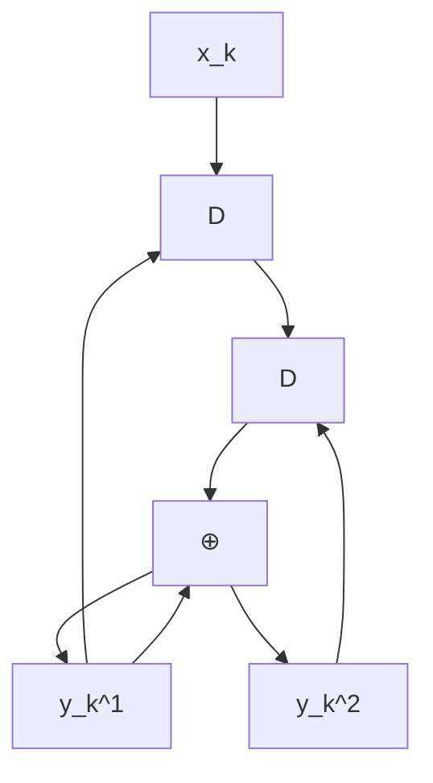
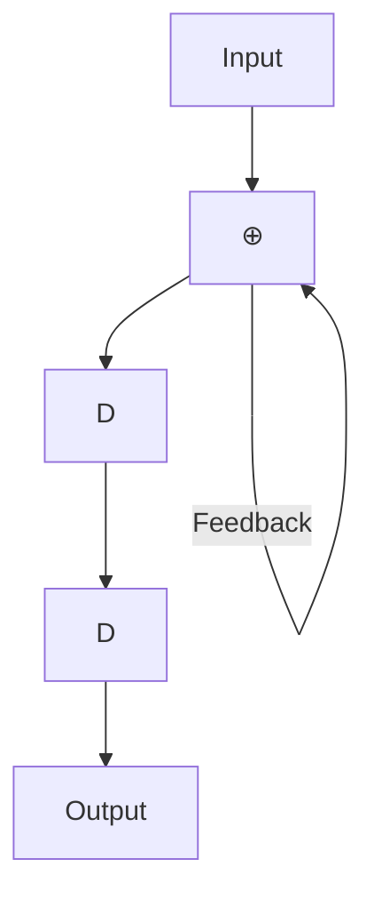
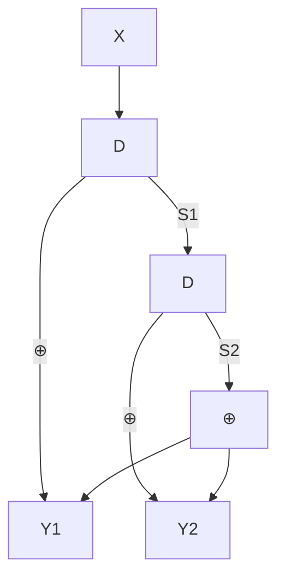
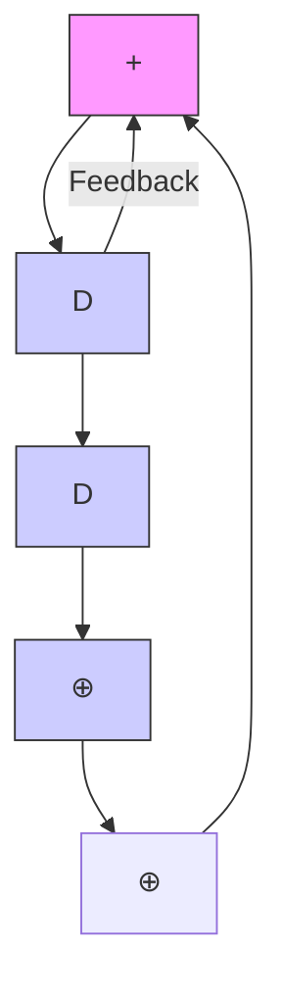
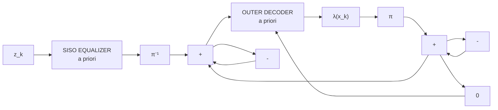
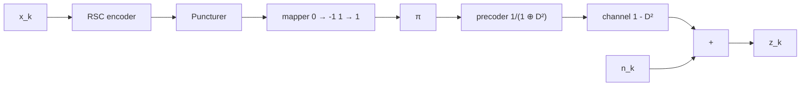

# 第二章  Turbo 码

在许多应用中，需要高纠错能力的应用通常也需要非常复杂的编码和解码电路。一个简单的解决方法是使用级联编码 (concatenated coding)，即使用多个编码器以串行或并行方式级联，借助交织器 (interleaver) 的帮助，然后对编码后的数据进行各个解码器的解码。虽然这种方法得到的结果被认为是次优的 (sub-optimal)，但它能在纠错能力和编解码过程的复杂度之间取得折衷。

迭代解码技术 (iterative decoding) [2, 3] 是一种能够降低系统误比特率 (BER: bit-error rate) 的技术。Turbo 码 [3] 的解码是迭代解码的一个范例，目前已被广泛应用于多种应用中，包括移动电话系统和卫星通信系统等。此外，用于 Turbo 解码的 Turbo 原理 (turbo principle) 还可以应用于均衡过程 (equalization)，这种技术称为"Turbo 均衡 (turbo equalization)" [21]，这已被视为新一代硬盘驱动器中实际使用的迭代解码过程 [6]，其性能优于过去未使用迭代解码技术的硬盘驱动器。

本章将从解释卷积码和 BCJR 算法 [18] 开始，它们是 Turbo 码的重要组成部分，以使读者理解硬盘驱动器信号处理系统中使用的迭代编解码技术。

# 2.1 卷积码

纠错码，或称为前向纠错码 (FEC: forward error-correction code)，常用于处理由信道引起的噪声和错误。一般来说，纠错码可分为两类：分组码 (block code) 和卷积码 (convolutional code) [2]。此外，还有基于迭代解码技术的新型 ECC 码，如 Turbo 码 [3] 和 LDPC 码 [17] 等，其性能比卷积码更接近香农信道容量 (Shannon's channel capacity)。本节将总结卷积码的工作原理，因为它是 Turbo 码（将在第 2.3 节中讨论）的重要组成部分。

# 2.1.1 编码

卷积编码器 (convolutional encoder) 使用移位寄存器 (shift register) 和模二加法器 (modulo-2 adder) 进行数据编码。它对一个输入数据序列 (input data sequence) 进行编码，产生一个或多个输出数据序列。如果卷积编码器对 1 比特输入数据进行编码产生 $n$ 比特输出数据，则该卷积编码器的码率 (code rate) 为 $R = 1/n$。图 2.1 显示了码率 $R = 1/2$ 的卷积编码器示例，其中 $D$ 是单位延迟算子 (unit delay operator)，用于表示移位寄存器。在实际应用中，卷积编码器用生成多项式 (generator polynomial) 表示，其方程为 [1]

$$
G(D) = \sum_{i=0}^{\mu} g_i D^i \tag{2.1}
$$

其中 $\mu$ 是卷积编码器的记忆长度（即移位寄存器的数量），$g_i = 1$ 表示延迟 $i$ 个单位的输入数据位对当前时刻的输出数据位的生成有贡献。例如，图 2.1 (a) 中的卷积编码器的生成多项式为

$$
G(D) = [G_1(D), G_2(D)] = [1 \oplus D, 1 \oplus D^2] \tag{2.2}
$$

flowchart

(ก)

flowchart

(ค)

图 2.1 (ก) 卷积编码器, (ข) 系统卷积编码器, (ค) 递归系统卷积编码器

其中 $\oplus$ 是模二加法算子，$G_1(D)$ 是输出数据 $y_k^1$ 的生成多项式，$G_2(D)$ 是输出数据 $y_k^2$ 的生成多项式，记忆长度 $\mu = 2$。

此外，系统卷积编码器 (systematic convolutional encoder) 是一种使一组输出数据等于输入数据的卷积编码器，如图 2.1 (ข) 所示，其生成多项式为 $[1, 1 \oplus D^2]$。而带有反馈的系统卷积编码器称为递归系统卷积编码器 (recursive systematic convolutional encoder)，如图 2.1 (ค) 所示，其生成多项式为 $[1, 1/(1 \oplus D^2)]$。一般来说，递归系统卷积编码器比其他类型的卷积编码器更常用 [2]。

通常，卷积码的分析依赖于有限状态机 (FSM: finite state machine)，这是一种用于展示系统的输入数据、起始状态 (start state)、下一状态 (next state) 和输出数据之间转换关系的模型。图 2.2（左）显示了图 2.1 (ก) 中卷积编码器的有限状态机，共有 $2^\mu = 4$ 个状态：00、01、10 和 11。箭头线表示状态转移路径，箭头旁的值 $x/y^1y^2$ 表示输入数据位 $x$ 和输出数据位 $y^1$、$y^2$。此外，网格图 (trellis diagram) 用于每个时间间隔的状态转换，也可以用来解释卷积码的工作原理。图 2.2（右）显示了图 2.1 (ก) 中卷积编码器的网格图——即网格图在第 $k$ 阶段展示了编码器从 $k$ 时刻的一个状态到 $k+1$ 时刻的另一个状态的所有可能转换。箭头旁的值与有限状态机中的 $x/y^1y^2$ 相同。由于沿着网格图行进的路径 (path) 由一组分支 (branch) 组成（每阶段一个分支），因此每个码字 (codeword)（即卷积编码器的输出数据）必须对应于网格图中的一条唯一路径 (unique path)。

图 2.2 图 2.1 (ก) 的有限状态机图和网格图

**示例 2.1** 当输入数据位为 $\{x_0, x_1, x_2, x_3\} = \{1, 0, 1, 1\}$ 时，请展示图 2.1 (ก) 中卷积编码器的编码步骤。

**解** 图 2.1 (ก) 重新绘制如右图所示。将数据位 $\{x_k\}$ 送入卷积编码器进行编码的步骤如下：

flowchart

**第一步** 将所有移位寄存器的状态（即 $S_1$ 和 $S_2$）设置为 0（得到状态 00）。此步骤仅为编码器的准备工作，尚未输入任何数据位。

**第二步** 开始输入第一个数据位，值为 1（即 $x_0 = 1$）。此时 $Y_1 = X \oplus S_1 = 1 \oplus 0 = 1$，$Y_2 = X \oplus S_2 = 1 \oplus 0 = 1$，这就是第一个数据位编码后的输出数据。

**第三步** 开始输入第二个数据位，值为 0。电路中的所有值向右移动一位（此时 $S_1 = 1$，$S_2 = 0$），得到 $Y_1 = X \oplus S_1 = 0 \oplus 1 = 1$，$Y_2 = X \oplus S_2 = 0 \oplus 0 = 0$，这是第二个数据位的编码结果。

**第四步** 开始输入第三个数据位，值为 1。电路中的所有值再向右移动一位（此时 $S_1 = 0$，$S_2 = 1$），得到 $Y_1 = X \oplus S_1 = 1 \oplus 0 = 1$，$Y_2 = X \oplus S_2 = 1 \oplus 1 = 0$，这是第三个数据位的编码结果。

**第五步** 开始输入第四个数据位，值为 1。电路中的所有值再向右移动一位（此时 $S_1 = 1$，$S_2 = 0$），得到 $Y_1 = X \oplus S_1 = 1 \oplus 1 = 0$，$Y_2 = X \oplus S_2 = 1 \oplus 0 = 1$，这是第四个数据位的编码结果。

**第六步** 注意，卷积编码器的状态并未全部回到初始的零状态（此时处于状态 11）。因此，需要准备适当的尾部位 (tail bit)（另外 2 位）来使电路回到全零状态，编码过程才能完成。

**最后一步** 选择尾部位的原则很简单：考虑哪些数据位能使移位寄存器的值全部变为零。在这里，向电路输入两个 0 位即可使编码器回到状态 00，编码过程结束。第一个尾部位输出 $Y_1 = 1$ 和 $Y_2 = 1$，而第二个尾部位输出 $Y_1 = 0$ 和 $Y_2 = 1$。

以上描述的编码示例如图 2.3 所示。如果用状态转换图表示，则如图 2.4 所示；如果用网格图表示，则如图 2.5 所示。可以看到图 2.3–2.5 给出了相同的结果。

此外，卷积编码也可以使用 D 变换 (D transform) [1] 来实现。即卷积编码器输出的数据等于

$$
Y_i(D) = G_i(D) X(D) \tag{2.3}
$$

(ข) 网格图
图 2.8 (ก) 卷积编码器, (ข) 网格图

# 2.1.2 解码

在实际应用中，用卷积码编码的数据可以通过基于维特比算法 [13] 构建的解码器（即维特比检测器）进行解码。下面给出解码卷积码数据的示例。

**示例 2.3** 考虑图 2.8 (ก) 中的卷积编码器，其网格图如图 2.8 (ข) 所示。假设数据序列 $z_k$ 是解码器需要解码的数据，请解码数据序列 $z_k = \{11, 01, 10, 11, 00\}$。

**解** 设 $(u, q)$ 表示从状态 $u$ 到状态 $q$ 的状态转移，第 $k$ 阶段的分支度量 (branch metric) 定义为

$$
\rho_k(u, q) = |z_k^0 - \tilde{x}_k(u, q)|^2 + |z_k^1 - \tilde{y}_k(u, q)|^2
$$

其中 $\tilde{x}_k(u, q)$ 和 $\tilde{y}_k(u, q)$ 是与状态转移 $(u, q)$ 对应的数据位 $x_k$ 和 $y_k$。此外，$k+1$ 时刻状态 $q$ 的路径度量 (path metric) 定义为

图 2.9 数据 $z_k = \{11, 01, 10, 11, 00\}$ 的解码网格图

$$
\Phi_{k+1}(q) = \min_u \{\Phi_k(u) + \rho_k(u, q)\}
$$

因此，维特比检测器的解码步骤总结如下：

1. 对于每个阶段 $k$：
   - 对于每个状态 $q$：
     - 计算到达状态 $q$ 的所有分支的分支度量 $\rho_k(u, q)$
     - 选择路径度量最小的分支
     - 更新 $k+1$ 时刻状态 $q$ 的路径度量 $\Phi_{k+1}(q)$（对所有状态 $q$ 重复）
   -（对所有阶段 $k$ 重复）

2. 从路径度量最小的路径解码出输入数据位 $x_k$

图 2.9 显示了根据网格图的解码步骤，图中仅显示到达每个状态的幸存路径 (survivor path)。每条分支旁的值是该状态转移对应的分支度量 $\rho_k(u, q)$，每个状态节点处的数字是该状态的路径度量 $\Phi_k(q)$。从图中可知，卷积解码器给出的输入数据位估计值为 $\hat{x}_k = \{1, 0, 1, 1\}$。关于维特比检测器解码步骤的详细信息，可参见 [10] 的第 4 章。

然而，如果将卷积码用作 Turbo 码的组成部分，则不能在 Turbo 解码器中使用维特比检测器，因为 Turbo 解码器仅使用数据位的软信息（而维特比检测器输出的结果是硬信息或数据位的估计值）。因此，用于解码卷积码的 Turbo 解码器必须是基于 BCJR 算法 [18] 或 SOVA (Soft-output Viterbi algorithm) [19] 构建的检测器，这将在第 2.2 节和第 3 章中分别解释。

# 2.2 BCJR 算法

维特比检测器 [1, 13] 是一种最大似然检测器 (ML: maximum-likelihood detector)，用于解码卷积编码数据，其输出数据是所需检测数据序列的估计值。或者说，ML 检测器使数据序列的误码率最小，但不保证序列中的每个数据位都是最优的。也就是说，ML 检测器并不能使每个数据位的误码率最小。

此外，维特比检测器不能用于迭代解码系统，因为该系统需要在检测器和纠错解码器之间交换软信息。因此，迭代解码系统必须使用最大后验概率检测器，称为"MAP 检测器 (maximum a posteriori probability)"。MAP 检测器可以保证检测到的每个数据位都是最优的（即每个数据位的误码率最小）。

本节将解释 BCJR 算法 [18] 的工作原理，因为它是用于构建 MAP 检测器的算法。该算法由 Bahl、Cock、Jelinek 和 Raviv 提出并发展而来，用于检测通过具有符号间干扰 (ISI) 和加性高斯白噪声 (AWGN) 的信道的信号的最大后验概率 (APP: a posteriori probability)。

# 2.2.1 信道模型和网格图

考虑图 2.10 中的信道模型。接收端接收到的第 $k$ 个序列信号（即需要解码的信号）为

图 2.10 信道模型

图 2.11 网格图中第 $k$ 阶段的从状态 $u$ 到状态 $q$ 的状态转移 $(u, q)$

$$
y_k = \sum_{i=0}^{\nu} a_i h_{k-i} + n_k \tag{2.4}
$$

其中 $a_k \in \mathcal{A}$ 是从字母表集合 $\mathcal{A}$ 中选择的输入数据位（例如，对于二进制系统，$\mathcal{A} = \{0, 1\}$ 或 $\{-1, 1\}$），$H(D) = \sum_{k=0}^{\nu} h_k D^k$ 是离散信道 (discrete channel)，$h_k$ 是信道的第 $k$ 个系数，$\nu$ 是信道记忆长度，$n_k$ 是均值为零、方差为 $\sigma^2$ 的 AWGN（记为 $n_k \sim \mathcal{N}(0, \sigma^2)$），$r_k$ 是信道的输出数据，$L$ 是输入数据序列 $\{a_k\}$ 的长度。通常，一个扇区的数据长度为 $L = 4096$ 位。假设发送端发送了 $L$ 位的输入数据序列 $\mathbf{a} = [a_0, ..., a_{L-1}]$，每个数据位的可能值在集合 $\mathcal{A}$ 内，且当 $k < 0$ 和 $k > L-1$ 时不发送任何数据。因此，根据方程 (2.4)，接收端收到的全部信号以向量形式表示为 $\mathbf{y} = \{y_l\}_0^{L+\nu-1} = [y_0, ..., y_{L+\nu-1}]$。

图 2.11 显示了信道 $h_k$ 的网格图，其中 $\Psi_k \equiv [a_{k-1}, a_{k-2}, ..., a_{k-\nu}]$ 是 $k$ 时刻的状态（即 $k$ 时刻移位寄存器中的全部值），$Q = |\mathcal{A}|^\nu$ 是所有可能的状态总数，第 $k$ 阶段 (k-th stage) 是 $k$ 时刻到 $k+1$ 时刻之间所有可能的分支 (branch) 的集合，$(u, q)$ 表示从状态 $u$ 到状态 $q$ 的状态转移 (transition)。每个状态编号为 $0$ 到 $Q-1$，其中状态 $0$（即 $\psi_k \equiv [0, 0, ..., 0]$）用于 $k \leq 0$ 和 $k \geq L+\nu-1$ 时空闲状态 (idle state)。因此可以认为，图 2.11 显示了网格图的第 $k$ 阶段，该阶段对应于第 $k$ 个输入数据位（即 $a_k$）、第 $k$ 个信道输出数据（即 $r_k$）和第 $k$ 个接收端接收到的数据（即 $y_k$）。

# 2.2.2 最优检测器

在实际应用中，MAP 检测器被认为是最优检测器 (optimal detector)，因为它是能够保证每个数据位的误码率最小的数据检测器。例如，在对第 $k$ 个数据位（即 $a_k$）进行判决时，MAP 检测器会计算后验概率 (APP) 或 $\Pr[a_k \mid \mathbf{y}]$——即在给定序列 $\mathbf{y}$ 的条件下数据位 $a_k$ 的概率——对每个数据位 $a_k$，然后选择使 $\Pr[a_k \mid \mathbf{y}]$ 最大的 $a_k$ 值。MAP 检测器将重复此过程直到处理完所有 $L$ 位数据。在实际应用中，如果知道网格图中每个状态转移的后验概率 $\Pr[\psi_k = u; \psi_{k+1} = q \mid \mathbf{y}]$，则 $\Pr[a_k \mid \mathbf{y}]$ 可以很容易地计算出来。

BCJR 算法是一种非常高效的计算后验概率转移的方法，通过将 $k$ 时刻的状态转移概率 $\Pr[\psi_k = u; \psi_{k+1} = q \mid \mathbf{y}]$ 分解为三个部分：

1. 第一部分依赖于所有过去接收到的数据，即 $\mathbf{y}_{l < k} = \{y_l; l < k\} = \{y_l\}_0^{k-1}$
2. 第二部分依赖于当前接收到的数据，即 $y_k$
3. 第三部分依赖于所有未来接收到的数据，即 $\mathbf{y}_{l > k} = \{y_l; l > k\} = \{y_l\}_{k+1}^{L+\nu-1}$

根据贝叶斯定理，$\Pr[\psi_k = u; \psi_{k+1} = q \mid \mathbf{y}]$ 可以重新排列为

$$
\Pr[\psi_k = u; \psi_{k+1} = q \mid \mathbf{y}] = p(\psi_k = u; \psi_{k+1} = q; \mathbf{y}) / p(\mathbf{y}) \tag{2.5}
$$

$$
= p(\psi_k = u; \psi_{k+1} = q; \mathbf{y}_{l<k}; y_k; \mathbf{y}_{l>k}) / p(\mathbf{y})
$$

$$
= p(\mathbf{y}_{l>k} \mid \psi_k = u; \psi_{k+1} = q; \mathbf{y}_{l<k}; y_k) \cdot p(\psi_k = u; \psi_{k+1} = q; \mathbf{y}_{l<k}; y_k) / p(\mathbf{y}) \tag{2.6}
$$

其中 $p(x)$ 是 $x$ 的概率密度函数 (pdf: probability density function)。根据有限状态机模型的马尔可夫性质 (Markov property) [4]——即对于任何信道，关于 $k+1$ 时刻状态的信息会取代关于 $k$ 时刻状态的信息，包括 $y_k$ 和 $\mathbf{y}_{l<k}$——因此方程 (2.5) 可简化为

$$
\begin{aligned}
\Pr[\psi_k = u; \psi_{k+1} = q \mid \mathbf{y}] &= p(\mathbf{y}_{l>k} \mid \psi_{k+1} = q) \cdot p(\psi_k = u; \psi_{k+1} = q; \mathbf{y}_{l<k}; y_k) / p(\mathbf{y}) \\
&= p(\mathbf{y}_{l>k} \mid \psi_{k+1} = q) \cdot p(\psi_{k+1} = q; y_k \mid \psi_k = u; \mathbf{y}_{l<k}) \cdot p(\psi_k = u; \mathbf{y}_{l<k}) / p(\mathbf{y}) \tag{2.7}
\end{aligned}
$$

同样，利用马尔可夫性质对方程 (2.6) 进行整理，得到

$$
\begin{aligned}
\Pr[\psi_k = u; \psi_{k+1} = q \mid \mathbf{y}] &= \frac{p(\psi_k = u; \mathbf{y}_{l<k}) \cdot p(\psi_{k+1} = q; y_k \mid \psi_k = u) \cdot p(\mathbf{y}_{l>k} \mid \psi_{k+1} = q)}{p(\mathbf{y})} \\
&= \alpha_k(u) \times \gamma_k(u, q) \times \beta_{k+1}(q) / p(\mathbf{y}) \tag{2.8}
\end{aligned}
$$

可以看出，参数 $\alpha_k(u)$ 是 $k$ 时刻状态 $u$ 的概率，依赖于过去接收的数据 $\mathbf{y}_{l<k}$；参数 $\beta_{k+1}(q)$ 是 $k+1$ 时刻状态 $q$ 的概率，依赖于未来接收的数据 $\mathbf{y}_{l>k}$；参数 $\Upsilon_k(u, q)$ 是在当前数据 $y_k$ 条件下从 $k$ 时刻状态 $u$ 转移到 $k+1$ 时刻状态 $q$ 的概率（各参数如图 2.11 所示）。通常，参数 $\alpha_k(u)$ 和 $\beta_{k+1}(q)$ 称为状态度量 (state metric)，参数 $\Upsilon_k(u, q)$ 称为分支度量 (branch metric)。

设 $S_a$ 是对应于数据位 $a$ 的所有可能状态转移 $(u, q)$ 的集合。则后验概率 $\Pr[a_k = a \mid \mathbf{y}]$ 可由下式求得

$$
\begin{aligned}
\Pr[a_k = a \mid \mathbf{y}] &= \sum_{(u, q) \in S_a} \Pr[\psi_k = u; \psi_{k+1} = q \mid \mathbf{y}] \\
&= \frac{1}{p(\mathbf{y})} \sum_{(u, q) \in S_a} \alpha_k(u) \, \gamma_k(u, q) \, \beta_{k+1}(q) \tag{2.9}
\end{aligned}
$$

当已知每个状态转移 $(u, q)$ 和每个 $k$ 阶段的 $\alpha_k(u)$、$\gamma_k(u, q)$ 和 $\beta_{k+1}(q)$ 时，方程 (2.8) 即可轻松求解。

# 2.2.3 BCJR 算法参数的计算

BCJR 算法中方程 (2.8) 的各参数——即 $\gamma_k(u, q)$、$\alpha_k(u)$、$\beta_{k+1}(q)$ 和 $p(\mathbf{y})$——可按以下方式计算。

## 对于 AWGN 信道的分支度量 $\Upsilon_k(u, q)$ 的计算

BCJR 算法与维特比算法 [13] 的不同之处在于，BCJR 算法沿两条方向进行计算：

1. **前向计算 (forward pass)**：从第一个接收到的数据开始向前计算，直到最后一个数据
2. **后向计算 (backward pass)**：从最后一个接收到的数据开始向后计算，直到第一个数据

此外，BCJR 算法的分支度量计算公式为

$$
\begin{aligned}
\gamma_k(u, q) &= p(\psi_{k+1} = q; y_k \mid \psi_k = u) \\
&= p(y_k \mid \psi_k = u; \psi_{k+1} = q) \cdot p(\psi_{k+1} = q \mid \psi_k = u) \tag{2.10}
\end{aligned}
$$

对于 AWGN 信道，接收到的信号为 $y_k = r_k + n_k$，其中 $n_k \sim \mathcal{N}(0, \sigma^2)$ 是加性高斯白噪声。设 $\hat{a}(u, q)$ 和 $\hat{r}(u, q)$ 分别是对应于状态转移 $(u, q)$ 的输入数据位和信道输出数据，则方程 (2.10) 右边的第一项为

$$
p(y_k \mid \psi_k = u; \psi_{k+1} = q) = \frac{1}{\sqrt{2\pi\sigma^2}} \exp\left\{-\frac{1}{2\sigma^2} |y_k - \hat{r}(u, q)|^2\right\} \tag{2.11}
$$

其中 $\exp(\cdot)$ 是指数函数 (exponential function)。方程 (2.10) 右边的第二项为

$$
\begin{aligned}
p(\psi_{k+1} = q \mid \psi_k = u) &= p(a_k = \hat{a}(u, q); \psi_k = u) / p(\psi_k = u) \\
&= p(\psi_k = u \mid a_k = \hat{a}(u, q)) \cdot p(a_k = \hat{a}(u, q)) / p(\psi_k = u) \\
&= p(a_k = \hat{a}(u, q)) \tag{2.12}
\end{aligned}
$$

在实际应用中，方程 (2.12) 中的概率称为数据位 $a_k$ 的先验概率 (a priori probability)。将方程 (2.11) 和 (2.12) 代入方程 (2.10)，得到 BCJR 算法的分支度量为

$$
\gamma_k(u, q) = \frac{1}{\sqrt{2\pi\sigma^2}} \exp\left\{-\frac{1}{2\sigma^2} |y_k - \hat{r}(u, q)|^2\right\} \times p(a_k = \hat{a}(u, q)) \tag{2.13}
$$

可以看出，BCJR 算法的分支度量比维特比算法 [4] 的分支度量多了一项 $p(a_k = \hat{a}(u, q))$。当所有数据位 $a_k$ 出现的概率相等时，先验概率 $p(a_k = a)$ 是与 $a$ 无关的常数。因此，在这种情况下 BCJR 算法的分支度量等于维特比算法的分支度量。然而，当各个数据位 $a_k$ 出现的概率不相等时，如果预先知道每个 $a_k$ 的信息，将有助于提高数据解码的准确性。

## 状态度量 $\alpha_k(u)$ 和 $\beta_{k+1}(q)$ 的计算

方程 (2.7) 中的状态度量 $\alpha_k(u)$ 和 $\beta_{k+1}(q)$ 可以利用马尔可夫性质和递归技术 (recursive technique) 方便地计算。从方程 (2.7) 可得

$$
\alpha_k(u) = p(\psi_k = u; \mathbf{y}_{l < k}) \tag{2.14}
$$

因此

$$
\begin{aligned}
\alpha_{k+1}(q) &= p(\psi_{k+1} = q; \mathbf{y}_{l < k+1}) \\
&= p(\psi_{k+1} = q; y_k; \mathbf{y}_{l < k}) \\
&= \sum_{u=0}^{Q-1} p(\psi_{k+1} = q; y_k; \psi_k = u; \mathbf{y}_{l < k}) \\
&= \sum_{u=0}^{Q-1} p(\psi_{k+1} = q; y_k \mid \psi_k = u; \mathbf{y}_{l < k}) \cdot p(\psi_k = u; \mathbf{y}_{l < k})
\end{aligned}
$$

# 2.3 Turbo 码

Turbo 码 (turbo code) 是一种信道编解码方法，由 Berrou、Glavieux 和 Thitimajshima [3] 于 1993 年提出。Turbo 码的优点是：即使在信道 SNR 较低的情况下也能很好地工作，纠错能力强，并且性能接近香农定理 (Shannon's theorem) [25] 的极限——这些都是通过不复杂的编解码过程实现的。在 1993 年之前，还没有任何信道编码方法能够做到这一点，或者说即使能做到也需要非常复杂的解码电路。因此，Turbo 码的发现被认为是一项重要的发现，极大地改变了信道编码领域的研究方向。在过去的许多年中，与 Turbo 码相关的研究和开发成果大量涌现。此外，Turbo 码已被应用于多种实际应用中，例如第三代移动电话系统 (3G) 已将 Turbo 码作为基站和移动电话之间通信的标准。

Turbo 码的基本结构与其他编解码方法有三个主要区别：使用并行级联编码 (parallel concatenated encoding)、使用反馈编码器 (feedback encoder) 以及使用迭代解码 (iterative decoding)。图 2.17 显示了使用 Turbo 编解码的系统结构。二进制数据序列 $x_k \in \{0, 1\}$ 被送入 Turbo 编码器，输出三个数据序列。然后，这三个数据序列被送入复用器 (MUX: multiplexer) 合并为单个数据序列 $d_k$，再送入映射器 (mapper) 将数据位 0 转换为 -1。得到的数据序列 $s_k$ 被发送到接收端，受到噪声 $n_k$ 的干扰。接收端接收到的信号 $z_k$ 通过解复用器 (DEMUX: demultiplexer) 将 $z_k$ 分离为三个数据序列，然后送入 Turbo 解码器进行解码。以下将解释图 2.17 中 Turbo 编解码系统各组件的的工作原理。

flowchart

图 2.18 Turbo 编码器的基本结构

# 2.3.1 Turbo 编码器

Turbo 编码器的结构如图 2.18 所示。输入数据序列 $x_k$ 被送入 Turbo 编码器的三个组成部分：将 $x_k$ 分别转换为 $x_k$、$y_k^1$ 和 $y_k^2$ 三个数据序列（即该 Turbo 编码器的码率为 1/3）。从图 2.18 可以看到，数据序列 $y_k^1$ 是通过将 $x_k$ 送入子编码器 1 得到的；数据序列 $y_k^2$ 则是将 $x_k$ 送入交织器 (interleaver)（用符号 $\pi$ 表示），对 $x_k$ 序列中每个数据的位置进行重新排列后，再将结果送入子编码器 2 得到的。子编码器 2 的基本结构可以与子编码器 1 相同或不同。

# 2.3.2 复用器和解复用器

复用器 (MUX: multiplexer) 的功能是将多个编码后的数据序列合并为单个数据序列，而解复用器 (DEMUX: demultiplexer) 的功能则相反——它将输入的数据序列分离为与复用器输入端相对应的多个数据序列，如图 2.19 所示。

# 2.3.3 Turbo 解码器

Turbo 码的解码过程是迭代的，这意味着不是只有一个解码器进行一次解码，而是由多个子解码器组成（见图 2.20），每个子解码器交替工作。即当一个子解码器正在解码时，另一个子解码器等待，一个解码器的解码结果被传递给另一个解码器，作为下一轮解码的参考信息。两个解码器轮流工作，直到结果收敛 (converge) 到合适的值。注意，子解码器的数量与发送端子编码器的数量相同，且它们协同工作 [18]。

图 2.20 显示了 Turbo 解码器的基本结构，其工作步骤如下：
接收端接收到的信号通过解复用器，得到数据序列 $x_k$、$y_k^1$ 和 $y_k^2$ 的估计值，即 $\tilde{x}_k$、$\tilde{y}_k^1$ 和 $\tilde{y}_k^2$。然后按以下步骤进行 Turbo 解码：

图 2.20 Turbo 解码器的基本结构

1. 将数据序列 $\tilde{x}_k + \lambda_2^{\text{ext}}(x_k)$ 和数据序列 $\tilde{y}_k^1$ 一起送入子解码器 1。其中 $\lambda_2^{\text{ext}}(x_k)$ 是数据位 $x_k$ 的先验信息，即数据位 $x_k$ 的外部信息 (extrinsic information) 的 LLR 值。在解码的第一轮中，$\lambda_2^{\text{ext}}(x_k)$ 的值为零（这意味着每个数据位 $x_k = 0$ 或 $x_k = 1$ 的概率相等）。解码结果包含两部分：第一部分是数据位 $x_k$ 的 LLR 值 $\lambda(x_k)$，第二部分是数据位 $y_k^1$ 的 LLR 值 $\lambda(y_k^1)$。

2. 计算从子解码器 1 得到的数据位 $x_k$ 的外部信息 LLR 值 $\lambda_1^{\text{ext}}(x_k)$，关系如下：
   $$
   \lambda_1^{\text{ext}}(x_k) = \lambda(x_k) - \lambda_2^{\text{ext}}(x_k)
   $$

3. $\lambda_1^{\text{ext}}(x_k)$ 被送入交织器 ($\pi$)，然后以子解码器 1 提供的先验信息的形式传递给子解码器 2。注意，子解码器 1 和子解码器 2 之间的交织过程 $\pi(x_k)$ 是为了对数据位序列进行重新排列，使其与子解码器 2 中使用的数据位序列一致。

4. 从子解码器 1 得到的先验信息和数据序列 $\tilde{y}_k^2$ 被送入子解码器 2。解码结果包含两部分：第一部分是数据位 $\pi(x_k)$ 的 LLR 值 $\lambda(\pi(x_k))$，第二部分是数据位 $y_k^2$ 的 LLR 值 $\lambda(y_k^2)$。

5. $\lambda(\pi(x_k))$ 被送入解交织器 ($\pi^{-1}$)，得到 $\lambda(x_k)$，该值用于判断每个数据位可能是 0 还是 1（当达到 Turbo 解码指定的迭代次数时）。

6. 计算从子解码器 2 得到的数据位 $x_k$ 的外部信息 LLR 值 $\lambda_2^{\text{ext}}(x_k)$，关系如下：
   $$
   \lambda_2^{\text{ext}}(x_k) = \lambda(x_k) - \lambda_1^{\text{ext}}(x_k)
   $$

7. 步骤 1-6 构成一轮完整的 Turbo 解码。对于下一轮 Turbo 解码，回到步骤 1，此时数据序列 $\tilde{x}_k + \lambda_2^{\text{ext}}(x_k)$ 的和会发生变化，因为 $\lambda_2^{\text{ext}}(x_k)$ 是前一轮 Turbo 解码得到的新值，但数据序列 $\tilde{x}_k$ 保持不变。

8. 当 Turbo 解码达到指定的迭代次数后，使用从子解码器 2 得到的 LLR 值 $\lambda(x_k)$，将其送入阈值检测器 (threshold detector) 以得到 $\hat{x}_k$ 的估计值，关系如下：
   $$
   \hat{x}_k = \begin{cases} 0, & \text{if } \lambda(x_k) \leq 0 \\ 1, & \text{if } \lambda(x_k) > 0 \end{cases} \tag{2.31}
   $$

注意，在子解码器之间传递的信息仅限于外部信息部分。子解码器之间仅交换这部分信息被认为是 Turbo 码成功的关键。

# 2.3.4 交织器

交织器 (interleaver) 的功能是对每个输入数据位的位置进行重新排列，使输出数据尽可能具有随机性。换句话说，交织器的作用是将可能发生在连续多位错误 (error burst) 中的每个错误位分散到数据序列的其他位置。因此，交织器被认为是影响 Turbo 码性能的重要组件 [26]，它有助于降低错误平层 (error floor) [2, 4] 的影响。在实际应用中，性能最优的交织器必须使交织器输出端的数据序列尽可能具有随机性。因此，理想交织器 (ideal interleaver) 就是随机交织器 (random interleaver) [26]，但这在实际应用中难以实现。因此，设计适合信道的交织器以获得最佳性能是非常必要的（详见 [26]）。本节将介绍几种值得关注的交织器的工作方式。

## 行列交织器

行列交织器 (row-column interleaver) 是最简单的交织器，其功能是在数据块内交换数据的位置。这种交织器类似于存储器：数据按行写入存储器，按列读出。例如，假设一个数据块共有 20 个数据，即 $\{X_1, X_2, X_3, \dots, X_{20}\}$。这些数据按行写入存储器，如图 2.21 (a) 所示。然后，交织器按列读取数据，得到输出数据，如图 2.21 (b) 所示。在实际应用中，交织器中使用的行数和列数可以根据应用的特点进行调整。

## 伪随机交织器

伪随机交织器 (pseudo-random interleaver) [26] 由伪随机数生成器或查找表 (look-up table) 定义，其中包含从 1 到 N 的随机排列的数字，N 是要进行位置交换的数据位数（即输入交织器的数据块大小）。这种交织器的性能取决于交织器的大小（N 越大，性能越好）。通常，选择使用这种交织器的标准是通过系统仿真来确定哪种特征的交织器性能最好。

## S 随机交织器

S 随机交织器 (S-random interleaver) [27] 的工作方式与伪随机交织器类似，但增加了一个约束条件：输入数据序列中相距小于或等于 S 个位置的每个数据位，在输出序列中必须相距不小于 S 个位置。

# 2.3.5 实验结果

本节将展示图 2.17 中 Turbo 编解码系统在信道条件下的仿真结果。输入数据序列 $x_k \in \{0, 1\}$ 的长度为 4096 位，周期为 $T$。

line

| E_c/N_0 (dB) | 0.5 迭代 | 1 迭代 | 3 迭代 | 5 迭代 | 10 迭代 |
|-------------|---------|-------|-------|-------|--------|
| 0.0         | 1.0     | 1.0   | 1.0   | 1.0   | 1.0    |
| 0.4         | 0.8     | 0.7   | 0.3   | 0.1   | 0.05   |
| 0.8         | 0.6     | 0.5   | 0.05  | 0.01  | 0.005  |
| 1.2         | 0.4     | 0.3   | 0.005 | 0.001 | 0.0005 |
| 1.6         | 0.2     | 0.1   | 0.0005| 0.0001| 0.00005|
| 2.0         | 0.1     | 0.05  | 0.00005|0.00001|0.000005|

图 2.22 不同迭代次数下 Turbo 系统的性能

实验中使用的 Turbo 编码器结构如图 2.18 所示，子编码器 1 和 2 均采用图 2.6 中的结构，使用的交织器为 S 随机交织器 ($S = 14$)。Turbo 编码的结果是三个数据序列：$x_k$、$y_k^1$ 和 $y_k^2$。然后，这三个数据序列被送入复用器合并为单个数据序列 $d_k$，再送入映射器将数据位 0 转换为 -1。接收端接收到的信号 $z_k$ 受到噪声 $n_k \sim \mathcal{N}(0, \sigma^2)$（其中 $\sigma^2 = N_0/(2T)$）的干扰，通过解复用器将 $z_k$ 分离为三个数据序列：$\tilde{x}_k$、$\tilde{y}_k^1$ 和 $\tilde{y}_k^2$，然后送入结构如图 2.20 所示的 Turbo 解码器进行解码，解码迭代次数为 10 次。

图 2.22 显示了不同迭代次数下 Turbo 系统的性能。y 轴为误比特率 (BER: bit-error rate)，x 轴为编码位能量与单边功率谱密度 $N_0$ 之比，定义为

$$
\frac{E_c}{N_0} = 10 \log_{10}\left(\frac{E_b}{R N_0}\right) \tag{2.32}
$$

单位为 dB，其中 $E_b = 1$ 是输入数据位的能量，$R = 1/3$ 是码率。从图中可以看出，系统性能随着解码迭代次数的增加而提高。其中，"0.5 iteration" 表示系统在尚未进行迭代工作时的性能（即使用图 2.20 中子解码器 1 输出的 $\lambda(x_k)$ 计算 BER）。然而，当 $E_c/N_0$ 较高时，系统在特定迭代次数下性能开始趋于饱和，这种现象称为错误平层 (error floor)。在实际应用中，可以通过多种方法解决此问题，例如使用预编码器 (precoder) [29] 等。

line

| 迭代次数 | E_c/N_0 = 0 dB | E_c/N_0 = 0.4 dB | E_c/N_0 = 0.8 dB | E_c/N_0 = 1.2 dB | E_c/N_0 = 1.6 dB | E_c/N_0 = 2 dB |
|---------|----------------|------------------|------------------|------------------|------------------|----------------|
| 1       | 0.1            | 0.1              | 0.1              | 0.1              | 0.1              | 0.1            |
| 2       | 0.05           | 0.05             | 0.05             | 0.05             | 0.05             | 0.05           |
| 3       | 0.02           | 0.02             | 0.02             | 0.02             | 0.02             | 0.02           |
| 4       | 0.01           | 0.01             | 0.01             | 0.01             | 0.01             | 0.01           |
| 5       | 0.005          | 0.005            | 0.005            | 0.005            | 0.005            | 0.005          |
| 6       | 0.002          | 0.002            | 0.002            | 0.002            | 0.002            | 0.002          |
| 7       | 0.001          | 0.001            | 0.001            | 0.001            | 0.001            | 0.001          |
| 8       | 0.0005         | 0.0005           | 0.0005           | 0.0005           | 0.0005           | 0.0005         |
| 9       | 0.0002         | 0.0002           | 0.0002           | 0.0002           | 0.0002           | 0.0002         |
| 10      | 0.0001         | 0.0001           | 0.0001           | 0.0001           | 0.0001           | 0.0001         |

图 2.23 不同 $E_c/N_0$ 水平下 Turbo 系统的性能

此外，图 2.23 显示了不同 $E_c/N_0$ 水平下 Turbo 系统的性能。y 轴为 BER，x 轴为迭代解码次数。可以清楚地看到，随着解码迭代次数的增加，系统性能提高（BER 降低），而当 $E_c/N_0$ 较高时，系统在特定迭代次数下性能开始趋于饱和。

# 2.3.6 串行级联 Turbo 编解码器

图 2.17、2.18 和 2.20 中所示的编解码系统是并行级联 Turbo 码 (parallel concatenated turbo code) 的结构。本节将介绍串行级联 Turbo 码 (serial concatenated turbo code)，它是将在第 2.4 节中解释的 Turbo 均衡 (turbo equalization) 的基础。

串行级联 Turbo 码是两个卷积编码器通过一个交织器串行级联而成的 [30]。图 2.24 显示了码率为 $R = 1/4$ 的串行级联 Turbo 编码器示例。其中，外部编码器 (outer encoder) 是一个系统编码器 (systematic encoder)，生成多项式为 $[1, 1 \oplus D]$，码率为 1/2；内部编码器 (inner encoder) 是一个递归系统卷积编码器 (recursive systematic convolutional encoder)，生成多项式为 $[1, 1/(1 \oplus D^2)]$，码率也为 1/2。

# 2.4 Turbo 均衡

均衡 (equalization) 是用于解决由信道引起的失真 (distortion) 问题的过程，这种失真会导致信道输出端的信号形状发生畸变。通常，数字通信系统中的接收端会使用均衡器 (equalizer) 来减小信号失真的影响。

考虑图 2.26 中的编码系统 (coded system)。输入数据序列 $x_k \in \{0, 1\}$ 被送入纠错编码器 (ECC encoder)、交织器 (interleaver) 和映射器 (mapper)，得到数据序列 $s_k \in \{\pm 1\}$。然后，数据序列 $s_k$ 通过受噪声 $n_k$ 干扰的信道 (channel)，接收端接收到的信号就是数据序列 $z_k$。

图 2.26 包含发送端和 A、B、C 三种接收端结构的数字通信系统

接收端的主要功能是估计发送端发送的数据（即估计 $\hat{x}_k$），可以通过三种方式实现：

**第一种（接收端 A）** 作为最优检测器 (optimal detector)，因为它导致的解码错误最少。也就是说，接收端 A 必须联合利用关于信道、交织器、映射器和 ECC 编码器的所有知识来计算并解码数据序列 $x_k$，找到最可能的数据序列。因此，接收端 A 的复杂度通常非常高，无法在任何实际应用中使用。

**第二种（接收端 B）** 是常用的接收端结构 (conventional receiver)，不采用迭代解码过程。接收端 B 以另一种形式解决信号失真问题：将信道视为具有特定码率的卷积编码器，可以利用网格图进行数据解码。如果信道抽头数 (tap) 不多，这种方法可行，因为抽头数会影响网格图中的状态数 (state) [4]。然而，如果信道抽头数较多，则将均衡过程分为两个步骤：

- **第一步**：将信号整形为具有较少抽头数 [10, 32] 且频率响应尽可能接近信道频率响应的部分响应目标 (PR: partial-response target)。此步骤有助于减轻噪声增强 (noise enhancement) 问题，并使整个系统的总响应具有有限数量的抽头。
- **第二步**：进行最大似然 (ML) 或最大后验概率 (MAP) 数据解码。

这种将均衡过程分为两个步骤的方法是部分响应最大似然 (PRML: partial-response maximum-likelihood) 技术的基础，广泛应用于磁记录系统 [32] 中。

检测完成后，得到数据序列 $s_k$ 的估计值 $\hat{s}_k$ 或数据位 $s_k$ 的软信息 $\lambda(s_k)$，具体取决于所使用的检测器类型。例如，如果使用维特比检测器，则输出 $\hat{s}_k$；如果使用 BCJR 检测器，则输出 $\lambda(s_k)$。之后，检测器将结果发送给解映射器 (de-mapper)、解交织器 (deinterleaver) 和纠错解码器 (ECC decoder)，以得到数据序列 $x_k$ 的估计值 $\hat{x}_k$。

**第三种（接收端 C）** 是 Turbo 均衡 (turbo equalization) 过程的结构。在实际应用中，Turbo 概念（使用两个子解码器交换软信息进行解码）也可以应用于均衡，这种技术称为 Turbo 均衡，使用该技术的接收端称为 "Turbo 均衡器 (turbo equalizer)" [21]。此系统可以视为串行级联 Turbo 码，其中信道充当内部码 (inner code)，ECC 编码器充当外部码 (outer code)。此外，解码器的结构与图 2.25 中的串行级联 Turbo 解码器的结构相同，只是内部解码器替换为 SISO 均衡器 (SISO equalizer)，如图 2.26 所示，或重新绘制为图 2.27。

flowchart

图 2.27 Turbo 均衡器的结构

flowchart

图 2.28 发送端（用于 Turbo 均衡器数据解码）

这种结构的优点是，所使用的 ECC 码不需要是 Turbo 码也能使系统具有良好的性能。例如，[33] 中的研究表明，对于使用预编码器 (precoder)（多项式形式为 $1/(1 \oplus D^2)$）和使用卷积码作为 ECC 码的 PR-IV 信道，Turbo 均衡器可以有效地工作。然而，采用迭代解码系统的新一代硬盘驱动器通常使用 LDPC 码 [5, 8, 17] 作为 ECC 码，因为其性能最优（详见第 4 章）。

注意事项：SISO 均衡器是用于输出软信息（用于迭代解码过程）的检测器的技术名称，而均衡器是将信号整形为目标响应的电路。然后，使用此目标构建用于 SISO 均衡器 [5, 8] 进行数据检测的网格图。

本书将重点介绍 Turbo 均衡器的工作原理，因为它是采用迭代解码系统的硬盘驱动器的核心组件。第 5 章将展示 Turbo 均衡器的性能和优势，其可应用于解决各种问题，如定时恢复 (timing recovery) [34–36] 和热粗糙 (TA: thermal asperity) [37] 检测与校正等。

# 2.4.1 Turbo 均衡器的性能

考虑图 2.28 中码率为 8/9 的数字通信系统。信息位 $x_k$ 每扇区为 3636 位，周期为 $T$。信息位通过码率 $R = 1/2$ 的递归系统卷积编码器（生成多项式为 $\left[1, \frac{1 \oplus D \oplus D^3 \oplus D^4}{1 \oplus D \oplus D^4}\right]$）进行编码，然后送入删余器 (puncturer) [2] 将码率从 1/2 提高到 8/9——即每 8 位删除 7 个校验位（例如，考虑图 2.8 (a) 中的卷积编码器，校验位就是 $y_k$ 数据位）——得到每扇区 4095 位的数据序列 $y_k$。然后，送入映射器和 S 随机交织器 ($S = 16$)，得到数据序列 $a_k$，再送入预编码器（多项式为 $1/(1 \oplus D^2)$）和 PR-IV 信道（多项式为 $1 - D^2$）。

接收端接收到的信号是数据序列 $z_k$，受到噪声 $n_k \sim \mathcal{N}(0, \sigma^2)$（其中 $\sigma^2 = N_0/(2T)$）的干扰。信号通过结构如图 2.27 所示的 Turbo 均衡器进行解码，只是在外部解码器的输入端增加了一个解删余器 (depuncturer)，在外部解码器的输出端增加了一个删余器 (puncturer)。此外，SISO 均衡器和 SISO 解码器基于 BCJR 算法构建，SISO 均衡器中使用的网格图由预编码器和信道的组合目标 [33] 构建。

图 2.29 显示了 Turbo 均衡器在各迭代次数下的 BER 性能。每个 BER 值是通过向系统输入多个扇区（每扇区 3636 位）的数据，直到迭代解码的第 10 轮累积超过 1000 个误码 (bit error) 获得的。其中，"0.5 iteration" 表示 SISO 均衡器输出端在尚未进行迭代工作时的性能（可以视为未编码系统 (uncoded system) 的性能）。从图中可以看出，系统性能随着迭代次数的增加而提高，直到某个 $E_c/N_0$ 水平使系统性能开始不再变化。例如，如果系统使用 7 次迭代，当 $E_c/N_0 > 5.5$ dB 时，系统性能开始趋于饱和（即系统出现错误平层）。

图 2.30 显示了 Turbo 均衡器的扇区误码率 (SER: sector error rate) 与 $E_c/N_0$ 的关系曲线。即如果一个扇区中出现一个或多个误码，则认为发生了扇区错误。从图中可以看出，随着迭代次数的增加，SER 降低，直到某个 $E_c/N_0$ 水平使系统性能开始趋于饱和。此外，图 2.31 显示了 Turbo 均衡器的 SER 与迭代次数的关系曲线。可以发现，在特定的 $E_c/N_0$ 水平下，随着迭代次数的增加，SER 降低，直到某次迭代后不再继续降低。例如，当 $E_c/N_0 = 5.5$ dB 时，系统性能不断提高直到第 7 次迭代，之后即使增加迭代次数，系统性能也趋于稳定。
