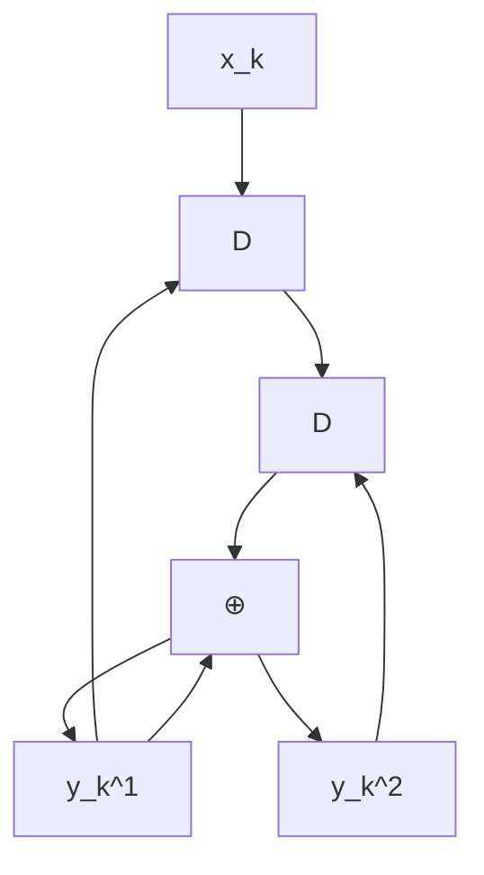
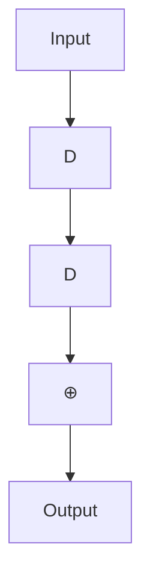
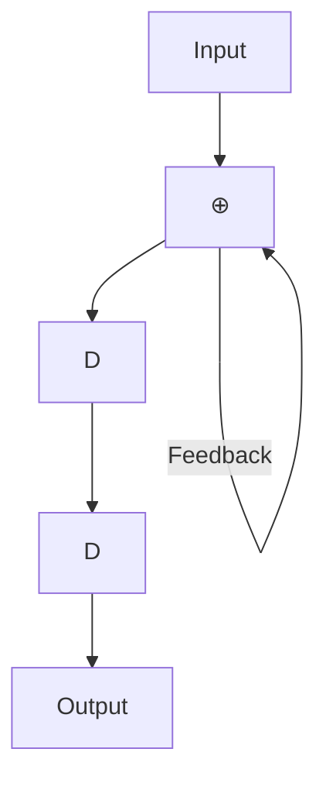

# 第二章 Turbo 码

在不同的应用场景中，通常需要极高纠错能力的系统，这就要求编码和解码电路具有很高的复杂度。一种简单且有效的解决方案是采用级联编码 (concatenated coding)，即通过串行或并行地连接多个编码器，并借助交织器 (interleaver) 的帮助来实现。随后，编码后的数据将由相应的解码器依次进行解码。尽管这种方法的结果被认为是次优的 (sub-optimal)，但它在纠错能力与编解码过程的复杂度之间取得了良好的平衡。

迭代解码 (iterative decoding) 技术 [2, 3] 能够进一步降低系统的误比特率 (BER: bit-error rate)。Turbo 码 [3] 的解码就是迭代解码的一个典型例子，目前已广泛应用于移动电话和卫星通信系统等领域。此外，用于 Turbo 码解码的 Turbo 原理还可以应用于均衡过程，称为“Turbo 均衡 (turbo equalization)” [21]。这种迭代解码过程已在新型硬盘驱动器中实际采用 [6]，其性能优于以往不使用迭代解码技术的硬盘驱动器。

本章将首先介绍卷积码 (convolutional code) 和 BCJR 算法 [18]，它们是 Turbo 码的核心组成部分。这将帮助读者理解应用于硬盘驱动器信号处理系统的编码与迭代解码技术。

## 2.1 卷积码

纠错码，也称为前向纠错码 (FEC: forward error correction code)，常用于处理信道产生的噪声和错误。一般来说，纠错码可分为两大类：分组码 (block code) 和卷积码 (convolutional code) [2]。此外，还出现了一些基于迭代解码技术的新型 ECC 码，如 Turbo 码 [3] 和 LDPC 码 [17] 等，它们的性能比卷积码更接近香农信道容量 (Shannon's channel capacity)。在本节中，我们将简要介绍卷积码的工作原理，因为它是 Turbo 码的重要组成部分，具体内容将在 2.3 节中详细讨论。

### 2.1.1 编码

卷积编码器 (convolutional encoder) 使用移位寄存器 (shift register) 和模 2 加法器 (modulo-2 adder) 对数据进行编码。它将一组输入数据序列进行编码，并产生一组数量大于或等于输入序列的输出数据序列。如果卷积编码器将 1 位输入数据编码为 $n$ 位输出数据，则该卷积编码器的码率 (code rate) 为 $R = 1 / n$。图 2.1 展示了一个码率为 $R = 1 / 2$ 的卷积编码器示例。其中 $D$ 为单位延迟算子 (unit delay operator)，代表一个移位寄存器。在实践中，卷积编码器可用生成多项式 (generator polynomial) 来表示，其表达式为 [1]：

$$
G (D) = \sum_ {i = 0} ^ {\mu} g _ {i} D ^ {i} \tag {2.1}
$$

其中 $\mu$ 是卷积编码器的存储容量（即移位寄存器的数量），如果延迟 $i$ 个单位的输入数据位对当前输出数据位产生影响，则 $g_i = 1$。例如，图 2.1 (a) 中的卷积编码器具有如下生成多项式：

$$
G (D) = \left[ G _ {1} (D), G _ {2} (D) \right] = \left[ 1 \oplus D, 1 \oplus D ^ {2} \right] \tag {2.2}
$$

flowchart

(a)

flowchart

(b)

flowchart

(c)

图 2.1 (a) 卷积编码器，(b) 系统卷积编码器，以及 (c) 递归系统卷积编码器。

其中 $\oplus$ 为模 2 加法算子，$G_1(D)$ 是输出数据 $y_k^1$ 的生成多项式，$G_2(D)$ 是输出数据 $y_k^2$ 的生成多项式，且存储容量 $\mu = 2$。

此外，系统卷积编码器 (systematic convolutional encoder) 是一种特殊的卷积编码器，其其中一组输出数据与输入数据完全相同，如图 2.1 (b) 所示，其生成多项式为 $[1, 1 \oplus D^2]$。而带有反馈回路的系统卷积编码器被称为递归系统卷积编码器 (recursive systematic convolutional encoder)，如图 2.1 (c) 所示，其生成多项式为 $[1, 1 / (1 \oplus D^2)]$。通常，递归系统卷积编码器比其他类型的卷积编码器更受欢迎 [2]。

通常，卷积码的分析依赖于有限状态机 (FSM: finite state machine)，这是一种描述输入数据、初始状态、下一状态以及系统输出之间关系的模型（详见 [10] 第 4.3.1 节）。图 2.2 (左) 展示了图 2.1 (a) 卷积编码器的有限状态机，该编码器共有 $2^\mu = 4$ 个状态，分别为 00, 01, 10 和 11。箭头表示状态转移路径，箭头旁的 $x / y^1 y^2$ 分别代表输入位 $x$ 以及输出位 $y^1$ 和 $y^2$。此外，可以使用格图 (trellis diagram) 来描述卷积码在时间维度上的状态转移。图 2.2 (右) 展示了图 2.1 (a) 卷积编码器的格图。在第 $k$ 阶段的格图中，显示了编码器从时间 $k$ 的某个状态转移到时间 $k+1$ 的所有可能状态。箭头旁的数值即为有限状态机中的 $x / y^1 y^2$。由于沿着格图行走的每一条路径都对应于一个唯一的分支序列（每个时间阶段一个分支），因此每一个码字 (codeword)（即卷积编码器的输出数据）在格图中都对应唯一的一条路径（见图 2.5）。

图 2.2 图 2.1 (a) 卷积编码器的有限状态机和格图。

卷积码的分析通常依赖于有限状态机 (FSM: finite state machine)，这是一种描述输入数据、初始状态、下一状态以及系统输出之间关系的模型（详见 [10] 第 4.3.1 节）。图 2.2 (左) 展示了图 2.1 (a) 卷积编码器的有限状态机，该编码器共有 $2^\mu = 4$ 个状态，分别为 00, 01, 10 和 11。箭头表示状态转移路径，箭头旁的 $x / y^1 y^2$ 分别代表输入位 $x$ 以及输出位 $y^1$ 和 $y^2$。

此外，可以使用格图 (trellis diagram) 来描述卷积码在时间维度上的状态转移。图 2.2 (右) 展示了图 2.1 (a) 卷积编码器的格图。在第 $k$ 阶段的格图中，显示了编码器从时间 $k$ 的某个状态转移到时间 $k+1$ 的所有可能状态。箭头旁的数值即为有限状态机中的 $x / y^1 y^2$。由于沿着格图行走的每一条路径都对应于一个唯一的分支序列（每个时间阶段一个分支），因此每一个码字 (codeword)（即卷积编码器的输出数据）在格图中都对应唯一的一条路径（见图 2.5）。

图 2.2 图 2.1 (a) 卷积编码器的有限状态机和格图。

卷积码的分析通常依赖于有限状态机 (FSM: finite state machine)，这是一种描述输入数据、初始状态、下一状态以及系统输出之间关系的模型（详见 [10] 第 4.3.1 节）。图 2.2 (左) 展示了图 2.1 (a) 卷积编码器的有限状态机，该编码器共有 $2^\mu = 4$ 个状态，分别为 00, 01, 10 和 11。箭头表示状态转移路径，箭头旁的 $x / y^1 y^2$ 分别代表输入位 $x$ 以及输出位 $y^1$ 和 $y^2$。

此外，可以使用格图 (trellis diagram) 来描述卷积码在时间维度上的状态转移。图 2.2 (右) 展示了图 2.1 (a) 卷积编码器的格图。在第 $k$ 阶段的格图中，显示了编码器从时间 $k$ 的某个状态转移到时间 $k+1$ 的所有可能状态。箭头旁的数值即为有限状态机中的 $x / y^1 y^2$。由于沿着格图行走的每一条路径都对应于一个唯一的分支序列（每个时间阶段一个分支），因此每一个码字 (codeword)（即卷积编码器的输出数据）在格图中都对应唯一的一条路径（见图 2.5）。
