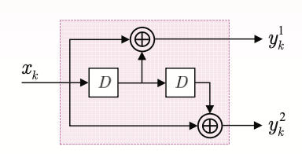
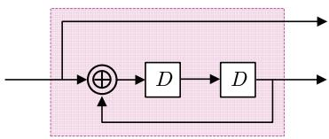
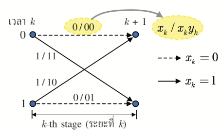
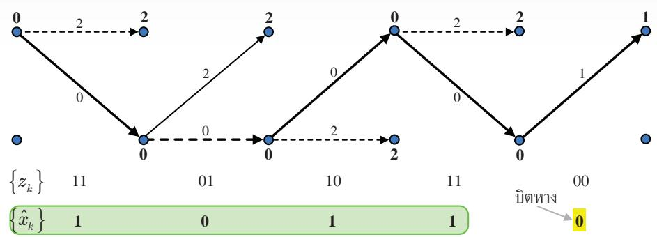
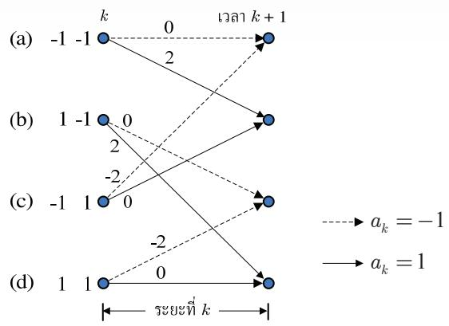
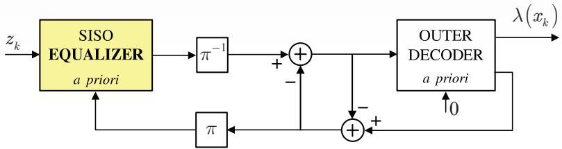

# 第2章

## Turbo 码

目前，纠错码 [1-3] 有多种类型可供选择，具体取决于每个应用的使用特性。一般来说，需要高纠错能力的应用也必须使用高度复杂的编码和解码电路。一个简单的解决方法是使用级联编码（concatenated coding），即使用多个编码器以串联或并联方式级联，借助交织器（interleaver）的帮助。随后，编码后的数据由每个解码器分别解码。虽然这种方法的结果被认为是次优的（sub-optimal），但它在纠错能力和编解码过程的复杂度之间取得了权衡。

迭代解码技术（iterative decoding）[2, 3] 是一种能够显著降低系统误比特率（BER: bit-error rate）的技术。Turbo 码（turbo code）[3] 的数据解码是迭代解码的一个例子，目前已广泛应用于移动电话系统和卫星通信系统等应用中。此外，用于 Turbo 数据解码的 Turbo 原理还可以应用于均衡（equalization）过程，这种技术称为"Turbo 均衡（turbo equalization）" [21]，这是一种已在新型硬盘驱动器 [6] 中实际应用的迭代解码过程，其性能优于过去未使用迭代解码技术的硬盘驱动器。

本章将从解释卷积码和 BCJR 算法 [18] 开始，它们是 Turbo 码的重要组成部分，使读者理解硬盘驱动器信号处理系统中使用的迭代编解码技术。

## 2.1 卷积码

纠错码，或称为前向纠错码（FEC: forward error correction code），常用于处理信道产生的噪声和错误。一般来说，纠错码可分为两类：分组码（block code）和卷积码（convolutional code）[2]。此外，还有利用迭代解码技术的新型 ECC 码，如 Turbo 码 [3] 和 LDPC 码 [17] 等，它们的性能更接近香农的信道容量（Shannon's channel capacity），优于卷积码。本节将总结卷积码的工作原理，因为它是 Turbo 码的重要组成部分，将在第2.3节中进一步讨论。

### 2.1.1 编码

卷积编码器（convolutional encoder）使用移位寄存器（shift register）和模二加法器（modulo-2 adder）进行数据编码。它对一个输入数据序列进行编码，并生成一个或多个输出数据序列。如果卷积编码器对1比特输入数据进行编码，产生 n 比特输出数据，则该卷积编码器的码率（code rate）为 $R = 1 / n$。图2.1显示了码率为 $R = 1 / 2$ 的卷积编码器示例，其中 D 是单位延迟算子（unit delay operator），用于表示移位寄存器。在实际中，卷积编码器用生成多项式（generator polynomial）表示，其方程为 [1]

$$
G ( D ) = \sum _ { i = 0 } ^ { \mu } g _ { i } D ^ { i }\tag{2.1}
$$

其中 $\mu$ 是卷积编码器的存储器数（或移位寄存器数量），如果延迟 i 个单位的输入比特对当前时刻的输出比特有影响，则 $g _ { i } = 1$。例如，图2.1(a)中的卷积编码器的生成多项式为

$$
G \big ( D \big ) = \big [ G _ { 1 } \big ( D \big ) , G _ { 2 } \big ( D \big ) \big ] = \big [ 1 \oplus D , 1 \oplus D ^ { 2 } \big ]\tag{2.2}
$$

  
(a)
  
(b)
 
(c)
图2.1 (a) 卷积编码器, (b) 系统卷积编码器, 以及 (c) 递归系统卷积编码器

其中 $\oplus$ 是模二加法算子，$G _ { 1 } ( D )$ 是输出数据 $y _ { k } ^ { 1 }$ 的生成多项式，$G _ { 2 } ( D )$ 是输出数据 $y _ { k } ^ { 2 }$ 的生成多项式，存储器数为 $\mu = 2$。

此外，系统卷积编码器（systematic convolutional encoder）是一种输出数据序列之一等于输入数据的卷积编码器，如图2.1(b)所示，其生成多项式为 $[1, 1 \oplus D ^ { 2 }]$。带有反馈的系统卷积编码器称为递归系统卷积编码器（recursive systematic convolutional encoder），如图2.1(c)所示，其生成多项式为 $\left[ 1 , 1 / \left( 1 \oplus D ^ { 2 } \right) \right]$。通常，递归系统卷积编码器比其他类型的卷积编码器更常用 [2]。

一般来说，卷积码的分析借助有限状态机（FSM: finite state machine），这是一个展示系统输入数据、起始状态（start state）、下一状态（next state）和输出数据变化的模型（详见 [10] 第4.3.1节）。图2.2（左）显示了图2.1(a)中卷积编码器的有限状态机，共有 $2 ^ { \mu } = 4$ 个状态：00、01、10 和 11。箭头线表示状态转移路径，箭头旁的值 $x / y ^ { 1 } y ^ { 2 }$ 表示输入比特 x 和输出比特 $y ^ { 1 }$、$y ^ { 2 }$ 的值。此外，网格图（trellis diagram）用于表示每个时刻的状态转移，也可以用来解释卷积码的工作原理。图2.2（右）显示了图2.1(a)中卷积编码器的网格图。即在第 k 阶段的网格图显示了编码器从时刻 k 的一个状态到时刻 k+1 的另一个状态的所有可能状态转移。箭头旁的值与有限状态机中的 $x / y ^ { 1 } y ^ { 2 }$ 相同。由于沿着网格图行走的路径（path）由一组分支（branch）组成，每个阶段一个分支，因此每个码字（codeword）（即卷积编码器的输出数据）必须对应于网格图中唯一的一条路径（unique path）（见图2.5）。

  
图2.2 图2.1(a)的有限状态机图和网格图

例2.1 请展示图2.1(a)中卷积编码器的编码步骤，当输入数据比特为 {x0, x1, x2, x3} = {1 0 1 1} 时。

解法 图2.1(a)可重新绘制如右图所示。将比特数据 $\{ x _ { k } \}$ 用卷积编码器编码的步骤如下：

第一步，将所有移位寄存器的状态，即 $\mathrm { S } _ { 1 }$ 和 $\mathrm { S } _ { 2 }$ 设为 0（使其处于状态 00）。此步骤仅用于编码器的准备工作，尚未输入任何数据比特。

第二步，开始输入第一个比特，值为 1（即 $x _ { 0 } = 1$），使得 $\mathrm { Y } _ { 1 } = \mathrm { X } \oplus \mathrm { S } _ { 1 } = 1 \oplus 0 = 1$ 和 $\mathrm { Y } _ { 2 } = \mathrm { X } \oplus \mathrm { S } _ { 2 } = 1 \oplus 0 = 1$，这就是第一个比特编码得到的输出数据。

第三步，开始输入第二个比特，值为 0。电路中的各值向右移位一个比特：$\mathbf { S } _ { 1 } = 1$，$\mathbf { S } _ { 2 } = 0$，使得 $\mathrm { Y } _ { 1 } = \mathrm { X } \oplus \mathrm { S } _ { 1 } = 0 \oplus 1 = 1$ 和 $\mathrm { Y } _ { 2 } = \mathrm { X } \oplus \mathrm { S } _ { 2 } = 0 \oplus 0 = 0$，这就是第二个比特编码的结果。

第四步，开始输入第三个比特，值为 1。电路中的所有值再向右移位一个比特（此时 $\mathbf { S } _ { 1 } = 0$，$S _ { 2 } = 1$），使得 $\mathrm { Y } _ { 1 } = \mathrm { X } \oplus \mathrm { S } _ { 1 } = 1 \oplus 0 = 1$ 和 $\mathrm { Y } _ { 2 } = \mathrm { X } \oplus \mathrm { S } _ { 2 } = 1 \oplus 1 = 0$，这就是第三个比特编码的结果。

第五步，按上述步骤继续处理第四个比特。

第六步，观察到卷积编码器的状态并未回到全零的初始状态（目前处于状态 11）。因此需要准备适当的 2 个尾比特（tail bit），使电路回到全零状态，编码过程才算完成。

最后一步，选择尾比特的值的简单原则是：考虑哪些数据比特能使移位寄存器中的值全为零。此处输入两个 0 比特到电路中即可使编码器回到状态 00，编码过程结束。第一个尾比特输出 $\mathrm { Y } _ { 1 } = 1$ 和 $\mathrm { Y } _ { 2 } = 1$，第二个尾比特输出 $\mathrm { Y } _ { 1 } = 0$ 和 $\mathrm { Y } _ { 2 } = 1$。

上述编码示例如图2.3所示。若以状态转移图表示则如图2.4所示，若以网格图表示则如图2.5所示。可以看出图2.3至图2.5给出了相同的结果。

此外，卷积编码还可以通过 D 变换（D transform）[1] 实现。即卷积编码器得到的输出数据等于

$$
Y _ { i } \left( D \right) = G _ { i } \left( D \right) X \left( D \right)\tag{2.3}
$$

  
图2.3 例2.1中卷积编码的步骤

 
图2.4 例2.1中的状态转移图

其中 $Y _ { i } \left( D \right) = \sum _ { k } y _ { k } ^ { i } D ^ { k }$ 是输出数据 $y _ { k } ^ { i }$ 的 D 变换结果，$i \in \left\{ 1 , 2 \right\}$，$G _ { i } ( D )$ 是输出数据 $y _ { k } ^ { i }$ 的生成多项式，$X ( D ) = \sum _ { k } x _ { k } D ^ { k }$ 是输入数据的 D 变换结果。例如，从例2.1（图2.1(a)）可得 $X \left( D \right) = 1 + D ^ { 2 } + D ^ { 3 }$，$G _ { i } \left( D \right)$ 由方程(2.2)给出。因此两组编码输出数据 $\left\{ y _ { k } ^ { 1 } , y _ { k } ^ { 2 } \right\}$ 为

  
图2.5 例2.1中的网格图（显示码字的唯一可能路径）

$$
\begin{array} { c } { { Y _ { 1 } \bigl ( D \bigr ) = G _ { 1 } \bigl ( D \bigr ) X \bigl ( D \bigr ) = \bigl ( 1 \oplus D \bigr ) \bigl ( 1 + D ^ { 2 } + D ^ { 3 } \bigr ) } } \\ { { { } } } \\ { { { } = \bigl ( 1 + D ^ { 2 } + D ^ { 3 } \bigr ) \oplus \bigl ( D + D ^ { 3 } + D ^ { 4 } \bigr ) } } \\ { { { } } } \\ { { { } = 1 + D + D ^ { 2 } + D ^ { 4 } } } \end{array}
$$

$$
\begin{array} { c } { { Y _ { 2 } \left( D \right) = G _ { 2 } \left( D \right) X \left( D \right) = \left( 1 \oplus { D ^ { 2 } } \right) \left( 1 + { D ^ { 2 } } + { D ^ { 3 } } \right) } } \\ { { { } } } \\ { { { } = \left( 1 + D ^ { 2 } + D ^ { 3 } \right) \oplus \left( { D ^ { 2 } } + { D ^ { 4 } } + { D ^ { 5 } } \right) } } \\ { { { } } } \\ { { { } = 1 + D ^ { 3 } + D ^ { 4 } + D ^ { 5 } } } \end{array}
$$

即 $\left\{ y _ { 0 } ^ { 1 } , y _ { 1 } ^ { 1 } , y _ { 2 } ^ { 1 } , y _ { 3 } ^ { 1 } , y _ { 4 } ^ { 1 } , y _ { 5 } ^ { 1 } \right\} = \left\{ 1 \ 1 \ 1 \ 0 \ 1 \ 0 \right\}$ 和 $\left\{ y _ { 0 } ^ { 2 } , y _ { 1 } ^ { 2 } , y _ { 2 } ^ { 2 } , y _ { 3 } ^ { 2 } , y _ { 4 } ^ { 2 } , y _ { 5 } ^ { 2 } \right\} = \left\{ 1 \ 0 \ 0 \ 1 \ 1 \ 1 \right\}$，与图2.3至图2.5得到的输出数据一致。
 
例2.2 考虑图2.6中的卷积编码器，其生成多项式以八进制数表示为 $(g _ { 1 } , g _ { 2 } ) = ( 1 7 , 1 1 )$，即二进制(001111, 001001)。其中 $g _ { 1 }$ 称为反馈多项式（feedback polynomial），$g _ { 2 }$ 称为前馈多项式（feedforward polynomial）。在某些书籍中，生成多项式以 D 域的分数形式表示为 $\frac { g _ { 2 } ( D ) } { g _ { 1 } ( D ) } = \frac { 1 + D ^ { 3 } } { 1 + D + D ^ { 2 } + D ^ { 3 } }$。请绘制有限状态机图，并对数据比特 11011100 进行编码（最左边的比特是第一个被编码的数据）。
 
解法 该卷积编码器的有限状态机图如图2.7所示。对于数据比特 11011100 的编码，步骤与例2.1类似：首先将所有移位寄存器的状态设为 0，然后逐比特输入数据到电路中，逐一计算编码器的输出数据。当所有输入数据比特输入完毕后，再输入若干尾比特，直到所有移位寄存器的值恢复为 0。

 
图2.6 生成多项式以八进制数表示的卷积编码器 (91, 92) = (17, 11)

 
图2.7 图2.6中卷积编码器的有限状态机（FSM）图

若操作正确，需要输入到编码器中的尾比特为 111，编码结果为 10101110001。

  
(a) 卷积编码器
  
(b) 网格图
图2.8 (a) 卷积编码器 和 (b) 网格图

### 2.1.2 解码

在实践中，用卷积码编码的数据可以使用基于维特比算法 [13] 的解码器进行解码，即维特比检测器。下面给出卷积码解码的示例。

例2.3 考虑图2.8(a)中的卷积编码器，其网格图如图2.8(b)所示。假设序列 $z _ { k }$ 是解码器需要解码的数据序列，请解码数据序列 $z _ { k } = \{ 1 1 ~ 0 1 ~ 1 0 ~ 1 1 ~ 0 0 \}$。

解法 用 $(u, q)$ 表示从状态 u 到状态 q 的状态转移。在第 k 阶段的分支度量（branch metric）定义为

$$
\rho _ { k } \left( u , q \right) = \left| z _ { k } ^ { 0 } - \tilde { x } _ { k } \left( u , q \right) \right| ^ { 2 } + \left| z _ { k } ^ { 1 } - \tilde { y } _ { k } \left( u , q \right) \right| ^ { 2 }
$$

其中 $\tilde { x } _ { k } \left( u , q \right)$ 和 $\tilde { y } _ { k } \left( u , q \right)$ 是对应于状态转移 $(u, q)$ 的比特数据 $x _ { k }$ 和 $y _ { k }$。此外，在时刻 $k+1$ 时状态 q 的路径度量（path metric）定义为

  
图2.9 网格图显示数据序列 $z _ { k } = \{ 1 1 ~ 0 1 ~ 1 0 ~ 1 1 ~ 0 0 \}$ 的解码过程

$$
\Phi _ { k + 1 } \left( q \right) = \operatorname* { m i n } _ { u } \left\{ \Phi _ { k } \left( u \right) + \rho _ { k } \left( u , q \right) \right\}
$$

因此维特比检测器的解码步骤如下：

1) 对于每个阶段 k
   对于每个状态 q
   计算到达状态 q 的所有分支的分支度量 $\rho _ { k } \left( u , q \right)$
   选择具有最小路径度量的分支
   更新状态 q 在时刻 $k+1$ 的路径度量 $\Phi _ { k + 1 } \left( q \right)$
   （对所有状态 q 重复）
   （对所有阶段 k 重复）
2) 从具有最小路径度量的路径解码输入数据 $x _ { k }$

图2.9显示了网格图上的数据解码过程，其中只显示了到达每个状态的存留路径（survivor path）。每条分支旁的值是对应于状态转移 (u, q) 的分支度量 $\rho _ { k } \left( u , q \right)$，每个状态节点处的数字是路径度量 $\Phi _ { k } \left( q \right)$。从图中可以看出，卷积解码器给出的输入数据比特估计值为 $\hat { x } _ { k } = \left\{ 1 , 0 , 1 , 1 \right\}$。有关维特比检测器数据解码过程的详细步骤，可参见 [10] 的第4章。

然而，当卷积码用作 Turbo 码的组成部分时，不能在 Turbo 解码器中使用维特比检测器，因为 Turbo 解码器仅使用比特数据的软信息工作（而维特比检测器输出的是硬信息或比特数据的估计值）。因此，用于解码卷积码的 Turbo 解码器必须使用基于 BCJR 算法 [18] 或 SOVA（soft-output Viterbi algorithm）[19] 的检测器。这些内容将在第2.2节和第3章中分别说明。

## 2.2 BCJR 算法

维特比检测器 [1, 13] 是一种最大似然（ML: maximum-likelihood）检测器，用于解码卷积码。其输出数据是待检测数据序列的估计值。或者说，ML 检测器使序列错误最小化，但不保证序列中的每个比特都是最优的。即 ML 检测器不能使每个比特的错误最小化。

此外，维特比检测器不能用于迭代解码系统，因为该系统需要在检测器和纠错解码器之间交换软信息。因此，迭代解码系统必须使用最大后验概率检测器，称为"MAP 检测器（maximum a posteriori probability）"。MAP 检测器可以保证每个检测到的比特都是最优的（即每个比特的错误最小化）。

本部分将解释 BCJR 算法 [18] 的工作原理，因为它是构建 MAP 检测器所使用的算法。该算法由 Bahl、Cock、Jelinek 和 Raviv 共同发明和开发，用于检测经过具有符号间干扰（ISI）和加性高斯白噪声（AWGN）的信道后的信号的最大后验概率（APP: a posteriori probability）。

### 2.2.1 信道模型与网格图

 
考虑图2.10中的信道模型。接收端接收到的信号（即待解码的信号）的第 k 个序列为
  
图2.10 信道模型

  
图2.11 网格图第 k 阶段的状态转移 (u, q)

$$
y _ { k } = \sum _ { i = 0 } ^ { \nu } a _ { i } h _ { k - i } + n _ { k }\tag{2.4}
$$

其中 $a _ { k } \in { \mathcal { A } }$ 是从字符集 $\mathcal { A }$ 中选择的输入数据比特（例如二进制系统为 $\mathcal { A } = \{ 0 , 1 \}$ 或 $\{ - 1 , 1 \}$），$H ( D ) = \sum _ { k = 0 } ^ { \nu } h _ { k } D ^ { k }$ 是离散信道（discrete channel），$h _ { k }$ 是信道的第 k 个系数，ν 是信道存储器，$n _ { k }$ 是均值为零、方差为 $\sigma ^ { 2 }$ 的 AWGN，记为 $n _ { k } \sim \mathcal { N } ( 0 , \sigma ^ { 2 } )$，$r _ { k }$ 是信道的输出数据，L 是输入数据序列 $\{ a _ { k } \}$ 的长度。通常一个扇区的数据有 L = 4096 比特。假设发送端发送了 L 比特的输入数据序列 $\mathbf { a } = \left[ a _ { 0 } , . . . , a _ { L - 1 } \right]$，每个数据比特的可能值在集合 A 内，且在 $k < 0$ 和 $k > L - 1$ 的时间段内没有数据传输。因此，由方程(2.4)，接收端接收到的所有信号以向量形式表示为 $\mathbf { y } = \left\{ y _ { l } \right\} _ { 0 } ^ { L + \nu - 1 } = \left[ y _ { 0 } , . . . , y _ { L + \nu - 1 } \right]$。

图2.11显示了信道 $h _ { k }$ 的网格图，其中 $\Psi _ { k } \equiv \left[ a _ { k - 1 } , a _ { k - 2 } , . . . , a _ { k - \nu } \right]$ 是时刻 k 的状态（state）（即时刻 k 所有移位寄存器中的值），$Q = \left| \mathcal { A } \right| ^ { \nu }$ 是所有可能的状态总数，第 k 阶段（k-th stage）是时刻 k 和时刻 $k+1$ 之间所有可能的分支（branch）组，$(u, q)$ 是表示从状态 u 到状态 q 的状态转移的符号。如果每个状态从 0 到 $Q-1$ 编号，其中状态 0 或 $\psi _ { k } \equiv \left[ 0 , 0 , . . . , 0 \right]$ 表示空闲状态（idle state），对应 $k \leq 0$ 和 $k \geq L + \nu - 1$。因此，可以说图2.11显示了网格图的第 k 阶段，对应于第 k 个输入数据比特 $a _ { k }$、第 k 个信道输出数据 $r _ { k }$ 和第 k 个接收端接收到的数据 $y _ { k }$。

### 2.2.2 最优检测器

在实践中，MAP 检测器被认为是最优检测器（optimal detector），因为它是能够保证每个数据比特的错误概率最小的数据检测器。例如，在判决第 k 个数据比特 $a _ { k }$ 时，MAP 检测器会计算后验概率（APP）即 $\operatorname* { P r } [ a _ { k } \mid \mathbf { y } ]$，它表示在给定序列 y 时数据比特 $a _ { k }$ 的概率。对于每个数据比特 $a _ { k }$，选择使 $\operatorname* { P r } [ a _ { k } \mid \mathbf { y } ]$ 最大的 $a _ { k }$ 值。MAP 检测器对 L 个数据比特逐个执行此操作。在实践中，如果知道网格图中每个状态转移 $(u, q)$ 的后验状态转移概率 $\operatorname* { P r } [ \psi _ { k } = u ; \Psi _ { k + 1 } = q \mid \mathbf { y } ]$，则 $\operatorname* { Pr } [ a _ { k } \mid \mathbf { y } ]$ 可以很容易地计算出来。

BCJR 算法是一种在求解后验状态转移概率方面非常高效的算法。它通过将时刻 k 的状态转移概率 $\operatorname* { P r } [ \psi _ { k } = u ; \Psi _ { k + 1 } = q \mid \mathbf { y } ]$ 分解为三个部分：

1) 第一部分依赖于过去接收到的所有数据，即 $\mathbf { y } _ { l < k } = \{ y _ { l } ; l < k \} = \{ y _ { l } \} _ { 0 } ^ { k - 1 }$

2) 第二部分依赖于当前接收到的数据，即 $y _ { k }$

3) 第三部分依赖于未来接收到的所有数据，即 ${ \bf y } _ { l > k } = \left\{ y _ { l } ; l > k \right\} = \left\{ y _ { l } \right\} _ { k + 1 } ^ { L + \nu - 1 }$

根据贝叶斯规则，$\operatorname* { P r } [ \psi _ { k } = u ; \psi _ { k + 1 } = q \mid \mathbf { y } ]$ 可以重新整理为

$$
\begin{array} { r l } & { \mathrm { P r } \big [ \boldsymbol { \Psi } _ { k } = u ; \boldsymbol { \Psi } _ { k + 1 } = q \mid \mathbf { y } \big ] = p \big ( \boldsymbol { \Psi } _ { k } = u ; \boldsymbol { \Psi } _ { k + 1 } = q ; \mathbf { y } \big ) / p \big ( \mathbf { y } \big ) } \\ & { \quad \quad \quad = p \big ( \boldsymbol { \Psi } _ { k } = u ; \boldsymbol { \Psi } _ { k + 1 } = q ; \mathbf { y } _ { l < k } ; \boldsymbol { y } _ { k } ; \mathbf { y } _ { l > k } \big ) / p \big ( \mathbf { y } \big ) } \\ & { \quad \quad \quad = p \big ( \mathbf { y } _ { l > k } | \boldsymbol { \Psi } _ { k } = u ; \boldsymbol { \Psi } _ { k + 1 } = q ; \mathbf { y } _ { l < k } ; \boldsymbol { y } _ { k } \big ) p \big ( \boldsymbol { \Psi } _ { k } = u ; \boldsymbol { \Psi } _ { k + 1 } = q ; \mathbf { y } _ { l < k } ; \boldsymbol { y } _ { k } \big ) / p \big ( \mathbf { y } \big ) } \end{array}\tag{2.5}
$$

其中 $p ( x )$ 是 x 的概率密度函数（pdf）。根据有限状态机模型的马尔可夫性质（Markov property）[4]，对于任何信道，时刻 $k+1$ 的状态信息会取代时刻 k 的状态信息以及 $y _ { k }$ 和 $\mathbf { y } _ { l < k }$ 的值。因此，方程(2.5)可简化为

$$
\begin{array} { r l r } {  { \operatorname* { P r } \bigl [ \boldsymbol { \psi } _ { k } = u ; \boldsymbol { \psi } _ { k + 1 } = q \mid \mathbf { y } \bigr ] = p \bigl ( \mathbf { y } _ { l > k } | \boldsymbol { \psi } _ { k + 1 } = q \bigr ) p \bigl ( \boldsymbol { \psi } _ { k } = u ; \boldsymbol { \psi } _ { k + 1 } = q ; \mathbf { y } _ { l < k } ; y _ { k } \bigr ) / p \bigl ( \mathbf { y } \bigr ) } } \\ & { } & \\ & { } & { = p \bigl ( \mathbf { y } _ { l > k } | \psi _ { k + 1 } = q \bigr ) p \bigl ( \psi _ { k + 1 } = q ; y _ { k } \mid \boldsymbol { \psi } _ { k } = u ; \mathbf { y } _ { l < k } \bigr ) p \bigl ( \boldsymbol { \psi } _ { k } = u ; \mathbf { y } _ { l < k } \bigr ) / p \bigl ( \mathbf { y } \bigr ) } \quad \mathrm { (2.6) } \end{array}
$$

类似地，利用马尔可夫性质，方程(2.6)可整理为

$$
\begin{array} { l } { { \displaystyle \mathsf { P r } \big [ \boldsymbol { \Psi } _ { k } = u ; \boldsymbol { \Psi } _ { k + 1 } = q | \mathbf { y } \big ] = \frac { p \big ( \boldsymbol { \Psi } _ { k } = u ; \mathbf { y } _ { l < k } \big ) p \big ( \boldsymbol { \Psi } _ { k + 1 } = q ; y _ { k } \mid \boldsymbol { \Psi } _ { k } = u \big ) p \big ( \mathbf { y } _ { l > k } | \boldsymbol { \Psi } _ { k + 1 } = q \big ) } { p \big ( \mathbf { y } \big ) } \qquad } } \\ { { \displaystyle \mathsf { P r } \big [ \boldsymbol { \Psi } \big ] } } \\ { { \displaystyle \qquad = \alpha _ { k } \big ( u \big ) \times \gamma _ { k } \big ( \boldsymbol { u } , q \big ) \times \beta _ { k + 1 } \big ( q \big ) / p \big ( \mathbf { y } \big ) } } \end{array}\tag{2.7}
$$

可以看出，参数 $\alpha _ { k } ( u )$ 是时刻 k 处于状态 u 的概率，依赖于过去接收到的数据 $\mathbf { y } _ { l < k }$；参数 $\beta _ { k + 1 } ( q )$ 是时刻 $k+1$ 处于状态 q 的概率，依赖于未来接收到的数据 $\mathbf { y } _ { l > k }$；参数 $\gamma _ { k } ( u , q )$ 是从时刻 k 的状态 u 转移到时刻 $k+1$ 的状态 q 的概率，依赖于当前数据 $y _ { k }$（各参数见图2.11）。通常，参数 $\alpha _ { k } ( u )$ 和 $\beta _ { k + 1 } ( q )$ 称为状态度量（state metric），参数 $\gamma _ { k } ( u , q )$ 称为分支度量（branch metric）。

设 $S _ { a }$ 为所有对应于数据比特 a 的可能状态转移 $(u, q)$ 的集合。则后验概率 $\operatorname* { P r } [ a _ { k } = a \mid \mathbf { y } ]$ 可由下式求得

$$
\operatorname* { P r } \ [ a _ { k } = a \mid \mathbf { y } ] = \sum _ { ( u , q ) \in S _ { a } } \operatorname* { P r } [ \Psi _ { k } = u ; \Psi _ { k + 1 } = q \mid \mathbf { y } ]
$$

$$
= \frac { 1 } { p \left( \mathbf { y } \right) } \sum _ { \left( u , q \right) \in S _ { a } } \alpha _ { k } \left( u \right) \gamma _ { k } \left( u , q \right) \beta _ { k + 1 } \left( q \right)\tag{2.8}
$$

当已知所有状态转移 $(u, q)$ 和所有阶段的 $\alpha _ { k } ( u )$、$\gamma _ { k } ( u , q )$ 和 $\beta _ { k + 1 } ( q )$ 时，方程(2.8)很容易求解。

### 2.2.3 BCJR 算法参数的计算

BCJR 算法在方程(2.8)中的参数，即 $\gamma _ { k } ( u , q )$、$\alpha _ { k } ( u )$、$\beta _ { k + 1 } ( q )$ 和 $p ( \mathbf { y } )$，可按如下方法计算。

#### 分支度量 $\gamma _ { k } ( u , q )$ 的计算（AWGN 信道）

BCJR 算法与维特比算法 [13] 的不同之处在于，BCJR 算法沿两个方向进行计算：

1) 前向路径（forward pass）：从第一个接收到的数据开始向前计算，直到最后一个数据。
2) 后向路径（backward pass）：从最后一个接收到的数据开始向后计算，直到第一个数据。

此外，BCJR 算法的分支度量计算如下

$$
\begin{array} { r l } & { \gamma _ { k } \left( u , q \right) = p \left( \psi _ { k + 1 } = q ; \ y _ { k } \mid \psi _ { k } = u \right) } \\ & { \qquad = p \left( y _ { k } \mid \psi _ { k } = u ; \ \psi _ { k + 1 } = q \right) p \left( \psi _ { k + 1 } = q \mid \psi _ { k } = u \right) } \end{array}\tag{2.9}
$$

对于 AWGN 信道，接收到的信号为 $y _ { k } = r _ { k } + n _ { k }$，其中 $n _ { k } \sim \mathcal N ( 0 , \sigma ^ { 2 } )$ 是加性高斯白噪声。设 $\hat { a } ( u , q )$ 和 $\hat { r } ( u , q )$ 分别为对应于状态转移 $( u , q )$ 的输入数据比特和信道输出数据。则方程(2.9)右边的第一项为

$$
p \left( \boldsymbol { y } _ { k } \mid \boldsymbol { \Psi } _ { k } = \boldsymbol { u } ; \boldsymbol { \Psi } _ { k + 1 } = \boldsymbol { q } \right) = \frac { 1 } { \sqrt { 2 \pi \sigma ^ { 2 } } } \exp \left\{ \frac { - 1 } { 2 \sigma ^ { 2 } } { \left| \boldsymbol { y } _ { k } - \boldsymbol { \hat { r } } \left( \boldsymbol { u } , \boldsymbol { q } \right) \right| } ^ { 2 } \right\}\tag{2.10}
$$

其中 exp(.) 是指数函数。方程(2.9)右边的第二项为

$$
\begin{array} { r l r } {  { p \big ( \psi _ { k + 1 } = q \mid \psi _ { k } = u \big ) = p \big ( a _ { k } = \hat { a } \big ( u , q \big ) ; \psi _ { k } = u \big ) / p \big ( \Psi _ { k } = u \big ) } } \\ & { } & \\ & { } & { = p \big ( \Psi _ { k } = u \mid a _ { k } = \hat { a } \big ( u , q \big ) \big ) p \big ( a _ { k } = \hat { a } \big ( u , q \big ) \big ) / p \big ( \Psi _ { k } = u \big ) } \end{array}
$$

在实践中，方程(2.11)中的概率称为数据比特 $a _ { k }$ 的先验概率（a priori probability）。将方程(2.10)和(2.11)代入方程(2.9)，可得 BCJR 算法的分支度量为

$$
\gamma _ { k } \left( u , q \right) = \frac { 1 } { \sqrt { 2 \pi \sigma ^ { 2 } } } \exp \left. \frac { - 1 } { 2 \sigma ^ { 2 } } \left| y _ { k } - \hat { r } \left( u , q \right) \right| ^ { 2 } \right. \times p \left( a _ { k } = \hat { a } \left( u , q \right) \right)\tag{2.12}
$$

可以看出，BCJR 算法的分支度量比维特比算法 [4] 的分支度量多了一项 $p ( a _ { k } = \hat { a } ( u , q ) )$。在所有数据比特 $a _ { k }$ 等概率出现的情况下，先验概率 $p ( a _ { k } = a )$ 是与 a 无关的常数。因此在这种情况下，BCJR 算法的分支度量与维特比算法的分支度量相等。然而，当每个数据比特 $a _ { k }$ 的出现概率不同时，如果预先知道关于每个 $a _ { k }$ 的信息，将有助于提高数据解码的准确性。

#### 状态度量 $\alpha _ { k } ( u )$ 和 $\beta _ { k + 1 } ( q )$ 的计算

方程(2.7)中的状态度量 $\alpha _ { k } ( u )$ 和 $\beta _ { k + 1 } ( q )$ 可以通过马尔可夫性质和递归技术（recursive）方便地计算。由方程(2.7)可得

$$
\alpha _ { k } \left( u \right) = p \left( \psi _ { k } = u ; \ \mathbf { y } _ { l < k } \right)\tag{2.13}
$$

因此

$$
\begin{array} { r l } & { \alpha _ { k + 1 } \left( q \right) = p \left( \Psi _ { k + 1 } = q ; \ y _ { k } , \ \mathbf { y } _ { l < k } \right) } \\ & { \qquad = \displaystyle \sum _ { u = 0 } ^ { Q - 1 } p \left( \Psi _ { k + 1 } = q ; \ y _ { k } \mid \Psi _ { k } = u ; \ \mathbf { y } _ { l < k } \right) p \left( \Psi _ { k } = u ; \ \mathbf { y } _ { l < k } \right) } \end{array}
$$

$$
\begin{array} { l } { { \displaystyle = \sum _ { u = 0 } ^ { Q - 1 } p \big ( \psi _ { k + 1 } = q ; \ y _ { k } \mid \psi _ { k } = u \big ) p \big ( \psi _ { k } = u ; \ \mathbf { y } _ { l < k } \big ) } } \\ { { \displaystyle } } \\ { { \displaystyle = \sum _ { u = 0 } ^ { Q - 1 } \gamma _ { k } \big ( u , q \big ) \alpha _ { k } \big ( u \big ) } } \end{array}\tag{2.14}
$$

类似地，由方程(2.7)可得

$$
\begin{array} { r } { \beta _ { k + 1 } \left( q \right) = p \left( \mathbf { y } _ { l > k } \mid \psi _ { k + 1 } = q \right) } \end{array}\tag{2.15}
$$

#### $\alpha _ { k } ( u )$ 和 $\beta _ { k + 1 } ( q )$ 初始条件的设定

本节描述的 BCJR 算法假设方程(2.14)和(2.15)在计算时使用状态度量 $\alpha _ { k } ( u )$ 和 $\beta _ { k + 1 } ( q )$ 的初始条件如下

$$
\alpha _ { 0 } \left( u \right) = \left\{ \begin{array} { l l } { 1 , } & { u = 0 } \\ { 0 , } & { \mathrm { e l s e } } \end{array} \right. \quad \mathrm { a n d } \quad \beta _ { L + \nu } \left( q \right) = \left\{ \begin{array} { l l } { 1 , } & { q = 0 } \\ { 0 , } & { \mathrm { e l s e } } \end{array} \right.\tag{2.17}
$$

这适用于网格图中所有分支从状态 $\psi _ { 0 } = 0$ 开始，且所有分支强制终止于状态 $\psi _ { L + \nu } = 0$ 的情况。即前向递归（forward recursion）期间的所有分支必须终止于状态 $\psi _ { L + \nu } = 0$，后向递归（backward recursion）期间的所有分支必须起始于状态 $\psi _ { 0 } = 0$。

然而，在不强制要求网格图中所有分支终止于状态 $\psi _ { L + \nu } = 0$ 的情况下，通常将状态度量 $\beta _ { L + \nu } ( q )$ 的初始值设为等于状态度量 $\alpha _ { L + \nu } ( q )$，即

$$
\beta _ { L + \nu } \left( q \right) = \alpha _ { L + \nu } \left( q \right)\tag{2.18}
$$

对于所有状态 $q \in \{ 0 , 1 , . . . , Q - 1 \}$，因为 BCJR 算法在时刻 $L + \nu$ 时不知道每个状态的任何概率信息。

#### $p ( \mathbf { y } )$ 的计算

在实践中，计算方程(2.8)中的后验概率 $\operatorname { P r } [ a _ { k } \mid \mathbf { y } ]$ 时所用的 $p ( \mathbf { y } )$ 可以忽略，因为 $p ( \mathbf { y } )$ 对于所有时刻 k 是常数。因此最大化 $\operatorname* { P r } [ a _ { k } \mid \mathbf { y } ]$ 的过程仍然得到相同的结果。然而，这里展示求 $p ( \mathbf { y } )$ 的方法如下。由于所有事件的条件概率之和必须始终为 1，因此由方程(2.7)可得

$$
\sum _ { u = 0 } ^ { Q - 1 } \sum _ { q = 0 } ^ { Q - 1 } \mathrm { P r } \big [ \Psi _ { k } = u ; \Psi _ { k + 1 } = q | \mathbf { y } \big ] = \sum _ { u = 0 } ^ { Q - 1 } \sum _ { q = 0 } ^ { Q - 1 } \left( \frac { \alpha _ { k } \left( u \right) \gamma _ { k } \left( u , q \right) \beta _ { k + 1 } \left( q \right) } { p \left( \mathbf { y } \right) } \right) = 1\tag{2.19}
$$

即

$$
p \left( \mathbf { y } \right) = \sum _ { u = 0 } ^ { Q - 1 } \sum _ { q = 0 } ^ { Q - 1 } \alpha _ { k } \left( u \right) \gamma _ { k } \left( u , q \right) \beta _ { k + 1 } \left( q \right)\tag{2.20}
$$

由方程(2.16)可得

$$
p \left( \mathbf { y } \right) = \sum _ { u = 0 } ^ { Q - 1 } \alpha _ { k } \left( u \right) \beta _ { k } \left( u \right)\tag{2.21}
$$

方程(2.21)表明，网格图中所有状态 u 的 $\alpha _ { k } ( u )$ 和 $\beta _ { k } ( u )$ 的乘积对于所有时刻 k 都相等，且等于 $p ( \mathbf { y } )$。因此由方程(2.17)可得如下关系

$$
p \left( \mathbf { y } \right) = \beta _ { 0 } \left( 0 \right) = \alpha _ { L + \nu } \left( 0 \right)\tag{2.22}
$$

### 2.2.4 二进制数据比特的 BCJR 算法

在输入数据比特为二进制的情况下，即 $a _ { k } \in \{ - 1 , 1 \}$，方程(2.8)中的后验概率 $\operatorname* { P r } [ a _ { k } = a \mid \mathbf { y } ]$ 由 $\operatorname* { P r } [ a _ { k } = 1 \mid \mathbf { y } ] = 1 - \operatorname* { P r } [ a _ { k } = - 1 \mid \mathbf { y } ]$ 或比值 $\operatorname* { P r } [ a _ { k } = 1 \mid \mathbf { y } ] / \operatorname* { P r } [ a _ { k } = - 1 \mid \mathbf { y } ]$ 确定。在对数域中可写为

$$
\lambda _ { p } \left( a _ { k } \right) = \ln \left( { \frac { \operatorname* { P r } \left[ a _ { k } = 1 \mid \mathbf { y } \right] } { \operatorname* { P r } \left[ a _ { k } = - 1 \mid \mathbf { y } \right] } } \right)\tag{2.23}
$$

其中 $\lambda _ { p } ( a _ { k } )$ 是数据比特 $a _ { k }$ 的后验 LLR。因此由方程(2.8)可得

$$
\lambda _ { p } \left( a _ { k } \right) = \ln \left( \frac { \displaystyle \sum _ { \left( u , q \right) \in S _ { 1 } } \alpha _ { k } \left( u \right) \gamma _ { k } \left( u , q \right) \beta _ { k + 1 } \left( q \right) } { \displaystyle \sum _ { \left( u , q \right) \in S _ { - 1 } } \alpha _ { k } \left( u \right) \gamma _ { k } \left( u , q \right) \beta _ { k + 1 } \left( q \right) } \right)\tag{2.24}
$$

二进制数据比特的 BCJR 算法使用方程(2.24)计算从发送端发送的每个数据比特的 LLR 值。$\lambda _ { p } ( a _ { k } )$ 将用于按照以下决策规则判断使错误概率最小的数据比特 $a _ { k }$ 的估计值

$$
\hat { a } _ { k } = \left\{ \begin{array} { l l } { 1 , } & { \mathrm { i f } \ \lambda _ { p } \left( a _ { k } \right) \ge 0 } \\ { - 1 , } & { \mathrm { i f } \ \lambda _ { p } \left( a _ { k } \right) < 0 } \end{array} \right.\tag{2.25}
$$

此外，先验概率 $p ( a _ { k } = \tilde { a } )$ 对于 $\tilde { a } \in \{ \pm 1 \}$ 与对数似然函数的关系如下（见方程(1.6)）

$$
p \left( a _ { k } = \tilde { a } \right) = \frac { \exp \left( \tilde { a } \lambda _ { a } \left( a _ { k } \right) / 2 \right) } { \exp \left( \lambda _ { a } \left( a _ { k } \right) / 2 \right) + \exp \left( - \lambda _ { a } \left( a _ { k } \right) / 2 \right) }\tag{2.26}
$$

其中

$$
\lambda _ { a } \left( a _ { k } \right) = \ln \left( \frac { p \left( a _ { k } = 1 \right) } { p \left( a _ { k } = - 1 \right) } \right)\tag{2.27}
$$

是数据比特 $a _ { k }$ 的先验 LLR。由于方程(2.26)中的分母对于网格图中的所有状态转移 $(u, q)$ 都相同，因此可以使用先验概率

$$
p \big ( a _ { k } = \tilde { a } \big ) = \exp \left( \frac { \tilde { a } \lambda _ { a } \left( a _ { k } \right) } { 2 } \right)\tag{2.28}
$$

来求得方程(2.12)中 BCJR 算法的分支度量，即

$$
\gamma _ { k } \left( u , q \right) = \frac { 1 } { \sqrt { 2 \pi \sigma ^ { 2 } } } \exp \left\{ \frac { - 1 } { 2 \sigma ^ { 2 } } { \left| { y _ { k } - \hat { r } \left( u , q \right) } \right| ^ { 2 } } \right\} \times \exp \left( \frac { { \hat { a } \left( u , q \right) \lambda _ { a } \left( a _ { k } \right) } } { 2 } \right)\tag{2.29}
$$

### 2.2.5 BCJR 算法工作步骤总结

BCJR 算法的工作原理可总结为如图2.12所示的步骤。

### 2.2.6 BCJR 算法的注意事项

在实际应用中实施图2.12中描述的 BCJR 算法时，需要对所有状态 u 和所有时刻 k 的状态度量 $\alpha _ { k } ( u )$ 和 $\beta _ { k } ( u )$ 进行归一化（normalization）[22]，以避免计算机程序中的数值下溢（numerical underflow）问题。即在每个时刻 k 计算 $\alpha _ { k } ( u )$ 和 $\beta _ { k } ( u )$ 时，当按照方程(2.14)和(2.16)对所有状态 u 求得 $\alpha _ { k } ( u )$ 和 $\beta _ { k } ( u )$ 后，按照以下关系对两个状态度量进行归一化

$$
\alpha _ { k } \left( u \right) = \frac { \alpha _ { k } \left( u \right) } { \displaystyle \sum _ { i } \alpha _ { k } \left( i \right) } \quad \mathrm { a n d } \quad \beta _ { k } \left( u \right) = \frac { \beta _ { k } \left( u \right) } { \displaystyle \sum _ { i } \beta _ { k } \left( i \right) }\tag{2.30}
$$

使得所有 u 的 $\alpha _ { k } ( u )$ 之和等于 1，所有 u 的 $\beta _ { k } ( u )$ 之和等于 1，然后再继续计算下一个时刻 k 的 $\alpha _ { k } ( u )$ 和 $\beta _ { k } ( u )$。

BCJR 算法步骤：
1. 设置初始状态度量 $\left[ \alpha _ { 0 } \left( 0 \right) , \alpha _ { 0 } \left( 1 \right) , . . . , \alpha _ { 0 } \left( Q - 1 \right) \right] = \left[ 1 , 0 , . . . , 0 \right]$
2. 前向递归（forward recursion）
   对于 $k = 0 , 1 , . . . , L + \nu - 1$
   对于 $q = 0 , 1 , \ldots , Q - 1$
   按照方程(2.29)计算对所有使 $(u, q)$ 成立的 u 的 $\gamma _ { k } ( u , q )$
   按照方程(2.14)计算 $\alpha _ { k + 1 } ( q )$
   （结束 q 循环）
   （结束 k 循环）
3. 设置初始状态度量 $\left[ \beta _ { L + \nu } \left( 0 \right) , \beta _ { L + \nu } \left( 1 \right) , \ldots , \beta _ { L + \nu } \left( Q - 1 \right) \right] = \left[ 1 , 0 , \ldots , 0 \right]$
4. 后向递归（backward recursion）
   对于 $k = L + \nu - 1 , L + \nu - 2 , . . . , 0$
   对于 $u = 0 , 1 , \ldots , Q - 1$
   按照方程(2.29)计算对所有使 $(u, q)$ 成立的 q 的 $\gamma _ { k } ( u , q )$
   按照方程(2.16)计算 $\beta _ { k } ( u )$
   （结束 u 循环）
   按照方程(2.24)计算 $\lambda _ { p } ( a _ { k } )$
   按照方程(2.25)判决 $a _ { k }$ 的值
   （结束 k 循环）
图2.12 BCJR 算法的工作步骤

尽管使用 BCJR 算法的 MAP 检测器是最优检测器，因为它能保证每个数据比特的错误最小化，但在实践中 BCJR 算法并不常用于各种应用中的信号处理芯片，因为 BCJR 算法计算资源消耗高，且对噪声方差 $\sigma ^ { 2 }$ [23, 24] 敏感——该参数用于求方程(2.29)中的 $\gamma _ { k } ( u , q )$。也就是说，在实际系统中无法获知真实的 $\sigma ^ { 2 }$ 值（只能通过各种技术估计 $\sigma ^ { 2 }$ 的值）。因此，如果 $\sigma ^ { 2 }$ 不准确，BCJR 算法的所有参数都会出现偏差，导致 MAP 检测器的性能大幅下降。因此，研究人员开发了各种算法，如 Max-Log-MAP、Log-MAP 和 SOVA，它们的性能接近或等同于 BCJR 算法，但计算资源消耗更少且对 $\sigma ^ { 2 }$ [24] 不敏感，从而可以高效地应用于实际的信号处理芯片（第3章将解释这些算法的工作原理）。

例2.4 在图2.10的信道模型中，给定输入数据序列 $a _ { k } = \{ 1 , -1 , 1 \}$，信道 $H ( D ) = 1 + 0.5 D$，噪声 $n _ { k } = \{ -0.1 , 0.3 , -0.2 , -0.1 \}$，方差 $\sigma ^ { 2 } = 1 / ( 2 \pi )$。请展示使用 BCJR 算法解码数据 $y _ { k }$ 的步骤（假设系统不知道数据比特 $a _ { k }$ 的先验信息）。

解法 信道输出数据 $r _ { k }$ 由下式求得

$$
r _ { k } = a _ { k } * h _ { k } = \{ r _ { 0 } , r _ { 1 } , r _ { 2 } , r _ { 3 } \} = \{ 1 , - 0 . 5 , 0 . 5 , 0 . 5 \}
$$

其中 * 是卷积算子（convolution operator），且

$$
y _ { k } = r _ { k } + n _ { k } = \{ 0 . 9 , ~ - 0 . 2 , ~ 0 . 3 , ~ 0 . 6 \} = \{ y _ { 0 } , ~ y _ { 1 } , ~ y _ { 2 } , ~ y _ { 3 } \}
$$

然后创建信道 $H ( D ) = 1 + 0 . 5 D$ 的网格图，如图2.13所示，共有两个状态：状态 (a) 和状态 (b)。

1. 设置状态度量的初始值 $\alpha _ { 0 } ( a ) = 1$ 和 $\alpha _ { 0 } ( b ) = 0$

前向递归

2. 阶段 0（$k = 0$）：BCJR 算法接收数据 $y _ { 0 } = 0 . 9$，根据方程(2.29)计算对所有根据图2.13中网格图使状态转移 (u, q) 成立的 u 和 q 的分支度量 $\gamma _ { 0 } ( u , q )$

  
图2.13 信道 $H ( D ) = 1 + 0 . 5 D$ 的网格图，输入数据为 $a _ { k } \in \{ \pm 1 \}$

$$
\gamma _ { 0 } \left( a , a \right) = \exp \left\{ - \pi \left| 0 . 9 - \left( - 1 . 5 \right) \right| ^ { 2 } \right\} \times \exp \left( \frac { ( - 1 ) ( 0 ) } { 2 } \right) \approx 0
$$

$$
\gamma _ { 0 } \left( b , a \right) = \exp \left\{ - \pi \left| 0 . 9 - \left( - 0 . 5 \right) \right| ^ { 2 } \right\} \times \exp \left( \frac { ( - 1 ) ( 0 ) } { 2 } \right) \approx 0 . 0 0 2 1
$$

$$
\gamma _ { 0 } \left( a , b \right) = \exp \left\{ - \pi \left| 0 . 9 - \left( 0 . 5 \right) \right| ^ { 2 } \right\} \times \exp \left( \frac { ( + 1 ) ( 0 ) } { 2 } \right) \approx 0 . 6 0 4 9
$$

$$
\gamma _ { 0 } \left( b , b \right) = \exp \left\{ - \pi \left| 0 . 9 - \left( 1 . 5 \right) \right| ^ { 2 } \right\} \times \exp \left( \frac { ( + 1 ) ( 0 ) } { 2 } \right) \approx 0 . 3 2 2 7
$$

然后按照方程(2.14)更新状态度量 $\alpha _ { 1 } ( a )$ 和 $\alpha _ { 1 } ( b )$

$$
\begin{array} { r } { \alpha _ { 1 } \left( a \right) = \alpha _ { 0 } \left( a \right) \gamma _ { 0 } \left( a , a \right) + \alpha _ { 0 } \left( b \right) \gamma _ { 0 } \left( b , a \right) = \left( 1 \right) \left( 0 \right) + \left( 0 \right) \left( 0 . 0 0 2 1 \right) = 0 } \end{array}
$$

$$
\begin{array} { r } { \alpha _ { 1 } \left( b \right) = \alpha _ { 0 } \left( a \right) \gamma _ { 0 } \left( a , b \right) + \alpha _ { 0 } \left( b \right) \gamma _ { 0 } \left( b , b \right) = \left( 1 \right) \left( 0 . 6 0 4 9 \right) + \left( 0 \right) \left( 0 . 3 2 2 7 \right) = 0 . 6 0 4 9 } \end{array}
$$

按照方程(2.30)进行归一化

$$
\alpha _ { 1 } \left( a \right) = 0 / \left( 0 + 0 . 6 0 4 9 \right) = 0
$$

$$
\alpha _ { 1 } \left( b \right) = 0 . 6 0 4 9 / \left( 0 + 0 . 6 0 4 9 \right) = 1
$$

3. 阶段 1（$k = 1$）：BCJR 算法接收数据 $y _ { 1 } = - 0 . 2$，计算所有分支度量

$$
\gamma _ { 1 } \left( a , a \right) = \exp \left\{ - \pi \left| - 0 . 2 - \left( - 1 . 5 \right) \right| ^ { 2 } \right\} \times \exp \left( \frac { \left( - 1 \right) \left( 0 \right) } { 2 } \right) \approx 0 . 0 0 4 9
$$

$$
\gamma _ { 1 } \left( b , a \right) = \exp \left\{ - \pi \left| - 0 . 2 - \left( - 0 . 5 \right) \right| ^ { 2 } \right\} \times \exp \left( \frac { \left( - 1 \right) \left( 0 \right) } { 2 } \right) \approx 0 . 7 5 3 7
$$

$$
\gamma _ { 1 } \left( a , b \right) = \exp \left\{ - \pi \left| - 0 . 2 - \left( 0 . 5 \right) \right| ^ { 2 } \right\} \times \exp \left( { \frac { ( + 1 ) ( 0 ) } { 2 } } \right) \approx 0 . 2 1 4 5
$$

$$
\gamma _ { 1 } \left( b , b \right) = \exp \left\{ - \pi \left| - 0 . 2 - { \left( 1 . 5 \right) } \right| ^ { 2 } \right\} \times \exp \left( { \frac { { \left( + 1 \right) } { \left( 0 \right) } } { 2 } } \right) \approx 0 . 0 0 0 1
$$

然后更新状态度量 $\alpha _ { 2 } ( a )$ 和 $\alpha _ { 2 } ( b )$

$$
\mathrm { { \alpha } } _ { 2 } \left( a \right) = \mathrm { { \alpha } } _ { 1 } \left( a \right) \gamma _ { 1 } \left( a , a \right) + \mathrm { { \alpha } } _ { 1 } \left( b \right) \gamma _ { 1 } \left( b , a \right) = \left( 0 \right) \left( 0 . 0 0 4 9 \right) + \left( 1 \right) \left( 0 . 7 5 3 7 \right) = 0 . 7 5 3 7
$$

$$
\begin{array} { r } { \alpha _ { 2 } \left( b \right) = \alpha _ { 1 } \left( a \right) \gamma _ { 1 } \left( a , b \right) + \alpha _ { 1 } \left( b \right) \gamma _ { 1 } \left( b , b \right) = \left( 0 \right) \left( 0 . 2 1 4 5 \right) + \left( 1 \right) \left( 0 . 0 0 0 1 \right) = 0 . 0 0 0 1 } \end{array}
$$

归一化

$$
\alpha _ { 2 } \left( a \right) = 0 . 7 5 3 7 / \left( 0 . 7 5 3 7 + 0 . 0 0 0 1 \right) \approx 0 . 9 9 9 9
$$

$$
\alpha _ { 2 } \left( b \right) = 0 . 0 0 0 1 / \left( 0 . 7 5 3 7 + 0 . 0 0 0 1 \right) \approx 0 . 0 0 0 1
$$

4. 阶段 2 和 3（$k = \{ 2 , 3 \}$）：BCJR 算法接收数据 $y _ { 2 } = 0 . 3$ 和 $y _ { 3 } = 0 . 6$，以与步骤 2 和 3 相同的方法计算所有分支度量并更新状态度量 $\alpha _ { k + 1 } ( q )$ 对于 $q \in \{ a , b \}$。得到的 $\gamma _ { k } ( u , q )$ 和 $\alpha _ { k + 1 } ( q )$ 如图2.14所示。每条分支旁的值是对应于状态转移 $(u, q)$ 的 $\gamma _ { k } ( u , q )$，每个状态节点处的数字表示状态度量 $\alpha _ { k } ( u )$ 和 $\beta _ { k } ( u )$，以分数形式表示

$$
\frac { \alpha _ { k } \left( u \right) } { \beta _ { k } \left( u \right) }
$$

对于每个 $k \in \{ 0 , 1 , 2 , 3 \}$ 和 $u \in \{ a , b \}$。也就是说，前向递归结束时（归一化后）得到

$$
\alpha_{ 4 } \left( a \right) = 0.2214 \quad \mathrm { and } \quad \alpha_{4} \left( b \right) = 0.7786
$$

5. 初始化状态度量 $\beta _ { 4 } \left( u \right) = \alpha _ { 4 } \left( u \right)$ 对于 $u \in \{ a , b \}$，即

$$
\beta_{ 4 } \left( a \right) = 0.2214 \quad \quad \mathrm { and } \quad \beta_{ 4 } \left( b \right) = 0.7786
$$

  
图2.14 例2.4中BCJR算法的内部计算

## 后向递归

6. 在时间3 (当 $k = 3$)，BCJR算法接收数据 $y _ { 3 } = 0 . 6$ 并计算所有分支度量，得到

$$
\gamma _ { 3 } \left( a , a \right) = \exp \left\{ - \pi \left| 0 . 6 - \left( - 1 . 5 \right) \right| ^ { 2 } \right\} \times \exp \left( \frac { ( - 1 ) ( 0 ) } { 2 } \right) \approx 0
$$

$$
\gamma _ { 3 } \left( b , a \right) = \exp \left\{ - \pi \left| 0 . 6 - ( - 0 . 5 ) \right| ^ { 2 } \right\} \times \exp \left( { \frac { ( - 1 ) ( 0 ) } { 2 } } \right) \approx 0 . 0 2 2 3
$$

$$
\gamma _ { 3 } \left( a , b \right) = \exp \left\{ - \pi \left| 0 . 6 - ( 0 . 5 ) \right| ^ { 2 } \right\} \times \exp \left( \frac { ( + 1 ) ( 0 ) } { 2 } \right) \approx 0 . 9 6 9 1
$$

$$
\gamma _ { 3 } \left( b , b \right) = \exp \left\{ - \pi \left| 0 . 6 - ( 1 . 5 ) \right| ^ { 2 } \right\} \times \exp \left( \frac { ( + 1 ) ( 0 ) } { 2 } \right) \approx 0 . 0 7 8 5
$$

然后更新状态度量 $\beta _ { 3 } \left( a \right)$ 和 $\beta _ { 3 } \left( b \right)$ 如下

$$
\begin{array} { l } { { \beta _ { 3 } \left( a \right) = \Upsilon _ { 3 } \left( a , a \right) \beta _ { 4 } \left( a \right) + \Upsilon _ { 3 } \left( a , b \right) \beta _ { 4 } \left( b \right) } } \\ { { { } } } \\ { { = \left( 0 \right) \left( 0 . 2 2 1 4 \right) + \left( 0 . 9 6 9 1 \right) \left( 0 . 7 7 8 6 \right) = 0 . 7 5 4 5 4 } } \end{array}
$$

$$
\begin{array} { l } { { \beta _ { 3 } \left( b \right) = \gamma _ { 3 } \left( b , a \right) \beta _ { 4 } \left( a \right) + \gamma _ { 3 } \left( b , b \right) \beta _ { 4 } \left( b \right) } } \\ { { { } } } \\ { { = \left( 0 . 0 2 2 3 \right) \left( 0 . 2 2 1 4 \right) + \left( 0 . 0 7 8 5 \right) \left( 0 . 7 7 8 6 \right) = 0 . 0 6 6 0 5 7 } } \end{array}
$$

根据方程(2.30)进行归一化，得到

$$
\begin{array} { l } { { \beta _ { 3 } \left( a \right) = 0 . 7 5 4 5 4 / \left( 0 . 7 5 4 5 4 + 0 . 0 6 6 0 5 7 \right) \approx 0 . 9 1 9 5 } } \\ { { \quad } } \\ { { \beta _ { 3 } \left( b \right) = 0 . 0 6 6 0 5 7 / \left( 0 . 7 5 4 5 4 + 0 . 0 6 6 0 5 7 \right) \approx 0 . 0 8 0 5 } } \end{array}
$$

然后根据方程(2.24)计算 $\lambda _ { p } \left( a _ { 3 } \right)$，即

$$
\begin{array} { c } { { \lambda _ { p } \left( a _ { 3 } \right) = \ln \left( { \frac { \displaystyle \alpha _ { 3 } \left( a \right) \gamma _ { 3 } \left( a , b \right) \beta _ { 4 } \left( b \right) + \displaystyle \alpha _ { 3 } \left( b \right) \gamma _ { 3 } \left( b , b \right) \beta _ { 4 } \left( b \right) } { \displaystyle \alpha _ { 3 } \left( a \right) \gamma _ { 3 } \left( a , a \right) \beta _ { 4 } \left( a \right) + \displaystyle \alpha _ { 3 } \left( b \right) \gamma _ { 3 } \left( b , a \right) \beta _ { 4 } \left( a \right) } } \right) } } \\ { { = \ln \left( { \frac { \displaystyle \left( 0 . 0 0 0 1 \right) \left( 0 . 9 6 9 1 \right) \left( 0 . 7 7 8 6 \right) + \displaystyle \left( 0 . 9 9 9 9 \right) \left( 0 . 0 7 8 5 \right) \left( 0 . 7 7 8 6 \right) } { \displaystyle \left( 0 . 0 0 0 1 \right) \left( 0 . 2 2 1 4 \right) + \displaystyle \left( 0 . 9 9 9 9 \right) \left( 0 . 0 2 2 3 \right) \left( 0 . 2 2 1 4 \right) } } \right) } } \end{array}
$$

$$
\approx 2 . 5 2
$$

由于 $\lambda _ { p } \left( a _ { 3 } \right) > 0$，因此BCJR算法将数据比特 $a _ { 3 }$ 解码为 $\hat { a } _ { 3 } = + 1$

注意：发送端实际发送的数据比特仅为 $\{ a _ { 0 } , a _ { 1 } , a _ { 2 } \}$，而数据比特 $a _ { 3 }$ 在系统中并不真实存在。它是由输入数据与信道进行卷积运算后产生的新增数据。然而，$\lambda _ { p } \left( a _ { 3 } \right)$ 的值仍可在迭代解码过程中加以利用。

7. 在时间2 (当 $k = 2$)，BCJR算法接收数据 $y _ { 2 } = 0 . 3$ 并计算所有分支度量，得到

$$
\gamma _ { 2 } \left( a , a \right) = \exp \left\{ - \pi \left| 0 . 3 - \left( - 1 . 5 \right) \right| ^ { 2 } \right\} \times \exp \left( \frac { \left( - 1 \right) \left( 0 \right) } { 2 } \right) \approx 0 . 0 0 0 0 4
$$

$$
\gamma _ { 2 } \left( b , a \right) = \exp \left\{ - \pi \left| 0 . 3 - \left( - 0 . 5 \right) \right| ^ { 2 } \right\} \times \exp \left( { \frac { ( - 1 ) ( 0 ) } { 2 } } \right) \approx 0 . 1 3 3 9
$$

$$
\gamma _ { 2 } \left( a , b \right) = \exp \left\{ - \pi \left| 0 . 3 - \left( 0 . 5 \right) \right| ^ { 2 } \right\} \times \exp \left( { \frac { ( + 1 ) ( 0 ) } { 2 } } \right) \approx 0 . 8 8 1 9
$$

$$
\gamma _ { 2 } \left( b , b \right) = \exp \left\{ - \pi \left| 0 . 3 - \left( 1 . 5 \right) \right| ^ { 2 } \right\} \times \exp \left( \frac { ( + 1 ) ( 0 ) } { 2 } \right) \approx 0 . 0 1 0 8
$$

然后更新状态度量 $\beta _ { 2 } \left( a \right)$ 和 $\beta _ { 2 } \left( b \right)$ 如下

$$
\begin{array} { l } { { \beta _ { 2 } \left( a \right) = \gamma _ { 2 } \left( a , a \right) \beta _ { 3 } \left( a \right) + \gamma _ { 2 } \left( a , b \right) \beta _ { 3 } \left( b \right) } } \\ { { \mathrm { } } } \\ { { = \left( 0 . 0 0 0 0 4 \right) \left( 0 . 9 1 9 5 \right) + \left( 0 . 8 8 1 9 \right) \left( 0 . 0 8 0 5 \right) = 0 . 0 7 1 0 3 } } \end{array}
$$

$$
\begin{array} { l } { { \beta _ { 2 } \left( b \right) = \gamma _ { 2 } \left( b , a \right) \beta _ { 3 } \left( a \right) + \gamma _ { 2 } \left( b , b \right) \beta _ { 3 } \left( b \right) } } \\ { { \mathrm { } } } \\ { { \mathrm { } = \left( 0 . 1 3 3 9 \right) \left( 0 . 9 1 9 5 \right) + \left( 0 . 0 1 0 8 \right) \left( 0 . 0 8 0 5 \right) = 0 . 1 2 3 9 9 } } \end{array}
$$

根据方程(2.30)进行归一化，得到

$$
\beta _ { 2 } \left( a \right) = 0 . 0 7 1 0 3 / \left( 0 . 0 7 1 0 3 + 0 . 1 2 3 9 9 \right) \approx 0 . 3 6 4 2
$$

$$
\beta _ { 2 } \left( b \right) = 0 . 1 2 3 9 9 / \left( 0 . 0 7 1 0 3 + 0 . 1 2 3 9 9 \right) \approx 0 . 6 3 5 8
$$

然后根据方程(2.24)计算 $\lambda _ { p } \left( a _ { 2 } \right)$，即

$$
\begin{array} { r l } & { \lambda _ { p } \left( a _ { 2 } \right) = \ln \left( \frac { \alpha _ { 2 } \left( a \right) \gamma _ { 2 } \left( a , b \right) \beta _ { 3 } \left( b \right) + \alpha _ { 2 } \left( b \right) \gamma _ { 2 } \left( b , b \right) \beta _ { 3 } \left( b \right) } { \alpha _ { 2 } \left( a \right) \gamma _ { 2 } \left( a , a \right) \beta _ { 3 } \left( a \right) + \alpha _ { 2 } \left( b \right) \gamma _ { 2 } \left( b , a \right) \beta _ { 3 } \left( a \right) } \right) } \\ & { \qquad = \ln \left( \frac { \left( 0 . 9 9 9 9 \right) \left( 0 . 8 8 1 9 \right) \left( 0 . 0 8 0 5 \right) + \left( 0 . 0 0 0 1 \right) \left( 0 . 0 1 0 8 \right) \left( 0 . 0 8 0 5 \right) } { \left( 0 . 9 9 9 9 \right) \left( 0 . 0 0 0 0 4 \right) \left( 0 . 9 1 9 5 \right) + \left( 0 . 0 0 0 1 \right) \left( 0 . 1 3 3 9 \right) \left( 0 . 9 1 9 5 \right) } \right) } \end{array}
$$

由于 $\lambda _ { p } \left( a _ { 2 } \right) > 0$，因此BCJR算法将数据比特 $a _ { 2 }$ 解码为 $\hat { a } _ { 2 } = + 1$

8. 在时间1和0 (当 $k = \{ 1 , 0 \}$)，BCJR算法接收数据 $y _ { 1 } = - 0 . 2$ 和 $y _ { 0 } = 0 . 9$，按照步骤6和7中描述的相同方法计算所有分支度量并更新状态度量 ${ \beta } _ { k } \left( u \right)$（$u \in \{ a , b \}$），得到 $\Upsilon _ { k } \left( u , q \right)$ 和 ${ \beta } _ { k } \left( u \right)$ 如图2.14所示。因此在后向递归结束时得到

即BCJR算法将数据比特 $a _ { 0 }$ 和 $a _ { 1 }$ 解码为 $\hat { a } _ { 0 } = + 1$ 和 $\hat { a } _ { 1 } = - 1$

9. 算法结束时，BCJR算法给出的数据比特 $a _ { k }$ 的LLR值为 $\left\{ \lambda _ { p } ( a _ { 0 } ) , \lambda _ { p } ( a _ { 1 } ) , \lambda _ { p } ( a _ { 2 } ) , \lambda _ { p } ( a _ { 3 } ) \right\} = \left\{ 1 8 . 2 8 , - 8 . 2 4 , 7 . 2 , 2 . 5 2 \right\}$，解码得到的数据比特为 $\left\{ \hat { a } _ { 0 } , \hat { a } _ { 1 } , \hat { a } _ { 2 } \right\} = \left\{ 1 , - 1 , 1 \right\}$，与发送端发送的数据比特 $\{ a _ { k } \}$ 一致，表明使用BCJR算法解码数据时没有发生错误。

## 例2.5

对于图2.10中的信道模型，假设输入数据序列 $a _ { k } =$ {1, −1, 1}，信道 $H ( D ) = 1 - D ^ { 2 }$，噪声 $n _ { k } = \{ 0 . 2 , 0 . 3 , - 0 . 2 , - 0 . 5 , 0 . 3 \}$，请展示使用BCJR算法解码数据 $y _ { k }$ 的步骤。假设系统不知道数据比特 $a _ { k }$ 的先验信息。

解：信道输出数据 $r _ { k }$ 可由下式求得

$$
r _ { k } = a _ { k } * h _ { k } = \{ r _ { 0 } , r _ { 1 } , r _ { 2 } , r _ { 3 } , r _ { 4 } \} = \{ 1 , - 1 , 0 , 1 , - 1 \}
$$

并且

$$
y _ { k } = r _ { k } + n _ { k } = \{ 1 . 2 , ~ - 0 . 7 , ~ - 0 . 2 , ~ 0 . 5 , ~ - 0 . 7 \} = \{ y _ { 0 } , ~ y _ { 1 } , ~ y _ { 2 } , ~ y _ { 3 } , ~ y _ { 4 } \}
$$

  
然后构造信道 $H ( D ) = 1 - D ^ { 2 }$ 的网格图，如图2.15所示，共有四个状态：状态(a)、(b)、(c)和(d)。

图2.15 信道 $H ( D ) = 1 - D ^ { 2 }$ 的网格图，输入数据为 $a _ { k } \in \{ \pm 1 \}$

  
图2.16 例2.5中BCJR算法的内部计算

然后使用与例2.4中相同的BCJR算法步骤解码数据，得到分支度量和状态度量如图2.16所示。其中与每条分支相邻的数值是 $\Upsilon _ { k } \left( u , q \right)$，而与每个状态节点相邻的数值是以分数 $\alpha _ { k } \left( u \right) / \beta _ { k } \left( u \right)$ 形式表示的状态度量 $\alpha _ { k } \left( u \right)$ 和 ${ \beta } _ { k } \left( u \right)$，其中 $k \in \{ 0 , 1 , . . . , 4 \}$，$u \in \{ a , \ b , \ c , \ d \}$。

利用图2.16所示的分支度量和状态度量，可以根据方程(2.24)计算数据比特 $a _ { k }$ 的LLR值，得到

$$
\left\{ \lambda _ { p } \left( a _ { 0 } \right) , \lambda _ { p } \left( a _ { 1 } \right) , \lambda _ { p } \left( a _ { 2 } \right) , \lambda _ { p } \left( a _ { 3 } \right) , \lambda _ { p } \left( a _ { 4 } \right) \right\} = \left\{ 4 . 7 7 8 , - 2 7 . 6 4 6 , 4 . 7 7 8 , - 1 2 . 5 6 6 , 4 . 5 2 5 \right\}
$$

解码得到的数据比特为

$$
\left\{ \hat { a } _ { 0 } , \hat { a } _ { 1 } , \hat { a } _ { 2 } \right\} = \left\{ 1 , - 1 , 1 \right\}
$$

与发送端发送的数据比特 $a _ { k }$ 一致（最后两个比特在系统中并不真实存在，而是由输入数据与信道进行卷积运算产生的），表明使用BCJR算法解码数据时没有发生错误。

  
图2.17 使用Turbo编解码的系统结构

## 2.3 Turbo 码

Turbo 码（turbo code）是一种信道编解码方法，由 Berrou、Glavieux 和 Thitimajshima 于1993年提出[3]。Turbo 码的优点包括：即使在信道 SNR 较低时也能良好工作、纠错能力强、且性能接近香农定理[25]的极限，同时编解码过程并不复杂。在历史上（1993年之前），没有任何信道编码方法能够达到这种性能，即使能做到也需要极其复杂的解码电路。因此，Turbo 码的发现被认为是重要的突破，极大地改变了信道编码领域的研究方向。在过去的许多年中，与 Turbo 码相关的研究和开发成果层出不穷。此外，Turbo 码已被广泛应用于多种应用中，例如第三代移动通信系统（3G）已将 Turbo 码作为基站与移动电话之间通信的标准。

Turbo 码的基本结构与其他编解码方法有三点不同：采用并行级联编码（parallel concatenated encoding）、使用反馈编码器（feedback encoder）、以及采用迭代解码（iterative decoding）。图2.17显示了使用 Turbo 编解码的系统结构。二进制数据序列 $x _ { k } \in \{ 0 , 1 \}$ 被送入 Turbo 编码器，输出三路数据序列。然后这三路序列被送入复用器（MUX: multiplexer）合并为单一数据序列 $d _ { k }$，再送入映射器（mapper）将比特值0转换为 -1。得到的数据序列 $s _ { k }$ 被发送到受噪声 $n _ { k }$ 干扰的接收端。接收端接收到的信号 $z _ { k }$ 通过解复用器（DEMUX: demultiplexer）将 $z _ { k }$ 分离为三路数据序列，然后送入 Turbo 解码器进行数据解码。以下将解释图2.17中 Turbo 编解码系统各组件的工原理。

  
图2.18 Turbo 编码器基本结构

### 2.3.1 Turbo 编码器

Turbo 编码器的结构如图2.18所示。输入数据序列 $x _ { k }$ 被送入 Turbo 编码器的三个组成部分，分别转换为数据序列 $x _ { k }$、$y _ { k } ^ { 1 }$ 和 $y _ { k } ^ { 2 }$（即该 Turbo 编码器的码率为1/3）。从图2.18可以看出，数据序列 $y _ { k } ^ { 1 }$ 是通过将数据序列 $x _ { k }$ 送入子编码器1得到的，而数据序列 $y _ { k } ^ { 2 }$ 则是将 $x _ { k }$ 送入交织器（interleaver，用符号 $\pi$ 表示）以打乱数据序列 $x _ { k }$ 中每个数据的位置，然后将结果送入子编码器2，子编码器2的基本结构可以与子编码器1相同或不同。

### 2.3.2 复用器与解复用器

复用器（MUX: multiplexer）用于将从编码得到的多个数据序列合并为一个数据序列，而解复用器（DEMUX: demultiplexer）的功能与复用器相反，即将输入的数据序列分离为多个数据序列，使其与送入复用器的数据序列相对应，如图2.19所示。

  
(a)

  
(b)  
图2.19 (a) 复用器与 (b) 解复用器的工作原理

例如，从图2.19出发，假设 Turbo 编码得到的三路数据序列为 $\left\{ x _ { k } \right\} = \left\{ x _ { 0 } , x _ { 1 } , x _ { 2 } \right\}$、$\left\{ y _ { k } ^ { 1 } \right\} = \left\{ y _ { 0 } ^ { 1 } , y _ { 1 } ^ { 1 } , y _ { 2 } ^ { 1 } \right\}$ 和 $\left\{ y _ { k } ^ { 2 } \right\} = \left\{ y _ { 0 } ^ { 2 } , y _ { 1 } ^ { 2 } , y _ { 2 } ^ { 2 } \right\}$。当这三路序列通过复用器后，输出信号为 $\left\{ d _ { k } \right\} = \left\{ x _ { 0 } , y _ { 0 } ^ { 1 } , y _ { 0 } ^ { 2 } , x _ { 1 } , y _ { 1 } ^ { 1 } , y _ { 1 } ^ { 2 } , x _ { 2 } , y _ { 2 } ^ { 1 } , y _ { 2 } ^ { 2 } \right\}$。类似地，在接收端，如果送入解复用器的数据序列为 $\left\{ \boldsymbol { z } _ { k } \right\} = \left\{ \tilde { x } _ { 0 } , \tilde { y } _ { 0 } ^ { 1 } , \tilde { y } _ { 0 } ^ { 2 } , \tilde { x } _ { 1 } , \tilde { y } _ { 1 } ^ { 1 } , \tilde { y } _ { 1 } ^ { 2 } , \tilde { x } _ { 2 } , \tilde { y } _ { 2 } ^ { 1 } , \tilde { y } _ { 2 } ^ { 2 } \right\}$（其中 $\tilde { m }$ 是受噪声影响后的数据 $m$），则输出结果为三路数据序列 $\left\{ \tilde { x } _ { k } \right\} = \left\{ \tilde { x } _ { 0 } , \tilde { x } _ { 1 } , \tilde { x } _ { 2 } \right\}$、$\left\{ \tilde { y } _ { k } ^ { 1 } \right\} = \left\{ \tilde { y } _ { 0 } ^ { 1 } , \tilde { y } _ { 1 } ^ { 1 } , \tilde { y } _ { 2 } ^ { 1 } \right\}$ 和 $\left\{ \tilde { y } _ { k } ^ { 2 } \right\} = \left\{ \tilde { y } _ { 0 } ^ { 2 } , \tilde { y } _ { 1 } ^ { 2 } , \tilde { y } _ { 2 } ^ { 2 } \right\}$，与送入复用器的数据序列相对应。

### 2.3.3 Turbo 解码器

Turbo 码的解码过程是迭代的，意味着不是只有一个解码器仅执行一次解码，而是由多个子解码器组成（见图2.20）。每个子解码器交替工作，即当一个正在解码时，另一个处于等待状态。一个解码器的解码结果被传递给另一个解码器，用作下一轮解码的辅助信息。两个解码器轮流工作，直到结果收敛到适当的值。注意子解码器的数量与发送端子编码器的数量相同，它们相互配合工作[18]。

 
图2.20显示了Turbo解码器的基本结构，其工作步骤如下。接收端收到的信号通过解复用器后，得到数据序列 $x _ { k }$、$y _ { k } ^ { 1 }$ 和 $y _ { k } ^ { 2 }$ 的估计值，即 $\tilde { x } _ { k }$、$\tilde { y } _ { k } ^ { 1 }$ 和 $\tilde { y } _ { k } ^ { 2 }$。然后按照以下步骤进行 Turbo 解码：

图2.20 Turbo 解码器基本结构

1. 将数据序列 $\tilde { x } _ { k } + \lambda _ { 2 } ^ { \mathrm { e x t } } \left( x _ { k } \right)$ 的和与数据序列 $\tilde { y } _ { k } ^ { 1 }$ 送入子解码器1。其中 $\lambda _ { 2 } ^ { \mathrm { e x t } } \left( x _ { k } \right)$ 是数据比特 $x _ { k }$ 的先验信息（即数据比特 $x _ { k }$ 的外部信息 LLR）。在第一轮解码中，$\lambda _ { 2 } ^ { \mathrm { e x t } } \left( x _ { k } \right)$ 的值为零（意味着每个数据比特 $x _ { k } = 0$ 或 $x _ { k } = 1$ 的概率相等）。解码结果包含两部分：第一部分是数据比特 $x _ { k }$ 的 LLR 值，即 $\lambda ( x _ { k } )$；第二部分是数据比特 $y _ { k } ^ { 1 }$ 的 LLR 值，即 $\lambda \left( y _ { k } ^ { 1 } \right)$。

2. 计算从子解码器1得到的数据比特 $x _ { k }$ 的外部信息 LLR，即 $\lambda _ { 1 } ^ { \mathrm { e x t } } \left( x _ { k } \right)$，关系如下

$$
\lambda _ { 1 } ^ { \mathrm { e x t } } \left( x _ { k } \right) = \lambda \left( x _ { k } \right) - \lambda _ { 2 } ^ { \mathrm { e x t } } \left( x _ { k } \right)
$$

3. $\lambda _ { 1 } ^ { \mathrm { e x t } } \left( x _ { k } \right)$ 被送入交织器 ($\pi$) 后，作为从子解码器1得到的先验信息传递给子解码器2。注意，在子解码器1和2之间需要执行交织 $\pi { \left( x _ { k } \right) }$ 操作，以便打乱数据比特的顺序，使其与子解码器2中使用的数据比特顺序一致。

4. 从子解码器1得到的先验信息和数据序列 $\tilde { y } _ { k } ^ { 2 }$ 被送入子解码器2。解码结果包含两部分：第一部分是数据比特 $\pi \big ( \boldsymbol { x } _ { k } \big )$ 的 LLR 值，即 $\lambda { \Big ( } \pi { \Big ( } x _ { k } { \Big ) } { \Big ) }$；第二部分是数据比特 $y _ { k } ^ { 2 }$ 的 LLR 值，即 $\lambda \left( y _ { k } ^ { 2 } \right)$。

5. $\lambda { \Big ( } \pi { \Big ( } x _ { k } { \Big ) } { \Big ) }$ 被送入解交织器 $\left( \pi ^ { - 1 } \right)$，得到 $\lambda ( x _ { k } )$。该值用于判断每个数据比特应为0还是1（当达到 Turbo 解码预设的迭代次数时）。

6. 计算从子解码器2得到的数据比特 $x _ { k }$ 的外部信息 LLR，即 $\lambda _ { 2 } ^ { \mathrm { e x t } } \left( x _ { k } \right)$，关系如下

$$
\lambda _ { 2 } ^ { \mathrm { e x t } } \left( x _ { k } \right) = \lambda \left( x _ { k } \right) - \lambda _ { 1 } ^ { \mathrm { e x t } } \left( x _ { k } \right)
$$

7. 步骤 $1-6$ 构成一轮完整的 Turbo 解码。下一轮 Turbo 解码将返回到步骤1重新开始，此时数据序列 $\tilde { x } _ { k } + \lambda _ { 2 } ^ { \mathrm { e x t } } \left( x _ { k } \right)$ 的和会发生变化，因为 $\lambda _ { 2 } ^ { \mathrm { e x t } } \left( x _ { k } \right)$ 是上一轮 Turbo 解码得到的新值，但数据序列 $\tilde { x } _ { k }$ 保持不变。

8. 当 Turbo 解码达到预设的迭代次数后，使用从子解码器2得到的 LLR 值 $\lambda ( x _ { k } )$ 送入阈值检测器（threshold detector）来估计最优的数据序列 $x _ { k }$，得到 $\hat { x } _ { k }$ 的估计值，关系如下

$$
\hat { x } _ { k } = \left\{ { 0 , \ \mathrm { i f } \ \lambda \big ( { x } _ { k } \big ) \leq 0 } \right.\tag{2.31}
$$

注意，在子解码器之间传递的信息仅限于外部信息部分。仅在子解码器之间交换这部分信息被认为是 Turbo 码成功的关键因素。

### 2.3.4 交织器

交织器（interleaver）的功能是打乱每个输入数据比特的位置，使输出数据尽可能具有随机性。换言之，交织器的作用是将可能发生在连续多个比特错误（error burst）中的每个错误比特分散到数据序列的其他位置。因此，交织器被认为是影响 Turbo 码性能的重要因素[26]，有助于降低错误平层（error floor）[2, 4]的影响。在实际应用中，性能最优的交织器必须使其输出端的数据序列尽可能具有随机性。因此，理想交织器（ideal interleaver）就是随机交织器（random interleaver）[26]，但在实际中难以实现。因此，设计适合信道的交织器以获得最佳性能是至关重要的（详见[26]）。本节将介绍几种值得关注的交织器工作原理。

## 行-列交织器

行-列交织器（row-column interleaver）是最简单的交织器，其功能是打乱数据块内的数据位置。这种交织器具有存储器的特性，数据按行写入存储器，按列读出。例如，假设一个数据块共有20个数据，即 $\{ \mathrm { X } _ { 1 } \ \mathrm { X } _ { 2 } \ \mathrm { X } _ { 3 } \ \dots \ \mathrm { X } _ { 2 0 } \}$。这些数据按行写入存储器，如图2.21(a)所示。然后交织器按列读出数据，得到输出数据，如图2.21(b)所示。在实际应用中，交织器使用的行数和列数可根据应用的特点进行调整。

## 伪随机交织器

伪随机交织器（pseudo-random interleaver）[26] 由伪随机数生成器或查找表（look-up table）定义，查找表中包含从1到N的随机排列数字，其中N是要进行位置交换的数据比特数（即送入交织器的数据块大小）。这种交织器的性能取决于交织器的大小（N越大，性能越好）。通常，选择使用这种交织器的标准是基于系统仿真来确定哪种交织器具有最佳性能。

## S-随机交织器

S-随机交织器（S-random interleaver）[27] 的工作方式与伪随机交织器类似，但附加了约束条件：输入数据序列中相距小于或等于S个位置的所有数据比特，在输出时都必须相距不小于S个位置。

<table><tr><td>$X _ { 1 }$</td><td>$X _ { 2 }$</td><td>$X _ { 3 }$</td><td>$X _ { 4 }$</td></tr><tr><td>$X _ { 5 }$</td><td>$X _ { 6 }$</td><td>$X _ { 7 }$</td><td>$X _ { 8 }$</td></tr><tr><td>$X _ { 9 }$</td><td>$\Chi _ { 1 0 }$</td><td>$\Chi _ { 1 1 }$</td><td>$X _ { 1 2 }$</td></tr><tr><td>$\mathrm { X } _ { 1 3 }$</td><td>$X _ { 1 4 }$</td><td>$\mathrm { X } _ { 1 5 }$</td><td>$X _ { 1 6 }$</td></tr><tr><td>$X _ { 1 7 }$</td><td>$X _ { 1 8 }$</td><td>$\Chi _ { 1 9 }$</td><td>$\Chi _ { 2 0 }$</td></tr></table>

(a) 按行写入数据

<table><tr><td>$X _ { 1 }$</td><td>$X _ { 5 }$</td><td>$X _ { 9 }$</td><td>$X _ { 1 3 }$</td><td>$X _ { 1 7 }$</td><td>$X _ { 2 }$</td><td>$X _ { 6 }$</td><td>$\Chi _ { 1 0 }$</td><td>$X _ { 1 4 }$</td><td>$X _ { 1 8 }$</td><td>••</td><td>••</td><td>$\Chi _ { 2 0 }$</td></tr></table>

(b) 按列读出结果  
图2.21 行-列交织器的数据写入和读出方式

约束条件 S 用于确保长度小于 S 个采样点的连续错误比特被分散到数据序列的不同位置。在实际应用中，S 必须小于 N/2 的平方根[28]，并且这种交织器的增益通常大于 S。

## 其他类型交织器

此外，还有许多其他类型的交织器，每种交织器适用于不同的应用场景。在实际中，交织器是针对每个应用的使用条件进行设计的（目前尚无明确规定哪种交织器适用于哪种应用）。

例如，对于短数据序列，奇偶交织器（odd-even interleaver）[26] 在低 SNR 条件下性能优于伪随机交织器，但在高 SNR 条件下性能低于伪随机交织器。此外，对于长数据序列，S-随机交织器的性能优于伪随机交织器。

### 2.3.5 实验结果

本节将展示图2.17中信道下 Turbo 编解码系统的仿真结果。输入数据序列 $x _ { k } \in \{ 0 , 1 \}$ 的长度为4096比特，周期为 T，送入如图2.18所示结构的 Turbo 编码器。本实验中使用的子编码器1和2如图2.6所示，使用的交织器为 S-随机交织器，$S = 14$。Turbo 编码的结果是三路数据序列 $x _ { k }$、$y _ { k } ^ { 1 }$ 和 $y _ { k } ^ { 2 }$。然后将这三路序列送入复用器合并为单一数据序列 $d _ { k }$，再送入映射器将比特值0转换为 -1。接收端接收到的信号 $z _ { k }$ 受噪声 $n _ { k } \sim \mathcal N \left( 0 , \sigma ^ { 2 } \right)$（其中 $\sigma ^ { 2 } = N _ { 0 } / ( 2 T )$）干扰，被送入解复用器将 $z _ { k }$ 分离为三部分数据序列 $\tilde { x } _ { k }$、$\tilde { y } _ { k } ^ { 1 }$ 和 $\tilde { y } _ { k } ^ { 2 }$，然后送入如图2.20所示结构的 Turbo 解码器进行数据解码，使用的迭代次数为10次。

  
图2.22 不同迭代次数下 Turbo 系统的性能

图2.22显示了不同迭代次数下 Turbo 系统的性能，其中 y 轴为误比特率（BER: bit-error rate），x 轴为编码比特能量与单边功率谱密度 $N _ { 0 }$ 之比，定义为

$$
\frac { E _ { c } } { N _ { 0 } } = 1 0 \log _ { 1 0 } \left( \frac { E _ { b } } { R N _ { 0 } } \right)\tag{2.32}
$$

单位为分贝（dB），其中 $E _ { b } = 1$ 为输入数据比特能量，$R = 1 / 3$ 为码率。从图中可以看出，系统性能随迭代次数的增加而提高。其中"0.5 次迭代"指的是尚未进行迭代操作时的系统性能（即使用图2.20中从子解码器1获得的 $\lambda ( x _ { k } )$ 值计算 BER）。然而，当 $E _ { c } / N _ { 0 }$ 较高时，系统在特定迭代次数下的性能开始趋于稳定，这种现象称为系统出现错误平层。在实际应用中，可以通过多种方法解决此问题，例如使用预编码器（precoder）[29]等。

  
图2.23 不同 $E _ { b } / N _ { 0 }$ 水平下 Turbo 系统的性能

此外，图2.23显示了不同 $E _ { c } / N _ { 0 }$ 水平下 Turbo 系统的性能，其中 y 轴为 BER，x 轴为迭代解码次数。可以清楚地看出，随着迭代次数的增加，系统性能提高（BER降低）。当 $E _ { c } / N _ { 0 }$ 增加到较高水平时，系统在特定迭代次数下的性能开始趋于稳定。

### 2.3.6 串行级联 Turbo 编解码器

图2.17、2.18和2.20所示的编解码系统是使用并行级联 Turbo 码（parallel concatenated turbo code）的结构。本节将介绍串行级联 Turbo 码（serial concatenated turbo code），它是第2.4节将要讨论的 Turbo 均衡的基础。

 
串行级联 Turbo 码是将两个卷积编码器通过交织器串行连接而成[30]。图2.24显示了一个码率为 $R = 1 / 4$ 的串行级联 Turbo 编码器示例，其中外部编码器（outer encoder）是一个生成多项式为 [1, 1 D]、码率为1/2的系统编码器（systematic encoder），而内部编码器（inner encoder）是一个生成多项式为 $\left[ 1 , \ 1 / \left( 1 \oplus D ^ { 2 } \right) \right]$、码率为1/2的递归系统卷积编码器（recursive systematic convolutional encoder）。

 
图2.24 串行级联 Turbo 编码器

  
图2.25 串行级联 Turbo 解码器

同样地，图2.25显示了串行级联 Turbo 解码器，其结构与并行级联 Turbo 解码器类似，即对应于外部码和内部码的 SISO 解码器之间交换软信息（soft information）。解码步骤如下：

1. 内部解码器（inner decoder）使用数据序列 $z _ { k }$ 和作为数据序列 $w _ { k }$ 先验信息的外部信息 $\lambda _ { 2 } ^ { \mathrm { e x t } } \left( w _ { k } \right)$ 进行工作，输出数据比特 $w _ { k }$ 的软信息 $\lambda _ { \scriptscriptstyle 1 } \left( w _ { \boldsymbol k } \right)$。

2. 软信息 $\lambda _ { \scriptscriptstyle 1 } \left( w _ { \boldsymbol k } \right)$ 被送入解交织器 $( \pi ^ { - 1 } )$ 以打乱数据位置，得到数据比特 $u _ { k }$ 的软信息 $\lambda _ { \mathrm { l } } \left( u _ { k } \right)$。

3. 计算外部信息 $\lambda _ { 1 } ^ { \mathrm { e x t } } \left( u _ { k } \right) = \lambda _ { 1 } \left( u _ { k } \right) - \lambda _ { 2 } ^ { \mathrm { e x t } } \left( u _ { k } \right)$，其中 $\lambda _ { 2 } ^ { \mathrm { e x t } } \left( u _ { k } \right)$ 是从外部解码器得到的数据比特 $u _ { k }$ 的外部信息。

4. 外部解码器（outer decoder）使用外部信息 $\lambda _ { 1 } ^ { \mathrm { e x t } } \left( u _ { k } \right)$ 进行工作，输出编码比特的软信息 $\lambda _ { 2 } \left( u _ { k } \right)$ 和信息比特的软信息 $\lambda ( x _ { k } )$ [31]。

5. 计算从外部解码器得到的外部信息 $\lambda _ { 2 } ^ { \mathrm { e x t } } \left( u _ { k } \right) = \lambda _ { 2 } \left( u _ { k } \right) - \lambda _ { 1 } ^ { \mathrm { e x t } } \left( u _ { k } \right)$。

6. 外部信息 $\lambda _ { 2 } ^ { \mathrm { e x t } } \left( u _ { k } \right)$ 被送入交织器 $( \pi )$ 以打乱数据位置，得到数据比特 $w _ { k }$ 的外部信息 $\lambda _ { 2 } ^ { \mathrm { e x t } } \left( w _ { k } \right)$，供内部解码器在下一轮解码中使用。

7. 步骤 $1-6$ 构成一轮完整的串行级联 Turbo 解码。下一轮 Turbo 解码将返回到步骤1重新开始。此时 $z _ { k }$ 保持不变，但 $\lambda _ { 2 } ^ { \mathrm { e x t } } \left( w _ { k } \right)$ 会变为上一轮 Turbo 解码得到的新值。

8. 当 Turbo 解码达到预设的迭代次数后，使用从外部解码器得到的 $\lambda ( x _ { k } )$ 值送入阈值检测器，根据方程(2.31)估算 $x _ { k }$。

注意：图2.24和2.25中的串行级联 Turbo 编解码器已分别包含复用器（MUX）和解复用器（DEMUX）（与图2.18和2.20中的编解码器结构相比较）。

## 2.4 Turbo 均衡

均衡（equalization）是用于解决由信道引起的失真（distortion）问题的方法，这种失真导致信道输出端的信号波形发生畸变。通常，数字通信系统中的接收端会使用均衡器（equalizer）来减少信号失真造成的影响。

考虑图2.26中的编码系统（coded system）。输入数据序列 $x _ { k } \in$ {0, 1} 被送入纠错编码器（ECC encoder）、交织器（interleaver）和映射器（mapper）后，得到数据序列 $s _ { k } \in \{ \pm 1 \}$。然后数据序列 $s _ { k }$ 通过受噪声 $n _ { k }$ 干扰的信道（channel），接收端收到的信号就是数据序列 $z _ { k }$。

  
图2.26 包含发送端和接收端A、B、C的数字通信系统结构

接收端的主要功能是估计从发送端发送的数据（即估计 $x _ { k }$ 或 $\hat { x } _ { k }$），可以通过以下三种方式实现：

第一种方式（接收端A）作为最优检测器（optimal detector），因为它使数据解码的错误最小化。即接收端A必须利用关于信道、交织器、映射器和ECC编码器的所有知识来计算并找到最可能的数据序列 $x _ { k }$。因此，通常接收端A的复杂度非常高，无法在实际应用中使用。

第二种方式（接收端B）是不使用迭代解码过程的常规接收端（conventional receiver）的特性。接收端B通过另一种方式解决信号失真问题，即将信道视为具有某个码率的卷积编码器，可以使用网格图进行数据解码。如果信道抽头（tap）数量不多，这种方法是可以实现的，因为抽头数量会影响网格图中的状态数[4]。然而，如果信道抽头数量较多，则将均衡过程分为两个步骤：

第一步是将信号调整为具有少量抽头的部分响应目标或PR目标（partial-response target）[10, 32]，其频率响应尽可能与信道的频率响应一致。这一步有助于减少噪声放大（noise enhancement）的问题，并使整个系统的总响应具有有限数量的抽头。

第二步是进行最大似然（ML: maximum-likelihood）或最大后验（MAP: maximum a posteriori）数据解码。

这种分为两步的均衡过程是部分响应最大似然（PRML: partial-response maximum-likelihood）技术的基础，该技术广泛应用于磁记录系统[32]。

完成数据检测后，得到数据序列 $s _ { k }$ 的估计值（$\hat { s } _ { k }$）或数据比特 $s _ { k }$ 的软信息 $\lambda { \left( s _ { k } \right) }$，具体取决于所使用的检测器类型。例如，如果使用维特比检测器，则输出为 $\hat { s } _ { \scriptscriptstyle k }$；如果使用 BCJR 检测器，则输出为 $\lambda { \left( s _ { k } \right) }$。然后检测器将结果发送给解映射器（de-mapper）、解交织器（deinterleaver）和纠错解码器（ECC decoder），以估计数据序列 $x _ { k }$ 或 $\hat { x } _ { k }$。

第三种方式（接收端C）是 Turbo 均衡（turbo equalization）过程的结构。实际上，Turbo 概念（使用两个子解码器交换软信息以解码数据）也可以应用于均衡，这种技术称为 Turbo 均衡，使用该技术的接收端称为"Turbo 均衡器（turbo equalizer）"[21]。该系统可以被视为串行级联 Turbo 码，其中信道充当内部码（inner code），ECC编码器充当外部码（outer code）。此外，解码器的结构与图2.25中的串行级联 Turbo 解码器相同，只是内部解码器被替换为 SISO 均衡器（SISO equalizer），如图2.26或图2.27所示。

  
图2.27 Turbo 均衡器的结构

  
图2.28 发送端电路（用于 Turbo 均衡器解码数据）

这种结构的优点在于，所使用的 ECC 码不必是 Turbo 码也能使系统具有良好的性能。例如，[33]的研究表明，Turbo 均衡器能够有效地用于 PR-IV 信道，该信道使用多项式为 $1/(1 \oplus D ^ { 2 })$ 的预编码器（precoder）并将卷积码作为 ECC 码。然而，使用迭代解码系统的新型硬盘驱动器倾向于使用 LDPC 码[5, 8, 17]作为 ECC 码，因为其性能最优（详见第4章）。

注意事项：SISO 均衡器是一个技术术语，用于指代能够输出软信息（用于迭代解码过程）的检测器。但均衡器是用于将信号调整为符合目标响应（target response）的电路，然后利用该目标响应构建用于 SISO 均衡器[5, 8]数据检测的网格图。

本书将重点关注 Turbo 均衡器的工作原理，因为它是使用迭代解码系统的硬盘驱动器的关键组成部分。第5章将展示 Turbo 均衡器的性能和优势，其可应用于解决各种问题，例如定时恢复（timing recovery）[34-36]和热粗糙度检测与校正（TA: thermal asperity）[37]等。

### 2.4.1 Turbo 均衡器的性能

考虑图2.28中码率为8/9的数字通信系统。信息比特 $x _ { k }$ 每个扇区大小为3636比特，周期为 T，使用码率为 $R = 1 / 2$、生成多项式为 $\left[ 1 , \frac { 1 \oplus D \oplus D ^ { 3 } \oplus D ^ { 4 } } { 1 \oplus D \oplus D ^ { 4 } } \right]$ 的递归系统卷积编码器进行编码。然后送入删余器（puncturer）[2]将码率从1/2提高到8/9，每8个比特中删除7个校验比特（parity bit）（例如，考虑图2.8(a)中的卷积编码器，校验比特就是数据比特 $y _ { k }$），得到每个扇区4095比特的数据序列。然后送入映射器和 S-随机交织器（$S = 16$），得到数据序列 $a _ { k }$、$1 / \left( 1 \oplus D ^ { 2 } \right)$ 和多项式为 $1 - D ^ { 2 }$ 的 PR-IV 信道。

接收端接收到的数据序列 $z _ { k }$ 受噪声 $n _ { k } \sim \mathcal { N } \big ( 0 , \sigma ^ { 2 } \big )$（其中 $\sigma ^ { 2 } = N _ { 0 } / ( 2 T )$）干扰，使用如图2.27所示结构的 Turbo 均衡器进行数据解码，只是在外部解码器输入端增加了反向删余器（depuncturer），在外部解码器输出端增加了另一个删余器（puncturer）。此外，SISO 均衡器和 SISO 解码器基于 BCJR 算法，SISO 均衡器中使用的网格图由预编码器和信道的组合目标响应构建[33]。

 
图2.29显示了以 BER 形式表示的 Turbo 均衡器在各迭代轮次下的性能。每个 BER 值是通过向系统输入多个扇区的数据（每个扇区3636比特）直到在第10次迭代解码时出现超过1000个比特错误而获得的。此外，"0.5次迭代"指的是 SISO 均衡器输出端在尚未进行迭代操作时的性能（可视为未编码系统的性能）。从图中可以看出，系统性能随迭代次数的增加而提高，直到某个 $E _ { c } / N _ { 0 }$ 水平使系统性能开始不再变化。例如，如果系统使用7次迭代，则当 $E _ { c } / N _ { 0 } > 5.5$ dB 时，系统性能开始趋于稳定（即系统出现错误平层）。

 
图2.29 Turbo 均衡器性能：BER 与 $E _ { c } / N _ { 0 }$ 的关系

图2.30显示了以扇区错误率（SER: sector error rate）形式表示的 Turbo 均衡器性能与 $E _ { c } / N _ { 0 }$ 的关系。即如果在一个扇区内发生一个或多个比特错误，则认为该扇区发生错误。从图中可以看出
随着迭代次数的增加，系统的 SER 降低，直到某个 $E _ { c } / N _ { 0 }$ 水平时系统性能开始趋于稳定。此外，图2.31显示了以 SER 形式表示的 Turbo 均衡器性能与迭代次数的关系。发现在某个 $E _ { c } / N _ { 0 }$ 水平，当迭代次数增加时，系统 SER 降低，直到某个迭代次数。例如，在 $E _ { c } / N _ { 0 } = 5.5$ dB 时，系统性能持续改善直到第7次迭代，之后即使迭代次数继续增加，系统性能也保持不变。

  
图2.30 Turbo 均衡器性能：SER 与 $E _ { c } / N _ { 0 }$ 的关系
  
图2.31 Turbo 均衡器性能：SER 与迭代次数的关系

从实验结果可以得出结论：使用迭代数据解码的系统（称为编码系统）的性能始终优于未编码系统。这就是为什么现代硬盘驱动器开始将迭代数据解码系统（以 Turbo 均衡器的形式）应用于读取通道芯片中。

## 2.5 本章小结

Turbo 码是一种高性能纠错码（ECC），复杂度不高，已被用作第三代移动通信系统（3G）的通信标准。Turbo 编码使用多个卷积编码器以串行或并行方式级联，借助交织器的帮助。而 Turbo 解码使用多个 BCJR 解码器（数量与使用的编码器数量相同）相互交换软信息。此外，Turbo 码的数据解码是迭代解码，可以应用于均衡过程，称为 Turbo 均衡，这是一种已在新型硬盘驱动器中实际使用的迭代解码过程。

因此，本章解释了迭代解码技术的组成部分和原理，从卷积编解码开始，到 BCJR 算法（用于 Turbo 解码器）、Turbo 编解码和 Turbo 均衡，并展示了 Turbo 码和 Turbo 均衡器的性能。实验结果表明，使用迭代解码的系统性能优于未使用迭代解码技术的系统。此外，通常使用迭代解码的系统在迭代次数增加时性能会提高（当系统在足够高的 SNR 下工作时）。

## 2.6 习题

1. 请画出图2.1(b)和2.1(c)中 Turbo 编码器的有限状态机（FSM）和网格图。

2. 根据图2.1中的三种 Turbo 编码器，对以下数据序列进行编码，求出输出数据序列 $y _ { k } ^ { 1 }$ 和 $y _ { k } ^ { 2 }$：
   2.1) $x _ { k } = \{ 1 \ 1 \ 0 \ 1 \}$
   2.2) $x _ { k } = \{ 1 \ 0 \ 1 \ 0 \ 1 \}$
   2.3) $x _ { k } = \{ 1 \ 1 \ 0 \ 1 \ 0 \ 1 \}$

3. 从例2.2出发，使用图2.6中的卷积编码器对以下数据序列进行编码：
   3.1) {1011}
   3.2) {110101}
   3.3) {10110011}

4. 从例2.3出发，对以下数据序列进行解码：
   4.1) $z _ { k } = \{ 10 \ 01 \ 11 \ 01 \}$
   4.2) $z _ { k } = \{ 11 \ 10 \ 00 \ 10 \ 01 \}$
   4.3) $z _ { k } = \{ 01 \ 00 \ 10 \ 11 \ 00 \ 10 \}$

5. 请证明方程(2.26)。
