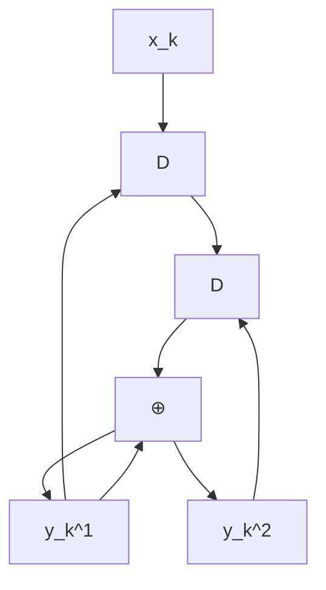
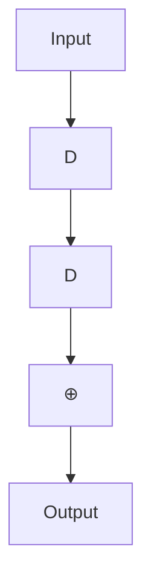
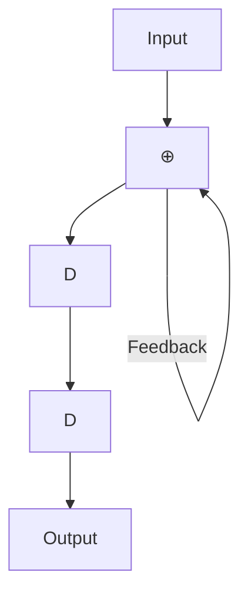
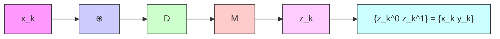
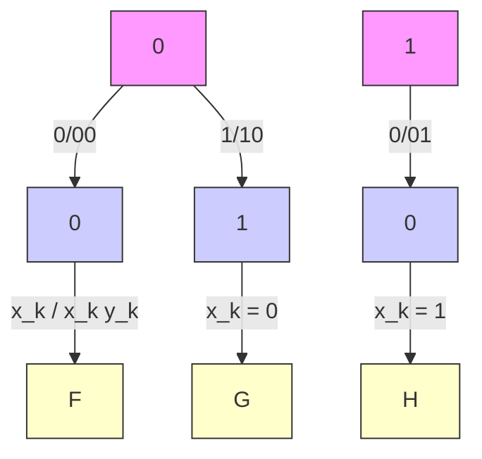

```mermaid
graph TD
    A["0/01"] -->|0/11| B["0/10"]
    B -->|0/10| C["1/10"]
    C -->|1/01| D["1/01"]
    D --> E["1/11"]
    E --> F["0/11"]
    F --> G["0/11"]
    G --> H["0/11"]
    H --> I["0/11"]
    I --> J["0/11"]
    J --> K["0/11"]
    K --> L["0/11"]
    L --> M["0/11"]
    M --> N["0/11"]
    N --> O["0/11"]
    O --> P["0/11"]
    P --> Q["0/11"]
    Q --> R["0/11"]
    R --> S["0/11"]
    S --> T["0/11"]
    T --> U["0/11"]
    U --> V["0/11"]
    V --> W["0/11"]
    W --> X["0/11"]
    X --> Y["0/11"]
    Y --> Z["0/11"]
    Z --> A["0/11"]
    A -->|1/11| B
    B -->|0/10| C
    C -->|1/10| D
    D -->|1/01| E
    E -->|1/11| F
    F -->|0/11| G
    G -->|0/11| H
    H -->|0/11| I
    I -->|0/11| J
    J -->|0/11| K
    K -->|0/11| L
    L -->|0/11| M
    M -->|0/11| N
    N -->|0/11| O
    O -->|0/11| P
    P -->|0/11| Q
    Q -->|0/11| R
    R -->|0/11| S
    S -->|0/11| T
    T -->|0/11| U
    U -->|0/11| V
    V -->|0/11| W
    W -->|0/11| X
    X -->|0/11| Y
    Y -->|0/11| Z
    Z -->|0/11| A
    style A fill:#f9f,stroke:#333
    style B fill:#f9f,stroke:#333
    style C fill:#f9f,stroke:#333
    style D fill:#f9f,stroke:#333
    style E fill:#f9f,stroke:#333
    style F fill:#f9f,stroke:#333
    style G fill:#f9f,stroke:#333
    style H fill:#f9f,stroke:#333
    style I fill:#f9f,stroke:#333
    style J fill:#f9f,stroke:#333
    style K fill:#f9f,stroke:#333
    style L fill:#f9f,stroke:#333
    style M fill:#f9f,stroke:#333
    style N fill:#f9f,stroke:#333
    style O fill:#f9f,stroke:#333
    style P fill:#f9f,stroke:#333
    style Q fill:#f9f,stroke:#333
    style R fill:#f9f,stroke:#333
    style S fill:#f9f,stroke:#333
    style T fill:#f9f,stroke:#333
    style U fill:#f9f,stroke:#333
    style V fill:#f9f,stroke:#333
    style W fill:#f9f,stroke:#333
    style X fill:#f9f,stroke:#333
    style Y fill:#f9f,stroke:#333
    style Z fill:#f9f,stroke:#333
```

```mermaid
graph TD
    A["Input"] --> B["π⁻¹"]
    B --> C["+"]
    C --> D["OUTER DECODER a priori"]
    D --> E["λ(xₖ)"]
    E --> F["001"]
    F --> G["1/1"]
    G --> H["101"]
    H --> I["1/0"]
    I --> J["110"]
    J --> K["0"]
    K --> L["0"]
    L --> M["0"]
    M --> N["2"]
    N --> O["2"]
    O --> P["0"]
    P --> Q["0"]
    Q --> R["10"]
    R --> S["1"]
    S --> T["1"]
    T --> U["1"]
    U --> V["1"]
    V --> W["1"]
    W --> X["1"]
    X --> Y["1"]
    Y --> Z["1"]
    Z --> AA["1"]
    AA --> AB["1"]
    AB --> AC["1"]
    AC --> AD["1"]
    AD --> AE["1"]
    AE --> AF["1"]
    AF --> AG["1"]
    AG --> AH["1"]
    AH --> AI["1"]
    AI --> AJ["1"]
    AJ --> AK["1"]
    AK --> AL["1"]
    AL --> AM["1"]
    AM --> AN["1"]
    AN --> AO["1"]
    AO --> AP["1"]
    AP --> AQ["1"]
    AQ --> AR["1"]
    AR --> AS["1"]
    AS --> AT["1"]
    AT --> AU["1"]
    AU --> AV["1"]
    AV --> AW["1"]
    AW --> AX["1"]
    AX --> AY["1"]
    AY --> AZ["1"]
    AZ --> BA["1"]
    BA --> BB["1"]
    BB --> BC["1"]
    BC --> BD["1"]
    BD --> BE["1"]
    BE --> BF["1"]
    BF --> BG["1"]
    BG --> BH["1"]
    BH --> BI["1"]
    BI --> BJ["1"]
    BJ --> BK["1"]
    BK --> BL["1"]
    BL --> BM["1"]
    BM --> BN["1"]
    BN --> BO["1"]
    BO --> BP["1"]
    BP --> BQ["1"]
    BQ --> BR["1"]
    BR --> BS["1"]
    BS --> BT["1"]
    BT --> BU["1"]
    BU --> BV["1"]
    BV --> BW["1"]
    BW --> BX["1"]
    BX --> BY["1"]
    BY --> BZ["1"]
    BZ --> CA["1"]
    CA --> CB["1"]
    CB --> CC["1"]
    CC --> CD["1"]
    CD --> CE["1"]
    CE --> CF["1"]
    CF --> CG["1"]
    CG --> CH["1"]
    CH --> CI["1"]
    CI --> CJ["1"]
    CJ --> CK["1"]
    CK --> CL["1"]
    CL --> CM["1"]
    CM --> CN["1"]
    CN --> CO["1"]
    CO --> CP["1"]
    CP --> CQ["1"]
    CQ --> CR["1"]
    CR --> CS["1"]
    CS --> CT["1"]
    CT --> CU["1"]
    CU --> CV["1"]
    CV --> CW["1"]
    CW --> CX["1"]
    CX --> CY["1"]
    CY --> CZ["1"]
    CZ --> DA["1"]
    DA --> DB["1"]
    DB --> DC["1"]
    DC --> DD["1"]
    DD --> DE["1"]
    DE --> DF["1"]
    DF --> DG["1"]
    DG --> DH["1"]
    DH --> DI["1"]
    DI --> DJ["1"]
    DJ --> DK["1"]
    DK --> DL["1"]
    DL --> DJ["1"]
    DJ --> DK["1"]
    DK --> DL["1"]
    DL --> DJ["1"]
    DJ --> DK["1"]
    DK --> DL["1"]
    DL --> DJ["1"]
    DJ --> DK["1"]
    DK --> DL["1"]
    DL --> DJ["1"]
    DJ --> DK["1"]
    DK --> LL["1"]
    LL --> DR["1"]
    DR --> DL["1"]
    DL --> DR["1"]
    DR --> DL["1"]
    DL --> DR["1"]
    DR --> DL["1"]
    DL --> DR["1"]
    DR --> DL["1"]
    DL --> DR["1"]
    DR --> DL["1"]
    DL --> DR["1"]
    DR --> DR["1"]
    DR --> DR["1"]
    DR --> DR["1"]
    DR --> DR["1"]
    DR --> DR["1"]
    DR --> DR["1"]
    DR --> DR["1"]
    DR --> DR["1"]
    DR --> DR["1"]
    DR --> DR["1"]
    DR --> DR["1"]
    DR --> DR["1"]
    DR --> DR["1"]
    DR --> DR["1"]
    DR --> DR["1"]
    DR --> Dr["1"]
    DR --> DR["1"]
    DR --> DR["1"]
    DR --> DR["1"]
    DR --> DR["1"]
    DR --> DR["1"]
    DR --> DR["1"]
    DR --> DR["1"]
    DR --> DR["1"]
    DR --> DR["1"]
    DR --> DR["1"]
    DR --> DR["1"]
    DR --> DR["1"]
    DR --> DR["1"]
    DR --> DR["2"]
    DR --> DR["2"]
    DR --> DR["2"]
    DR --> DR["2"]
    DR --> DR["2"]
    DR --> DR["2"]
    DR --> DR["2"]
    DR --> DR["2"]
    DR --> DR["2"]
    DR --> DR["2"]
    DR --> DR["2"]
    DR --> DR["2"]
    DR --> DR["2"]
    DR --> DR["2"]
    DR --> DR["2"]
    DR --> DR["2"]
```

# 第二章 Turbo 码

在不同的应用场景中，通常需要极高纠错能力的系统，这就要求编码和解码电路具有很高的复杂度。一种简单且有效的解决方案是采用级联编码 (concatenated coding)，即通过串行或并行地连接多个编码器，并借助交织器 (interleaver) 的帮助来实现。随后，编码后的数据将由相应的解码器依次进行解码。尽管这种方法的结果被认为是次优的 (sub-optimal)，但它在纠错能力与编解码过程的复杂度之间取得了良好的平衡。

迭代解码 (iterative decoding) 技术 [2, 3] 能够进一步降低系统的误比特率 (BER: bit-error rate)。Turbo 码 [3] 的解码就是迭代解码的一个典型例子，目前已广泛应用于移动电话和卫星通信系统等领域。此外，用于 Turbo 码解码的 Turbo 原理还可以应用于均衡过程，称为“Turbo 均衡 (turbo equalization)” [21]。这种迭代解码过程已在新型硬盘驱动器中实际采用 [6]，其性能优于以往不使用迭代解码技术的硬盘驱动器。

本章将首先介绍卷积码 (convolutional code) 和 BCJR 算法 [18]，它们是 Turbo 码的核心组成部分。这将帮助读者理解应用于硬盘驱动器信号处理系统的编码与迭代解码技术。

## 2.1 卷积码

纠错码，也称为前向纠错码 (FEC: forward error correction code)，常用于处理信道产生的噪声和错误。一般来说，纠错码可分为两大类：分组码 (block code) 和卷积码 (convolutional code) [2]。此外，还出现了一些基于迭代解码技术的新型 ECC 码，如 Turbo 码 [3] 和 LDPC 码 [17] 等，它们的性能比卷积码更接近香农信道容量 (Shannon's channel capacity)。在本节中，我们将简要介绍卷积码的工作原理，因为它是 Turbo 码的重要组成部分，具体内容将在 2.3 节中详细讨论。

### 2.1.1 编码

卷积编码器 (convolutional encoder) 使用移位寄存器 (shift register) 和模 2 加法器 (modulo-2 adder) 对数据进行编码。它将一组输入数据序列进行编码，并产生一组数量大于或等于输入序列的输出数据序列。如果卷积编码器将 1 位输入数据编码为 $n$ 位输出数据，则该卷积编码器的码率 (code rate) 为 $R = 1 / n$。图 2.1 展示了一个码率为 $R = 1 / 2$ 的卷积编码器示例。其中 $D$ 为单位延迟算子 (unit delay operator)，代表一个移位寄存器。在实践中，卷积编码器可用生成多项式 (generator polynomial) 来表示，其表达式为 [1]：

$$
G (D) = \sum_ {i = 0} ^ {\mu} g _ {i} D ^ {i} \tag {2.1}
$$

其中 $\mu$ 是卷积编码器的存储容量（即移位寄存器的数量），如果延迟 $i$ 个单位的输入数据位对当前输出数据位产生影响，则 $g_i = 1$。例如，图 2.1 (a) 中的卷积编码器具有如下生成多项式：

$$
G (D) = \left[ G _ {1} (D), G _ {2} (D) \right] = \left[ 1 \oplus D, 1 \oplus D ^ {2} \right] \tag {2.2}
$$

flowchart

(a)

flowchart

(b)

flowchart

(c)

图 2.1 (a) 卷积编码器，(b) 系统卷积编码器，以及 (c) 递归系统卷积编码器。

其中 $\oplus$ 为模 2 加法算子，$G_1(D)$ 是输出数据 $y_k^1$ 的生成多项式，$G_2(D)$ 是输出数据 $y_k^2$ 的生成多项式，且存储容量 $\mu = 2$。

此外，系统卷积编码器 (systematic convolutional encoder) 是一种特殊的卷积编码器，其其中一组输出数据与输入数据完全相同，如图 2.1 (b) 所示，其生成多项式为 $[1, 1 \oplus D^2]$。而带有反馈回路的系统卷积编码器被称为递归系统卷积编码器 (recursive systematic convolutional encoder)，如图 2.1 (c) 所示，其生成多项式为 $[1, 1 / (1 \oplus D^2)]$。通常，递归系统卷积编码器比其他类型的卷积编码器更受欢迎 [2]。

通常，卷积码的分析依赖于有限状态机 (FSM: finite state machine)，这是一种描述输入数据、初始状态、下一状态以及系统输出之间关系的模型（详见 [10] 第 4.3.1 节）。图 2.2 (左) 展示了图 2.1 (a) 卷积编码器的有限状态机，该编码器共有 $2^\mu = 4$ 个状态，分别为 00, 01, 10 和 11。箭头表示状态转移路径，箭头旁的 $x / y^1 y^2$ 分别代表输入位 $x$ 以及输出位 $y^1$ 和 $y^2$。此外，可以使用格图 (trellis diagram) 来描述卷积码在时间维度上的状态转移。图 2.2 (右) 展示了图 2.1 (a) 卷积编码器的格图。在第 $k$ 阶段的格图中，显示了编码器从时间 $k$ 的某个状态转移到时间 $k+1$ 的所有可能状态。箭头旁的数值即为有限状态机中的 $x / y^1 y^2$。由于沿着格图行走的每一条路径都对应于一个唯一的分支序列（每个时间阶段一个分支），因此每一个码字 (codeword)（即卷积编码器的输出数据）在格图中都对应唯一的一条路径（见图 2.5）。

图 2.2 图 2.1 (a) 卷积编码器的有限状态机和格图。

**例 2.1** 请演示图 2.1 (a) 卷积编码器的编码过程，已知输入数据位为 $\{x_0, x_1, x_2, x_3\} = \{1, 0, 1, 1\}$。

**解**：图 2.1 (a) 可重新表示如图右侧所示。将数据位 $\{x_k\}$ 输入卷积编码器的具体工作步骤如下：

**第一步**：设定所有移位寄存器的状态，即 $S_1$ 和 $S_2$ 均为 0（处于状态 00）。此步骤仅为编码器的准备阶段，尚未输入数据位。

**第二步**：输入第一个比特 $x_0 = 1$。此时 $Y_1 = X \oplus S_1 = 1 \oplus 0 = 1$，且 $Y_2 = X \oplus S_2 = 1 \oplus 0 = 1$。因此，第一个比特的编码输出为 $11$。

**第三步**：输入第二个比特 $x_1 = 0$。此时寄存器中的值发生移位，$\mathbf{S}_1 = 1$ 且 $\mathbf{S}_2 = 0$。计算得 $Y_1 = X \oplus S_1 = 0 \oplus 1 = 1$，且 $Y_2 = X \oplus S_2 = 0 \oplus 0 = 0$。因此，第二个比特的编码输出为 $10$。

**第四步**：输入第三个比特 $x_2 = 1$。此时寄存器值再次移位，$\mathbf{S}_1 = 0$ 且 $S_2 = 1$。计算得 $Y_1 = X \oplus S_1 = 1 \oplus 0 = 1$，且 $Y_2 = X \oplus S_2 = 1 \oplus 1 = 0$。因此，第三个比特的编码输出为 $10$。

上文所述的编码示例在图 2.3 中展示。如果将其表示为状态转移图，则如 图 2.4 所示；如果将其表示为格图，则如 图 2.5 所示。可以看出，图 2.3-2.5 的结果是一致的。

此外，卷积编码也可以通过 D 变换 (D-transform) [1] 来实现。也就是说，卷积编码器产生的输出数据可以表示为：

$$
Y _ {i} (D) = G _ {i} (D) X (D) \tag {2.3}
$$

图 2.3 例 2.1 的卷积编码过程

图 2.4 例 2.1 的状态转移图

图 2.5 例 2.1 的格图（仅显示唯一的码字路径）

当 $Y_i(D) = \sum_k y_k^i D^k$ 是输出数据 $y_k^i$ 的 D 变换结果（其中 $i \in \{1, 2\}$），$G_i(D)$ 是输出数据 $y_k^i$ 的生成多项式，且 $X(D) = \sum_k x_k D^k$ 是输入数据的 D 变换结果。例如，在例 2.1 中（基于图 2.1 (a)），可得 $X(D) = 1 + D^2 + D^3$，且 $G_i(D)$ 遵循方程 (2.2)。因此，两组编码输出数据 $\{y_k^1, y_k^2\}$ 的值为：

$$
\begin{array}{l} Y_1(D) = G_1(D) X(D) = (1 \oplus D)(1 + D^2 + D^3) \\ = (1 + D^2 + D^3) \oplus (D + D^3 + D^4) \\ = 1 + D + D^2 + D^4 \\ \end{array}
$$

$$
\begin{array}{l} Y_2(D) = G_2(D) X(D) = (1 \oplus D^2)(1 + D^2 + D^3) \\ = (1 + D^2 + D^3) \oplus (D^2 + D^4 + D^5) \\ = 1 + D^3 + D^4 + D^5 \\ \end{array}
$$

即 $\left\{ y_0^1, y_1^1, y_2^1, y_3^1, y_4^1, y_5^1 \right\} = \{1, 1, 1, 0, 1, 0\}$ 且 $\left\{ y_0^2, y_1^2, y_2^2, y_3^2, y_4^2, y_5^2 \right\} = \{1, 0, 0, 1, 1, 1\}$，这与图 2.3-2.5 中得到的结果一致。

flowchart

图 2.5 例 2.1 的格图（仅显示唯一可能的码字路径）

$$
\begin{array}{l} Y _ {1} (D) = G _ {1} (D) X (D) = (1 \oplus D) \left(1 + D ^ {2} + D ^ {3}\right) \\ = \left(1 + D ^ {2} + D ^ {3}\right) \oplus \left(D + D ^ {3} + D ^ {4}\right) \\ = 1 + D + D ^ {2} + D ^ {4} \\ \end{array}
$$

$$
\begin{array}{l} Y _ {2} (D) = G _ {2} (D) X (D) = \left(1 \oplus D ^ {2}\right) \left(1 + D ^ {2} + D ^ {3}\right) \\ = \left(1 + D ^ {2} + D ^ {3}\right) \oplus \left(D ^ {2} + D ^ {4} + D ^ {5}\right) \\ = 1 + D ^ {3} + D ^ {4} + D ^ {5} \\ \end{array}
$$

即 $\left\{ y _ { 0 } ^ { 1 } , y _ { 1 } ^ { 1 } , y _ { 2 } ^ { 1 } , y _ { 3 } ^ { 1 } , y _ { 4 } ^ { 1 } , y _ { 5 } ^ { 1 } \right\} = \left\{ 1 \ 1 \ 1 \ 0 \ 1 \ 0 \right\}$ 且 $\left\{ y _ { 0 } ^ { 2 } , y _ { 1 } ^ { 2 } , y _ { 2 } ^ { 2 } , y _ { 3 } ^ { 2 } , y _ { 4 } ^ { 2 } , y _ { 5 } ^ { 2 } \right\} = \left\{ 1 0 0 1 1 1 \right\}$，这与图 2.3 – 2.5 中得到的结果一致。

**例 2.2** 考虑图 2.6 中的卷积编码器，其生成多项式用八进制表示为 $( g _ { 1 } , \ g _ { 2 } ) = ( 1 7 , \ 1 1 )$，等同于二进制的 (001111, 001001)，其中 $g _ { 1 }$ 称为反馈多项式 (feedback polynomial)，$g _ { 2 }$ 称为前馈多项式 (feedforward polynomial)。在某些书籍中，生成多项式可能表示为 $D$ 域的分式：$\begin{array} { r } { \frac { g _ { 2 } ( D ) } { g _ { 1 } ( D ) } = \frac { 1 + D ^ { 3 } } { 1 + D + D ^ { 2 } + D ^ { 3 } } } \end{array}$。请绘制其有限状态机图，并对输入数据位 11011100 进行编码（最左侧的比特为首先被编码的数据）。

**解**：该卷积编码器的有限状态机图如图 2.7 所示。对于输入数据位 11011100 的编码过程，步骤与例 2.1 类似：首先将所有移位寄存器的初始状态设为 0，然后逐位输入数据，计算编码器的输出。在所有输入比特输入完成后，继续输入尾比特 (tail bits) 直到移位寄存器全部恢复为 0。

flowchart

图 2.5 例 2.1 的格图（仅显示唯一可能的码字路径）

$$
\begin{array}{l} Y _ {1} (D) = G _ {1} (D) X (D) = (1 \oplus D) \left(1 + D ^ {2} + D ^ {3}\right) \\ = \left(1 + D ^ {2} + D ^ {3}\right) \oplus \left(D + D ^ {3} + D ^ {4}\right) \\ = 1 + D + D ^ {2} + D ^ {4} \\ \end{array}
$$

$$
\begin{array}{l} Y _ {2} (D) = G _ {2} (D) X (D) = \left(1 \oplus D ^ {2}\right) \left(1 + D ^ {2} + D ^ {3}\right) \\ = \left(1 + D ^ {2} + D ^ {3}\right) \oplus \left(D ^ {2} + D ^ {4} + D ^ {5}\right) \\ = 1 + D ^ {3} + D ^ {4} + D ^ {5} \\ \end{array}
$$

即 $\left\{ y _ { 0 } ^ { 1 } , y _ { 1 } ^ { 1 } , y _ { 2 } ^ { 1 } , y _ { 3 } ^ { 1 } , y _ { 4 } ^ { 1 } , y _ { 5 } ^ { 1 } \right\} = \left\{ 1 \ 1 \ 1 \ 0 \ 1 \ 0 \right\}$ 且 $\left\{ y _ { 0 } ^ { 2 } , y _ { 1 } ^ { 2 } , y _ { 2 } ^ { 2 } , y _ { 3 } ^ { 2 } , y _ { 4 } ^ { 2 } , y _ { 5 } ^ { 2 } \right\} = \left\{ 1 0 0 1 1 1 \right\}$，这与图 2.3 – 2.5 中得到的结果一致。

**例 2.2** 考虑图 2.6 中的卷积编码器，其生成多项式用八进制表示为 $( g _ { 1 } , \ g _ { 2 } ) = ( 1 7 , \ 1 1 )$，等同于二进制的 (001111, 001001)，其中 $g _ { 1 }$ 称为反馈多项式 (feedback polynomial)，$g _ { 2 }$ 称为前馈多项式 (feedforward polynomial)。在某些书籍中，生成多项式可能表示为 $D$ 域的分式：$\begin{array} { r } { \frac { g _ { 2 } ( D ) } { g _ { 1 } ( D ) } = \frac { 1 + D ^ { 3 } } { 1 + D + D ^ { 2 } + D ^ { 3 } } } \end{array}$。请绘制其有限状态机图，并对输入数据位 11011100 进行编码（最左侧的比特为首先被编码的数据）。

**解**：该卷积编码器的有限状态机图如图 2.7 所示。对于输入数据位 11011100 的编码过程，步骤与例 2.1 类似：首先将所有移位寄存器的初始状态设为 0，然后逐位输入数据，计算编码器的输出。在所有输入比特输入完成后，继续输入尾比特 (tail bits) 直到移位寄存器全部恢复为 0。

flowchart

图 2.7 图 2.6 中卷积编码器的有限状态机 (FSM) 图

如果执行正确，则需要输入到编码器中的尾比特为 111，编码结果为 10101110001。

flowchart

(a) 卷积编码器

flowchart

(b) 格图

图 2.8 (a) 卷积编码器和 (b) 格图

## 2.1.2 解码

在实践中，使用卷积码编码的数据可以通过基于 Viterbi 算法 [13] 构建的解码器（称为 Viterbi 检测器）进行解码。下面将给出卷积码解码的示例。

**例 2.3** 考虑图 2.8 (a) 中的卷积编码器及其对应的格图（见图 2.8 (b)）。假设 $\left\{z_{k}\right\}$ 是解码器需要解码的数据序列，请对数据序列 $z_{k} = \{ 1 1 \ 0 1 \ 1 0 \ 1 1 \ 0 0 \}$ 进行解码。

**解**：定义 $(u, q)$ 为从状态 $u$ 转移到状态 $q$ 的状态转移，在第 $k$ 阶段的支路度量 (branch metric) 定义为

$$
\rho_ {k} (u, q) = \left| z _ {k} ^ {0} - \tilde {x} _ {k} (u, q) \right| ^ {2} + \left| z _ {k} ^ {1} - \tilde {y} _ {k} (u, q) \right| ^ {2}
$$

其中 $\tilde { x } _ { k } (u, q)$ 和 $\tilde { y } _ { k } (u, q)$ 是与状态转移 $(u, q)$ 相对应的比特 $x_{k}$ 和 $y_{k}$。此外，定义时间 $k+1$ 时状态 $q$ 的路径度量 (path metric) 为

生成多项式
27936rac{g_2(D)}{g_1(D)} = rac{1 + D^3}{1 + D + D^2 + D^3}27936

图 2.6 生成多项式以八进制表示为 (g1, g2) = (17, 11) 的卷积编码器

图 2.7 图 2.6 中卷积编码器的有限状态机 (FSM) 图

如果操作正确，需要输入到编码器的尾比特为 111，且编码后的结果为 10101110001

(a) 卷积编码器

(b) 网格图 (Trellis Diagram)

图 2.8 (a) 卷积编码器和 (b) 网格图

# 2.1.2 解码

在实践中，使用卷积码编码的数据可以使用基于 Viterbi 算法 [13] 的解码器进行解码，该解码器也被称为 Viterbi 检测器。这里将展示卷积码解码的一个示例，具体如下：

示例 2.3 考虑图 2.8 (a) 中的卷积编码器，其网格图如图 2.8 (b) 所示。假设数据序列 $ 是解码器需要解码的数据，请解码数据序列  = \{1 1, 0 1, 1 0, 1 1, 0 0\}$

解：令 $ 表示从状态 $ 到状态 $ 的状态转移，且在第 $ 阶段的分支度量 (branch metric) 定义为：

29350
ho_ {k} (u, q) = \left| z _ {k} ^ {0} - 	ilde {x} _ {k} (u, q) 
ight| ^ {2} + \left| z _ {k} ^ {1} - 	ilde {y} _ {k} (u, q) 
ight| ^ {2}29350

其中 $	ilde{x}_k(u, q)$ 和 $	ilde{y}_k(u, q)$ 是与状态转移 $ 相对应的比特 $ 和 $。此外，定义在时间 +1$ 状态 $ 处的路径度量 (path metric) 为：

图 2.9 显示数据  = \{1 1, 0 1, 1 0, 1 1, 0 0\}$ 解码过程的网格图

29350\Phi_ {k + 1} (q) = \min _ {u} \left\{\Phi_ {k} (u) + 
ho_ {k} (u, q) 
ight\}29350

因此，Viterbi 检测器的解码步骤可总结如下：

1) 对于每个阶段 $
对于每个状态 $
计算所有到达状态 $ 的分支的分支度量 $
ho_k(u, q)$
选择路径度量最小的分支
更新时间 +1$ 状态 $ 的路径度量 $\Phi_{k+1}(q)$（对所有状态 $ 重复此过程）
（对所有阶段 $ 重复此过程）

2) 从具有最小路径度量的路径中解码输入数据 $

图 2.9 展示了根据网格图进行数据解码的步骤，其中仅显示到达每个状态的幸存路径 (survivor path)。每个分支旁的数值是与该状态转移 $ 相对应的分支度量 $
ho_k(u, q)$，而每个状态节点上的数值是路径度量 $\Phi_k(q)$。从图中可以看出，卷积解码器给出的输入比特 $ 的估计值为 $\hat{x}_k = \{1, 0, 1, 1\}$。有关 Viterbi 检测器解码步骤的详细信息，可参考 [10] 的第 4 章。

然而，如果将卷积码用作 Turbo 码的组件，则无法在 Turbo 解码器中使用 Viterbi 检测器，因为 Turbo 解码器仅使用比特数据的软信息 (soft information) 工作（而 Viterbi 检测器提供的是硬信息或比特数据的估计值）。因此，用于解码卷积码的 Turbo 解码器必须是基于 BCJR 算法 [18] 或 SOVA (Soft-Output Viterbi Algorithm) [19] 构建的检测器，这将在 2.2 节和第 3 章中分别详细说明。
