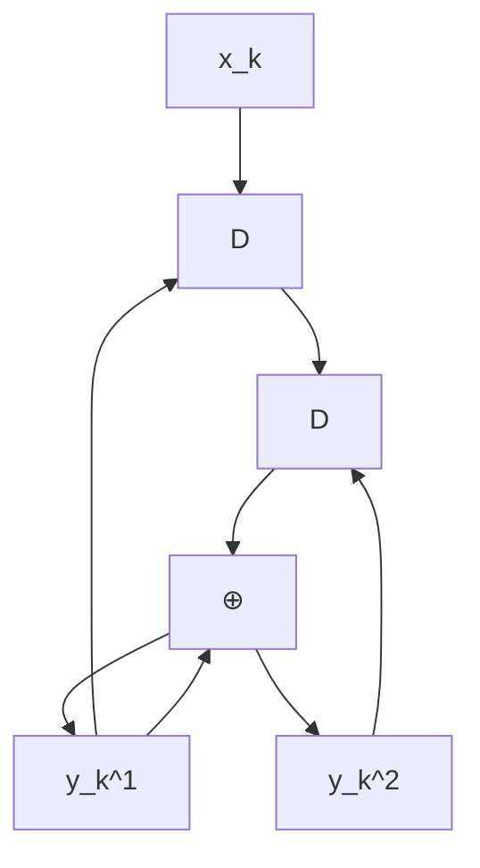
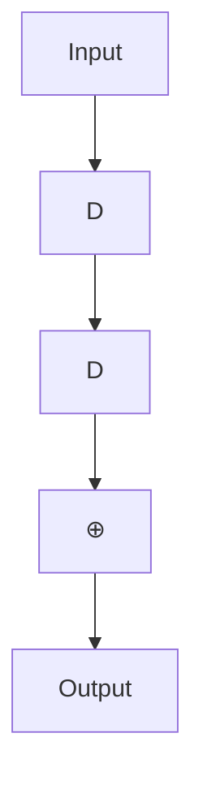
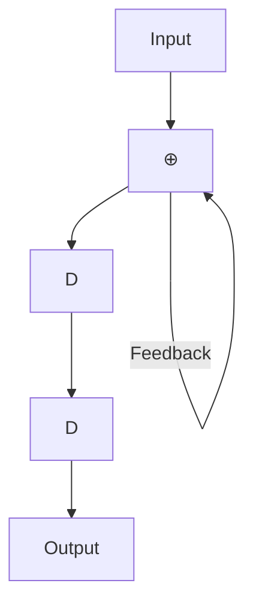
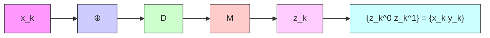
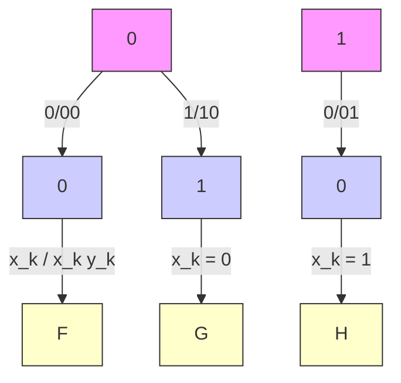
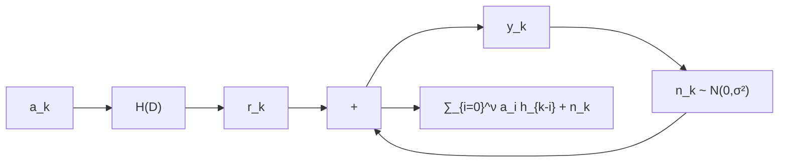

```mermaid
graph TD
    A["0/01"] -->|0/11| B["0/10"]
    B -->|0/10| C["1/10"]
    C -->|1/01| D["1/01"]
    D --> E["1/11"]
    E --> F["0/11"]
    F --> G["0/11"]
    G --> H["0/11"]
    H --> I["0/11"]
    I --> J["0/11"]
    J --> K["0/11"]
    K --> L["0/11"]
    L --> M["0/11"]
    M --> N["0/11"]
    N --> O["0/11"]
    O --> P["0/11"]
    P --> Q["0/11"]
    Q --> R["0/11"]
    R --> S["0/11"]
    S --> T["0/11"]
    T --> U["0/11"]
    U --> V["0/11"]
    V --> W["0/11"]
    W --> X["0/11"]
    X --> Y["0/11"]
    Y --> Z["0/11"]
    Z --> A["0/11"]
    A -->|1/11| B
    B -->|0/10| C
    C -->|1/10| D
    D -->|1/01| E
    E -->|1/11| F
    F -->|0/11| G
    G -->|0/11| H
    H -->|0/11| I
    I -->|0/11| J
    J -->|0/11| K
    K -->|0/11| L
    L -->|0/11| M
    M -->|0/11| N
    N -->|0/11| O
    O -->|0/11| P
    P -->|0/11| Q
    Q -->|0/11| R
    R -->|0/11| S
    S -->|0/11| T
    T -->|0/11| U
    U -->|0/11| V
    V -->|0/11| W
    W -->|0/11| X
    X -->|0/11| Y
    Y -->|0/11| Z
    Z -->|0/11| A
    style A fill:#f9f,stroke:#333
    style B fill:#f9f,stroke:#333
    style C fill:#f9f,stroke:#333
    style D fill:#f9f,stroke:#333
    style E fill:#f9f,stroke:#333
    style F fill:#f9f,stroke:#333
    style G fill:#f9f,stroke:#333
    style H fill:#f9f,stroke:#333
    style I fill:#f9f,stroke:#333
    style J fill:#f9f,stroke:#333
    style K fill:#f9f,stroke:#333
    style L fill:#f9f,stroke:#333
    style M fill:#f9f,stroke:#333
    style N fill:#f9f,stroke:#333
    style O fill:#f9f,stroke:#333
    style P fill:#f9f,stroke:#333
    style Q fill:#f9f,stroke:#333
    style R fill:#f9f,stroke:#333
    style S fill:#f9f,stroke:#333
    style T fill:#f9f,stroke:#333
    style U fill:#f9f,stroke:#333
    style V fill:#f9f,stroke:#333
    style W fill:#f9f,stroke:#333
    style X fill:#f9f,stroke:#333
    style Y fill:#f9f,stroke:#333
    style Z fill:#f9f,stroke:#333
```

```mermaid
graph TD
    A["Input"] --> B["π⁻¹"]
    B --> C["+"]
    C --> D["OUTER DECODER a priori"]
    D --> E["λ(xₖ)"]
    E --> F["001"]
    F --> G["1/1"]
    G --> H["101"]
    H --> I["1/0"]
    I --> J["110"]
    J --> K["0"]
    K --> L["0"]
    L --> M["0"]
    M --> N["2"]
    N --> O["2"]
    O --> P["0"]
    P --> Q["0"]
    Q --> R["10"]
    R --> S["1"]
    S --> T["1"]
    T --> U["1"]
    U --> V["1"]
    V --> W["1"]
    W --> X["1"]
    X --> Y["1"]
    Y --> Z["1"]
    Z --> AA["1"]
    AA --> AB["1"]
    AB --> AC["1"]
    AC --> AD["1"]
    AD --> AE["1"]
    AE --> AF["1"]
    AF --> AG["1"]
    AG --> AH["1"]
    AH --> AI["1"]
    AI --> AJ["1"]
    AJ --> AK["1"]
    AK --> AL["1"]
    AL --> AM["1"]
    AM --> AN["1"]
    AN --> AO["1"]
    AO --> AP["1"]
    AP --> AQ["1"]
    AQ --> AR["1"]
    AR --> AS["1"]
    AS --> AT["1"]
    AT --> AU["1"]
    AU --> AV["1"]
    AV --> AW["1"]
    AW --> AX["1"]
    AX --> AY["1"]
    AY --> AZ["1"]
    AZ --> BA["1"]
    BA --> BB["1"]
    BB --> BC["1"]
    BC --> BD["1"]
    BD --> BE["1"]
    BE --> BF["1"]
    BF --> BG["1"]
    BG --> BH["1"]
    BH --> BI["1"]
    BI --> BJ["1"]
    BJ --> BK["1"]
    BK --> BL["1"]
    BL --> BM["1"]
    BM --> BN["1"]
    BN --> BO["1"]
    BO --> BP["1"]
    BP --> BQ["1"]
    BQ --> BR["1"]
    BR --> BS["1"]
    BS --> BT["1"]
    BT --> BU["1"]
    BU --> BV["1"]
    BV --> BW["1"]
    BW --> BX["1"]
    BX --> BY["1"]
    BY --> BZ["1"]
    BZ --> CA["1"]
    CA --> CB["1"]
    CB --> CC["1"]
    CC --> CD["1"]
    CD --> CE["1"]
    CE --> CF["1"]
    CF --> CG["1"]
    CG --> CH["1"]
    CH --> CI["1"]
    CI --> CJ["1"]
    CJ --> CK["1"]
    CK --> CL["1"]
    CL --> CM["1"]
    CM --> CN["1"]
    CN --> CO["1"]
    CO --> CP["1"]
    CP --> CQ["1"]
    CQ --> CR["1"]
    CR --> CS["1"]
    CS --> CT["1"]
    CT --> CU["1"]
    CU --> CV["1"]
    CV --> CW["1"]
    CW --> CX["1"]
    CX --> CY["1"]
    CY --> CZ["1"]
    CZ --> DA["1"]
    DA --> DB["1"]
    DB --> DC["1"]
    DC --> DD["1"]
    DD --> DE["1"]
    DE --> DF["1"]
    DF --> DG["1"]
    DG --> DH["1"]
    DH --> DI["1"]
    DI --> DJ["1"]
    DJ --> DK["1"]
    DK --> DL["1"]
    DL --> DJ["1"]
    DJ --> DK["1"]
    DK --> DL["1"]
    DL --> DJ["1"]
    DJ --> DK["1"]
    DK --> DL["1"]
    DL --> DJ["1"]
    DJ --> DK["1"]
    DK --> DL["1"]
    DL --> DJ["1"]
    DJ --> DK["1"]
    DK --> LL["1"]
    LL --> DR["1"]
    DR --> DL["1"]
    DL --> DR["1"]
    DR --> DL["1"]
    DL --> DR["1"]
    DR --> DL["1"]
    DL --> DR["1"]
    DR --> DL["1"]
    DL --> DR["1"]
    DR --> DL["1"]
    DL --> DR["1"]
    DR --> DR["1"]
    DR --> DR["1"]
    DR --> DR["1"]
    DR --> DR["1"]
    DR --> DR["1"]
    DR --> DR["1"]
    DR --> DR["1"]
    DR --> DR["1"]
    DR --> DR["1"]
    DR --> DR["1"]
    DR --> DR["1"]
    DR --> DR["1"]
    DR --> DR["1"]
    DR --> DR["1"]
    DR --> DR["1"]
    DR --> Dr["1"]
    DR --> DR["1"]
    DR --> DR["1"]
    DR --> DR["1"]
    DR --> DR["1"]
    DR --> DR["1"]
    DR --> DR["1"]
    DR --> DR["1"]
    DR --> DR["1"]
    DR --> DR["1"]
    DR --> DR["1"]
    DR --> DR["1"]
    DR --> DR["1"]
    DR --> DR["1"]
    DR --> DR["2"]
    DR --> DR["2"]
    DR --> DR["2"]
    DR --> DR["2"]
    DR --> DR["2"]
    DR --> DR["2"]
    DR --> DR["2"]
    DR --> DR["2"]
    DR --> DR["2"]
    DR --> DR["2"]
    DR --> DR["2"]
    DR --> DR["2"]
    DR --> DR["2"]
    DR --> DR["2"]
    DR --> DR["2"]
    DR --> DR["2"]
```

# 第二章 Turbo 码

在不同的应用场景中，通常需要极高纠错能力的系统，这就要求编码和解码电路具有很高的复杂度。一种简单且有效的解决方案是采用级联编码 (concatenated coding)，即通过串行或并行地连接多个编码器，并借助交织器 (interleaver) 的帮助来实现。随后，编码后的数据将由相应的解码器依次进行解码。尽管这种方法的结果被认为是次优的 (sub-optimal)，但它在纠错能力与编解码过程的复杂度之间取得了良好的平衡。

迭代解码 (iterative decoding) 技术 [2, 3] 能够进一步降低系统的误比特率 (BER: bit-error rate)。Turbo 码 [3] 的解码就是迭代解码的一个典型例子，目前已广泛应用于移动电话和卫星通信系统等领域。此外，用于 Turbo 码解码的 Turbo 原理还可以应用于均衡过程，称为“Turbo 均衡 (turbo equalization)” [21]。这种迭代解码过程已在新型硬盘驱动器中实际采用 [6]，其性能优于以往不使用迭代解码技术的硬盘驱动器。

本章将首先介绍卷积码 (convolutional code) 和 BCJR 算法 [18]，它们是 Turbo 码的核心组成部分。这将帮助读者理解应用于硬盘驱动器信号处理系统的编码与迭代解码技术。

## 2.1 卷积码

纠错码，也称为前向纠错码 (FEC: forward error correction code)，常用于处理信道产生的噪声和错误。一般来说，纠错码可分为两大类：分组码 (block code) 和卷积码 (convolutional code) [2]。此外，还出现了一些基于迭代解码技术的新型 ECC 码，如 Turbo 码 [3] 和 LDPC 码 [17] 等，它们的性能比卷积码更接近香农信道容量 (Shannon's channel capacity)。在本节中，我们将简要介绍卷积码的工作原理，因为它是 Turbo 码的重要组成部分，具体内容将在 2.3 节中详细讨论。

### 2.1.1 编码

卷积编码器 (convolutional encoder) 使用移位寄存器 (shift register) 和模 2 加法器 (modulo-2 adder) 对数据进行编码。它将一组输入数据序列进行编码，并产生一组数量大于或等于输入序列的输出数据序列。如果卷积编码器将 1 位输入数据编码为 $n$ 位输出数据，则该卷积编码器的码率 (code rate) 为 $R = 1 / n$。图 2.1 展示了一个码率为 $R = 1 / 2$ 的卷积编码器示例。其中 $D$ 为单位延迟算子 (unit delay operator)，代表一个移位寄存器。在实践中，卷积编码器可用生成多项式 (generator polynomial) 来表示，其表达式为 [1]：

$$
G (D) = \sum_ {i = 0} ^ {\mu} g _ {i} D ^ {i} \tag {2.1}
$$

其中 $\mu$ 是卷积编码器的存储容量（即移位寄存器的数量），如果延迟 $i$ 个单位的输入数据位对当前输出数据位产生影响，则 $g_i = 1$。例如，图 2.1 (a) 中的卷积编码器具有如下生成多项式：

$$
G (D) = \left[ G _ {1} (D), G _ {2} (D) \right] = \left[ 1 \oplus D, 1 \oplus D ^ {2} \right] \tag {2.2}
$$


<details>
<summary>flowchart</summary>


</details>

(a)


<details>
<summary>flowchart</summary>


</details>

(b)


<details>
<summary>flowchart</summary>


</details>

(c)

图 2.1 (a) 卷积编码器，(b) 系统卷积编码器，以及 (c) 递归系统卷积编码器。

其中 $\oplus$ 为模 2 加法算子，$G_1(D)$ 是输出数据 $y_k^1$ 的生成多项式，$G_2(D)$ 是输出数据 $y_k^2$ 的生成多项式，且存储容量 $\mu = 2$。

此外，系统卷积编码器 (systematic convolutional encoder) 是一种特殊的卷积编码器，其其中一组输出数据与输入数据完全相同，如图 2.1 (b) 所示，其生成多项式为 $[1, 1 \oplus D^2]$。而带有反馈回路的系统卷积编码器被称为递归系统卷积编码器 (recursive systematic convolutional encoder)，如图 2.1 (c) 所示，其生成多项式为 $[1, 1 / (1 \oplus D^2)]$。通常，递归系统卷积编码器比其他类型的卷积编码器更受欢迎 [2]。

通常，卷积码的分析依赖于有限状态机 (FSM: finite state machine)，这是一种描述输入数据、初始状态、下一状态以及系统输出之间关系的模型（详见 [10] 第 4.3.1 节）。图 2.2 (左) 展示了图 2.1 (a) 卷积编码器的有限状态机，该编码器共有 $2^\mu = 4$ 个状态，分别为 00, 01, 10 和 11。箭头表示状态转移路径，箭头旁的 $x / y^1 y^2$ 分别代表输入位 $x$ 以及输出位 $y^1$ 和 $y^2$。此外，可以使用格图 (trellis diagram) 来描述卷积码在时间维度上的状态转移。图 2.2 (右) 展示了图 2.1 (a) 卷积编码器的格图。在第 $k$ 阶段的格图中，显示了编码器从时间 $k$ 的某个状态转移到时间 $k+1$ 的所有可能状态。箭头旁的数值即为有限状态机中的 $x / y^1 y^2$。由于沿着格图行走的每一条路径都对应于一个唯一的分支序列（每个时间阶段一个分支），因此每一个码字 (codeword)（即卷积编码器的输出数据）在格图中都对应唯一的一条路径（见图 2.5）。


图 2.2 图 2.1 (a) 卷积编码器的有限状态机和格图。


**例 2.1** 请演示图 2.1 (a) 卷积编码器的编码过程，已知输入数据位为 $\{x_0, x_1, x_2, x_3\} = \{1, 0, 1, 1\}$。

**解**：图 2.1 (a) 可重新表示如图右侧所示。将数据位 $\{x_k\}$ 输入卷积编码器的具体工作步骤如下：


**第一步**：设定所有移位寄存器的状态，即 $S_1$ 和 $S_2$ 均为 0（处于状态 00）。此步骤仅为编码器的准备阶段，尚未输入数据位。

**第二步**：输入第一个比特 $x_0 = 1$。此时 $Y_1 = X \oplus S_1 = 1 \oplus 0 = 1$，且 $Y_2 = X \oplus S_2 = 1 \oplus 0 = 1$。因此，第一个比特的编码输出为 $11$。

**第三步**：输入第二个比特 $x_1 = 0$。此时寄存器中的值发生移位，$\mathbf{S}_1 = 1$ 且 $\mathbf{S}_2 = 0$。计算得 $Y_1 = X \oplus S_1 = 0 \oplus 1 = 1$，且 $Y_2 = X \oplus S_2 = 0 \oplus 0 = 0$。因此，第二个比特的编码输出为 $10$。

**第四步**：输入第三个比特 $x_2 = 1$。此时寄存器值再次移位，$\mathbf{S}_1 = 0$ 且 $S_2 = 1$。计算得 $Y_1 = X \oplus S_1 = 1 \oplus 0 = 1$，且 $Y_2 = X \oplus S_2 = 1 \oplus 1 = 0$。因此，第三个比特的编码输出为 $10$。

上文所述的编码示例在图 2.3 中展示。如果将其表示为状态转移图，则如 图 2.4 所示；如果将其表示为格图，则如 图 2.5 所示。可以看出，图 2.3-2.5 的结果是一致的。

此外，卷积编码也可以通过 D 变换 (D-transform) [1] 来实现。也就是说，卷积编码器产生的输出数据可以表示为：

$$
Y _ {i} (D) = G _ {i} (D) X (D) \tag {2.3}
$$


图 2.3 例 2.1 的卷积编码过程


图 2.4 例 2.1 的状态转移图


图 2.5 例 2.1 的格图（仅显示唯一的码字路径）

当 $Y_i(D) = \sum_k y_k^i D^k$ 是输出数据 $y_k^i$ 的 D 变换结果（其中 $i \in \{1, 2\}$），$G_i(D)$ 是输出数据 $y_k^i$ 的生成多项式，且 $X(D) = \sum_k x_k D^k$ 是输入数据的 D 变换结果。例如，在例 2.1 中（基于图 2.1 (a)），可得 $X(D) = 1 + D^2 + D^3$，且 $G_i(D)$ 遵循方程 (2.2)。因此，两组编码输出数据 $\{y_k^1, y_k^2\}$ 的值为：

$$
\begin{array}{l} Y_1(D) = G_1(D) X(D) = (1 \oplus D)(1 + D^2 + D^3) \\ = (1 + D^2 + D^3) \oplus (D + D^3 + D^4) \\ = 1 + D + D^2 + D^4 \\ \end{array}
$$

$$
\begin{array}{l} Y_2(D) = G_2(D) X(D) = (1 \oplus D^2)(1 + D^2 + D^3) \\ = (1 + D^2 + D^3) \oplus (D^2 + D^4 + D^5) \\ = 1 + D^3 + D^4 + D^5 \\ \end{array}
$$

即 $\left\{ y_0^1, y_1^1, y_2^1, y_3^1, y_4^1, y_5^1 \right\} = \{1, 1, 1, 0, 1, 0\}$ 且 $\left\{ y_0^2, y_1^2, y_2^2, y_3^2, y_4^2, y_5^2 \right\} = \{1, 0, 0, 1, 1, 1\}$，这与图 2.3-2.5 中得到的结果一致。


<details>
<summary>flowchart</summary>


</details>

图 2.5 例 2.1 的格图（仅显示唯一可能的码字路径）

$$
\begin{array}{l} Y _ {1} (D) = G _ {1} (D) X (D) = (1 \oplus D) \left(1 + D ^ {2} + D ^ {3}\right) \\ = \left(1 + D ^ {2} + D ^ {3}\right) \oplus \left(D + D ^ {3} + D ^ {4}\right) \\ = 1 + D + D ^ {2} + D ^ {4} \\ \end{array}
$$

$$
\begin{array}{l} Y _ {2} (D) = G _ {2} (D) X (D) = \left(1 \oplus D ^ {2}\right) \left(1 + D ^ {2} + D ^ {3}\right) \\ = \left(1 + D ^ {2} + D ^ {3}\right) \oplus \left(D ^ {2} + D ^ {4} + D ^ {5}\right) \\ = 1 + D ^ {3} + D ^ {4} + D ^ {5} \\ \end{array}
$$

即 $\left\{ y _ { 0 } ^ { 1 } , y _ { 1 } ^ { 1 } , y _ { 2 } ^ { 1 } , y _ { 3 } ^ { 1 } , y _ { 4 } ^ { 1 } , y _ { 5 } ^ { 1 } \right\} = \left\{ 1 \ 1 \ 1 \ 0 \ 1 \ 0 \right\}$ 且 $\left\{ y _ { 0 } ^ { 2 } , y _ { 1 } ^ { 2 } , y _ { 2 } ^ { 2 } , y _ { 3 } ^ { 2 } , y _ { 4 } ^ { 2 } , y _ { 5 } ^ { 2 } \right\} = \left\{ 1 0 0 1 1 1 \right\}$，这与图 2.3 – 2.5 中得到的结果一致。

**例 2.2** 考虑图 2.6 中的卷积编码器，其生成多项式用八进制表示为 $( g _ { 1 } , \ g _ { 2 } ) = ( 1 7 , \ 1 1 )$，等同于二进制的 (001111, 001001)，其中 $g _ { 1 }$ 称为反馈多项式 (feedback polynomial)，$g _ { 2 }$ 称为前馈多项式 (feedforward polynomial)。在某些书籍中，生成多项式可能表示为 $D$ 域的分式：$\begin{array} { r } { \frac { g _ { 2 } ( D ) } { g _ { 1 } ( D ) } = \frac { 1 + D ^ { 3 } } { 1 + D + D ^ { 2 } + D ^ { 3 } } } \end{array}$。请绘制其有限状态机图，并对输入数据位 11011100 进行编码（最左侧的比特为首先被编码的数据）。

**解**：该卷积编码器的有限状态机图如图 2.7 所示。对于输入数据位 11011100 的编码过程，步骤与例 2.1 类似：首先将所有移位寄存器的初始状态设为 0，然后逐位输入数据，计算编码器的输出。在所有输入比特输入完成后，继续输入尾比特 (tail bits) 直到移位寄存器全部恢复为 0。


<details>
<summary>flowchart</summary>


</details>

图 2.5 例 2.1 的格图（仅显示唯一可能的码字路径）

$$
\begin{array}{l} Y _ {1} (D) = G _ {1} (D) X (D) = (1 \oplus D) \left(1 + D ^ {2} + D ^ {3}\right) \\ = \left(1 + D ^ {2} + D ^ {3}\right) \oplus \left(D + D ^ {3} + D ^ {4}\right) \\ = 1 + D + D ^ {2} + D ^ {4} \\ \end{array}
$$

$$
\begin{array}{l} Y _ {2} (D) = G _ {2} (D) X (D) = \left(1 \oplus D ^ {2}\right) \left(1 + D ^ {2} + D ^ {3}\right) \\ = \left(1 + D ^ {2} + D ^ {3}\right) \oplus \left(D ^ {2} + D ^ {4} + D ^ {5}\right) \\ = 1 + D ^ {3} + D ^ {4} + D ^ {5} \\ \end{array}
$$

即 $\left\{ y _ { 0 } ^ { 1 } , y _ { 1 } ^ { 1 } , y _ { 2 } ^ { 1 } , y _ { 3 } ^ { 1 } , y _ { 4 } ^ { 1 } , y _ { 5 } ^ { 1 } \right\} = \left\{ 1 \ 1 \ 1 \ 0 \ 1 \ 0 \right\}$ 且 $\left\{ y _ { 0 } ^ { 2 } , y _ { 1 } ^ { 2 } , y _ { 2 } ^ { 2 } , y _ { 3 } ^ { 2 } , y _ { 4 } ^ { 2 } , y _ { 5 } ^ { 2 } \right\} = \left\{ 1 0 0 1 1 1 \right\}$，这与图 2.3 – 2.5 中得到的结果一致。

**例 2.2** 考虑图 2.6 中的卷积编码器，其生成多项式用八进制表示为 $( g _ { 1 } , \ g _ { 2 } ) = ( 1 7 , \ 1 1 )$，等同于二进制的 (001111, 001001)，其中 $g _ { 1 }$ 称为反馈多项式 (feedback polynomial)，$g _ { 2 }$ 称为前馈多项式 (feedforward polynomial)。在某些书籍中，生成多项式可能表示为 $D$ 域的分式：$\begin{array} { r } { \frac { g _ { 2 } ( D ) } { g _ { 1 } ( D ) } = \frac { 1 + D ^ { 3 } } { 1 + D + D ^ { 2 } + D ^ { 3 } } } \end{array}$。请绘制其有限状态机图，并对输入数据位 11011100 进行编码（最左侧的比特为首先被编码的数据）。

**解**：该卷积编码器的有限状态机图如图 2.7 所示。对于输入数据位 11011100 的编码过程，步骤与例 2.1 类似：首先将所有移位寄存器的初始状态设为 0，然后逐位输入数据，计算编码器的输出。在所有输入比特输入完成后，继续输入尾比特 (tail bits) 直到移位寄存器全部恢复为 0。


<details>
<summary>flowchart</summary>


</details>

图 2.7 图 2.6 中卷积编码器的有限状态机 (FSM) 图

如果执行正确，则需要输入到编码器中的尾比特为 111，编码结果为 10101110001。


<details>
<summary>flowchart</summary>


</details>

(a) 卷积编码器


<details>
<summary>flowchart</summary>


</details>

(b) 格图

图 2.8 (a) 卷积编码器和 (b) 格图

## 2.1.2 解码

在实践中，使用卷积码编码的数据可以通过基于 Viterbi 算法 [13] 构建的解码器（称为 Viterbi 检测器）进行解码。下面将给出卷积码解码的示例。

**例 2.3** 考虑图 2.8 (a) 中的卷积编码器及其对应的格图（见图 2.8 (b)）。假设 $\left\{z_{k}\right\}$ 是解码器需要解码的数据序列，请对数据序列 $z_{k} = \{ 1 1 \ 0 1 \ 1 0 \ 1 1 \ 0 0 \}$ 进行解码。

**解**：定义 $(u, q)$ 为从状态 $u$ 转移到状态 $q$ 的状态转移，在第 $k$ 阶段的支路度量 (branch metric) 定义为

$$
\rho_ {k} (u, q) = \left| z _ {k} ^ {0} - \tilde {x} _ {k} (u, q) \right| ^ {2} + \left| z _ {k} ^ {1} - \tilde {y} _ {k} (u, q) \right| ^ {2}
$$

其中 $\tilde { x } _ { k } (u, q)$ 和 $\tilde { y } _ { k } (u, q)$ 是与状态转移 $(u, q)$ 相对应的比特 $x_{k}$ 和 $y_{k}$。此外，定义时间 $k+1$ 时状态 $q$ 的路径度量 (path metric) 为


生成多项式
27936rac{g_2(D)}{g_1(D)} = rac{1 + D^3}{1 + D + D^2 + D^3}27936


图 2.6 生成多项式以八进制表示为 (g1, g2) = (17, 11) 的卷积编码器


图 2.7 图 2.6 中卷积编码器的有限状态机 (FSM) 图


如果操作正确，需要输入到编码器的尾比特为 111，且编码后的结果为 10101110001


(a) 卷积编码器


(b) 网格图 (Trellis Diagram)


图 2.8 (a) 卷积编码器和 (b) 网格图


# 2.2 BCJR 算法

Viterbi 检测器 [1, 13] 是一种最大似然 (ML, maximum-likelihood) 检测器，用于解码卷积码编码的数据。其输出结果是待检测数据序列的估计值。也就是说，ML 检测器能够使数据序列的整体错误率最低，但不能保证序列中的每个比特都是最优的。这意味着 ML 检测器不能使每个单独的比特错误率达到最低。

此外，Viterbi 检测器不能用于迭代解码系统，因为该系统在检测器和纠错解码器之间需要交换软信息 (soft information)。因此，迭代解码系统必须使用最大后验概率 (MAP, maximum a posteriori probability) 检测器。MAP 检测器能够保证所检测的每个比特都是最优的（即每个比特的错误率最低）。

本节将介绍 BCJR 算法 [18] 的工作原理，因为它是构建 MAP 检测器的基础。该算法由 Bahl, Cock, Jelinek 和 Raviv 提出，用于在存在符号间干扰 (ISI) 和加性高斯白噪声 (AWGN) 的信道中检测最大后验概率 (APP, a posteriori probability) 信号。

# 2.2.1 信道模型与格图 (Trellis Diagram)
考虑图 2.10 所示的信道模型。当接收端接收到的信号（或待解码信号）在第 $k$ 个序列时为：


<details>
<summary>流程图</summary>


</details>

图 2.10 信道模型


<details>
<summary>流程图</summary>

```mermaid
graph TD
    A["时间 k"] -->|γ_k(u,q)| B["时间 k+1"]
    C["时间 k"] -->|α_{k+1}(q)| D["q (ψ_{k+1} = q)"]
    D -->|β_{k+1}(q)| E["时间 k+1"]
    F["时间 k"] -->|α_k(u)| G["时间 k"]
    G -->|β_k(u)| H["时间 k"]
    I["时间 k"] -->|γ_k(u,q)| J["时间 k+1"]
    J -->|α_{k+1}(q)| K["时间 k+1"]
    L["时间 k"] -->|α_k(u)| M["时间 k"]
    M -->|β_k(u)| N["时间 k"]
    O["时间 k"] -->|α_k(u)| P["时间 k"]
    P -->|β_k(u)| Q["时间 k"]
    R["时间 k"] -->|α_k(u)| S["时间 k"]
    S -->|β_k(u)| T["时间 k"]
    U["时间 k"] -->|α_k(u)| V["时间 k"]
    V -->|β_k(u)| W["时间 k"]
    X["时间 k"] -->|α_k(u)| Y["时间 k"]
    Y -->|β_k(u)| Z["时间 k"]
```
</details>

图 2.11 格图中第 k 阶段的状态转移 $(u, q)$

$$
y_{k} = \sum_{i=0}^{\nu} a_{i} h_{k-i} + n_{k} \tag{2.4}
$$

其中 $a_{k} \in \mathcal{A}$ 是从字母表 $\mathcal{A}$ 中选择的输入数据位（例如，对于二进制系统，$\mathcal{A} = \{0, 1\}$ 或 $\{-1, 1\}$）。$H(D) = \sum_{k=0}^{\nu} h_{k} D^{k}$ 是离散信道，$h_{k}$ 是信道的第 k 个系数，$\nu$ 是信道记忆长度，$n_{k}$ 是均值为零、方差为 $\sigma^{2}$ 的加性高斯白噪声 (AWGN)，记为 $n_{k} \sim \mathcal{N}(0, \sigma^{2})$。$r_{k}$ 是信道输出数据，$L$ 是输入数据序列 $\{a_{k}\}$ 的长度。通常，一个扇区的数据长度为 $L = 4096$ 比特。假设发送端发送了 $L$ 个比特的输入数据序列 $\mathbf{a} = [a_{0}, \ldots, a_{L-1}]$，每个数据位的可能值在集合 $\mathcal{A}$ 内，并且在 $k < 0$ 和 $k > L-1$ 的时间段内没有数据发送。因此，根据公式 (2.4)，接收端接收到的所有信号以向量形式表示为 $\mathbf{y} = \{y_{l}\}_{0}^{L+\nu-1} = [y_{0}, \ldots, y_{L+\nu-1}]$。

图 2.11 显示了信道 $h_{k}$ 的格图，其中 $\Psi_{k} \equiv [a_{k-1}, a_{k-2}, \ldots, a_{k-\nu}]$ 是时间 k 的状态（即时间 k 时所有移位寄存器的值），$Q = |\mathcal{A}|^{\nu}$ 是可能的状态总数，第 k 阶段是时间 k 和时间 k+1 之间所有可能的分支集合，$(u, q)$ 是用于表示从状态 u 到状态 q 的状态转移的符号。如果每个状态编号为 0 到 Q-1，则状态 0 即 $\psi_{k} \equiv [0, 0, \ldots, 0]$ 表示空闲状态，适用于 $k \leq 0$ 和 $k \geq L+\nu-1$。因此，可以说图 2.11 显示了格图的第 k 阶段，其对应于第 k 个输入数据位 $a_{k}$、第 k 个信道输出数据 $r_{k}$ 以及接收端接收到的第 k 个数据 $y_{k}$。

# 2.2.2 最优检测器

在实际应用中，MAP 检测器被认为是最优检测器 (optimal detector)，因为它能够保证每个数据位的错误概率最小。例如，在判定第 k 个数据位 $a_{k}$ 时，MAP 检测器计算后验概率 (APP) $\operatorname{Pr}[a_{k} \mid \mathbf{y}]$，即给定数据序列 $\mathbf{y}$ 时数据位 $a_{k}$ 的概率。对于每个数据位 $a_{k}$，选择使 $\operatorname{Pr}[a_{k} \mid \mathbf{y}]$ 最大的值。MAP 检测器将重复此过程，直到处理完所有 L 个比特。在实际中，如果知道格图中所有状态转移 $(u, q)$ 的后验状态转移概率 $\operatorname{Pr}[\psi_{k}=u; \psi_{k+1}=q \mid \mathbf{y}]$，则可以方便地计算 $\operatorname{Pr}[a_{k} \mid \mathbf{y}]$。

BCJR 算法是一种高效的求解后验状态转移概率的方法，其通过将 $\operatorname{Pr}[\psi_{k}=u; \psi_{k+1}=q \mid \mathbf{y}]$（在时间 k 的状态转移）分解为三个部分来简化计算：

1) 第一部分取决于所有过去接收到的数据：$\mathbf{y}_{l<k} = \{y_{l}; l < k\} = \{y_{l}\}_{0}^{k-1}$
2) 第二部分取决于当前接收到的数据：$y_{k}$
3) 第三部分取决于所有未来接收到的数据：$\mathbf{y}_{l>k} = \{y_{l}; l > k\} = \{y_{l}\}_{k+1}^{L+\nu-1}$

根据贝叶斯法则 (Bayes' rule)，$\operatorname{Pr}[\psi_{k}=u; \psi_{k+1}=q \mid \mathbf{y}]$ 可重新整理为：

$$
\operatorname{Pr}[\psi_{k}=u; \psi_{k+1}=q \mid \mathbf{y}] = p(\psi_{k}=u; \psi_{k+1}=q; \mathbf{y}) / p(\mathbf{y})
$$

$$
= p(\psi_{k}=u; \psi_{k+1}=q; \mathbf{y}_{l<k}; y_{k}; \mathbf{y}_{l>k}) / p(\mathbf{y})
$$

$$
= p(\mathbf{y}_{l>k} \mid \psi_{k}=u; \psi_{k+1}=q; \mathbf{y}_{l<k}; y_{k}) p(\psi_{k}=u; \psi_{k+1}=q; \mathbf{y}_{l<k}; y_{k}) / p(\mathbf{y}) \tag{2.5}
$$

其中 $p(x)$ 是 x 的概率密度函数 (pdf)。根据有限状态机模型的马尔可夫性质 (Markov property) [4]，对于任何信道，时间 $k+1$ 的状态信息会取代时间 k 的状态信息以及 $y_{k}$ 和 $\mathbf{y}_{l<k}$。因此，方程 (2.5) 可简化为：

$$
\begin{array}{l} \operatorname{Pr}[\psi_{k}=u; \psi_{k+1}=q \mid \mathbf{y}] = p(\mathbf{y}_{l>k} \mid \psi_{k+1}=q) p(\psi_{k}=u; \psi_{k+1}=q; \mathbf{y}_{l<k}; y_{k}) / p(\mathbf{y}) \\ = p(\mathbf{y}_{l>k} \mid \psi_{k+1}=q) p(\psi_{k+1}=q; y_{k} \mid \psi_{k}=u; \mathbf{y}_{l<k}) p(\psi_{k}=u; \mathbf{y}_{l<k}) / p(\mathbf{y}) \tag{2.6} \end{array}
$$

同理，利用马尔可夫性质整理方程 (2.6) 可得：

$$
\begin{array}{l} \operatorname{Pr}[\psi_{k}=u; \psi_{k+1}=q \mid \mathbf{y}] = \frac{p(\psi_{k}=u; \mathbf{y}_{l<k}) p(\psi_{k+1}=q; y_{k} \mid \psi_{k}=u) p(\mathbf{y}_{l>k} \mid \psi_{k+1}=q)}{p(\mathbf{y})} \\ = \alpha_{k}(u) \times \gamma_{k}(u, q) \times \beta_{k+1}(q) / p(\mathbf{y}) \tag{2.7} \end{array}
$$

由此可见，参数 $\alpha_{k}(u)$ 是时间 k 时状态 u 的概率，取决于过去接收到的数据 $\mathbf{y}_{l<k}$；参数 $\beta_{k+1}(q)$ 是时间 $k+1$ 时状态 q 的概率，取决于未来接收到的数据 $\mathbf{y}_{l>k}$；参数 $\Upsilon_{k}(u,q)$ 是从时间 k 的状态 u 转移到时间 $k+1$ 的状态 q 的概率，取决于当前数据 $y_{k}$（各参数见图 2.11）。通常，参数 $\alpha_{k}(u)$ 和 $\beta_{k+1}(q)$ 称为状态度量 (state metric)，参数 $\Upsilon_{k}(u,q)$ 称为分支度量 (branch metric)。

如果定义 $S_{a}$ 为所有与数据位 a 相对应的可能状态转移 $(u,q)$ 的集合，则后验概率 $\operatorname{Pr}[a_{k}=a \mid \mathbf{y}]$ 可由下式求得：

$$
\begin{array}{l} \operatorname{Pr}[a_{k}=a \mid \mathbf{y}] = \sum_{(u,q) \in S_{a}} \operatorname{Pr}[\psi_{k}=u; \psi_{k+1}=q \mid \mathbf{y}] \\ = \frac{1}{p(\mathbf{y})} \sum_{(u,q) \in S_{a}} \alpha_{k}(u) \gamma_{k}(u,q) \beta_{k+1}(q) \tag{2.8} \end{array}
$$

当已知所有状态转移 $(u,q)$ 和所有阶段的 $\alpha_{k}(u)$、$\gamma_{k}(u,q)$ 和 $\beta_{k+1}(q)$ 值时，方程 (2.8) 即可方便地求解。

# 2.2.3 BCJR 算法参数的计算

根据公式 (2.8)，BCJR 算法的参数为 $\gamma_{k}(u,q)$、$\alpha_{k}(u)$、$\beta_{k+1}(q)$ 和 $p(\mathbf{y})$，其计算方法如下。

# AWGN 信道的分支度量 $\Upsilon_{k}(u,q)$ 的计算

BCJR 算法与维特比算法 [13] 的不同之处在于，BCJR 算法沿两条路径进行计算：

1) 前向路径 (forward pass) — 从接收到的第一个数据开始向前计算，直到最后一个数据。
2) 后向路径 (backward pass) — 从接收到的最后一个数据开始向后计算，直到第一个数据。

此外，BCJR 算法的分支度量由下式计算：

$$
\begin{array}{l} \gamma_{k}(u,q) = p(\psi_{k+1}=q; y_{k} \mid \psi_{k}=u) \\ = p(y_{k} \mid \psi_{k}=u; \psi_{k+1}=q) p(\psi_{k+1}=q \mid \psi_{k}=u) \tag{2.9} \end{array}
$$

对于 AWGN 信道，接收信号为 $y_{k} = r_{k} + n_{k}$，其中 $n_{k} \sim \mathcal{N}(0, \sigma^{2})$ 是加性高斯白噪声。设 $\hat{a}(u,q)$ 和 $\hat{r}(u,q)$ 分别是对应于状态转移 $(u,q)$ 的输入数据位和信道输出数据，则方程 (2.9) 右边的第一项等于：

$$
p(y_{k} \mid \psi_{k}=u; \psi_{k+1}=q) = \frac{1}{\sqrt{2\pi\sigma^{2}}} \exp\left\{\frac{-1}{2\sigma^{2}} |y_{k} - \hat{r}(u,q)|^{2}\right\} \tag{2.10}
$$

其中 $\exp\{\cdot\}$ 是指数函数。方程 (2.9) 右边的第二项为：

$$
\begin{array}{l} p(\psi_{k+1}=q \mid \psi_{k}=u) = p(a_{k}=\hat{a}(u,q); \psi_{k}=u) / p(\psi_{k}=u) \\ = p(\psi_{k}=u \mid a_{k}=\hat{a}(u,q)) p(a_{k}=\hat{a}(u,q)) / p(\psi_{k}=u) \end{array}
$$

由于 $p(\psi_k = u \mid a_k = \hat{a}(u,q)) = p(\psi_k = u)$（即状态 $\psi_k = u$ 与数据位 $a_k = \hat{a}(u,q)$ 同时发生的概率归一化后等于 $\psi_k = u$ 的概率），因此方程简化后可得：

$$
= p(a_k = \hat{a}(u,q)) \tag{2.11}
$$

在实际中，方程 (2.11) 中的概率称为数据位 $a_k$ 的先验概率 (a priori probability)。将方程 (2.10) 和 (2.11) 代入方程 (2.9)，可得 BCJR 算法的分支度量等于：

$$
\gamma_k(u,q) = \frac{1}{\sqrt{2\pi\sigma^2}} \exp\left\{\frac{-1}{2\sigma^2} |y_k - \hat{r}(u,q)|^2\right\} \times p(a_k = \hat{a}(u,q)) \tag{2.12}
$$

由此可以看出，BCJR 算法的分支度量相比维特比算法 [4] 的分支度量多了一项 $p(a_k = \hat{a}(u,q))$。当所有数据位 $a_k$ 具有相等出现概率时，先验概率 $p(a_k = a)$ 是一个与 a 无关的常数。因此，在这种情况下，BCJR 算法的分支度量等于维特比算法的分支度量。然而，当各个数据位 $a_k$ 的出现概率不相等时，如果预先知道关于每个 $a_k$ 的信息，则将有助于提高数据解码的准确性。

# 状态度量 $\alpha_k(u)$ 和 $\beta_{k+1}(q)$ 的计算

方程 (2.7) 中的状态度量 $\alpha_k(u)$ 和 $\beta_{k+1}(q)$ 可以利用马尔可夫性质和递归技术方便地计算。由方程 (2.7) 可得：

$$
\alpha_{k}(u) = p(\psi_{k}=u; \mathbf{y}_{l<k}) \tag{2.13}
$$

因此：

$$
\begin{array}{l} \alpha_{k+1}(q) = p(\psi_{k+1}=q; \mathbf{y}_{l<k+1}) \\ = p(\psi_{k+1}=q; y_{k}; \mathbf{y}_{l<k}) \\ = \sum_{u=0}^{Q-1} p(\psi_{k+1}=q; y_{k}; \psi_{k}=u; \mathbf{y}_{l<k}) \\ = \sum_{u=0}^{Q-1} p(\psi_{k+1}=q; y_{k} \mid \psi_{k}=u; \mathbf{y}_{l<k}) p(\psi_{k}=u; \mathbf{y}_{l<k}) \end{array}
$$

$$
= \sum_{u=0}^{Q-1} p(\psi_{k+1}=q; y_{k} \mid \psi_{k}=u) p(\psi_{k}=u; \mathbf{y}_{l<k})
$$

$$
= \sum_{u=0}^{Q-1} \gamma_{k}(u,q) \alpha_{k}(u) \tag{2.14}
$$

同理，由方程 (2.7) 可得：

$$
\beta_{k+1}(q) = p(\mathbf{y}_{l>k} \mid \psi_{k+1}=q) \tag{2.15}
$$

因此：

$$
\beta_{k}(u) = p(\mathbf{y}_{l>k-1} \mid \psi_{k}=u)
$$

$$
= p(\mathbf{y}_{l>k}; y_{k} \mid \psi_{k}=u)
$$

$$
= \sum_{q=0}^{Q-1} p(\mathbf{y}_{l>k}; y_{k}; \psi_{k+1}=q \mid \psi_{k}=u)
$$

$$
= \sum_{q=0}^{Q-1} p(\mathbf{y}_{l>k} \mid y_{k}; \psi_{k+1}=q; \psi_{k}=u) p(y_{k}; \psi_{k+1}=q \mid \psi_{k}=u)
$$

$$
= \sum_{q=0}^{Q-1} p(\mathbf{y}_{l>k} \mid \psi_{k+1}=q) p(y_{k}; \psi_{k+1}=q \mid \psi_{k}=u)
$$

$$
= \sum_{q=0}^{Q-1} \beta_{k+1}(q) \gamma_{k}(u,q) \tag{2.16}
$$

# $\alpha_k(u)$ 和 $\beta_{k+1}(q)$ 初始条件的确定

本节描述的 BCJR 算法假定方程 (2.15) 和 (2.16) 在开始计算时，状态度量 $\alpha_k(u)$ 和 $\beta_{k+1}(q)$ 使用如下初始条件：

$$
\alpha_{0}(u) = \left\{ \begin{array}{ll} 1, & u = 0 \\ 0, & \text{其他} \end{array} \right. \quad \text{和} \quad \beta_{L+\nu}(q) = \left\{ \begin{array}{ll} 1, & q = 0 \\ 0, & \text{其他} \end{array} \right. \tag{2.17}
$$

这适用于格图中所有分支起始于状态 $\psi_0 = 0$，并且强制所有分支终止于状态 $\psi_{L+\nu} = 0$ 的情况。即，前向递归中的所有分支必须终止于状态 $\psi_{L+\nu} = 0$，后向递归中的所有分支必须终止于状态 $\psi_0 = 0$。

然而，在不强制格图中所有分支终止于状态 $\psi_{L+\nu} = 0$ 的情况下，通常将状态度量 $\beta_{L+\nu}(q)$ 的初始值设为等于状态度量 $\alpha_{L+\nu}(q)$，即：

$$
\beta_{L+\nu}(q) = \alpha_{L+\nu}(q) \tag{2.18}
$$

对于所有状态 $q \in \{0, 1, \ldots, Q-1\}$，因为 BCJR 算法在时间 $L+\nu$ 时没有关于每个状态概率的先验知识。

# $p(\mathbf{y})$ 的计算

在实际中，用于根据公式 (2.8) 计算后验概率 $\operatorname{Pr}[a_k \mid \mathbf{y}]$ 的 $p(\mathbf{y})$ 值可以忽略，因为 $p(\mathbf{y})$ 对于所有时间 k 都是常数。因此，最大化 $\operatorname{Pr}[a_k \mid \mathbf{y}]$ 的过程仍然得到相同的结果。然而，这里将展示 $p(\mathbf{y})$ 的计算方法如下。由于所有事件的条件概率之和始终等于 1，因此由方程 (2.7) 可得：

$$
\sum_{u=0}^{Q-1} \sum_{q=0}^{Q-1} \operatorname{Pr}[\psi_k=u; \psi_{k+1}=q \mid \mathbf{y}] = \sum_{u=0}^{Q-1} \sum_{q=0}^{Q-1} \left(\frac{\alpha_k(u) \gamma_k(u,q) \beta_{k+1}(q)}{p(\mathbf{y})}\right) = 1 \tag{2.19}
$$

即：

$$
p(\mathbf{y}) = \sum_{u=0}^{Q-1} \sum_{q=0}^{Q-1} \alpha_k(u) \gamma_k(u,q) \beta_{k+1}(q) \tag{2.20}
$$

由方程 (2.16) 可得：

$$
p(\mathbf{y}) = \sum_{u=0}^{Q-1} \alpha_k(u) \beta_k(u) \tag{2.21}
$$

方程 (2.21) 表明，格图中所有状态 u 的 $\alpha_k(u)$ 和 $\beta_k(u)$ 的乘积在每个时间 k 都相等，且等于 $p(\mathbf{y})$。因此，由方程 (2.17) 可得如下关系：

$$
p(\mathbf{y}) = \beta_0(0) = \alpha_{L+\nu}(0) \tag{2.22}
$$

# 2.2.4 二进制数据位的 BCJR 算法

当输入数据位为二进制时，即 $a_k \in \{-1, 1\}$，方程 (2.8) 中的后验概率 $\operatorname{Pr}[a_k=a \mid \mathbf{y}]$ 可由 $\operatorname{Pr}[a_k=1 \mid \mathbf{y}] = 1 - \operatorname{Pr}[a_k=-1 \mid \mathbf{y}]$ 或比值 $\operatorname{Pr}[a_k=1 \mid \mathbf{y}] / \operatorname{Pr}[a_k=-1 \mid \mathbf{y}]$ 确定。在对数域中可写为：

$$
\lambda_p(a_k) = \ln\left(\frac{\operatorname{Pr}[a_k=1 \mid \mathbf{y}]}{\operatorname{Pr}[a_k=-1 \mid \mathbf{y}]}\right) \tag{2.23}
$$

其中 $\lambda_p(a_k)$ 是数据位 $a_k$ 的后验 LLR 值。因此，由方程 (2.8) 可得：

$$
\lambda_p(a_k) = \ln\left(\frac{\sum_{(u,q) \in S_1} \alpha_k(u) \gamma_k(u,q) \beta_{k+1}(q)}{\sum_{(u,q) \in S_{-1}} \alpha_k(u) \gamma_k(u,q) \beta_{k+1}(q)}\right) \tag{2.24}
$$

用于二进制数据位的 BCJR 算法使用公式 (2.24) 计算从发送端发送的每个数据位的 LLR 值。该 $\lambda_p(a_k)$ 值将用于判定数据位 $a_k$ 的估计值，以使错误概率最小化，采用如下判定规则：

$$
\hat{a}_k = \left\{ \begin{array}{ll} 1, & \text{如果 } \lambda_p(a_k) \geq 0 \\ -1, & \text{如果 } \lambda_p(a_k) < 0 \end{array} \right. \tag{2.25}
$$

此外，先验概率 $p(a_k=\tilde{a})$（其中 $\tilde{a} \in \{\pm 1\}$）与对数似然比函数的关系如下（见公式 (1.6)）：

$$
p(a_k=\tilde{a}) = \frac{\exp(\tilde{a} \lambda_a(a_k) / 2)}{\exp(\lambda_a(a_k) / 2) + \exp(-\lambda_a(a_k) / 2)} \tag{2.26}
$$

其中：

$$
\lambda_a(a_k) = \ln\left(\frac{p(a_k=1)}{p(a_k=-1)}\right) \tag{2.27}
$$

是数据位 $a_k$ 的先验 LLR 值。由于方程 (2.26) 中的分母对于格图中所有状态转移 $(u,q)$ 都是相同的，因此可以使用先验概率：

$$
p(a_k=\tilde{a}) = \exp\left(\frac{\tilde{a} \lambda_a(a_k)}{2}\right) \tag{2.28}
$$

来计算方程 (2.12) 中 BCJR 算法的分支度量，即：

$$
\gamma_k(u,q) = \frac{1}{\sqrt{2\pi\sigma^2}} \exp\left\{\frac{-1}{2\sigma^2} |y_k - \hat{r}(u,q)|^2\right\} \times \exp\left(\frac{\hat{a}(u,q) \lambda_a(a_k)}{2}\right) \tag{2.29}
$$

# 2.2.5 BCJR 算法步骤总结

BCJR 算法的工作原理可按图 2.12 所示的步骤进行总结。

# 2.2.6 BCJR 算法的注意事项

在实际应用中实现图 2.12 所述的 BCJR 算法时，需要对每个状态 u 和每个时间 k 的状态度量 $\alpha_k(u)$ 和 $\beta_k(u)$ 进行归一化 (normalization) [22]，以避免计算机程序中的数值下溢 (numerical underflow) 问题。即，在根据方程 (2.14) 和 (2.16) 计算完每个时间 k 的所有状态 u 的 $\alpha_k(u)$ 和 $\beta_k(u)$ 后，按如下关系对这两个状态度量进行归一化：

$$
\alpha_k(u) = \frac{\alpha_k(u)}{\sum_i \alpha_k(i)} \quad \text{和} \quad \beta_k(u) = \frac{\beta_k(u)}{\sum_i \beta_k(i)} \tag{2.30}
$$

使得所有 u 的 $\alpha_k(u)$ 之和为 1，且所有 u 的 $\beta_k(u)$ 之和为 1。然后才开始计算下一个时间 k 的 $\alpha_k(u)$ 和 $\beta_k(u)$ 值。

# BCJR 算法

1. 设置状态度量的初始值 $[\alpha_0(0), \alpha_0(1), \ldots, \alpha_0(Q-1)] = [1, 0, \ldots, 0]$
2. 前向递归 (forward recursion)

$$
\text{对于 } k = 0, 1, \ldots, L+\nu-1
$$

$$
\text{对于 } q = 0, 1, \ldots, Q-1
$$

$$
\text{计算 } \gamma_k(u,q) \text{ 根据公式 (2.29) 对于所有使 } (u,q) \text{ 成立的条件}
$$

$$
\text{计算 } \alpha_{k+1}(q) \text{ 根据公式 (2.14)}
$$

$$
(\text{结束 } q \text{ 循环})
$$

$$
(\text{结束 } k \text{ 循环})
$$

3. 设置状态度量的初始值 $[\beta_{L+\nu}(0), \beta_{L+\nu}(1), \ldots, \beta_{L+\nu}(Q-1)] = [1, 0, \ldots, 0]$
4. 后向递归 (backward recursion)

$$
\text{对于 } k = L+\nu-1, L+\nu-2, \ldots, 0
$$

$$
\text{对于 } u = 0, 1, \ldots, Q-1
$$

$$
\text{计算 } \gamma_k(u,q) \text{ 根据公式 (2.29) 对于所有使 } (u,q) \text{ 成立的条件}
$$

$$
\text{计算 } \beta_k(u) \text{ 根据公式 (2.16)}
$$

$$
(\text{结束 } u \text{ 循环})
$$

$$
\text{计算 } \lambda_p(a_k) \text{ 根据公式 (2.24)}
$$

$$
\text{判定 } a_k \text{ 根据公式 (2.25)}
$$

$$
(\text{结束 } k \text{ 循环})
$$

# 图 2.12 BCJR 算法的工作步骤

尽管使用 BCJR 算法的 MAP 检测器是最优检测器，因为它能保证每个数据位具有最小的错误概率，但在实际中，BCJR 算法并不常用于各种应用的信号处理芯片中。这是因为 BCJR 算法的计算资源消耗高，且对噪声方差 $\sigma^2$ 敏感 [23, 24]（公式 (2.29) 中需要用到 $\sigma^2$）。在真实系统中，无法获知准确的 $\sigma^2$ 值（只能通过各种技术来估计 $\sigma^2$）。因此，如果 $\sigma^2$ 值不准确，将导致 BCJR 算法的所有参数出现偏差，从而使 MAP 检测器的性能严重下降。为此，研究人员开发了各种改进算法，如 Max-Log-MAP、Log-MAP 和 SOVA，它们具有与 BCJR 算法相近或相当的性能，但计算资源消耗更低且对 $\sigma^2$ 不敏感 [24]，因此能够高效地应用于实际的信号处理芯片中（第 3 章将解释这些算法的工作原理）。

**例 2.4** 对于图 2.10 中的信道模型，设输入数据序列 $a_k = \{1, -1, 1\}$，信道 $H(D) = 1 + 0.5D$，噪声 $n_k = \{-0.1, 0.3, -0.2, -0.1\}$，方差 $\sigma^2 = 1/(2\pi)$。请演示使用 BCJR 算法对数据 $y_k$ 进行解码的步骤（假设系统不知道数据位 $a_k$ 的先验信息）。

**解**：信道输出数据 $r_k$ 由下式求得：

$$
r_k = a_k * h_k = \{r_0, r_1, r_2, r_3\} = \{1, -0.5, 0.5, 0.5\}
$$

其中 $*$ 是卷积算子，且：

$$
y_k = r_k + n_k = \{0.9, -0.2, 0.3, 0.6\} = \{y_0, y_1, y_2, y_3\}
$$

然后，建立信道 $H(D) = 1 + 0.5D$ 的格图如图 2.13 所示，共有两个状态：状态 (a) 和状态 (b)。

1. 设置状态度量的初始值 $\alpha_0(a) = 1$ 和 $\alpha_0(b) = 0$

# 前向递归

2. 阶段 0（当 $k = 0$ 时）：BCJR 算法接收数据 $y_0 = 0.9$，根据公式 (2.29) 计算分支度量 $\Upsilon_0(u,q)$ 对于所有使状态转移 (u,q) 在图 2.13 格图中成立的条件。

图 2.13 信道 $H(D) = 1 + 0.5D$ 的格图（输入数据 $a_k \in \{\pm 1\}$）

$$
\begin{array}{l} \gamma_0(a,a) = \exp\{-\pi |0.9 - (-1.5)|^2\} \times \exp\left(\frac{(-1)(0)}{2}\right) \approx 0 \\ \gamma_0(b,a) = \exp\{-\pi |0.9 - (-0.5)|^2\} \times \exp\left(\frac{(-1)(0)}{2}\right) \approx 0.0021 \\ \gamma_0(a,b) = \exp\{-\pi |0.9 - (0.5)|^2\} \times \exp\left(\frac{(+1)(0)}{2}\right) \approx 0.6049 \\ \gamma_0(b,b) = \exp\{-\pi |0.9 - (1.5)|^2\} \times \exp\left(\frac{(+1)(0)}{2}\right) \approx 0.3227 \end{array}
$$

然后根据公式 (2.14) 更新状态度量 $\alpha_1(a)$ 和 $\alpha_1(b)$：

$$
\alpha_1(a) = \alpha_0(a)\gamma_0(a,a) + \alpha_0(b)\gamma_0(b,a) = (1)(0) + (0)(0.0021) = 0
$$

$$
\alpha_1(b) = \alpha_0(a)\gamma_0(a,b) + \alpha_0(b)\gamma_0(b,b) = (1)(0.6049) + (0)(0.3227) = 0.6049
$$

根据公式 (2.30) 进行归一化：

$$
\alpha_1(a) = 0 / (0 + 0.6049) = 0
$$

$$
\alpha_1(b) = 0.6049 / (0 + 0.6049) = 1
$$

3. 阶段 1（当 $k = 1$ 时）：BCJR 算法接收数据 $y_1 = -0.2$，计算所有分支度量：

$$
\gamma_1(a,a) = \exp\{-\pi |-0.2 - (-1.5)|^2\} \times \exp\left(\frac{(-1)(0)}{2}\right) \approx 0.0049
$$

$$
\gamma_1(b,a) = \exp\{-\pi |-0.2 - (-0.5)|^2\} \times \exp\left(\frac{(-1)(0)}{2}\right) \approx 0.7537
$$

$$
\gamma_1(a,b) = \exp\{-\pi |-0.2 - (0.5)|^2\} \times \exp\left(\frac{(+1)(0)}{2}\right) \approx 0.2145
$$

$$
\gamma_1(b,b) = \exp\{-\pi |-0.2 - (1.5)|^2\} \times \exp\left(\frac{(+1)(0)}{2}\right) \approx 0.0001
$$

更新状态度量 $\alpha_2(a)$ 和 $\alpha_2(b)$：

$$
\alpha_2(a) = \alpha_1(a)\gamma_1(a,a) + \alpha_1(b)\gamma_1(b,a) = (0)(0.0049) + (1)(0.7537) = 0.7537
$$

$$
\alpha_2(b) = \alpha_1(a)\gamma_1(a,b) + \alpha_1(b)\gamma_1(b,b) = (0)(0.2145) + (1)(0.0001) = 0.0001
$$

归一化：

$$
\alpha_2(a) = 0.7537 / (0.7537 + 0.0001) \approx 0.9999
$$

$$
\alpha_2(b) = 0.0001 / (0.7537 + 0.0001) \approx 0.0001
$$

4. 阶段 2 和 3（当 $k = \{2, 3\}$ 时）：BCJR 算法接收数据 $y_2 = 0.3$ 和 $y_3 = 0.6$，采用与阶段 0 和 1 相同的方法计算所有分支度量和更新状态度量 $\alpha_{k+1}(q)$（$q \in \{a, b\}$）。得到的 $\Upsilon_k(u,q)$ 和 $\alpha_{k+1}(q)$ 值如图 2.14 所示，其中每条分支旁的数字是对应的 $\Upsilon_k(u,q)$ 值，每个状态节点上的数字以分数形式显示状态度量 $\frac{\alpha_k(u)}{\beta_k(u)}$。

对于每个 $k \in \{0, 1, 2, 3\}$ 和 $u \in \{a, b\}$，前向递归完成后（归一化后）得到：

$$
\alpha_4(a) = 0.2214 \quad \text{和} \quad \alpha_4(b) = 0.7786
$$

5. 设置状态度量的初始值 $\beta_4(u) = \alpha_4(u)$（$u \in \{a, b\}$），即：

$$
\beta_4(a) = 0.2214 \quad \text{和} \quad \beta_4(b) = 0.7786
$$

# 后向递归

6. 阶段 3（当 $k = 3$ 时）：BCJR 算法接收数据 $y_3 = 0.6$，计算所有分支度量：

$$
\begin{array}{l} \gamma_3(a,a) = \exp\{-\pi |0.6 - (-1.5)|^2\} \times \exp\left(\frac{(-1)(0)}{2}\right) \approx 0 \\ \gamma_3(b,a) = \exp\{-\pi |0.6 - (-0.5)|^2\} \times \exp\left(\frac{(-1)(0)}{2}\right) \approx 0.0223 \\ \gamma_3(a,b) = \exp\{-\pi |0.6 - (0.5)|^2\} \times \exp\left(\frac{(+1)(0)}{2}\right) \approx 0.9691 \\ \gamma_3(b,b) = \exp\{-\pi |0.6 - (1.5)|^2\} \times \exp\left(\frac{(+1)(0)}{2}\right) \approx 0.0785 \end{array}
$$

然后更新状态度量 $\beta_3(a)$ 和 $\beta_3(b)$：

$$
\begin{array}{l} \beta_3(a) = \gamma_3(a,a)\beta_4(a) + \gamma_3(a,b)\beta_4(b) \\ = (0)(0.2214) + (0.9691)(0.7786) = 0.75454 \end{array}
$$

$$
\begin{array}{l} \beta_3(b) = \gamma_3(b,a)\beta_4(a) + \gamma_3(b,b)\beta_4(b) \\ = (0.0223)(0.2214) + (0.0785)(0.7786) = 0.066057 \end{array}
$$

归一化：

$$
\beta_3(a) = 0.75454 / (0.75454 + 0.066057) \approx 0.9195
$$

$$
\beta_3(b) = 0.066057 / (0.75454 + 0.066057) \approx 0.0805
$$

根据公式 (2.24) 计算 $\lambda_p(a_3)$：

$$
\begin{array}{l} \lambda_p(a_3) = \ln\left(\frac{\alpha_3(a)\gamma_3(a,b)\beta_4(b) + \alpha_3(b)\gamma_3(b,b)\beta_4(b)}{\alpha_3(a)\gamma_3(a,a)\beta_4(a) + \alpha_3(b)\gamma_3(b,a)\beta_4(a)}\right) \\ = \ln\left(\frac{(0.0001)(0.9691)(0.7786) + (0.9999)(0.0785)(0.7786)}{(0.0001)(0)(0.2214) + (0.9999)(0.0223)(0.2214)}\right) \\ \approx 2.52 \end{array}
$$

由于 $\lambda_p(a_3) > 0$，BCJR 算法解码得到 $\hat{a}_3 = +1$。注意，发送端实际发送的输入数据位仅为 $\{a_0, a_1, a_2\}$，因此 $a_3$ 并非系统中真实存在的比特，而是输入数据与信道卷积产生的新数据。然而，$\lambda_p(a_3)$ 的值仍可用于迭代解码过程。

# 2.3 Turbo 码

Turbo 码 (turbo code) 是一种信道编解码技术，由 Berrou、Glavieux 和 Thitimajshima [3] 于 1993 年提出。Turbo 码的优点在于：即使在低 SNR 的信道条件下也能良好工作，纠错能力强，且性能接近香农定理 [25] 的极限，同时编解码过程并不复杂。在 1993 年之前，没有任何信道编码方法能够实现这一点，即使能够实现，也需要极其复杂的解码电路。因此，Turbo 码的发现被认为是一项重要突破，极大地改变了信道编码领域的研究方向。近年来，与 Turbo 码相关的研究成果和开发应用大量涌现。此外，Turbo 码已被广泛应用于多个领域，如第三代移动通信系统 (3G) 已将 Turbo 码作为基站与移动台之间通信的标准。

Turbo 码的基本结构与其他编解码方法有三个显著区别：采用并行级联编码 (parallel concatenated encoding)、使用反馈编码器 (feedback encoder)、以及采用迭代解码 (iterative decoding)。图 2.17 展示了使用 Turbo 编解码的系统结构。二进制数据序列 $x_k \in \{0, 1\}$ 送入 Turbo 编码器，输出三个数据序列。然后，这三个数据序列送入多路复用器 (MUX: multiplexer) 合并为单一数据序列 $d_k$，再送入映射器将比特值 0 转换为 -1。结果得到数据序列 $s_k$，发送到受噪声 $n_k$ 干扰的接收端。接收端接收到的信号 $z_k$ 通过解复用器 (DEMUX: demultiplexer) 将 $z_k$ 分离为三个数据序列，然后送入 Turbo 解码器进行数据解码。以下将解释图 2.17 中 Turbo 编解码系统各组件的原理。

# 2.3.1 Turbo 编码器

Turbo 编码器的结构如图 2.18 所示。输入数据序列 $x_k$ 被送入 Turbo 编码器的三个子组件，分别转换为数据序列 $x_k$、$y_k^1$ 和 $y_k^2$（即该 Turbo 编码器的码率为 1/3）。从图 2.18 可以看出，数据序列 $y_k^1$ 通过将 $x_k$ 送入子编码器 1 得到，而数据序列 $y_k^2$ 通过将 $x_k$ 送入交织器 (interleaver) $\pi$（用于重新排列 $x_k$ 中每个数据的位置，使其顺序与原始序列不同），然后将结果送入子编码器 2 得到。子编码器 2 的基本结构可以与子编码器 1 相同或不同。

# 2.3.2 多路复用器与解复用器

多路复用器 (MUX: multiplexer) 用于将多个编码后的数据序列合并为单一数据序列。解复用器 (DEMUX: demultiplexer) 的功能与多路复用器相反，即将输入的数据序列分离为多个数据序列，这些序列与输入多路复用器的序列相对应，如图 2.19 所示。

7. 阶段 2（当 $k = 2$ 时）：BCJR 算法接收数据 $y_2 = 0.3$，计算所有分支度量：

$$
\gamma_2(a,a) = \exp\{-\pi |0.3 - (-1.5)|^2\} \times \exp\left(\frac{(-1)(0)}{2}\right) \approx 0.00004
$$

$$
\gamma_2(b,a) = \exp\{-\pi |0.3 - (-0.5)|^2\} \times \exp\left(\frac{(-1)(0)}{2}\right) \approx 0.1339
$$

$$
\gamma_2(a,b) = \exp\{-\pi |0.3 - (0.5)|^2\} \times \exp\left(\frac{(+1)(0)}{2}\right) \approx 0.8819
$$

$$
\gamma_2(b,b) = \exp\{-\pi |0.3 - (1.5)|^2\} \times \exp\left(\frac{(+1)(0)}{2}\right) \approx 0.0108
$$

更新状态度量 $\beta_2(a)$ 和 $\beta_2(b)$：

$$
\begin{array}{l} \beta_2(a) = \gamma_2(a,a)\beta_3(a) + \gamma_2(a,b)\beta_3(b) \\ = (0.00004)(0.9195) + (0.8819)(0.0805) = 0.07103 \\ \beta_2(b) = \gamma_2(b,a)\beta_3(a) + \gamma_2(b,b)\beta_3(b) \\ = (0.1339)(0.9195) + (0.0108)(0.0805) = 0.12399 \end{array}
$$

归一化：

$$
\beta_2(a) = 0.07103 / (0.07103 + 0.12399) \approx 0.3642
$$

$$
\beta_2(b) = 0.12399 / (0.07103 + 0.12399) \approx 0.6358
$$

计算 $\lambda_p(a_2)$：

$$
\begin{array}{l} \lambda_p(a_2) = \ln\left(\frac{\alpha_2(a)\gamma_2(a,b)\beta_3(b) + \alpha_2(b)\gamma_2(b,b)\beta_3(b)}{\alpha_2(a)\gamma_2(a,a)\beta_3(a) + \alpha_2(b)\gamma_2(b,a)\beta_3(a)}\right) \\ = \ln\left(\frac{(0.9999)(0.8819)(0.0805) + (0.0001)(0.0108)(0.0805)}{(0.9999)(0.00004)(0.9195) + (0.0001)(0.1339)(0.9195)}\right) \\ \approx 7.2 \end{array}
$$

由于 $\lambda_p(a_2) > 0$，BCJR 算法解码得到 $\hat{a}_2 = +1$。

8. 阶段 1 和 0（当 $k = \{1, 0\}$ 时）：BCJR 算法接收数据 $y_1 = -0.2$ 和 $y_0 = 0.9$，采用与阶段 6 和 7 相同的方法计算所有分支度量和更新状态度量 $\beta_k(u)$（$u \in \{a, b\}$）。得到的 $\Upsilon_k(u,q)$ 和 $\beta_k(u)$ 值如图 2.14 所示。后向递归完成后得到：

$$
\lambda_p(a_0) = 18.28 \quad \text{和} \quad \lambda_p(a_1) = -8.24
$$

即 BCJR 算法解码得到 $\hat{a}_0 = +1$ 和 $\hat{a}_1 = -1$。

9. 算法运行完成后，BCJR 算法给出数据位 $a_k$ 的后验 LLR 值为 $\{\lambda_p(a_0), \lambda_p(a_1), \lambda_p(a_2), \lambda_p(a_3)\} = \{18.28, -8.24, 7.2, 2.52\}$，解码数据位为 $\{\hat{a}_0, \hat{a}_1, \hat{a}_2\} = \{1, -1, 1\}$，与发送端发送的数据位 $\{a_k\}$ 完全一致，表明 BCJR 算法解码没有产生错误。

# 2.3.3 Turbo 解码器

Turbo 码的解码过程是迭代的，这意味着它不是由单个解码器只进行一轮解码，而是由多个子解码器组成（见图 2.20），每个子解码器交替工作：当一个在进行解码时，另一个等待。一个解码器的解码结果会传递给另一个解码器，作为下一轮解码的参考信息。两个解码器交替工作，直至结果收敛到合适的值。注意，子解码器的数量与发送端子编码器的数量相同，且它们协同工作 [18]。

图 2.20 显示了 Turbo 解码器的基本结构，其工作步骤如下。接收端接收到的信号经过解复用器，得到数据序列 $\tilde{x}_k$、$\tilde{y}_k^1$ 和 $\tilde{y}_k^2$，然后按以下步骤进行 Turbo 解码：

1) 将 $\tilde{x}_k + \lambda_2^{\text{ext}}(x_k)$ 和 $\tilde{y}_k^1$ 送入子解码器 1。其中 $\lambda_2^{\text{ext}}(x_k)$ 是数据位 $x_k$ 的先验信息，即数据位 $x_k$ 的外部信息 (extrinsic information) 的 LLR 值。在第一轮解码中，$\lambda_2^{\text{ext}}(x_k)$ 的值为零（这意味着每个数据位 $x_k = 0$ 或 $x_k = 1$ 的概率相等）。解码结果包含两部分：第一部分是数据位 $x_k$ 的 LLR 值 $\lambda(x_k)$，第二部分是数据位 $y_k^1$ 的 LLR 值 $\lambda(y_k^1)$。

2) 计算从子解码器 1 得到的数据位 $x_k$ 的外部信息 LLR 值 $\lambda_1^{\text{ext}}(x_k)$，关系如下：

$$
\lambda_1^{\text{ext}}(x_k) = \lambda(x_k) - \lambda_2^{\text{ext}}(x_k)
$$

3) $\lambda_1^{\text{ext}}(x_k)$ 被送入交织器 ($\pi$)，然后作为从子解码器 1 获得的先验信息传递给子解码器 2。注意，在子解码器 1 和子解码器 2 之间进行交织处理 $\pi(x_k)$ 的目的是使比特顺序重新排列，以与子解码器 2 中使用的比特顺序一致。

4) 从子解码器 1 获得的先验信息和数据序列 $\tilde{y}_k^2$ 被送入子解码器 2。解码结果包含两部分：第一部分是数据位 $\pi(x_k)$ 的 LLR 值 $\lambda(\pi(x_k))$，第二部分是数据位 $y_k^2$ 的 LLR 值 $\lambda(y_k^2)$。

5) $\lambda(\pi(x_k))$ 被送入解交织器 ($\pi^{-1}$)，得到 $\lambda(x_k)$ 值，用于判定每个数据位应为 0 或 1（当达到 Turbo 解码设定的迭代次数时）。

6) 计算从子解码器 2 得到的数据位 $x_k$ 的外部信息 LLR 值 $\lambda_2^{\text{ext}}(x_k)$，关系如下：

$$
\lambda_2^{\text{ext}}(x_k) = \lambda(x_k) - \lambda_1^{\text{ext}}(x_k)
$$

7) 步骤 1-6 构成一轮完整的 Turbo 解码。对于下一轮 Turbo 解码，返回步骤 1，此时 $\tilde{x}_k + \lambda_2^{\text{ext}}(x_k)$ 的值会改变，因为 $\lambda_2^{\text{ext}}(x_k)$ 变为上一轮 Turbo 解码得到的新值，但 $\tilde{x}_k$ 保持不变。

8) 当达到设定的迭代次数后，使用子解码器 2 得到的 LLR 值 $\lambda(x_k)$ 通过阈值检测器来估计 $\hat{x}_k$，关系如下：

$$
\hat{x}_k = \left\{ \begin{array}{ll} 0, & \text{如果 } \lambda(x_k) \leq 0 \\ 1, & \text{如果 } \lambda(x_k) > 0 \end{array} \right. \tag{2.31}
$$

注意，子解码器之间传递的信息仅限于外部信息部分。仅交换这部分信息被认为是 Turbo 码成功的关键所在。

# 2.3.4 交织器

交织器 (interleaver) 用于重新排列每个输入数据位的位置，使输出数据尽可能具有随机性。换句话说，交织器的功能是将可能出现在连续多位错误 (error burst) 中的每个错误位分散到数据序列的其他位置。因此，交织器是影响 Turbo 码性能的重要组件 [26]，有助于降低错误平层 (error floor) [2, 4] 的影响。在实际中，性能最优的交织器应使输出数据序列尽可能随机。因此，理想交织器 (ideal interleaver) 就是随机交织器 (random interleaver) [26]，但其在实际中难以实现。因此，设计适合信道条件以获得最优性能的交织器至关重要（详见 [26]）。本节将介绍以下几种值得关注的交织器的工作原理：

# 行列式交织器 (Row-Column Interleaver)

行列式交织器是最简单的交织器，用于重新排列数据块内的数据位置。这种交织器具有存储器的特性：数据按行写入存储器，按列读出。例如，假设一个数据块包含 20 个数据，即 $\{X_1, X_2, X_3, \ldots, X_{20}\}$，则数据按行写入存储器（如图 2.21 (a) 所示），然后交织器按列读取数据，得到如图 2.21 (b) 所示的输出数据。在实际应用中，交织器使用的行数和列数可根据具体的应用需求进行调整。

# 伪随机交织器 (Pseudo-Random Interleaver)

伪随机交织器 [26] 由伪随机数生成器或查找表定义，其中包含从 1 到 N 的随机排列数字，N 是要重新排列的数据位数（即输入交织器的数据块大小）。这种交织器的性能取决于交织器的大小（N 越大，性能越好）。通常，选择这种交织器的标准是通过系统仿真来确定哪种交织器具有最佳性能。

# S 随机交织器 (S-Random Interleaver)

S 随机交织器 [27] 的工作方式与伪随机交织器类似，但增加了一个约束条件：输入数据序列中间距小于或等于 S 的每个数据位，在交织后必须相距不小于 S 个位置。

约束条件 S 用于确保长度小于 S 个样本的连续多位错误被分散到数据序列中的不同位置。在实际中，S 必须小于 $\sqrt{N/2}$ [28]，并且通常这种交织器的增益始终大于 S。

# 其他类型的交织器

此外，还有许多其他类型的交织器，每种交织器适用于不同的应用场景。在实际中，交织器是针对每种应用的使用条件专门设计的（目前尚无明确规定哪种交织器适用于哪种应用）。

例如，对于短数据序列，奇偶交织器 (odd-even interleaver) [26] 在低 SNR 下性能优于伪随机交织器，但在高 SNR 下性能低于伪随机交织器。此外，对于长数据序列，S 随机交织器的性能优于伪随机交织器。

# 2.3.5 实验结果

本节展示 Turbo 编解码系统在图 2.17 所示信道下的仿真结果。输入数据序列 $x_k \in \{0, 1\}$ 长度为 4096 比特，周期为 T，送入结构如图 2.18 所示的 Turbo 编码器。实验中使用的子编码器 1 和 2 如图 2.6 所示，使用的交织器为 S 随机交织器，S = 14。Turbo 编码的结果是三个数据序列：$x_k$、$y_k^1$ 和 $y_k^2$。然后三个数据序列通过多路复用器合并为单一数据序列 $d_k$，再通过映射器将比特值 0 转换为 -1。接收端接收到的信号 $z_k$ 受噪声 $n_k \sim \mathcal{N}(0, \sigma^2)$（其中 $\sigma^2 = N_0/(2T)$）干扰，被送入解复用器分离为三个数据序列 $\tilde{x}_k$、$\tilde{y}_k^1$ 和 $\tilde{y}_k^2$，然后送入结构如图 2.20 所示的 Turbo 解码器，迭代次数为 10 轮。

图 2.22 显示了不同迭代次数下 Turbo 系统的性能。纵轴为误比特率 (BER)，横轴为编码比特能量与单边功率谱密度 $N_0$ 之比，定义为：

$$
\frac{E_c}{N_0} = 10\log_{10}\left(\frac{E_b}{RN_0}\right) \tag{2.32}
$$

单位为 dB，其中 $E_b = 1$ 是输入数据比特能量，$R = 1/3$ 是码率。从图中可以看出，系统性能随解码迭代次数的增加而提升。这里的"0.5 次迭代"表示系统尚未进行迭代解码时的性能（即使用图 2.20 中子解码器 1 得到的 $\lambda(x_k)$ 值计算 BER）。然而，当 $E_c/N_0$ 较高时，系统在某次迭代次数下开始出现性能平稳，这种现象称为错误平层 (error floor)。在实际中，可以通过多种方法解决这个问题，例如使用预编码器 (precoder) [29] 等。

此外，图 2.23 显示了不同 $E_c/N_0$ 水平下 Turbo 系统的性能。纵轴为 BER，横轴为迭代解码次数。可以明显看出，随着解码迭代次数的增加，系统性能不断提高（BER 降低），当 $E_c/N_0$ 较高时，系统在某次迭代次数下开始出现性能平稳。

# 2.3.6 串行级联 Turbo 编解码

图 2.17、2.18 和 2.20 所示的编解码系统是并行级联 Turbo 码的结构。本节将介绍串行级联 Turbo 码，它是 2.4 节将要讨论的 Turbo 均衡的基础。

串行级联 Turbo 码是两个卷积编码器通过一个交织器串行级联而成 [30]。图 2.24 展示了一个码率为 $R = 1/4$ 的串行级联 Turbo 编码器的示例，其中外部编码器 (outer encoder) 是一个系统编码器，其生成多项式为 $[1, 1 \oplus D]$，码率为 1/2；内部编码器 (inner encoder) 是一个递归系统卷积编码器，其生成多项式为 $[1, 1/(1 \oplus D^2)]$，码率为 1/2。

类似地，图 2.25 显示了串行级联 Turbo 解码器，其结构与并行级联 Turbo 解码器相似。即，与外部码和内部码对应的 SISO 解码器之间交换软信息。数据解码步骤如下：

1) 内部解码器 (inner decoder) 使用数据序列 $z_k$ 和外部信息 $\lambda_2^{\text{ext}}(w_k)$（作为数据序列 $w_k$ 的先验信息）工作，输出数据位 $w_k$ 的软信息 $\lambda_1(w_k)$。
2) $\lambda_1(w_k)$ 被送入解交织器 ($\pi^{-1}$) 以重新排列数据位置，得到数据位 $u_k$ 的软信息 $\lambda_1(u_k)$。
3) 计算外部信息 $\lambda_1^{\text{ext}}(u_k) = \lambda_1(u_k) - \lambda_2^{\text{ext}}(u_k)$，其中 $\lambda_2^{\text{ext}}(u_k)$ 是从外部解码器获得的数据位 $u_k$ 的外部信息。
4) 外部解码器 (outer decoder) 使用外部信息 $\lambda_1^{\text{ext}}(u_k)$ 工作，输出编码位的软信息 $\lambda_2(u_k)$ 和信息位的软信息 $\lambda(x_k)$ [31]。
5) 计算从外部解码器获得的外部信息 $\lambda_2^{\text{ext}}(u_k) = \lambda_2(u_k) - \lambda_1^{\text{ext}}(u_k)$。
6) 外部信息 $\lambda_2^{\text{ext}}(u_k)$ 被送入交织器 ($\pi$) 以重新排列数据位置，得到数据位 $w_k$ 的外部信息 $\lambda_2^{\text{ext}}(w_k)$，用于内部解码器的下一轮解码。
7) 步骤 1-6 构成一轮完整的串行级联 Turbo 解码。对于下一轮 Turbo 解码，返回步骤 1，此时 $z_k$ 保持不变，但 $\lambda_2^{\text{ext}}(w_k)$ 变为上一轮 Turbo 解码得到的新值。
8) 当达到设定的迭代次数后，通过使用外部解码器得到的 $\lambda(x_k)$ 值送入阈值检测器，根据公式 (2.31) 估计 $\hat{x}_k$。

注意，图 2.24 和 2.25 中的串行级联 Turbo 编解码器已分别包含了多路复用器 (MUX) 和解复用器 (DEMUX)（与图 2.18 和 2.20 中的编解码器结构进行比较）。

# 2.4 Turbo 均衡

均衡 (equalization) 是用于解决信道引起的信号失真问题，该失真导致信道输出端的信号波形发生畸变。通常，数字通信系统中的接收端会使用均衡器来减轻信号失真的影响。

考虑图 2.26 所示的编码系统 (coded system)。输入数据序列 $x_k \in \{0, 1\}$ 依次通过纠错编码器 (ECC encoder)、交织器 (interleaver) 和映射器 (mapper)，得到数据序列 $s_k \in \{\pm 1\}$。然后 $s_k$ 通过受噪声 $n_k$ 干扰的信道，接收端接收到的信号为 $z_k$。

接收端的主要功能是估计发送端发送的数据（即估计 $x_k$ 或 $\hat{x}_k$），可采用以下三种方式：

**第一种方式（接收端 A）** 作为最优检测器 (optimal detector)，因为其产生的数据解码错误最少。即，接收端 A 必须找到最可能的数据序列 $x_k$，这需要同时利用信道、交织器、映射器和 ECC 编码器的全部知识来解码数据序列 $x_k$。因此，接收端 A 通常非常复杂，无法在实际应用中使用。

**第二种方式（接收端 B）** 是传统接收机 (conventional receiver) 的特征，不采用迭代解码过程。接收端 B 以另一种方式解决信号失真问题：将信道视为具有特定码率的卷积编码器，可以使用格图进行数据解码。

如果信道抽头数 (tap) 不多，这种方法就可以实现，因为它会影响格图中的状态数 [4]。然而，如果信道抽头数较多，则将均衡过程分为两个步骤：

第一步：将信号调整为具有少量抽头的部分响应目标 (PR target) [10, 32]，使其频率响应尽可能与信道的频率响应匹配。这一步有助于减少噪声增强问题，并使整个系统的响应具有有限数量的抽头。

第二步：进行最大似然 (ML) 或最大后验概率 (MAP) 数据解码。

这种分为两步的均衡过程是基于部分响应最大似然 (PRML) 技术的基础，该技术常用于磁记录系统 [32]。

检测完成后，结果可以是数据序列 $s_k$ 的估计值 $\hat{s}_k$，或数据位 $s_k$ 的软信息 $\lambda(s_k)$，具体取决于使用的检测器类型。例如，如果使用维特比检测器，则结果为 $\hat{s}_k$；如果使用 BCJR 检测器，则结果为 $\lambda(s_k)$ 等。然后检测器将结果发送到解映射器、解交织器和 ECC 解码器，以估计数据序列 $x_k$ 或 $\hat{x}_k$。

**第三种方式（接收端 C）** 是 Turbo 均衡过程的架构。实际上，Turbo 概念（使用两个子解码器交换软信息进行数据解码）也可以应用于均衡，这种技术称为 Turbo 均衡，使用该技术的接收机称为"Turbo 均衡器 (turbo equalizer)" [21]。该系统可视为串行级联 Turbo 码，其中信道充当内部码，ECC 编码器充当外部码。此外，解码器结构与图 2.25 中的串行级联 Turbo 解码器相同，只是内部解码器替换为 SISO 均衡器，如图 2.26 所示，或重绘为图 2.27。

这种结构的优点是所使用的 ECC 码不必是 Turbo 码，系统也能具有良好的性能。例如，[33] 中的研究表明，Turbo 均衡器能有效处理 PR-IV 信道，使用生成多项式为 $1/(1 \oplus D^2)$ 的预编码器和卷积码作为 ECC 码。然而，采用迭代解码的新型硬盘驱动器通常使用 LDPC 码 [5, 8, 17] 作为 ECC 码，因为其性能最佳（详见第 4 章）。

注意，SISO 均衡器是一个技术术语，指能够输出软信息的检测器（用于迭代解码过程），但均衡器是用于将信号调整为符合目标响应的电路，然后使用该目标响应构建用于 SISO 均衡器进行数据检测的格图 [5, 8]。

本书将重点介绍 Turbo 均衡器的工作原理，因为它是采用迭代解码系统的硬盘驱动器的主要组件。第 5 章将展示 Turbo 均衡器的性能和优点，这些优点可应用于解决各种问题，如定时恢复 [34-36] 和热粗糙 (TA: thermal asperity) 的检测与校正 [37] 等。

# 2.4.1 Turbo 均衡器性能

考虑图 2.28 中码率为 8/9 的数字通信系统。每个扇区 3636 比特的信息位 $x_k$ 以周期 T 送入码率为 $R = 1/2$ 的递归系统卷积编码器（生成多项式为 $[1, (1 \oplus D \oplus D^3 \oplus D^4)/(1 \oplus D \oplus D^4)]$）。然后送入凿孔器 (puncturer) [2] 将码率从 1/2 提高到 8/9，方法是每 8 位中丢弃 7 个校验位（例如，考虑图 2.8 (a) 中的卷积编码器，校验位就是 $y_k$），从而每个扇区得到 4095 位的数据序列 $y_k$。然后送入映射器和 S 随机交织器（S = 16），得到数据序列 $a_k$，再送入生成多项式为 $1/(1 \oplus D^2)$ 的预编码器和 PR-IV 信道（生成多项式为 $1 - D^2$）。

接收端接收到的信号 $z_k$ 受噪声 $n_k \sim \mathcal{N}(0, \sigma^2)$（$\sigma^2 = N_0/(2T)$）干扰，使用结构如图 2.27 所示的 Turbo 均衡器进行数据解码，只是在外部解码器的输入端增加了去凿孔器 (depuncturer)，在外部解码器的输出端增加了凿孔器。此外，SISO 均衡器和 SISO 解码器基于 BCJR 算法构建，SISO 均衡器中使用的格图由预编码器和信道的组合目标构建 [33]。

图 2.29 以 BER 形式显示了 Turbo 均衡器在不同迭代次数下的性能。每个 BER 值是通过向系统输入多个扇区的数据（每个扇区 3636 位），直到第 10 次迭代解码时出现超过 1000 个误码得到的。"0.5 次迭代"表示 SISO 均衡器输出端的性能，即尚未进行迭代解码时的性能（可视为未编码系统的性能）。从图中可以看出，系统性能随迭代次数增加而提升，直到达到某个 $E_c/N_0$ 水平使系统性能开始不再变化。例如，如果系统使用 7 次迭代，则当 $E_c/N_0 > 5.5$ dB 时，系统性能开始稳定（即系统出现错误平层）。

图 2.30 以扇区错误率 (SER: sector error rate) 形式显示了 Turbo 均衡器的性能与 $E_c/N_0$ 的关系。即，如果在一个扇区内发生一个或多个误码，则认为该扇区发生错误。从图中可以看出，随着迭代次数增加到某个 $E_c/N_0$ 值，SER 降低，直至系统性能开始稳定。此外，图 2.31 以 SER 与迭代次数的关系显示了 Turbo 均衡器的性能。可以看出，在某个 $E_c/N_0$ 水平下，随着迭代次数增加，SER 降低直到某次迭代，例如在 $E_c/N_0 = 5.5$ dB 时，系统性能持续提升直到第 7 次迭代，之后即使增加迭代次数，系统性能也保持稳定。

# 2.5 本章小结

Turbo 码是一种高性能的纠错码，复杂度不高，已被用作第三代移动通信系统 (3G) 的通信标准。Turbo 编码使用一个或多个卷积编码器以串联或并联方式连接，并借助交织器实现。而 Turbo 解码使用多个 BCJR 解码器（数量与使用的编码器数量相同）进行软信息交换。Turbo 码的数据解码属于迭代解码 (iterative decoding)，该技术可应用于均衡过程，称为 Turbo 均衡 (turbo equalization)，并已实际应用于新型硬盘驱动器中。

因此，本章介绍了迭代解码技术的组成部分和工作原理，包括：卷积编解码、用于 Turbo 解码器的 BCJR 算法、Turbo 编解码以及 Turbo 均衡，同时展示了 Turbo 码和 Turbo 均衡器的性能。实验结果表明，采用迭代解码的系统性能优于不使用该技术的系统。此外，一般来说，迭代解码系统的性能随着迭代次数的增加而提升（当系统工作在足够高的 SNR 条件下时）。

# 2.6 本章习题

1. 请绘制图 2.1 (b) 和 2.1 (c) 中 Turbo 编码器的有限状态机 (FSM) 和格图。
2. 使用图 2.1 中的三种 Turbo 编码器，对以下数据序列进行编码，求输出数据序列 $y_k^1$ 和 $y_k^2$：
   2.1) $x_k = \{1\;1\;0\;1\}$
   2.2) $x_k = \{1\;0\;1\;0\;1\}$
   2.3) $x_k = \{1\;1\;0\;1\;0\;1\}$
3. 参考例 2.2，使用图 2.6 中的卷积编码器对以下数据序列进行编码：
   3.1) $\{1011\}$
   3.2) $\{110101\}$
   3.3) $\{101100111\}$
4. 参考例 2.3，对以下数据序列进行解码：
   4.1) $z_k = \{10\;01\;11\;01\}$
   4.2) $z_k = \{11\;10\;00\;10\;01\}$
   4.3) $z_k = \{01\;00\;10\;11\;00\;10\}$
5. 请证明公式 (2.26)。
6. 对于图 2.10 中的信道模型，设输入数据序列 $a_k = \{1, 1, -1\}$，信道 $H(D) = 1 - 0.5D$，噪声 $n_k = \{-0.2, -0.1, 0.2, 0.1\}$，方差 $\sigma^2 = 1/(2\pi)$。使用 BCJR 算法解码 $y_k$，设数据位 $a_k$ 的先验信息为 $\lambda_a(a_k) = \{0.2, 0.1, -0.2, 0\}$。
7. 对于图 2.10 中的信道模型，设输入数据序列 $a_k = \{1, 1, -1\}$，信道 $H(D) = 1 + 2D + D^2$，噪声 $n_k = \{-0.2, -0.3, 0.2, -0.4, 0.3\}$。使用 BCJR 算法解码 $y_k$，设数据位 $a_k$ 的先验信息为 $\lambda_a(a_k) = \{0.2, 0.1, -0.2, 0, 0\}$。
8. 使用图 2.18 中的 Turbo 编码器，对数据序列 $\{x_0 x_1 x_2 x_3\} = \{1011\}$ 进行编码。使用的交织器输出为 $\{x_2 x_0 x_3 x_1\}$，两个子编码器的生成多项式为：
   8.1) $(g_1, g_2) = (07, 05)$
   8.2) $(g_1, g_2) = (17, 11)$
   8.3) $(g_1, g_2) = (23, 37)$
   8.4) $(g_1, g_2) = (37, 21)$
   其中 $g_1$ 是反馈多项式，$g_2$ 是前馈多项式。
9. 请解释交织器的工作原理及其重要性。
10. 请解释外部信息 (extrinsic information) 的含义。
11. 请解释并行级联 Turbo 码和串行级联 Turbo 码的区别。
12. 请解释凿孔器 (puncturer) 的工作原理，并给出计算示例。
13. 请解释 Turbo 均衡的工作原理。</think>

