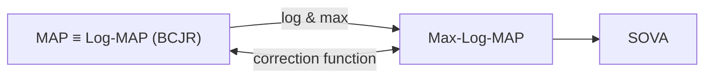

# 第三章

# 软检测

当今的硬盘驱动器信号处理系统开始采用迭代解码系统进行数据解码。迭代解码系统中的关键组件是软检测器 (soft detector) 和软解码器 (soft decoder)，它们之间交换软信息 (soft information)，以帮助系统在每轮迭代中提高性能。如第二章所述，BCJR 算法 [18] 是一种最大后验概率 (MAP: maximum a posteriori) 算法，对于估计马尔可夫过程 (Markov process) 的状态或输出数据是最优的 (optimal)。因此，在迭代解码系统 [3] 被提出的初期，BCJR 算法被用于构建软检测器和软解码器。

尽管 BCJR 算法中的状态度量 (state metric) 计算是递归式 (recursive) 的，使得数据解码相对容易，但 BCJR 算法并不常用于许多实际应用的信号处理芯片中。原因在于其计算资源消耗高（例如大量的加法和乘法运算）、使用非线性函数（如指数函数）、以及对系统中的噪声方差值敏感 [23, 24]。因此，研究人员开发了在对数域 (logarithm domain) 中工作的类 MAP 算法 (MAP-like algorithm)，这些算法能够解决数值计算问题，且复杂度远低于 BCJR 算法。

本章将解释这些类 MAP 算法的工作原理，包括 Max-Log-MAP [23, 24, 38, 39]、Log-MAP [23, 24] 和 SOVA (soft-output Viterbi algorithm) [19, 42]。这些算法的性能接近或等同于 BCJR 算法，同时还将展示所有算法的性能和复杂度比较。

flowchart

图 3.1 MAP、Log-MAP、Max-Log-MAP 和 SOVA 之间的关系

# 3.1 引言

维特比检测器 (Viterbi detector) [10, 13] 是一种最大似然 (ML: maximum-likelihood) 检测器，其输出数据是所需检测数据序列的估计值。或者说，ML 检测器使数据序列的误码率最小，但不保证序列中的每个数据位都是最优的。即 ML 检测器不能使每个数据位的误码率最小。此外，维特比检测器不能用于迭代解码系统，因为该系统需要在 SISO (soft input soft output) 检测器和 SISO 解码器之间交换软信息（即数据位的可靠性信息）。

BCJR 算法是一种 MAP 算法，在早期被用于迭代解码系统。然而，BCJR 算法在许多实际应用的信号处理芯片中实现存在局限性。因此，研究人员开发了 Max-Log-MAP 和 SOVA 算法，其性能接近 BCJR 算法。随后，又开发了 Log-MAP 算法，其性能等同于 BCJR 算法，但复杂度低得多，因此可以实际应用于信号处理芯片。图 3.1 显示了 MAP 算法和类 MAP 算法之间的关系。

# 3.2 Max-Log-MAP 算法

Max-Log-MAP 算法 [23, 24, 38, 39] 是从 BCJR 算法发展而来的，利用了最大值函数 (maximum function) 和对数函数 (logarithm function)，其主要目的是使其能够在实际中实现（即用于信号处理芯片），同时保持接近 BCJR 算法的性能。通常，Max-Log-MAP 算法被认为是次优的 (sub-optimal) 算法，其输出的软信息质量低于 BCJR 算法输出的软信息。

基于第 2.2 节中的信道模型和 BCJR 算法的各种方程，通过利用对数恒等式 $x_i = e^{\ln(x_i)}$ 和对数近似公式 [24]

$$
\ln\left(e^{x_1} + e^{x_2} + \dots + e^{x_n}\right) \approx \max_{i \in \{1, \dots, n\}} (x_i) \tag{3.1}
$$

可以将 Max-Log-MAP 算法转化为易于实际实现的形式。

其中 $x_i$ 是实数，$n$ 是正整数。因此，数据位 $a_k$ 在方程 (2.24) 中的 LLR 值可以重新整理为

$$
\lambda_p(a_k) = \ln\left(\sum_{(u,q) \in S_1} \alpha_k(u) \gamma_k(u,q) \beta_{k+1}(q)\right) - \ln\left(\sum_{(u,q) \in S_{-1}} \alpha_k(u) \gamma_k(u,q) \beta_{k+1}(q)\right) \tag{3.2}
$$

考虑方程 (3.2) 右边的第一项，可得

$$
\ln\left(\sum_{(u,q) \in S_1} \alpha_k(u) \gamma_k(u,q) \beta_{k+1}(q)\right) = \ln\left(\sum_{(u,q) \in S_1} e^{\ln(\alpha_k(u) \gamma_k(u,q) \beta_{k+1}(q))}\right)
$$

$$
= \ln\left(\sum_{(u,q) \in S_1} e^{\ln(\alpha_k(u)) + \ln(\gamma_k(u,q)) + \ln(\beta_{k+1}(q))}\right)
$$

$$
= \ln\left(\sum_{(u,q) \in S_1} e^{\tilde{\alpha}_k(u) + \tilde{\gamma}_k(u,q) + \tilde{\beta}_{k+1}(q)}\right) \tag{3.3}
$$

其中

$$
\tilde{\gamma}_k(u,q) = \ln(\gamma_k(u,q)) \tag{3.4}
$$

$$
\tilde{\alpha}_k(u) = \ln(\alpha_k(u)) \tag{3.5}
$$

$$
\tilde{\beta}_{k+1}(q) = \ln(\beta_{k+1}(q)) \tag{3.6}
$$

根据方程 (3.1)，方程 (3.3) 可以近似为

$$
\ln\left(\sum_{(u,q) \in S_1} \alpha_k(u) \gamma_k(u,q) \beta_{k+1}(q)\right) \approx \max_{(u,q) \in S_1} \left(\tilde{\alpha}_k(u) + \tilde{\gamma}_k(u,q) + \tilde{\beta}_{k+1}(q)\right) \tag{3.7}
$$

同样，方程 (3.2) 右边的第二项为

$$
\ln\left(\sum_{(u,q) \in S_{-1}} \alpha_k(u) \gamma_k(u,q) \beta_{k+1}(q)\right) \approx \max_{(u,q) \in S_{-1}} \left(\tilde{\alpha}_k(u) + \tilde{\gamma}_k(u,q) + \tilde{\beta}_{k+1}(q)\right) \tag{3.8}
$$

将方程 (3.7) 和 (3.8) 代入方程 (3.2)，得到 Max-Log-MAP 算法的数据位 $a_k$ 的 LLR 值为

$$
\lambda_p(a_k) \approx \max_{(u,q) \in S_1} \left(\tilde{\alpha}_k(u) + \tilde{\gamma}_k(u,q) + \tilde{\beta}_{k+1}(q)\right) - \max_{(u,q) \in S_{-1}} \left(\tilde{\alpha}_k(u) + \tilde{\gamma}_k(u,q) + \tilde{\beta}_{k+1}(q)\right) \tag{3.9}
$$

**$\tilde{\gamma}_k(u,q)$ 的计算（方程 (3.4)）**

对方程 (2.29) 两边取自然对数，得到新的分支度量

$$
\tilde{\gamma}_k(u,q) = \ln\left(\frac{1}{\sqrt{2\pi\sigma^2}}\right) - \frac{1}{2\sigma^2} |y_k - \hat{r}(u,q)|^2 + \frac{\hat{a}(u,q) \lambda_a(a_k)}{2} \tag{3.10}
$$

**$\tilde{\alpha}_k(u)$ 的计算（方程 (3.5)）**

对方程 (2.14) 两边取对数，得到

$$
\begin{aligned}
\tilde{\alpha}_{k+1}(q) &= \ln(\alpha_{k+1}(q)) = \ln\left(\sum_{u=0}^{Q-1} \gamma_k(u,q) \alpha_k(u)\right) \\
&= \ln\left(\sum_{u=0}^{Q-1} e^{\ln(\gamma_k(u,q) \alpha_k(u))}\right) \\
&= \ln\left(\sum_{u=0}^{Q-1} e^{\ln(\gamma_k(u,q)) + \ln(\alpha_k(u))}\right) \\
&= \ln\left(\sum_{u=0}^{Q-1} e^{\tilde{\gamma}_k(u,q) + \tilde{\alpha}_k(u)}\right) \tag{3.11}
\end{aligned}
$$

根据方程 (3.1)，方程 (3.11) 可以近似为

$$
\tilde{\alpha}_{k+1}(q) \approx \max_{\forall u} \left(\tilde{\gamma}_k(u,q) + \tilde{\alpha}_k(u)\right) \tag{3.12}
$$

# 3.2.1 Max-Log-MAP 算法步骤总结

Max-Log-MAP 算法的各步骤与图 2.12 中的 BCJR 算法相同，只是 Max-Log-MAP 算法使用方程 (3.9) 计算数据位 $a_k$ 的 LLR 值，其中参数 $\tilde{\gamma}_k(u,q)$、$\tilde{\alpha}_k(u)$ 和 $\tilde{\beta}_{k+1}(q)$ 分别由方程 (3.10)、(3.12) 和 (3.14) 求得。图 3.2 总结了 Max-Log-MAP 算法的步骤。

注：在实际应用中实现图 3.2 中的 Max-Log-MAP 算法时，不需要像 BCJR 算法那样对所有状态 $u$ 和所有时刻 $k$ 的状态度量 $\tilde{\alpha}_k(u)$ 和 $\tilde{\beta}_k(u)$ 进行归一化 (normalization)，因为 Max-Log-MAP 算法不会遇到数值下溢 (numerical underflow) 问题。

# Max-Log-MAP 算法

1. 初始化状态度量 $\left[\tilde{\alpha}_0(0), \tilde{\alpha}_0(1), \dots, \tilde{\alpha}_0(Q-1)\right] = [0, -\infty, \dots, -\infty]$

2. 前向递归 (forward recursion)

$$
\begin{aligned}
&\text{对于 } k = 0, 1, \dots, L+\nu-1 \\
&\text{对于 } q = 0, 1, \dots, Q-1 \\
&\text{根据方程 (3.10) 计算 } \tilde{\gamma}_k(u,q) \text{ 对于所有使 } (u,q) \text{ 成立的 } u \\
&\text{根据方程 (3.12) 计算 } \tilde{\alpha}_{k+1}(q) \\
&(\text{结束 } q \text{ 的循环}) \\
&(\text{结束 } k \text{ 的循环})
\end{aligned}
$$

3. 初始化状态度量 $\left[\tilde{\beta}_{L+\nu}(0), \tilde{\beta}_{L+\nu}(1), \dots, \tilde{\beta}_{L+\nu}(Q-1)\right] = [0, -\infty, \dots, -\infty]$

4. 后向递归 (backward recursion)

$$
\begin{aligned}
&\text{对于 } k = L+\nu-1, L+\nu-2, \dots, 0 \\
&\text{对于 } u = 0, 1, \dots, Q-1 \\
&\text{根据方程 (3.10) 计算 } \tilde{\gamma}_k(u,q) \text{ 对于所有使 } (u,q) \text{ 成立的 } q \\
&\text{根据方程 (3.14) 计算 } \tilde{\beta}_k(u) \\
&(\text{结束 } u \text{ 的循环}) \\
&\text{根据方程 (3.9) 计算 } \lambda_p(a_k) \\
&\text{根据方程 (2.25) 判决 } a_k \\
&(\text{结束 } k \text{ 的循环})
\end{aligned}
$$

图 3.2 Max-Log-MAP 算法步骤

**示例 3.1** 从示例 2.4 出发，请演示使用 Max-Log-MAP 算法解码数据 $y_k$ 的步骤，设数据位 $a_k$ 的先验信息为 $\lambda_a(a_k) = \{2, -2, 2, 0\}$。

**解** 从示例 2.4 可知，需要 Max-Log-MAP 算法检测的数据为

$$
y_k = \{y_0, y_1, y_2, y_3\} = \{0.9, -0.2, 0.3, 0.6\}
$$

信道 $H(D) = 1 + 0.5D$ 的网格图如图 2.13 所示，有两个状态：状态 (a) 和状态 (b)。因此，Max-Log-MAP 算法的数据解码步骤如下：

1. 初始化状态度量 $\tilde{\alpha}_0(a) = 0$ 和 $\tilde{\alpha}_0(b) = -\infty$

# 前向递归

2. 阶段 0（$k = 0$），Max-Log-MAP 算法接收数据 $y_0 = 0.9$ 和 $\lambda_a(a_0) = 2$，根据方程 (3.10) 对图 2.13 网格图中所有使状态转移 $(u,q)$ 成立的 $u$ 和 $q$ 计算分支度量 $\tilde{\gamma}_0(u,q)$，得到

$$
\tilde{\gamma}_0(a,a) = 0 - \pi |0.9 - (-1.5)|^2 + \frac{(-1)(2)}{2} \approx -19.0956
$$

$$
\tilde{\gamma}_0(b,a) = 0 - \pi |0.9 - (-0.5)|^2 + \frac{(-1)(2)}{2} \approx -7.1575
$$

$$
\tilde{\gamma}_0(a,b) = 0 - \pi |0.9 - (0.5)|^2 + \frac{(+1)(2)}{2} \approx 0.4973
$$

$$
\tilde{\gamma}_0(b,b) = 0 - \pi |0.9 - (1.5)|^2 + \frac{(+1)(2)}{2} \approx -0.1309
$$

由于 $\sigma^2 = 1/(2\pi)$，然后根据方程 (3.12) 更新状态度量如下

$$
\begin{aligned}
\tilde{\alpha}_1(a) &= \max\{\tilde{\alpha}_0(a) + \tilde{\gamma}_0(a,a), \tilde{\alpha}_0(b) + \tilde{\gamma}_0(b,a)\} \\
&= \max\{0 + (-19.0956), -\infty + (-7.1575)\} = -19.0956
\end{aligned}
$$

$$
\tilde{\alpha}_1(b) = \max\{\tilde{\alpha}_0(a) + \tilde{\gamma}_0(a,b), \tilde{\alpha}_0(b) + \tilde{\gamma}_0(b,b)\}
$$

$$
= \max\{0 + 0.4973, -\infty + (-0.1309)\} = 0.4973
$$

3. 阶段 1（$k = 1$），Max-Log-MAP 算法接收数据 $y_1 = -0.2$ 和 $\lambda_a(a_1) = -2$，计算分支度量

$$
\tilde{\gamma}_1(a,a) = 0 - \pi |-0.2 - (-1.5)|^2 + \frac{(-1)(-2)}{2} \approx -4.3093
$$

$$
\tilde{\gamma}_1(b,a) = 0 - \pi |-0.2 - (-0.5)|^2 + \frac{(-1)(-2)}{2} \approx 0.7173
$$

$$
\tilde{\gamma}_1(a,b) = 0 - \pi |-0.2 - (0.5)|^2 + \frac{(+1)(-2)}{2} \approx -2.5394
$$

$$
\tilde{\gamma}_1(b,b) = 0 - \pi |-0.2 - (1.5)|^2 + \frac{(+1)(-2)}{2} \approx -10.0792
$$

然后更新状态度量 $\tilde{\alpha}_2(a)$ 和 $\tilde{\alpha}_2(b)$

$$
\begin{aligned}
\tilde{\alpha}_2(a) &= \max\{\tilde{\alpha}_1(a) + \tilde{\gamma}_1(a,a), \tilde{\alpha}_1(b) + \tilde{\gamma}_1(b,a)\} \\
&= \max\{(-19.0956) + (-4.3093), (0.4973) + (0.7173)\} = 1.2146
\end{aligned}
$$

$$
\begin{aligned}
\tilde{\alpha}_2(b) &= \max\{\tilde{\alpha}_1(a) + \tilde{\gamma}_1(a,b), \tilde{\alpha}_1(b) + \tilde{\gamma}_1(b,b)\} \\
&= \max\{(-19.0956) + (-2.5394), (0.4973) + (-10.0792)\} = -9.5819
\end{aligned}
$$

4. 阶段 2 和 3（$k = \{2, 3\}$），Max-Log-MAP 算法接收数据 $\{y_2, y_3\} = \{0.3, 0.6\}$ 和 $\{\lambda_a(a_2), \lambda_a(a_3)\} = \{2, 0\}$，按照与步骤 2 和 3 相同的计算方法，对所有分支度量和状态度量 $\tilde{\alpha}_{k+1}(q)$ 进行计算（$q \in \{a, b\}$），得到 $\tilde{\gamma}_k(u,q)$ 和 $\tilde{\alpha}_{k+1}(q)$ 的值如图 3.3 所示。图中每条分支旁的值是对应状态转移 $(u,q)$ 的 $\tilde{\gamma}_k(u,q)$，每个状态节点处的数字以分数形式表示状态度量 $\tilde{\alpha}_k(u)$ 和 $\tilde{\beta}_k(u)$，如下

$$
\frac{\tilde{\alpha}_k(u)}{\tilde{\beta}_k(u)}
$$

对于每个 $k \in \{0, 1, 2, 3\}$ 和 $u \in \{a, b\}$。前向递归阶段结束时，得到

$$
\tilde{\alpha}_4(a) = -1.7124 \quad \text{和} \quad \tilde{\alpha}_4(b) = -0.4558
$$

5. 初始化状态度量 $\tilde{\beta}_4(u) = \tilde{\alpha}_4(u)$ 对于 $u \in \{a, b\}$，即

$$
\tilde{\beta}_4(a) = -1.7124 \quad \text{和} \quad \tilde{\beta}_4(b) = -0.4558
$$

# 后向递归

$$
\begin{aligned}
\tilde{\beta}_2(a) &= \max\{\tilde{\gamma}_2(a,a) + \tilde{\beta}_3(a), \tilde{\gamma}_2(a,b) + \tilde{\beta}_3(b)\} \\
&= \max\{(-11.1788) + (-0.4872), (0.8743) + (-3.0005)\} = -2.1262
\end{aligned}
$$

$$
\begin{aligned}
\tilde{\beta}_2(b) &= \max\{\tilde{\gamma}_2(b,a) + \tilde{\beta}_3(a), \tilde{\gamma}_2(b,b) + \tilde{\beta}_3(b)\} \\
&= \max\{(-3.0106) + (-0.4872), (-3.5239) + (-3.0005)\} = -3.4978
\end{aligned}
$$

然后根据方程 (3.9) 计算 $\lambda_p(a_2)$

$$
\begin{aligned}
\lambda_p(a_2) &\approx \max\{(\tilde{\alpha}_2(a) + \tilde{\gamma}_2(a,b) + \tilde{\beta}_3(b)), (\tilde{\alpha}_2(b) + \tilde{\gamma}_2(b,b) + \tilde{\beta}_3(b))\} \\
&\quad - \max\{(\tilde{\alpha}_2(a) + \tilde{\gamma}_2(a,a) + \tilde{\beta}_3(a)), (\tilde{\alpha}_2(b) + \tilde{\gamma}_2(b,a) + \tilde{\beta}_3(a))\} \\
&= \max\{(1.2146 + 0.8743 - 3.0005), (-9.5819 - 3.5239 - 3.0005)\} \\
&\quad - \max\{(1.2146 - 11.1788 - 0.4872), (-9.5819 - 3.0106 - 0.4872)\} \\
&= (-0.9116) - (-10.451) = 9.5394
\end{aligned}
$$

由于 $\lambda_p(a_2) > 0$，因此 Max-Log-MAP 算法解码得到 $\hat{a}_2 = +1$。

8. 阶段 1 和 0（$k = \{1, 0\}$），Max-Log-MAP 算法接收数据 $\{y_1, y_0\} = \{-0.2, 0.9\}$ 和 $\{\lambda_a(a_0), \lambda_a(a_1)\} = \{2, -2\}$，按照步骤 6 和 7 相同的方法，对所有分支度和状态度量 $\tilde{\beta}_k(u)$（$u \in \{a, b\}$）进行计算，得到 $\tilde{\gamma}_k(u,q)$ 和 $\tilde{\beta}_k(u)$ 的值如图 3.3 所示。后向递归结束时，得到

$$
\lambda_p(a_0) = 24.221 \quad \text{和} \quad \lambda_p(a_1) = -12.168
$$

即 Max-Log-MAP 算法解码数据位 $a_0$ 和 $a_1$ 为 $\hat{a}_0 = +1$ 和 $\hat{a}_1 = -1$。

9. 工作结束时，Max-Log-MAP 算法给出数据位 $a_k$ 的后验 LLR 值为
   $\{\lambda_p(a_0), \lambda_p(a_1), \lambda_p(a_2), \lambda_p(a_3)\} \approx \{24.22, -12.17, 9.54, 2.51\}$
   并解码出数据位 $\{\hat{a}_0, \hat{a}_1, \hat{a}_2, \hat{a}_3\} = \{1, -1, 1, 1\}$
   （最后一位在系统中不存在，是卷积运算的结果），这与发送端发送的数据位 $\{a_k\}$ 一致，表明 Max-Log-MAP 算法的数据解码没有发生错误。

**示例 3.2** 从示例 2.5 出发，请使用 Max-Log-MAP 算法解码数据 $y_k$，设数据位 $a_k$ 的先验信息为 $\lambda_a(a_k) = \{1, -1, 2, 1, -1\}$。

**解** 从示例 2.5 可知，需要 Max-Log-MAP 算法检测的数据为

$$
y_k = \{y_0, y_1, y_2, y_3, y_4\} = \{1.2, -0.7, -0.2, 0.5, -0.7\}
$$

图 3.4 示例 3.2 中 Max-Log-MAP 算法的内部计算

信道 $H(D) = 1 - D^2$ 的网格图如图 2.15 所示，共有四个状态：状态 (a)、(b)、(c) 和 (d)。

然后按照示例 3.1 中相同的方法，使用 Max-Log-MAP 算法进行数据解码，得到分支度量和状态度量如图 3.4 所示。图中每条分支旁的值是 $\tilde{\gamma}_k(u,q)$，每个状态节点处的数字以分数 $\tilde{\alpha}_k(u)/\tilde{\beta}_k(u)$ 表示状态度量，对于每个 $k \in \{0, 1, \dots, 4\}$ 和 $u \in \{a, b, c, d\}$。

根据图 3.4 中的分支度量和状态度量，可以按照方程 (3.9) 计算数据位 $a_k$ 的后验 LLR 值

$$
\{\lambda_p(a_0), \lambda_p(a_1), \lambda_p(a_2), \lambda_p(a_3), \lambda_p(a_4)\} \approx \{7.28, -26.65, 7.28, -10.57, 5.54\}
$$

并解码出数据位

$$
\{\hat{a}_0, \hat{a}_1, \hat{a}_2, \hat{a}_3, \hat{a}_4\} = \{1, -1, 1, -1, 1\}
$$

这与发送端发送的数据位 $a_k$ 一致（最后两位在系统中不存在，是输入数据与信道卷积的结果），表明 Max-Log-MAP 算法的数据解码没有发生错误。

# 3.2.2 Max-Log-MAP 算法的观察

根据上述讨论，Max-Log-MAP 算法通过使用方程 (3.1) 中的最大值函数来近似 BCJR 算法中的状态度量 $\alpha_k(u)$ 和 $\beta_{k+1}(q)$。因此，Max-Log-MAP 算法不可避免地面临近似误差 (approximation error)。由于两个状态度量在每个时刻都以递归方式计算，近似误差会沿着整个数据序列 $\mathbf{y}$ 传播 (propagate)。

# 3.3 Log-MAP 算法

由于 Max-Log-MAP 算法使用方程 (3.1) 来近似 BCJR 算法的各种参数，因此面临近似误差问题，导致其性能低于 BCJR 算法。然而，方程 (3.1) 中的近似误差可以通过使用雅可比对数 (Jacobian logarithm) [24, 38] 来修正（证明见附录 A）

$$
\begin{aligned}
\ln(e^{x_1} + e^{x_2}) &= \max(x_1, x_2) + \ln(1 + e^{-|x_1 - x_2|}) \\
&= \max(x_1, x_2) + f_c(|x_1 - x_2|) \tag{3.15}
\end{aligned}
$$

其中 $f_c(|x_1 - x_2|) = \ln(1 + e^{-|x_1 - x_2|})$ 是修正函数 (correction function)。

此外，为了方便解释 Log-MAP 算法的工作原理，定义一个新的最大值函数如下

$$
\max^*(x_1, x_2) = \max(x_1, x_2) + f_c(|x_1 - x_2|) \tag{3.16}
$$

因此，方程 (3.1) 中的 $\ln(e^{x_1} + e^{x_2} + \dots + e^{x_n})$ 可以精确计算如下。假设已知 $x$ 满足 $x = \ln(e^{x_1} + e^{x_2} + \dots + e^{x_{n-1}}) = \ln(\Delta)$，其中 $\Delta = e^{x_1} + e^{x_2} + \dots + e^{x_{n-1}} = e^{x}$，则可得

$$
\begin{aligned}
\ln(e^{x_1} + e^{x_2} + \dots + e^{x_{n-1}} + e^{x_n}) &= \ln(\Delta + e^{x_n}) = \ln(e^{\ln(\Delta)} + e^{x_n}) \\
&= \max(\ln(\Delta), x_n) + f_c(|\ln(\Delta) - x_n|) \\
&= \max(x, x_n) + f_c(|x - x_n|) \\
&= \max^*(x, x_n) \tag{3.17}
\end{aligned}
$$

Log-MAP 算法的工作方式与 Max-Log-MAP 算法相同，只是使用方程 (3.16) 和 (3.17) 而不是方程 (3.1) 来近似 BCJR 算法的各种参数。因此，从方程 (3.9) 出发，Log-MAP 算法计算数据位 $a_k$ 的 LLR 值如下

$$
\lambda_k = \max_{(u,q) \in S_1}^* (\hat{\alpha}_k(u) + \tilde{\gamma}_k(u,q) + \hat{\beta}_{k+1}(q)) - \max_{(u,q) \in S_{-1}}^* (\hat{\alpha}_k(u) + \tilde{\gamma}_k(u,q) + \hat{\beta}_{k+1}(q)) \tag{3.18}
$$

其中分支度量 $\tilde{\gamma}_k(u,q)$ 由方程 (3.10) 求得，而

$$
\hat{\alpha}_{k+1}(q) = \max_{\forall u}^* (\tilde{\gamma}_k(u,q) + \hat{\alpha}_k(u)) \tag{3.19}
$$

$$
\hat{\beta}_k(u) = \max_{\forall q}^* (\hat{\beta}_{k+1}(q) + \tilde{\gamma}_k(u,q)) \tag{3.20}
$$

在实际应用中，Log-MAP 算法的性能等同于 BCJR 算法，但计算资源消耗更少，并且对噪声方差值的敏感度低于 BCJR 算法。然而，尽管 Log-MAP 算法的性能优于 Max-Log-MAP 算法，但其复杂度也更高。因此，在选择使用哪种算法时，用户需要在复杂度和可接受的性能之间进行权衡。

图 3.5 示例 3.3 中 Log-MAP 算法的内部计算

**示例 3.3** 从示例 3.1 出发，请使用 Log-MAP 算法解码数据 $y_k$，设数据位 $a_k$ 的先验信息为 $\lambda_a(a_k) = \{1, -4, 3, -2\}$。

**解** 从示例 3.1 出发，Log-MAP 算法接收数据 $y_k = \{0.9, -0.2, 0.3, 0.6\}$ 和 $\lambda_a(a_k) = \{1, -4, 3, -2\}$ 进行数据解码。方法与示例 3.1 中所示相同，得到的 Log-MAP 算法各参数如图 3.5 所示，其中每条分支旁的值是 $\tilde{\gamma}_k(u,q)$，每个状态节点处的数字以分数形式表示状态度量 $\hat{\alpha}_k(u)$ 和 $\hat{\beta}_k(u)$。

# 3.4 SOVA 算法

软输出维特比算法，简称 SOVA (soft output Viterbi algorithm) [19]，是一种能够输出输入数据位 LLR 值的算法，与 MAP（或 BCJR）、Max-Log-MAP 和 Log-MAP 算法一样。通常，SOVA 算法的性能与 Max-Log-MAP 算法相当，但复杂度更低 [39]，因此被广泛应用于多种应用中，包括使用迭代解码系统的新一代硬盘驱动器。

注：读者应先理解维特比算法的工作原理（见 [10] 第 4 章），再学习 SOVA 算法的工作原理，以便更容易地理解 SOVA 算法。

SOVA 算法的工作方式与维特比算法 [13] 类似，但有两个重要区别：

1) SOVA 算法使用改进的分支度量 (modified branch metric)，该度量结合了输入数据位的先验概率 (a priori probability) 的影响。
2) SOVA 算法输出软信息 (soft output)，用于指示每个数据位判决的可靠性 (reliability)。

考虑图 2.10 中的信道模型。维特比算法在第 $k$ 阶段从 $k$ 时刻状态 $u$ 到 $k+1$ 时刻状态 $q$ 的状态转移的分支度量 $\rho_k(u,q)$ 为 [10, 13]

$$
\rho_k(u,q) = \ln(p(y_k \mid a_k)) = \ln\left(\frac{1}{\sqrt{2\pi\sigma^2}}\right) - \frac{1}{2\sigma^2} |y_k - \hat{r}(u,q)|^2 \tag{3.21}
$$

其中 $\hat{r}(u,q)$ 是对应于网格图中状态转移 $(u,q)$ 的信道输出数据，$\sigma^2$ 是噪声 $n_k$ 的方差。

输入数据位 $a_k$ 的先验概率可以根据方程 (3.10) 加入到分支度量中。因此，SOVA 算法中使用的分支度量为

$$
\tilde{\gamma}_k(u,q) = \ln(p(y_k; a_k)) = \ln\left(\frac{1}{\sqrt{2\pi\sigma^2}}\right) - \frac{1}{2\sigma^2} |y_k - \hat{r}(u,q)|^2 + \frac{\hat{a}(u,q) \lambda_a(a_k)}{2} \tag{3.22}
$$

其中 $p(y_k; a_k) = p(y_k \mid a_k) p(a_k)$，$\hat{a}(u,q)$ 是对应于状态转移 $(u,q)$ 的信道输入数据，$\lambda_a(a_k)$ 是输入数据位 $a_k$ 的先验概率值。

SOVA 算法沿着网格图搜索具有最大度量的路径。$k+1$ 时刻状态 $q$ 的路径度量 (path metric) 等于方程 (3.22) 中分支度量的和，即

$$
\Phi_{k+1}(q) = \sum_{i=0}^{k} \tilde{\gamma}_i \tag{3.23}
$$

其中 $\tilde{\gamma}_i$ 是与到达 $k+1$ 时刻状态 $q$ 的"幸存路径 (survivor path)"相对应的第 $i$ 时刻的分支度量。因此，SOVA 算法与维特比算法在选择输入数据序列（即输入数据序列的估计值 $\hat{a}_k$）方面工作方式相同，都是选择具有最高路径度量的路径——称为"ML 路径 (maximum-likelihood)"或最大似然路径——只是 SOVA 算法使用方程 (3.22) 中的分支度量。此外，SOVA 算法还能输出每个数据位的 LLR 值，用于指示数据位应该是什么及其可靠性的程度。

# 3.4.1 数据位 LLR 的计算

SOVA 算法可以按以下方式计算每个数据位的 LLR 值。考虑图 3.7 中第 $k$ 阶段的网格图。$k+1$ 时刻状态 $q$ 的路径度量 $\Phi_{k+1}(q)$ 由下式求得

$$
\Phi_{k+1}(q) = \ln(p(\mathbf{y}_0^k; \mathbf{a}_0^k)) \tag{3.24}
$$

其中 $\mathbf{y}_0^k = [y_0, y_1, \dots, y_k]$ 是从时刻 0 到时刻 $k$ 的需要解码的数据序列，$\mathbf{a}_0^k = [a_0, a_1, \dots, a_k]$ 是与 $\mathbf{y}_0^k$ 对应的从时刻 0 到时刻 $k$ 的输入数据序列。方程 (3.24) 可以重新整理为

即数据位 $\hat{a}_{k-\delta}$ 的可靠性取决于幸存路径上具有最小值的路径度量差 $\Delta_k^d$。因此，方程 (3.37) 中 $\lambda(\hat{a}_{k-\delta})$ 的符号是数据位 $\hat{a}_{k-\delta}$ 的估计值，$|\lambda(\hat{a}_{k-\delta})|$ 的大小是解码数据位的可靠性值。

# 3.4.2 SOVA 算法的观察

从方程 (3.37) 可以看出，数据位的 LLR 值取决于方程 (3.26) 所示的路径度量差，即 $\Delta_k(q) = \Phi_k^{(1)}(q) - \Phi_k^{(2)}(q)$，其中 $\Phi_k^{(i)}(q)$（$i = \{1, 2\}$）是方程 (3.23) 中的分支度量之和，分支度量 $\tilde{\gamma}_k(u,q)$ 由方程 (3.22) 求得。

然而，为了降低路径度量差 $\Delta_k(q)$ 的计算复杂度，SOVA 算法可以使用以下形式的分支度量

$$
\tilde{\gamma}_k(u,q) \approx -\frac{1}{2\sigma^2} |y_k - \hat{r}(u,q)|^2 + \frac{\hat{a}(u,q) \lambda_a(a_k)}{2} \tag{3.38}
$$

而不影响 SOVA 算法的性能，因为在计算方程 (3.26) 中的路径度量差时仍然得到相同的结果。

# 3.4.3 SOVA 算法步骤总结

设 $\pi_{k+1}(q)$ 是 $k+1$ 时刻状态 $q$ 的前驱 (predecessor)，它保存了导致到达 $k+1$ 时刻状态 $q$ 的最佳状态转移的前一时刻（$k$ 时刻）状态。此状态转移被认为是幸存路径 $\mathbf{S}_{k+1}(q)$ 的一部分。例如，考虑图 3.7 中的网格图。假设路径 (1) 是使 $\Phi_{k+1}(q)$ 具有最大值的路径，则 $\pi_{k+1}(q) = u$，即状态 $u$ 是导致最佳状态转移到 $k+1$ 时刻状态 $q$ 的前一状态。因此，SOVA 算法的工作原理可总结为图 3.9 中的各个步骤。

**示例 3.5** 从示例 2.4 出发，请使用 SOVA 算法解码数据 $y_k$，设 $\lambda_a(a_k) = \{-1, 2, 1, 2\}$，解码深度 $\delta = 3$。

**解** 从示例 2.4 可知，需要 SOVA 算法检测的数据为

(结束 $k$ 的循环)

3. 根据 ML 路径（具有最大 $\Phi_{L+\nu+\delta}$ 的幸存路径）解码输入数据序列 $\hat{\mathbf{a}}_0^{L-1}$

# 软解码（计算 LLR）

4. 设置 LLR 值的初始大小 $|\lambda(\hat{a}_k)| = +\infty$，对于 $k = 0, 1, \dots, L-1$

5. 对于 $k = \delta, \delta+1, \dots, L-1+\delta$
   对于 $d = 0, 1, \dots, \delta$
   比较根据 ML 路径解码的数据位 $\hat{a}_{k-\delta}$ 与根据被丢弃路径 $d$ 解码的数据位 $\hat{a}_{k-\delta}^d$
   如果 $\hat{a}_{k-\delta}^d \neq \hat{a}_{k-\delta}$，则按以下关系更新 LLR 值的大小
   $$
   |\lambda(\hat{a}_{k-\delta})| = \min\{|\lambda(\hat{a}_{k-\delta})|, \Delta_{k+1}^d\}
   $$
   (结束 $d$ 的循环)
   根据下式计算数据位 $a_{k-\delta}$ 的后验 LLR 值
   $$
   \lambda_p(\hat{a}_{k-\delta}) = \hat{a}_{k-\delta} |\lambda(\hat{a}_{k-\delta})|
   $$
   (结束 $k$ 的循环)

图 3.9 SOVA 算法步骤 [19, 40]

1. 初始化路径度量 $\Phi_0(u) = 0$ 对于所有状态 $u = \{a, b\}$

2. 阶段 0 到 6（$k = 0, 1, \dots, 6$），按照图 3.9 中的步骤，像维特比算法一样进行硬解码。在解码过程中，同时记录路径度量差 $\Delta_{k+1}(q)$ 和前一状态 $\pi_{k+1}(q)$，$q = \{a, b\}$，如图 3.10 (a) 所示。图中每个状态节点处的数字是路径度量差 $\Delta_{k+1}(q)$，括号中的字母是前一状态 $\pi_{k+1}(q)$，通过每个节点的箭头线是具有最大路径度量的 ML 路径——$\Phi_7(a) > \Phi_7(b)$。实线箭头表示输入数据位 $a_k = 1$，虚线箭头表示输入数据位 $a_k = -1$。因此，SOVA 算法的硬解码结果为
   $$
   \{\hat{a}_0, \hat{a}_1, \hat{a}_2, \hat{a}_3\} = \{1, -1, 1, 1\}
   $$
   最后一位在系统中不存在，是输入数据与信道卷积的结果。

**软解码**（解码深度 $\delta = 3$）

3. 阶段 3（$k = 3$），从步骤 1 解码的数据中得到 $\hat{a}_{k-\delta} = \hat{a}_0 = 1$。图 3.10 (b) 显示了 $d = \{0, 1, \dots, \delta\}$ 的路径 $d$（被丢弃的路径），以及对应的数据位 $\hat{a}_{k-\delta}^d$ 和路径度量差 $\Delta_{k+1}^d$。在这种情况下，$\{\hat{a}_0^0, \hat{a}_0^1, \hat{a}_0^2\} \neq \hat{a}_0$，因此数据位 $a_0$ 的 LLR 值大小为
   $$
   |\lambda(\hat{a}_0)| = \min\{+\infty, \Delta_4^0, \Delta_4^1, \Delta_4^2\} = 4.2832
   $$
   数据位 $a_0$ 的 LLR 值为 $\lambda(\hat{a}_0) = \hat{a}_0 |\lambda(\hat{a}_0)| = (1)(4.2832) = 4.2832$

4. 阶段 4（$k = 4$），从步骤 1 解码的数据中得到 $\hat{a}_1 = -1$。图 3.10 (c) 显示了路径 $d$（被丢弃的路径），以及对应的数据位 $\hat{a}_1^d$ 和路径度量差 $\Delta_5^d$。在这种情况下，$\{\hat{a}_1^1, \hat{a}_1^2\} \neq \hat{a}_1$，因此数据位 $a_1$ 的 LLR 值大小为
   $$
   |\lambda(\hat{a}_1)| = \min\{+\infty, \Delta_5^1, \Delta_5^2\} = 4.2832
   $$
   数据位 $a_1$ 的 LLR 值为 $\lambda(\hat{a}_1) = \hat{a}_1 |\lambda(\hat{a}_1)| = (-1)(4.2832) = -4.2832$

# 3.5 双向 SOVA 算法

在第 3.4 节中描述的 SOVA 算法具有相当复杂的步骤，可能难以理解。本节将解释另一种形式的 SOVA 算法的工作原理，称为"双向 SOVA 算法 (bi-directional SOVA)" [41, 42]，其提供的数据位 LLR 值与 SOVA 算法接近，且更易于实际实现。

考虑图 2.10 中的信道模型。SOVA 算法根据方程 (2.23) 输出数据位 $a_k$ 的后验 LLR 值

$$
\lambda_p(a_k) = \ln\left(\frac{\Pr[a_k = 1 \mid \mathbf{y}]}{\Pr[a_k = -1 \mid \mathbf{y}]}\right) \tag{3.39}
$$

其中 $a_k \in \{-1, 1\}$ 是信道的输入数据，$\mathbf{y} = [y_0, y_1, \dots, y_{L+\nu-1}]$ 是需要解码的数据序列，$L$ 是输入数据序列的长度，$\nu$ 是信道记忆长度。

双向 SOVA 算法利用网格图解码信道的输入数据，根据具有最大路径度量 (maximum path metric) 的路径（即 ML 路径）选择输入数据序列 $\mathbf{a} = [a_0, a_1, \dots, a_{L-1}]$。到达 $k+1$ 时刻状态 $q$ 的路径度量由方程 (3.24) 求得

$$
\Phi_{k+1}(q) = \ln(p(\mathbf{y}_0^k; \mathbf{a}_0^k)) \tag{3.40}
$$

即到达 $k+1$ 时刻状态 $q$ 的幸存路径的分支度量之和。第 $k$ 阶段对应于状态转移 $(u,q)$ 的分支度量由方程 (3.38) 求得

$$
\tilde{\gamma}_k(u,q) = \ln(p(y_k; a_k)) \approx -\frac{1}{2\sigma^2} |y_k - \hat{r}(u,q)|^2 + \frac{\hat{a}(u,q) \lambda_a(a_k)}{2} \tag{3.41}
$$

根据贝叶斯定理

$$
p(\mathbf{a} \mid \mathbf{y}) = \frac{p(\mathbf{a}; \mathbf{y})}{p(\mathbf{y})} = \frac{p(\mathbf{y} \mid \mathbf{a}) p(\mathbf{a})}{p(\mathbf{y})} \tag{3.42}
$$

由于 $p(\mathbf{y})$ 被视为与维特比算法选择幸存路径的判决无关的常数，因此根据方程 (3.25)，选择 ML 路径的概率与下式成正比

$$
p(\mathbf{a} \mid \mathbf{y}) \sim \exp\{\Phi_{L+\nu}^{\max}\} \tag{3.43}
$$

# 3.5.1 数据位 LLR 的计算

双向 SOVA 算法的工作原理分为两个步骤：

1) 按照维特比算法的步骤进行数据解码，找到与 ML 路径——即在 $k+\nu$ 时刻具有最大路径度量的路径 $\Phi_{L+\nu}^{\max}$——相对应的输入数据序列估计值 $[\hat{a}_0, \hat{a}_1, \dots, \hat{a}_{L-1}]$。然后记录 $\Phi_{L+\nu}^{\max}$ 以及每个时刻 $k$ 和每个状态 $u = \{0, 1, \dots, Q-1\}$ 的路径度量 $\Phi_k(u)$。

2) 根据原始网格图进行反向解码 (backward decoding)（与步骤 1 中维特比算法的工作方式相同），如图 3.12 所示，以求得分支度量 $\tilde{\gamma}_k^b(\Psi_k = u, \Psi_{k+1} = q)$（简记为 $\tilde{\gamma}_k^b(u,q)$，根据方程 (3.41)）和路径度量 $\Phi_k^b(u)$，从 $k = L+\nu$ 时刻到 $k = 0$ 时刻。路径度量由下式求得 [41, 42]

$$
\Phi_k^b(u) = \max_{\forall q} \{\tilde{\gamma}_k^b(u,q) + \Phi_{k+1}^b(q)\} \tag{3.50}
$$

当设置分支度量的初始值 $\Phi_{L+\nu}^b(q) = 0$ 对于所有状态 $q$。然后记录 $\tilde{\gamma}_k^b(u,q)$ 和 $\Phi_k^b(u)$ 对于每个时刻 $k$ 和每个使状态转移 $(u,q) \equiv (\psi_k = u, \psi_{k+1} = q)$ 成立的 $u$ 和 $q$，以用于计算输入数据位的 LLR 值。

图 3.12 反向解码的网格图

注：步骤 1 中计算得到的分支度量 $\tilde{\gamma}_k(u,q)$ 始终等于步骤 2 中反向计算得到的分支度量 $\tilde{\gamma}_k^b(u,q)$。此外，在反向解码过程中的每个时刻 $k$，可以立即计算输入数据位 $a_k$ 的 LLR 值，从而无需记录每个时刻 $k$ 和每个状态 $u$ 和 $q$ 的 $\tilde{\gamma}_k^b(u,q)$ 和 $\Phi_k^b(u)$，以减少双向 SOVA 算法所需的内存容量（见双向 SOVA 算法的步骤，图 3.13）。

在步骤 1 的数据解码完成后，得到 $[\hat{a}_0, \hat{a}_1, \dots, \hat{a}_{L-1}]$、$\Phi_{L+\nu}^{\max}$ 和每个 $k$ 和 $u$ 的 $\Phi_k(u)$。然后，计算相反数据位 $a_k^c$ 的最大路径度量，由下式求得 [41, 42]

$$
\Phi_{k+1}^c = \max_{\forall (u,q), \hat{a}(u,q) \neq \hat{a}_k} \{\Phi_k(u) + \tilde{\gamma}_k^b(u,q) + \Phi_{k+1}^b(q)\} \tag{3.51}
$$

对于所有具有数据位 $\hat{a}(u,q) \neq \hat{a}_k$ 的状态转移 $(u,q)$。因此，数据位 $a_k$ 的后验 LLR 值由方程 (3.48) 求得

$$
\lambda_p(a_k) = \Phi_{k+1}^{(1)} - \Phi_{k+1}^{(-1)} \tag{3.52}
$$

其中，如果根据 ML 路径在时刻 $k$ 解码的数据位为 $\hat{a}_k = 1$，则设 $\Phi_{k+1}^{(1)} = \Phi_{L+\nu}^{\max}$ 和 $\Phi_{k+1}^{(-1)} = \Phi_{k+1}^c$。反之，如果根据 ML 路径在时刻 $k$ 解码的数据位为 $\hat{a}_k = -1$，则设 $\Phi_{k+1}^{(-1)} = \Phi_{L+\nu}^{\max}$ 和 $\Phi_{k+1}^{(1)} = \Phi_{k+1}^c$。

# 3.5.2 双向 SOVA 算法步骤总结

SOVA 算法的工作原理可总结为图 3.13 中的各个步骤。

**示例 3.7** 从示例 2.4 出发，请使用双向 SOVA 算法解码数据 $y_k$，设 $\lambda_a(a_k) = \{-1, 2, 1, 2\}$。

**解** 从示例 2.4 可知，需要双向 SOVA 算法检测的数据为

$$
y_k = \{y_0, y_1, y_2, y_3\} = \{0.9, -0.2, 0.3, 0.6\}
$$

信道 $H(D) = 1 + 0.5D$ 的网格图如图 2.13 所示，有两个状态：状态 (a) 和状态 (b)。因此，双向 SOVA 算法的数据解码步骤如下：

# 3.6 软检测器的复杂度

这里比较第 2 章和第 3 章中描述的所有软检测器的复杂度，考虑解码一位数据所需的加法运算器 (addition operator) 和乘法运算器 (multiplication operator) 的数量，依据以下准则：

- 1 个选择/比较/求最大值/硬判决运算器的复杂度相当于 1 个加法运算器
- 加法和减法运算器的复杂度相同，乘法和除法运算器的复杂度相同
- 各种数学函数，如自然对数函数、指数函数、绝对值函数和方程 (3.16) 中的修正函数，可以通过查找表 (look-up table) 求得，因此这里不计入检测器的复杂度

表 3.1 显示了各种软检测器解码一位数据所需的复杂度，其中 $Q = 2^\nu$ 是网格图中的状态数 (trellis state)，$\nu$ 是构建网格图的目标的记忆长度。此外，表 3.2 和 3.3 给出了 BCJR 和 Max-Log-MAP 算法各种数学运算器的计数方法示例，供读者参考。

表 3.2 BCJR 算法解码一位数据所需的复杂度

| BCJR (或 MAP) | 数学运算器数量（每位） |
|---|---|
| | 加法 | 乘法 |
| $\gamma_k(u,q)$ 方程 (2.29) 前向和后向递归 | 8Q | 12Q |
| $\alpha_{k+1}(q)$ 方程 (2.14) | Q | 2Q |
| $\beta_k(u)$ 方程 (2.16) | Q | 2Q |
| 归一化 $\alpha_k(u)$ 方程 (2.30) | Q-1 | Q |
| 归一化 $\beta_k(u)$ 方程 (2.30) | Q-1 | Q |
| LLR $\lambda_p(a_k)$ 方程 (2.24) | 2(Q-1) | 4Q+1 |
| 一位数据的硬判决 | 1 | 0 |
| **总计** | **14Q-3** | **22Q+1** |

表 3.3 Max-Log-MAP 算法解码一位数据所需的复杂度

| MAX-LOG-MAP | 数学运算器数量（每位） |
|---|---|
| | 加法 | 乘法 | 求最大值 |
| $\tilde{\gamma}_k(u,q)$ 方程 (3.10) 前向和后向递归 | 12Q | 12Q | 0 |
| $\tilde{\alpha}_{k+1}(q)$ 方程 (3.12) | 2Q | 0 | Q |
| $\tilde{\beta}_k(u)$ 方程 (3.14) | 2Q | 0 | Q |
| LLR $\lambda_p(a_k)$ 方程 (3.9) | 4Q+1 | 0 | 2(Q-1) |
| 一位数据的硬判决 | 1 | 0 | 0 |
| **总计** | **20Q+2** | **12Q** | **4Q-2** |

line

| 目标记忆长度 (v) | BCJR (或 MAP) | Max-Log-MAP, Log-MAP, 双向 SOVA | SOVA |
|---|---|---|---|
| 1 | 40 | 20 | 10 |
| 2 | 100 | 50 | 20 |
| 3 | 180 | 100 | 40 |
| 4 | 350 | 200 | 100 |
| 5 | 710 | 390 | 200 |

图 3.16 各种软检测器的乘法运算器数量比较（每位）

在实际应用中，乘法运算器在构建电子电路时被认为比加法运算器更复杂。因此，这里仅考虑乘法运算器的数量来比较各种软检测器的复杂度（每位），如图 3.16 所示。可以看出，BCJR 算法复杂度最高，特别是当所用目标的记忆长度很大时。Max-Log-MAP、Log-MAP 和双向 SOVA 算法的复杂度相同，而 SOVA 算法复杂度最低。因此，这就是为什么 SOVA 算法被用于各种应用（包括硬盘驱动器）的迭代解码系统中的原因，而不使用 BCJR 算法。然而，从表 3.1 的整体情况来看，复杂度最高的算法依次为 BCJR、Log-MAP、Max-Log-MAP、双向 SOVA 和 SOVA。

# 3.7 章末小结

迭代解码系统的关键组件是软检测器和软解码器，它们之间交换软信息，以帮助系统在每轮迭代中提高性能。BCJR 算法是一种 MAP 算法，可用于构建软检测器和软解码器，保证解码的每个数据位是最优的（即错误最少）。然而，BCJR 算法复杂度较高，因此不常用于各种应用的迭代解码系统。

因此，本章解释了各种类 MAP 算法的概念和工作原理，包括 Max-Log-MAP、Log-MAP、SOVA 和双向 SOVA。这些算法的性能接近 BCJR 算法，但复杂度较低（见表 3.1）。特别是 SOVA 算法，其复杂度最低，但性能接近于 BCJR 算法，当用于各种应用的迭代解码系统时（见第 4.6.2 节示例）。因此，目前 SOVA 算法被广泛用于各种应用（包括硬盘驱动器）的迭代解码系统中。

# 3.8 章末习题

1. 请解释 BCJR、Max-Log-MAP、Log-MAP、SOVA 和双向 SOVA 算法之间的区别。

2. 根据图 2.10 中的信道模型，设输入数据序列 $a_k = \{1, 1, -1\}$，信道 $H(D) = 1 - D$，噪声 $n_k = \{-0.2, -0.3, 0.2, 0.1\}$，方差 $\sigma^2 = 1/(2\pi)$。请使用 Max-Log-MAP 算法解码数据 $y_k$，设先验信息为：
   2.1) $\lambda_a(a_k) = \{0, 0, 0, 0\}$
   2.2) $\lambda_a(a_k) = \{4, 6, -2, 0\}$
   2.3) $\lambda_a(a_k) = \{-4, -6, 2, 0\}$
   2.4) 比较并解释 2.1-2.3 中数据解码的结果。

3. 从第 2 题出发，请使用 BCJR 算法解码数据 $y_k$。

4. 从第 2 题出发，请使用 Log-MAP 算法解码数据 $y_k$。

5. 从第 2 题出发，请使用 SOVA 算法解码数据 $y_k$，设解码深度为 ...
