## 第五章

## 迭代解码的应用

本章将展示迭代解码技术在解决硬盘驱动器信号处理系统中的定时同步和热粗糙度（TA）问题中的应用示例，这些技术有助于提高硬盘驱动器的性能和可靠性。

## 5.1 迭代定时恢复

如前所述[10]，定时恢复的功能是使采样器与接收到的模拟信号同步，以在将采样数据发送到后续处理步骤（如均衡器和解码器）之前获得最佳采样数据。因此，定时恢复是数字通信系统中非常重要的组成部分，因为如果采样器工作不佳，获得的采样数据质量差，将这些采样数据送入均衡器和解码器后，结果将出现大量错误。

通常，基于锁相环（PLL）[11]的传统定时恢复在高信噪比条件下可以高效工作。然而，纠错码（ECC）如Turbo码[3]或LDPC码[17]等具有较高的编码增益，使系统能够在低SNR下可靠工作。因此，ECC已被广泛应用于多种领域，如移动电话、卫星通信系统和硬盘驱动器等。这一发展的附带结果是，定时恢复系统需要在比以前更低的SNR水平下工作。因此，独立于ECC工作的传统定时恢复系统在低SNR下性能不佳。然而，目前研究人员已提出了多种能够在低SNR下高效工作的定时恢复系统[34–36, 56–59]。

本节将解释基于逐幸存路径处理（PSP）[60]的迭代定时恢复原理，这是一种联合估计待解码数据序列和未知参数的技术。首先解释基于PSP的定时恢复原理，用于未编码的部分响应（PR）信道[61]，这里称为"逐幸存路径定时恢复（PS-TR）"[62]，它是定时恢复与最大似然（ML）均衡协同工作的技术，通过在维特比算法[13]的每条幸存路径中嵌入PLL来实现。实验结果表明，在具有高度定时抖动的系统中或需要快速收敛的系统中，PS-TR定时恢复的性能优于传统定时恢复。此外，PS-TR定时恢复的一个优点是能够实时工作。

PS-TR定时恢复的概念可以与ECC解码器结合，发展为"逐幸存路径迭代定时恢复（PS-ITR）"[63, 64]，它是定时恢复、ML均衡和ECC解码三者协同工作的技术。PS-ITR定时恢复的性能远优于PS-TR定时恢复，但复杂度高且无法实时工作（只能进行批处理）。在实际应用中，PS-ITR定时恢复通过将定时恢复过程嵌入BCJR算法[18]并利用PSP技术来构建，得到"逐幸存路径BCJR均衡器（PSP-BCJR）"[63]，它与ECC解码器交换软信息，如同第2.4节所述的Turbo均衡原理。实验结果表明，PS-ITR定时恢复相比其他迭代定时恢复方案[35]性能非常优越。

### 5.1.1 信道模型

考虑图5.1中的理想信道模型。输入数据序列 $a_k \in \{\pm 1\}$ 的比特周期为T，通过信道 $H(D) = \sum_{k=0}^{\nu} h_k D^k$，其中 $h_k$ 是信道的第k个系数，D是单位延迟算子，$\nu$ 是信道记忆长度。因此，读回信号可以表示为：

$$
p(t) = \sum_k r_k q(t - kT - \tau_k) + n(t)\tag{5.1}
$$

其中 $r_k = a_k * h_k = \sum_i a_{k-i} h_i$ 是无噪声信道输出数据，$q(t) = \sin(\pi t/T)/(\pi t/T)$ 是sinc函数[4]，$\tau_k$ 是未知的第k个定时偏移，$n(t)$ 是双边功率谱密度为 $N_0/2$ 的加性高斯白噪声。本节将定时偏移 $\tau_k$ 模拟为"随机游走"[66]：

$$
\tau_{k+1} = \tau_k + w_k\tag{5.2}
$$

其中 $w_k$ 是独立同分布的高斯随机变量，均值为零，方差为 $\sigma_w^2$，即 $w_k \sim \mathcal{N}(0, \sigma_w^2)$。$\sigma_w$ 的值决定了定时抖动的严重程度。

在接收端，读回信号被送入具有脉冲响应 $q(t)/T$ 的低通滤波器（截止频率为 $1/(2T)$），以滤除带外噪声。然后在时间 $kT + \hat{\tau}_k$ 处进行采样，得到采样数据：

$$
\begin{array} { l } { y_k = y(kT + \hat{\tau}_k) } \\ { \qquad = \sum_i r_i q(kT + \hat{\tau}_k - iT - \tau_i) + n_k } \end{array}\tag{5.3}
$$

### 5.1.2 传统定时恢复

在实际应用中，传统定时恢复基于锁相环（PLL），由定时误差检测器（TED）、环路滤波器和压控振荡器（VCO）组成，如图5.1所示。TED的功能是计算定时误差的估计值 $\varepsilon_k = \tau_k - \hat{\tau}_k$，即接收到的读回信号相位与PLL时钟信号相位之间的失配量。在实际应用中，TED有多种类型[11]，定时恢复的性能通常取决于TED的质量。这里仅考虑Müller and Müller型TED（M&M TED）[67]，它被广泛应用于各种系统中，根据以下公式计算定时误差估计：

$$
\hat{\varepsilon}_k = K_T \{ y_k \hat{r}_{k-1} - y_{k-1} \hat{r}_k \}\tag{5.4}
$$

其中 $\hat{r}_k$ 是来自符号检测器的 $r_k$ 的估计值，$K_T$ 是用于确保在高SNR下 $E[\hat{\varepsilon}_k | \varepsilon] = \varepsilon$ 的常数，即 $K_T$ 使S曲线[11]在原点处的斜率为1，$E[\cdot]$ 是期望算子。从方程(5.4)可以看出，TED的性能取决于判决值 $\hat{r}_k$。因此，定时恢复的性能是判决值可靠性和SNR的函数。这就是为什么定时恢复中使用的符号检测器是维特比检测器[13]（具有dT单位的判决延迟，其中d是较小的正整数，如d=4），而不是多级阈值检测器[32]。

定时误差估计 $\hat{\varepsilon}_k$ 被送入环路滤波器以滤除误差信号中的噪声。下一个采样相位偏移 $\hat{\tau}_{k+1}$ 由二阶PLL根据以下关系调整[11]：

$$
\widehat{\theta}_{k+1} = \widehat{\theta}_k + \kappa \hat{\varepsilon}_k\tag{5.5}
$$

$$
\hat{\tau}_{k+1} = \hat{\tau}_k + \xi \hat{\varepsilon}_k + \hat{\theta}_{k+1}\tag{5.6}
$$

其中 $\widehat{\theta}_k$ 是频率误差的估计值[32]，$\xi$ 和 $\kappa$ 是PLL参数[11]，用于确定环路带宽和收敛速率。即如果PLL参数较大，环路带宽较宽，收敛速率加快，但进入PLL的噪声也增加。如果系统仅存在相位误差，接收端可以使用一阶PLL代替二阶PLL，下一个采样相位偏移根据以下关系调整[11]：

$$
\hat{\tau}_{k+1} = \hat{\tau}_k + \xi \hat{\varepsilon}_k\tag{5.7}
$$

在实际应用中，定时恢复在两个模式下工作：

1) **捕获模式**：在同步过程的初始阶段工作，借助称为"preamble"[32]的数据模式。由于定时恢复已知preamble的确切特征，因此可以知道正确的 $r_k$ 值。在捕获阶段，PLL使用 $\hat{r}_k = r_k$ 根据方程(5.4)计算 $\hat{\varepsilon}_k$，从而得到正确结果。因此，这段时间的定时恢复过程非常可靠。捕获模式的主要目的是找到待采样模拟信号中存在的相位偏移和频率偏移的初始值。

2) **跟踪模式**：在捕获模式之后工作。在此步骤中，方程(5.4)中用于计算 $\hat{\varepsilon}_k$ 的 $\hat{r}_k$ 来自定时恢复中使用的符号检测器（与使用实际 $r_k$ 相比质量可能不佳）。因此，跟踪模式的主要目的是纠正和改进从捕获模式获得的相位偏移和频率偏移的初始值。

可以看出，在捕获阶段，PLL确切知道preamble是什么，因此PLL可以使用较大的 $\xi$ 和 $\kappa$ 值使定时恢复快速收敛。然而，当定时恢复进入跟踪阶段时，$\xi$ 和 $\kappa$ 的值应减小以降低进入PLL的噪声影响[68]。因此，$\xi$ 和 $\kappa$ 参数的设计必须在环路带宽和PLL收敛速率之间取得折衷。

#### 传统定时恢复的性能

考虑图5.1中的PR4信道模型，$H(D) = 1 - D^2$，$K_T = 3T/16$[56]。可以看出定时恢复和维特比检测器独立工作。因此，未编码系统的性能主要取决于定时恢复的质量。此外，设定时恢复中使用的符号检测器为3级无记忆阈值检测器，阈值为 $\pm 1$：

$$
\hat{r}_k = \left\{ \begin{array} { l l } { 2, } & { \mathrm{if} \ y_k > 1 } \\ { -2, } & { \mathrm{if} \ y_k < -1 } \\ { 0, } & { \mathrm{else} } \end{array} \right.\tag{5.8}
$$

对于数据检测过程，数据序列 $\{y_k\}$ 被送入具有60T判决延迟的维特比检测器，以找出最大似然的输入数据序列。误码率通过使用多个扇区（每扇区4096比特）计算，直到总错误不少于1000比特，以确保结果的统计可靠性。对于无频率偏移的系统，接收端可以使用一阶PLL。这里假设系统在捕获阶段已完美同步，通过设 $\tau_0 = 0$ 实现，从而无需使用preamble数据。图5.2比较了在不同 $\sigma_w/T$ 值下使用传统定时恢复的系统的性能。使用的PLL参数设计为能在100比特内跟踪相位变化（如[10]第2.3.1节所述）。SNR根据方程(4.85)定义，其中 $E_b = \sum_k |h_k|^2$。从图5.2可以看出，BER随着 $E_b/N_0$ 的增大而降低，且系统性能随着定时抖动 $\sigma_w/T$ 的加剧而下降。

对于存在频率偏移的系统，接收端必须使用二阶PLL来处理频率偏移。这里考虑工作在中等条件下的系统，$\sigma_w/T = 0.5\%$，频率偏移为0.2%。PLL参数 $\xi$ 和 $\kappa$ 设计为能在C比特内跟踪相位和频率变化，如[10]第2.3.2节所述。此外，仅考虑PLL在捕获和跟踪阶段使用相同 $\xi$ 和 $\kappa$ 值的情况。一个数据块由C比特preamble和4096比特信息组成（共 $C + 4096$ 比特）。图5.3显示了使用为不同C值设计的PLL参数时的传统定时恢复性能。"Perfect timing"曲线表示使用 $\hat{\tau}_k = \tau_k$ 采样信号 $y(t)$ 的传统定时恢复。可以看出，传统定时恢复在需要快速收敛速率的系统中性能不佳。

从图5.2和图5.3的结果可以得出结论：当系统存在较大的定时误差或需要快速收敛速率时，传统定时恢复性能不佳。提高传统定时恢复性能的最简单方法是将定时环路中使用的符号检测器从硬判决阈值检测器改为软判决阈值检测器[56]，或使用具有较小判决延迟dT的维特比检测器[32]。然而，这些方法只能略微提高性能[35]。因此，迫切需要性能优于传统定时恢复的新型定时恢复方案。下一节将介绍利用PSP技术开发的新型定时恢复方案，其性能优于传统定时恢复。

### 5.1.3 逐幸存路径定时恢复

在实际应用中，传统定时恢复的性能取决于方程(5.4)中使用的判决值 $\{\hat{r}_k\}$。因此，提高定时恢复性能需要使用准确、可靠且无延迟的 $\{\hat{r}_k\}$ 值，这可以从网格图结构[13]中获得。也就是说，网格图中的每个状态转移都对应一个唯一的 $\{\hat{r}_k\}$ 值，这意味着在每个时间点至少有一个状态转移对应正确的判决值。因此，使用来自网格图的正确 $\{\hat{r}_k\}$ 来调整 $\hat{\tau}_{k+1}$ 可以提高定时恢复的性能。这种利用网格图中隐含信息来估计未知参数的概念称为"逐幸存路径处理（PSP）"[60]，已被应用于多种场合，如信道识别、自适应最大似然序列检测和相位/载波恢复。

利用PSP的概念，得到了一种称为"逐幸存路径定时恢复（PS-TR）"[62]的新型定时恢复方案，它是定时恢复与维特比检测器协同工作的结果。在实际应用中，PS-TR定时恢复的工作方式类似于维特比算法，只是在网格图的每个状态中增加了定时恢复步骤。关键概念是使用与每个状态转移对应的不同 $\hat{\tau}_k$ 值来采样接收到的模拟信号。此外，每条幸存路径在每个状态中都有自己的PLL电路，用于调整下一个采样相位偏移。

#### PS-TR算法

图5.4显示了PS-TR定时恢复的算法，其中以星号(\*)开头的行为相对于维特比算法[62]增加的步骤。步骤(A-10)中的常数3T/16仅用于PR4信道。PS-TR定时恢复的详细步骤说明如下。

考虑图5.5中PR4信道的网格图。设 $\Psi_k = \{a_{k-1}a_{k-2}\}$ 表示时刻k的状态，总状态数为 $Q = 2^\nu = 4$（状态0到状态3），其中 $\nu$ 是PR4信道的记忆长度。设(p, q)表示从状态p到状态q的状态转移，$\pi_k(p)$ 是时刻k状态p的前驱，它存储在时刻k-1产生到达状态p的最佳转移的前一状态。此转移被认为是幸存路径 $\mathbf{S}_k(p)$ 的一部分。此外，设 $\hat{\tau}_k(p)$ 为时刻k状态p的第k个采样相位偏移，用于在第k阶段对信号 $y(t)$ 进行采样，对于从状态p出发的状态转移：$y_k(p) = y(kT + \hat{\tau}_k(p))$，其中 $y_k(p)$ 是时刻k状态p的第k个采样输出数据。还设 $\widehat{\theta}_k(p)$ 为时刻k状态p的第k个频率误差，用于根据图5.4中的步骤(A-12)调整 $\hat{\tau}_k(p)$。

考虑网格图的第k阶段，有两条转移路径到达时刻k+1的状态(2)——即(1,2)和(3,2)。首先使用 $\hat{\tau}_k(1)$ 和 $\hat{\tau}_k(3)$ 对信号 $y(t)$ 进行采样，得到 $y_k(1)$ 和 $y_k(3)$，然后根据步骤(A-6)计算分支度量 $\rho_k(1,2)$ 和 $\rho_k(3,2)$，其中 $\hat{r}(p,q)$ 是与(p,q)对应的无噪声信道输出数据。然后使用步骤(A-7)选择与到达状态(2)的最佳转移对应的起始状态。

假设(1,2)是到达时刻k+1状态(2)的最佳转移，则 $\pi_{k+1}(2) = 1$。根据步骤(A-8)调整状态(2)在时刻k+1的路径度量 $\Phi_{k+1}(2)$，根据步骤(A-9)调整到达状态(2)的幸存路径 $\mathbf{S}_{k+1}(2)$。然后使用 $\mathbf{S}_{k+1}(2)$ 的信息根据步骤(A-10)到(A-12)调整下一个采样相位偏移 $\hat{\tau}_{k+1}(2)$。$\hat{\tau}_{k+1}(2)$ 将被用于第k+1阶段对从状态(2)出发的转移进行信号 $y(t)$ 采样。然后对所有接收到的信号 $y(t)$ 重复这些步骤，以从具有最小路径度量的幸存路径中解码数据序列。

总之，PS-TR定时恢复算法与维特比算法的区别如下：PS-TR定时恢复需要存储各种信息的内存，包括采样相位偏移、频率误差和采样输出数据。然而，PS-TR定时恢复只需存储当前时刻和前一时刻的数据，以帮助减少所需内存。此外，可以看出PS-TR定时恢复需要每个幸存路径一个PLL电路（数量等于总状态数Q）。因此，对于$Q=4$的PR4信道，PS-TR定时恢复使用4个PLL电路，其复杂性约为传统定时恢复的四倍。

#### PS-TR定时恢复的性能

考虑图5.1中的信道模型，$H(D) = 1 - D^2$，并假设完美的捕获模式，通过设 $\tau_0 = 0$ 启用一阶PLL。

图5.6比较了各种系统的性能。y轴表示系统需要达到 $BER = 10^{-4}$ 所需的 $E_b/N_0$（以dB为单位），即发送端需要发送的功率，使接收端达到 $BER = 10^{-4}$。参数 $\sigma_w/T$ 表示定时环路的累积延迟量（以比特周期为单位）。"Genie-aided detector"曲线表示传统定时恢复中PLL使用正确判决 $\hat{r}_k = r_k$ 来调整下一个采样相位偏移，而"tentative decision (d=4)"表示定时环路中使用的符号检测器是维特比检测器，判决延迟为4T，其中初步判决 $\hat{r}_{k-d}$ 通过沿幸存路径向后搜索获得。

从图5.6可以看出，PS-TR定时恢复的性能优于传统定时恢复，因为在达到相同 $BER = 10^{-4}$ 时所需的 $E_b/N_0$ 更少，尤其是在定时抖动 $\sigma_w/T$ 较强的情况下。尽管使用硬判决的传统定时恢复似乎具有与使用初步判决的传统定时恢复相近的性能，但在复杂信道中将不再成立。这就是为什么实际中传统定时恢复更倾向于使用初步判决的原因[32]。

此外，图5.7比较了在中等条件下（$\sigma_w/T = 0.5\%$，频率偏移为0.2%）使用为不同C设计的PLL参数[10]时各种系统的性能，表明PS-TR定时恢复在高 $E_b/N_0$ 时性能优于传统定时恢复，尤其是在C值较小（即系统需要快速收敛）的情况下。

### 5.1.4 逐幸存路径迭代定时恢复

一般来说，如果定时恢复单独工作，同步问题并不复杂。然而，实际接收端必须同时进行定时恢复、均衡和ECC解码以恢复数据。此外，好的定时恢复应能在存在各种噪声（包括码间干扰）的环境中高效工作。

如前所述，ECC码（如Turbo码[3]和LDPC码[17]）使数字通信系统能够在低SNR下可靠工作，这意味着通信系统中使用的定时恢复也必须在低于正常的SNR水平下工作。在实际应用中，传统接收端将定时恢复和ECC解码过程独立进行，即定时恢复没有利用ECC码的帮助，导致定时恢复在低SNR系统中无法高效工作。

理论上，定时偏移和信息比特的联合ML估计（即定时恢复、均衡和ECC解码协同工作）是解决定时恢复问题的最佳方法，但复杂度极高[69]。然而，Nayak、Barry和McLaughlin[56]提出了一种性能接近传统接收端且复杂度相当的定时恢复方法，这里称为"NBM方法"。该方法将定时恢复嵌入Turbo均衡器[21]中，以协同进行定时恢复、均衡和ECC解码。然而，NBM方法仍需要多次迭代才能获得良好的系统性能，尤其是在定时抖动严重的情况下。

为提高NBM方法的性能，[63]提出了一种称为"逐幸存路径迭代定时恢复（PS-ITR）"的迭代定时恢复方案。它是通过将PSP概念应用于BCJR算法[18]构建的，得到"PSP-BCJR"模块，然后PS-ITR定时恢复在PSP-BCJR和ECC解码器之间交换软信息。

#### 信道模型

考虑图5.8中编码的PR4信道模型。信息比特 $x_k \in \{0,1\}$ 被送入ECC编码器、S随机交织器[27]（或 $\pi$ 块）和预编码器 $1/(1 \oplus D^2)$[10]，然后映射为数据序列 $b_k \in \{\pm 1\}$。读回信号 $p(t)$ 如方程(5.1)所示，送入低通滤波器并在时间 $kT + \hat{\tau}_k$ 处采样，得到如方程(5.3)所示的采样数据 $y_k$。此外，假设系统具有完美的捕获模式（可在方程(5.2)中设 $\tau_0 = 0$），并且由于系统没有频率偏移，可以使用一阶PLL调整下一个采样相位偏移：

$$
\hat{\tau}_{k+1} = \hat{\tau}_k + K_T \{ y_k \tilde{r}_{k-1} - y_{k-1} \tilde{r}_k \}\tag{5.9}
$$

其中 $K_T = 3T/16$ 适用于PR4信道，$\tilde{r}_k$ 是 $r_k \in \{0, \pm 2\}$ 的软估计值，由下式求得[56]：

$$
\widetilde{r}_k = E[r_k | y_k] = \frac{2 \sinh(2y_k / \sigma_n^2)}{\cosh(2y_k / \sigma_n^2) + e^{2/\sigma_n^2}}\tag{5.10}
$$

这里使用软估计是因为软估计比方程(5.8)中的硬估计性能更好[56]。

在传统接收端中，当传统定时恢复完成后，结果被送入Turbo均衡器，它在SISO均衡器（用于解码经过PR4信道的预编码数据）和SISO解码器（用于解码经过ECC编码器的数据）之间交换软信息。

#### PSP-BCJR算法

PSP-BCJR是通过利用PSP概念将定时恢复与BCJR均衡器（即基于BCJR算法的检测器）结合构建的。一般来说，PSP-BCJR的工作方式类似于PS-TR定时恢复。然而，下一个采样相位偏移 $\hat{\tau}_{k+1}$ 在BCJR算法的两个方向（前向和后向）的每个状态中根据到达该状态的最佳转移路径的信息进行调整。图5.9显示了PSP-BCJR算法，其中以星号(\*)开头的行为相对于BCJR算法增加的步骤。步骤(B-9)和(B-12)中的常数3T/16仅用于PR4信道。PSP-BCJR的详细步骤说明如下。

#### 前向递归

考虑图5.10中PR4信道的网格图。设 $\Psi_k = \{b_{k-1}b_{k-2}\}$ 表示时刻k的状态，总状态数为 $Q = 2^\nu = 4$，其中 $\nu = 2$ 是进行预编码的PR4信道的记忆长度。设(p,q)表示从状态p到状态q的转移，$\pi_k(p)$ 是时刻k状态p的前驱，存储在时刻k-1到达状态p的最佳转移的前一状态。设 $\hat{\tau}_k(p)$ 为时刻k状态p的第k个采样相位偏移，用于在第k阶段对从状态p出发的转移的信号 $y(t)$ 进行采样：$y_k(p) = y(kT + \hat{\tau}_k(p))$，$\widehat{\theta}_k(p)$ 是时刻k状态p的第k个频率误差，用于根据图5.9中的步骤(B-11)调整 $\hat{\tau}_k(p)$。

考虑网格图的第k阶段，有两条转移路径到达时刻k+1的状态(2)——即(1,2)和(3,2)。首先使用 $\hat{\tau}_k(1)$ 和 $\hat{\tau}_k(3)$ 对信号 $y(t)$ 采样，得到 $y_k(1)$ 和 $y_k(3)$，然后根据步骤(B-6)计算度量 $\gamma_k(1,2)$ 和 $\gamma_k(3,2)$。使用步骤(B-7)调整 $\alpha_k(2)$。选择与到达时刻k+1状态(2)的最佳转移对应的起始状态。假设(1,2)是到达状态(2)的最佳转移，则 $\pi_{k+1}(2) = 1$。然后根据步骤(B-9)-(B-11)调整下一个采样相位偏移 $\hat{\tau}_{k+1}(2)$，该值将在第k+1阶段用于对从状态(2)出发的转移进行信号采样。

#### 后向递归

后向方向的时间调整过程旨在提高采样数据 $\{y_k\}$ 的质量，从而提高分支度量的质量。图5.11显示了PSP-BCJR算法在后向递归期间使用的网格图。后向转移路径由灰色箭头表示。

设 $\pi_{k+1}^b(q)$ 是时刻k+1状态q的后继，存储在时刻k+2到达状态q的最佳后向转移的前一状态。$\hat{\tau}_{k+1}^b(q)$ 是状态q在时刻k+1的第k个后向采样相位偏移，用于在后向期间对第k阶段的信号 $y(t)$ 进行采样：$y_k^b(q) = y(kT + \hat{\tau}_{k+1}^b(q))$。$\widehat{\theta}_{k+1}^b(q)$ 是状态q在时刻k+1的第k个后向频率误差。

考虑图5.11中的网格图，在第k阶段，有两个后向转移到达时刻k的状态(1)——即(1,2)和(1,3)。首先使用 $\hat{\tau}_{k+1}^b(2)$ 和 $\hat{\tau}_{k+1}^b(3)$ 对信号 $y(t)$ 采样，得到 $y_k^b(2)$ 和 $y_k^b(3)$，然后计算度量并调整 $\beta_k(1)$。选择到达状态(1)的最佳后向转移。假设(1,2)是最佳后向转移，则 $\pi_k^b(1) = 2$。然后调整后向采样相位偏移 $\hat{\tau}_k^b(1)$，该值将在第k-1阶段用于对从状态(1)出发的后向转移进行采样。最后计算 $a_k$ 的LLR值 $\lambda_p(a_k)$。此外，为避免 $\hat{\tau}_k^b(1)$ 开始偏离 $\hat{\tau}_k(1)$ 时发生周期滑移[10, 11]，本文提出通过对 $\hat{\tau}_k^b(1)$ 和 $\hat{\tau}_k(1)$ 取平均来解决，其中 $\Delta$ 是允许 $\hat{\tau}_k^b(1)$ 偏离 $\hat{\tau}_k(1)$ 的阈值。这里使用 $\Delta = 0.1T$。

#### PS-ITR定时恢复的性能

PS-ITR定时恢复是通过移除图5.8中的PLL电路并将SISO均衡器替换为PSP-BCJR模块构建的。

考虑码率为8/9的编码系统。3636比特的数据块用递归系统卷积编码器（RSC）编码，生成多项式为 $[1, (1\oplus D\oplus D^3\oplus D^4)/(1\oplus D\oplus D^4)]$，码率为1/2。然后送入删余器[2]，将码率从1/2提高到8/9，每8比特丢弃前7个校验比特，得到每扇区4095比特的数据序列，然后送入S=16的随机交织器，得到数据序列 $a_k$。SISO均衡器和SISO解码器均使用BCJR算法。各种定时恢复方案的PLL参数设计为使定时误差的均方根 $\sigma_\varepsilon = \sqrt{E[(\tau_k - \hat{\tau}_k)^2]}$ 在 $E_b/N_0 = 5$ dB时最小。每个BER值通过将多个扇区的数据送入系统获得，直到在第100次迭代时总错误不少于100个扇区。

图5.12(a)比较了 $\sigma_w/T = 0.5\%$ 时各种定时恢复方案的性能，此时系统中发生周期滑移的概率较低。括号中的数字表示产生每条曲线所需的迭代次数。"Perfect timing"表示使用 $\hat{\tau}_k = \tau_k$ 采样信号 $y(t)$ 的传统接收端，而"Genie-aided receiver"表示传统接收端中PLL使用所有正确判决 $(\hat{r}_k = r_k)$ 调整下一个采样相位偏移。因此，Genie-aided接收端作为所有基于PLL的定时恢复方案的性能基准。从图中可以看出，PS-ITR定时恢复的性能略优于NBM方法（在第50次迭代时），两者均比传统接收端好约0.45 dB（在 $BER = 10^{-5}$ 时）。PS-ITR定时恢复的性能接近Genie-aided接收端，仅比"Perfect timing"差0.35 dB（在 $BER = 10^{-5}$ 时）。

接下来考虑 $\sigma_w/T = 1\%$ 的系统，此时周期滑移概率较高。图5.12(b)比较了各种定时恢复方案的性能。可以看出，PS-ITR定时恢复的性能远优于NBM方法，两者均远优于传统接收端。PS-ITR定时恢复的性能接近Genie-aided接收端，仅比"Perfect timing"差0.35 dB（在 $BER = 10^{-5}$ 时）。

PS-ITR定时恢复性能优于NBM方法（尤其是在 $\sigma_w/T$ 较大时）的原因是PS-ITR能够自动且更快地纠正周期滑移。图5.13显示了PS-ITR和NBM方法对两个不同扇区数据的相位偏移估计值 $\hat{\tau}_k$，其中灰色曲线表示系统中实际的定时偏移 $\tau_k$。从图5.13(a)可以看出，NBM方法需要超过150次迭代才能纠正周期滑移，而PS-ITR定时恢复仅需1次迭代。从图5.13(b)可以看出，NBM方法需要约50次迭代，而PS-ITR仅需5次迭代。因此，PS-ITR定时恢复适用于周期滑移发生概率高的系统，如噪声严重的系统。

#### 系统复杂度和性能

尽管PS-ITR定时恢复性能优于传统接收端和NBM方法（尤其是在 $\sigma_w/T$ 较大时），但其复杂度非常高。因此，在所有系统具有相同复杂度的情况下比较性能具有重要意义。这里以加法和乘法运算的数量来衡量复杂度。

表5.1显示了各种接收端的复杂度（包括SISO解码器的复杂度），其中N是迭代次数。假设加法和乘法运算具有相同复杂度，且当前技术可以支持PS-ITR定时恢复完成5次迭代的总复杂度。从表5.1可以看出，完成5次迭代的PS-ITR定时恢复的复杂度（加法和乘法运算总数）等于传统接收端完成10次迭代、NBM方法完成9次迭代、Genie-aided接收端完成10次迭代和Perfect timing接收端完成10次迭代的复杂度。图5.14比较了各系统在相同复杂度和 $\sigma_w/T = 1\%$ 下的性能。可以看出，PS-ITR定时恢复仍然优于传统接收端和NBM方法，这是因为PS-ITR定时恢复能够快速有效地纠正周期滑移。

#### 在硬盘驱动器信道中的应用

考虑图5.8中的信道模型，在 h(t) 和 $\tau_k$ 之间增加 $\Delta t_k$ 模块。设 $h(t) = \{g(t) - g(t-T)\}/2$，其中 $g(t)$ 是方程(1.3)中垂直记录系统的转换脉冲信号。因此，读回信号[35]为：

$$
p(t) = \sum_k b_k \{ g(t - kT - \Delta t_k - \tau_k) - g(t - (k+1)T - \Delta t_{k+1} - \tau_k) \} + n(t)\tag{5.11}
$$

其中 $\Delta t_k$ 是介质抖动噪声，模拟为随机偏移（在介质中磁化状态转换位置处），具有均值为零、方差为 $|(b_k - b_{k-1})/2| \sigma_j^2$ 的高斯概率密度函数，且限制不超过 T/2。$\sigma_j$ 以比特单元 T 的百分比表示。此外，在采样器和SISO均衡器之间插入线性均衡器，以将接收到的读回信号整形为目标响应。目标和均衡器基于最小均方误差（MMSE）准则设计[10, 14]，得到的目标将用于构建SISO均衡器中的网格图。

实验中使用的 SNR（以dB为单位）定义为：

$$
\mathrm{SNR} = 10 \log_{10} \left( \frac{V_p^2}{\sigma_n^2} \right)\tag{5.12}
$$

其中 $V_p$ 是孤立转换脉冲的最大幅度，$\sigma_n^2 = N_0/(2T)$ 是噪声 $n(t)$ 的功率。每个扇区包含256比特preamble和4096比特输入数据。preamble在送入信道 h(t) 之前插入数据序列 $b_k$，在接收端，preamble在通过线性均衡器后被丢弃，然后结果送入Turbo均衡器。此外，假设系统中在Turbo均衡器完成一次迭代后不再存在频率偏移分量。

考虑垂直记录信道，$\mathrm{ND}=2$，$\sigma_j/T=3\%$，$\sigma_w/T=0.5\%$，频率偏移为0.4%。系统使用3抽头目标和21抽头均衡器，在 $BER=10^{-5}$ 的SNR下设计。得到的目标为 $H(D) = 1 + 1.148D + 0.475D^2$。使用二阶PLL线性模型[10, 11]设计PLL参数，使其能在256比特内跟踪相位和频率变化。得到的PLL参数同时用于捕获和跟踪阶段。

图5.15比较了各系统的性能。可以看出，PS-ITR定时恢复性能优于传统接收端和NBM方法，尤其是在高SNR下。PS-ITR定时恢复在完成10次迭代后，在 $BER=10^{-4}$ 时比NBM方法好约1 dB。然而，PS-ITR定时恢复仍远低于Perfect timing系统，这可能是由于系统面临严重的频率偏移。

表5.2显示了各种接收端包括线性均衡器复杂度的数学运算数量。假设加法和乘法具有相同复杂度，当前技术可支持PS-ITR完成4次迭代的总复杂度，这相当于传统接收端10次迭代、NBM方法8次迭代、Perfect timing接收端10次迭代的复杂度。

图5.16比较了相同复杂度下各系统的性能。尽管PS-ITR在低SNR时似乎逊于NBM方法，但在高SNR时PS-ITR远优于NBM方法。即当系统工作在足够高的SNR水平时，PS-ITR定时恢复只需少量迭代即可高效工作。因此，在低到中等复杂度水平下，PS-ITR定时恢复优于传统接收端和NBM方法，尤其是在高SNR下。这是因为PS-ITR定时恢复能比其他方法更高效、更快速地纠正周期滑移。

#### 总结与建议

从§5.1可以看出，将迭代解码技术应用于定时恢复，得到了称为PS-ITR定时恢复的新型接收端方案，它在PSP-BCJR和ECC解码器之间交换软信息。实验结果表明，PS-ITR定时恢复性能优于传统接收端和NBM方法，但复杂度非常高（由于PSP-BCJR模块）。

[65]中的研究提出了一种降低PS-ITR定时恢复复杂度的方法，通过将PSP概念应用于SOVA算法[19]，得到逐幸存路径SOVA均衡器（PSP-SOVA）[65]。然后，低复杂度逐幸存路径迭代定时恢复（RC-PS-ITR）在PSP-SOVA和ECC解码器之间交换软信息，如同PS-ITR定时恢复使用PSP-BCJR一样。[65]的实验结果表明，当系统复杂度被限制在低到中等水平时，RC-PS-ITR定时恢复性能优于PS-ITR定时恢复，且两种定时恢复方案都远优于传统定时恢复。感兴趣的读者可参考[35, 65]了解RC-PS-ITR定时恢复的详细步骤。

## 5.2 迭代热粗糙度减轻

在硬盘驱动器读取数据的过程中，磁阻（MR）磁头检测介质中写入数据比特磁化状态变化处的磁通量变化，从而在磁头输出端产生转换脉冲信号。因此，当磁头移动撞击到介质表面上由颗粒或异物嵌入引起的粗糙度时，会产生瞬态电压信号叠加在读回信号上，导致读回信号的基线根据TA信号的特性发生变化。这种增加的瞬态电压信号通常称为"TA信号"[70]。

一般来说，TA信号是低频信号，最大幅度约为读回信号最大幅度的2-3倍，上升时间约60-150纳秒（线性上升），衰减时间约1-5微秒（指数衰减）[70]。在实际应用中，TA信号会导致大量错误，超出ECC码的处理能力。通常硬盘驱动器的制造过程中包含检测介质表面粗糙度的步骤，发现粗糙度后会在相应位置做标记，防止写磁头在该位置写入数据。然而，此步骤无法覆盖所有产生粗糙度的位置[71]。因此，TA检测和减轻技术对于磁记录系统至关重要。

TA效应是硬盘驱动器中的一个重要问题，因为它可能导致定时恢复失去同步或读头偏离磁道。如果不减轻TA效应，系统性能将严重下降，可能导致一个扇区内出现大量错误。此外，随着硬盘驱动器容量的增加，磁头与介质之间的飞行高度越来越低（目前小于10纳米），这意味着磁头撞击介质上颗粒的可能性更高。因此，对于高容量新型硬盘驱动器，TA问题的解决必须给予高度重视。

目前，关于TA检测和减轻技术的研究很多。由于无TA影响的读回信号均值（基线）为零，Klaassen和Peppen[72]提出了一种基于阈值的TA检测技术，比较读回信号及其均值，然后通过高通滤波器减轻TA效应。Dorfman和Wolf[73]提出通过（1-D）滤波器减轻TA效应，其中D是单位延迟算子。将该技术应用于使用EPR4目标的纵向记录信道时，系统性能良好。[74]通过噪声预测器进一步改进了该技术的整体性能。然而，[73, 74]中提出的技术不适用于垂直记录信道，因为垂直记录信道具有较多的直流分量。因此，对于垂直记录信道，Erden和Kurtas[71]提出了利用低通和高通滤波器减轻TA信号的方法。Mathew和Tjhia[75]提出了一种简单的TA检测和减轻方法，通过计算读回信号的均值来检测TA发生的位置，然后从受TA影响的读回信号中减去均值，得到减轻后的读回信号。然而，这种方法生成的TA信号不够理想。因此，Kovintavewat和Koonkarnkhai[76]提出了一种基于曲线拟合技术的TA信号估计技术，用于重建TA信号，该方法性能远优于传统技术，且对TA信号最大幅度变化具有鲁棒性。

本节将展示如何将迭代解码技术与[76]中提出的TA检测和减轻算法相结合，得到"迭代TA减轻方法"[77]，它是TA检测与减轻过程和Turbo均衡协同工作的结果。实验结果表明，迭代TA减轻方法的性能远优于传统接收端（其中TA检测与减轻和Turbo均衡独立进行）。

### 5.2.1 信道模型

图5.17显示了编码信道模型。设 $H(D) = \sum_k h_k D^k = 1 + 2D + D^2$ 为PR2信道。数据序列 $x_k \in \{0,1\}$ 经LDPC编码器和映射器后，得到比特周期为T的数据序列 $a_k \in \{\pm 1\}$。因此，读回信号 $p(t)$ 为：

$$
p(t) = \sum_k r_k s(t - kT) + n(t) + u(t)\tag{5.13}
$$

其中 $r_k = a_k * h_k \in \{0, \pm 2, \pm 4\}$ 是无噪声信道输出数据，$*$ 是卷积运算符，$s(t) = \sin(\pi t/T)/(\pi t/T)$ 是理想Nyquist脉冲[16]，$n(t)$ 是双边功率谱密度为 $N_0/2$ 的AWGN噪声，$u(t)$ 是TA信号。

在接收端，读回信号通过理想低通滤波器（脉冲响应为 $s(t)/T$）滤除带外噪声，然后以500兆比特/秒的速率进行采样[75]。假设完美同步，得到的采样数据序列 $y_k$ 被送入TA检测和减轻电路，以得到减轻后的数据序列 $z_k$。

在传统接收端中（即图5.17中没有"Soft decision"模块和灰色箭头），减轻TA后，数据序列 $z_k$ 被送入Turbo均衡器，在SOVA均衡器[19]和LDPC解码器[17]之间交换信息，并根据指定的迭代次数将软信息 $\{\lambda_k\}$ 送回SOVA均衡器，最终输出数据序列估计值 $\hat{x}_k$。可以看出，传统接收端没有利用软信息来帮助减轻TA。

### 5.2.2 TA信号模型

本节解释由Stupp等人[70]提出的常用TA信号模型，因为它与硬盘驱动器磁头获得的信号一致。图5.18显示了TA信号模型，具有快速上升时间和慢速指数衰减，其数学表达式为[75]：

$$
u(t) = \left\{ \begin{array} { l l } { A_0 t / T_r, } & { 0 \leq t \leq T_r } \\ { A_0 \exp(-(t - T_r)/T_d), } & { T_r < t \leq T_f } \end{array} \right.\tag{5.14}
$$

其中 $A_0 = \mu \sum_k |h_k|$ 是TA信号的最大幅度，$\mu$ 是峰值因子，$T_r$ 是上升时间，$T_d$ 是衰减时间常数，$T_f$ 是TA信号的总持续时间，这里设为 $T_f = T_r + 4T_d$。衰减周期为 $4T_d$，足以使TA信号幅度降至最大幅度的1.8%。

### 5.2.3 TA检测和减轻方法

本书仅考虑基于[76]中提出的曲线拟合技术的TA检测和减轻方法，因为它不复杂，对TA信号最大幅度变化具有鲁棒性，且性能优于[75]中的方法。TA检测基于以下原理：当系统中发生TA时，读回信号的均值（基线）不再为零。该均值通过下式求得[75]：

$$
q_k = \frac{1}{L} \sum_{i=k-\gamma}^{k+\gamma} y_i\tag{5.15}
$$

其中L是用于计算均值的窗口宽度（奇数），$\gamma = (L-1)/2$，$y_i$ 是第i个读回信号采样。当 $q_k \ge \Gamma$ 时检测到系统中发生TA，其中 $\Gamma$ 是阈值。

检测到TA信号后，检测过程停止，然后开始持续时间 $T_f$ 的TA减轻过程，利用最小二乘曲线拟合技术[76]和数据 $\{q_k\}$ 估计TA信号 $\hat{u}(t)$，在上升和衰减周期分别进行估计，如下所述。

#### 上升周期TA信号估计

检测到TA信号后，从检测位置到 $q_k$ 最大值处收集均值 $\{q_k\}$ 的采样数据，用于使用线性曲线拟合方法估计上升周期的TA信号：

$$
\hat{u}_r(t) = at + b\tag{5.16}
$$

其中 $\hat{u}_r(t)$ 是上升周期TA信号的估计值，$\{a, b\}$ 是通过求解以下方程得到的实数系数：

$$
\left[ \sum_{i=1}^m t_i^2 \ \sum_{i=1}^m t_i \right] [ a ] = \left[ \sum_{i=1}^m t_i q_i \right] \tag{5.17}
$$

其中 $q_i = q(iT)$ 是第i个读回信号均值，$t_i$ 是与 $q_i$ 对应的时间，m是用于估计上升周期TA的采样数。

#### 衰减周期TA信号估计

衰减周期TA信号的估计使用从 $q_j$ 到 $q_{j+4T_d}$ 的采样数据 $q_k$，其中 j 是 $\{q_k\}$ 最大值的位置。衰减周期TA信号估计采用指数曲线拟合技术[76]：

$$
\hat{u}_d(t) = A e^{Bt}\tag{5.18}
$$

其中 $\hat{u}_d(t)$ 是衰减周期TA信号的估计值，$\{A, B\}$ 是实数系数。系数A由 $A = \exp(Z)$ 求得，其中Z的表达式见(5.19)；系数B的表达式见(5.20)；n是用于估计衰减周期TA的 $\{q_k\}$ 采样数。当 $\hat{u}_d(t) < 0.01$ 时衰减周期TA估计结束。

#### TA减轻

得到各部分TA信号估计值后，组合成TA信号估计值 $\hat{u}(t)$：

$$
\hat{u}(t) = \left\{ \begin{array} { l l } { \hat{u}_r(t), } & { T_y \leq t \leq \hat{T}_p } \\ { \hat{u}_d(t), } & { \hat{T}_p \leq t \leq \hat{T}_f } \end{array} \right.\tag{5.21}
$$

其中 $T_y$ 是检测到TA的时间，$\hat{T}_p$ 是 $\{q_k\}$ 采样达到最大值的时间，$\hat{T}_f$ 是TA信号的估计持续时间。因此，减轻TA后的读回信号为：

$$
z_k = \left\{ \begin{array} { l l } { y_k - \hat{u}_k, } & { \mathrm{if} \ \mathrm{TA \ is \ present} } \\ { y_k, } & { \mathrm{if} \ \mathrm{TA \ is \ absent} } \end{array} \right.\tag{5.22}
$$

其中 $\hat{u}_k = \hat{u}(kT)$ 是第k个TA信号估计值。然后，传统接收端将数据序列 $z_k$ 送入Turbo均衡器，在SOVA均衡器[19]和LDPC解码器[17]之间交换信息，直至指定迭代次数。

### 5.2.4 迭代TA检测和减轻方法

在实际应用中，传统接收端进行TA检测和减轻过程时未利用ECC码，因此在低SNR下性能不佳。为使系统能在低SNR下高效工作，Kovintavewat和Koonkarnkhai[77]提出了一种迭代TA减轻方法，其中TA检测与减轻、SOVA均衡器和LDPC解码器协同交换信息，如图5.17所示。

设第一次LDPC解码器输出软信息 $\{\lambda_k\}$ 时称为"第一次迭代"。所提出的方法在第一次迭代中的工作步骤与传统接收端相同——采样器输出 $\{y_k\}$ 被送入TA检测和减轻电路（如§5.2.3所述），得到数据序列 $\{z_k\}$，然后送入Turbo均衡器。第一次迭代完成后，软信息 $\{\lambda_k\}$ 被送回TA检测和减轻电路以及Turbo均衡器（见图5.17），用于计算数据序列 $\{r_k\}$[77]的软估计值 $\{\widetilde{r}_k\}$（参见附录D）：

$$
\widetilde{r}_k = E[r_k | \lambda_k] = \frac{C_1 + C_2 + C_3}{2 \cosh(\lambda_k/2) \cosh(\lambda_{k-1}/2) \cosh(\lambda_{k-2}/2)}\tag{5.23}
$$

其中 $E[\cdot]$ 是期望算子，$C_1 = 2\sinh((\lambda_k + \lambda_{k-1} + \lambda_{k-2})/2)$，$C_2 = \sinh((\lambda_k + \lambda_{k-1} - \lambda_{k-2})/2)$，$C_3 = \sinh((-\lambda_k + \lambda_{k-1} + \lambda_{k-2})/2)$。

在第二次及后续迭代中，所提出的方法将方程(5.23)得到的数据序列 $\{\widetilde{r}_k\}$ 从读回信号 $\{y_k\}$ 中减去，得到 $c_k = y_k - \widetilde{r}_k$。即如果 $\{\widetilde{r}_k\}$ 等于 $\{r_k\}$，则 $\{c_k\}$ 仅剩噪声和TA信号。然后将数据序列 $c_k$ 重新送入TA检测和减轻过程，这使得最小二乘曲线拟合TA信号估计技术[76]在每次迭代中更有效地工作，即得到的数据序列 $\{z_k\}$ 质量更高，从而使Turbo均衡器性能更好。因此，Turbo均衡器受益于更高质量的数据序列 $\{z_k\}$，而TA检测和减轻电路也受益于更高质量的软判决值 $\{\widetilde{r}_k\}$。

从以上说明可以看出，所提出的方法[77]本质上就是传统的Turbo均衡器，只是在每次迭代中插入了TA减轻步骤。结果是，随着迭代次数的增加，读回信号中TA的影响逐渐减小。在实际应用中，TA检测和减轻电路与Turbo均衡器相比复杂度非常低，因此可以说所提出的方法总复杂度与传统接收端相近，可以实际应用于硬盘驱动器信号处理系统。

### 5.2.5 实验结果

考虑图5.17中的信道模型。输入数据序列 $\{x_k\}$ 共3640比特，使用规则(3,27)-LDPC码编码，码率为8/9[17, 77]，得到4095比特的数据序列 $\{a_k\}$，其中奇偶校验矩阵每列有3个"1"，每行有27个"1"。LDPC解码使用消息传递算法，内部迭代3次[17]。

仿真中，每个扇区有4095比特数据，TA影响发生在每个扇区的第1000T位置。TA参数为 $\mu=2$，$T_r=60$ 纳秒，$T_d=0.5$ 微秒，TA信号总采样数 $T_f=1030T$，这被认为是最坏情况。如果不进行TA减轻，将产生大量错误。BER使用10000个扇区或至少1000个比特错误计算（称为"给定TA时的BER"）。SNR根据方程(4.85)定义，其中 $E_b=\sum_k|h_k|^2$。对于PR2信道，TA检测使用 $L=51$ 计算 $\{q_k\}$，$\Gamma=2.8$（从 $E_b/N_0=10.7$ dB下SOVA均衡器输出BER最小的未编码系统设计）。

图5.19比较了第10次迭代时各系统的性能。"No TA"表示无TA系统的性能，"With TA"表示未进行TA减轻的系统的性能，"Conventional"是传统接收端，"Proposed"是§5.2.4中提出的接收端，"Trained"是使用 $\tilde{r}_k=r_k$ 的提出的接收端。可以看出，没有TA检测和减轻过程的系统性能极差。而"Proposed"性能优于"Conventional"，在 $BER=10^{-4}$ 时仅比"Trained"和"No TA"分别差0.6 dB和0.8 dB。图5.20以扇区错误率（SER）与迭代次数的关系比较了"Proposed"和"Conventional"的性能。可以看出，传统Turbo均衡器最多只能将性能提升到第6次迭代，之后系统面临错误平层问题。

相比之下，提出的接收端（"Proposed"）随着迭代次数增加性能持续改善，这意味着通过最小二乘曲线拟合技术[76]得到的TA信号估计值 $\hat{u}(t)$ 质量不断提高，从而使软判决值 $\{\widetilde{r}_k\}$ 质量在每次迭代中持续提高。图5.21通过绘制实际TA信号 $u(t)$ 与估计值 $\hat{u}(t)$ 之间的均方误差（MSE）曲线证实了这一结论：

$$
\mathrm{MSE} = 10 \log_{10} \left( \frac{1}{T_f} \sum_{k=T_y}^{T_y+T_f} \{ u(kT) - \hat{u}(kT) \}^2 \right)\tag{5.24}
$$

以dB为单位，其中 $T_y$ 是检测到TA的时间。可以看出，$u(t)$ 与 $\hat{u}(t)$ 之间的失配随着迭代次数增加而减小。这就是为什么"Proposed"性能优于"Conventional"，尤其是在迭代次数较多时。

图5.22比较了第10次迭代、$E_b/N_0=6.65$ dB时各系统性能作为峰值因子的函数。此时无TA系统（"No TA"）的 $BER=10^{-5}$。同样，没有TA检测和减轻过程的系统性能极差。传统接收端在第一次迭代时的性能保持恒定，这与最小二乘曲线拟合技术对TA信号最大幅度变化具有鲁棒性的结论一致[76]。可以看出，各系统的BER较高，这是因为系统中注入的TA信号相当严重——每个扇区发生一次TA，幅度高且衰减时间长。然而，对于所有TA信号最大幅度值，"Proposed"的性能仍然优于"Conventional"。

### 5.2.6 实验结果总结

硬盘驱动器中发生的热粗糙度（TA）会严重降低系统的整体性能。本文解释了最小二乘曲线拟合技术[76]用于减轻读回信号中TA效应的方法。TA检测基于阈值方法，TA效应减轻通过计算读回信号均值，然后使用线性曲线拟合和指数曲线拟合技术估计TA信号，最后将TA信号估计值从读回信号中减去，得到减轻后的读回信号。

在实际应用中，传统接收端将TA检测与减轻和Turbo均衡独立进行，在低SNR下无法有效工作。

因此，本节解释了迭代TA减轻方法[77]，它是TA检测与减轻过程和Turbo均衡协同工作的结果。在每次迭代中，迭代TA减轻方法利用LDPC解码器输出的软判决值来提高TA检测和减轻算法[76]的性能，从而获得更高质量的读回信号，进而使Turbo均衡器在后续迭代中更有效地工作。实验结果表明，迭代TA减轻方法的性能优于传统接收端，尤其是在迭代次数增加时。此外，该迭代TA减轻方法的复杂度与传统接收端相近，因此可以实际应用于硬盘驱动器信号处理系统。

## 5.3 本章总结

本章解释了如何将迭代解码技术应用于定时恢复，利用PSP技术得到称为PS-ITR定时恢复的新型接收端方案，它在PSP-BCJR和ECC解码器之间交换软信息。实验结果表明，当系统存在严重的定时抖动时，PS-ITR定时恢复性能远优于传统接收端和NBM方法（但复杂度较高）。然而，本章也表明，当系统复杂度被限制在低到中等水平时，PS-ITR定时恢复的性能仍然优于传统定时恢复和NBM方法，因此可以实际应用于硬盘驱动器信号处理系统。

此外，还解释了如何将迭代解码技术用于解决热粗糙度（TA）问题，得到迭代TA减轻方法，它是TA检测与减轻过程和Turbo均衡协同工作的结果。实验结果表明，迭代TA减轻方法的性能优于传统接收端（其中TA检测与减轻和Turbo均衡独立进行），尤其是在迭代次数增加时。此外，该迭代TA减轻方法的复杂度与传统接收端相近，因此同样可以实际应用于硬盘驱动器信号处理系统。

## 5.4 习题

1. 请解释PS-TR和PS-ITR定时恢复的工作原理。
2. 从图5.1的PR4信道模型出发，当 $H(D) = 1 - D^2$ 时，证明PS-TR定时恢复在方程(5.4)中使用 $K_T = 3T/16$。
3. 从图5.1的PR2信道模型出发，当 $H(D) = 1 + 2D + D^2$ 时，求PS-TR定时恢复在方程(5.4)中需要使用的 $K_T$ 值。
4. 证明方程(5.10)中的软估计值 $\tilde{r}_k$。
5. 从图5.1的PR2信道模型出发，当 $H(D) = 1 + 2D + D^2$ 时，求PR2信道的软估计值 $\tilde{r}_k = E[r_k | y_k]$。
6. 请解释PSP-BCJR和PSP-SOVA的工作原理。
7. 请解释迭代TA减轻方法的工作原理。
8. 从图5.17的PR4信道模型出发，当 $H(D) = 1 - D^2$ 时，求PR4信道的软估计值 $\tilde{r}_k = E[r_k | \lambda_k]$。

<!-- 图片引用（从泰文原文件复制） -->
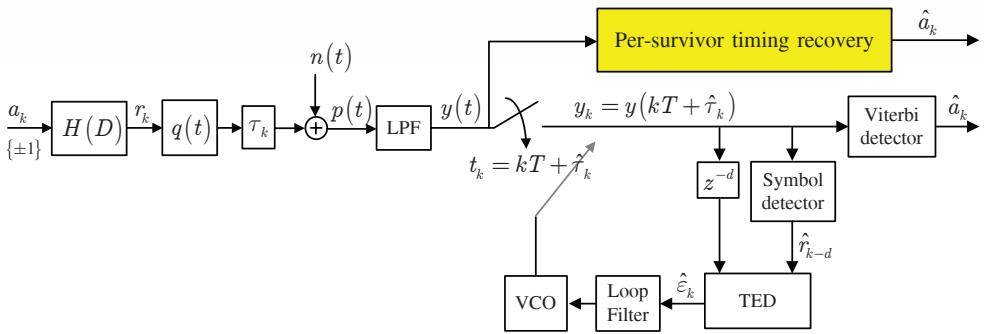
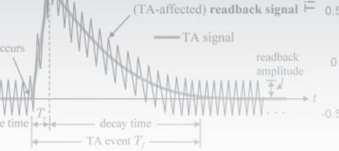

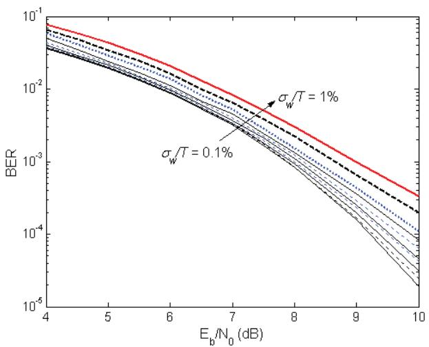
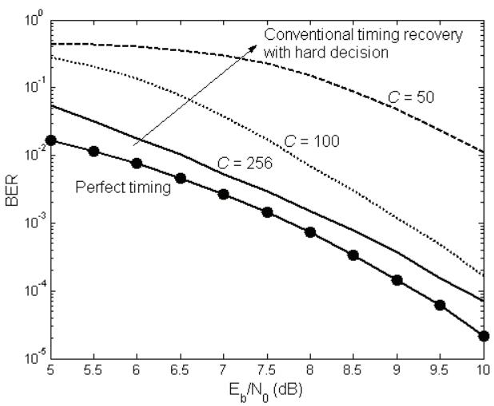
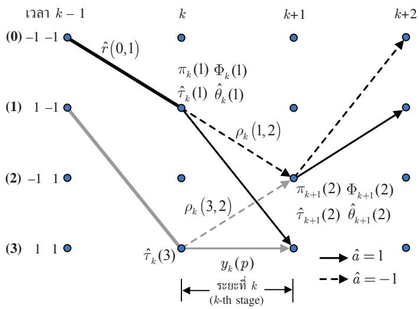
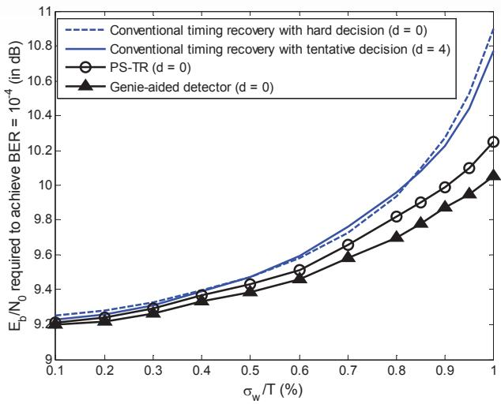
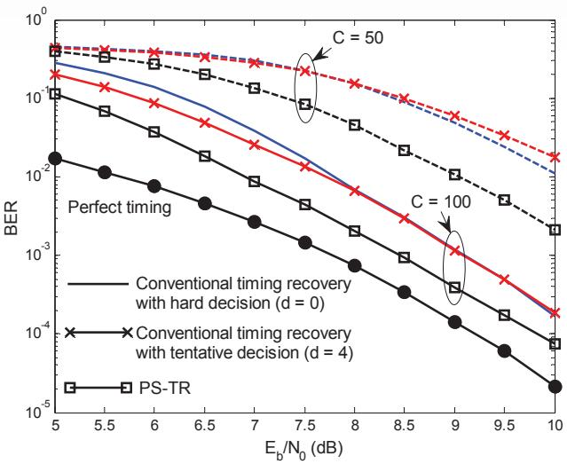
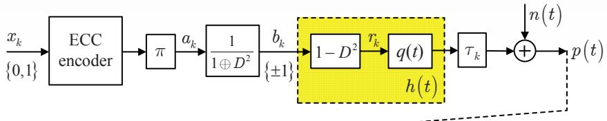
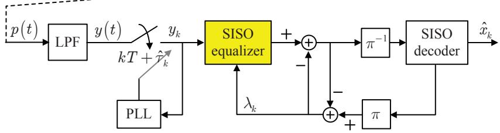
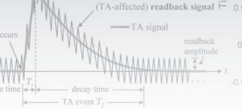
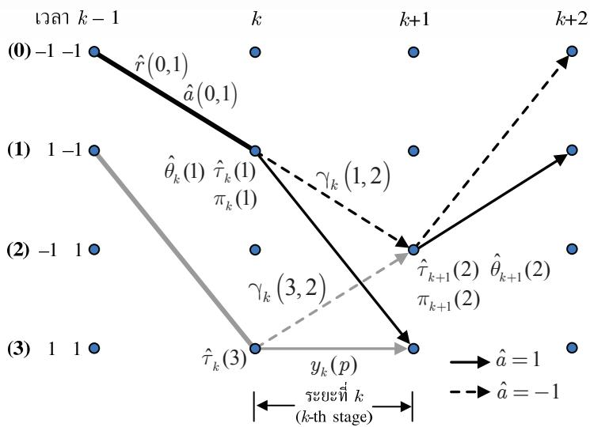
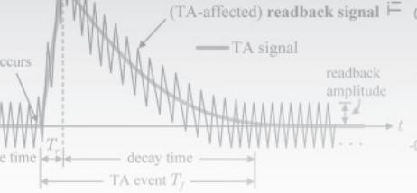
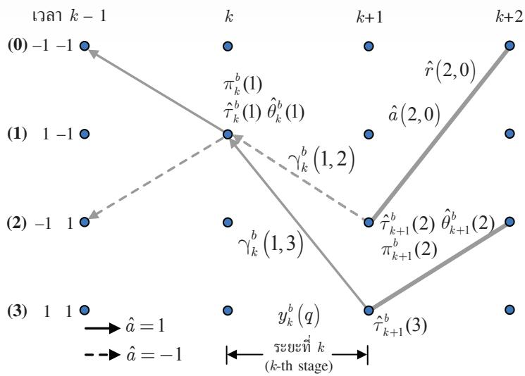

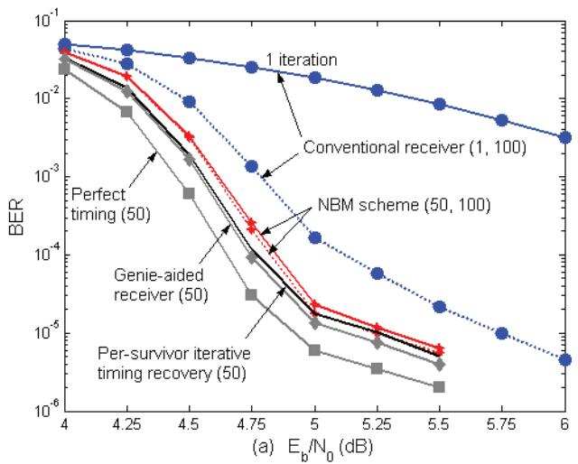
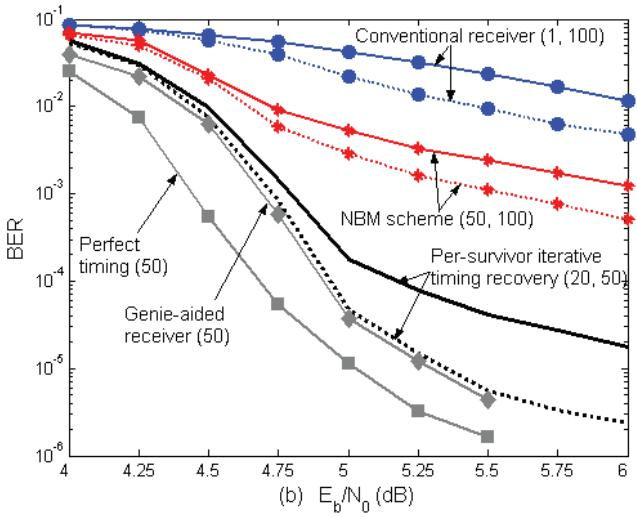
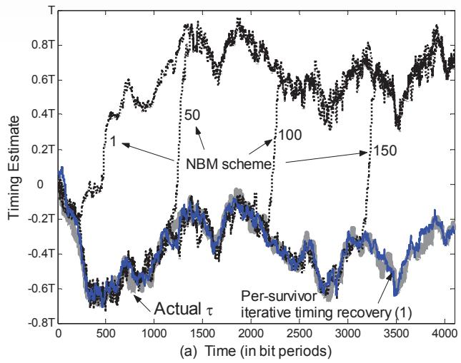
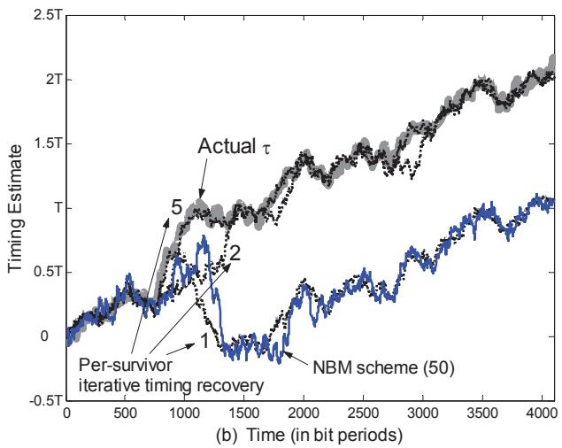
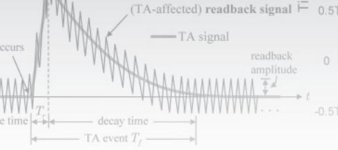
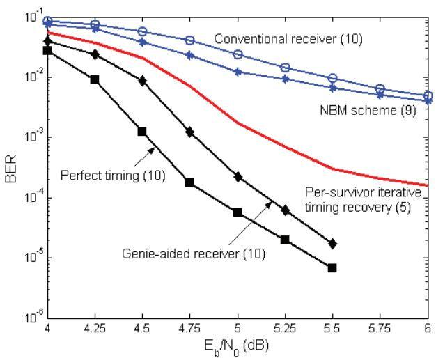
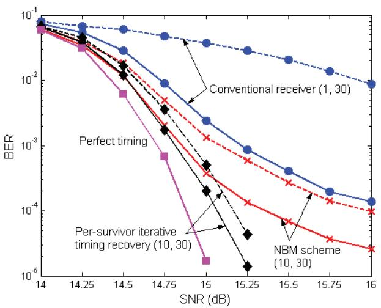
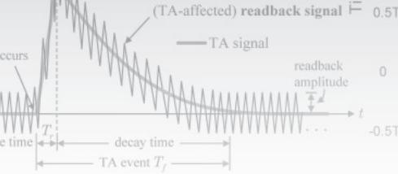
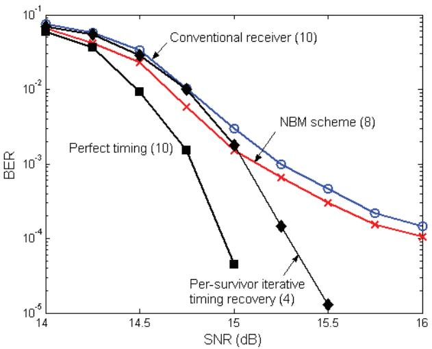

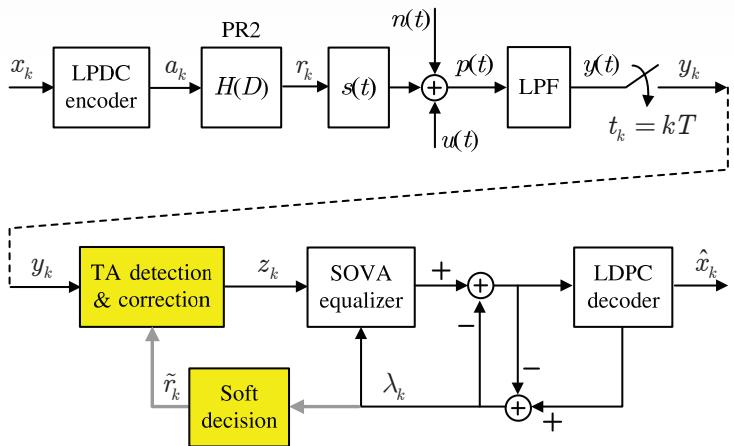
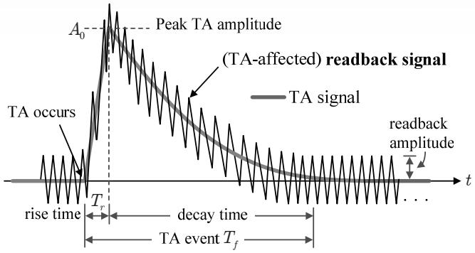

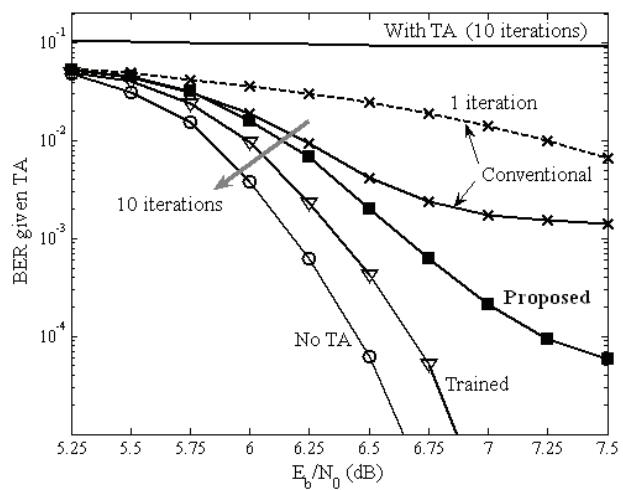
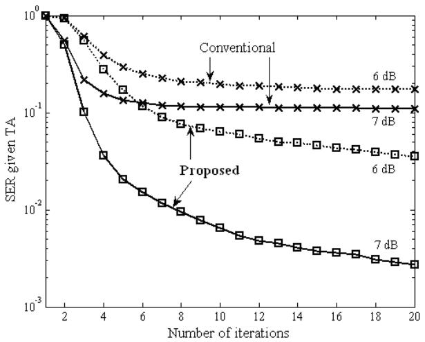
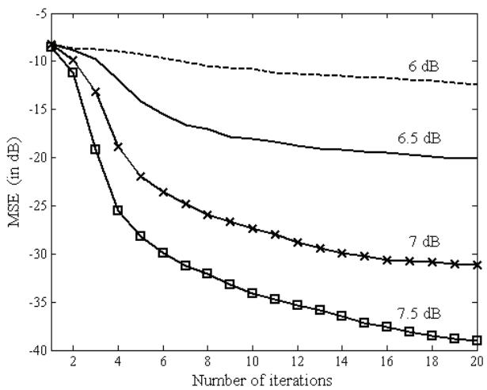
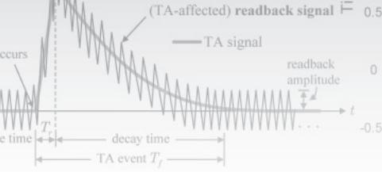
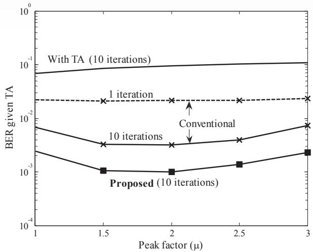
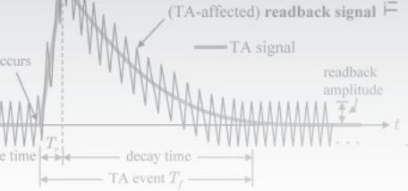
