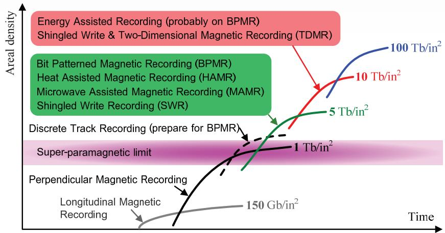
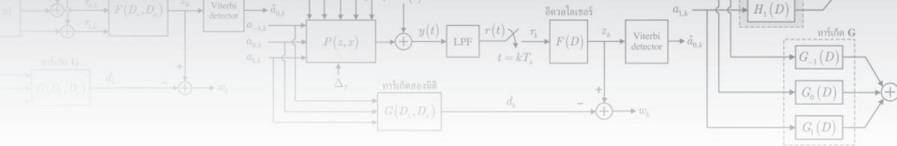

# 第6章 BPMR技术

如今，互联网和数字通信的快速增长导致对数据存储空间的需求不断增加。目前的硬盘驱动器使用涂有磁性材料薄膜的介质，该介质由纳米级的微小磁晶粒组成。每个晶粒的磁化方向不同。数据记录利用写磁头的磁场使多个晶粒的磁化方向变为所需方向（平行或垂直于介质平面）。一般来说，通过减小晶粒尺寸来增加面密度或数据容量。然而，通过减小晶粒尺寸来增加面密度变得越来越困难，因为过小的晶粒在数据存储方面不稳定——外部热能会轻易改变晶粒的磁化方向（使数据位"0"变为"1"，或相反），这种现象称为"超顺磁极限"[1, 43]或面密度极限。

因此，能够存储比当前记录技术（即垂直记录）更多数据的新技术在未来变得至关重要，例如HAMR（热辅助磁记录）[78]、BPMR（比特图案磁记录）[79]和TDMR（二维磁记录）[80]等技术，这些技术可以存储超过1 Tb/in²的数据。

## 6.1 引言

在磁记录系统中，系统性能以误比特率（BER）表示，取决于信号功率与噪声功率之比（SNR）。在实际应用中，读回信号中的SNR与每比特单元的晶粒数量相关。一般来说，转换噪声被认为是垂直记录系统中最主要的噪声[79]。转换噪声的严重程度取决于每个比特单元边界处的锯齿形变化——当每个晶粒较大时锯齿形变化严重（晶粒较小时不太严重），如图6.1所示。因此，如果使用的介质含有大量大晶粒，系统将面临严重的转换噪声问题。因此，由小晶粒构建的介质非常必要，每个比特单元应包含足够多的小晶粒，以使系统达到所需的SNR。

通常，增加硬盘驱动器数据容量的方法是减小数据位的尺寸，同时保持SNR水平不变。换句话说，就是减小晶粒尺寸，但保持每比特单元的晶粒数量不变。然而，晶粒尺寸不应过小，因为外部热能会改变晶粒的磁化方向（导致数据存储不稳定），即产生超顺磁问题[1, 43]，这是限制当前磁记录技术无法超过1 Tb/in²面密度的极限。在实际应用中，超顺磁问题可以通过使用具有以下比率的介质来防止[1, 43]：

$$
\frac{K_u V}{k_B T} \ge \beta\tag{6.1}
$$

其中 $K_u$ 是材料的单轴各向异性系数，$V$ 是存储一位数据所用的晶粒体积，$k_B$ 是玻尔兹曼常数（$1.38 \times 10^{-23}$ J/K），$T$ 是绝对温度（单位：开尔文），$\beta$ 是一个大的正整数（例如 $\beta=60$）。由于 $k_B T$ 是常数，为了补偿晶粒体积的减小，介质必须使用更高 $K_u$ 的磁性材料，其结果是写磁头需要使用非常强的磁场才能将数据位稳定地写入介质存储。这个问题可以通过HAMR技术解决[78]（详见第8章）。然而，目前使用的介质（涂有磁性材料薄膜）正接近其在不久的将来的存储极限。

BPMR技术被认为是可以实现超过1 Tb/in²面密度且没有超顺磁极限问题的技术[79]。BPMR技术使用图案化介质，即由具有单磁畴的纳米磁岛组成的规律排列介质，这些磁岛间隔均匀地排列在非磁性材料制成的基底上。岛的磁化方向可以平行或垂直于基底。图6.2显示了BPMR技术中介质的数据存储示例。

由于被非磁性材料包围的孤立纳米磁岛充当"单畴"或单晶粒岛，因此BPMR技术不需要每比特数据使用大量小晶粒。也就是说，一个岛可能只由一个晶粒构成。此外，使用单畴磁岛还可以处理超顺磁极限问题，并有助于减少转换噪声问题[81]。

在BPMR技术中，所有岛的位置在介质图案化（或制造）阶段就已确定，因此在实际应用中具有许多优点，如减少转换噪声问题、消除非线性位偏移、简化数据恢复过程以及简化伺服系统中使用的跟踪过程[81, 82]等。

## 6.2 BPMR技术的发展

本节将介绍BPMR技术从早期到目前的发展历程，使读者了解有助于BPMR技术在不久的将来实际应用的各种有趣研究方向。

### 6.2.1 记录介质

早期BPMR技术的研究侧重于图案化介质的开发或制造。图案化介质的概念始于1963年[83]，提出使用"图案化磁道"来减少噪声和伺服系统跟踪过程中的问题。随后在1987年研究了"窄磁道"[84]的特性，并于1991年在纳米级图案化介质上进行了数据记录实验[85]。

自1991年以来，图案化介质的研究侧重于介质的制造和特性研究。已开发出各种技术来制造能够存储大量数据的介质，如纳米光刻、自组装、电子束光刻和纳米压印光刻等。对图案化介质制造感兴趣的读者可参见[86-89]了解更多详情。

### 6.2.2 BPMR磁记录系统

一般来说，BPMR磁记录系统分为两大类：旋转盘式BPMR系统和基于探头的BPMR系统[90]，分别如图6.3和图6.4所示。

图6.3显示了使用MR磁头与图案化介质结合的旋转盘式BPMR系统，其工作特性类似于目前使用的垂直记录系统。因此，垂直记录系统中使用的各种技术可以应用于这种旋转盘式BPMR系统。然而，BPMR系统中磁头位置与待写入或读取数据的岛位置之间的同步过程与垂直记录系统中使用的同步过程有显著不同[91]。[91, 92]中的研究调查了BPMR系统中的数据写入过程，表明写入场必须与待写入数据位的岛位置同步。也就是说，当写磁头移动到岛的中心位置时，写入场必须在规定的时间内立即施加到岛上[16, 93, 94]。因此，BPMR系统使用的同步过程比垂直记录系统需要更高的精度。另一种可行的写入同步方法是"边读边写"[90]，否则可能导致写入误差问题[91, 95]，使待写入岛的数据位出现替代、删除和插入问题。此外，[96]中的研究了伺服系统中使用的数据模式，发现使用图案化介质有助于在BPMR系统中使用更复杂的伺服数据模式，从而显著降低位置误差信号（PES）的方差。

另一种BPMR磁记录系统是基于探头的BPMR系统，如图6.4所示。多个磁头安装在可移动平面上，该平面位于介质上方。写入数据通过将磁场施加到目标岛的位置来实现，且所施加的磁场不得干扰其他岛的位置。同样，数据读取使用类似于磁力显微镜（MFM）[97]的方法，磁头仅检测岛的磁化方向是向上还是向下。此外，基于探头的BPMR系统中的数据读取还可以通过直接测量岛的磁场来实现，如使用微型MR读磁头或光学探针等。

BPMR系统只有在具有足够SNR时才能正常工作。尽管使用单畴磁岛有助于减少转换噪声和非线性位移的影响[81, 82]，但介质制造中的不完善会导致新型介质噪声[98, 99]，从而显著降低BPMR系统的性能[100]。研究发现，这种介质噪声源于磁岛尺寸和位置的波动[99-103]。

### 6.2.3 BPMR系统中的信号处理

在BPMR系统信号处理发展的早期阶段，研究人员侧重于旋转盘式BPMR系统，其工作特性类似于传统磁记录系统（即纵向和垂直模式）。因此，BPMR系统的读通道可以简化为图6.5所示的框图[10]，包括信道、部分响应均衡器和维特比检测器[13]。

BPMR系统读通道的研究始于1998年[102]，使用部分响应最大似然（PRML）信道来测量使用纵向磁化岛的BPMR系统的性能。随后，[81, 100, 101]研究了使用图案化介质进行纵向磁化岛读过程的BPMR系统。[100, 101]还研究了使用垂直磁化岛介质的BPMR系统的读通道，其中读回信号基于互易积分的二维概念进行建模。

为使读回信号模型更准确，[104]提出了基于三维互易积分概念来估计BPMR系统的脉冲响应，并研究了岛几何形状对此脉冲响应的影响，发现BPMR系统的脉冲响应在很大程度上取决于岛的尺寸和形状。[105, 106]进一步研究了岛几何形状对读通道误比特率（BER）性能的影响。这些研究使用三维互易积分来估计BPMR系统的脉冲响应，且从磁头获得的读回信号是主磁道和相邻磁道的脉冲响应的线性叠加。也就是说，从磁头获得的读回信号受到相邻磁道的影响，即所谓的"磁道间干扰（ITI）"。实验表明，磁道间干扰严重降低了BPMR系统的性能。然而，可以通过使用二维均衡器[107]和二维维特比检测器[108, 109]进行数据检测来减轻磁道间干扰的影响（详见第7章）。

此外，读磁头偏移或磁道误配准（TMR）以及介质中磁岛的不确定性也会降低BPMR系统的性能[110]。一般来说，使用六边形网格排列磁岛的BPMR系统比使用矩形网格排列磁岛的BPMR系统性能更好，因为在相同磁道间距下，六边形网格使相邻磁道的岛之间距离更大，从而减少了磁道间干扰。图6.6显示了矩形网格和六边形网格磁岛排列方式。

BPMR系统中的介质噪声与传统磁记录系统不同。BPMR系统不存在转换噪声或非线性位移问题，因为数据位存储在单畴磁岛组中，且磁岛组的位置是固定的。然而，BPMR系统中的介质噪声源于制造不完善，导致每个岛的位置、尺寸、高度和形状的波动。这种介质噪声被认为是BPMR系统中的主要噪声，将严重降低系统性能[102, 110, 111]。

上述各项研究基于磁头（读磁头和写磁头）尺寸与BPMR系统中磁岛尺寸相匹配的假设。然而，目前使用的磁头尺寸远大于磁岛尺寸[36]。[112]的研究提出了在图6.7所示的早期BPMR系统中使用比磁岛大的磁头。该研究还提出了"多岛单读磁头"的读通道模型，其中读回信号是三个相邻磁道（上磁道、主磁道和下磁道）的数据位磁化状态的函数。即上磁道和下磁道是磁道间干扰的来源。然而，接收端仅负责解码主磁道的数据（无法解码上磁道和下磁道的数据，因为三个磁道产生的多种数据模式可能导致相同的读回信号[108]，从而难以正确解码三个磁道的数据）。

## 6.3 BPMR系统的脉冲响应

目前使用的垂直记录系统中，磁道间距远大于比特周期，因此不存在磁道间干扰（ITI）问题。然而，如果BPMR系统要达到大于或等于1 Tb/in²的面密度，每个磁岛的间距必须不超过25纳米。因此，BPMR系统的磁道间距必须与比特周期相近，从而面临码间干扰（ISI）和ITI问题，统称为"二维干扰"。

此外，BPMR系统中介质噪声的产生与垂直记录系统不同[113]。也就是说，BPMR系统中的介质噪声源自磁岛尺寸和位置在两个方向上的波动——沿磁道方向和跨磁道方向，导致"沿磁道脉冲"和"跨磁道轮廓"发生变化。在实际应用中，二维干扰和介质噪声将严重影响BPMR系统的误比特率性能[110, 114]。

本节将阐述BPMR信道二维脉冲响应的构建，用于模拟BPMR系统中真实的二维干扰和介质噪声。此二维脉冲响应的构建基于MR磁头电势的三维互易积分计算[108]，并研究磁头和磁岛几何形状对此二维脉冲响应的影响。

### 6.3.1 二维脉冲响应仿真

本节的二维脉冲响应仿真仅基于垂直磁化介质和MR磁头的假设。

对于MR磁头，读回电压与ABS（气浮面）表面处MR元件中的信号磁通成正比，可表示为：

$$
V_{MR}(x, z) = C \phi(x, z)\tag{6.2}
$$

其中C是常数，$V_{MR}$是读回电压，$\phi$是信号磁通，x是沿磁道方向，z是跨磁道方向。图6.8显示了MR磁头和方形磁岛的几何形状，其中a是岛的边长，$\delta$是岛的高度，d是磁头的飞行高度，g是屏蔽层与MR元件之间的间隙宽度，W是MR元件的宽度，t是MR元件的厚度。

根据互易原理，ABS表面处MR元件中的信号磁通可表示为[108]：

$$
\phi(x, z) = \mu_0 \int_{-\infty}^{\infty} \int_{-\infty}^{+\delta} \frac{H_y(x', y', z')}{i} M_y(x'-x, y', z'-z) dx' dy' dz'\tag{6.3}
$$

其中$\mu_0$是自由空间的磁导率，i是虚拟线圈中的电流，$H_y$是由虚拟线圈产生的磁头场，$M_y(x,y,z)$是介质的磁化强度，y是垂直于介质的方向（如图6.8所示）。由于磁场是磁势的梯度，对于垂直磁化，互易积分可以用磁势$\Psi(x,y,z)$表示为：

$$
\phi(x, z) = \frac{\mu_0}{i} \int_{-\infty}^{\infty} \int_{-\infty}^{+\infty} \int_{-\infty}^{\infty} \frac{\partial \Psi(x', y', z')}{\partial y'} M_y(x'-x, y', z'-z) dx' dy' dz'\tag{6.4}
$$

或

$$
\phi(x, z) = \frac{\mu_0}{i} \iiint \Psi(x', y', z') \left[ \frac{\partial M_y(x'-x, y', z'-z)}{\partial y'} \right] dx' dy' dz'\tag{6.5}
$$

互易原理表明，信号磁通可以表示为MR磁头磁势与介质磁荷的卷积[43]。

[43, 114, 115]的研究表明，磁头上方任意坐标$(x,y,z)$处的磁势为：

$$
\Psi(x, y, z) = \frac{y}{2\pi} \int_{-\infty}^{\infty} \int_{-\infty}^{\infty} \frac{\Psi_s(x', y')}{[(x-x')^2 + y^2 + (z-z')^2]^{3/2}} dx' dy'\tag{6.6}
$$

其中$\Psi_s$是磁头的表面磁势（SMP）。MR元件宽度一半处的表面磁势可通过下式求得[115]：

$$
\Psi_s^\mathrm{half} = 1 - \left(\frac{1}{\pi}\right) \arctan\left(\frac{\sqrt{2}\sqrt{K - 1 + \exp(2\pi z/\tilde{g})} \cos(2\pi x/\tilde{g})}{1 - K}\right)\tag{6.7}
$$

其中：

$$
K = \sqrt{1 - 2\exp(2\pi z/\tilde{g})\cos(2\pi x/\tilde{g}) + \exp(4\pi z/\tilde{g})}
$$

$\tilde{g}$是两个屏蔽层之间的间距，这里$\tilde{g} \approx 2g$（见图6.8）。图6.9显示了t=4 nm、W=20 nm、g=10 nm的MR磁头的SMP，图6.10显示了SMP的等高线图。

磁势$\Psi_s$的求解方法：首先在$-\tilde{g}/2 \le x \le \tilde{g}/2$和$-W/2 \le z \le W/2$范围内计算方程(6.7)得到$\Psi_s^\mathrm{half}$，只计算一半区域。假设对称性，另一半是$\Psi_s^\mathrm{half}$的镜像，将两部分拼接得到$\Psi_s$，结果是一个中间行元素大部分为1的矩阵（表示磁头表面磁势始终为1）。然后复制中间行的数据，在原始中间行周围插入多行，数量与MR元件的厚度对应。

方程(6.6)中的磁势可以通过$\Psi_s$利用数值积分求得。此外，在垂直记录介质的软磁底层（SUL）仿真中，假设SUL层是完美的，厚度无限。如果磁头具有完美镜像，则总灵敏度函数由磁头灵敏度函数和相对于SUL层边界的磁头镜像灵敏度函数组成[116]。因此，ABS表面处MR元件中的总磁通可表示为：

$$
\phi(x, z) = \frac{\mu_0}{i} \int_{-\infty}^{\infty} \int_{d}^{+\delta} \Psi_{\mathrm{total}}(x', y', z') \times \left[ \frac{\partial M_y(x'-x, y', z'-z)}{\partial y'} \right] dx' dy' dz'\tag{6.8}
$$

其中$\Psi_{\mathrm{total}} = \Psi(x', y', z') + \Psi_{\mathrm{image}}(x', y', z')$。假设SUL层与介质之间无间隙，则$\Psi_{\mathrm{image}}(x', y', z') = -\Psi(x', y=d+2\delta, z')$，如图6.11所示。进一步假设垂直磁化$M_y$沿岛厚度方向是均匀的（如图6.12所示，即$M_y$对$y$的导数是两个脉冲函数）。因此，由中心位于坐标(0,0)的磁头读出的、由中心位于(x,z)的岛产生的脉冲响应或读回电压可表示为：

$$
V(x, z) = C \int_{-\infty}^{\infty} \{M(x'-x, y', z'-z)[\Psi(x', y'=d, z') - \Psi(x', y'=d+2\delta, z')]\} dx'\tag{6.9}
$$

其中：

$$
M(x, z) = \left\{ \begin{array}{ll} M \ (\mathrm{media \ magnetization}), & x, z \in \mathrm{island} \\ 0, & \mathrm{else} \end{array} \right.\tag{6.10}
$$

方程(6.10)表明垂直磁化$M_y$仅在岛区域内为常数M（其他区域为零）。因此，方程(6.9)可重新整理为：

$$
V(x, z) = \tilde{C} \int_{x-a/2}^{x+a/2} \int_{z-a/2}^{z+a/2} \{\Psi(x', d, z') - \Psi(x', d+2\delta, z')\} dx' dz'\tag{6.11}
$$

其中$\tilde{C} = CM$是常数。方程(6.11)可以方便地为任何磁头和磁岛几何形状构建二维脉冲响应。图6.13显示了岛边长a=11 nm、高度δ=10 nm、飞行高度d=10 nm、使用图6.9中参数的MR磁头时的二维脉冲响应，图6.14显示了该二维脉冲响应的等高线图。

二维脉冲响应在沿磁道方向（z=0）的截面称为"沿磁道脉冲响应"，在跨磁道方向（x=0）的截面称为"跨磁道轮廓"。图6.15显示了图6.13中二维脉冲响应的沿磁道脉冲响应（实线）和跨磁道轮廓（虚线）。可以看出，跨磁道轮廓比沿磁道脉冲响应更宽，这意味着BPMR系统面临的磁道间干扰（ITI）比码间干扰（ISI）更严重。设$PW_{50}$为脉冲幅度一半处的脉冲宽度，则图6.15表明沿磁道方向的$PW_{50}$为22.1纳米，跨磁道方向的$PW_{50}$为30纳米。

### 6.3.2 磁岛和磁头几何形状的影响

如前所述，BPMR系统中的二维脉冲响应取决于磁岛的特征（如岛的形状和尺寸）和磁头几何形状（如宽度W和间隙g）。因此，本节将研究磁岛特征和磁头几何形状对二维脉冲响应的影响，仅考虑方形岛和MR磁头。这项研究有助于读者理解BPMR数据记录系统中使用的各种参数选择。

图6.16显示了沿磁道脉冲（主磁道）的归一化幅度作为岛长度的函数（相对于岛长度为13 nm时的脉冲幅度）。图6.17显示了作为岛长度函数的沿磁道和跨磁道方向的$PW_{50}$（单位：纳米）。图6.16和6.17中使用的二维脉冲响应来自方形岛，岛高δ=10 nm，飞行高度d=10 nm，使用厚度t=4 nm、宽度W=20 nm、间隙g=10 nm的MR磁头。

从图6.16可以看出，二维脉冲响应的幅度随着岛长度的增加而增大，这意味着使用较大磁岛的BPMR系统会使读回信号功率更高（有助于数据解码）。然而，图6.17表明，当岛变大时，沿磁道和跨磁道方向的$PW_{50}$都增大，这意味着系统面临更严重的码间干扰和磁道间干扰问题。因此，系统设计者必须在所需的读回信号功率与可接受的ISI和ITI严重程度之间进行权衡。例如，如果BPMR系统需要达到1 Tb/in²的面密度，则比特周期和磁道间距应小于25 nm[108]，并选择11 nm或13 nm的岛长度，以保持足够的岛间距（减少ISI和ITI），同时获得足够的读回信号功率用于数据解码。

图6.18显示了作为MR元件宽度（参数W）函数的沿磁道和跨磁道方向的$PW_{50}$。图6.19显示了作为MR元件宽度函数的沿磁道脉冲的归一化幅度（相对于MR元件宽度为20 nm时的脉冲幅度）。图6.18和6.19中使用的二维脉冲响应来自方形岛，岛长度a=13 nm、岛高δ=10 nm、飞行高度d=10 nm，使用厚度t=4 nm、间隙g=10 nm的MR磁头。

图6.18表明，当MR元件宽度增加时，沿磁道方向的$PW_{50}$变化缓慢，而跨磁道方向的$PW_{50}$变化迅速，这意味着MR元件宽度对ITI的严重程度影响大于对ISI的影响。此外，图6.19表明，当MR元件宽度增大时，二维脉冲响应幅度缓慢增加并逐渐趋于常数。因此，如果希望系统具有较少的ITI，应使用较小的MR磁头宽度W。然而，制造窄宽度磁头仍具挑战性（难以制造且成本高）。因此，早期BPMR系统使用约15-20 nm的MR元件宽度[108]。

类似地，图6.20显示了作为屏蔽层与MR元件之间间隙宽度（参数g）函数的沿磁道和跨磁道方向的$PW_{50}$。图6.21显示了作为屏蔽层与MR元件之间间隙宽度函数的沿磁道脉冲的归一化幅度（相对于g=10 nm时的脉冲幅度）。图6.20和6.21中使用的二维脉冲响应来自方形岛，岛长度a=13 nm、岛高δ=10 nm、飞行高度d=10 nm，使用厚度t=4 nm、宽度W=20 nm的MR磁头。

当g增大时，沿磁道和跨磁道方向的$PW_{50}$都增大，这意味着可以通过改变屏蔽层与MR元件之间的间隙宽度来控制ITI和ISI水平。此外，图6.21表明，当屏蔽层与MR元件之间的间隙宽度增大时，二维脉冲响应幅度增大（但不如$PW_{50}$变化快）。然而，在实际应用中，BPMR系统使用的MR读磁头的屏蔽层与MR元件之间的间隙宽度约为6-10 nm[108]。

## 6.4 BPMR系统中的读回信号模型

一般来说，磁记录系统中的读回信号来自沿磁道脉冲响应的线性叠加。然而，对于高容量BPMR系统，岛之间的间距非常小，因此相邻磁道的影响是不可避免的。从图6.14和6.15可以看出，跨磁道轮廓比沿磁道脉冲响应更宽。因此，包含相邻磁道影响的BPMR系统读回信号来自二维脉冲响应（相对于二维二进制输入数据）的线性叠加。

由于BPMR系统中岛（或数据位）的位置已确定，读回信号可以用数据位的位置表示（而非时间索引）。考虑图6.6(a)中的方形磁岛，连续时间读回信号可表示为：

$$
s(x) = \sum_{m=-M}^{M} \sum_{n=-N}^{N} a_{m,n} P(-mT_z, x - nT_x)\tag{6.12}
$$

其中$P(z,x)$是二维脉冲响应（见图6.13），x是沿磁道方向的距离，z是跨磁道方向的距离，$T_x$是沿磁道方向的比特周期，$T_z$是磁道间距，$(2M+1)T_z$是跨磁道方向的信道宽度，$(2N+1)T_x$是沿磁道方向的信道长度，$a_{m,n}$是二维二进制数据。在方程(6.12)中，m=0对应于磁头中心位于磁道中心时的主磁道。

图6.22显示了BPMR系统中的比特周期$T_x$和磁道间距$T_z$。当$T_x$和$T_z$较小时，系统数据容量更大，但ISI和ITI也相应地更严重。一般来说，BPMR系统的面密度由下式计算[107]：

$$
\mathrm{Areal\ density} = \frac{1}{T_x T_z} \times 10^6 \ \mathrm{(Tb/in^2)}\tag{6.13}
$$

单位为Tb/in²，其中$T_x$和$T_z$以纳米为单位。例如，设$T_x = T_z$，面密度为1 Tb/in²的BPMR系统有$T_x = T_z \approx 25.4$ nm，5 Tb/in²有$T_x = T_z \approx 11.4$ nm，10 Tb/in²有$T_x = T_z \approx 8$ nm。

### 6.4.1 BPMR脉冲近似

由于高分辨率的二维脉冲响应$P(z,x)$（简称BPMR脉冲）的构建相当困难，为便于BPMR系统分析，[108]中的研究将BPMR脉冲近似为二维高斯脉冲：

$$
P(z, x) = A \exp\left\{-\frac{1}{2}\left(\frac{x^2}{W_x^2} + \frac{z^2}{W_z^2}\right)\right\}\tag{6.14}
$$

其中A是最大幅度（等于1），$W_x = PW_{50}^\mathrm{along} / 2.3548$，$W_z = PW_{50}^\mathrm{cross} / 2.3548$，$PW_{50}^\mathrm{along}$是沿磁道脉冲的$PW_{50}$值，$PW_{50}^\mathrm{cross}$是跨磁道轮廓的$PW_{50}$值，2.3548是$PW_{50}$与高斯函数标准差之间的常数关系[108]。

图6.23显示了$PW_{50}^\mathrm{along} = 22.1$ nm和$PW_{50}^\mathrm{cross} = 30$ nm的二维高斯脉冲响应，其形状与图6.13中的BPMR脉冲相似（$PW_{50}^\mathrm{along} = 22.1$ nm，$PW_{50}^\mathrm{cross} = 30$ nm）。图6.24比较了图6.13中BPMR脉冲和图6.14中二维高斯脉冲的沿磁道脉冲和跨磁道轮廓（虚线）。从图6.24可以看出，BPMR脉冲与二维高斯脉冲的沿磁道脉冲和跨磁道轮廓非常接近。因此，可以得出结论：方程(6.14)中的二维高斯脉冲可用于近似图6.13中的BPMR脉冲，以方便BPMR系统的分析。

### 6.4.2 含介质噪声的BPMR脉冲近似

如前所述，BPMR信道可以减少转换噪声和非线性位移问题。然而，介质噪声在BPMR信道中是不可避免的，它会严重降低系统整体性能。介质噪声的来源主要有五个[108]：

1) 每个岛的位置波动——由于每个岛的间距小于25纳米，很难使所有岛之间的间距完全均匀。
2) 每个岛的尺寸波动。
3) 每个岛的高度波动。
4) 每个岛的形状波动。
5) 饱和磁化强度波动——由于每个岛尺寸不确定，每个岛的磁化饱和程度不同。

然而，BPMR系统中最常见的介质噪声[108]源于每个岛的位置和尺寸波动，如图6.25所示。因此，包含由岛的位置和尺寸波动引起的介质噪声的BPMR脉冲近似可表示为[108]：

$$
P(z, x) = (A + \Delta_A) \exp\left\{-\frac{1}{2}\left[\left(\frac{x + \Delta_x}{c(W_x + \Delta_{W_x})}\right)^2 + \left(\frac{z + \Delta_z}{c(W_z + \Delta_{W_z})}\right)^2\right]\right\}\tag{6.15}
$$

其中$\Delta_A$是幅度波动，$\Delta_x$是沿磁道方向的位置波动，$\Delta_z$是跨磁道方向的位置波动，$\Delta_{W_x}$是沿磁道$PW_{50}$的波动，$\Delta_{W_z}$是跨磁道$PW_{50}$的波动。图6.26显示了面对不同严重程度介质噪声的BPMR系统性能示例。介质噪声x%表示岛的位置和尺寸（即$\Delta_A$、$\Delta_x$、$\Delta_z$、$\Delta_{W_x}$和$\Delta_{W_z}$）相对于正常值随机变化x%。从图中可以看出，当介质噪声变得更加严重时，系统性能显著下降。因此，好的接收端必须能够处理介质噪声问题。

### 6.4.3 等效离散时间BPMR信道模型

当读回信号$s(x)$在岛间距的时间点进行采样时，得到离散时间读回信号：

$$
r_k = s(x)|_{x=kT_x} = \sum_{m=-M}^{M} \sum_{n=-N}^{N} a_{m,n} H(-m, k-n) + n_k\tag{6.16}
$$

其中$n_k$是加性高斯白噪声（AWGN），$H(m,n)$是通过在比特周期和磁道间距的整数倍处采样脉冲响应$P(z,x)$得到的离散时间二维信道：

$$
H(m,n) = P(mT_z, nT_x)\tag{6.17}
$$

对于$-M \le m < M$和$-N \le n < N$。图6.27显示了等效离散时间BPMR信道的框图，其中$a_{0,k}$对应于将被读取和由接收端解码的主磁道输入数据序列。此外，方程(6.16)中读回信号$r_k$的计算需要二维卷积，相当复杂[118]。

由于方程(6.17)中的信道$H(m,n)$可以用矩阵形式表示[108, 109]，对于高容量（大于1 Tb/in²）的BPMR系统，其他比特和磁道的影响非常小（可以忽略），因此只考虑3个比特周期和3个磁道。此外，为便于系统仿真和BPMR系统离散时间读回信号的生成，Karakulak等人[112]提出了图6.28所示的离散时间BPMR信道模型，其中BPMR信道由矩阵H表示：

$$
\mathbf{H} = \left[ \begin{array}{c} H_{-1}(D) \\ H_0(D) \\ H_1(D) \end{array} \right] = \left[ \begin{array}{c} h_{-1,-1}D^{-1} + h_{-1,0} + h_{-1,1}D \\ h_{0,-1}D^{-1} + h_{0,0} + h_{0,1}D \\ h_{1,-1}D^{-1} + h_{1,0} + h_{1,1}D \end{array} \right] = \left[ \begin{array}{lll} h_{-1,-1} & h_{-1,0} & h_{-1,1} \\ h_{0,-1} & h_{0,0} & h_{0,1} \\ h_{1,-1} & h_{1,0} & h_{1,1} \end{array} \right]\tag{6.18}
$$

读回信号$r_k$可以用一维卷积形式表示：

$$
r_k = (a_{0,k} * h_{0,k}) + (a_{-1,k} * h_{-1,k}) + (a_{1,k} * h_{1,k}) + n_k\tag{6.19}
$$

其中$*$是卷积算子。然后读回信号$r_k$被送入PRML检测器[10, 27]以估计主磁道的数据序列$(\hat{a}_{0,k})$。

PRML检测器是均衡器和维特比检测器的组合[10, 13]。均衡器将信号整形为目标响应，维特比检测器利用定义的目标构建维特比检测器来解码数据。因此，用于纵向和垂直磁记录系统数据解码的PRML检测器[10]仍然可以有效用于BPMR系统的数据解码[108, 109]。

### 6.4.4 磁道误配准

图6.7显示了MR读磁头在介质上的最佳位置，即磁头的中心应位于主磁道的中央，并沿磁道方向平行移动，以使读回信号质量最佳。然而，在实际应用中，磁头可能偏离其应处的位置。如果磁头中心沿跨磁道方向向上（或向下）移动，如图6.29所示，则称此现象为"磁道误配准"（TMR）或读磁头偏移，定义为[119]：

$$
\mathrm{TMR} = \frac{\Delta_T}{T_z} \times 100\ \%\tag{6.20}
$$

其中$\Delta_T$是磁头在主磁道上的跨磁道偏移距离，$T_z$是磁道间距。因此，受TMR影响的离散时间BPMR脉冲为：

$$
H(m, n) = P(mT_z + \Delta_T, nT_x)\tag{6.21}
$$

在实际应用中，TMR对BPMR系统的性能影响相当大，因为它使读回信号失真。图6.30显示了受TMR影响的沿磁道脉冲和跨磁道脉冲，使用方程(6.14)中$PW_{50}^\mathrm{along}=22.1$ nm和$PW_{50}^\mathrm{cross}=30$ nm，并假设$T_x = T_z = 22$ nm。从图中可以看出，当系统中存在TMR时，沿磁道脉冲和跨磁道脉冲的幅度发生变化，使接收端难以解码数据。图6.31显示了面对不同严重程度TMR的BPMR系统性能示例。从图中可以看出，随着TMR变得更加严重，系统性能下降。因此，BPMR系统应具有TMR问题的预防和纠正措施，以使BPMR系统性能最优。

## 6.5 本章总结

BPMR技术是一种能够实现超过1 Tb/in²面密度的新兴磁记录技术，同时不存在超顺磁极限问题。BPMR技术使用图案化介质，其中数据存储在单畴纳米磁岛中。通过减小岛的尺寸和间距，可以增加数据容量，但会引发二维干扰（ISI和ITI）以及介质噪声问题。此外，TMR也是影响BPMR系统性能的重要因素。因此，BPMR系统的接收端设计需要综合考虑这些问题。

本章介绍了BPMR技术的基本原理、发展历程、二维脉冲响应的建模以及读回信号模型的构建，为后续章节中二维均衡和检测技术的研究奠定基础。

目前，常用于当前硬盘驱动器的垂直磁记录技术正逐渐接近超顺磁极限，如图6.32所示。因此，能够实现超过1 Tb/in²面密度的其他技术变得非常必要，包括BPMR技术、HAMR技术、MAMR（微波辅助磁记录）技术、SMR（叠瓦式记录）技术和TDMR技术，每种技术在实际应用中都有各自的设计挑战[117]：

1) BPMR技术仍存在纳米级介质平坦化、新型读信道设计和写入同步等问题。
2) HAMR技术仍存在带有激光器的写磁头设计（用于加热介质）、介质快速冷却过程以及激光安装位置对写入影响等问题。
3) MAMR技术仍存在微波信号发生器问题。

  
图6.32 硬盘驱动器数据容量趋势[117]

4) SMR技术与TDMR技术结合使用，仍存在读信道中高级二维信号处理的问题。

然而，本章重点介绍了BPMR技术，它被认为是帮助硬盘驱动器提高数据容量的一种选择，超过当前使用的垂直记录技术。本章首先讨论了影响BPMR技术发展的各方面研究，然后介绍了如何通过基于MR磁头势的三维响应积分[108]来计算BPMR系统的脉冲响应，同时研究了磁头和岛几何形状对该二维脉冲响应的影响。

在BPMR记录系统中，读回信号由主磁道和相邻磁道的脉冲响应线性叠加生成，因此产生码间干扰（ISI）和磁道间干扰（ITI）问题。当数据容量增加时，ITI变得更加严重。此外，BPMR系统中最主要的噪声是介质噪声，它源于介质制造过程中的不完美（导致每个岛的位置、尺寸、高度和形状的波动）。

因此，本章阐述了BPMR系统的读回信号模型，用于估计BPMR脉冲（包含和不包含介质噪声），以便更容易地分析BPMR系统。最后，介绍了磁道误配准（TMR）现象，并解释了如何构建受TMR影响的读回信号。

## 6.6 本章习题

1. 请解释BPMR技术的概念。

2. 请解释方程(6.1)的含义。

3. 请解释BPMR系统中介质噪声的原因和影响。

4. 请解释磁道误配准（TMR）的原因和影响。

5. 请使用SCILAB程序绘制图形：
   5.1) 根据方程(6.14)和(6.15)的二维高斯脉冲响应，自行设置各参数值，并尝试调整不同参数，观察所得到的二维高斯脉冲响应的形状变化。
   5.2) 根据图6.30，绘制受TMR影响的沿磁道脉冲和跨磁道脉冲。

6. 设 t = 4 nm, W = 20 nm, g = 10 nm, a = 11 nm, δ = 10 nm, d = 10 nm，请使用SCILAB程序绘制：
   6.1) MR磁头表面的磁势（如图6.9）
   6.2) 二维脉冲响应（如图6.13）
   6.3) 沿磁道脉冲响应和跨磁道轮廓（如图6.15）

7. 自行调整第6题中使用的各参数，重复6.1-6.3，观察并解释所得结果。

## 注释

本章中：
- 离散时间BPMR信道由矩阵H定义，该矩阵通过对二维脉冲响应在比特周期$T_x$和磁道间距$T_z$的整数倍时刻进行采样得到。
- 磁头获得的读回信号受限于来自3个比特周期的ISI和来自3个磁道的ITI影响，即矩阵H的大小为3×3（3行3列），如方程(6.18)所示。
- 所有目标和均衡器的设计均采用"最小均方误差（MMSE）"方法[14]，即最小化均衡器输出$\{z_k\}$与目标输出$\{d_k\}$之间的均方误差（见图7.1）。MMSE方法简单且适合实际应用。
