# 第8章 HAMR技术

如第6章所述，BPMR技术是可能用于提高硬盘驱动器数据容量至超过1 Tb/in²的多种技术之一[117]。但目前研究人员仍在解决与BPMR系统实际应用相关的各种问题，例如图案化介质的制造、写入错误的纠正等。因此，BPMR技术可能还无法在短期内实际应用于硬盘驱动器。

本章将介绍热辅助磁记录（HAMR: heat-assisted magnetic recording）技术的基本原理[78, 128, 129]，简称"HAMR技术"。这是目前全球硬盘驱动器制造商关注的另一项技术，因为它不仅能将数据容量提高到超过1 Tb/in²，还能在不久的将来实际应用于硬盘驱动器（预计将比BPMR技术更早投入使用）。此外，本章将解释HAMR系统的工作原理和信道模型，使读者了解与HAMR系统实际应用相关的各种问题，并展示纵向HAMR系统和垂直HAMR系统的仿真示例[130-134]，以研究系统性能与各种参数（如激光位置、写磁头和读磁头特性以及介质的磁特性等）的关系。

## 8.1 引言

提高硬盘驱动器数据容量的方法是通过减少记录介质中存储单个比特的面积（或体积）。通常，记录介质由大量微小磁晶粒组成，这些晶粒聚集形成体积为V的颗粒，每个晶粒具有单轴各向异性系数$K_u$。如果$K_u$值较大，则比特数据的磁化方向更难改变。

实际上，每个颗粒的各向异性能量为$E_p = K_u V$，用于衡量颗粒的稳定性[43]。也就是说，设环境产生的热能$E_T = k_B T$，其中$k_B$是玻尔兹曼常数（Boltzmann's constant），值为$1.38 \times 10^{-23}$焦耳每开尔文，$T$是温度（单位为开尔文）。因此，存储在介质中的比特数据只有在以下条件下才具有稳定性：

$$
\frac{E_P}{E_T} = \frac{K_u V}{k_B T} \ge \beta\tag{8.1}
$$

其中$\beta$是较大的正整数（例如$\beta \ge 60$）。通常，方程(8.1)描述了增加硬盘驱动器面密度（即数据容量）的极限，这通常被称为"超顺磁极限"[1, 43]。

由于方程(8.1)中的$k_B T$是常数，因此通过减小体积V来增加数据容量需要使用具有更高$K_u$值的记录介质，以保持$K_u V$不变并满足方程(8.1)。然而，在实际中，$K_u$与"矫顽力$H_c$"[43]成正比，矫顽力是指使比特数据的磁化方向改变到相反方向所需的磁场强度。因此，当$K_u$较大时，$H_c$也较大，这意味着写磁头必须使用非常强的磁场（大于$H_c$）才能将比特数据稳定地写入记录介质。此外，通过减小体积V来增加数据容量还需要考虑当前写磁头能产生的最大磁场强度，因为这限制了$K_u$（或$H_c$）的最大值。

  
图8.1 HAMR系统的数据写入过程

因此，可以总结出当前硬盘驱动器中使用的垂直磁记录技术的最大面密度由两个重要因素决定：超顺磁极限和写磁头能产生的最大磁场强度。

## 8.2 HAMR系统的数据写入原理

HAMR技术被认为是一种能够超过当前硬盘驱动器使用的垂直磁记录技术极限以增加面密度的技术。HAMR技术利用了"矫顽力$H_c$与温度成反比"这一事实，如图8.1所示。也就是说，当记录介质被加热（升温）时，其矫顽力会降低，反之亦然。

设"区域A"是需要在记录介质中写入比特数据的区域。因此，HAMR系统的数据写入过程可以描述如下：初始时区域A处于正常温度（室温），即图8.1中的位置1，此时$H_c$较高。然后，HAMR系统对区域A进行加热，例如用激光束照射区域A，使区域A的温度持续升高，到达位置2，此时$H_c$小于写磁头能产生的磁场强度（因此可以轻松地使用不太强的磁场将比特数据写入区域A）。然后，将比特数据写入区域A。

写入比特数据完成后，HAMR系统使区域A快速冷却，回到正常温度的位置1，此时$H_c$较高，从而使写入区域A的比特数据具有高稳定性（没有超顺磁极限问题）。

通常，HAMR技术必须与通用的磁记录系统结合使用[128, 129]，以将数据容量提高数倍。数据写入记录介质的过程如上所述，但数据读取和解码过程仍与通用磁记录系统相同（即仍使用当前硬盘驱动器中的读磁头和接收端电路）。因此，HAMR技术的工作原理看似简单，但在实际应用中，HAMR技术的实现需要等待其他正在开发的组件，如光传输系统、热磁写磁头、磁头-磁盘接口，以及能够使写入比特数据的介质区域快速冷却（在1纳秒内[132]）的冷却系统等[128, 135]。然而，为了最大化系统性能，这些组件的设计还需要考虑整个系统的全局优化。

## 8.3 热威廉姆斯-康斯托克模型基础

威廉姆斯-康斯托克模型（Williams-Comstock model）[136]是一种解析模型，用于描述纵向磁记录系统中比特数据写入记录介质时产生的磁化反转特性。然而，2004年，Rausch等人[131]提出了一种将热效应（即热梯度）纳入该模型的方法，用于求解纵向HAMR系统的反转特性。得到的新模型称为"热威廉姆斯-康斯托克模型（thermal Williams-Comstock model）"，它可以揭示介质加热对记录介质中矫顽力$H_c$和剩磁$M_r$[43, 137]的影响。

本节将解释热威廉姆斯-康斯托克模型的工作原理，使读者了解与该模型开发相关的各种机制，并能将其用于仿真，以研究HAMR系统的各种特性。

### 8.3.1 温度分布

在HAMR系统中，当记录介质被激光加热时，记录介质的矫顽力$H_c$呈高斯分布。如果记录介质没有移动，则磁盘中的温度$T(x)$也呈高斯分布，即温度分布为：

$$
T(\boldsymbol{x}) = T_\mathrm{peak} \exp\left(-\frac{r^2}{2\sigma_t^2}\right) + 300\tag{8.2}
$$

单位为开尔文（K），其中$T_\mathrm{peak}$是最高温度（单位为摄氏度°C），$r$是从温度分布中心到关注位置的距离（单位为纳米nm），$\sigma_t = \mathrm{FWHM}/2.35$，FWHM（半高全宽）是温度值达到最高温度一半处的温度分布宽度（单位为纳米）[131]，300是室温（单位为开尔文）。此外，设温度分布中心位于笛卡尔坐标系的原点(0, 0)，则$r^2 = x^2 + z^2$，其中$x$和$z$分别表示沿磁道方向和跨磁道方向。因此，方程(8.2)可改写为：

$$
T(x) = T_\mathrm{peak} \exp\left(-\frac{z^2}{2\sigma_t^2}\right) \exp\left(-\frac{x^2}{2\sigma_t^2}\right) + 300\tag{8.3}
$$

图8.2显示了$\sigma_t = 382$ nm和$T_\mathrm{peak} = 200°C$时由方程(8.3)得到的温度分布，展示了沿磁道和跨磁道方向的温度分布特性。如果不考虑跨磁道方向的温度分布，则记录介质上沿磁道方向的温度分布为：

$$
T(x) = T_\mathrm{write} \exp\left(-\frac{(x-c)^2}{2\sigma_t^2}\right) + 300\tag{8.4}
$$

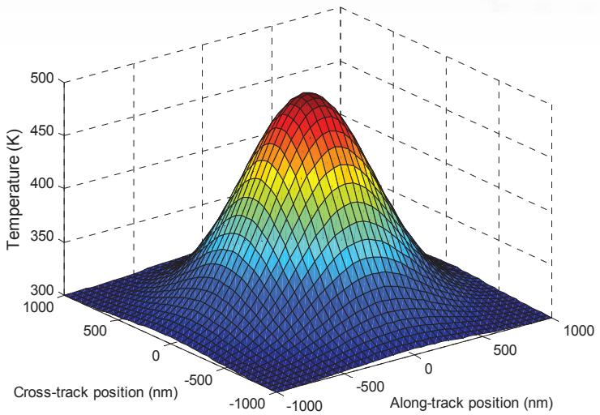  
图8.2 $\sigma_t = 382$ nm和$T_\mathrm{peak} = 200°C$时由方程(8.3)得到的温度分布

其中$c$是温度分布中心相对于原点（参考点）在沿磁道方向的位置（单位为纳米），$T_\mathrm{write}$是写入比特数据期间的温度，与最高温度的关系为：

$$
T_\mathrm{write} = T_\mathrm{peak} \exp\biggl(-\frac{z_0^2}{2\sigma_t^2}\biggr)\tag{8.5}
$$

其中$z_0$是温度为$T_\mathrm{write}$的跨磁道位置。

注意，使用热威廉姆斯-康斯托克模型分析HAMR系统时，会将每个磁道划分为多个子磁道（sub-track），有时称为"微磁道（microtrack）"[130]。在这种情况下，$T_\mathrm{write}$表示中心在$z_0$位置的每个微磁道的温度（关于HAMR系统中使用的微磁道模型的详细信息，请参见§8.6）。

### 8.3.2 磁滞回线

磁滞回线[1, 43]是表示记录介质的磁化强度M与总外加磁场$H_\mathrm{tot}$之间关系的曲线。磁滞回线反映了系统需要向记录介质施加多少磁场，才能使比特数据稳定地存储在记录介质中。在实际中，通用磁记录系统中使用的记录介质可以用单一的磁滞回线来定义，因为记录介质上每个位置具有相同的磁特性（具有相同的矫顽力$H_c$，并假设温度相同）。因此，数据写入时，系统必须施加总磁场$H_\mathrm{tot}$使其大于记录介质的$H_c$，以使比特数据稳定地存储在记录介质中，并使写入比特数据的区域达到磁滞回线定义的$M_r$（剩磁）。

  
(左)

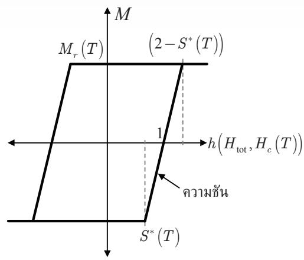  
(右)  
图8.3 (左) 室温下的磁滞回线（Loop 1）和高温下的磁滞回线（Loop 2），(右) 用|H_c|归一化的M-h曲线（即M-H曲线），得到有效场，假设M和h随温度变化

然而，在HAMR系统的写入过程中，记录介质会被附着在写磁头上的激光加热，然后再写入比特数据，之后记录介质快速冷却至室温。因此，用于描述HAMR系统写入过程的磁滞回线有两个：Loop 1和Loop 2，如图8.3(左)所示。Loop 1是记录介质在室温下的磁滞回线，Loop 2是被加热后（温度远高于室温）的记录介质的磁滞回线。从图8.3(左)可以看出，温度较高的记录介质的$H_c$和$M_r$会降低，从而使系统可以使用不太强的总磁场$H_\mathrm{tot}$将比特数据写入记录介质。

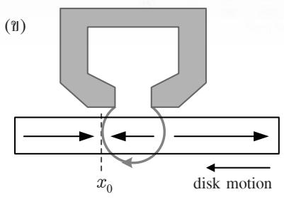

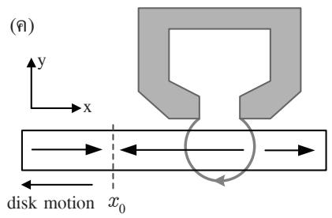  
图8.4 纵向磁记录写入过程和反转位置$x_0$

### 8.3.3 威廉姆斯-康斯托克模型

考虑图8.4所示的纵向记录系统的写入过程。当记录介质向左（-X方向）移动时，记录介质中的箭头表示剩磁$M_r$的方向，从写磁头射出的箭头表示写磁头产生的外加磁场$H_h$的方向。图8.4(a)显示系统的初始状态，$M_r$和$H_h$指向+x方向。当写磁头将磁场方向反转到相反方向（即-x方向），如图8.4(b)所示，则在写入磁场左侧的$x_0$位置处，记录介质中发生磁化反转（从$+M_r$变为$-M_r$）。当记录介质远离写磁头时，如图8.4(c)所示，图8.4(b)中发生的反转被存储在记录介质中的原始$x_0$位置。

在记录介质中发生磁化反转期间，用于稳定地将比特数据写入记录介质所需的总磁场$H_\mathrm{tot}$必须等于：

$$
H_\mathrm{tot}(x) = H_h(x) + H_d(x)\tag{8.6}
$$

其中$H_h$是写磁头磁场，$H_d$是退磁场。由于记录介质的磁化强度取决于总磁场$H_\mathrm{tot}$，因此沿磁道方向任意位置x的磁化强度分布可以通过求解以下方程得到：

$$
M(x) = M[H_\mathrm{tot}(x)] = M[H_h(x) + H_d(x)]\tag{8.7}
$$

此外，退磁场$H_d$也取决于方程(8.7)中的磁化强度。因此，求解方程(8.7)只能用迭代方法。然而，Williams和Comstock[136]发现，方程(8.7)在反转中心$x_0$处的导数可以求解。即在$x_0$处考虑$H_\mathrm{tot} = H_c$（这是稳定地将比特数据写入记录介质的条件），方程(8.7)的导数为：

$$
\left.\frac{dM(x)}{dx}\right|_{x_0} = \left.\frac{dM(H)}{dH_\mathrm{tot}}\right|_{H_c} \left.\frac{dH_\mathrm{tot}(x)}{dx}\right|_{x_0} = \left.\frac{dM(H)}{dH_\mathrm{tot}}\right|_{H_c} \left[ \left.\frac{dH_h(x)}{dx}\right|_{x_0} + \left.\frac{dH_d(x)}{dx}\right|_{x_0} \right]\tag{8.8}
$$

这被称为"威廉姆斯-康斯托克斜率方程"[130]。

在实际中，如果假设记录介质中的磁化反转是反正切函数，则可以将磁化梯度（magnetization gradient）和退磁场梯度（demagnetization field gradient）表示为依赖于单个变量"反转参数a"的解析方程。此外，写磁头磁场梯度和磁化梯度（相对于$H_\mathrm{tot}$）可分别由Karlqvist写磁头磁场方程[138]和记录介质的M-H曲线求得。因此，这些假设有助于求解方程(8.8)以得到a值，该a值综合了HAMR系统写入过程的所有相关因素。

### 8.3.4 热威廉姆斯-康斯托克模型

方程(8.8)中的威廉姆斯-康斯托克模型[136]使用单一的磁滞回线，假设记录介质上每个位置具有相同的磁特性（和相同的温度）。

然而，对于HAMR系统，当记录介质被加热时，记录介质上不同位置的磁特性需要用不同的磁滞回线来描述，如图8.3(左)所示。例如，$x = 0$ nm位置（假设为温度分布中心）的温度高于$x = 50$ nm位置，这意味着Loop 1用于描述$x = 50$ nm位置的磁特性，Loop 2用于描述$x = 0$ nm位置的磁特性。因此，为了避免使用不同磁滞回线的问题，这里用矫顽力$H_c$的大小对图8.3(左)中的磁滞回线进行归一化，其中$H_c$取决于沿磁道方向的位置x和温度$T(x)$，得到有效场：

$$
h(x) = \frac{H_\mathrm{tot}(x)}{|H_c(T(x))|}\tag{8.9}
$$

如图8.3(右)所示。即有效场$h(x)$是总外加磁场$H_\mathrm{tot}(x)$和依赖于温度的矫顽力$H_c(T(x))$的函数。此外，剩磁$M_r(T)$也取决于温度。这里假设$M_r(T)$在比特数据写入过程中没有衰减，即加热记录介质被视为可逆过程，当记录介质冷却至室温时，其磁化强度将完全恢复。

图8.3(右)中的M-h曲线还表明，在发生磁化反转的点处，矫顽力始终等于1，并且当有效场等于$h = (2 - S^*)$时，记录介质达到磁饱和，其中$S^*$是矫顽力矩形度（coercivity squareness）或M-H曲线的斜率[130]。此外，方程(8.9)还揭示了将比特数据写入记录介质的两种机制：如果给定矫顽力$H_c$，则当系统施加的总磁场$H_\mathrm{tot} = (2 - S^*)H_c$时，记录介质才能达到饱和（写入成功）。反之，如果给定总磁场$H_\mathrm{tot}$，则系统必须加热记录介质，使矫顽力小于$H_c = H_\mathrm{tot}/(2 - S^*)$，才能使记录介质饱和。

将温度效应纳入威廉姆斯-康斯托克模型的方法是将方程(8.7)改写为有效场h的形式：

$$
M(x) = M[h_\mathrm{tot}(x)]\tag{8.10}
$$

然后在反转中心$x_0$处对方程(8.10)求导，其中$H_\mathrm{tot} = H_c$且记录介质的温度为$T_0 = T(x_0)$，得到：

$$
\left.\frac{dM(x)}{dx}\right|_{x_0} = \left.\frac{dM(h)}{dh}\right|_{H_c(T_0)} \left.\frac{dh(x)}{dx}\right|_{x_0}\tag{8.11}
$$

由于图8.3(右)中M-h曲线的斜率为：

$$
\left.\frac{dM(h)}{dh}\right|_{H_c(T_0)} = \frac{M_r(T_0)}{(1 - S^*(T_0))} = \left.\frac{H_c(T_0) dM(H)}{dH_\mathrm{tot}}\right|_{H_c(T_0)}\tag{8.12}
$$

而方程(8.9)中有效场h在反转中心$x_0$处的导数为：

$$
\begin{array}{c}
{\displaystyle \frac{dh(x)}{dx} = \frac{1}{H_c(T_0)} \left.\frac{dH_h(x)}{dx}\right|_{x_0} + \frac{1}{H_c(T_0)} \left.\frac{dH_d(x)}{dx}\right|_{x_0}} \\
{\displaystyle - \frac{H_h(x_0) + H_d(x_0)}{H_c^2(T_0)} \left.\frac{dH_c(T)}{dT}\right|_{T_0} \left.\frac{dT(x)}{dx}\right|_{x_0}}
\end{array}\tag{8.13}
$$

其中$H_\mathrm{tot}(x_0) = H_h(x_0) + H_d(x_0)$。在实际中，反转中心$x_0$处的总磁场等于矫顽力，即$H_h(x_0) + H_d(x_0) = H_c(T_0)$。因此，方程(8.13)可改写为：

$$
\left.\frac{dh(x)}{dx}\right|_{x_0} = \frac{1}{H_c(T_0)} \left[ \left.\frac{dH_h(x)}{dx}\right|_{x_0} + \left.\frac{dH_d(x)}{dx}\right|_{x_0} - \left.\frac{dH_c(T)}{dT}\right|_{T_0} \left.\frac{dT(x)}{dx}\right|_{x_0} \right]\tag{8.14}
$$

将方程(8.12)和(8.14)代入方程(8.11)，得到"热威廉姆斯-康斯托克斜率方程"：

$$
\left.\frac{dM(x)}{dx}\right|_{x_0} = \left.\frac{dM(H)}{dH_\mathrm{tot}}\right|_{H_c(T_0)} \left[ \left.\frac{dH_h(x)}{dx}\right|_{x_0} + \left.\frac{dH_d(x)}{dx}\right|_{x_0} - \left.\frac{dH_c(T)}{dT}\right|_{T_0} \left.\frac{dT(x)}{dx}\right|_{x_0} \right]\tag{8.15}
$$

这与方程(8.8)中的威廉姆斯-康斯托克斜率方程类似，只是增加了最后一项涉及热效应的项$(dH_c/dT \times dT/dx)$。

在实际中，磁化反转行为可以由两个参数完全描述：反转中心位置$x_0$和反转长度。反转中心$x_0$是记录介质中磁化方向改变的位置，发生在总磁场$H_\mathrm{tot} = H_h + H_d$等于记录介质的矫顽力$H_c$时。因此，反转中心$x_0$是以下方程的解：

$$
H_c(x) = H_h(x) + H_d(x)\tag{8.16}
$$

通常，记录介质中的磁化反转被定义为反正切函数：

$$
M(x) = \frac{2M_r(T(x))}{\pi} \tan^{-1}\left(\frac{x - x_0}{a}\right)\tag{8.17}
$$

其中$a$是反转参数，$\pi a$是反转长度。

热威廉姆斯-康斯托克模型的主要目的是求解记录介质中磁化反转的$a$和$x_0$。反转参数$a$通过求解方程(8.15)得到，反转中心$x_0$通过求解方程(8.16)得到。但由于退磁场$H_d$取决于$x_0$和$a$，因此从方程(8.15)和(8.16)可以看出$x_0$和$a$相互关联，使得求解较为困难。然而，如果假设用于加热记录介质的激光热斑尺寸较大，则可以容易地求解方程(8.15)和(8.16)[130]。即大尺寸热斑会导致热梯度$dT/dx$较小，因此可以在计算$x_0$时忽略$H_d$（因为$x_0$与$a无关）。此外，退磁场梯度方程的形式也较为简单，有助于轻松求解方程(8.15)。但如果热斑尺寸较小，则不能在计算$x_0$时忽略$H_d$。因此，必须用迭代方法求解方程(8.15)和(8.16)：在第一次迭代中，随机选择一个$a$值，然后用方程(8.16)计算$x_0$，再将$x_0$代入方程(8.15)求解$a$，完成第一轮计算。然后在后续迭代中重复这些步骤，直到计算出的$x_0$和$a$收敛到所需的常数值。

在实际中，热威廉姆斯-康斯托克模型可同时应用于纵向HAMR系统[130]和垂直HAMR系统[139]。这是因为磁化反转仍然具有方程(8.17)所示的反正切函数形式，无论磁化方向是纵向还是垂直。此外，求解热威廉姆斯-康斯托克斜率方程(8.15)还需要知道写磁头磁场$H_h$和退磁场$H_d$。以下各节将解释方程(8.15)和(8.16)的求解方法。

## 8.4 纵向HAMR系统

求解纵向HAMR系统的热威廉姆斯-康斯托克斜率方程需要知道方程(8.15)中各导数项的值，其求解方法如下[130]。

### 8.4.1 dM(x)/dx的求解

纵向HAMR系统的磁化反转$M(x)$由方程(8.17)定义。图8.5显示了温度$T_\mathrm{peak}$和对齐参数c对$M(x)$的影响，其中$\sigma_t = 382$ nm, $x_0 = 0$ nm, $a = 27$ nm, $M_r(x) = -300T(x) + 300000$ A/m, $T(x)$是方程(8.4)中的温度分布，$c$是温度分布中心与反转中心$x_0$之间的距离，$T_\mathrm{write} = T_\mathrm{peak}$（即考虑$z_0 = 0$位置）。

从图8.5可以看出，虚线（$T_\mathrm{peak} = 0°C$, $c = 0$ nm）表示记录介质温度为$0°C$（假设为尚未加热的正常状态），温度分布中心与$x_0$位置对齐（即$c = 0$ nm）。在这种情况下，$M(x)$相对于$x_0$位置呈反对称分布，且在$x_0$处为零。然后，如果使用$T_\mathrm{peak} = 400°C$的激光加热记录介质（即长划线所示，$T_\mathrm{peak} = 400°C$, $c = 0$ nm），则磁化强度降低。由于温度分布中心与$x_0$位置对齐，$M(x)$的降低仍然是对称的。最后，实线（$T_\mathrm{peak} = 400°C$, $c = 300$ nm）显示了当温度分布中心向右偏移$x_0$位置300 nm时的$M(x)$，发现$M(x)$的降低相对于$x_0$不再对称。由于$x_0$右侧的记录介质比左侧更热，因此$x_0$右侧的磁化强度绝对值小于左侧。

  
图8.5 温度$T_\mathrm{peak}$和对齐参数c对磁化强度$M(x)$的影响

此外，磁化梯度可以通过对方程(8.17)求导得到：

$$
\frac{dM(x)}{dx} = \frac{2M_r(T(x))}{\pi} \frac{a}{(x - x_0)^2 + a^2} + \frac{2}{\pi} \tan^{-1}\left(\frac{x - x_0}{a}\right) \left.\frac{dM_r(T)}{dT}\right|_{T(x)} \frac{dT(x)}{dx}\tag{8.18}
$$

在反转中心$x = x_0$处的磁化梯度为：

$$
\left.\frac{dM(x)}{dx}\right|_{x_0} = \frac{2M_r(T_0)}{\pi a}\tag{8.19}
$$

其中$T_0 = T(x_0)$是记录介质在$x_0$位置的温度。

### 8.4.2 dM(H)/dH的求解

磁化强度相对于总磁场$H_\mathrm{tot}$在$x_0$位置处（温度为$T_0$）矫顽力$H_c$处的导数可由方程(8.12)得到：

  
图8.6 纵向记录系统的写磁头、记录介质和磁力线

$$
\left.\frac{dM(H)}{dH_\mathrm{tot}}\right|_{H_c(T_0)} = \left|\frac{M_r(T_0)}{(1 - S^*(T_0))H_c(T_0)}\right|\tag{8.20}
$$

方程(8.12)表明，无论写入记录介质的反转方向与矫顽力方向相同还是相反，都可以使用方程(8.20)。方程(8.20)的值始终为正，因为图8.3中M-H曲线的斜率始终为正。

### 8.4.3 dH_h/dx的求解

对于纵向记录系统，记录介质被磁化到水平方向（平行于磁盘平面）。图8.6显示了纵向记录系统的写磁头、记录介质和磁力线。写磁头磁场从极1流向极2，导致记录介质中的磁化方向也沿水平方向。如果假设写磁头的宽度和长度为无穷大，但间隙宽度有限，则Karlqvist[138]提出的写磁头磁场（称为"Karlqvist写磁头磁场"）平行于磁盘平面的分量为：

$$
H_x(x, y) = \frac{H_0}{\pi} \left[ \tan^{-1}\left(\frac{x + \tilde{g}/2}{y}\right) - \tan^{-1}\left(\frac{x - \tilde{g}/2}{y}\right) \right]\tag{8.21}
$$

垂直于磁盘平面的分量为：

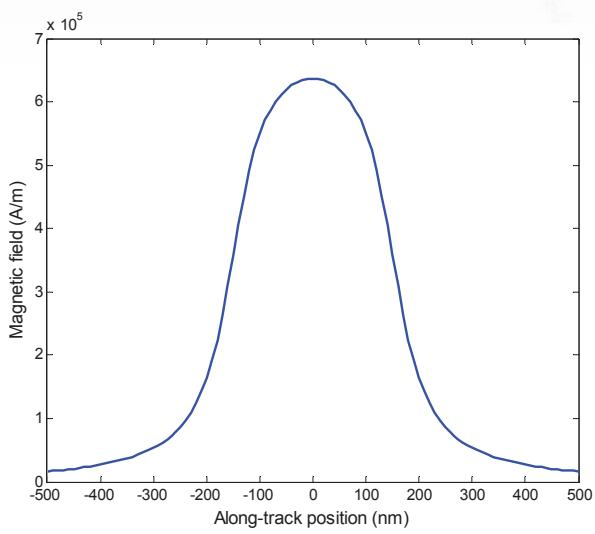  
图8.7 纵向HAMR系统中Karlqvist写磁头磁场的$x$分量，由方程(8.21)得到

$$
H_y(x, y) = -\frac{H_0}{2\pi} \ln\left(\frac{(x + \tilde{g}/2)^2 + y^2}{(x - \tilde{g}/2)^2 + y^2}\right)\tag{8.22}
$$

其中$H_0$是间隙中的写磁头磁场（单位为A/m）。然而，纵向记录系统中使用的记录介质仅对写磁头磁场平行于磁盘平面的分量$H_x(x, y)$敏感（见图8.3）。因此，纵向HAMR系统在计算$dH_h/dx$时不考虑$H_y(x, y)$。

由于热威廉姆斯-康斯托克模型只考虑记录介质厚度中点处的磁场，因此设$\delta$为记录介质厚度，$d$为飞行高度（写磁头到记录介质表面的距离），则写磁头磁场$H_h(x) = H_x(x, y)$需要在$y = d + \delta/2$位置处计算，如图8.6所示。图8.7显示了Karlqvist写磁头磁场平行于磁盘平面的分量，其中$H_0 = 800$ kA/m，$\tilde{g} = 300$ nm，$y = 50$ nm，$x = 0$为间隙中心点。

对方程(8.21)在反转中心$x = x_0$处求导，得到[131]：

$$
\left.\frac{dH_h(x)}{dx}\right|_{x_0} = -\frac{Q\tilde{H}(T_0)}{y}\tag{8.23}
$$

这就是写磁头磁场梯度，其中：

$$
Q = \frac{2 x_0 H_0}{\pi \tilde{g} \tilde{H}(T(x_0))} \sin^2 \left( \frac{\pi \tilde{H}(T(x_0))}{H_0} \right)\tag{8.24}
$$

其中 $\tilde{H} = H_c - H_d$ 是矫顽力 $H_c$ 和退磁场 $H_d$ 在 $x_0$ 位置处的差值，该位置温度为 $T(x_0) = T_0$。通常，退磁场具有对称的反转特性，使得 $H_d \approx 0$ 在 $x_0$ 处（见图8.8），因此 $\tilde{H} = H_c$。此外，从图8.4的模型可知，$x_0$ 始终为负值，因为它位于间隙中心左侧（-x轴），因此方程(8.24)中的 $Q$ 始终为负值。

## 8.4.4 求 $dH_d/dx$

由于阶跃反转在原点处的退磁场为[130]：

$$
H_x^{\mathrm{step}}(x) = \frac{1}{\pi} \tan^{-1}\left(\frac{\delta}{2x}\right)\tag{8.25}
$$

其中 $x$ 为沿磁道方向的位置，$\delta$ 为记录介质的厚度。因此任意反转状态的退磁场可由下式求得：

$$
H_d(x) = -\frac{dM(x)}{dx} \ast H_x^{\mathrm{step}}(x)\tag{8.26}
$$

其中 $\ast$ 为卷积算子。将方程(8.18)和(8.25)代入方程(8.26)，得到：

$$
\begin{array} { l } { { \displaystyle { \cal H } _ { d } \left( x \right) = - \frac { 2 } { \pi ^ { 2 } } \displaystyle { \int _ { - \infty } ^ { + \infty } } \tan ^ { - 1 } \left( \frac { z - x _ { 0 } } { a } \right) \frac { d M \left( T \right) } { d T } \frac { d T \left( z \right) } { d z } \tan ^ { - 1 } \left( \frac { \delta } { 2 \left( x - z \right) } \right) d z } } \\ { { \displaystyle ~ - \frac { 2 } { \pi ^ { 2 } } \displaystyle { \int _ { - \infty } ^ { + \infty } } \frac { M _ { r } \left( z \right) a } { a ^ { 2 } + \left( z - x _ { 0 } \right) ^ { 2 } } \tan ^ { - 1 } \left( \frac { \delta } { 2 \left( x - z \right) } \right) d z } } \end{array}\tag{8.27}
$$

图8.8显示了利用方程(8.27)计算得到的峰值温度 $T_{\mathrm{peak}}$ 和对齐参量 c 对退磁场 $H_d$ 的影响，所用参数与图8.5相同，并取 $\tilde{g} = 300$ nm 和 $\delta = 16$ nm。虚线（$T_{\mathrm{peak}} = 0\;^\circ\mathrm{C}$，$c = 0$ nm）表示介质温度为 $0\;^\circ\mathrm{C}$ 且温度轮廓中心与 $x_0$ 位置对齐的情况——此时只有磁化反转对退磁场 $H_d$ 有贡献，$H_d$ 关于 $x_0$ 呈反对称，且在 $x_0$ 处近似为零。当使用峰值温度为 $T_{\mathrm{peak}} = 400\;^\circ\mathrm{C}$ 的激光加热介质时（长虚线：$T_{\mathrm{peak}}=400\;^\circ\mathrm{C}$，$c=0$ nm），磁化强度降低，导致 $H_d$ 也相应减小。但由于温度轮廓中心与 $x_0$ 位置对齐，$H_d$ 的减小仍保持对称。最后，实线（$T_{\mathrm{peak}}=400\;^\circ\mathrm{C}$，$c=300$ nm）显示了温度轮廓中心向右偏移 $x=0$ 位置 300 nm 时的 $H_d$ 值。结果表明 $H_d$ 的减小关于 $x_0$ 不再对称，且由于 $x_0$ 右侧的介质比左侧更热，$x_0$ 右侧的磁化强度和 $H_d$（绝对值）均小于左侧。此外在此情况下，$H_d \neq 0$ 在 $x_0$ 处，零交点相对于 $x_0$ 位置略微向左偏移。

  
图8.8 峰值温度 $T_{\mathrm{peak}}$ 和对齐参量 c 对退磁场 $H_d$ 的影响

通常，退磁场梯度 $dH_d/dx$ 可通过对方程(8.27)求关于 x 的导数得到，但这种方法可能产生奇异性问题[130]。因此，这里利用卷积的微分性质来处理：

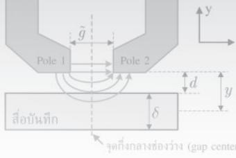

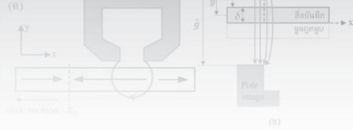

$$
{ \frac { d } { d x } } { \Bigl [ } f { \bigl ( } x { \bigr ) } * g { \bigl ( } x { \bigr ) } { \Bigr ] } = { \frac { d f { \bigl ( } x { \bigr ) } } { d x } } * g { \bigl ( } x { \bigr ) } = f { \bigl ( } x { \bigr ) } * { \frac { d g { \bigl ( } x { \bigr ) } } { d x } }\tag{8.28}
$$

由此推导退磁场梯度，得到：

$$
\begin{array} { r l } & { \displaystyle \frac { d H _ { d } \big ( x \big ) } { d x } = - \frac { 4 } { \pi ^ { 2 } } \int _ { - \infty } ^ { + \infty } \frac { M \big ( z \big ) a \big ( z - x _ { 0 } \big ) } { \pi ^ { 2 } } \tan ^ { - 1 } \Biggl \lvert \frac { \delta } { 2 \big ( x - z \big ) } \Biggr \rvert d z } \\ & { \quad \quad \quad - \frac { 4 } { \pi _ { 8 } ^ { 2 } } \int _ { 5 } ^ { + \infty } \frac { a } { 1 5 \sqrt { 6 \pi } \mathrm { i } \mathrm { e } ^ { \mathrm { i } \phi _ { \mathrm { i b } } } \mathrm { i } \mathrm { e } ^ { \mathrm { i } \phi _ { a } } \big \rangle ^ { 2 } } \frac { d M \big ( T \big ) } { \pi ^ { 2 } } \frac { d T \big ( z \big ) } { d \mathrm { e } } \tan ^ { - 1 } \Biggl \lvert \frac { \delta } { 2 \big ( x - z \big ) } \Biggr \rvert d z } \\ & { \quad \quad \quad - \frac { 2 } { \pi ^ { 2 } } \int _ { - \infty } ^ { + \infty } \tan ^ { - 1 } \Biggl \lvert \frac { z - x _ { 0 } } { a } \Biggr \rvert \frac { d M \big ( T \big ) } { d T } \frac { d ^ { 2 } T \big ( z \big ) } { d z ^ { 2 } } \tan ^ { - 1 } \Biggl \lvert \frac { \delta } { 2 \big ( x - z \big ) } \Biggr \rvert d z } \end{array}\tag{8.29}
$$

图8.9显示了利用方程(8.29)计算得到的峰值温度 $T_{\mathrm{peak}}$ 和对齐参量 c 对退磁场梯度的影响，所用参数与图8.8相同。由图可见，当介质被加热时，$x_0$ 处的退磁场梯度（绝对值 $|dH_d/dx|$）减小。此外，图8.10显示了在 $c=0$ 条件下方程(8.29)中各项在 $x_0$ 处的退磁场梯度值。由图可见，第一项（"First term"）的幅度远大于第二和第三项之和（"Remaining terms"）。

因此，对于具有大光斑尺寸的 HAMR 系统，热梯度（$dT/dx$ 和 $d^2T/dx^2$）较小，使得方程(8.29)中占主导的第一项在反转中心 $x=x_0$ 处起主要作用（相比第二和第三项）。因此在这种情况下，方程(8.29)可简化为[131]：

$$
\left. \frac{dH_d(x)}{dx} \right|_{x_0} = -\frac{M_r(T_0)\delta}{\pi a (a+\delta/2)}\tag{8.30}
$$

## 8.4.5 求 $dH_c/dT \times dT/dx$

方程(8.15)中的最后一项是热量对威廉姆斯-康斯托克模型方程(8.8)的影响，即介质的矫顽力 $H_c$ 与温度成反比——$H_c$ 随温度升高而降低，这是要写入数据比特位置处的函数关系。

因此，求 $dH_c/dT$ 需要知道作为温度函数的矫顽力 $H_c(T)$（每种介质类型都会提供其 $H_c(T)$ 值）。而求 $dT/dx$ 则可通过对方程(8.4)在反转中心 $x=x_0$ 处求导得到：

$$
\left. \frac{dT(x)}{dx} \right|_{x_0} = -\frac{(x_0-c)}{\sigma^2} (T_0-300)\tag{8.31}
$$

其中 $T_0 = T(x_0)$ 是 $x_0$ 位置处的温度。

## 8.4.6 求反转中心 $x_0$

当介质温度升高时，矫顽力 $H_c$ 和退磁场 $H_d$ 都会减小[130]。因此，反转中心位置 $x_0$ 可通过求解方程(8.6)在 $H_{\mathrm{tot}} = H_c$ 条件下得到，即：

$$
H_c(T(x_0)) = H_h(x_0) + H_d(T(x_0))\tag{8.32}
$$

也就是介质的矫顽力 $H_c$ 等于写磁头磁场 $H_h$ 与退磁场 $H_d$ 之和在 $x_0$ 处的值。此处即为能够将数据比特稳定写入并保存在介质中的位置。

对于具有大光斑尺寸的 HAMR 系统，热梯度较小，使得退磁场 $H_d$ 的影响非常小（可以忽略）[130]，如图8.11所示。该图显示了利用方程(8.27)计算退磁场对求解反转中心 $x_0$ 的影响，所用参数与图8.8相同，并取 $H_c(x) = -500T(x) + 440000$ A/m 和 $H_0 = 800$ kA/m。由图可见，从方程(8.32)考虑和不考虑 $H_d$ 影响所得到的 $x_0$ 位置差异非常小（仅几纳米），即使 HAMR 系统在高温下工作也是如此。因此在这种情况下，方程(8.32)可简化为：

$$
H_c(T(x_0)) \approx H_h(x_0)\tag{8.33}
$$

这可以通过方程(8.21)的写磁头磁场 $H_h$ 和给定的介质矫顽力 $H_c$ 轻松求解 $x_0$。此外，还可以在方程(8.23)和(8.24)中使用 $\tilde{H} = H_c$，这有助于简化方程(8.15)的求解以得到反转参数 a。然而，使用方程(8.33)求解 $x_0$ 时，有时可能得到多个 $x_0$ 值。在这种情况下，我们假设存储在介质中的反转（或数据比特）仅位于最左侧的位置（根据图8.4所定义的模型）。

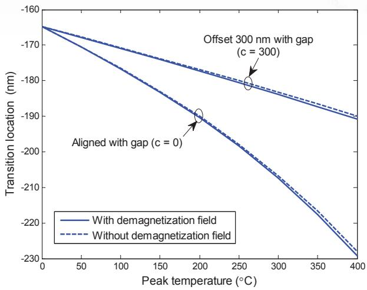  
图8.11 退磁场对求解 $x_0$ 位置的影响

## 8.4.7 求反转参数 a

对于具有大光斑尺寸的 HAMR 系统，将方程(8.19)、(8.20)、(8.23)和(8.30)代入方程(8.15)，可求得反转参数 a：

$$
{ \frac { 2 M _ { r } ( T _ { 0 } ) } { \pi a } } = | { \frac { M _ { r } ( T _ { 0 } ) } { H _ { c } ( T _ { 0 } ) ( 1 - S ^ { * } ( T _ { 0 } ) ) } } | \times [ - { \frac { Q H _ { c } ( T _ { 0 } ) } { y } } - { \frac { M _ { r } ( T _ { 0 } ) \delta } { \pi a ( a + \delta / 2 ) } } - { \frac { d H _ { c } } { d T } } { \frac { d T } { d x } } | _ { x _ { 0 } } ]\tag{8.34}
$$

或重新整理为：

$$
\frac{2M_r(T_0)}{\pi a} = \left| \frac{M_r(T_0)}{H_c(T_0)(1-S^*(T_0))} \right| \times \left| \frac{\beta|H_c(T_0)|}{y} - \frac{M_r(T_0)\delta}{\pi a(a+\delta/2)} \right|\tag{8.35}
$$

其中：

$$
\beta = -\frac{H_c}{|H_c(T_0)|} Q - \frac{y}{|H_c(T_0)|} \frac{dH_c}{dT} \frac{dT}{dx}\tag{8.36}
$$

求解方程(8.35)得到 a 的结果为：

$$
\begin{array} { c } { { a = - \displaystyle \frac \delta 4 - \frac { y \left( 1 - S ^ { * } \left( T _ { 0 } \right) \right) } { \pi \beta } } } \\ { { + \sqrt { \left( - \frac \delta 4 - \frac { y \left( 1 - S ^ { * } \left( T _ { 0 } \right) \right) } { \pi \beta } \right) ^ { 2 } + \left( \frac { M _ { r } \left( T _ { 0 } \right) \delta y } { \pi \left| H _ { c } \left( T _ { 0 } \right) \right| \beta } - \frac { \delta y \left( 1 - S ^ { * } \left( T _ { 0 } \right) \right) } { \pi \beta } \right) } } } \end{array}\tag{8.37}
$$

注：第8.4节中描述的所有方程和解都基于以下假设：写磁头和介质的模型以及介质中磁化反转的方向均遵循图8.4。即磁化反转从 $+M_r$ 变为 $-M_r$，这意味着磁化强度 $M_r$ 必须为负值，且反转是在负矫顽力下写入的。因此，当 $H_c$ 为负值时，加热以降低 $H_c$ 会使 $dH_c/dT$ 为正。将 $H_c/|H_c| = -1$ 代入方程(8.36)，得到：

$$
\beta = Q - \frac{y}{|H_c(T_0)|} \frac{dH_c}{dT} \frac{dT}{dx}\tag{8.38}
$$

## 8.5 垂直 HAMR 系统

垂直 HAMR 系统的分析步骤与第8.3.5节所述的水平 HAMR 系统类似，仅写磁头磁场 $H_h$ 和退磁场 $H_d$ 有所不同。

图8.12(a)显示了垂直记录系统的写磁头、介质和磁力线。所使用的介质具有一个称为 SUL（软磁底层）或"keeper"的特殊附加层，帮助磁场从一个磁极传递到另一个磁极，从而使介质中的磁化方向垂直于介质表面。通过使用图8.12(b)中写磁头和介质的等效模型，可以求得写磁头磁场[141]。然而，从图8.12(b)来看，写磁头的磁极像在介质下方关于 x 轴对称分布。如果将图8.12(b)顺时针旋转90度，磁场特征将类似于图8.6中水平记录系统的模型。因此，可以采用 Karlqvist 的概念[138]来近似估计垂直记录系统的写磁头磁场（只需将坐标从 x 变换为 y，从 y 变换为 x），结果为[139]：

  
图8.12 垂直记录系统的写磁头、介质和磁力线

$$
H_h(x) = H_y(x,y) = \frac{H_0}{\pi} \left[ \tan^{-1}\left(\frac{y+\tilde{g}/2}{x}\right) - \tan^{-1}\left(\frac{y-\tilde{g}/2}{x}\right) \right]\tag{8.39}
$$

其中 $\tilde{g}$ 是写磁头磁极与磁极像之间的间隙宽度，$H_0$ 是间隙中的写磁头磁场。设 $\delta$ 为介质厚度，$d$ 为飞行高度，则 $\tilde{g} = 2d + 2\delta$。

类似地，热威廉姆斯-康斯托克模型仅考虑介质厚度中点处的磁场，即 $y = d + \delta/2$，如图8.12(b)所示，在此情况下不考虑平行于介质表面的磁场分量 $H_x(x,y)$。实际中，方程(8.39)的磁场近似仅在 $x > 0$ 时可靠且准确。但由于垂直 HAMR 系统中反转位置通常距离写磁头磁极边缘较远，因此可以可靠地将方程(8.39)用于垂直 HAMR 系统热威廉姆斯-康斯托克模型方程(8.15)的分析[139]。图8.13显示了根据方程(8.39)绘制的垂直 HAMR 系统的 Karlqvist 写磁头磁场，其中 $H_0 = 800$ kA/m，$\tilde{g} = 300$ nm，$y = 50$ nm，$x=0$ 为间隙中心点。

  
图8.13 垂直 HAMR 系统的 Karlqvist 写磁头磁场（方程(8.39)）

此外，通过对方程(8.39)求导，可得到反转中心 $x_0$ 处的写磁头磁场梯度：

$$
{ \frac { d H _ { h } \left( x \right) } { d x } } \bigg \vert _ { x _ { 0 } } = { \frac { H _ { 0 } } { \pi } } \bigg \lbrack { \frac { A } { x ^ { 2 } + A ^ { 2 } } } - { \frac { B } { x ^ { 2 } + B ^ { 2 } } } \bigg \rbrack\tag{8.40}
$$

其中 $A = y - \tilde{g}/2$，$B = y + \tilde{g}/2$。

退磁场 $H_d$ 仍可通过方程(8.26)求得，只需使用垂直于介质方向的阶跃反转退磁场：

$$
H_d(x) = -\frac{dM(x)}{dx} \ast H_y^{\mathrm{step}}(x)\tag{8.41}
$$

其中[139]：

$$
H_y^{\mathrm{step}}(x) = \frac{1}{\pi} \tan^{-1}\left(\frac{2x}{\delta}\right)\tag{8.42}
$$

类似地，假设磁化反转具有如方程(8.17)所示的反正切函数特征，则将方程(8.18)和(8.42)代入方程(8.41)，得到退磁场 $H_d$ 为：

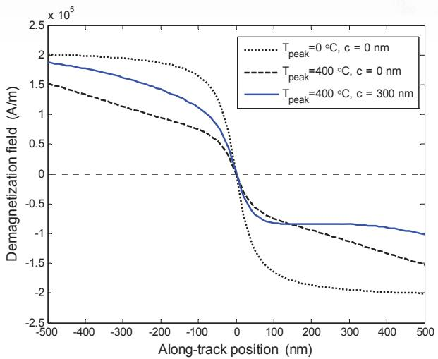  
图8.14 垂直 HAMR 系统中峰值温度 $T_{\mathrm{peak}}$ 和对齐参量 c 对 $H_d$ 的影响

$$
\begin{array} { l } { { \displaystyle H _ { d } \left( x \right) = - \frac { 2 } { \pi ^ { 2 } } \int _ { - \infty } ^ { + \infty } { \tan ^ { - 1 } \left( \frac { z - x _ { 0 } } { a } \right) \frac { d M \left( T \right) } { d T } \frac { d T \left( z \right) } { d z } \tan ^ { - 1 } \left( \frac { 2 \left( x - z \right) } { \delta } \right) d z } } } \\ { { \displaystyle ~ - \frac { 2 } { \pi ^ { 2 } } \int _ { - \infty } ^ { + \infty } { \frac { M _ { r } \left( z \right) a } { a ^ { 2 } + \left( z - x _ { 0 } \right) ^ { 2 } } \tan ^ { - 1 } \left( \frac { 2 \left( x - z \right) } { \delta } \right) d z } } } \end{array}\tag{8.43}
$$

图8.14显示了利用方程(8.43)计算得到的垂直 HAMR 系统中峰值温度 $T_{\mathrm{peak}}$ 和对齐参量 c 对退磁场 $H_d$ 的影响，参数与图8.8相同。由图可见，虚线（$T_{\mathrm{peak}}=0\;^\circ\mathrm{C}$，$c=0$ nm）表示介质温度为 $0\;^\circ\mathrm{C}$ 且温度轮廓中心与 $x_0$ 位置对齐的情况——此时 $H_d$ 关于 $x_0$ 呈反对称，且在 $x_0$ 处为零。当使用峰值温度为 $T_{\mathrm{peak}}=400\;^\circ\mathrm{C}$ 的激光加热介质时（长虚线：$T_{\mathrm{peak}}=400\;^\circ\mathrm{C}$，$c=0$ nm），磁化强度降低，导致 $H_d$ 也相应减小。由于温度轮廓中心与 $x_0$ 位置对齐，$H_d$ 的减小仍保持对称。最后，实线（$T_{\mathrm{peak}}=400\;^\circ\mathrm{C}$，$c=300$ nm）显示了温度轮廓中心向右偏移 $x_0$ 位置 300 nm 时的 $H_d$ 值。结果表明 $H_d$ 的减小关于 $x_0$ 不再对称，且由于 $x_0$ 右侧的介质比左侧更热，$x_0$ 右侧的磁化强度和 $H_d$（绝对值）均小于左侧。此外还发现 $H_d \neq 0$ 在 $x_0$ 处，零交点相对于 $x_0$ 位置略微向右偏移。

对于具有大光斑尺寸的垂直 HAMR 系统，方程(8.43)中的第一项远小于第二项（可忽略）。因此在这种情况下，方程(8.43)可简化为[139]：

$$
H_d(x) \approx -\frac{2M_r(T(x))}{\pi} \tan^{-1}\left(\frac{x-x_0}{a+\delta/2}\right)\tag{8.44}
$$

此外，如果不考虑剩磁的热梯度，则沿磁道方向任意位置 $x$ 处的退磁场梯度为：

$$
{ \frac { d H _ { d } \left( x \right) } { d x } } \approx - { \frac { 2 M _ { r } \left( T \left( x \right) \right) } { \pi } } \Biggl \{ { \frac { \left( a + \delta / 2 \right) } { \left( a + \delta / 2 \right) ^ { 2 } + \left( x - x _ { 0 } \right) ^ { 2 } } } \Biggr \}\tag{8.45}
$$

且在 $x = x_0$ 处为：

$$
\left. \frac{dH_d(x)}{dx} \right|_{x_0} \approx -\frac{2M_r(T(x_0))}{\pi(a+\delta/2)}\tag{8.46}
$$

图8.15显示了利用方程(8.45)计算得到的峰值温度 $T_{\mathrm{peak}}$ 和对齐参量 c 对退磁场梯度的影响，参数与图8.9相同。由图可见，当介质被加热时，$x_0$ 处的退磁场梯度减小。

同样地，反转中心位置 $x_0$ 仍可通过求解方程(8.32)得到。对于具有大光斑尺寸的 HAMR 系统，热梯度较小，使得退磁场 $H_d$ 的影响非常小（可忽略），如图8.16所示。该图显示了利用方程(8.43)计算退磁场对求解 $x_0$ 的影响，参数与图8.11相同。结果表明，考虑和不考虑 $H_d$ 影响所得到的 $x_0$ 位置差异非常小（仅几纳米），即使 HAMR 系统在高温下工作也是如此。因此，为简化垂直 HAMR 系统的分析，可使用方程(8.33)通过方程(8.39)的写磁头磁场 $H_h$ 和给定的介质矫顽力 $H_c$ 来求解 $x_0$。

  
图8.15 垂直 HAMR 系统中峰值温度 $T_{\mathrm{peak}}$ 和对齐参量 c 对 $dH_d/dx$ 的影响

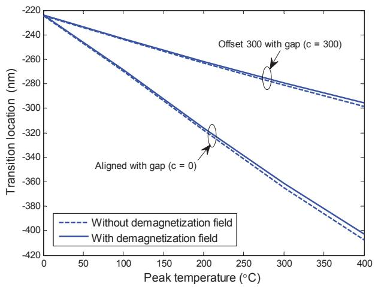  
图8.16 退磁场对垂直 HAMR 系统中 $x_0$ 位置求解的影响

然后按照第8.4节所述的步骤，可以求得垂直 HAMR 系统的反转参数 a 为[139]：

$$
a = -\frac{\gamma}{2} + \frac{1}{2} \sqrt{ \gamma^2 + \frac{4H_c(1-S^*)\delta}{\Delta\pi} }\tag{8.47}
$$

其中：

$$
\Delta = \frac{dH_h}{dx} - \frac{dH_c}{dT}\frac{dT}{dx}\bigg|_{x_0} = \frac{H_0\tilde{g}}{\pi\big(x_0^2+(\tilde{g}/2)^2\big)} - \frac{dH_c}{dT}\frac{dT}{dx}\bigg|_{x_0}\tag{8.48}
$$

$$
\gamma = \frac{2M_r}{\Delta\pi} - \frac{\delta}{2} + \frac{2H_c(1-S^*)}{\Delta\pi}\tag{8.49}
$$

注：总之，热威廉姆斯-康斯托克斜率方程(8.15)与普通威廉姆斯-康斯托克模型斜率方程(8.8)的区别在于，前者增加了与热效应相关的项。如果不考虑热效应（即 $dT/dx=0$），则依赖于温度的磁化强度和矫顽力的变化率也为零（即 $dM/dT = dH_c/dT = 0$）。将这些值代入热威廉姆斯-康斯托克斜率方程后，得到的结果将与普通威廉姆斯-康斯托克模型斜率方程(8.8)相同。

## 8.6 微磁道模型

热威廉姆斯-康斯托克模型方程(8.15)被认为是一维模型，因为它不考虑反转在跨磁道方向上的变化。尽管该模型在常用磁记录系统（当写磁头磁极宽度较大时）中仍能很好地描述反转特性，但它无法用于 HAMR 系统，特别是当介质被激光加热时。

在实际中，加热过程和介质的磁化状态是二维的，因为温度轮廓服从高斯分布（方程(8.2)），导致反转在沿磁道方向和跨磁道方向上都发生变化。因此，解决此问题的方法是利用"微磁道模型"[142, 143]来近似估计反转曲率。该方法将一个数据磁道划分为 N 个宽度为 $\Delta z$ 的子磁道，如图8.17所示。设 $T(x,z)$ 为介质加热后的温度轮廓，其中 $x$ 为沿磁道方向，$z$ 为跨磁道方向。每个子磁道的温度轮廓近似为一维函数 $T(x, z=i\Delta z)$，其中 $-N/2 \le i \le N/2$（子磁道数量越多，近似越精确）。然后对每个子磁道独立应用热威廉姆斯-康斯托克模型，以求得各子磁道的反转中心和反转参数。

  
图8.17 HAMR 通道的微磁道模型

此外，设每个子磁道的读磁头响应为 $h(\boldsymbol{a}_i, t-\boldsymbol{\tau}_i)$，它取决于子磁道的反转参数 $a_i$ 和反转中心的相对位置 $v(t-\tau_i)$，其中 $x_{0,i} = \tau_i v$ 是第 i 个子磁道的反转中心，$v$ 是介质移动速度。因此，来自读磁头的总脉冲信号响应 $p(t)$ 为[142]：

$$
p(t) = \frac{1}{N} \sum_{i=1}^{N} h(a_i, t-\tau_i)\tag{8.50}
$$

在此我们假设 $h(a,t)$ 等于 GMR（巨磁阻）读磁头对反正切反转响应的一阶近似，即[43, 143]：

$$
h(a,t) = C M_r \delta \left( \tan^{-1}\left(\frac{vt+(g_r/2)}{a+d}\right) - \tan^{-1}\left(\frac{vt-(g_r/2)}{a+d}\right) \right)\tag{8.51}
$$

其中 $g_r$ 和 $d$ 分别是读磁头的屏蔽间距和屏蔽到介质距离，$C$ 是用于描述 GMR 读磁头物理特性的常数[43]。

威廉姆斯-康斯托克模型被认为是一维模型，因为它假设读磁头响应在跨磁道方向上是均匀的。然而在实际中，读磁头响应具有高斯分布特征[142]。因此，每个子磁道的相对响应必须通过跨磁道读磁头灵敏度函数进行加权，该灵敏度函数近似为具有标准差 $\sigma_r$ 的高斯分布，每个子磁道的宽度为 $\Delta z$。因此，方程(8.50)中的总响应 $p(t)$ 可重写为：

$$
p(t) = \frac{C M_r \delta}{N} \sum_{i=1}^{N} \left[ \exp\left(-\left\{ \frac{(i\Delta z - \left(\frac{N+1}{2}\right)\Delta z)^2}{2\sigma_r^2} \right\} \right) \left( \tan^{-1}\left(\frac{x_i + \frac{g_r}{2}}{a_i + d}\right) - \tan^{-1}\left(\frac{x_i - \frac{g_r}{2}}{a_i + d}\right) \right) \right]\tag{8.52}
$$

其中 $x_i = v(t-\tau_i)$ 是反转中心的相对距离。括号内的项是每个子磁道的响应，指数因子 $\exp()$ 是高斯加权函数——当读磁头位于磁道中心时加权值为1，当读磁头接近磁道边缘时加权值趋近于零。

## 8.7 HAMR 系统特性

设计具有最高性能的 HAMR 系统需要考虑多个因素：系统性能取决于介质磁性材料特性（如矫顽力 $H_c$ 和剩磁 $M_r$）、温度变化、温度轮廓（如峰值温度和 FWHM）以及峰值温度位置等。此外，选择与写磁头集成的激光器位置对于实现系统最高性能也至关重要。

表8.1 水平 HAMR 系统分析所用的参数值

| 参数               | 使用值                      |     | 参数                       | 使用值              |
| ---------------- | ------------------------ | --- | ------------------------ | ---------------- |
| $H_c$ [A/m]      | $-2000T(x)+16\times10^5$ |     | $T_{\mathrm{peak}}$ [°C] | 可变               |
| $M_r$ [A/m]      | $-1200T(x)+12\times10^5$ |     | $\sigma_t$ [nm]          | 可变               |
| $S^*$            | 0.7                      |     | 磁道宽度 [nm]                | 120              |
| $H_0$ [A/m]      | $19\times10^5$           |     | 子磁道数量 N                  | 2001             |
| $\tilde{g}$ [nm] | 100                      |     | $C$                      | $2.13\times10^4$ |
| $d$ [nm]         | 19                       |     | $g_r$ [nm]               | 5                |
| $\delta$ [nm]    | 2                        |     | $\sigma_r$ [nm]          | 1000             |

本节将基于热威廉姆斯-康斯托克模型和微磁道模型，展示水平和垂直 HAMR 系统的特性，研究介质中的反转中心 $x_0$ 和反转参数 a。这里假设所使用的激光器始终位于跨磁道方向的磁道中心。

## 8.7.1 水平 HAMR 系统

表8.1显示了水平 HAMR 系统分析所用的参数值。通常，读出信号取决于峰值温度和激光器位置（即峰值温度位置）相对于写磁头间隙中心的位置（见图8.6）。在实际中，激光器可以安装在介质移动方向一侧（-x 轴方向，如图8.4所示），也可以安装在相反方向（+x 轴方向），这对读出信号有不同的影响。

图8.18显示了激光器位于间隙中心左侧（$c=0$ nm）不同位置时，各子磁道中发生的反转中心 $x_0$ 和反转参数 a。可以发现，各子磁道中反转发生的位置不同（不对齐，因此看似曲线），这是因为温度轮廓在沿磁道和跨磁道方向上均为高斯分布——磁道中心温度最高，磁道边缘温度最低。由于矫顽力与温度呈线性反比关系，各子磁道中的反转位置不同，从而在跨磁道方向上形成了"反转曲率"。

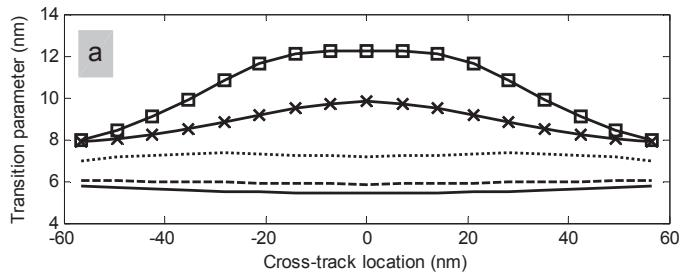  
图8.18 水平 HAMR 系统中激光器位于间隙中心左侧不同位置时，各子磁道的反转中心 $x_0$ 和反转参数 a

从图8.18（上）可见，当激光器远离间隙中心（c 值减小）时，$x_0$ 位置也逐渐远离间隙中心，直至到达矫顽力梯度为正的区域（见图8.19）。如果继续将激光器移离间隙中心，$x_0$ 位置会反向移回间隙中心。此外还可观察到，当 $x_0$ 位置远离间隙中心时，反转的曲率相应增大。这是因为 $x_0$ 位置靠近峰值温度点，该区域跨磁道方向热梯度变化最大。例如，图8.18中当激光器位于 $c=-96$ nm 时反转曲率最大（此时 $x_0 \approx -90$ nm，接近 c 值）。此外，图8.18（下）显示了各子磁道在跨磁道方向上的反转参数 a 的轮廓。可以看出，随着激光器远离间隙中心直至写磁头磁场 $H_h$ 较小的区域，a 值逐渐增大。例如，$c=-96$ nm 时 a 值快速增加，因为系统的 $H_d$ 较小且矫顽力梯度接近于零（见图8.19）。在此情况下，a 值在磁道中心最大，在磁道边缘最小。如果反转位置 $x_0$ 发生在写磁头磁场梯度和矫顽力梯度均为正的区域，那么矫顽力梯度的增加会导致反转参数 a 增大。由于矫顽力梯度向磁道边缘递减，磁道中心的 a 值增长速度远快于磁道边缘。此外，当 $c=-128$ nm 时，a 值的轮廓仍保持相同特征，即磁道中心的 a 值大于磁道边缘。

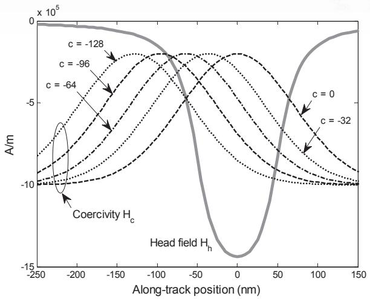  
图8.19 水平 HAMR 系统中激光器位于间隙中心左侧不同位置时的矫顽力 $H_c$

图8.19显示了激光器位于间隙中心左侧不同位置时的写磁头磁场 $H_h$ 和矫顽力 $H_c$。可以发现，$H_c$ 和 $H_h$ 曲线的交点（即 $H_c = H_h$）随激光器位置的不同而变化。反转位置 $x_0$ 发生在 $-x$ 轴方向上 $H_c = H_h$ 的位置（根据图8.4中写磁头和介质的运动特征）。由图可见，$H_c$ 和 $H_h$ 曲线的交点与图8.18（上）中磁道中心处发生的反转中心 $x_0$ 位置一致。

类似地，图8.20显示了激光器位于间隙中心右侧（$c=0$ nm）不同位置时，各子磁道中发生的反转中心 $x_0$ 和反转参数 a。可以发现，$x_0$ 出现在矫顽力梯度全部为负的区域。当激光器远离间隙中心时，$x_0$ 位置距峰值温度点更远（$x_0$ 位置移近间隙中心）。此外，距离间隙中心较远的位置（如 $c=128$ nm），反转的曲率很小（a 值的轮廓变化不大）。然而，由于 $x_0$ 被推至低温区域（c 值增大时），得到的反转参数增大，如图8.20（下）所示。

  
图8.20 水平 HAMR 系统中激光器位于间隙中心右侧不同位置时，各子磁道的反转中心 $x_0$ 和反转参数 a

图8.21显示了激光器位于间隙中心右侧不同位置时的写磁头磁场 $H_h$ 和矫顽力 $H_c$。反转位置 $x_0$ 发生在 $-x$ 轴方向上 $H_c \approx H_h$ 的位置（即 $H_c$ 和 $H_h$ 曲线的交点，对应矫顽力梯度为负的区域）。由图可见，$H_c$ 和 $H_h$ 曲线的交点与图8.20（下）中磁道中心处发生的反转中心 $x_0$ 位置一致。

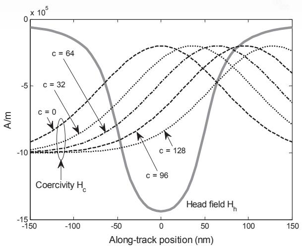  
图8.21 激光器位于间隙中心右侧不同位置时的矫顽力 $H_c$

衡量 HAMR 系统数据容量的另一个重要参数是 $\mathrm{PW}_{50}$，即读磁头测得的孤立反转响应的半高全宽。$\mathrm{PW}_{50}$ 值越小，意味着数据容量越大。因此，研究温度轮廓对 HAMR 系统中 $\mathrm{PW}_{50}$ 的影响非常重要。在实际中，读出信号的 $\mathrm{PW}_{50}$ 由各子磁道中发生的反转曲率（$x_0$ 位置）和反转参数 a 决定。因此，改变激光器位置会影响介质的矫顽力和温度轮廓，从而导致 $x_0$、a 以及 $\mathrm{PW}_{50}$ 发生相应变化。通常，$\mathrm{PW}_{50}$ 在 a 值较大且反转曲率较小时较大。图8.22显示了利用方程(8.52)计算得到的激光器位于不同位置时的读磁头孤立反转响应，其中 $x_i$ 为沿磁道方向的位置（图8.22中的 x 轴）。由图可见，在不同激光器位置测得的 $\mathrm{PW}_{50}$ 值各不相同。

  
图8.22 激光器位于不同位置时的读磁头孤立反转响应

介质的矫顽力和温度轮廓发生变化，导致 $x_0$ 和 a（以及 $\mathrm{PW}_{50}$）相应改变。通常，$\mathrm{PW}_{50}$ 在 a 值较大且反转曲率较小时较大。图8.22显示了利用方程(8.52)计算得到的激光器位于不同位置时的读磁头孤立反转响应，其中 $x_i$ 为沿磁道方向的位置（图8.22中的 x 轴）。由图可见，在不同激光器位置测得的 $\mathrm{PW}_{50}$ 值各不相同。

  
图8.23 水平 HAMR 系统中不同 $T_{\mathrm{peak}}$ 下各激光器位置的 $\mathrm{PW}_{50}$ 值

图8.23显示了不同 $T_{\mathrm{peak}}$ 下各激光器位置处的 $\mathrm{PW}_{50}$ 值。可以看出，当激光器位置靠近间隙中心时，$\mathrm{PW}_{50}$ 较小（此处 $\mathrm{PW}_{50}$ 最小值出现在间隙中心稍右侧）。如果将激光器向远离间隙中心的方向移动（两侧均如此），读出信号的宽度会增加。然而，尽管在 $c < -100$ nm 的激光器位置 $\mathrm{PW}_{50}$ 似乎有所下降，这一现象在使用高 $H_c$ 介质的 HAMR 系统中始终存在 [139]。在实际中，$\mathrm{PW}_{50}$ 与 a 值成正比，与反转曲率成反比。即，如果各子磁道的反转位置不在同一基准线上（产生曲率），则所有子磁道的总响应宽度将大于各子磁道反转位置共线的情况（这一现象在图8.18中清晰可见）。因此，实验结果表明激光器位置对系统性能影响较大。若能找到最佳激光器位置，则使用较高 $T_{\mathrm{peak}}$ 的 HAMR 系统可获得较小的 $\mathrm{PW}_{50}$ 值，从而提高系统数据容量。

此外，图8.24显示了系统使用三种不同间隙写磁头磁场 $H_0$ 时，读出信号的 $\mathrm{PW}_{50}$ 随 $T_{\mathrm{peak}}$ 的变化。通常，当 $T_{\mathrm{peak}}$ 升高时（介质 $H_c$ 降低），$\mathrm{PW}_{50}$ 减小。随后当 $T_{\mathrm{peak}}$ 达到一定高度时（此处 $T_{\mathrm{peak}} > 400 ^\circ \mathrm{C}$），$\mathrm{PW}_{50}$ 趋于稳定，这一现象在使用低 $H_c$ 介质时更为明显 [139]。从图中还可发现，在给定 $T_{\mathrm{peak}}$ 的情况下，使用高 $H_0$ 的系统可获得较小的 $\mathrm{PW}_{50}$。

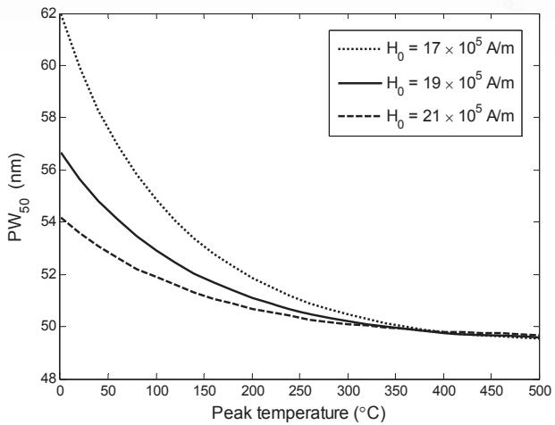  
图8.24 水平 HAMR 系统中不同 $T_{\mathrm{peak}}$ 下读出信号的 $\mathrm{PW}_{50}$ 值

使用高 $H_0$ 可获得 $\mathrm{PW}_{50}$ 较小的读出信号。同样地，在给定 $H_0$ 的情况下，可以找到使读出信号 $\mathrm{PW}_{50}$ 最小的最佳 $T_{\mathrm{peak}}$ 值。

## 参数调整的影响

本节将展示调整各参数——最高温度（$T_{\mathrm{peak}}$）、矫顽力（$H_c$）、写磁头间隙（g）、间隙写磁头磁场（$H_0$）以及飞行高度（d）——对水平 HAMR 系统中反转中心位置 $x_0$ 和反转参数 a 的影响，该分析使用最高温度 $T_{\mathrm{peak}} = 400 ^\circ \mathrm{C}$ 且 $c = 0$ nm。所使用的其他参数均为表8.1中列出的默认值。

图8.25显示了当最高温度 $T_{\mathrm{peak}}$ 分别为 320、360、400、440 和 480°C（分别表示为 –20%、–10%、0%、10% 和 20%）时，各子磁道中发生的 $x_0$ 和 a 值。其中，0% 表示默认值，A% 表示使用的 $T_{\mathrm{peak}}$ 与默认值（即 $400 ^\circ \mathrm{C}$）相差 A%。$x_0$ 为负值表示位于间隙中心左侧的位置。从图中可以看出，当 $T_{\mathrm{peak}}$ 增大时，$x_0$ 位置向远离间隙中心的方向移动，同时 a 值减小。此外，不同 $T_{\mathrm{peak}}$ 下 $x_0$ 和 a 的平均值（所有子磁道的平均值）列于表8.2。类似地，如果将参数 $H_c$、$\tilde{g}$、$H_0$ 和 d 调整为与默认值相差 ±20% 和 ±10%，也会导致 $x_0$ 和 a 发生相应变化。各参数调整情况下 $x_0$ 和 a 的平均值如表8.2所示。这些实验结果可作为选择适当参数以最大化系统性能的参考依据。

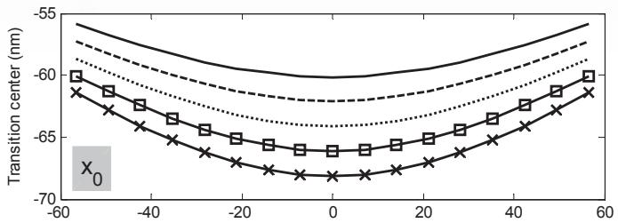

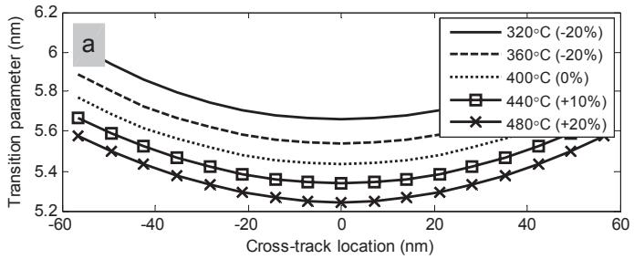  
图8.25 水平 HAMR 系统中不同最高温度下各子磁道的反转中心 $x_0$ 和反转参数 a [144]

表8.2 反转中心 $x_0$ 和反转参数 a 的平均值 [144]

<table><tr><td rowspan=2 colspan=1>参数</td><td rowspan=2 colspan=1>平均值</td><td rowspan=1 colspan=5>参数变化百分比</td></tr><tr><td rowspan=1 colspan=1>−20%</td><td rowspan=1 colspan=1>-10%</td><td rowspan=1 colspan=1>0%</td><td rowspan=1 colspan=1>+10%</td><td rowspan=1 colspan=1>+20%</td></tr><tr><td rowspan=2 colspan=1>最高温度 $\scriptstyle T _ { \mathrm { p e a k } }$ </td><td rowspan=1 colspan=1>x0[nm]</td><td rowspan=1 colspan=1>-58.46</td><td rowspan=1 colspan=1>-60.18</td><td rowspan=1 colspan=1>–61.92</td><td rowspan=1 colspan=1>–63.69</td><td rowspan=1 colspan=1>−65.49</td></tr><tr><td rowspan=1 colspan=1>a [nm]</td><td rowspan=1 colspan=1>5.79</td><td rowspan=1 colspan=1>5.67</td><td rowspan=1 colspan=1>5.56</td><td rowspan=1 colspan=1>5.46</td><td rowspan=1 colspan=1>5.37</td></tr><tr><td rowspan=2 colspan=1>矫顽力 $H _ { c }$ </td><td rowspan=1 colspan=1> $x _ { 0 }$ [nm]</td><td rowspan=1 colspan=1>–54.57</td><td rowspan=1 colspan=1>–58.13</td><td rowspan=1 colspan=1>–61.92</td><td rowspan=1 colspan=1>−66.06</td><td rowspan=1 colspan=1>-70.65</td></tr><tr><td rowspan=1 colspan=1>a [nm]</td><td rowspan=1 colspan=1>5.69</td><td rowspan=1 colspan=1>5.55</td><td rowspan=1 colspan=1>5.56</td><td rowspan=1 colspan=1>5.67</td><td rowspan=1 colspan=1>5.84</td></tr><tr><td rowspan=2 colspan=1>写磁头间隙 $\tilde { g }$ </td><td rowspan=1 colspan=1>x[nm]</td><td rowspan=1 colspan=1>–53.34</td><td rowspan=1 colspan=1>–57.67</td><td rowspan=1 colspan=1>–61.92</td><td rowspan=1 colspan=1>–66.13</td><td rowspan=1 colspan=1>-70.32</td></tr><tr><td rowspan=1 colspan=1>a [nm]</td><td rowspan=1 colspan=1>5.52</td><td rowspan=1 colspan=1>5.54</td><td rowspan=1 colspan=1>5.56</td><td rowspan=1 colspan=1>5.59</td><td rowspan=1 colspan=1>5.62</td></tr><tr><td rowspan=2 colspan=1>间隙写磁头磁场 $H _ { 0 }$ </td><td rowspan=1 colspan=1>x0 [nm]</td><td rowspan=1 colspan=1>–57.72</td><td rowspan=1 colspan=1>–59.83</td><td rowspan=1 colspan=1>–61.92</td><td rowspan=1 colspan=1>–64.01</td><td rowspan=1 colspan=1>–66.11</td></tr><tr><td rowspan=1 colspan=1>a [nm]</td><td rowspan=1 colspan=1>5.67</td><td rowspan=1 colspan=1>5.61</td><td rowspan=1 colspan=1>5.56</td><td rowspan=1 colspan=1>5.52</td><td rowspan=1 colspan=1>5.48</td></tr><tr><td rowspan=2 colspan=1>飞行高度 d</td><td rowspan=1 colspan=1> $x _ { 0 }$ [nm]</td><td rowspan=1 colspan=1>–64.39</td><td rowspan=1 colspan=1>–63.15</td><td rowspan=1 colspan=1>–61.92</td><td rowspan=1 colspan=1>–60.70</td><td rowspan=1 colspan=1>–59.51</td></tr><tr><td rowspan=1 colspan=1>a [nm]</td><td rowspan=1 colspan=1>5.46</td><td rowspan=1 colspan=1>5.51</td><td rowspan=1 colspan=1>5.56</td><td rowspan=1 colspan=1>5.61</td><td rowspan=1 colspan=1>5.67</td></tr></table>

表8.3 垂直 HAMR 系统分析使用的参数

<table><tr><td rowspan=1 colspan=1>参数</td><td rowspan=1 colspan=1>使用值</td><td rowspan=1 colspan=3></td><td rowspan=1 colspan=1>参数</td><td rowspan=1 colspan=1> $\dot { \bar { \boldsymbol { \rho } } } \dot { \boldsymbol { \eta } } \dot { \bar { \boldsymbol { \eta } } } \big \| \tilde { \boldsymbol { \beta } }$ </td></tr><tr><td rowspan=2 colspan=1> $H _ { c }$ [A/m]</td><td rowspan=2 colspan=1> $- 2 0 0 0 T ( x ) + 2 1 { \times } 1 0 ^ { 5 }$ </td><td rowspan=2 colspan=2></td><td rowspan=1 colspan=1></td><td rowspan=2 colspan=1></td><td rowspan=2 colspan=1> $T _ { \mathrm { p e a k } }$   $[ ^ { \circ } \mathrm { C } ]$ </td></tr><tr><td rowspan=1 colspan=2></td></tr><tr><td rowspan=2 colspan=1> $M _ { r }$ [A/m]</td><td rowspan=2 colspan=1> $- 1 2 0 0 T ( x ) + 1 2 { \times } 1 0 ^ { 5 }$ </td><td rowspan=2 colspan=2></td><td rowspan=1 colspan=1></td><td rowspan=2 colspan=1></td><td rowspan=2 colspan=1> $\sigma _ { t }$ [nm]</td></tr><tr><td rowspan=1 colspan=2></td></tr><tr><td rowspan=2 colspan=1> $S ^ { * }$ </td><td rowspan=2 colspan=1>0.7</td><td rowspan=2 colspan=2></td><td rowspan=1 colspan=1></td><td rowspan=2 colspan=1></td><td rowspan=2 colspan=1>磁道宽度 [nm]</td></tr><tr><td rowspan=1 colspan=3></td></tr><tr><td rowspan=2 colspan=1> $H _ { 0 }$ [nm]</td><td rowspan=2 colspan=1> $1 9 \times 1 0 ^ { 5 }$ </td><td rowspan=2 colspan=2></td><td rowspan=1 colspan=1></td><td rowspan=2 colspan=1></td><td rowspan=2 colspan=1>子磁道数 N</td></tr><tr><td rowspan=1 colspan=2></td></tr><tr><td rowspan=2 colspan=1>g[nm]</td><td rowspan=2 colspan=1>80</td><td rowspan=2 colspan=2></td><td rowspan=1 colspan=1></td><td rowspan=2 colspan=1></td><td rowspan=2 colspan=1> $C$ </td></tr><tr><td rowspan=1 colspan=1></td><td></td></tr><tr><td rowspan=2 colspan=1>y[nm]</td><td rowspan=2 colspan=1>16</td><td rowspan=2 colspan=2></td><td rowspan=1 colspan=1></td><td rowspan=2 colspan=1></td><td rowspan=2 colspan=1> $g _ { r }$ [nm]</td></tr></table>

## 8.7.2 垂直 HAMR 系统

本节将展示垂直 HAMR 系统的反转特性。系统分析使用的参数列于表8.3。

图8.26和图8.27分别显示了激光器位于间隙中心左侧和右侧不同位置时，各子磁道中发生的反转中心 $x_0$ 和反转参数 a。可以看出，$x_0$ 和 a 的变化特征与水平 HAMR 系统相似。然而，当激光器向间隙中心右侧移动更远时，a 值减小（这与图8.20中水平 HAMR 系统的情况相反）。这是因为方程(8.39)定义的写磁头磁场 $H_h$ 在磁极边缘区域的近似效果不佳。因此，当反转发生在该区域附近时，根据方程(8.39)使用的 $H_h$ 值导致写磁头磁场梯度非常大，从而使得到的反转参数减小 [133]。

图8.28显示了垂直 HAMR 系统中不同 $T_{\mathrm{peak}}$ 下各激光器位置处的 $\mathrm{PW}_{50}$ 值，其变化特征与图8.23中水平 HAMR 系统的 $\mathrm{PW}_{50}$ 相似。即，当激光器位于间隙中心右侧时，$\mathrm{PW}_{50}$ 最小。同样地，若系统使用最佳激光器位置，则采用较高 $T_{\mathrm{peak}}$ 的系统可获得 $\mathrm{PW}_{50}$ 较小的读出信号，从而提高系统数据容量。

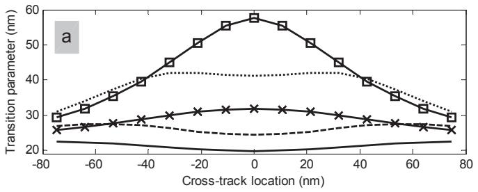  
图8.26 垂直 HAMR 系统中激光器位于间隙中心左侧不同位置时各子磁道的反转中心 x0 和反转参数 a

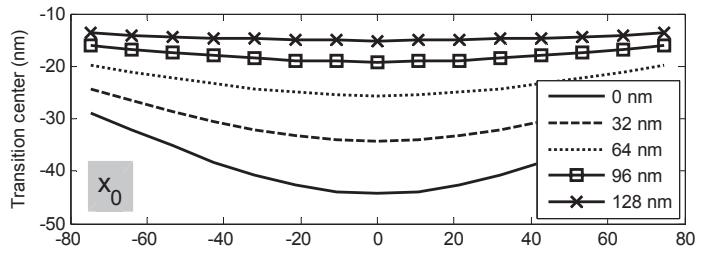

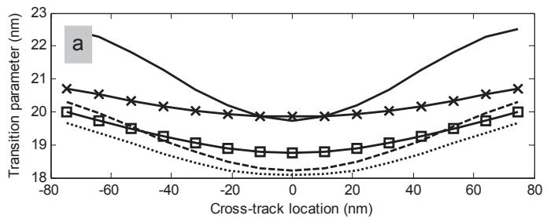  
图8.27 垂直 HAMR 系统中激光器位于间隙中心右侧不同位置时各子磁道的反转中心 x0 和反转参数 a

  
图8.28 垂直 HAMR 系统中不同 $T_{\mathrm{peak}}$ 下各激光器位置的 $\mathrm{PW}_{50}$ 值

## 8.7.3 使用热威廉姆斯-康斯托克模型的注意事项

使用热威廉姆斯-康斯托克模型中的方程(8.15)计算水平 HAMR 和垂直 HAMR 系统的反转参数 a，以及使用方程(8.33)计算反转中心 $x_0$ 时，应注意以下几点：

用于计算 a 和 $x_0$ 的各方程基于以下假设：写磁头和介质模型以及介质中的运动方向和磁化反转方向均符合图8.4所示，即：

介质相对于写磁头向左运动。因此，求得的 $x_0$ 值为负，表示 $x_0$ 位置位于写磁头间隙中心的左侧。

磁化状态从 $+M_r$ 变为 $-M_r$，这意味着反转是在负矫顽力（negative coercivity）作用下写成的。

因此，在使用各方程计算 a 和 $x_0$ 时，必须将磁化强度 $M_r$ 设为负值、矫顽力 $H_c$ 设为负值、矫顽力梯度 $dH_c/dT$ 设为正值。此外，对于水平 HAMR 系统，须将间隙写磁头磁场 $H_0$ 设为负值；对于垂直 HAMR 系统，须将 $H_0$ 设为正值。

## 8.8 本章小结

HAMR 技术可将数据容量提升至超过 1 $\mathrm{Tb}/\mathrm{in}^2$，并且有望在不久的将来实际应用于硬盘驱动器。本文利用方程(8.15)的热威廉姆斯-康斯托克模型和微磁道模型分析了 HAMR 系统，研究了反转特性（反转中心 $x_0$ 和反转参数 a）以及读磁头读出信号的 $\mathrm{PW}_{50}$ 值。通常，$\mathrm{PW}_{50}$ 越小，系统数据容量越大。因此，具有较小 $\mathrm{PW}_{50}$ 的 HAMR 系统是理想目标。然而，$x_0$、a 和 $\mathrm{PW}_{50}$ 取决于多种因素，包括激光器位置、使用的最高温度、写磁头和读磁头的特性以及介质的磁性能等。在实际中，$\mathrm{PW}_{50}$ 与 a 值成正比，与反转曲率成反比（由各子磁道的 $x_0$ 决定）。因此，研究 HAMR 系统的各种行为至关重要，以便为选择适合系统的参数提供参考，从而实现系统性能最大化。

本章重点关注 HAMR 系统的写入过程（write process），该过程导致读磁头获得的读出信号与常规磁记录系统（水平和垂直）的读出信号特征不同。然而，HAMR 系统中使用的读取过程和译码方式与常规磁记录系统相同，即可使用现有硬盘驱动器中采用的常规接收电路（或 PRML 检测电路）。

## 8.9 习题

1. 请解释 HAMR 技术的基本概念和工作原理。

2. 请解释并推导方程(8.8)中的威廉姆斯-康斯托克模型。

3. 请解释并推导方程(8.15)中的热威廉姆斯-康斯托克模型。

4. 请推导方程(8.29)。

5. 请推导方程(8.37)。

6. 请推导方程(8.47)。

7. 请解释微磁道模型的重要性。

8. 请使用 SCILAB 程序绘制图8.19和图8.21中的曲线。

