ซึ่งก็คือเกรเดียนต์สนามแม่เหล็กของหัวเขียน (head field gradient) เมื่อ

$$
Q = \frac { 2 x _ { 0 } H _ { 0 } } { \pi \tilde { g } \tilde { H } \left( T \left( x _ { 0 } \right) \right) } \mathrm { s i n } ^ { 2 } \left( \frac { \pi \tilde { H } \left( T \left( x _ { 0 } \right) \right) } { H _ { 0 } } \right)\tag{8.24}
$$

โดยที่ $\tilde { H } = H _ { c } - H _ { d }$ คือผลต่างระหว่างสภาพลบล้างแม่เหล็ก $H _ { c }$ และสนามลบล้างสภาพแม่เหล็ก $H _ { d }$ ณ ตำแหน่ง $x _ { 0 }$ ซึ่งมีอุณหภูมิ $T \left( x _ { 0 } \right) = T _ { 0 }$ โดยทั่วไปสนามลบล้างสภาพแม่เหล็กจะมีการเปลี่ยน สถานะแบบสมมาตร (symmetric transition) ซึ่งทำให้ $H _ { d } \approx 0$ ณ ตำแหน่ง $x _ { 0 }$ (ดูรูปที่ 8.8) และ ทำให้ $\tilde { H } = H _ { c }$ นอกจากนี้จากแบบจำลองในรูปที่ 8.4 ค่า $x _ { 0 }$ มีค่าเป็นลบเสมอ เพราะอยู่ทางด้าน ซ้ายของจุดกึ่งกลางช่องว่าง (แกน -x) จึงทำให้ค่า $Q$ ในสมการ (8.24) มีค่าลบเสมอ

## 8.4.4 การหาค่า $d H _ { d } /$ dx

เนื่องจากสนามลบล้างสภาพแม่เหล็กของการเปลี่ยนสถานะแบบขั้นบันได (step traทรtion) ณ จุดกำเนิดมีค่าเท่ากับ [130]

$$
H _ { x } ^ { \mathrm { s t e p } } \left( x \right) = \frac { 1 } { \pi } \tan ^ { - 1 } \left( \frac { \delta } { 2 x } \right)\tag{8.25}
$$

เมื่อ x คือตำแหน่งในแนวตามแทร็ก และ 8 คือความหนาของสื่อบันทึก ดังนั้นสนามลบล้างสภาพ แม่เหล็กของการเปลี่ยนสถานะใดๆ หาได้จาก

$$
H _ { d } \left( x \right) = - \frac { d M \left( x \right) } { d x } \ast H _ { x } ^ { \mathrm { s t e p } } \left( x \right)\tag{8.26}
$$

เมื่อ \* คือตัวดำเนินการคอนโวลูชัน (convolution operator) จากนั้นแทนค่าสมการ (8.18) และ (8.25) ลงในสมการ (8.26) ก็จะได้

$$
\begin{array} { l } { { \displaystyle { \cal H } _ { d } \left( x \right) = - \frac { 2 } { \pi ^ { 2 } } \displaystyle { \int _ { - \infty } ^ { + \infty } } \tan ^ { - 1 } \left( \frac { z - x _ { 0 } } { a } \right) \frac { d M \left( T \right) } { d T } \frac { d T \left( z \right) } { d z } \tan ^ { - 1 } \left( \frac { \delta } { 2 \left( x - z \right) } \right) d z } } \\ { { \displaystyle ~ - \frac { 2 } { \pi ^ { 2 } } \displaystyle { \int _ { - \infty } ^ { + \infty } } \frac { M _ { r } \left( z \right) a } { a ^ { 2 } + \left( z - x _ { 0 } \right) ^ { 2 } } \tan ^ { - 1 } \left( \frac { \delta } { 2 \left( x - z \right) } \right) d z } } \end{array}\tag{8.27}
$$

รูปที่ 8.8 แสดงผลกระทบของอุณหภูมิ $T _ { \mathrm { p e a k } }$ และการปรับแนว c ที่มีต่อสนามลบล้าง สภาพแม่เหล็ก $H _ { d }$ โดยอาศัยสมการ (8.27) เมื่อใช้พารามิเตอร์ต่างๆ เหมือนกับที่ใช้ในรูปที่ 8.5 และใช้ $\tilde { g } \ = \ 3 0 0$ nm และ $\delta = 1 6$ nm โดยเส้นปะ $( T _ { \mathrm { p e a k } } = 0 \ ^ { \circ } \mathrm { C }$ และ $c = 0 ~ \mathrm { n m } )$ แสดงสื่อ บันทึกที่มีอุณหภูมิ $0 ~ ^ { \circ } \mathbf C$ และจุดศูนย์กลางของโพรไฟล์อุณหภูมิอยูในแนวเดียวกันกับตำแหน่ง $x _ { 0 }$ ซึ่งในกรณีนี้การเปลี่ยนสถานะของสภาพความเป็นแม่เหล็กจะมีผลต่อสนามลบล้างสภาพแม่เหล็ก $H _ { d }$ เท่านั้น โดยที่ $H _ { d }$ จะมีลักษณะเป็นแบบปฏิสมมาตรรอบตำแหน่ง $x _ { 0 }$ และมีค่าประมาณเท่ากับ ศูนย์ที่ตำแหน่ง $x _ { 0 }$ จากนั้นเมื่อใช้เลเซอร์ที่มี $T _ { \mathrm { p e a k } } = 4 0 0 ~ ^ { \circ } \mathrm { C }$ เพื่อให้ความร้อนกับสื่อบันทึก (เส้น ขีดยาวที่มี $T _ { \mathrm { p e a k } } = 4 0 0 ~ ^ { \circ } \mathrm { C }$ และ $c = 0$ nm) ก็จะทำให้สภาพความเป็นแม่เหล็กลดลง ซึ่งส่งผล ทำให้ค่า $H _ { d }$ ลดลงตามไปด้วย แต่เนื่องจากจุดศูนย์กลางของโพรไฟล์อุณหภูมิอยู่ในแนวเดียวกัน กับตำแหน่ง $x _ { 0 }$ จึงทำให้การลดลงของค่า $H _ { d }$ เป็นแบบสมมาตรเช่นเดิม สุดท้ายเส้นทึบ $( T _ { \mathrm { p e a k } } =$ $4 0 0 ~ ^ { \circ } \mathrm { C }$ และ $c = 3 0 0$ nm) แสดงค่า $H _ { d }$ เมื่อจุดศูนย์กลางของโพรไฟล์อุณหภูมิถูกเลื่อนไปทาง ด้านขวาของตำแหน่ง $x = 0$ เป็นระยะทาง 300 ทm ซึ่งพบว่าการลดลงของค่า $H _ { d }$ จะไม่สมมาตร รอบตำแหน่ง $x _ { 0 }$ และเนื่องจากสื่อบันทึกทางด้านขวาของตำแหน่ง $x _ { 0 }$ มีความร้อนมากกว่าทาง ด้านซ้าย จึงทำให้สภาพความเป็นแม่เหล็กและ $H _ { d }$ ทางด้านขวาของตำแหน่ง $x _ { 0 }$ มีค่าน้อยกว่าทาง ด้านซ้าย (พิจารณาจากค่าสัมบรณ์ของ $H _ { d } )$ นอกจากนี้ในกรณีนี้ยังพบว่า $H _ { d } \neq 0$ ณตำแหน่ง $x _ { 0 }$ และจุดตัดค่าศูนย์จะเลื่อนไปจากตำแหน่ง $x _ { 0 }$ ทางด้านซ้ายเล็กน้อย

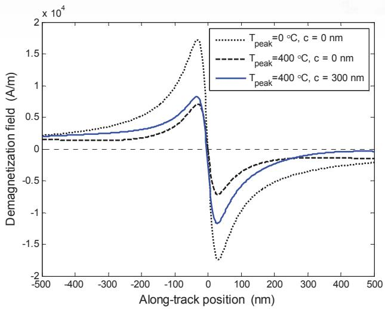  
รูปที่ 8.8 ผลกระทบของอุณหภูมิ $T _ { \mathrm { p e a k } }$ และการปรับแนว c ที่มีต่อสนามลบล้างสภาพแม่เหล็ก $H _ { d }$

โดยทั่วไปเกรเดียนต์สนามลบล้างสภาพแม่เหล็ก $d H _ { d } /$ dx หาได้จากการหาอนุพันธ์ของ สมการ (8.27) เทียบกับค่า x ซึ่งวิธีนี้อาจก่อให้เกิดปัญหาเรื่องภาวะเอกฐาน (singนlarity) ได้ [130] ดังนั้นในที่นี้จะใช้คุณสมบัติการหาอนุพันธ์ของคอนโวลูชัน นั่นคือ

$$
{ \frac { d } { d x } } { \Bigl [ } f { \bigl ( } x { \bigr ) } * g { \bigl ( } x { \bigr ) } { \Bigr ] } = { \frac { d f { \bigl ( } x { \bigr ) } } { d x } } * g { \bigl ( } x { \bigr ) } = f { \bigl ( } x { \bigr ) } * { \frac { d g { \bigl ( } x { \bigr ) } } { d x } }\tag{8.28}
$$

ในการหาเกรเดียนต์สนามลบล้างสภาพแม่เหล็ก ซึ่งให้ผลลัพธ์คือ

$$
\begin{array} { r l } & { \displaystyle \frac { d H _ { d } \big ( x \big ) } { d x } = - \frac { 4 } { \pi ^ { 2 } } \int _ { - \infty } ^ { + \infty } \frac { M \big ( z \big ) a \big ( z - x _ { 0 } \big ) } { \pi ^ { 2 } } \tan ^ { - 1 } \Biggl \lvert \frac { \delta } { 2 \big ( x - z \big ) } \Biggr \rvert d z } \\ & { \quad \quad \quad - \frac { 4 } { \pi _ { 8 } ^ { 2 } } \int _ { 5 } ^ { + \infty } \frac { a } { 1 5 \sqrt { 6 \pi } \mathrm { i } \mathrm { e } ^ { \mathrm { i } \phi _ { \mathrm { i b } } } \mathrm { i } \mathrm { e } ^ { \mathrm { i } \phi _ { a } } \big \rangle ^ { 2 } } \frac { d M \big ( T \big ) } { \pi ^ { 2 } } \frac { d T \big ( z \big ) } { d \mathrm { e } } \tan ^ { - 1 } \Biggl \lvert \frac { \delta } { 2 \big ( x - z \big ) } \Biggr \rvert d z } \\ & { \quad \quad \quad - \frac { 2 } { \pi ^ { 2 } } \int _ { - \infty } ^ { + \infty } \tan ^ { - 1 } \Biggl \lvert \frac { z - x _ { 0 } } { a } \Biggr \rvert \frac { d M \big ( T \big ) } { d T } \frac { d ^ { 2 } T \big ( z \big ) } { d z ^ { 2 } } \tan ^ { - 1 } \Biggl \lvert \frac { \delta } { 2 \big ( x - z \big ) } \Biggr \rvert d z } \end{array}\tag{8.29}
$$

รูปที่ 8.9 แสดงผลกระทบของอุณหภูมิ $T _ { \mathrm { p e a k } }$ และการปรับแนว c ที่มีต่อเกรเดียนต์สนามลบล้าง รส สภาพแม่เหล็กที่ได้จากสมการ (8.29) โดยใช้พารามิเตอร์ต่างๆ เหมือนกับที่ใช้ในรูปที่ 8.8 จากรูป พบว่าเมื่อสื่อบันทึกถูกทำให้ร้อน เกรเดียนต์สนามลบล้างสภาพแม่เหล็ก ณ ตำแหน่ง $x _ { 0 }$ จะมีค่า ลดลง (พิจารณาจากค่าสัมบูรณ์ของ $d H _ { d } / d x )$ นอกจากนีรูปที่ 8.10 แสดงเกรเดียนต์สนามลบล้าง สภาพแม่เหล็กของแต่ละพจน์ในสมการ (8.29) ณ ตำแหน่ง $x _ { 0 }$ สำหรับ $c = 0$ ซึ่งจากรูปพบว่า พจน์แรก ("First term")มีขนาดมากกว่าผลรวมของพจน์ที่สองและสาม ("Remaining terms") ค่อนข้างมาก

ดังนั้นสำหรับระบบ HAMR ที่มีจุดรับความร้อนขนาดใหญ่ (large spot size) ซึ่งมีผล ทำให้เกรเดียนต์เชิงความร้อน (dT/dx และ $d ^ { 2 } T / d x ^ { 2 } )$ มีขนาดเล็ก ก็จะทำให้พจน์แรกในสมการ (8.29) ที่มีค่ามาก (เมื่อเทียบกับพจน์ที่สองและสาม) ณ จุดศูนย์กลางการเปลี่ยนสถานะ $x = x _ { 0 }$ เพราะฉะนั้นในกรณีนี้สมการ (8.29) สามารถลดรูปได้เป็น [131]

$$
\left. \frac { d H _ { d } \left( x \right) } { d x } \right| _ { x _ { 0 } } = - \frac { M _ { r } \left( T _ { 0 } \right) \delta } { \pi a \left( a + \delta / 2 \right) }\tag{8.30}
$$

## 8.4.5 การหาค่า dH/ dT × dT/ dx

พจน์สุดท้ายในสมการ (8.15) คือผลกระทบของความร้อนที่มีต่อแบบจำลองวิลเลียม-คอมสต็อก ในสมการ (8.8) กล่าวคือค่าสภาพลบล้างแม่เหล็ก $H _ { c }$ ของสื่อบันทึกจะแปรผกผันกับอุณหภูมิ

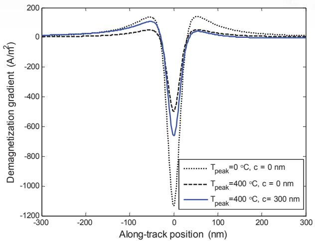  
รูปที่ 8.9 ผลกระทบของอุณหภูมิ $T _ { \mathrm { p e a k } }$ และการปรับแนว c ที่มีต่อเกรเดียนต์สนามลบล้างสภาพแม่เหล็ก

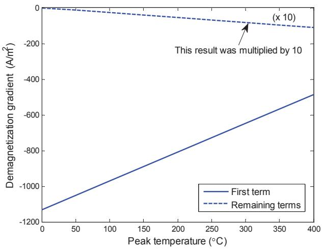  
รูปที่ 8.10 เกรเดียนต์สนามลบล้างสภาพแม่เหล็กของแต่ละพจน์ในสมการ (8.29) สำหรับ $c = 0$

T(x) (นั่นคือ $H _ { c }$ มีค่าลดลง เมื่ออุณหภูมิสูงขึ้น) ซึ่งเป็นฟังก์ชันของตำแหน่งที่ต้องการเขียนบิต ข้อมูลลงไปในสื่อบันทึก

ดังนั้นในการหาค่า $d H _ { c } / d T$ จำเป็นต้องทราบค่าสภาพลบล้างแม่เหล็กที่เป็นฟังก์ชันของ อุณหภูมิ $H _ { c } ( T )$ (นั่นคือสื่อบันทึกแต่ละประเภทจะมีค่า $H _ { c } ( T )$ มาให้) ในขณะที่การหาค่า dT/dx ทำได้โดยการหาอนุพันธ์ของสมการ (8.4) ณ จุดศูนย์กลางการเปลี่ยนสถานะ $x = x _ { 0 }$ ซึ่งจะได้

$$
\left. \frac { d T ( x ) } { d x } \right| _ { x _ { 0 } } = - \frac { ( x _ { 0 } - c ) } { \sigma ^ { 2 } } ( T _ { 0 } - 3 0 0 )\tag{8.31}
$$

เมื่อ $T _ { 0 } = T \bigl ( x _ { 0 } \bigr )$ คืออุณหฎูมิ ณ ตำแหน่ง $x _ { 0 }$

## 8.4.6 การหาจุดศูนย์กลางการเปลี่ยนสถานะ x0

เมื่อสือบันทึ่กมีอุณหฎูมิสูงขึ้น ค่าสภาพลบล้างแม่เหล็ก $H _ { c }$ และสนามลบล้างสภาพแม่เหล็ก $H _ { d }$ จะมีค่าลดลง [130] ดังนั้นตำแหน่งจุดศูนย์กลางการเปลี่ยนสถานะ $x _ { 0 }$ หาได้จากการแก้สมการ (8.6) เมื่อ $H _ { \mathrm { t o t } } = H _ { c }$ นั่นคือ

$$
H _ { c } \left( T \left( x _ { 0 } \right) \right) = H _ { h } \left( x _ { 0 } \right) + H _ { d } \left( T \left( x _ { 0 } \right) \right)\tag{8.32}
$$

ซึ่งก็คือตำแหน่งที่สภาพลบล้างแม่เหล็ก $H _ { c }$ ของสื่อบันทึ่กมีค่าเท่ากับผลรวมของสนามแม่เหล็ก ของหัวเขียน $H _ { a }$ และสนามลบล้างสภาพแม่เหล็ก $H _ { d }$ ณตำแหน่ง $x _ { 0 }$ เพราะจะทำให้สามารถเขียน บิตข้อมูลลงไปจัดเก็บในสื่อบันทึกได้อย่างมีเสถียรภาพ

สำหรับระบบ HAMR ที่มีจุดรับความร้อนขนาดใหญ่ ซึ่งมีผลให้เกรเดียนต์เชิงความร้อน มีขนาดเล็ก ก็จะทำให้ผลกระทบที่เกิดจากสนามลบล้างสภาพแม่เหล็ก $H _ { d }$ มีค่าน้อยมาก (ละทิ้งได้) [130] ตามที่แสดงในรูปที่ 8.11 ซึ่งแสดงผลกระทบของสนามลบล้างสภาพแม่เหล็กจากสมการ (8.27) ที่มีต่อการหาจุดศูนย์กลางการเปลี่ยนสถานะ $x _ { 0 }$ โดยใช้พารามิเตอร์ต่างๆ เหมือนกับที่ใช้ ในรูปที่ 8.8 และใช้ $H _ { c } ( x ) = - 5 0 0 T ( x ) + 4 4 0 0 0 0$ A/m และ $H _ { 0 } = 8 0 0$ kA/m จากรูปพบว่า ตำแหน่ง $x _ { 0 }$ ที่หาได้จากสมการ (8.32) เมื่อรวมและไม่รวมผลกระทบของ $H _ { d }$ จะแตกต่างกันน้อย มาก ณ ตำแหน่ง $x _ { 0 }$ (ไม่กี่นาโนเมตร) ถึงแม้ว่าระบบ HAMR จะทำงานที่อุณหภูมิสูง ดังนั้นใน กรณีนี้สมการ (8.32) สามารถลดรูปได้เป็น

$$
H _ { c } \left( T \left( x _ { 0 } \right) \right) \approx H _ { h } \left( x _ { 0 } \right)\tag{8.33}
$$

ซึ่งแก้สมการหาค่า $x _ { 0 }$ ได้ง่าย โดยใช้สนามแม่เหล็กของหัวเขียน $H _ { h }$ ในสมการ (8.21) และค่าสภาพ ลบลางแม่เหล็ก $H _ { c }$ ของสือบันทึกที่กำหนดมาให้ นอกจากนี้ก็สามารถใช้ $\tilde { H } = H _ { c }$ ในสมการ (8.23) และ (8.24) ซึ่งช่วยทำให้ง่ายต่อการแก้สมการ (8.15) เพื่อหาค่าพารามิเตอร์การเปลี่ยนสถานะ a อย่างไรก็ตามเมื่อใช้สมการ (8.33) หาค่า $x _ { 0 }$ บางครั้งอาจได้คำตอบเป็นค่า $x _ { 0 }$ มากกว่าหนึ่งค่าซึ่ง ในกรณีนี้จะสมมุติว่าการเปลี่ยนสถานะ (หรือบิตข้อมูล) ที่ถูกจัดเก็บในสื่อบันทึกจะอยู่ ณ ตำแหน่ง สุดท้ายทางด้านซ้ายสุดเท่านั้น (ตามแบบจำลองที่กำหนดในรูปที่ 8.4)

  
รูปที่ 8.11 ผลกระทบของสนามลบล้างสภาพแม่เหล็กที่มีต่อการหาตำแหน่ง $x _ { 0 }$

## 8.4.7 การหาพารามิเตอร์การเปลี่ยนสถานะ a

สำหรับระบบ HAMR ที่มีจุดรับความร้อนขนาดใหญ่ การหาพารามิเตอร์การเปลี่ยนสถานะ a ทำได้ โดยการแทนค่าสมการ (8.19), (8.20), (8.23) และ (8.30) ลงในสมการ (8.15) ก็จะได้

$$
{ \frac { 2 M _ { r } ( T _ { 0 } ) } { \pi a } } = | { \frac { M _ { r } ( T _ { 0 } ) } { H _ { c } ( T _ { 0 } ) ( 1 - S ^ { * } ( T _ { 0 } ) ) } } | \times [ - { \frac { Q H _ { c } ( T _ { 0 } ) } { y } } - { \frac { M _ { r } ( T _ { 0 } ) \delta } { \pi a ( a + \delta / 2 ) } } - { \frac { d H _ { c } } { d T } } { \frac { d T } { d x } } | _ { x _ { 0 } } ]\tag{8.34}
$$

หรือจัดรูปใหม่ได้เป็น

$$
\frac { 2 M _ { r } \left( T _ { 0 } \right) } { \pi a } = \left| \frac { M _ { r } \left( T _ { 0 } \right) } { H _ { c } \left( T _ { 0 } \right) \left( 1 - S ^ { * } \left( T _ { 0 } \right) \right) } \right| \times \left| \frac { \beta \left| H _ { c } \left( T _ { 0 } \right) \right| } { y } - \frac { M _ { r } \left( T _ { 0 } \right) \delta } { \pi a \left( a + \delta / 2 \right) } \right|\tag{8.35}
$$

เมื่อ

$$
\beta = - \frac { H _ { c } } { \left| H _ { c } \left( T _ { 0 } \right) \right| } Q - \frac { y } { \left| H _ { c } \left( T _ { 0 } \right) \right| } \frac { d H _ { c } } { d T } \frac { d T } { d x }\tag{8.36}
$$

ทำการแก้สมการ (8.35) เพื่อหาค่า a ก็ได้จะผลลัพธ์คือ

$$
\begin{array} { c } { { a = - \displaystyle \frac \delta 4 - \frac { y \left( 1 - S ^ { * } \left( T _ { 0 } \right) \right) } { \pi \beta } } } \\ { { + \sqrt { \left( - \frac \delta 4 - \frac { y \left( 1 - S ^ { * } \left( T _ { 0 } \right) \right) } { \pi \beta } \right) ^ { 2 } + \left( \frac { M _ { r } \left( T _ { 0 } \right) \delta y } { \pi \left| H _ { c } \left( T _ { 0 } \right) \right| \beta } - \frac { \delta y \left( 1 - S ^ { * } \left( T _ { 0 } \right) \right) } { \pi \beta } \right) } } } \end{array}\tag{8.37}
$$

หมายเหตุ สมการและคำตอบต่างๆ ที่อธิบายในหัวข้อที่ 8.4 นี้จะอยู่บนสมมุติฐานที่ว่าแบบจำลอง ของหัวเขียนและสื่อบันทึก รวมทั้งทิศทางการเปลี่ยนสภาพความเป็นแม่เหล็กในสื่อบันทึก เป็นไป ตามรูปที่ 8.4 กล่าวคือการเปลี่ยนแปลงสภาพความเป็นแม่เหล็กจะเปลี่ยนจาก $+ M _ { r }$ ไปเป็น $- M _ { r }$ ซึ่งหมายความว่าสภาพความเป็นแม่เหล็ก $M _ { r }$ ต้องมีค่าเป็นลบ และการเปลี่ยนสถานะจะถูกเขียน ต้านกับสภาพลบล้างแม่เหล็กแบบลบ (negative coercivity) ดังนั้นเมื่อ $H _ { c }$ มีค่าเป็นลบ การให้ ความร้อนเพื่อลดค่า $H _ { c }$ จะทำให้dH,/dT มีค่าเป็นบวก และเมื่อแทนค่า $H _ { c } / | H _ { c } | = - 1$ ลงใน สมการ (8.36) ก็จะได้

$$
\beta = Q - \frac { y } { \left| H _ { c } \left( T _ { 0 } \right) \right| } \frac { d H _ { c } } { d T } \frac { d T } { d x }\tag{8.38}
$$

## 8.5 ระบบ HAMR แบบแนวตัง

ขันตอนการวิเคราะห์ระบบ HAMR แบบแนวตัง (perpendicular HAMR system)จะคล้ายกับ ของระบบ HAMR แบบแนวนอนที่กล่าวมาในหัวข้อที่ 8.3.5 เพียงแต่สนามแม่เหล็กของหัวเขียน $H _ { a }$ และสนามลบล้างสภาพแม่เหล็ก $H _ { d }$ จะแตกต่างกันเท่านั้น

รูปที่ 8.12 (ก) แสดงหัวเขียน สื่อบันทึก และเส้นแรงแม่เหล็กของระบบการบันทึกแบบ แนวตั้ง โดยสื่อบันทึกที่ใช้จะมีชั้นพิเศษที่เรียกว่า SUL (soft magnetic underlayer) หรือ "keeper" เพิ่มขึ้นมาเพื่อช่วยให้สนามแม่เหล็กสามารถเดินทางจากโพลหนึ่งไปยังอีกโพลหนึ่งได้ ซึ่งมีผลทำให้ ทิศทางของสภาพความเป็นแม่เหล็กในสื่อบันทึกมีทิศทางในแนวตั้งฉากกับสื่อบันทึกได้ โดยการ ใช้แบบจำลองสมมูลของหัวอ่านและสื่อบันทึกในรูปที่ 8.12 (ข) ก็จะสามารถหาสนามแม่เหล็กของ หัวเขียนได้ [141] อย่างไรก็ตามจากรูปที่ 8.12 (ข) ภาพโพล (pole image) ของหัวเขียนจะแสดง อยู่ใด้สื่อบันทึกอย่างสมมาตรรอบแกน × ซึ่งเมื่อหมุนรูปที่ 8.12 (ข) ตามเข็มนาฬิกา 90 องศา ก็จะ ทำให้สนามแม่เหล็กมีลักษณะคล้ายกับแบบจำลองในรูปที่ 8.6 ของระบบการบันทึกแบบแนวนอน ดังนั้นจึงสามารถนำแนวคิดของ Karญvist [138] มาใช้ในการประมาณค่าสนามแม่เหล็กของหัวเขียน ของระบบการบันทึกแบบแนวตั้งได้ (เพียงแต่เปลี่ยนจุดพิกัดจาก x เป็น ๆ และจาก ญ เป็น x) ซึ่ง มีค่าเท่ากับ [139]

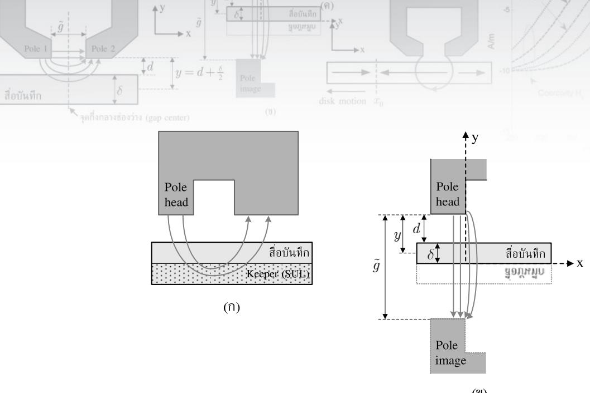  
รูปที่ 8.12 หัวเขียน สื่อบันทึก และเส้นแรงแม่เหล็ก ของระบบการบันทึกแบบแนวตั้ง

$$
H _ { h } \left( x \right) = H _ { y } \left( x , y \right) = \frac { H _ { 0 } } { \pi } \left[ \tan ^ { - 1 } \left( \frac { y + \tilde { g } / 2 } { x } \right) - \tan ^ { 1 } \left( \frac { y - \tilde { g } / 2 } { x } \right) \right]\tag{8.39}
$$

โดยที่ $\tilde { g }$ คือความกว้างของช่องว่างระหว่างโพลหัวเขียน (pole head) และภาพโพล, และ $H _ { 0 }$ คือ สนามแม่เหล็กของหัวเขียนที่อยูในช่องว่าง (gap filed) ถ้าให้ 8 คือความหนาของสื่อบันทึก และ d คือระยะบิน ก็จะได้ว่า $\tilde { g } = 2 d + 2 \delta$

ในทำนองเดียวกันแบบจำลองวิลเลียม-คอมสต็อกเชิงความร้อนจะพิจารณาเฉพาะสนาม แม่เหล็ก ณ จุดกึ่งกลางของความหนาของสื่อบันทึก นันคือ $y = d + \delta / 2$ ตามรูปที่ 8.12 (ข) และ ในกรณีนี้จะไม่พิจารณาสนามแม่เหล็กในแนวขนานกับสื่อบันทึกหรือ $H _ { x } ( x , y )$ ในทางปฏิบัติค่า ประมาณของสนามแม่เหล็กในสมการ (8.39) จะน่าเชื่อถือและถูกต้อง ก็ต่อเมื่อ $x > 0$ แต่เนืองจาก โดยทั่วไปตำแหน่งของการเปลี่ยนสถานะที่เกิดขึ้นในระบบ HAMR แบบแนวตั้งจะอยู่ห่างออกไป จากขอบของโพลหัวเขียนพอสมควร เพราะฉะนั้นจึงสามารถนำสมการ (8.39) มาใช้วิเคราะห์แบบ จำลองวิลเลียม-คอมสต็อกเชิงความร้อนในสมการ (8.15) ของระบบ HAMR แบบแนวตั้งได้อย่าง น่าเชื่อถือ [139] รูปที่ 8.13 แสดงสนามแม่เหล็กของหัวเขียนแบบ Karlฤvist ของระบบ HAMR แบบแนวตังตามสมการ (8.39) สำหรับ $H _ { 0 } = 8 0 0 ~ \mathrm { k A / m }$ $\tilde { g } = 3 0 0$ nm, y = 50 nm, และ x = 0 ซู คือจุดกึงกลางช่องว่าง 9

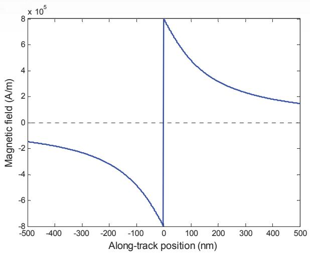  
รูปที่ 8.13 สนามแม่เหล็กของหัวเขียนแบบ Karlqvist ของระบบ HAMR แบบแนวตั้งตามสมการ (8.39)

นอกจากนี้เกรเดียนต์สนามแม่เหล็กของหัวเขียน ณ จุดศูนย์กลางการเปลี่ยนสถานะ x ซี $\mathbf { \mu } = \mathbf { \mu } x _ { 0 }$ หาได้จากการหาอนุพันธ์ของสมการ (8.39) ซึ่งมีค่าเท่ากับ

$$
{ \frac { d H _ { h } \left( x \right) } { d x } } \bigg \vert _ { x _ { 0 } } = { \frac { H _ { 0 } } { \pi } } \bigg \lbrack { \frac { A } { x ^ { 2 } + A ^ { 2 } } } - { \frac { B } { x ^ { 2 } + B ^ { 2 } } } \bigg \rbrack\tag{8.40}
$$

เมื่อ $A = y - \tilde { g } / 2$ และ $B = y + \tilde { g } / 2$

สำหรับสนามลบล้างสภาพแม่เหล็ก $H _ { d }$ สามารถหาได้จากสมการ (8.26) เพียงแต่ใช้สนาม ลบล้างสภาพแม่เหล็กของการเปลี่ยนสถานะแบบขั้นบันไดในแนวตั้งฉากกับสื่อบันทึก นั่นคือ

$$
H _ { d } \left( x \right) = - \frac { d M \left( x \right) } { d x } \ast H _ { y } ^ { \mathrm { s t e p } } \left( x \right)\tag{8.41}
$$

โดยที่ [139]

$$
H _ { y } ^ { \mathrm { s t e p } } \left( x \right) = \frac { 1 } { \pi } \tan ^ { - 1 } \left( \frac { 2 x } { \delta } \right)\tag{8.42}
$$

ในทำนองเดียวกันถ้าสมมุติว่าการเปลี่ยนสถานะของสภาพความเป็นแม่เหล็กมีลักษณะเป็นฟังก์ชัน อาร์กแทนเจนต์ตามสมการ (8.17) ดังนั้นให้แทนค่าสมการ (8.18) และ (8.42) ลงในสมการ (8.41) ก็จะได้สนามลบล้างสภาพแม่เหล็ก $H _ { d }$ มีค่าเท่ากับ

  
รูปที่ 8.14 ผลกระทบของอุณหภูมิ $T _ { \mathrm { p e a k } }$ และการปรับแนว c ที่มีต่อค่า $H _ { d }$ ในระบบ HAMR แบบแนวตั้ง

$$
\begin{array} { l } { { \displaystyle H _ { d } \left( x \right) = - \frac { 2 } { \pi ^ { 2 } } \int _ { - \infty } ^ { + \infty } { \tan ^ { - 1 } \left( \frac { z - x _ { 0 } } { a } \right) \frac { d M \left( T \right) } { d T } \frac { d T \left( z \right) } { d z } \tan ^ { - 1 } \left( \frac { 2 \left( x - z \right) } { \delta } \right) d z } } } \\ { { \displaystyle ~ - \frac { 2 } { \pi ^ { 2 } } \int _ { - \infty } ^ { + \infty } { \frac { M _ { r } \left( z \right) a } { a ^ { 2 } + \left( z - x _ { 0 } \right) ^ { 2 } } \tan ^ { - 1 } \left( \frac { 2 \left( x - z \right) } { \delta } \right) d z } } } \end{array}\tag{8.43}
$$

รูปที่ 8.14 แสดงผลกระทบของอุณหภูมิ $T _ { \mathrm { p e a k } }$ และการปรับแนว c ที่มีต่อสนามลบล้าง สภาพแม่เหล็ก $H _ { d }$ ของระบบ HAMR แบบแนวตั้งโดยอาศัยสมการ (8.43) และใช้พารามิเตอร์ต่างๆ เหมือนกับที่ใช้ในรูปที่ 8.8 จากรูปพบว่าเส้นปะ $( T _ { \mathrm { p e a k } } = 0 \ ^ { \circ } \mathrm { C }$ และ $c = 0$ nm)แสดงสื่อบันทึก ที่มีอุณหภูมิ $0 ~ ^ { \circ } \mathbf C$ และจุดศูนย์กลางของโพรไฟล์อุณหภูมิอยู่ในแนวเดียวกันกับตำแหน่ง $x _ { 0 }$ ซึ่ง ในกรณีนี้ $H _ { d }$ จะมีลักษณะเป็นแบบปฏิสมมาตรรอบตำแหน่ง $x _ { 0 }$ และมีค่าเท่ากับศูนย์ที่ตำแหน่ง $x _ { 0 }$ จากนั้นถ้าใช้เลเซอร์ที่มี เปุ่ส $T _ { \mathrm { p e a k } } = 4 0 0 ~ ^ { \circ } \mathrm { C }$ เพื่อให้ความร้อนกับสื่อบันทึก (เส้นขีดยาวที่มี $T _ { \mathrm { p e a k } }$ $= 4 0 0 ~ ^ { \circ } \mathrm { C }$ และ $c = 0$ nm) ก็จะทำให้สภาพความเป็นแม่เหล็กลดลง ซึ่งส่งผลให้ค่า $H _ { d }$ ลดลงตาม ไปด้วย และเนื่องจากจุดศูนย์กลางของโพรไฟล์อุณหภูมิอยูในแนวเดียวกันกับตำแหน่ง $x _ { 0 }$ จึงทำให้ การลดลงของค่า $H _ { d }$ เป็นแบบสมมาตรเช่นเดิม สุดท้ายเส้นทึบ $( T _ { \mathrm { p e a k } } = 4 0 0 \ { } ^ { \circ } { \bf C }$ และ $c = 3 0 0$ nm) แสดงค่า $H _ { d }$ เมื่อจุดศูนย์กลางของโพรไฟล์อุณหภูมิถูกเลื่อนไปทางด้านขวาของตำแหน่ง $x _ { 0 }$ เป็นระยะทาง 300 nm ซึ่งพบว่าการลดลงของค่า $H _ { d }$ จะไม่สมมาตรรอบตำแหน่ง $x _ { 0 }$ และเนื่องจาก สื่อบันทึกทางด้านขวาของตำแหน่ง $x _ { 0 }$ มีความร้อนมากกว่าทางด้านซ้าย จึงทำให้สภาพความเป็น แม่เหล็กและ $H _ { d }$ ทางด้านขวาของตำแหน่ง $x _ { 0 }$ มีค่าน้อยกว่าทางด้านซ้าย (พิจารณาจากค่าสัมบูรณ์ ของ $H _ { d } )$ นอกจากนียังพบว่า $H _ { d } \neq 0$ ณ ตำแหน่ง $x _ { 0 }$ และจุดตัดค่าศูนย์จะเลื่อนไปจากตำแหน่ง x0 ทางด้านขวาเล็กน้อย

สำหรับระบบ HAMR แบบแนวตั้งที่มีจุดรับความร้อนขนาดใหญ่พจน์แรกของสมการ (8.43) จะมีค่าน้อยมากเมื่อเทียบกับพจน์ที่สอง (ละทิ้งได้) ดังนั้นในกรณีนี้สมการ (8.43) สามารถ ลดรูปได้เป็น [139]

$$
H _ { d } \left( x \right) \approx - \frac { 2 M _ { r } \left( T \left( x \right) \right) } { \pi } \tan ^ { - 1 } \left( \frac { x - x _ { 0 } } { a + \delta / 2 } \right)\tag{8.44}
$$

นอกจากนี้ล้าไม่พิจารณาเกรเดียนต์เชิงความร้อนของสภาพแม่เหล็กตกค้าง (remaneทt magnetization) ก็จะได้ว่าเกรเดียนต์สนามลบล้างสภาพแม่เหล็ก ณ ตำแหน่ง x ใดๆ ในแนวตามแทร็กมีค่า เท่ากับ

$$
{ \frac { d H _ { d } \left( x \right) } { d x } } \approx - { \frac { 2 M _ { r } \left( T \left( x \right) \right) } { \pi } } \Biggl \{ { \frac { \left( a + \delta / 2 \right) } { \left( a + \delta / 2 \right) ^ { 2 } + \left( x - x _ { 0 } \right) ^ { 2 } } } \Biggr \}\tag{8.45}
$$

และ ณ ตำแหน่ง $x = x _ { 0 }$ จะมีค่าเท่ากับ

$$
\left. \frac { d H _ { d } \left( x \right) } { d x } \right| _ { x _ { 0 } } \approx - \frac { 2 M _ { r } \left( T \left( x _ { 0 } \right) \right) } { \pi \left( a + \delta / 2 \right) }\tag{8.46}
$$

รูปที่ 8.15 แสดงผลกระทบของอุณหภูมิ $T _ { \mathrm { p e a k } }$ และการปรับแนว c ที่มีต่อเกรเดียนต์สนามลบล้าง สภาพแม่เหล็กที่ได้จากสมการ (8.45) โดยใช้พารามิเตอร์ต่างๆ เหมือนกับที่ใช้ในรูปที่ 8.9 จากรูป พบว่าเมื่อสื่อบันทึกถูกทำให้ร้อน เกรเดียนต์สนามลบล้างสภาพแม่เหล็ก ณ ตำแหน่ง $x _ { 0 }$ จะมีค่า ลดลง

ในทำนองเดียวกันตำแหน่งจุดศูนย์กลางการเปลี่ยนสถานะ $x _ { 0 }$ ยังคงสามารถหาได้จากการ แก้สมการ (8.32) โดยสำหรับระบบ HAMR ที่มีจุดรับความร้อนขนาดใหญ่ ซึ่งมีผลให้เกรเดียนต์ เชิงความร้อนมีขนาดเล็ก ก็จะทำให้ผลกระทบที่เกิดจากสนามลบล้างสภาพแม่เหล็ก $H _ { d }$ มีค่าน้อย มาก (ละทิ้งได้) ตามที่แสดงในรูปที่ 8.16 ซึ่งแสดงผลกระทบของสนามลบล้างสภาพแม่เหล็กจาก สมการ (8.43) ที่มีต่อการหาค่า $x _ { 0 }$ โดยใช้พารามิเตอร์ต่างๆ เหมือนกับที่ใช้ในรูปที่ 8.11 ซึ่งจะพบว่า ตำแหน่ง $x _ { 0 }$ ที่หาได้จากสมการ (8.32) เมื่อรวมและไม่รวมผลกระทบของ $H _ { d }$ จะแตกต่างกันน้อย มาก ณ ตำแหน่ง $x _ { 0 }$ (ไม่กี่นาโนเมตร) ถึงแม้ว่าระบบ HAMR จะทำงานที่อุณหภูมิสูง ดังนั้นเพื่อให้ ง่ายต่อการวิเคราะห์ระบบ HAMR แบบแนวตั้ง ก็สามารถใช้สมการ (8.33) ในการหาค่า $x _ { 0 }$ โดย ใช้สนามแม่เหล็กของหัวเขียน $H _ { h }$ ในสมการ (8.39) และค่าสภาพลบล้างแม่เหล็ก $H _ { c }$ ของสื่อ บันทึกที่กำหนดมาให้

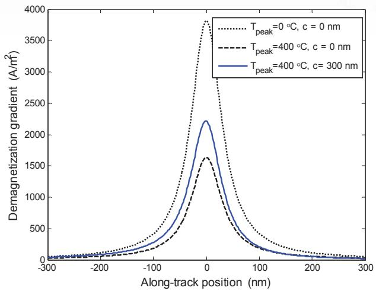  
$\mathfrak { J } \mathfrak { l } \dot { \mathfrak { n } }$ 8.15 ผลกระทบของอุณหภูมิ $T _ { \mathrm { p e a k } }$ และการปรับแนว c ที่มีต่อ $d H _ { d } / d x$ ในระบบ HAMR แบบแนวตั้ง

  
รูปที่ 8.16 ผลกระทบของสนามลบล้างสภาพแม่เหล็กที่มีต่อการหาตำแหน่ง $x _ { 0 }$ ในระบบ HAMR แบบแนวตั้ง

จากนั้นทำตามขั้นตอนต่างๆ ตามที่อธิบายในหัวข้อที่ 8.4 ก็จะสามารถหาค่าพารามิเตอร์ การเปลี่ยนสถานะ a สำหรับระบบ HAMR แบบแนวตั้งได้คือ [139]

$$
a = - \frac { \gamma } { 2 } + \frac { 1 } { 2 } \sqrt { \gamma ^ { 2 } + \frac { 4 H _ { c } \left( 1 - S ^ { * } \right) \delta } { \Delta \pi } }\tag{8.47}
$$

เมื่อ

$$
\Delta = \frac { d H _ { h } } { d x } - \frac { d H _ { c } } { d T } \frac { d T } { d x } \bigg | _ { x _ { 0 } } = \frac { H _ { 0 } \tilde { g } } { \pi \Big ( x _ { 0 } ^ { 2 } + \big ( \tilde { g } / 2 \big ) ^ { 2 } \Big ) } - \frac { d H _ { c } } { d T } \frac { d T } { d x } \bigg | _ { x _ { 0 } }\tag{8.48}
$$

$$
\gamma = \frac { 2 M _ { r } } { \Delta \pi } - \frac { \delta } { 2 } + \frac { 2 H _ { c } \left( 1 - S ^ { * } \right) } { \Delta \pi }\tag{8.49}
$$

หมายเหตุ โดยสรุปแล้วสมการความชันของวิลเลียม-คอมสต็อกเชิงความร้อนในสมการ (8.15) จะแตกต่างจากสมการความชันของแบบจำลองวิลเลียม-คอมสต็อกปกติในสมการ (8.8) ตรงที่ว่า 4ส มีพจน์ที่เกี่ยวข้องกับผลกระทบที่เกิดจากความร้อนเพิ่มเข้ามาก ซึ่งถ้าไม่พิจารณาผลกระทบที่เกิด จากความร้อนนี้ (นั่นคือ $d T / d x = 0 )$ แล้ว ก็จะทำให้ค่าสภาพความเป็นแม่เหล็กและสภาพลบล้าง แม่เหล็กที่ขึ้นกับอุณหภูมิมีค่าเป็นศูนย์เช่นกัน (นั่นคือ dM/ $d T = d H _ { c } / d T = 0 )$ และเมื่อแทน ค่าเหล่านี้เข้าไปในสมการความชันของวิลเลียม-คอมสต็อกเชิงความร้อน ก็จะได้ผลลัพธ์เป็นสมการ ความชันของแบบจำลองวิลเลียม-คอมสต็อกปกติในสมการ (8.8) เหมือนเดิม

## 8.6 แบบจำลองไมโครแทร็ก

แบบจำลองวิลเลียม-คอมสต็อกเชิงความร้อนในสมการ (8.15) ถือว่าเป็นแบบจำลองหนึ่งมิติ เพราะ ไม่พิจารณาผลกระทบที่เกิดจากการแปรผันในแนวขวางแทร็ก (croรs-track variation) ของการ เปลี่ยนสถานะ ถึงแม้ว่าแบบจำลองนี้จะยังคงใช้งานได้ดีในการหาลักษณะเฉพาะของการเปลี่ยน สถานะในระบบการบันทึกเชิงแม่เหล็กแบบที่ใช้กันทั่วไป (เมื่อโพลหัวเขียนมีความกว้างค่อนข้างมาก) แต่ไม่สามารถนำมาใช้กับระบบ HAMR ได้ โดยเฉพาะเมื่อสื่อบันทึกถูกทำให้ร้อนด้วยเลเซอร์

ในทางปฏิบัติกระบวนการให้ความร้อนและสภาพความเป็นแม่เหล็กของสื่อบันทึกจะมี ลักษณะเป็นแบบสองมิติ เพราะโพรไฟล์อุณหภูมิมีการกระจายแบบเกาส์เซียนตามสมการ (8.2) ซึ่งมีผลให้การเปลี่ยนสถานะมีการแปรผันทั้งในแนวตามแทร็กและในแนวขวางแทร็ก ดังนั้นการ จัดการปัญหานี้ทำได้โดยการใช้ "แบบจำลองไมโครแทร็ก (microtrack model)" [142, 143] เพื่อ หาค่าประมาณของความโด้งของการเปลี่ยนสถานะ (traทรitioก cนrvatนre) โดยจะแบ่งแทร็กข้อมูล หนึ่งแทร็กออกเป็น N แทร็กย่อย (sub-track) ที่มีความกว้าง $\Delta z$ เท่ากัน ตามที่แสดงในรูปที่ 8.17 ถ้ากำหนดให้ $ { T } ( x , z )$ คือโพรไฟล์อุณหภูมิที่เกิดจากการให้ความร้อนกับสื่อบันทึก เมื่อ x คือทิศทาง ในแนวตามแทร็ก และ z คือทิศทางในแนวขวางแทร็ก ดังนั้นโพรไฟล์อุณหภูมิในแต่ละแทร็กย่อย จะถูกประมาณว่าเป็นฟังก์ชันหนึงมิติ $T ( x , z = i \Delta z )$ สำหรับ $- N / 2 \le i \le N / 2$ (แทร็กย่อยยิ่งมี จำนวนมาก ก็จะทำให้การประมาณนี้ถูกต้องมากยิ่งขึ้น) จากนั้นก็ใช้แบบจำลองวิลเลียม-คอมสต็อก เชิงความร้อนเข้าไปในแต่ละแทร็กย่อยอย่างอิสระ เพื่อหาค่าจุดศูนย์กลางการเปลี่ยนสถานะและ พารามิเตอร์การเปลี่ยนสถานะของแต่ละแทร็กย่อย

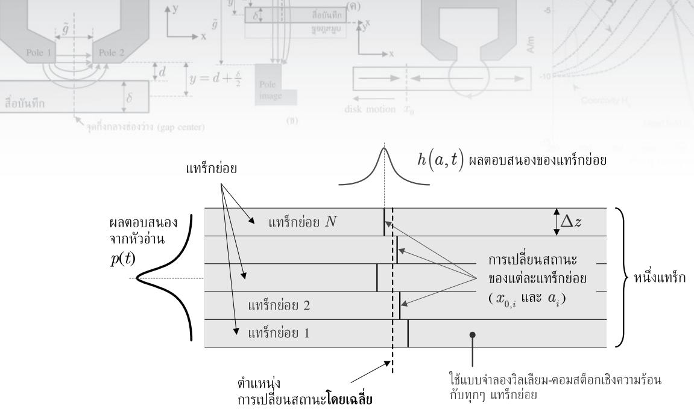  
รูปที่ 8.17 แบบจำลองไมโครแทร็กของช่องสัญญาณแบบ HAMR

นอกจากนีถ้าให้ผลตอบสนองของหัวอ่านของแต่ละแทร็กย่อยมีค่าเท่ากับ $h \left( \boldsymbol { a } _ { i } , t - \boldsymbol { \tau } _ { i } \right)$ ซึ่งขึนอยู่กับพารามิเตอร์การเปลี่ยนสถานะ $a _ { i }$ และตำแหน่งสัมพัทธ์ของจุดศูนย์กลางการเปลี่ยน สถานะ $v \left( t - \tau _ { i } \right)$ ของแต่ละแทร็กย่อย เมือ สู $x _ { 0 , i } = \tau _ { i } v$ คือจุดศูนย์กลางการเปลียนสถานะของ แทร็กย่อยที่ และ ข คือความเร็วในการเคลื่อนที่ของสื่อบันทึก เพราะฉะนั้นผลตอบสนองรวม ของสัญญาณพัลส์ที่ได้จากหัวอ่าน $p \big ( t \big )$ มีค่าเท่ากับ [142]

$$
p \left( t \right) = \frac { 1 } { N } \sum _ { i = 1 } ^ { N } h \left( a _ { i } , t - \tau _ { i } \right)\tag{8.50}
$$

โดยในที่นี้จะสมมุติว่า $h \big ( a , t \big )$ มีค่าเท่ากับการประมาณค่าอันดับที่หนึ่ง (first-order approxima  
tion) ของผลตอบสนองของหัวอ่านแบบ GMR (giant magneto-resistive) ที่มีต่อการเปลี่ยน 659 e   
สถานะแบบอาร์กแทนเจนต์ร9 นันคือ [43, 143]

$$
h \big ( a , t \big ) = C M _ { r } \delta \left( \tan ^ { - 1 } \left( \frac { v t + \big ( g _ { r } / 2 \big ) } { a + d } \right) - \tan ^ { - 1 } \left( \frac { v t - \big ( g _ { r } / 2 \big ) } { a + d } \right) \right)\tag{8.51}
$$

โดยที่ $g _ { r }$ และ $d$ คือระยะทางระหว่างฉนวนถึงฉนวน (shield-to-shield spacing) และระยะทาง ระหว่างฉนวนถึงสื่อบันทึก (shield-to-medium spacing) ของหัวอ่าน ตามลำดับ, และ $C$ คือค่า คงตัว60ที่ใช้อธิบายคุณลักษณะทางกายภาพของหัวอ่านแบบ GMR [43]

-ซ แบบจำลองวิลเลียม-คอมสต็อกถือเป็นแบบจำลองหนึ่งมิติ เพราะอยู่บนสมมุติฐานที่ว่า ผลตอบสนองของหัวอ่านเป็นแบบเอกรูป (นทifoท) ในแนวขวางแทร็ก อย่างไรก็ตามในทางปฏิบัติ ผลตอบสนองของหัวอ่านจะมีลักษณะการกระจายแบบเกาส์เซียน [142] เพราะฉะนันผลตอบสนอง สัมพัทธ์ของแต่ละแทร็กย่อยจะต้องถูกถ่วงน้ำหนักด้วยฟังก์ชันความไวของหัวอ่านในแนวขวางแทร็ก (cross-track reader sensitivity function) ซึงถูกประมาณให้มีลักษณะการกระจายแบบเกาส์เซียน ที่มีค่าเบี่ยงเบนมาตรฐาน $\mathbf { \sigma } _ { \mathbf { { C } } } = \mathbf { \sigma } _ { \mathbf { { C } } _ { r } }$ และความกว้างของแต่ละแทร็กย่อยคือ $\Delta z$ ดังนั้นผลตอบสนอง รวม $p ( t )$ ในสมการ (8.50) จะเขียนใหม่ได้เป็น

$$
p \left( t \right) = \frac { C M _ { r } \delta } { N } \sum _ { i = 1 } ^ { N } \left[ \exp \left( - \left\{ \frac { \left( i \Delta z - \left( \frac { N + 1 } { 2 } \right) \Delta z \right) ^ { 2 } } { 2 \sigma _ { r } ^ { 2 } } \right\} \right) \left( \tan ^ { - 1 } \left( \frac { x _ { i } + \frac { g _ { r } } { 2 } } { a _ { i } + d } \right) - \tan ^ { - 1 } \left( \frac { x _ { i } - \frac { g _ { r } } { 2 } } { a _ { i } + d } \right) \right) \right] ^ { - 1 } ,\tag{8.52}
$$

เมื่อ $x _ { i } = v \big ( t - \tau _ { i } \big )$ คือระยะทางสัมพัทธ์ของจุดศูนย์กลางการเปลี่ยนสถานะ โดยที่พจน์ที่อยูในวงเล็บ คือผลตอบสนองของแต่ละแทร็กย่อย และตัวคูณเลขชี้กำลัง eะp() ก็คือฟังก์ชันการถ่วงน้ำหนัก แบบเกาส์เซียนซึ่งมีค่าเท่ากับหนึ่งเมื่อหัวอ่านอยู่ตรงกลางของแทร็ก และมีค่าเข้าใกล้ศูนย์เมื่อหัวอ่าน เข้าใกล้ขอบของแทร็ก

## 8.7 ลักษณะเฉพาะของระบบ HAMR

การออกแบบระบบ HAMR ให้มีสมรรถนะสูงสุดจะต้องพิจารณาจากปัจจัยหลายๆ ด้าน กล่าวคือ สมรรถนะของระบบจะขึ้นอยู่กับคุณสมบัติของสารแม่เหล็กที่ใช้ทำสื่อบันทึก (เช่น สภาพลบล้าง แม่เหล็ก $H _ { c }$ และสภาพแม่เหล็กตกค้าง $M _ { r } )$ ,การแปรผันของอุณหฎูมิ, โพรไฟล์อุณหฎูมิ (เช่น อุณหฎูมิสูงสุดและค่า FพนM), และตำแหน่งที่มีอุณหภูมิสูงสุด เป็นต้น นอกจากนี้การเลือก ตำแหน่งของเลเซอร์ที่ประกอบเข้ากับหัวเขียนก็เป็นสิ่งสำคัญเพื่อให้ระบบมีสมรรถนะสูงสุด

ตารางที่ 8.1 ค่าพารามิเตอร์ต่างๆ ที่ใช้ในการวิเคราะห์ระบบ HAMR แบบแนวนอน
<table><tr><td rowspan=1 colspan=1>พารามิเตอร์</td><td rowspan=1 colspan=1>ค่าที่ใช้</td><td rowspan=1 colspan=3></td><td rowspan=1 colspan=1>พารามิเตอร์</td><td rowspan=1 colspan=1>ค่าที่ใช้</td></tr><tr><td rowspan=2 colspan=1>H [A/m]</td><td rowspan=2 colspan=1> $- 2 0 0 0 T ( x ) + 1 6 { \times } 1 0 ^ { 5 }$ </td><td rowspan=2 colspan=2></td><td rowspan=1 colspan=1></td><td rowspan=2 colspan=1></td><td rowspan=2 colspan=1> $T _ { \mathrm { p e a k } }$ [°C]</td></tr><tr><td rowspan=1 colspan=2></td></tr><tr><td rowspan=2 colspan=1>M, [A/m]</td><td rowspan=2 colspan=1> $- 1 2 0 0 T ( x ) + 1 2 { \times } 1 0 ^ { 5 }$ </td><td rowspan=2 colspan=2></td><td rowspan=1 colspan=1></td><td rowspan=2 colspan=1></td><td rowspan=2 colspan=1> $\sigma _ { t }$ [nm]</td></tr><tr><td rowspan=1 colspan=2></td></tr><tr><td rowspan=2 colspan=1>s*</td><td rowspan=2 colspan=1>0.7</td><td rowspan=2 colspan=2></td><td rowspan=1 colspan=1></td><td rowspan=2 colspan=1></td><td rowspan=2 colspan=1>ความกว้างของแทร็ก [nm]</td></tr><tr><td rowspan=1 colspan=2></td></tr><tr><td rowspan=1 colspan=1> $H _ { 0 }$ [nm]</td><td rowspan=1 colspan=1> $1 9 \times 1 0 ^ { 5 }$ </td><td rowspan=1 colspan=2></td><td rowspan=1 colspan=1></td><td rowspan=1 colspan=1></td><td rowspan=1 colspan=1>จำนวนแทร็กย่อย N</td></tr><tr><td rowspan=1 colspan=1>g[nm]</td><td rowspan=1 colspan=1>100</td><td rowspan=1 colspan=2></td><td rowspan=1 colspan=1></td><td rowspan=1 colspan=1></td><td rowspan=1 colspan=1>C</td></tr><tr><td rowspan=3 colspan=1>d [nm]</td><td rowspan=3 colspan=1>19</td><td rowspan=3 colspan=2></td><td></td><td></td><td></td></tr><tr><td rowspan=2 colspan=2></td><td></td><td></td></tr><tr><td rowspan=1 colspan=1></td><td rowspan=1 colspan=1>gr [nm]</td><td rowspan=1 colspan=1>5</td></tr><tr><td rowspan=1 colspan=1>δ [nm]</td><td rowspan=1 colspan=1>2</td><td rowspan=1 colspan=3></td><td rowspan=1 colspan=1> $\mathbb { \sigma } _ { r }$ [nm]</td><td rowspan=1 colspan=1>1000</td></tr></table>

ในหัวข้อนี้จะแสดงลักษณะเฉพาะของระบบ HAMR ทั้งแบบแนวนอนและแบบแนวตั้ง โดยอาศัยแบบจำลองวิลเลียม-คอมสต็อกเชิงความร้อนและแบบจำลองไมโครแทร็ก ในการศึกษาหา ค่าจุดศูนย์กลางการเปลี่ยนสถานะ x0 และพารามิเตอร์การเปลี่ยนสถานะ a ที่เกิดขึ้นในสื่อบันทึก โดยจะสมมุติว่าเลเซอร์ที่ใช้ติดตั้งอยู่ณ จุดกึ่งกลางแทร็กตามแนวขวางแทร็กเสมอ

## 8.7.1 ระบบ HAMR แบบแนวนอน

ตารางที่ 8.1 แสดงค่าพารามิเตอร์ต่างๆ ที่ใช้ในการวิเคราะห์ระบบ HAMR แบบแนวนอน โดยทั่วไป สัญญาณอ่านกลับจะขึ้นอยู่กับค่าอุณหภูมิสูงสุดและตำแหน่งของเลเซอร์ (หรือตำแหน่งของอุณหภูมิ สูงสุด) เมื่อเทียบกับจุดกึงกลางช่องว่าง (gap center) ของหัวเขียน (ดูรูปที่ 8.6) ในทางปฏิบัติ เลเซอร์สามารถถูกติดตั้งได้ทั้งในทิศทางการเคลื่อนที่ของสื่อบันทึก (ด้านแกน -X) ตามรูปที่ 8.4 หรือในทิศทางตรงข้าม (ด้านแกน +x) ซึ่งจะมีผลกระทบต่อสัญญาณอ่านกลับต่างกัน

รูปที่ 8.18 แสดงจุดศูนย์กลางการเปลี่ยนสถานะ x0 และพารามิเตอร์การเปลี่ยนสถานะ a ที่เกิดขึ้นในแต่ละแทร็กย่อย ณ ตำแหน่งต่างๆ ของเลเซอร์ไปทางด้านซ้ายของจุดกึงกลางช่องว่าง (c = 0 nm) ซึ่งจะพบว่าการเปลี่ยนสถานะที่เกิดขึ้นในแต่ละแทร็กย่อยมีตำแหน่งที่ต่างกัน (ไม่เป็น แนวเดียวกัน จึงทำให้ดูเหมือนเส้นโค้ง) เนื่องจากโพรไฟล์อุณหภูมิมีการกระจายแบบเกาส์เซียนทั้ง ในแนวตามแทร็กและในแนวขวางแทร็ก โดยมีอุณหภูมิสูงสุด ณ จุดกึงกลางแทร็ก และมีอุณหภูมิ ตำสุด ณ ขอบของแทร็ก และเนืองจากสภาพลบล้างแม่เหล็กแปรผกผันกับอุณหฎูมิแบบเชิงเส้น จึงทำให้ตำแหน่งที่เกิดการเปลี่ยนสถานะแตกต่างกันในแต่ละแทร็กย่อย ทำให้เกิดเป็น "ความโค้ง ของการเปลี่ยนสถานะ (tranรitioก curvature)" ในแนวขวางแทร็ก

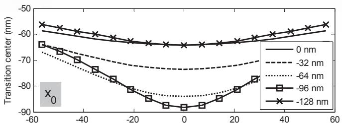

  
รูปที่ 8.18 จุดศูนย์กลางการเปลี่ยนสถานะ $x _ { 0 }$ และพารามิเตอร์การเปลี่ยนสถานะ a ที่เกิดขึ้นในแต่ละแทร็ก ย่อย ณ ตำแหน่งต่างๆ ของเลเชอร์ไปทางด้านซ้ายของจุดกึงกลางช่องว่างของระบบ HAMR แบบแนวนอน

จากรูปที่ 8.18 (บน) พบว่าเมื่อเลเซอร์เคลื่อนที่ห่างออกไปจากจุดกึ่งกลางช่องว่าง (ค่า C ลดลง) ก็ทำให้ตำแหน่ง $x _ { 0 }$ เริ่มเคลื่อนที่ห่างออกไปจากจุดกึ่งกลางช่องว่างเรื่อยๆ จนกระทั่งมาถึง บริเวณที่มีเกรเดียนต์สภาพลบล้างแม่เหล็กเป็นบวก (ดูรูปที่ 8.19) ซึ่งถ้าเลื่อนตำแหน่งของเลเซอร์ ให้ห่างออกไปจากจุดกึ่งกลางช่องว่างมากขึ้นอีก ก็จะทำให้ตำแหน่ง $x _ { 0 }$ เคลื่อนที่กลับเข้าหาจุดถึ่ง กลางช่องว่าง นอกจากนี้ยังสังเกตพบว่าเมื่อตำแหน่ง $x _ { 0 }$ เคลื่อนที่ห่างออกไปจากจุดกึงกลางช่องว่าง มากขึ้น ก็จะทำให้การเปลี่ยนสถานะมีลักษณะโด้งมากขึ้นตามไปด้วย ทั้งนี้เป็นเพราะว่าตำแหน่ง $x _ { 0 }$ อยูใกล้กับจุดที่มีอุณหภูมิสูงสุด ซึ่งเป็นบริเวณที่การแปรผันของเกรเดียนต์เชิงความร้อนในแนว ขวางแทร็กมีค่าสูงสุด ตัวอย่างเช่น การเปลี่ยนสถานะในรูปที่ 8.18 มีลักษณะเป็นเส้นโค้งมากสุด เมื่อเลเซอร์อยู่ณ ตำแหน่ง $c = - 9 6$ nm (ในกรณีนี้ตำแหน่ง $x _ { 0 } \approx - 9 0$ nm ซึ่งใกล้เคียงกับค่า c) นอกจากนีรูปที่ 8.18 (ล่าง) ยังแสดงโพรไฟล์ของพารามิเตอร์การเปลี่ยนสถานะ a ของ แต่ละแทร็กย่อยในแนวขวางแทร็ก ซึ่งพบว่าค่า a จะมีค่าเพิ่มขึ้นเรื่อยๆ เมื่อเลเซอร์เคลื่อนที่ห่าง ออกไปจากจุดกึงกลางช่องว่างจนถึงบริเวณที่มีสนามแม่เหล็กของหัวเขียน $H _ { h }$ น้อย ตัวอย่างเช่น ค่า a มีการเพิ่มขึนอย่างรวดเร็วสำหรับ $c = - 9 6$ nm เพราะระบบมีค่า $H _ { d }$ น้อยและมีค่าเกรเดียนต์ สภาพลบล้างแม่เหล็กประมาณสศูนย์ (ดูรูปที่ 8.19) โดยที่ในกรณีนี้ค่า a จะมีค่าสูงสุดที่จุดกึ่งกลาง แทร็กและมีค่าน้อยสุดทีขอบของแทร็ก ถ้าตำแหน่งการเปลียนสถานะ $x _ { 0 }$ เกิดขึนเมือเกรเดียนต์ ซู สนามแม่เหล็กของหัวเขียนและเกรเดียนต์สภาพลบล้างแม่เหล็กมีค่าเป็นบวก ดังนันการเพิ่มขึนของ

  
รูปที่ 8.19 ค่าสภาพลบล้างแม่เหล็ก $H _ { c }$ ณ ตำแหน่งต่างๆ ของเลเชอร์ไปทางด้านซ้ายของจุดกึงกลางช่องว่าง ของระบบ HAMR แบบแนวนอน

เกรเดียนต์สภาพลบล้างแม่เหล็กจะส่งผลให้พารามิเตอร์การเปลี่ยนสถานะ a มีค่าเพิ่มขึนด้วย และ เนื่องจากเกรเดียนต์สภาพลบล้างแม่เหล็กมีค่าลดลงจนถึงขอบของแทร็ก จึงทำให้ค่า a ที่จุดกึ่งกลาง แทร็กมีการเพิ่มขึ้นอย่างรวดเร็วมากกว่าค่า a ที่ขอบของแทร็ก นอกจากนี้เมื่อ $c = - 1 2 8$ nm ก็จะ ได้ว่าโพรไฟล์ของค่า $a$ ยังคงมีลักษณะเช่นเดิม นั้นคือค่า a ที่จุดกึ่งกลางแทร็กมีค่ามากกว่าที่ขอบ ของแทร็ก

รูปที่ 8.19 แสดงค่าสนามแม่เหล็กของหัวเขียน $H _ { h }$ และค่าสภาพลบล้างแม่เหล็ก $H _ { c }$ ณ ตำแหน่งต่างๆ ของเลเซอร์ไปทางด้านซ้ายของจุดกึงกลางช่องว่าง โดยจะพบว่าจุดตัดของเส้นกราฟ ระหว่าง $H _ { c }$ และ $H _ { h }$ (นั่นคือเมื่อ $H _ { c } = H _ { h } )$ จะแตกต่างกันในแต่ละตำแหน่งของเลเซอร์ โดยที ตำแหน่งการเปลี่ยนสถานะ $x _ { 0 }$ จะเกิดขึ้นเมื่อ $H _ { c } = H _ { h }$ ทางด้านแกน $- \mathbf { X }$ (ตามลักษณะการเคลื่อนที่ ของหัวเขียนและสื่อบันทึกในรูปที่ 8.4) จากรูปจะพบว่าจุดตัดของเส้นกราฟ $H _ { c }$ และ $H _ { h }$ สอดคล้อง กับตำแหน่งจุดศูนย์กลางการเปลี่ยนสถานะ $x _ { 0 }$ ในรูปที่ 8.18 (บน) ที่เกิดขึ้น ณ จุดกึงกลางแทร็ก

ในทำนองเดียวกันรูปที่ 8.20 แสดงจุดศูนย์กลางการเปลี่ยนสถานะ $x _ { 0 }$ และพารามิเตอร์ การเปลี่ยนสถานะ a ที่เกิดขึ้นในแต่ละแทร็กย่อย ณ ตำแหน่งต่างๆ ของเลเซอร์ไปทางด้านขวาของ จุดกึงกลางช่องว่าง $( c = 0$ nm) ซึ่งจะพบว่าตำแหน่ง $x _ { 0 }$ เกิดขึ้น ณ บริเวณที่เกรเดียนต์สภาพลบ ล้างแม่เหล็กเป็นลบทั้งหมด และเมื่อเลเซอร์เคลื่อนที่ห่างออกไปจากจุดกึงกลางช่องว่าง ก็จะทำให้ ตำแหน่ง $x _ { 0 }$ อยู่ห่างจากจุดที่มีอุณหฎูมิสูงสุดมากขึ้น (ตำแหน่ง $x _ { 0 }$ เคลือนที่เข้ามาใกล้จุดกึ่งกลาง ช่องว่างมากขึ้น) นอกจากนี้ยังพบว่าตำแหน่งที่อยู่ห่างไกลออกไปจากจุดกึ่งกลางช่องว่าง (เช่น $c =$

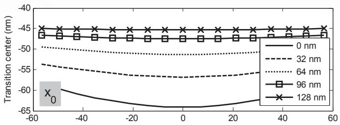

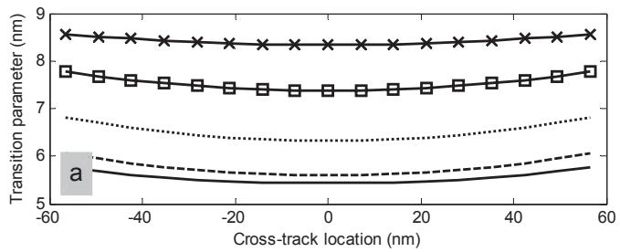  
รูปที่ 8.20 จุดศูนย์กลางการเปลี่ยนสถานะ $x _ { 0 }$ และพารามิเตอร์การเปลี่ยนสถานะ a ที่เกิดขึ้นในแต่ละแทร็ก ย่อย ณ ตำแหน่งต่างๆ ของเลเชอร์ไปทางด้านขวาของจุดกึงกลางช่องว่างของระบบ HAMR แบบแนวนอน

128 ทm) การเปลี่ยนสถานะที่เกิดขึ้นจะไม่ค่อยมีลักษณะเป็นเส้นโด้ง (โพรไฟล์ของค่า a ไม่มีการ เปลี่ยนแปลง) อย่างไรก็ตามเนื่องจากตำแหน่ง $x _ { 0 }$ ถูกผลักดันให้อยูในบริเวณที่มีอุณหภูมิต่ำ (เมื่อ C มีค่ามากขึ้น) จึงทำให้พารามิเตอร์การเปลี่ยนสถานะที่ได้มีค่าเพิ่มขึ้นตามรูปที่ 8.20 (สล่าง)

รูปที่ 8.21 แสดงค่าสนามแม่เหล็กของหัวเขียน $H _ { h }$ และค่าสภาพลบล้างแม่เหล็ก $H _ { c }$ ณ ตำแหน่งต่างๆ ของเลเชอร์ไปทางด้านขวาของจุดกึ่งกลางช่องว่าง โดยตำแหน่งการเปลี่ยนสถานะ $x _ { 0 }$ จะเกิดขึ้นเมื่อ $H _ { c } = H _ { h }$ นั่นคือบริเวณจุดตัดของเส้นกราฟ $H _ { c }$ และ $H _ { h }$ ทางด้านแกน -x (หรือ บริเวณที่เกรเดียนต์สภาพลบล้างแม่เหล็กเป็นลบ) จากรูปจะพบว่าจุดตัดของเส้นกราฟ $H _ { c }$ และ $H _ { h }$ จะสอดคล้องกับตำแหน่งจุดศูนย์กลางการเปลี่ยนสถานะ $x _ { 0 }$ ในรูปที่ 8.20 (ล่าง) ที่เกิดขึ้น ณ จุด กึงกลางแทร็ก

นอกจากนี้พารามิเตอร์ที่สำคัญอีกหนึ่งตัวที่ใช้บอกถึงความจุข้อมูลของระบบ HAMR ก็คือ ค่า $\mathrm { P W } _ { 5 0 }$ หรือความกว้างของผลตอบสนองการเปลี่ยนสถานะเอกเทศ (isolated traทรtioก response) ที่ได้จากหัวอ่านเมื่อวัด ณ จุดที่มีแอมพลิจูดเป็นครึ่งหนึ่งของแอมพลิจูดสูงสุด โดยค่า $\mathrm { P W } _ { 5 0 }$ ยิ่งน้อย ก็หมายความว่าความจุข้อมูลจะยิ่งมาก ดังนั้นจึงเป็นสิ่งสำคัญที่ต้องศึกษาผลกระทบของ โพรไฟล์อุณหภูมิที่มีต่อค่า $\mathrm { P W } _ { 5 0 }$ ในระบบ HAMR ด้วย ในทางปฏิบัติค่า $\mathrm { P W } _ { 5 0 }$ ของสัญญาณ อ่านกลับถูกกำหนดโดยความโด้งของการเปลี่ยนสถานะ (ตำแหน่ง $x _ { 0 } )$ และพารามิเตอร์การเปลี่ยน สถานะ a ที่เกิดขึ้นในแต่ละแทร็กย่อย เพราะฉะนั้นการเปลี่ยนตำแหน่งของเลเซอร์จะมีผลทำให้ สภาพลบล้างแม่เหล็กของสื่อบันทึกและไพรไฟล์อุณหภูมิเปลี่ยนแปลง ซึ่งส่งผลให้ค่า $x _ { 0 }$ และ a ที่เกิดขึ้น (รวมถึงค่า $\mathrm { P W } _ { 5 0 } )$ เปลี่ยนแปลงตามไปด้วย โดยทั่วไป $\mathrm { P W } _ { 5 0 }$ จะมีค่ามากเมื่อ a มีค่ามาก และการเปลี่ยนสถานะมีความโด้งน้อย รูปที่ 8.22 แสดงผลตอบสนองการเปลี่ยนสถานะเอกเทศ ที่ได้จากหัวอ่าน ณ ตำแหน่งต่างๆ ของเลเซอร์ โดยใช้สมการ (8.52) โดยในที่นี้ $x _ { i }$ คือตำแหน่งใน แนวตามแทร็ก (ค่าแกน x ในรูปที่ 8.22) จากรูปพบว่าค่า $\mathrm { P W } _ { 5 0 }$ ที่วัดได้ในแต่ละตำแหน่งของ เลเซอร์จะมีค่าแตกต่างกัน

  
รูปที่ 8.21 ค่าสภาพลบล้างแม่เหล็ก $H _ { c }$ ณ ตำแหน่งต่างๆ ของเลเชอร์ไปทางด้านขวาของจุดกึงกลางช่องว่าง

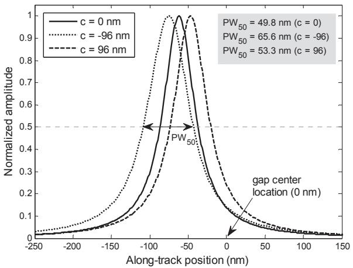  
รูปที่ 8.22 ผลตอบสนองการเปลี่ยนสถานะเอกเทศที่ได้จากหัวอ่าน ณ ตำแหน่งต่างๆ ของเลเซอร์

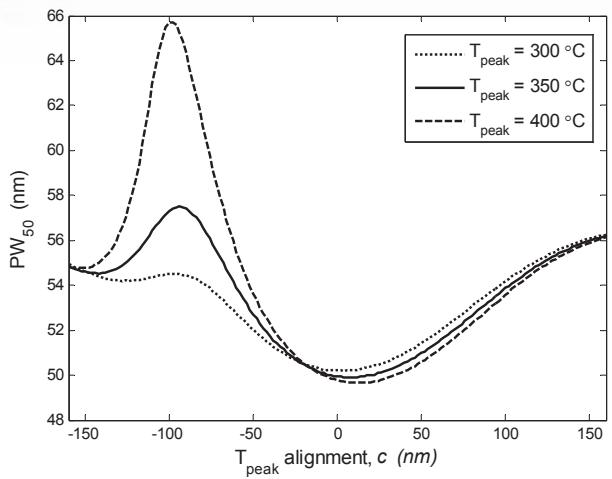  
รูปที่ 8.23 ค่า $\mathrm { P W } _ { 5 0 }$ ในแต่ละตำแหน่งของเลเซอร์สำหรับ $T _ { \mathrm { p e a k } }$ ต่างๆ ของระบบ HAMR แบบแนวนอน

รูปที่ 8.23 แสดงค่า $\mathrm { P W } _ { 5 0 }$ ที่ได้ในแต่ละตำแหน่งของเลเซอร์สำหรับ $T _ { \mathrm { p e a k } }$ ต่างๆ ซึ่งจะ พบว่า $\mathrm { P W } _ { 5 0 }$ จะมีค่าน้อยเมื่อตำแหน่งของเลเซอร์อยู่ใกล้กับจุดกึ่งกลางช่องว่าง (ในที่นี้ $\mathrm { P W } _ { 5 0 }$ ที่มี ค่าน้อยสุดจะอยู่ทางด้านขวาของจุดกึ่งกลางช่องว่างเล็กน้อย) และถ้าเลื่อนตำแหน่งของเลเซอร์ให้ ห่างออกไปจากจุดกึงกลางช่องว่างมากขึ้นทั้งสองทิศทาง ก็จะทำให้สัญญาณอ่านกลับมีความกว้าง ซ เพิ่มขึ้น อย่างไรก็ตามถึงแม้ว่า $\mathrm { P W } _ { 5 0 }$ ดูเหมือนจะมีค่าลดลง ณ ตำแหน่งของเลเซอร์ที $c < - 1 0 0$ ทm แต่ปรากฏการณ์นี้จะเกิดขึ้นเสมอสำหรับระบบ HAMR ที่ใช้สื่อบันทึกที่มีค่า $H _ { c }$ สูง [139] ในทางปฏิบัติค่า $\mathrm { P W } _ { 5 0 }$ จะแปรผันตรงตามค่า a และแปรผกผันกับความโด้งของการเปลี่ยนสถานะ กล่าวคือถ้าตำแหน่งการเปลี่ยนสถานะของแต่ละแทร็กย่อยไม่เป็นแนวเดียวกัน (ทำให้เกิดเป็น ความโคด้ง) ก็จะทำให้ผลตอบสนองรวมของทุกแทร็กย่อยมีความกว้างมากกว่ากรณีที่ตำแหน่งการ เปลี่ยนสถานะของแต่ละแทร็กย่อยอยูในแนวเดียวกัน (ปรากฏการณ์นี้เห็นได้ชัดเจนในรูปที่ 8.18) e ดังนั้นจากการทดลองพบว่าการใช้งานตำแหน่งของเลเซอร์จะมีผลต่อสมรรถนะของระบบค่อนข้าง มาก โดยล้าได้ตำแหน่งของเลเซอร์เหมาะที่สุด (Optimal positioท) แล้วก็จะพบว่าระบบ HAMR ที่ใช้ $T _ { \mathrm { p e a k } }$ สูงจะทำให้ได้ $\mathrm { P W } _ { 5 0 }$ ที่มีค่าน้อย ซึ่งส่งผลให้ระบบมีความจุข้อมูลเพิ่มขึ้น

นอกจากนี้รูปที่ 8.24 แสดงค่า $\mathrm { P W } _ { 5 0 }$ ของสัญญาณอ่านกลับ ณ อุณหภูมิ $T _ { \mathrm { p e a k } }$ ระดับ ต่างๆ เมื่อระบบใช้สนามแม่เหล็กของหัวเขียนที่อยู่ในช่องว่าง $H _ { 0 }$ สามแบบ โดยทั่วไปเมื่อ $T _ { \mathrm { p e a k } }$ มีค่าสูงขึ้น (ค่า $H _ { c }$ ของสื่อบันทึกจะลดลง) ก็จะทำให้ $\mathrm { P W } _ { 5 0 }$ มีค่าน้อยลง จากนั้นค่า $\mathrm { P W } _ { 5 0 }$ ก็เริ่ม ที่จะคังที่เมื่อ $T _ { \mathrm { p e a k } }$ มีค่าสูง ณ ระดับหนึ่ง (ในที่นี้ $T _ { \mathrm { p e a k } } > 4 0 0 ~ ^ { \circ } \mathrm { C } )$ โดยปรากฏการณ์จะเห็นได้ชัด เมื่อใช้กับื่อบันทึกทีม่ค่า $H _ { c }$ น้อย [139] จากรูปยังพบว่าเมื่อกำหนดค่า $T _ { \mathrm { p e a k } }$ มาให้ระบบที่ใช้

  
รูปที่ 8.24 ค่า $\mathrm { P W } _ { 5 0 }$ ของสัญญาณอ่านกลับ ณ อุณหภูมิ $T _ { \mathrm { p e a k } }$ ระดับต่างๆ ของระบบ HAMR แบบแนวนอน

Ho สูงๆ จะทำให้ได้สัญญาณอ่านกลับที่มีค่า $\mathrm { P W } _ { 5 0 }$ น้อย และในทำนองเดียวกันเมื่อกำหนดค่า $H _ { 0 }$ มาให้ ก็สามารถหาค่า $T _ { \mathrm { p e a k } }$ ที่ดีสุดที่ทำให้สัญญาณอ่านกลับที่มีค่า $\mathrm { P W } _ { 5 0 }$ น้อยสุดได้

## ผลกระทบของการปรับค่าพารามิเตอร์ต่างๆ

ในส่วนนี้จะแสดงให้เห็นว่าการปรับค่าพารามิเตอร์ต่างๆ ได้แก่ อุณหภูมิสูงสุด $( T _ { \mathrm { p e a k } } )$ ,สภาพลบ ล้างแม่เหล็ก $( H _ { c } )$ , ช่องว่างของหัวเขียน (g), สนามแม่เหล็กของหัวเขียนที่อยูในช่องว่าง $( H _ { 0 } )$ - และระยะบิน (d) จะมีผลกระทบต่อตำแหน่งจุดศูนย์กลางการเปลียนสถานะ $x _ { 0 }$ และพารามิเตอร์ การเปลี่ยนสถานะ a ที่ได้จากระบบ HAMR แบบแนวนอนที่ใช้อุณหภูมิสูงสุด $T _ { \mathrm { p e a k } } = 4 0 0 ~ ^ { \circ } \mathrm { C }$ และ $c = 0$ ทm ส่วนพารามิเตอร์อื่นๆ ที่ใช้จะมีค่าโดยปริยาย (defaนlt vaในe) ตามที่ปรากฎใน ตารางที่ 8.1

รูปที่ 8.25 แสดงค่า $x _ { 0 }$ และ a ที่เกิดขึ้นในแต่ละแทร็กย่อย เมื่ออุณหภูมิสูงสุด $T _ { \mathrm { p e a k } }$ ที่ใช้ มีค่าเท่ากับ 320, 360, 400, 440 และ 480 C ซึ่งแสดงเป็น –20%, –10%, 0%, 10% และ 20% ตามลำดับ โดยที่0% หมายถึงค่าโดยปริยาย, A% หมายถึง $T _ { \mathrm { p e a k } }$ ที่ใช้มีค่าต่างจากค่าโดยปริยาย (นั่นคือ $4 0 0 ~ ^ { \circ } \mathrm { C } )$ เป็นปริมาณ $A \%$ , และ $x _ { 0 }$ ที่มีค่าเป็นลบหมายถึงตำแหน่งที่อยู่ทางด้านซ้ายของ จุดกึ่งกลางช่องว่าง จากรูปจะพบว่าเมื่อ $T _ { \mathrm { p e a k } }$ มีค่าเพิ่มขึ้น ก็จะทำให้ตำแหน่ง $x _ { 0 }$ เคลื่อนที่ห่างออก ไปจากจุดกึ่งกลางช่องว่างมากขึ้น และทำให้ a มีค่าลดลงด้วย นอกจากนี้ค่าเฉลี่ยของ $x _ { 0 }$ และ a (เฉลี่ยจากแทร็กย่อยทั้งหมด) ทีได้สำหรับค่า $T _ { \mathrm { p e a k } }$ ต่างๆ แสดงในตารางที่ 8.2 ในทำนองเดียวกัน ถ้าปรับค่าพารามิเตอร์ $H _ { c } , \ \tilde { g } \mathrm { ~ , ~ } H _ { 0 }$ และ d ให้มีค่าแตกต่างจากค่าโดยปริยายเป็นจำนวน ±20% และ ±10% ก็จะส่งผลทำให้ค่า $x _ { 0 }$ และ $a$ มีการเปลี่ยนแปลงตามไปด้วย โดยค่าเฉลี่ยของ ง x0 และ a ที่ $x _ { 0 }$ ได้ (เมื่อปรับค่าพารามิเตอร์ในแต่ละกรณี) แสดงในตารางที่ 8.2 ผลการทดลองนี้อาจใช้เป็นแนวทาง ในการตัดสินใจเลือกใช้ค่าพารามิเตอร์ต่างๆ ที่เหมาะสมเพื่อให้ระบบมีสมรรถนะสูงสุด

  
รูปที่ 8.25 จุดศูนย์กลางการเปลี่ยนสถานะ ซี ด $x _ { 0 }$ และพารามิเตอร์การเปลียนสถานะ a ทีเกิดขึนในแต่ละแทร็ก ย่อย ณ ระดับอุณหภูมิสูงสุดต่างๆ ของระบบ HAMR แบบแนวนอน [144]

ตารางที่ 8.2 ค่าเฉลี่ยของจุดศูนย์กลางการเปลี่ยนสถานะ $x _ { 0 }$ และพารามิเตอร์การเปลี่ยนสถานะ a [144]
<table><tr><td rowspan=2 colspan=1>พารามิเตอร์</td><td rowspan=2 colspan=1>ค่าเฉลี่ย</td><td rowspan=1 colspan=5>เปอร์เซ็นต์การเปลี่ยนแปลงของค่าพารามิเตอร์</td></tr><tr><td rowspan=1 colspan=1>−20%</td><td rowspan=1 colspan=1>-10%</td><td rowspan=1 colspan=1>0%</td><td rowspan=1 colspan=1>+10%</td><td rowspan=1 colspan=1>+20%</td></tr><tr><td rowspan=2 colspan=1>อุณหภูมิสูงสุด $\scriptstyle T _ { \mathrm { p e a k } }$ </td><td rowspan=1 colspan=1>x0[nm]</td><td rowspan=1 colspan=1>-58.46</td><td rowspan=1 colspan=1>-60.18</td><td rowspan=1 colspan=1>–61.92</td><td rowspan=1 colspan=1>–63.69</td><td rowspan=1 colspan=1>−65.49</td></tr><tr><td rowspan=1 colspan=1>a [nm]</td><td rowspan=1 colspan=1>5.79</td><td rowspan=1 colspan=1>5.67</td><td rowspan=1 colspan=1>5.56</td><td rowspan=1 colspan=1>5.46</td><td rowspan=1 colspan=1>5.37</td></tr><tr><td rowspan=2 colspan=1>สภาพลบล้างแม่เหล็ก $H _ { c }$ </td><td rowspan=1 colspan=1> $x _ { 0 }$ [nm]</td><td rowspan=1 colspan=1>–54.57</td><td rowspan=1 colspan=1>–58.13</td><td rowspan=1 colspan=1>–61.92</td><td rowspan=1 colspan=1>−66.06</td><td rowspan=1 colspan=1>-70.65</td></tr><tr><td rowspan=1 colspan=1>a [nm]</td><td rowspan=1 colspan=1>5.69</td><td rowspan=1 colspan=1>5.55</td><td rowspan=1 colspan=1>5.56</td><td rowspan=1 colspan=1>5.67</td><td rowspan=1 colspan=1>5.84</td></tr><tr><td rowspan=2 colspan=1>ช่องว่างของหัวเขียน $\tilde { g }$ </td><td rowspan=1 colspan=1>x[nm]</td><td rowspan=1 colspan=1>–53.34</td><td rowspan=1 colspan=1>–57.67</td><td rowspan=1 colspan=1>–61.92</td><td rowspan=1 colspan=1>–66.13</td><td rowspan=1 colspan=1>-70.32</td></tr><tr><td rowspan=1 colspan=1>a [nm]</td><td rowspan=1 colspan=1>5.52</td><td rowspan=1 colspan=1>5.54</td><td rowspan=1 colspan=1>5.56</td><td rowspan=1 colspan=1>5.59</td><td rowspan=1 colspan=1>5.62</td></tr><tr><td rowspan=2 colspan=1>สนามแม่เหล็กของหัวเขียนที่อยู่ในช่องว่าง $H _ { 0 }$ </td><td rowspan=1 colspan=1>x0 [nm]</td><td rowspan=1 colspan=1>–57.72</td><td rowspan=1 colspan=1>–59.94</td><td rowspan=1 colspan=1>–61.92</td><td rowspan=1 colspan=1>–63.73</td><td rowspan=1 colspan=1>−65.40</td></tr><tr><td rowspan=1 colspan=1>a[nm]</td><td rowspan=1 colspan=1>5.59</td><td rowspan=1 colspan=1>5.55</td><td rowspan=1 colspan=1>5.56</td><td rowspan=1 colspan=1>5.59</td><td rowspan=1 colspan=1>5.64</td></tr><tr><td rowspan=2 colspan=1>ระยะบิน d</td><td rowspan=1 colspan=1>x0 [nm]</td><td rowspan=1 colspan=1>–60.96</td><td rowspan=1 colspan=1>−61.62</td><td rowspan=1 colspan=1>–61.92</td><td rowspan=1 colspan=1>−62.70</td><td rowspan=1 colspan=1>−63.14</td></tr><tr><td rowspan=1 colspan=1>a [nm]</td><td rowspan=1 colspan=1>5.10</td><td rowspan=1 colspan=1>5.41</td><td rowspan=1 colspan=1>5.56</td><td rowspan=1 colspan=1>5.98</td><td rowspan=1 colspan=1>6.25</td></tr></table>

ตารางที่ 8.3 ค่าพารามิเตอร์ต่างๆ ที่ใช้ในการวิเคราะห์ระบบ HAMR แบบแนวตั้ง
<table><tr><td rowspan=1 colspan=1>พารามิเตอร์</td><td rowspan=1 colspan=1>ค่าที่ใช้</td><td rowspan=1 colspan=3></td><td rowspan=1 colspan=1>พารามิเตอร์</td><td rowspan=1 colspan=1> $\dot { \bar { \boldsymbol { \rho } } } \dot { \boldsymbol { \eta } } \dot { \bar { \boldsymbol { \eta } } } \big \| \tilde { \boldsymbol { \beta } }$ </td></tr><tr><td rowspan=2 colspan=1> $H _ { c }$ [A/m]</td><td rowspan=2 colspan=1> $- 2 0 0 0 T ( x ) + 2 1 { \times } 1 0 ^ { 5 }$ </td><td rowspan=2 colspan=2></td><td rowspan=1 colspan=1></td><td rowspan=2 colspan=1></td><td rowspan=2 colspan=1> $T _ { \mathrm { p e a k } }$   $[ ^ { \circ } \mathrm { C } ]$ </td></tr><tr><td rowspan=1 colspan=2></td></tr><tr><td rowspan=2 colspan=1> $M _ { r }$ [A/m]</td><td rowspan=2 colspan=1> $- 1 2 0 0 T ( x ) + 1 2 { \times } 1 0 ^ { 5 }$ </td><td rowspan=2 colspan=2></td><td rowspan=1 colspan=1></td><td rowspan=2 colspan=1></td><td rowspan=2 colspan=1> $\sigma _ { t }$ [nm]</td></tr><tr><td rowspan=1 colspan=2></td></tr><tr><td rowspan=2 colspan=1> $S ^ { * }$ </td><td rowspan=2 colspan=1>0.7</td><td rowspan=2 colspan=2></td><td rowspan=1 colspan=1></td><td rowspan=2 colspan=1></td><td rowspan=2 colspan=1>ความกว้างของแทร็ก [nm]</td></tr><tr><td rowspan=1 colspan=3></td></tr><tr><td rowspan=2 colspan=1> $H _ { 0 }$ [nm]</td><td rowspan=2 colspan=1> $1 9 \times 1 0 ^ { 5 }$ </td><td rowspan=2 colspan=2></td><td rowspan=1 colspan=1></td><td rowspan=2 colspan=1></td><td rowspan=2 colspan=1>จำนวนแทร็กย่อย N</td></tr><tr><td rowspan=1 colspan=2></td></tr><tr><td rowspan=2 colspan=1>g[nm]</td><td rowspan=2 colspan=1>80</td><td rowspan=2 colspan=2></td><td rowspan=1 colspan=1></td><td rowspan=2 colspan=1></td><td rowspan=2 colspan=1> $C$ </td></tr><tr><td rowspan=1 colspan=1></td><td></td></tr><tr><td rowspan=2 colspan=1>y[nm]</td><td rowspan=2 colspan=1>16</td><td rowspan=2 colspan=2></td><td rowspan=1 colspan=1></td><td rowspan=2 colspan=1></td><td rowspan=2 colspan=1> $g _ { r }$ [nm]</td></tr><tr><td rowspan=1 colspan=2></td></tr><tr><td rowspan=1 colspan=1>δ [nm]</td><td rowspan=1 colspan=1>17</td><td rowspan=1 colspan=3></td><td rowspan=1 colspan=1> $\mathtt { \Pi } _ { \mathtt { { C } } _ { r } }$ [nm]</td><td rowspan=1 colspan=1>1000</td></tr></table>

## 8.7.2 ระบบ HAMR แบบแนวตัง

ในหัวข้อนี้จะแสดงลักษณะเฉพาะของการเปลี่ยนสถานะของระบบ HAMR แบบแนวตั้ง โดยค่า พารามิเตอร์ต่างๆ ที่ใช้ในการวิเคราะห์ระบบแสดงในตารางที่ 8.3

รูปที่ 8.26 และ 8.26 แสดงจุดศูนย์กลางการเปลี่ยนสถานะ $x _ { 0 }$ และพารามิเตอร์การเปลียน สถานะ a ที่เกิดขึ้นในแต่ละแทร็กย่อย ณ ตำแหน่งต่างๆ ของเลเซอร์ไปทางด้านซ้ายและด้านขวา ของจุดกึงกลางช่องว่าง ตามลำดับ ซึ่งจะพบว่าการเปลี่ยนแปลงของค่า $x _ { 0 }$ และ a ที่เกิดขึ้นมีลักษณะ คล้ายกับระบบ HAMR แบบแนวนอน อย่างไรก็ตามเมื่อเลเซอร์เคลื่อนห่างออกไปจากจุดกึงกลาง ช่องว่างทางด้านขวาจะพบว่าค่า a มีค่าลดลง (ซึ่งตรงข้ามกับกรณีของระบบ HAMR แบบแนวนอน ตามรูปที่ 8.20) ทั้งนี้เป็นเพราะว่าสนามแม่เหล็กของหัวเขียน $H _ { h }$ ที่นิยามในสมการ (8.39) อาจจะ เป็นการประมาณค่าทีไม่ดี ณ บริเวณขอบของโพล (pole edges) ดังนั้นเมื่อมีการเปลี่ยนสถานะ เกิดขึ้นใกล้กับบริเวณนี้ ค่า $H _ { h }$ ที่ใช้ตามสมการ (8.39) มีผลทำให้เกรเดียนต์สนามแม่เหล็กของ หัวเขียนมีค่าสูงมาก จึงทำให้พารามิเตอร์การเปลี่ยนสถานะที่ได้มีค่าลดลง [133]

รูปที่ 8.28 แสดงค่า $\mathrm { P W } _ { 5 0 }$ ที่ได้ในแต่ละตำแหน่งของเลเซอร์สำหรับ $T _ { \mathrm { p e a k } }$ ต่างๆ ของ ระบบ HAMR แบบแนวตั้งซึ่งมีลักษณะคล้ายกับค่า $\mathrm { P W } _ { 5 0 }$ ของระบบ HAMR แบบแนวนอนใน รูปที่ 8.23 กล่าวคือ $\mathrm { P W } _ { 5 0 }$ จะมีค่าน้อยสุด เมื่อตำแหน่งของเลเซอร์อยู่ทางด้านขวาของจุดกึงกลาง ช่องว่าง ในทำนองเดียวกันถ้าระบบใช้ตำแหน่งของเลเซอร์ที่ดีสุด ก็จะพบว่าระบบที่ใช้ $T _ { \mathrm { p e a k } }$ สูง จะทำให้สัญญาณอ่านกลับที่ได้มีค่า $\mathrm { P W } _ { 5 0 }$ น้อย ซึ่งส่งผลให้ระบบมีความจุข้อมูลเพิ่มขึ้น

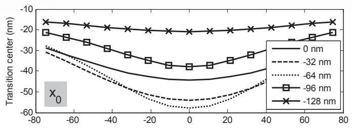

  
รูปที่ 8.26 จุดศูนย์กลางการเปลี่ยนสถานะ x0 และพารามิเตอร์การเปลี่ยนสถานะ a ที่เกิดขึ้นในแต่ละแทร็ก ย่อย ณ ตำแหน่งต่างๆ ของเลเซอร์ไปทางด้านซ้ายของจุดกึงกลางช่องว่างของระบบ HAMR แบบแนวตั้ง

  
รูปที่ 8.27 จุดศูนย์กลางการเปลี่ยนสถานะ x0 และพารามิเตอร์การเปลี่ยนสถานะ a ทีเกิดขึ้นในแต่ละแทร็ก ย่อย ณ ตำแหน่งต่างๆ ของเลเซอร์ไปทางด้านขวาของจุดกึงกลางช่องว่างของระบบ HAMR แบบแนวตั้ง

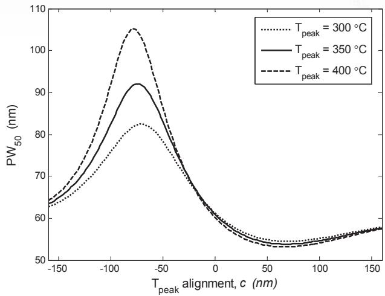  
รูปที่ 8.28 ค่า $\mathrm { P W } _ { 5 0 }$ ในแต่ละตำแหน่งของเลเซอร์สำหรับ $T _ { \mathrm { p e a k } }$ ต่างๆ ของระบบ HAMR แบบแนวตั้ง

## 8.7.3 ข้อควรระวังในการใช้แบบจำลองวิลเลียม-คอมสต็อกเชิงความร้อน

การใช้แบบจำลองวิลเลียม-คอมสต็อกเชิงความร้อนในสมการ (8.15) เพื่อหาค่าพารามิเตอร์การเปลี่ยน สถานะ a และสมการ (8.33) เพือการหาจุดศูนย์กลางการเปลียนสถานะ $x _ { 0 }$ ของระบบ HAMR แบบแนวนอนและแบบแนวตั้ง มีข้อควรระวังดังนี้

สมการต่างๆ ที่ใช้หาค่า a และ $x _ { 0 }$ ได้มาจากสมมุติฐานที่ว่าแบบจำลองของหัวเขียนและ สื่อบันทึก รวมทั้งทิศทางการเคลื่อนที่และการเปลี่ยนสภาพความเป็นแม่เหล็กในสื่อบันทึกเป็นไป ตามรูปที่ 8.4 นั่นคือ

สื่อบันทึกจะเคลื่อนที่ไปทางด้านซ้ายของหัวเขียน เพราะฉะนั้นค่า $x _ { 0 }$ ที่หาได้จะมีค่าเป็นลบ ซึ่ง หมายความว่าตำแหน่ง $x _ { 0 }$ อยู่ทางด้านซ้ายของจุดกึงกลางช่องว่างของหัวเขียน

สภาพความเป็นแม่เหล็กจะเปลี่ยนจาก $+ M _ { r }$ เป็น $- M _ { r }$ ซึ่งหมายความว่าการเปลี่ยนสถานะจะ ถูกเขียนต้านกับสภาพลบล้างแม่เหล็กแบบลบ (negative coercivity)

ดังนั้นในการใช้สมการต่างๆ เพื่อหาค่า a และ $x _ { 0 }$ จะต้องกำหนดให้สภาพความเป็นแม่เหล็ก $M _ { r }$ มีค่าเป็นลบ, สภาพลบล้างแม่เหล็ก $H _ { c }$ มีค่าเป็นลบ, และเกรเดียนต์สภาพลบล้างแม่เหล็ก $d H _ { c } / d T$ มีค่าเป็นบวก นอกจากนี้ต้องกำหนดให้สนามแม่เหล็กของหัวเขียนที่อยู่ในช่องว่าง $H _ { 0 }$ มีค่าเป็นลบ สำหรับระบบ HAMR แบบแนวนอน และให้ $H _ { 0 }$ มีค่าเป็นบวกสำหรับระบบ HAMR แบบแนวตั้ง ส รั้ท

## 8.8 สรุปท้ายบท

เทคโนโลยี HAMR สามารถช่วยเพิ่มความจุข้อมูลได้มากกว่า 1 $\mathrm { T b } / \mathrm { i n } ^ { 2 }$ และยังสามารถนำมาใช้งาน จริงในฮาร์ดดิสก์ไดรฟ์ได้ภายในระยะเวลาอันใกล้ แบบจำลองวิลเลียม-คอมสต็อกเชิงความร้อนใน สมการ (8.15) และแบบจำลองไมโครแทร็กได้ถูกนำมาใช้ในการวิเคราะห์ระบบ HAMR เพื่อศึกษา ลักษณะเฉพาะของการเปลี่ยนสถานะ (จุดศูนย์กลางการเปลี่ยนสถานะ $x _ { 0 }$ และพารามิเตอร์การ เปลี่ยนสถานะ $a )$ รวมทั้งค่า $\mathrm { P W } _ { 5 0 }$ ของสัญญาณอ่านกลับที่ได้จากหัวอ่าน โดยทั่วไป $\mathrm { P W } _ { 5 0 }$ ยิ่งมี ค่าน้อย ก็จะทำให้ระบบมีความจุข้อมูลมาก ดังนั้นระบบ HAMR ที่มีค่า $\mathrm { P W } _ { 5 0 }$ น้อยจึงเป็นสิ่งที่ ต้องการ อย่างไรก็ตามค่า $x _ { 0 } .$ a และ $\mathrm { P W } _ { 5 0 }$ จะขึ้นอยู่กับปัจจัยหลายๆ อย่าง ได้แก่ ตำแหน่งของ เลเซอร์,อุณหภูมิสูงสุดที่ใช้, ลักษณะของหัวเขียนและหัวอ่าน, และคุณสมบัติทางแม่เหล็กของ สื่อบันทึก เป็นต้น ในทางปฏิบัติค่า $\mathrm { P W } _ { 5 0 }$ จะแปรผันตรงตามค่า a และแปรผกผันกับความโด้ง ของการเปลี่ยนสถานะ (พิจารณาจากค่า $x _ { 0 }$ ของแต่ละแทร็กย่อย) เพราะฉะนั้นการศึกษาพฤติกรรม ต่างๆ ของระบบ HAMR จึงเป็นสิ่งสำคัญ เพื่อใช้เป็นแนวทางในการตัดสินใจเลือกใช้ค่าพารามิเตอร์ ต่างๆ ที่เหมาะสมกับระบบ ซึ่งจะส่งผลทำให้ระบบมีสมรรถนะสูงสุด

ในบทนี้ให้ความสำคัญกับกระบวนการเขียน (write process) ของระบบ HAMR ซึ่งมี ผลทำให้สัญญาณอ่านกลับที่ได้จากหัวอ่านมีลักษณะแตกต่างจากสัญญาณอ่านกลับของระบบการ บันทึกเชิงแม่เหล็กแบบที่ใช้กันทั่วไป (แบบแนวนอนและแบบแนวตั้ง) อย่างไรก็ตามกระบวนการ อ่านและการถอดรหัสข้อมูลที่ใช้ในระบบ HAMR จะยังคงเหมือนกับที่ใช้อยูในระบบการบันทึก เชิงแม่เหล็กแบบที่ใช้กันทั่วไป นั่นคือสามารถใช้วงจรภาครับแบบเดิม (หรือวงจรตรวจหา PRML) ที่ใช้อยูในฮาร์ดดิสก์ไดรฟปัจจุบันได้

## 8.9 แบบฝึกหัดท้ายบท

1. จงอธิบายแนวคิดและหลักการทำงานของเทคโนโลยี HAMR

2.จงอธิบายและพิสูจน์แบบจำลองวิลเลียม-คอมสต็อกในสมการ (8.8)

3.จงอธิบายและพิสูจน์แบบจำลองวิลเลียม-คอมสต็อกเชิงความร้อนในสมการ (8.15)

4.จงพิสูจน์สมการ (8.29)

5.จงพิสูจน์สมการ (8.37)

6.จงพิสูจน์สมการ (8.47)

7. จงอธิบายความสำคัญของแบบจำลองไมโครแทร็ก

8.จงใช้โปรแกรม รCILAB วาดกราฟในรูปที่ 8.19 และ 8.21

# ภาคผนวก ก

# ฟังก์ชันลอการิทึมจาโคเบียน

ญ ภาคผนวกนี้จะพิสูจน์ฟังก์ชันลอการิทึ่มจาโคเบียน (Jacobian logarithm) ในสมการ (3.15) นั้นคือ

$$
\ln \left( e ^ { a } + e ^ { b } \right) = \operatorname* { m a x } \left( a , b \right) + \ln \left( 1 + e ^ { - \left| a - b \right| } \right)\tag{ก.1}
$$

เมื่อ a และ b คือค่าคงตัวใดๆ โดยการพิสูจน์จะแบ่งออกเป็น 2 กรณี ดังนี้ 1)กรณีที่ $a > b$ จะได้ว่า

$$
{ \begin{array} { r l } & { \ln \left( e ^ { a } + e ^ { b } \right) = \ln \left( e ^ { a } \left\{ 1 + { \frac { e ^ { b } } { e ^ { a } } } \right\} \right) = \ln \left( e ^ { a } \left\{ 1 + e ^ { b - a } \right\} \right) } \\ & { \qquad = \ln \left( e ^ { a } \right) + \ln \left( 1 + e ^ { - ( a - b ) } \right) } \\ & { \qquad = a + \ln \left( 1 + e ^ { - ( a - b ) } \right) } \end{array} }\tag{ก.2}
$$

2)กรณีที่ $b > a$ จะได้ว่า

$$
{ \begin{array} { r l } & { \ln \left( e ^ { a } + e ^ { b } \right) = \ln \left( e ^ { b } \left\{ { \frac { e ^ { a } } { e ^ { b } } } + 1 \right\} \right) = \ln \left( e ^ { b } \left\{ 1 + e ^ { a - b } \right\} \right) } \\ & { \qquad = \ln \left( e ^ { b } \right) + \ln \left( 1 + e ^ { - ( b - a ) } \right) } \\ & { \qquad = b + \ln \left( 1 + e ^ { - ( b - a ) } \right) } \end{array} }\tag{ก.3}
$$

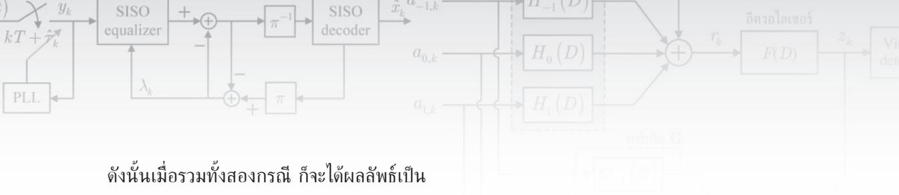

$$
\ln \left( e ^ { a } + e ^ { b } \right) = \operatorname* { m a x } \left( a , b \right) + \ln \left( 1 + e ^ { - \left| a - b \right| } \right)
$$

(ก.4)

ซึ่งตรงกับสมการ (3.15) ตามที่ต้องการ

# ภาคผนวก ข

# กฎของไฮเพอร์โบลิกแทนเจนต์

ภาคผนวกนี้จะพิสูจน์กฎของไฮเพอร์โบลิกแทนเจนต์ (tanh rนle) ในสมการ (4.30) ดังนี้ ถ้าให้ ฟังก์ชันพาริตี $\Phi ( \mathbf { c } ) \in \{ 0 , 1 \}$ คือค่าพาริตีของเซตข้อมูล $\mathbf { c } = [ c _ { 1 } , \ c _ { 2 } , \ . . . , \ c _ { n } ]$ จำนวน n บิต เมื่อ $c _ { i } \in \{ 0 , 1 \}$ ดังนั้นฟังก์ชันพาริตี 4(c) สามารถหาได้จาก

$$
\Phi \left( \mathbf { c } \right) = \frac { 1 } { 2 } \Bigg ( 1 - \prod _ { i = 1 } ^ { n } \left( 1 - 2 c _ { i } \right) \Bigg )\tag{ข.1}
$$

เนืองจาก $\Phi ( \mathbf { c } ) = 0$ โดยที่ c มีเลขหนึ่งรวมกันเป็นจำนวนคู่ และ $\Phi ( \mathbf { c } ) = 1$ เมื่อ c มีเลขหนึ่ง รวมกันเป็นจำนวนดี นอกจากนีความน่าจะเป็น (probability) $\stackrel { \mathrm { d } } { \bar { \eta } } \Phi ( \mathbf { c } ) = 1$ มีค่าเท่ากับค่าคาดหมาย (expected value) ของ $\Phi ( \mathbf { c } )$ นั่นคือ

$$
\begin{array} { r l } { \operatorname { p } _ { t } [ \Phi ( \mathbf { x } ) - 1 ] = E \left\{ \Phi ( \mathbf { x } ) \right\} } \\ { \ } & { = ( 1 ) \operatorname { P r } _ { [ \tilde { \mathbf { e } } ] } ( \mathbf { x } ) = 1 ] + ( 0 ) \operatorname { P r } _ { [ \tilde { \mathbf { e } } ] } ( \mathbf { \Phi } \mathbf { e } ) = 0 ] } \\ { \ } & { = \frac { 1 } { 2 } \Bigg ( 1 - E \left[ \underset { \mathrm { i } \sim 1 } { \overset { \times } { \prod } } \left( 1 - 2 \epsilon _ { s } \right) \right] } \\ { \ } &  = \frac { 1 } { 2 } \Bigg ( 1 - \underset { \mathrm { i } \sim 1 } { \overset { \times } { \prod } } \left( 1 - 2 E \left[ \epsilon _ { s } \right] \right) \Bigg ) \quad \ ( \underset { \mathrm { i } \sim 1 } { \overset { \cdot } { \prod } } \mathrm { a r s i m m a n ~ m a x i n ~ f i a \bar { \mathbf { k } } \bar { \mathbf { q } } \cdot \mathbf { n } \bar { \mathbf { q } } \bar { \mathbf { n } } \tilde { \mathbf { n } } \tilde { \mathbf { n } } \tilde { \mathbf { n } } \tilde { \mathbf { n } } \tilde { \mathbf { n } } \tilde { \mathbf { n } } ) } \\ { \ } &  = \frac { 1 } { 2 } \Bigg ( 1 - \underset { \mathrm { i } \sim 1 } { \overset { \cdot } { \prod } } \left( 1 - \frac { 2 E ^ { d } } { 1 + \epsilon ^ { k } } \right) \Bigg ) \quad \ ( \underset { \mathrm { i } \sim 1 } { \overset { \cdot } { \prod } } \mathrm { a r s i m m a \bar { \mathbf { n } } } ) \mathrm  a r s i n ~ f i a \bar { \mathbf { k } } \bar { \mathbf { q } } \cdot \mathbf { n } \bar { \mathbf { n } } \tilde { \mathbf { n } } \tilde { \mathbf { n } } \tilde { \mathbf { n } } \tilde { \mathbf { n } } \tilde { \mathbf { n } } \tilde { \mathbf { n } } \tilde { \mathbf { n } } \tilde { \mathbf { n } } \tilde { \mathbf { n } } \tilde { \mathbf { n } } \tilde { \mathbf { n } } \tilde  \mathbf  n \end{array}
$$

เมื่อ $E [ . ]$ คือตัวดำเนินการค่าคาดหมาย (expectation operator) และเนื่องจาก $\mathrm { P r } \big [ \Phi ( \mathbf { c } ) = 0 \big ] =$ $1 - \mathrm { P r } \big [ \Phi ( \mathbf { c } ) = 1 \big ]$ เพราะฉะนั้นค่า LLR ของ $\Phi ( \mathbf { c } )$ มีค่าเท่ากับ

$$
\lambda _ { \Phi ( \mathbf { c } ) } = \log \left( \frac { \operatorname* { P r } \bigl [ \Phi \left( \mathbf { c } \right) = 1 \bigr ] } { \operatorname* { P r } \bigl [ \Phi \left( \mathbf { c } \right) = 0 \bigr ] } \right) = \log \left( \frac { 1 - \prod _ { i } \operatorname { t a n h } \left( - \lambda _ { i } / 2 \right) } { 1 + \prod _ { i } \operatorname { t a n h } \left( - \lambda _ { i } / 2 \right) } \right)\tag{ข.3}
$$

อาศัยคุณสมบัติที่ว่า $\operatorname { t a n h } \left( - \lambda / 2 \right) = \left( 1 - e ^ { \lambda } \right) / \left( 1 + e ^ { \lambda } \right)$ และให้ $\Psi = \prod _ { i = 1 } ^ { n } \operatorname { t a n h } \left( - \lambda _ { i } / 2 \right)$ ดังนั้น

$$
\operatorname { t a n h } \left( \frac { - \lambda _ { \Phi ( \mathbf { c } ) } } { 2 } \right) = \frac { 1 - \left( \displaystyle \frac { 1 - \Psi } { 1 + \Psi } \right) } { 1 + \displaystyle \left( \frac { 1 - \Psi } { 1 + \Psi } \right) } = \frac { ( 1 + \Psi ) - \left( 1 - \Psi \right) } { ( 1 + \Psi ) + ( 1 - \Psi ) } = \Psi = \prod _ { i = 1 } ^ { n } \operatorname { t a n h } \left( \frac { - \lambda _ { i } } { 2 } \right)\tag{ข.4}
$$

ซึ่งตรงกับสมการ (4.30) ตามที่ต้องการ

## ภาคผนวก ค

## ความสมมูลของสมการ (4.30) และ (4.32)

ภาคผนวกนี้จะแสดงให้เห็นว่าสมการ (4.30) และ (4.32) มีค่าเท่ากัน ให้พิจารณากฎของไฮเพอร์ โบลิกแทนเจนต์ (tanh rule) ในสมการ (4.30) นั่นคือ

$$
\operatorname { t a n h } \left( \frac { - \lambda _ { \Phi ( \mathbf { c } ) } } { 2 } \right) = \prod _ { i = 1 } ^ { n } \operatorname { t a n h } \left( \frac { - \lambda _ { i } } { 2 } \right)\tag{ค.1}
$$

สำหรับ $\lambda _ { i }$ ที่เป็นเลขจำนวนจริง จะได้ความสัมพันธ์ดังนี้

$$
- \lambda _ { i } = \mathrm { s i g n } \left( - \lambda _ { i } \right) \times \left| - \lambda _ { i } \right|\tag{ค.2}
$$

โดยที่ $| x |$ คือค่าสัมบูรณ์ของ $x ,$ และ sign $( x ) = + 1$ เมื่อ $x \geq 0$ และ sign $\left( x \right) = - 1$ เมื่อ $x < 0$ จากนันแทนค่าสมการ (ค.2) ลงในสมการ (ค.1) ก็จะได้ผลลัพธ์เป็น 2 สมการคือ

$$
\operatorname { s i g n } \left( - \lambda _ { \Phi ( \mathbf { c } ) } \right) = \prod _ { i = 1 } ^ { n } \operatorname { s i g n } \left( - \lambda _ { i } \right)\tag{ค.3}
$$

$$
\operatorname { t a n h } \left( \frac { \left| \lambda _ { \Phi ( \mathbf { c } ) } \right| } { 2 } \right) = \prod _ { i = 1 } ^ { n } \operatorname { t a n h } \left( \frac { \left| \lambda _ { i } \right| } { 2 } \right)\tag{ค.4}
$$

ใส่ฟังก์ชัน -1og() เข้าไปทั้งสองข้างของสมการ (ค.4) ก็จะได้

$$
f \left( \left| \lambda _ { \Phi \left( \mathbf { c } \right) } \right| \right) = \sum _ { i = 1 } ^ { n } f \left( \left| \lambda _ { i } \right| \right)\tag{ค.5}
$$

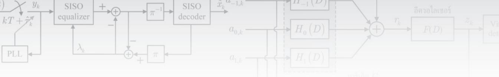

โดยที่ $f \bigl ( x \bigr ) = - \log \bigl ( \operatorname { t a n h } \left( x / 2 \right) \bigr )$ ตามสมการ (4.33) ซึ่งมีคุณสมบัติที่สำคัญคือ $f ( f ( x ) ) = x$ สำหรับ $x > 0$ ดังนั้นถ้าใส่ฟังก์ชัน f () เข้าไปทั้งสองข้างของสมการ (ค.5) ก็จะได้

$$
\Big | \lambda _ { \Phi ( \mathbf { c } ) } \Big | = f \Bigg | \sum _ { i = 1 } ^ { n } f \big ( | \lambda _ { i } | \big ) \Bigg |\tag{ค.6}
$$

และเมื่อนำสมการ (ค.3) และ (ค.6) มารวมกัน ก็จะได้ผลลัพธ์เป็น

$$
\lambda _ { \Phi ( \mathbf { c } ) } = - \prod _ { i = 1 } ^ { n } \mathrm { s i g n } \left( - \lambda _ { i } \right) \times f \left( \sum _ { i = 1 } ^ { n } f \left( \left| \lambda _ { i } \right| \right) \right)\tag{ค.7}
$$

ซึ่งตรงกับสมการ (4.32) ตามที่ต้องการ

# ภาคผนวกง

# การหาค่าประมาณแบบซอฟต์ สำหรับช่องสัญญาณ PR2

ภาคผนวกนี้จะแสดงวิธีการหาค่าประมาณแบบซอฟต์สำหรับช่องสัญญาณ PR2 ตามสมการ (5.23) ดังนี้ พิจารณาแบบจำลองช่องสัญญาณ PR2 ในรูปที่ ง.1 เมื่อลำดับข้อมูลอินพุต61 $a _ { k } \in \{ \pm 1 \}$ จะ ถูกส่งเข้าช่องสัญญาณ PR2 นันคือ $H \left( D \right) = \sum { { { h } _ { k } } } { { \cal { D } } ^ { k } } = 1 + 2 D + { { D } ^ { 2 } }$ เมื่อ ซื $D$ ตัวดำเนินการ หน่วงเวลาหนึ่งหน่วย ทำให้ได้เป็นลำดับข้อมูล $r _ { k } = a _ { k } * h _ { k } \in \{ 0 , \pm 2 , \pm 4 \}$

ณ วงจรภาครับ อีควอไลเซอร์แบบเทอร์โบจะสร้างข่าวสารแบบซอฟต์หรือค่า LLR $\{ \lambda _ { k } \}$ สำหรับลำดับข้อมูล $\{ a _ { k } \}$ เพื่อใช้ในการแลกเปลี่ยนข่าวสารระหว่างอีควอไลเซอร์ รOVA และวงจร ถอดรหัส LDPC เมื่อพิจารณาระบบทีไม่มีหน่วยความจำ "สไลเซอร์แบบซอฟต์ (soft รlicer)" จะ ใช้ลำดับข้อมูล $\{ \lambda _ { k } \}$ ในการคำนวณหาค่าตัดสินใจแบบซอฟต์ $\tilde { r } _ { k } = E \left[ r _ { k } \mid \left\{ \lambda _ { k } \right\} \right]$ เนื่องจากข้อมูล เอาต์พุตของช่องสัญญาณ PR2 มีค่าเท่ากับ {0, ±2, ±4} ดังนั้นค่าประมาณแบบซอฟต์ $\tilde { r } _ { k }$ หาได้ จาก

$$
\begin{array} { r l } & { \tilde { r } _ { k } = \sum _ { i } m _ { i } \operatorname* { P r } \bigl [ r _ { k } = m _ { i } | \big \{ \lambda _ { k } \big \} \bigr ] } \\ & { \quad = ( - 4 ) \operatorname* { P r } \bigl [ r _ { k } = - 4 | \big \{ \lambda _ { k } \big \} \bigr ] + \bigl ( - 2 \bigr ) \operatorname* { P r } \bigl [ r _ { k } = - 2 | \big \{ \lambda _ { k } \big \} \bigr ] } \\ & { \qquad + \bigl ( 2 \bigr ) \operatorname* { P r } \bigl [ r _ { k } = 2 | \big \{ \lambda _ { k } \big \} \bigr ] + \bigl ( 4 \bigr ) \operatorname* { P r } \bigl [ r _ { k } = 4 | \big \{ \lambda _ { k } \big \} \bigr ] } \end{array}\tag{ง.1}
$$

เมื่อ $m _ { i } \in \{ 0 , \pm 2 , \pm 4 \}$ ถ้ากำหนดให้

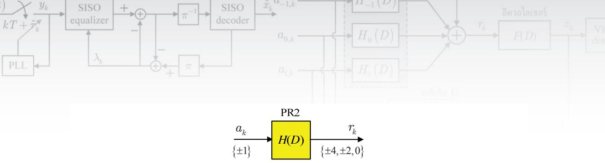  
รูปที่ ง.1 ช่องสัญญาณ PR2

$$
\lambda _ { k } = \log \left( \frac { \operatorname* { P r } \left[ a _ { k } = 1 \mid \left\{ \lambda _ { k } \right\} \right] } { \operatorname* { P r } \left[ a _ { k } = - 1 \mid \left\{ \lambda _ { k } \right\} \right] } \right)
$$

จะได้ว่า

$$
\operatorname* { P r } \Bigl [ a _ { k } = 1 | \bigl \{ \lambda _ { k } \bigr \} \Bigr ] = \frac { e ^ { \lambda _ { k } / 2 } } { e ^ { \lambda _ { k } / 2 } + e ^ { - \lambda _ { k } / 2 } } \qquad \mathfrak { U A } _ { \circ } ^ { \circ } , \quad \operatorname* { P r } \Bigl [ a _ { k } = - 1 | \bigl \{ \lambda _ { k } \bigr \} \Bigr ] = \frac { e ^ { - \lambda _ { k } / 2 } } { e ^ { \lambda _ { k } / 2 } + e ^ { - \lambda _ { k } / 2 } }
$$

จากรูปที่ ง.1 ข้อมูลเอาต์พุตของช่องสัญญาณ $r _ { k } = - 4$ ก็ต่อเมื่อข้อมูลอินพุตมีค่าเท่ากับ $\{ a _ { k } , \ a _ { k - 1 } , \ a _ { k - 2 } \} = \{ - 1 , - 1 , - 1 \}$ ดังนั้นจะได้ว่า

$$
\mathrm { P r } \Big [ r _ { k } = - 4 \mid \big \{ \lambda _ { k } \big \} \Big ] = \mathrm { P r } \Big [ a _ { k } = - 1 \mid \big \{ \lambda _ { k } \big \} \Big ] \times \mathrm { P r } \Big [ a _ { k - 1 } = - 1 \mid \big \{ \lambda _ { k } \big \} \Big ] \times \mathrm { P r } \Big [ a _ { k - 2 } = - 1 \mid \big \{ \lambda _ { k } \big \} \Big ]
$$

$$
= \left( \frac { e ^ { - \lambda _ { k } / 2 } } { e ^ { \lambda _ { k } / 2 } + e ^ { - \lambda _ { k } / 2 } } \right) \left( \frac { e ^ { - \lambda _ { k - 1 } / 2 } } { e ^ { \lambda _ { k - 1 } / 2 } + e ^ { - \lambda _ { k - 1 } / 2 } } \right) \left( \frac { e ^ { - \lambda _ { k - 2 } / 2 } } { e ^ { \lambda _ { k - 2 } / 2 } + e ^ { - \lambda _ { k - 2 } / 2 } } \right)\tag{ง.2}
$$

และข้อมูลเอาต์พุตของช่องสัญญาณ $r _ { k } = 4$ ก็ต่อเมื่อข้อมูลอินพุตมีค่าเท่ากับ $\left\{ a _ { k } , \ a _ { k - 1 } , \ a _ { k - 2 } \right\} =$ {1, 1, 1} ซึ่งจะได้ว่า

$$
\operatorname* { P r } \Big [ r _ { k } = 4 \mid \Big \{ \lambda _ { k } \Big \} \Big ] = \operatorname* { P r } \Big [ a _ { k } = 1 | \Big \{ \lambda _ { k } \Big \} \Big ] \times \operatorname* { P r } \Big [ a _ { k - 1 } = 1 | \Big \{ \lambda _ { k } \Big \} \Big ] \times \operatorname* { P r } \Big [ a _ { k - 2 } = 1 | \Big \{ \lambda _ { k } \Big \} \Big ]
$$

$$
= \left( { \frac { e ^ { \lambda _ { k } / 2 } } { e ^ { \lambda _ { k } / 2 } + e ^ { - \lambda _ { k } / 2 } } } \right) \left( { \frac { e ^ { \lambda _ { k - 1 } / 2 } } { e ^ { \lambda _ { k - 1 } / 2 } + e ^ { - \lambda _ { k - 1 } / 2 } } } \right) \left( { \frac { e ^ { \lambda _ { k - 2 } / 2 } } { e ^ { \lambda _ { k - 2 } / 2 } + e ^ { - \lambda _ { k - 2 } / 2 } } } \right)\tag{ง.3}
$$

ในทำนองเดียวกันข้อมูลเอาต์พุตของช่องสัญญาณ $r _ { k } = - 2$ ก็ต่อเมื่อข้อมูลอินพุตมีค่าเท่ากับ $\{ a _ { k } ,$ $a _ { k - 1 } , \ a _ { k - 2 } \} = \{ - 1 , - 1 , 1 \}$ หรือ {1, −1, −1} ซึ่งจะได้ว่า

$$
\mathrm { P r } \Big [ r _ { k } = - 2 \mid \big \{ \lambda _ { k } \big \} \Big ] = \mathrm { P r } \Big [ a _ { k } = - 1 \mid \big \{ \lambda _ { k } \big \} \Big ] \times \mathrm { P r } \Big [ a _ { k - 1 } = - 1 \mid \big \{ \lambda _ { k } \big \} \Big ] \times \mathrm { P r } \Big [ a _ { k - 2 } = 1 | \big \{ \lambda _ { k } \big \} \Big ]
$$

$$
\begin{array} { r l } { \frac { \| \tilde { \rho } ( t ) - \| \tilde { \rho } ( t ) \| } { \sqrt { \pi ( t , D ) } } \Bigg | _ { t = - \infty } \Bigg | \frac { \| \tilde { \rho } ( t ) \| _ { t = \infty } \sqrt { \kappa ( t ) } } { \sqrt { \kappa ( t , D ) } } \Bigg | \frac { \tilde { \rho } ( t ) - \| \tilde { \rho } ( t ) \| _ { t = \infty } ^ { y } \sqrt { \kappa ( t ) } - \tilde { \gamma } _ { t } - \bigg | \tilde { \rho } ( t ) \| _ { t = \infty } ^ { \infty } \sqrt { \kappa ( t ) } - \tilde { \rho } ( t - t ) \sqrt { \kappa ( t ) } - \bigg | \frac { \tilde { \rho } ( t ) \tilde { \rho } ( t ) \tilde { \rho } ( t ) } { \sqrt { \kappa ( t ) - \kappa ( t ) } } \Bigg | } { \sqrt { \kappa ( t ) - \kappa ( t ) } } } & { \frac { \| \tilde { \rho } ( t ) - \| \tilde { \rho } ( t ) \| _ { t = \infty } ^ { \infty } \sqrt { \kappa ( t ) } - \sqrt { \kappa ( t ) } } { \sqrt { \kappa ( t ) - \kappa ( t ) } } } \\ & { + \mathbb { P r } \Big [ \tilde { \rho } _ { t } = 1 \| \{ \lambda _ { t } \} \Big ] \times \mathbb { P r } \Big [ \tilde { \rho } _ { t } \Big ( t _ { \infty } - 1 ) \Big | \{ \lambda _ { t } \Big \} \Big ] \times \mathbb { P r } \Big [ \tilde { \rho } _ { t } \Big ( t _ { \infty } - 1 ) \Big | \{ \lambda _ { t } \Big \} \Big ] } \\ &  = \Bigg [ \frac { \tilde { \rho } ( t ) - \tilde { \rho } ( t ) } { \sqrt { \kappa ^ { 2 } + \kappa ^ { 2 } + \lambda ^ { 2 } } } \Bigg ] \Bigg | \frac { \tilde { \rho } ( t ) - \tilde { \rho } ( t ) ^ { 2 } } { \sqrt { \kappa ^ { 2 } + \lambda ^ { 2 } } + \zeta ^ { 2 } } \Bigg | \frac  \| \tilde { \rho } ( t ) - \tilde { \rho } ( t ) \| _  t = \infty \end{array}
$$

สุดท้ายเมื่อข้อมูลเอาต์พุตของช่องสัญญาณ $r _ { k } = 2$ ก็ต่อเมื่อข้อมูลอินพุตมีค่าเท่ากับ $\{ a _ { k } , \ a _ { k - 1 } ,$ $a _ { k - 2 } \} = \{ - 1 , 1 , 1 \}$ หรือ {1, 1, -1} ซึ่งจะได้ว่า

$$
\begin{array} { r l } & { \operatorname* { P r } \Bigl [ r _ { k } = 2 \mid \left\{ \lambda _ { k } \right\} \Bigr ] = \operatorname* { P r } \Bigl [ a _ { k } = - 1 \mid \left\{ \lambda _ { k } \right\} \Bigr ] \times \operatorname* { P r } \Bigl [ a _ { k - 1 } = 1 \mid \left\{ \lambda _ { k } \right\} \Bigr ] \times \operatorname* { P r } \Bigl [ a _ { k - 2 } = 1 \mid \left\{ \lambda _ { k } \right\} \Bigr ] } \\ & { \qquad + \operatorname* { P r } \Bigl [ a _ { k } = 1 \mid \left\{ \lambda _ { k } \right\} \Bigr ] \times \operatorname* { P r } \Bigl [ a _ { k - 1 } = 1 \mid \left\{ \lambda _ { k } \right\} \Bigr ] \times \operatorname* { P r } \Bigl [ a _ { k - 2 } = - 1 \mid \left\{ \lambda _ { k } \right\} \Bigr ] } \\ & { = \Bigg ( \frac { e ^ { - \lambda _ { k } / 2 } } { e ^ { \lambda _ { k } / 2 } + e ^ { - \lambda _ { k } / 2 } } \Bigg ) \Bigg ( \frac { e ^ { \lambda _ { k } \nu / 2 } } { e ^ { \lambda _ { k } / 2 } + e ^ { - \lambda _ { k } / 2 } } \Bigg ) \Bigg ( \frac { e ^ { \lambda _ { k } z / 2 } } { e ^ { \lambda _ { k } z / 2 } + e ^ { - \lambda _ { k } - 2 / 2 } } \Bigg ) } \\ & { \qquad + \Bigg ( \frac { e ^ { \lambda _ { k } / 2 } } { e ^ { \lambda _ { k } z / 2 } + e ^ { - \lambda _ { k } z / 2 } } \Bigg ) \Bigg ( \frac { e ^ { \lambda _ { k } z / 2 } } { e ^ { \lambda _ { k } z / 2 } + e ^ { - \lambda _ { k } z / 2 } } \Bigg ) \Bigg ( \frac { e ^ { - \lambda _ { k } z / 2 } } { e ^ { \lambda _ { k } z / 2 } + e ^ { - \lambda _ { k } z / 2 } } \Bigg ) } \end{array}\tag{ง.5}
$$

ถ้ากำหนดให้ $a = \lambda _ { k } / 2 , b = \lambda _ { k - 1 } / 2 ,$ และ $c = \lambda _ { k - 2 } / 2$ จากนั้นแทนค่าเหล่านี้ลงใน สมการ (ง.2) - (ง.5) จากนั้นแทนสมการ (ง.2) - (.5) ลงในสมการ (ง.1) โดยอาศัย cosh $( x ) =$ $\left( e ^ { x } + e ^ { - x } \right) / 2$ และ sinh $\displaystyle \left( x \right) = \left( e ^ { x } - e ^ { - x } \right) / 2$ ก็จะได้

$$
\begin{array} { r l } & { \tilde { r } _ { k } = \left\{ \frac { \left( - 2 e ^ { - a } e ^ { - b } e ^ { - c } \right) + 2 e ^ { a } e ^ { b } e ^ { c } + \left( - e ^ { - a } e ^ { - b } e ^ { c } \right) + \left( - e ^ { a } e ^ { - b } e ^ { - c } \right) + e ^ { - a } e ^ { b } e ^ { c } + e ^ { a } e ^ { b } e ^ { - c } } { 4 \cosh \left( a \right) \cosh \left( b \right) \cosh \left( c \right) } \right\} } \\ & { \qquad = \left\{ \frac { - 2 e ^ { - \left( a + b + c \right) } + 2 e ^ { \left( a + b + c \right) } - e ^ { - \left( a + b - c \right) } - e ^ { - \left( c + a + b + c \right) } + e ^ { \left( c - a + b + c \right) } } { 4 \cosh \left( a \right) \cosh \left( b \right) \cosh \left( c \right) } \right\} } \\ & { \qquad = \left\{ \frac { 2 \sinh \left( a + b + c \right) + \sinh \left( a + b - c \right) + \sinh \left( - a + b + c \right) } { 2 \cosh \left( a \right) \cosh \left( b \right) \cosh \left( c \right) } \right\} } \end{array}\tag{ง.6}
$$

แทนค่า $a = \lambda _ { \scriptscriptstyle k } / 2 , b = \lambda _ { \scriptscriptstyle k - 1 } / 2 .$ และ $c = \lambda _ { k - 2 } / 2$ ลงในสมการ (ง.6) ก็จะได้ผลลัพธ์เป็น

$$
\tilde { r } _ { k } = \frac { C _ { 1 } + C _ { 2 } + C _ { 3 } } { 2 \cosh \left( \lambda _ { k } \mathrm { ~ / ~ } 2 \right) \cosh \left( \lambda _ { k - 1 } \mathrm { ~ / ~ } 2 \right) \cosh \left( \lambda _ { k - 2 } \mathrm { ~ / ~ } 2 \right) }\tag{ง.7}
$$

โดยที่ค่าคงตัว $C _ { 1 } = 2 \sinh \Bigl ( \bigl ( \lambda _ { k } + \lambda _ { k - 1 } + \lambda _ { k - 2 } \bigr ) / 2 \Bigr ) , ~ C _ { 2 } = \sinh \Bigl ( \bigl ( \lambda _ { k } + \lambda _ { k - 1 } - \lambda _ { k - 2 } \bigr ) / 2 \Bigr )$ และ $C _ { 3 } = \sinh \left( \left( - \lambda _ { k } + \lambda _ { k - 1 } + \lambda _ { k - 2 } \right) / 2 \right)$ ซึ่งตรงกับสมการ (5.23) ตามที่ต้องการ

## บรรณานุกรม

[1] ปิยะ โควินท์ทวีวัฒน์, การประมวลผลสัญญาณสำหรับการจัดเก็บข้อมูลดิจิทัล เล่ม 1: พื้นฐานช่องสัญญาณ อ่าน. ศูนย์เทคโนโลยีอิเล็กทรอนิกส์และคอมพิวเตอร์แห่งชาติ (เนคเทค), 2550.

[2] S. B. Wicker, Error control systems for digital communication and storage. New Jersey: Printice Hall International, 1995

[3] C. Berrou, A. Glavieux and P. Thitimajshima, "Near Shannon limit error-correction coding and decoding: Turbo-codes," in Proc. of ICC'1993, pp. 1064 – 1070, Geneva, Switzerland, May 1993.

[4] J. R. Barry, D. G. Messerschmitt, and E. A. Lee, Digital Communication. Springer, 3rd ed., 2003.

[5] E. M. Kurtas and B. Vasic, Advanced Error Control Techniques for Data Storage Systems. CRC press, 2006.

[6] Hitachi Global Storage Technologies [online], Available http:/www.hitachigst.com/ internaldrives/mobile/travelstar/travelstar-5k500b [Access: October 17, 2010]

[7] J. Moon, "The role of signal processing in data-storage," IEEE Signal Processing Magazine, pp. 54 – 72, July 1998.

[8] B. Vasic and E. M. Kurtas, Coding and Signal Processing for Recording Systems. CRC press, 2005.

[9] K. A. S. Immink, "Runlength-limited sequences," in Proc. of the IEEE, vol. 78, no. 11, pp. 1745 – 1759, November 1990.

[10] ปิยะ โควินท์ทวีวัฒน์, การประมวลผลสัญญาณสำหรับการจัดเก็บข้อมูลดิจิทัล เล่ม 2: การออกแบบวงจร ภาครับ. ศูนย์เทคโนโลยีอิเล็กทรอนิกส์และคอมพิวเตอร์แห่งชาติ (เนคเทค), 2550.

[11] J. W. M. Bergmans, Digital baseband transmission and recording. Boston/London/ Dordrecht: Kluwer Academic Publishers, 1996.

[12] T. A. Roscamp, E. D. Boerner, and G. J. Parker, "Three-dimensional modeling of perpendicular recording with soft underlayer," J. of Applied Physics, vol. 91, no. 10, May 2002.

[13] G. D. Forney, "Maximum-likelihood sequence estimation of digital sequences in the presence of intersymbol interference," IEEE Trans. Inform. Theory, vol. IT-18, no. 3, pp. 363 – 378, May 1972.

[14] J. Moon and W. Zeng, "Equalization for maximum likelihood detector," IEEE Trans. Magnetics, vol. 31, no. 2, pp. 1083 – 1088, March 1995.

[15] P. Kovintavewat, I. Ozgunes, E. Kurtas, J. R. Barry, and S. W. McLaughlin, "Generalized partial response targets for perpendicular recording with jitter noise," IEEE Trans. Magnetics, vol. 38, no. 5, pp. 2340 . 2342, September 2002.

[16] B. Sklar, Digital communications: fundamentals and applications. Prentice Hall, 2nd-ed., 2001.

[17] R. Gallager, 'Low-density parity-check codes," IRE Trans. Inform. Theory, vol. IT-8, pp. 21 – 28, January 1962.

[18] L. R. Bahl, J. Cocke, F. Jelinek and J. Raviv, "Optimal decoding of linear codes for minimizing symbol error rate," IEEE Trans. Inform. Theory, vol. IT-20, pp. 248 – 287, March 1974.

[19] J. Hagenauer and P. Hoeher, "A Viterbi algorithm with soft-decision outputs and its applications," in Proc. of Globecom'89, pp. 1680 – 1686, November 1989.

[20] B. Zhou, L. Zhang, J. Kang, Q. Huang, Y. Y. Tai, S. Lin, and M. Xu, 'Non-binary LDPC codes vs. Reed-Solomon codes," in Proc. of Information Theory and Applications Workshop, San Diego, CA, pp. 175 – 184, January 27 - February 1, 2008,

[21] C. Douillard, M. Jezequel and C. Berrou, "Iterative correction of intersymbol interference: Turboequalization," Eur. Trans. Telecommun., vol. 6, no. 5, pp. 507 – 511, September – October 1995.

[22] R. Koetter, A. C. Singer, and M. Tüchler, "Turbo Equalization," IEEE Signal Processing Magazine, vol. 21, pp. 67 – 80, 2004.

[23] P. Robertson, E. Villebrun, and P. Hoeher, "A comparison of optimal and sub—optimal MAP decoding algorithms operating in the log domain," in Proc. of ICC'95, pp. 1009 – 1013, 1995.

[24] P. Robertson, P. Hoeher, and E. Villebrun, "Optimal and sub-optimal maximum a posteriori algorithms suitable for turbo decoding," European. Trans. Telecomm., vol. 8, pp. 119 – 125, Mar.-Apr. 1997.

[25] C. E. Shannon, "A mathematical theory of communication," Bell System Technical Journal, vol. 27, pp. 379 – 423, 623 – 656, July, October, 1948.

[26] S. A. Barbulescu and S. S. Pietrobon, "Interleaver design for turbo codes," Electron. Lett., vol. 30, no. 25, pp. 2107 – 2108, December 1994.

[27] M. Oberg, A. Vityaev, and P. H. Siegel, "The effect of puncturing in turbo encoders," in Proc. Int. Symp. Turbo Codes and Related Topics, Brest, France, Sept. 1997, pp. 184 – 187.

[28] D. Divsalar and F. Pollara, "Turbo codes for PCS applications," in Proc. of ICC'95, Seattle, WA, June 1995, pp. 54 – 59.

[29] S. Benedetto and G. Montorsi, "Unveiling turbo codes: some results on parallel concatenated coding schemes," IEEE Trans. Inform. Theory, vol. 42, no. 2, March 1996, pp. 409 – 429.