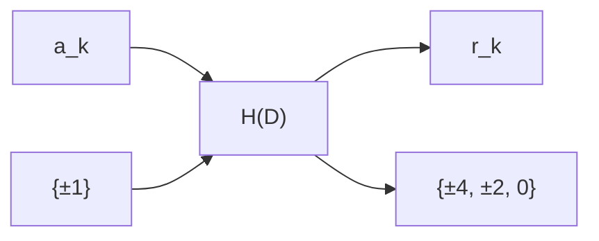

# ภาคผนวก ก

# ฟังก์ชันลอการิทีมาจาโดเบียน

ภาคผนวกนี้จะพิสูจน์ฟังก์ชันลอการิทีผา Hydeเปียน (Jacobian logarithm) ในสมการ (3.15) นั่นคือ

$$
\ln \left(e ^ {a} + e ^ {b}\right) = \max (a, b) + \ln \left(1 + e ^ {- | a - b |}\right) \tag {n.1}
$$

เมื่อ a และ b คือค่าคงตัวใดๆ โดยการพิสสูจน์จะแบ่งออกเป็น 2 กรณี ตั้งนี้

1) กรณีที่ a > b จะได้ว่า

$$
\begin{array}{l} \ln \left(e ^ {a} + e ^ {b}\right) = \ln \left(e ^ {a} \left\{1 + \frac {e ^ {b}}{e ^ {a}} \right\}\right) = \ln \left(e ^ {a} \left\{1 + e ^ {b - a} \right\}\right) \\ = \ln \left(e ^ {a}\right) + \ln \left(1 + e ^ {- (a - b)}\right) \\ = a + \ln \left(1 + e ^ {- (a - b)}\right) \tag {n.2} \\ \end{array}
$$

2) กรณีที่ b > a จะได้ว่า

$$
\begin{array}{l} \ln \left(e ^ {a} + e ^ {b}\right) = \ln \left(e ^ {b} \left\{\frac {e ^ {a}}{e ^ {b}} + 1 \right\}\right) = \ln \left(e ^ {b} \left\{1 + e ^ {a - b} \right\}\right) \\ = \ln \left(e ^ {b}\right) + \ln \left(1 + e ^ {- (b - a)}\right) \\ = b + \ln \left(1 + e ^ {- (b - a)}\right) \tag {n.3} \\ \end{array}
$$


<details>
<summary>flowchart</summary>

Signal processing flowchart for SISO equalizer and SISO decoder, including blocks H-1(D), H0(D), H1(D), and F(D) with input parameters like a_k, a_0,k, a_1,k, and output z_k.
</details>

ดังนั้นเมื่อรวมทั้งสองกรณี  Natalieได้ผลลัพธ์เป็น

$$
\ln \left(e ^ {a} + e ^ {b}\right) = \max (a, b) + \ln \left(1 + e ^ {- | a - b |}\right) \tag {n.4}
$$

ชิ่งตรงกับสมการ (3.15) ตามที่ต้องการ

# ภาคผนวก ข

# กฎของไฮเพอร์โบลิกแทนเจนต์

ภาคผนวกนี้จะพิสูจน์กฏของไฮเพอร์โบลิกแทนเจนต์ (tanh rule) ในสมการ (4.30) ดังนี้ ถ้าให้ฟังก์ชันพาริตี Φ(c) ∈ {0,1} คือค่าพาริตีของเซตข้อมูล c = [c₁, c₂, ..., cₙ] จำนวน n บิต เมื่อ cᵢ ∈ {0,1} ดังนี้นฟังก์ชันพาริตี Φ(c) สามารถหาได้จาก

$$
\Phi (\mathbf {c}) = \frac {1}{2} \left(1 - \prod_ {i = 1} ^ {n} \left(1 - 2 c _ {i}\right)\right) \tag {1.1}
$$

เนื่องจาก $\Phi(\mathbf{c})=0$ โดยที่ $\mathbf{c}$ มีเลขหนึ่งรวมกันเป็นจำนวนดู่ และ $\Phi(\mathbf{c})=1$ เมื่อ $\mathbf{c}$ มีเลขหนึ่งรวมกันเป็นจำนวนดี่ นอกจากนี้ความน่าจะเป็น (probability) ที่ $\Phi(\mathbf{c})=1$ มีค่าเท่ากับค่าคาดหมาย (expected value) ของ $\Phi(\mathbf{c})$ นั่นคือ

$$
\begin{array}{l} \operatorname * {P r} \left[ \Phi (\mathbf {c}) = 1 \right] = E \left[ \Phi (\mathbf {c}) \right] \\ = (1) \operatorname * {P r} [ \Phi (\mathbf {c}) = 1 ] + (0) \operatorname * {P r} [ \Phi (\mathbf {c}) = 0 ] \\ = \frac {1}{2} \left(1 - E \left[ \prod_ {i = 1} ^ {n} \left(1 - 2 c _ {i}\right) \right]\right) \\ = \frac {1}{2} \left(1 - \prod_ {i = 1} ^ {n} \left(1 - 2 E \left[ c _ {i} \right]\right)\right) \quad \text {(เนื่องจากความเป็นอิสระต่อกัน)} \\ = \frac {1}{2} \left(1 - \prod_ {i = 1} ^ {n} \left(1 - \frac {2 e ^ {\lambda_ {i}}}{1 + e ^ {\lambda_ {i}}}\right)\right) \\ \end{array}
$$

$$
= \frac {1}{2} \left(1 - \prod_ {i = 1} ^ {n} \left(\frac {1 - e ^ {\lambda_ {i}}}{1 + e ^ {\lambda_ {i}}}\right)\right)
$$

$$
= \frac {1}{2} \left(1 - \prod_ {i = 1} ^ {n} \tanh \left(\frac {- \lambda_ {i}}{2}\right)\right) \tag {y.2}
$$

เมื่อ E[.] คือตัวดำเนินการค่าคาดหมาย (expectation operator) และเนื่องจาก $\Pr\left[\Phi(\mathbf{c})=0\right]=1-\Pr\left[\Phi(\mathbf{c})=1\right]$ เพาะหะนั้นค่า LLR ของ $\Phi(\mathbf{c})$ มีค่าเท่ากับ

$$
\lambda_ {\Phi (\mathbf {c})} = \log \left(\frac {\operatorname* {P r} \left[ \Phi (\mathbf {c}) = 1 \right]}{\operatorname* {P r} \left[ \Phi (\mathbf {c}) = 0 \right]}\right) = \log \left(\frac {1 - \prod_ {i} \tanh \left(- \lambda_ {i} / 2\right)}{1 + \prod_ {i} \tanh \left(- \lambda_ {i} / 2\right)}\right) \tag {y.3}
$$

อาศัยคุณสมบัติที่ว่า $\tanh(-\lambda/2)=(1-e^{\lambda})/(1+e^{\lambda})$ และไห่ $\Psi=\prod_{i=1}^{n}\tanh(-\lambda_{i}/2)$ ดังนั้น

$$
\tanh \left(\frac {- \lambda_ {\Phi (\mathbf {c})}}{2}\right) = \frac {1 - \left(\frac {1 - \Psi}{1 + \Psi}\right)}{1 + \left(\frac {1 - \Psi}{1 + \Psi}\right)} = \frac {(1 + \Psi) - (1 - \Psi)}{(1 + \Psi) + (1 - \Psi)} = \Psi = \prod_ {i = 1} ^ {n} \tanh \left(\frac {- \lambda_ {i}}{2}\right) \tag {1.4}
$$

ชิ่งตรงกับสมการ (4.30) ตามที่ต้องการ

# ภาคผนวก ด

# ความสมมูลของสมการ (4.30) และ (4.32)

ภาคผนวกนี้จะแสดงให้เห็นว่าสมการ (4.30) และ (4.32) มีค่าเท่ากัน ให้พิจารณากฏของไฮเพอร์ โบลิกแทนเจนต์ (tanh rule) ในสมการ (4.30) นั่นคือ

$$
\tanh \left(\frac {- \lambda_ {\Phi (\mathbf {c})}}{2}\right) = \prod_ {i = 1} ^ {n} \tanh \left(\frac {- \lambda_ {i}}{2}\right) \tag {9.1}
$$

สำหรับ $\lambda_{i}$ ที่เป็นเลขจำนวนจริง จะได้ความสัมพันธ์ดังนี้

$$
- \lambda_ {i} = \operatorname{sign} \left(- \lambda_ {i}\right) \times \left| - \lambda_ {i} \right| \tag {n.2}
$$

โดยที่ $\left|x\right|$ คือค่าสัมบูรณ์ของ x, และ $\text{sign}(x)=+1$ เมื่อ $x\geq0$ และ $\text{sign}(x)=-1$ เมื่อ x<0 จากนั้นแทนค่าสมการ (ค.2) ลงในสมการ (ค.1) ก็จะได้ผลลัพธ์เป็น 2 สมการคือ

$$
\operatorname{sign} \left(- \lambda_ {\Phi (\mathfrak {c})}\right) = \prod_ {i = 1} ^ {n} \operatorname{sign} \left(- \lambda_ {i}\right) \tag {9.3}
$$

$$
\tanh \left(\frac {\left| \lambda_ {\Phi (\mathbf {c})} \right|}{2}\right) = \prod_ {i = 1} ^ {n} \tanh \left(\frac {\left| \lambda_ {i} \right|}{2}\right) \tag {9.4}
$$

ใส่ฟังก์ชัน -log(.) เข้าไปทั้งสองข้างของสมการ (ค.4) ก็จะได้

$$
f \left(\left| \lambda_ {\Phi (\mathfrak {c})} \right|\right) = \sum_ {i = 1} ^ {n} f \left(\left| \lambda_ {i} \right|\right) \tag {9.5}
$$


<details>
<summary>flowchart</summary>

Signal processing flowchart for SISO equalizer and SISO decoder, including PLL, H-1, H0, H1 components and output filter
</details>

โดยที่ $f(x) = -\log\left(\tanh(x/2)\right)$ ตามสมการ (4.33) ซึ่งมีคุณสมบัติที่สำคัญคือ $f(f(x)) = x$ สำหรับ x > 0 ตั้งนั้นถ้าใส่ฟังก์ชัน $f(.)$ เข้าไปทั้งสองข้างของสมการ (ค.5) ก็จะได้

$$
\left| \lambda_ {\Phi (\mathbf {c})} \right| = f \left(\sum_ {i = 1} ^ {n} f \left(\left| \lambda_ {i} \right|\right)\right) \tag {n.6}
$$

และเมื่อนำสมการ (ค.3) และ (ค.6) มารวมกัน ก็จะได้ผลลัพธ์เป็น

$$
\lambda_ {\Phi (\mathfrak {c})} = - \prod_ {i = 1} ^ {n} \operatorname{sign} \left(- \lambda_ {i}\right) \times f \left(\sum_ {i = 1} ^ {n} f \left(\left| \lambda_ {i} \right|\right)\right) \tag {n.7}
$$

ชิ่งตรงกับสมการ (4.32) ตามที่ต้องการ
# ภาคผนวกง

# การหาค่าประมาณแบบซอฟต์

# สำหรับช่องสัญญาณ PR2

ภาคผนวกนี้จะแสดงวิธีการหาค่าประมาณแบบซอฟต์สำหรับช่องสัญญาณ PR2 ตามสมการ (5.23) ตั้งนี้ พิจารณาแบบจำลองช่องสัญญาณ PR2 ในรูปที่ ง.1 เมื่อลำตับข้อมูลอินพุต $^{61}$ $a_{k} \in \{\pm 1\}$ จะ ถูกส่งเข้าช่องสัญญาณ PR2 นั้นคือ $H(D) = \sum_{k} h_{k} D^{k} = 1 + 2D + D^{2}$ เมื่อล D ตัวดำเนินการ หน่วงเวลาหนึ่งหน่วย ทำให้ได้เป็นลำตับข้อมูล $r_{k} = a_{k} * h_{k} \in \{0, \pm 2, \pm 4\}$

ณ วงจรภาครับ อีควอไลเซอร์แบบเทอร์โบจะสร้างข่าวสารแบบซอฟต์หรือค่า LLR $\{\lambda_{k}\}$ สำหรับลำดับข้อมูล $\{a_{k}\}$ เพื่อใช้ในการแลกเปลี่ยนข่าวสารระหว่างอีควอไลเซอร์ SOVA และวงจร gloอตรหัส LDPC เมื่อพิจารณาระบบที่ไม่มีหน่วยความจำ “สไลเซอร์แบบซอฟต์ (soft slicer)” จะใช้ลำดับข้อมูล $\{\lambda_{k}\}$ ในการคำนวณหาค่าตัดสินใจแบบซอฟต์ $\tilde{r}_{k}=E\left[r_{k}\mid\left\{\lambda_{k}\right\}\right]$ เนื่องจากข้อมูล เอาต์พุตของช่องสัญญาณ PR2 มีค่าเท่ากับ $\{0,\pm2,\pm4\}$ ดังนั้นค่าประมาณแบบซอฟต์ $\tilde{r}_{k}$ หาได้ จาก

$$
\begin{array}{l} \tilde {r} _ {k} = \sum_ {i} m _ {i} \operatorname * {P r} \bigl [ r _ {k} = m _ {i} \mid \{\lambda_ {k} \} \bigr ] \\ = (- 4) \operatorname * {P r} \left[ r _ {k} = - 4 \mid \left\{\lambda_ {k} \right\} \right] + (- 2) \operatorname * {P r} \left[ r _ {k} = - 2 \mid \left\{\lambda_ {k} \right\} \right] \\ + (2) \operatorname * {P r} \left[ r _ {k} = 2 \mid \left\{\lambda_ {k} \right\} \right] + (4) \operatorname * {P r} \left[ r _ {k} = 4 \mid \left\{\lambda_ {k} \right\} \right] \tag {3.1} \\ \end{array}
$$

เมื่อ $m_{i} \in \{0, \pm 2, \pm 4\}$ ถ้ากำหนดให้


<details>
<summary>flowchart</summary>


</details>

รูปที่ ง.1 ช่องสัญญาณ PR2

$$
\lambda_ {k} = \log \left(\frac {\operatorname* {P r} \left[ a _ {k} = 1 \mid \left\{\lambda_ {k} \right\} \right]}{\operatorname* {P r} \left[ a _ {k} = - 1 \mid \left\{\lambda_ {k} \right\} \right]}\right)
$$

จะได้ว่า

$$
\operatorname * {P r} \left[ a _ {k} = 1 \mid \left\{\lambda_ {k} \right\} \right] = \frac {e ^ {\lambda_ {k} / 2}}{e ^ {\lambda_ {k} / 2} + e ^ {- \lambda_ {k} / 2}} \quad \text {年龄} \quad \operatorname * {P r} \left[ a _ {k} = - 1 \mid \left\{\lambda_ {k} \right\} \right] = \frac {e ^ {- \lambda_ {k} / 2}}{e ^ {\lambda_ {k} / 2} + e ^ {- \lambda_ {k} / 2}}
$$

จากรูปที่ ง.1 ข้อมูลเอาต์พุตของช่องสัญญาณ $r_{k} = -4$ ก็ต่อเมื่อข้อมูลอินพุตมีค่าเท่ากับ $\{a_{k}, a_{k-1}, a_{k-2}\} = \{-1, -1, -1\}$ ดังนั้นจะได้ว่า

$$
\begin{array}{l} \operatorname * {P r} \left[ r _ {k} = - 4 \mid \left\{\lambda_ {k} \right\} \right] = \operatorname * {P r} \left[ a _ {k} = - 1 \mid \left\{\lambda_ {k} \right\} \right] \times \operatorname * {P r} \left[ a _ {k - 1} = - 1 \mid \left\{\lambda_ {k} \right\} \right] \times \operatorname * {P r} \left[ a _ {k - 2} = - 1 \mid \left\{\lambda_ {k} \right\} \right] \\ = \left(\frac {e ^ {- \lambda_ {k} / 2}}{e ^ {\lambda_ {k} / 2} + e ^ {- \lambda_ {k} / 2}}\right) \left(\frac {e ^ {- \lambda_ {k - 1} / 2}}{e ^ {\lambda_ {k - 1} / 2} + e ^ {- \lambda_ {k - 1} / 2}}\right) \left(\frac {e ^ {- \lambda_ {k - 2} / 2}}{e ^ {\lambda_ {k - 2} / 2} + e ^ {- \lambda_ {k - 2} / 2}}\right) \tag {1.2} \\ \end{array}
$$

และข้อมูลเอาต์พุตของช่องสัญญาณ $r_{k}=4$ ก็ต่อเมื่อข้อมูลอินพุตมีค่าเท่ากับ $\{a_{k}, a_{k-1}, a_{k-2}\}=\{1,1,1\}$ ชีงจะได้ว่า

$$
\begin{array}{l} \operatorname * {P r} \left[ r _ {k} = 4 \mid \left\{\lambda_ {k} \right\} \right] = \operatorname * {P r} \left[ a _ {k} = 1 \mid \left\{\lambda_ {k} \right\} \right] \times \operatorname * {P r} \left[ a _ {k - 1} = 1 \mid \left\{\lambda_ {k} \right\} \right] \times \operatorname * {P r} \left[ a _ {k - 2} = 1 \mid \left\{\lambda_ {k} \right\} \right] \\ = \left(\frac {e ^ {\lambda_ {k} / 2}}{e ^ {\lambda_ {k} / 2} + e ^ {- \lambda_ {k} / 2}}\right) \left(\frac {e ^ {\lambda_ {k - 1} / 2}}{e ^ {\lambda_ {k - 1} / 2} + e ^ {- \lambda_ {k - 1} / 2}}\right) \left(\frac {e ^ {\lambda_ {k - 2} / 2}}{e ^ {\lambda_ {k - 2} / 2} + e ^ {- \lambda_ {k - 2} / 2}}\right) \tag {1.3} \\ \end{array}
$$

ในつなองเดียวกันข้อมูลเอาต์พุตของช่องสัญญาณ $r_{k} = -2$ ก็ต่อเมื่อข้อมูลอินพุตมีค่าเท่ากับ $\{a_{k}, a_{k-1}, a_{k-2}\} = \{-1, -1, 1\}$ หรือ $\{1, -1, -1\}$ ชีงจะได้ว่า

$$
\operatorname * {P r} \left[ r _ {k} = - 2 \mid \left\{\lambda_ {k} \right\} \right] = \operatorname * {P r} \left[ a _ {k} = - 1 \mid \left\{\lambda_ {k} \right\} \right] \times \operatorname * {P r} \left[ a _ {k - 1} = - 1 \mid \left\{\lambda_ {k} \right\} \right] \times \operatorname * {P r} \left[ a _ {k - 2} = 1 \mid \left\{\lambda_ {k} \right\} \right]
$$

$$
+ \operatorname * {P r} \left[ a _ {k} = 1 \mid \left\{\lambda_ {k} \right\} \right] \times \operatorname * {P r} \left[ a _ {k - 1} = - 1 \mid \left\{\lambda_ {k} \right\} \right] \times \operatorname * {P r} \left[ a _ {k - 2} = - 1 \mid \left\{\lambda_ {k} \right\} \right]
$$

$$
= \left(\frac {e ^ {- \lambda_ {k} / 2}}{e ^ {\lambda_ {k} / 2} + e ^ {- \lambda_ {k} / 2}}\right) \left(\frac {e ^ {- \lambda_ {k - 1} / 2}}{e ^ {\lambda_ {k - 1} / 2} + e ^ {- \lambda_ {k - 1} / 2}}\right) \left(\frac {e ^ {\lambda_ {k - 2} / 2}}{e ^ {\lambda_ {k - 2} / 2} + e ^ {- \lambda_ {k - 2} / 2}}\right)
$$

$$
+ \left(\frac {e ^ {\lambda_ {k} / 2}}{e ^ {\lambda_ {k} / 2} + e ^ {- \lambda_ {k} / 2}}\right) \left(\frac {e ^ {- \lambda_ {k - 1} / 2}}{e ^ {\lambda_ {k - 1} / 2} + e ^ {- \lambda_ {k - 1} / 2}}\right) \left(\frac {e ^ {- \lambda_ {k - 2} / 2}}{e ^ {\lambda_ {k - 2} / 2} + e ^ {- \lambda_ {k - 2} / 2}}\right) \tag {1.4}
$$

สุดท้ายเมื่อข้อมูลเอาต์พุตของช่องสัญญาณ $r_{k}=2$ ก็ต่อเมื่อข้อมูลอินพุตมีค่าเท่ากับ $\{a_{k}, a_{k-1}, a_{k-2}\}=\{-1,1,1\}$ หรือ $\{1,1,-1\}$ ซึ่งจะได้ว่า

$$
\operatorname * {P r} \left[ r _ {k} = 2 \mid \left\{\lambda_ {k} \right\} \right] = \operatorname * {P r} \left[ a _ {k} = - 1 \mid \left\{\lambda_ {k} \right\} \right] \times \operatorname * {P r} \left[ a _ {k - 1} = 1 \mid \left\{\lambda_ {k} \right\} \right] \times \operatorname * {P r} \left[ a _ {k - 2} = 1 \mid \left\{\lambda_ {k} \right\} \right]
$$

$$
+ \operatorname * {P r} \left[ a _ {k} = 1 \mid \left\{\lambda_ {k} \right\} \right] \times \operatorname * {P r} \left[ a _ {k - 1} = 1 \mid \left\{\lambda_ {k} \right\} \right] \times \operatorname * {P r} \left[ a _ {k - 2} = - 1 \mid \left\{\lambda_ {k} \right\} \right]
$$

$$
= \left(\frac {e ^ {- \lambda_ {k} / 2}}{e ^ {\lambda_ {k} / 2} + e ^ {- \lambda_ {k} / 2}}\right) \left(\frac {e ^ {\lambda_ {k - 1} / 2}}{e ^ {\lambda_ {k - 1} / 2} + e ^ {- \lambda_ {k - 1} / 2}}\right) \left(\frac {e ^ {\lambda_ {k - 2} / 2}}{e ^ {\lambda_ {k - 2} / 2} + e ^ {- \lambda_ {k - 2} / 2}}\right)
$$

$$
+ \left(\frac {e ^ {\lambda_ {k} / 2}}{e ^ {\lambda_ {k} / 2} + e ^ {- \lambda_ {k} / 2}}\right) \left(\frac {e ^ {\lambda_ {k - 1} / 2}}{e ^ {\lambda_ {k - 1} / 2} + e ^ {- \lambda_ {k - 1} / 2}}\right) \left(\frac {e ^ {- \lambda_ {k - 2} / 2}}{e ^ {\lambda_ {k - 2} / 2} + e ^ {- \lambda_ {k - 2} / 2}}\right) \tag {1.5}
$$

ถ้ากำหนดให้ $a = \lambda_{k} / 2$ , $b = \lambda_{k-1} / 2$ , และ $c = \lambda_{k-2} / 2$ จากนี้นแทนค่าเหล่านี้ลงใน
สมการ (ง.2) - (ง.5) จากนี้นแทนสมการ (ง.2) - (ง.5) ลงในสมการ (ง.1) โดยอาศัย $\cosh(x) = \left(e^{x} + e^{-x}\right) / 2$ และ $\sinh(x) = \left(e^{x} - e^{-x}\right) / 2$ ก็จะได้

$$
\tilde {r} _ {k} = \left\{\frac {\left(- 2 e ^ {- a} e ^ {- b} e ^ {- c}\right) + 2 e ^ {a} e ^ {b} e ^ {c} + \left(- e ^ {- a} e ^ {- b} e ^ {c}\right) + \left(- e ^ {a} e ^ {- b} e ^ {- c}\right) + e ^ {- a} e ^ {b} e ^ {c} + e ^ {a} e ^ {b} e ^ {- c}}{4 \cosh (a) \cosh (b) \cosh (c)} \right\}
$$

$$
= \left\{\frac {- 2 e ^ {- (a + b + c)} + 2 e ^ {(a + b + c)} - e ^ {- (a + b - c)} - e ^ {- (- a + b + c)} + e ^ {(- a + b + c)} + e ^ {(a + b - c)}}{4 \cosh (a) \cosh (b) \cosh (c)} \right\}
$$

$$
= \left\{\frac {2 \sinh (a + b + c) + \sinh (a + b - c) + \sinh (- a + b + c)}{2 \cosh (a) \cosh (b) \cosh (c)} \right\} \tag {3.6}
$$


<details>
<summary>flowchart</summary>

```mermaid
```mermaid
graph LR
    A["PLL"] --> B["SISO equalizer"]
    B --> C["+"]
    C --> D["π⁻¹"]
    D --> E["SISO decoder"]
    E --> F["ŷ_k"]
    F --> G["H_1(D)"]
    F --> H["H_0(D)"]
    F --> I["H_0(k)"]
    G --> J["+"]
    H --> J
    I --> J
    J --> K["F(D)"]
    K --> L["z_k"]
    L --> M["Vitdet"]
    B --> N["λ_k"]
    N --> O["+"]
    O --> P["π"]
    P --> Q["+"]
    Q --> R["π"]
    R --> S["+"]
    S --> T["λ_k"]
    T --> U["+"]
    U --> V["π"]
    V --> W["+"]
    W --> X["λ_k"]
    X --> Y["+"]
    Y --> Z["π"]
    Z --> AA["+"]
    AA --> AB["λ_k"]
    AB --> AC["+"]
    AC --> AD["π"]
    AD --> AE["+"]
    AE --> AF["λ_k"]
    AF --> AG["+"]
    AG --> AH["π"]
    AH --> AI["+"]
    AI --> AJ["λ_k"]
    AJ --> AK["+"]
    AK --> AL["π"]
    AL --> AM["+"]
    AM --> AN["λ_k"]
    AN --> AO["+"]
    AO --> AP["π"]
    AP --> AQ["+"]
    AQ --> AR["λ_k"]
    AR --> AS["+"]
    AS --> AT["π"]
    AT --> AU["+"]
    AU --> AV["λ_k"]
    AV --> AW["+"]
    AW --> AX["π"]
    AX --> AY["+"]
    AY --> AZ["λ_k"]
    AZ --> BA["+"]
    BA --> BB["π"]
    BB --> BC["+"]
    BC --> BD["λ_k"]
    BD --> BE["+"]
    BE --> BF["π"]
    BF --> BG["+"]
    BG --> BH["λ_k"]
    BH --> BI["+"]
    BI --> BJ["π"]
    BJ --> BK["+"]
    BK --> BL["λ_k"]
    BL --> BM["+"]
    BM --> BN["π"]
    BN --> BO["+"]
    BO --> BP["λ_k"]
    BP --> BQ["+"]
    BQ --> BR["π"]
    BR --> BS["+"]
    BS --> BT["λ_k"]
    BT --> BU["+"]
    BU --> BV["π"]
    BV --> BW["+"]
    BW --> BX["λ_k"]
    BX --> BY["+"]
    BY --> BZ["π"]
    BZ --> CA["+"]
    CA --> CB["λ_k"]
    CB --> CC["+"]
    CC --> CD["π"]
    CD --> CE["+"]
    CE --> CF["λ_k"]
    CF --> CG["+"]
    CG --> CH["π"]
    CH --> CI["+"]
    CI --> CJ["λ_k"]
    CJ --> CK["+"]
    CK --> CR["π"]
    CR --> CS["+"]
    CS --> CT["λ_k"]
    CT --> CU["+"]
    CU --> CV["π"]
    CV --> CW["+"]
    CW --> CX["λ_k"]
    CX --> CY["+"]
    CY --> CZ["π"]
    CZ --> DA["+"]
    DA --> DB["λ_k"]
    DB --> DC["+"]
    DC --> DD["π"]
    DD --> DV["+"]
    DV --> DW["λ_k"]
    DW --> DX["+"]
    DX --> DXB["π"]
    DXB --> DXC["+"]
    DXC --> DXF["λ_k"]
    DXF --> DXG["+"]
    DXG --> DXH["π"]
    DXH --> DXI["+"]
    DXI --> DXJ["λ_k"]
    DXJ --> DXK["+"]
    DXK --> DXL["π"]
    DXL --> DXM["+"]
    DXM --> DXN["λ_k"]
    DXN --> DXO["+"]
    DXO --> DXP["π"]
    DXP --> DXQ["+"]
    DXQ --> DXR["λ_k"]
    DXR --> DXR
    DXR --> DXR
    DXR --> DXR
    DXR --> DXR
    DXR --> DXR
    DXR --> DXR
    DXR --> DXR
    DXR --> DXR
    DXR --> DXR
    DXR --> DXR
    DXR --> DXR
    DXR --> DXR
    DXR --> DXR
    DXR --> DXR
    DXR --> DXR
    D --> H["H_1(D)"]
    H --> I["+"]
    I --> J["H_0(D)"]
    I --> K["H_0(k)"]
    I --> L["H_0(k)"]
    I --> M["H_0(k)"]
    I --> N["H_0(k)"]
    I --> O["H_0(k)"]
    I --> P["H_0(k)"]
    I --> Q["H_0(k)"]
    I --> R["H_0(k)"]
    I --> S["H_0(k)"]
    I --> T["H_0(k)"]
    I --> U["H_0(k)"]
    I --> V["H_0(k)"]
    I --> W["H_0(k)"]
    I --> X["H_0(k)"]
    I --> Y["H_0(k)"]
    I --> Z["H_0(k)"]
    I --> AA["H_0(k)"]
    I --> AB["H_0(k)"]
    I --> AC["H_0(k)"]
    I --> AD["H_0(k)"]
    I --> AE["H_0(k)"]
    I --> AF["H_0(k)"]
    I --> AG["H_0(k)"]
    I --> AH["H_0(k)"]
    I --> AI["H_0(k)"]
    I --> AJ["H_0(k)"]
    I --> AK["H_0(k)"]
    I --> AL["H_0(k)"]
    I --> AM["H_0(k)"]
    I --> AN["H_0(k)"]
    I --> AO["H_0(k)"]
    I --> AP["H_0(k)"]
    I --> AQ["H_0(k)"]
    I --> AR["H_0(k)"]
    I --> AS["H_0(k)"]
    I --> AT["H_0(k)"]
    I --> AU["H_0(k)"]
    I --> AV["H_0(k)"]
    I --> AW["H_0(k)"]
    I --> AX["H_0(k)"]
    I --> AY["H_0(k)"]
    I --> AZ["H_0(k)"]
    I --> BA["H_0(k)"]
    I --> BB["H_0(k)"]
    I --> BC["H_0(k)"]
    I --> BD["H_0(k)"]
    I --> BE["H_0(k)"]
    I --> BF["H_0(k)"]
    I --> BG["H_0(k)"]
    I --> BH["H_0(k)"]
    I --> BI["H_0(k)"]
    I --> BJ["H_0(k)"]
    I --> BK["H_0(k)"]
    I --> BL["H_0(k)"]
    I --> BM["H_0(k)"]
    I --> BN["H_0(k)"]
    I --> BO["H_0(k)"]
    I --> BP["H_0(k)"]
    I --> BQ["H_0(k)"]
    I --> BR["H_0(k)"]
    I --> BS["H_0(k)"]
    I --> BT["H_0(k)"]
    I --> BU["H_0(k)"]
    I --> BV["H_0(k)"]
    I --> BW["H_0(k)"]
    I --> BX["H_0(k)"]
    I --> BY["H_0(k)"]
    I --> BZ["H_0(k)"]
    I --> CA["H_0(k)"]
    I --> CB["H_0(k)"]
    I --> CC["H_0(k)"]
    I --> DC["H_0(k)"]
    I --> DB["H_0(k)"]
    I --> BE["H_0(k)"]
    I --> BF["H_0(k)"]
    I --> BG["H_0(k)"]
    I --> BH["H_0(k)"]
    I --> BI["H_0(k)"]
    I --> BJ["H_0(k)"]
    I --> BK["H_0(k)"]
    I --> BL["H_0(k)"]
    I --> BM["H_0(k)"]
    I --> BN["H_0(k)"]
    I --> BB["H_0(k)"]
    I --> BC["H_0(k)"]
    I --> BD["H_0(k)"]
    I --> BE["H_0(k)"]
    I --> BF["H_0(k)"]
    I --> BG["H_0(k)"]
    I --> BH["H_0(k)"]
    I --> BI["H_0(k)"]
    I --> BJ["H_0(k)"]
    I --> BK["H_0(k)"]
    I --> BLH["H_0(k)"]
    I --> BNH["H_0(k)"]
    I --> BBH["H_0(k)"]
    I --> BCH["H_0(k)"]
    I --> BDH["H_0(k)"]
    I --> BEH["H_0(k)"]
    I --> BFH["H_0(k)"]
    I --> BGH["H_0(k)"]
    I --> BHH["H_0(k)"]
    I --> BIH["H_0(k)"]
    I --> BJH["H_0(k)"]
    I --> BKH["H_0(k)"]
    I --> BLH["H_0(k)"]
    I --> BNH["H_0(k)"]
    I --> BEH["H_0(k)"]
    I --> BFH["H_0(k)"]
    I --> BGH["H_0(k)"]
    I --> BHH["H_0(k)"]
    I --> BIH["H_0(k)"]
    I --> BJH["H_0(k)"]
    I --> BKH["H_0(k)"]
    I --> BLH["H_0(k)"]
    I --> BNH["H_0(k)"]
    I --> BNH["H_0(k)"]
    I --> BQH["H_0(k)"]
    I --> BNH["H_0(k)"]
    I --> BEH["H_0(k)"]
    I --> BFH["H_0(k)"]
    I --> BGH["H_0(k)"]
    I --> BHH["H_0(k)"]
    I --> BIH["H_0(k)"]
    I --> BJH["H_0(k)"]
    I --> BKH["H_0(k)"]
    I --> BLH["H_0(k)"]
    I --> BQH["H_0(k)"]
    I --> BNH["H_0(k)"]
    I --> BNH["H_0(k)"]
    I --> BQH["H_0(k)"]
    I --> BNH["H_0(k)"]
    I --> BQH["H_0(k)"]
    I --> BQH["H_0(k)"]
    I --> BQH["H_0(k)"]
    I --> BQH["H_0(k)"]
    I --> BQH["H_0(k)"]
    I --> BQH["H_0(k)"]
    I --> BQH["H_0(k)"]
    I --> BQH["H_0(k)"]
    I --> BQH["H_0(k)"]
    I --> BQO["H_0(k)"]
    I --> BQO["H_0(k)"]
    I --> BQO["H_0(k)"]
    I --> BQO["H_0(k)"]
    I --> BQO["H_0(k)"]
    I --> BQO["H_0(k)"]
    I --> BQO["H_0(k)"]
    I --> BQO["H_0(k)"]
    I --> BQO["H_0(k)"]
    I --> BQO H_0(k)
    I --> BQO BQO
    I --> BQO BQO
    I --> BQO BQO
    I --> BQO BQO
    I --> BQO BQO
    I --> BQO BQO
    I --> BQO BQO
    I --> BQO BQO
    I --> BQO BQO
    I --> BQO BQO
    I --> BQO BQO
```
</details>

แทนค่า $a=\lambda_{k}/2$ , $b=\lambda_{k-1}/2$ , และ $c=\lambda_{k-2}/2$ ลงในสมการ (ง.6) ก็จะได้ผลลัพธ์เป็น

$$
\tilde {r} _ {k} = \frac {C _ {1} + C _ {2} + C _ {3}}{2 \cosh \left(\lambda_ {k} / 2\right) \cosh \left(\lambda_ {k - 1} / 2\right) \cosh \left(\lambda_ {k - 2} / 2\right)} \tag {3.7}
$$

โดยที่ค่าคงตัว $C_{1}=2\sinh\left(\left(\lambda_{k}+\lambda_{k-1}+\lambda_{k-2}\right)/2\right)$ ， $C_{2}=\sinh\left(\left(\lambda_{k}+\lambda_{k-1}-\lambda_{k-2}\right)/2\right)$ ，และ $C_{3}=\sinh\left(\left(-\lambda_{k}+\lambda_{k-1}+\lambda_{k-2}\right)/2\right)$ ชีงตรงกับสมการ (5.23) ตามที่ต้องการ

# บรรณาหุกรม

[1] ปิยะ โควินท์ทวีวัฒน์, การประมวลผลสัญญาณสำหรับการจัดเก็บข้อมูลติจิทัล เล่ม 1: พื้นฐานช่องสัญญาณ
อ่าน. ศูนย์เทคโนโลยีอิเล็กทรอนิกส์และคอมพิวเตอร์แห่งชาติ (เนดเทคโนโลย). 2550.   
[2] S. B. Wicker, Error control systems for digital communication and storage. New Jersey: Printice Hall International, 1995   
[3] C. Berrou, A. Glavieux and P. Thitimajshima, “Near Shannon limit error-correction coding and decoding: Turbo-codes,” in Proc. of ICC'1993, pp. 1064 – 1070, Geneva, Switzerland, May 1993.   
[4] J. R. Barry, D. G. Messerschmitt, and E. A. Lee, Digital Communication. Springer, 3rd ed., 2003.   
[5] E. M. Kurtas and B. Vasic, Advanced Error Control Techniques for Data Storage Systems. CRC press, 2006.   
[6] Hitachi Global Storage Technologies [online], Available http://www.hitachigst.com/internal-drives/mobile/travelstar/travelstar-5k500b [Access: October 17, 2010]   
[7] J. Moon, “The role of signal processing in data-storage,” IEEE Signal Processing Magazine, pp. 54 – 72, July 1998.   
[8] B. Vasic and E. M. Kurtas, Coding and Signal Processing for Recording Systems. CRC press, 2005.   
[9] K. A. S. Immink, “Runlength-limited sequences,” in Proc. of the IEEE, vol. 78, no. 11, pp. 1745 – 1759, November 1990.   
[10] ปิยะ โควินท์ทวีวัฒน์, การประมวลผลสัญญาณสำหรับการจัดเก็บข้อมูลดิจิทัล เล่ม 2: การออกแบบวงจร ภาครับ. ศูนย์เทคโนโลยีอิเล็กทรอนิกส์และคอมพิวเตอร์แห่งชาติ (เนดเทค), 2550.   
[11] J. W. M. Bergmans, Digital baseband transmission and recording. Boston/London/Dordrecht: Kluwer Academic Publishers, 1996.   
[12] T. A. Roscamp, E. D. Boerner, and G. J. Parker, “Three-dimensional modeling of perpendicular recording with soft underlayer,” J. of Applied Physics, vol. 91, no. 10, May 2002.   
[13] G. D. Forney, “Maximum-likelihood sequence estimation of digital sequences in the presence of intersymbol interference,” IEEE Trans. Inform. Theory, vol. IT-18, no. 3, pp. 363 – 378, May 1972.

[14] J. Moon and W. Zeng, “Equalization for maximum likelihood detector,” IEEE Trans. Magnetics, vol. 31, no. 2, pp. 1083 – 1088, March 1995.   
[15] P. Kovintavewat, I. Ozgunes, E. Kurtas, J. R. Barry, and S. W. McLaughlin, “Generalized partial response targets for perpendicular recording with jitter noise,” IEEE Trans. Magnetics, vol. 38, no. 5, pp. 2340. 2342, September 2002.   
[16] B. Sklar, Digital communications: fundamentals and applications. Prentice Hall, 2nd-ed., 2001.   
[17] R. Gallager, “Low-density parity-check codes,” IRE Trans. Inform. Theory, vol. IT-8, pp. 21 – 28, January 1962.   
[18] L. R. Bahl, J. Cocke, F. Jelinek and J. Raviv, “Optimal decoding of linear codes for minimizing symbol error rate,” IEEE Trans. Inform. Theory, vol. IT-20, pp. 248 – 287, March 1974.   
[19] J. Hagenauer and P. Hoeher, “A Viterbi algorithm with soft-decision outputs and its applications,” in Proc. of Globecom’89, pp. 1680 – 1686, November 1989.   
[20] B. Zhou, L. Zhang, J. Kang, Q. Huang, Y. Y. Tai, S. Lin, and M. Xu, “Non-binary LDPC codes vs. Reed-Solomon codes,” in Proc. of Information Theory and Applications Workshop, San Diego, CA, pp. 175 – 184, January 27 - February 1, 2008,   
[21] C. Douillard, M. Jezequel and C. Berrou, “Iterative correction of intersymbol interference: Turbo-equalization,” Eur. Trans. Telecommun., vol. 6, no. 5, pp. 507 – 511, September – October 1995.   
[22] R. Koetter, A. C. Singer, and M. Tüchler, “Turbo Equalization,” IEEE Signal Processing Magazine, vol. 21, pp. 67 – 80, 2004.   
[23] P. Robertson, E. Villebrun, and P. Hoeher, “A comparison of optimal and sub-optimal MAP decoding algorithms operating in the log domain,” in Proc. of ICC'95, pp. 1009 – 1013, 1995.   
[24] P. Robertson, P. Hoeher, and E. Villebrun, “Optimal and sub-optimal maximum a posteriori algorithms suitable for turbo decoding,” European. Trans. Telecomm., vol. 8, pp. 119 – 125, Mar.-Apr. 1997.   
[25] C. E. Shannon, “A mathematical theory of communication,” Bell System Technical Journal, vol. 27, pp. 379 – 423, 623 – 656, July, October, 1948.   
[26] S. A. Barbulescu and S. S. Pietrobon, “Interleaver design for turbo codes,” Electron. Lett., vol. 30, no. 25, pp. 2107 – 2108, December 1994.   
[27] M. Oberg, A. Vityaev, and P. H. Siegel, “The effect of puncturing in turbo encoders,” in Proc. Int. Symp. Turbo Codes and Related Topics, Brest, France, Sept. 1997, pp. 184 – 187.   
[28] D. Divsalar and F. Pollara, “Turbo codes for PCS applications,” in Proc. of ICC'95, Seattle, WA, June 1995, pp. 54 – 59.   
[29] S. Benedetto and G. Montorsi, “Unveiling turbo codes: some results on parallel concatenated coding schemes,” IEEE Trans. Inform. Theory, vol. 42, no. 2, March 1996, pp. 409 – 429.
[30] T. Souvignier, A. Friedmann, M. Oberg, P. Siegel, R. Swanson, and J. Wolf, “Turbo decoding for PR4: parallel vs. serial concatenation,” in Proc. of ICC'99, vol. 3, pp. 1638 – 1642, 1999.   
[31] S. Benedetto, D. Divsalar, G. Montorsi, and F. Pollara, “Serial concatenation of interleaved codes: Performance analysis, design and iterative decoding,” IEEE Trans. Inform. Theory, vol. 44, pp. 909 – 926, May 1998.   
[32] R. D. Cideciyan, F. Dolivo, R. Hermann, W. Hirt, and W. Schott, “A PRML system for digital magnetic recording,” IEEE J. Selected Areas Commun., vol. 10, no. 1, pp. 38 – 56, January 1992.   
[33] A. R. Nayak, Iterative timing recovery for magnetic recording channels with low signal-to-noise ratio. PhD thesis, Georgia Institute of Technology, Georgia, June 2004.   
[34] P. Kovintavewat, Timing recovery based on per-survivor processing. PhD thesis, Georgia Institute of Technology, Georgia, October 2004.   
[35] P. Kovintavewat and J. R. Barry, Iterative Timing Recovery: A Per-Survivor Approach. VDM Verlag Publisher, September 2009.   
[36] P. Kovintavewat, “Timing recovery strategies in magnetic recording systems,” IEICE Trans. Fundamentals, vol. E93-A, no.7, July 2010.   
[37] P. Kovintavewat and S. Koonkarnkhai, “Joint TA suppression and turbo equalization for magnetic recording channels,” IEEE Trans. Magnetics, vol. 46, no. 6, pp. 1393 – 1396, June 2010.   
[38] W. Koch and A. Baier, “Optimum and sub-optimum detection of coded data disturbed by time-varying intersymbol interference,” in Proc. of Globecom’90, San Diego, CA, Dec. 1990, pp. 1679-1684.   
[39] M. P. C. Fossorier, F. Burkert, S. Lin, and J. Hagenauer, “On the Equivalence Between SOVA and Max-Log-MAP decodings,” IEEE Comm. Letters, vol. 2, no. 5, May 1998, pp. 137 – 139.   
[40] T. K. Moon, Error Correction Coding: Mathematical Methods and Algorithms. New Jersey: John Wiley & Sons, 2005.   
[41] R. H. Morelos-Zaragoza, The Art of Error Correcting Coding. 2nd edition. West Sussex: John Wiley & Sons, 2006.   
[42] B. Vucetic and J. Yuan, Turbo Codes: Principles and Applications. 2nd edition. Norwell, MA: Kluwer, 2000.   
[43] S. X. Wang and A. M. Taratorin, Magnetic Information Storage Technology. San Diego: Academic Press, 1999.   
[44] R. M. Tanner, “A recursive approach to low complexity codes,” IEEE Trans. Inform. Theory, vol. IT-27, pp. 533-547, September 1981.   
[45] D. J. C. Mackey and R. Neal “Near Shannon limit performance of low density parity check codes,” Electronics Letters, vol. 33, pp. 457-458, March 1997.

[46] T. Richardson, A. Shokrollahi, and R. Urbanke, Design of capacity approaching irregular low-density parity-check codes," IEEE Trans. Inform. Theory, vol. 47, pp. 619 - 637, Feb. 2001.   
[47] M. Yang and W. E. Ryan, “Lowering the error rate floors of moderate-length high rate LDPC codes,” in Proc. of ISIT'03, Jun-July 2003.   
[48] S. Y. Chung, R. Urbanke, and T. Richardson, “Analysis of sum-product decoding of low-density parity-check codes using a Gaussian approximation,” IEEE Trans. Inform. Theory, vol. 47, pp. 657-670, Feb. 2001.   
[49] S. Y. Chung, G. Forney, R. Urbanke, and T. Richardson, “On the design of low-density parity-check codes within 0.0045 dB of the Shannon limit,” IEEE Comm. Letters, vol. 5, pp. 58-60, Feb. 2001.   
[50] F. R. Kschischang, B. J. Frey, and H.-A. Loeliger, “Factor Graphs and the Sum-Product Algorithm,” IEEE Trans. Inform. Theory, vol. 47, no. 2, pp. 498-519, February 2001.   
[51] J. Hagenauer, E. Offer, and L. Papke, “Iterative Decoding of Binary Block and Convolutional Codes,” IEEE Trans. Inform. Theory, vol. 42, pp. 429–445, March 1996.   
[52] H. El Gamal and A. R. Hammons, Jr., “Analyzing the Turbo Decoder using the Gaussian Approximation,” in Proc. of ISIT'00, page 319, Sorrento, Italy, June 2000.   
[53] Wikipedia [online], Available http://en.wikipedia.org/wiki/Gaussian\_elimination [Access: November 13, 2010]   
[54] J. L. Fan, “Array codes as low-density parity-check codes,” in Proc. of the 2nd Int. Symp. Turbo Codes, France, pp. 543-546, Sep 2000.   
[55] E. Eleftheriou and S. Olcer, “Low-density parity check codes for digital subscriber lines,” in Proc. of ICC'02, pp.1752-1757., April – May, 2002.   
[56] A. R. Nayak, J. R. Barry, and S. W. McLaughlin, “Joint timing recovery and turbo equalization for coded partial response channels,” IEEE Trans. Magn., vol. 38, no. 5, pp. 2295 – 2297, Sept. 2003.   
[57] J. R. Barry, A. Kavčić, S. W. McLaughlin, A. R. Nayak, and W. Zeng, “Iterative timing recovery,” IEEE Signal Processing Magazine, vol. 21, no. 1, pp. 89 – 102, Jan. 2004.   
[58] J. Moon and J. Lee, “Timing recovery in conjunction with maximum likelihood sequence detection in the presence of intersymbol interference,” IEEE Trans. Circuits Syst. I, Regular Papers, vol. 55, no. 9, pp. 2884 – 2897, Oct. 2008.   
[59] J. Lee, J. Moon, T. Zhang, and E. Haratsch, “New phase-locked loop design: understanding the impact of a phase-tracking channel detector,” IEEE Trans. Magn., vol. 46, no. 3, pp. 830 – 836, Mar. 2010.   
[60] R. Raheli, A. Polydoros, and C. K. Tzou, “Per-survivor processing: a general approach to MLSE in uncertain environments,” IEEE Trans. Commun., vol. 43, no. 234, pp. 354 – 364, Feb/Mar/Apr. 1995.

[61] H. K. Thapar and A. M. Patel, “A class of partial response systems for increasing storage density in magnetic recording,” IEEE Trans. Magn., vol. 23, no. 5, pp. 3666 – 3668, Sept. 1987.   
[62] P. Kovintavewat, J. R. Barry, M. F. Erden, and E. Kurtas, “Per-survivor timing recovery for uncoded partial response channels,” in Proc. of ICC'04, vol. 27, pp. 2715 – 2719, Paris, Jun. 20-24, 2004.   
[63] P. Kovintavewat, J. R. Barry, M. F. Erden, and E. Kurtas, “Per-survivor iterative timing recovery for coded partial response channels,” in Proc. of Globecom’04, vol. 4, pp. 2604 – 2608, Texas, Nov. 29 – Dec. 3, 2004.   
[64] P. Kovintavewat, J. R. Barry, M. F. Erden, and E. Kurtas, “Method and apparatus for providing iterative timing recovery,” US Patent 2006/0067434, Mar. 30, 2006.   
[65] P. Kovintavewat, J. R. Barry, M. F. Erden, and E. Kurtas, “Reduced-complexity per-survivor iterative timing recovery for coded partial response channels,” in Proc. of ICASSP'05, Philadelphia, USA, vol. 3, pp. iii/841 – iii/844, Mar. 19 – 23, 2005.   
[66] A. N. Andrea, U. Mengali, and G. M. Vitetta, “Approximate ML decoding of coded PSK with no explicit carrier phase reference,” IEEE Trans. Commun., vol. 42, no. 234, pp. 1033 – 1039, Feb/Mar/Apr. 1994.   
[67] K. H. Mueller and M. Müller, “Timing recovery in digital synchronous data receivers,” IEEE Trans. Commun., vol. COM-24, pp. 516 – 531, May 1976.   
[68] H. Shafiee, “Timing recovery for sampling detectors in digital magnetic recording,” in Proc. of ICC'96, vol. 1, pp. 577 – 581, January 1996.   
[69] H. Meyr, M. Moeneclaey, and S. A. Fechtel, Digital communication receivers: synchronization, channel estimation, and signal processing. New York: John Wiley & Sons, Inc., 1997.   
[70] S. E. Stupp, M. A. Baldwinson, P. McEwen, T. M. Crawford, and C. T. Roger, “Thermal asperity trends,” IEEE Trans. Magn., vol. 35, pp. 752 – 757, March 1999.   
[71] M. F. Erden and E. M. Kurtas, “Thermal asperity detection and cancellation in perpendicular magnetic recording systems,” IEEE Trans. Magn., vol. 40, no. 3, pp. 1732 - 1737, May 2004.   
[72] K. B. Klaassen and J. C. L. van Peppen, “Electronic abatement of thermal interference in GMR head output signal,” IEEE Trans. Magn., vol. 33, pp. 2611 – 2616, September 1997.   
[73] V. Dorfman and J. K. Wolf, “A method of reducing the effects of thermal asperities,” IEEE J. Select. Areas Commun., vol. 19, pp. 662 – 667, April 2001.   
[74] V. Dorfman and J. K. Wolf, “Viterbi detection for partial response channels with colored noise,” IEEE Trans. Magn., vol. 38, pp. 2316 – 2318, September 2002.   
[75] G. Mathew and I. Tjhia, “Thermal asperity suppression in perpendicular recording channels,” IEEE Trans. Magn., vol. 41, no. 10, pp. 2878 – 2880, October 2005.

[76] P. Kovintavewat and S. Koonkarnkhai, “Thermal asperity suppression based on least squares fitting in perpendicular magnetic recording systems,” Journal of Applied Physics, vol. 105, no. 7, 07C114, March 2009.   
[77] P. Kovintavewat and S. Koonkarnkhai, “Joint TA suppression and turbo equalization for coded partial response channels,” IEEE Trans. Magn., vol. 46, no. 6, pp. 1393 – 1396, June 2010.   
[78] J. M. Ruigrok, R. Coehoorn, S. R. Cumpson, and H. W. Kesteren, “Disk recording beyond 100 Gb/in $^{2}$ : hybrid recording?,” J. Applied Physics, vol. 87, no. 9, pp. 5398 – 5403, May 2000.   
[79] R. Wood, “The feasibility of magnetic recording at 1 terabit per square inch,” IEEE Trans. Magn., vol. 36, no. 1, pp. 36 – 42, January 2000.   
[80] R. Wood, M. Williams, A. Kavcic, and J. Miles, “The feasibility of magnetic recording at 10 terabits per square inch on conventional media,” IEEE Trans. Magn., vol. 45, no. 2, pp. 917 – 923, Feb 2009.   
[81] R. L. White, R. M. H. New, and R. F. W. Pease, “Patterned media: a viable route to 50 Gbit/in $^{2}$ and up for magnetic recording,” IEEE Trans. Magn., vol. 33, no. 1, pp. 990 – 995, January 1997.   
[82] J. Guan and J. G. Zhu, “Investigation of patterned thin film media for ultra-high density recording,” IEEE Trans. Magn., vol. 36, no. 5, pp. 2297 – 2299, September 2000.   
[83] L. F. Shew, “Discrete tracks for saturation magnetic recording,” IEEE Trans. Magn., vol. 51, no. 3, pp. 532 – 532, March 1963.   
[84] S. Lambert, I. Sanders, A. Patlach, and M. Krounbi, “Recording characteristics of submicron discrete magnetic tracks,” IEEE Trans. Magn., vol. 23, no. 5, pp. 3690 – 3692, 1987.   
[85] S. E. Lambert, I. L. Sanders, A. M. Patlach, M. T. Krounbi, and S. R. Hetzler, “Beyond discrete tracks: Other aspect of patterned media,” J. Appl. Phys., vol. 68, no. 8, pp. 4724 – 4726, 1991.   
[86] Y. Kitade, H. Komoriya, and T. Maruyama, “Patterned media fabricated by lithography and argon-ion milling,” IEEE Trans. Magn., vol. 40, no. 4, pp. 2516 – 2518, July 2004.   
[87] B. D. Terris and T. Thomson, “Nanofabricated and self-assembled magnetic structures and data storage media,” J. Phys. D: Appl. Phys., vol. 38, pp. R199 – R222, 2005.   
[88] S. Hosaka, H. Sano, K. Itoh, and H. Sone, “Possibility to form an ultrahigh packed fine pit and dot arrays for future storage using EB writing,” Microelectron. Eng., vol. 83, pp. 792 – 795, 2006.   
[89] M. Sachan, C. Bonnoit, C. Hogg, E. Evarts et al., “Self-assembled nanoparticle arrays as nanomasks for pattern transfer,” J. Phys. D, vol. 41, pp. 134001–134005, June 2008.   
[90] C. A. Ross, “Patterned magnetic recording media,” Annu. Rev. Mater. Res., vol. 31, pp. 203 – 235, 2001.   
[91] M. Albrecht, A. C. Moser, T. Rettner, T. Thomson, and B. D. Terris, “Writing of high-density patterned perpendicular media with a conventional longitudinal recording head,” Appl. Phys. Lett., vol. 80, no. 18, pp. 3409 – 3411, 2002.

[92] J. Moritz, L. Buda, B. Dieny, J. P. Nozieres, R. J. M. Van de Veerdonk, V. Crawford, and D. Weller, “Writing and reading bits on pre-patterned media,” Appl. Phys. Lett., vol. 84, no. 9, pp. 1519 – 1521, 2004.   
[93] M. Albrecht, S. Ganesan, C. T. Rettner, A. Moser, M. E. Best, R. L. White, and B. D. Terris, "Patterned perpendicular and longitudinal media: a magnetic recording study," IEEE Trans. Magn., vol. 39, no. 5, pp. 2323 - 2325, September 2003.   
[94] B. D. Terris, M. Albrecht, G. Hu, T. Thomson, and C. T. Rettner, “Recording and reversal properties of nanofabricated magnetic islands,” IEEE Trans. Magn., vol. 41, no. 10, pp. 2822 – 2827, October 2005.   
[95] H. J. Richter, A. Y. Dobin, R. T. Lynch, D. Weller, R. M. Brockie, O. Heinonen, K. Z. Gao, J. Xue, R. J. M. v. d. Veerdonk, P. Asselen, and M. F. Erden, “Recording potential of bit-patterned media,” Appl. Phys. Lett., vol. 88, pp. 222 512-1 – 222 512-3, May 2006.   
[96] J. G Zhu, Z. Lin, L. Guan, and W. Messner, “Recording, noise, and servo characteristics of patterned thin film media,” IEEE Trans. Magn., vol. 36, no. 1, pp. 23 – 29, January 2000.   
[97] J. F. C. Windmill and W. W. Clegg, “A novel magnetic force microscope probe design,” IEEE Trans. Magn., vol. 36, no. 5, pp. 2984 – 2986, September 2000.   
[98] M. Albrecht, C. T. Rettner, A. Moser, M. E. Best, and D. Terris, “Recording performance of high-density patterned perpendicular magnetic media,” Appl. Phys. Lett., 81(15):2875–2877, 2002.   
[99] M. M. Aziz, C. D. Wright, B. K. Middleton, H. Du, and P. Nutter, “Signal and noise characteristics of patterned media,” IEEE Trans. Magn., vol. 38, no. 5, pp. 1964 – 1966, September 2002.   
[100] G. F. Hughes, “Read channels for patterned media,” IEEE Trans. Magn., vol. 35, no. 5, pp. 2310 – 2312, September 1999.   
[101] G. F. Hughes, “Read channel for pre-patterned media with trench playback,” IEEE Trans. Magn., vol. 39, no. 5, pp. 2564 – 2566, 2003.   
[102] S. K. Nair and R. M. H. New, “Patterned media recording: Noise and channel equalization,” IEEE Trans. Magn., vol. 34, no. 4, pp. 1916 – 1918, July 1998.   
[103] M. M. Aziz, B. K. Middleton, and C. D. Wright, “Signal-to-noise ratios in recorded patterned media,” IEE Proceedings-Science, Measurement and Technology, 150 (5), pp. 232 – 236, Sept. 2003.   
[104] P. W. Nutter, D. Mc. A. McKirdy, B. K. Middleton, D. T. Wilton, and H. A. Shute, “Effect of island geometry on the replay signal in patterned media storage,” IEEE Trans. Magn., vol. 40, no. 6, pp. 3551 – 3558, November 2004.   
[105] P. W. Nutter, I. T. Ntokas, and B. K. Middleton, “An investigation of the effects of media characteristics on read channel performance for patterned media storage,” IEEE Trans. Magn., vol. 41, no. 11, pp. 4327 – 4334, November 2005.

[106] I. T. Ntokas, P. W. Nutter, and B. K. Middleton, “Evaluation of read channel performance for perpendicular patterned media,” J. Magn. Magn. Mater., 287: 437–441, 2005.   
[107] M. Keskinoz, “Two-dimensional equalization/detection for patterned media storage,” IEEE Trans. Magn., vol. 44, no. 4, pp. 533 – 539, April 2008.   
[108] S. Nabavi, Signal processing for bit-patterned media channels with inter-track interference. Ph.D thesis, Carnegie Mellon University, Pittsburgh, December 2008.   
[109] S. Karakulak, From channel modeling to signal processing for bit patterned media recording. Ph.D thesis, University of California, San Diego, 2010.   
[110] P. W. Nutter, I. T. Ntokas, B. K. Middleton, and D. T. Wilton, “Effect of island distribution on error rate performance in patterned media,” IEEE Trans. Magn., vol. 41, no. 10, pp. 3214 – 3216, Oct. 2005.   
[111] I. T. Ntokas, P. W. Nutter, C. J. Tjhai, and M. Z. Ahmed, “Improved data recovery from patterned media with inherent jitter noise using low-density parity-check codes,” IEEE Trans. Magn., vol. 43, no. 10, pp. 3925 – 3929, October 2007.   
[112] S. Karakulak, P. H. Siegel, J. K. Wolf, and H. N. Bertram, “A new read channel model for patterned media storage,” IEEE Trans. Magn., vol. 44, no. 1, pp. 193 – 197, January 2008.   
[113] H. J. Richter, A. Y. Dobin, O. Heinonen, K. Z. Gao, R. J. M. v.d. Veerdonk, R. T. Lynch, J. Xue, D. Weller, P. Asselin, M. F. Erden, and R. M. Brockie, “Recording on bit-patterned media at densities of 1 Tb/in $^{2}$ and beyond,” IEEE Trans. Magn., vol. 42, no. 10, pp. 2255 – 2260, October 2006.   
[114] S. W. Yuan and H. N. Bertram, “Off-track spacing loss of shielded MR heads,” IEEE Trans. Magn., vol. 30, no. 3, pp. 1267 – 1273, 1994.   
[115] K. Wiesen and B. Cross, “GMR head side-reading and bit aspect ratio,” IEEE Trans. Magn., vol. 39, no. 5, pp. 2609 – 2611, 2003.   
[116] S. Khizroev and D. Litvinov, “Parallels between playback in perpendicular and longitudinal recording,” J. Magn. Magn. Mater., vol. 257, pp. 126 – 131, 2003.   
[117] Y. Shiroishi, K. Fukuda, et al., “Future options for HDD storage,” IEEE Trans. Magn., vol. 45, no. 10, pp. 3816 – 3822, October 2009.   
[118] S. H. Ahn, Example of 2D convolution [online], Available http://www.songho.ca/dsp/convolution/convolution2d\_example.html [Access: May 12, 2011]   
[119] S. Nabavi, B. V. Kumar, and J. A. Bain, “Mitigating the effects of track mis-registration in bit-patterned media,” in Proc. of ICC'08, Beijing, China, pp.2061 – 2065.   
[120] S. Koonkarnkhai, N. Chirdchoo, and P. Kovintavewat, “Iterative decoding for high-density bit-patterned magnetic recording,” submitted to I-SEEC 2011, Nakhon Pathom, Thailand, December 15-18, 2011.