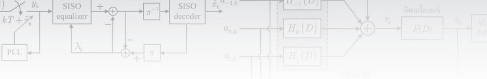

# ภาคผนวกง

# การหาค่าประมาณแบบซอฟต์ สำหรับช่องสัญญาณ PR2

ภาคผนวกนี้จะแสดงวิธีการหาค่าประมาณแบบซอฟต์สำหรับช่องสัญญาณ PR2 ตามสมการ (5.23) ดังนี้ พิจารณาแบบจำลองช่องสัญญาณ PR2 ในรูปที่ ง.1 เมื่อลำดับข้อมูลอินพุต61 $a _ { k } \in \{ \pm 1 \}$ จะ ถูกส่งเข้าช่องสัญญาณ PR2 นันคือ $H \left( D \right) = \sum { { { h } _ { k } } } { { \cal { D } } ^ { k } } = 1 + 2 D + { { \cal { D } } ^ { 2 } }$ เมื่อ ซื $D$ ตัวดำเนินการ หน่วงเวลาหนึ่งหน่วย ทำให้ได้เป็นลำดับข้อมูล $r _ { k } = a _ { k } * h _ { k } \in \{ 0 , \pm 2 , \pm 4 \}$

ณ วงจรภาครับ อีควอไลเซอร์แบบเทอร์โบจะสร้างข่าวสารแบบซอฟต์หรือค่า LLR $\{ \lambda _ { k } \}$ สำหรับลำดับข้อมูล $\{ a _ { k } \}$ เพื่อใช้ในการแลกเปลี่ยนข่าวสารระหว่างอีควอไลเซอร์ รOVA และวงจร ถอดรหัส LDPC เมื่อพิจารณาระบบทีไม่มีหน่วยความจำ "สไลเซอร์แบบซอฟต์ (soft slicer)" จะ ใช้ลำดับข้อมูล $\{ \lambda _ { k } \}$ ในการคำนวณหาค่าตัดสินใจแบบซอฟต์ $\tilde { r } _ { k } = E \left[ r _ { k } \mid \left\{ \lambda _ { k } \right\} \right]$ เนื่องจากข้อมูล เอาต์พุตของช่องสัญญาณ PR2 มีค่าเท่ากับ {0, ±2, ±4} ดังนั้นค่าประมาณแบบซอฟต์ $\tilde { r } _ { k }$ หาได้ จาก

$$
\begin{array} { r l } & { \tilde { r } _ { k } = \sum _ { i } m _ { i } \operatorname* { P r } \bigl [ r _ { k } = m _ { i } | \big \{ \lambda _ { k } \big \} \bigr ] } \\ & { \quad = ( - 4 ) \operatorname* { P r } \bigl [ r _ { k } = - 4 | \big \{ \lambda _ { k } \big \} \bigr ] + \bigl ( - 2 \bigr ) \operatorname* { P r } \bigl [ r _ { k } = - 2 | \big \{ \lambda _ { k } \big \} \bigr ] } \\ & { \qquad + \bigl ( 2 \bigr ) \operatorname* { P r } \bigl [ r _ { k } = 2 | \big \{ \lambda _ { k } \big \} \bigr ] + \bigl ( 4 \bigr ) \operatorname* { P r } \bigl [ r _ { k } = 4 | \big \{ \lambda _ { k } \big \} \bigr ] } \end{array}\tag{ง.1}
$$

เมื่อ $m _ { i } \in \{ 0 , \pm 2 , \pm 4 \}$ ถ้ากำหนดให้

  
รูปที่ ง.1 ช่องสัญญาณ PR2

$$
\lambda _ { k } = \log \left( \frac { \operatorname* { P r } \left[ a _ { k } = 1 \mid \left\{ \lambda _ { k } \right\} \right] } { \operatorname* { P r } \left[ a _ { k } = - 1 \mid \left\{ \lambda _ { k } \right\} \right] } \right)
$$

จะได้ว่า

$$
\operatorname* { P r } \Bigl [ a _ { k } = 1 | \bigl \{ \lambda _ { k } \bigr \} \Bigr ] = \frac { e ^ { \lambda _ { k } / 2 } } { e ^ { \lambda _ { k } / 2 } + e ^ { - \lambda _ { k } / 2 } } \qquad \mathfrak { U A } _ { \circ } ^ { \circ } , \quad \operatorname* { P r } \Bigl [ a _ { k } = - 1 | \bigl \{ \lambda _ { k } \bigr \} \Bigr ] = \frac { e ^ { - \lambda _ { k } / 2 } } { e ^ { \lambda _ { k } / 2 } + e ^ { - \lambda _ { k } / 2 } }
$$

จากรูปที่ง.1 ข้อมูลเอาต์พุตของช่องสัญญาณ $r _ { k } = - 4$ ก็ต่อเมื่อข้อมูลอินพุตมีค่าเท่ากับ $\{ a _ { k } , \ a _ { k - 1 } , \ a _ { k - 2 } \} = \{ - 1 , - 1 , - 1 \}$ ดังนั้นจะได้ว่า

$$
\mathrm { P r } \Big [ r _ { k } = - 4 \mid \big \{ \lambda _ { k } \big \} \Big ] = \mathrm { P r } \Big [ a _ { k } = - 1 \mid \big \{ \lambda _ { k } \big \} \Big ] \times \mathrm { P r } \Big [ a _ { k - 1 } = - 1 \mid \big \{ \lambda _ { k } \big \} \Big ] \times \mathrm { P r } \Big [ a _ { k - 2 } = - 1 \mid \big \{ \lambda _ { k } \big \} \Big ]
$$

$$
= \left( \frac { e ^ { - \lambda _ { k } / 2 } } { e ^ { \lambda _ { k } / 2 } + e ^ { - \lambda _ { k } / 2 } } \right) \left( \frac { e ^ { - \lambda _ { k - 1 } / 2 } } { e ^ { \lambda _ { k - 1 } / 2 } + e ^ { - \lambda _ { k - 1 } / 2 } } \right) \left( \frac { e ^ { - \lambda _ { k - 2 } / 2 } } { e ^ { \lambda _ { k - 2 } / 2 } + e ^ { - \lambda _ { k - 2 } / 2 } } \right)\tag{ง.2}
$$

และข้อมูลเอาต์พุตของช่องสัญญาณ $r _ { k } = 4$ ก็ต่อเมื่อข้อมูลอินพุตมีค่าเท่ากับ $\left\{ a _ { k } , \ a _ { k - 1 } , \ a _ { k - 2 } \right\} =$ {1, 1, 1} ซึ่งจะได้ว่า

$$
\operatorname* { P r } \Big [ r _ { k } = 4 \mid \Big \{ \lambda _ { k } \Big \} \Big ] = \operatorname* { P r } \Big [ a _ { k } = 1 | \Big \{ \lambda _ { k } \Big \} \Big ] \times \operatorname* { P r } \Big [ a _ { k - 1 } = 1 | \Big \{ \lambda _ { k } \Big \} \Big ] \times \operatorname* { P r } \Big [ a _ { k - 2 } = 1 | \Big \{ \lambda _ { k } \Big \} \Big ]
$$

$$
= \left( { \frac { e ^ { \lambda _ { k } / 2 } } { e ^ { \lambda _ { k } / 2 } + e ^ { - \lambda _ { k } / 2 } } } \right) \left( { \frac { e ^ { \lambda _ { k - 1 } / 2 } } { e ^ { \lambda _ { k - 1 } / 2 } + e ^ { - \lambda _ { k - 1 } / 2 } } } \right) \left( { \frac { e ^ { \lambda _ { k - 2 } / 2 } } { e ^ { \lambda _ { k - 2 } / 2 } + e ^ { - \lambda _ { k - 2 } / 2 } } } \right)\tag{ง.3}
$$

ในทำนองเดียวกันข้อมูลเอาต์พุตของช่องสัญญาณ $r _ { k } = - 2$ ก็ต่อเมื่อข้อมูลอินพุตมีค่าเท่ากับ $\{ a _ { k } ,$ $a _ { k - 1 } , \ a _ { k - 2 } \} = \{ - 1 , - 1 , 1 \}$ หรือ {1, −1, −1} ซึ่งจะได้ว่า

$$
\mathrm { P r } \Big [ r _ { k } = - 2 \mid \big \{ \lambda _ { k } \big \} \Big ] = \mathrm { P r } \Big [ a _ { k } = - 1 \mid \big \{ \lambda _ { k } \big \} \Big ] \times \mathrm { P r } \Big [ a _ { k - 1 } = - 1 \mid \big \{ \lambda _ { k } \big \} \Big ] \times \mathrm { P r } \Big [ a _ { k - 2 } = 1 | \big \{ \lambda _ { k } \big \} \Big ]
$$

---

$$
\begin{array} { r l } { \frac { \| \tilde { \rho } ( t ) - \| \tilde { \rho } ( t ) \| } { \sqrt { \pi ( t , D ) } } \Bigg | _ { t = - \infty } \Bigg | \frac { \| \tilde { \rho } ( t ) \| _ { t = \infty } \sqrt { \kappa ( t ) } } { \sqrt { \kappa ( t , D ) } } \Bigg | \frac { \tilde { \rho } ( t ) - \| \tilde { \rho } ( t ) \| _ { t = \infty } ^ { y } \sqrt { \kappa ( t ) } - \tilde { \gamma } _ { t } - \bigg | \tilde { \rho } ( t ) \| _ { t = \infty } ^ { \infty } \sqrt { \kappa ( t ) } - \tilde { \rho } ( t - t ) \sqrt { \kappa ( t ) } - \bigg | \frac { \tilde { \rho } ( t ) \tilde { \rho } ( t ) \tilde { \rho } ( t ) } { \sqrt { \kappa ( t ) - \kappa ( t ) } } \Bigg | } { \sqrt { \kappa ( t ) - \kappa ( t ) } } } & { \frac { \| \tilde { \rho } ( t ) - \| \tilde { \rho } ( t ) \| _ { t = \infty } ^ { \infty } \sqrt { \kappa ( t ) } - \sqrt { \kappa ( t ) } } { \sqrt { \kappa ( t ) - \kappa ( t ) } } } \\ & { + \mathbb { P r } \Big [ \tilde { \rho } _ { t } = 1 \| \{ \lambda _ { t } \} \Big ] \times \mathbb { P r } \Big [ \tilde { \rho } _ { t } \Big ( t _ { \infty } - 1 ) \Big | \{ \lambda _ { t } \Big \} \Big ] \times \mathbb { P r } \Big [ \tilde { \rho } _ { t } \Big ( t _ { \infty } - 1 ) \Big | \{ \lambda _ { t } \Big \} \Big ] } \\ &  = \Bigg [ \frac { \tilde { \rho } ( t ) - \tilde { \rho } ( t ) } { \sqrt { \kappa ^ { 2 } + \kappa ^ { 2 } + \lambda ^ { 2 } } } \Bigg ] \Bigg | \frac { \tilde { \rho } ( t ) - \tilde { \rho } ( t ) ^ { 2 } } { \sqrt { \kappa ^ { 2 } + \lambda ^ { 2 } } + \zeta ^ { 2 } } \Bigg | \frac  \| \tilde { \rho } ( t ) - \tilde { \rho } ( t ) \| _  t = \infty \end{array}
$$

สุดท้ายเมื่อข้อมูลเอาต์พุตของช่องสัญญาณ $r _ { k } = 2$ ก็ต่อเมื่อข้อมูลอินพุตมีค่าเท่ากับ $\{ a _ { k } , \ a _ { k - 1 } ,$ $a _ { k - 2 } \} = \{ - 1 , 1 , 1 \}$ หรือ {1, 1, -1} ซึ่งจะได้ว่า

$$
\begin{array} { r l } & { \operatorname* { P r } \Bigl [ r _ { k } = 2 \mid \left\{ \lambda _ { k } \right\} \Bigr ] = \operatorname* { P r } \Bigl [ a _ { k } = - 1 \mid \left\{ \lambda _ { k } \right\} \Bigr ] \times \operatorname* { P r } \Bigl [ a _ { k - 1 } = 1 \mid \left\{ \lambda _ { k } \right\} \Bigr ] \times \operatorname* { P r } \Bigl [ a _ { k - 2 } = 1 \mid \left\{ \lambda _ { k } \right\} \Bigr ] } \\ & { \qquad + \operatorname* { P r } \Bigl [ a _ { k } = 1 \mid \left\{ \lambda _ { k } \right\} \Bigr ] \times \operatorname* { P r } \Bigl [ a _ { k - 1 } = 1 \mid \left\{ \lambda _ { k } \right\} \Bigr ] \times \operatorname* { P r } \Bigl [ a _ { k - 2 } = - 1 \mid \left\{ \lambda _ { k } \right\} \Bigr ] } \\ & { = \Bigg ( \frac { e ^ { - \lambda _ { k } / 2 } } { e ^ { \lambda _ { k } / 2 } + e ^ { - \lambda _ { k } / 2 } } \Bigg ) \Bigg ( \frac { e ^ { \lambda _ { k } \nu / 2 } } { e ^ { \lambda _ { k } / 2 } + e ^ { - \lambda _ { k } / 2 } } \Bigg ) \Bigg ( \frac { e ^ { \lambda _ { k } z / 2 } } { e ^ { \lambda _ { k } z / 2 } + e ^ { - \lambda _ { k } - 2 / 2 } } \Bigg ) } \\ & { \qquad + \Bigg ( \frac { e ^ { \lambda _ { k } / 2 } } { e ^ { \lambda _ { k } z / 2 } + e ^ { - \lambda _ { k } z / 2 } } \Bigg ) \Bigg ( \frac { e ^ { \lambda _ { k } z / 2 } } { e ^ { \lambda _ { k } z / 2 } + e ^ { - \lambda _ { k } z / 2 } } \Bigg ) \Bigg ( \frac { e ^ { - \lambda _ { k } z / 2 } } { e ^ { \lambda _ { k } z / 2 } + e ^ { - \lambda _ { k } z / 2 } } \Bigg ) } \end{array}\tag{ง.5}
$$

ถ้ากำหนดให้ $a = \lambda _ { k } / 2 , b = \lambda _ { k - 1 } / 2 ,$ และ $c = \lambda _ { k - 2 } / 2$ จากนั้นแทนค่าเหล่านี้ลงใน สมการ (ง.2) - (ง.5) จากนั้นแทนสมการ (ง.2) - (ง.5) ลงในสมการ (ง.1) โดยอาศัย cosh $( x ) =$ $\left( e ^ { x } + e ^ { - x } \right) / 2$ และ sinh $\displaystyle \left( x \right) = \left( e ^ { x } - e ^ { - x } \right) / 2$ ก็จะได้

$$
\begin{array} { r l } & { \tilde { r } _ { k } = \left\{ \frac { \left( - 2 e ^ { - a } e ^ { - b } e ^ { - c } \right) + 2 e ^ { a } e ^ { b } e ^ { c } + \left( - e ^ { - a } e ^ { - b } e ^ { c } \right) + \left( - e ^ { a } e ^ { - b } e ^ { - c } \right) + e ^ { - a } e ^ { b } e ^ { c } + e ^ { a } e ^ { b } e ^ { - c } } { 4 \cosh \left( a \right) \cosh \left( b \right) \cosh \left( c \right) } \right\} } \\ & { \qquad = \left\{ \frac { - 2 e ^ { - \left( a + b + c \right) } + 2 e ^ { \left( a + b + c \right) } - e ^ { - \left( a + b - c \right) } - e ^ { - \left( c + a + b + c \right) } + e ^ { \left( c - a + b + c \right) } } { 4 \cosh \left( a \right) \cosh \left( b \right) \cosh \left( c \right) } \right\} } \\ & { \qquad = \left\{ \frac { 2 \sinh \left( a + b + c \right) + \sinh \left( a + b - c \right) + \sinh \left( - a + b + c \right) } { 2 \cosh \left( a \right) \cosh \left( b \right) \cosh \left( c \right) } \right\} } \end{array}\tag{ง.6}
$$

แทนค่า $a = \lambda _ { \scriptscriptstyle k } / 2 , b = \lambda _ { \scriptscriptstyle k - 1 } / 2 .$ และ $c = \lambda _ { k - 2 } / 2$ ลงในสมการ (ง.6) ก็จะได้ผลลัพธ์เป็น

$$
\tilde { r } _ { k } = \frac { C _ { 1 } + C _ { 2 } + C _ { 3 } } { 2 \cosh \left( \lambda _ { k } \mathrm { ~ / ~ } 2 \right) \cosh \left( \lambda _ { k - 1 } \mathrm { ~ / ~ } 2 \right) \cosh \left( \lambda _ { k - 2 } \mathrm { ~ / ~ } 2 \right) }\tag{ง.7}
$$

โดยที่ค่าคงตัว $C _ { 1 } = 2 \sinh \Bigl ( \bigl ( \lambda _ { k } + \lambda _ { k - 1 } + \lambda _ { k - 2 } \bigr ) / 2 \Bigr ) , ~ C _ { 2 } = \sinh \Bigl ( \bigl ( \lambda _ { k } + \lambda _ { k - 1 } - \lambda _ { k - 2 } \bigr ) / 2 \Bigr )$ และ $C _ { 3 } = \sinh \left( \left( - \lambda _ { k } + \lambda _ { k - 1 } + \lambda _ { k - 2 } \right) / 2 \right)$ ซึ่งตรงกับสมการ (5.23) ตามที่ต้องการ
