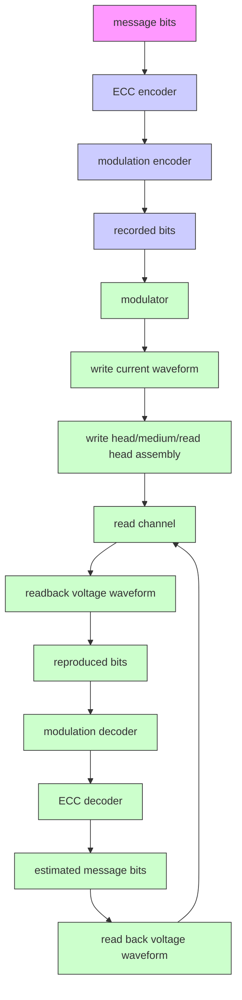
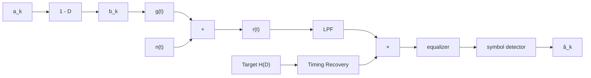
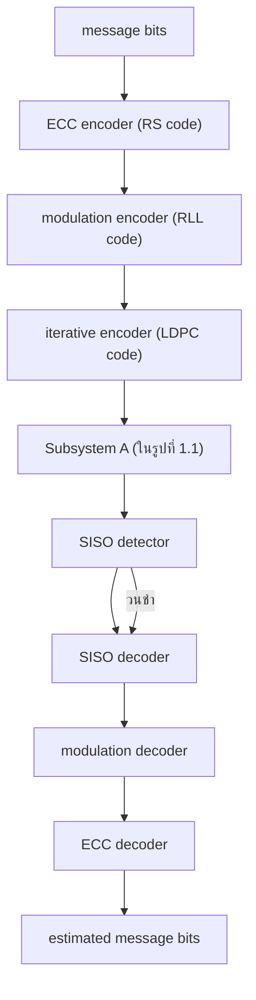
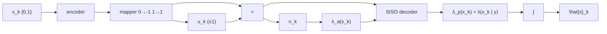

เหมาะสำหรับผู้ที่มีพืนฐานทางด้านระบบการประมวลผลสัญญาณของฮาร์ดดิสก์ไดรฟ์เนื่องจาก หนังสือเล่มนี้ต่อเนื่องมาจากหนังสือ "การประมวลผลสัญญาณสำหรับการจัดเก็บข้อมูลดิจิทัล เล่ม 1 (พื้นฐานช่องสัญญาณอ่าน-เขียน) และเล่ม 2 (การออกแบบวงจรภาครับ) เพราะฉะนั้นผู้เขียนขอ แนะนำให้ผู้อ่านศึกษาหนังสือเล่มที่1 และ 2 ให้เข้าใจก่อนที่จะศึกษาหนังสือเล่มนี้ เพื่อจะได้เข้าใจ เนื้อหาต่างๆ ได้รวดเร็วมากยิ่งขึ้น โดยในหนังสือเล่มนี้จะอธิบายถึงหลักการทำงานของเทคนิคการ ถอดรหัสแบบวนซ้ำที่ใช้ในฮาร์ดดิสก์ไดรฟ์ รวมทั้งเทคโนโลยี BPMR และ HAMR ในรูปแบบที ง่ายต่อการทำความเข้าใจและศึกษาด้วยตนเอง

ข้าพเจ้าเขียนหนังสือเล่มนี้ข้นมาโดยอาศัยประสบการณ์ที่ได้รับจากการทำวิจัยทางด้าน ระบบการประมวลผลสัญญาณของฮาร์ดดิสก์ไดรฟ์ ตั้งแต่เริ่มการศึกษาระดับชั้นปริญญาเอกที ซ Georgia Institute of Technology ประเทศสหรัฐอเมริกา ในปี พ.ศ. 2544 นอกจากนีข้าพเจ้ายัง มีประสบการณ์การทำงานที่ศูนย์วิจัยซีเกท (Seagate research center) เมือง Pittรburgh ประเทศ สหรัฐอเมริกา เป็นระยะเวลารวม 1 ปี โดยหนังสือเล่มนี้จะแบ่งเป็นสองส่วน ส่วนแรกจะเกี่ยวข้อง กับเทคนิคการถอดรหัสแบบวนซ้ำที่เริ่มนำมาใช้ในฮาร์ดดิสก์ไดรฟรุ่นใหม่ๆ ซึ่งจะเริ่มต้นด้วยการ กล่าวถึงหลักการทำงานของระบบการบันทึกเชิงแม่เหล็กที่ใช้ในปัจจุบัน (แบบแนวตั้ง) บทที่ 2 จะ อธิบายรหัสเทอร์โบพื้นฐานของเทคนิคการถอดรหัสแบบวนซ้ำและอีควอไลเซอร์แบบเทอร์โบที่ใช้ ในฮาร์ดดิสก์ไดรฟรุ่นใหม่ๆ ซึ่งจะแลกเปลี่ยนข่าวสารแบบซอฟต์ระหว่างวงจรตรวจหาแบบซอฟต์ และวงจรถอดรหัสแอลดีพีซี (LDPC) บทที่ 3 และบทที่4 จะกล่าวถึงหลักการทำงานของวงจร ตรวจหาแบบซอฟต์และวงจรถอดรหัสแอลดีพีซี ตามลำดับ และบทที่ 5 จะยกตัวอย่างการนำเทคนิค การถอดรหัสแบบวนซ้ำไปประยุกต์ใช้แก้ปัญหาเรื่องไทมมิ่งริคัฟเวอรี (timing recovery) และเรื่อง ความขรุขระเชิงความร้อน (therทal aรperity) ที่พบในระบบการประมวลผลสัญญาณของฮาร์ดดิสก์ ไดรฟ์ จากนั้นส่วนที่สองจะเกี่ยวข้องกับเทคโนโลยีการบันทึกเชิงแม่เหล็กแบบใหม่ที่จะนำมาใช้ใน อนาคตแทนเทคโนโลยีการบันทึกแบบแนวตั้งที่ใช้อยู่ในปัจจุบัน โดยบทที่ 6 จะกล่าวถึงพื้นฐานของ เทคโนโลยี BPMR และบทที่ 7 จะอธิบายการออกแบบทาร์เก็ตและอีควอไลเซอร์ที่ใช้ในระบบ

หนังสือเล่มนี้จะไม่สามารถทำให้สำเร็จขึ้นมาได้ หากขาดบุคคลต่างๆ ที่ให้ความช่วยเหลือ ) และเป็นกำลังใจให้ข้าพเจ้าตลอดมา ข้าพเจ้าขอกราบขอบพระคุณอาจารย์ทุกท่านที่ให้ความรู้ คำแนะนำ และคำปรึกษา ตลอดระยะเวลาการศึกษา โดยเฉพาะอย่างยิ่ง Prof. John R. Barry และ Prof. Steven W. McLaughlin รวมทั้งนักวิจัยจากศูนย์วิจัยซีเกท ได้แก่ Dr. Erozan M. Kurtas, Dr. M. Fatih Erden, และ Dr. Inci Ozgunes ที่ให้โอกาสข้าพเจ้าได้ทำงานวิจัยทางด้านระบบการ ประมวลผลสัญญาณของฮาร์ดดิสก์ไดรฟ์ และที่ไม่สามารถจะลืมได้ก็คือทุกๆ คนในครอบครัวของ ข้าพเจ้า โดยเฉพาะอย่างยิ่ง พญ.ศิรสุดา โควินท์ทวีวัฒน์ นอกจากนี้ข้าพเจ้าขอขอบคุณสำนักงาน พัฒนาวิทยาศาสตร์และเทคโนโลยีแห่งชาติ ศูนย์เทคโนโลยีอิเล็กทรอนิกส์และคอมพิวเตอร์แห่งชาติ สถาบันฮาร์ดดิสก์ไดรฟ์ ศูนย์วิจัยร่วมเฉพาะทางด้านส่วนประกอบฮาร์ดดิสก์ไดรฟ์ สำนักงานคณะ กรรมการวิจัยแห่งชาติ และมหาวิทยาลัยราชภัฎนครปฐุม ที่ให้การสนับสนุนและให้ความสะดวก ข้าพเจ้าตลอดระยะเวลาในการเขียนหนังสือเล่มนี้ รวมทั้งนายสันติ กูลการขาย และนายอดิศร แก้ว ภักดี นักศึกษาปริญญาเอก คณะวิศวกรรมศาสตร์ มหาวิทยาลัยเทคโนโลยีพระจอมเกล้าพระนคร เหนือ ที่ช่วยตรวจทานหนังสือเล่มนี้

ท้ายสุดนี้ข้าพเจ้าได้พยายามอย่างยิ่งในการที่จะทำให้หนังสือเล่มนี้ง่ายต่อการเรียนรู้เพื่อ ให้ผู้อ่านสามารถทำความเข้าใจได้ด้วยตนเองอย่างรวดเร็วและมีประสิทธิผล หากหนังสือเล่มนี้มี ข้อบกพร่องประการใด ข้าพเจ้ามีความยินดีและจักขอบพระคุณยิ่ง หากท่านผู้ใช้หนังสือเล่มนี้จะส่ง ข้อคิดเห็นและคำแนะนำที่เป็นประโยชน์สำหรับการปรับปรุงหนังสือเล่มนี้มาที่อีเมล์ piyล@nprน.ac.th เพื่อที่ข้าพเจ้าจะได้ดำเนินการปรับปรุงและแก้ไขในการพิมพ์ครั้งต่อไป สำหรับข้อมูลข่าวสารต่างๆ เกี่ยวกับหนังสือการประมวลผลสัญญาณสำหรับการจัดเก็บข้อมูลดิจิทัล สามารถติดตามได้ที่เว็บไซต์ http://home.npru.ac.th/piya

รศ.ดร.ปิยะ โควินท์ทวีวัฒน์

มหาวิทยาลัยราชภัฎนครปฐม

สิงหาคม พ.ศ. 2554

# สารบัญ

# บทที่ 1 บทนำ...

1.1 ระบบการจัดเก็บข้อมูลดิจิทัล   
1.2 แบบจำลองช่องสัญญาณของฮาร์ดดิสก์ไดรฟ์   
1.3 แบบจำลองช่องสัญญาณอุดมคติ   
1.4 การถอดรหัสแบบวนซ้ำ 8   
aซ 1.5 พืนฐานและคำศัพท์ทีน่าสนใจ 0

1.5.1 การตัดสินใจแบบฮาร์ดและแบบซอฟต์. .10   
1.5.2 อัตราส่วนควรจะเป็นแบบลอการิทึม .10   
1.5.3 ข้อมูลเอาต์พุตแบบซอฟต์ของช่องสัญญาณ. 12   
1.5.4 วงจรถอดรหัสแบบ รIS0 13

1.6 สรุปท้ายบท. 15   
1.7 แบบฝึกหัดท้ายบท 15

# บทที่ 2 รหัสเทอร์โบ. 17

2.1 รหัสคอนโวลูชัน .18

2.1.1 การเข้ารหัส. ..18   
2.1.2 การถอดรหัส. ..25

2.2 อัลกอริทึม BCJR. .27

2.2.1 แบบจำลองของช่องสัญญาณและแผนภาพเทรลลิส. .27   
2.2.2 วงจรตรวจหาเหมาะที่สุด. 29   
2.2.3 การคำนวณหาค่าพารามิเตอร์ของอัลกอริทึม BCJR 31

2.2.4 อัลกอริทึม BCJR สำหรับบิตข้อมูลแบบไบนารี. .35   
2.2.5 สรุปขันตอนการทำงานของอัลกอริทึม BCJR. .36   
2.2.6 ข้อสังเกตของอัลกอริทึม BCJR. .36

# 2.3 รหัสเทอร์โบ. .46

2.3.1 วงจรเข้ารหัสเทอร์โบ. .47   
2.3.2 วงจรมัลติเพล็กเซอร์และวงจรดีมัลติเพล็กเซอร์. 47   
2.3.3 วงจรถอดรหัสเทอร์โบ. . 48   
2.3.4 วงจรอินเทอร์ลีฟเวอร์. .50   
2.3.5 ผลการทดลอง. .52   
2.3.6 วงจรเข้ารหัสและถอดรหัสเทอร์โบแบบต่ออนุกรม. .54

# 2.4 อีควอไลเซซันแบบเทอร์โบ .56

2.4.1 สมรรถนะของอีควอไลเซอร์แบบเทอร์โบ .60

2.5 สรุปท้ายบท. 62   
2.6 แบบฝึกหัดท้ายบท 63

# บทที่ 3 วงจรตรวจหาแบบซอฟต์ ,65

3.1 บทนำ 66   
3.2 อัลกอริทึม MAX-LOG-MAP 66

3.2.1 สรุปขั้นตอนการทำงานของอัลกอริทึม Max-Log-MAP. 69   
3.2.2 ข้อสังเกตของอัลกอริทึม Max-Log-MAP. .77

3.3 อัลกอริทึม LOG-MAP. 77   
3.4 อัลกอริทึม SOVA. .81

3.4.1 การหาค่า LLR ของบิตข้อมูล. .82   
3.4.2 ข้อสังเกตของอัลกอริทึม SOVA .87   
3.4.3 สรุปขั้นตอนการทำงานของอัลกอริทึม รOVA. .87

# 3.5 อัลกอริทึม BI-DIRECTIONAL SOVA. .93

3.5.1 การหาค่า LLR ของบิตข้อมูล. .95   
3.5.2 สรุปขันตอนการทำงานของอัลกอริทึม รอVA แบบสองทิศทาง. 97

# 3.6 ความซับซ้อนของวงจรตรวจหาแบบซอฟต์ 102

3.7 สรุปท้ายบท.. .104

3.8 แบบฝึกหัดท้ายบท .. 105

# บทที่ 4 รหัสแอลดีพีซี 107

4.1 บทนำ. .107

4.1.1 รหัสบล็อกเชิงเส้น. .107   
4.1.2 เมทริกซ์ตัวกำเนิด . .108   
4.1.3 เมทริกซ์พาริตีเช็ก. .. 109   
4.1.4 ระยะทางน้อยสุดของรหัส. .110   
4.1.5 การถอดรหัสบล็อกเชิงเส้น .111

4.2 พืนฐานของรหัสแอลดีพีซี 112

4.2.1 รหัสแอลดีพีซีปรกติ. .113   
4.2.2 รหัสแอลดีพีซีไม่สม่ำเสมอ. .115   
4.2.3 กฎของไฮเพอร์โบลิกแทนเจนต์. .116

4.3 การเข้ารหัสแอลดีพีซี .119

4.4 การถอดรหัสแอลดีพีซี 121

4.4.1 พื้นฐานในการถอดรหัสแอลดีพีซี. .121   
4.4.2 วัฏจักรของรหัสแอลดีพีซี. .125   
4.4.3 การหาค่า LLR ของบิตข้อมูล. 127   
4.4.4 อัลกอริทึมการผ่านข่าวสาร. .132

4.5 การสร้างเมทริกซ์พาริตีเช็ก . ,139

4.5.1 รหัสแอลดีพีซีปรกติ.. .139   
4.5.2 รหัสแอลดีพีซีแบบแถวลำดับ. .. 142   
4.5.3 รหัสแอลดีพีซีแบบแถวลำดับทีถูกปรับปรุง. .143   
4.5.4 ข้อสังเกต. .146

4.6 ผลการทดลอง ,147

4.6.1 ช่องสัญญาณ AWGN. .147   
4.6.2 ช่องสัญญาณแบบวนซ้ำ. 150

4.7 สรุปท้ายบท .153

4.8 แบบฝึกหัดท้ายบท . .154

# บทที่ 5 การประยุกต์ใช้งานการถอดรหัสแบบวนซ้ำ ,155

5.1 ไทมมิ่งริคัฟเวอรีแบบวนซ้ำ 155

5.1.1 แบบจำลองช่องสัญญาณ . .157   
5.1.2 ไทมมิ่งริดัฟเวอรีแบบที่ใช้กันทั่วไป. .158   
5.1.3 เพอเซอร์ไวเวอร์ไทมมิงริคัฟเวอรี. .162   
5.1.4 เพอเซอร์ไวเวอร์ไทมมิ่งริคัฟเวอรีแบบวนซ้ำ. 167

5.2 การลดผลกระทบของความขรขระเชิงความร้อนแบบวนซ้ำ 181

5.2.1 แบบจำลองช่องสัญญาณ .183   
5.2.2 แบบจำลองสัญญาณ TA .184   
5.2.3 วิธีการตรวจหาและแก้ไข TA .. 185   
5.2.4 วิธีการตรวจหาและแก้ไข TA แบบวนซ้ำ. 188   
5.2.5 ผลการทดลอง. 189   
5.2.6 สรุปผลการทดลอง.. .192

5.3 สรุปท้ายบท. ,193   
5.4 แบบฝึกหัดท้ายบท 194

# บทที่ 6 เทคโนโลยี BPMR. .195

6.1 บทนำ . 196   
6.2 วิวัฒนาการของเทคโนโลยี BPMR. 198

6.2.1 สื่อบันทึก. .198   
6.2.2 ระบบการบันทึกเชิงแม่เหล็กสำหรับ BPMR. 199   
6.2.3 การประมวลผลสัญญาณในระบบ BPMR .201

6.3 ผลตอบสนองสัญญาณพัลส์ของระบบ BPMR 204

6.3.1 การจำลองผลตอบสนองสัญญาณพัลส์แบบสองมิติ. .205   
6.3.2 ผลกระทบที่เกิดจากไอแลนด์และรูปทรงของหัวอ่าน. 212

6.4 แบบจำลองของสัญญาณอ่านกลับในระบบ BPMR .217

6.4.1 ค่าประมาณของสัญญาณพัลส์ BPMR .218

6.4.2 ค่าประมาณของสัญญาณพัลส์ BPMR ที่มีสัญญาณรบกวนสื่อบันทึก.... .. 220   
6.4.3 แบบจำลองช่องสัญญาณ BPMR ที่ไม่ต่อเนื่องทางเวลาแบบสมมูล. .222   
6.4.4 แทร็กมิสเรจิสเตรชัน. ..224

6.5 สรุปท้ายบท. ,226

6.6 แบบฝึกหัดท้ายบท .228

# บทที่ 7 การออกแบบทาร์เก็ตและอีควอไลเซอร์สำหรับระบบ BPMR. . 229

7.1 ทาร์เก็ตหนึ่งมิติและอีควอไลเซอร์หนึ่งมิติ 230   
7.2 ทาร์เก็ตสองมิติที่มีมุมเป็นศูนย์และอีควอไลเซอร์หนึ่งมิติ. 233

7.2.1 เมื่อทราบช่องสัญญาณ H. ..233   
7.2.2 เมื่อไม่ทราบช่องสัญญาณ H. .237

7.3 ทาร์เก็ตสองมิติแบบสมมาตรและอีควอไลเซอร์หนึ่งมิติ 238   
7.4 ทาร์เก็ตสองมิติแบบอสมมาตรและอีควอไลเซอร์หนึ่งมิติ .239   
7.5 ทาร์เก็ตสองมิติและอีควอไลเซอร์สองมิติ .240   
7.6 วงจรตรวจหาวีเทอร์บิที่ใช้ในระบบ BPMR .245

7.6.1 วงจรตรวจหาวีเทอร์บิหนึงมิติ 245   
7.6.2 วงจรตรวจหาวีเทอร์บิสองมิติ. .249

7.7 ผลการทดลอง -.. .253

7.7.1 สมรรถนะของอีควอไลเซอร์สองมิติ. .256   
7.7.2 ผลกระทบของสัญญาณรบกวนสื่อบันทึกและแทร็กมิสเรจิสเตรชัน. .257   
7.7.3 สมรรถนะของระบบ BPMR แบบวนซ้ำ. .258

7.8 สรุปท้ายบท. .261   
7.9 แบบฝึกหัดท้ายบท .262

# บทที่ 8 เทคโนโลยี HAMR. .263

8.1 บทนำ. .264   
8.2 หลักการเขียนข้อมูลของระบบ HAMR .265   
ลซ 8.3 พืนฐานแบบจำลองวิลเลียม-คอมสต็อกเชิงความร้อน .266

8.3.1 โพรไฟล์อุณหภูมิ. .267

8.3.2 ลูปฮิสเทอรีซิส. .268   
8.3.3 แบบจำลองวิลเลียม-คอมสต็อก. ..270   
8.3.4 แบบจำลองวิลเลียม-คอมสต็อกเชิงความร้อน .271

8.4 ระบบ HAMR แบบแนวนอน. .275

8.4.1 การหาค่า dM(x) / dx. .275   
8.4.2 การหาค่า dM(H) / dH. .276   
8.4.3 การหาค่า dHh/ dx. .277   
8.4.4 การหาค่า dHa/ dx. .279   
8.4.5 การหาค่า dHc/ dT × dT/ dx. .281   
8.4.6 การหาจุดศูนย์กลางการเปลี่ยนสถานะ x0... .283   
8.4.7 การหาพารามิเตอร์การเปลี่ยนสถานะ a... .284

8.5 ระบบ HAMR แบบแนวตั้ง 285   
8.6 แบบจำลองไมโครแทร็ก .291   
8.7 ลักษณะเฉพาะของระบบ HAMR. ,293

8.7.1 ระบบ HAMR แบบแนวนอน.. . 294   
8.7.2 ระบบ HAMR แบบแนวตัง. 302   
8.7.3 ข้อควรระวังในการใช้แบบจำลองวิลเลียม-คอมสต็อกเชิงความร้อน... ..304

8.8 สรุปท้ายบท. .305   
8.9 แบบฝึกหัดท้ายบท . .305

ก ฟังก์ชันลอการิทึมจาโคเบียน -.. .307   
ขกฎของไฮเพอร์โบลิกแทนเจนต์ .309   
คความสมมูลของสมการ (4.30) และ (4.32)... .311   
ง การหาค่าประมาณแบบซอฟต์ สำหรับช่องสัญญาณ PR2: .313   
บรรณานุกรม-.... .317   
ดรรชนี .327

# บทที่1

# บทนำ

ในบทนี้จะกล่าวถึงแบบจำลองทางคณิตศาสตร์ของช่องสัญญาณอ่าน (read chanทel) [1] ที่ใช้แทน ระบบการบันทึกเชิงแม่เหล็ก (magnetic recording system) ในฮาร์ดดิสก์ไดรฟ์ เพื่อให้ผู้อ่าน ทราบถึงระบบการประมวลผลสัญญาณของฮาร์ดดิสก์ไดรฟ์ซึ่งเป็นพื้นฐานในการศึกษาบทต่อไป นอกจากนี้ยังได้อธิบายแนวคิดและพื้นฐานของการใช้เทคนิคการถอดรหัสแบบวนซ้ำ (iterative decodiทg) [2 - 5] ในระบบการประมวลผลสัญญาณของฮาร์ดดิสก์ไดรฟ์ เพื่อให้ผู้อ่านเข้าใจถึง ประโยชน์ของเทคนิคการถอดรหัสแบบวนซ้ำ ซึ่ได้เริมนำมาใช้จริงในฮาร์ดดิสก์ไดรฟีร่นใหม่ๆ [6] เพราะสามารถช่วยเพิ่มสมรรถนะของระบบได้ดียิ่งขึ้น

# 1.1 ระบบการจัดเก็บข้อมูลดิจิทัล

ระบบการจัดเก็บข้อมูลดิจิทัล (digital data storage system) ในฮาร์ดดิสก์ไดรฟ์สามารถจำลองเป็น แผนภาพบล็อกได้ตามรูปที่1.1 [1, 5, 7] เมื่อบิตข่าวสาร (meรรage bits) ถูกส่งไปยังวงจรเข้ารหัส แก้ไขข้อผิดพลาด (ECC encoder) โดยรหัส RS (Reed Solomon) [2, 8] เป็นรหัสที่นิยมใช้ใน ฮาร์ดดิสก์ไดรฟ์ จากนั้นข้อมูลที่เข้ารหัสแล้วก็จะถูกทำการเข้ารหัสอีกครั้งหนึ่งด้วยวงจรเข้ารหัส มอดูเลชัน (modนโatioก encoder) เพื่อปรับคุณสมบัติของข้อมูลให้เหมาะสมกับช่องสัญญาณของ ฮาร์ดดิสก์ไดรฟ์ โดยรหัสมอดูเลชันที่นิยมใช้กันทั่วไปคือรหัส RLL (run-length limited code) [5, 9] ข้อมูลเอาต์พุตที่ได้จากวงจรเข้ารหัสมอดูเลชันถือว่าเป็นข้อมูลที่จะถูกเขียนเข้าไปจัดเก็บใน สื่อบันทึกซึ่งเรียกกันว่า "บิตที่จะถูกบันทึก (recorded bit)" หลังจากนั้นบิตที่จะถูกบันทึกก็จะถูก ส่งไปยังวงจรมอดูเลเตอร์ (mอdนator) เพื่อแปลงบิตข้อมูลให้อยูในรูปของกระแสไฟฟ้าเขียน (write current waveform) แล้วก็ป้อนเข้าไปในหัวเขียนเพื่อทำการเขียนข้อมูลลงไปในสื่อบันทึก


<details>
<summary>flowchart</summary>


</details>

1.2   
รูปที่ 1.1 แผนภาพบล็อกของระบบการจัดเก็บข้อมูลดิจิทัลในฮาร์ดดิสก์ไดรฟ์ [9, 10]

สำหรับกระบวนการอ่านข้อมูล หัวอ่าน (read head) จะอ่านข้อมูลจากสื่อบันทึกโดยเมื่อ หัวอ่านเคลื่อนที่มาถึงบริเวณที่มีการเปลี่ยนแปลงสภาพความเป็นแม่เหล็ก (magทetization) ก็จะให้ ผลลัพธ์ออกมาเป็นสัญญาณรูปคลื่นแรงดันไฟฟ้าที่เรียกกันทั่วไปว่า "สัญญาณอ่านกลับ (readback signal)" จากนั้นสัญญาณอ่านกลับจะถูกส่งเข้าไปประมวลผลในช่องสัญญาณอ่านซึ่งประกอบด้วย ชินส่วนต่างๆ เช่น วงจรกรองผ่านต่ำ (LPF: low-pass filter), วงจรชักตัวอย่าง (sampler หรือ analog-to-digital converter), อีควอไลเซอร์ (equalizer), และวงจรตรวจหาสัญลักษณ์ (symbol detector) เป็นต้น โดยข้อมูลเอาต์พุตทีได้ก็จะถูกทำการถอดรหัสด้วยวงจรถอดรหัสมอดูเลชัน (modulation decoder) และวงจรถอดรหัสแก้ไขข้อผิดพลาด (ECC decoder) ตามลำดับ เพื่อหา ค่าประมาณของบิตข่าวสารที่ต้องการจะนำมาใช้งาน

# 1.2 แบบจำลองช่องสัญญาณของฮาร์ดดิสก์ไดรฟ์

ระบบย่อย A (ธนbรyรtem A) ในรูปที่ 1.1 สามารถแสดงให้อยูในรูปของแบบจำลองทางคณิตศาสตร์ ได้ตามรูปที่ 1.2 [1, 10] เมื่อลำดับข้อมูลอินพุตแบบไบนารี $a _ { k } \in \{ 0 , 1 \}$ ที่มีคาบเวลาของบิตเท่ากับ $T$ หน่วย ถูกส่งผ่านไปยังวงจรอนุพันธ์อุดมคติ (ideal differentiator) ที่มีรูปพหุนามเท่ากับ $1 - D$ เมื่อ D คือตัวดำเนินการหน่วงเวลา T หน่วย ทำให้ได้เป็นลำดับข้อมูลเปลี่ยนสถานะ (traทรition sequence) $b _ { k } \in \{ - 1 , 0 , 1 \}$ เมื่อ $b _ { k } = \pm 1$ หมายถึงการเปลี่ยนสถานะแบบบวกหรือแบบลบ (positive or negative transition) และ $b _ { k } = 0$ หมายถึงไม่มีการเปลี่ยนสถานะ (n0 tranรition) จากนั้นลำดับข้อมูลเปลี่ยนสถานะ $b _ { k }$ จะถูกส่งผ่านไปยังช่องสัญญาณที่มีผลตอบสนองอิมพัลส์ เท่ากับสัญญาณพัลส์เปลี่ยนสถานะ $g ( t )$ และถูกรบกวนด้วยสัญญาณรบกวน $n ( t )$ ทำให้ได้เป็น สัญญาณอ่านกลับ $r ( t )$ ซึ่งสามารถเขียนเป็นสมการคณิตศาสตร์ได้คือ


<details>
<summary>flowchart</summary>


</details>

$\mathfrak { J } \mathfrak { l } \dot { \mathfrak { n } }$ 1.2 แบบจำลองช่องสัญญาณของฮาร์ดดิสก์ไดรฟ์

$$
r (t) = \sum_ {k} b _ {k} g (t - k T) + n (t) \tag {1.1}
$$

e จากนั้นที่วงจรภาครับ สัญญาณอ่านกลับ ๆ(t) จะถูกส่งผ่านไปยังวงจรกรองผ่านต่ำ (LPF) เพื่อกำจัด สัญญาณรบกวนที่อยู่นอกแถบความถี่ และถูกทำการชักตัวอย่าง ณ เวลาที่ถูกควบคุมด้วยระบบ ไทมมิ่งริคัฟเวอรี (timing recovery) [10] ข้อมูลเอาต์พุตของวงจรชักตัวอย่างก็จะถูกส่งไปยัง อีควอไลเซอร์และวงจรตรวจหาสัญลักษณ์ เพื่อหาลำดับข้อมูลอินพุตที่ควรจะเป็นสูงสุด $\hat { a } _ { k }$ (หรือ ค่าประมาณของ $a _ { k } )$

สำหรับระบบการบันทึกแบบแนวนอน (โongitนdinal recording) สัญญาณพัลส์เปลี่ยน สถานะหรือที่รู้จกกันทั่วไปว่าสัญญาณพัลส์ Lorentziลท มีรูปสมการคือ [11]

$$
g (t) = \frac {1}{1 + \left(2 t / \mathrm{PW} _ {5 0}\right) ^ {2}} \tag {1.2}
$$

โดยที่ $\mathrm { P W } _ { 5 0 }$ คือความกว้างของสัญญาณพัลส์ $g ( t )$ วัด ณ ตำแหน่งที่สัญญาณพัลส์มีความสูงเป็น ครึ่งหนึ่งของความสูงสูงสุด ในขณะที่สัญญาณพัลส์เปลี่ยนสถานะของระบบการบันทึกแบบแนวตั้ง (perpendicular recording) มีรูปสมการคือ [12]

$$
g (t) = \operatorname{erf} \left(\frac {2 t \sqrt {\ln 2}}{\mathrm{PW} _ {5 0}}\right) \tag {1.3}
$$

เมื่อ $\ln ( . )$ คือลอการิทึมธรรมชาติ (natural 1ogarithm), $\mathrm { P W } _ { 5 0 }$ คือความกว้างของพัลส์ $g ^ { \prime } ( t )$ หรือ อนุพันธ์ของ $g ( t )$ วัด ณ ตำแหน่งที่สัญญาณพัลส์มีความสูงเป็นครึ่งหนึ่งของความสูงสูงสุด, และ erf(.) คือฟังก์ชันข้อผิดพลาด (error function) ซึ่งนิยามโดย


<details>
<summary>line</summary>

| t/T | ND = 2 | ND = 2.5 | ND = 3 |
| --- | --- | --- | --- |
| -5.0 | 0.05 | 0.06 | 0.07 |
| -4.0 | 0.10 | 0.12 | 0.14 |
| -3.0 | 0.25 | 0.30 | 0.35 |
| -2.0 | 0.50 | 0.60 | 0.70 |
| -1.0 | 0.80 | 0.90 | 0.95 |
| 0.0 | 1.00 | 1.00 | 1.00 |
| 1.0 | 0.80 | 0.90 | 0.95 |
| 2.0 | 0.50 | 0.60 | 0.70 |
| 3.0 | 0.25 | 0.30 | 0.35 |
| 4.0 | 0.10 | 0.12 | 0.14 |
| 5.0 | 0.05 | 0.06 | 0.07 |
</details>


<details>
<summary>line</summary>

| t/T | ND = 2 | ND = 2.5 | ND = 3 |
| --- | --- | --- | --- |
| -5.0 | -1.0 | -1.0 | -1.0 |
| -4.0 | -1.0 | -1.0 | -1.0 |
| -3.0 | -0.8 | -0.8 | -0.8 |
| -2.0 | -0.4 | -0.4 | -0.4 |
| -1.0 | 0.0 | 0.0 | 0.0 |
| 0.0 | 0.4 | 0.4 | 0.4 |
| 1.0 | 0.8 | 0.8 | 0.8 |
| 2.0 | 0.9 | 0.9 | 0.9 |
| 3.0 | 0.95 | 0.95 | 0.95 |
| 4.0 | 0.98 | 0.98 | 0.98 |
| 5.0 | 1.0 | 1.0 | 1.0 |
</details>

รูปที่ 1.3 สัญญาณพัลส์เปลี่ยนสถานะสำหรับการบันทึก (a) แบบแนวนอน และ (b) แบบแนวตั้ง

$$
\operatorname{erf} (x) = \frac {2}{\sqrt {\pi}} \int_ {0} ^ {x} e ^ {- t ^ {2}} d t \tag {1.4}
$$

ในระบบการบันทึกข้อมูลของฮาร์ดดิสก์ไดรฟ์ ความหนาแน่นของการบันทึกแบบนอร์มอล ไลซ์ (ND: normalized recording density) จะนิยามโดย [11]

$$
\mathrm{ND} = \frac {\mathrm{PW} _ {5 0}}{T} \tag {1.5}
$$

ซึ่งหมายถึงความหนาแน่นของการบันทึกข้อมูล เมื่อ T คือคาบเวลาของข้อมูลหนึ่งบิตหรือที่เรียก กันว่าบิตเซลล์ (bit cell) โดยค่า ND จะเป็นตัวบ่งบอกว่าบริเวณ PW50 สามารถจัดเก็บข้อมูลได้ กี่บิต รูปที่ 1.3 แสดงผลตอบสนองการเปลี่ยนสถานะสำหรับการบันทึกแบบแนวนอนและแบบ แนวตั้ง ณ ระดับ ND ต่างๆ ซึ่งจะพบว่าสัญญาณพัลส์เปลี่ยนสถานะของทั้งสองแบบครอบคลุ่ม ช่วงเวลาหลายๆ บิตเซลล์ โดยเฉพาะอย่างยิ่งเมื่อ ND มีค่าเพิ่มขึ้น หรือกล่าวอีกนัยหนึ่งคือการ ซ แทรกสอดระหว่างสัญลักษณ์ (ISI: intersymbol interference) จะมีความรุนแรงมากขึ้นเมื่อ ND มีค่าเพิ่มขึ้น เพราะโอกาสที่สัญญาณพัลส์เปลี่ยนสถานะที่อยู่ใกล้กันจะมาซ้อนเหลื่อม (Overlap) กันมีความเป็นไปได้สูง

ในกรณีที่หัวอ่านเคลื่อนที่มาถึงบริเวณที่มีการเปลี่ยนสถานะของสภาพความเป็นแม่เหล็ก ติดกันสองครั้ง สัญญาณพัลส์รวมที่ได้จะเรียกว่า "สัญญาณพัลส์ไดบิต (dibit pulse)" หรือผลตอบ สนองไดบิต (dibit response) [11] ซึ่งมีค่าเท่ากับ (ดูรูปที่1.2)

$$
m (t) = g (t) - g (t - T) \tag {1.6}
$$


<details>
<summary>line</summary>

| x    | ND = 2 | ND = 2.5 | ND = 3 |
| ---- | ------ | -------- | ------ |
| -5   | 0.0    | 0.0      | 0.0    |
| -4   | 0.05   | 0.05     | 0.05   |
| -3   | 0.1    | 0.1      | 0.1    |
| -2   | 0.2    | 0.2      | 0.2    |
| -1   | 0.4    | 0.4      | 0.4    |
| 0    | 0.5    | 0.4      | 0.4    |
| 1    | -0.5   | -0.4     | -0.4   |
| 2    | -0.2   | -0.2     | -0.2   |
| 3    | 0.0    | 0.0      | 0.0    |
| 4    | 0.05   | 0.05     | 0.05   |
| 5    | 0.0    | 0.0      | 0.0    |
</details>

(a) tT


<details>
<summary>line</summary>

| x    | ND = 2 | ND = 2.5 | ND = 3 |
| ---- | ------ | -------- | ------ |
| -5.0 | 0.0000 | 0.0000   | 0.0000 |
| -4.0 | 0.0000 | 0.0000   | 0.0000 |
| -3.0 | 0.0000 | 0.0000   | 0.0000 |
| -2.0 | 0.0000 | 0.0000   | 0.0000 |
| -1.0 | 0.0000 | 0.0000   | 0.0000 |
| 0.0  | 0.8900 | 0.7200   | 0.6000 |
| 1.0  | 0.0000 | 0.0000   | 0.0000 |
| 2.0  | 0.0000 | 0.0000   | 0.0000 |
| 3.0  | 0.0000 | 0.0000   | 0.0000 |
| 4.0  | 0.0000 | 0.0000   | 0.0000 |
| 5.0  | 0.0000 | 0.0000   | 0.0000 |
</details>

(b) VT   
รูปที่ 1.4 สัญญาณพัลส์ไดบิต สำหรับการบันทึก (a) แบบแนวนอน และ (b) แบบแนวตั้ง

ดังแสดงในรูปที่ 1.4 โดยผลตอบสนองไดบิตนี้จะถือว่าเป็นตัวแทนของ "ช่องสัญญาณ (channel)" ของระบบการบันทึกข้อมูลในฮาร์ดดิสก์ไดรฟ์

โดยทั่วไปวงจรตรวจหาสัญลักษณ์ที่นิยมใช้ในระบบการบันทึกแม่เหล็กคือ วงจรตรวจหา วีเทอร์บิ (Viterbi detector) [10, 13] เนื่องจากความซับซ้อนของวงจรตรวจหาวีเทอร์บิจะเพิ่มขึ้น แบบเลขชี้กำลังตามจำนวนหน่วยความจำของช่องสัญญาณ (chanทel memory) ดังนั้นอีควอไลเซอร์ จึงเป็นสิ่งจำเป็นที่ต้องนำมาใช้เพื่อปรับรูปร่างผลตอบสนองรวมของทั้งระบบให้เป็นไปตามผลตอบ สนองที่ต้องการที่เรียกว่า "ผลตอบสนองทาร์เก็ต1 (target response)" H(D) [10, 11, 14] และ ช่วยลดความซับซ้อนของวงจรตรวจหาวีเทอร์บิได้ ในทางปฏิบัติทาร์เก็ตนี้เรียกกันทั่วไปว่า "ทาร์เก็ต 22 แบบผลตอบสนองบางส่วน" หรือทาร์เก็ตแบบ PR (partial response) โดยทาร์เก็ตแบบ PR ที่เป็น ที่ยอมรับในระบบการบันทึกแบบแนวนอนมีรูปสมการคือ [11]

$$
H (D) = (1 - D) (1 + D) ^ {n} \tag {1.7}
$$

และในระบบการบันทึกแบบแนวตั้งมีรูปสมการคือ [14, 15]

$$
H (D) = (1 + D) ^ {n} \tag {1.8}
$$

เมื่อ n คือเลขจำนวนเต็มบวก


<details>
<summary>line</summary>

| x    | Channel response (ND = 2) | Channel response (ND = 2.5) | PR4 [1 0-1] (n = 1) | EPR4 [1 1-1-1] (n = 2) | EEPR4 [1 2 0-2 1] (n = 3) |
| ---- | ------------------------- | --------------------------- | --------------------- | ------------------------ | --------------------------- |
| 0.00 | 0.00                      | 0.00                        | 0.00                  | 0.00                     | 0.00                        |
| 0.05 | 0.80                      | 0.90                        | 0.70                  | 0.60                     | 0.50                        |
| 0.10 | 0.95                      | 0.98                        | 0.85                  | 0.75                     | 0.65                        |
| 0.15 | 0.98                      | 0.99                        | 0.90                  | 0.85                     | 0.75                        |
| 0.20 | 0.99                      | 0.99                        | 0.95                  | 0.90                     | 0.80                        |
| 0.25 | 0.98                      | 0.98                        | 0.98                  | 0.95                     | 0.85                        |
| 0.30 | 0.95                      | 0.95                        | 0.95                  | 0.90                     | 0.90                        |
| 0.35 | 0.90                      | 0.90                        | 0.90                  | 0.85                     | 0.85                        |
| 0.40 | 0.80                      | 0.80                        | 0.80                  | 0.75                     | 0.75                        |
| 0.45 | 0.70                      | 0.70                        | 0.70                  | 0.65                     | 0.65                        |
| 0.50 | 0.60                      | 0.60                        | 0.60                  | 0.55                     | 0.55                        |
</details>

(a) Normalized frequency (fT)


<details>
<summary>line</summary>

| n    | Channel response (ND = 2) | Channel response (ND = 2.5) | PR2 [1 2 1] (n = 2) | EPR2 [1 3 3 1] (n = 3) | EEPR2 [1 4 6 4 1] (n = 4) |
| ---- | ------------------------- | --------------------------- | --------------------- | ------------------------ | --------------------------- |
| 0.00 | 1.0000                    | 1.0000                      | 1.0000                | 1.0000                   | 1.0000                      |
| 0.05 | 0.9500                    | 0.9400                      | 0.9600                | 0.9300                   | 0.9200                      |
| 0.10 | 0.8500                    | 0.8200                      | 0.8800                | 0.8400                   | 0.8100                      |
| 0.15 | 0.7500                    | 0.7000                      | 0.8000                | 0.7500                   | 0.7000                      |
| 0.20 | 0.6500                    | 0.6000                      | 0.7200                | 0.6800                   | 0.6200                      |
| 0.25 | 0.5500                    | 0.5000                      | 0.6500                | 0.6000                   | 0.5500                      |
| 0.30 | 0.4500                    | 0.4000                      | 0.5800                | 0.5200                   | 0.4800                      |
| 0.35 | 0.3500                    | 0.3000                      | 0.5000                | 0.4500                   | 0.4000                      |
| 0.40 | 0.2500                    | 0.2000                      | 0.4200                | 0.3800                   | 0.3200                      |
| 0.45 | 0.1500                    | 0.1000                      | 0.3500                | 0.3000                   | 0.2500                      |
| 0.50 | 0.0500                    | 0.0000                      | 0.2800                | 0.2200                   | 0.1800                      |
</details>

(b) Normalized frequency (fT)   
รูปที่ 1.5 ผลตอบสนองเชิงความถี่ของทาร์เก็ตแบบต่างๆ สำหรับช่องสัญญาณการบันทึก (a) แบบแนวนอน และ (b) แบบแนวตัง

รูปที่ 1.5 เปรียบเทียบผลตอบสนองเชิงความถี (frequency response) ของทาร์เก็ตแบบ ต่างๆ โดยผลตอบสนองเชิงความถี่ของช่องสัญญาณก็คือ ผลการแปลงฟูเรียร์ (Fourer tranรform) ของสัญญาณพัลส์ไดบิต [1] ในสมการ (1.6) และตัวเลขที่อยูในเครื่องหมายวงเล็บสี่เหลี่ยม [.] แสดงค่าสัมประสิทธิแต่ละแท็ปของทาร์เก็ต ตัวอย่างเช่น

. PR4 [1 0 –1] หมายถึงทาร์เก็ตแบบ PR4 (PR class-IV) ที่มีฟังก์ชันถ่ายโอนในโดเมน D [1] คือ $H ( D ) = 1 - D ^ { 2 } ;$ หรือ   
.EEPR2 [1 4 6 4 1] หมายถึงทาร์เก็ตแบบ EEPR2 ที่มีฟังก์ชันถ่ายโอนในโดเมน D คือ H(D) $= 1 + 4 D + 6 D ^ { 2 } + 4 D ^ { 3 } + D ^ { 4 }$ เป็นต้น

จากรูปที่ 1.5 พบว่าเมื่อช่องสัญญาณมีค่า ND เพิ่มขึ้น ทาร์เก็ตที่ใช้ก็ควรมีจำนวนแท็ปมากขึ้น (มีค่า ท มากขึ้น) เพื่อให้ผลตอบสนองของทาร์เก็ตมีลักษณะเหมือนกับผลตอบสนองของช่องสัญญาณ ให้มากที่สุด ซึ่งจะช่วยทำให้วงจรตรวจหาวีเทอร์บิทำงานได้อย่างมีประสิทธิภาพมากขึ้น (ศึกษา รายละเอียดเพิ่มเติมได้ในบทที่ 3 ของ [10]]

6 นอกจากนีจากสมการ (1.7) และ (1.8) พบว่าค่าสัมประสิทธิของทาร์เก็ตแบบ PR ทุกตัว จะเป็นเลขจำนวนเต็ม อย่างไรก็ตามถ้าใช้ทาร์เก็ตที่มีค่าสัมประสิทธิ์เป็นเลขจำนวนจริงซึ่งเรียกว่า "ทาร์เก็ตแบบ GPR (generalized partial response target)" สมรรถนะรวมของระบบทีได้จะดีกว่า การใช้ทาร์เก็ตแบบ PR มาก ผู้สนใจสามารถศึกษาเทคนิคการออกแบบอีควอไลเซอร์และทาร์เก็ต ที่เหมาะกับช่องสัญญาณของฮาร์ดดิสก์ไดรฟ์ได้ใน [10, 14, 15]


<details>
<summary>flowchart</summary>

```mermaid
graph LR
    A["a_k"] --> B["H(D)"]
    B --> C["s_k"]
    C --> D["q(t)"]
    D --> E["+"]
    E --> F["r(t)"]
    F --> G["LPF"]
    G --> H["×"]
    H --> I["symbol detector"]
    I --> J["â_k"]
    J --> K["timing recovery"]
    K --> H
    E -->|w(t)| D
```
</details>

รูปที่ 1.6 แบบจำลองช่องสัญญาณอุดมคติ

# 1.3 แบบจำลองช่องสัญญาณอุดมคติ

แบบจำลองช่องสัญญาณในรูปที่ 1.2 ถือว่าเป็น "แบบจำลองช่องสัญญาณเสมือนจริง (realistic channel mอdel)" เพราะมีลักษณะการทำงานใกล้เคียงกับระบบจริงซึ่งประกอบด้วยชิ้นส่วนที่สำคัญ ที่มีอยูในสถาปัตยกรรมช่องสัญญาณอ่านของฮาร์ดดิสก์ไดรฟ์ [1] ในหัวข้อนี้จะอธิบาย "แบบจำลอง ช่องสัญญาณอุดมคติ (ideal channel model)"ซึ่งนิยมใช้ในการศึกษาและวิเคราะห์พื้นฐานการ ทำงานของระบบการประมวลผลสัญญาณของฮาร์ดดิสก์ไดรฟ์ เพราะเป็นแบบจำลองทีไม่ซับซ้อน และง่ายต่อการทำความเข้าใจ

ดังนั้นถ้าสมมุติให้ระบบมีกระบวนการอีควอไลเซชันแบบสมบูรณ์ (perfect equalization) แบบจำลองในรูป 1.2 ก็จะสามารถลดรูปได้เป็นแบบจำลองช่องสัญญาณอุดมคติในรูปที่1.6 โดย ลำดับข้อมูลอินพุตแบบไบนารี $a _ { k }$ ที่มีคาบเวลาของบิตเท่ากับ T จะถูกส่งเข้าไปยังช่องสัญญาณ $H \left( D \right) = \sum _ { i } h _ { i } D ^ { i }$ เมื่อ $h _ { i }$ คือค่าสัมประสิทธิ์ตัวที่ i ของช่องสัญญาณ และถูกกล้ำสัญญาณ (modulate) กับสัญญาณพัลส์ไนควิตส์อุดมคติ (ideal Nyquist pulse) q(t) = sin(πt/ T)/(πt/T) [16] และถูกรบกวนด้วยสัญญาณรบกวน พ(t) ทำให้ได้เป็นสัญญาณอ่านกลับ

$$
r (t) = \sum_ {k} s _ {k} q (t - k T) + w (t) \tag {1.9}
$$

โดยที่ $s _ { k } = a _ { k } * h _ { k }$ คือข้อมูลเอาต์พุตของช่องสัญญาณ และ \* คือตัวดำเนินการคอนโวลูชัน (con-ญ volution operator) จากนั้นที่วงจรภาครับ สัญญาณอ่านกลับ r(t) จะถูกส่งผ่านไปยังวงจรกรอง ผ่านต่ำและถูกทำการชักตัวอย่าง ณ เวลาที่ถูกควบคุมโดยระบบไทมมิ่งริคัฟเวอรี ก่อนจะส่งข้อมูล เอาต์พุตของวงจรชักตัวอย่างไปยังวงจรตรวจหาสัญลักษณ์เพื่อทำการหาลำดับข้อมูลอินพุตที่ควร จะเป็นสูงสุด

# 1.4 การถอดรหัสแบบวนซำ

แบบจำลองช่องสัญญาณในรูปที่ 1.2 เป็นแบบจำลองของ “ระบบที่ไม่ถูกเข้ารหัส (uncอded system)" อย่างไรก็ตามวงจรภาครับที่ใช้จริงในหลายๆ งานประยุกต์จะใช้ทั้งการอีควอไลเซชัน (eqนลlization) เพื่อจัดการกับการลดทอน (distortioท) ของช่องสัญญาณ และการเข้ารหัสแก้ไขข้อผิดพลาด (error correction cอding) เพื่อจัดการกับข้อผิดพลาดที่เกิดขึ้นจากช่องสัญญาณ โดยทั่วไประบบที่มีการ ใช้งานรหัส ECC จะเรียกว่า “ระบบทีถูกเข้ารหัส (coded system)"

ระบบการประมวลผลสัญญาณของฮาร์ดดิสก์ไดรฟัจริง (ดูรูปที่ 1.1) จะมีการใช้งานรหัส แก้ไขข้อผิดพลาดด้วยเช่นกัน (ซึ่งจะใช้รหัส RS เพราะสามารถแก้ไขข้อผิดพลาดที่ติดกันหลายบิต ได้) กล่าวคือบิตข่าวสารจะถูกส่งเข้าไปยังวงจรเข้ารหัสแก้ไขข้อผิดพลาดและวงจรเข้ารหัสมอดูเลชัน ก็จะได้เป็นลำดับข้อมูลอินพุต $a _ { k }$ ในรูปที่ 1.2 จากนั้นที่วงจรภาครับ ลำดับข้อมูลอินพุตที่ตรวจหา ได้ $\hat { a } _ { k }$ ในรูปที่ 1.2 ก็จะถูกส่งไปยังวงจรถอดรหัสมอดูเลชันและวงจรถอดรหัสแก้ไขข้อผิดพลาด เพื่อให้ได้เป็นค่าประมาณของบิตข่าวสารที่จะนำไปใช้งานได้ การทำงานของระบบการประมวลผล สัญญาณของฮาร์ดดิสก์ไดรฟ์ในลักษณะนี้นิยมใช้ตั้งแต่อดีตจนถึงปัจจุบันซึ่งถือว่าเป็นการประมวล ผลแบบทางเดียว (one-way processing) นั้นคือวงจรตรวจหาสัญลักษณ์จะทำงานเป็นอิสระจาก วงจรถอดรหัส ECC

อย่างไรก็ตามงานวิจัย [2 - 5] แสดงให้เห็นว่า "การถอดรหัสแบบวนซ้ำ (iterative decodiทฐ)" ซึ่งเป็นการทำงานร่วมกันระหว่างวงจรตรวจหาสัญลักษณ์และวงจรถอดรหัส ECC สามารถช่วยเพิ่มสมรรถนะรวมของระบบได้เป็นอย่างมาก ฮาร์ดดิสก์ไดรฟที่ใช้ระบบการประมวลผล สัญญาณแบบวนซ้ำจะมีโครงสร้างตามรูปที่1.7 โดยมีการเพิ่มวงจรเข้ารหัสแบบวนซ้ำ (iterative encoder) และวงจรถอดรหัสแบบ รIรo2 (soft-input soft-output) เข้าไปในระบบ นอกจากนีวงจร ตรวจหาสัญลักษณ์ที่ใช้ในระบบย่อย A จะต้องเปลี่ยนจากวงจรตรวจหาวีเทอร์บิเป็นวงจรตรวจหา แบบ รเร0 โดยที่วงจรเข้ารหัสแบบวนซ้ำก็คือวงจรเข้ารหัสแก้ไขข้อผิดพลาดประเภทหนึ่ง3ซึ่งนิยม ใช้รหัส LPDC (low-density parity-check code) [17] เพราะเป็นรหัส ECC ที่มีสมรรถนะมากสุด [2, 5] (ศึกษารายละเอียดเกี่ยวรหัส LPDC ได้ในบทที่ 4)

ปัจจุบันนี้ฮาร์ดดิสก์ไดรฟรุ่นใหม่ๆ ได้นำเทคนิคการถอดรหัสแบบวนซ้ำมาใช้งานแล้ว (ตามรูปที่ 1.7) ซึ่งจะมีการแลกเปลี่ยนข่าวสารแบบซอฟต์ (soft informลtion) [2] ระหว่างวงจร

<details>
<summary>flowchart</summary>


</details>

รูปที่ 1.7 แผนภาพบล็อกแสดงการทำงานของระบบการประมวลผลสัญญาณแบบวนซ้ำของฮาร์ดดิสก์ไดรฟ์

ตรวจหาแบบ SIร0 และวงจรถอดรหัสแบบ รIร0 โดยที่วงจรตรวจหาแบบ รIร0 ที่ใช้กับการถอด รหัสแบบวนซ้ำสามารถพัฒนาได้จากอัลกอริทึม BCJR [18] หรือ SOVA (soft-outpนt Viterbi algorithm) [19] (ศึกษารายละเอียดได้ในบทที่ 2 – 3) ในขณะที่วงจรถอดรหัสแบบ รIร0 ที่ใช้ ถอดรหัสข้อมูลที่ถูกเข้ารหัสด้วยรหัส LDPด จะพัฒนามาจากอัลกอริทึมการผ่านข่าวสาร (message passing algorithm) [17] (ศึกษารายละเอียดได้ในหัวข้อที่ 4.4.4)

การทำงานของเทคนิคการถอดรหัสแบบวนซำเริ่มจาก วงจรตรวจหาแบบ รเรอ ทำการ ตรวจหาข้อมูลทีได้รับ แล้วส่งผลลัพธ์ที่ได้(ซึ่งเป็นข่าวสารแบบซอฟต์) ไปยังวงจรถอดรหัสแบบ SISO จากนันวงจรถอดรหัสแบบ รเรอ ก็จะส่งผลลัพธ์ที่ได้จากการถอดรหัสข้อมูลกลับไปให้วงจร ตรวจหาแบบ SIร0 เพื่อใช้ในการตรวจหาข้อมูลใหม่อีกครั้งหนึ่ง กระบวนการนี้จะดำเนินการไป เรือยๆ จนกระทังครบตามจำนวนรอบ (itะrลtoก) ของการวนซำทีกำหนด วงจรถอดรหัสแบบ รIร0 จึงจะส่งข้อมูลเอาต์พุตทีได้ไปยังวงจรถอดรหัสมอดูเลชันและวงจรถอดรหัส RS เพื่อทำการถอดรหัส ข้อมูลต่อไป

หมายเหตุจากรูปที่ 1.7 จะพบว่ามีการใช้งานทั้งรหัส RS และรหัส LDPC อย่างไรก็ตามในทาง ปฏิบัติพบว่า [20] เมื่อมีการใช้งานรหัส LPDC ในการถอดรหัสแบบวนซ้ำแล้ว ก็อาจจะไม่จำเป็น ต้องใช้รหัส RS ก็ได้ ดังนั้นผู้ใช้สามารถเลือกใช้งานรหัส RS และรหัส LDPC ร่วมกัน หรือใช้รหัส LDPC เพียงอย่างเดียว ก็ยังคงให้สมรรถนะที่ใกล้เคียงกัน

# 1.5 พื้นฐานและคำศัพท์ที่น่าสนใจ

ในหัวข้อนี้จะอธิบายพื้นฐานและคำศัพท์ที่น่าสนใจที่เกี่ยวข้องกับการถอดรหัสแบบวนซ้ำ เพื่อให้ ผู้อ่านเข้าใจความหมายของคำเหล่านี้ ก่อนศึกษาเนื้อหาในบทที่ 2 – 4

# 1.5.1 การตัดสินใจแบบฮาร์ดและแบบซอฟต์

สู ะยู ณ วงจรภาครับของระบบสือสารดิจิทัล วงจรตรวจหาและวงจรถอดรหัสสามารถเลือกใช้งานได้ทัง การตัดสินใจแบบฮาร์ด (hard decision) และการตัดสินใจแบบซอฟต์ (soft decision) เมื่อ

การตัดสินใจแบบฮาร์ด คือการหาค่าประมาณของบิตข้อมูลหรือสัญลักษณ์ (รyทbo1) ที่ได้ จากวงจรตรวจหาหรือวงจรถอดรหัส โดยผลลัพธ์ที่ได้จะเรียกว่า "ข่าวสารแบบฮาร์ด (hard information)" เช่น ถ้าวงจรตรวจหาได้รับข้อมูลที่มีค่าเท่ากับ 0.9 ก็อาจจะตัดสินใจว่าบิตข้อมูล ที่ส่งมาจากวงจรภาคส่งคือบิด 1   
การตัดสินใจแบบซอฟต์ คือการหาค่าความน่าเชื่อถือ (reliลbปlity) ของบิตข้อมูลหรือสัญลักษณ์ ที่ได้จากวงจรตรวจหาหรือวงจรถอดรหัสโดยอาศัยข้อมูลที่วงจรภาครับมีทั้งหมด และผลลัพธ์ที ได้จะเรียกว่า '"ข่าวสารแบบซอฟต์ (soft information)" ตัวอย่างเช่น ถ้าวงจรถอดรหัสให้ผลลัพธ์ เป็นข่าวสารแบบซอฟต์ที่มีค่ามาก ก็แสดงว่าค่าประมาณของบิตข้อมูลหรือสัญลักษณ์ที่ได้จาก วงจรถอดรหัสนี้มีความน่าเชื่อถือหรือความเป็นไปได้ที่จะถูกต้องสูง

สำหรับระบบสื่อสารแบบไบนารี ความน่าเชื่อถือของบิตข้อมูลจะวัดจาก "อัตราส่วนควรจะ เป็นแบบลอการิทึม (LLR: 1og-likelihood ratio)" นั้นคือถ้ากำหนดให้ $x \in \{ 0 , 1 \}$ เป็นตัวแปร สุ่มไบนารี ดังนั้นค่า LLR ของ x นิยามโดย

$$
\lambda (x) = \ln \left(\frac {p (x = 1)}{p (x = 0)}\right) \tag {1.10}
$$

เมื่อ In(.) คือลอการิทึมธรรมชาติ (natural logarithm) และ $p ( x )$ คือฟังก์ชันความหนาแน่นความ น่าจะเป็น (pdf: probability density function) ของ x นอnจากนีค่าสัมบูรณ์ (absolute value) ของ X(x)คือข่าวสารแบบซอฟต์หรือค่าความน่าเชื่อถือของบิตข้อมูล x และเครืองหมายของ λ(x) ก็คือข่าวสารแบบฮาร์ดหรือค่าประมาณของบิตข้อมูล x นั้นคือ

$$
\hat {x} = \left\{ \begin{array}{l l} 1, & \text { if } \lambda (x) \geq 0 \\ 0, & \text { if } \lambda (x) <   0 \end{array} \right. \tag {1.11}
$$

# 1.5.2 อัตราส่วนควรจะเป็นแบบลอการิทึม

อัตราส่วนควรจะเป็นแบบลอการิทึม (LLR) ถือเป็นเมตริก (metric) หรือตัวชี้วัดข่าวสารทีใช้มาก ในอัลกอริทึมต่างๆ ที่ใช้ในกระบวนการถอดรหัสแบบวนซ้ำ เช่น อัลกอริทึม BCJR, SOVA, และ LDPC เป็นต้น ในหนังสือนี้จะใช้สัญลักษณ์ X(x) แทนค่า LLR ของบิตข้อมูล $x \in \{ 0 , 1 \}$ ซึ่ง ก็คือค่าลอการิทึมธรรมชาติของเศษส่วนระหว่างความน่าจะเป็นของบิต 1 และบิตด 0 ตามที่นิยามใน สมการ (1.10)


<details>
<summary>line</summary>

| p(a = +1) | Log-likelihood ratio (LLR) |
| --------- | -------------------------- |
| 0.0       | -6.0                       |
| 0.1       | -2.0                       |
| 0.2       | -1.0                       |
| 0.3       | -0.5                       |
| 0.4       | 0.0                        |
| 0.5       | 0.5                        |
| 0.6       | 1.0                        |
| 0.7       | 1.5                        |
| 0.8       | 2.0                        |
| 0.9       | 3.0                        |
| 1.0       | 7.0                        |
</details>

รูปที่ 1.8 ค่า LLR ของบิตข้อมูล a เมื่อเทียบกับความน่าจะเป็น p(a = +1)

สำหรับระบบสื่อสารที่ใช้ข้อมูลอินพุตไบนารีแบบเชิงขั้ว นั้นคือ สู $a \in \{ - 1 , 1 \}$ ค่า LLR จะนิยามโดย

$$
\lambda (a) = \ln \left(\frac {p (a = + 1)}{p (a = - 1)}\right) \tag {1.12}
$$

ซึ่งนิยมใช้มากในอัลกอริทึมการถอดรหัส (decoding algorithm) เพราะเครื่องหมายของค่า λ(a) นี้สามารถนำมาใช้เป็นค่าประมาณของบิตข้อมูล a (หรือข่าวสารแบบฮาร์ด) ได้ทันที่ ในทำนอง เดียวกันขนาดของ λ(a) ก็ใช้เป็นตัวบอกถึงความน่าเชื่อถือของบิตข้อมูล a (หรือข่าวสารแบบซอฟต์) รูปที่1.8 แสดงค่า LLR ของบิตข้อมูล a เมื่อเที่ยบกับความน่าจะเป็น $p ( a = + 1 )$ โดย λ(a) มีค่า เป็นบวกเมื่อ $p ( a = + 1 ) > 0 . 5$ นั่นคือบิตข้อมูล a มีความน่าเชื่อถือที่ จะเป็นบิต 1 มากกว่าบิต –1 และ λ(a) มีค่าเป็นลบเมื่อ $p ( a = + 1 ) < 0 . 5$ นั่นคือบิตข้อมูล a มีความน่าเชื่อถือที่จะเป็นบิต –1 มากกว่าบิด 1 นอกจากนี้ถ้า $p ( a = + 1 ) = 0 . 5$ ก็จะทำให้ $\lambda ( a ) = 0$ ซึ่งหมายความว่าบิตข้อมูล a มีโอกาสที่จะเป็นได้ทั้งบิต 1 และบิด -1 ด้วยความน่าจะเป็นเท่ากัน

เนื่องจาก $p ( a = + 1 ) = 1 - p ( a = - 1 )$ ดังนั้นสมการ (1.12) จัดรูปใหม่ได้เป็น

$$
e ^ {\lambda (a)} = \frac {p (a = + 1)}{1 - p (a = + 1)} \tag {1.13}
$$

และ

$$
p (a = + 1) = \frac {e ^ {\lambda (a)}}{1 + e ^ {\lambda (a)}} = \frac {1}{1 + e ^ {- \lambda (a)}} = \frac {e ^ {\lambda (a) / 2}}{e ^ {\lambda (a) / 2} + e ^ {- \lambda (a) / 2}} \tag {1.14}
$$

$$
p (a = - 1) = \frac {e ^ {- \lambda (a)}}{1 + e ^ {- \lambda (a)}} = \frac {1}{1 + e ^ {+ \lambda (a)}} = \frac {e ^ {- \lambda (a) / 2}}{e ^ {- \lambda (a) / 2} + e ^ {\lambda (a) / 2}} \tag {1.15}
$$

# 1.5.31L#X1E

จากสมการ (1.14) และ (1.15) สรุปได้ว่าสำหรับ $C \in \{ - 1 , + 1 \}$ จะได้ว่า

$$
p (a = C) = \frac {e ^ {C \lambda (a) / 2}}{e ^ {\lambda (a) / 2} + e ^ {- \lambda (a) / 2}} \tag {1.16}
$$

# 1.5.3 ข้อมูลเอาต์พุตแบบซอฟต์ของช่องสัญญาณ

พิจารณาระบบสื่อสารแบบไบนารี เมื่อบิตข้อมูล $x \in \{ 0 , 1 \}$ ถูกส่งไปยังวงจรเข้าคู่ (mapper) เพื่อ แปลงให้เป็นบิตข้อมูล $u \in \{ - 1 , 1 \}$ แล้วส่งผ่านช่องสัญญาณที่ไม่มีหน่วยความจำ ซึ่งทำให้สัญญาณ ที่วงจรภาครับได้รับมีค่าเท่ากับ $y = u + n$ เมื่อ ท คือสัญญาณรบกวนเกาส์สีขาวแบบบวก (AWGN: additive พhite Gauรsiaท noise) ที่มีค่าเฉลี่ยเท่ากับศูนย์และความแปรปรวนเท่ากับ 2 $\sigma ^ { 2 }$

นิยามฟังก์ชันความหนาแน่นความน่าจะเป็นแบบมีเงื่อนไข (conditioกal probability density function) $p { \big ( } y | x { \big ) }$ คือฟังก์ชันความหนาแน่นความน่าจะเป็นของตัวแปรสุ่ม ๆ เมื่อกำหนด ค่า x มาให้ ในทางกลับกันถ้ากำหนดค่า y มาให้ ก็จะได้ว่า $p ( y \mid x )$ ที่เป็นฟังก์ชันของตัวแปร x จะถูกเรียกว่า "ฟังก์ชันควรจะเป็น (likelihood function)" [4]

ในทางปฏิบัติก่อนที่วงจรภาครับจะได้รับข้อมูล y ความน่าจะเป็นอะพิรืออริ (a priori probability) ของ x จะมีค่าเท่ากับ $p ( x = 1 )$ และ $p \big ( x = 0 \big )$ อย่างไรก็ตามหลังจากที่วงจรภาครับ ได้รับข้อมูล y ความน่าจะเป็น $p ( x = 1 | y )$ และ $p ( x = 0 | y )$ จะเปลี่ยนเป็นความน่าจะเป็นอะโพส เทอริออริ (APP: a posteriori probability) และจากกฎของเบส์ (Bayes' rule) ทำให้ได้ว่า

$$
\begin{array}{l} p (x = i \mid y) = p (x = i; y) / p (y) \\ = p (y \mid x = i) p (x = i) / p (y) \tag {1.17} \\ \end{array}
$$

เมื่อ i  {0, 1} และ $p \big ( a ; b \big )$ คือฟังก์ชันความหนาแน่นความน่าจะเป็นร่วม (oit pdf) ระหว่าง ตัวแปรสุ่ม a และ b ดังนั้นค่า LLR ของบิตข้อมูล x เมื่อกำหนดค่า y มาให้ จะนิยามโดย

$$
\lambda (x \mid y) = \ln \left(\frac {p (x = 1 \mid y)}{p (x = 0 \mid y)}\right) \tag {1.18}
$$

จากกฎของเบส์จะได้ว่า

$$
\begin{array}{l} \ln \left(\frac {p (x = 1 \mid y)}{p (x = 0 \mid y)}\right) = \ln \left(\frac {p (y \mid x = 1)}{p (y \mid x = 0)}\right) + \ln \left(\frac {p (x = 1)}{p (x = 0)}\right) \\ = L _ {c} y + \lambda (x) \tag {1.19} \\ \end{array}
$$

เมื่อ $L _ { c }$ คือข้อมูลเอาต์พุตแบบซอฟต์ของช่องสัญญาณซึ่งถือเป็นข่าวสารแบบซอฟตด์ที่สอดคล้อง กับบิตข้อมูล x ที่ได้มาจากข้อมูล y และ $\lambda ( x )$ เรียกว่า "ข่าวสารอะพิริออริ (a priori information)" คือข่าวสารที่เกี่ยวกับบิตข้อมูล x ก่อนที่วงจรภาครับได้รับข้อมูล ญโดยในกรณีที่วงจรภาครับไม่มี ข่าวสารอะพิรืออริ ก็จะกำหนดให้ $\lambda ( x ) = 0$

โดยทั่วไปค่า $L _ { c }$ ในสมการ (1.19) จะเรียกว่าความน่าเชื่อถือของช่องสัญญาณ (channel reliability) ซึ่งขึ้นกับลักษณะของช่องสัญญาณ ตัวอย่างเช่น ในกรณีที่ $n _ { k }$ คือสัญญาณรบกวน AWGN ก็จะได้ว่า

$$
\begin{array}{l} \ln \left(\frac {p (y \mid x = 1)}{p (y \mid x = 0)}\right) \equiv \ln \left(\frac {p (y \mid u = + 1)}{p (y \mid u = - 1)}\right) \\ = \ln \left(\frac {\exp \left(- \frac {1}{2 \sigma^ {2}} (y - 1) ^ {2}\right)}{\exp \left(- \frac {1}{2 \sigma^ {2}} (y + 1) ^ {2}\right)}\right) = \frac {2}{\sigma^ {2}} y \tag {1.20} \\ \end{array}
$$

นั่นคือ $L _ { c } = 2 / \sigma ^ { 2 }$

# 1.5.4 วงจรถอดรหัสแบบ SIS0

วงจรถอดรหัสแบบ SIร0 (soft-inpนt soft-output) คือวงจรถอดรหัสข้อมูลทีทำงานกับข่าวสาร แบบซอฟต์ โดยจะรับข้อมูลอินพุตที่เป็นข่าวสารแบบซอฟต์เข้ามาประมวลผล และให้ข้อมูลเอาต์พุต เป็นข่าวสารแบบซอฟต์


<details>
<summary>flowchart</summary>


</details>

รูปที่ 1.9 ระบบสื่อสารดิจิทัลที่ใช้วงจรถอดรหัสแบบ SIร0

พิจารณาระบบสื่อสารในรูปที่ 1.9 เมื่อลำดับข้อมูล $x _ { k } \in \{ 0 , 1 \}$ ถูกส่งไปยังวงจรเข้ารหัส (encoder) และวงจรเข้าคู่ (mapper) เพื่อให้ได้เป็นลำดับข้อมูล $u _ { k } \in \{ - 1 , 1 \}$ จากนั้นวงจรถอดรหัส แบบ รเร0 จะทำการถอดรหัสข้อมูลของสัญญาณ $y _ { k } = u _ { k } + n _ { k }$ โดยที $n _ { k }$ คือสัญญาณรบกวน AWGN โดยอาศัยความช่วยเหลือจากลำดับข้อมูล ${ \lambda } _ { a } \left( x _ { k } \right)$ เมื่อ ${ \lambda } _ { a } \left( x _ { k } \right)$ คือค่า LLR แบบอะพิริออริ (a priori LLR) ของบิตข้อมูล $x _ { k }$ นันคือ

$$
\lambda_ {a} \left(x _ {k}\right) = \ln \left(\frac {p \left(x _ {k} = 1\right)}{p \left(x _ {k} = 0\right)}\right) \tag {1.21}
$$

ซึ่งหมายถึงข่าวสารที่เกี่ยวกับบิตข้อมูล $x _ { k }$ ก่อนที่วงจรภาครับจะได้รับลำดับข้อมูล y หรือข้อมูล $y _ { k }$ ทั้งหมด (นั่นคือเป็นอิสระจาก y) ในทำนองเดียวกันถ้าวงจรภาครับไม่มีข่าวสารอะพิรืออริ ก็จะ กำหนดให้ $\lambda _ { a } \left( x _ { k } \right) = 0$ สำหรับทุกค่า k ซึ่งหมายความว่าบิตข้อมูล $x _ { k }$ ทุกตัวมีความน่าจะเป็นที่จะ เกิดขึ้นเท่ากัน

จากนั้นวงจรถอดรหัสแบบ SIS0 จะให้ข้อมูลเอาต์พุตเป็นค่า LLR แบบอะโพสเทอริออริ (a posteriori LLR) ของบิตข้อมูล $x _ { k }$ นั่นคือ

$$
\lambda_ {p} \left(x _ {k}\right) = \ln \left(\frac {p \left(x _ {k} = 1 \mid \mathbf {y}\right)}{p \left(x _ {k} = 0 \mid \mathbf {y}\right)}\right) \tag {1.22}
$$

โดยที่ค่าประมาณของบิตข้อมูล $x _ { k }$ สามารถหาได้จากการส่งค่า $\lambda _ { p } \left( x _ { k } \right)$ ผ่านเข้าไปยังวงจรตรวจหา ขีดเริ่มเปลี่ยน (threshold detector) ตามความสัมพันธ์ดังนี้ ธ์ดังที้

$$
\hat {x} _ {k} = \left\{ \begin{array}{l l} 1, & \text { if } \lambda_ {p} (x _ {k}) \geq 0 \\ 0, & \text { if } \lambda_ {p} (x _ {k}) <   0 \end{array} \right. \tag {1.23}
$$

หมายเหตุ สำหรับค่า LLR ของบิตข้อมูล x นั้นคือ $\lambda ( x )$ ในหนังสือเล่มนี้จะนิยามดังนี้

ถ้าค่า LLR มีตัวห้อย (subscript) เป็นพารามิเตอร์ a เช่น ${ \lambda } _ { a } \left( x \right)$ จะหมายถึงค่า LLR แบบ อะพิริออริ (a priori LLR) ของบิตข้อมูล x   
ถ้าค่า LLR มีตัวห้อยเป็นพารามิเตอร์ $p$ เช่น $\lambda _ { p } \left( x \right)$ จะหมายถึงค่า LLR แบบอะโพสเทอริออริ (a posteriori LLR) ของบิตข้อมูล x

# 1.6 สรุปท้ายบท

ในบทนี้ได้อธิบายแบบจำลองช่องสัญญาณอ่านที่ใช้แทนระบบการบันทึกเชิงแม่เหล็ก (ทั้งแบบจำลอง ช่องสัญญาณเสมือนจริงในรูอที72ชะแบบจำลองช่องสัญญาณอุดมคติในรูปที่ 1.6) เพื่อให้ผู้อ่าน 9 บบ สามารถนำแบบจำลองนี้ไปใช้ในการวิเคราะห์ระบบการประมวลสัญญาณของฮาร์ดดิสก์ไดรฟ์

เนื่องจากฮาร์ดดิสก์ไดรฟรุ่นใหม่ๆ ที่มีจำหน่ายในท้องตลาดจะใช้เทคนิคการถอดรหัสแบบ - C วนซำ (iterative decoding) เพราะสามารถช่วยเพิ่มสมรรถนะของระบบได้ดียิ่งขึ้น ดังนันในบทนี จึงได้อธิบายแนวคิดและพื้นฐานของเทคนิคการถอดรหัสแบบวนซ้ำ รวมทั้งความหมายของ SIS0 ความน่าจะเป็นอะพิริออริ ความน่าจะเป็นอะโพสเทอริออริ ข่าวสารแบบซอฟต์ และอัตราส่วนควร จะเป็นแบบลอการิทึม (LLR) เป็นต้น เพื่อเตรียมความพร้อมของผู้อ่านก่อนที่จะศึกษาหลักการ ทำงานของวงจรตรวจหาและวงจรถอดรหัสแบบ รเร0 ซึ่งจะอธิบายต่อไปในบทที 2 – 4

# 1.7 แบบฝึกหัดท้ายบท

1. จงอธิบายหลักการทำงานของระบบการจัดเก็บข้อมูลดิจิทัลในฮาร์ดดิสก์ไดรฟ์ในรูปที่ 1.1   
2.จงใช้โปรแกรม SCILAB วาดรูปต่อไปนี้ (http://home.npru.ac.th/piya/webscilab หรือ http://www.scilab.org)

2.1) สัญญาณพัลส์เปลี่ยนสถานะ ณ ค่า ND ต่างๆ ตามรูปที่ 1.3

2.2) ผลตอบสนองไดบิด ณ ค่า ND ต่างๆ ตามรูปที่ 1.4

3. จงแสดงว่าผลการแปลงฟูเรียร์ของผลตอบสนองไดบิต m(t) ในสมการ (1.6) ของระบบ การบันทึกแบบแนวนอนมีค่าเท่ากับ

$$
M (\Omega) = \exp \left\{- \pi | \Omega | \mathrm{ND} \right\} \left(1 - \exp \left\{- j 2 \pi \Omega \right\}\right)
$$

0 และของระบบการบันทั่กแบบแนวตั้งมัค่าเท่ากับ

$$
M (\Omega) = \frac {T}{j \pi \Omega} \exp \left\{- \frac {\pi^ {2} \Omega^ {2} \mathrm{ND} ^ {2}}{\ln (1 6)} \right\} (1 - \exp \{- j 2 \pi \Omega \})
$$

เมื่อ exp{.} คือฟังก์ชันเลขชี้กำลัง, $\Omega = f T$ คือความถี่แบบนอร์มอลไลซ์ (normalized frequency), f คือความถี่มีหน่วยเป็นเฮิรตซ์, IxI คือค่าสัมบูรณ์ของ x, และ $j = \sqrt { - 1 }$

4.จากผลการแปลงฟูเรียร์ของผลตอบสนองไดบิตในข้อ 3 จงวาดรูปผลตอบสนองเชิงความถี่ของ ช่องสัญญาณ ณ ค่า ND ต่างๆ ในรูปที่ 1.5 โดยใช้โปรแกรม รCILAB   
5. จงอธิบายความแตกต่างระหว่างแบบจำลองช่องสัญญาณเสมือนจริงในรูปที่ 1.2 และแบบจำลอง ช่องสัญญาณอุดมคติในรูปที่ 1.6   
6. จงอธิบายหลักการทำงานของระบบการประมวลผลสัญญาณแบบวนซ้ำของฮาร์ดดิสก์ไดรฟ์ใน รูปที่ 1.7   
7.จงอธิบายความหมายของข่าวสารแบบซอฟต์ (soft inforทation)   
8. จงอธิบายความหมายของอัตราส่วนควรจะเป็นแบบลอการิทึม (LLR: 1og-likelih0อd ratio)   
9. จงอธิบายความหมายของค่า LLR แบบอะพิริออริ และค่า LLR แบบอะโพสเทอริออริ   
10. จงอธิบายความหมายของวงจรตรวจหาแบบ รเร0 และวงจรถอดรหัสแบบ รIรO

