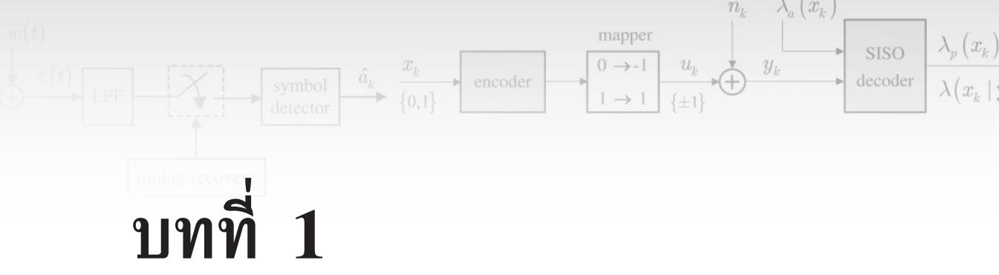

## บทนำ

ในบทนี้จะกล่าวถึงแบบจำลองทางคณิตศาสตร์ของช่องสัญญาณอ่าน (read chaททel) [1] ที่ใช้แทน ระบบการบันทึกเชิงแม่เหล็ก (magnetic recording system) ในฮาร์ดดิสก์ไดรฟ์ เพื่อให้ผู้อ่าน ทราบถึงระบบการประมวลผลสัญญาณของฮาร์ดดิสก์ไดรฟ์ซึ่งเป็นพื้นฐานในการศึกษาบทต่อไป นอกจากนี้ยังได้อธิบายแนวคิดและพื้นฐานของการใช้เทคนิคการถอดรหัสแบบวนซ้ำ (iterative decodiทg) [2 – 5] ในระบบการประมวลผลสัญญาณของฮาร์ดดิสก์ไดรฟ์ เพื่อให้ผู้อ่านเข้าใจถึง ประโยชน์ของเทคนิคการถอดรหัสแบบวนซ้ำ ซึ่งได้เริ่มนำมาใช้จริงในฮาร์ดดิสก์ไดรฟรุ่นใหม่ๆ [6] 1 น เพราะสามารถช่วยเพิ่มสมรรถนะของระบุบได้ดียิ่งขึ้น

## 1.1 ระบบการจัดเก็บข้อมูลดิจิทัล

ระบบการจัดเก็บข้อมูลดิจิทัล (digital data storage system) ในฮาร์ดดิสก์ไดรฟ์สามารถจำลองเป็น แผนภาพบล็อกได้ตามรูปที่1.1 [1, 5, 7] เมื่อบิตข่าวสาร (meรรage bits) ถูกส่งไปยังวงจรเข้ารหัส แก้ไขข้อผิดพลาด (ECC encoder) โดยรหัส RS (Reed Solomon) [2, 8] เป็นรหัสที่นิยมใช้ใน ฮาร์ดดิสก์ไดรฟ์ จากนั้นข้อมูลที่เข้ารหัสแล้วก็จะถูกทำการเข้ารหัสอีกครั้งหนึ่งด้วยวงจรเข้ารหัส มอดูเลชัน (modนโลtion encoder) เพื่อปรับคุณสมบัติของข้อมูลให้เหมาะสมกับช่องสัญญาณของ ฮาร์ดดิสก์ไดรฟ์ โดยรหัสมอดูเลชันที่นิยมใช้กันทั่วไปคือรหัส RLL (run-length limited code) [5, 9] ข้อมูลเอาต์พุตที่ได้จากวงจรเข้ารหัสมอดูเลชันถือว่าเป็นข้อมูลที่จะถูกเขียนเข้าไปจัดเก็บใน สื่อบันทึกซึ่งเรียกกันว่า "บิตที่จะถูกบันทึก (recorded bit)" หลังจากนั้นบิตที่จะถูกบันทึกก็จะถูก ส่งไปยังวงจรมอดูเลเตอร์ (moฝนlator) เพื่อแปลงบิตข้อมูลให้อยูในรูปของกระแสไฟฟ้าเขียน (write current พaveform) แล้วก็ป้อนเข้าไปในหัวเขียนเพื่อทำการเขียนข้อมูลลงไปในสื่อบันทึก

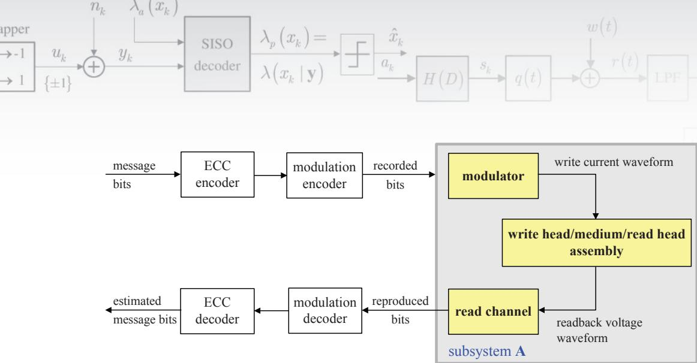  
1.2  
รูปที่ 1.1 แผนภาพบล็อกของระบบการจัดเก็บข้อมูลดิจิทัลในฮาร์ดดิสก์ไดรฟ์ [9, 10]

สำหรับกระบวนการอ่านข้อมูล หัวอ่าน (read head) จะอ่านข้อมูลจากสื่อบันทึกโดยเมื่อ หัวอ่านเคลื่อนที่มาถึงบริเวณที่มีการเปลี่ยนแปลงสภาพความเป็นแม่เหล็ก (magnetizatioท) ก็จะให้ ผลลัพธ์ออกมาเป็นสัญญาณรูปคลื่นแรงดันไฟฟ้าทีเรียกกันทั่วไปว่า "สัญญาณอ่านกลับ (readback signal)" จากนั้นสัญญาณอ่านกลับจะถูกส่งเข้าไปประมวลผลในช่องสัญญาณอ่านซึ่งประกอบด้วย ชินส่วนต่างๆ เช่น วงจรกรองผ่านต่ำ (LPF: low-pass filter), งจรชักตัวอย่าง (sampler หรือ analog-to-digital converter), อีควอไลเซอร์ (equalizer), และวงจรตรวจหาสัญลักษณ์ (symbol detector) เป็นต้น โดยข้อมูลเอาต์พุตที่ได้ก็จะถูกทำการถอดรหัสด้วยวงจรถอดรหัสมอดูเลชัน (modulation decoder) และวงจรถอดรหัสแก้ไขข้อผิดพลาด (ECC decoder) ตามลำดับ เพื่อหา ค่าประมาณของบิตข่าวสารที่ต้องการจะนำมาใช้งาน

## 1.2 แบบจำลองช่องสัญญาณของฮาร์ดดิสก์ไดรฟ์

ระบบย่อย A (ธนbรมรtem A) ในรูปที่ 1.1 สามารถแสดงให้อยูในรูปของแบบจำลองทางคณิตศาสตร์ ได้ตามรูปที่ 1.2 [1, 10] เมื่อลำดับข้อมูลอินพุตแบบไบนารี $a _ { k } \in \{ 0 , 1 \}$ ที่มีคาบเวลาของบิตเท่ากับ T หน่วย ถูกส่งผ่านไปยังวงจรอนุพันธ์อุดมคติ (ideal differentiator) ที่มีรูปพหุนามเท่ากับ 1 – D เมื่อ D คือตัวดำเนินการหน่วงเวลา T หน่วย ทำให้ได้เป็นลำดับข้อมูลเปลี่ยนสถานะ (traทรition sequence) $b _ { k } \in \{ - 1 , 0 , 1 \}$ เมื่อ $b _ { k } = \pm 1$ หมายถึงการเปลี่ยนสถานะแบบบวกหรือแบบลบ (positive or negative transition) และ $b _ { k } = 0$ หมายถึงไม่มีการเปลี่ยนสถานะ (n0 tranรition) จากนันลำดับข้อมูลเปลียนสถานะ $b _ { k }$ จะถูกส่งผ่านไปยังช่องสัญญาณที่มีผลตอบสนองอิมพัลส์ เท่ากับสัญญาณพัลส์เปลี่ยนสถานะ g(t) และถูกรบกวนด้วยสัญญาณรบกวน ท(t) ทำให้ได้เป็น สัญญาณอ่านกลับ r(t) ซึ่งสามารถเขียนเป็นสมการคณิตศาสตร์ได้คือ

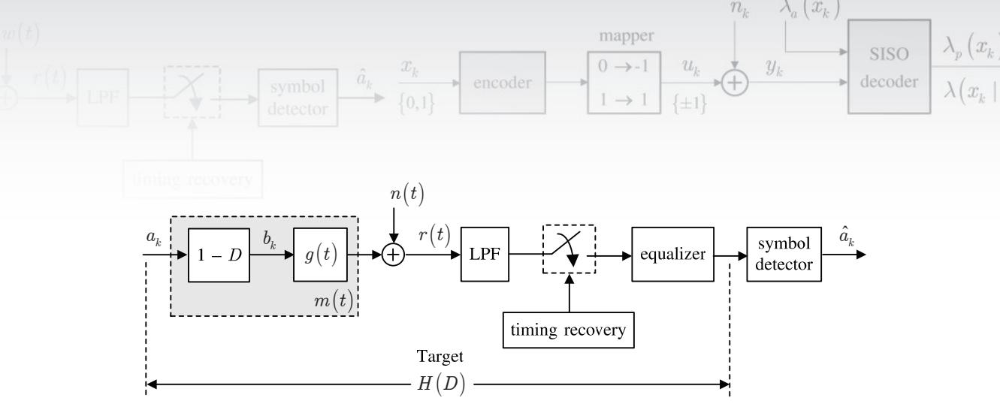  
รูปที่ 1.2 แบบจำลองช่องสัญญาณของฮาร์ดดิสก์ไดรฟ์

$$
r \left( t \right) = \sum _ { k } b _ { k } g \left( t - k T \right) + n \left( t \right)\tag{1.1}
$$

จากนั้นที่วงจรภาครับ สัญญาณอ่านกลับ $r ( t )$ จะถูกส่งผ่านไปยังวงจรกรองผ่านต่ำ (LPF) เพื่อกำจัด สัญญาณรบกวนที่อยู่นอกแถบความถี่ และถูกทำการชักตัวอย่าง ณ เวลาที่ถูกควบคุมด้วยระบบ ไทมมิ่งริดัฟเวอรี (timing recovery) [10] ข้อมูลเอาต์พุตของวงจรชักตัวอย่างก็จะถูกส่งไปยัง อีควอไลเซอร์และวงจรตรวจหาสัญลักษณ์ เพื่อหาลำดับข้อมูลอินพุตที่ควรจะเป็นสูงสุด $\hat { a } _ { k }$ (หรือ ค่าประมาณของ $a _ { k } )$

สำหรับระบบการบันทึกแบบแนวนอน (longitนdinal recording) สัญญาณพัลส์เปลี่ยน สถานะหรือที่รู้จักกันทั่วไปว่าสัญญาณพัลส์ Loreทtziลaท มีรูปสมการคือ [11]

$$
g \big ( t \big ) = \frac { 1 } { 1 + \big ( 2 t / \mathrm { P W } _ { 5 0 } \big ) ^ { 2 } }\tag{1.2}
$$

โดยที่ $\mathrm { P W } _ { 5 0 }$ คือความกว้างของสัญญาณพัลส์ $g ( t )$ วัด ณ ตำแหน่งที่สัญญาณพัลส์มีความสูงเป็น ครึ่งหนึ่งของความสูงสูงสุด ในขณะที่สัญญาณพัลส์เปลี่ยนสถานะของระบบการบันทึกแบบแนวตั้ง (perpendicular recording) มีรูปสมการคือ [12]

$$
g \big ( t \big ) = \mathrm { e r f } \left( \frac { 2 t \sqrt { \mathrm { l n } 2 } } { \mathrm { P W } _ { 5 0 } } \right)\tag{1.3}
$$

เมื่อ ln(.) คือลอการิทึมธรรมชาติ (natural logarithm), $\mathrm { P W } _ { 5 0 }$ คือความกว้างของพัลส์ $g ^ { \prime } ( t )$ หรือ อนุพันธ์ของ $g ( t )$ วัด ณ ตำแหน่งที่สัญญาณพัลส์มีความสูงเป็นครึ่งหนึ่งของความสูงสูงสุด, และ erf() คือฟังก์ชันข้อผิดพลาด (error function) ซึ่งนิยามโดย

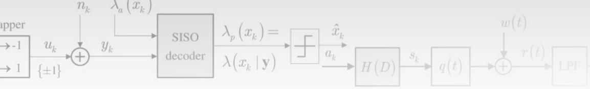

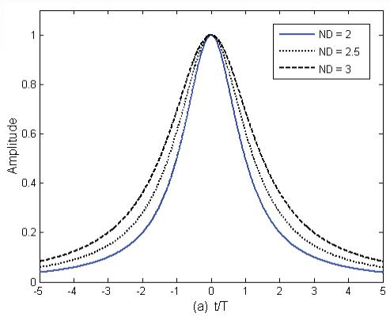

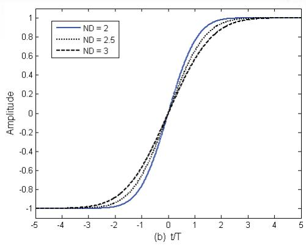  
รูปที่ 1.3 สัญญาณพัลส์เปลี่ยนสถานะสำหรับการบันทึก (a) แบบแนวนอน และ (b) แบบแนวตั้ง 2

$$
\mathrm { e r f } \left( x \right) = \frac { 2 } { \sqrt { \pi } } \int _ { 0 } ^ { x } e ^ { - t ^ { 2 } } d t\tag{1.4}
$$

ในระบบการบันทึกข้อมูลของฮาร์ดดิสก์ไดรฟ์ ความหนาแน่นของการบันทึกแบบนอร์มอล ไลซ์ (ND: normalized recording density) จะนิยามโดย [11]

$$
\mathrm { N D } = { \frac { \mathrm { P W } _ { 5 0 } } { T } }\tag{1.5}
$$

ซึ่งหมายถึงความหนาแน่นของการบันทึกข้อมูล เมื่อ $T$ คือคาบเวลาของข้อมูลหนึ่งบิตหรือที่เรียก กันว่าบิตเซลล์ (bit cell) โดยค่า ND จะเป็นตัวบ่งบอกว่าบริเวณ $\mathrm { P W } _ { 5 0 }$ สามารถจัดเก็บข้อมูลได้ กี่บิต รูปที่ 1.3 แสดงผลตอบสนองการเปลี่ยนสถานะสำหรับการบันทึกแบบแนวนอนและแบบ แนวตั้ง ณ ระดับ ND ต่างๆ ซึงจะพบว่าสัญญาณพัลส์เปลี่ยนสถานะของทั้งสองแบบครอบคลุม ช่วงเวลาหลายๆ บิตเซลล์ โดยเฉพาะอย่างยิ่งเมื่อ ND มีค่าเพิ่มขึ้น หรือกล่าวอีกนัยหนึ่งคือการ แทรกสอดระหว่างสัญลักษณ์ (Iร1: intersymbol interference) จะมีความรุนแรงมากขึนเมื่อ ND มีค่าเพิ่มขึ้น เพราะโอกาสที่สัญญาณพัลส์เปลี่ยนสถานะที่อยู่ใกล้กันจะมาซ้อนเหลื่อม (Overlap) กันมีความเป็นไปได้สูง

ในกรณีที่หัวอ่านเคลื่อนที่มาถึงบริเวณที่มีการเปลี่ยนสถานะของสภาพความเป็นแม่เหล็ก ติดกันสองครั้ง สัญญาณพัลส์รวมที่ได้จะเรียกว่า "สัญญาณพัลส์ไดบิต (dibit pulse)" หรือผลตอบ สนองไดบิต (dibit response) [11] ซึ่งมีค่าเท่ากับ (ดูรูปที่ 1.2)

$$
m ( t ) = g ( t ) - g ( t - T )\tag{1.6}
$$

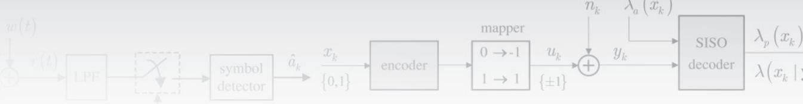

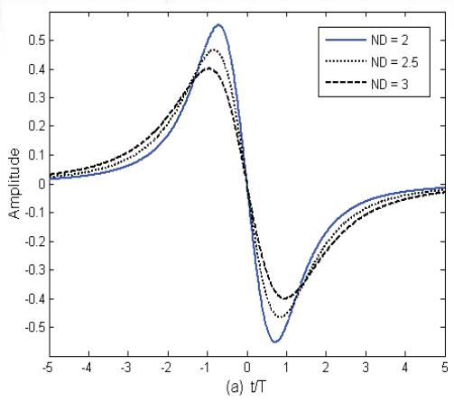

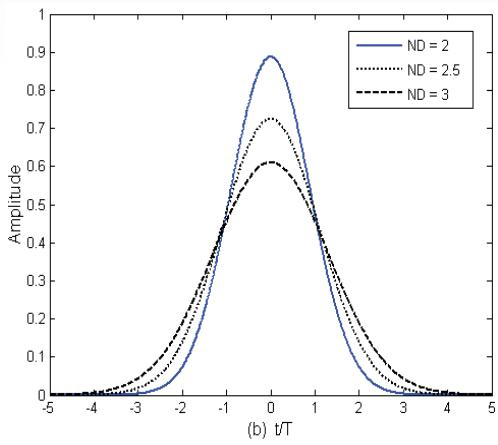  
รูปที่ 1.4 สัญญาณพัลส์ไดบิต สำหรับการบันทึก (a) แบบแนวนอน และ (b) แบบแนวตั้ง

ดังแสดงในรูปที่ 1.4 โดยผลตอบสนองไดบิตนี้จะถือว่าเป็นตัวแทนของ "ช่องสัญญาณ (channel)" ของระบบการบันทึกข้อมูลในฮาร์ดดิสก์ไดรฟ์

โดยทั่วไปวงจรตรวจหาสัญลักษณ์ที่นิยมใช้ในระบบการบันทึกแม่เหล็กคือ วงจรตรวจหา วีเทอร์บิ (Viterbi detector) [10, 13] เนืองจากความซับซ้อนของวงจรตรวจหาวีเทอร์บิจะเพิ่มขึน แบบเลขชี้กำลังตามจำนวนหน่วยความจำของช่องสัญญาณ (chaททel memory) ดังนั้นอีควอไลเซอร์ จึงเป็นสิ่งจำเป็นที่ต้องนำมาใช้เพื่อปรับรูปร่างผลตอบสนองรวมของทั้งระบบให้เป็นไปตามผลตอบ สนองที่ต้องการที่เรียกว่า "ผลตอบสนองทาร์เก็ต1 (target response)" H(D) [10, 11, 14] และ ช่วยลดความซับซ้อนของวงจรตรวจหาวีเทอร์บิได้ ในทางปฏิบัติทาร์เก็ตนี้เรียกกันทั่วไปว่า "ทาร์เก็ต แบบผลตอบสนองบางส่วน" หรือทาร์เก็ตแบบ PR (partial response) โดยทาร์เก็ตแบบ PR ที่เป็น ที่ยอมรับในระบบการบันทึกแบบแนวนอนมีรูปสมการคือ [11]

$$
H ( D ) = ( 1 - D ) { ( 1 + D ) } ^ { n }\tag{1.7}
$$

และในระบบการบันทึกแบบแนวตั้งมีรูปสมการคือ [14, 15]

$$
H \left( D \right) = \left( 1 + D \right) ^ { n }\tag{1.8}
$$

เมื่อ ท คือเลขจำนวนเต็มบวก

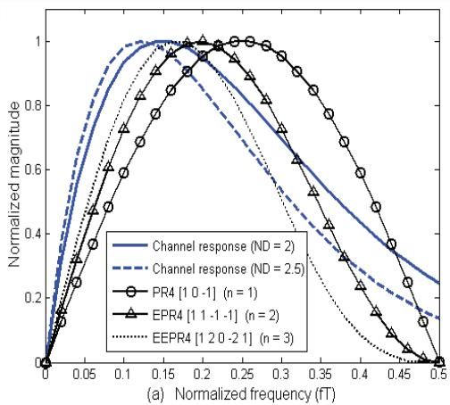

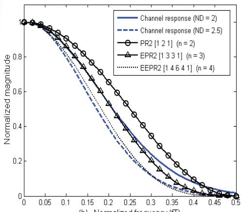  
(b) Normalized frequency (fT)  
รูปที่ 1.5 ผลตอบสนองเชิงความถี่ของทาร์เก็ตแบบต่างๆ สำหรับช่องสัญญาณการบันทึก (a) แบบแนวนอน และ (b) แบบแนวตัง

รูปที่ 1.5 เปรียบเทียบผลตอบสนองเชิงความถี่(frequency response) ของทาร์เก็ตแบบ ต่างๆ โดยผลตอบสนองเชิงความถี่ของช่องสัญญาณก็คือ ผลการแปลงฟูเรียร์ (Fourer tranรform) ของสัญญาณพัลส์ไดบิต [1] ในสมการ (1.6) และตัวเลขที่อยู่ในเครื่องหมายวงเล็บสี่เหลี่ยม [-] แสดงค่าสัมประสิทธิ์แต่ละแท็ปของทาร์เก็ต ตัวอย่างเช่น

. PR4 [1 0 –1] หมายถึงทาร์เก็ตแบบ PR4 (PR class-IV) ที่มีฟังก์ชันถ่ายโอนในโดเมน D [1] คือ $H ( D ) = 1 - D ^ { 2 } ;$ หรือ

EEPR2 [1 4 6 4 1] หมายถึงทาร์เก็ตแบบ EEPR2 ที่มีฟังก์ชันถ่ายโอนในโดเมน D คือ H(D) $= 1 + 4 D + 6 D ^ { 2 } + 4 D ^ { 3 } + D ^ { 4 }$ เป็นต้น

จากรูปที่ 1.5 พบว่าเมื่อช่องสัญญาณมีค่า ND เพิ่มขึ้น ทาร์เก็ตที่ใช้ก็ควรมีจำนวนแท็ปมากขึ้น (มีค่า ท มากขึ้น) เพื่อให้ผลตอบสนองของทาร์เก็ตมีลักษณะเหมือนกับผลตอบสนองของช่องสัญญาณ ให้มากที่สุด ซึ่งจะช่วยทำให้วงจรตรวจหาวีเทอร์บิทำงานได้อย่างมีประสิทธิภาพมากขึ้น (ศึกษา รายละเอียดเพิ่มเติมได้ในบที่ 3 ของ [10]

นอกจากนี้จากสมการ (1.7) และ (1.8) พบว่าค่าสัมประสิทธิของทาร์เก็ตแบบ PR ทุกตัว จะเป็นเลขจำนวนเต็ม อย่างไรก็ตามถ้าใช้ทาร์เก็ตที่มีค่าสัมประสิทธิ์เป็นเลขจำนวนจริงซึ่งเรียกว่า “"ทาร์เก็ตแบบ GPR (generalized partial response target)" สมรรถนะรวมของระบบที่ได้จะดีกว่า การใช้ทาร์เก็ตแบบ PR มาก ผู้สนใจสามารถศึกษาเทคนิคการออกแบบอีควอไลเซอร์และทาร์เก็ต ที่เหมาะกับช่องสัญญาณของฮาร์ดดิสก์ไดรฟ์ได้ใน [10, 14, 15]

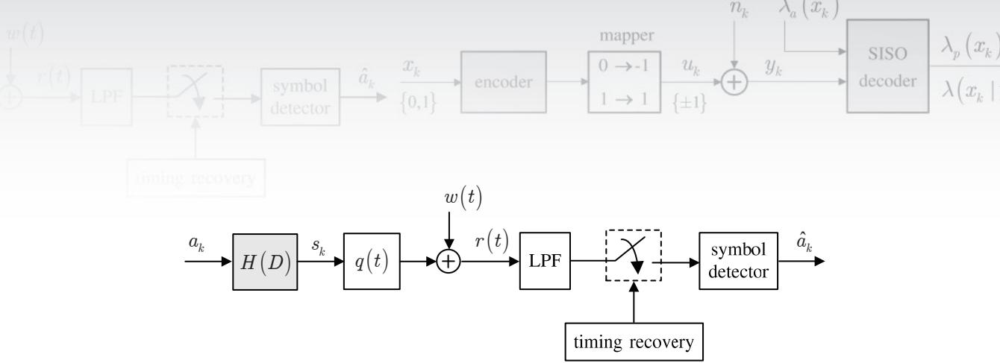  
รูปที่ 1.6 แบบจำลองช่องสัญญาณอุดมคติ

## 1.3 แบบจำลองช่องสัญญาณอุดมคติ

แบบจำลองช่องสัญญาณในรูปที่ 1.2 ถือว่าเป็น "แบบจำลองช่องสัญญาณเสมือนจริง (realistic channel mอdel)" เพราะมีลักษณะการทำงานใกล้เคียงกับระบบจริงซึ่งประกอบด้วยชิ้นส่วนที่สำคัญ ที่มีอยูในสถาปัตยกรรมช่องสัญญาณอ่านของฮาร์ดดิสก์ไดรฟ์ [1] ในหัวข้อนี้จะอธิบาย "แบบจำลอง ช่องสัญญาณอุดมคติ (ideal channel model)"ซึ่งนิยมใช้ในการศึกษาและวิเคราะห์พื้นฐานการ ทำงานของระบบการประมวลผลสัญญาณของฮาร์ดดิสก์ไดรฟ์ เพราะเป็นแบบจำลองทีไม่ซับซ้อน และง่ายต่อการทำความเข้าใจ

ดังนั้นถ้าสมมุติให้ระบบมีกระบวนการอีควอไลเซชันแบบสมบูรณ์ (perfect equalization) แบบจำลองในรูป 1.2 ก็จะสามารถลดรูปได้เป็นแบบจำลองช่องสัญญาณอุดมคติในรูปที่ 1.6 โดย ลำดับข้อมูลอินพุตแบบไบนารี $a _ { k }$ ที่มีคาบเวลาของบิตเท่ากับ T จะถูกส่งเข้าไปยังช่องสัญญาณ $H \left( D \right) = \sum _ { i } h _ { i } D ^ { i }$ เมื่อ $h _ { i }$ คือค่าสัมประสิทธิตัวที่ i ของช่องสัญญาณ และถูกกล้ำสัญญาณ (modulate) กับสัญญาณพัลส์ไนควิตส์อุดมคติ (ideal Nyquist pulse) q(t) = sin(πt/ T)/(πt/T) [16] และถูกรบกวนด้วยสัญญาณรบกวน พ(t) ทำให้ได้เป็นสัญญาณอ่านกลับ

$$
r ( t ) { = } \sum _ { k } s _ { k } q { \big ( } t { - } k T { \big ) } { + } w { \big ( } t { \big ) }\tag{1.9}
$$

โดยที่ $s _ { k } = a _ { k } * h _ { k }$ คือข้อมูลเอาต์พุตของช่องสัญญาณ และ \* คือตัวดำเนินการคอนโวลูชัน (convolution operator)จากนั้นที่วงจรภาครับ สัญญาณอ่านกลับ r(t) จะถูกส่งผ่านไปยังวงจรกรอง ผ่านต่ำและถูกทำการชักตัวอย่าง ณ เวลาที่ถูกควบคุมโดยระบบไทมมิ่งริคัฟเวอรี ก่อนจะส่งข้อมูล เอาต์พุตของวงจรชักตัวอย่างไปยังวงจรตรวจหาสัญลักษณ์เพื่อทำการหาลำดับข้อมูลอินพุตที่ควร จะเป็นสูงสุด

## 1.4 การถอดรหัสแบบวนซำ

แบบจำลองช่องสัญญาณในรูปที่ 1.2 เป็นแบบจำลองของ “ระบบที่ไม่ถูกเข้ารหัส (uncอded system)" อย่างไรก็ตามวงจรภาครับที่ใช้จริงในหลายๆ งานประยุกต์จะใช้ทั้งการอีควอไลเซชัน (eqนลlization) เพื่อจัดการกับการลดทอน (distortioท) ของช่องสัญญาณ และการเข้ารหัสแก้ไขข้อผิดพลาด (error correction cอding) เพื่อจัดการกับข้อผิดพลาดที่เกิดขึ้นจากช่องสัญญาณ โดยทั่วไประบบที่มีการ ใช้งานรหัส ECC จะเรียกว่า “ระบบทีถูกเข้ารหัส (coded system)"

ระบบการประมวลผลสัญญาณของฮาร์ดดิสก์ไดรฟ์จริง (ดูรูปที่ 1.1) จะมีการใช้งานรหัส แก้ไขข้อผิดพลาดด้วยเช่นกัน (ซึ่งจะใช้รหัส RS เพราะสามารถแก้ไขข้อผิดพลาดที่ติดกันหลายบิต ได้) กล่าวคือบิตข่าวสารจะถูกส่งเข้าไปยังวงจรเข้ารหัสแก้ไขข้อผิดพลาดและวงจรเข้ารหัสมอดูเลชัน ก็จะได้เป็นลำดับข้อมูลอินพุต $a _ { k }$ ในรูปที่ 1.2 จากนั้นที่วงจรภาครับ ลำดับข้อมูลอินพุตที่ตรวจหา ได้ $\hat { a } _ { k }$ ในรูปที 1.2 ก็จะถูกส่งไปยังว่งจรถอดรหัสมอดูเลชันและวงจรถอดรหัสแก้ไข้อผิดพลาด เพื่อให้ได้เป็นค่าประมาณของบิตข่าวสารที่จะนำไปใช้งานได้ การทำงานของระบบการประมวลผล สัญญาณของฮาร์ดดิสก์ไดรฟ์ในลักษณะนี้นิยมใช้ตั้งแต่อดีตจนถึงปัจจุบันซึ่งถือว่าเป็นการประมวล ผลแบบทางเดียว (one-way processing) นันคือวงจรตรวจหาสัญลักษณ์จะทำงานเป็นอิสระจาก วงจรถอดรหัส ECC

อย่างไรก็ตามงานวิจัย [2 - 5] แสดงให้เห็นว่า "การถอดรหัสแบบวนซ้ำ (iterative decodiท)" ซึ่งเป็นการทำงานร่วมกันระหว่างวงจรตรวจหาสัญลักษณ์และวงจรถอดรหัส ECC สามารถช่วยเพิ่มสมรรถนะรวมของระบบได้เป็นอย่างมาก ฮาร์ดดิสก์ไดรฟที่ใช้ระบบการประมวลผล สัญญาณแบบวนซ้ำจะมีโครงสร้างตามรูปที่1.7 โดยมีการเพิ่มวงจรเข้ารหัสแบบวนซ้ำ (iterative encoder) และวงจรถอดรหัสแบบ SIS02 (soft-input soft-output) เข้าไปในระบบ นอกจากนี้วงจร ตรวจหาสัญลักษณ์ที่ใช้ในระบบย่อย A จะต้องเปลี่ยนจากวงจรตรวจหาวีเทอร์บิเป็นวงจรตรวจหา แบบ รเร0 โดยที่วงจรเข้ารหัสแบบวนซ้ำก็คือวงจรเข้ารหัสแก้ไขข้อผิดพลาดประเภทหนึ่ง3ซึ่งนิยม ใช้รหัส LPDC (l1ow-density parity-check code) [17] เพราะเป็นรหัส ECC ที่มีสมรรถนะมากสุด [2, 5] (ศึกษารายละเอียดเกี่ยวรหัส LPDC ได้ในบทที่ 4)

ปัจจุบันนี้ฮาร์ดดิสก์ไดรฟรุ่นใหม่ๆ ได้นำเทคนิคการถอดรหัสแบบวนซ้ำมาใช้งานแล้ว (ตามรูปที่ 1.7) ซึ่งจะมีการแลกเปลี่ยนข่าวสารแบบซอฟต์ (soft inforทลtioท) [2] ระหว่างวงจร ตรวจหาแบบ SIS0 และวงจรถอดรหัสแบบ SIร0 โดยที่วงจรตรวจหาแบบ SIร0 ที่ใช้กับการถอด รหัสแบบวนซ้ำสามารถพัฒนาได้จากอัลกอริทึม BCJR [18] หรือ SOVA (soft-outpนt Viterbi algorithm) [19] (ศึกษารายละเอียดได้ในบทที่ 2 - 3) ในขณะที่วงจรถอดรหัสแบบ รIร0 ที่ใช้ ถอดรหัสข้อมูลที่ถูกเข้ารหัสด้วยรหัส LDPC จะพัฒนามาจากอัลกอริทึมการผ่านข่าวสาร (message passing algorithm) [17] (ศึกษารายละเอียดได้ในหัวข้อที่ 4.4.4)

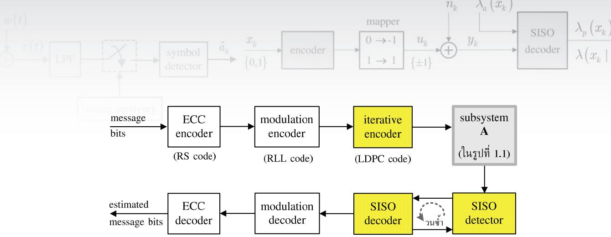  
รูปที่ 1.7 แผนภาพบล็อกแสดงการทำงานของระบบการประมวลผลสัญญาณแบบวนซ้ำของฮาร์ดดิสก์ไดรฟ์

การทำงานของเทคนิคการถอดรหัสแบบวนซำเริ่มจาก วงจรตรวจหาแบบ รเรอ ทำการ ตรวจหาข้อมูลที่ได้รับ แล้วส่งผลัพ์ทีได้ (ซึ่งเป็นข่าวสารแบบซอฟต์) ไปยังวงจรถอดรหัสแบบ รIรอ จากนันวงจรถอดรหัสแบบ รเรอ ก็จะส่งผลลัพธ์ทีได้จากการถอดรหัสข้อมลกลับไปให้วงจร ตรวจหาแบบ รเร0 เพื่อใช้ในการตรวจหาข้อมูลใหม่อีกครั้งหนึ่ง กระบวนการนี้จะดำเนินการไป เรือยๆ จนกระทังครบตามจำนวนรอบ (iterลtiก) ของการวนซำทีกำหนด วงจรถอดรหัสแบบ รIร0 จึงจะส่งข้อมูลเอาต์พุตทีได้ไปยังวงจรถอดรหัสมอดูเลชันและวงจรถอดรหัส RS เพื่อทำการถอดรหัส ข้อมูลต่อไป

หมายเหตุ จากรูปที่1.7 จะพบว่ามีการใช้งานทั้งรหัส RS และรหัส LDPC อย่างไรก็ตามในทาง ปฏิบัติพบว่า [20] เมื่อมีการใช้งานรหัส LPDC ในการถอดรหัสแบบวนซ้ำแล้ว ก็อาจจะไม่จำเป็น ต้องใช้รหัส RS ก็ได้ ดังนั้นผู้ใช้สามารถเลือกใช้งานรหัส RS และรหัส LDPC ร่วมกัน หรือใช้รหัส LDPC เพียงอย่างเดียว ก็ยังคงให้สมรรถนะที่ไกล้เคียงกัน

## 1.5 พื้นฐานและคำศัพท์ที่น่าสนใจ

ในหัวข้อนี้จะอธิบายพื้นฐานและคำศัพท์ที่น่าสนใจที่เกี่ยวข้องกับการถอดรหัสแบบวนซ้ำ เพื่อให้ ผู้อ่านเข้าใจความหมายของคำเหล่านี้ ก่อนศึกษาเนื้อหาในบทที่ 2 – 4

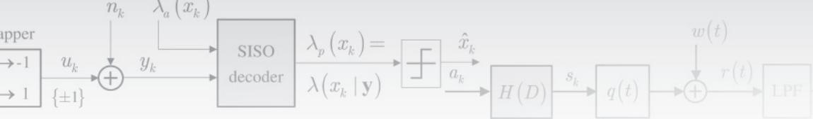

## 1.5.1 การตัดสินใจแบบฮาร์ดและแบบซอฟต์

ณ วงจรภาครับของระบบสื่อสารดิจิทัล วงจรตรวจหาและวงจรถอดรหัสสามารถเลือกใช้งานได้ทั้ง 1ะ.ย การตัดสินใจแบบฮาร์ด (hard decision) และการตัดสินใจแบบซอฟต์ (soft decision) เมื่อ

การตัดสินใจแบบฮาร์ด คือการหาค่าประมาณของบิตข้อมูลหรือสัญลักษณ์ (รymbอ1) ที่ได้ จากวงจรตรวจหาหรือวงจรถอดรหัส โดยผลลัพธ์ที่ได้จะเรียกว่า "ข่าวสารแบบฮาร์ด (hard information)" เช่น ถ้าวงจรตรวจหาได้รับข้อมูลที่มีค่าเท่ากับ 0.9 ก็อาจจะตัดสินใจว่าบิตข้อมูล ที่ส่งมาจากวงจรภาคส่งคือบิต 1

การตัดสินใจแบบซอฟต์ คือการหาค่าความน่าเชื่อถือ (reliลbปlity) ของบิตข้อมูลหรือสัญลักษณ์ ที่ได้จากวงจรตรวจหาหรือวงจรถอดรหัสโดยอาศัยข้อมูลที่วงจรภาครับมีทั้งหมด และผลลัพธ์ที่ ได้จะเรียกว่า '"ข่าวสารแบบซอฟต์ (soft information)" ตัวอย่างเช่น ถ้าวงจรถอดรหัสให้ผลลัพธ์ เป็นข่าวสารแบบซอฟต์ที่มีค่ามาก ก็แสดงว่าค่าประมาณของบิตข้อมูลหรือสัญลักษณ์ที่ได้จาก วงจรถอดรหัสนี้มีความน่าเชื่อถือหรือความเป็นไปได้ที่จะถูกต้องสูง

สำหรับระบบสื่อสารแบบไบนารี ความน่าเชื่อถือของบิตข้อมูลจะวัดจาก "อัตราส่วนควรจะ เป็นแบบลอการิทึม (LLR: 1og-likelihood ratio)" นั้นคือถ้ากำหนดให้ $x \in \{ 0 , 1 \}$ เป็นตัวแปร สุ่มไบนารี ดังนั้นค่า LLR ของ x นิยามโดย

$$
\lambda { \bigl ( } x { \bigr ) } = \ln \left( { \frac { p { \bigl ( } x = 1 { \bigr ) } } { p { \bigl ( } x = 0 { \bigr ) } } } \right)\tag{1.10}
$$

เมื่อ In(.) คือลอการิทึมธรรมชาติ (natural logarithm) และ $p ( x )$ คือฟังก์ชันความหนาแน่นความ น่าจะเป็น (pdf: probability density function) ของ x นอกจากนี้ค่าสัมบูรณ์ (absolute value) ของ $\lambda ( x )$ คือข่าวสารแบบซอฟต์หรือค่าความน่าเชื่อถือของบิตข้อมูล x และเครื่องหมายของ λ(x) ก็คือข่าวสารแบบฮาร์ดหรือค่าประมาณของบิตข้อมูล x นั้นคือ

$$
\hat { x } = \left\{ { \begin{array} { l l } { 1 , } & { { \mathrm { i f } } \ \lambda ( x ) \geq 0 } \\ { 0 , } & { { \mathrm { i f } } \ \lambda ( x ) < 0 } \end{array} } \right.\tag{1.11}
$$

## 1.5.2 อัตราส่วนควรจะเป็นแบบลอการิทีึม

อัตราส่วนควรจะเป็นแบบลอการิทึม (LLR) ถือเป็นเมตริก (metric) หรือตัวชี้วัดข่าวสารที่ใช้มาก ในอัลกอริทึมต่างๆ ที่ใช้ในกระบวนการถอดรหัสแบบวนซ้ำ เช่น อัลกอริทึม BCJR, SOVA, และ LDPC เป็นต้น ในหนังสือนี้จะใช้สัญลักษณ์ $\lambda ( x )$ แทนค่า LLR ของบิตข้อมูล $x \in \{ 0 , 1 \}$ ซึ่ง

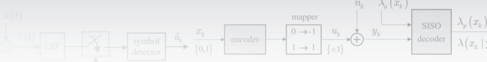

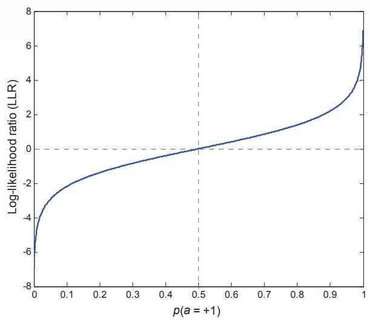  
รูปที่ 1.8 ค่า LLR ของบิตข้อมูล a เมื่อเทียบกับความน่าจะเป็น $p ( a = + 1 )$

ก็คือค่าลอการิทีมธรรมชาติของเศษส่วนระหว่างความน่าจะเป็นของบิต 1 และบิต 0 ตามที่นิยามใน สมการ (1.10)

สำหรับระบบสื่อสารที่ใช้ข้อมูลอินพุตไบนารีแบบเชิงขั้ว นั่นคือ $a \in \{ - 1 , 1 \}$ ค่า LLR จะนิยามโดย

$$
\lambda { \big ( } a { \big ) } = \ln \left( { \frac { p { \big ( } a = + 1 { \big ) } } { p { \big ( } a = - 1 { \big ) } } } \right)\tag{1.12}
$$

ซึ่งนิยมใช้มากในอัลกอริทึมการถอดรหัส (decoding algorithm) เพราะเครื่องหมายของค่า λ(a) นี้สามารถนำมาใช้เป็นค่าประมาณของบิตข้อมูล a (หรือข่าวสารแบบฮาร์ด) ได้ทันที ในทำนอง เดียวกันขนาดของ λ(a) ก็ใช้เป็นตัวบอกถึงความน่าเชื่อถือของบิตข้อมูล a (หรือข่าวสารแบบซอฟต์) รูปที่1.8 แสดงค่า LLR ของบิตข้อมูล a เมื่อเที่ยบกับความน่าจะเป็น $p ( a = + 1 )$ โดย $\lambda ( a )$ มีค่า เป็นบวกเมื่อ $p ( a = + 1 ) > 0 . 5$ นั้นคือบิตข้อมูล a มีความน่าเชื่อถือที่จะเป็นบิต 1 มากกว่าบิต –1 และ λ(a) มีค่าเป็นลบเมื่อ $p ( a = + 1 ) < 0 . 5$ นั่นคือบิตข้อมูล a มีความน่าเชื่อถือที่จะเป็นบิต –1 มากกว่าบิต 1 นอกจากนีถ้า $p ( a = + 1 ) = 0 . 5$ ก็จะทำให้ $\lambda ( a ) = 0$   
มีโอกาสที่จะเป็นได้ทั้งบิต 1 และบิต –1 ด้วยความน่าจะเป็นเท่ากัน

เนื่องจาก $p ( a = + 1 ) = 1 - p ( a = - 1 )$ ดังนั้นสมการ (1.12) จัดรูปใหม่ได้เป็น

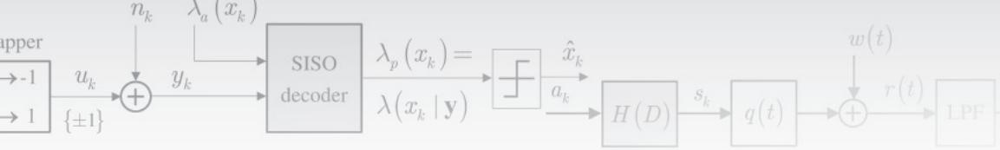

$$
e ^ { \lambda ( a ) } = \frac { p ( a = + 1 ) } { 1 - p ( a = + 1 ) }\tag{1.13}
$$

และ

$$
p \big ( a = + 1 \big ) = \frac { e ^ { \lambda ( a ) } } { 1 + e ^ { \lambda ( a ) } } = \frac { 1 } { 1 + e ^ { - \lambda ( a ) } } = \frac { e ^ { \lambda ( a ) / 2 } } { e ^ { \lambda ( a ) / 2 } + e ^ { - \lambda ( a ) / 2 } }\tag{1.14}
$$

$$
p \left( a = - 1 \right) = \frac { e ^ { - \lambda \left( a \right) } } { 1 + e ^ { - \lambda \left( a \right) } } = \frac { 1 } { 1 + e ^ { + \lambda \left( a \right) } } = \frac { e ^ { - \lambda \left( a \right) / 2 } } { e ^ { - \lambda \left( a \right) / 2 } + e ^ { \lambda \left( a \right) / 2 } }\tag{1.15}
$$

1.5.31\$X1E

จากสมการ (1.14) และ (1.15) สรุปได้ว่าสำหรับ $C \in \{ - 1 , + 1 \}$ จะได้ว่า

$$
p \left( a = C \right) = \frac { e ^ { C \lambda \left( a \right) / 2 } } { e ^ { \lambda \left( a \right) / 2 } + e ^ { - \lambda \left( a \right) / 2 } }\tag{1.16}
$$

## 1.5.3 ข้อมูลเอาต์พุตแบบซอฟต์ของช่องสัญญาณ

พิจารณาระบบสื่อสารแบบไบนารี เมื่อบิตข้อมูล $x \in \{ 0 , 1 \}$ ถูกส่งไปยังวงจรเข้าคู่ (mapper) เพื่อ แปลงให้เป็นบิตข้อมูล $u \in \{ - 1 , 1 \}$ แล้วส่งผ่านช่องสัญญาณที่ไม่มีหน่วยความจำ ซึ่งทำให้สัญญาณ ที่วงจรภาครับได้รับมีค่าเท่ากับ $y = u + n$ เมื่อ n คือสัญญาณรบกวนเกาส์สีขาวแบบบวก (AพGN: additive พhite Gaussian noise) ที่มีค่าเฉลี่ยเท่ากับศูนย์และความแปรปรวนเท่ากับ $\sigma ^ { 2 }$

นิยามฟังก์ชันความหนาแน่นความน่าจะเป็นแบบมีเงื่อนไข (conditioกal probability density function) $p \big ( \boldsymbol { y } \mid \boldsymbol { x } \big )$ คือฟังก์ชันความหนาแน่นความน่าจะเป็นของตัวแปรสุ่ม ๆ เมื่อกำหนด ค่า x มาให้ ในทางกลับกันถ้ากำหนดค่า y มาให้ ก็จะได้ว่า $p ( y \mid x )$ ที่เป็นฟังก์ชันของตัวแปร x จะถูกเรียกว่า "ฟังก์ชันควรจะเป็น (likelihood function)" [4]

ในทางปฏิบัติก่อนที่วงจรภาครับจะได้รับข้อมูล y ความน่าจะเป็นอะพิรืออริ (a priori probability) ของ x จะมีค่าเท่ากับ $p ( x = 1 )$ และ $p \big ( x = 0 \big )$ อย่างไรก็ตามหลังจากที่วงจรภาครับ ได้รับข้อมูล  ความน่าจะเป็น $p ( x = 1 | y )$ และ $p ( x = 0 | y )$ จะเปลี่ยนเป็นความน่าจะเป็นอะโพส เทอริออริ (APP: a posterioriprobability) และจากกฎของเบส์ (Bayes'rule) ทำให้ได้ว่า

$$
\begin{array} { c } { { p \big ( x = i \mid y \big ) = p \big ( x = i ; y \big ) / p \big ( y \big ) } } \\ { { { } } } \\ { { = p \big ( y \mid x = i \big ) p \big ( x = i \big ) / p \big ( y \big ) } } \end{array}\tag{1.17}
$$

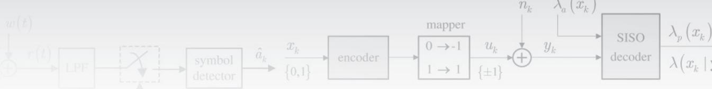

เมื่อ $i \in \{ 0 , 1 \}$ และ $p \big ( a ; b \big )$ คือฟังก์ชันความหนาแน่นความน่าจะเป็นร่วม (oit pdf) ระหว่าง ตัวแปรสุ่ม a และ b ดังนั้นค่า LLR ของบิตข้อมูล x เมื่อกำหนดค่า y มาให้ จะนิยามโดย

$$
\lambda { \big ( } x \mid y { \big ) } = \ln \left( { \frac { p { \big ( } x = 1 \mid y { \big ) } } { p { \big ( } x = 0 \mid y { \big ) } } } \right)\tag{1.18}
$$

จากกฎของเบส์จะได้ว่า

$$
\begin{array} { c } { \displaystyle \ln \left( \frac { p \big ( x = 1 | y \big ) } { p \big ( x = 0 | y \big ) } \right) = \ln \left( \frac { p \big ( y | x = 1 \big ) } { p \big ( y | x = 0 \big ) } \right) + \ln \left( \frac { p \big ( x = 1 \big ) } { p \big ( x = 0 \big ) } \right) } \\ { = L _ { c } y + \lambda \big ( x \big ) } \end{array}\tag{1.19}
$$

เมื่อ $L _ { c }$ คือข้อมูลเอาต์พุตแบบซอฟต์ของช่องสัญญาณซึ่งถือเป็นข่าวสารแบบซอฟต์ที่สอดคล้อง กับบิตข้อมูล x ที่ได้มาจากข้อมูล y และ $\lambda ( x )$ เรียกว่า '"ข่าวสารอะพิริออริ (a priori information)" คือข่าวสารที่เกี่ยวกับบิตข้อมูล x ก่อนที่วงจรภาครับได้รับข้อมูล ญโดยในกรณีที่วงจรภาครับไม่มี ข่าวสารอะพิรืออริ ก็จะกำหนดให้ $\lambda ( x ) = 0$

โดยทั่วไปค่า $L _ { c }$ ในสมการ (1.19) จะเรียกว่าความน่าเชื่อถือของช่องสัญญาณ (channel reliability) ซึ่งขึ้นกับลักษณะของช่องสัญญาณ ตัวอย่างเช่น ในกรณีที่ $n _ { k }$ คือสัญญาณรบกวน AWGN ก็จะได้ว่า

$$
\begin{array} { r l } & { \ln \left( \frac { p \left( y \mid x = 1 \right) } { p \left( y \mid x = 0 \right) } \right) \equiv \ln \left( \frac { p \left( y \mid u = + 1 \right) } { p \left( y \mid u = - 1 \right) } \right) } \\ & { \qquad = \ln \left( \frac { \exp \left( - \frac { 1 } { 2 \sigma ^ { 2 } } \left( y - 1 \right) ^ { 2 } \right) } { \exp \left( - \frac { 1 } { 2 \sigma ^ { 2 } } \left( y + 1 \right) ^ { 2 } \right) } \right) = \frac { 2 } { \sigma ^ { 2 } } y } \end{array}\tag{1.20}
$$

นั่นคือ J- $L _ { c } = 2 / \sigma ^ { 2 }$

## 1.5.4 วงจรถอดรหัสแบบ SIS0

วงจรถอดรหัสแบบ SIร0 (soft-inpนt soft-oนutpนt) คือวงจรถอดรหัสข้อมูลทีทำงานกับข่าวสาร แบบซอฟต์ โดยจะรับข้อมูลอินพุตที่เป็นข่าวสารแบบซอฟต์เข้ามาประมวลผล และให้ข้อมูลเอาต์พุต เป็นข่าวสารแบบซอฟต์

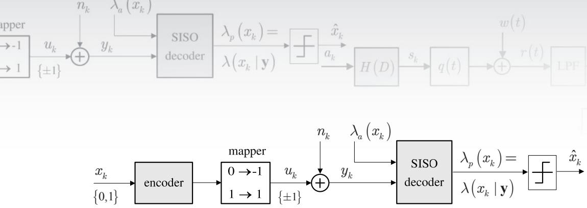  
รูปที่ 1.9 ระบบสื่อสารดิจิทัลที่ใช้วงจรถอดรหัสแบบ SIS0

พิจารณาระบบสื่อสารในรูปที่ 1.9 เมื่อลำดับข้อมูล $x _ { k } \in \{ 0 , 1 \}$ ถูกส่งไปยังวงจรเข้ารหัส (encoder) และวงจรเข้าคู (mapper) เพื่อให้ได้เป็นลำดับข้อมูล $u _ { k } \in \{ - 1 , 1 \}$ จากนั้นวงจรถอดรหัส แบบ รเร0 จะทำการถอดรหัสข้อมูลของสัญญาณ $y _ { k } = u _ { k } + n _ { k }$ โดยที่ $n _ { k }$ คือสัญญาณรบกวน AWGN โดยอาศัยความช่วยเหลือจากลำดับข้อมูล ${ \lambda } _ { a } \left( x _ { k } \right)$ เมื่อ ${ \lambda } _ { a } \left( x _ { k } \right)$ คือค่า LLR แบบอะพิรืออริ (a priori LLR) ของบิตข้อมูล $x _ { k }$ นั่นคือ

$$
\lambda _ { a } \left( x _ { k } \right) = \ln \left( \frac { p \left( x _ { k } = 1 \right) } { p \left( x _ { k } = 0 \right) } \right)\tag{1.21}
$$

ซึ่งหมายถึงข่าวสารที่เกี่ยวกับบิตข้อมูล $x _ { k }$ ก่อนที่วงจรภาครับจะได้รับลำดับข้อมูล y หรือข้อมูล $y _ { k }$ ทั้งหมด (นั่นคือเป็นอิสระจาก y) ในทำนองเดียวกันถ้าวงจรภาครับไม่มีข่าวสารอะพิรืออริ ก็จะ กำหนดให้ $\lambda _ { a } \left( x _ { k } \right) = 0$ สำหรับทุกค่า k ซึ่งหมายความว่าบิตข้อมูล $x _ { k }$ ทุกตัวมีความน่าจะเป็นที่จะ เกิดขึ้นเท่ากัน ซู

จากนั้นวงจรถอดรหัสแบบ SIร0 จะให้ข้อมูลเอาต์พุตเป็นค่า LLR แบบอะโพสเทอริออริ (a posteriori LLR) ของบิตข้อมูล $x _ { k }$ นั่นคือ

$$
\lambda _ { p } \left( x _ { k } \right) = \ln \left( { \frac { p \left( x _ { k } = 1 \mid \mathbf { y } \right) } { p \left( x _ { k } = 0 \mid \mathbf { y } \right) } } \right)\tag{1.22}
$$

โดยที่ค่าประมาณของบิตข้อมูล $x _ { k }$ ck สามารถหาได้จากการส่งค่า $\lambda _ { p } \left( x _ { k } \right)$ ผ่านเข้าไปยังวงจรตรวจหา ขีดเริ่มเปลี่ยน (threshold detector) ตามความสัมพันธ์ดังนี้

$$
\hat { x } _ { k } = \left\{ \begin{array} { l l } { 1 , } & { \mathrm { i f } ~ \lambda _ { p } \left( x _ { k } \right) \ge 0 } \\ { 0 , } & { \mathrm { i f } ~ \lambda _ { p } \left( x _ { k } \right) < 0 } \end{array} \right.\tag{1.23}
$$

หมายเหตุ สำหรับค่า LLR ของบิตข้อมูล x นั่นคือ $\lambda ( x )$ ในหนังสือเล่มนี้จะนิยามดังนี้

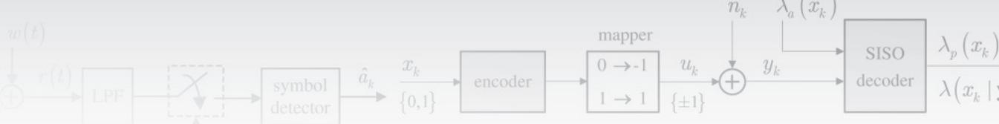

ถ้าค่า LLR มีตัวห้อย (subscript) เป็นพารามิเตอร์ a เช่น ${ \lambda } _ { a } \left( x \right)$ จะหมายถึงค่า LLR แบบ อะพิริออริ (a priori LLR) ของบิตข้อมูล x

ถ้าค่า LLR มีตัวห้อยเป็นพารามิเตอร์ $p$ เช่น $\lambda _ { p } \left( x \right)$ จะหมายถึงค่า LLR แบบอะโพสเทอริออริ (a posteriori LLR) ของบิตข้อมูล x

## 1.6 สรุปท้ายบท

ในบทนี้ได้อธิบายแบบจำลองช่องสัญญาณอ่านที่ใช้แทนระบบการบันทึกเชิงแม่เหล็ก (ทั้งแบบจำลอง ช่องสัญญาณเสมือนจริงในรูอที72ชชะแบบจำลองช่องสัญญาณอุดมคติในรูปที่ 1.6) เพื่อให้ผู้อ่าน 9 บบ สามารถนำแบบจำลองนี้ไปใช้ในการวิเคราะห์ระบบการประมวลสัญญาณของฮาร์ดดิสก์ไดรฟ์

เนื่องจากฮาร์ดดิสก์ไดรฟรุ่นใหม่ๆ ที่มีจำหน่ายในท้องตลาดจะใช้เทคนิคการถอดรหัสแบบ 2 วนซำ (iterative decoding) เพราะสามารถช่วยเพิ่มสมรรถนะของระบบได้ดียิ่งขึน ดังนันในบทนี จึงได้อธิบายแนวคิดและพื้นฐานของเทคนิคการถอดรหัสแบบวนซ้ำ รวมทั้งความหมายของ SIS0 ความน่าจะเป็นอะพิริออริ ความน่าจะเป็นอะโพสเทอริออริ ข่าวสารแบบซอฟต์ และอัตราส่วนควร จะเป็นแบบลอการิทึม (LLR) เป็นต้น เพื่อเตรียมความพร้อมของผู้อ่านก่อนที่จะศึกษาหลักการ ทำงานของวงจรตรวจหาและวงจรถอดรหัสแบบ รเร0 ซึ่งจะอธิบายต่อไปในบทที่ 2 – 4

## 1.7 แบบฝึกหัดท้ายบท

1.จงอธิบายหลักการทำงานของระบบการจัดเก็บข้อมูลดิจิทัลในฮาร์ดดิสก์ไดรฟ์ในรูปที่1.1

2. จงใช้โปรแกรม SCILAB วาดรูปต่อไปนี้ (http://home.npru.ac.th/piya/webscilab หรือ http://www.scilab.org)

2.1) สัญญาณพัลส์เปลี่ยนสถานะ ณ ค่า ND ต่างๆ ตามรูปที่ 1.3

2.2) ผลตอบสนองไดบิด ณ ค่า ND ต่างๆ ตามรูปที่ 1.4

3. จงแสดงว่าผลการแปลงฟูเรียร์ของผลตอบสนองไดบิต m(t) ในสมการ (1.6) ของระบบ การบันทึกแบบแนวนอนมีค่าเท่ากับ

$$
M \left( \Omega \right) = \exp \left\{ - \pi \left| \Omega \right| \mathrm { N D } \right\} \left( 1 - \exp \left\{ - j 2 \pi \Omega \right\} \right)
$$

0 และของระบบการบันทีกแบบแนวตั้งมิค่าเท่ากับ

