<details>
<summary>flowchart</summary>

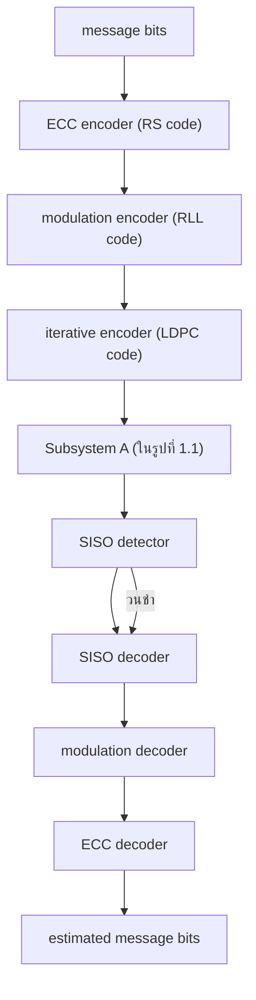
</details>

รูปที่ 1.7 แผนภาพบล็อกแสดงการทำงานของระบบการประมวลผลสัญญาณแบบวนซ้ำของฮาร์ดดิสก์ไดรฟ์

ตรวจหาแบบ SIร0 และวงจรถอดรหัสแบบ รIร0 โดยที่วงจรตรวจหาแบบ รIร0 ที่ใช้กับการถอด รหัสแบบวนซ้ำสามารถพัฒนาได้จากอัลกอริทึม BCJR [18] หรือ SOVA (soft-outpนt Viterbi algorithm) [19] (ศึกษารายละเอียดได้ในบทที่ 2 – 3) ในขณะที่วงจรถอดรหัสแบบ รIร0 ที่ใช้ ถอดรหัสข้อมูลที่ถูกเข้ารหัสด้วยรหัส LDPด จะพัฒนามาจากอัลกอริทึมการผ่านข่าวสาร (message passing algorithm) [17] (ศึกษารายละเอียดได้ในหัวข้อที่ 4.4.4)

การทำงานของเทคนิคการถอดรหัสแบบวนซำเริ่มจาก วงจรตรวจหาแบบ รเรอ ทำการ ตรวจหาข้อมูลทีได้รับ แล้วส่งผลลัพธ์ที่ได้(ซึ่งเป็นข่าวสารแบบซอฟต์) ไปยังวงจรถอดรหัสแบบ SISO จากนันวงจรถอดรหัสแบบ รเรอ ก็จะส่งผลลัพธ์ที่ได้จากการถอดรหัสข้อมูลกลับไปให้วงจร ตรวจหาแบบ SIร0 เพื่อใช้ในการตรวจหาข้อมูลใหม่อีกครั้งหนึ่ง กระบวนการนี้จะดำเนินการไป เรือยๆ จนกระทังครบตามจำนวนรอบ (itะrลtoก) ของการวนซำทีกำหนด วงจรถอดรหัสแบบ รIร0 จึงจะส่งข้อมูลเอาต์พุตทีได้ไปยังวงจรถอดรหัสมอดูเลชันและวงจรถอดรหัส RS เพื่อทำการถอดรหัส ข้อมูลต่อไป

หมายเหตุจากรูปที่ 1.7 จะพบว่ามีการใช้งานทั้งรหัส RS และรหัส LDPC อย่างไรก็ตามในทาง ปฏิบัติพบว่า [20] เมื่อมีการใช้งานรหัส LPDC ในการถอดรหัสแบบวนซ้ำแล้ว ก็อาจจะไม่จำเป็น ต้องใช้รหัส RS ก็ได้ ดังนั้นผู้ใช้สามารถเลือกใช้งานรหัส RS และรหัส LDPC ร่วมกัน หรือใช้รหัส LDPC เพียงอย่างเดียว ก็ยังคงให้สมรรถนะที่ใกล้เคียงกัน

# 1.5 พื้นฐานและคำศัพท์ที่น่าสนใจ

ในหัวข้อนี้จะอธิบายพื้นฐานและคำศัพท์ที่น่าสนใจที่เกี่ยวข้องกับการถอดรหัสแบบวนซ้ำ เพื่อให้ ผู้อ่านเข้าใจความหมายของคำเหล่านี้ ก่อนศึกษาเนื้อหาในบทที่ 2 – 4

# 1.5.1 การตัดสินใจแบบฮาร์ดและแบบซอฟต์

สู ะยู ณ วงจรภาครับของระบบสือสารดิจิทัล วงจรตรวจหาและวงจรถอดรหัสสามารถเลือกใช้งานได้ทัง การตัดสินใจแบบฮาร์ด (hard decision) และการตัดสินใจแบบซอฟต์ (soft decision) เมื่อ

การตัดสินใจแบบฮาร์ด คือการหาค่าประมาณของบิตข้อมูลหรือสัญลักษณ์ (รyทbo1) ที่ได้ จากวงจรตรวจหาหรือวงจรถอดรหัส โดยผลลัพธ์ที่ได้จะเรียกว่า "ข่าวสารแบบฮาร์ด (hard information)" เช่น ถ้าวงจรตรวจหาได้รับข้อมูลที่มีค่าเท่ากับ 0.9 ก็อาจจะตัดสินใจว่าบิตข้อมูล ที่ส่งมาจากวงจรภาคส่งคือบิด 1   
การตัดสินใจแบบซอฟต์ คือการหาค่าความน่าเชื่อถือ (reliลbปlity) ของบิตข้อมูลหรือสัญลักษณ์ ที่ได้จากวงจรตรวจหาหรือวงจรถอดรหัสโดยอาศัยข้อมูลที่วงจรภาครับมีทั้งหมด และผลลัพธ์ที ได้จะเรียกว่า '"ข่าวสารแบบซอฟต์ (soft information)" ตัวอย่างเช่น ถ้าวงจรถอดรหัสให้ผลลัพธ์ เป็นข่าวสารแบบซอฟต์ที่มีค่ามาก ก็แสดงว่าค่าประมาณของบิตข้อมูลหรือสัญลักษณ์ที่ได้จาก วงจรถอดรหัสนี้มีความน่าเชื่อถือหรือความเป็นไปได้ที่จะถูกต้องสูง

สำหรับระบบสื่อสารแบบไบนารี ความน่าเชื่อถือของบิตข้อมูลจะวัดจาก "อัตราส่วนควรจะ เป็นแบบลอการิทึม (LLR: 1og-likelihood ratio)" นั้นคือถ้ากำหนดให้ $x \in \{ 0 , 1 \}$ เป็นตัวแปร สุ่มไบนารี ดังนั้นค่า LLR ของ x นิยามโดย

$$
\lambda (x) = \ln \left(\frac {p (x = 1)}{p (x = 0)}\right) \tag {1.10}
$$

เมื่อ In(.) คือลอการิทึมธรรมชาติ (natural logarithm) และ $p ( x )$ คือฟังก์ชันความหนาแน่นความ น่าจะเป็น (pdf: probability density function) ของ x นอnจากนีค่าสัมบูรณ์ (absolute value) ของ X(x)คือข่าวสารแบบซอฟต์หรือค่าความน่าเชื่อถือของบิตข้อมูล x และเครืองหมายของ λ(x) ก็คือข่าวสารแบบฮาร์ดหรือค่าประมาณของบิตข้อมูล x นั้นคือ

$$
\hat {x} = \left\{ \begin{array}{l l} 1, & \text { if } \lambda (x) \geq 0 \\ 0, & \text { if } \lambda (x) <   0 \end{array} \right. \tag {1.11}
$$

# 1.5.2 อัตราส่วนควรจะเป็นแบบลอการิทึม

อัตราส่วนควรจะเป็นแบบลอการิทึม (LLR) ถือเป็นเมตริก (metric) หรือตัวชี้วัดข่าวสารทีใช้มาก ในอัลกอริทึมต่างๆ ที่ใช้ในกระบวนการถอดรหัสแบบวนซ้ำ เช่น อัลกอริทึม BCJR, SOVA, และ LDPC เป็นต้น ในหนังสือนี้จะใช้สัญลักษณ์ X(x) แทนค่า LLR ของบิตข้อมูล $x \in \{ 0 , 1 \}$ ซึ่ง ก็คือค่าลอการิทึมธรรมชาติของเศษส่วนระหว่างความน่าจะเป็นของบิต 1 และบิตด 0 ตามที่นิยามใน สมการ (1.10)


<details>
<summary>line</summary>

| p(a = +1) | Log-likelihood ratio (LLR) |
| --------- | -------------------------- |
| 0.0       | -6.0                       |
| 0.1       | -2.0                       |
| 0.2       | -1.0                       |
| 0.3       | -0.5                       |
| 0.4       | 0.0                        |
| 0.5       | 0.5                        |
| 0.6       | 1.0                        |
| 0.7       | 1.5                        |
| 0.8       | 2.0                        |
| 0.9       | 3.0                        |
| 1.0       | 7.0                        |
</details>

รูปที่ 1.8 ค่า LLR ของบิตข้อมูล a เมื่อเทียบกับความน่าจะเป็น p(a = +1)

สำหรับระบบสื่อสารที่ใช้ข้อมูลอินพุตไบนารีแบบเชิงขั้ว นั้นคือ สู $a \in \{ - 1 , 1 \}$ ค่า LLR จะนิยามโดย

$$
\lambda (a) = \ln \left(\frac {p (a = + 1)}{p (a = - 1)}\right) \tag {1.12}
$$

ซึ่งนิยมใช้มากในอัลกอริทึมการถอดรหัส (decoding algorithm) เพราะเครื่องหมายของค่า λ(a) นี้สามารถนำมาใช้เป็นค่าประมาณของบิตข้อมูล a (หรือข่าวสารแบบฮาร์ด) ได้ทันที่ ในทำนอง เดียวกันขนาดของ λ(a) ก็ใช้เป็นตัวบอกถึงความน่าเชื่อถือของบิตข้อมูล a (หรือข่าวสารแบบซอฟต์) รูปที่1.8 แสดงค่า LLR ของบิตข้อมูล a เมื่อเที่ยบกับความน่าจะเป็น $p ( a = + 1 )$ โดย λ(a) มีค่า เป็นบวกเมื่อ $p ( a = + 1 ) > 0 . 5$ นั่นคือบิตข้อมูล a มีความน่าเชื่อถือที่ จะเป็นบิต 1 มากกว่าบิต –1 และ λ(a) มีค่าเป็นลบเมื่อ $p ( a = + 1 ) < 0 . 5$ นั่นคือบิตข้อมูล a มีความน่าเชื่อถือที่จะเป็นบิต –1 มากกว่าบิด 1 นอกจากนี้ถ้า $p ( a = + 1 ) = 0 . 5$ ก็จะทำให้ $\lambda ( a ) = 0$ ซึ่งหมายความว่าบิตข้อมูล a มีโอกาสที่จะเป็นได้ทั้งบิต 1 และบิด -1 ด้วยความน่าจะเป็นเท่ากัน

เนื่องจาก $p ( a = + 1 ) = 1 - p ( a = - 1 )$ ดังนั้นสมการ (1.12) จัดรูปใหม่ได้เป็น

$$
e ^ {\lambda (a)} = \frac {p (a = + 1)}{1 - p (a = + 1)} \tag {1.13}
$$

และ

$$
p (a = + 1) = \frac {e ^ {\lambda (a)}}{1 + e ^ {\lambda (a)}} = \frac {1}{1 + e ^ {- \lambda (a)}} = \frac {e ^ {\lambda (a) / 2}}{e ^ {\lambda (a) / 2} + e ^ {- \lambda (a) / 2}} \tag {1.14}
$$

$$
p (a = - 1) = \frac {e ^ {- \lambda (a)}}{1 + e ^ {- \lambda (a)}} = \frac {1}{1 + e ^ {+ \lambda (a)}} = \frac {e ^ {- \lambda (a) / 2}}{e ^ {- \lambda (a) / 2} + e ^ {\lambda (a) / 2}} \tag {1.15}
$$

# 1.5.31L#X1E

จากสมการ (1.14) และ (1.15) สรุปได้ว่าสำหรับ $C \in \{ - 1 , + 1 \}$ จะได้ว่า

$$
p (a = C) = \frac {e ^ {C \lambda (a) / 2}}{e ^ {\lambda (a) / 2} + e ^ {- \lambda (a) / 2}} \tag {1.16}
$$

# 1.5.3 ข้อมูลเอาต์พุตแบบซอฟต์ของช่องสัญญาณ

พิจารณาระบบสื่อสารแบบไบนารี เมื่อบิตข้อมูล $x \in \{ 0 , 1 \}$ ถูกส่งไปยังวงจรเข้าคู่ (mapper) เพื่อ แปลงให้เป็นบิตข้อมูล $u \in \{ - 1 , 1 \}$ แล้วส่งผ่านช่องสัญญาณที่ไม่มีหน่วยความจำ ซึ่งทำให้สัญญาณ ที่วงจรภาครับได้รับมีค่าเท่ากับ $y = u + n$ เมื่อ ท คือสัญญาณรบกวนเกาส์สีขาวแบบบวก (AWGN: additive พhite Gauรsiaท noise) ที่มีค่าเฉลี่ยเท่ากับศูนย์และความแปรปรวนเท่ากับ 2 $\sigma ^ { 2 }$

นิยามฟังก์ชันความหนาแน่นความน่าจะเป็นแบบมีเงื่อนไข (conditioกal probability density function) $p { \big ( } y | x { \big ) }$ คือฟังก์ชันความหนาแน่นความน่าจะเป็นของตัวแปรสุ่ม ๆ เมื่อกำหนด ค่า x มาให้ ในทางกลับกันถ้ากำหนดค่า y มาให้ ก็จะได้ว่า $p ( y \mid x )$ ที่เป็นฟังก์ชันของตัวแปร x จะถูกเรียกว่า "ฟังก์ชันควรจะเป็น (likelihood function)" [4]

ในทางปฏิบัติก่อนที่วงจรภาครับจะได้รับข้อมูล y ความน่าจะเป็นอะพิรืออริ (a priori probability) ของ x จะมีค่าเท่ากับ $p ( x = 1 )$ และ $p \big ( x = 0 \big )$ อย่างไรก็ตามหลังจากที่วงจรภาครับ ได้รับข้อมูล y ความน่าจะเป็น $p ( x = 1 | y )$ และ $p ( x = 0 | y )$ จะเปลี่ยนเป็นความน่าจะเป็นอะโพส เทอริออริ (APP: a posteriori probability) และจากกฎของเบส์ (Bayes' rule) ทำให้ได้ว่า

$$
\begin{array}{l} p (x = i \mid y) = p (x = i; y) / p (y) \\ = p (y \mid x = i) p (x = i) / p (y) \tag {1.17} \\ \end{array}
$$

เมื่อ i  {0, 1} และ $p \big ( a ; b \big )$ คือฟังก์ชันความหนาแน่นความน่าจะเป็นร่วม (oit pdf) ระหว่าง ตัวแปรสุ่ม a และ b ดังนั้นค่า LLR ของบิตข้อมูล x เมื่อกำหนดค่า y มาให้ จะนิยามโดย

$$
\lambda (x \mid y) = \ln \left(\frac {p (x = 1 \mid y)}{p (x = 0 \mid y)}\right) \tag {1.18}
$$

จากกฎของเบส์จะได้ว่า

$$
\begin{array}{l} \ln \left(\frac {p (x = 1 \mid y)}{p (x = 0 \mid y)}\right) = \ln \left(\frac {p (y \mid x = 1)}{p (y \mid x = 0)}\right) + \ln \left(\frac {p (x = 1)}{p (x = 0)}\right) \\ = L _ {c} y + \lambda (x) \tag {1.19} \\ \end{array}
$$

เมื่อ $L _ { c }$ คือข้อมูลเอาต์พุตแบบซอฟต์ของช่องสัญญาณซึ่งถือเป็นข่าวสารแบบซอฟตด์ที่สอดคล้อง กับบิตข้อมูล x ที่ได้มาจากข้อมูล y และ $\lambda ( x )$ เรียกว่า "ข่าวสารอะพิริออริ (a priori information)" คือข่าวสารที่เกี่ยวกับบิตข้อมูล x ก่อนที่วงจรภาครับได้รับข้อมูล ญโดยในกรณีที่วงจรภาครับไม่มี ข่าวสารอะพิรืออริ ก็จะกำหนดให้ $\lambda ( x ) = 0$

โดยทั่วไปค่า $L _ { c }$ ในสมการ (1.19) จะเรียกว่าความน่าเชื่อถือของช่องสัญญาณ (channel reliability) ซึ่งขึ้นกับลักษณะของช่องสัญญาณ ตัวอย่างเช่น ในกรณีที่ $n _ { k }$ คือสัญญาณรบกวน AWGN ก็จะได้ว่า

$$
\begin{array}{l} \ln \left(\frac {p (y \mid x = 1)}{p (y \mid x = 0)}\right) \equiv \ln \left(\frac {p (y \mid u = + 1)}{p (y \mid u = - 1)}\right) \\ = \ln \left(\frac {\exp \left(- \frac {1}{2 \sigma^ {2}} (y - 1) ^ {2}\right)}{\exp \left(- \frac {1}{2 \sigma^ {2}} (y + 1) ^ {2}\right)}\right) = \frac {2}{\sigma^ {2}} y \tag {1.20} \\ \end{array}
$$

นั่นคือ $L _ { c } = 2 / \sigma ^ { 2 }$

# 1.5.4 วงจรถอดรหัสแบบ SIS0

วงจรถอดรหัสแบบ SIร0 (soft-inpนt soft-output) คือวงจรถอดรหัสข้อมูลทีทำงานกับข่าวสาร แบบซอฟต์ โดยจะรับข้อมูลอินพุตที่เป็นข่าวสารแบบซอฟต์เข้ามาประมวลผล และให้ข้อมูลเอาต์พุต เป็นข่าวสารแบบซอฟต์


<details>
<summary>flowchart</summary>

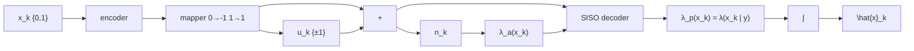
</details>

รูปที่ 1.9 ระบบสื่อสารดิจิทัลที่ใช้วงจรถอดรหัสแบบ SIร0

พิจารณาระบบสื่อสารในรูปที่ 1.9 เมื่อลำดับข้อมูล $x _ { k } \in \{ 0 , 1 \}$ ถูกส่งไปยังวงจรเข้ารหัส (encoder) และวงจรเข้าคู่ (mapper) เพื่อให้ได้เป็นลำดับข้อมูล $u _ { k } \in \{ - 1 , 1 \}$ จากนั้นวงจรถอดรหัส แบบ รเร0 จะทำการถอดรหัสข้อมูลของสัญญาณ $y _ { k } = u _ { k } + n _ { k }$ โดยที $n _ { k }$ คือสัญญาณรบกวน AWGN โดยอาศัยความช่วยเหลือจากลำดับข้อมูล ${ \lambda } _ { a } \left( x _ { k } \right)$ เมื่อ ${ \lambda } _ { a } \left( x _ { k } \right)$ คือค่า LLR แบบอะพิริออริ (a priori LLR) ของบิตข้อมูล $x _ { k }$ นันคือ

$$
\lambda_ {a} \left(x _ {k}\right) = \ln \left(\frac {p \left(x _ {k} = 1\right)}{p \left(x _ {k} = 0\right)}\right) \tag {1.21}
$$

ซึ่งหมายถึงข่าวสารที่เกี่ยวกับบิตข้อมูล $x _ { k }$ ก่อนที่วงจรภาครับจะได้รับลำดับข้อมูล y หรือข้อมูล $y _ { k }$ ทั้งหมด (นั่นคือเป็นอิสระจาก y) ในทำนองเดียวกันถ้าวงจรภาครับไม่มีข่าวสารอะพิรืออริ ก็จะ กำหนดให้ $\lambda _ { a } \left( x _ { k } \right) = 0$ สำหรับทุกค่า k ซึ่งหมายความว่าบิตข้อมูล $x _ { k }$ ทุกตัวมีความน่าจะเป็นที่จะ เกิดขึ้นเท่ากัน

จากนั้นวงจรถอดรหัสแบบ SIS0 จะให้ข้อมูลเอาต์พุตเป็นค่า LLR แบบอะโพสเทอริออริ (a posteriori LLR) ของบิตข้อมูล $x _ { k }$ นั่นคือ

$$
\lambda_ {p} \left(x _ {k}\right) = \ln \left(\frac {p \left(x _ {k} = 1 \mid \mathbf {y}\right)}{p \left(x _ {k} = 0 \mid \mathbf {y}\right)}\right) \tag {1.22}
$$

โดยที่ค่าประมาณของบิตข้อมูล $x _ { k }$ สามารถหาได้จากการส่งค่า $\lambda _ { p } \left( x _ { k } \right)$ ผ่านเข้าไปยังวงจรตรวจหา ขีดเริ่มเปลี่ยน (threshold detector) ตามความสัมพันธ์ดังนี้ ธ์ดังที้

$$
\hat {x} _ {k} = \left\{ \begin{array}{l l} 1, & \text { if } \lambda_ {p} (x _ {k}) \geq 0 \\ 0, & \text { if } \lambda_ {p} (x _ {k}) <   0 \end{array} \right. \tag {1.23}
$$

หมายเหตุ สำหรับค่า LLR ของบิตข้อมูล x นั้นคือ $\lambda ( x )$ ในหนังสือเล่มนี้จะนิยามดังนี้

ถ้าค่า LLR มีตัวห้อย (subscript) เป็นพารามิเตอร์ a เช่น ${ \lambda } _ { a } \left( x \right)$ จะหมายถึงค่า LLR แบบ อะพิริออริ (a priori LLR) ของบิตข้อมูล x   
ถ้าค่า LLR มีตัวห้อยเป็นพารามิเตอร์ $p$ เช่น $\lambda _ { p } \left( x \right)$ จะหมายถึงค่า LLR แบบอะโพสเทอริออริ (a posteriori LLR) ของบิตข้อมูล x

# 1.6 สรุปท้ายบท

ในบทนี้ได้อธิบายแบบจำลองช่องสัญญาณอ่านที่ใช้แทนระบบการบันทึกเชิงแม่เหล็ก (ทั้งแบบจำลอง ช่องสัญญาณเสมือนจริงในรูอที72ชะแบบจำลองช่องสัญญาณอุดมคติในรูปที่ 1.6) เพื่อให้ผู้อ่าน 9 บบ สามารถนำแบบจำลองนี้ไปใช้ในการวิเคราะห์ระบบการประมวลสัญญาณของฮาร์ดดิสก์ไดรฟ์

เนื่องจากฮาร์ดดิสก์ไดรฟรุ่นใหม่ๆ ที่มีจำหน่ายในท้องตลาดจะใช้เทคนิคการถอดรหัสแบบ - C วนซำ (iterative decoding) เพราะสามารถช่วยเพิ่มสมรรถนะของระบบได้ดียิ่งขึ้น ดังนันในบทนี จึงได้อธิบายแนวคิดและพื้นฐานของเทคนิคการถอดรหัสแบบวนซ้ำ รวมทั้งความหมายของ SIS0 ความน่าจะเป็นอะพิริออริ ความน่าจะเป็นอะโพสเทอริออริ ข่าวสารแบบซอฟต์ และอัตราส่วนควร จะเป็นแบบลอการิทึม (LLR) เป็นต้น เพื่อเตรียมความพร้อมของผู้อ่านก่อนที่จะศึกษาหลักการ ทำงานของวงจรตรวจหาและวงจรถอดรหัสแบบ รเร0 ซึ่งจะอธิบายต่อไปในบทที 2 – 4

# 1.7 แบบฝึกหัดท้ายบท

1. จงอธิบายหลักการทำงานของระบบการจัดเก็บข้อมูลดิจิทัลในฮาร์ดดิสก์ไดรฟ์ในรูปที่ 1.1   
2.จงใช้โปรแกรม SCILAB วาดรูปต่อไปนี้ (http://home.npru.ac.th/piya/webscilab หรือ http://www.scilab.org)

2.1) สัญญาณพัลส์เปลี่ยนสถานะ ณ ค่า ND ต่างๆ ตามรูปที่ 1.3

2.2) ผลตอบสนองไดบิด ณ ค่า ND ต่างๆ ตามรูปที่ 1.4

3. จงแสดงว่าผลการแปลงฟูเรียร์ของผลตอบสนองไดบิต m(t) ในสมการ (1.6) ของระบบ การบันทึกแบบแนวนอนมีค่าเท่ากับ

$$
M (\Omega) = \exp \left\{- \pi | \Omega | \mathrm{ND} \right\} \left(1 - \exp \left\{- j 2 \pi \Omega \right\}\right)
$$

0 และของระบบการบันทั่กแบบแนวตั้งมัค่าเท่ากับ

$$
M (\Omega) = \frac {T}{j \pi \Omega} \exp \left\{- \frac {\pi^ {2} \Omega^ {2} \mathrm{ND} ^ {2}}{\ln (1 6)} \right\} (1 - \exp \{- j 2 \pi \Omega \})
$$

เมื่อ exp{.} คือฟังก์ชันเลขชี้กำลัง, $\Omega = f T$ คือความถี่แบบนอร์มอลไลซ์ (normalized frequency), f คือความถี่มีหน่วยเป็นเฮิรตซ์, IxI คือค่าสัมบูรณ์ของ x, และ $j = \sqrt { - 1 }$

4.จากผลการแปลงฟูเรียร์ของผลตอบสนองไดบิตในข้อ 3 จงวาดรูปผลตอบสนองเชิงความถี่ของ ช่องสัญญาณ ณ ค่า ND ต่างๆ ในรูปที่ 1.5 โดยใช้โปรแกรม รCILAB   
5. จงอธิบายความแตกต่างระหว่างแบบจำลองช่องสัญญาณเสมือนจริงในรูปที่ 1.2 และแบบจำลอง ช่องสัญญาณอุดมคติในรูปที่ 1.6   
6. จงอธิบายหลักการทำงานของระบบการประมวลผลสัญญาณแบบวนซ้ำของฮาร์ดดิสก์ไดรฟ์ใน รูปที่ 1.7   
7.จงอธิบายความหมายของข่าวสารแบบซอฟต์ (soft inforทation)   
8. จงอธิบายความหมายของอัตราส่วนควรจะเป็นแบบลอการิทึม (LLR: 1og-likelih0อd ratio)   
9. จงอธิบายความหมายของค่า LLR แบบอะพิริออริ และค่า LLR แบบอะโพสเทอริออริ   
10. จงอธิบายความหมายของวงจรตรวจหาแบบ รเร0 และวงจรถอดรหัสแบบ รIรO

# บทที่ 2 รหัสเทอร์โบ

แต่ละงานประยุกต์ โดยทั่วไปงานประยุกต์ที่ต้องการความสามารถในการแก้ไขข้อผิดพลาดสูง ก็จะ ต้องใช้วงจรเข้ารหัสและถอดรหัสที่มีความซับซ้อนสูงมากเช่นกัน วิธีการแก้ปัญหาอย่างง่ายก็คือ การใช้การเข้ารหัสแบบต่อกัน (concatenated coding) ซึ่งเป็นการเข้ารหัสข้อมูลโดยใช้วงจรเข้ารหัส มากกว่าหนึ่งวงจรมาต่อกันแบบอนุกรมหรือแบบขนาน โดยอาศัยความช่วยเหลือของวงจรอินเทอร์ ลีฟเวอร์ (interleaver) จากนั้นข้อมูลที่ถูกเข้ารหัสก็จะถูกทำการถอดรหัสด้วยวงจรถอดรหัสแต่ละ ตัว ถึงแม้ว่าผลลัพธ์ที่ได้จากวิธีการนี้ถือว่าเป็นแบบเหมาะที่สุดแบบรอง (ธub-optนiทลl) แต่วิธีการ 2 นี้จะประนีประนอมระหว่างความสามารถในการแก้ไขข้อผิดพลาดและความซับซ้อนของกระบวนการ เข้ารหัสและถอดรหัส

เทคนิคการถอดรหัสแบบวนซ้ำ (iterative decoding) [2, 3] ถือเป็นเทคนิคที่สามารถ ช่วยลดอัตราข้อผิดพลาดของบิต (BER: bit-error rate) ของระบบให้น้อยลงกว่าเดิมได้ การถอดรหัส ข้อมูลของรหัสเทอร์โบ (turb0 code) [3] ถือเป็นตัวอย่างของการถอดรหัสแบบวนซ้ำ ซึ่งในปัจจุบัน ได้มีการนำมาใช้ในหลายงานประยุกต์ ได้แก่ ระบบโทรศัพท์เคลื่อนที่ และระบบสื่อสารผ่านดาวเทียม เป็นต้น นอกจากนี้หลักการเทอร์โบ (turbอ principle) ที่ใช้ในการถอดรหัสข้อมูลแบบเทอร์โบยัง สามารถนำมาประยุกต์ใช้กับกระบวนการอีควอไลเซชัน (eqนลlizลtioท)ได้ โดยจะเรียกเทคนิคนี้ว่า "อีควอไลเซชันแบบเทอร์โบ (turbo eqนลlization)" [21] ซึ่งถือเป็นกระบวนการถอดรหัสแบบ วนซ้ำที่ได้นำมาใช้จริงในฮาร์ดดิสก์ไดรฟรุ่นใหม่ๆ แล้ว [6] ซึ่งมีสมรรถนะดีกว่าฮาร์ดดิสก์ไดรฟ์ ในอดีตที่ไม่ได้ใช้เทคนิคการถอดรหัสแบบวนซ้ำ

บทนี้จะเริ่มต้นอธิบายรหัสคอนโวลูชันและอัลกอริทึม BCJR [18] ซึ่งถือเป็นส่วนสำคัญ ของรหัสเทอร์โบ เพื่อให้ผู้อ่านเข้าใจเทคนิคการเข้ารหัสและการถอดรหัสแบบวนซ้ำที่ใช้ในระบบ การประมวลผลสัญญาณของฮาร์ดดิสก์ไดรฬ์

# 2.1 รหัสคอนโวลูชัน

รหัสแก้ไขข้อผิดพลาดหรืออาจเรียกว่า รหัสแก้ไขข้อผิดพลาดแบบข้างหน้า (FEC: forพลrd errorcorrection code) นิยมนำมาใช้ในจัดการกับสัญญาณรบกวนและข้อผิดพลาดที่เกิดจากช่องสัญญาณ โดยทั่วไปรหัสแก้ไขข้อผิดพลาดสามารถแบ่งออกได้เป็นสองแบบคือ รหัสบล็อก (block code) และ รหัสคอนโวลูชัน (convolutional code) [2] นอกจากนี้ยังมีรหัส ECC แบบใหม่ที่อาศัยเทคนิค การถอดรหัสแบบวนซำ เช่น รหัสเทอร์โบ [3] และรหัส LDPC [17] เป็นต้น ซึงมีสมรรถนะเข้า ใกล้ความจุช่องสัญญาณของแชนนอน4 (Shannon's channel capacity) มากกว่ารหัสคอนโวลูชัน ในหัวข้อนี้จะสรุปหลักการทำงานของรหัสคอนโวลูชันเพราะเป็นชิ้นส่วนที่สำคัญของรหัสเทอร์โบ ซึ่งจะกล่าวต่อไปในหัวข้อที่ 2.3

# 2.1.1 การเข้ารหัส

วงจรเข้ารหัสคอนโวลูชัน (convolutional encoder) จะใช้เรจิสเตอร์แบบเลื่อน (shift register) และ วงจรบวกแบบมอดุโลสอง (moฝนlo-2 adder) ในการเข้ารหัสข้อมูล โดยจะทำการเข้ารหัสลำดับ ข้อมูลอินพุต (input data sequence) หนึ่งชุด และให้ลำดับข้อมูลเอาต์พุตจำนวนมากกว่าหรือเท่ากับ หนึ่งชุด โดยที่ถ้าวงจรเข้ารหัสคอนโวลูชันเข้ารหัสข้อมูลอินพุต 1 บิต แล้วทำให้เกิดข้อมูลเอาต์พุต จำนวน n บิต แสดงว่าวงจรเข้ารหัสคอนโวลูชันนี้มีอัตรารหัส (code rate) เท่ากับ $R = 1 / n$ รูปที่ 2.1 แสดงตัวอย่างวงจรเข้ารหัสคอนโวลูชันที่มีอัตรารหัส $R = 1 / 2$ เมื่อ D คือตัวดำเนินการหน่วง เวลาหนึ่งหน่วย (unit delay operator) ซึ่งใช้แทนเรจิสเตอร์แบบเลื่อน ในทางปฏิบัติวงจรเข้ารหัส คอนโวลูชันจะเขียนแทนด้วยพหุนามตัวกำเนิด (generator polynomial) ซึ่งมีรูปสมการคือ [1]

$$
G (D) = \sum_ {i = 0} ^ {\mu} g _ {i} D ^ {i} \tag {2.1}
$$

เมื่อ $\mu$ คือจำนวนหน่วยความจำของวงจรเข้ารหัสคอนโวลูชัน (หรือจำนวนเรจิสเตอร์แบบเลื่อน) และ $g _ { i } = 1$ ถ้าบิตข้อมูลอินพุตที่ถูกหน่วงเวลาไป  หน่วย มีผลต่อการเกิดของบิตข้อมูลเอาต์พุต ณ เวลาปัจจุบัน ตัวอย่างเช่น วงจรเข้ารหัสคอนโวลูชันในรูปที่ 2.1 (ก) มีพหุนามตัวกำเนิดคือ

$$
G (D) = \left[ G _ {1} (D), G _ {2} (D) \right] = \left[ 1 \oplus D, 1 \oplus D ^ {2} \right] \tag {2.2}
$$


<details>
<summary>flowchart</summary>

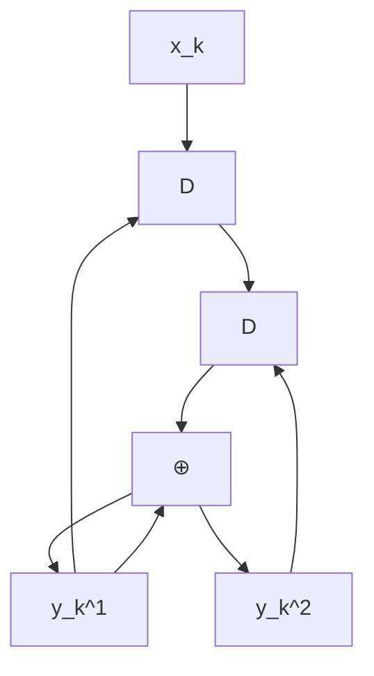
</details>

(ก)


<details>
<summary>flowchart</summary>

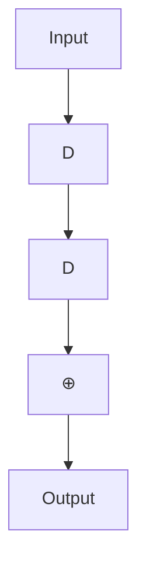
</details>

(ข)


<details>
<summary>flowchart</summary>

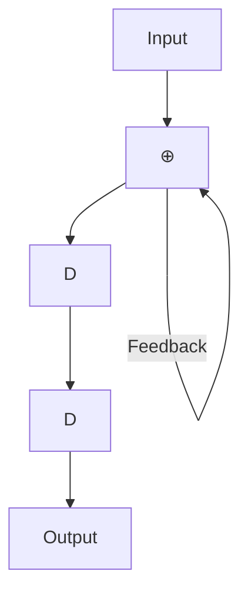
</details>

(ค)

รูปที่ 2.1 (ก) วงจรเข้ารหัสคอนโวลูชัน, (ข) วงจรเข้ารหัสคอนโวลูชันแบบมีระบบ, และ (ค) วงจรเข้ารหัส คอนโวลูชันแบบมีระบบเวียนเกิด

เมื่อ  คือตัวดำเนินการบวกแบบมอดุโลสอง, $G _ { 1 } ( D )$ คือพหุนามตัวกำเนิดของข้อมูลเอาต์พุต $y _ { k } ^ { 1 }$ - $G _ { 2 } ( D )$ คือพหุนามตัวกำเนิดของข้อมูลเอาต์พุต $y _ { k } ^ { 2 }$ , และมีหน่วยความจำ $\mu = 2$ หน่วย

นอกจากนี้วงจรเข้ารหัสคอนโวลูชันแบบมีระบบ (systematic convolutional encoder) คือวงจรเข้ารหัสคอนโวลูชันที่ทำให้ข้อมูลเอาต์พุตหนึ่งชุดมีค่าเท่ากับข้อมูลอินพุต ตามที่แสดงใน รูปที่ 2.1 (ข) ซึ่งมีพหุนามตัวกำเนิดคือ[1, $1 \oplus D ^ { 2 } \Big ]$ สำหรับวงจรเข้ารหัสคอนโวลูชันแบบมีระบบ ที่มีการป้อนกลับด้วยจะเรียกว่าวงจรเข้ารหัสคอนโวลูชันแบบมีระบบเวียนเกิด (recursive systematic convolutional encoder) ตามรูปที่ 2.1 (ค) ซึ่งมีพหุนามตัวกำเนิดคือ $\left[ 1 , 1 / \left( 1 \oplus D ^ { 2 } \right) \right]$ โดยทั่วไป วงจรเข้ารหัสคอนโวลูชันแบบมีระบบเวียนเกิดจะเป็นที่นิยมใช้งานมากกว่าวงจรเข้ารหัสคอนโวลูชัน แบบอื่นๆ [2]

โดยทั่วไปการวิเคราะห์รหัสคอนโวลูชันจะอาศัยเครื่องสถานะจำกัด (FรM: finite state machine) ซึ่งเป็นแบบจำลองที่แสดงให้เห็นถึงการเปลี่ยนแปลงของข้อมูลอินพุต, สถานะเริ่มต้น (start state), สถานะต่อไป (next state), และข้อมูลเอาต์พุต ของระบบ (ศึกษารายละเอียดได้ใน หัวข้อที่ 4.3.1 ของ [10]) รูปที่ 2.2 (ซ้าย) แสดงเครื่องสถานะจำกัดของวงจรเข้ารหัสคอนโวลูชัน ในรูปที่ 2.1 (n) ซึ่งมีทั้งหมด $2 ^ { \mu } = 4$ สถานะคือ 00, 01, 10 และ 11 โดยที่เส้นลูกศรจะแสดง เส้นทางการเปลี่ยนสถานะ และค่า $x / y ^ { 1 } y ^ { 2 }$ ที่อยูติดกับเส้นลูกศรจะใช้แทนค่าข้อมูลอินพุตบิต x และข้อมูลเอาต์พุตบิต $y ^ { 1 }$ และ $y ^ { 2 }$ นอกจากนี้แผนภาพเทรลลิส (trellis diagram) ซึ่งใช้แสดงการ เปลี่ยนสถานะในแต่ละช่วงเวลาก็สามารถใช้อธิบายการทำงานของรหัสคอนโวลูชันได้เช่นกัน รูปที 2.2 (ขวา) แสดงแผนภาพเทรลลิสของวงจรเข้ารหัสคอนโวลูชันในรูปที่ 2.1 (ก) นั้นคือแผนภาพ เทรลลิสในระยะที่ k จะแสดงการเปลี่ยนสถานะที่เป็นไปได้ทั้งหมดของวงจรเข้ารหัสจากสถานะหนึ่ง ณ เวลา k ไปยังอีกสถานะหนึ่ง ณ เวลา k + 1 โดยค่าที่อยู่ติดกับเส้นลูกศรก็คือค่า $x / y ^ { 1 } y ^ { 2 }$ ที่อยู่ ในเครื่องสถานะจำกัดนั้นเอง เนื่องจากเส้นทาง (path) ที่เดินไปตามแผนภาพเทรลลิสจะหมายถึง ชุดของเส้นสาขา (branch) ที่ประกอบด้วยหนึ่งเส้นสาขาต่อหนึ่งระยะ ดังนั้นคำรหัส (codeword) ทุกคำ (หรือข้อมูลเอาต์พุตของวงจรเข้ารหัสคอนโวลูชัน) จะต้องสอดคล้องกับเส้นทางที่เป็นได้เพียง หนึ่งเดียว (unique path) ในแผนภาพเทรลลิส (ดูรูปที่ 2.5)


<details>
<summary>flowchart</summary>

```mermaid
graph TD
    A["Input"] --> B["π⁻¹"]
    B --> C["+"]
    C --> D["OUTER DECODER a priori"]
    D --> E["λ(xₖ)"]
    E --> F["001"]
    F --> G["1/1"]
    G --> H["101"]
    H --> I["1/0"]
    I --> J["110"]
    J --> K["0"]
    K --> L["0"]
    L --> M["0"]
    M --> N["2"]
    N --> O["2"]
    O --> P["0"]
    P --> Q["0"]
    Q --> R["10"]
    R --> S["1"]
    S --> T["1"]
    T --> U["1"]
    U --> V["1"]
    V --> W["1"]
    W --> X["1"]
    X --> Y["1"]
    Y --> Z["1"]
    Z --> AA["1"]
    AA --> AB["1"]
    AB --> AC["1"]
    AC --> AD["1"]
    AD --> AE["1"]
    AE --> AF["1"]
    AF --> AG["1"]
    AG --> AH["1"]
    AH --> AI["1"]
    AI --> AJ["1"]
    AJ --> AK["1"]
    AK --> AL["1"]
    AL --> AM["1"]
    AM --> AN["1"]
    AN --> AO["1"]
    AO --> AP["1"]
    AP --> AQ["1"]
    AQ --> AR["1"]
    AR --> AS["1"]
    AS --> AT["1"]
    AT --> AU["1"]
    AU --> AV["1"]
    AV --> AW["1"]
    AW --> AX["1"]
    AX --> AY["1"]
    AY --> AZ["1"]
    AZ --> BA["1"]
    BA --> BB["1"]
    BB --> BC["1"]
    BC --> BD["1"]
    BD --> BE["1"]
    BE --> BF["1"]
    BF --> BG["1"]
    BG --> BH["1"]
    BH --> BI["1"]
    BI --> BJ["1"]
    BJ --> BK["1"]
    BK --> BL["1"]
    BL --> BM["1"]
    BM --> BN["1"]
    BN --> BO["1"]
    BO --> BP["1"]
    BP --> BQ["1"]
    BQ --> BR["1"]
    BR --> BS["1"]
    BS --> BT["1"]
    BT --> BU["1"]
    BU --> BV["1"]
    BV --> BW["1"]
    BW --> BX["1"]
    BX --> BY["1"]
    BY --> BZ["1"]
    BZ --> CA["1"]
    CA --> CB["1"]
    CB --> CC["1"]
    CC --> CD["1"]
    CD --> CE["1"]
    CE --> CF["1"]
    CF --> CG["1"]
    CG --> CH["1"]
    CH --> CI["1"]
    CI --> CJ["1"]
    CJ --> CK["1"]
    CK --> CL["1"]
    CL --> CM["1"]
    CM --> CN["1"]
    CN --> CO["1"]
    CO --> CP["1"]
    CP --> CQ["1"]
    CQ --> CR["1"]
    CR --> CS["1"]
    CS --> CT["1"]
    CT --> CU["1"]
    CU --> CV["1"]
    CV --> CW["1"]
    CW --> CX["1"]
    CX --> CY["1"]
    CY --> CZ["1"]
    CZ --> DA["1"]
    DA --> DB["1"]
    DB --> DC["1"]
    DC --> DD["1"]
    DD --> DE["1"]
    DE --> DF["1"]
    DF --> DG["1"]
    DG --> DH["1"]
    DH --> DI["1"]
    DI --> DJ["1"]
    DJ --> DK["1"]
    DK --> DL["1"]
    DL --> DJ["1"]
    DJ --> DK["1"]
    DK --> DL["1"]
    DL --> DJ["1"]
    DJ --> DK["1"]
    DK --> DL["1"]
    DL --> DJ["1"]
    DJ --> DK["1"]
    DK --> DL["1"]
    DL --> DJ["1"]
    DJ --> DK["1"]
    DK --> DL["1"]
    DL --> DJ["1"]
    DJ --> DK["1"]
    DK --> LL["1"]
    LL --> DR["1"]
    DR --> DL["1"]
    DL --> DR["1"]
    DR --> DL["1"]
    DL --> DR["1"]
    DR --> DL["1"]
    DL --> DR["1"]
    DR --> DL["1"]
    DL --> DR["1"]
    DR --> DL["1"]
    DL --> DR["1"]
    DR --> DR["1"]
    DR --> DR["1"]
    DR --> DR["1"]
    DR --> DR["1"]
    DR --> DR["1"]
    DR --> DR["1"]
    DR --> DR["1"]
    DR --> DR["1"]
    DR --> DR["1"]
    DR --> DR["1"]
    DR --> DR["1"]
    DR --> DR["1"]
    DR --> DR["1"]
    DR --> DR["1"]
    DR --> Dr["1"]
    DR --> DR["1"]
    DR --> DR["1"]
    DR --> DR["1"]
    DR --> DR["1"]
    DR --> DR["1"]
    DR --> DR["1"]
    DR --> DR["1"]
    DR --> DR["1"]
    DR --> DR["1"]
    DR --> DR["1"]
    DR --> DR["1"]
    DR --> DR["1"]
    DR --> DR["1"]
    DR --> DR["2"]
    DR --> DR["2"]
    DR --> DR["2"]
    DR --> DR["2"]
    DR --> DR["2"]
    DR --> DR["2"]
    DR --> DR["2"]
    DR --> DR["2"]
    DR --> DR["2"]
    DR --> DR["2"]
    DR --> DR["2"]
    DR --> DR["2"]
    DR --> DR["2"]
    DR --> DR["2"]
    DR --> DR["2"]
```
</details>


<details>
<summary>flowchart</summary>

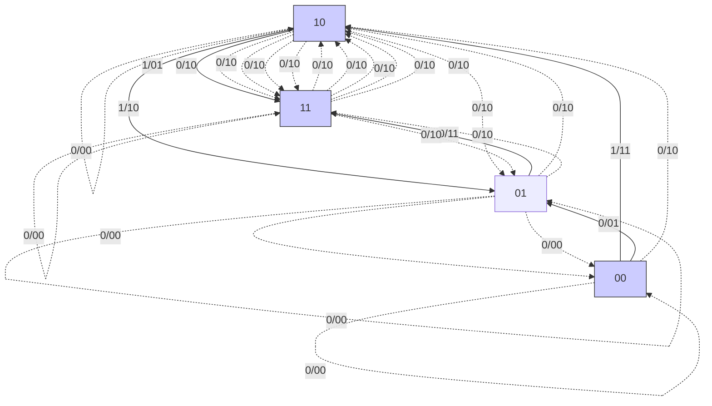
</details>


<details>
<summary>flowchart</summary>

```mermaid
graph TD
    A["00"] -->|0/00| B["10"]
    A -->|1/11| C["01"]
    A -->|0/01| D["11"]
    B -->|0/10| E["10"]
    B -->|1/10| F["01"]
    C -->|0/11| G["11"]
    D -->|1/01| H["10"]
    D -->|1/00| I["11"]
    style A fill:#000,stroke:#000
    style B fill:#000,stroke:#000
    style C fill:#000,stroke:#000
    style D fill:#000,stroke:#000
    style E fill:#000,stroke:#000
    style F fill:#000,stroke:#000
    style G fill:#000,stroke:#000
    style H fill:#000,stroke:#000
    style I fill:#000,stroke:#000
```
</details>

รูปที่ 2.2 แผนภาพเครื่องสถานะจำกัดและแผนภาพเทรลลิสของรูปที่ 2.1 (ก)

ตัวอย่างที่ 2.1 จงแสดงขั้นตอนการเข้ารหัสของวงจร เข้ารหัสคอนโวลูชันในรูปที่ 2.1 (ก) เมื่อบิตข้อมูล อินพุตคือ {x0, x1, x2, x3} = {1 0 1 1}

วิธีทำ รูปที่ 2.1 (ก) แสดงใหม่ได้ตามรูปด้านขวามือ ซึ่งเมื่อนำบิตข้อมูล $\{ x _ { k } \}$ มาเข้ารหัสด้วยวงจรเข้ารหัส คอนโวลูชันจะมีขั้นตอนการทำงานดังนี้


<details>
<summary>flowchart</summary>

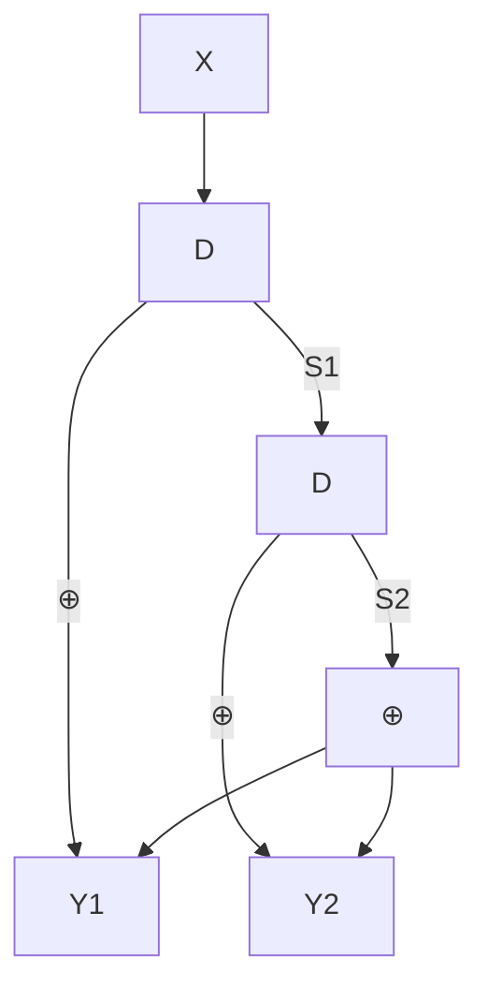
</details>

ขั้นที่หนึ่ง กำหนดให้สถานะของเรจิสเตอร์แบบเลื่อนทั้งหมด นั่นคือ $\mathrm { S } _ { 1 }$ และ $\mathrm { S } _ { 2 }$ มีค่าเป็น 0 (ทำให้เป็นสถานะ 00) โดยขั้นตอนนี้เป็นเพียงการเตรียมความพร้อมของวงจรเข้า รหัสและยังไม่มีการป้อนบิตข้อมูลเข้าไป

ขั้นที่สอง เริ่มป้อนบิตแรกซึ่งมีค่าเป็น 1 (นั้นคือ $x _ { 0 } = 1 )$ เข้าสู่วงจร ก็ทำให้ค่า $\mathrm { Y } _ { 1 } = \mathrm { X } \oplus \mathrm { S } _ { 1 }$ = 1  0 = 1 และ $\mathrm { Y } _ { 2 } = \mathrm { X }$ ${ \bf S } _ { 2 } = { \bf \Phi } 1$ 1 0 = 1 ซึ่งคือข้อมูลเอาต์พุตทีได้จาก การเข้ารหัสของบิตแรกนันเอง

ขั้นที่สาม เริ่มป้อนบิตที่สองซึ่งมีค่าเป็น 0 เข้าสู่วงจร ค่าต่างๆ ในวงจรก็จะเลื่อนไปหนึ่งบิต ทั้งหมด (ณ เวลานี้ $\mathbf { S } _ { 1 } = 1$ และ $\mathbf { S } _ { 2 } = \left( \mathbf { \boldsymbol { 0 } } \right)$ ทำให้ค่า $\mathrm { Y } _ { 1 } = \mathrm { X }$ $\mathrm { S } _ { 1 } = 0$ 1 = 1 และ $\mathrm { Y } _ { 2 } = \mathrm { X } \oplus \mathrm { S } _ { 2 } = 0 \oplus 0 = { \bf 0 }$ ซึ่งคือผลที่ได้จากการเข้ารหัสของบิตที่สอง

ขั้นที่สี่ เริ่มป้อนบิตที่สามซึ่งมีค่าเป็น 1 เข้าสู่วงจร ค่าต่างๆ ในวงจรก็จะเลื่อนไปหนึ่งบิต ทั้งหมด (ณ เวลานี้ $\mathbf { S } _ { 1 } = 0$ และ $S _ { 2 } = 1 )$ ทำให้ค่า $\mathrm { Y } _ { 1 } = \mathrm { X } \oplus \mathrm { S } _ { 1 } = 1$ ${ \bf 0 } = { \bf 1 }$ และ $\mathrm { Y } _ { 2 } = \mathrm { X } \oplus \mathrm { S } _ { 2 } = 1 \oplus 1 = { \bf 0 }$ ซึ่งคือผลที่ได้จากการเข้ารหัสของบิตที่สาม

ซั้นที่ห้า เริ่มป้อนบิดที่สี่ซึ่งมีค่าเป็น 1 เข้าสู่วงจร ค่าต่างๆ ในวงจรก็จะเลื่อนไปหนึ่งบิตทั้งหมด (ณ เวลานี้ $\mathrm { S } _ { 1 } = 1$ และ $\mathbf { S } _ { 2 } = \left( \mathbf { \boldsymbol { 0 } } \right)$ ทำให้ค่า $\mathrm { Y } _ { 1 } = \mathrm { X } \oplus \mathrm { S } _ { 1 } = 1 \oplus 1 = { \bf 0 }$ และ $\mathrm { Y } _ { 2 }$ $\mathbf { \Phi } = \mathbf { X } \oplus \mathbf { S } _ { 2 } = 1 \oplus 0 = \mathbf { 1 }$ ซึ่งคือผลที่ได้จากการเข้ารหัสของบิตที่สี

ขันทีหก ยซี สังเกตว่าสถานะของวงจรเข้ารหัสคอนโวลูชันไม่ได้กลับไปสู่สถานะเริ่มต้นที่เป็น ศูนย์หมด (ณ ตอนนี้อยู่ในสถานะ 11) ด้วยเหตุนี้จึงต้องมีการเตรียมบิตหาง (tail bit) ที่เหมาะสมอีก 2 บิต เพื่อปรับวงจรให้กลับไปสู่สถานะที่ศูนย์ทั้งหมด กระบวน การเข้ารหัสจึงจะเสร็จสมบูรณ์

ขั้นสุดท้าย การเลือกค่าของบิตหางมีหลักการง่ายๆ คือให้พิจารณาดูว่าบิตข้อมูลใดที่มีผลทำให้ ค่าในเรจิสเตอร์แบบเลื่อนเป็นศูนย์ทั้งหมด ซึ่งในที่นี้จะได้ว่าให้ป้อนบิด 0 สองบิต เข้าไปในวงจรก็จะทำให้วงจรเข้ารหัสกลับไปสู่สถานะ 00 อีกครั้ง ซึ่งถือว่าสิ้นสุด กระบวนการเข้ารหัส โดยบิตหางตัวแรกจะให้ข้อมูลเอาต์พุตเป็น $\mathrm { Y } _ { 1 } = \mathbf { 1 }$ และ $\mathrm { Y } _ { 2 }$ ${ \bf \mu } = { \bf 1 } { \bf \Lambda }$ ในขณะที่บิตหางตัวที่สองจะให้ข้อมูลเอาต์พุตเป็น $\mathrm { Y } _ { 1 } = \mathbf { 0 }$ และ $\mathrm { Y } _ { 2 } = \mathbf { 1 }$

ตัวอย่างการเข้ารหัสที่ได้อธิบายมานี้แสดงในรูปที่ 2.3 ซึ่ง้านำมาแสดงในรูปของแผนภาพการเปลี่ยน สถานะก็จะมีลักษณะตามรูปที่ 2.4 หรือถ้านำมาแสดงในรูปของแผนภาพเทรลลิสก็จะมีลักษณะ ตามรูปที่ 2.5 ซึ่งจะเห็นได้ว่ารูปที่ 2.3 – 2.5 ให้ผลลัพธ์เท่ากัน

นอกจากนี้การเข้ารหัสคอนโวลูชันยังสามารถทำได้โดยใช้การแปลง D (D tranรform) [1] เช่นกัน นั้นคือข้อมูลเอาต์พุตทีได้จากวงจรเข้ารหัสคอนโวลูชันจะมีค่าเท่ากับ

$$
Y _ {i} (D) = G _ {i} (D) X (D) \tag {2.3}
$$


<details>
<summary>flowchart</summary>


</details>

<table><tr><td></td><td>X</td><td> $S_1$ </td><td> $S_2$ </td><td> $Y_1$ </td><td> $Y_2$ </td></tr><tr><td>กําหนดค่าเริ่มต้น</td><td>--</td><td>0</td><td>0</td><td>--</td><td>--</td></tr><tr><td>k=0</td><td></td><td></td><td></td><td>1</td><td>1</td></tr><tr><td>k=1</td><td rowspan="3" colspan="3"></td><td>1</td><td>0</td></tr><tr><td>k=2</td><td>1</td><td>0</td></tr><tr><td>k=3</td><td>0</td><td>1</td></tr><tr><td>k=4</td><td rowspan="3" colspan="3"></td><td>1</td><td>1</td></tr><tr><td>k=5</td><td>0</td><td>1</td></tr><tr><td>เลื่อนอีกครั้ง</td><td>--</td><td>--</td></tr></table>

รูปที่ 2.3 ขั้นตอนการเข้ารหัสคอนโวลูชันในตัวอย่างที่ 2.1


<details>
<summary>flowchart</summary>

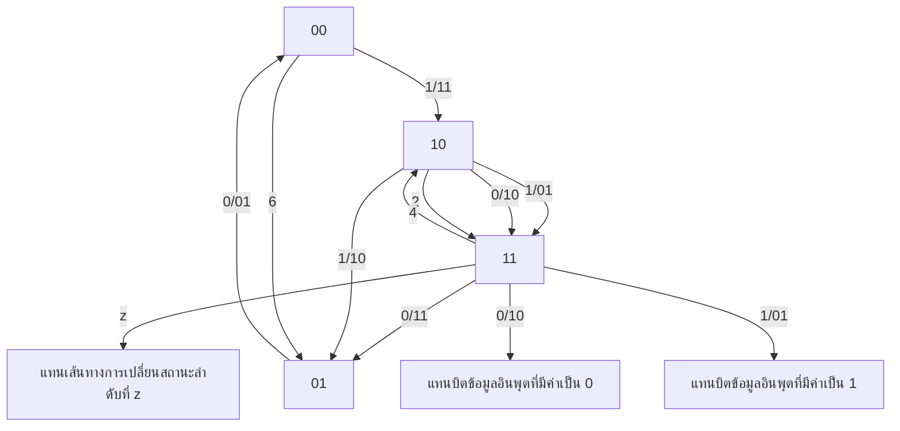
</details>

รูปที่ 2.4 แผนภาพการเปลี่ยนสถานะในตัวอย่างที่ 2.1

เมื่อ $Y _ { i } \left( D \right) = \sum _ { k } y _ { k } ^ { i } D ^ { k }$ คือผลการแปลง D ของข้อมูลเอาต์พุต $y _ { k } ^ { i }$ สำหรับ $i \in \left\{ 1 , 2 \right\} , \ G _ { i } ( D )$ คือพหุนามตัวกำเนิดของข้อมูลเอาต์พุต $y _ { k } ^ { i }$ , และ $X ( D ) = \sum _ { k } x _ { k } D ^ { k }$ คือผลการแปลง D ของ ข้อมูลอินพุต เช่น จากตัวอย่างที่ 2.1 (รูปที่ 2.1 (ก) จะได้ว่า $X \left( D \right) = 1 + D ^ { 2 } + D ^ { 3 }$ และ $G _ { i } \left( D \right)$ เป็นไปตามสมการ (2.2) ดังนั้นข้อมูลเอาต์พุตที่ได้จากการเข้ารหัสทั้งสองชุด $\left\{ y _ { k } ^ { 1 } , y _ { k } ^ { 2 } \right\}$ มีค่าเท่ากับ


<details>
<summary>flowchart</summary>

```mermaid
graph TD
    A["0/01"] -->|0/11| B["0/10"]
    B -->|0/10| C["1/10"]
    C -->|1/01| D["1/01"]
    D --> E["1/11"]
    E --> F["0/11"]
    F --> G["0/11"]
    G --> H["0/11"]
    H --> I["0/11"]
    I --> J["0/11"]
    J --> K["0/11"]
    K --> L["0/11"]
    L --> M["0/11"]
    M --> N["0/11"]
    N --> O["0/11"]
    O --> P["0/11"]
    P --> Q["0/11"]
    Q --> R["0/11"]
    R --> S["0/11"]
    S --> T["0/11"]
    T --> U["0/11"]
    U --> V["0/11"]
    V --> W["0/11"]
    W --> X["0/11"]
    X --> Y["0/11"]
    Y --> Z["0/11"]
    Z --> A["0/11"]
    A -->|1/11| B
    B -->|0/10| C
    C -->|1/10| D
    D -->|1/01| E
    E -->|1/11| F
    F -->|0/11| G
    G -->|0/11| H
    H -->|0/11| I
    I -->|0/11| J
    J -->|0/11| K
    K -->|0/11| L
    L -->|0/11| M
    M -->|0/11| N
    N -->|0/11| O
    O -->|0/11| P
    P -->|0/11| Q
    Q -->|0/11| R
    R -->|0/11| S
    S -->|0/11| T
    T -->|0/11| U
    U -->|0/11| V
    V -->|0/11| W
    W -->|0/11| X
    X -->|0/11| Y
    Y -->|0/11| Z
    Z -->|0/11| A
    style A fill:#f9f,stroke:#333
    style B fill:#f9f,stroke:#333
    style C fill:#f9f,stroke:#333
    style D fill:#f9f,stroke:#333
    style E fill:#f9f,stroke:#333
    style F fill:#f9f,stroke:#333
    style G fill:#f9f,stroke:#333
    style H fill:#f9f,stroke:#333
    style I fill:#f9f,stroke:#333
    style J fill:#f9f,stroke:#333
    style K fill:#f9f,stroke:#333
    style L fill:#f9f,stroke:#333
    style M fill:#f9f,stroke:#333
    style N fill:#f9f,stroke:#333
    style O fill:#f9f,stroke:#333
    style P fill:#f9f,stroke:#333
    style Q fill:#f9f,stroke:#333
    style R fill:#f9f,stroke:#333
    style S fill:#f9f,stroke:#333
    style T fill:#f9f,stroke:#333
    style U fill:#f9f,stroke:#333
    style V fill:#f9f,stroke:#333
    style W fill:#f9f,stroke:#333
    style X fill:#f9f,stroke:#333
    style Y fill:#f9f,stroke:#333
    style Z fill:#f9f,stroke:#333
```
</details>

รูปที่ 2.5 แผนภาพเทรลลิสในตัวอย่างที่ 2.1 (แสดงเส้นทางที่เป็นไปได้เพียงหนึ่งเดียวของคำรหัส)

$$
\begin{array}{l} Y _ {1} (D) = G _ {1} (D) X (D) = (1 \oplus D) \left(1 + D ^ {2} + D ^ {3}\right) \\ = \left(1 + D ^ {2} + D ^ {3}\right) \oplus \left(D + D ^ {3} + D ^ {4}\right) \\ = 1 + D + D ^ {2} + D ^ {4} \\ \end{array}
$$

$$
\begin{array}{l} Y _ {2} (D) = G _ {2} (D) X (D) = \left(1 \oplus D ^ {2}\right) \left(1 + D ^ {2} + D ^ {3}\right) \\ = \left(1 + D ^ {2} + D ^ {3}\right) \oplus \left(D ^ {2} + D ^ {4} + D ^ {5}\right) \\ = 1 + D ^ {3} + D ^ {4} + D ^ {5} \\ \end{array}
$$

นั่นคือ $\left\{ y _ { 0 } ^ { 1 } , y _ { 1 } ^ { 1 } , y _ { 2 } ^ { 1 } , y _ { 3 } ^ { 1 } , y _ { 4 } ^ { 1 } , y _ { 5 } ^ { 1 } \right\} = \left\{ 1 \ 1 \ 1 \ 0 \ 1 \ 0 \right\}$ และ $\left\{ y _ { 0 } ^ { 2 } , y _ { 1 } ^ { 2 } , y _ { 2 } ^ { 2 } , y _ { 3 } ^ { 2 } , y _ { 4 } ^ { 2 } , y _ { 5 } ^ { 2 } \right\} = \left\{ 1 0 0 1 1 1 \right\}$ ซึ่งตรง กับข้อมูลเอาต์พุตที่ได้ตามรูปที่ 2.3 – 2.5

ตัวอย่างที่ 2.2 พิจารณาวงจรเข้ารหัสคอนโวลูชันในรูปที่ 2.6 ซึ่งมีพหุนามตัวกำเนิดในรูปของเลข ฐานแปดคือ $( g _ { 1 } , \ g _ { 2 } ) = ( 1 7 , \ 1 1 )$ หรือมีค่าเท่ากับ (001111, 001001) ในเลขฐานสอง โดยที่ $g _ { 1 }$ เรียกว่าพหุนามป้อนกลับ (feedback polynomial) และ $g _ { 2 }$ เรียกว่าพหุนามป้อนข้างหน้า (feedforward polyทomial) หรือในหนังสือบางเล่มอาจแสดงพหุนามตัวกำเนิดในรูปของเศษส่วนใน โดเมน $D$ คือ $\begin{array} { r } { \frac { g _ { 2 } ( D ) } { g _ { 1 } ( D ) } = \frac { 1 + D ^ { 3 } } { 1 + D + D ^ { 2 } + D ^ { 3 } } } \end{array}$ 1+D+D2 +D3 จงแสดงแผนภาพเครื่องสถานะจำกัด พร้อมทั้งเข้ารหัสบิตข้อมูล 11011100 (บิตข้อมูลด้านซ้ายสุดคือข้อมูลตัวแรกที่จะถูกเข้ารหัส)

วิธีทำแผนภาพเครื่องสถานะจำกัดของวงจรเข้ารหัสคอนโวลูชันนี้แสดงในรูปที่ 2.7 สำหรับการ เข้ารหัสบิตข้อมูล 11011100 ให้ทำตามขั้นตอนต่างๆ คล้ายกับตัวอย่างที่ 2.1 นั้นคือเริ่มต้นจะ กำหนดให้สถานะของเรจิสเตอร์แบบเลื่อนทั้งหมดมีค่าเป็น 0 จากนั้นก็ทำการป้อนข้อมูลเข้าไปใน วงจรทีละบิต แล้วคำนวณหาข้อมูลเอาต์พุตของวงจรเข้ารหัสทีละตัว เมื่อป้อนบิตข้อมูลอินพุตเข้า ไปในวงจรเข้ารหัสครบแล้ว ก็ให้ป้อนบิตหางอีกจำนวนหนึ่งจนกระทั่งทำให้เรจิสเตอร์แบบเลื่อน ทั้งหมดมีค่าเป็น 0 เหมือนเดิม


<details>
<summary>flowchart</summary>


</details>


<details>
<summary>flowchart</summary>

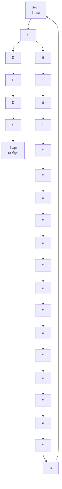
</details>


<details>
<summary>text_image</summary>

พทุนามกําเนิด
\frac{g_2(D)}{g_1(D)} = \frac{1 + D^3}{1 + D + D^2 + D^3}
</details>

รูปที่ 2.6 วงจรเข้ารหัสคอนโวลูชันที่มีพหุนามตัวกำเนิดในรูปของเลขฐานแปดคือ $( g _ { 1 } , g _ { 2 } ) = ( 1 7 , 1 1 )$


<details>
<summary>flowchart</summary>

```mermaid
graph TD
    A["000"] -->|1/1| B["010"]
    B -->|0/1| C["110"]
    C -->|1/0| D["011"]
    D -->|1/0| E["001"]
    E -->|0/1| A
    F["100"] -->|1/0| B
    G["011"] -->|1/1| D
    H["111"] -->|0/0| C
    I["000"] -->|0/0| A
    J["101"] -->|0/1| B
    K["111"] -->|1/1| C
    L["001"] -->|1/0| E
    M["110"] -->|1/0| B
    N["010"] -->|0/1| B
    O["101"] -->|1/0| D
    P["111"] -->|0/0| C
    Q["000"] -->|0/0| A
    R["100"] -->|0/1| B
    S["110"] -->|0/0| D
    T["011"] -->|0/1| E
    U["111"] -->|0/0| C
    V["000"] -->|0/0| A
    W["100"] -->|0/0| B
    X["110"] -->|0/0| C
    Y["011"] -->|0/1| E
    Z["111"] -->|0/0| C
    AA["000"] -->|0/0| A
    AB["100"] -->|0/1| B
    AC["110"] -->|0/0| C
    AD["011"] -->|0/1| E
    AE["111"] -->|0/0| C
    AF["000"] -->|0/0| A
    AG["100"] -->|0/1| B
    AH["110"] -->|0/0| C
    AI["011"] -->|0/1| E
    AJ["111"] -->|0/0| C
    AK["000"] -->|0/0| A
    AL["100"] -->|0/1| B
    AM["110"] -->|0/0| C
    AN["011"] -->|0/1| E
    AO["111"] -->|0/0| C
    AP["000"] -->|0/0| A
    AQ["100"] -->|0/1| B
    AR["110"] -->|0/0| C
    AS["011"] -->|0/1| E
    AT["111"] -->|0/0| C
    AU["000"] -->|0/0| A
    AV["100"] -->|0/1| B
    AW["110"] -->|0/0| C
    AX["011"] -->|0/1| E
    AY["111"] -->|0/0| C
    AZ["000"] -->|0/0| A
    BA["100"] -->|0/1| B
    BB["110"] -->|0/0| C
    BC["011"] -->|0/1| E
    BD["111"] -->|0/0| C
    BE["000"] -->|0/0| A
    BF["100"] -->|0/1| B
    BG["110"] -->|0/0| C
    BH["011"] -->|0/1| E
    BI["111"] -->|0/0| C
    BJ["000"] -->|0/0| A
    BK["100"] -->|0/1| B
    BL["110"] -->|0/0| C
    BM["011"] -->|0/1| E
    BN["111"] -->|0/0| C
    BO["000"] -->|0/0| A
    BP["100"] -->|0/1| B
    BQ["110"] -->|0/0| C
    BR["011"] -->|0/1| E
    BS["111"] -->|0/0| C
    BT["000"] -->|0/0| A
    BU["100"] -->|0/1| B
    BV["110"] -->|0/0| C
    BW["011"] -->|0/1| E
    BX["111"] -->|0/0| C
    BY["000"] -->|0/0| A
    BZ["100"] -->|0/1| B
    CA["110"] -->|0/0| C
    CB["011"] -->|0/1| E
    CC["111"] -->|0/0| C
    DD["000"] -->|0/0| A
    DV["100"] -->|0/1| B
    DW["110"] -->|0/0| C
    DX["011"] -->|0/1| E
    DXB["111"] -->|0/0| C
    DXC["000"] -->|0/0| A
    DXD["100"] -->|0/1| B
    DXE["110"] -->|0/0| C
    DXF["011"] -->|0/1| E
    DXG["111"] -->|0/0| C
    DXH["000"] -->|0/0| A
    DXI["100"] -->|0/1| B
    DXJ["110"] -->|0/0| C
    DXK["011"] -->|0/1| E
    DXL["111"] -->|0/0| C
    DXM["000"] -->|0/0| A
    DXN["100"] -->|0/1| B
    DXO["110"] -->|0/0| C
    DX_P["011"] -->|0/1| E
    DX_Q["111"] -->|0/0| C
    DX_R["000"] -->|0/0| A
    DXS["100"] -->|0/1| B
    DXT["110"] -->|0/0| C
    DX_U["011"] -->|0/1| E
    DX_V["111"] -->|0/0| C
    DX_W["000"] -->|0/0| A
    DX_X["100"] -->|0/1| B
    DX_Y["110"] -->|0/0| C
    DX_Z["011"] -->|0/1| E
    DX_W["111"] -->|0/0| C
    DX_X["000"] -->|0/0| A
    DX_Y["100"] -->|0/1| B
    DX_Z["111"] -->|0/0| C
    DX_W["000"] -->|0/0| A
    DX_X["100"] -->|0/1| B
    DX_Y["110"] -->|0/0| C
    DX_Z["011"] -->|0/1| E
    DX_W["111"] -->|0/0| C
    DX_X["001"] -->|0/1| A
    DX_Y["101"] -->|0/0| B
    DX_Z["111"] -->|0/1| C
    DX_W["001"] -->|0/0| A
    DX_X["101"] -->|0/1| B
    DX_Y["111"] -->|0/0| C
    DX_Z["001"] -->|0/1| A
    DX_W["101"] -->|0/0| B
    DX_X["111"] -->|0/1| C
    DX_Y["001"] -->|0/0| A
    DX_Z["111"] -->|0/1| B
    DX_W["001"] -->|0/0| A
    DX_X["101"] -->|0/1| B
    DX_Y["111"] -->|0/0| C
    DX_Z["001"] -->|0/1| A
    DX_W["101"] -->|0/0| B
    DX_Y["111"] -->|0/1| C
    DX_Z["001"] -->|0/0| A
    DX_W["101"] -->|0/1| B
    DX_Y["111"] -->|0/0| C
    DX_Z["001"] -->|0/1| A
    DX_W["101"] -->|0/0| B
    DX_Y["111"] -->|0/1| C
    DX_Z["001"] -->|0/0| A
    DX_W["100"] -->|0/1| B
    DX_Y["110"] -->|0/0| C
    DX_Z["001"] -->|0/1| A
    DX_W["100"] -->|0/1| B
    DX_Y["110"] -->|0/0| C
    DX_Z["001"] -->|0/0| A
    DX_W["100"] -->|0/1| B
    DX_Y["110"] -->|0/0| C
    DX_Z["001"] -->|0/1| A
    DX_W["100"] -->|0/1| B
    DX_Y["110"] -->|0/0| C
```
</details>

รูปที่ 2.7 แผนภาพเครื่องสถานะจำกัด (FรM) ของวงจรเข้ารหัสคอนโวลูชันในรูปที่ 2.6

หากทำถูกต้องจะได้ว่าบิตหางที่ต้องป้อนเข้าไปในวงจรเข้ารหัสคือ 111 และผลลัพธ์ที่ได้ จากการเข้ารหัสคือ 10101110001


<details>
<summary>flowchart</summary>

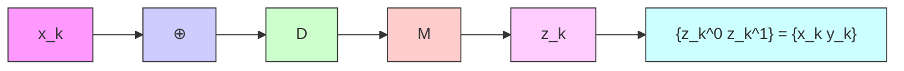
</details>

(ก) วงจรเข้ารหัสคอนโวลูชัน


<details>
<summary>flowchart</summary>

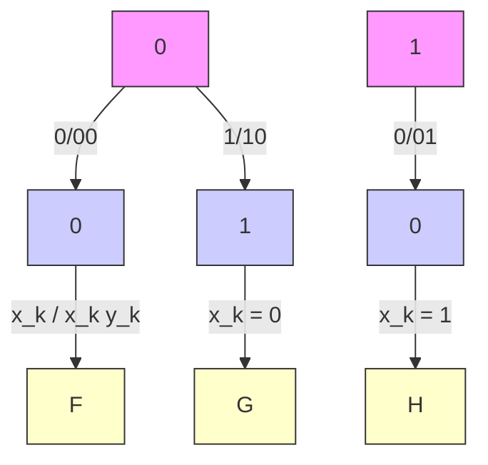
</details>

(ข) แผนภาพเทรลลิส   
รูปที่ 2.8 (ก) วงจรเข้ารหัสคอนโวลูชัน และ (ข) แผนภาพเทรลลิส

# 2.1.2 การถอดรหัส

ในทางปฏิบัติข้อมูลที่ถูกเข้ารหัสด้วยรหัสคอนโวลูชันสามารถทำการถอดรหัสข้อมูลได้ด้วยวงจร ถอดรหัสที่สร้างจากอัลกอริทีมวีเทอร์บิ [13] หรือที่เรียกว่าวงจรตรวจหาวีเทอร์บิ ในที่นี้จะแสดง ตัวอย่างการถอดรหัสข้อมูลที่ถูกเข้ารหัสด้วยรหัสคอนโวลูชันดังต่อไปนี้

ตัวอย่างที่ 2.3 พิจารณาวงจรเข้ารหัสคอนโวลูชันในรูปที่ 2.8 (ก) ซึ่งมีแผนภาพเทรลลิสตามรูปที่ 2.8 (ข) ถ้าสมมุติว่าลำดับข้อมูล $z _ { k }$ คือสิ่งที่วงจรถอดรหัสต้องการถอดรหัสข้อมูล จงถอดรหัสลำดับ ข้อมูล $z _ { k } = \{ 1 1$ 01 10 11 00}

วิธีทำกำหนดให้ $( u , \ q )$ แทนการเปลี่ยนสถานะจากสถานะ น ไปสถานะ q และเมตริกสาขา (branch metric) ณ ระยะที่ k นิยามโดย

$$
\rho_ {k} (u, q) = \left| z _ {k} ^ {0} - \tilde {x} _ {k} (u, q) \right| ^ {2} + \left| z _ {k} ^ {1} - \tilde {y} _ {k} (u, q) \right| ^ {2}
$$

โดยที่ $\tilde { x } _ { k } \left( u , q \right)$ และ $\tilde { y } _ { k } \left( u , q \right)$ คือบิตข้อมูล $x _ { k }$ และ $y _ { k }$ ที่สอดคล้องกับการเปลี่ยนสถานะ $( u , \ q )$ นอกจากนีกำหนดให้เมตริกเส้นทาง (path metric) ณ สถานะ $q$ ที่เวลา $k + 1$ จะนิยามโดย


<details>
<summary>flowchart</summary>


</details>


<details>
<summary>flowchart</summary>

Directed graph with nodes labeled 0 and 1, showing edge weights and a highlighted segment labeled 'nิตหาง' at node 0.
</details>

รูปที่ 2.9 แผนภาพเทรลลิสแสดงการการถอดรหัสข้อมูล $z _ { k } = \{ 1 1 ~ 0 1 ~ 1 0 ~ 1 1 ~ 0 0 \}$

$$
\Phi_ {k + 1} (q) = \min _ {u} \left\{\Phi_ {k} (u) + \rho_ {k} (u, q) \right\}
$$

ดังนันขันตอนการถอดรหัสของวงจรตรวจหาวีเทอร์บิสรุปได้ดังนี 0J

1) สำหรับแต่ละระยะที่ k
สำหรับแต่ละสถานะ q
คำนวณหาค่าเมตริกสาขา $\rho_{k}(u,q)$ ของทุกเส้นสาขาที่มาถึงสถานะ q
เลือกเส้นสาขาที่มีค่าเมตริกเส้นทางน้อยสุด
ปรับปรุงค่าเมตริกเส้นทางของสถานะ q ที่เวลา $k+1$ นั่นคือ $\Phi_{k+1}(q)$ (ทำซ้ำจนครบทุกสถานะ q)
(ทำซ้ำจนครบทุกระยะที่ k)

2) ถอดรหัสข้อมูลอินพุต $x _ { k }$ จากเส้นทางที่มีเมตริกเส้นทางน้อยสุด

รูปที่ 2.9 แสดงขั้นตอนการถอดรหัสข้อมูลตามแผนภาพเทรลลิส ซึ่งจะแสดงเฉพาะเส้นทางที่ยังมี ชีวิตอยู่ (ธนrvivor path) ที่มาถึงแต่ละสถานะ โดยค่าที่อยู่ติดกับแต่ละเส้นสาขาคือค่าเมตริกสาขา $\rho _ { k } \left( u , q \right)$ ที่สอดคล้องกับการเปลี่ยนสถานะ (u, ) นั้นๆ และตัวเลขที่อยู่ตรงโหนดของแต่ละสถานะ คือค่าเมตริกเส้นทาง $\Phi _ { k } \left( q \right)$ จากรูปจะได้ว่าวงจรถอดรหัสคอนโวลูชันจะให้ค่าประมาณของบิตข้อมูล อินพุต $x _ { k }$ เป็น $\hat { x } _ { k } = \left\{ 1 , 0 , 1 , 1 \right\}$ สำหรับรายละเอียดขั้นตอนการถอดรหัสข้อมูลของวงจรตรวจหา วีเทอร์บิสามารถศึกษาได้ในบทที่ 4 ของ [10]

อย่างไรก็ตามถ้านำรหัสคอนโวลูชันมาใช้เป็นส่วนประกอบในรหัสเทอร์โบ ก็จะไม่สามารถ ใช้วงจรตรวจหาวีเทอร์บิในวงจรถอดรหัสเทอร์โบได้ เพราะวงจรถอดรหัสเทอร์โบทำงานโดยใช้ข่าวสาร แบบซอฟต์ของบิตข้อมูลเท่านัน (แต่วงจรตรวจหาวีเทอร์บิจะให้ผลลัพธ์เป็นข่าวสารแบบฮาร์ดหรือ ค่าประมาณของบิตข้อมูล) ดังนั้นวงจรถอดรหัสเทอร์โบที่ใช้ถอดรหัสข้อมูลที่ถูกเข้ารหัสด้วยรหัส คอนโวลูชันจะต้องเป็นวงจรตรวจหาที่สร้างจากอัลกอริทึม BCJR [18] หรือ S0VA (Soft-output Viterbi algorithm) [19] เท่านั้น ซึ่งจะอธิบายต่อไปในหัวข้อที่ 2.2 และบทที่ 3 ตามลำดับ

# 2.2 อัลกอริทึม BCJR

วงจรตรวจหาวีเทอร์บิ [1, 13] คือวงจรตรวจหาแบบควรจะเป็นสูงสุดหรือวงจรตรวจหาแบบ ML (maximum-likelihood) ที่ใช้ในการถอดรหัสข้อมูลที่ถูกเข้ารหัสด้วยรหัสคอนโวลูชัน โดยข้อมูล เอาต์พุตที่ได้จะเป็นค่าประมาณของลำดับข้อมูลที่ต้องการตรวจหา หรืออาจกล่าวได้ว่าวงจรตรวจหา แบบ ML จะทำให้ข้อผิดพลาดของลำดับข้อมูลมีค่าน้อยสุด แต่ไม่ได้รับประกันว่าบิตข้อมูลแต่ละบิต ที่อยูในลำดับข้อมูลนั้นเป็นบิตข้อมูลที่ดีที่สุด นั้นคือวงจรตรวจหาแบบ ML ไม่ได้ทำให้บิตข้อมูล แต่ละบิตมีข้อผิดพลาดน้อยสุด

นอกจากนี้วงจรตรวจหาวีเทอร์บิไม่สามารถนำมาใช้ในระบบถอดรหัสข้อมูลแบบวนซ้ำได้ เพราะระบบนีจะมีการแลกเปลี่ยนข่าวสารแบบซอฟต์ระหว่างวงจรตรวจหาและวงจรถอดรหัสแก้ไข ข้อผิดพลาด ดังนันระบบถอดรหัสข้อมูลแบบวนซำจะต้องใช้วงจรตรวจหาความน่าจะเป็นอะโพส เทอริออริสูงสุดหรือเรียกว่า วงจรตรวจหาแบบ MAP (maximum a posterioriprobability)" โดยวงจรตรวจหาแบบ MAP สามารถรับประกันได้ว่าบิตข้อมูลแต่ละบิตที่ตรวจหาได้เป็นบิตข้อมูล ที่ดีที่สุด (หรือบิตข้อมูลแต่ละบิตมีข้อผิดพลาดน้อยสุด)

ในส่วนนี้จะอธิบายหลักการทำงานของอัลกอริทึม BCJR [18] เพราะเป็นอัลกอริทึมที่ใช้ ในการสร้างวงจรตรวจหาแบบ MAP ซึ่งอัลกอริทึมนี้ได้ถูกคิดค้นและพัฒนาขึ้นโดย Bah1, Cock, Jelinek, และ Raviv เพื่อใช้ในการตรวจหาค่าความน่าจะเป็นอะโพสเทอริออริ (APP: a posteriori probability) สูงสุดของสัญญาณที่ผ่านช่องสัญญาณที่มีการแทรกสอดระหว่างสัญลักษณ์(ISI) และมีสัญญาณรบกวนเกาส์สีขาวแบบบวก (AพGN)

# 2.2.1 แบบจำลองของช่องสัญญาณและแผนภาพเทรลลิส

พิจารณาแบบจำลองของช่องสัญญาณในรูปที่ 2.10 เมื่อสัญญาณที่วงจรภาครับได้รับ (หรือสัญญาณ ที่ต้องการถอดรหัส) ลำดับที่ k คือ


<details>
<summary>flowchart</summary>


</details>


<details>
<summary>flowchart</summary>

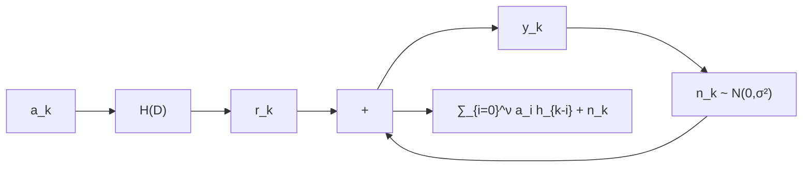
</details>

รูปที่ 2.10 แบบจำลองช่องสัญญาณ


<details>
<summary>flowchart</summary>

```mermaid
graph TD
    A["เวลา k"] -->|γ_k(u,q)| B["เวลา k+1"]
    C["เวลา k"] -->|α_{k+1}(q)| D["q (ψ_{k+1} = q)"]
    D -->|β_{k+1}(q)| E["เวลา k+1"]
    F["เวลา k"] -->|α_k(u)| G["เวลา k"]
    G -->|β_k(u)| H["เวลา k"]
    I["เวลา k"] -->|γ_k(u,q)| J["เวลา k+1"]
    J -->|α_{k+1}(q)| K["เวลา k+1"]
    L["เวลา k"] -->|α_k(u)| M["เวลา k"]
    M -->|β_k(u)| N["เวลา k"]
    O["เวลา k"] -->|α_k(u)| P["เวลา k"]
    P -->|β_k(u)| Q["เวลา k"]
    R["เวลา k"] -->|α_k(u)| S["เวลา k"]
    S -->|β_k(u)| T["เวลา k"]
    U["เวลา k"] -->|α_k(u)| V["เวลา k"]
    V -->|β_k(u)| W["เวลา k"]
    X["เวลา k"] -->|α_k(u)| Y["เวลา k"]
    Y -->|β_k(u)| Z["เวลา k"]
```
</details>

รูปที่ 2.11 การเปลี่ยนสถานะ $( u , \ q )$ ในระยะที่ k ของแผนภาพเทรลลิส

$$
y _ {k} = \sum_ {i = 0} ^ {\nu} a _ {i} h _ {k - i} + n _ {k} \tag {2.4}
$$

เมื่อ $a _ { k } \in { \mathcal { A } }$ คือข้อมูลอินพุตบิตที่ถูกเลือกมาจากเซตของชุดตัวอักษร $\mathcal { A }$ (เช่น ระบบไบนารีจะได้ $\mathcal { A } = \{ 0 , \ 1 \}$ หรือ $\{ - 1 , \ 1 \} )$ $H ( D ) = \sum _ { k = 0 } ^ { \nu } h _ { k } D ^ { k }$ คือช่องสัญญาณที่ไม่ต่อเนื่อง (discrete channel), $h _ { k }$ คือค่าสัมประสิทธิ์ตัวที่ k ของช่องสัญญาณ, ν คือหน่วยความจำของช่องสัญญาณ, $n _ { k }$ คือ AพGN ที่มีค่าเฉลี่ยเท่ากับศูนย์และความแปรปรวนเท่ากับ $\sigma ^ { 2 }$ หรือเขียนแทนด้วย $n _ { k } \sim$ $\mathcal { N } \big ( 0 , 0 ^ { 2 } \big )$ $r _ { k }$ คือข้อมูลเอาต์พุตของช่องสัญญาณ, และ L คือความยาวของลำดับข้อมูลอินพุต $\{ a _ { k } \}$ โดยทั่วไปข้อมูลหนึ่งเซกเตอร์จะมี L = 4096 บิต ถ้าสมมุติว่าวงจรภาคส่งได้ทำการส่งลำดับ ข้อมูลอินพุต $\mathbf { a } = \left[ a _ { 0 } , . . . , a _ { L - 1 } \right]$ จำนวน L บิต โดยบิตข้อมูลแต่ละบิตมีค่าที่เป็นไปได้อยู่ภายใน เซต A และไม่มีการส่งข้อมูลใดๆ ในช่วงเวลาที่ $k < 0$ และ $k > L - 1$ ดังนั้นจากสมการ (2.4) สัญญาณที่งรภาครับได้รับทั้งหมดในรูปของเวกเตอร์คือ $\mathbf { y } = \left\{ y _ { l } \right\} _ { 0 } ^ { L + \nu - 1 } = \left[ y _ { 0 } , . . . , y _ { L + \nu - 1 } \right]$

รูปที่ 2.11 แสดงแผนภาพเทรลลิสของช่องสัญญาณ $h _ { k }$ เมื่อ $\Psi _ { k } \equiv \left[ a _ { k - 1 } , a _ { k - 2 } , . . . , a _ { k - \nu } \right]$ คือสถานะ (state) ณ เวลา k (หรือค่าที่อยูในเรจิสเตอร์แบบเลื่อนทั้งหมด ณ เวลา k), $Q = \left| \mathcal { A } \right| ^ { \nu }$ คือจำนวนสถานะทั้งหมดที่เป็นไปได้, ระยะที่ k (k-th stage) คือกลุ่มของเส้นสาขา (branch) ที่ เป็นไปได้ทั้งหมดระหว่างเวลา  และเวลา $k + 1$ , และ $( u , \ q )$ คือสัญลักษณ์ที่ใช้แทนการเปลี่ยน สถานะ (trลทรtiอก) จากสถานะ น ไปยังสถานะ q ถ้าให้สถานะแต่ละสถานะคือสถานะ 0 ถึงสถานะ $Q - 1$ โดยที่สถานะ 0 หรือ $\psi _ { k } \equiv \left[ 0 , 0 , . . . , 0 \right]$ จะใช้แทนสถานะว่างเปล่า (idle state) สำหรับ $k \leq 0$ และ $k \geq L + \nu - 1$ ดังนั้นอาจกล่าวได้ว่ารูปที่ 2.11 แสดงระยะที่k ของแผนภาพเทรลลิสซึ่ง สอดคล้องกับบิตข้อมูลอินพุตลำดับที่ k (หรือ $a _ { k } )$ , ข้อมูลเอาต์พุตของช่องสัญญาณลำดับที่ k (หรือ $r _ { k } ) .$ และข้อมูลที่วงจรภาครับได้รับลำดับที่ k (หรือ $y _ { k } )$

# 2.2.2 วงจรตรวจหาเหมาะที่สุด

ในทางปฏิบัติวงจรตรวจหาแบบ MAP ถือว่าเป็นวงจรตรวจหาเหมาะที่สุด (optimลl detector) เพราะเป็นวงจรตรวจหาข้อมูลที่สามารถรับประกันได้ว่าความน่าจะเป็นของข้อผิดพลาดของบิตข้อมูล แต่ละบิตมีค่าน้อยสุด ตัวอย่างเช่น ในการตัดสินใจบิตข้อมูลลำดับที่ k (หรือ $a _ { k } )$ วงจรตรวจหาแบบ MAP จะคำนวณหาค่าความน่าจะเป็นอะโพสเทอริออริ (APP) หรือ $\operatorname* { P r } \left[ a _ { k } \mid \mathbf { y } \right]$ ซึ่งหมายถึงค่า สู ความน่าจะเป็นของบิตข้อมูล $a _ { k }$ เมื่อกำหนดลำดับข้อมูล y มาให้ สำหรับแต่ละบิตข้อมูล $a _ { k }$ จากนั้น จะเลือกค่า $a _ { k }$ ที่ทำให้ $\operatorname* { P r } \left[ a _ { k } \mid \mathbf { y } \right]$ มีค่าสูงสุด วงจรตรวจหาแบบ MAP จะดำเนินการลักษณะนี้ไป เรื่อยๆ จนครบข้อมูล L บิต ในทางปฏิบัติค่า $\operatorname { P r } [ a _ { k } \mid \mathbf { y } ]$ คำนวณได้โดยง่าย ถ้าทราบค่าความน่าจะ เป็นของการเปลี่ยนสถานะแบบอะโพสเทอริออริ $\operatorname* { P r } [ \psi _ { k } = u ; \Psi _ { k + 1 } = q \mid \mathbf { y } ]$ สำหรับทุกการเปลี่ยน สถานะ $( u , \ q )$ ในแผนภาพเทรลลิส

อัลกอริทึม BCR ถือเป็นขั้นตอนวิธีที่มีประสิทธิภาพมากในการหาค่าความน่าจะเป็นของ การเปลี่ยนสถานะแบบอะโพสเทอริออริ ซึ่งทำได้ง่ายโดยการจัดรูป $\operatorname* { P r } [ \psi _ { k } = u ; \Psi _ { k + 1 } = q \mid \mathbf { y } ]$ สำหรับการเปลี่ยนสถานะ ณ เวลา 6 ออกเป็น 3 ส่วนดังนี้

1) ส่วนที่หนึ่งขึ้นอยูกับข้อมลที่ด้รับั้งหมดในอดีดต นันคือ $\mathbf { y } _ { l < k } = \{ y _ { l } ; l < k \} = \{ y _ { l } \} _ { 0 } ^ { k - 1 }$   
2) ส่วนที่สอขึ้นอยู่ับข้อมูที่ไดรัในัจุบัน นั้นคือ $y _ { k }$   
3) ส่วนที่สมขึ้นอยู่ับข้อมูลที่ด้รับทั้งหมดในอนาคต นั่นคือ Y1k = {yi; 1 > k} = {y1 } +1+ 21 นน ${ \bf y } _ { l > k } = \left\{ y _ { l } ; l > k \right\} = \left\{ y _ { l } \right\} _ { k + 1 } ^ { L + \nu - 1 }$

จากกฎของเบส์ (Bayes' rule) ค่า $\operatorname* { P r } [ \psi _ { k } = u ; \psi _ { k + 1 } = q \mid \mathbf { y } ]$ จัดรูปใหม่ได้เป็น

$$
\operatorname * {P r} \left[ \psi_ {k} = u; \psi_ {k + 1} = q \mid \mathbf {y} \right] = p \left(\psi_ {k} = u; \psi_ {k + 1} = q; \mathbf {y}\right) / p (\mathbf {y})
$$

$$
= p \left(\psi_ {k} = u; \psi_ {k + 1} = q; \mathbf {y} _ {l <   k}; y _ {k}; \mathbf {y} _ {l > k}\right) / p (\mathbf {y})
$$

$$
= p \left(\mathbf {y} _ {l > k} \mid \psi_ {k} = u; \psi_ {k + 1} = q; \mathbf {y} _ {l <   k}; y _ {k}\right) p \left(\psi_ {k} = u; \psi_ {k + 1} = q; \mathbf {y} _ {l <   k}; y _ {k}\right) / p (\mathbf {y}) \tag {2.5}
$$

เมื่อ $p ( x )$ คือฟังก์ชันความหนาแน่นความน่าจะเป็น (pdf: probability density function) ของ x จากคุณสมบัติของมาร์คอฟ (Markov property) [4] ของแบบจำลองเครืองสถานะจำกัดซึงกล่าวว่า สำหรับช่องสัญญาณใดๆ ข่าวสารเกี่ยวกับข้อมูลของสถานะที่เวลา $k + 1$ จะเข้ามาแทนที่ข่าวสาร 2 เกี่ยวกับข้อมูลของสถานะที่เวลา k รวมทั้งค่า $y _ { k }$ และ $\mathbf { y } _ { l < k }$ ดังนั้นสมการ (2.5) ลดรูปได้เป็น

$$
\begin{array}{l} \operatorname * {P r} \bigl [ \psi_ {k} = u; \psi_ {k + 1} = q \mid \mathbf {y} \bigr ] = p \bigl (\mathbf {y} _ {l > k} | \psi_ {k + 1} = q \bigr) p \bigl (\psi_ {k} = u; \psi_ {k + 1} = q; \mathbf {y} _ {l <   k}; y _ {k} \bigr) / p (\mathbf {y}) \\ = p \left(\mathbf {y} _ {l > k} \mid \psi_ {k + 1} = q\right) p \left(\psi_ {k + 1} = q; y _ {k} \mid \psi_ {k} = u; \mathbf {y} _ {l <   k}\right) p \left(\psi_ {k} = u; \mathbf {y} _ {l <   k}\right) / p (\mathbf {y}) \tag {2.6} \\ \end{array}
$$

ในทำนองเดียวกันอาศัยคุณสมบัติของมาร์คอฟเพื่อจัดรูปสมการ (2.6) ก็จะได้เป็น

$$
\begin{array}{l} \operatorname * {P r} \left[ \psi_ {k} = u; \psi_ {k + 1} = q | \mathbf {y} \right] = \frac {p \left(\psi_ {k} = u ; \mathbf {y} _ {l <   k}\right) p \left(\psi_ {k + 1} = q ; y _ {k} \mid \psi_ {k} = u\right) p \left(\mathbf {y} _ {l > k} \mid \psi_ {k + 1} = q\right)}{p (\mathbf {y})} \\ = \alpha_ {k} (u) \times \gamma_ {k} (u, q) \times \beta_ {k + 1} (q) / p (\mathbf {y}) \tag {2.7} \\ \end{array}
$$

ซึ่งจะเห็นได้ว่าพารามิเตอร์ $\alpha _ { k } \left( u \right)$ คือค่าความน่าจะเป็นสำหรับสถานะ น ณ เวลา k ซึ่งขึ้นอยู่กับ ข้อมูลที่ได้รับในอดีต $\mathbf { y } _ { l < k }$ , พารามิเตอร์ $\beta _ { k + 1 } \left( q \right)$ คือค่าความน่าจะเป็นสำหรับสถานะ $q$ ณ เวลา $k + 1$ ซึ่งขึ้นอยู่กับข้อมูลที่ได้รับในอนาคต $\mathbf { r } _ { l > k }$ , และพารามิเตอร์ $\Upsilon _ { k } \left( u , q \right)$ คือค่าความน่าจะเป็น ของการเปลี่ยนสถานะจากสถานะ น เวลา k ไปยังสถานะ $q$ เวลา $k + 1$ ซึ่งขึ้นอยู่กับข้อมูลใน ปัจจุบัน $y _ { k }$ (ดูพารามิเตอร์ต่างๆ ในรูปที่ 2.11) โดยทั่วไปพารามิเตอร์ $\alpha _ { k } \left( u \right)$ และ $\beta _ { k + 1 } \left( q \right)$ เรียกว่า เมตริกสถานะ (state metric) และพารามิเตอร์ $\Upsilon _ { k } \left( u , q \right)$ เรียกว่าเมตริกสาขา (branch metric)

ถ้ากำหนดให้ $S _ { a }$ คือเซตของการเปลี่ยนสถานะ $( u , \ q )$ ที่เป็นไปได้ทั้งหมดที่สอดคล้องกับ บิตข้อมูล a ดังนั้นค่าความน่าจะเป็นอะโพสเทอริออริ $\operatorname* { P r } [ a _ { k } = a \mid \mathbf { y } ]$ หาได้จาก

$$
\begin{array}{l} \operatorname * {P r} \left[ a _ {k} = a \mid \mathbf {y} \right] = \sum_ {(u, q) \in S _ {a}} \operatorname * {P r} \left[ \psi_ {k} = u; \psi_ {k + 1} = q \mid \mathbf {y} \right] \\ = \frac {1}{p (\mathbf {y})} \sum_ {(u, q) \in S _ {a}} \alpha_ {k} (u) \gamma_ {k} (u, q) \beta_ {k + 1} (q) \tag {2.8} \\ \end{array}
$$

สมการ (2.8) หาได้ง่าย เมื่อทราบค่า $\alpha _ { k } \left( u \right) , \gamma _ { k } \left( u , q \right)$ และ $\beta _ { k + 1 } \left( q \right)$ สำหรับทุกการเปลี่ยนสถานะ $\left( u , q \right)$ และทุกระยะที่

# 2.2.3 การคำนวณหาค่าพารามิเตอร์ของอัลกอริทึม BCJR

พารามิเตอร์ของอัลกอริทึม BCJR ตามสมการ (2.8) นั้นคือ $\gamma _ { k } \left( u , q \right) , \ \alpha _ { k } \left( u \right) , \ \beta _ { k + 1 } \left( q \right)$ และ $p ( \mathbf { y } )$ สามารถคำนวณหาได้ดังนี้

# การหาค่าเมตริกสาขา $\Upsilon _ { k } \left( u , q \right)$ สำหรับช่องสัญญาณ AWGN

อัลกอริทึม BCJR จะแตกต่างจากอัลกอริทึมวีเทอร์บิ [13] ตรงที่ว่าอัลกอริทึม BCJR จะทำการ คำนวณสองเส้นทางคือ

1) เส้นทางข้างหน้า (forพard pass) โดยเริ่มคำนวณค่าต่างๆ ตั้งแต่ข้อมูลที่ได้รับตัวแรกไปข้างหน้า จนถึงข้อมูลตัวสุดท้าย   
2) เส้นทางย้อนกลับ (backward pass) โดยเริ่มคำนวณค่าต่างๆ ตั้งแต่ข้อมูลที่ได้รับตัวสุดท้าย ดร ย้อนกลับมาจนถึงข้อมูลตัวแรก

นอกจากนี้เมตริกสาขาของอัลกอริทึม BCJR คำนวณได้จาก

$$
\begin{array}{l} \gamma_ {k} (u, q) = p \left(\psi_ {k + 1} = q; y _ {k} \mid \psi_ {k} = u\right) \\ = p \left(y _ {k} \mid \psi_ {k} = u; \psi_ {k + 1} = q\right) p \left(\psi_ {k + 1} = q \mid \psi_ {k} = u\right) \tag {2.9} \\ \end{array}
$$

สำหรับช่องสัญญาณแบบ AWGN สัญญาณที่ได้รับคือ $y _ { k } = r _ { k } + n _ { k }$ เมื่อ $n _ { k } \sim \mathcal N \left( 0 , \sigma ^ { 2 } \right)$ คือ สัญญาณรบกวนเกาส์สีขาวแบบบวก ถ้ากำหนดให้ $\hat { a } \left( u , q \right)$ และ $\hat { r } ( u , q )$ คือบิตข้อมูลอินพุตและ ข้อมูลเอาต์พุตของช่องสัญญาณที่สอดคล้องกับการเปลี่ยนสถานะ $\left( u , q \right)$ ตามลำดับ ดังนั้นพจน์ แรกทางขวามือของสมการ (2.9) มีค่าเท่ากับ

$$
p \left(y _ {k} \mid \psi_ {k} = u; \psi_ {k + 1} = q\right) = \frac {1}{\sqrt {2 \pi \sigma^ {2}}} \exp \left\{\frac {- 1}{2 \sigma^ {2}} \left| y _ {k} - \hat {r} (u, q) \right| ^ {2} \right\} \tag {2.10}
$$

q เมื่อ exp() คือฟังก์ชันเลขชี้กำลัง (exponential function) และพจน์ที่สองทางขวามือของสมการ (2.9) คือ

$$
\begin{array}{l} p \left(\psi_ {k + 1} = q \mid \psi_ {k} = u\right) = p \left(a _ {k} = \hat {a} (u, q); \psi_ {k} = u\right) / p \left(\psi_ {k} = u\right) \\ = p \left(\psi_ {k} = u \mid a _ {k} = \hat {a} (u, q)\right) p \left(a _ {k} = \hat {a} (u, q)\right) / p \left(\psi_ {k} = u\right) \\ \end{array}
$$


<details>
<summary>flowchart</summary>

```mermaid
graph TD
    A["Input"] --> B["π⁻¹"]
    B --> C["+"]
    C --> D["OUTER DECODER a priori"]
    D --> E["λ(xₖ)"]
    E --> F["001"]
    F --> G["1/1"]
    G --> H["101"]
    H --> I["1/0"]
    I --> J["110"]
    J --> K["0"]
    K --> L["0"]
    L --> M["0"]
    M --> N["2"]
    N --> O["2"]
    O --> P["0"]
    P --> Q["0"]
    Q --> R["10"]
    R --> S["1"]
    S --> T["1"]
    T --> U["1"]
    U --> V["1"]
    V --> W["1"]
    W --> X["1"]
    X --> Y["1"]
    Y --> Z["1"]
    Z --> AA["1"]
    AA --> AB["1"]
    AB --> AC["1"]
    AC --> AD["1"]
    AD --> AE["1"]
    AE --> AF["1"]
    AF --> AG["1"]
    AG --> AH["1"]
    AH --> AI["1"]
    AI --> AJ["1"]
    AJ --> AK["1"]
    AK --> AL["1"]
    AL --> AM["1"]
    AM --> AN["1"]
    AN --> AO["1"]
    AO --> AP["1"]
    AP --> AQ["1"]
    AQ --> AR["1"]
    AR --> AS["1"]
    AS --> AT["1"]
    AT --> AU["1"]
    AU --> AV["1"]
    AV --> AW["1"]
    AW --> AX["1"]
    AX --> AY["1"]
    AY --> AZ["1"]
    AZ --> BA["1"]
    BA --> BB["1"]
    BB --> BC["1"]
    BC --> BD["1"]
    BD --> BE["1"]
    BE --> BF["1"]
    BF --> BG["1"]
    BG --> BH["1"]
    BH --> BI["1"]
    BI --> BJ["1"]
    BJ --> BK["1"]
    BK --> BL["1"]
    BL --> BM["1"]
    BM --> BN["1"]
    BN --> BO["1"]
    BO --> BP["1"]
    BP --> BQ["1"]
    BQ --> BR["1"]
    BR --> BS["1"]
    BS --> BT["1"]
    BT --> BU["1"]
    BU --> BV["1"]
    BV --> BW["1"]
    BW --> BX["1"]
    BX --> BY["1"]
    BY --> BZ["1"]
    BZ --> CA["1"]
    CA --> CB["1"]
    CB --> CC["1"]
    CC --> CD["1"]
    CD --> CE["1"]
    CE --> CF["1"]
    CF --> CG["1"]
    CG --> CH["1"]
    CH --> CI["1"]
    CI --> CJ["1"]
    CJ --> CK["1"]
    CK --> CL["1"]
    CL --> CM["1"]
    CM --> CN["1"]
    CN --> CO["1"]
    CO --> CP["1"]
    CP --> CQ["1"]
    CQ --> CR["1"]
    CR --> CS["1"]
    CS --> CT["1"]
    CT --> CU["1"]
    CU --> CV["1"]
    CV --> CW["1"]
    CW --> CX["1"]
    CX --> CY["1"]
    CY --> CZ["1"]
    CZ --> DA["1"]
    DA --> DB["1"]
    DB --> DC["1"]
    DC --> DD["1"]
    DD --> DE["1"]
    DE --> DF["1"]
    DF --> DG["1"]
    DG --> DH["1"]
    DH --> DI["1"]
    DI --> DJ["1"]
    DJ --> DK["1"]
    DK --> DL["1"]
    DL --> DJ["1"]
    DJ --> DK["1"]
    DK --> DL["1"]
    DL --> DJ["1"]
    DJ --> DK["1"]
    DK --> DL["1"]
    DL --> DJ["1"]
    DJ --> DK["1"]
    DK --> DL["1"]
    DL --> DJ["1"]
    DJ --> DK["1"]
    DK --> DL["1"]
    DL --> DJ["1"]
    DJ --> DK["1"]
    DK --> LL["1"]
    LL --> DR["1"]
    DR --> DL["1"]
    DL --> DR["1"]
    DR --> DL["1"]
    DL --> DR["1"]
    DR --> DL["1"]
    DL --> DR["1"]
    DR --> DL["1"]
    DL --> DR["1"]
    DR --> DL["1"]
    DL --> DR["1"]
    DR --> DR["1"]
    DR --> DR["1"]
    DR --> DR["1"]
    DR --> DR["1"]
    DR --> DR["1"]
    DR --> DR["1"]
    DR --> DR["1"]
    DR --> DR["1"]
    DR --> DR["1"]
    DR --> DR["1"]
    DR --> DR["1"]
    DR --> DR["1"]
    DR --> DR["1"]
    DR --> DR["1"]
    DR --> Dr["1"]
    DR --> DR["1"]
    DR --> DR["1"]
    DR --> DR["1"]
    DR --> DR["1"]
    DR --> DR["1"]
    DR --> DR["1"]
    DR --> DR["1"]
    DR --> DR["1"]
    DR --> DR["1"]
    DR --> DR["1"]
    DR --> DR["1"]
    DR --> DR["1"]
    DR --> DR["1"]
    DR --> DR["2"]
    DR --> DR["2"]
    DR --> DR["2"]
    DR --> DR["2"]
    DR --> DR["2"]
    DR --> DR["2"]
    DR --> DR["2"]
    DR --> DR["2"]
    DR --> DR["2"]
    DR --> DR["2"]
    DR --> DR["2"]
    DR --> DR["2"]
    DR --> DR["2"]
    DR --> DR["2"]
    DR --> DR["2"]
```
</details>

$$
= p \left(\psi_ {k} = u\right) p \left(a _ {k} = \hat {a} (u, q)\right) / p \left(\psi_ {k} = u\right)
$$

$$
= p \left(a _ {k} = \hat {a} (u, q)\right) \tag {2.11}
$$

ในทางปฏิบัติค่าความน่าจะเป็นในสมการ (2.11) จะเรียกว่าความน่าจะเป็นอะพิรืออริ (a priori probability) ของบิตข้อมูล $a _ { k }$ จากนั้นแทนค่าสมการ (2.10) และ (2.11) ลงในสมการ (2.9) จะ ได้ว่าเมตริกสาขาของอัลกอริทึม BCJR มีค่าเท่ากับ

$$
\gamma_ {k} (u, q) = \frac {1}{\sqrt {2 \pi \sigma^ {2}}} \exp \left\{\frac {- 1}{2 \sigma^ {2}} \left| y _ {k} - \hat {r} (u, q) \right| ^ {2} \right\} \times p \left(a _ {k} = \hat {a} (u, q)\right) \tag {2.12}
$$

ซึ่งจะพบว่าเมตริกสาขาของอัลกอริทึม BCJR มีพจน์ $p \big ( a _ { k } = \hat { a } \big ( u , q \big ) \big )$ เพิ่มขึ้นมาจากเมตริกสาขา ของอัลกอริทึมวีเทอร์บิ [4] ในกรณีที่บิตข้อมูล a, ทุกตัวมีโอกาสเกิดขึ้นเท่ากัน ค่าความน่าจะเป็น $a _ { k }$ อะพิริออริ $p ( a _ { k } = a )$ จะเป็นค่าคงตัวที่ไม่ขึ้นกับค่า a ดังนั้นในกรณีนี้เมตริกสาขาของอัลกอริทึม BCJR จะมีค่าเท่ากับเมตริกสาขาของอัลกอริทึมวีเทอร์บิ อย่างไรก็ตามในกรณีที่บิตข้อมูล $a _ { k }$ แต่ ละตัวมีโอกาสเกิดขึ้นไม่เท่ากัน เพราะฉะนั้นถ้าทราบข้อมูลเกี่ยวกับ $a _ { k }$ แต่ละตัวล่วงหน้า ก็จะช่วย ทำให้การถอดรหัสข้อมูลมีความถูกต้องมากยิ่งขึ้น

การหาค่าเมตริกสถานะ $\alpha _ { k } \left( u \right)$ และ $\beta _ { k + 1 } \left( q \right)$

เมตริกสถานะ $\alpha _ { k } \left( u \right)$ และ $\beta _ { k + 1 } \left( q \right)$ ในสมการ (2.7) คำนวณหาได้ง่ายโดยอาศัยคุณสมบัติของ มาร์คอฟและเทคนิคเวียนเกิด (recนrsive) ดังนี้ จากสมการ (2.7) จะได้ว่า

$$
\alpha_ {k} (u) = p \left(\psi_ {k} = u; \mathbf {y} _ {l <   k}\right) \tag {2.13}
$$

ดังนั้น

$$
\begin{array}{l} \alpha_ {k + 1} (q) = p \left(\psi_ {k + 1} = q; \mathbf {y} _ {l <   k + 1}\right) \\ = p \left(\psi_ {k + 1} = q; y _ {k}; \mathbf {y} _ {l <   k}\right) \\ = \sum_ {u = 0} ^ {Q - 1} p \left(\psi_ {k + 1} = q; y _ {k}; \psi_ {k} = u; \mathbf {y} _ {l <   k}\right) \\ = \sum_ {u = 0} ^ {Q - 1} p \left(\psi_ {k + 1} = q; y _ {k} \mid \psi_ {k} = u; \mathbf {y} _ {l <   k}\right) p \left(\psi_ {k} = u; \mathbf {y} _ {l <   k}\right) \\ \end{array}
$$

$$
= \sum_ {u = 0} ^ {Q - 1} p \left(\psi_ {k + 1} = q; y _ {k} \mid \psi_ {k} = u\right) p \left(\psi_ {k} = u; \mathbf {y} _ {l <   k}\right)
$$

$$
= \sum_ {u = 0} ^ {Q - 1} \gamma_ {k} (u, q) \alpha_ {k} (u) \tag {2.14}
$$

ในทำนองเดียวกันจากสมการ (2.7) จะได้ว่า

$$
\beta_ {k + 1} (q) = p \left(\mathbf {y} _ {l > k} \mid \psi_ {k + 1} = q\right) \tag {2.15}
$$

e ดังนั้น

$$
\beta_ {k} (u) = p \left(\mathbf {y} _ {l > k - 1} \mid \psi_ {k} = u\right)
$$

$$
= p \left(\mathbf {y} _ {l > k}; y _ {k} \mid \psi_ {k} = u\right)
$$

$$
= \sum_ {q = 0} ^ {Q - 1} p \left(\mathbf {y} _ {l > k}; y _ {k}; \psi_ {k + 1} = q \mid \psi_ {k} = u\right)
$$

$$
= \sum_ {q = 0} ^ {Q - 1} p \left(\mathbf {y} _ {l > k} \mid y _ {k}; \psi_ {k + 1} = q; \psi_ {k} = u\right) p \left(y _ {k}; \psi_ {k + 1} = q \mid \psi_ {k} = u\right)
$$

$$
= \sum_ {q = 0} ^ {Q - 1} p \left(\mathbf {y} _ {l > k} \mid \psi_ {k + 1} = q\right) p \left(y _ {k}; \psi_ {k + 1} = q \mid \psi_ {k} = u\right)
$$

$$
= \sum_ {q = 0} ^ {Q - 1} \beta_ {k + 1} (q) \gamma_ {k} (u, q) \tag {2.16}
$$

การกำหนดเงื่อนไขเริ่มต้นของ $\alpha _ { k } \left( u \right)$ และ $\beta _ { k + 1 } \left( q \right)$

อัลกอริทึม BCJR ที่อธิบายในหัวข้อนี้จะสมมุติว่าสมการ (2.15) และ (2.16) เริ่มทำการคำนวณ โดยใช้เงื่อนไขเริ่มต้น (initial condition) ของเมตริกสถานะ $\alpha _ { k } \left( u \right)$ และ $\beta _ { k + 1 } \left( q \right)$ ดังนี้

$$
\alpha_ {0} (u) = \left\{ \begin{array}{l l} 1, & u = 0 \\ 0, & \text {else} \end{array} \quad \text {และ} \quad \beta_ {L + \nu} (q) = \left\{ \begin{array}{l l} 1, & q = 0 \\ 0, & \text {else} \end{array} \right. \right. \tag {2.17}
$$

ซึ่งใช้กับกรณีที่ทุกเส้นสาขา (branch) ในแผนภาพเทรลลิสเริ่มต้นที่สถานะ $\psi _ { 0 } = 0$ และมีการ บังคับให้ทุกเส้นสาขาในแผนภาพเทรลลิสสิ้นสุดที่สถานะ $\psi _ { L + \nu } = 0$ นั่นคือทุกเส้นสาขาในช่วง การเวียนเกิดแบบข้างหน้า (forward recursion) ต้องสิ้นสุดที่สถานะ $\psi _ { L + \nu } = 0$ และทุกเส้นสาขา ในช่วงการเวียนเกิดแบบย้อนกลับ (backward recursion) ต้องสิ้นสุดที่สถานะ $\psi _ { 0 } = 0$

อย่างไรก็ตามในกรณีที่ไม่มีการบังคับให้ทุกเส้นสาขาในแผนภาพเทรลลิสสิ้นสุดที สถานะ $\psi _ { L + \nu } = 0$ ก็นิยมกำหนดให้ค่าเริ่มต้นของเมตริกสถานะ $\beta _ { L + \nu } \left( q \right)$ มีค่าเท่ากับเมตริก สถานะ $\alpha _ { L + \nu } ( q )$ นั่นคือ

$$
\beta_ {L + \nu} (q) = \alpha_ {L + \nu} (q) \tag {2.18}
$$

สำหรับทุกสถานะ $q \in \{ 0 , \ 1 , \ . . . , \ Q \mathrm { ~ - ~ } 1 \}$ เพราะอัลกอริทึม BCJR ไม่มีความรู้เกี่ยวกับข้อมูล ความน่าจะเป็นของแต่ละสถานะ ณ เวลา $L + \nu$

การหาค่า $p ( \mathbf { y } )$

ในทางปฏิบัติค่า $p ( \mathbf { y } )$ ที่ใช้ในการคำนวณหาค่าความน่าจะเป็นอะโพสเทอริออริ $\operatorname { P r } [ a _ { k } \mid \mathbf { y } ]$ ตาม สมการ (2.8) สามารถละทิ้งได้ เนื่องจาก $p ( \mathbf { y } )$ มีค่าคงที่สำหรับทุกเวลา k ดังนั้นกระบวนการ หาค่าสูงสุดของ $\operatorname* { P r } \left[ a _ { k } \mid \mathbf { y } \right]$ จึงยังคงให้ผลลัพธ์เท่าเดิม อย่างไรก็ตามในที่นี้จะแสดงวิธีหาค่า $p ( \mathbf { y } )$ ดังนี้ เนื่องจากผลรวมของความน่าจะเป็นแบบมีเงื่อนไขของทุกเหตุการณ์ต้องมีค่าเท่ากับหนึ่ง a เสมอ ดังนันจากสมการ (2.7) จะได้ว่า

$$
\sum_ {u = 0} ^ {Q - 1} \sum_ {q = 0} ^ {Q - 1} \operatorname * {P r} \left[ \psi_ {k} = u; \psi_ {k + 1} = q | \mathbf {y} \right] = \sum_ {u = 0} ^ {Q - 1} \sum_ {q = 0} ^ {Q - 1} \left(\frac {\alpha_ {k} (u) \gamma_ {k} (u , q) \beta_ {k + 1} (q)}{p (\mathbf {y})}\right) = 1 \tag {2.19}
$$

นั่นคือ

$$
p (\mathbf {y}) = \sum_ {u = 0} ^ {Q - 1} \sum_ {q = 0} ^ {Q - 1} \alpha_ {k} (u) \gamma_ {k} (u, q) \beta_ {k + 1} (q) \tag {2.20}
$$

จากสมการ (2.16) จะได้ว่า

$$
p (\mathbf {y}) = \sum_ {u = 0} ^ {Q - 1} \alpha_ {k} (u) \beta_ {k} (u) \tag {2.21}
$$

สมการ (2.21) แสดงให้เห็นว่าผลคูณของค่า $\alpha _ { k } \left( u \right)$ และ ${ \beta } _ { k } \left( u \right)$ ของทุกสถานะ น ภายในแผนภาพ ญ เทรลลิสจะมีค่าเท่ากันทุกเวลา k ซึ่งมีค่าเท่ากับค่า $p ( \mathbf { y } )$ เพราะฉะนั้นจากสมการ (2.17) ทำให้ได้ ความสัมพันธ์ว่า

$$
p (\mathbf {y}) = \beta_ {0} (0) = \alpha_ {L + \nu} (0) \tag {2.22}
$$

# 2.2.4 อัลกอริทึม BCJR สำหรับบิตข้อมูลแบบไบนารี

ในกรณีที่บิตข้อมูลอินพุตเป็นแบบไบนารี นั่นคือ $a _ { k } \in \{ - 1 , 1 \}$ ค่าความน่าจะเป็นอะโพสเทอริออริ $\operatorname* { P r } [ a _ { k } = a \mid \mathbf { y } ]$ ในสมการ (2.8) จะถูกกำหนดด้วยค่า $\operatorname* { P r } [ a _ { k } = 1 \mid \mathbf { y } ] = 1 - \operatorname* { P r } \left[ a _ { k } = - 1 \mid \mathbf { y } \right]$ หรือ ค่าอัตราส่วน $\operatorname* { P r } \ [ a _ { k } = 1 \mid \mathbf { y } ] / \operatorname* { P r } [ a _ { k } = - 1 \mid \mathbf { y } ]$ ซึ่งในโดเมuลอการิทึม (logarithm domain) เขียน ได้เป็น

$$
\lambda_ {p} \left(a _ {k}\right) = \ln \left(\frac {\operatorname* {P r} \left[ a _ {k} = 1 \mid \mathbf {y} \right]}{\operatorname* {P r} \left[ a _ {k} = - 1 \mid \mathbf {y} \right]}\right) \tag {2.23}
$$

เมื่อ $\lambda _ { p } \left( a _ { k } \right)$ คือค่า LLR แบบอะโพสเทอริออริของบิตข้อมูล $a _ { k }$ ดังนั้นจากสมการ (2.8) จะได้ว่า

$$
\lambda_ {p} \left(a _ {k}\right) = \ln \left(\frac {\sum_ {(u , q) \in S _ {1}} \alpha_ {k} (u) \gamma_ {k} (u , q) \beta_ {k + 1} (q)}{\sum_ {(u , q) \in S _ {- 1}} \alpha_ {k} (u) \gamma_ {k} (u , q) \beta_ {k + 1} (q)}\right) \tag {2.24}
$$

อัลกอริทึม BCJR สำหรับบิตข้อมูลแบบไบนารีจะใช้สมการ (2.24) ในการคำนวณหาค่า LLR สำหรับแต่ละบิตข้อมูลที่ส่งมาจากวงจรภาคส่ง ซึ่งค่า $\lambda _ { p } \left( a _ { k } \right)$ จะถูกนำมาใช้ในการตัดสินใจ หาค่าประมาณของบิตข้อมูล $a _ { k }$ ที่ทำให้ความน่าจะเป็นของข้อผิดพลาดมีค่าน้อยสุด โดยอาศัยกฎ การตัดสินใจดังนี้

$$
\hat {a} _ {k} = \left\{ \begin{array}{l l} 1, & \text { if } \lambda_ {p} (a _ {k}) \geq 0 \\ - 1, & \text { if } \lambda_ {p} (a _ {k}) <   0 \end{array} \right. \tag {2.25}
$$

นอกจากนี้ค่าความน่าจะเป็นอะพิริออริ $p ( a _ { k } = \tilde { a } )$ สำหรับ $\tilde { a } \in \{ \pm 1 \}$ ยังมีความสัมพันธ์ กับฟังก์ชันควรจะเป็นแบบลอการิทึมดังนี้ (ดูสมการ (1.6))

$$
p \left(a _ {k} = \tilde {a}\right) = \frac {\exp \left(\tilde {a} \lambda_ {a} \left(a _ {k}\right) / 2\right)}{\exp \left(\lambda_ {a} \left(a _ {k}\right) / 2\right) + \exp \left(- \lambda_ {a} \left(a _ {k}\right) / 2\right)} \tag {2.26}
$$

สู เมื่อ

$$
\lambda_ {a} \left(a _ {k}\right) = \ln \left(\frac {p \left(a _ {k} = 1\right)}{p \left(a _ {k} = - 1\right)}\right) \tag {2.27}
$$

คือค่า LLR แบบอะพิรืออริของบิตข้อมูล $a _ { k }$ อย่างไรก็ตามเนื่องจากตัวส่วนในสมการ (2.26) มีค่า เท่ากันสำหรับทุกการเปลี่ยนสถานะ $( u , q )$ ในแผนภาพเทรลลิส ดังนั้นจึงสามารถใช้ค่าความน่าจะเป็น อะพิริออริ

$$
p \left(a _ {k} = \tilde {a}\right) = \exp \left(\frac {\tilde {a} \lambda_ {a} \left(a _ {k}\right)}{2}\right) \tag {2.28}
$$

ในการหาค่าเมตริกสาขาของอัลกอริทึม BCJR ในสมการ (2.12) ได้ นั่นคือ

$$
\gamma_ {k} (u, q) = \frac {1}{\sqrt {2 \pi \sigma^ {2}}} \exp \left\{\frac {- 1}{2 \sigma^ {2}} \left| y _ {k} - \hat {r} (u, q) \right| ^ {2} \right\} \times \exp \left(\frac {\hat {a} (u , q) \lambda_ {a} (a _ {k})}{2}\right) \tag {2.29}
$$

# 2.2.5 สรุปขั้นตอนการทำงานของอัลกอริทึม BCJR

หลักการทำงานของอัลกอริทึม BCJR สรุปเป็นขั้นตอนต่างๆ ได้ตามรูปที่ 2.12

# 2.2.6 ข้อสังเกตของอัลกอริทึม BCJR

การนำอัลกอริทึม BCJR ที่อธิบายในรูปที่ 2.12 ไปใช้งานจริงในทางปฏิบัติ จำเป็นจะต้องทำการ นอร์มอลไลเซชัน (normalization) [22] ค่าเมตริกสถานะ $\alpha _ { k } \left( u \right)$ และ ${ \beta } _ { k } \left( u \right)$ สำหรับทุกสถานะ u และทุกเวลา k เพื่อหลีกเลี่ยงปัญหาเรื่องน้อยเกินเก็บเชิงตัวเลข (numerical underflow) ใน โปรแกรมคอมพิวเตอร์ กล่าวคือในแต่ละเวลา k ที่ทำการคำนวณหาค่า $\alpha _ { k } \left( u \right)$ และ ${ \beta } _ { k } \left( u \right)$ เมื่อ ได้ค่า $\alpha _ { k } \left( u \right)$ และ ${ \beta } _ { k } \left( u \right)$ ตามสมการ (2.14) และ (2.16) สำหรับทุกสถานะ น แล้ว ก็ให้ทำการ นอร์มอลไลเซชันค่าเมตริกสถานะทั้งสองตามความสัมพันธ์ดังนี้

$$
\alpha_ {k} (u) = \frac {\alpha_ {k} (u)}{\sum_ {i} \alpha_ {k} (i)} \quad \text { signaling } \quad \beta_ {k} (u) = \frac {\beta_ {k} (u)}{\sum_ {i} \beta_ {k} (i)} \tag {2.30}
$$

เพื่อให้ผลรวมของ $\alpha _ { k } \left( u \right)$ สำหรับทุก น มีค่าเท่ากับหนึ่ง และให้ผลรวมของ ${ \beta } _ { k } \left( u \right)$ สำหรับทุก น มีค่าเท่ากับหนึ่ง จากนั้นจึงเริ่มคำนวณหาค่า αk (u) และ βk(u) ในเวลา k ลัดไป ซู $\alpha _ { k } \left( u \right)$ ${ \beta } _ { k } \left( u \right)$

# อัลกอริทึม BCJR

1. กำหนดคาเริ่มต้นเมตริกสถานะ $\left[ \alpha _ { 0 } \left( 0 \right) , \alpha _ { 0 } \left( 1 \right) , . . . , \alpha _ { 0 } \left( Q - 1 \right) \right] = \left[ 1 , 0 , . . . , 0 \right]$   
2. การเวียนเกิดแบบข้างหน้า (forward recursion)

$$
\text {   สำหรับ   } k = 0, 1, \dots , L + \nu - 1
$$

$$
\text {   สำหรับ   } q = 0, 1, \dots , Q - 1
$$

$$
\text {   จำนวนหาค่า   } \gamma_ {k} (u, q) \text {   ตามสมการ   (2.29)   สำหรับทุก   } u \text {   ที่ทำให้   } (u, q) \text {   เป็นจริง   }
$$

$$
\text {   จำนวนหาค่า   } \alpha_ {k + 1} (q) \text {   ตามสมการ   } (2. 1 4)
$$

$$
(\text {   สิ้นสุดการวันชําของ   } q)
$$

$$
(\text {   (ลีนสุดการวันชําของ   } k)
$$

3. กำหนดค่าเริ่มต้นเมตริกสถานะ6 $\left[ \beta _ { L + \nu } \left( 0 \right) , \beta _ { L + \nu } \left( 1 \right) , \ldots , \beta _ { L + \nu } \left( Q - 1 \right) \right] = \left[ 1 , 0 , \ldots , 0 \right]$   
4. การเวียนเกิดแบบย้อนกลับ (backward recursion)

$$
\text {   สำหรับ   } k = L + \nu - 1, L + \nu - 2, \dots , 0
$$

$$
\text {   สำหรับ   } u = 0, 1, \dots , Q - 1
$$

$$
\text {   จำนวน   } ^ {7} \text {   หาค่า   } \gamma_ {k} (u, q) \text {   ตามสมการ   } (2. 2 9) \text {   สำหรับทุก   } q \text {   ที่ทำให้   } (u, q) \text {   เป็นจริง   }
$$

$$
\text {   จำนวนหาค่า   } \beta_ {k} (u) \text {   ตามสมการ   } (2. 1 6)
$$

$$
(\text {   สิ้นสุดการวันชําของ   } u)
$$

$$
\text {   จำนวนหาค่า   } \lambda_ {p} \left(a _ {k}\right) \text {   ตามสมการ   } (2. 2 4)
$$

$$
\text { ตัดสินใจหาค่า   } a _ {k} \text {   ตามสมการ   (2.25) }
$$

$$
(\text {   ลีนสุดการวันชําของ   } k)
$$

# รูปที่ 2.12 ขั้นตอนการทำงานของอัลกอริทึม BCJR

ถึงแม้ว่าวงจรตรวจหาแบบ MAP ที่ใช้อัลกอริทึม BCJR จะเป็นวงจรตรวจหาเหมาะที่สุด เพราะสามารถรับประกันได้ว่าบิตข้อมูลแต่ละบิตจะมีข้อผิดพลาดน้อยสุด อย่างไรก็ตามในทางปฏิบัติ อัลกอริทึม BCR ไม่นิยมนำมาใช้จริงในชิปประมวลผลสัญญาณของงานประยุกต์ต่างๆ ได้ เพราะ อัลกอริทึม BCR ใช้ทรัพยากรในการคำนวณสูงและอ่อนไหวต่อค่าความแปรปรวนของสัญญาณ รบกวนหรือ $\sigma ^ { 2 }$ [23, 24] ซึ่งต้องใช้ในการหาค่า $\Upsilon _ { k } \left( u , q \right)$ ตามสมการ (2.29) กล่าวคือการใช้งาน ในระบบจริงจะไม่สามารถทราบค่า $\sigma ^ { 2 }$ ที่แท้จริงได้ (ทำได้แต่เพียงการใช้เทคนิคต่างๆ ในการหาค่า ประมาณของ $\sigma ^ { 2 }$ เท่านั้น) ดังนั้นถ้า $\sigma ^ { 2 }$ มีค่าไม่ถูกต้อง ก็จะทำให้ค่าพารามิเตอร์ต่างๆ ของอัลกอริทึม BCJR มีค่าผิดเพี้ยนทั้งหมดซึ่งส่งผลให้สมรรถนะของวงจรตรวจหาแบบ MAP ด้อยลงมาก ดังนั้น นักวิจัยจึงได้พัฒนาอัลกอริทึมต่างๆ เช่น Max-Log-MAP, Log-MAP และ SOVA ซึ่งมีสมรรถนะ ใกล้เคียงหรือเทียบเท่าอัลกอริทึม BตJR แต่ใช้ทรัพยากรในการคำนวณน้อยกว่าและไม่อ่อนไหว ต่อค่า $\sigma ^ { 2 }$ [24] จึงทำให้สามารถนำไปใช้จริงในชิปประมวลผลสัญญาณได้อย่างมีประสิทธิภาพ (ในบทที่ 3 จะอธิบายหลักการทำงานอัลกอริทึมต่างๆ เหล่านี้)

ตัวอย่างที่ 2.4 จากแบบจำลองช่องสัญญาณในรูปที่ 2.10 ถ้ากำหนดให้ลำดับข้อมูลอินพุต $a _ { k } =$ $\{ 1 , - 1 , 1 \}$ , ช่องสัญญาณ $H \left( D \right) = 1 + 0 . 5 D$ , สัญญาณรบกวน $n _ { k } = \{ - 0 . 1 , 0 . 3 , - 0 . 2 , - 0 . 1 \}$ ซึ่งมีความแปรปรวนเท่ากับ $\sigma ^ { 2 } = 1 / \left( 2 \pi \right)$ จงแสดงขั้นตอนการถอดรหัสข้อมูล $y _ { k }$ โดยใช้อัลกอริทึม BCJR (สมมุติว่าระบบไม่ทราบข่าวสารอะพิรืออริของบิตข้อมูล $a _ { k } )$

วิธีทำ ข้อมูลเอาต์พุตของช่องสัญญาณ $r _ { k }$ หาได้จาก

$$
r _ {k} = a _ {k} * h _ {k} = \{r _ {0}, r _ {1}, r _ {2}, r _ {3} \} = \{1, - 0. 5, 0. 5, 0. 5 \}
$$

เมื่อ \* คือตัวดำเนินการคอนโวลูชัน (convolution operator) และ

$$
y _ {k} = r _ {k} + n _ {k} = \{0. 9, - 0. 2, 0. 3, 0. 6 \} = \{y _ {0}, y _ {1}, y _ {2}, y _ {3} \}
$$

จากนั้นให้สร้างแผนภาพเทรลลิสของช่องสัญญาณ ะ1 น $H ( D ) = 1 + 0 . 5 D$ ซึ่งจะได้ตามรูปที่ 2.13 โดย มีทังหมดสองสถานะคือ สถานะ (a) และสถานะ (b)

1. กำหนดค่าเริ่มต้นของเมตริกสถานะ $\alpha _ { 0 } \left( a \right) = 1$ และ $\alpha _ { 0 } \left( b \right) = 0$

# การเวียนเกิดแบบข้างหน้า

2.ระยะที่ 0 (เมื่อ $k = 0 )$ อัลกอริทึม BCJR รับข้อมูล $y _ { 0 } = 0 . 9$ มาใช้คำนวณหาเมตริกสาขา $\Upsilon _ { 0 } \left( u , q \right)$ ตามสมการ (2.29) สำหรับทุกค่า u และ q ที่ทำให้การเปลี่ยนสถานะ (u, q) เป็น จริงตามแผนภาพเทรลลิสในรูปที่ 2.13 ซึ่งจะได้


<details>
<summary>flowchart</summary>

```mermaid
graph TD
    A["1"] -->|0.5| B["2"]
    A -->|1.5| C["3"]
    B -->|-1.5| D["4"]
    C -->|-1.5| D
    style A fill:#000,stroke:#000
    style B fill:#000,stroke:#000
    style C fill:#000,stroke:#000
    style D fill:#000,stroke:#000
    note1["(a) -1"] --> A
    note2["(b) 1"] --> A
    note3["(a) -1"] --> B
    note4["(b) 1"] --> C
    note5["(a) -1"] --> D
    note6["(b) 1"] --> C
    note7["(a) -1"] --> D
    note8["(b) 1"] --> C
    note9["(a) -1"] --> D
    note10["(b) 1"] --> C
    note11["(a) -1"] --> D
    note12["(b) 1"] --> C
    note13["(a) -1"] --> D
    note14["(b) 1"] --> C
    note15["(a) -1"] --> D
    note16["(b) 1"] --> C
    note17["(a) -1"] --> D
    note18["(b) 1"] --> C
    note19["(a) -1"] --> D
    note20["(b) 1"] --> C
    note21["(a) -1"] --> D
    note22["(b) 1"] --> C
    note23["(a) -1"] --> D
    note24["(b) 1"] --> C
    note25["(a) -1"] --> D
    note26["(b) 1"] --> C
    note27["(a) -1"] --> D
    note28["(b) 1"] --> C
    note29["(a) -1"] --> D
    note30["(b) 1"] --> C
    note31["(a) -1"] --> D
    note32["(b) 1"] --> C
    note33["(a) -1"] --> D
    note34["(b) 1"] --> C
    note35["(a) -1"] --> D
    note36["(b) 1"] --> C
    note37["(a) -1"] --> D
    note38["(b) 1"] --> C
    note39["(a) -1"] --> D
    note40["(b) 1"] --> C
    note41["(a) -1"] --> D
    note42["(b) 1"] --> C
    note43["(a) -1"] --> D
    note44["(b) 1"] --> C
    note45["(a) -1"] --> D
    note46["(b) 1"] --> C
    note47["(a) -1"] --> D
    note48["(b) 1"] --> C
    note49["(a) -1"] --> D
    note50["(b) 1"] --> C
    note51["(a) -1"] --> D
    note52["(b) 1"] --> C
    note53["(a) -1"] --> D
    note54["(b) 1"] --> C
    note55["(a) -1"] --> D
    note56["(b) 1"] --> C
    note57["(a) -1"] --> D
    note58["(b) 1"] --> C
    note59["(a) -1"] --> D
    note60["(b) 1"] --> C
    note61["(a) -1"] --> D
    note62["(b) 1"] --> C
    note63["(a) -1"] --> D
    note64["(b) 1"] --> C
    note65["(a) -1"] --> D
    note66["(b) 1"] --> C
    note67["(a) -1"] --> D
    note68["(b) 1"] --> C
    note69["(a) -1"] --> D
    note70["(b) 1"] --> C
    note71["(a) -1"] --> D
    note72["(b) 1"] --> C
    note73["(a) -1"] --> D
    note74["(b) 1"] --> C
    note75["(a) -1"] --> D
    note76["(b) 1"] --> C
    note77["(a) -1"] --> D
    note78["(b) 1"] --> C
    note79["(a) -1"] --> D
    note80["(b) 1"] --> C
    note81["(a) -1"] --> D
    note82["(b) 1"] --> C
    note83["(a) -1"] --> D
    note84["(b) 1"] --> C
    note85["(a) -1"] --> D
    note86["(b) 1"] --> C
    note87["(a) -1"] --> D
    note88["(b) 1"] --> C
    note89["(a) -1"] --> D
    note90["(b) 1"] --> C
    note91["(a) -1"] --> D
    note92["(b) 1"] --> C
    note93["(a) -1"] --> D
    note94["(b) 1"] --> C
    note95["(a) -1"] --> D
    note96["(b) 1"] --> C
    note97["(a) -1"] --> D
    note98["(b) 1"] --> C
    note99["(a) -1"] --> D
    note100["(b) 1"] --> C
```
</details>

รูปที่ 2.13 แผนภาพเทรลลิสสำหรับช่องสัญญาณ $H ( D ) = 1 + 0 . 5 D$ เมื่อข้อมูลอินพุตคือ $a _ { k } \in \{ \pm 1 \}$

$$
\begin{array}{l} \gamma_ {0} (a, a) = \exp \left\{- \pi | 0. 9 - (- 1. 5) | ^ {2} \right\} \times \exp \left(\frac {(- 1) (0)}{2}\right) \approx 0 \\ \gamma_ {0} (b, a) = \exp \left\{- \pi | 0. 9 - (- 0. 5) | ^ {2} \right\} \times \exp \left(\frac {(- 1) (0)}{2}\right) \approx 0. 0 0 2 1 \\ \gamma_ {0} (a, b) = \exp \left\{- \pi | 0. 9 - (0. 5) | ^ {2} \right\} \times \exp \left(\frac {(+ 1) (0)}{2}\right) \approx 0. 6 0 4 9 \\ \gamma_ {0} (b, b) = \exp \left\{- \pi | 0. 9 - (1. 5) | ^ {2} \right\} \times \exp \left(\frac {(+ 1) (0)}{2}\right) \approx 0. 3 2 2 7 \\ \end{array}
$$

จากนั้นทำการปรับค่าเมตริกสถานะ $\alpha _ { 1 } \left( a \right)$ และ $\alpha _ { 1 } \left( b \right)$ ตามสมการ (2.14) ดังนี้

$$
\alpha_ {1} (a) = \alpha_ {0} (a) \gamma_ {0} (a, a) + \alpha_ {0} (b) \gamma_ {0} (b, a) = (1) (0) + (0) (0. 0 0 2 1) = 0
$$

$$
\alpha_ {1} (b) = \alpha_ {0} (a) \gamma_ {0} (a, b) + \alpha_ {0} (b) \gamma_ {0} (b, b) = (1) (0. 6 0 4 9) + (0) (0. 3 2 2 7) = 0. 6 0 4 9
$$

ให้ทำการนอร์มอลไลเซชันตามสมการ (2.30) จะได้

$$
\alpha_ {1} (a) = 0 / (0 + 0. 6 0 4 9) = 0
$$

$$
\alpha_ {1} (b) = 0. 6 0 4 9 / (0 + 0. 6 0 4 9) = 1
$$

3. ระยะที่1 (เมือ k = 1) อัลกอริทึม BCJR รับข้อมูล $y _ { 1 } = - 0 . 2$ มาใช้คำนวณหาเมตริกสาขา ทั่งหมดดังี้

$$
\gamma_ {1} (a, a) = \exp \left\{- \pi | - 0. 2 - (- 1. 5) | ^ {2} \right\} \times \exp \left(\frac {(- 1) (0)}{2}\right) \approx 0. 0 0 4 9
$$

$$
\gamma_ {1} (b, a) = \exp \left\{- \pi | - 0. 2 - (- 0. 5) | ^ {2} \right\} \times \exp \left(\frac {(- 1) (0)}{2}\right) \approx 0. 7 5 3 7
$$

$$
\gamma_ {1} (a, b) = \exp \left\{- \pi | - 0. 2 - (0. 5) | ^ {2} \right\} \times \exp \left(\frac {(+ 1) (0)}{2}\right) \approx 0. 2 1 4 5
$$

$$
\gamma_ {1} (b, b) = \exp \left\{- \pi | - 0. 2 - (1. 5) | ^ {2} \right\} \times \exp \left(\frac {(+ 1) (0)}{2}\right) \approx 0. 0 0 0 1
$$

จากนั้นทำการปรับค่าเมตริกสถานะ $\alpha _ { 2 } \left( a \right)$ และ $\alpha _ { 2 } \left( b \right)$ ดังนี้

$$
\alpha_ {2} (a) = \alpha_ {1} (a) \gamma_ {1} (a, a) + \alpha_ {1} (b) \gamma_ {1} (b, a) = (0) (0. 0 0 4 9) + (1) (0. 7 5 3 7) = 0. 7 5 3 7
$$

$$
\alpha_ {2} (b) = \alpha_ {1} (a) \gamma_ {1} (a, b) + \alpha_ {1} (b) \gamma_ {1} (b, b) = (0) (0. 2 1 4 5) + (1) (0. 0 0 0 1) = 0. 0 0 0 1
$$

ให้ทำการนอร์มอลไลเซชันตามสมการ (2.30) จะได้

$$
\alpha_ {1} (a) = 0. 7 5 3 7 / (0. 7 5 3 7 + 0. 0 0 0 1) \approx 0. 9 9 9 9
$$

$$
\alpha_ {1} (b) = 0. 0 0 0 1 / (0. 7 5 3 7 + 0. 0 0 0 1) \approx 0. 0 0 0 1
$$

4. ระยะที่ 2 และ 3 (เมื่อ $k = \{ 2 , 3 \} )$ อัลกอริทึม BCJR รับข้อมูล $y _ { 2 } = 0 . 3$ และ $y _ { 3 } = 0 . 6$ มาใช้คำนวณหาเมตริกสาขาทั้งหมดและปรับค่าเมตริกสถานะ $\alpha _ { k + 1 } \left( q \right)$ สำหรับ $q \in \{ a , b \}$ เช่นเดียวกันกับวิธีการที่อธิบายในขั้นตอนที่ 2 และ 3 ซึ่งจะได้ค่า $\Upsilon _ { k } \left( u , q \right)$ และ $\alpha _ { k + 1 } \left( q \right)$ ตามที่แสดงในรูปที่ 2.14 โดยค่าที่อยู่ติดกับเส้นสาขาแต่ละเส้นคือค่า $\Upsilon _ { k } \left( u , q \right)$ ที่สอดคล้อง กับการเปลี่ยนสถานะ $( u , \ q )$ นั้นๆ และตัวเลขที่อยู่ตรงโหนดของแต่ละสถานะแสดงถึงค่า เมตริกสถานะ $\alpha _ { k } \left( u \right)$ และ ${ \beta } _ { k } \left( u \right)$ ในรูปเศษส่วนดังนี้

$$
\frac {\alpha_ {k} (u)}{\beta_ {k} (u)}
$$

สำหรับแต่ละ $k \in \{ 0 , 1 , 2 , 3 \}$ และ $u \in \{ a , b \}$ นันคือเมื่อสินสุดการทำงานในช่วงการเวียน เกิดแบบข้างหน้า (forward recursion) ก็จะได้ (หลังการทำนอร์มอลไลเซชัน)

$$
\alpha_ {4} (a) = 0. 2 2 1 4 \quad \text { และ } \quad \alpha_ {4} (b) = 0. 7 7 8 6
$$


<details>
<summary>radar</summary>

| Value | Value 1 | Value 2 | Value 3 | Value 4 | Value 5 | Value 6 | Value 7 | Value 8 | Value 9 | Value 10 |
|---|---|---|---|---|---|---|---|---|---|---|
| 1.0000 | 0.6514 | 0.0000 | 0.3348 | 0.0049 | 0.9999 | 0.3642 | 0.00004 | 0.0001 | 0.9195 | 0.2214 |
| 0.6049 | 0.0021 | 0.3227 | 0.7537 | 0.0001 | 0.8819 | 0.1339 | 0.0108 | 0.9691 | 0.0785 | 0.7786 |
| 0.0000 | 0.3486 | 1.0000 | 0.6652 | 0.0001 | 0.0001 | 0.6358 | 0.0223 | 0.9999 | 0.0805 | 0.7786 |
| 0.0000 | 0.0000 | 0.0000 | 0.0000 | 0.0000 | 0.0000 | 0.0000 | 0.0000 | 0.0000 | 0.0000 | 0.0000 |
| 0.2145 | 0.0000 | 0.2145 | 0.0000 | 0.0000 | 0.0000 | 0.0000 | 0.0000 | 0.0000 | 0.0000 | 0.0000 |
| 0.8819 | 0.0000 | 0.8819 | 0.0000 | 0.0000 | 0.0000 | 0.0000 | 0.0000 | 0.0000 | 0.0000 | 0.0000 |
| 0.9691 | 0.0000 | 0.9691 | 0.0000 | 0.0000 | 0.0000 | 0.0000 | 0.0000 | 0.0000 | 0.0000 | 0.0000 |
| 0.0000 | 0.0000 | 0.0000 | 0.0000 | 0.0000 | 0.0000 | 0.0000 | 0.0000 | 0.0000 | 0.0000 | 0.0000 |
| 0.0000 | 0.0000 | 0.0000 | 0.0000 | 1.0000 | 0.0000 | 0.0000 | 0.0000 | 0.0000 | 0.0000 | 0.0000 |
| 0.0000 | 0.0000 | 0.0000 | 0.0000 | 0.0000 | 0.0652 | 0.0000 | 0.0000 | 0.0000 | 0.0000 | 0.0000 |
</details>

รูปที่ 2.14 การคำนวณภายในอัลกอริทึม BCJR ในตัวอย่างที่ 2.4

5. กำหนดค่าเริ่มต้นของเมตริกสถานะ $\beta _ { 4 } \left( u \right) = \alpha _ { 4 } \left( u \right)$ สำหรับ $u \in \{ a , b \}$ นั่นคือ

$$
\beta_ {4} (a) = 0. 2 2 1 4 \quad \text { และ } \quad \beta_ {4} (b) = 0. 7 7 8 6
$$

# การเวียนเกิดแบบย้อนกลับ

6. ระยะที่ 3 (เมื่อ $k = 3 )$ อัลกอริทึม BCJR รับข้อมูล $y _ { 3 } ~ = ~ 0 . 6$ มาใช้คำนวณหาเมตริกสาขา ทั้งหมดก็จะได้ ซ

$$
\begin{array}{l} \gamma_ {3} (a, a) = \exp \left\{- \pi | 0. 6 - (- 1. 5) | ^ {2} \right\} \times \exp \left(\frac {(- 1) (0)}{2}\right) \approx 0 \\ \gamma_ {3} (b, a) = \exp \left\{- \pi | 0. 6 - (- 0. 5) | ^ {2} \right\} \times \exp \left(\frac {(- 1) (0)}{2}\right) \approx 0. 0 2 2 3 \\ \gamma_ {3} (a, b) = \exp \left\{- \pi | 0. 6 - (0. 5) | ^ {2} \right\} \times \exp \left(\frac {(+ 1) (0)}{2}\right) \approx 0. 9 6 9 1 \\ \gamma_ {3} (b, b) = \exp \left\{- \pi | 0. 6 - (1. 5) | ^ {2} \right\} \times \exp \left(\frac {(+ 1) (0)}{2}\right) \approx 0. 0 7 8 5 \\ \end{array}
$$

จากนั้นทำการปรับค่าเมตริกสถานะ $\beta _ { 3 } \left( a \right)$ และ $\beta _ { 3 } \left( b \right)$ ดังนี้

$$
\begin{array}{l} \beta_ {3} (a) = \gamma_ {3} (a, a) \beta_ {4} (a) + \gamma_ {3} (a, b) \beta_ {4} (b) \\ = (0) (0. 2 2 1 4) + (0. 9 6 9 1) (0. 7 7 8 6) = 0. 7 5 4 5 4 \\ \end{array}
$$

$$
\begin{array}{l} \beta_ {3} (b) = \gamma_ {3} (b, a) \beta_ {4} (a) + \gamma_ {3} (b, b) \beta_ {4} (b) \\ = (0. 0 2 2 3) (0. 2 2 1 4) + (0. 0 7 8 5) (0. 7 7 8 6) = 0. 0 6 6 0 5 7 \\ \end{array}
$$

ให้ทำการนอร์มอลไลเซชันตามสมการ (2.30) จะได้

$$
\beta_ {3} (a) = 0. 7 5 4 5 4 / (0. 7 5 4 5 4 + 0. 0 6 6 0 5 7) \approx 0. 9 1 9 5
$$

$$
\beta_ {3} (b) = 0. 0 6 6 0 5 7 / (0. 7 5 4 5 4 + 0. 0 6 6 0 5 7) \approx 0. 0 8 0 5
$$

จากนั้นทำการคำนวณหาค่า $\lambda _ { p } \left( a _ { 3 } \right)$ ตามสมการ (2.24) นั่นคือ

$$
\begin{array}{l} \lambda_ {p} (a _ {3}) = \ln \left(\frac {\alpha_ {3} (a) \gamma_ {3} (a , b) \beta_ {4} (b) + \alpha_ {3} (b) \gamma_ {3} (b , b) \beta_ {4} (b)}{\alpha_ {3} (a) \gamma_ {3} (a , a) \beta_ {4} (a) + \alpha_ {3} (b) \gamma_ {3} (b , a) \beta_ {4} (a)}\right) \\ = \ln \left(\frac {(0 . 0 0 0 1) (0 . 9 6 9 1) (0 . 7 7 8 6) + (0 . 9 9 9 9) (0 . 0 7 8 5) (0 . 7 7 8 6)}{(0 . 0 0 0 1) (0) (0 . 2 2 1 4) + (0 . 9 9 9 9) (0 . 0 2 2 3) (0 . 2 2 1 4)}\right) \\ \approx 2. 5 2 \\ \end{array}
$$

เนื่องจาก $\lambda _ { p } \left( a _ { 3 } \right) > 0$ ดังนั้นอัลกอริทึม BCJR จะถอดรหัสบิตข้อมูล $a _ { 3 }$ ได้เป็น $\hat { a } _ { 3 } = + 1$ หมายเหตุ เนื่องจากบิตข้อมูลอินพุตที่ส่งมาจากวงจรภาคส่งมีเพียง $\{ a _ { 0 } , ~ a _ { 1 } , ~ a _ { 2 } \}$ เท่านั้น ดังนั้น บิตข้อมูล $a _ { 3 }$ จะไม่มีอยู่จริงในระบบ แต่เกิดขึ้นจากผลลัพธ์ที่ได้จากการทำคอนโวลูชันระหว่าง 6ลุ่ง น ข้อมูลอินพุตและช่องสัญญาณจึงทำให้มีข้อมูลใหม่เพิ่มขึ้นมา อย่างไรก็ตามค่า $\lambda _ { p } \left( a _ { 3 } \right)$ อาจนำ มาใช้ประโยชน์ในกระบวนการถอดรหัสแบบวนซ้ำได้

7. ระยะที่ 2 (เมื่อ $k = 2 )$ อัลกอริทึม BCJR รับข้อมูล $y _ { 2 } = 0 . 3$ มาใช้คำนวณหาเมตริกสาขา ทั้งหมดก็จะได้

$$
\gamma_ {2} (a, a) = \exp \left\{- \pi | 0. 3 - (- 1. 5) | ^ {2} \right\} \times \exp \left(\frac {(- 1) (0)}{2}\right) \approx 0. 0 0 0 0 4
$$

$$
\gamma_ {2} (b, a) = \exp \left\{- \pi | 0. 3 - (- 0. 5) | ^ {2} \right\} \times \exp \left(\frac {(- 1) (0)}{2}\right) \approx 0. 1 3 3 9
$$

$$
\gamma_ {2} (a, b) = \exp \left\{- \pi | 0. 3 - (0. 5) | ^ {2} \right\} \times \exp \left(\frac {(+ 1) (0)}{2}\right) \approx 0. 8 8 1 9
$$

$$
\gamma_ {2} (b, b) = \exp \left\{- \pi | 0. 3 - (1. 5) | ^ {2} \right\} \times \exp \left(\frac {(+ 1) (0)}{2}\right) \approx 0. 0 1 0 8
$$

จากนั้นทำการปรับค่าเมตริกสถานะ $\beta _ { 2 } \left( a \right)$ และ $\beta _ { 2 } \left( b \right)$ ดังนี้

$$
\begin{array}{l} \beta_ {2} (a) = \gamma_ {2} (a, a) \beta_ {3} (a) + \gamma_ {2} (a, b) \beta_ {3} (b) \\ = (0. 0 0 0 0 4) (0. 9 1 9 5) + (0. 8 8 1 9) (0. 0 8 0 5) = 0. 0 7 1 0 3 \\ \beta_ {2} (b) = \gamma_ {2} (b, a) \beta_ {3} (a) + \gamma_ {2} (b, b) \beta_ {3} (b) \\ = (0. 1 3 3 9) (0. 9 1 9 5) + (0. 0 1 0 8) (0. 0 8 0 5) = 0. 1 2 3 9 9 \\ \end{array}
$$

$$
\begin{array}{l} \beta_ {2} (b) = \gamma_ {2} (b, a) \beta_ {3} (a) + \gamma_ {2} (b, b) \beta_ {3} (b) \\ = (0. 1 3 3 9) (0. 9 1 9 5) + (0. 0 1 0 8) (0. 0 8 0 5) = 0. 1 2 3 9 9 \\ \end{array}
$$

ให้ทำการนอร์มอลไลเซชันตามสมการ (2.30) จะได้

$$
\beta_ {2} (a) = 0. 0 7 1 0 3 / (0. 0 7 1 0 3 + 0. 1 2 3 9 9) \approx 0. 3 6 4 2
$$

$$
\beta_ {2} (b) = 0. 1 2 3 9 9 / (0. 0 7 1 0 3 + 0. 1 2 3 9 9) \approx 0. 6 3 5 8
$$

จากนั้นทำการคำนวณหาค่า $\lambda _ { p } \left( a _ { 2 } \right)$ ตามสมการ (2.24) นั่นคือ

$$
\begin{array}{l} \lambda_ {p} (a _ {2}) = \ln \left(\frac {\alpha_ {2} (a) \gamma_ {2} (a , b) \beta_ {3} (b) + \alpha_ {2} (b) \gamma_ {2} (b , b) \beta_ {3} (b)}{\alpha_ {2} (a) \gamma_ {2} (a , a) \beta_ {3} (a) + \alpha_ {2} (b) \gamma_ {2} (b , a) \beta_ {3} (a)}\right) \\ = \ln \left(\frac {(0 . 9 9 9 9) (0 . 8 8 1 9) (0 . 0 8 0 5) + (0 . 0 0 0 1) (0 . 0 1 0 8) (0 . 0 8 0 5)}{(0 . 9 9 9 9) (0 . 0 0 0 0 4) (0 . 9 1 9 5) + (0 . 0 0 0 1) (0 . 1 3 3 9) (0 . 9 1 9 5)}\right) \\ \approx 7. 2 \\ \end{array}
$$

เนื่องจาก $\lambda _ { p } \left( a _ { 2 } \right) > 0$ ดังนั้นอัลกอริทึม BCJR จะถอดรหัสบิตข้อมูล $a _ { 2 }$ ได้เป็น $\hat { a } _ { 2 } = + 1$

8. ระยะที่1 และ 0 (เมื่อ $k = \{ 1 , 0 \} )$ อัลกอริทึม BCJR รับข้อมูล $y _ { 1 } = - 0 . 2$ และ $y _ { 0 } = 0 . 9$ มาใช้คำนวณหาเมตริกสาขาทั้งหมดและปรับค่าเมตริกสถานะ ${ \beta } _ { k } \left( u \right)$ สำหรับ $u \in \{ a , b \}$ เช่นเดียวกันกับวิธีการที่อธิบายในขั้นตอนที่ 6 และ 7 ก็จะได้ค่า $\Upsilon _ { k } \left( u , q \right)$ และ ${ \beta } _ { k } \left( u \right)$ ตามที่ แสดงในรูปที่ 2.14 ดังนั้นเมื่อสิ้นสุดการเวียนเกิดแบบย้อนกลับจะได้

$$
\lambda_ {p} \left(a _ {0}\right) = 1 8. 2 8 \quad \text { และ } \quad \lambda_ {p} \left(a _ {1}\right) = - 8. 2 4
$$

นั่นคืออัลกอริทึม BCJR จะถอดรหัสบิตข้อมูล $a _ { 0 }$ และ $a _ { 1 }$ ได้เป็น $\hat { a } _ { 0 } = + 1$ และ $\hat { a } _ { 1 } = - 1$

9. เมื่อสิ้นสุดการทำงาน อัลกอริทึม BCJR จะให้ค่า LLR แบบอะโพสเทอริออริของบิตข้อมูล $a _ { k }$ คือ $\left\{ \lambda _ { p } ( a _ { 0 } ) , \lambda _ { p } ( a _ { 1 } ) , \lambda _ { p } ( a _ { 2 } ) , \lambda _ { p } ( a _ { 3 } ) \right\} = \left\{ 1 8 . 2 8 , - 8 . 2 4 , 7 . 2 , 2 . 5 2 \right\}$ และถอดรหัสบิตข้อมูล ได้เป็น $\left\{ \hat { a } _ { 0 } , \hat { a } _ { 1 } , \hat { a } _ { 2 } \right\} = \left\{ 1 , - 1 , 1 \right\}$ ซึ่งตรงกับบิตข้อมูล $\{ a _ { k } \}$ ที่ส่งมาจากวงจรภาคส่ง แสดงว่าไม่มี ข้อผิดพลาดเกิดขึ้นจากการถอดรหัสข้อมูลด้วยอัลกอริทึม BCJR

ตัวอย่างที่ 2.5 จากแบบจำลองช่องสัญญาณในรูปที่ 2.10 ถ้ากำหนดให้ลำดับข้อมูลอินพุต $a _ { k } =$ $\{ 1 , - 1 , 1 \}$ , ช่องสัญญาณ $H ( D ) = 1 - D ^ { 2 }$ , สัญญาณรบกวน $n _ { k } = \{ 0 . 2 , 0 . 3 , - 0 . 2 , - 0 . 5 , 0 . 3 \}$ จงแสดงขั้นตอนการถอดรหัสข้อมูล $y _ { k }$ โดยใช้อัลกอริทึม BCR สมมุติว่าระบบไม่ทราบข่าวสาร อะพิรืออริของบิตข้อมูล ak $a _ { k }$

วิธีทำ ข้อมูลเอาต์พุตของช่องสัญญาณ $r _ { k }$ หาได้จาก

$$
r _ {k} = a _ {k} * h _ {k} = \{r _ {0}, r _ {1}, r _ {2}, r _ {3}, r _ {4} \} = \{1, - 1, 0, 1, - 1 \}
$$

และ

$$
y _ {k} = r _ {k} + n _ {k} = \{1. 2, - 0. 7, - 0. 2, 0. 5, - 0. 7 \} = \left\{y _ {0}, y _ {1}, y _ {2}, y _ {3}, y _ {4} \right\}
$$

จากนั้นให้สร้างแผนภาพเทรลลิสของช่องสัญญาณ $H ( D ) = 1 - D ^ { 2 }$ ซึ่งจะได้ตามรูปที่ 2.15 โดย มีทังหมดสีสถานะคือ สถานะ (a), (b), (c) และ (d)

จากนั้นทำการถอดรหัสข้อมูลโดยใช้อัลกอริทึม BCJR เช่นเดียวกับวิธีการที่อธิบายใน ตัวอย่างที่ 2.4 ก็จะได้ค่าเมตริกสาขาและเมตริกสถานะดังแสดงในรูปที่ 2.16 เมื่อค่าที่อยู่ติดกับเส้น สาขาแต่ละเส้นคือค่า $\Upsilon _ { k } \left( u , q \right)$ และตัวเลขที่อยูติดกับโหนดของแต่ละสถานะแสดงถึงค่าเมตริก สถานะ $\alpha _ { k } \left( u \right)$ และ ${ \beta } _ { k } \left( u \right)$ ในรูปเศษส่วน $\alpha _ { k } \left( u \right) / \beta _ { k } \left( u \right)$ สำหรับแต่ละ $k \in \{ 0 , 1 , . . . , 4 \}$ และ $u \in \{ a , \ b , \ c , \ d \}$

จากค่าเมตริกสาขาและเมตริกสถานะดังแสดงในรูปที่ 2.16 ทำให้สามารถคำนวณหาค่า LLR แบบอะโพสเทอริออริของบิตข้อมูล $a _ { k }$ ตามสมการ (2.24) ซึ่งจะได้ว่า

$$
\left\{\lambda_ {p} \left(a _ {0}\right), \lambda_ {p} \left(a _ {1}\right), \lambda_ {p} \left(a _ {2}\right), \lambda_ {p} \left(a _ {3}\right), \lambda_ {p} \left(a _ {4}\right) \right\} = \left\{4. 7 7 8, - 2 7. 6 4 6, 4. 7 7 8, - 1 2. 5 6 6, 4. 5 2 5 \right\}
$$


<details>
<summary>flowchart</summary>

Diagram illustrating a bipartite graph with nodes labeled by indices and edge weights, showing connections between nodes with labels like 'k', '0', and 'k+1'.
</details>

รูปที่ 2.15 แผนภาพเทรลลิสสำหรับช่องสัญญาณ $H ( D ) = 1 - D ^ { 2 }$ เมื่อข้อมูลอินพุตคือ $a _ { k } \in \{ \pm 1 \}$

  
รูปที่ 2.16 การคำนวณภายในอัลกอริทึม BCJR ในตัวอย่างที่ 2.5

และถอดรหัสบิตข้อมูลได้เป็น

$$
\left\{\hat {a} _ {0}, \hat {a} _ {1}, \hat {a} _ {2} \right\} = \left\{1, - 1, 1 \right\}
$$

ซึ่งตรงกับบิตข้อมูล a,ที่ส่งมาจากวงจรภาคส่ง (สองบิตสุดท้ายไม่มีอยู่จริงในระบบ แต่เป็นผลลัพธ์ $a _ { k }$ ที่เกิดจากการทำคอนโวลูชันระหว่างข้อมูลอินพุตและช่องสัญญาณ) แสดงว่าไม่มีข้อผิดพลาดเกิดขึ้น จากการถอดรหัสข้อมูลด้วยอัลกอริทึม BCJR


<details>
<summary>flowchart</summary>

```mermaid
graph TD
    A["Input"] --> B["π⁻¹"]
    B --> C["+"]
    C --> D["OUTER DECODER a priori"]
    D --> E["λ(xₖ)"]
    E --> F["001"]
    F --> G["1/1"]
    G --> H["101"]
    H --> I["1/0"]
    I --> J["110"]
    J --> K["0"]
    K --> L["0"]
    L --> M["0"]
    M --> N["2"]
    N --> O["2"]
    O --> P["0"]
    P --> Q["0"]
    Q --> R["10"]
    R --> S["1"]
    S --> T["1"]
    T --> U["1"]
    U --> V["1"]
    V --> W["1"]
    W --> X["1"]
    X --> Y["1"]
    Y --> Z["1"]
    Z --> AA["1"]
    AA --> AB["1"]
    AB --> AC["1"]
    AC --> AD["1"]
    AD --> AE["1"]
    AE --> AF["1"]
    AF --> AG["1"]
    AG --> AH["1"]
    AH --> AI["1"]
    AI --> AJ["1"]
    AJ --> AK["1"]
    AK --> AL["1"]
    AL --> AM["1"]
    AM --> AN["1"]
    AN --> AO["1"]
    AO --> AP["1"]
    AP --> AQ["1"]
    AQ --> AR["1"]
    AR --> AS["1"]
    AS --> AT["1"]
    AT --> AU["1"]
    AU --> AV["1"]
    AV --> AW["1"]
    AW --> AX["1"]
    AX --> AY["1"]
    AY --> AZ["1"]
    AZ --> BA["1"]
    BA --> BB["1"]
    BB --> BC["1"]
    BC --> BD["1"]
    BD --> BE["1"]
    BE --> BF["1"]
    BF --> BG["1"]
    BG --> BH["1"]
    BH --> BI["1"]
    BI --> BJ["1"]
    BJ --> BK["1"]
    BK --> BL["1"]
    BL --> BM["1"]
    BM --> BN["1"]
    BN --> BO["1"]
    BO --> BP["1"]
    BP --> BQ["1"]
    BQ --> BR["1"]
    BR --> BS["1"]
    BS --> BT["1"]
    BT --> BU["1"]
    BU --> BV["1"]
    BV --> BW["1"]
    BW --> BX["1"]
    BX --> BY["1"]
    BY --> BZ["1"]
    BZ --> CA["1"]
    CA --> CB["1"]
    CB --> CC["1"]
    CC --> CD["1"]
    CD --> CE["1"]
    CE --> CF["1"]
    CF --> CG["1"]
    CG --> CH["1"]
    CH --> CI["1"]
    CI --> CJ["1"]
    CJ --> CK["1"]
    CK --> CL["1"]
    CL --> CM["1"]
    CM --> CN["1"]
    CN --> CO["1"]
    CO --> CP["1"]
    CP --> CQ["1"]
    CQ --> CR["1"]
    CR --> CS["1"]
    CS --> CT["1"]
    CT --> CU["1"]
    CU --> CV["1"]
    CV --> CW["1"]
    CW --> CX["1"]
    CX --> CY["1"]
    CY --> CZ["1"]
    CZ --> DA["1"]
    DA --> DB["1"]
    DB --> DC["1"]
    DC --> DD["1"]
    DD --> DE["1"]
    DE --> DF["1"]
    DF --> DG["1"]
    DG --> DH["1"]
    DH --> DI["1"]
    DI --> DJ["1"]
    DJ --> DK["1"]
    DK --> DL["1"]
    DL --> DJ["1"]
    DJ --> DK["1"]
    DK --> DL["1"]
    DL --> DJ["1"]
    DJ --> DK["1"]
    DK --> DL["1"]
    DL --> DJ["1"]
    DJ --> DK["1"]
    DK --> DL["1"]
    DL --> DJ["1"]
    DJ --> DK["1"]
    DK --> DL["1"]
    DL --> DJ["1"]
    DJ --> DK["1"]
    DK --> LL["1"]
    LL --> DR["1"]
    DR --> DL["1"]
    DL --> DR["1"]
    DR --> DL["1"]
    DL --> DR["1"]
    DR --> DL["1"]
    DL --> DR["1"]
    DR --> DL["1"]
    DL --> DR["1"]
    DR --> DL["1"]
    DL --> DR["1"]
    DR --> DR["1"]
    DR --> DR["1"]
    DR --> DR["1"]
    DR --> DR["1"]
    DR --> DR["1"]
    DR --> DR["1"]
    DR --> DR["1"]
    DR --> DR["1"]
    DR --> DR["1"]
    DR --> DR["1"]
    DR --> DR["1"]
    DR --> DR["1"]
    DR --> DR["1"]
    DR --> DR["1"]
    DR --> Dr["1"]
    DR --> DR["1"]
    DR --> DR["1"]
    DR --> DR["1"]
    DR --> DR["1"]
    DR --> DR["1"]
    DR --> DR["1"]
    DR --> DR["1"]
    DR --> DR["1"]
    DR --> DR["1"]
    DR --> DR["1"]
    DR --> DR["1"]
    DR --> DR["1"]
    DR --> DR["1"]
    DR --> DR["2"]
    DR --> DR["2"]
    DR --> DR["2"]
    DR --> DR["2"]
    DR --> DR["2"]
    DR --> DR["2"]
    DR --> DR["2"]
    DR --> DR["2"]
    DR --> DR["2"]
    DR --> DR["2"]
    DR --> DR["2"]
    DR --> DR["2"]
    DR --> DR["2"]
    DR --> DR["2"]
    DR --> DR["2"]
```
</details>


<details>
<summary>flowchart</summary>

```mermaid
graph LR
    A["x_k {0,1}"] --> B["วงจรเข้ารหัส เทอร์ใบ"]
    B --> C["MUX"]
    C --> D["d_k"]
    D --> E["mapper 0→-1 1→1"]
    E --> F["+"]
    F --> G["z_k"]
    G --> H["DEMUX"]
    H --> I["วงจรถอดรหัส เทอร์ใบ"]
    I --> J["\hat{x}_k"]
    J --> K["วงจรภาคส่ง"]
    K --> L["วงจรภาครับ"]
    L --> M["สัญญาลรบกวน n_k"]
    M --> F
```
</details>

รูปที่ 2.17 โครงสร้างของระบบที่ใช้การเข้ารหัสและถอดรหัสแบบเทอร์โบ

# 2.3 รหัสเทอร์โบ

รหัสเทอร์โบ (turbo code) เป็นกรรมวิธีการเข้าและถอดรหัสช่องสัญญาณ (channel coding) ที่ได้ ถูกพัฒนาขึ้นมาในปี ค.ศ.1993 โดย Berrou, Glavieux, และ Thitimajรhima [3] รหัสเทอร์โบมี ข้อดีคือ ทำงานได้ดีแม้ช่องสัญญาณมีค่า รNR ต่ำ, แก้ไขข้อผิดพลาดได้ดี, และมีสมรรถนะเข้าใกล้ ขีดจำกัดจากทฤษฎีบทของแชนนอน (Shaทnon's theorem) [25] โดยอาศัยกระบวนการเข้าและ ถอดรหัสที่ไม่ซับซ้อน ซึ่งในอดีต (ก่อนปี ค.ศ. 1993) ยังไม่มีวิธีการเข้ารหัสช่องสัญญาณแบบใด ที่ทำได้ หรือถ้าทำได้ก็ต้องใช้วงจรถอดรหัสที่ชับซ้อนมาก ด้วยเหตุนี้การค้นพบรหัสเทอร์โบจึงนับว่า เป็นการค้นพบที่สำคัญและได้เปลี่ยนแปลงงานวิจัยทางด้านการเข้ารหัสช่องสัญญาณไปอย่างมาก ในหลายปีที่ผ่านมาผลงานวิจัยและการพัฒนาที่เกี่ยวข้องกับรหัสเทอร์โบจึงมีให้เห็นจำนวนมาก นอกจากนี้รหัสเทอร์โบได้ถูกนำไปใช้ในหลายๆ งานประยุกต์ เช่น ระบบโทรศัพท์เคลื่อนที่ยุคที่สาม (3G: third geทeration) ได้นำรหัสเทอร์โบมาใช้เป็นมาตรฐานสำหรับการติดต่อสื่อสารระหว่าง สถานีฐานและเครื่องโทรศัพท์เคลื่อนที่ เป็นต้น

โครงสร้างพื้นฐานของรหัสเทอร์โบแตกต่างจากวิธีการเข้าและถอดรหัสประเภทอื่นสาม ประการคือ ใช้การเข้ารหัสแบบต่อขนาน (parallel concatenated encoding), ใช้วงจรเข้ารหัสแบบ ป้อนกลับ (feedback encoder), และใช้การถอดรหัสแบบวนซ้ำ (iterative decoding) รูปที่ 2.17 แสดงโครงสร้างของระบบที่ใช้การเข้ารหัสและถอดรหัสแบบเทอร์โบ โดยลำดับข้อมูลแบบไบนารี $x _ { k } \in \{ 0 , 1 \}$ จะถูกป้อนเข้าวงจรเข้ารหัสเทอร์โบและให้ผลลัพธ์เป็นลำดับข้อมูลสามชุด จากนั้น ลำดับข้อมูลทังสามก็จะถูกส่งเข้าวงจรมัลติเพล็กเซอร์ (MบX: mนltlexer) เพือรวมเป็นลำดับ ข้อมูล $d _ { k }$ เพียงลำดับเดียว ก่อนส่งเข้าวงจรเข้าคู (mapper) เพื่อแปลงบิตข้อมูลค่า 0 เป็นค่า –1 ผลลัพธ์ที่ได้คือลำดับข้อมูล $s _ { k }$ ซึ่งจะถูกส่งไปยังวงจรภาครับที่ถูกรบกาวนด้วยสัญญาณรบกวน $n _ { k }$ จากนั้นสัญญาณที่วงจรภาครับได้รับ $z _ { k }$ จะถูกส่งผ่านวงจรดีมัลติเพล็กเซอร์ (DEMบX: demultiplexer) เพื่อแยกสัญญาณ $z _ { k }$ ให้เป็นลำดับข้อมูลสามชุด ก่อนส่งไปทำการถอดรหัสข้อมูลด้วยวงจร ถอดรหัสเทอร์โบ ในส่วนต่อไปนี้จะอธิบายหลักการทำงานขององค์ประกอบต่าง ๆ ของระบบที่ใช้ การเข้ารหัสและถอดรหัสแบบเทอร์โบในรูปที่ 2.17


<details>
<summary>flowchart</summary>

```mermaid
graph TD
    A["x_k"] --> B["π"]
    B --> C["ωγεθεθεθεθεθεθεθεθεθεθεθεθεθεθεθεθεθεθεθεθεθεθεθεθεθεθεθεθεθεθεθεθεθεθεθεθεθεθεθεθεθεθεθεθεθεθεθεθεθεθεο"]
    C --> D["y_k^1"]
    B --> E["y_k^2"]
    D --> F["ωγεθεθεθεθεθεθεθεθεθεθεθεθεθεθεθεθεθεθεθεθεθεθεθεθεθεθεθεθεθεθεθεθεθεθεθεθεθεθεθεθεθεθεθεθεθεθεθεθα"]
    E --> F
```
</details>


<details>
<summary>flowchart</summary>

```mermaid
graph TD
    A["+"] --> B["D"]
    B --> C["D"]
    C --> D["⊕"]
    D --> E["⊕"]
    E --> A
    B -->|Feedback| A
    style A fill:#f9f,stroke:#333
    style B fill:#ccf,stroke:#333
    style C fill:#ccf,stroke:#333
    style D fill:#ccf,stroke:#333
```
</details>

รูปที่ 2.18 โครงสร้างพื้นฐานของวงจรเข้ารหัสเทอร์โบ

# 2.3.1 วงจรเข้ารหัสเทอร์โบ

วงจรเข้ารหัสเทอร์โบมีโครงสร้างตามรูปที่ 2.18 โดยลำดับข้อมูลอินพุต $x _ { k }$ จะถูกป้อนเข้าไปในแต่ละ องค์ประกอบย่อยของวงจรเข้ารหัสเทอร์โบทั้งสามส่วนคือ ส่วนที่แปลงลำดับข้อมูล $x _ { k }$ ให้เป็นลำดับ ข้อมูล $x _ { k } , \ y _ { k } ^ { 1 }$ และ $y _ { k } ^ { 2 }$ ตามลำดับ (นั้นคือวงจรเข้ารหัสเทอร์โบนี้มีอัตรารหัสเท่ากับ 1/3) จากรูปที่ 2.18 จะพบว่าลำดับข้อมูล $y _ { k } ^ { 1 }$ ได้จากการป้อนลำดับข้อมูล $x _ { k }$ เข้าไปในวงจรเข้ารหัสย่อยหมายเลข 1 และลำดับข้อมูล $y _ { k } ^ { 2 }$ ได้จากการป้อนลำดับข้อมูล $x _ { k }$ เข้าสู่วงจรอินเทอร์ลีฟเวอร์8 (interleaver) ซึ่ง แทนด้วยเครื่องหมาย $\pi$ เพื่อสลับตำแหน่งของข้อมูลแต่ละตัวภายในลำดับข้อมูล $x _ { k }$ ให้อยู่ใน รูปแบบที่แตกต่างจากเดิม จากนั้นจึงป้อนผลลัพธ์ที่ได้เข้าสู่วงจรเข้ารหัสย่อยหมายเลข 2 ซึ่งอาจมี โครงสร้างพื้นฐานเหมือนหรือต่างจากวงจรเข้ารหัสย่อยหมายเลข 1 ก็ได้

# 2.3.2 วงจรมัลติเพล็กเซอร์และวงจรดีมัลติเพล็กเซอร์

วงจรมัลติเพล็กเซอร์ (MUX: multiplexer) ทำหน้าที่ในการรวมลำดับข้อมูลที่ได้จากการเข้ารหัส หลายๆ ลำดับข้อมูลให้เป็นลำดับข้อมูลเดียว ในขณะที่วงจรดีมัลติเพล็กเซอร์ (DEMบX: demultiplexer)จะทำหน้าที่ตรงกันข้ามกับวงจรมัลติเพล็กเซอร์ กล่าวคือวงจรดีมัลติเพล็กเซอร์จะทำการ แยกลำดับข้อมูลที่ป้อนเข้ามาให้เป็นลำดับข้อมูลหลายๆ ลำดับข้อมูลที่สอดคล้องกับลำดับข้อมูลที ป้อนเข้าวงจรมัลติเพล็กเซอร์ดังแสดงในรูปที่ 2.19


<details>
<summary>flowchart</summary>

```mermaid
graph TD
    x_k --> MUX
    y_k^1 --> MUX
    y_k^2 --> MUX
    MUX --> d_k
    MUX -->|Feedback loop| MUX
```
</details>

(ก)


<details>
<summary>flowchart</summary>

```mermaid
graph LR
    A["z_k"] --> B["DEMUX"]
    B --> C["x̃_k"]
    B --> D["ỹ_k^1"]
    B --> E["ỹ_k^2"]
```
</details>

(ข)

รูปที่ 2.19 หลักการทำงานของ (ก) วงจรมัลติเพล็กเซอร์ และ (ข) วงจรดีมัลติเพล็กเซอร์

ตัวอย่างเช่นจากรูปที่ 2.19 ถ้ากำหนดให้ข้อมูลที่ได้จากการเข้ารหัสเทอร์โบประกอบด้วย ญ่ท e สามลำดับข้อมูลคือ $\left\{ x _ { k } \right\} = \left\{ x _ { 0 } , x _ { 1 } , x _ { 2 } \right\} , \left\{ y _ { k } ^ { 1 } \right\} = \left\{ y _ { 0 } ^ { 1 } , y _ { 1 } ^ { 1 } , y _ { 2 } ^ { 1 } \right\}$ , และ $\left\{ y _ { k } ^ { 2 } \right\} = \left\{ y _ { 0 } ^ { 2 } , y _ { 1 } ^ { 2 } , y _ { 2 } ^ { 2 } \right\}$ ดังนั้น เมื่อลำดับข้อมูลทั้งสามนี้ผ่านวงจรมัลติเพล็กเซอร์ก็จะได้สัญญาณเอาต์พุตเป็น $\left\{ d _ { k } \right\} = \left\{ x _ { 0 } , y _ { 0 } ^ { 1 } \right.$ $y _ { 0 } ^ { 2 } , x _ { 1 } , y _ { 1 } ^ { 1 } , y _ { 1 } ^ { 2 } , x _ { 2 } , y _ { 2 } ^ { 1 } , y _ { 2 } ^ { 2 } \bigg \}$ ในทำนองเดียวกัน ณ วงจรภาครับ ถ้าลำดับข้อมูลที่ป้อนเข้าวงจรดีมัลติ เพล็กเซอร์คือ $\left\{ \boldsymbol { z } _ { k } \right\} = \left\{ \tilde { x } _ { 0 } , \tilde { y } _ { 0 } ^ { 1 } , \tilde { y } _ { 0 } ^ { 2 } , \tilde { x } _ { 1 } , \tilde { y } _ { 1 } ^ { 1 } , \tilde { y } _ { 1 } ^ { 2 } , \tilde { x } _ { 2 } , \tilde { y } _ { 2 } ^ { 1 } , \tilde { y } _ { 2 } ^ { 2 } \right\}$ (เมื่อ $\tilde { m }$ คือข้อมูล m ที่มีผลกระทบของ สัญญาณรบกวน) ก็จะให้ผลลัพธ์เป็นลำดับข้อมูลสามส่วนคือ $\left\{ \tilde { x } _ { k } \right\} = \left\{ \tilde { x } _ { 0 } , \tilde { x } _ { 1 } , \tilde { x } _ { 2 } \right\} , \left\{ \tilde { y } _ { k } ^ { 1 } \right\} = \left\{ \tilde { y } _ { 0 } ^ { 1 } \right.$ 2 $\left. \tilde { y } _ { 1 } ^ { 1 } , \tilde { y } _ { 2 } ^ { 1 } \right\}$ , และ $\left\{ \tilde { y } _ { k } ^ { 2 } \right\} = \left\{ \tilde { y } _ { 0 } ^ { 2 } , \tilde { y } _ { 1 } ^ { 2 } , \tilde { y } _ { 2 } ^ { 2 } \right\}$ ซึ่งสอดคล้องกับลำดับข้อมูลที่ป้อนเข้าวงจรมัลติเพล็กเซอร์

# 2.3.3 วงจรถอดรหัสเทอร์โบ

9 กระบวนการถอดรหัสของรหัสเทอร์โบจะเป็นแบบวนซ้ำซึ่งหมายความว่า แทนที่จะมีวงจรถอดรหัส เพียงตัวเดียวและทำการถอดรหัสเพียงรอบเดียว วงจรถอดรหัสเทอร์โบประกอบด้วยวงจรถอดรหัส ย่อยมากกว่าหนึ่งตัว (ดูรูปที่ 2.20) และลักษณะการทำงานของวงจรถอดรหัสย่อยแต่ละตัวจะทำงาน สลับกันไปมา กล่าวคือเมื่อตัวหนึ่งกำลังทำการถอดรหัส อีกตัวหนึ่งจะรอ และผลลัพธ์ที่ได้จากการ ถอดรหัสของตัวถอดรหัสหนึ่งจะถูกส่งต่อไปให้ตัวถอดรหัสอีกตัวหนึ่ง เพื่อใช้เป็นข้อมูลประกอบ ในการถอดรหัสในรอบต่อไป การทำงานของวงจรถอดรหัสทั้งสองจะสลับกันไปเป็นรอบๆ จนกระทั่ง ได้ผลลัพธ์ทีลู่เข้า (coทverge) สู่ค่าที่เหมาะสม ทั้งนี้สังเกตว่าวงจรถอดรหัสย่อยจะมีจำนวนเท่ากับ วงจรเข้ารหัสย่อยที่ภาคส่งโดยจะทำงานสัมพันธ์กัน [18]

รูปที่ 2.20 แสดงโครงสร้างพื้นฐานของวงจรถอดรหัสเทอร์โบซึ่งมีขั้นตอนการทำงานดังนี้ สัญญาณที่วงจรภาครับได้รับจะถูกส่งผ่านวงจรดีมัลติเพล็กเซอร์ซึ่งจะให้ผลลัพธ์เป็นค่าประมาณ ของลำดับข้อมูล $x _ { k } , y _ { k } ^ { 1 }$ และ $y _ { k } ^ { 2 }$ นั่นคือ $\tilde { x } _ { k } , \tilde { y } _ { k } ^ { 1 }$ และ $\tilde { y } _ { k } ^ { 2 }$ ตามลำดับ จากนั้นก็จะทำการถอดรหัส เทอร์โบตามขั้นตอนดังนี้


<details>
<summary>flowchart</summary>

```mermaid
graph TD
    A["DEMUX"] -->|z_k| B["+"]
    B --> C["1"]
    C --> D["λ(x_k)"]
    D --> E["+"]
    E --> F["π"]
    F --> G["2"]
    G --> H["λ(y_k^2)"]
    C -->|λ^ext(x_k)| I["+"]
    I --> J["π^-1"]
    J --> K["+"]
    K --> L["λ(x_k)"]
    C -->|λ^ext(x_k)| M["+"]
    M --> N["π"]
    N --> O["λ(x_k)"]
    C -->|λ^ext(x_k)| P["+"]
    P --> Q["π^-1"]
    Q --> R["+"]
    R --> S["λ(x_k)"]
    C -->|λ^ext(x_k)| T["+"]
    T --> U["π"]
    U --> V["λ(x_k)"]
    C -->|λ^ext(x_k)| W["+"]
    W --> X["π^-1"]
    X --> Y["+"]
    Y --> Z["λ(x_k)"]
    C -->|λ^ext(x_k)| AA["+"]
    AA --> AB["π^-1"]
    AB --> AC["+"]
    AC --> AD["λ(x_k)"]
    C -->|λ^ext(x_k)| AE["+"]
    AE --> AF["π^-1"]
    AF --> AG["+"]
    AG --> AH["λ(x_k)"]
    C -->|λ^ext(x_k)| AI["+"]
    AI --> AJ["π^-1"]
    AJ --> AK["+"]
    AK --> AL["λ(x_k)"]
    C -->|λ^ext(x_k)| AM["+"]
    AM --> AN["π^-1"]
    AN --> AO["+"]
    AO --> AP["λ(x_k)"]
    C -->|λ^ext(x_k)| AQ["+"]
    AQ --> AR["π^-1"]
    AR --> AS["+"]
    AS --> AT["λ(x_k)"]
    C -->|λ^ext(x_k)| AU["+"]
    AU --> AV["π^-1"]
    AV --> AW["+"]
    AW --> AX["λ(x_k)"]
    C -->|λ^ext(x_k)| AY["+"]
    AY --> AZ["π^-1"]
    AZ --> BA["+"]
    BA --> BB["λ(x_k)"]
    C -->|λ^ext(x_k)| BC["+"]
    BC --> BD["π^-1"]
    BD --> BE["+"]
    BE --> BF["λ(x_k)"]
    C -->|λ^ext(x_k)| BG["+"]
    BG --> BH["π^-1"]
    BH --> BI["+"]
    BI --> BJ["λ(x_k)"]
    C -->|λ^ext(x_k)| BK["+"]
    BK --> BL["π^-1"]
    BL --> BM["+"]
    BM --> BN["λ(x_k)"]
    C -->|λ^ext(x_k)| BO["+"]
    BO --> BP["π^-1"]
    BP --> BQ["+"]
    BQ --> BR["λ(x_k)"]
    C -->|λ^ext(x_k)| BS["+"]
    BS --> BT["π^-1"]
    BT --> BU["+"]
    BU --> BV["λ(x_k)"]
    C -->|λ^ext(x_k)| BW["+"]
    BW --> BX["π^-1"]
    BX --> BY["+"]
    BY --> BZ["λ(x_k)"]
    C -->|λ^ext(x_k)| CA["+"]
    CA --> CB["π^-1"]
    CB --> CC["+"]
    CC --> CD["λ(x_k)"]
    C -->|λ^ext(x_k)| CE["+"]
    CE --> CF["π^-1"]
    CF --> CG["+"]
    CG --> CH["λ(x_k)"]
    C -->|λ^ext(x_k)| CI["+"]
    CI --> CJ["π^-1"]
    CJ --> CK["+"]
    CK --> CL["λ(x_k)"]
    C -->|λ^ext(x_k)| CM["+"]
    CM --> CN["π^-1"]
    CN --> CO["+"]
    CO --> CP["λ(x_k)"]
    C -->|λ^ext(x_k)| CQ["+"]
    CQ --> CR["π^-1"]
    CR --> CS["+"]
    CS --> CT["λ(x_k)"]
    C -->|λ^ext(x_k)| CU["+"]
    CU --> CV["π^-1"]
    CV --> CW["+"]
    CW --> CX["λ(x_k)"]
    C -->|λ^ext(x_k)| CY["+"]
    CY --> CZ["π^-1"]
    CZ --> DA["+"]
    DA --> DB["λ(x_k)"]
    C -->|λ^ext(x_k)| DC["+"]
    DC --> DD["π^-1"]
    DD --> DE["+"]
    DE --> DF["λ(x_k)"]
    C -->|λ^ext(x_k)| DG["+"]
    DG --> DH["π^-1"]
    DH --> DI["+"]
    DI --> DJ["λ(x_k)"]
    C -->|λ^ext(x_k)| DK["+"]
    DK --> DL["π^-1"]
    DL --> DM["+"]
    DM --> DN["λ(x_k)"]
    C -->|λ^ext(x_k)| DO
    DO --> DO
    DO --> DO
    DO --> DO
    DO --> DO
    DO --> DO
    DO --> DO
    DO --> DO
    DO --> DO
    DO --> DO
    DO --> DO
    DO --> DO
    DO --> DO
    DO --> DO
    DO --> DO
    DO --> DO
    DO --> DO
    DO --> DO
    DO --> DO
    DO --> DO
    DO --> DO
    DO
    DO --> DO
    DO --> DO
    DO --> DO
    DO --> DO
    DO --> DO
    DO --> DO
    DO --> DO
    DO --> DO
    DO --> DO
    DO --> DO
    DO --> DO
    DO --> DO
    DO --> DO
    DO --> DO
    DO --> DO
    DO --> DO
    DO --> DO
    DO --> DO
    DO --> DO
    DO <--> DO
    DO >--> DO
```
</details>

รูปที่ 2.20 โครงสร้างพื้นฐานของวงจรถอดรหัสเทอร์โบ

1) ให้นำผลรวมของลำดับข้อมูล $\tilde { x } _ { k } + \lambda _ { 2 } ^ { \mathrm { e x t } } \left( x _ { k } \right)$ และลำดับข้อมูล $\tilde { y } _ { k } ^ { 1 }$ มาป้อนเข้าวงจรถอดรหัส ย่อยหมายเลข 1 โดยที่ $\lambda _ { 2 } ^ { \mathrm { e x t } } \left( x _ { k } \right)$ คือข่าวสารอะพิริออริของบิตข้อมูล $x _ { k }$ หรือค่า LLR ของ ข่าวสารเอกซ์ทรินซิก (extrinsic information) ของบิตข้อมูล $x _ { k }$ ซึ่งในรอบแรกของการถอด รหัส $\lambda _ { 2 } ^ { \mathrm { e x t } } \left( x _ { k } \right)$ จะมีค่าเป็นค่าศูนย์ (ซึ่งหมายถึงความน่าจะเป็นที่บิตข้อมูลแต่ละบิต $x _ { k } = 0$ หรือ $x _ { k } = 1$ มีค่าเท่ากัน) โดยผลลัพธ์ที่ได้จากการถอดรหัสประกอบด้วยสองส่วนคือ ส่วนแรก เป็นค่า LLR ของบิตข้อมูล $x _ { k }$ นั่นคือ $\lambda ( x _ { k } )$ และส่วนที่สองเรียกว่าค่า LLR ของบิตข้อมูล $y _ { k } ^ { 1 }$ นั่นคือ $\lambda \left( y _ { k } ^ { 1 } \right)$   
2) คำนวณหาค่า LLR ของข่าวสารเอกซ์ทรินซิกของบิตข้อมูล $x _ { k }$ ที่ได้จากวงจรถอดรหัสย่อย หมายเลข 1 นั่นคือ $\lambda _ { 1 } ^ { \mathrm { e x t } } \left( x _ { k } \right)$ ตามความสัมพันธ์ดังนี้

$$
\lambda_ {1} ^ {\mathrm{ext}} \left(x _ {k}\right) = \lambda \left(x _ {k}\right) - \lambda_ {2} ^ {\mathrm{ext}} \left(x _ {k}\right)
$$

3) ค่า $\lambda _ { 1 } ^ { \mathrm { e x t } } \left( x _ { k } \right)$ จะถูกส่งเข้าไปในวงจรอินเทอร์ลีฟเวอร์ (π) ก่อนส่งต่อไปยังวงจรถอดรหัสย่อย หมายเลข 2 ในรูปของข่าวสารอะพิรืออริที่ได้จากวงจรถอดรหัสย่อยหมายเลข 1 สังเกตว่าการ ที่ต้องมีกระบวนการทำอินเทอร์ลีฟ $\pi { \left( x _ { k } \right) }$ ระหว่างวงจรถอดรหัสย่อยหมายเลข 1 และหมายเลข 2 ก็เพื่อให้ลำดับของบิตข้อมูลได้รับการสลับตำแหน่งและสอดคล้องกับลำดับของบิตข้อมูลที่ใช้ ในวงจรถอดรหัสย่อยหมายเลข 2   
4) ข่าวสารอะพิรืออริที่ได้จากวงจรถอดรหัสย่อยหมายเลข 1 และลำดับข้อมูล $\tilde { y } _ { k } ^ { 2 }$ จะถูกป้อนเข้า วงจรถอดรหัสย่อยหมายเลข 2 ซึ่งผลที่ได้จากการถอดรหัสประกอบด้วยสองส่วนคือ ส่วนแรก

คือค่า LLR ของบิตข้อมูล $\pi \big ( \boldsymbol { x } _ { k } \big )$ นั่นคือ $\lambda { \Big ( } \pi { \Big ( } x _ { k } { \Big ) } { \Big ) }$ และส่วนที่สองคือค่า LLR ของบิดตข้อมูล $y _ { k } ^ { 2 }$ นั่นคือ $\lambda \left( y _ { k } ^ { 2 } \right)$

5)ค่า $\lambda { \Big ( } \pi { \Big ( } x _ { k } { \Big ) } { \Big ) }$ จะถูกส่งเข้าไปในวงจรอินเทอร์ลีฟเวอร์ผกผัน $\left( \pi ^ { - 1 } \right)$ เพื่อให้ได้ผลลัพธ์เป็นค่า $\lambda ( x _ { k } )$ ซึ่งเป็นค่าที่จะนำไปใช้ในการตัดสินใจว่าบิตข้อมูลแต่ละบิตน่าจะมีค่าเป็น 0 หรือ 1 (เมื่อครบจำนวนรอบของการวนซ้ำตามที่กำหนดไว้ในการถอดรหัสเทอร์โบ)   
6) คำนวณหาค่า LLR ของข่าวสารเอกซ์ทรินซิกของบิตข้อมูล $x _ { k }$ ที่ได้จากวงจรถอดรหัสย่อย หมายเลข 2 นั่นคือ $\lambda _ { 2 } ^ { \mathrm { e x t } } \left( x _ { k } \right)$ ตามความสัมพันธุ์ดังนี้

$$
\lambda_ {2} ^ {\mathrm{ext}} \left(x _ {k}\right) = \lambda \left(x _ {k}\right) - \lambda_ {1} ^ {\mathrm{ext}} \left(x _ {k}\right)
$$

7) ขั้นตอนที่ $1 - 6$ ถือเป็นการถอดรหัสเทอร์โบครบหนึ่งรอบ สำหรับการถอดรหัสเทอร์โบใน รอบถัดไปก็จะย้อนกลับไปทำงานในขั้นตอนที่ 1 ไหม่ โดยในครั้งนี้ค่าผลรวมของลำดับข้อมูล $\tilde { x } _ { k } + \lambda _ { 2 } ^ { \mathrm { e x t } } \left( x _ { k } \right)$ จะเปลี่ยนไป เนื่องจากค่า $\lambda _ { 2 } ^ { \mathrm { e x t } } \left( x _ { k } \right)$ จะเป็นค่าใหม่ที่ได้จากการถอดรหัส เทอร์โบในรอบก่อนหน้านี้ แต่ลำดับข้อมูล $\tilde { x } _ { k }$ ยังเป็นค่าเดิม   
8 เมื่อถอดรหัสเทอร์โบจนครบจำนวนรอบตามที่กำหนด ก็ทำการหาลำดับข้อมูล $x _ { k }$ ที่ดีที่สุด โดยใช้ค่า LLR $\lambda ( x _ { k } )$ ที่ได้จากวงจรถอดรหัสย่อยหมายเลข 2 มาป้อนเข้าวงจรตรวจหาขีด เริ่มเปลี่ยน (threshold detector) เพื่อหาค่าประมาณของ $\hat { x } _ { k }$ ตามความสัมพันธุ์ดังนี้

$$
\hat {x} _ {k} = \left\{ \begin{array}{l l} 0, & \text { if } \lambda (x _ {k}) \leq 0 \\ 1, & \text { if } \lambda (x _ {k}) > 0 \end{array} \right. \tag {2.31}
$$

สังเกตว่าข่าวสารที่ส่งผ่านระหว่างวงจรถอดรหัสย่อยจะมีเฉพาะส่วนของข่าวสารเอกซช์ทรินซิกเท่านั้น การแลกเปลี่ยนเฉพาะข่าวสารส่วนนี้ระหว่างวงจรถอดรหัสย่อยถือว่าเป็นจุดสำคัญของความสำเร็จ ของรหัสเทอร์โบ

# 2.3.4 วงจรอินเทอร์ลีฟเวอร์

วงจรอินเทอร์ลีฟเวอร์ (interleaver) ทำหน้าที่สลับตำแหน่งของบิตข้อมูลอินพุตแต่ละตัวเพื่อให้ ข้อมูลเอาต์พุตมีลักษณะเป็นข้อมูลสุ่ม (raทdom) ให้มากที่สุด หรือกล่าวอีกนัยหนึ่งคือวงจรอินเทอร์ ลีฟเวอร์มีหน้าที่ทำให้ข้อผิดพลาดแต่ละบิตที่อาจเกิดขึ้นภายในข้อผิดพลาดที่ติดกันหลายบิต (error burst) กระจัดกระจายไปอยูในตำแหน่งอื่นๆ ของลำดับข้อมูล ดังนั้นวงจรอินเทอร์ลีฟเวอร์ถือว่าเป็น องค์ประกอบที่สำคัญที่มีผลต่อสมรรถนะของการใช้งานรหัสเทอร์โบ [26] โดยช่วยทำให้ผลกระทบ ที่เกิดจากพื้นข้อผิดพลาด (error floor) [2, 4] น้อยลงได้ ในทางปฏิบัติวงจรอินเทอร์ลีฟเวอร์ที่มี สมรรถนะสูงสุดจะต้องทำให้ลำดับข้อมูลที่ด้านขาออกวงจรอินเทอร์ลีฟเวอร์มีลักษณะเป็นข้อมูลสุ่ม ให้มากที่สุด เพราะฉะนั้นวงจรอินเทอร์ลีฟเวอร์อุดมคติ (ideal interleaver) ก็คือวงจรอินเทอร์ ลีฟเวอร์แบบสุ่ม (random interleaver) [26] นั่นเอง ซึ่งสร้างได้ยากในทางปฏิบัติ ฉะนั้นการ ออกแบบวงจรอินเทอร์ลีฟเวอร์ให้เหมาะสมกับช่องสัญญาณเพื่อให้ได้สมรรถนะสูงสุดจึงเป็น สิ่งจำเป็นอย่างยิ่ง (ศึกษารายละเอียดได้ใน [26]) ในหัวข้อนี้จะยกตัวอย่างการทำงานของวงจร อินเทอร์ลีฟเวอร์ที่น่าสนใจดังต่อไปนี้

# วงจรอินเทอร์ลีฟเวอร์แมบแนานอนและแนวตั้ง

วงจรอินเทอร์ลีฟเวอร์แบบแนวนอนและแนวตั้ง (row-column interleaver) เป็นวงจรอินเทอร์ ลีฟเวอร์แบบง่ายสุดซึ่งทำหน้าที่สลับตำแหน่งของข้อมูลภายในบล็อกข้อมูล วงจรอินเทอร์สีฟเวอร์ แบบนี้มีลักษณะเป็นหน่วยความจำ โดยข้อมูลจะถูกเขียนเข้าไปในหน่วยความจำตามแนวนอนและ จะถูกอ่านออกมาตามแนวตั้ง ตัวอย่างเช่น ถ้ากำหนดให้ข้อมูลหนึ่งบล็อกมีทั้งหมด 20 ตัว นั้นคือ $\{ \mathrm { X } _ { 1 } \ \mathrm { X } _ { 2 } \ \mathrm { X } _ { 3 } \ \dots \ \mathrm { X } _ { 2 0 } \}$ เพราะฉะนั้นข้อมูลนี้จะถูกเขียนเข้าไปในหน่วยความจำตามแนวนอนตาม รูปที่ 2.21 () หลังจากนั้นวงจรอินเทอร์สีฟเวอร์ก็จะทำการอ่านข้อมูลตามแนวตั้งเพื่อให้ได้ข้อมูล เอาต์พุตออกมาตามรูปที่ 2.21 (ข) ในทางปฏิบัติจำนวนของแนวตั้งและแนวนอนที่ใช้ในวงจร อินเทอร์ลีฟเวอร์สามารถเปลี่ยนแปลงได้ตามลักษณะของงานประยุกต์

# วงจรอินเทอร์ลีฟเวอร์แบบสุ่มเทียม

วงจรอินเทอร์ลีฟเวอร์แบบสุ่มเทียม (pรeนdo-random)[26] จะนิยามโดยตัวกำเนิดเลขสุ่มแบบเทียม หรือตารางค้นหา (look-up table) ที่มีตัวเลขตั้งแต่ 1 ถึง N จัดเรียงแบบสุ่ม เมื่อ N คือจำนวน บิตข้อมูลทีจะทำการสลับตำแหน่ง (หรือขนาดของบล็อกข้อมูลที่ป้อนเข้าวงจรอินเทอร์ลีฟเวอร์) สมรรถนะของวงจรอินเทอร์ลีฟเวอร์แบบนี้จะขึ้นอยู่กับขนาดของวงจรอินเทอร์ลีฟเวอร์ (ถ้า N ยิ่ง มีค่ามาก สมรรถนะก็จะยิ่งดี) โดยทั่วไปเกณฑ์ในการเลือกใช้วงจรอินเทอร์ลีฟเวอร์แบบนี้จะอาศัย การจำลองระบบเพื่อพิจารณาว่าวงจรอินเทอร์ลีฟเวอร์ลักษณะใดมีสมรรถนะดีสุด

# วงจรอินเทอร์ลีฟเวอร์แบบสุ่ม S

วงจรอินเทอร์ลีฟเวอร์แบบสุ่ม S (S-random interleaver)[27] จะทำงานคล้ายกับวงจรอินเทอร์ ลีฟเวอร์แบบสุ่มเทียม เพียงแต่มีเงื่อนไขบังคับ (constraint) เพิ่มเติมว่า บิตข้อมูลทุกตัวในลำดับ ข้อมูลอินพุตที่อยู่ห่างกันน้อยกว่าหรือเท่ากับ S ตำแหน่ง จะถูกทำให้อยู่ห่างกันไม่น้อยกว่า S


<details>
<summary>flowchart</summary>

```mermaid
graph TD
    A["Input"] --> B["π⁻¹"]
    B --> C["+"]
    C --> D["OUTER DECODER a priori"]
    D --> E["λ(xₖ)"]
    E --> F["001"]
    F --> G["1/1"]
    G --> H["101"]
    H --> I["1/0"]
    I --> J["110"]
    J --> K["0"]
    K --> L["0"]
    L --> M["0"]
    M --> N["2"]
    N --> O["2"]
    O --> P["0"]
    P --> Q["0"]
    Q --> R["10"]
    R --> S["1"]
    S --> T["1"]
    T --> U["1"]
    U --> V["1"]
    V --> W["1"]
    W --> X["1"]
    X --> Y["1"]
    Y --> Z["1"]
    Z --> AA["1"]
    AA --> AB["1"]
    AB --> AC["1"]
    AC --> AD["1"]
    AD --> AE["1"]
    AE --> AF["1"]
    AF --> AG["1"]
    AG --> AH["1"]
    AH --> AI["1"]
    AI --> AJ["1"]
    AJ --> AK["1"]
    AK --> AL["1"]
    AL --> AM["1"]
    AM --> AN["1"]
    AN --> AO["1"]
    AO --> AP["1"]
    AP --> AQ["1"]
    AQ --> AR["1"]
    AR --> AS["1"]
    AS --> AT["1"]
    AT --> AU["1"]
    AU --> AV["1"]
    AV --> AW["1"]
    AW --> AX["1"]
    AX --> AY["1"]
    AY --> AZ["1"]
    AZ --> BA["1"]
    BA --> BB["1"]
    BB --> BC["1"]
    BC --> BD["1"]
    BD --> BE["1"]
    BE --> BF["1"]
    BF --> BG["1"]
    BG --> BH["1"]
    BH --> BI["1"]
    BI --> BJ["1"]
    BJ --> BK["1"]
    BK --> BL["1"]
    BL --> BM["1"]
    BM --> BN["1"]
    BN --> BO["1"]
    BO --> BP["1"]
    BP --> BQ["1"]
    BQ --> BR["1"]
    BR --> BS["1"]
    BS --> BT["1"]
    BT --> BU["1"]
    BU --> BV["1"]
    BV --> BW["1"]
    BW --> BX["1"]
    BX --> BY["1"]
    BY --> BZ["1"]
    BZ --> CA["1"]
    CA --> CB["1"]
    CB --> CC["1"]
    CC --> CD["1"]
    CD --> CE["1"]
    CE --> CF["1"]
    CF --> CG["1"]
    CG --> CH["1"]
    CH --> CI["1"]
    CI --> CJ["1"]
    CJ --> CK["1"]
    CK --> CL["1"]
    CL --> CM["1"]
    CM --> CN["1"]
    CN --> CO["1"]
    CO --> CP["1"]
    CP --> CQ["1"]
    CQ --> CR["1"]
    CR --> CS["1"]
    CS --> CT["1"]
    CT --> CU["1"]
    CU --> CV["1"]
    CV --> CW["1"]
    CW --> CX["1"]
    CX --> CY["1"]
    CY --> CZ["1"]
    CZ --> DA["1"]
    DA --> DB["1"]
    DB --> DC["1"]
    DC --> DD["1"]
    DD --> DE["1"]
    DE --> DF["1"]
    DF --> DG["1"]
    DG --> DH["1"]
    DH --> DI["1"]
    DI --> DJ["1"]
    DJ --> DK["1"]
    DK --> DL["1"]
    DL --> DJ["1"]
    DJ --> DK["1"]
    DK --> DL["1"]
    DL --> DJ["1"]
    DJ --> DK["1"]
    DK --> DL["1"]
    DL --> DJ["1"]
    DJ --> DK["1"]
    DK --> DL["1"]
    DL --> DJ["1"]
    DJ --> DK["1"]
    DK --> DL["1"]
    DL --> DJ["1"]
    DJ --> DK["1"]
    DK --> LL["1"]
    LL --> DR["1"]
    DR --> DL["1"]
    DL --> DR["1"]
    DR --> DL["1"]
    DL --> DR["1"]
    DR --> DL["1"]
    DL --> DR["1"]
    DR --> DL["1"]
    DL --> DR["1"]
    DR --> DL["1"]
    DL --> DR["1"]
    DR --> DR["1"]
    DR --> DR["1"]
    DR --> DR["1"]
    DR --> DR["1"]
    DR --> DR["1"]
    DR --> DR["1"]
    DR --> DR["1"]
    DR --> DR["1"]
    DR --> DR["1"]
    DR --> DR["1"]
    DR --> DR["1"]
    DR --> DR["1"]
    DR --> DR["1"]
    DR --> DR["1"]
    DR --> Dr["1"]
    DR --> DR["1"]
    DR --> DR["1"]
    DR --> DR["1"]
    DR --> DR["1"]
    DR --> DR["1"]
    DR --> DR["1"]
    DR --> DR["1"]
    DR --> DR["1"]
    DR --> DR["1"]
    DR --> DR["1"]
    DR --> DR["1"]
    DR --> DR["1"]
    DR --> DR["1"]
    DR --> DR["2"]
    DR --> DR["2"]
    DR --> DR["2"]
    DR --> DR["2"]
    DR --> DR["2"]
    DR --> DR["2"]
    DR --> DR["2"]
    DR --> DR["2"]
    DR --> DR["2"]
    DR --> DR["2"]
    DR --> DR["2"]
    DR --> DR["2"]
    DR --> DR["2"]
    DR --> DR["2"]
    DR --> DR["2"]
```
</details>

<table><tr><td> $X_{1}$ </td><td> $X_{2}$ </td><td> $X_{3}$ </td><td> $X_{4}$ </td></tr><tr><td> $X_{5}$ </td><td> $X_{6}$ </td><td> $X_{7}$ </td><td> $X_{8}$ </td></tr><tr><td> $X_{9}$ </td><td> $X_{10}$ </td><td> $X_{11}$ </td><td> $X_{12}$ </td></tr><tr><td> $X_{13}$ </td><td> $X_{14}$ </td><td> $X_{15}$ </td><td> $X_{16}$ </td></tr><tr><td> $X_{17}$ </td><td> $X_{18}$ </td><td> $X_{19}$ </td><td> $X_{20}$ </td></tr></table>

(ก) การเขียนข้อมูลตามแนวนอน

<table><tr><td> $X_1$ </td><td> $X_5$ </td><td> $X_9$ </td><td> $X_{13}$ </td><td> $X_{17}$ </td><td> $X_2$ </td><td> $X_6$ </td><td> $X_{10}$ </td><td> $X_{14}$ </td><td> $X_{18}$ </td><td>...</td><td>...</td><td> $X_{20}$ </td></tr></table>

# 2. ผลลัพธุ์ที่ได้จากการอ่านข้อมูลตามแนวตั้ง

# รูปที่ 2.21 การเขียนและการอ่านข้อมูลของวงจรอินเทอร์ลีฟเวอร์แบบแนวนอนและแนวตั้ง

ข้อกำหนด S ถูกใช้เพื่อรับรองว่าข้อผิดพลาดที่ติดกันหลายบิตที่มีความยาวน้อยกว่า S แซมเปิลจะถูกทำให้กระจัดกระจายไปอยูในตำแหน่งต่างๆ ของลำดับข้อมูล ในทางปฏิบัติค่า S ต้อง มีค่าน้อยกว่ารากที่สองของ N/2 [28] และโดยทั่วไปอัตราขยายของวงจรอินเทอร์ลีฟเวอร์แบบนี้ จะมีค่ามากกว่า S เสมอ

# วงจรอินเทอร์ลีฟเวอร์แบบอื่นๆ

นอกจากนี้ยังมีวงจรอินเทอร์ลีฟเวอร์แบบอื่นๆ อีกหลายแบบ โดยที่วงจรอินเทอร์ลีฟเวอร์แต่ละ แบบจะมีความเหมาะสมในการใช้งานที่แตกต่างกัน ในทางปฏิบัติวงจรอินเทอร์ลีฟเวอร์จะถูก ออกแบบสำหรับเงื่อนไขการใช้งานในแต่ละงานประยุกต์ (ยังไม่มีข้อกำหนดที่แน่นอนว่าวงจรอิน เทอร์ลีฟเวอร์แบบใดเหมาะสมกับงานประยุกต์ใด)

ตัวอย่างเช่นสำหรับลำดับข้อมูลที่มีความยาวน้อย วงจรอินเทอร์ลีฟเวอร์แบบคู่ดี่ (oddeven interleaver) [26] จะมีสมรรถนะดีกว่าวงจรอินเทอร์ลีฟเวอร์แบบสุ่มเทียม เมื่อทำงานที่ค่า SNR ต่ำ แต่จะมีสมรรถนะน้อยกว่าวงจรอินเทอร์ลีฟเวอร์แบบสุ่มเทียมเมื่อทำงานที่ค่า รNR สูง นอกจากนี้สำหรับลำดับข้อมูลที่มีความยาวมาก วงจรอินเทอร์ลีฟเวอร์แบบสุ่ม Sจะมีสมรรถนะดีกว่า วงจรอินเทอร์ลีฟเวอร์แบบสุ่มเทียม

# 2.3.5 ผลการทดลอง

ในส่วนนี้จะแสดงผลการจำลองระบบเข้ารหัสและถอดรหัสเทอร์โบสำหรับช่องสัญญาณในรูปที่ 2.17 โดยลำดับข้อมูลอินพุต $x _ { k } \in \{ 0 , 1 \}$ ขนาดความยาว 4096 บิตที่มีคาบเวลาเท่ากับ T จะถูกป้อนเข้า วงจรเข้ารหัสเทอร์โบที่มีโครงสร้างตามรูปที่ 2.18 โดยวงจรเข้ารหัสย่อยหมายเลข 1 และหมายเลข 2 ที่ใช้ในการทดลองนี้เป็นตามรูปที่ 2.6 และวงจรอินเทอร์ลีฟเวอร์ที่ใช้เป็นแบบสุ่ม S ที่มี $S = 1 4$ ผลลัพธ์ที่ได้จากการเข้ารหัสเทอร์โบจะเป็นลำดับข้อมูลสามชุดคือ $x _ { k } , \ y _ { k } ^ { 1 }$ และ $y _ { k } ^ { 2 }$ จากนั้นลำดับ ข้อมูลทั้งสามจะถูกส่งเข้าวงจรมัลติเพล็กเซอร์เพื่อรวมให้เป็นลำดับข้อมูล $d _ { k }$ เพียงลำดับเดียว ก่อน ส่งเข้าวงจรเข้าคู่เพื่อแปลงบิตข้อมูลค่า 0 เป็นค่า -1 จากนั้นสัญญาณที่วงจรภาครับได้รับ z, ซึ่ง $z _ { k }$ ถูกรบกวนด้วยสัญญาณรบกวน $n _ { k } \sim \mathcal N \left( 0 , \sigma ^ { 2 } \right)$ เมื่อ $\sigma ^ { 2 } = N _ { 0 } / ( 2 T )$ จะถูกส่งไปยังวงจรดีมัลติ เพล็กเซอร์เพื่อแยกสัญญาณ $z _ { k }$ ให้เป็นลำดับข้อมูลสามส่วนคือ $\tilde { x } _ { k } , ~ \tilde { y } _ { k } ^ { 1 }$ และ $\tilde { y } _ { k } ^ { 2 }$ ก่อนส่งไปถอด รหัสข้อมูลด้วยวงจรถอดรหัสเทอร์โบซึ่งมีโครงสร้างตามรูปที่ 2.20 โดยจำนวนรอบ (iterลtiอก) ที่ ใช้ในการถอดรหัสข้อมูลคือ 10 รอบ


<details>
<summary>line</summary>

| E_c/N_0 (dB) | 0.5 iteration | 1 iteration | 3 iteration | 5 iteration | 10 iteration |
| ------------ | ------------- | ----------- | ----------- | ----------- | ------------ |
| 0.0          | 1.0           | 1.0         | 1.0         | 1.0         | 1.0          |
| 0.4          | 0.8           | 0.7         | 0.3         | 0.1         | 0.05         |
| 0.8          | 0.6           | 0.5         | 0.05        | 0.01        | 0.005        |
| 1.2          | 0.4           | 0.3         | 0.005       | 0.001       | 0.0005       |
| 1.6          | 0.2           | 0.1         | 0.0005      | 0.0001      | 0.00005      |
| 2.0          | 0.1           | 0.05        | 0.00005     | 0.00001     | 0.000005     |
</details>

รูปที่ 2.22 สมรรถนะของระบบเทอร์โบที่จำนวนรอบต่างๆ

รูปที่ 2.22 แสดงสมรรถนะของระบบเทอร์โบที่จำนวนรอบต่างๆ โดยเส้นแกน y คือค่า อัตราข้อผิดพลาดของบิต (BER: bit-error rate) และเส้นแกน x คือค่าอัตราส่วนพลังงานของบิต ที่ถูกเข้ารหัส (coded bit) ต่อความหนาแน่นสเปกตรัมกำลังแบบด้านเดียว $N _ { 0 }$ ซึ่งนิยามโดย

$$
\frac {E _ {c}}{N _ {0}} = 1 0 \log_ {1 0} \left(\frac {E _ {b}}{R N _ {0}}\right) \tag {2.32}
$$

มีหน่วยเป็นเดซิเบล (dB) เมื่อ $E _ { b } = 1$ คือพลังงานของบิตข้อมูลอินพุต และ $R = 1 / 3$ คืออัตรารหัส จากรูปจะพบว่าสมรรถนะของระบบดีขึ้นเมื่อจำนวนรอบของการถอดรหัสเพิ่มขึ้น โดยในที่นี้ "0.5 iteratioท" หมายถึงสมรรถนะของระบบในขณะที่ยังไม่มีการทำงานแบบวนซ้ำ (นั่นคือนำค่า $\lambda ( x _ { k } )$ ที่ได้จากวงจรถอดรหัสย่อยหมายเลข 1 ในรูปที่ 2.20 มาคำนวณหาค่า BER) อย่างไรก็ตามเมื่อ $E _ { c } / N _ { 0 }$ มีค่าสูง ระบบจะเริ่มมีสมรรถนะคงที่ ณ จำนวนรอบของการถอดรหัสหนึ่งๆ ซึ่งจะเรียก ปรากฎการณ์นี้ว่าระบบเกิดพื้นข้อผิดพลาด ซึ่งในทางปฏิบัติสามารถแก้ไขปัญหานี้ได้หลายวิธี เช่น การใช้วงจรเข้ารหัสก่อน (precoder) [29] เป็นต้น


<details>
<summary>line</summary>

| Number of iterations | E_c/N_0 = 0 dB | E_c/N_0 = 0.4 dB | E_c/N_0 = 0.8 dB | E_c/N_0 = 1.2 dB | E_c/N_0 = 1.6 dB | E_c/N_0 = 2 dB |
|----------------------|----------------|------------------|------------------|------------------|------------------|----------------|
| 1                    | 0.1            | 0.1              | 0.1              | 0.1              | 0.1              | 0.1            |
| 2                    | 0.05           | 0.05             | 0.05             | 0.05             | 0.05             | 0.05           |
| 3                    | 0.02           | 0.02             | 0.02             | 0.02             | 0.02             | 0.02           |
| 4                    | 0.01           | 0.01             | 0.01             | 0.01             | 0.01             | 0.01           |
| 5                    | 0.005          | 0.005            | 0.005            | 0.005            | 0.005            | 0.005          |
| 6                    | 0.002          | 0.002            | 0.002            | 0.002            | 0.002            | 0.002          |
| 7                    | 0.001          | 0.001            | 0.001            | 0.001            | 0.001            | 0.001          |
| 8                    | 0.0005         | 0.0005           | 0.0005           | 0.0005           | 0.0005           | 0.0005         |
| 9                    | 0.0002         | 0.0002           | 0.0002           | 0.0002           | 0.0002           | 0.0002         |
| 10                   | 0.0001         | 0.0001           | 0.0001           | 0.0001           | 0.0001           | 0.0001         |
</details>

รูปที่ 2.23 สมรรถนะของระบบเทอร์โบที่ระดับ $E _ { b } / N _ { 0 }$ ต่างๆ

นอกจากนี้รูปที่ 2.23 แสดงสมรรถนะของระบบเทอร์โบที่ระดับ $E _ { c } / N _ { 0 }$ ต่างๆ โดยเส้น แกน y คือค่า BER และเส้นแกน x คือจำนวนรอบของการถอดรหัสแบบวนซ้ำ ซึ่งเห็นได้ชัดเจน ว่าเมื่อจำนวนรอบของการถอดรหัสเพิ่มขึ้น สมรรถนะของระบบก็จะดีขึ้น (BER น้อยลง) และเมื่อ $E _ { c } / N _ { 0 }$ มีค่าสูงมากขึ้น ระบบจะเริ่มมีสมรรถนะคงที่ ณ จำนวนรอบของการถอดรหัสหนึ่งๆ

# 2.3.6 วงจรเข้ารหัสและถอดรหัสเทอร์โบแบบต่ออนุกรม

ระบบเข้ารหัสและถอดรหัสที่แสดงในรูปที่ 2.17, 2.18 และ 2.20 เป็นโครงสร้างของระบบที่ใช้รหัส เทอร์โบแบบต่อขนาน (parallel concatenated turbo code) ในหัวข้อนี้จะกล่าวถึงรหัสเทอร์โบ แบบต่ออนุกรม (serial concatenated turbo code) ซึ่งเป็นพื้นฐานของอีควอไลเซชันแบบเทอร์โบ (turbo equalization) ที่จะอธิบายต่อไปในหัวข้อที่ 2.4

รหัสเทอร์โบแบบต่ออนุกรมคือ การต่อกันแบบอนุกรมของวงจรเข้ารหัสคอนโวลูชันสอง วงจรโดยมีวงจรอินเทอร์ลีฟเวอร์คั่นระหว่างสองวงจร [30] รูปที่ 2.24 แสดงตัวอย่างวงจรเข้ารหัส เทอร์โบแบบต่ออนุกรมที่มีอัตรารหัสเท่ากับ $R = 1 / 4$ โดยที่วงจรเข้ารหัสภายนอก (outer encoder) เป็นวงจรเข้ารหัสแบบมีระบบ (systematic encoder) ที่มีพหุนามตัวกำเนิดคือ[1, 1D]และมี อัตรารหัสเท่ากับ 1/2 ในขณะที่วงจรเข้ารหัสภายใน (inner encoder) เป็นวงจรเข้ารหัสคอนโวลูชัน แบบมีระบบเวียนเกิด (recursive systematic convolutional encoder) ที่มีพหุนามตัวกำเนิดคือ $\left[ 1 , \ 1 / \left( 1 \oplus D ^ { 2 } \right) \right]$ และมีอัตรารหัสเท่ากับ 1/2


<details>
<summary>flowchart</summary>

```mermaid
graph LR
    A["x_k"] --> B["OUTER [1, 1⊕D"]]
    B --> C["u_k"]
    C --> D["π"]
    D --> E["w_k"]
    E --> F["INNER [1, (1/(1⊕D²))"]
    F --> G["s_k"]
    G --> H["+"]
    H --> I["z_k"]
    J["สัญญาณรบกวน n_k"] --> H
    style B fill:#FFD700,stroke:#333
    style F fill:#FFD700,stroke:#333
    style H fill:#FFD700,stroke:#333
```
</details>

รูปที่ 2.24 วงจรเข้ารหัสเทอร์โบแบบต่ออนุกรม


<details>
<summary>flowchart</summary>

```mermaid
```mermaid
graph LR
    A["z_k"] --> B["INNER DECODER a priori"]
    B --> C["λ₁(wₖ)"]
    C --> D["π⁻¹"]
    D --> E["λ₁(uₖ)"]
    E --> F["+"]
    F --> G["λ₁^ext(uₖ)"]
    G --> H["OUTER DECODER a priori"]
    H --> I["λ(xₖ)"]
    I --> J["λ₂(uₖ)"]
    J --> K["+"]
    K --> L["π"]
    L --> M["λ₂^ext(wₖ)"]
    M --> N["+"]
    N --> O["λ₂^ext(uₖ)"]
    O --> P["+"]
    P --> Q["π"]
    Q --> R["λ₂^ext(wₖ)"]
    R --> S["+"]
    S --> T["λ₂^ext(uₖ)"]
    T --> U["+"]
    U --> V["π"]
    V --> W["λ₂^ext(wₖ)"]
    W --> X["+"]
    X --> Y["λ₂^ext(uₖ)"]
    Y --> Z["+"]
    Z --> AA["π"]
    AA --> AB["λ₂^ext(wₖ)"]
    AB --> AC["+"]
    AC --> AD["λ₂^ext(uₖ)"]
    AD --> AE["+"]
    AE --> AF["π"]
    AF --> AG["λ₂^ext(wₖ)"]
    AG --> AH["+"]
    AH --> AI["λ₂^ext(uₖ)"]
    AI --> AJ["+"]
    AJ --> AK["π"]
    AK --> AL["λ₂^ext(wₖ)"]
    AL --> AM["+"]
    AM --> AN["λ₂^ext(uₖ)"]
    AN --> AO["+"]
    AO --> AP["π"]
    AP --> AQ["λ₂^ext(wₖ)"]
    AQ --> AR["+"]
    AR --> AS["λ₂^ext(uₖ)"]
    AS --> AT["+"]
    AT --> AU["π"]
    AU --> AV["λ₂^ext(wₖ)"]
    AV --> AW["+"]
    AW --> AX["λ₂^ext(uₖ)"]
    AX --> AY["+"]
    AY --> AZ["π"]
    AZ --> BA["λ₂^ext(wₖ)"]
    BA --> BB["+"]
    BB --> BC["λ₂^ext(uₖ)"]
    BC --> BD["+"]
    BD --> BE["π"]
    BE --> BF["λ₂^ext(wₖ)"]
    BF --> BG["+"]
    BG --> BH["λ₂^ext(uₖ)"]
    BH --> BI["+"]
    BI --> BJ["π"]
    BJ --> BK["λ₂^ext(wₖ)"]
    BK --> BL["+"]
    BL --> BM["λ₂^ext(uₖ)"]
    BM --> BN["+"]
    BN --> BO["π"]
    BO --> BP["λ₂^ext(wₖ)"]
    BP --> BQ["+"]
    BQ --> BR["λ₂^ext(uₖ)"]
    BR --> BS["+"]
    BS --> BT["π"]
    BT --> BU["λ₂^ext(wₖ)"]
    BU --> BV["+"]
    BV --> BW["λ₂^ext(uₖ)"]
    BW --> BX["+"]
    BX --> BY["π"]
    BY --> BZ["λ₂^ext(wₖ)"]
    BZ --> CA["+"]
    CA --> CB["λ₂^ext(uₖ)"]
    CB --> CC["+"]
    CC --> CD["π"]
    CD --> CE["λ₂^ext(wₖ)"]
    CE --> CF["+"]
    CF --> CG["λ₂^ext(uₖ)"]
    CG --> CH["+"]
    CH --> CI["π"]
    CI --> CJ["λ₂^ext(wₖ)"]
    CJ --> CK["+"]
    CK --> CL["λ₂^ext(uₖ)"]
    CL --> CM["+"]
    CM --> CN["π"]
    CN --> CO["λ₂^ext(wₖ)"]
    CO --> CP["+"]
    CP --> CQ["λ₂^ext(uₖ)"]
    CQ --> CR["+"]
    CR --> CS["π"]
    CS --> CT["λ₂^ext(wₖ)"]
    CT --> CU["+"]
    CU --> CV["λ₂^ext(uₖ)"]
    CV --> CW["+"]
    CW --> CX["π"]
    CX --> CY["λ₂^ext(wₖ)"]
    CY --> CZ["+"]
    CZ --> DA["λ₂^ext(uₖ)"]
    DA --> DB["+"]
    DB --> DC["π"]
    DC --> CE
    CE --> CE
    CE --> CX
    CX --> CY
    CY --> CZ
    CZ --> CO
    CO --> CX
    CX --> CY
    CY --> CZ
    CZ --> CO
    CZ --> CX
    CX --> CX
    CX --> CX
    CX --> CX
    CX --> CX
    CX --> CX
    CX --> CX
    CX --> CX
    CX --> CX
    CX --> CX
    CX --> CX
    CX --> CX
    CX --> CX
    CX --> CX
    CX --> CX
    CX --> CX
    CX --> CX
    CX --> CX
    CX --> CX
    CX --> CX
    CX --> CX
    X -->|0| CX
    CX -->|0| CX
    CX -->|0| CX
    CX -->|0| CX
    CX -->|0| CX
    CX -->|0| CX
    CX -->|0| CX
    CX -->|0| CX
    CX -->|0| CX
    CX -->|0| CX
    CX -->|0| CX
    CX -->|0| CX
    CX -->|0| CX
    CX -->|0
    CX -->|0
    CX -->|0
    CX -->|0
    CX -->|0
    CX -->|0
    CX -->|0
    CX -->|0
    CX -->|0
    CX -->|0
    CX -->|0
    CX -->|0
    CX -->|0
    CX -->|0
    CX -->|0
    CX -->|0
    CX -->|0
    CX
    CX -->|0
    CX -->|0
    CX -->|0
    CX -->|0
    CX -->|0
    CX -->|0
    CX -->|0
    CX -->|0
    CX -->|0
    CX -->|0
    CX -->|0
    CX -->|0
    CX -->|0
    CX -->|0
    CX -->|0
    CX -->|0
    X -->|0| CX
    CX -->|0| CX
    CX -->|0| CX
    CX -->|0| CX
    CX -->|0| CX
    CX -->|0| CX
    CX -->|0| CX
    CX -->|0| CX
    CX -->|0| CX
    CX -->|0| CX
    CX -->|0| CX
    CX -->|0| CX
    CX
    CX -->|0| CX
    CX -->|0| CX
    CX -->|0| CX
    CX -->|0| CX
    CX -->|0| CX
    CX -->|0| CX
    CX -->|0| CX
    CX -->|0| CX
    CX -->|0| CX
    CX -->|0| CX
    CX -->|0| CX
    CX -->|0| CX
    X -->|0| CX
    CX -->|0| CX
    CX -->|0| CX
    CX -->|0| CX
    CX -->|0| CX
    CX -->|0| CX
    CX -->|0| CX
    CX -->|0| CX
    CX -->|0| CX
    CX -->|0| CX
    CX -->|0| CX
    CX -->|0| CX
    X -->|0
    X -->|0
    X -->|0
    X -->|0
    X -->|0
    X -->|0
    X -->|0
    X -->|0
    X -->|0
    X -->|0
    X -->|0
    X -->|0
    X -->|0
    X -->|0
    X -->|0
    X -->|0
    X -->|0
    X
    X -->|0
    X -->|0
    X -->|0
    X -->|0
    X -->|0
    X -->|0
    X -->|0
    X -->|0
    X -->|0
    X -->|0
    X -->|0
    X -->|0
    X -->|0
    X -->|0
    X -->|0
    X -->|0
    X <-->|0| X
    X <-->|0| X
    X <-->|0| X
    X <-->|0| X
    X <-->|0| X
    X <-->|0| X
    X <-->|0| X
    X <-->|0| X
    X <-->|0| X
    X <-->|0| X
    X <-->|0| X
    X <-->|0| X
```
</details>

รูปที่ 2.25 วงจรถอดรหัสเทอร์โบแบบต่ออนุกรม

ในทำนองเดียวกันรูปที่ 2.25 แสดงวงจรถอดรหัสเทอร์โบแบบต่ออนุกรม ซึ่งมีโครงสร้าง คล้ายกับวงจรถอดรหัสเทอร์โบแบบต่อขนาน นั้นคือวงจรถอดรหัสแบบ รเรอ ที่สอดคล้องกับ รหัสภายนอกและรหัสภายในจะแลกเปลี่ยนข่าวสารแบบซอฟต์ (รoft iทfอาทลtอท) ระหว่างกัน โดยมีขั้นตอนการถอดรหัสข้อมูลดังต่อไปนี้

1) วงจรถอดรหัสภายใน (inner decoder) ทำงานโดยใช้ลำดับข้อมูล $z _ { k }$ และข่าวสารเอกซ์ทรินซิก $\lambda _ { 2 } ^ { \mathrm { e x t } } \left( w _ { k } \right)$ ซึ่งทำหน้าที่เป็นข่าวสารอะพิริออริของลำดับข้อมูล $w _ { k }$ โดยจะให้ข้อมูลเอาต์พุตเป็น ข่าวสารแบบซอฟต์ของบิตข้อมูล $w _ { k }$ หรือ $\lambda _ { \scriptscriptstyle 1 } \left( w _ { \boldsymbol k } \right)$   
2) ข่าวสารแบบซอฟต์ $\lambda _ { \scriptscriptstyle 1 } \left( w _ { \boldsymbol k } \right)$ จะถูกส่งไปยังวงจรอินเทอร์ลีฟเวอร์ผกผัน $( \pi ^ { - 1 } )$ เพื่อสลับตำแหน่ง ของข้อมูลให้เป็นข่าวสารแบบซอฟต์ของบิตข้อมูล $u _ { k }$ หรือ $\lambda _ { \mathrm { l } } \left( u _ { k } \right)$   
3) คำนวณหาค่าข่าวสารเอกซ์ทรินซิก $\lambda _ { 1 } ^ { \mathrm { e x t } } \left( u _ { k } \right) = \lambda _ { 1 } \left( u _ { k } \right) - \lambda _ { 2 } ^ { \mathrm { e x t } } \left( u _ { k } \right)$ เมื่อ $\lambda _ { 2 } ^ { \mathrm { e x t } } \left( u _ { k } \right)$ คือข่าวสาร เอกซ์ทรินซิกของบิตข้อมูล $u _ { k }$ ที่ได้จากวงจรถอดรหัสภายนอก (outer decoder)

4) วงจรถอดรหัสภายนอกจะทำงานโดยใช้ข่าวสารเอกซ์ทรินซิก $\lambda _ { 1 } ^ { \mathrm { e x t } } \left( u _ { k } \right)$ และให้ข้อมูลเอาต์พุต เป็นข่าวสารแบบซอฟต์ของบิตที่ถูกเข้ารหัส $\lambda _ { 2 } \left( u _ { k } \right)$ และของบิตข่าวสาร $\lambda ( x _ { k } )$ [31]   
5) คำนวณหาค่าข่าวสารเอกซ์ทรินซิก $\lambda _ { 2 } ^ { \mathrm { e x t } } \left( u _ { k } \right) = \lambda _ { 2 } \left( u _ { k } \right) - \lambda _ { 1 } ^ { \mathrm { e x t } } \left( u _ { k } \right)$ ที่ได้จากวงจรถอดรหัส ภายนอก   
6) ข่าวสารเอกซ์ทรินซิก $\lambda _ { 2 } ^ { \mathrm { e x t } } \left( u _ { k } \right)$ จะถูกส่งไปยังวงจรอินเทอร์ลีฟเวอร์ $( \pi )$ เพื่อสลับตำแหน่ง ของข้อมูลให้เป็นข่าวสารเอกซ์ทรินซิกของบิตข้อมูล $w _ { k }$ หรือ $\lambda _ { 2 } ^ { \mathrm { e x t } } \left( w _ { k } \right)$ ซึ่งจะถูกนำไปใช้ใน วงจรถอดรหัสภายในสำหรับการถอดรหัสในรอบลัดไป   
7) ขั้นตอนที่ $1 \_ 6$ ถือเป็นการถอดรหัสเทอร์โบแบบต่ออนุกรมครบหนึ่งรอบ สำหรับการ ถอดรหัสเทอร์โบในรอบลัดไปก็จะย้อนกลับไปทำงานในขั้นตอนที่ 1 ใหม่ โดยในครั้งนี้ค่า $z _ { k }$ ยังเป็นค่าเดิม แต่ค่า $\lambda _ { 2 } ^ { \mathrm { e x t } } \left( w _ { k } \right)$ จะเปลี่ยนไป เพราะเป็นค่าใหม่ที่ได้จากการถอดรหัสเทอร์โบ ในรอบก่อนหน้านี้   
8) เมื่อทำการถอดรหัสเทอร์โบจนครบจำนวนรอบตามที่กำหนด ก็หาลำดับข้อมูล $x _ { k }$ ที่ดีสุดได้ โดยการนำค่า $\lambda ( x _ { k } )$ ที่ได้จากวงจรถอดรหัสภายนอกมาป้อนเข้าวงจรตรวจหาขีดเริ่มเปลี่ยน เพื่อหาค่าประมาณของ xkตามสมการ (2.31) $x _ { k }$

หมายเหตุ วงจรเข้ารหัสและถอดรหัสเทอร์โบแบบต่ออนุกรมในรูปที่ 2.24 และ 2.25 ได้รวมวงจร มัลติเพล็กเซอร์ (MบX) และวงจรดีมัลติเพล็กเซอร์ (DEMบX) ไว้แล้ว ตามลำดับ (เปรียบเทียบ กับโครงสร้างของวงจรเข้ารหัสและถอดรหัสในรูปที่ 2.18 และ 2.20)

# 2.4 อีควอไลเซชันแบบเทอร์โบ

อีควอไลเซชัน (equalization) คือกระบวนการที่ใช้สำหรับแก้ปัญหาเรื่องการลดทอน (distortion) ที่เกิดจากช่องสัญญาณโดยมีผลทำให้รูปร่างของสัญญาณที่ด้านขาออกของช่องสัญญาณมีรูปร่าง ผิดเพี้ยนไปจากเดิม โดยทั่วไปวงจรภาครับในระบบสื่อสารดิจิทัลจะมีการใช้งานอีควอไลเซอร์ (equalizer) เพื่อทำหน้าที่ลดผลกระทบที่เกิดจากการลดทอนของสัญญาณ

พิจารณาระบบที่ถูกเข้ารหัส (coded system) ในรูปที่ 2.26 เมื่อลำดับข้อมูลอินพุต $x _ { k } \in$ {0, 1} จะถูกส่งไปยังวงจรเข้ารหัสแก้ไขข้อผิดพลาด (ECC encoder), วงจรอินเทอร์ลีฟเวอร์ (interleaver) และวงจรเข้าคู่ (mapper) ก็จะได้เป็นลำดับข้อมูล $s _ { k } \in \ \{ \pm 1 \}$ จากนั้นลำดับข้อมูล $s _ { k }$ ก็จะ ส่งผ่านไปยังช่องสัญญาณ (chaลททel) ที่ถูกรบกวนด้วยสัญญาณรบกวน $n _ { k }$ โดยสัญญาณที่วงจร ภาครับได้รับก็คือลำดับข้อมูล Zk $z _ { k }$