# บทที่ 2

## รหัสเทอร์โบ

ในปัจจุบนรหัสแก้ข้อผิดพีลาี [L73ร[มให้เลืกช้งานจำวนมากตามลักาษณะกรไช้งานของ แต่ละงานประยุกต์ โดยทั่วไปงานประยุกต์ที่ต้องการความสามารถในการแก้ไขข้อผิดพลาดสูง ก็จะ ต้องใช้วงจรเข้ารหัสและถอดรหัสที่มีความชับซ้อนสูงมากเช่นกัน วิธีการแก้ปัญหาอย่างง่ายก็คือ การใช้การเข้ารหัสแบบต่อกัน (concatenated coding) ซึ่งเป็นการเข้ารหัสข้อมูลโดยใช้วงจรเข้ารหัส มากกว่าหนึงวงจรมาต่อกันแบบอนกรมหรือแบบขนาน โดยอาศัยความช่วยเหลือของวงจรอินเทอร์ ลีฟเวอร์ (interleaver) จากนั้นข้อมูลทีถูกเข้ารหัสก็จะถูกทำการถอดรหัสด้วยวงจรถอดรหัสแต่ละ ตัว ถึงแม้ว่าผลลัพธ์ที่ได้จากวิธีการนี้ถือว่าเป็นแบบเหมาะที่สุดแบบรอง (ธub-optiทล) แต่วิธีการ นี้จะประนีประนอมระหว่างความสามารถในการแก้ไขข้อผิดพลาดและความซับซ้อนของกระบวนการ เข้ารหัสและถอดรหัส

เทคนิคการถอดรหัสแบบวนซ้ำ (iterative decoding) [2, 3] ถือเป็นเทคนิคที่สามารถ ช่วยลดอัตราข้อผิดพลาดของบิต (BER: bit-error rate) ของระบบให้น้อยลงกว่าเดิมได้ การถอดรหัส ข้อมูลของรหัสเทอร์โบ (turb0 code) [3] ถือเป็นตัวอย่างของการถอดรหัสแบบวนซ้ำ ซึ่งในปัจจุบัน ได้มีการนำมาใช้ในหลายงานประยุกต์ ได้แก่ ระบบโทรศัพท์เคลื่อนที่ และระบบสื่อสารผ่านดาวเที่ยม เป็นต้น นอกจากนี้หลักการเทอร์โบ (tนrbo principle) ที่ใช้ในการถอดรหัสข้อมูลแบบเทอร์โบยัง สามารถนำมาประยุกต์ใช้กับกระบวนการอีควอไลเซชัน (eqนลlizลtioท) ได้ โดยจะเรียกเทคนิคนี้ว่า "อีควอไลเซชันแบบเทอร์โบ (turbo equalizaลtion)" [21] ซึ่งถือเป็นกระบวนการถอดรหัสแบบ วนซ้ำที่ได้นำมาใช้จริงในฮาร์ดดิสก์ไดรฟรุ่นใหม่ๆ แล้ว [6] ซึ่งมีสมรรถนะดีกว่าฮาร์ดดิสก์ไดรฟ์ ในอดีตที่ไม่ได้ใช้เทคนิคการถอดรหัสแบบวนซ้ำ

บทนี้จะเริ่มต้นอธิบายรหัสคอนโวลูชันและอัลกอริทึม BCJR [18] ซึ่งถือเป็นส่วนสำคัญ ของรหัสเทอร์โบ เพื่อให้ผู้อ่านเข้าใจเทคนิคการเข้ารหัสและการถอดรหัสแบบวนซ้ำที่ใช้ในระบบ การประมวลผลสัญญาณของฮาร์ดดิสก์ไดรฟ์

## 2.1 รหัสคอนโวลูชัน

รหัสแก้ไขข้อผิดพลาดหรืออาจเรียกว่า รหัสแก้ไขข้อผิดพลาดแบบข้างหน้า (FEC: forพลrd errorcorrection code) นิยมนำมาใช้ในจัดการกับสัญญาณรบกวนและข้อผิดพลาดที่เกิดจากช่องสัญญาณ โดยทั่วไปรหัสแก้ไขข้อผิดพลาดสามารถแบ่งออกได้เป็นสองแบบคือ รหัสบล็อก (block code) และ รหัสคอนโวลูชัน (convolutional code) [2] นอกจากนี้ยังมีรหัส ECC แบบใหม่ที่อาศัยเทคนิค การถอดรหัสแบบวนซำ เช่น รหัสเทอร์โบ [3] และรหัส LDPC [17] เป็นต้น ซึงมีสมรรถนะเข้า ใกล้ความจุช่องสัญญาณของแชนนอน4 (Shannon's channel capacity) มากกว่ารหัสคอนโวลูชัน ในหัวข้อนี้จะสรุปหลักการทำงานของรหัสคอนโวลูชันเพราะเป็นชิ้นส่วนที่สำคัญของรหัสเทอร์โบ ซึ่งจะกล่าวต่อไปในหัวข้อที่ 2.3

## 2.1.1 การเข้ารหัส

วงจรเข้ารหัสคอนโวลูชัน (convolutional encoder) จะใช้เรจิสเตอร์แบบเลื่อน (shift register) และ วงจรบวกแบบมอดุโลสอง (moฝนlo-2 adder) ในการเข้ารหัสข้อมูล โดยจะทำการเข้ารหัสลำดับ ข้อมูลอินพุต (input data sequence) หนึงชุด และให้ลำดับข้อมูลเอาต์พุตจำนวนมากกว่าหรือเท่ากับ หนึ่งชุด โดยที่ถ้าวงจรเข้ารหัสคอนโวลูชันเข้ารหัสข้อมูลอินพุต 1 บิต แล้วทำให้เกิดข้อมูลเอาต์พุต จำนวน n บิต แสดงว่าวงจรเข้ารหัสคอนโวลูชันนี้มีอัตรารหัส (code rate) เท่ากับ $R = 1 / n$ รูปที่ 2.1 แสดงตัวอย่างวงจรเข้ารหัสคอนโวลูชันที่มีอัตรารหัส $R = 1 / 2$ เมื่อ D คือตัวดำเนินการหน่วง เวลาหนึ่งหน่วย (unit delay operator) ซึ่งใช้แทนเรจิสเตอร์แบบเลื่อน ในทางปฏิบัติวงจรเข้ารหัส คอนโวลูชันจะเขียนแทนด้วยพหุนามตัวกำเนิด (generator polynomial) ซึ่งมีรูปสมการคือ [1]

$$
G ( D ) = \sum _ { i = 0 } ^ { \mu } g _ { i } D ^ { i }\tag{2.1}
$$

เมื่อ $\mu$ คือจำนวนหน่วยความจำของวงจรเข้ารหัสคอนโวลูชัน (หรือจำนวนเรจิสเตอร์แบบเลื่อน) และ $g _ { i } = 1$ ถ้าบิตข้อมูลอินพุตทีถูกหน่วงเวลาไป  หน่วย มีผลต่อการเกิดของบิตข้อมูลเอาต์พุต ณ เวลาปัจจุบัน ตัวอย่างเช่น วงจรเข้ารหัสคอนโวลูชันในรูปที่ 2.1 (ก) มีพหุนามตัวกำเนิดคือ

$$
G \big ( D \big ) = \big [ G _ { 1 } \big ( D \big ) , G _ { 2 } \big ( D \big ) \big ] = \big [ 1 \oplus D , 1 \oplus D ^ { 2 } \big ]\tag{2.2}
$$

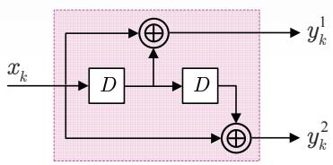  
(ก)

  
(ข)

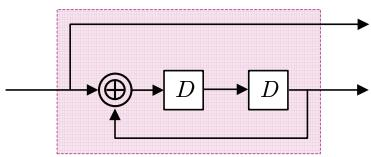  
(ค)  
รูปที่ 2.1 (ก) วงจรเข้ารหัสคอนโวลูชัน, (ข) วงจรเข้ารหัสคอนโวลูชันแบบมีระบบ, และ (ค) วงจรเข้ารหัส คอนโวลูชันแบบมีระบบเวียนเกิด

เมื่อ  คือตัวดำเนินการบวกแบบมอดุโลสอง, $G _ { 1 } ( D )$ คือพหุนามตัวกำเนิดของข้อมูลเอาต์พุต $y _ { k } ^ { 1 }$ $G _ { 2 } ( D )$ คือพหุนามตัวกำเนิดของข้อมูลเอาต์พุต $y _ { k } ^ { 2 }$ , และมีหน่วยความจำ $\mu = 2$ หน่วย

นอกจากนี้วงจรเข้ารหัสคอนโวลูชันแบบมีระบบ (systematic convolนtional encoder) คือวงจรเข้ารหัสคอนโวลูชันที่ทำให้ข้อมูลเอาต์พุตหนึ่งชุดมีค่าเท่ากับข้อมูลอินพุต ตามที่แสดงใน รูปที่ 2.1 (ข) ซึ่งมีพหุนามตัวกำเนิดคือ[1, $1 \oplus D ^ { 2 } \Big ]$ สำหรับวงจรเข้ารหัสคอนโวลูชันแบบมีระบบ ที่มีการป้อนกลับด้วยจะเรียกว่าวงจรเข้ารหัสคอนโวลูชันแบบมีระบบเวียนเกิด (recursive systematic convolนtional encoder) ตามรูปที่ 2.1 (ค) ซึ่งมีพหุนามตัวกำเนิดคือ $\left[ 1 , 1 / \left( 1 \oplus D ^ { 2 } \right) \right]$ โดยทั่วไป วงจรเข้ารหัสคอนโวลูชันแบบมีระบบเวียนเกิดจะเป็นที่นิยมใช้งานมากกว่าวงจรเข้ารหัสคอนโวลูชัน แบบอื่นๆ [2]

โดยทั่วไปการวิเคราะห์รหัสคอนโวลูชันจะอาศัยเครื่องสถานะจำกัด (FSM: finite state machine) ซึ่งเป็นแบบจำลองที่แสดงให้เห็นถึงการเปลี่ยนแปลงของข้อมูลอินพุต, สถานะเริ่มต้น (start state), สถานะต่อไป (next state), และข้อมูลเอาต์พุต ของระบบ (ศึกษารายละเอียดได้ใน หัวข้อที่ 4.3.1 ของ [10]) รูปที่ 2.2 (ซ้าย) แสดงเครื่องสถานะจำกัดของวงจรเข้ารหัสคอนโวลูชัน ในรูปที่ 2.1 (n) ซึ่งมีทั้งหมด $2 ^ { \mu } = 4$ สถานะคือ 00, 01, 10 และ 11 โดยที่เส้นลูกศรจะแสดง เส้นทางการเปลี่ยนสถานะ และค่า $x / y ^ { 1 } y ^ { 2 }$ ที่อยูติดกับเส้นลูกศรจะใช้แทนค่าข้อมูลอินพุตบิต x และข้อมูลเอาต์พุตบิต $y ^ { 1 }$ และ $y ^ { 2 }$ นอกจากนี้แผนภาพเทรลลิส (trellis diagram) ซึ่งใช้แสดงการ เปลี่ยนสถานะในแต่ละช่วงเวลาก็สามารถใช้อธิบายการทำงานของรหัสคอนโวลูชันได้เช่นกัน รูปที 2.2 (ขวา) แสดงแผนภาพเทรลลิสของวงจรเข้ารหัสคอนโวลูชันในรูปที่ 2.1 (ก) นั้นคือแผนภาพ เทรลลิสในระยะที่ E จะแสดงการเปลี่ยนสถานะที่เป็นไปด้ทั้งหมดของวงจรเข้ารหัสจากสถานะหนึ่ง ณ เวลา k ไปยังอีกสถานะหนึ่ง ณ เวลา k + 1 โดยค่าที่อยู่ติดกับเส้นลูกศรก็คือค่า $x / y ^ { 1 } y ^ { 2 }$ ที่อยู่ ในเครื่องสถานะจำกัดนั้นเอง เนื่องจากเส้นทาง (pลth) ที่เดินไปตามแผนภาพเทรลลิสจะหมายถึง ชุดของเส้นสาขา (branch) ที่ประกอบด้วยหนึ่งเส้นสาขาต่อหนึ่งระยะ ดังนั้นคำรหัส (codeword) ทุกคำ (หรือข้อมูลเอาต์พุตของวงจรเข้ารหัสคอนโวลูชัน) จะต้องสอดคล้องกับเส้นทางที่เป็นได้เพียง หนึ่งเดียว (unique path) ในแผนภาพเทรลลิส (ดูรูปที่ 2.5)

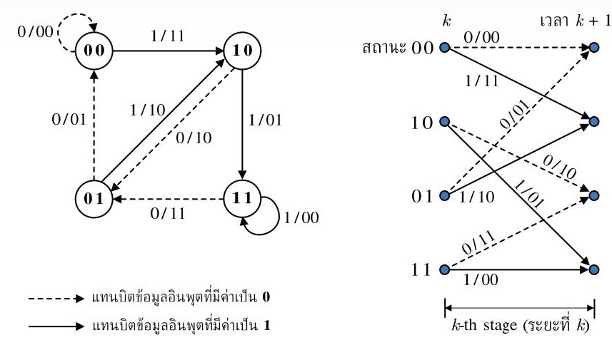  
รูปที่ 2.2 แผนภาพเครื่องสถานะจำกัดและแผนภาพเทรลลิสของรูปที่ 2.1 (ก)

ตัวอย่างที่ 2.1 จงแสดงขั้นตอนการเข้ารหัสของวงจร   
เข้ารหัสคอนโวลูชันในรูปที่ 2.1 (ก) เมื่อบิตข้อมูล   
อินพุตคือ {x0, x1, x2, x3} = {1 0 1 1 }

วิธีทำ รูปที่ 2.1 (ก) แสดงใหม่ได้ตามรูปด้านขวามือ   
ซึ่งเมื่อนำบิตข้อมูล $\{ x _ { k } \}$ มาเข้ารหัสด้วยวงจรเข้ารหัส   
คอนโวลูชันจะมีขั้นตอนการทำงานดังนี้

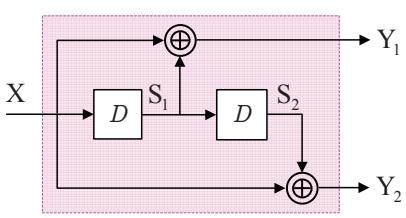

ขั้นที่หนึ่ง กำหนดให้สถานะของเรจิสเตอร์แบบเลื่อนทั้งหมด นั่นคือ $\mathrm { S } _ { 1 }$ และ $\mathrm { S } _ { 2 }$ มีค่าเป็น 0   
(ทำให้เป็นสถานะ 00) โดยขั้นตอนนี้เป็นเพียงการเตรียมความพร้อมของวงจรเข้า   
รหัสและยังไม่มีการป้อนบิตข้อมูลเข้าไป

ขั้นที่สอง เริ่มป้อนบิตแรกซึ่งมีค่าเป็น 1 (นั่นคือ $x _ { 0 } = 1 )$ เข้าสู่วงจร ก็ทำให้ค่า $\mathrm { Y } _ { 1 } = \mathrm { X } \oplus \mathrm { S } _ { 1 }$ = 1  0 = 1 และ $\mathrm { Y } _ { 2 } = \mathrm { X }$ ${ \bf S } _ { 2 } = { \bf \Phi } 1$ 1 0 = 1 ซึ่งคือข้อมูลเอาต์พุตที่ได้จาก การเข้ารหัสของบิตแรกนันเอง

ขั้นที่สาม เริ่มป้อนบิตที่สองซึ่งมีค่าเป็น 0 เข้าสู่วงจร ค่าต่างๆ ในวงจรก็จะเลื่อนไปหนึ่งบิต $\mathbf { S } _ { 1 } = 1$ และ $\mathbf { S } _ { 2 } = \left( \mathbf { \boldsymbol { 0 } } \right)$ ทำให้ค่า $\mathrm { Y } _ { 1 } = \mathrm { X }$ $\mathrm { S } _ { 1 } = 0$ $1 = 1$ และ $\mathrm { Y } _ { 2 } = \mathrm { X } \oplus \mathrm { S } _ { 2 } = 0 \oplus 0 = { \bf 0 }$ ซึ่งคือผลที่ได้จากการเข้ารหัสของบิตที่สอง

ขั้นที่ส่ เริ่มป้อนบิตที่สามซึ่งมีค่าเป็น 1 เข้าสู่วงจร ค่าต่างๆ ในวงจรก็จะเลื่อนไปหนึ่งบิต ทังหมด (ณ เวลานี $\mathbf { S } _ { 1 } = 0$ และ $S _ { 2 } = 1 )$ ทำให้ค่า $\mathrm { Y } _ { 1 } = \mathrm { X } \oplus \mathrm { S } _ { 1 } = 1$ ${ \bf 0 } = { \bf 1 }$ และ $\mathrm { Y } _ { 2 } = \mathrm { X } \oplus \mathrm { S } _ { 2 } = 1 \oplus 1 = { \bf 0 }$ ซึ่งคือผลที่ได้จากการเข้ารหัสของบิตที่สาม

$$
\mathrm { S } _ { 1 } = 1
$$

$$
\mathbf { S } _ { 2 } = \left( \mathbf { \boldsymbol { 0 } } \right)
$$

$$
\mathrm { Y } _ { 1 } = \mathrm { X } \oplus \mathrm { S } _ { 1 } = 1 \oplus 1 = { \bf 0 }
$$

$$
\mathrm { Y } _ { 2 }
$$

$$
\mathbf { \Phi } = \mathbf { X } \oplus \mathbf { S } _ { 2 } = 1 \oplus 0 = \mathbf { 1 }
$$

ขั้นที่หก สังเกตว่าสถานะของวงจรเข้ารหัสคอนโวลูชันไม่ได้กลับไปสู่สถานะเริ่มต้นที่เป็น ศูนย์หมด (ณ ตอนนีอยูในสถานะ 11) ด้วยเหตุนีจึงต้องมีการเตรียมบิตหาง (tail bit) ที่เหมาะสมอีก 2 บิต เพื่อปรับวงจรให้กลับไปสู่สถานะที่ศูนย์ทั้งหมด กระบวน การเข้ารหัสจึงจะเสร็จสมบรณ์

ซั้นสุดท้าย การเลือกค่าของบิตหางมีหลักการง่ายๆ คือให้พิจารณาดูว่าบิตข้อมูลใดที่มีผลทำให้ ค่าในเรจิสเตอร์แบบเลื่อนเป็นศูนย์ทั้งหมด ซึ่งในที่นี้จะได้ว่าให้ป้อนบิด 0 สองบิต เข้าไปในวงจรก็จะทำให้วงจรเข้ารหัสกลับไปสู่สถานะ 00 อีกครั้ง ซึ่งถือว่าสิ้นสุด กระบวนการเข้ารหัส โดยบิตหางตัวแรกจะให้ข้อมูลเอาต์พุตเป็น $\mathrm { Y } _ { 1 } = \mathbf { 1 }$ และ $\mathrm { Y } _ { 2 }$ ${ \bf \mu } = { \bf 1 } { \bf \Lambda }$ ในขณะที่บิตหางตัวที่สองจะให้ข้อมูลเอาต์พุตเป็น $\mathrm { Y } _ { 1 } = \mathbf { 0 }$ และ $\mathrm { Y } _ { 2 } = \mathbf { 1 }$

ตัวอย่างการเข้ารหัสที่ได้อธิบายมานี้แสดงในรูปที่ 2.3 ซึ่งถ้นำมาแสดงในรูปของแผนภาพการเปลี่ยน สถานะก็จะมีลักษณะตามรูปที่ 2.4 หรือถ้านำมาแสดงในรูปของแผนภาพเทรลลิสก็จะมีลักษณะ ตามรูปที่ 2.5 ซึ่งจะเห็นได้ว่ารูปที่ $2 . 3 \textrm { -- } 2 . 5 $ ให้ผลลัพธ์เท่ากัน

นอกจากนี้การเข้ารหัสคอนโวลูชันยังสามารถทำได้โดยใช้การแปลง D (D tranรform) [1] เช่นกัน นั้นคือข้อมูลเอาต์พุตทีได้จากวงจรเข้ารหัสคอนโวลูชันจะมีค่าเท่ากับ

$$
Y _ { i } \left( D \right) = G _ { i } \left( D \right) X \left( D \right)\tag{2.3}
$$

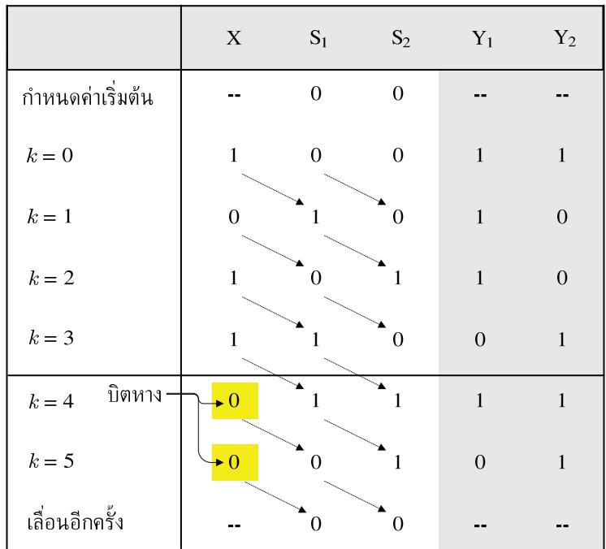  
รูปที่ 23 ขั้นตอนการเข้ารหัสคอนโวลูชันในตัวอย่างที่ 2.1

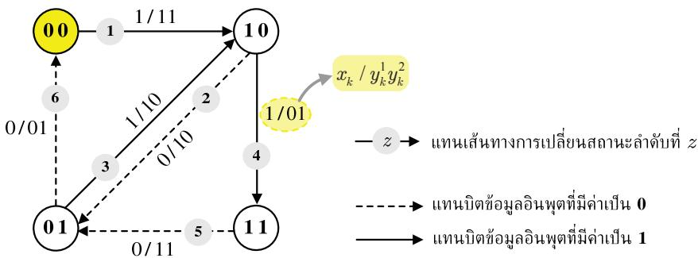  
รูปที่ 2.4 แผนภาพการเปลี่ยนสถานะในตัวอย่างที่ 2.1

เมื่อ $Y _ { i } \left( D \right) = \sum _ { k } y _ { k } ^ { i } D ^ { k }$ คือผลการแปลง D ของข้อมูลเอาต์พุต $y _ { k } ^ { i }$ สำหรับ $i \in \left\{ 1 , 2 \right\} , \ G _ { i } ( D )$ คือพหุนามตัวกำเนิดของข้อมูลเอาต์พุต $y _ { k } ^ { i }$ , และ $X ( D ) = \sum _ { k } x _ { k } D ^ { k }$ คือผลการแปลง D ของ ข้อมูลอินพุต เช่น จากตัวอย่างที่ 2.1 (รูปที่ 2.1 (ก)) จะได้ว่า $X \left( D \right) = 1 + D ^ { 2 } + D ^ { 3 }$ และ $G _ { i } \left( D \right)$ เป็นไปตามสมการ (2.2) ดังนั้นข้อมูลเอาต์พุตที่ได้จากการเข้ารหัสทั้งสองชุด $\left\{ y _ { k } ^ { 1 } , y _ { k } ^ { 2 } \right\}$ มีค่าเท่ากับ

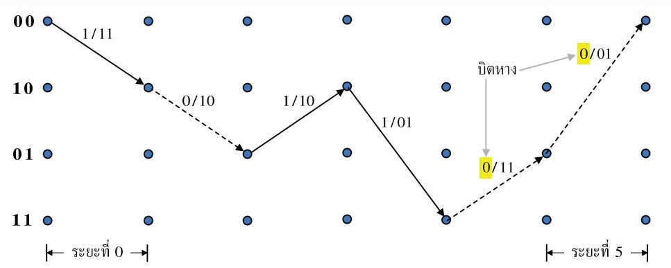  
รูปที่ 2.5 แผนภาพเทรลลิสในตัวอย่างที่ 2.1 (แสดงเส้นทางที่เป็นไปได้เพียงหนึ่งเดียวของคำรหัส)

$$
\begin{array} { c } { { Y _ { 1 } \bigl ( D \bigr ) = G _ { 1 } \bigl ( D \bigr ) X \bigl ( D \bigr ) = \bigl ( 1 \oplus D \bigr ) \bigl ( 1 + D ^ { 2 } + D ^ { 3 } \bigr ) } } \\ { { { } } } \\ { { { } = \bigl ( 1 + D ^ { 2 } + D ^ { 3 } \bigr ) \oplus \bigl ( D + D ^ { 3 } + D ^ { 4 } \bigr ) } } \\ { { { } } } \\ { { { } = 1 + D + D ^ { 2 } + D ^ { 4 } } } \end{array}
$$

$$
\begin{array} { c } { { Y _ { 2 } \left( D \right) = G _ { 2 } \left( D \right) X \left( D \right) = \left( 1 \oplus { D ^ { 2 } } \right) \left( 1 + { D ^ { 2 } } + { D ^ { 3 } } \right) } } \\ { { { } } } \\ { { { } = \left( 1 + D ^ { 2 } + D ^ { 3 } \right) \oplus \left( { D ^ { 2 } } + { D ^ { 4 } } + { D ^ { 5 } } \right) } } \\ { { { } } } \\ { { { } = 1 + D ^ { 3 } + D ^ { 4 } + D ^ { 5 } } } \end{array}
$$

นั่นคือ $\left\{ y _ { 0 } ^ { 1 } , y _ { 1 } ^ { 1 } , y _ { 2 } ^ { 1 } , y _ { 3 } ^ { 1 } , y _ { 4 } ^ { 1 } , y _ { 5 } ^ { 1 } \right\} = \left\{ 1 \ 1 \ 1 \ 0 \ 1 \ 0 \right\}$ และ $\left\{ y _ { 0 } ^ { 2 } , y _ { 1 } ^ { 2 } , y _ { 2 } ^ { 2 } , y _ { 3 } ^ { 2 } , y _ { 4 } ^ { 2 } , y _ { 5 } ^ { 2 } \right\} = \left\{ 1 0 0 1 1 1 \right\}$ ซึ่งตรง กับข้อมูลเอาต์พุตที่ได้ตามรูปที่ 2.3 – 2.5

ตัวอย่างที่ 2.2 พิจารณาวงจรเข้ารหัสคอนโวลูชันในรูปที่ 2.6 ซึ่งมีพหุนามตัวกำเนิดในรูปของเลข จานแปดคือ $( g _ { 1 } , \ g _ { 2 } ) = ( 1 7 , \ 1 1 )$ หรือมีค่าเท่ากับ (001111, 001001) ในเลขฐานสอง โดยที่ $g _ { 1 }$ เรียกว่าพหุนามป้อนกลับ (feedback polynomial) และ $g _ { 2 }$ เรียกว่าพหุนามป้อนข้างหน้า (feedforward polyทomial) หรือในหนังสือบางเล่มอาจแสดงพหุนามตัวกำเนิดในรูปของเศษส่วนใน โดเมน $D$ คือ $\begin{array} { r } { \frac { g _ { 2 } ( D ) } { g _ { 1 } ( D ) } = \frac { 1 + D ^ { 3 } } { 1 + D + D ^ { 2 } + D ^ { 3 } } } \end{array}$ จงแสดงแผนภาพเครืองสถานะจำกัด พร้อมทั้งเข้ารหัสบิตข้อมูล 11011100 (บิตข้อมูลด้านซ้ายสุดคือข้อมูลตัวแรกทีจะถูกเข้ารหัส)

วิธีทำ แผนภาพเครื่องสถานะจำกัดของวงจรเข้ารหัสคอนโวลูชันนี้แสดงในรูปที่ 2.7 สำหรับการ เข้ารหัสบิตข้อมูล 11011100 ให้ทำตามขั้นตอนต่างๆ คล้ายกับตัวอย่างที่ 2.1 นั้นคือเริ่มต้นจะ กำหนดให้สถานะของเรจิสเตอร์แบบเลื่อนทั้งหมดมีค่าเป็น 0 จากนั้นก็ทำการป้อนข้อมูลเข้าไปใน วงจรทีละบิต แล้วคำนวณหาข้อมูลเอาต์พุตของวงจรเข้ารหัสทีละตัว เมื่อป้อนบิตข้อมูลอินพุตเข้า ไปในวงจรเข้ารหัสครบแล้ว ก็ให้ป้อนบิตหางอีกจำนวนหนึ่งจนกระทั่งทำให้เรจิสเตอร์แบบเลื่อน ทั้งหมดมีค่าเป็น 0 เหมือนเดิม

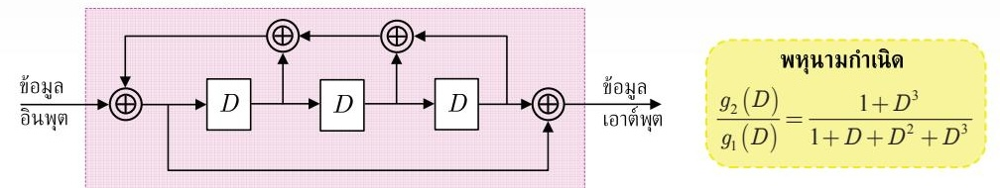  
รูปที่ 2.6 วงจรเข้ารหัสคอนโวลูชั้นที่มีพหุนามตัวกำเนิดในรูปของเลขฐานแปดคือ (91, 92) = (17, 11)

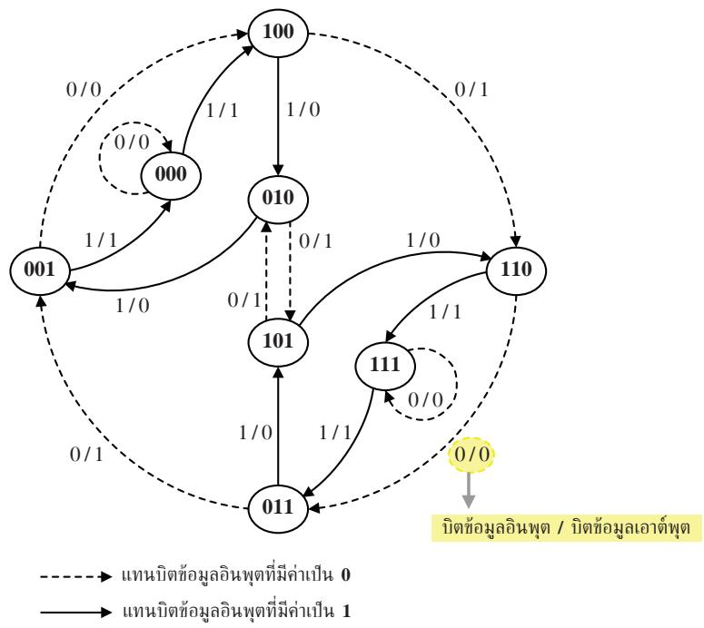  
รูปที่ 2.7 แผนภาพเครื่องสถานะจำกัด (FรM) ของวงจรเข้ารหัสคอนโวลูชันในรูปที่ 2.6

หากทำถูกต้องจะได้ว่าบิตหางที่ต้องป้อนเข้าไปในวงจรเข้ารหัสคือ 111 และผลลัพธ์ที่ได้ จากการเข้ารหัสคือ 10101110001

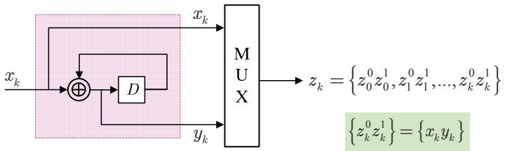  
(ก) วงจรเข้ารหัสคอนโวลูชัน

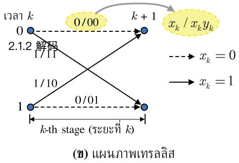  
รูปที่ 2.8 (ก) วงจรเข้ารหัสคอนโวลูชัน และ (ข) แผนภาพเทรลลิส

## 2.1.2 การถอดรหัส

ในทางปฏิบัติข้อมูลที่ถูกเข้ารหัสด้วยรหัสคอนโวลูชันสามารถทำการถอดรหัสข้อมูลได้ด้วยวงจร ถอดรหัสที่สร้างจากอัลกอริทีมวีเทอร์บิ [13] หรือที่เรียกว่าวงจรตรวจหาวีเทอร์บิ ในที่นี้จะแสดง ตัวอย่างการถอดรหัสข้อมูลที่ถูกเข้ารหัสด้วยรหัสคอนโวลูชันดังต่อไปนี้

ตัวอย่างที่ 2.3 พิจารณาวงจรเข้ารหัสคอนโวลูชันในรูปที่ 2.8 (ก) ซึ่งมีแผนภาพเทรลลิสตามรูปที่ 2.8 (ข) ถ้าสมมุติว่าลำดับข้อมูล $z _ { k }$ คือสิ่งที่วงจรถอดรหัสต้องการถอดรหัสข้อมูล จงถอดรหัสลำดับ ข้อมูล $z _ { k } = \{ 1 1 ~ 0 1 ~ 1 0 ~ 1 1 ~ 0 0 \}$

วิธีทำกำหนดให้ $( u , \ q )$ แทนการเปลี่ยนสถานะจากสถานะ น ไปสถานะ q และเมตริกสาขา (branch metric) ณ ระยะที่k นิยามโดย

$$
\rho _ { k } \left( u , q \right) = \left| z _ { k } ^ { 0 } - \tilde { x } _ { k } \left( u , q \right) \right| ^ { 2 } + \left| z _ { k } ^ { 1 } - \tilde { y } _ { k } \left( u , q \right) \right| ^ { 2 }
$$

โดยที่ $\tilde { x } _ { k } \left( u , q \right)$ และ $\tilde { y } _ { k } \left( u , q \right)$ คือบิตข้อมูล $x _ { k }$ และ $y _ { k }$ ที่สอดคล้องกับการเปลียนสถานะ $( u , \ q )$ aซ นอกจากนีกำหนดให้เมตริกเส้นทาง (path metric) ณ สถานะ $q$ ที่เวลา $k + 1$ จะนิยามโดย

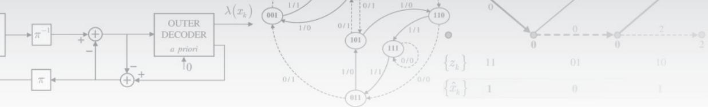

  
รูปที่ 2.9 แผนภาพเทรลลิสแสดงการการถอดรหัสข้อมูล $z _ { k } = \{ 1 1 ~ 0 1 ~ 1 0 ~ 1 1 ~ 0 0 \}$

$$
\Phi _ { k + 1 } \left( q \right) = \operatorname* { m i n } _ { u } \left\{ \Phi _ { k } \left( u \right) + \rho _ { k } \left( u , q \right) \right\}
$$

ดังนันขันตอนการถอดรหัสของวงจรตรวจหาวีเทอร์บิสรุปได้ดังนี้ O 2 6๑ บ น รู

1) สำหรับแต่ละระยะที่   
สำหรับแต่ละสถานะ q   
คำนวณหาค่าเมตริกสาขา $\rho _ { k } \left( u , q \right)$ ของทุกเส้นสาขาที่มาถึงสถานะ q   
เลือกเส้นสาขาที่มีค่าเมตริกเส้นทางน้อยสุด   
ปรับปรุงค่าเมตริกเส้นทางของสถานะ q ที่เวลา $k + 1$ นั่นคือ $\Phi _ { k + 1 } \left( q \right)$   
(ทำซ้ำจนครบทุกสถานะ q)   
(ทำซ้ำจนครบทุกระยะที่ k)   
2) ถอดรหัสข้อมูลอินพุต $x _ { k }$ จากเส้นทางที่มีเมตริกเส้นทางน้อยสุด

รูปที่ 2.9 แสดงขั้นตอนการถอดรหัสข้อมูลตามแผนภาพเทรลลิส ซึ่งจะแสดงเฉพาะเส้นทางที่ยังมี ซีวิตอยู่(ธนrvivor path) ที่มาถึงแต่ละสถานะ โดยค่าที่อยูติดกับแต่ละเส้นสาขาคือค่าเมตริกสาขา $\rho _ { k } \left( u , q \right)$ ที่สอดคล้องกับการเปลี่ยนสถานะ (u, q) นั้นๆ และตัวเลขที่อยู่ตรงโหนดของแต่ละสถานะ คือค่าเมตริกเส้นทาง $\Phi _ { k } \left( q \right)$ จากรูปจะได้ว่าวงจรถอดรหัสคอนโวลูชันจะให้ค่าประมาณของบิตข้อมูล อินพุต $x _ { k }$ เป็น $\hat { x } _ { k } = \left\{ 1 , 0 , 1 , 1 \right\}$ สำหรับรายละเอียดขั้นตอนการถอดรหัสข้อมูลของวงจรตรวจหา วีเทอร์บิสามารถศึกษาได้ในบทที่ 4 ของ [10]

อย่างไรก็ตามถ้านำรหัสคอนโวลูชันมาใช้เป็นส่วนประกอบในรหัสเทอร์โบ ก็จะไม่สามารถ ใช้วงจรตรวจหาวีเทอร์บิในวงจรถอดรหัสเทอร์โบได้ เพราะวงจรถอดรหัสเทอร์โบทำงานโดยใช้ข่าวสาร แบบซอฟต์ของบิตข้อมูลเท่านั้น (แต่วงจรตรวจหาวีเทอร์บิจะให้ผลลัพธ์เป็นข่าวสารแบบฮาร์ดหรือ ค่าประมาณของบิตข้อมูล) ดังนั้นวงจรถอดรหัสเทอร์โบที่ใช้ถอดรหัสข้อมูลที่ถูกเข้ารหัสด้วยรหัส คอนโวลูชันจะต้องเป็นวงจรตรวจหาที่สร้างจากอัลกอริทึม BCJR [18] หรือ S0VA (soft-output Viterbi algorithm) [19] เท่านั้น ซึงจะอธิบายต่อไปในหัวข้อที่ 2.2 และบทที่3 ตามลำดับ

## 2.2 อัลกอริทึม BCJR

วงจรตรวจหาวีเทอร์บิ [1, 13] คือวงจรตรวจหาแบบควรจะเป็นสูงสุดหรือวงจรตรวจหาแบบ ML (maximum-likelihood) ที่ใช้ในการถอดรหัสข้อมูลที่ถูกเข้ารหัสด้วยรหัสคอนโวลูชัน โดยข้อมูล เอาต์พุตที่ได้จะเป็นค่าประมาณของลำดับข้อมูลที่ต้องการตรวจหา หรืออาจกล่าวได้ว่าวงจรตรวจหา แบบ ML จะทำให้ข้อผิดพลาดของลำดับข้อมูลมีค่าน้อยสุด แต่ไม่ได้รับประกันว่าบิตข้อมูลแต่ละบิต ที่อยูในลำดับข้อมูลนั้นเป็นบิตข้อมูลที่ดีที่สุด นั้นคือวงจรตรวจหาแบบ ML ไม่ได้ทำให้บิตข้อมูล แต่ละบิตมีข้อผิดพลาดน้อยสุด

นอกจากนี้วงจรตรวจหาวีเทอร์บิไม่สามารถนำมาใช้ในระบบถอดรหัสข้อมูลแบบวนซ้ำได้ เพราะระบบนีจะมีการแลกเปลี่ยนข่าวสารแบบซอฟต์ระหว่างวงจรตรวจหาและวงจรถอดรหัสแก้ไข ข้อผิดพลาด ดังนั้นระบบถอดรหัสข้อมูลแบบวนซ้ำจะต้องใช้วงจรตรวจหาความน่าจะเป็นอะโพส เทอริออริสูงสุดหรือเรียกว่า "วงจรตรวจหาแบบ MAP (maximum a posterioriprobability)" โดยวงจรตรวจหาแบบ MAP สามารถรับประกันได้ว่าบิตข้อมูลแต่ละบิตที่ตรวจหาได้เป็นบิตข้อมูล ที่ดีที่สุด (หรือบิตข้อมูลแต่ละบิตมีข้อผิดพลาดน้อยสุด)

ในส่วนนี้จะอธิบายหลักการทำงานของอัลกอริทึม BCJR [18] เพราะเป็นอัลกอริทึมที่ใช้ ในการสร้างวงจรตรวจหาแบบ MAP ซึ่งอัลกอริทึมนี้ได้ถูกคิดค้นและพัฒนาขึ้นโดย Bah1, Cock, Jelinek, และ Raviv เพื่อใช้ในการตรวจหาค่าความน่าจะเป็นอะโพสเทอริออริ (APP: a posteriori probabiปity) สูงสุดของสัญญาณที่ผ่านช่องสัญญาณที่มีการแทรกสอดระหว่างสัญลักษณ์(ISI) และมีสัญญาณรบกวนเกาส์สีขาวแบบบวก (AพGN)

## 2.2.1 แบบจำลองของช่องสัญญาณและแผนภาพเทรลลิส

พิจารณาแบบจำลองของช่องสัญญาณในรูปที่ 2.10 เมื่อสัญญาณที่วงจรภาครับได้รับ (หรือสัญญาณ ที่ต้องการถอดรหัส) ลำดับที่k คือ

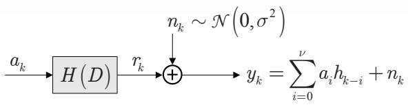  
รูปที่ 2.10 แบบจำลองช่องสัญญาณ

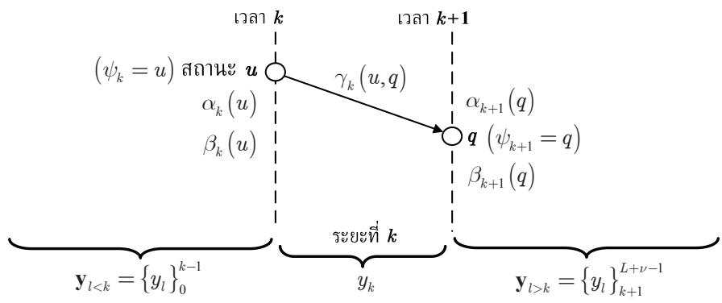  
รูปที่ 2.11 การเปลี่ยนสถานะ (u, q) ในระยะที่ k ของแผนภาพเทรลลิส

$$
y _ { k } = \sum _ { i = 0 } ^ { \nu } a _ { i } h _ { k - i } + n _ { k }\tag{2.4}
$$

เมื่อ $a _ { k } \in { \mathcal { A } }$ คือข้อมูลอินพุตบิตที่ถูกเลือกมาจากเซตของชุดตัวอักษร $\mathcal { A }$ (เช่น ระบบไบนารีจะได้ $\mathcal { A } = \{ 0 , \ 1 \}$ หรือ $\{ - 1 , \ 1 \} )$ - $H ( D ) = \sum _ { k = 0 } ^ { \nu } h _ { k } D ^ { k }$ คือช่องสัญญาณที่ไม่ต่อเนื่อง (discrete channel), $h _ { k }$ คือค่าสัมประสิทธิ์ตัวที่ k ของช่องสัญญาณ, ν คือหน่วยความจำของช่องสัญญาณ, $n _ { k }$ คือ AพGN ที่มีค่าเฉลี่ยเท่ากับศูนย์และความแปรปรวนเท่ากับ $\sigma ^ { 2 }$ หรือเขียนแทนด้วย $n _ { k } \sim$ $\mathcal { N } \big ( 0 , 0 ^ { 2 } \big )$ 2 $r _ { k }$ คือข้อมูลเอาต์พุตของช่องสัญญาณ, และ L คือความยาวของลำดับข้อมูลอินพุต $\{ a _ { k } \}$ โดยทั่วไปข้อมูลหนึ่งเซกเตอร์จะมี L = 4096 บิต ถ้าสมมติว่าวงจรภาคส่งได้ทำการส่งลำดับ ข้อมูลอินพุต $\mathbf { a } = \left[ a _ { 0 } , . . . , a _ { L - 1 } \right]$ จำนวน L บิต โดยบิตข้อมูลแต่ละบิตมีค่าที่เป็นไปได้อยู่ภายใน เซต A และไม่มีการส่งข้อมูลใดๆ ในช่วงเวลาที $k < 0$ และ $k > L - 1$ ดังนันจากสมการ (2.4) สัญญาณที่วงจรภาครับได้รับทั้งหมดในรูปของเวกเตอร์คือ $\mathbf { y } = \left\{ y _ { l } \right\} _ { 0 } ^ { L + \nu - 1 } = \left[ y _ { 0 } , . . . , y _ { L + \nu - 1 } \right]$

รูปที่ 2.11 แสดงแผนภาพเทรลลิสของช่องสัญญาณ $h _ { k }$ เมื่อ $\Psi _ { k } \equiv \left[ a _ { k - 1 } , a _ { k - 2 } , . . . , a _ { k - \nu } \right]$ คือสถานะ (state) ณ เวลา k (หรือค่าที่อยู่ในเรจิสเตอร์แบบเลื่อนทั้งหมด ณ เวลา k), $Q = \left| \mathcal { A } \right| ^ { \nu }$ คือจำนวนสถานะทั้งหมดที่เป็นไปได้, ระยะที่k (k-th stage) คือกลุ่มของเส้นสาขา (branch) ที เป็นไปได้ทั้งหมดระหว่างเวลา k และเวลา $k + 1$ , และ $( u , \ q )$ คือสัญลักษณ์ที่ใช้แทนการเปลี่ยน สถานะ (traทร์tiท) จากสถานะ น ไปยังสถานะ q ถ้าให้สถานะแต่ละสถานะคือสถานะ 0 ถึงสถานะ $Q - 1$ โดยที่สถานะ 0 หรือ $\psi _ { k } \equiv \left[ 0 , 0 , . . . , 0 \right]$ จะใช้แทนสถานะว่างเปล่า (idle state) สำหรับ $k \leq 0$ และ $k \geq L + \nu - 1$ ดังนั้นอาจกล่าวได้ว่ารูปที่ 2.11 แสดงระยะที่ k ของแผนภาพเทรลลิสซึ่ง สอดคล้องกับบิตข้อมูลอินพุตลำดับที่ k (หรือ $a _ { k } )$ , ข้อมูลเอาต์พุตของช่องสัญญาณลำดับที่k (หรือ $r _ { k } ) .$ และข้อมูลที่วงจรภาครับได้รับลำดับที่ k (หรือ $y _ { k } )$

## 2.2.2 วงจรตรวจหาเหมาะที่สุด

ในทางปฏิบัติวงจรตรวจหาแบบ MAP ถือว่าเป็นวงจรตรวจหาเหมาะที่สุด (optimลl detector) เพราะเป็นวงจรตรวจหาข้อมูลที่สามารถรับประกันได้ว่าความน่าจะเป็นของข้อผิดพลาดของบิตข้อมูล แต่ละบิตมีค่าน้อยสุด ตัวอย่างเช่น ในการตัดสินใจบิตข้อมูลลำดับที่k (หรือ $a _ { k } )$ วงจรตรวจหาแบบ MAP จะคำนวณหาค่าความน่าจะเป็นอะโพสเทอริออริ (APP) หรือ $\operatorname* { P r } \left[ a _ { k } \mid \mathbf { y } \right]$ ซึ่งหมายถึงค่า ความน่าจะเป็นของบิตข้อมูล $a _ { k }$ เมื่อกำหนดลำดับข้อมูล y มาให้ สำหรับแต่ละบิตข้อมูล $a _ { k }$ จากนั้น จะเลือกค่า $a _ { k }$ ที่ทำให้ $\operatorname* { P r } \left[ a _ { k } \mid \mathbf { y } \right]$ มีค่าสงสุด วงจรตรวจหาแบบ MAP จะดำเนินการลักษณะนี้ไป เรื่อยๆ จนครบข้อมูล L บิต ในทางปฏิบัติค่า $\operatorname { P r } [ a _ { k } \mid \mathbf { y } ]$ คำนวณได้โดยง่าย ถ้าทราบค่าความน่าจะ เป็นของการเปลี่ยนสถานะแบบอะโพสเทอริออริ $\operatorname* { P r } [ \psi _ { k } = u ; \Psi _ { k + 1 } = q \mid \mathbf { y } ]$ สำหรับทุกการเปลี่ยน สถานะ $( u , \ q )$ ในแผนภาพเทรลลิส

อัลกอริทึม BCเR ถือเป็นขั้นตอนวิธีที่มีประสิทธิภาพมากในการหาค่าความน่าจะเป็นของ การเปลี่ยนสถานะแบบอะโพสเทอริออริ ซึ่งทำได้ง่ายโดยการจัดรูป $\operatorname* { P r } [ \psi _ { k } = u ; \Psi _ { k + 1 } = q \mid \mathbf { y } ]$ สำหรับการเปลี่ยนสถานะ ณ เวลา 6 ออกเป็น 3 ส่วนดังนี้

1) ส่วนที่หนึ่งขึ้นอยู่กับข้อมูลทีได้รับทั้งหมดในอดีต นันคือ มื่ซ้ $\mathbf { y } _ { l < k } = \{ y _ { l } ; l < k \} = \{ y _ { l } \} _ { 0 } ^ { k - 1 }$

2) ส่วนที่สองขึ้นอยู่กับข้อมูลที่ได้ับในปัจจุัน นันคือ $y _ { k }$

3) ส่วนที่สามขึ้นอยู่กับข้อมูลที่ได้รับทั้งหมดในอนาคต นั่นคือ ${ \bf y } _ { l > k } = \left\{ y _ { l } ; l > k \right\} = \left\{ y _ { l } \right\} _ { k + 1 } ^ { L + \nu - 1 }$

จากกฎของเบส์ (Bayes'rule) ค่า $\operatorname* { P r } [ \psi _ { k } = u ; \psi _ { k + 1 } = q \mid \mathbf { y } ]$ จัดรูปใหม่ได้เป็น

$$
\begin{array} { r l } & { \mathrm { P r } \big [ \boldsymbol { \Psi } _ { k } = u ; \boldsymbol { \Psi } _ { k + 1 } = q \mid \mathbf { y } \big ] = p \big ( \boldsymbol { \Psi } _ { k } = u ; \boldsymbol { \Psi } _ { k + 1 } = q ; \mathbf { y } \big ) / p \big ( \mathbf { y } \big ) } \\ & { \quad \quad \quad = p \big ( \boldsymbol { \Psi } _ { k } = u ; \boldsymbol { \Psi } _ { k + 1 } = q ; \mathbf { y } _ { l < k } ; \boldsymbol { y } _ { k } ; \mathbf { y } _ { l > k } \big ) / p \big ( \mathbf { y } \big ) } \\ & { \quad \quad \quad = p \big ( \mathbf { y } _ { l > k } | \boldsymbol { \Psi } _ { k } = u ; \boldsymbol { \Psi } _ { k + 1 } = q ; \mathbf { y } _ { l < k } ; \boldsymbol { y } _ { k } \big ) p \big ( \boldsymbol { \Psi } _ { k } = u ; \boldsymbol { \Psi } _ { k + 1 } = q ; \mathbf { y } _ { l < k } ; \boldsymbol { y } _ { k } \big ) / p \big ( \mathbf { y } \big ) } \end{array}\tag{2.5}
$$

เมื่อ $p ( x )$ คือฟังก์ชันความหนาแน่นความน่าจะเป็น (pdf: probability density function) ของ x จากคุณสมบัติของมาร์คอฟ(Markov property) [4] ของแบบจำลองเครืองสถานะจำกัดซึงกล่าวว่า สำหรับช่องสัญญาณใดๆ ข่าวสารเกี่ยวกับข้อมูลของสถานะที่เวลา $k + 1$ จะเข้ามาแทนที่ข่าวสาร เกียวกับข้อมูลของสถานะที่เวลา k รวมทั้งค่า $y _ { k }$ และ $\mathbf { y } _ { l < k }$ ดังนั้นสมการ (2.5) ลดรูปได้เป็น

$$
\begin{array} { r l r } {  { \operatorname* { P r } \bigl [ \boldsymbol { \psi } _ { k } = u ; \boldsymbol { \psi } _ { k + 1 } = q \mid \mathbf { y } \bigr ] = p \bigl ( \mathbf { y } _ { l > k } | \boldsymbol { \psi } _ { k + 1 } = q \bigr ) p \bigl ( \boldsymbol { \psi } _ { k } = u ; \boldsymbol { \psi } _ { k + 1 } = q ; \mathbf { y } _ { l < k } ; y _ { k } \bigr ) / p \bigl ( \mathbf { y } \bigr ) } } \\ & { } & \\ & { } & { = p \bigl ( \mathbf { y } _ { l > k } | \psi _ { k + 1 } = q \bigr ) p \bigl ( \psi _ { k + 1 } = q ; y _ { k } \mid \boldsymbol { \psi } _ { k } = u ; \mathbf { y } _ { l < k } \bigr ) p \bigl ( \boldsymbol { \psi } _ { k } = u ; \mathbf { y } _ { l < k } \bigr ) / p \bigl ( \mathbf { y } \bigr ) \quad \mathrm { ~ ( ~ s ~ o ~ n ~ ) ~ } } \end{array}\tag{2.6}
$$

ในทำนองเดียวกันอาศัยคุณสมบัติของมาร์คอฟเพื่อจัดรูปสมการ (2.6) ก็จะได้เป็น

$$
\begin{array} { l } { { \displaystyle \mathsf { P r } \big [ \boldsymbol { \Psi } _ { k } = u ; \boldsymbol { \Psi } _ { k + 1 } = q | \mathbf { y } \big ] = \frac { p \big ( \boldsymbol { \Psi } _ { k } = u ; \mathbf { y } _ { l < k } \big ) p \big ( \boldsymbol { \Psi } _ { k + 1 } = q ; y _ { k } \mid \boldsymbol { \Psi } _ { k } = u \big ) p \big ( \mathbf { y } _ { l > k } | \boldsymbol { \Psi } _ { k + 1 } = q \big ) } { p \big ( \mathbf { y } \big ) } \qquad } } \\ { { \displaystyle \mathsf { P r } \big [ \boldsymbol { \Psi } \big ] } } \\ { { \displaystyle \qquad = \alpha _ { k } \big ( u \big ) \times \gamma _ { k } \big ( \boldsymbol { u } , q \big ) \times \beta _ { k + 1 } \big ( q \big ) / \begin{array} { l } { p } \end{array} } } \end{array}\tag{.7}
$$

ซึ่งจะเห็นได้ว่าพารามิเตอร์ $\alpha _ { k } \left( u \right)$ คือค่าความน่าจะเป็นสำหรับสถานะ น ณ เวลา k ซึ่งขึ้นอยู่กับ ข้อมูลที่ได้รับในอดีต $\mathbf { y } _ { l < k }$ ,พารามิเตอร์ $\beta _ { k + 1 } \left( q \right)$ คือค่าความน่าจะเป็นสำหรับสถานะ $q$ ณ เวลา $k + 1$ ซึ่งขึนอยูกับขอมูลที่ไ้รับในอนาคต $\mathbf { r } _ { l > k }$ ,และพารามิเตอร์ $\Upsilon _ { k } \left( u , q \right)$ คือค่าความน่าจะเป็น ของการเปลี่ยนสถานะจากสถานะ น เวลา k ไปยังสถานะ $q$ เวลา $k + 1$ ซึ่งขึ้นอยู่กับข้อมูลใน ปัจจุบัน yะ (ดูพารามิเตอร์ต่างๆ ในรูปที่ 2.11) โดยทั่วไปพารามิเตอร์ $y _ { k }$ $\alpha _ { k } \left( u \right)$ และ $\beta _ { k + 1 } \left( q \right)$ เรียกว่า เมตริกสถานะ (state metric) และพารามิเตอร์ $\Upsilon _ { k } \left( u , q \right)$ เรียกว่าเมตริกสาขา (branch metric)

ถ้ากำหนดให้ $S _ { a }$ คือเซตของการเปลี่ยนสถานะ $( u , \ q )$ ที่เป็นไปได้ทั้งหมดที่สอดคล้องกับ บิตข้อมูล a ดังนั้นค่าความน่าจะเป็นอะโพสเทอริออริ $\operatorname* { P r } [ a _ { k } = a \mid \mathbf { y } ]$ หาได้จาก

$$
\operatorname* { P r } \ [ a _ { k } = a \mid \mathbf { y } ] = \sum _ { ( u , q ) \in S _ { a } } \operatorname* { P r } [ \Psi _ { k } = u ; \Psi _ { k + 1 } = q \mid \mathbf { y } ]
$$

$$
= \frac { 1 } { p \left( \mathbf { y } \right) } \sum _ { \left( u , q \right) \in S _ { a } } \alpha _ { k } \left( u \right) \gamma _ { k } \left( u , q \right) \beta _ { k + 1 } \left( q \right)\tag{2.8}
$$

สมการ (2.8) หาได้ง่าย เมื่อทราบค่า $\alpha _ { k } \left( u \right) , \gamma _ { k } \left( u , q \right)$ และ $\beta _ { k + 1 } \left( q \right)$ สำหรับทุกการเปลี่ยนสถานะ $\left( u , q \right)$ และทุกระยะที่

## 2.2.3 การคำนวณหาค่าพารามิเตอร์ของอัลกอริทึม BCJR

พารามิเตอร์ของอัลกอริทึม BCJR ตามสมการ (2.8) นันคือ $\gamma _ { k } \left( u , q \right) , \ \alpha _ { k } \left( u \right) , \ \beta _ { k + 1 } \left( q \right)$ และ $p ( \mathbf { y } )$ สามารถคำนวณหาได้ดังนี้

## การหาค่าเมตริกสาขา $\Upsilon _ { k } \left( u , q \right)$ สำหรับช่องสัญญาณ AพGN

อัลกอริทึม BCJR จะแตกต่างจากอัลกอริทึมวีเทอร์บิ [13] ตรงที่ว่าอัลกอริทึม BCJR จะทำการ คำนวณสองเส้นทางคือ

1) เส้นทางข้างหน้า (forพard pass) โดยเริ่มคำนวณค่าต่างๆ ตั้งแต่ข้อมูลทีได้รับตัวแรกไปข้างหน้า จนถึงข้อมูลตัวสุดท้าย

2) เส้นทางย้อนกลับ (backward pass) โดยเริ่มคำนวณค่าต่างๆ ตั้งแต่ข้อมูลที่ได้รับตัวสุดท้าย ย้อนกลับมาจนถึงข้อมูลตัวแรก

นอกจากนีเมตริกสาขาของอัลกอริทึม BตJR คำนวณได้จาก

$$
\begin{array} { r l } & { \gamma _ { k } \left( u , q \right) = p \left( \psi _ { k + 1 } = q ; \ y _ { k } \mid \psi _ { k } = u \right) } \\ & { \qquad = p \left( y _ { k } \mid \psi _ { k } = u ; \ \psi _ { k + 1 } = q \right) p \left( \psi _ { k + 1 } = q \mid \psi _ { k } = u \right) } \end{array}\tag{2.9}
$$

สำหรับช่องสัญญาณแบบ AพGN สัญญาณที่ได้รับคือ $y _ { k } = r _ { k } + n _ { k }$ เมื่อ $n _ { k } \sim \mathcal N \left( 0 , \sigma ^ { 2 } \right)$ คือ สัญญาณรบกวนเกาส์สีขาวแบบบวก ถ้ากำหนดให้ $\hat { a } \left( u , q \right)$ และ $\hat { r } ( u , q )$ คือบิตข้อมูลอินพุตและ ข้อมูลเอาต์พุตของช่องสัญญาณที่สอดคล้องกับการเปลี่ยนสถานะ $\left( u , q \right)$ ตามลำดับ ดังนันพจน์ แรกทางขวามือของสมการ (2.9) มีค่าเท่ากับ

$$
p \left( \boldsymbol { y } _ { k } \mid \boldsymbol { \Psi } _ { k } = \boldsymbol { u } ; \boldsymbol { \Psi } _ { k + 1 } = \boldsymbol { q } \right) = \frac { 1 } { \sqrt { 2 \pi \sigma ^ { 2 } } } \exp \left\{ \frac { - 1 } { 2 \sigma ^ { 2 } } { \left| \boldsymbol { y } _ { k } - \boldsymbol { \hat { r } } \left( \boldsymbol { u } , \boldsymbol { q } \right) \right| } ^ { 2 } \right\}\tag{2.10}
$$

เมื่อ exp(.) คือฟังก์ชันเลขชี้กำลัง (exponential function) และพจน์ที่สองทางขวามือของสมการ (2.9) คือ

$$
\begin{array} { r l r } {  { p \big ( \psi _ { k + 1 } = q \mid \psi _ { k } = u \big ) = p \big ( a _ { k } = \hat { a } \big ( u , q \big ) ; \psi _ { k } = u \big ) / p \big ( \Psi _ { k } = u \big ) } } \\ & { } & \\ & { } & { = p \big ( \Psi _ { k } = u \mid a _ { k } = \hat { a } \big ( u , q \big ) \big ) p \big ( a _ { k } = \hat { a } \big ( u , q \big ) \big ) / p \big ( \Psi _ { k } = u \big ) } \end{array}
$$

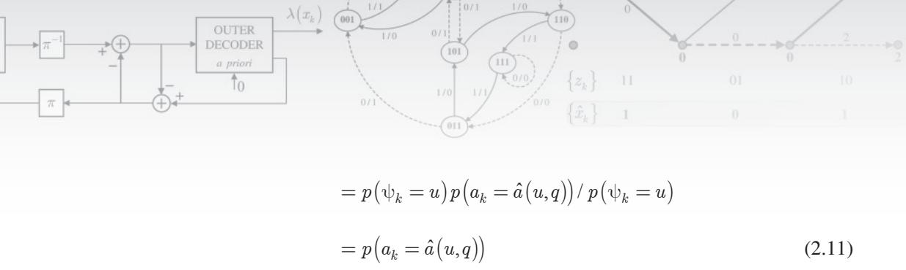

ในทางปฏิบัติค่าความน่าจะเป็นในสมการ (2.11) จะเรียกว่าความน่าจะเป็นอะพิรืออริ (a priori probability) ของบิตข้อมูล $a _ { k }$ จากนั้นแทนค่าสมการ (2.10) และ (2.11) ลงในสมการ (2.9) จะ ได้ว่าเมตริกสาขาของอัลกอริทึม BCJR มีค่าเท่ากับ

$$
\gamma _ { k } \left( u , q \right) = \frac { 1 } { \sqrt { 2 \pi \sigma ^ { 2 } } } \exp \left. \frac { - 1 } { 2 \sigma ^ { 2 } } \left| y _ { k } - \hat { r } \left( u , q \right) \right| ^ { 2 } \right. \times p \left( a _ { k } = \hat { a } \left( u , q \right) \right)\tag{2.12}
$$

ซึ่งจะพบว่าเมตริกสาขาของอัลกอริทึม BCJR มีพจน์ $p \big ( a _ { k } = \hat { a } \big ( u , q \big ) \big )$ เพิ่มขึนมาจากเมตริกสาขา ของอัลกอริทึมวีเทอร์บิ [4] ในกรณีที่บิตข้อมูล $a _ { k }$ ทุกตัวมีโอกาสเกิดขึ้นเท่ากัน ค่าความน่าจะเป็น อะพิริออริ $p ( a _ { k } = a )$ จะเป็นค่าคงตัวที่ไม่ขึ้นกับค่า a ดังนั้นในกรณีนี้เมตริกสาขาของอัลกอริทึม BCJR จะมีค่าเท่ากับเมตริกสาขาของอัลกอริทึมวีเทอร์บิ อย่างไรก็ตามในกรณีที่บิตข้อมูล $a _ { k }$ แต่ ละตัวมีโอกาสเกิดขึ้นไม่เท่ากัน เพราะฉะนั้นถ้าทราบข้อมูลเกี่ยวกับ $a _ { k }$ แต่ละตัวล่วงหน้า ก็จะช่วย ทำให้การถอดรหัสข้อมูลมีความถูกต้องมากยิ่งขึ้น

## การหาค่าเมตริกสถานะ $\alpha _ { k } \left( u \right)$ และ $\beta _ { k + 1 } \left( q \right)$

เมตริกสถานะ $\alpha _ { k } \left( u \right)$ และ $\beta _ { k + 1 } \left( q \right)$ ในสมการ (2.7) คำนวณหาได้ง่ายโดยอาศัยคุณสมบัติของ มาร์คอฟและเทคนิคเวียนเกิด (recนrsive) ดังนี้ จากสมการ (2.7) จะได้ว่า

$$
\alpha _ { k } \left( u \right) = p \left( \psi _ { k } = u ; \ \mathbf { y } _ { l < k } \right)\tag{2.13}
$$

ดังนั้น

$$
\begin{array} { r l } & { \Omega _ { k + 1 } \left( q \right) = p \left( \Psi _ { k + 1 } = q ; \ : y _ { k } , \ : _ { \forall k + 1 } \right) } \\ & { \qquad = p \left( \Psi _ { k + 1 } = q ; \ : y _ { k } ; \ : \mathbf { y } _ { l < k } \right) } \\ & { \qquad = \displaystyle \sum _ { u = 0 } ^ { Q - 1 } p \left( \Psi _ { k + 1 } = q ; \ : y _ { k } ; \ : \Psi _ { k } = u ; \ : \mathbf { y } _ { l < k } \right) } \\ & { \qquad = \displaystyle \sum _ { u = 0 } ^ { Q - 1 } p \left( \Psi _ { k + 1 } = q ; \ : y _ { k } \mid \ : \Psi _ { k } = u ; \ : \mathbf { y } _ { l < k } \right) p \left( \Psi _ { k } = u ; \ : \mathbf { y } _ { l < k } \right) } \end{array}
$$

$$
\begin{array} { l } { { \displaystyle = \sum _ { u = 0 } ^ { Q - 1 } p \big ( \psi _ { k + 1 } = q ; \ y _ { k } \mid \psi _ { k } = u \big ) p \big ( \psi _ { k } = u ; \psi _ { l < k } \big ) } } \\ { { \displaystyle } } \\ { { \displaystyle = \sum _ { u = 0 } ^ { Q - 1 } \gamma _ { k } \big ( u , q \big ) \alpha _ { k } \big ( u \big ) } } \end{array}\tag{2.14}
$$

ในทำนองเดียวกันจากสมการ (2.7) จะได้ว่า

$$
\begin{array} { r } { \beta _ { k + 1 } \left( q \right) = p \left( \mathbf { y } _ { l > k } \mid \psi _ { k + 1 } = q \right) } \end{array}\tag{2.15}
$$

ดังนั้น

$$
\begin{array} { r l r l } & { \beta _ { 2 } ( \gamma ) = \beta _ { 2 } ( \gamma _ { 2 , \pm , \pm , \pm , \pm , \pm , \pm , \pm , \pm , \pm , \pm , \pm , \pm , \pm , \pm , \pm , \pm , \pm , \pm , \pm , \pm , \pm , \pm , \pm , \pm , \pm , \pm ) } } & \\ & { = \gamma ^ { 2 } ( \gamma _ { 2 , \pm , \pm , \pm , \pm , \pm , \pm , \pm , \pm , \pm , \pm , \pm , \pm , \pm , \pm , \pm , \pm , \pm , \pm ) } } & \\ & { = \frac { \beta _ { 2 } \gamma } { \pm \alpha _ { 2 } } \beta _ { 1 , \pm , \pm , \pm , \pm , \pm , \pm , \pm , \pm , \pm , \pm , \pm , \pm , \pm , \pm , \pm } } & \\ & { = \frac { \beta _ { 2 } \gamma } { \pm \alpha _ { 2 } } \beta _ { 1 , \pm , \pm } \beta _ { 2 , \pm , \pm , \pm , \pm , \pm , \pm , \pm , \pm , \pm , \pm , \pm , \pm , \pm , \pm , \pm , \pm , \pm \pm , \pm , \pm \pm , \pm , \pm \pm , \pm \pm , \pm } } & \\ & { = \frac { \beta _ { 2 } \gamma } { \pm \alpha _ { 2 } } \beta _ { 1 , \pm , \pm , \pm , \pm , \pm , \pm , \pm , \pm , \pm , \pm , \pm , \pm , \pm , \pm , \pm , \pm \pm , \pm , \pm \pm , \pm \pm , \pm \pm , \pm \pm , \pm \pm , \pm \pm } } & \\ & { = \frac { \beta _ { 2 } \gamma } { \pm \alpha _ { 2 } } \beta _ { 1 , \pm , \pm } | \gamma _ { 2 , \pm , \pm , \pm , \pm , \pm \pm , \pm , \pm \pm , \pm , \pm \pm , \pm , \pm \pm , \pm \pm , \pm \pm , \pm \pm , \pm | } } & & \\ &  = \frac { \beta _ { 2 } \gamma } { \pm \alpha _ { 2 } } \beta _ { 1 , \pm , \pm } | \gamma _  2 ,  \end{array}
$$

## การกำหนดเงื่อนไขเริ่มต้นของ $\alpha _ { k } \left( u \right)$ และ $\beta _ { k + 1 } \left( q \right)$

อัลกอริทึม BCJR ที่อธิบายในหัวข้อนี้จะสมมุติว่าสมการ (2.15) และ (2.16) เริ่มทำการคำนวณ โดยใช้เงื่อนไขเริ่มต้น (initial condition) ของเมตริกสถานะ $\alpha _ { k } \left( u \right)$ และ $\beta _ { k + 1 } \left( q \right)$ ดังนี้

$$
\alpha _ { 0 } \left( u \right) = \left\{ \begin{array} { l l } { 1 , } & { u = 0 } \\ { 0 , } & { \mathrm { e l s e } } \end{array} \right. \quad \mathfrak { k } \mathfrak { k } ^ { \mathrm { e } } \quad \beta _ { L + \nu } \left( q \right) = \left\{ \begin{array} { l l } { 1 , } & { q = 0 } \\ { 0 , } & { \mathrm { e l s e } } \end{array} \right.\tag{2.17}
$$

ซึ่งใช้กับกรณีที่ทุกเส้นสาขา (branch) ในแผนภาพเทรลลิสเริ่มต้นที่สถานะ $\psi _ { 0 } = 0$ และมีการ บังคับให้ทุกเส้นสาขาในแผนภาพเทรลลิสสิ้นสุดที่สถานะ $\psi _ { L + \nu } = 0$ นันคือทุกเส้นสาขาในช่วง การเวียนเกิดแบบข้างหน้า (forward recursion) ต้องสิ้นสุดที่สถานะ $\psi _ { L + \nu } = 0$ และทุกเส้นสาขา ในช่วงการเวียนเกิดแบบย้อนกลับ (backward recursion) ต้องสิ้นสุดที่สถานะ $\psi _ { 0 } = 0$

อย่างไรก็ตามในกรณีที่ไม่มีการบังคับให้ทุกเส้นสาขาในแผนภาพเทรลลิสสิ้นสุดที่ สถานะ $\psi _ { L + \nu } = 0$ ก็นิยมกำหนดให้ค่าเริ่มต้นของเมตริกสถานะ $\beta _ { L + \nu } \left( q \right)$ มีค่าเท่ากับเมตริก สถานะ $\alpha _ { L + \nu } ( q )$ นันคือ

$$
\beta _ { L + \nu } \left( q \right) = \alpha _ { L + \nu } \left( q \right)\tag{2.18}
$$

สำหรับทุกสถานะ $q \in \{ 0 , \ 1 , \ . . . , \ Q \mathrm { ~ - ~ } 1 \}$ เพราะอัลกอริทึม BCJR ไม่มีความรู้เกี่ยวกับข้อมูล ความน่าจะเป็นของแต่ละสถานะ ณ เวลา $L + \nu$

## การหาค่า $p ( \mathbf { y } )$

ในทางปฏิบัติค่า $p ( \mathbf { y } )$ ที่ใช้ในการคำนวณหาค่าความน่าจะเป็นอะโพสเทอริออริ $\operatorname { P r } [ a _ { k } \mid \mathbf { y } ]$ ตาม สมการ (2.8) สามารถละทิ้งได้ เนื่องจาก $p ( \mathbf { y } )$ มีค่าคงที่สำหรับทุกเวลา k ดังนั้นกระบวนการ หาค่าสูงสุดของ $\operatorname* { P r } [ a _ { k } \mid \mathbf { y } ]$ จึงยังคงให้ผลลัพธ์เท่าเดิม อย่างไรก็ตามในที่นี้จะแสดงวิธีหาค่า $p ( \mathbf { y } )$ ดังนี้ เนื่องจากผลรวมของความน่าจะเป็นแบบมีเงื่อนไขของทุกเหตุการณ์ต้องมีค่าเท่ากับหนึ่ง เสมอ ดังนันจากสมการ (2.7) จะได้ว่า

$$
\sum _ { u = 0 } ^ { Q - 1 } \sum _ { q = 0 } ^ { Q - 1 } \mathrm { P r } \big [ \Psi _ { k } = u ; \Psi _ { k + 1 } = q | \mathbf { y } \big ] = \sum _ { u = 0 } ^ { Q - 1 } \sum _ { q = 0 } ^ { Q - 1 } \left( \frac { \alpha _ { k } \left( u \right) \gamma _ { k } \left( u , q \right) \beta _ { k + 1 } \left( q \right) } { p \left( \mathbf { y } \right) } \right) = 1\tag{2.19}
$$

นั่นคือ

$$
p \left( \mathbf { y } \right) = \sum _ { u = 0 } ^ { Q - 1 } \sum _ { q = 0 } ^ { Q - 1 } \alpha _ { k } \left( u \right) \gamma _ { k } \left( u , q \right) \beta _ { k + 1 } \left( q \right)\tag{2.20}
$$

จากสมการ (2.16) จะได้ว่า

$$
p \left( \mathbf { y } \right) = \sum _ { u = 0 } ^ { Q - 1 } \alpha _ { k } \left( u \right) \beta _ { k } \left( u \right)\tag{2.21}
$$

สมการ (2.21) แสดงให้เห็นว่าผลคูณของค่า $\alpha _ { k } \left( u \right)$ และ ${ \beta } _ { k } \left( u \right)$ ของทุกสถานะ น ภายในแผนภาพ เทรลลิสจะมีค่าเท่ากันทุกเวลา k ซึ่งมีค่าเท่ากับค่า $p ( \mathbf { y } )$ เพราะฉะนั้นจากสมการ (2.17) ทำให้ได้ ความสัมพันธ์ว่า

$$
p \left( \mathbf { y } \right) = \beta _ { 0 } \left( 0 \right) = \alpha _ { L + \nu } \left( 0 \right)\tag{2.22}
$$

## 2.2.4 อัลกอริทึม BCJR สำหรับบิตข้อมูลแบบไบนารี

ในกรณีที่บิตข้อมูลอินพุตเป็นแบบไบนารี นั้นคือ $a _ { k } \in \{ - 1 , 1 \}$ ค่าความน่าจะเป็นอะโพสเทอริออริ $\operatorname* { P r } [ a _ { k } = a \mid \mathbf { y } ]$ ในสมการ (2.8) จะถูกกำหนดด้วยค่า $\operatorname* { P r } [ a _ { k } = 1 \mid \mathbf { y } ] = 1 - \operatorname* { P r } \left[ a _ { k } = - 1 \mid \mathbf { y } \right]$ หรือ ค่าอัตราส่วน $\operatorname* { P r } \ [ a _ { k } = 1 \mid \mathbf { y } ] / \operatorname* { P r } [ a _ { k } = - 1 \mid \mathbf { y } ]$ ซึ่งในโดเมนลอการิทึม (logarithm domain) เขียน ได้เป็น

$$
\lambda _ { p } \left( a _ { k } \right) = \ln \left( { \frac { \operatorname* { P r } \left[ a _ { k } = 1 \mid \mathbf { y } \right] } { \operatorname* { P r } \left[ a _ { k } = - 1 \mid \mathbf { y } \right] } } \right)\tag{2.23}
$$

สู เมื่อ $\lambda _ { p } \left( a _ { k } \right)$ คือค่า LLR แบบอะโพสเทอริออริของบิตข้อมูล $a _ { k }$ ดังนั้นจากสมการ (2.8) จะได้ว่า

$$
\lambda _ { p } \left( a _ { k } \right) = \ln \left( \frac { \displaystyle \sum _ { \left( u , q \right) \in S _ { 1 } } \alpha _ { k } \left( u \right) \gamma _ { k } \left( u , q \right) \beta _ { k + 1 } \left( q \right) } { \displaystyle \sum _ { \left( u , q \right) \in S _ { - 1 } } \alpha _ { k } \left( u \right) \gamma _ { k } \left( u , q \right) \beta _ { k + 1 } \left( q \right) } \right)\tag{2.24}
$$

อัลกอริทึม BCJR สำหรับบิตข้อมูลแบบไบนารีจะใช้สมการ (2.24) ในการคำนวณหาค่า LLR สำหรับแต่ละบิตข้อมูลที่ส่งมาจากวงจรภาคส่ง ซึ่งค่า $\lambda _ { p } \left( a _ { k } \right)$ จะถูกนำมาใช้ในการตัดสินใจ หาค่าประมาณของบิตข้อมูล $a _ { k }$ ที่ทำให้ความน่าจะเป็นของข้อผิดพลาดมีค่าน้อยสุด โดยอาศัยกฎ การตัดสินใจดังนี้

$$
\hat { a } _ { k } = \left\{ \begin{array} { l l } { 1 , } & { \mathrm { i f } \ \lambda _ { p } \left( a _ { k } \right) \ge 0 } \\ { - 1 , } & { \mathrm { i f } \ \lambda _ { p } \left( a _ { k } \right) < 0 } \end{array} \right.\tag{2.25}
$$

นอกจากนี้ค่าความน่าจะเป็นอะพิริออริ $p ( a _ { k } = \tilde { a } )$ สำหรับ $\tilde { a } \in \{ \pm 1 \}$ ยังมีความสัมพันธ์ กับฟังก์ชันควรจะเป็นแบบลอการิทึมดังนี้ (ดูสมการ (1.6))

$$
p \left( a _ { k } = \tilde { a } \right) = \frac { \exp \left( \tilde { a } \lambda _ { a } \left( a _ { k } \right) / 2 \right) } { \exp \left( \lambda _ { a } \left( a _ { k } \right) / 2 \right) + \exp \left( - \lambda _ { a } \left( a _ { k } \right) / 2 \right) }\tag{2.26}
$$

เมื่อ

$$
\lambda _ { a } \left( a _ { k } \right) = \ln \left( \frac { p \left( a _ { k } = 1 \right) } { p \left( a _ { k } = - 1 \right) } \right)\tag{2.27}
$$

คือค่า LLR แบบอะพิรืิออริของบิตข้อมูล $a _ { k }$ อย่างไรก็ตามเนื่องจากตัวส่วนในสมการ (2.26) มีค่า เท่ากันสำหรับทุกการเปลี่ยนสถานะ $( u , q )$ ในแผนภาพเทรลลิส ดังนั้นจึงสามารถใช้ค่าความน่าจะเป็น อะพิริออริ

$$
p \big ( a _ { k } = \tilde { a } \big ) = \exp \left( \frac { \tilde { a } \lambda _ { a } \left( a _ { k } \right) } { 2 } \right)\tag{2.28}
$$

ในการหาค่าเมตริกสาขาของอัลกอริทึม BCJR ในสมการ (2.12) ได้ นั่นคือ

$$
\gamma _ { k } \left( u , q \right) = \frac { 1 } { \sqrt { 2 \pi \sigma ^ { 2 } } } \exp \left\{ \frac { - 1 } { 2 \sigma ^ { 2 } } { \left| { y _ { k } - \hat { r } \left( u , q \right) } \right| ^ { 2 } } \right\} \times \exp \left( \frac { { \hat { a } \left( u , q \right) \lambda _ { a } \left( a _ { k } \right) } } { 2 } \right)\tag{2.29}
$$

## 2.2.5 สรุปขั้นตอนการทำงานของอัลกอริทึม BCJR

หลักการทำงานของอัลกอริทึม BCJR สรุปเป็นขั้นตอนต่างๆ ได้ตามรูปที่ 2.12

## 2.2.6 ข้อสังเกตของอัลกอริทึม BCJR

การนำอัลกอริทึม BCJR ที่อธิบายในรูปที่ 2.12 ไปใช้งานจริงในทางปฏิบัติ จำเป็นจะต้องทำการ นอร์มอลไลเซชัน (normalization)[22] ค่าเมตริกสถานะ $\alpha _ { k } \left( u \right)$ และ ${ \beta } _ { k } \left( u \right)$ สำหรับทุกสถานะ u และทุกเวลา k เพื่อหลีกเลี่ยงปัญหาเรื่องน้อยเกินเก็บเชิงตัวเลข (numerical underflow) ใน โปรแกรมคอมพิวเตอร์ กล่าวคือในแต่ละเวลา k ที่ทำการคำนวณหาค่า $\alpha _ { k } \left( u \right)$ และ ${ \beta } _ { k } \left( u \right)$ เมื่อ ได้ค่า $\alpha _ { k } \left( u \right)$ และ ${ \beta } _ { k } \left( u \right)$ ตามสมการ (2.14) และ (2.16) สำหรับทุกสถานะ น แล้ว ก็ให้ทำการ นอร์มอลไลเซชันค่าเมตริกสถานะทั้งสองตามความสัมพันธ์ดังนี้

$$
\alpha _ { k } \left( u \right) = \frac { \alpha _ { k } \left( u \right) } { \displaystyle \sum _ { i } \alpha _ { k } \left( i \right) } \quad \mathsf { \Omega } \mathsf { { u } } \mathsf { { e } } ^ { \omega } \quad \beta _ { k } \left( u \right) = \frac { \beta _ { k } \left( u \right) } { \displaystyle \sum _ { i } \beta _ { k } \left( i \right) }\tag{2.30}
$$

เพื่อให้ผลรวมของ ซู $\alpha _ { k } \left( u \right)$ สำหรับทุก น มีค่าเท่ากับหนึ่ง และให้ผลรวมของ ${ \beta } _ { k } \left( u \right)$ สำหรับทุก น มีค่าเท่ากับหนึ่ง จากนั้นจึงเริ่มคำนวณหาค่า $\alpha _ { k } \left( u \right)$ และ ${ \beta } _ { k } \left( u \right)$ ในเวลา k ถัดไป

อัลกอริทึม BCJR   
1. กำหนดค่าเริ่มต้นเมตริกสถานะ $\left[ \alpha _ { 0 } \left( 0 \right) , \alpha _ { 0 } \left( 1 \right) , . . . , \alpha _ { 0 } \left( Q - 1 \right) \right] = \left[ 1 , 0 , . . . , 0 \right]$   
2. การเวียนเกิดแบบข้างหน้า (forward recursion)   
สำหรับ $k = 0 , 1 , . . . , L + \nu - 1$   
สำหรับ $q = 0 , 1 , \ldots , Q - 1$   
คำนวณหาค่า $\Upsilon _ { k } \left( u , q \right)$ ตามสมการ (2.29) สำหรับทุก น ที่ทำให้ $( u , \ q )$ เป็นจริง   
คำนวณหาค่า $\alpha _ { k + 1 } \left( q \right)$ ตามสมการ (2.14)   
(สิ้นสุดการวนซ้ำของ $q )$   
(สิ้นสุดการวนซ้ำของ k)   
3. กำหนดค่าเริ่มต้นเมตริกสถานะ6 $\left[ \beta _ { L + \nu } \left( 0 \right) , \beta _ { L + \nu } \left( 1 \right) , \ldots , \beta _ { L + \nu } \left( Q - 1 \right) \right] = \left[ 1 , 0 , \ldots , 0 \right]$   
4.การเวียนเกิดแบบย้อนกลับ (backward recursion)   
สำหรับ $k = L + \nu - 1 , L + \nu - 2 , . . . , 0$   
สำหรับ $u = 0 , 1 , \ldots , Q - 1$   
คำนวณ'หาค่า $\Upsilon _ { k } \left( u , q \right)$ ตามสมการ (2.29) สำหรับทุก q ที่ทำให้ $( u , \ q )$ เป็นจริง   
คำนวณหาค่า ${ \beta } _ { k } \left( u \right)$ ตามสมการ (2.16)   
(สิ้นสุดการวนซ้ำของ นu)   
คำนวณหาค่า $\lambda _ { p } \left( a _ { k } \right)$ ตามสมการ (2.24)   
ตัดสินใจหาค่า $a _ { k }$ ตามสมการ (2.25)   
(สิ้นสุดการวนซ้ำของ k)  
รูปที่ 2.12 ขั้นตอนการทำงานของอัลกอริทึม BCJR

ถึงแม้ว่าวงจรตรวจหาแบบ MAP ที่ใช้อัลกอริทึม BCJR จะเป็นวงจรตรวจหาเหมาะที่สุด เพราะสามารถรับประกันได้ว่าบิตข้อมูลแต่ละบิตจะมีข้อผิดพลาดน้อยสุด อย่างไรก็ตามในทางปฏิบัติ อัลกอริทึม BตมR ไม่นิยมนำมาใช้จริงในชิปประมวลผลสัญญาณของงานประยุกต์ต่างๆ ได้ เพราะ อัลกอริทึม BตJR ใช้ทรัพยากรในการคำนวณสูงและอ่อนไหวต่อค่าความแปรปรวนของสัญญาณ รบกวนหรือ $\sigma ^ { 2 }$ [23, 24] ซึ่งต้องใช้ในการหาค่า $\Upsilon _ { k } \left( u , q \right)$ ตามสมการ (2.29) กล่าวคือการใช้งาน ในระบบจริงจะไม่สามารถทราบค่า $\sigma ^ { 2 }$ ที่แท้จริงได้ (ทำได้แต่เพียงการใช้เทคนิคต่างๆ ในการหาค่า ประมาณของ $\sigma ^ { 2 }$ เท่านั้น) ดังนั้นถ้า $\sigma ^ { 2 }$ มีค่าไม่ถูกต้อง ก็จะทำให้ค่าพารามิเตอร์ต่างๆ ของอัลกอริทึม BCJR มีค่าผิดเพี้ยนทั้งหมดซึ่งส่งผลให้สมรรถนะของวงจรตรวจหาแบบ MAP ด้อยลงมาก ดังนั้น นักวิจัยจึงได้พัฒนาอัลกอริทึมต่างๆ เช่น Max-Log-MAP, Log-MAP และ SOVA ซึ่งมีสมรรถนะ ใกล้เคียงหรือเทียบเท่าอัลกอริทึม BตR แต่ใช้ทรัพยากรในการคำนวณน้อยกว่าและไม่อ่อนไหว ต่อค่า $\sigma ^ { 2 }$ [24] จึงทำให้สามารถนำไปใช้จริงในชิปประมวลผลสัญญาณได้อย่างมีประสิทธิภาพ (ในบทที่ 3 จะอธิบายหลักการทำงานอัลกอริทึมต่างๆ เหล่านี้)

ตัวอย่างที่ 2.4 จากแบบจำลองช่องสัญญาณในรูปที่ 2.10 ถ้ากำหนดให้ลำดับข้อมูลอินพุต $a _ { k } =$ $\{ 1 , - 1 , 1 \}$ , ช่องสัญญาณ $H \left( D \right) = 1 + 0 . 5 D$ , สัญญาณรบกวน $n _ { k } = \{ - 0 . 1 , 0 . 3 , - 0 . 2 , - 0 . 1 \}$ ซึ่งมีความแปรปรวนเท่ากับ $\sigma ^ { 2 } = 1 / \left( 2 \pi \right)$ จงแสดงขั้นตอนการถอดรหัสข้อมูล $y _ { k }$ โดยใช้อัลกอริทึม BCJR (สมมุติว่าระบบไม่ทราบข่าวสารอะพิริออริของบิตข้อมูล $a _ { k } )$

วิธีทำ ข้อมูลเอาต์พุตของช่องสัญญาณ $r _ { k }$ หาได้จาก

$$
r _ { k } = a _ { k } * h _ { k } = \{ r _ { 0 } , r _ { 1 } , r _ { 2 } , r _ { 3 } \} = \{ 1 , - 0 . 5 , 0 . 5 , 0 . 5 \}
$$

เมื่อ \* คือตัวดำเนินการคอนโวลูชัน (convolution operator) และ

$$
y _ { k } = r _ { k } + n _ { k } = \{ 0 . 9 , ~ - 0 . 2 , ~ 0 . 3 , ~ 0 . 6 \} = \{ y _ { 0 } , ~ y _ { 1 } , ~ y _ { 2 } , ~ y _ { 3 } \}
$$

จากนั้นให้สร้างแผนภาพเทรลลิสของช่องสัญญาณ $H ( D ) = 1 + 0 . 5 D$ ซึ่งจะได้ตามรูปที่ 2.13 โดย มีทังหมดสองสถานะคือ สถานะ (a) และสถานะ (b)

1. กำหนดค่าเริ่มต้นของเมตริกสถานะ $\alpha _ { 0 } \left( a \right) = 1$ และ $\alpha _ { 0 } \left( b \right) = 0$

การเวียนเกิดแบบข้างหน้า

2.ระยะที่0 (เมื่อ $k = 0 )$ อัลกอริทึม BCJR รับข้อมูล $y _ { 0 } = 0 . 9$ มาใช้คำนวณหาเมตริกสาขา $\Upsilon _ { 0 } \left( u , q \right)$ ตามสมการ (2.29) สำหรับทุกค่า u และ q ที่ทำให้การเปลี่ยนสถานะ (u, q เป็น จริงตามแผนภาพเทรลลิสในรูปที่ 2.13 ซึ่งจะได้

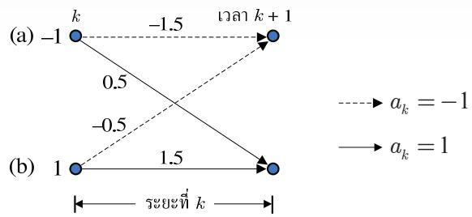  
รูปที่ 2.13 แผนภาพเทรลลิสสำหรับช่องสัญญาณ $H ( D ) = 1 + 0 . 5 D$ เมื่อข้อมูลอินพุตคือ $a _ { k } \in \{ \pm 1 \}$

$$
\gamma _ { 0 } \left( a , a \right) = \exp \left\{ - \pi \left| 0 . 9 - \left( - 1 . 5 \right) \right| ^ { 2 } \right\} \times \exp \left( \frac { ( - 1 ) ( 0 ) } { 2 } \right) \approx 0
$$

$$
\gamma _ { 0 } \left( b , a \right) = \exp \left\{ - \pi \left| 0 . 9 - \left( - 0 . 5 \right) \right| ^ { 2 } \right\} \times \exp \left( \frac { ( - 1 ) ( 0 ) } { 2 } \right) \approx 0 . 0 0 2 1
$$

$$
\gamma _ { 0 } \left( a , b \right) = \exp \left\{ - \pi \left| 0 . 9 - \left( 0 . 5 \right) \right| ^ { 2 } \right\} \times \exp \left( \frac { ( + 1 ) ( 0 ) } { 2 } \right) \approx 0 . 6 0 4 9
$$

$$
\gamma _ { 0 } \left( b , b \right) = \exp \left\{ - \pi \left| 0 . 9 - \left( 1 . 5 \right) \right| ^ { 2 } \right\} \times \exp \left( \frac { ( + 1 ) ( 0 ) } { 2 } \right) \approx 0 . 3 2 2 7
$$

จากนั้นทำการปรับค่าเมตริกสถานะ $\alpha _ { 1 } \left( a \right)$ และ $\alpha _ { 1 } \left( b \right)$ ตามสมการ (2.14) ดังนี้

$$
\begin{array} { r } { \alpha _ { 1 } \left( a \right) = \alpha _ { 0 } \left( a \right) \gamma _ { 0 } \left( a , a \right) + \alpha _ { 0 } \left( b \right) \gamma _ { 0 } \left( b , a \right) = \left( 1 \right) \left( 0 \right) + \left( 0 \right) \left( 0 . 0 0 2 1 \right) = 0 } \end{array}
$$

$$
\begin{array} { r } { \alpha _ { 1 } \left( b \right) = \alpha _ { 0 } \left( a \right) \gamma _ { 0 } \left( a , b \right) + \alpha _ { 0 } \left( b \right) \gamma _ { 0 } \left( b , b \right) = \left( 1 \right) \left( 0 . 6 0 4 9 \right) + \left( 0 \right) \left( 0 . 3 2 2 7 \right) = 0 . 6 0 4 9 } \end{array}
$$

ให้ทำการนอร์มอลไลเซชันตามสมการ (2.30) จะได้

$$
\alpha _ { 1 } \left( a \right) = 0 / \left( 0 + 0 . 6 0 4 9 \right) = 0
$$

$$
\alpha _ { 1 } \left( b \right) = 0 . 6 0 4 9 / \left( 0 + 0 . 6 0 4 9 \right) = 1
$$

3. ระยะที่ 1 (เมื่อ k = 1) อัลกอริทึม BCJR รับข้อมูล $y _ { 1 } = - 0 . 2$ มาใช้คำนวณหาเมตริกสาขา ทั่งหมดดังี้

$$
\gamma _ { 1 } \left( a , a \right) = \exp \left\{ - \pi \left| - 0 . 2 - \left( - 1 . 5 \right) \right| ^ { 2 } \right\} \times \exp \left( \frac { \left( - 1 \right) \left( 0 \right) } { 2 } \right) \approx 0 . 0 0 4 9
$$

$$
\gamma _ { 1 } \left( b , a \right) = \exp \left\{ - \pi \left| - 0 . 2 - \left( - 0 . 5 \right) \right| ^ { 2 } \right\} \times \exp \left( \frac { \left( - 1 \right) \left( 0 \right) } { 2 } \right) \approx 0 . 7 5 3 7
$$

$$
\gamma _ { 1 } \left( a , b \right) = \exp \left\{ - \pi \left| - 0 . 2 - \left( 0 . 5 \right) \right| ^ { 2 } \right\} \times \exp \left( { \frac { ( + 1 ) ( 0 ) } { 2 } } \right) \approx 0 . 2 1 4 5
$$

$$
\gamma _ { 1 } \left( b , b \right) = \exp \left\{ - \pi \left| - 0 . 2 - { \left( 1 . 5 \right) } \right| ^ { 2 } \right\} \times \exp \left( { \frac { { \left( + 1 \right) } { \left( 0 \right) } } { 2 } } \right) \approx 0 . 0 0 0 1
$$

จากนันทำการปรับค่าเมตริกสถานะ $\alpha _ { 2 } \left( a \right)$ และ $\alpha _ { 2 } \left( b \right)$ ดังนี้

$$
\mathrm { { \alpha } } _ { 2 } \left( a \right) = \mathrm { { \alpha } } _ { 1 } \left( a \right) \gamma _ { 1 } \left( a , a \right) + \mathrm { { \alpha } } _ { 1 } \left( b \right) \gamma _ { 1 } \left( b , a \right) = \left( 0 \right) \left( 0 . 0 0 4 9 \right) + \left( 1 \right) \left( 0 . 7 5 3 7 \right) = 0 . 7 5 3 7
$$

$$
\begin{array} { r } { \alpha _ { 2 } \left( b \right) = \alpha _ { 1 } \left( a \right) \gamma _ { 1 } \left( a , b \right) + \alpha _ { 1 } \left( b \right) \gamma _ { 1 } \left( b , b \right) = \left( 0 \right) \left( 0 . 2 1 4 5 \right) + \left( 1 \right) \left( 0 . 0 0 0 1 \right) = 0 . 0 0 0 1 } \end{array}
$$

ให้ทำการนอร์มอลไลเซชันตามสมการ (2.30) จะได้

$$
\alpha _ { 1 } \left( a \right) = 0 . 7 5 3 7 / \left( 0 . 7 5 3 7 + 0 . 0 0 0 1 \right) \approx 0 . 9 9 9 9
$$

$$
\alpha _ { 1 } \left( b \right) = 0 . 0 0 0 1 / \left( 0 . 7 5 3 7 + 0 . 0 0 0 1 \right) \approx 0 . 0 0 0 1
$$

4. ระยะที่ 2 และ 3 (เมื่อ $k = \{ 2 , 3 \} )$ อัลกอริทึม BCJR รับข้อมูล $y _ { 2 } = 0 . 3$ และ $y _ { 3 } = 0 . 6$ มาใช้คำนวณหาเมตริกสาขาทั้งหมดและปรับค่าเมตริกสถานะ $\alpha _ { k + 1 } \left( q \right)$ สำหรับ $q \in \{ a , b \}$ เช่นเดียวกันกับวิธีการที่อธิบายในขั้นตอนที่ 2 และ 3 ซึ่งจะได้ค่า $\Upsilon _ { k } \left( u , q \right)$ และ $\alpha _ { k + 1 } \left( q \right)$ ตามที่แสดงในรูปที่ 2.14 โดยค่าที่อยู่ติดกับเส้นสาขาแต่ละเส้นคือค่า $\Upsilon _ { k } \left( u , q \right)$ ที่สอดคล้อง กับการเปลี่ยนสถานะ $( u , \ q )$ นั้นๆ และตัวเลขที่อยู่ตรงโหนดของแต่ละสถานะแสดงถึงค่า เมตริกสถานะ $\alpha _ { k } \left( u \right)$ และ ${ \beta } _ { k } \left( u \right)$ ในรูปเศษส่วนดังนี้

$$
\frac { \alpha _ { k } \left( u \right) } { \beta _ { k } \left( u \right) }
$$

สำหรับแต่ละ $k \in \{ 0 , 1 , 2 , 3 \}$ และ $u \in \{ a , b \}$ นันคือเมื่อสิ้นสุดการทำงานในช่วงการเวียน เกิดแบบข้างหน้า (forward recursion) ก็จะได้ (หลังการทำนอร์มอลไลเซชัน)

$$
\alpha _ { 4 } \left( a \right) = 0 . 2 2 1 4 \quad \mathrm { ~ \updownarrow 6 \ 7 e ^ { \circ } ~ } \quad \alpha _ { 4 } \left( b \right) = 0 . 7 7 8 6
$$

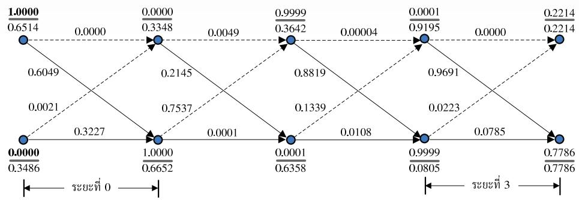  
รูปที่ 2.14 การคำนวณภายในอัลกอริทึม BCJR ในตัวอย่างที่ 2.4

5. กำหนดค่าเริ่มต้นของเมตริกสถานะ $\beta _ { 4 } \left( u \right) = \alpha _ { 4 } \left( u \right)$ สำหรับ $u \in \{ a , b \}$ นั่นคือ

$$
\beta _ { 4 } \left( a \right) = 0 . 2 2 1 4 \quad \quad \mathsf { t b } \widehat { \mathsf { e } } ^ { \prime } \quad \beta _ { 4 } \left( b \right) = 0 . 7 7 8 6
$$

## การเวียนเกิดแบบย้อนกลับ

6. ระยะที่ 3 (เมื่อ $k = 3 )$ อัลกอริทึม BCJR รับข้อมูล $y _ { 3 } ~ = ~ 0 . 6$ มาใช้คำนวณหาเมตริกสาขา ทั้งหมดก็จะได้

$$
\gamma _ { 3 } \left( a , a \right) = \exp \left\{ - \pi \left| 0 . 6 - \left( - 1 . 5 \right) \right| ^ { 2 } \right\} \times \exp \left( \frac { ( - 1 ) ( 0 ) } { 2 } \right) \approx 0
$$

$$
\gamma _ { 3 } \left( b , a \right) = \exp \left\{ - \pi \left| 0 . 6 - ( - 0 . 5 ) \right| ^ { 2 } \right\} \times \exp \left( { \frac { ( - 1 ) ( 0 ) } { 2 } } \right) \approx 0 . 0 2 2 3
$$

$$
\gamma _ { 3 } \left( a , b \right) = \exp \left\{ - \pi \left| 0 . 6 - ( 0 . 5 ) \right| ^ { 2 } \right\} \times \exp \left( \frac { ( + 1 ) ( 0 ) } { 2 } \right) \approx 0 . 9 6 9 1
$$

$$
\gamma _ { 3 } \left( b , b \right) = \exp \left\{ - \pi \left| 0 . 6 - ( 1 . 5 ) \right| ^ { 2 } \right\} \times \exp \left( \frac { ( + 1 ) ( 0 ) } { 2 } \right) \approx 0 . 0 7 8 5
$$

จากนันทำการปรับค่าเมตริกสถานะ $\beta _ { 3 } \left( a \right)$ และ $\beta _ { 3 } \left( b \right)$ ดังนี้

$$
\begin{array} { l } { { \beta _ { 3 } \left( a \right) = \Upsilon _ { 3 } \left( a , a \right) \beta _ { 4 } \left( a \right) + \Upsilon _ { 3 } \left( a , b \right) \beta _ { 4 } \left( b \right) } } \\ { { { } } } \\ { { = \left( 0 \right) \left( 0 . 2 2 1 4 \right) + \left( 0 . 9 6 9 1 \right) \left( 0 . 7 7 8 6 \right) = 0 . 7 5 4 5 4 } } \end{array}
$$

$$
\begin{array} { l } { { \beta _ { 3 } \left( b \right) = \gamma _ { 3 } \left( b , a \right) \beta _ { 4 } \left( a \right) + \gamma _ { 3 } \left( b , b \right) \beta _ { 4 } \left( b \right) } } \\ { { { } } } \\ { { = \left( 0 . 0 2 2 3 \right) \left( 0 . 2 2 1 4 \right) + \left( 0 . 0 7 8 5 \right) \left( 0 . 7 7 8 6 \right) = 0 . 0 6 6 0 5 7 } } \end{array}
$$

ให้ทำการนอร์มอลไลเซชันตามสมการ (2.30) จะได้

$$
\begin{array} { l } { { \beta _ { 3 } \left( a \right) = 0 . 7 5 4 5 4 / \left( 0 . 7 5 4 5 4 + 0 . 0 6 6 0 5 7 \right) \approx 0 . 9 1 9 5 } } \\ { { \quad } } \\ { { \beta _ { 3 } \left( b \right) = 0 . 0 6 6 0 5 7 / \left( 0 . 7 5 4 5 4 + 0 . 0 6 6 0 5 7 \right) \approx 0 . 0 8 0 5 } } \end{array}
$$

จากนั้นทำการคำนวณหาค่า $\lambda _ { p } \left( a _ { 3 } \right)$ ตามสมการ (2.24) นั่นคือ

$$
\begin{array} { c } { { \lambda _ { p } \left( a _ { 3 } \right) = \ln \left( { \frac { \displaystyle \alpha _ { 3 } \left( a \right) \gamma _ { 3 } \left( a , b \right) \beta _ { 4 } \left( b \right) + \displaystyle \alpha _ { 3 } \left( b \right) \gamma _ { 3 } \left( b , b \right) \beta _ { 4 } \left( b \right) } { \displaystyle \alpha _ { 3 } \left( a \right) \gamma _ { 3 } \left( a , a \right) \beta _ { 4 } \left( a \right) + \displaystyle \alpha _ { 3 } \left( b \right) \gamma _ { 3 } \left( b , a \right) \beta _ { 4 } \left( a \right) } } \right) } } \\ { { = \ln \left( { \frac { \displaystyle \left( 0 . 0 0 0 1 \right) \left( 0 . 9 6 9 1 \right) \left( 0 . 7 7 8 6 \right) + \displaystyle \left( 0 . 9 9 9 9 \right) \left( 0 . 0 7 8 5 \right) \left( 0 . 7 7 8 6 \right) } { \displaystyle \left( 0 . 0 0 0 1 \right) \left( 0 . 2 2 1 4 \right) + \displaystyle \left( 0 . 9 9 9 9 \right) \left( 0 . 0 2 2 3 \right) \left( 0 . 2 2 1 4 \right) } } \right) } } \end{array}
$$

$$
\approx 2 . 5 2
$$

เนืองจาก สู $\lambda _ { p } \left( a _ { 3 } \right) > 0$ ดังนั้นอัลกอริทึม BCJR จะถอดรหัสบิตข้อมูล $a _ { 3 }$ ได้เป็น $\hat { a } _ { 3 } = + 1$

หมายเหตุ เนื่องจากบิตข้อมูลอินพุตที่ส่งมาจากวงจรภาคส่งมีเพียง $\{ a _ { 0 } , ~ a _ { 1 } , ~ a _ { 2 } \}$ e บิตข้อมูล $a _ { 3 }$ จะไม่มือยู่จริงในระบบ แต่เกิดขึ้นจากผลลัพธ์ที่ได้จากการทำคอนโวลูชันระหว่าง ข้อมูลอินพุตและช่องสัญญาณจึงทำให้มีข้อมูลใหม่เพิ่มขึ้นมา อย่างไรก็ตามค่า $\lambda _ { p } \left( a _ { 3 } \right)$ อาจนำ มาใช้ประโยชน์ในกระบวนการถอดรหัสแบบวนซ้ำได้

7. ระยะที่ 2 (เมื่อ $k = 2 )$ อัลกอริทึม BCJR รับข้อมูล $y _ { 2 } = 0 . 3$ มาใช้คำนวณหาเมตริกสาขา ทั้งหมดก็จะได้

$$
\gamma _ { 2 } \left( a , a \right) = \exp \left\{ - \pi \left| 0 . 3 - \left( - 1 . 5 \right) \right| ^ { 2 } \right\} \times \exp \left( \frac { \left( - 1 \right) \left( 0 \right) } { 2 } \right) \approx 0 . 0 0 0 0 4
$$

$$
\gamma _ { 2 } \left( b , a \right) = \exp \left\{ - \pi \left| 0 . 3 - \left( - 0 . 5 \right) \right| ^ { 2 } \right\} \times \exp \left( { \frac { ( - 1 ) ( 0 ) } { 2 } } \right) \approx 0 . 1 3 3 9
$$

$$
\gamma _ { 2 } \left( a , b \right) = \exp \left\{ - \pi \left| 0 . 3 - \left( 0 . 5 \right) \right| ^ { 2 } \right\} \times \exp \left( { \frac { ( + 1 ) ( 0 ) } { 2 } } \right) \approx 0 . 8 8 1 9
$$

$$
\gamma _ { 2 } \left( b , b \right) = \exp \left\{ - \pi \left| 0 . 3 - \left( 1 . 5 \right) \right| ^ { 2 } \right\} \times \exp \left( \frac { ( + 1 ) ( 0 ) } { 2 } \right) \approx 0 . 0 1 0 8
$$

จากนันทำการปรับค่าเมตริกสถานะ e $\beta _ { 2 } \left( a \right)$ และ $\beta _ { 2 } \left( b \right)$ ดังนี้

$$
\begin{array} { l } { { \beta _ { 2 } \left( a \right) = \gamma _ { 2 } \left( a , a \right) \beta _ { 3 } \left( a \right) + \gamma _ { 2 } \left( a , b \right) \beta _ { 3 } \left( b \right) } } \\ { { \mathrm { } } } \\ { { = \left( 0 . 0 0 0 0 4 \right) \left( 0 . 9 1 9 5 \right) + \left( 0 . 8 8 1 9 \right) \left( 0 . 0 8 0 5 \right) = 0 . 0 7 1 0 3 } } \end{array}
$$

$$
\begin{array} { l } { { \beta _ { 2 } \left( b \right) = \gamma _ { 2 } \left( b , a \right) \beta _ { 3 } \left( a \right) + \gamma _ { 2 } \left( b , b \right) \beta _ { 3 } \left( b \right) } } \\ { { \mathrm { } } } \\ { { \mathrm { } = \left( 0 . 1 3 3 9 \right) \left( 0 . 9 1 9 5 \right) + \left( 0 . 0 1 0 8 \right) \left( 0 . 0 8 0 5 \right) = 0 . 1 2 3 9 9 } } \end{array}
$$

ให้ทำการนอร์มอลไลเซชันตามสมการ (2.30) จะได้

$$
\beta _ { 2 } \left( a \right) = 0 . 0 7 1 0 3 / \left( 0 . 0 7 1 0 3 + 0 . 1 2 3 9 9 \right) \approx 0 . 3 6 4 2
$$

$$
\beta _ { 2 } \left( b \right) = 0 . 1 2 3 9 9 / \left( 0 . 0 7 1 0 3 + 0 . 1 2 3 9 9 \right) \approx 0 . 6 3 5 8
$$

จากนันทำการคำนวณหาค่า $\lambda _ { p } \left( a _ { 2 } \right)$ ตามสมการ (2.24) นั่นคือ

$$
\begin{array} { r l } & { \lambda _ { p } \left( a _ { 2 } \right) = \ln \left( \frac { \alpha _ { 2 } \left( a \right) \gamma _ { 2 } \left( a , b \right) \beta _ { 3 } \left( b \right) + \alpha _ { 2 } \left( b \right) \gamma _ { 2 } \left( b , b \right) \beta _ { 3 } \left( b \right) } { \alpha _ { 2 } \left( a \right) \gamma _ { 2 } \left( a , a \right) \beta _ { 3 } \left( a \right) + \alpha _ { 2 } \left( b \right) \gamma _ { 2 } \left( b , a \right) \beta _ { 3 } \left( a \right) } \right) } \\ & { \qquad = \ln \left( \frac { \left( 0 . 9 9 9 9 \right) \left( 0 . 8 8 1 9 \right) \left( 0 . 0 8 0 5 \right) + \left( 0 . 0 0 0 1 \right) \left( 0 . 0 1 0 8 \right) \left( 0 . 0 8 0 5 \right) } { \left( 0 . 9 9 9 9 \right) \left( 0 . 0 0 0 0 4 \right) \left( 0 . 9 1 9 5 \right) + \left( 0 . 0 0 0 1 \right) \left( 0 . 1 3 3 9 \right) \left( 0 . 9 1 9 5 \right) } \right) } \end{array}
$$

เนืองจาก -ซ $\lambda _ { p } \left( a _ { 2 } \right) > 0$ ดังนันอัลกอริทึม BCJR จะถอดรหัสบิตข้อมูล $a _ { 2 }$ ได้เป็น $\hat { a } _ { 2 } = + 1$

8. ระยะที่ 1 และ 0 (เมื่อ $k = \{ 1 , 0 \} )$ อัลกอริทึม BCJR รับข้อมูล $y _ { 1 } = - 0 . 2$ และ $y _ { 0 } = 0 . 9$ มาใช้คำนวณหาเมตริกสาขาทั้งหมดและปรับค่าเมตริกสถานะ ${ \beta } _ { k } \left( u \right)$ สำหรับ $u \in \{ a , b \}$ เช่นเดียวกันกับวิธีการที่อธิบายในขั้นตอนที่ 6 และ 7 ก็จะได้ค่า $\Upsilon _ { k } \left( u , q \right)$ และ ${ \beta } _ { k } \left( u \right)$ ตามที่ แสดงในรูปที่ 2.14 ดังนั้นเมื่อสิ้นสุดการเวียนเกิดแบบย้อนกลับจะได้

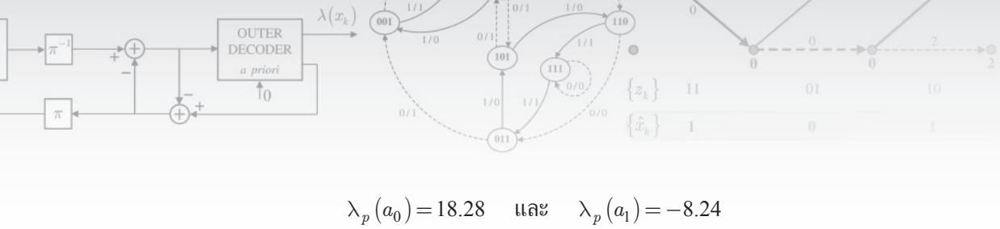

นันคืออัลกอริทึม BCJR จะถอดรหัสบิตข้อมูล $a _ { 0 }$ และ $a _ { 1 }$ ได้เป็น $\hat { a } _ { 0 } = + 1$ และ $\hat { a } _ { 1 } = - 1$

9. เมื่อสิ้นสุดการทำงาน อัลกอริทีม BCJR จะให้ค่า LLR แบบอะโพสเทอริออริของบิตข้อมูล $a _ { k }$ คือ $\left\{ \lambda _ { p } ( a _ { 0 } ) , \lambda _ { p } ( a _ { 1 } ) , \lambda _ { p } ( a _ { 2 } ) , \lambda _ { p } ( a _ { 3 } ) \right\} = \left\{ 1 8 . 2 8 , - 8 . 2 4 , 7 . 2 , 2 . 5 2 \right\}$ และถอดรหัสบิตข้อมูล ได้เป็น $\left\{ \hat { a } _ { 0 } , \hat { a } _ { 1 } , \hat { a } _ { 2 } \right\} = \left\{ 1 , - 1 , 1 \right\}$ ซึ่งตรงกับบิตข้อมูล $\{ a _ { k } \}$ ที่ส่งมาจากวงจรภาคส่ง แสดงว่าไม่มี ซ ข้อผิดพลาดเกิดขึ้นจากการถอดรหัสข้อมูลด้วยอัลกอริทึม BCJR

ตัวอย่างที่ 2.5 จากแบบจำลองช่องสัญญาณในรูปที่ 2.10 ถ้ากำหนดให้ลำดับข้อมูลอินพุต $a _ { k } =$ {1, −1, 1}, ช่องสัญญาณ $H ( D ) = 1 - D ^ { 2 }$ , สัญญาณรบกวน $n _ { k } = \{ 0 . 2 , 0 . 3 , - 0 . 2 , - 0 . 5 , 0 . 3 \}$ จงแสดงขั้นตอนการถอดรหัสข้อมูล $y _ { k }$ โดยใช้อัลกอริทีม BCJR สมมุติว่าระบบไม่ทราบข่าวสาร อะพิริออริของบิตข้อมูล $a _ { k }$

วิธีทำ ข้อมูลเอาต์พุตของช่องสัญญาณ $r _ { k }$ หาได้จาก

$$
r _ { k } = a _ { k } * h _ { k } = \{ r _ { 0 } , r _ { 1 } , r _ { 2 } , r _ { 3 } , r _ { 4 } \} = \{ 1 , - 1 , 0 , 1 , - 1 \}
$$

และ

$$
y _ { k } = r _ { k } + n _ { k } = \{ 1 . 2 , ~ - 0 . 7 , ~ - 0 . 2 , ~ 0 . 5 , ~ - 0 . 7 \} = \{ y _ { 0 } , ~ y _ { 1 } , ~ y _ { 2 } , ~ y _ { 3 } , ~ y _ { 4 } \}
$$

จากนั้นให้สร้างแผนภาพเทรลลิสของช่องสัญญาณ $H ( D ) = 1 - D ^ { 2 }$ ซึ่งจะได้ตามรูปที่ 2.15 โดย สู   
มีทังหมดสีสถานะคือ สถานะ (a), (b), (C) และ (d)

จากนั้นทำการถอดรหัสข้อมูลโดยใช้อัลกอริทึม BCJR เช่นเดียวกับวิธีการที่อธิบายใน ตัวอย่างที่ 2.4 ก็จะได้ค่าเมตริกสาขาและเมตริกสถานะดังแสดงในรูปที่ 2.16 เมื่อค่าที่อยู่ติดกับเส้น สาขาแต่ละเส้นคือค่า $\Upsilon _ { k } \left( u , q \right)$ และตัวเลขที่อยู่ติดกับโหนดของแต่ละสถานะแสดงถึงค่าเมตริก สถานะ $\alpha _ { k } \left( u \right)$ และ ${ \beta } _ { k } \left( u \right)$ ในรูปเศษส่วน $\alpha _ { k } \left( u \right) / \beta _ { k } \left( u \right)$ สำหรับแต่ละ $k \in \{ 0 , 1 , . . . , 4 \}$ และ $u \in \{ a , \ b , \ c , \ d \}$

จากค่าเมตริกสาขาและเมตริกสถานะดังแสดงในรูปที่ 2.16 ทำให้สามารถคำนวณหาค่า LLR แบบอะโพสเทอริออริของบิตข้อมูล $a _ { k }$ ตามสมการ (2.24) ซึ่งจะได้ว่า

$$
\left\{ \lambda _ { p } \left( a _ { 0 } \right) , \lambda _ { p } \left( a _ { 1 } \right) , \lambda _ { p } \left( a _ { 2 } \right) , \lambda _ { p } \left( a _ { 3 } \right) , \lambda _ { p } \left( a _ { 4 } \right) \right\} = \left\{ 4 . 7 7 8 , - 2 7 . 6 4 6 , 4 . 7 7 8 , - 1 2 . 5 6 6 , 4 . 5 2 5 \right\}
$$

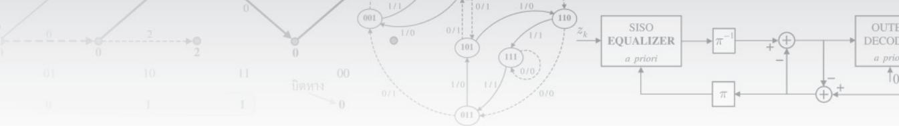

  
รูปที่ 2.15 แผนภาพเทรลลิสสำหรับช่องสัญญาณ $H ( D ) = 1 - D ^ { 2 }$ เมื่อข้อมูลอินพุตคือ $a _ { k } \in \{ \pm 1 \}$

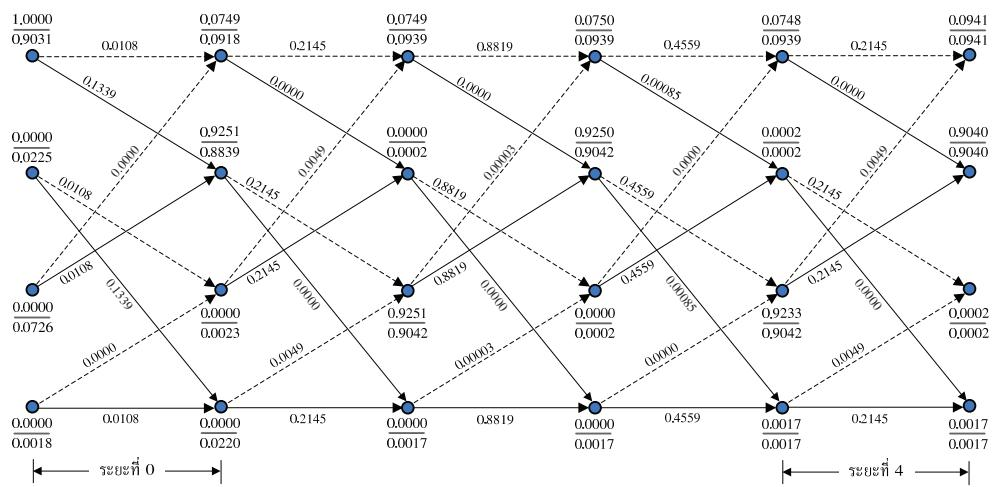  
รูปที่ 2.16 การคำนวณภายในอัลกอริทึม BCJR ในตัวอย่างที่ 2.5

และถอดรหัสบิตข้อมูลได้เป็น

$$
\left\{ \hat { a } _ { 0 } , \hat { a } _ { 1 } , \hat { a } _ { 2 } \right\} = \left\{ 1 , - 1 , 1 \right\}
$$

ซึ่งตรงกับบิตข้อมูล $a _ { k }$ ที่ส่งมาจากวงจรภาคส่ง (สองบิตสุดท้ายไม่มีอยู่จริงในระบบ แต่เป็นผลลัพธ์ ที่เกิดจากการทำคอนโวลูชันระหว่างข้อมูลอินพุตและช่องสัญญาณ) แสดงว่าไม่มีข้อผิดพลาดเกิดขึน จากการถอดรหัสข้อมูลด้วยอัลกอริทึม BCJR

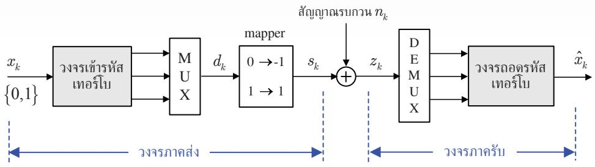  
รูปที่ 2.17 โครงสร้างของระบบที่ใช้การเข้ารหัสและถอดรหัสแบบเทอร์โบ

## 2.3 รหัสเทอร์โบ

รหัสเทอร์โบ (turbo code) เป็นกรรมวิธีการเข้าและถอดรหัสช่องสัญญาณ (channel coding) ที่ได้ ถูกพัฒนาขึ้นมาในปี ค.ศ.1993 โดย Berrou, Glavieux, และ Thitimajรhima [3] รหัสเทอร์โบมี ข้อดีคือ ทำงานได้ดีแม้ช่องสัญญาณมีค่า รNR ต่ำ, แก้ไขข้อผิดพลาดได้ดี, และมีสมรรถนะเข้าใกล้ ขีดจำกัดจากทฤษฎีบทของแชนนอน (Shaททon's theorem) [25] โดยอาศัยกระบวนการเข้าและ ถอดรหัสที่ไม่ซับซ้อน ซึ่งในอดีต (ก่อนปี ค.ศ. 1993) ยังไม่มีวิธีการเข้ารหัสช่องสัญญาณแบบใด ที่ทำได้ หรือถ้าทำได้ก็ต้องใช้วงจรถอดรหัสที่ซับซ้อนมาก ด้วยเหตุนี้การค้นพบรหัสเทอร์โบจึงนับว่า เป็นการค้นพบที่สำคัญและได้เปลี่ยนแปลงงานวิจัยทางด้านการเข้ารหัสช่องสัญญาณไปอย่างมาก ในหลายปีที่ผ่านมาผลงานวิจัยและการพัฒนาที่เกี่ยวข้องกับรหัสเทอร์โบจึงมีให้เห็นจำนวนมาก นอกจากนี้รหัสเทอร์โบได้ถูกนำไปใช้ในหลายๆ งานประยุกต์ เช่น ระบบโทรศัพท์เคลื่อนที่ยุคที่สาม (3G: third geทeration) ได้นำรหัสเทอร์โบมาใช้เป็นมาตรฐานสำหรับการติดต่อสื่อสารระหว่าง สถานีฐานและเครื่องโทรศัพท์เคลื่อนที่ เป็นต้น

โครงสร้างพื้นฐานของรหัสเทอร์โบแตกต่างจากวิธีการเข้าและถอดรหัสประเภทอื่นสาม ประการคือ ใช้การเข้ารหัสแบบต่อขนาน (parallel concatenated encoding), ใช้วงจรเข้ารหัสแบบ ป้อนกลับ (feedback encoder), และใช้การถอดรหัสแบบวนซ้ำ (iterative decoding) รูปที 2.17 แสดงโครงสร้างของระบบที่ใช้การเข้ารหัสและถอดรหัสแบบเทอร์โบ โดยลำดับข้อมูลแบบไบนารี $x _ { k } \in \{ 0 , 1 \}$ จะถูกป้อนเข้าวงจรเข้ารหัสเทอร์โบและให้ผลลัพธ์เป็นลำดับข้อมูลสามชุด จากนั้น ลำดับข้อมูลทั้งสามก็จะถูกส่งเข้าวงจรมัลติเพล็กเซอร์ (MบX: mนltiplexer) เพื่อรวมเป็นลำดับ ข้อมูล $d _ { k }$ เพียงลำดับเดียว ก่อนส่งเข้าวงจรเข้าคู (mapper) เพื่อแปลงบิตข้อมูลค่า 0 เป็นค่า –1 ผลลัพธ์ที่ได้คือลำดับข้อมูล $s _ { k }$ ซึ่งจะถูกส่งไปยังวงจรภาครับที่ถูกรบกวนด้วยสัญญาณรบกวน $n _ { k }$ จากนั้นสัญญาณที่วงจรภาครับได้รับ $z _ { k }$ จะถูกส่งผ่านวงจรดีมัลติเพล็กเซอร์ (DEMบX: demultiplexer) เพื่อแยกสัญญาณ $z _ { k }$ ให้เป็นลำดับข้อมูลสามชุด ก่อนส่งไปทำการถอดรหัสข้อมูลด้วยวงจร ถอดรหัสเทอร์โบ ในส่วนต่อไปนี้จะอธิบายหลักการทำงานขององค์ประกอบต่าง ๆ ของระบบที่ใช้ การเข้ารหัสและถอดรหัสแบบเทอร์โบในรูปที่ 2.17

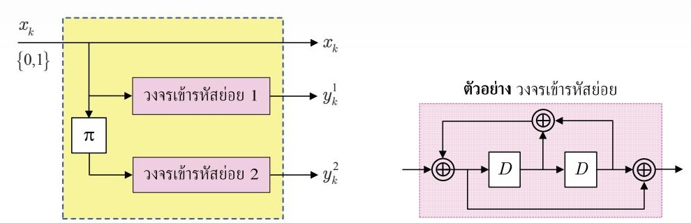  
รูปที่ 2.18 โครงสร้างพื้นฐานของวงจรเข้ารหัสเทอร์โบ

## 2.3.1 วงจรเข้ารหัสเทอร์โบ

วงจรเข้ารหัสเทอร์โบมีโครงสร้างตามรูปที่ 2.18 โดยลำดับข้อมูลอินพุต $x _ { k }$ จะถูกป้อนเข้าไปในแต่ละ องค์ประกอบย่อยของวงจรเข้ารหัสเทอร์โบทั้งสามส่วนคือ ส่วนที่แปลงลำดับข้อมูล $x _ { k }$ ให้เป็นลำดับ ข้อมูล $x _ { k } , \ y _ { k } ^ { 1 }$ และ $y _ { k } ^ { 2 }$ ตามลำดับ (นั้นคือวงจรเข้ารหัสเทอร์โบนี้มีอัตรารหัสเท่ากับ 1/3) จากรูปที 2.18 จะพบว่าลำดับข้อมูล $y _ { k } ^ { 1 }$ ได้จากการป้อนลำดับข้อมูล $x _ { k }$ เข้าไปในวงจรเข้ารหัสย่อยหมายเลข 1 และลำดับข้อมูล $y _ { k } ^ { 2 }$ ได้จากการป้อนลำดับข้อมูล $x _ { k }$ เข้าสู่วงจรอินเทอร์ลีฟเวอร์8 (interleaver) ซึ่ง แทนด้วยเครื่องหมาย $\pi$ เพื่อสลับตำแหน่งของข้อมูลแต่ละตัวภายในลำดับข้อมูล $x _ { k }$ ให้อยู่ใน รูปแบบที่แตกต่างจากเดิม จากนั้นจึงป้อนผลลัพธ์ที่ได้เข้าสู่วงจรเข้ารหัสย่อยหมายเลข 2 ซึ่งอาจมี โครงสร้างพื้นฐานเหมือนหรือต่างจากวงจรเข้ารหัสย่อยหมายเลข 1 ก็ได้

## 2.3.2 วงจรมัลติเพล็กเซอร์และวงจรดีมัลติเพล็กเซอร์

วงจรมัลติเพล็กเซอร์ (MUX: mนltiplexer) ทำหน้าที่ในการรวมลำดับข้อมูลที่ได้จากการเข้ารหัส หลายๆ ลำดับข้อมูลให้เป็นลำดับข้อมูลเดียว ในขณะที่วงจรดีมัลติเพล็กเซอร์ (DEMUX: demultiplexer)จะทำหน้าทีตรงกันข้ามกับวงจรมัลติเพล็กเซอร์ กล่าวคือวงจรดีมัลติเพล็กเซอร์จะทำการ แยกลำดับข้อมูลที่ป้อนเข้ามาให้เป็นลำดับข้อมูลหลายๆ ลำดับข้อมูลที่สอดคล้องกับลำดับข้อมูลที ป้อนเข้าวงจรมัลติเพล็กเซอร์ดังแสดงในรูปที่ 2.19

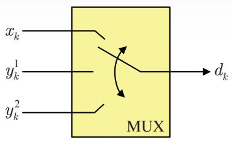  
(ก)

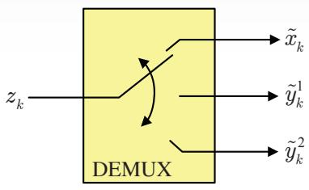  
(ข)  
รูปที่ 2.19 หลักการทำงานของ (ก) วงจรมัลติเพล็กเซอร์ และ (ข) วงจรดีมัลติเพล็กเซอร์

ตัวอย่างเช่นจากรูปที่ 2.19 ถ้ากำหนดให้ข้อมูลที่ได้จากการเข้ารหัสเทอร์โบประกอบด้วย สามลำดับข้อมูลคือ $\left\{ x _ { k } \right\} = \left\{ x _ { 0 } , x _ { 1 } , x _ { 2 } \right\} , \left\{ y _ { k } ^ { 1 } \right\} = \left\{ y _ { 0 } ^ { 1 } , y _ { 1 } ^ { 1 } , y _ { 2 } ^ { 1 } \right\}$ , และ $\left\{ y _ { k } ^ { 2 } \right\} = \left\{ y _ { 0 } ^ { 2 } , y _ { 1 } ^ { 2 } , y _ { 2 } ^ { 2 } \right\}$ ดังนั้น เมื่อลำดับข้อมูลทั้งสามนี้ผ่านวงจรมัลติเพล็กเซอร์ก็จะได้สัญญาณเอาต์พุตเป็น $\left\{ d _ { k } \right\} = \left\{ x _ { 0 } , y _ { 0 } ^ { 1 } \right.$ $y _ { 0 } ^ { 2 } , x _ { 1 } , y _ { 1 } ^ { 1 } , y _ { 1 } ^ { 2 } , x _ { 2 } , y _ { 2 } ^ { 1 } , y _ { 2 } ^ { 2 } \bigg \}$ ในทำนองเดียวกัน ณ วงจรภาครับ ถ้าลำดับข้อมูลที่ป้อนเข้าวงจรดีมัลติ เพล็กเซอร์คือ $\left\{ \boldsymbol { z } _ { k } \right\} = \left\{ \tilde { x } _ { 0 } , \tilde { y } _ { 0 } ^ { 1 } , \tilde { y } _ { 0 } ^ { 2 } , \tilde { x } _ { 1 } , \tilde { y } _ { 1 } ^ { 1 } , \tilde { y } _ { 1 } ^ { 2 } , \tilde { x } _ { 2 } , \tilde { y } _ { 2 } ^ { 1 } , \tilde { y } _ { 2 } ^ { 2 } \right\}$ (เมื่อ $\tilde { m }$ คือข้อมูล m ที่มีผลกระทบของ สัญญาณรบกวน) ก็จะให้ผลลัพธ์เป็นลำดับข้อมูลสามส่วนคือ $\left\{ \tilde { x } _ { k } \right\} = \left\{ \tilde { x } _ { 0 } , \tilde { x } _ { 1 } , \tilde { x } _ { 2 } \right\} , \left\{ \tilde { y } _ { k } ^ { 1 } \right\} = \left\{ \tilde { y } _ { 0 } ^ { 1 } \right.$ $\left. \tilde { y } _ { 1 } ^ { 1 } , \tilde { y } _ { 2 } ^ { 1 } \right\}$ , และ $\left\{ \tilde { y } _ { k } ^ { 2 } \right\} = \left\{ \tilde { y } _ { 0 } ^ { 2 } , \tilde { y } _ { 1 } ^ { 2 } , \tilde { y } _ { 2 } ^ { 2 } \right\}$ ซึ่งสอดคล้องกับลำดับข้อมูลที่ป้อนเข้าวงจรมัลติเพล็กเซอร์

## 2.3.3 วงจรถอดรหัสเทอร์โบ

ซ กระบวนการถอดรหัสของรหัสเทอร์โบจะเป็นแบบวนซ้ำซึ่งหมายความว่า แทนที่จะมีวงจรถอดรหัส เพียงตัวเดียวและทำการถอดรหัสเพียงรอบเดียว วงจรถอดรหัสเทอร์โบประกอบด้วยวงจรถอดรหัส ย่อยมากกว่าหนึงตัว (ดูรูปที 2.20) และลักษณะการทำงานของวงจรถอดรหัสย่อยแต่ละตัวจะทำงาน สลับกันไปมา กล่าวคือเมื่อตัวหนึ่งกำลังทำการถอดรหัส อีกตัวหนึงจะรอ และผลลัพธ์ที่ได้จากการ ถอดรหัสของตัวถอดรหัสหนึ่งจะถูกส่งต่อไปให้ตัวถอดรหัสอีกตัวหนึ่ง เพื่อใช้เป็นข้อมูลประกอบ ในการถอดรหัสในรอบต่อไป การทำงานของวงจรถอดรหัสทั้งสองจะสลับกันไปเป็นรอบๆ จนกระทั่ง ได้ผลลัพธ์ที่ลู่เข้า (Coกverge) สู่ค่าที่เหมาะสม ทั้งนี้สังเกตว่าวงจรถอดรหัสย่อยจะมีจำนวนเท่ากับ วงจรเข้ารหัสย่อยที่ภาคส่งโดยจะทำงานสัมพันธุ์กัน [18]

รูปที่ 2.20 แสดงโครงสร้างพื้นฐานของวงจรถอดรหัสเทอร์โบซึ่งมีขั้นตอนการทำงานดังนี้ สัญญาณที่วงจรภาครับได้รับจะถูกส่งผ่านวงจรดีมัลติเพล็กเซอร์ซึ่งจะให้ผลลัพธ์เป็นค่าประมาณ ของลำดับข้อมูล $x _ { k } , y _ { k } ^ { 1 }$ และ $y _ { k } ^ { 2 }$ นั่นคือ $\tilde { x } _ { k } , \tilde { y } _ { k } ^ { 1 }$ และ $\tilde { y } _ { k } ^ { 2 }$ ตามลำดับ จากนันก็จะทำการถอดรหัส เทอร์โบตามขั้นตอนดังนี้

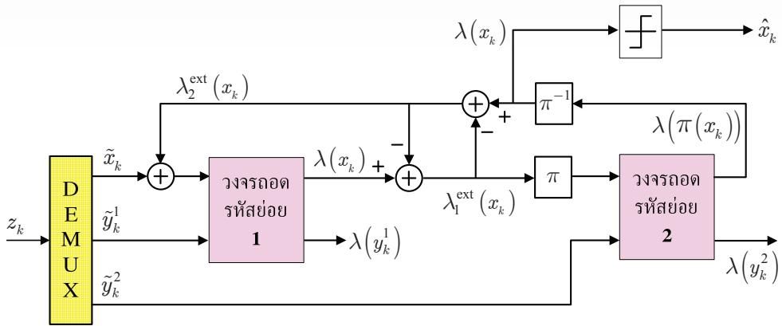  
รูปที่ 2.20 โครงสร้างพื้นฐานของวงจรถอดรหัสเทอร์โบ

1) ให้นำผลรวมของลำดับข้อมูล $\tilde { x } _ { k } + \lambda _ { 2 } ^ { \mathrm { e x t } } \left( x _ { k } \right)$ และลำดับข้อมูล $\tilde { y } _ { k } ^ { 1 }$ มาป้อนเข้าวงจรถอดรหัส ย่อยหมายเลข 1 โดยที่ $\lambda _ { 2 } ^ { \mathrm { e x t } } \left( x _ { k } \right)$ คือข่าวสารอะพิริออริของบิตข้อมูล $x _ { k }$ หรือค่า LLR ของ ข่าวสารเอกซ์ทรินซิก (extrinsic information) ของบิตข้อมูล $x _ { k }$ ซึ่งในรอบแรกของการถอด รหัส $\lambda _ { 2 } ^ { \mathrm { e x t } } \left( x _ { k } \right)$ จะมีค่าเป็นค่าศูนย์ (ซึ่งหมายถึงความน่าจะเป็นที่บิตข้อมูลแต่ละบิต $x _ { k } = 0$ หรือ $x _ { k } = 1$ มีค่าเท่ากัน) โดยผลลัพธ์ที่ได้จากการถอดรหัสประกอบด้วยสองส่วนคือ ส่วนแรก 6 สท เป็นค่า LLR ของบิตข้อมูล $x _ { k }$ นั่นคือ e $\lambda ( x _ { k } )$ และส่วนที่สองเรียกว่าค่า LLR ของบิตข้อมูล $y _ { k } ^ { 1 }$ นั่นคือ $\lambda \left( y _ { k } ^ { 1 } \right)$

2) คำนวณหาค่า LLR ของข่าวสารเอกซ์ทรินซิกของบิตข้อมูล $x _ { k }$ ที่ได้จากวงจรถอดรหัสย่อย หมายเลข 1 นั้นคือ $\lambda _ { 1 } ^ { \mathrm { e x t } } \left( x _ { k } \right)$ ตามความสัมพันธุ์ดังนี้

$$
\lambda _ { 1 } ^ { \mathrm { e x t } } \left( x _ { k } \right) = \lambda \left( x _ { k } \right) - \lambda _ { 2 } ^ { \mathrm { e x t } } \left( x _ { k } \right)
$$

3) ค่า $\lambda _ { 1 } ^ { \mathrm { e x t } } \left( x _ { k } \right)$ จะถูกส่งเข้าไปในวงจรอินเทอร์ลีฟเวอร์ (π) ก่อนส่งต่อไปยังวงจรถอดรหัสย่อย หมายเลข 2 ในรูปของข่าวสารอะพิรืออริที่ได้จากวงจรถอดรหัสย่อยหมายเลข 1 สังเกตว่าการ ที่ต้องมีกระบวนการทำอินเทอร์ลีฟ $\pi { \left( x _ { k } \right) }$ ระหว่างวงจรถอดรหัสย่อยหมายเลข 1 และหมายเลข 2 ก็เพื่อให้ลำดับของบิตข้อมูลได้รับการสลับตำแหน่งและสอดคล้องกับลำดับของบิตข้อมูลที่ใช้ ในวงจรถอดรหัสย่อยหมายเลข 2

4) ข่าวสารอะพิรืออริที่ได้จากวงจรถอดรหัสย่อยหมายเลข 1 และลำดับข้อมูล $\tilde { y } _ { k } ^ { 2 }$ จะถูกป้อนเข้า วงจรถอดรหัสย่อยหมายเลข 2 ซึ่งผลที่ได้จากการถอดรหัสประกอบด้วยสองส่วนคือ ส่วนแรก คือค่า LLR ของบิตข้อมูล $\pi \big ( \boldsymbol { x } _ { k } \big )$ นั่นคือ $\lambda { \Big ( } \pi { \Big ( } x _ { k } { \Big ) } { \Big ) }$ และส่วนที่สองคือค่า LLR ของบิตข้อมูล $y _ { k } ^ { 2 }$ นั่นคือ $\lambda \left( y _ { k } ^ { 2 } \right)$

5)ค่า $\lambda { \Big ( } \pi { \Big ( } x _ { k } { \Big ) } { \Big ) }$ จะถูกส่งเข้าไปในวงจรอินเทอร์ลีฟเวอร์ผกผัน $\left( \pi ^ { - 1 } \right)$ เพื่อให้ได้ผลลัพธ์เป็นค่า $\lambda ( x _ { k } )$ ซึ่งเป็นค่าที่จะนำไปใช้ในการตัดสินใจว่าบิตข้อมูลแต่ละบิตน่าจะมีค่าเป็น 0 หรือ 1 (เมื่อครบจำนวนรอบของการวนซ้ำตามที่กำหนดไว้ในการถอดรหัสเทอร์โบ)

6) คำนวณหาค่า LLR ของข่าวสารเอกซ์ทรินซิกของบิตข้อมูล $x _ { k }$ ที่ได้จากวงจรถอดรหัสย่อย หมายเลข 2 นั้นคือ $\lambda _ { 2 } ^ { \mathrm { e x t } } \left( x _ { k } \right)$ ตามความสัมพันธุ์ดังนี้

$$
\lambda _ { 2 } ^ { \mathrm { e x t } } \left( x _ { k } \right) = \lambda \left( x _ { k } \right) - \lambda _ { 1 } ^ { \mathrm { e x t } } \left( x _ { k } \right)
$$

7) ขั้นตอนที่ $1 - 6$ ถือเป็นการถอดรหัสเทอร์โบครบหนึ่งรอบ สำหรับการถอดรหัสเทอร์โบใน รอบถัดไปก็จะย้อนกลับไปทำงานในขั้นตอนที่ 1 ไหม่ โดยในครั้งนี้ค่าผลรวมของลำดับข้อมูล $\tilde { x } _ { k } + \lambda _ { 2 } ^ { \mathrm { e x t } } \left( x _ { k } \right)$ จะเปลี่ยนไป เนื่องจากค่า $\lambda _ { 2 } ^ { \mathrm { e x t } } \left( x _ { k } \right)$ จะเป็นค่าใหม่ที่ได้จากการถอดรหัส เทอร์โบในรอบก่อนหน้านี้ แต่ลำดับข้อมูล $\tilde { x } _ { k }$ ยังเป็นค่าเดิม

8) เมื่อถอดรหัสเทอร์โบจนครบจำนวนรอบตามที่กำหนด ก็ทำการหาลำดับข้อมูล $x _ { k }$ ที่สส ที่ดีที่สุด โดยใช้ค่า LLR $\lambda ( x _ { k } )$ ที่ได้จากวงจรถอดรหัสย่อยหมายเลข 2 มาป้อนเข้าวงจรตรวจหาขีด เริ่มเปลี่ยน (threshold detector) เพื่อหาค่าประมาณของ $\hat { x } _ { k }$ ตามความสัมพันธุ์ดังนี้ ร์ดังที้

$$
\hat { x } _ { k } = \left\{ { 0 , \ \mathrm { i f } \ \lambda \big ( { x } _ { k } \big ) \leq 0 } \right.\tag{2.31}
$$

สังเกตว่าข่าวสารที่ส่งผ่านระหว่างวงจรถอดรหัสย่อยจะมีเฉพาะส่วนของข่าวสารเอกซ์ทรินซิกเท่านั้น การแลกเปลี่ยนเฉพาะข่าวสารส่วนนีระหว่างวงจรถอดรหัสย่อยถือว่าเป็นจุดสำคัญของความสำเร็จ ของรหัสเทอร์โบ

## 2.3.4 วงจรอินเทอร์ลีฟเวอร์

วงจรอินเทอร์ลีฟเวอร์ (interleaver) ทำหน้าที่สลับตำแหน่งของบิตข้อมูลอินพุตแต่ละตัวเพื่อให้ ข้อมูลเอาต์พุตมีลักษณะเป็นข้อมูลสุ่ม (raกdom) ให้มากที่สุด หรือกล่าวอีกนัยหนึ่งคือวงจรอินเทอร์ ลีฟเวอร์มีหน้าที่ทำให้ข้อผิดพลาดแต่ละบิตที่อาจเกิดขึ้นภายในข้อผิดพลาดที่ติดกันหลายบิต (error burst) กระจัดกระจายไปอยูในตำแหน่งอื่นๆ ของลำดับข้อมูล ดังนั้นวงจรอินเทอร์ลีฟเวอร์ถือว่าเป็น องค์ประกอบที่สำคัญที่มีผลต่อสมรรถนะของการใช้งานรหัสเทอร์โบ [26] โดยช่วยทำให้ผลกระทบ ที่เกิดจากพื้นข้อผิดพลาด (error flo0r) [2, 4] น้อยลงได้ ในทางปฏิบัติวงจรอินเทอร์ลีฟเวอร์ที่มี สมรรถนะสูงสุดจะต้องทำให้ลำดับข้อมูลที่ด้านขาออกวงจรอินเทอร์ลีฟเวอร์มีลักษณะเป็นข้อมูลสุ่ม ให้มากที่สุด เพราะฉะนั้นวงจรอินเทอร์ลีฟเวอร์อุดมคติ (ideal interleaver) ก็คือวงจรอินเทอร์ ลีฟเวอร์แบบสุ่ม (random interleaver) [26] นั้นเอง ซึ่งสร้างได้ยากในทางปฏิบัติ ฉะนั้นการ ออกแบบวงจรอินเทอร์ลีฟเวอร์ให้เหมาะสมกับช่องสัญญาณเพื่อให้ได้สมรรถนะสูงสุดจึงเป็น สิ่งจำเป็นอย่างยิ่ง (ศึกษารายละเอียดได้ใน [26]) ในหัวข้อนี้จะยกตัวอย่างการทำงานของวงจร อินเทอร์ลีฟเวอร์ที่น่าสนใจดังต่อไปนี้

## วงจรอินเทอร์ลีฟเวอร์แบบแลอนและแนวตั้ง

วงจรอินเทอร์ลีฟเวอร์แบบแนวนอนและแนวตั้ง (row-column interleaver) เป็นวงจรอินเทอร์ ลีฟเวอร์แบบง่ายสุดซึ่งทำหน้าที่สลับตำแหน่งของข้อมูลภายในบล็อกข้อมูล วงจรอินเทอร์ลีฟเวอร์ แบบนี้มีลักษณะเป็นหน่วยความจำ โดยข้อมูลจะถูกเขียนเข้าไปในหน่วยความจำตามแนวนอนและ จะถูกอ่านออกมาตามแนวตั้ง ตัวอย่างเช่น ถ้ากำหนดให้ข้อมูลหนึ่งบล็อกมีทั้งหมด 20 ตัว นั้นคือ $\{ \mathrm { X } _ { 1 } \ \mathrm { X } _ { 2 } \ \mathrm { X } _ { 3 } \ \dots \ \mathrm { X } _ { 2 0 } \}$ เพราะฉะนั้นข้อมูลนี้จะถูกเขียนเข้าไปในหน่วยความจำตามแนวนอนตาม รูปที่ 2.21 (ก) หลังจากนั้นวงจรอินเทอร์ลีฟเวอร์ก็จะทำการอ่านข้อมูลตามแนวตั้งเพื่อให้ได้ข้อมูล เอาต์พุตออกมาตามรูปที่ 2.21 (ข) ในทางปฏิบัติจำนวนของแนวตั้งและแนวนอนที่ใช้ในวงจร อินเทอร์ลีฟเวอร์สามารถเปลี่ยนแปลงได้ตามลักษณะของงานประยุกต์

## วงจรอินเทอร์ลีฟเวอร์แบบสุ่มเทียม

วงจรอินเทอร์ลีฟเวอร์แบบสุ่มเทียม (pรeนdo-random)[26] จะนิยามโดยตัวกำเนิดเลขสุ่มแบบเทียม หรือตารางค้นหา (1ook-นp table) ที่มีตัวเลขตั้งแต่ 1 ถึง N จัดเรียงแบบสุ่ม เมื่อ N คือจำนวน บิตข้อมูลที่จะทำการสลับตำแหน่ง (หรือขนาดของบล็อกข้อมูลที่ป้อนเข้าวงจรอินเทอร์ลีฟเวอร์) สมรรถนะของวงจรอินเทอร์ลีฟเวอร์แบบนี้จะขึ้นอยู่กับขนาดของวงจรอินเทอร์ลีฟเวอร์ (ถ้า N ยิ่ง มีค่ามาก สมรรถนะก็จะยิ่งดี) โดยทั่วไปเกณฑ์ในการเลือกใช้วงจรอินเทอร์ลีฟเวอร์แบบนี้จะอาศัย การจำลองระบบเพื่อพิจารณาว่าวงจรอินเทอร์ลีฟเวอร์ลักษณะใดมีสมรรถนะดีสุด

## วงจรอินเทอร์ลีฟเวอร์แบบสุ่ม S

วงจรอินเทอร์ลีฟเวอร์แบบสุ่ม S (S-random interleaver) [27] จะทำงานคล้ายกับวงจรอินเทอร์ ลีฟเวอร์แบบสุ่มเทียม เพียงแต่มีเงื่อนไขบังคับ (conรtraint) เพิ่มเติมว่า บิตข้อมูลทุกตัวในลำดับ ข้อมูลอินพุตที่อยู่ห่างกันน้อยกว่าหรือเท่ากับ S ตำแหน่ง จะถูกทำให้อยู่ห่างกันไม่น้อยกว่า S

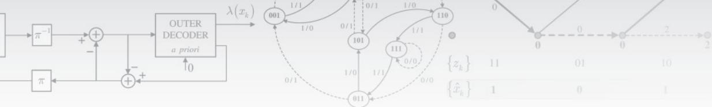

<table><tr><td rowspan=1 colspan=1> $X _ { 1 }$ </td><td rowspan=1 colspan=1> $X _ { 2 }$ </td><td rowspan=1 colspan=1> $X _ { 3 }$ </td><td rowspan=1 colspan=1> $X _ { 4 }$ </td></tr><tr><td rowspan=1 colspan=1> $X _ { 5 }$ </td><td rowspan=1 colspan=1> $X _ { 6 }$ </td><td rowspan=1 colspan=1> $X _ { 7 }$ </td><td rowspan=1 colspan=1> $X _ { 8 }$ </td></tr><tr><td rowspan=1 colspan=1> $X _ { 9 }$ </td><td rowspan=1 colspan=1> $\Chi _ { 1 0 }$ </td><td rowspan=1 colspan=1> $\Chi _ { 1 1 }$ </td><td rowspan=1 colspan=1> $X _ { 1 2 }$ </td></tr><tr><td rowspan=1 colspan=1> $\mathrm { X } _ { 1 3 }$ </td><td rowspan=1 colspan=1> $X _ { 1 4 }$ </td><td rowspan=1 colspan=1> $\mathrm { X } _ { 1 5 }$ </td><td rowspan=1 colspan=1> $X _ { 1 6 }$ </td></tr><tr><td rowspan=1 colspan=1> $X _ { 1 7 }$ </td><td rowspan=1 colspan=1> $X _ { 1 8 }$ </td><td rowspan=1 colspan=1> $\Chi _ { 1 9 }$ </td><td rowspan=1 colspan=1> $\Chi _ { 2 0 }$ </td></tr></table>

(ก) การเขียนข้อมูลตามแนวนอน

<table><tr><td rowspan=1 colspan=1> $X _ { 1 }$ </td><td rowspan=1 colspan=1> $X _ { 5 }$ </td><td rowspan=1 colspan=1> $X _ { 9 }$ </td><td rowspan=1 colspan=1> $X _ { 1 3 }$ </td><td rowspan=1 colspan=1> $X _ { 1 7 }$ </td><td rowspan=1 colspan=1> $X _ { 2 }$ </td><td rowspan=1 colspan=1> $X _ { 6 }$ </td><td rowspan=1 colspan=1> $\Chi _ { 1 0 }$ </td><td rowspan=1 colspan=1> $X _ { 1 4 }$ </td><td rowspan=1 colspan=1> $X _ { 1 8 }$ </td><td rowspan=1 colspan=1>••</td><td rowspan=1 colspan=1>••</td><td rowspan=1 colspan=1> $\Chi _ { 2 0 }$ </td></tr></table>

63ุ่ง น ผลลัพธ์ที  
รูปที่ 2.21 การเขียนและการอ่านข้อมูลของวงจรอินเทอร์ลีฟเวอร์แบบแนวนอนและแนวตั้ง

ข้อกำหนด S ถูกใช้เพื่อรับรองว่าข้อผิดพลาดที่ติดกันหลายบิตที่มีความยาวน้อยกว่า S แซมเปิลจะถูกทำให้กระจัดกระจายไปอยู่ในตำแหน่งต่างๆ ของลำดับข้อมูล ในทางปฏิบัติค่า S ต้อง มีค่าน้อยกว่ารากที่สองของ N/2 [28] และโดยทั่วไปอัตราขยายของวงจรอินเทอร์ลีฟเวอร์แบบนี้ จะมีค่ามากกว่า S เสมอ

## วงจรอินเทอร์ลีฟเวอร์แบบอื่นๆ

นอกจากนี้ยังมีวงจรอินเทอร์ลีฟเวอร์แบบอื่นๆ อีกหลายแบบ โดยที่วงจรอินเทอร์ลีฟเวอร์แต่ละ แบบจะมีความเหมาะสมในการใช้งานที่แตกต่างกัน ในทางปฏิบัติวงจรอินเทอร์ลีฟเวอร์จะถูก ออกแบบสำหรับเงื่อนไขการใช้งานในแต่ละงานประยุกต์ (ยังไม่มีข้อกำหนดที่แน่นอนว่าวงจรอิน เทอร์ลีฟเวอร์แบบใดเหมาะสมกับงานประยุกต์ใด)

ตัวอย่างเช่นสำหรับลำดับข้อมูลที่มีความยาวน้อย วงจรอินเทอร์ลีฟเวอร์แบบคู่ดี่ (Odd- สี่ส even interleaver) [26] จะมีสมรรถนะดีกว่าวงจรอินเทอร์ลีฟเวอร์แบบสุ่มเทียม เมื่อทำงานที่ค่า SNR ต่ำ แต่จะมีสมรรถนะน้อยกว่าวงจรอินเทอร์ลีฟเวอร์แบบสุ่มเทียมเมื่อทำงานที่ค่า รNR สูง นอกจากนีสำหรับลำดับข้อมูลที่มีความยาวมาก วงจรอินเทอร์ลีฟเวอร์แบบสุ่ม Sจะมีสมรรถนะดีกว่า วงจรอินเทอร์ลีฟเวอร์แบบสุ่มเทียยม

## 2.3.5 ผลการทดลอง

ในส่วนนี้จะแสดงผลการจำลองระบบเข้ารหัสและถอดรหัสเทอร์โบสำหรับช่องสัญญาณในรูปที่ 2.17 โดยลำดับข้อมูลอินพุต $x _ { k } \in \{ 0 , 1 \}$ ขนาดความยาว 4096 บิตที่มีคาบเวลาเท่ากับ T จะถูกป้อนเข้า วงจรเข้ารหัสเทอร์โบที่มีโครงสร้างตามรูปที่ 2.18 โดยวงจรเข้ารหัสย่อยหมายเลข 1 และหมายเลข 2 ที่ใช้ในการทดลองนี้เป็นตามรูปที่ 2.6 และวงจรอินเทอร์ลีฟเวอร์ทีใช้เป็นแบบสุ่ม S ที่มี $S = 1 4$ ผลลัพธ์ที่ได้จากการเข้ารหัสเทอร์โบจะเป็นลำดับข้อมูลสามชุดคือ $x _ { k } , \ y _ { k } ^ { 1 }$ และ $y _ { k } ^ { 2 }$ จากนั้นลำดับ ข้อมูลทั้งสามจะถูกส่งเข้าวงจรมัลติเพล็กเซอร์เพื่อรวมให้เป็นลำดับข้อมูล $d _ { k }$ เพียงลำดับเดียว ก่อน ส่งเข้าวงจรเข้าคู่พื่อแปลงบิตข้อมูลค่า 0 เป็นค่า -1 จากนั้นสัญญาณที่วงจรภาครับได้รับ $z _ { k }$ ซึ่ง ถูกรบกวนด้วยสัญญาณรบกวน $n _ { k } \sim \mathcal N \left( 0 , \sigma ^ { 2 } \right)$ เมื่อ $\sigma ^ { 2 } = N _ { 0 } / ( 2 T )$ จะถูกส่งไปยังวงจรดีมัลติ เพล็กเซอร์เพื่อแยกสัญญาณ $z _ { k }$ ให้เป็นลำดับข้อมูลสามส่วนคือ $\tilde { x } _ { k } , ~ \tilde { y } _ { k } ^ { 1 }$ และ $\tilde { y } _ { k } ^ { 2 }$ ก่อนส่งไปถอด รหัสข้อมูลด้วยวงจรถอดรหัสเทอร์โบซึ่งมีโครงสร้างตามรูปที่ 2.20 โดยจำนวนรอบ (iterลtiอก) ที่ ใช้ในการถอดรหัสข้อมูลคือ 10 รอบ

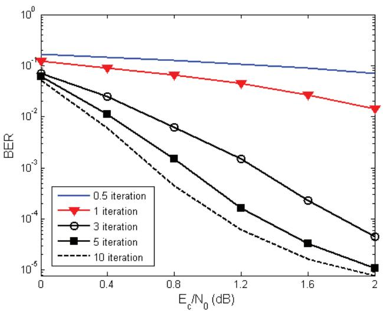  
รูปที่ 2.22 สมรรถนะของระบบเทอร์โบที่จำนวนรอบต่างๆ

รูปที่ 2.22 แสดงสมรรถนะของระบบเทอร์โบที่จำนวนรอบต่างๆ โดยเส้นแกน y คือค่า อัตราข้อผิดพลาดของบิต (BER: bit-error rate) และเส้นแกน x คือค่าอัตราส่วนพลังงานของบิต ที่ถูกเข้ารหัส (coded bit) ต่อความหนาแน่นสเปกตรัมกำลังแบบด้านเดียว $N _ { 0 }$ ซึ่งนิยามโดย

$$
\frac { E _ { c } } { N _ { 0 } } = 1 0 \log _ { 1 0 } \left( \frac { E _ { b } } { R N _ { 0 } } \right)\tag{2.32}
$$

มีหน่วยเป็นเดซิเบล (dB) เมื่อ $E _ { b } = 1$ คือพลังงานของบิตข้อมูลอินพุต และ $R = 1 / 3$ คืออัตรารหัส จากรูปจะพบว่าสมรรถนะของระบบดีขึ้นเมื่อจำนวนรอบของการถอดรหัสเพิ่มขึ้น โดยในที่นี้"0.5 iteratioก"หมายถึงสมรรถนะของระบบในขณะที่ยังไม่มีการทำงานแบบวนซำ (นั้นคือนำค่า $\lambda ( x _ { k } )$ ที่ได้จากวงจรถอดรหัสย่อยหมายเลข 1 ในรูปที่ 2.20 มาคำนวณหาค่า BER) อย่างไรก็ตามเมื่อ $E _ { c } / N _ { 0 }$ มีค่าสูง ระบบจะเริ่มมีสมรรถนะคงที่ ณ จำนวนรอบของการถอดรหัสหนึ่งๆ ึ่งจะเรียก ปรากฎการณ์นี้ว่าระบบเกิดพื้นข้อผิดพลาด ซึ่งในทางปฏิบัติสามารถแก้ไขปัญหานี้ได้หลายวิธี เช่น การใช้วงจรเข้ารหัสก่อน (precoder) [29] เป็นต้น

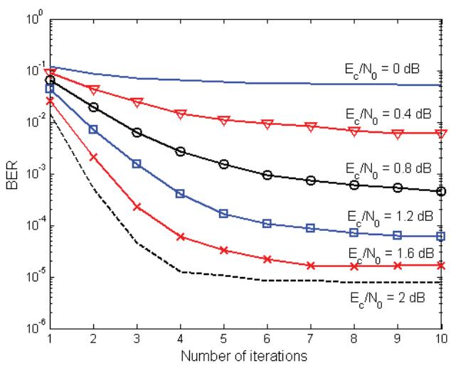  
รูปที่ 2.23 สมรรถนะของระบบเทอร์โบที่ระดับ $E _ { b } / N _ { 0 }$ ต่างๆ

นอกจากนี้รูปที่ 2.23 แสดงสมรรถนะของระบบเทอร์โบที่ระดับ $E _ { c } / N _ { 0 }$ ต่างๆ โดยเส้น แกน y คือค่า BER และเส้นแกน x คือจำนวนรอบของการถอดรหัสแบบวนซ้ำ ซึ่งเห็นได้ชัดเจน ว่าเมื่อจำนวนรอบของการถอดรหัสเพิ่มขึ้น สมรรถนะของระบบก็จะดีขึ้น (BER น้อยลง) และเมื่อ $E _ { c } / N _ { 0 }$ มีค่าสูงมากขึน ระบบจะเริ่มมีสมรรถนะคงที่ ณ จำนวนรอบของการถอดรหัสหนึ่งๆ

## 2.3.6 วงจรเข้ารหัสและถอดรหัสเทอร์โบแบบต่ออนุกรม

ระบบเข้ารหัสและถอดรหัสที่แสดงในรูปที่ 2.17, 2.18 และ 2.20 เป็นโครงสร้างของระบบที่ใช้รหัส เทอร์โบแบบต่อขนาน (parallel concatenated turbo code) ในหัวข้อนี้จะกล่าวถึงรหัสเทอร์โบ แบบต่ออนุกรม (serial concatenated turbo code)ซึงเป็นพืนฐานของอีควอไลเซชันแบบเทอร์โบ (turbo equalization) ที่จะอธิบายต่อไปในหัวข้อที่ 2.4

รหัสเทอร์โบแบบต่ออนุกรมคือ การต่อกันแบบอนุกรมของวงจรเข้ารหัสคอนโวลูชันสอง วงจรโดยมีวงจรอินเทอร์ลีฟเวอร์คั่นระหว่างสองวงจร [30] รูปที่ 2.24 แสดงตัวอย่างวงจรเข้ารหัส เทอร์โบแบบต่ออนุกรมที่มีอัตรารหัสเท่ากับ $R = 1 / 4$ โดยที่วงจรเข้ารหัสภายนอก (outer encoder) เป็นวงจรเข้ารหัสแบบมีระบบ (systematic encoder) ที่มีพหุนามตัวกำเนิดคือ[1, 1 D] และมี อัตรารหัสเท่ากับ 1/2 ในขณะที่วงจรเข้ารหัสภายใน (inner encoder) เป็นวงจรเข้ารหัสคอนโวลูชัน แบบมีระบบเวียนเกิด (recursive systematic convolutional encoder) ที่มีพหุนามตัวกำเนิดคือ $\left[ 1 , \ 1 / \left( 1 \oplus D ^ { 2 } \right) \right]$ และมีอัตรารหัสเท่ากับ 1/2

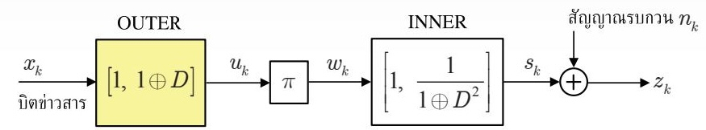  
รูปที่ 2.24 วงจรเข้ารหัสเทอร์โบแบบต่ออนุกรม

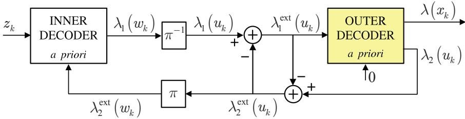  
รูปที่ 2.25 วงจรถอดรหัสเทอร์โบแบบต่ออนุกรม

ในทำนองเดียวกันรูปที่ 2.25 แสดงวงจรถอดรหัสเทอร์โบแบบต่ออนุกรม ซึ่งมีโครงสร้าง คล้ายกับวงจรถอดรหัสเทอร์โบแบบต่อขนาน นั้นคือวงจรถอดรหัสแบบ รเรอ ที่สอดคล้องกับ รหัสภายนอกและรหัสภายในจะแลกเปลี่ยนข่าวสารแบบซอฟต์ (รoft inforทลtiอก) ระหว่างกัน โดยมีขั้นตอนการถอดรหัสข้อมูลดังต่อไปนี้

1) วงจรถอดรหัสภายใน (inner decoder) ทำงานโดยใช้ลำดับข้อมูล $z _ { k }$ และข่าวสารเอกซ์ทรินซิก $\lambda _ { 2 } ^ { \mathrm { e x t } } \left( w _ { k } \right)$ ซึ่งทำหน้าที่เป็นข่าวสารอะพิรืออริของลำดับข้อมูล $w _ { k }$ โดยจะให้ข้อมูลเอาต์พุตเป็น ข่าวสารแบบซอฟต์ของบิตข้อมูล $w _ { k }$ หรือ $\lambda _ { \scriptscriptstyle 1 } \left( w _ { \boldsymbol k } \right)$

2) ข่าวสารแบบซอฟต์ $\lambda _ { \scriptscriptstyle 1 } \left( w _ { \boldsymbol k } \right)$ จะถูกส่งไปยังวงจรอินเทอร์ลีฟเวอร์ผกผัน $( \pi ^ { - 1 } )$ เพื่อสลับตำแหน่ง ของข้อมูลให้เป็นข่าวสารแบบซอฟต์ของบิตข้อมูล $u _ { k }$ หรือ $\lambda _ { \mathrm { l } } \left( u _ { k } \right)$

3) คำนวณหาค่าข่าวสารเอกซ์ทรินซิก $\lambda _ { 1 } ^ { \mathrm { e x t } } \left( u _ { k } \right) = \lambda _ { 1 } \left( u _ { k } \right) - \lambda _ { 2 } ^ { \mathrm { e x t } } \left( u _ { k } \right)$ เมื่อ $\lambda _ { 2 } ^ { \mathrm { e x t } } \left( u _ { k } \right)$ คือข่าวสาร เอกซ์ทรินซิกของบิตข้อมูล $u _ { k }$ ที่ได้จากวงจรถอดรหัสภายนอก (outer decoder)

4) วงจรถอดรหัสภายนอกจะทำงานโดยใช้ข่าวสารเอกซ์ทรินซิก $\lambda _ { 1 } ^ { \mathrm { e x t } } \left( u _ { k } \right)$ และให้ข้อมูลเอาต์พุต เป็นข่าวสารแบบซอฟต์ของบิตที่ถูกเข้ารหัส $\lambda _ { 2 } \left( u _ { k } \right)$ และของบิตข่าวสาร $\lambda ( x _ { k } )$ [31]

5) คำนวณหาค่าข่าวสารเอกซ์ทรินซิก $\lambda _ { 2 } ^ { \mathrm { e x t } } \left( u _ { k } \right) = \lambda _ { 2 } \left( u _ { k } \right) - \lambda _ { 1 } ^ { \mathrm { e x t } } \left( u _ { k } \right)$ ที่ได้จากวงจรถอดรหัส ภายนอก

6)ข่าวสารเอกซ์ทรินซิก $\lambda _ { 2 } ^ { \mathrm { e x t } } \left( u _ { k } \right)$ จะถูกส่งไปยังวงจรอินเทอร์ลีฟเวอร์ $( \pi )$ เพื่อสลับตำแหน่ง ของข้อมูลให้เป็นข่าวสารเอกซ์ทรินซิกของบิตข้อมูล $w _ { k }$ หรือ $\lambda _ { 2 } ^ { \mathrm { e x t } } \left( w _ { k } \right)$ ซึ่งจะถูกนำไปใช้ใน วงจรถอดรหัสภายในสำหรับการถอดรหัสในรอบถัดไป

7) ขั้นตอนที่ $1 \_ 6$ ถือเป็นการถอดรหัสเทอร์โบแบบต่ออนุกรมครบหนึ่งรอบ สำหรับการ ถอดรหัสเทอร์โบในรอบถัดไปก็จะย้อนกลับไปทำงานในขั้นตอนที่ 1 ไหม่ โดยในครั้งนี้ค่า $z _ { k }$ ยังเป็นค่าเดิม แต่ค่า $\lambda _ { 2 } ^ { \mathrm { e x t } } \left( w _ { k } \right)$ จะเปลี่ยนไป เพราะเป็นค่าใหม่ทีได้จากการถอดรหัสเทอร์โบ ในรอบก่อนหน้านี้

8) เมื่อทำการถอดรหัสเทอร์โบจนครบจำนวนรอบตามที่กำหนด ก็หาลำดับข้อมูล $x _ { k }$ ที่ดีสุดได้ โดยการนำค่า $\lambda ( x _ { k } )$ ที่ได้จากวงจรถอดรหัสภายนอกมาป้อนเข้าวงจรตรวจหาขีด้เริ่มเปลี่ยน เพื่อหาค่าประมาณของ $x _ { k }$ ตามสมการ (2.31)

หมายเหตุ วงจรเข้ารหัสและถอดรหัสเทอร์โบแบบต่ออนุกรมในรูปที่ 2.24 และ 2.25 ได้รวมวงจร มัลติเพล็กเซอร์ (MUX) และวงจรดีมัลติเพล็กเซอร์ (DEMบX) ไว้แล้ว ตามลำดับ (เปรียบเทียบ กับโครงสร้างของวงจรเข้ารหัสและถอดรหัสในรูปที่ 2.18 และ 2.20)

## 2.4 อีควอไลเซซันแบบเทอร์โบ

อีควอไลเซชัน (equalization) คือกระบวนการที่ใช้สำหรับแก้ปัญหาเรื่องการลดทอน (distortion) ที่เกิดจากช่องสัญญาณโดยมีผลทำให้รูปร่างของสัญญาณที่ด้านขาออกของช่องสัญญาณมีรูปร่าง ผิดเพี้ยนไปจากเดิม โดยทั่วไปวงจรภาครับในระบบสื่อสารดิจิทัลจะมีการใช้งานอีควอไลเซอร์ (equa lizer) เพื่อทำหน้าที่ลดผลกระทบที่เกิดจากการลดทอนของสัญญาณ

พิจารณาระบบที่ถูกเข้ารหัส (coded system) ในรูปที่ 2.26 เมื่อลำดับข้อมูลอินพุต $x _ { k } \in$ {0, 1} จะถูกส่งไปยังวงจรเข้ารหัสแก้ไขข้อผิดพลาด (ECC encoder), วงจรอินเทอร์ลีฟเวอร์ (interleaver) และวงจรเข้าคู(mapper) ก็จะได้เป็นลำดับข้อมูล $s _ { k } \in \ \{ \pm 1 \}$ จากนั้นลำดับข้อมูล $s _ { k }$ ก็จะ ส่งผ่านไปยังช่องสัญญาณ (chaททel) ที่ถูกรบกวนด้วยสัญญาณรบกวน $n _ { k }$ โดยสัญญาณที่วงจร ภาครับได้รับก็คือลำดับข้อมูล $z _ { k }$

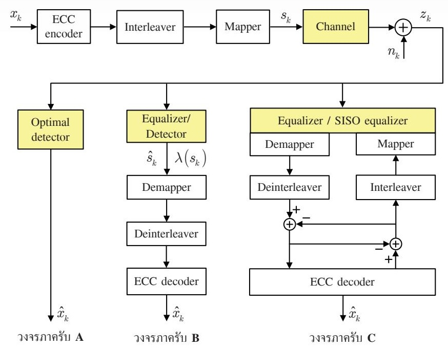  
รูปที่ 2.26 โครงสร้างระบบสื่อสารดิจิทัลที่ประกอบด้วยวงจรภาคส่งและวงจรภาครับ A, B และ C

วงจรภาครับมีหน้าที่หลักคือการหาค่าประมาณของข้อมูลที่ส่งมาจากวงจรภาคส่ง (นั่นคือ หาค่าประมาณของ $x _ { k }$ หรือ $\hat { x } _ { k } )$ ซึ่งสามารถทำได้ 3 แบบคือ

แบบที่หนึ่ง (วงจรภาครับ A) ทำหน้าที่เป็นวงจรตรวจหาเหมาะที่สุด (optimal detector) เพราะ ทำให้เกิดข้อผิดพลาดในการถอดรหัสข้อมูลน้อยสุด กล่าวคือวงจรภาครับ A จะต้องหาลำดับ ข้อมูล $x _ { k }$ ที่ควรจะเป็นสูงสุด โดยอาศัยความรู้เกี่ยวกับช่องสัญญาณ วงจรอินเทอร์ลีฟเวอร์ วงจรเข้าคู่ และวงจรเข้ารหัส ECด ร่วมกันทั้งหมดในการคำนวณเพือถอดรหัสลำดับข้อมูล $x _ { k }$ เพราะฉะนั้นโดยทั่วไปวงจรภาครับ A จะมีความซับซ้อนมาก จึงไม่สามารถนำมาใช้จริงในงาน ประยุกต์ใดๆ ได้

แบบที่สอง (วงจรภาครับ B) จะเป็นลักษณะของวงจรภาครับแบบที่ใช้กันทั่วไป (conveทtional receiveาr) ซึ่งไม่ใช้กระบวนการถอดรหัสแบบวนซ้ำ โดยวงจรภาครับ B จะทำการแก้ปัญหาเรื่อง การลดทอนสัญญาณในอีกรูปแบบหนึ่งคือ การพิจารณาว่าช่องสัญญาณ'คือวงจรเข้ารหัสคอน โวลูชันที่มีอัตรารหัสเท่ากับค่าหนึ่ง ซึ่งสามารถทำการถอดรหัสข้อมูลได้โดยใช้แผนภาพเทรลลิส วิธีการนี้ทำได้จริงถ้าช่องสัญญาณมีจำนวนแท็ป (tap) ไม่มาก เพราะจะมีผลต่อจำนวนสถานะ (state) ในแผนภาพเทรลลิส [4] อย่างไรก็ตามถ้าช่องสัญญาณมีจำนวนแท็ปมาก ก็จะทำการ แบ่งกระบวนการอีควอไลเซชันออกเป็นสองขั้นตอนคือ

ขั้นตอนที่หนึ่งคือ การปรับแต่งสัญญาณให้เป็นไปตามทาร์เก็ตแบบผลตอบสนองบางส่วน หรือทาร์เก็บแบบ PR (partial-response target) ที่มีจำนวนแท็ปน้อย [10, 32] และมี ผลตอบสนองเชิงความถีเหมือนกับผลตอบสนองเชิงความถีของช่องสัญญาณให้มากที่สุด ขันตอนนีจะช่วยลดปัญหาเรืองการขยายสัญญาณรบกวน (ทoise enchancement) และทำ ให้ผลตอบสนองรวมของทั้งระบบมีจำนวนแท็ปจำกัด

O ขั้นตอนที่สองคือ การถอดรหัสข้อมูลแบบควรจะเป็นสูงสุด (ML: maximนm-likelihood) หรือแบบอะโพสเทอริออริสูงสุด (MAP: maximum a posteriori)

กระบวนการอีควอไลเซซชันที่แบ่งการทำงานออกเป็นสองขั้นตอนนี้เป็นพื้นฐานของเทคนิคควร จะเป็นสูงสุดของผลตอบสนองบางส่วนหรือ PRML (partial-response maximum-likelihood) ที่นิยมใช้ในระบบการบันทึกข้อมูลเชิงแม่เหล็ก [32]

เมื่อทำการตรวจหาข้อมูลเสร็จก็จะได้ผลลัพธ์เป็นค่าประมาณของลำดับข้อมูล $s _ { k }$ (หรือ $\hat { s } _ { k } ^ { \scriptscriptstyle } )$ หรือได้เป็นข่าวสารแบบซอฟต์ของบิตข้อมูล $s _ { k }$ หรือ $\lambda { \left( s _ { k } \right) }$ ซึ่งขึ้นอยู่กับประเภทของวงจร ตรวจหา (detector) ที่ใช้ เช่น ถ้าใช้เป็นวงจรตรวจหาวีเทอร์บิก็จะได้ผลลัพธ์เป็น $\hat { s } _ { \scriptscriptstyle k }$ แต่ถ้าใช้ เป็นวงจรตรวจหา BCJR ก็จะได้ผลลัพธ์เป็น $\lambda { \left( s _ { k } \right) }$ เป็นต้น หลังจากนั้นวงจรตรวจหาจะส่ง ผลลัพธ์ที่ได้ไปยังวงจรเข้าคู่ผกผัน (de-mapper), วงจรอินเทอร์ลีฟเวอร์ผกผัน (deinterleaver) และวงจรถอดรหัสแก้ไขข้อผิดพลาด (ECC decoder) เพื่อหาค่าประมาณของลำดับข้อมูล $x _ { k }$ หรือ $\hat { x } _ { k }$

แบบที่สาม (วงจรภาครับ C) เป็นโครงสร้างของกระบวนการอีควอไลเซชันแบบเทอร์โบ (turbo equalizลtioท) กล่าวคือในทางปฏิบัติแนวคิดทางด้านเทอร์โบ (ที่ใช้วงจรถอดรหัสย่อยสองวงจร ทำการแลกเปลี่ยนข่าวสารแบบซอฟต์เพื่อใช้ถอดรหัสข้อมูล) สามารถนำมาใช้กับอีควอไลเซชัน ได้เช่นกัน ซึ่งเทคนิคนี้จะเรียกว่าอีควอไลเซชันแบบเทอร์โบ และวงจรภาครับที่ใช้งานเทคนิคนี้ จะเรียกว่า "อีควอไลเซอร์แบบเทอร์โบ (tนrbo equalizer)"[21] โดยระบบนี้สามารถพิจารณา ได้ว่าเป็นรหัสเทอร์โบแบบต่ออนุกรมที่มีช่องสัญญาณทำหน้าที่เป็นรหัสภายใน (inner code) และวงจรเข้ารหัส ECC ทำหน้าที่เป็นรหัสภายนอก (outer code) นอกจากนี้โครงสร้างของ วงจรถอดรหัสจะเหมือนกับโครงสร้างของวงจรถอดรหัสเทอร์โบแบบต่ออนุกรมในรูปที่ 2.25 ยกเว้นเพียงวงจรถอดรหัสภายในจะเปลี่ยนเป็นอีควอไลเซอร์แบบ SIร0 (SIS0 equลlizer) ดังแสดงในรูปที่ 2.26 หรือเขียนใหม่ได้เป็นรูปที่ 2.27

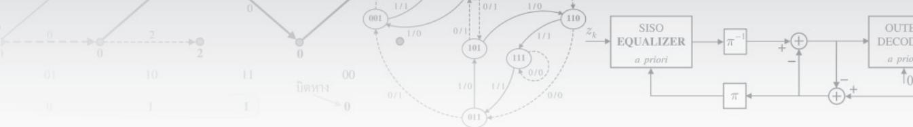

  
รูปที่ 2.27 โครงสร้างของอีควอไลเซอร์แบบเทอร์โบ

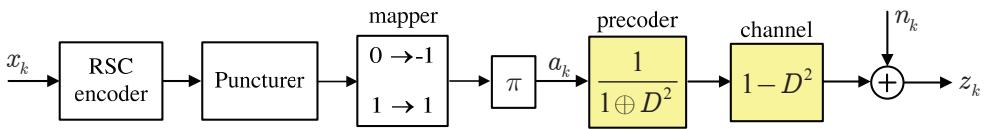  
รูปที่ 2.28 วงจรภาคส่ง (สำหรับการถอดรหัสข้อมูลด้วยอีควอไลเซอร์แบบเทอร์โบ)

ข้อดีของโครงสร้างนี้คือรหัส ECC ที่ใช้ไม่จำเป็นต้องเป็นรหัสเทอร์โบเพื่อให้ระบบมี สมรรถนะที่ดี ตัวอย่างเช่น งานวิจัยใน [33] ได้แสดงให้เห็นว่าอีควอไลเซอร์แบบเทอร์โบสามารถ ทำงานได้อย่างมีประสิทธิภาพสำหรับช่องสัญญาณแบบ PR-IV ที่ใช้วงจรเข้ารหัสก่อน (precoder) ที่มีรูปพหุนาม 1/(1(D2) และใช้รหัสคอนโวลูชันเป็นรหัส ECC อย่างไรก็ตามฮาร์ดดิสก์ไดรฟ์ รุ่นใหม่ๆ ที่ใช้ระบบถอดรหัสแบบวนซ้ำจะนิยมใช้รหัส LDPC [5, 8, 17] เป็นรหัส ECC เพราะ มีสมรรถนะสูงสุด (ดูรายละเอียดในบทที่ 4)

ข้อควรระวัง อีควอไลเซอร์แบบ รIร0 เป็นชื่อทางเทคนิคที่ใช้เรียกวงจรตรวจหาที่สามารถให้ข้อมูล เอาต์พุตเป็นข่าวสารแบบซอฟต์ได้ (เพื่อนำมาใช้ในกระบวนการถอดรหัสแบบวนซ้ำ) แต่อีควอ ไลเซอร์เป็นวงจรที่ทำหน้าที่ปรับรูปร่างของสัญญาณให้เป็นไปตามผลตอบสนองทาร์เก็ต (target response) จากนั้นก็จะนำทาร์เก็ตนี้มาใช้สร้างแผนภาพเทรลลิสสำหรับตรวจหาข้อมูลโดยใช้อีควอ ไลเซอร์แบบ SIS0 [5, 8]

หนังสือเล่มนี้จะให้ความสำคัญกับการทำงานของอีควอไลเซอร์แบบเทอร์โบ เพราะเป็น องค์ประกอบหลักสำหรับฮาร์ดดิสก์ไดรฟ์ที่ใช้ระบบถอดรหัสแบบวนซ้ำ ในบทที่ 5 จะแสดงให้เห็น สมรรถนะและประโยชน์ของอีควอไลเซอร์แบบเทอร์โบ ซึ่งสามารถนำมาประยุกต์ใช้แก้ปัญหาด้าน ต่างๆ ได้ เช่น ไทมมิงริดคัฟเวอรี (timing recovery) [34 – 36] และการตรวจหาและแก้ไขความ ขรุขระเชิงความร้อน (TA: thermal asperity) [37] เป็นต้น

## 2.4.1 สมรรถนะของอีควอไลเซอร์แบบเทอร์โบ

พิจารณาระบบสื่อสารดิจิทัลที่มีอัตรารหัสเท่ากับ 8/9 ในรูปที่ 2.28 เมื่อบิตข่าวสาร $x _ { k }$ ขนาด 3636 บิตต่อหนึงเซกเตอร์ที่มีคาบเวลาเท่ากับ T ถูกเข้ารหัสด้วยวงจรเข้ารหัสคอนโวลูชันแบบมีระบบ เวียนเกิดที่มีอัตรารหัส $R = 1 / 2$ และมีพหุนามตัวกำเนิดคือ $\left[ 1 , \frac { 1 \oplus D \oplus D ^ { 3 } \oplus D ^ { 4 } } { 1 \oplus D \oplus D ^ { 4 } } \right]$ จากนันก็จะถูกส่งเข้า ไปยังวงจรเจาะ (puncturer) [2] เพื่อเพิ่มอัตรารหัสจาก 1/2 เป็น 8/9 โดยตัดบิตพาริติ้ (parity bit) ทิ้งจำนวน 7 บิตในทุกๆ 8 บิต (ตัวอย่างเช่น พิจารณาวงจรเข้ารหัสคอนโวลูชันในรูปที่ 2.8 (ก) บิตพาริตีก็คือบิตข้อมูล $y _ { k }$ นั่นเอง) เพื่อทำให้ได้เป็นลำดับข้อมูลขนาด 4095 บิตต่อหนึ่งเซกเตอร์ จากนั้นจึงส่งต่อไปยังวงจรเข้าคู่และวงจรอินเทอร์ลีฟเวอร์แบบสุ่ม S ที่มี $S = 1 6$ ก็จะได้เป็นลำดับ ข้อมูล $a _ { k }$ $1 / \left( 1 \oplus D ^ { 2 } \right)$ และช่องสัญญาณ PR-IV ที่มีรูปพหุนามคือ $1 - D ^ { 2 }$

สัญญาณที่วงจรภาครับได้รับคือลำดับข้อมูล $z _ { k }$ ซึ่งถูกรบกวนด้วยสัญญาณรบกวน $n _ { k }$ 2 $\mathcal { N } \big ( 0 , \sigma ^ { 2 } \big )$ เมื่อ ซู $\sigma ^ { 2 } = N _ { 0 } / ( 2 T )$ จะถูกทำการถอดรหัสข้อมูลด้วยอีควอไลเซอร์แบบเทอร์โบที่มี โครงสร้างตามรูปที่ 2.27 เพียงแต่เพิ่มวงจรเจาะผกผัน (depนทctนrer) เข้าไปในระบบที่ด้านขาเข้า ของวงจรถอดรหัสภายนอก และเพิ่มวงจรเจาะ (pนทctนre) อีกหนึ่งวงจรที่ด้านขาออกของวงจร ถอดรหัสภายนอก นอกจากนีอีควอไลเซอร์แบบ รเร0 และวงจรถอดรหัสแบบ รเร0 จะสร้างมา จากอัลกอริทึม BCมR โดยแผนภาพเทรลลิสที่ใช้ในอีควอไลเซอร์แบบ รเร0 จะสร้างมาจากทาร์เก็ต ที่เป็นผลรวมของวงจรเข้ารหัสก่อนและช่องสัญญาณ [33]

รูปที่ 2.29 แสดงสมรรถนะของอีควอไลเซอร์แบบเทอร์โบในรูปของ BER สำหรับแต่ละ รอบของการวนซ้ำ (iteratioท) โดยที่ค่า BER แต่ละค่าทีได้มาจากการป้อนข้อมูลอินพุตเข้าไปใน ระบบหลายๆ เซกเตอร์ (1 เซกเตอร์มี 3636 บิต) จนกระทั่งมีข้อผิดพลาดของบิต (bit error) เกิดขึ้น จำนวนมากกว่า 1000 บิดต ณ รอบที่ 10 ของการถอดรหัสแบบวนซ้ำ นอกจากนี้ $^ { 6 6 } 0 . 5$ iteration" หมายถึงสมรรถนะที่ด้านขาออกของอีควอไลเซอร์แบบ ราร0 ในขณะที่ยังไม่มีการทำงานแบบ วนซ้ำ (อาจพิจารณาได้ว่าเป็นสมรรถนะของระบบที่ไม่ถูกเข้ารหัส (uncoded รyรtem) ก็ได้) จากรูป จะเห็นได้ว่าระบบมีสมรรถนะดีขึ้นเมื่อจำนวนรอบของการวนซ้ำเพิ่มขึ้น จนถึง ณ ระดับ $E _ { c } / N _ { 0 }$ หนึ่งที่ทำให้สมรรถนะของระบบเริ่มที่จะไม่มีการเปลี่ยนแปลง ตัวอย่างเช่น ถ้าระบบใช้การวนซ้ำ จำนวน 7 รอบ ดังนั้นเมื่อ $E _ { c } / N _ { 0 } > 5 . 5$ dB พบว่าสมรรถนะของระบบเริ่มคงที่(นั้นคือระบบเกิด พื้นข้อผิดพลาด)

รูปที่ 2.30 แสดงสมรรถนะของอีควอไลเซอร์แบบเทอร์โบในรูปอัตราข้อผิดพลาดของ เซกเตอร์ (SER: sector error rate) เทียบกับ $E _ { c } / N _ { 0 }$ นันคือถ้าภายหนึงเซกเตอร์มีข้อผิดพลาด ของบิตเกิดขึนมากกว่าหรือเท่ากับหนึงบิต ก็ถือว่ามีข้อผิดพลาดของเซกเตอร์เกิดขึ้น จากรูปจะพบว่า

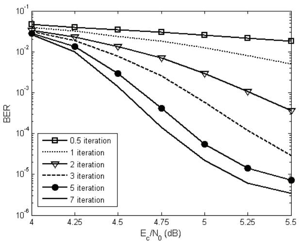  
รูปที่ 2.29 สมรรถนะของอีควอไลเซอร์แบบเทอร์โบในรูปของ BER เทียบกับ $E _ { c } / N _ { 0 }$

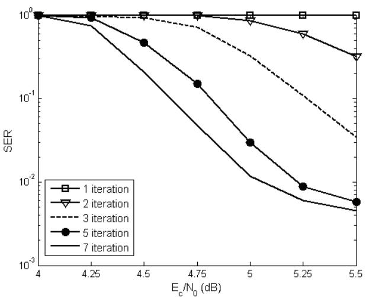  
รูปที่ 2.30 สมรรถนะของอีควอไลเซอร์แบบเทอร์โบในรูปของ SER เทียบกับ $E _ { c } / N _ { 0 }$

รู หนึ่ง ซึ่งทำให้   
ระบบมีค่า รER ลดน้อยลง เมือจำนวนรอบของการวนซำเพิมขึนจนถึงค่า $E _ { c } / N _ { 0 }$   
สมรรถนะของระบบเริ่มคงที่ นอกจากนี้รูปที่ 2.31 แสดงสมรรถนะของอีควอไลเซอร์แบบเทอร์โบ   
ในรูปของ รER เทียบกับจำนวนรอบของการวนซ้ำ ซึ่งพบว่า ณ ระดับ $E _ { c } / N _ { 0 }$ หนึ่ง เมื่อจำนวน 9/   
รอบของการวนซำเพิ่มขึน ระบบก็จะมีค่า รER ลดน้อยลงจนถึงจำนวนรอบของการวนซำหนึ่ง   
เช่นที่ $E _ { c } / N _ { 0 } = 5 . 5$ dB ระบบจะมีสมรรถนะดีขึ้นเรื่อยๆ จนถึงรอบที่ 7 ของการวนซ้ำ จากนั้น 2   
ระบบจะมิสมรรถนะคงที แม้ว่าจำนวนรอบของการวนซ้ำจะเพิ่มขินก็ตาม

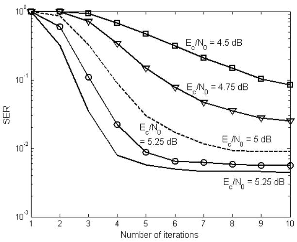  
รูปที่ 2.31 สมรรถนะของอีควอไลเซอร์แบบเทอร์โบในรูปของ SER เทียบกับจำนวนรอบของการวนซ้ำ

จากผลการทดลองสรุปได้ว่า ระบบที่ใช้การถอดรหัสข้อมูลแบบวนซ้ำ หรือเรียกว่าระบบ ที่ถูกเข้ารหัส (coded รystem) จะมีสมรรถนะดีกว่าระบบทีไม่ถูกเข้ารหัสเสมอ ดังนั้นจึงเป็นเหตุผล ที่ทำไมฮาร์ดดิสก์ไดร์ฟในปัจจุบันจึงเริ่มนำระบบการถอดรหัสข้อมูลแบบวนซ้ำ (ในรูปของอีควอ ไลเซอร์แบบเทอร์โบ) มาใช้ในชิปช่องสัญญาณอ่าน

## 2.5 สรุปท้ายบท

รหัสเทอร์โบถือเป็นรหัสแก้ไขข้อผิดพลาด (ECด) ที่มีสมรรถนะสูง มีความซับซ้อนไม่มาก และใช้ เป็นมาตรฐานสำหรับการติดต่อสื่อสารของระบบโทรศัพท์เคลื่อนที่ยุคที่สาม (3G: third generation) โดยการเข้ารหัสเทอร์โบจะใช้วงจรเข้ารหัสคอนโวลูชันมากกว่าหนึ่งวงจรมาต่อกันแบบอนุกรมหรือ แบบขนาน โดยอาศัยความช่วยเหลือของวงจรอินเทอร์ลีฟเวอร์ ในขณะที่การถอดรหัสเทอร์โบจะ ใช้วงจรถอดรหัส BCJR มากกว่าหนึ่งวงจร (เท่ากับจำนวนวงจรเข้ารหัสที่ใช้) ทำการแลกเปลี่ยน ข่าวสารแบบซอฟต์ซึ่งกันและกัน นอกจากนี้การถอดรหัสข้อมูลของรหัสเทอร์โบนี้ถือเป็นการถอด รหัสแบบวนซ้ำ (iterative decoding) ซึ่งสามารถนำมาประยุกต์ใช้กับกระบวนการอีควอไลเซชัน ได้โดยจะเรียกว่าอีควอไลเซชันแบบเทอร์โบ (turbอ equalization) ซึ่งถือเป็นกระบวนการถอดรหัส แบบวนซ้ำที่ได้นำมาใช้จริงในฮาร์ดดิสก์ไดรฟรุ่นใหม่ๆ

ดังนั้นในบทนี้จึงได้อธิบายองค์ประกอบและหลักการทำงานของเทคนิคการถอดรหัสแบบ วนซ้ำ โดยเริ่มจากการเข้ารหัสและถอดรหัสคอนโวลูชัน, อัลกอริทึม BCJR ทีใช้ในวงจรถอดรหัส เทอร์โบ, การเข้ารหัสและถอดรหัสเทอร์โบ และอีควอไลเซชันแบบเทอร์โบ พร้อมทั้งแสดงสมรรถนะ ของรหัสเทอร์โบและอีควอไลเซอร์แบบเทอร์โบ โดยจากผลการทดลองพบว่าระบบทีใช้การถอดรหัส แบบวนซ้ำจะมีสมรรถนะดีกว่าระบบที่ไม่ใช้เทคนิคการถอดรหัสแบบวนซ้ำ นอกจากนี้โดยทั่วไป ระบบที่ใช้การถอดรหัสแบบวนซ้ำจะมีสมรรถนะดีขึ้น เมื่อจำนวนรอบของการวนซ้ำเพิ่มขึ้น (เมื่อ ระบบทำงานที่ค่า SNR สูงเพียงพอ)

## 2.6 แบบฝึกหัดท้ายบท

1. จงแสดงเครื่องสถานะจำกัด (FรM) และแผนภาพเทรลลิสของวงจรเข้ารหัสเทอร์โบในรูปที 2.1 (ข) และ 2.1 (ค)

2.จากวงจรเข้ารหัสเทอร์โบทั้งามแบบในรูปี่ 2.1 จงเขารหัสลำดับข้อมูลต่อไปนี้เพื่อหาลำดับ ข้อมูลเอาต์พุต $y _ { k } ^ { 1 }$ และ $y _ { k } ^ { 2 }$ 2.1) $x _ { k } = \{ 1 \ 1 \ 0 \ 1 \}$ 2.2) $x _ { k } = \{ 1 \ 0 \ 1 \ 0 \ 1 \}$ 2.3) $x _ { k } = \{ 1 \ 1 \ 0 \ 1 \ 0 \ 1 \}$

3.จากตัวอย่างที่ 2.2 จงใช้วงจรเข้ารหัสคอนโวลูชันในรูปที่ 2.6 เพื่อเข้ารหัสลำดับข้อมูลต่อไปนี้ 3.1) {1011} 3.2) {110101} 3.3) {10110 011}

4.จากตัวอย่างที่ 2.3 จงถอดรหัสลำดับข้อมูลต่อไปนี้ 4.1) $z _ { k } = \{ 1 0 \ 0 1 \ 1 1 \ 0 1 \}$ 4.2) $z _ { k } = \{ 1 1 ~ 1 0 ~ 0 0 ~ 1 0 ~ 0 1 \}$ 4.3) $z _ { k } = \{ 0 1 \ 0 0 \ 1 0 \ 1 1 \ 0 0 \ 1 0 \}$

5.จงพิสูจน์สมการ (2.26)