## บทที่ 3

## วงจรตรวจหาแบบซอฟต์

ระบบการประมวลผลสัญญาณของฮาร์ดดิสก์ไดรฟ์ในปัจจุบันเริ่มมีการนำระบบการถอดรหัสแบบ วนซ้ำมาใช้ในการถอดรหัสข้อมูล โดยองค์ประกอบหลักที่สำคัญในระบบการถอดรหัสแบบวนซ้ำ ก็คือวงจรตรวจหาแบบซอฟต์ (soft detector) และวงจรถอดรหัสแบบซอฟต์ (soft decoder) ซึ่ง จะทำหน้าที่แลกเปลี่ยนข่าวสารแบบซอฟต์ (soft informatioท) ระหว่างกัน เพื่อช่วยให้สมรรถนะ ของระบบดีมากขึ้นในแต่ละรอบของการวนซ้ำ จากที่กล่าวมาในบทที่ 2 อัลกอริทึม BCJR [18] เป็นอัลกอริทึมอะโพสเทอริออริสูงสุด (MAP: maximum a posterior) และเหมาะที่สุด (optimal) ในการหาค่าประมาณของสถานะหรือข้อมูลเอาต์พุตของกระบวนการมาร์คอฟ (MarkoV process) ดังนั้นในช่วงแรกที่มีการคิดค้นระบบการถอดรหัสแบบวนซ้ำ [3] จึงได้นำอัลกอริทึม BCJR มาใช้ สร้างวงจรตรวจหาแบบซอฟต์และวงจรถอดรหัสแบบซอฟต์

ถึงแม้ว่าการคำนวณหาเมตริกสถานะ (รtate metric) ในอัลกอริที่ม BCJR จะมีลักษณะ เป็นแบบเวียนเกิด (recนrsive)ซึ่งทำให้ง่ายในการถอดรหัสข้อมูล อย่างไรก็ตามอัลกอริทึม BCJR ไม่นิยมนำไปใช้จริงในชิปประมวลสัญญาณของหลายๆ งานประยุกต์ เพราะใช้ทรัพยากรในการ คำนวณสูง (เช่น จำนวนตัวดำเนินการบวกและการคูณ) และใช้ฟังก์ชันแบบไม่เป็นเชิงเส้นในการ คำนวณ (เช่น ฟังก์ชันเลขชี้กำลัง) รวมทั้งมีความอ่อนไหวต่อค่าความแปรปรวนของสัญญาณรบกวน ในระบบ [23, 24] ดังนั้นนักวิจัยจึงได้พัฒนาอัลกอริทึมที่เหมือน MAP (MAP-like algorithm) ที่ทำงานในโดเมนลอการิทึม (โ1ogarithm domลin) ซึ่งสามารถแก้ปัญหาเรื่องการคำนวณเชิงตัวเลข และมีความซับซ้อนน้อยกว่ามาก เมื่อเทียบกับอัลกอริทึม BCJR

ในบทนี้จะอธิบายหลักการทำงานของอัลกอริทึมที่เหมือน MAP เหล่านี้ ซึ่งได้แก่ Max-Log-MAP [23, 24, 38, 39], Log-MAP [23, 24], และ SOVA (soft-output Viterbi algorithm) [19, 42] ซึ่งมีสมรรถนะใกล้เคียงหรือเทียบเท่าอัลกอริทึม BCJR พร้อมทั้งแสดงสมรรถนะและ เปรียบเทียบความซับซ้อนของอัลกอริทึมต่างๆ ทั้งหมด

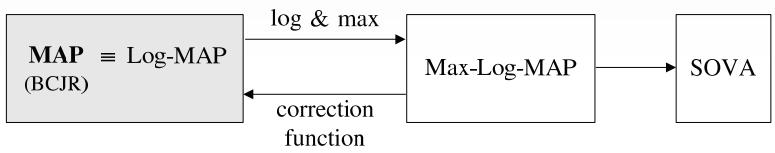  
รูปที่ 3.1 ความสัมพันธ์ของ MAP, Log-MAP, Max-Log-MAP, และ SOVA

## 3.1 บทนำ

วงจรตรวจหาวีเทอร์บิ (Viterbi detector) [10, 13] เป็นวงจรตรวจหาแบบควรจะเป็นสูงสุดหรือ วงจรตรวจหาแบบ ML (maximนum-likelihood) โดยข้อมูลเอาต์พุตทีได้จะเป็นค่าประมาณของลำดับ ข้อมูลที่ต้องการตรวจหา หรืออาจกล่าวได้ว่าวงจรตรวจหาแบบ ML จะทำให้ข้อผิดพลาดของลำดับ ข้อมูลมีค่าน้อยสุด แต่ไม่ได้รับประกันว่าบิตข้อมูลแต่ละบิตที่อยู่ในลำดับข้อมูลนั้นเป็นบิตข้อมูลที วงจรตรวจหาวีเทอร์บิไม่สามารถนำมาใช้ในระบบการถอดรหัสแบบวนซ้ำได้ เพราะระบบนี้ จะมีการ แลกเปลี่ยนข่าวสารแบบซอฟต์ (หรือความน่าเชือถือของบิตข้อมูล) ระหว่างวงจรตรวจหาแบบ รIร0 (soft input soft output) และวงจรถอดรหัสแบบ SISO

อัลกอริทึม BCJR เป็นอัลกอริทึมแบบ MAP ที่ได้ถูกนำมาใช้ในระบบการถอดรหัสแบบ วนซ้ำในช่วงแรก อย่างไรก็ตามอัลกอริทึม BCJR มีข้อจำกัดในการนำไปใช้จริงในชิปประมวลผล สัญญาณของหลายๆ งานประยุกต์ ดังนั้นนักวิจัยจึงได้พัฒนาอัลกอริทึม Max-Log-MAP และ SOVA ซึ่งมีสมรรถนะใกล้เคียงกับอัลกอริทึม BCJR จากนั้นในเวลาต่อมาจึงได้พัฒนาอัลกอริทึม Log-MAP ที่มีสมรรถนะเทียบเท่ากับอัลกอริทึม BCJR แต่มีความซับซ้อนน้อยกว่ามาก จึงทำให้ สามารถนำไปใช้จริงในชิปประมวลผลสัญญาณได้ รูปที่ 3.1 แสดงความสัมพันธ์ของอัลกอริทึมแบบ MAP และอัลกอริทึมที่เหมือน MAP

## 3.2 อัลกอริทึม MAX-LOG-MAP

อัลกอริทึม Max-L0g-MAP [23, 24, 38, 39] พัฒนามาจากอัลกอริทึม BCJR โดยอาศัยฟังก์ชัน ค่าสูงสุด (maximum function) และฟังก์ชันลอการิทึม (logarithm function) โดยมีจุดประสงค์ หลักเพื่อให้สามารถนำมาใช้จริงในทางปฏิบัติได้ (นั่นคือใช้ในชิปประมวลผลสัญญาณได้) และยังคง มีสมรรถนะใกล้เคียงกับอัลกอริทึม BCJR โดยทั่วไปอัลกอริทึม Max-Log-MAP จะถือว่าเป็น อัลกอริทึมเหมาะที่สุดแบบรอง (รนboุtimลl) ซึ่งให้ข้อมูลเอาต์พุตแบบซอฟต์ที่มีคุณภาพด้อยกว่า ข้อมูลเอาต์พตแบบซอฟต์ของอัลกอริทึม BCJR

จากแบบจำลองช่องสัญญาณและสมการต่างๆ ของอัลกอริทึม BCJR ในหัวข้อที่ 2.2 การทำให้อัลกอริทึม Max-Log-MAP อยู่ในรูปที่ง่ายต่อการนำไปใช้งานจริงจะอาศัยเอกลักษณ์ ของลอการิทึมที่ว่า $x _ { i } = e ^ { \ln ( x _ { i } ) }$ และสูตรการประมาณค่าลอการิทึม [24]

$$
\ln \left( e ^ { x _ { 1 } } + e ^ { x _ { 2 } } + . . . + e ^ { x _ { n } } \right) \approx \operatorname* { m a x } _ { i \in \{ 1 , . . . , n \} } ( x _ { i } )\tag{3.1}
$$

เมื่อ $x _ { i }$ คือเลขจำนวนจริง และ ท คือเลขจำนวนเต็มบวก ดังนั้นค่า LR ของบิตข้อมูล $a _ { k }$ ในสมการ (2.24) จัดรูปใหม่ได้เป็น

$$
\lambda _ { p } \left( a _ { k } \right) = \ln \left( \sum _ { \left( u , q \right) \in S _ { 1 } } \alpha _ { k } \left( u \right) \gamma _ { k } \left( u , q \right) \beta _ { k + 1 } \left( q \right) \right) - \ln \left( \sum _ { \left( u , q \right) \in S _ { - 1 } } \alpha _ { k } \left( u \right) \gamma _ { k } \left( u , q \right) \beta _ { k + 1 } \left( q \right) \right)\tag{3.2}
$$

พิจารณาพจน์แรกทางด้านขวามือของสมการ (3.2) จะได้

$$
\begin{array} { r l } { \displaystyle \operatorname { l n i m } \left( \displaystyle \sum _ { ( u , q ] \in S _ { 1 } } \alpha _ { k } \left( u \right) \cap _ { \mathbb { H } } \left( u , q \right) \beta _ { k + 1 } \left( q \right) \right) = \ln \left( \displaystyle \sum _ { ( u , q ] \in S _ { 1 } } e ^ { \ln ( \alpha _ { k } \left( u \right) \cdot \hat { \gamma } _ { \mathbb { H } } \left( u , q \right) \beta _ { k + 1 } \left( q \right) ) } \right) } & { } \\ { = \ln \left( \displaystyle \sum _ { ( u , q ] \in S _ { 1 } } e ^ { \ln ( \alpha _ { \mathbb { H } } \left( u \right) ) + \ln \left( \gamma _ { \mathbb { H } } \left( u , q \right) \right) + \ln \left( \beta _ { k + 1 } \left( q \right) \right) } \right) } & { } \\ { = \ln \left( \displaystyle \sum _ { ( u , q ] \in S _ { 1 } } e ^ { \bar { \alpha } _ { k } \left( u \right) + \bar { \gamma } _ { \mathbb { H } } \left( u , q \right) + \bar { \gamma } _ { \mathbb { H } + 1 } \left( q \right) } \right) } & { } \end{array}\tag{3.3}
$$

เมื่อ

$$
\tilde { \gamma } _ { k } \left( u , q \right) = \ln \left( \gamma _ { k } \left( u , q \right) \right)\tag{3.4}
$$

$$
\tilde { \alpha } _ { k } \left( u \right) = \ln \left( \alpha _ { k } \left( u \right) \right)\tag{3.5}
$$

$$
\widetilde { \beta } _ { k + 1 } \left( q \right) = \ln \left( \beta _ { k + 1 } \left( q \right) \right)\tag{3.6}
$$

จากสมการ (3.1) ทำให้ประมาณค่าสมการ (3.3) ได้เป็น

$$
\ln \left( \sum _ { ( u , q ) \in S _ { 1 } } \alpha _ { k } \left( u \right) \gamma _ { k } \left( u , q \right) \beta _ { k + 1 } \left( q \right) \right) \approx \operatorname* { m a x } _ { \left( u , q \right) \in S _ { 1 } } \left( \tilde { \alpha } _ { k } \left( u \right) + \tilde { \gamma } _ { k } \left( u , q \right) + \tilde { \beta } _ { k + 1 } \left( q \right) \right)\tag{3.7}
$$

ในทำนองเดียวกันพจน์ที่สองทางด้านขวามือของสมการ (3.2) จะได้ว่า

$$
\ln \left( \sum _ { \left( u , q \right) \in S _ { - 1 } } \alpha _ { k } \left( u \right) \gamma _ { k } \left( u , q \right) \beta _ { k + 1 } \left( q \right) \right) \approx \operatorname* { m a x } _ { \left( u , q \right) \in S _ { - 1 } } \left( \tilde { \alpha } _ { k } \left( u \right) + \tilde { \gamma } _ { k } \left( u , q \right) + \tilde { \beta } _ { k + 1 } \left( q \right) \right)\tag{3.8}
$$

แทนค่าสมการ (3.7) และ (3.8) ลงในสมการ (3.2) จะได้ค่า LLR ของบิตข้อมูล $a _ { k }$ สำหรับ อัลกอริทึม Max-Log-MAP มีค่าเท่ากับ

$$
\lambda _ { p } \left( a _ { k } \right) \approx \operatorname* { m a x } _ { \left( u , q \right) \in S _ { 1 } } \left( \tilde { \alpha } _ { k } \left( u \right) + \tilde { \gamma } _ { k } \left( u , q \right) + \tilde { \beta } _ { k + 1 } \left( q \right) \right) - \operatorname* { m a x } _ { \left( u , q \right) \in S _ { - 1 } } \left( \tilde { \alpha } _ { k } \left( u \right) + \tilde { \gamma } _ { k } \left( u , q \right) + \tilde { \beta } _ { k + 1 } \left( q \right) \right)\tag{3.9}
$$

## การหาค่า $\tilde { \gamma } _ { k } \left( u , q \right)$ ในสมการ (3.4)

ใส่ฟังก์ชันลอการิทึมธรรมชาติทั้งสองข้างของสมการ (2.29) จะได้เมตริกสาขาใหม่คือ

$$
\widetilde { \gamma } _ { k } \left( u , q \right) = \ln \left( { \frac { 1 } { \sqrt { 2 \pi \sigma ^ { 2 } } } } \right) - { \frac { 1 } { 2 \sigma ^ { 2 } } } \bigl \vert y _ { k } - \widehat { r } \left( u , q \right) \bigr \vert ^ { 2 } + { \frac { \hat { a } \left( u , q \right) \lambda _ { a } \left( a _ { k } \right) } { 2 } }\tag{3.10}
$$

## การหาค่า $\tilde { \alpha } _ { k } \left( u \right)$ ในสมการ (3.5)

ใส่ฟังก์ชันลอการิทึมทั้งสองข้างของสมการ (2.14) จะได้

$$
\begin{array} { l } { { \displaystyle \widetilde { \alpha } _ { k + 1 } \left( q \right) = \ln \left( \alpha _ { k + 1 } \left( q \right) \right) = \ln \left( \displaystyle \sum _ { u = 0 } ^ { Q - 1 } \gamma _ { k } \left( u , q \right) \alpha _ { k } \left( u \right) \right) = \ln \left( \displaystyle \sum _ { u = 0 } ^ { Q - 1 } e ^ { \ln \left( \gamma _ { k } \left( u , q \right) \alpha _ { k } \left( u \right) \right) } \right) } } \\ { ~ } \\ { { \displaystyle \qquad = \ln \left( \displaystyle \sum _ { u = 0 } ^ { Q - 1 } e ^ { \ln \left( \gamma _ { k } \left( u , q \right) \right) + \ln \left( \alpha _ { k } \left( u \right) \right) } \right) } } \\ { { \displaystyle \qquad = \ln \left( \displaystyle \sum _ { u = 0 } ^ { Q - 1 } e ^ { \widetilde { \mathrm { i } } _ { u } \left( u , q \right) + \widetilde { \mathrm { e } } _ { u } \left( u \right) } \right) } } \end{array}\tag{3.11}
$$

จากสมการ (3.1) ทำให้ประมาณค่าสมการ (3.11) ได้เป็น

$$
\tilde { \alpha } _ { k + 1 } \left( q \right) \approx \underset { \forall u } { \operatorname* { m a x } } \left( \tilde { \gamma } _ { k } \left( u , q \right) + \tilde { \alpha } _ { k } \left( u \right) \right)\tag{3.12}
$$

สำหรับทุกสถานะ q ที่ทำให้การเปลี่ยนสถานะ (u, ) ในแผนภาพเทรลลิสเป็นจริง

การหาค่า $\widetilde { \beta } _ { k + 1 } \left( q \right)$ ในสมการ (3.6)

ใส่ฟังก์ชันลอการิทึมทั้งสองข้างของสมการ (2.16) จะได้

$$
\begin{array} { l } { { \displaystyle \widetilde { \mathfrak { J } } _ { k } \left( u \right) = \ln \left( \mathfrak { J } _ { k } \left( u \right) \right) = \ln \left( \displaystyle \sum _ { q = 0 } ^ { Q - 1 } \beta _ { k + 1 } \left( q \right) \gamma _ { k } \left( u , q \right) \right) = \ln \left( \displaystyle \sum _ { q = 0 } ^ { Q - 1 } e ^ { \ln \left( \beta _ { k + 1 } \left( q \right) \gamma _ { k } \left( u , q \right) \right) } \right) } } \\ { { \displaystyle \qquad = \ln \left( \displaystyle \sum _ { q = 0 } ^ { Q - 1 } e ^ { \ln \left( \beta _ { k + 1 } \left( q \right) \right) + \ln \left( \gamma _ { k } \left( u , q \right) \right) } \right) } } \\ { { \displaystyle \qquad = \ln \left( \displaystyle \sum _ { q = 0 } ^ { Q - 1 } e ^ { \bar { \mathfrak { J } } _ { k + 1 } \left( q \right) + \gamma _ { k } \left( u , q \right) } \right) } } \end{array}\tag{3.13}
$$

ในทำนองเดียวกันจากสมการ (3.1) ทำให้ประมาณค่าสมการ (3.13) ได้เป็น

$$
\tilde { \beta } _ { k } \left( u \right) \approx \operatorname* { m a x } _ { \forall q } \left( \tilde { \beta } _ { k + 1 } \left( q \right) + \tilde { \gamma } _ { k } \left( u , q \right) \right)\tag{3.14}
$$

สำหรับทุกสถานะ น ที่ทำให้การเปลี่ยนสถานะ $( u , \ q )$ เป็นจริงในแผนภาพเทรลลิส

## 3.2.1 สรุปขั้นตอนการทำงานของอัลกอริทึม Max-Log-MAP

อัลกอริทึม Max-Log-MAP มีขั้นตอนการทำงานต่างๆ เหมือนกับอัลกอริทึม BCJR ในรูปที่ 2.12 เพียงแต่อัลกอริทึม Max-Log-MAP จะใช้สมการ (3.9) ในการหาค่า LLR ของบิตข้อมูล $a _ { k }$ โดยที่ พารามิเตอร์ $\widetilde { \gamma } _ { k } \left( u , q \right) , \widetilde { \alpha } _ { k } \left( u \right)$ และ $\tilde { \beta } _ { k + 1 } \mathopen { } \mathclose \bgroup \left( q \aftergroup \egroup \right)$ หาได้จากสมการ (3.10), (3.12) และ (3.14) ตาม ลำดับ รูปที่ 3.2 สรุปขั้นตอนการทำงานของอัลกอริทึม Max-Log-MAP

หมายเหตุ การนำอัลกอริทึม Max-Log-MAP ในรูปที่ 3.2 ไปใช้งานจริงในทางปฏิบัติ ไม่จำเป็นต้อง ทำการนอร์มอลไลเซชัน (normalization) ค่าเมตริกสถานะ $\tilde { \alpha } _ { k } \left( u \right)$ และ $\tilde { \beta } _ { k } \left( u \right)$ สำหรับทุกสถานะ u และทุกเวลา k เช่นเดียวกับที่ทำในอัลกอริทึม BCJR เพราะอัลกอริทึม Max-Log-MAP จะไม่ พบปัญหาเรืองน้อยเกินเก็บเชิงตัวเลข (numerical underflow)

อัลกอริทึม Max-Log-MAP   
1. กำหนดค่าเริ่มต้นเมตริกสถานะ $\left[ \tilde { \alpha } _ { 0 } \left( 0 \right) , \tilde { \alpha } _ { 0 } \left( 1 \right) , . . . , \tilde { \alpha } _ { 0 } \left( Q - 1 \right) \right] = \left[ 0 , - \infty , . . . , - \infty \right]$   
2. การเวียนเกิดแบบข้างหน้า (forward recursion)   
สำหรับ $k = 0 , 1 , . . . , L + \nu - 1$   
สำหรับ $q = 0 , 1 , . . . , Q - 1$   
คำนวณหาค่า $\tilde { \gamma } _ { k } \left( u , q \right)$ ตามสมการ (3.10) สำหรับทุก น ที่ทำให้ $( u , \ q )$ เป็นจริง   
คำนวณหาค่า $\tilde { \alpha } _ { k + 1 } \left( q \right)$ ตามสมการ (3.12)   
(สิ้นสุดการวนซ้ำของ q)   
(สิ้นสุดการวนซ้ำของ k)   
3. กำหนดค่าเริ่มต้นเมตริกสถานะ $^ { 1 0 } \left[ \tilde { \beta } _ { L + \nu } \left( 0 \right) , \tilde { \beta } _ { L + \nu } \left( 1 \right) , . . . , \tilde { \beta } _ { L + \nu } \left( Q - 1 \right) \right] = \left[ 0 , - \infty , . . . , - \infty \right]$   
4. การเวียนเกิดแบบย้อนกลับ (backward recursion)   
สำหรับ $k = L + \nu - 1 , L + \nu - 2 , . . . , 0$   
สำหรับ $u = 0 , 1 , . . . , Q - 1$   
คำนวณหาค่า $\widetilde { \gamma } _ { k } \left( u , q \right)$ ตามสมการ (3.10) สำหรับทุก q ที่ทำให้ $( u , \ q )$ เป็นจริง   
คำนวณหาค่า $\widetilde { \beta } _ { k } \left( u \right)$ ตามสมการ (3.14)   
(สิ้นสุดการวนซ้ำของ u)   
คำนวณหาค่า $\lambda _ { p } \left( a _ { k } \right)$ ตามสมการ (3.9)   
ตัดสินใจหาค่า $a _ { k }$ ตามสมการ (2.25)   
(สิ้นสุดการวนซ้ำของ k)  
รูปที่ 3.2 ขั้นตอนการทำงานของอัลกอริทึม Max-Log-MAP

ตัวอย่างที่ 3.1 จากตัวอย่างที่ 2.4 จงแสดงขั้นตอนการถอดรหัสข้อมูล $y _ { k }$ โดยใช้อัลกอริทึม Max-  
Log-MAP และกำหนดให้ข่าวสารอะพิรืออริของบิตข้อมูล $a _ { k }$ คือ ${ \lambda } _ { a } \left( a _ { k } \right) = \{ 2 , - 2 , 2 , 0 \}$   
วิธีทำ จากตัวอย่างที่ 2.4 ข้อมูลที่ต้องการให้ใช้อัลกอริทึม Max-Log-MAP ตรวจหาคือ   
$y _ { k } = \{ y _ { 0 } , ~ y _ { 1 } , ~ y _ { 2 } , ~ y _ { 3 } \} = \{ 0 . 9 , ~ - 0 . 2 , ~ 0 . 3 , ~ 0 . 6 \}$   
10 เมื่อสมมติว่ามีการบังคับให้ทุกเส้นสาขาในแผนภาพเทรลลิสสิ้นสุดที่สถานะ ป $_ L { + } , = 0$ มิฉะนั้นต้องกำหนดค่าเริ่มต้น   
ของ $\beta _ { L + \nu } \left( q \right) = \alpha _ { L + \nu } \left( q \right)$ สำหรับทุกสถานะ q

และแผนภาพเทรลลิสของช่องสัญญาณ $H ( D ) = 1 + 0 . 5 D$ แสดงในรูปที่ 2.13 ซึ่งมีสองสถานะ คือสถานะ (a) และสถานะ (b) ดังนั้นการถอดรหัสข้อมูลของอัลกอริทึม Max-Log-MAP มีขั้นตอน

1.กำหนดค่าเริ่มต้นของเมตริกสถานะ $\tilde { \alpha } _ { 0 } \left( a \right) = 0$ และ $\tilde { \alpha } _ { 0 } \left( b \right) = - \infty$

## การเวียนเกิดแบบข้างหน้า

2. ระยะที่ 0 (เมื่อ k = 0) อัลกอริทึม Max-Log-MAP รับข้อมูล $y _ { 0 } = 0 . 9$ และ $\textstyle \bigwedge _ { a } \left( a _ { 0 } \right) = 2$ มาใช้คำนวณหาเมตริกสาขา $\tilde { \gamma } _ { 0 } \left( u , q \right)$ ตามสมการ (3.10) สำหรับทุกค่า น และ q ทีทำให้ การเปลี่ยนสถานะ (u, q) เป็นจริงตามแผนภาพเทรลลิสในรูปที่ 2.13 ซึ่งจะได้

$$
\widetilde { \gamma } _ { 0 } \left( a , a \right) = 0 - \pi \lvert 0 . 9 - ( - 1 . 5 ) \rvert ^ { 2 } + \frac { ( - 1 ) ( 2 ) } { 2 } \approx - 1 9 . 0 9 5 6
$$

$$
\widetilde { \gamma } _ { 0 } \left( b , a \right) = 0 - \pi \left| 0 . 9 - \left( - 0 . 5 \right) \right| ^ { 2 } + \frac { ( - 1 ) ( 2 ) } { 2 } \approx - 7 . 1 5 7 5
$$

$$
\widetilde { \gamma } _ { 0 } \left( a , b \right) = 0 - \pi \left| 0 . 9 - { \left( 0 . 5 \right) } \right| ^ { 2 } + \frac { ( + 1 ) ( 2 ) } { 2 } \approx 0 . 4 9 7 3
$$

$$
\widetilde { \gamma } _ { 0 } \left( b , b \right) = 0 - \pi \lvert 0 . 9 - ( 1 . 5 ) \rvert ^ { 2 } + \frac { ( + 1 ) ( 2 ) } { 2 } \approx - 0 . 1 3 0 9
$$

เนื่องจาก $\sigma ^ { 2 } = 1 / \left( 2 \pi \right)$ จากนั้นทำการปรับค่าเมตริกสถานะตามสมการ (3.12) ดังนี้

$$
\begin{array} { r l } & { \tilde { \alpha } _ { 1 } \left( a \right) = \operatorname* { m a x } \left\{ \tilde { \alpha } _ { 0 } \left( a \right) + \tilde { \gamma } _ { 0 } \left( a , a \right) , \ \tilde { \alpha } _ { 0 } \left( b \right) + \tilde { \gamma } _ { 0 } \left( b , a \right) \right\} } \\ & { \qquad = \operatorname* { m a x } \left\{ 0 + ( - 1 9 . 0 9 5 6 ) , \ - \infty + ( - 7 . 1 5 7 5 ) \right\} = - 1 9 . 0 9 5 6 } \end{array}
$$

$$
\begin{array} { c } { { \tilde { \alpha } _ { 1 } \left( b \right) = \operatorname* { m a x } \left\{ \tilde { \alpha } _ { 0 } \left( a \right) + \tilde { \gamma } _ { 0 } \left( a , b \right) , \ \tilde { \alpha } _ { 0 } \left( b \right) + \tilde { \gamma } _ { 0 } \left( b , b \right) \right\} } } \\ { { { } } } \\ { { = \operatorname* { m a x } \left\{ 0 + \left( 0 . 4 9 7 3 \right) , \ - \infty + \left( - 0 . 1 3 0 9 \right) \right\} = 0 . 4 9 7 3 } } \end{array}
$$

3. ระยะที่ 1 (เมื่อ k = 1) อัลกอริทึม Max-Log-MAP รับข้อมูล $y _ { 1 } = - 0 . 2$ และ $\textstyle \bigwedge _ { a } { \bigl ( } a _ { 1 } { \bigr ) } = - 2$ มาใช้คำนวณหาเมตริกสาขาทั้งหมดดังนี้

$$
\widetilde { \gamma } _ { 1 } \left( a , a \right) = 0 - \pi \left| - 0 . 2 - ( - 1 . 5 ) \right| ^ { 2 } + \frac { ( - 1 ) ( - 2 ) } { 2 } \approx - 4 . 3 0 9 3
$$

$$
\widetilde { \gamma } _ { 1 } \left( b , a \right) = 0 - \pi \left| - 0 . 2 - \left( - 0 . 5 \right) \right| ^ { 2 } + \frac { ( - 1 ) ( - 2 ) } { 2 } \approx 0 . 7 1 7 3
$$

$$
\widetilde { \gamma } _ { 1 } \left( a , b \right) = 0 - \pi \left| - 0 . 2 - \left( 0 . 5 \right) \right| ^ { 2 } + \frac { ( + 1 ) ( - 2 ) } { 2 } \approx - 2 . 5 3 9 4
$$

$$
\widetilde { \gamma } _ { 1 } \left( b , b \right) = 0 - \pi \left| - 0 . 2 - ( 1 . 5 ) \right| ^ { 2 } + \frac { ( + 1 ) ( - 2 ) } { 2 } \approx - 1 0 . 0 7 9 2
$$

จากนันทำการปรับค่าเมตริกสถานะ $\tilde { \alpha } _ { 2 } \left( a \right)$ และ $\tilde { \alpha } _ { 2 } \left( b \right)$ ดังนี้

$$
\begin{array} { r l } & { \tilde { \alpha } _ { 2 } \left( a \right) = \operatorname* { m a x } \left\{ \tilde { \alpha } _ { 1 } \left( a \right) + \tilde { \gamma } _ { 1 } \left( a , a \right) , \ \tilde { \alpha } _ { 1 } \left( b \right) + \tilde { \gamma } _ { 1 } \left( b , a \right) \right\} } \\ & { \qquad = \operatorname* { m a x } \left\{ \left( - 1 9 . 0 9 5 6 \right) + \left( - 4 . 3 0 9 3 \right) , \ \left( 0 . 4 9 7 3 \right) + \left( 0 . 7 1 7 3 \right) \right\} = 1 . 2 1 4 6 } \end{array}
$$

$$
\begin{array} { r l } & { \tilde { \alpha } _ { 2 } \left( b \right) = \operatorname* { m a x } \left\{ \tilde { \alpha } _ { 1 } \left( a \right) + \tilde { \gamma } _ { 1 } \left( a , b \right) , \ \tilde { \alpha } _ { 1 } \left( b \right) + \tilde { \gamma } _ { 1 } \left( b , b \right) \right\} } \\ & { \qquad = \operatorname* { m a x } \left\{ \left( - 1 9 . 0 9 5 6 \right) + \left( - 2 . 5 3 9 4 \right) , \ \left( 0 . 4 9 7 3 \right) + \left( - 1 0 . 0 7 9 2 \right) \right\} = - 9 . 5 8 1 9 } \end{array}
$$

4. ระยะที่ 2 และ 3 (เมื่อ k = {2, 3}) อัลกอริทึม Max-Log-MAP รับข้อมูล $\{ y _ { 2 } , y _ { 3 } \} = \{ 0 . 3 .$ 0.6} และ $\left\{ \lambda _ { a } \left( a _ { 2 } \right) , \lambda _ { a } \left( a _ { 3 } \right) \right\} = \left\{ 2 , 0 \right\}$ มาใช้คำนวณหาเมตริกสาขาทั้งหมดและปรับค่าเมตริก สถานะ $\tilde { \alpha } _ { k + 1 } \left( q \right)$ สำหรับ $q \in \{ a , b \}$ เช่นเดียวกันกับวิธีการที่อธิบายในขั้นตอนที่ 2 และ 3 ซึ่งจะได้ค่า $\widetilde { \gamma } _ { k } \left( u , q \right)$ และ $\tilde { \alpha } _ { k + 1 } \left( q \right)$ ตามที่แสดงในรูปที่ 3.3 โดยค่าที่อยูติดกับเส้นสาขาแต่ละ เส้นคือค่า $\tilde { \gamma } _ { k } \left( u , q \right)$ ที่สอดคล้องกับการเปลี่ยนสถานะ $( u , \ q )$ นั้นๆ และตัวเลขที่อยู่ตรงโหนด ของแต่ละสถานะแสดงถึงค่าเมตริกสถานะ $\tilde { \alpha } _ { k } \left( u \right)$ และ $\tilde { \beta } _ { k } \left( u \right)$ ในรูปเศษส่วนดังนี้

$$
\frac { \tilde { \alpha } _ { k } \left( u \right) } { \tilde { \beta } _ { k } \left( u \right) }
$$

สำหรับแต่ละ $k \in \{ 0 , 1 , 2 , 3 \}$ และ $u \in \{ a , b \}$ นันคือเมื่อสิ้นสุดการทำงานในช่วงการเวียน เกิดแบบข้างหน้า (forward recursion) ก็จะได้

$$
\tilde { \alpha } _ { 4 } \left( a \right) = - 1 . 7 1 2 4 \quad \mathrm { ~ \updownarrow \updownarrow \overleftrightarrow { \alpha } _ { 4 } \left( \updownarrow \right) = - 0 . 4 5 5 8 }
$$

5. กำหนดค่าเริ่มต้นของเมตริกสถานะ $\tilde { \beta } _ { 4 } \left( u \right) = \tilde { \alpha } _ { 4 } \left( u \right)$ สำหรับ $u \in \{ a , b \}$ นั่นคือ

$$
\tilde { \beta } _ { 4 } \left( a \right) = - 1 . 7 1 2 4 \quad \mathrm { ~ \forall ~ \vec { \Theta } ^ { \circ } ~ } \quad \tilde { \beta } _ { 4 } \left( b \right) = - 0 . 4 5 5 8
$$

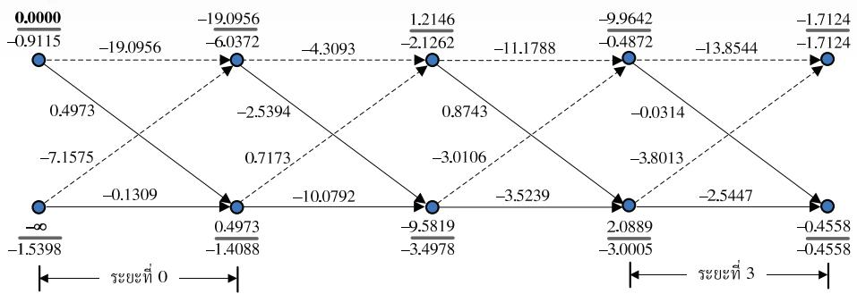  
รูปที่ 3.3 การคำนวณภายในอัลกอริทึม Max-Log-MAP ในตัวอย่างที่ 3.1

## การเวียนเกิดแบบย้อนกลับ

6. ระยะที่ 3 (เมื่อ k = 3) อัลกอริทึม Max-Log-MAP รับข้อมูล $y _ { 3 } = 0 . 6$ และ $\textstyle \bigwedge _ { a } \left( a _ { 3 } \right) = 0$ มาใช้คำนวณหาเมตริกสาขาทั้งหมดก็จะได้

$$
\begin{array} { l } { \displaystyle \tilde { \gamma } _ { 3 } \left( a , a \right) = 0 - \pi \left| 0 . 6 - \left( - 1 . 5 \right) \right| ^ { 2 } + \frac { \left( - 1 \right) \left( 0 \right) } { 2 } \approx - 1 3 . 8 5 4 4 } \\ { \displaystyle \tilde { \gamma } _ { 3 } \left( b , a \right) = 0 - \pi \left| 0 . 6 - \left( - 0 . 5 \right) \right| ^ { 2 } + \frac { \left( - 1 \right) \left( 0 \right) } { 2 } \approx - 3 . 8 0 1 3 } \\ { \displaystyle \tilde { \gamma } _ { 3 } \left( a , b \right) = 0 - \pi \left| 0 . 6 - \left( 0 . 5 \right) \right| ^ { 2 } + \frac { \left( + 1 \right) \left( 0 \right) } { 2 } \approx - 0 . 0 3 1 4 } \\ { \displaystyle \tilde { \gamma } _ { 3 } \left( b , b \right) = 0 - \pi \left| 0 . 6 - \left( 1 . 5 \right) \right| ^ { 2 } + \frac { \left( + 1 \right) \left( 0 \right) } { 2 } \approx - 2 . 5 4 4 7 } \end{array}
$$

จากนันทำการปรับค่าเมตริกสถานะ $\beta _ { 3 } \left( a \right)$ และ $\beta _ { 3 } \left( b \right)$ ดังนี้

$$
\begin{array} { r l } & { \tilde { \beta } _ { 3 } \left( a \right) = \operatorname* { m a x } \left\{ \tilde { \gamma } _ { 3 } \left( a , a \right) + \tilde { \beta } _ { 4 } \left( a \right) , \ \tilde { \gamma } _ { 3 } \left( a , b \right) \tilde { \beta } _ { 4 } \left( b \right) \right\} } \\ & { \qquad = \operatorname* { m a x } \left\{ \left( - 1 3 . 8 5 4 4 \right) + \left( - 1 . 7 1 2 4 \right) , \ \left( - 0 . 0 3 1 4 \right) + \left( - 0 . 4 5 5 8 \right) \right\} = - 0 . 4 8 7 2 } \end{array}
$$

$$
\begin{array} { r l } & { \widetilde { \beta } _ { 3 } \left( b \right) = \operatorname* { m a x } \left\{ \widetilde { \gamma } _ { 3 } \left( b , a \right) + \widetilde { \beta } _ { 4 } \left( a \right) , \ \widetilde { \gamma } _ { 3 } \left( b , b \right) \widetilde { \beta } _ { 4 } \left( b \right) \right\} } \\ & { \qquad = \operatorname* { m a x } \left\{ \left( - 3 . 8 0 1 3 \right) + \left( - 1 . 7 1 2 4 \right) , \ \left( - 2 . 5 4 4 7 \right) + \left( - 0 . 4 5 5 8 \right) \right\} = - 3 . 0 0 0 5 } \end{array}
$$

จากนันทำการคำนวณหาค่า $\lambda _ { p } \left( a _ { 3 } \right)$ ตามสมการ (3.9) นั่นคือ

$$
\begin{array} { r l } & { \begin{array} { r l } & { \Lambda _ { p } \left( a _ { 3 } \right) \approx \operatorname* { m a x } \left\{ \left( \tilde { \alpha } _ { 3 } \left( a \right) + \tilde { \gamma } _ { 3 } \left( a , b \right) + \tilde { \beta } _ { 4 } \left( b \right) \right) , \ \left( \tilde { \alpha } _ { 3 } \left( b \right) + \tilde { \gamma } _ { 3 } \left( b , b \right) + \tilde { \beta } _ { 4 } \left( b \right) \right) \right\} } \\ & { \qquad - \operatorname* { m a x } \left\{ \left( \tilde { \alpha } _ { 3 } \left( a \right) + \tilde { \gamma } _ { 3 } \left( a , a \right) + \tilde { \beta } _ { 4 } \left( a \right) \right) , \ \left( \tilde { \alpha } _ { 3 } \left( b \right) + \tilde { \gamma } _ { 3 } \left( b , a \right) + \tilde { \beta } _ { 4 } \left( a \right) \right) \right\} } \\ & { \qquad = \operatorname* { m a x } \left\{ \left( - 9 . 9 6 4 2 - 0 . 0 3 1 4 - 0 . 4 5 5 8 \right) , \ \left( 2 . 0 8 8 9 - 2 . 5 4 4 7 - 0 . 4 5 5 8 \right) \right\} } \\ & { \qquad - \operatorname* { m a x } \left\{ \left( - 9 . 9 6 4 2 - 1 3 . 8 5 4 4 - 1 . 7 1 2 4 \right) , \ \left( 2 . 0 8 8 9 - 3 . 8 0 1 3 - 1 . 7 1 2 4 \right) \right\} } \\ & { \qquad = \left( - 0 . 9 1 1 6 \right) - \left( - 3 . 4 2 4 8 \right) = 2 . 5 1 3 2 } \end{array} } \end{array}
$$

สู เนืองจาก $\lambda _ { p } \left( a _ { 3 } \right) > 0$ ดังนันอัลกอริทึม Max-Log-MAP จะถอดรหัสข้อมูลเป็น $\hat { a } _ { 3 } = + 1$

7. ระยะที่ 2 (เมื่อ k = 2) อัลกอริทึม Max-Log-MAP รับข้อมูล $y _ { 2 } = 0 . 3$ และ $\textstyle \bigwedge _ { a } \left( a _ { 2 } \right) = 2$ มาใช้คำนวณหาเมตริกสาขาทั้งหมดก็จะได้

$$
\widetilde { \gamma } _ { 2 } \left( a , a \right) = 0 - \pi \left| 0 . 3 - \left( - 1 . 5 \right) \right| ^ { 2 } + \frac { ( - 1 ) ( 2 ) } { 2 } \approx - 1 1 . 1 7 8 8
$$

$$
\widetilde { \gamma } _ { 2 } \left( b , a \right) = 0 - \pi \left| 0 . 3 - \left( - 0 . 5 \right) \right| ^ { 2 } + \frac { \left( - 1 \right) \left( 2 \right) } { 2 } \approx - 3 . 0 1 0 6
$$

$$
\widetilde { \gamma } _ { 2 } \left( a , b \right) = 0 - \pi \left| 0 . 3 - \left( 0 . 5 \right) \right| ^ { 2 } + \frac { ( + 1 ) ( 2 ) } { 2 } \approx 0 . 8 7 4 3
$$

$$
\widetilde { \gamma } _ { 2 } \left( b , b \right) = 0 - \pi \left| 0 . 3 - ( 1 . 5 ) \right| ^ { 2 } + \frac { ( + 1 ) ( 2 ) } { 2 } \approx - 3 . 5 2 3 9
$$

จากนันทำการปรับค่าเมตริกสถานะ $\tilde { \beta } _ { 2 } \left( a \right)$ และ $\tilde { \beta } _ { 2 } \left( b \right)$ ดังนี้

$$
\begin{array} { r l } & { \tilde { \beta } _ { 2 } \left( a \right) = \operatorname* { m a x } \left\{ \tilde { \gamma } _ { 2 } \left( a , a \right) + \tilde { \beta } _ { 3 } \left( a \right) , \ \tilde { \gamma } _ { 2 } \left( a , b \right) \tilde { \beta } _ { 3 } \left( b \right) \right\} } \\ & { \qquad = \operatorname* { m a x } \left\{ \left( - 1 1 . 1 7 8 8 \right) + \left( - 0 . 4 8 7 2 \right) , \ \left( 0 . 8 7 4 3 \right) + \left( - 3 . 0 0 0 5 \right) \right\} = - 2 . 1 2 6 2 } \end{array}
$$

$$
\begin{array} { r l } & { \tilde { \beta } _ { 2 } \left( b \right) = \operatorname* { m a x } \left\{ \tilde { \gamma } _ { 2 } \left( b , a \right) + \tilde { \beta } _ { 3 } \left( a \right) , \ \tilde { \gamma } _ { 2 } \left( b , b \right) \tilde { \beta } _ { 3 } \left( b \right) \right\} } \\ & { \qquad = \operatorname* { m a x } \left\{ \left( - 3 . 0 1 0 6 \right) + \left( - 0 . 4 8 7 2 \right) , \ \left( - 3 . 5 2 3 9 \right) + \left( - 3 . 0 0 0 5 \right) \right\} = - 3 . 4 9 7 8 } \end{array}
$$

จากนันทำการคำนวณหาค่า $\lambda _ { p } \left( a _ { 2 } \right)$ ตามสมการ (3.9) นั่นคือ

$$
\begin{array} { r l } & { \boldsymbol { \Lambda } _ { p } \left( a _ { 2 } \right) \approx \operatorname* { m a x } \left\{ \left( \tilde { \alpha } _ { 2 } \left( a \right) + \tilde { \gamma } _ { 2 } \left( a , b \right) + \tilde { \beta } _ { 3 } \left( b \right) \right) , \ \left( \tilde { \alpha } _ { 2 } \left( b \right) + \tilde { \gamma } _ { 2 } \left( b , b \right) + \tilde { \beta } _ { 3 } \left( b \right) \right) \right\} } \\ & { \qquad - \operatorname* { m a x } \left\{ \left( \tilde { \alpha } _ { 2 } \left( a \right) + \tilde { \gamma } _ { 2 } \left( a , a \right) + \tilde { \beta } _ { 3 } \left( a \right) \right) , \ \left( \tilde { \alpha } _ { 2 } \left( b \right) + \tilde { \gamma } _ { 2 } \left( b , a \right) + \tilde { \beta } _ { 3 } \left( a \right) \right) \right\} } \\ & { = \operatorname* { m a x } \left\{ \left( 1 . 2 1 4 6 + 0 . 8 7 4 3 - 3 . 0 0 0 5 \right) , \ \left( - 9 . 5 8 1 9 - 3 . 5 2 3 9 - 3 . 0 0 0 5 \right) \right\} } \\ & { \qquad - \operatorname* { m a x } \left\{ \left( 1 . 2 1 4 6 - 1 1 . 1 7 8 8 - 0 . 4 8 7 2 \right) , \ \left( - 9 . 5 8 1 9 - 3 . 0 1 0 6 - 0 . 4 8 7 2 \right) \right\} } \\ & { = \left( - 0 . 9 1 1 6 \right) - \left( - 1 0 . 4 5 1 \right) = 9 . 5 3 9 4 } \end{array}
$$

สู เนืองจาก $\lambda _ { p } \left( a _ { 2 } \right) > 0$ ดังนันอัลกอริทึม Max-Log-MAP จะถอดรหัสข้อมูลได้เป็น $\hat { a } _ { 2 } = + 1$

8. ระยะที่1 และ 0 (เมื่อ $k = \{ 1 , 0 \} )$ อัลกอริทึม Max-Log-MAP รับข้อมูล $\{ y _ { 1 } , \ y _ { 0 } \} = \{ - 0 . 2 , \quad$ 0.9} และ $\left\{ \lambda _ { a } \left( a _ { 0 } \right) , \lambda _ { a } \left( a _ { 1 } \right) \right\} = \left\{ 2 , - 2 \right\}$ มาใช้คำนวณหาเมตริกสาขาทั้งหมดและปรับค่าเมตริก สถานะ $\tilde { \beta } _ { k } \left( u \right)$ สำหรับ $u \in \{ a , b \}$ เช่นเดียวกันกับวิธีการที่อธิบายในขั้นตอนที่ 6 และ 7 ก็จะ ได้ค่า $\widetilde { \gamma } _ { k } \left( u , q \right)$ และ $\tilde { \beta } _ { k } \left( u \right)$ ตามที่แสดงในรูปที่ 3.3 ดังนั้นเมื่อสิ้นสุดการเวียนเกิดแบบย้อน กลับจะได้

$$
\lambda _ { p } \left( a _ { 0 } \right) = 2 4 . 2 2 1 \ \quad \mathrm { { \textmu } l ealeph e } \quad \mathrm { { \lambda } } \setminus \left( a _ { 1 } \right) = - 1 2 . 1 6 8
$$

นั่นคืออัลกอริทึม Max-Log-MAP จะถอดรหัสบิตข้อมูล $a _ { 0 }$ และ $a _ { 1 }$ ได้เป็น $\hat { a } _ { 0 } = + 1$ และ $\hat { a } _ { 1 } = - 1$

9. เมื่อสิ้นสุดการทำงาน อัลกอริทึม Max-Log-MAP จะให้ค่า LLR แบบอะโพสเทอริออริของ บิตข้อมูล $a _ { k }$ คือ $\left\{ \lambda _ { p } \left( a _ { 0 } \right) , \lambda _ { p } \left( a _ { 1 } \right) , \lambda _ { p } \left( a _ { 2 } \right) , \lambda _ { p } \left( a _ { 3 } \right) \right\} \approx \left\{ 2 4 . 2 2 , - 1 2 . 1 7 , 9 . 5 4 , 2 . 5 1 \right\}$ และ ถอดรหัสบิตข้อมูลได้เป็น $\left\{ \hat { a } _ { 0 } , \hat { a } _ { 1 } , \hat { a } _ { 2 } , \hat { a } _ { 3 } \right\} = \left\{ 1 , - 1 , 1 , 1 \right\}$ (บิตสุดท้ายไม่มีอยู่จริงในระบบ แต่ เป็นผลลัพธ์ที่เกิดจากการทำคอนโวลูชัน) ซึ่งตรงกับบิตข้อมูล $\{ a _ { k } \}$ ที่ส่งมาจากวงจรภาคส่ง แสดงว่าไม่มีข้อผิดพลาดเกิดขึ้นจากการถอดรหัสข้อมูลด้วยอัลกอริทึม Max-Log-MAP

ตัวอย่างที่ 3.2 จากตัวอย่างที่ 2.5 จงถอดรหัสข้อมูล $y _ { k }$ โดยใช้อัลกอริทึม Max-Log-MAP และ กำหนดให้ข่าวสารอะพิรืออริของบิตข้อมูล $a _ { k }$ คือ $\lambda _ { a } \left( a _ { k } \right) = \{ 1 , - 1 , 2 , 1 , - 1 \}$

วิธีทำ จากตัวอย่างที่ 2.5 ข้อมูลที่ต้องการให้ใช้อัลกอริทึม Max-Log-MAP ตรวจหาคือ

$$
y _ { k } = \{ y _ { 0 } , ~ y _ { 1 } , ~ y _ { 2 } , ~ y _ { 3 } , ~ y _ { 4 } \} = \{ 1 . 2 , ~ - 0 . 7 , ~ - 0 . 2 , ~ 0 . 5 , ~ - 0 . 7 \}
$$

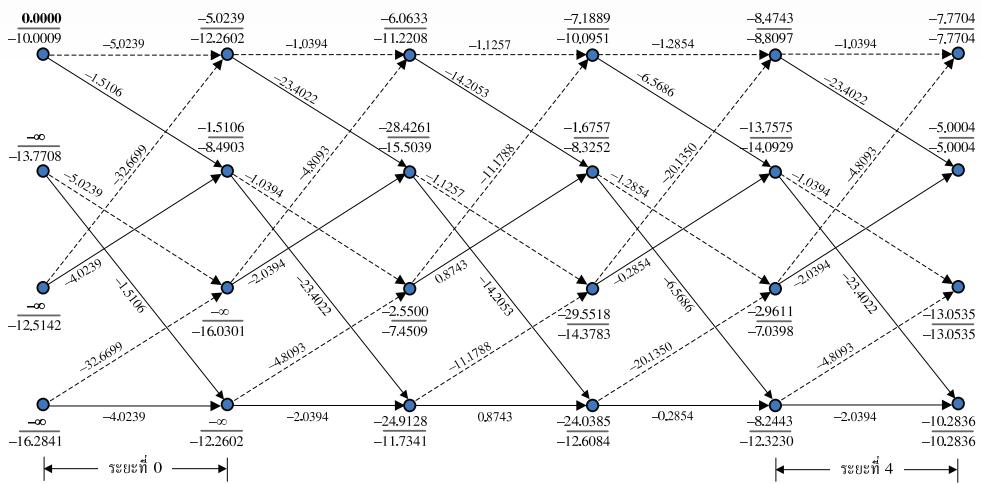  
รูปที่ 3.4 การคำนวณภายในอัลกอริทึม Max-Log-MAP ในตัวอย่างที่ 3.2

และมีแผนภาพเทรลลิสของช่องสัญญาณ $H ( D ) = 1 - D ^ { 2 }$ ตามรูปที่ 2.15 ซึ่งมีทั้งหมดส่สถานะ คือ สถานะ (a), (b), (c) และ (d)

จากนั้นทำการถอดรหัสข้อมูลโดยใช้อัลกอริทึม Max-Log-MAP เช่นเดียวกับวิธีการที อธิบายในตัวอย่างที่ 3.1 ก็จะได้ค่าเมตริกสาขาและเมตริกสถานะดังแสดงในรูปที่ 3.4 เมื่อค่าที่อยู ติดกับเส้นสาขาแต่ละเส้นคือค่า $\tilde { \gamma } _ { k } \left( u , q \right)$ และตัวเลขที่อยู่ติดกับโหนดของแต่ละสถานะแสดงถึง ค่าเมตริกสถานะ $\tilde { \alpha } _ { k } \left( u \right)$ และ $\tilde { \beta } _ { k } \left( u \right)$ ในรูปเศษส่วน $\tilde { \alpha } _ { k } \left( u \right) / \tilde { \beta } _ { k } \left( u \right)$ สำหรับแต่ละ $k \in \{ 0 , 1$ $\ldots , 4 \}$ และ $u \in \{ a , \ b , \ c , \ d \}$

จากค่าเมตริกสาขาและเมตริกสถานะดังแสดงในรูปที่ 3.4 ทำให้สามารถคำนวณหาค่า LLR แบบอะโพสเทอริออริของบิตข้อมูล $a _ { k }$ ตามสมการ (3.9) ซึ่งจะได้ว่า

$$
\left\{ \lambda _ { p } \left( a _ { 0 } \right) , \lambda _ { p } \left( a _ { 1 } \right) , \lambda _ { p } \left( a _ { 2 } \right) , \lambda _ { p } \left( a _ { 3 } \right) , \lambda _ { p } \left( a _ { 4 } \right) \right\} \approx \left\{ 7 . 2 8 , - 2 6 . 6 5 , 7 . 2 8 , - 1 0 . 5 7 , 5 . 5 4 \right\}
$$

และถอดรหัสบิตข้อมูลได้เป็น

$$
\left\{ \hat { a } _ { 0 } , \hat { a } _ { 1 } , \hat { a } _ { 2 } , \hat { a } _ { 3 } , \hat { a } _ { 4 } \right\} = \left\{ 1 , - 1 , 1 , - 1 , 1 \right\}
$$

ซึ่งตรงกับบิตข้อมูล $a _ { k }$ ที่ส่งมาจากวงจรภาคส่ง (สองบิตสุดท้ายไม่มีอยู่จริงในระบบ แต่เป็นผลลัพธ์ ที่เกิดจากการทำคอนโวลูชันระหว่างข้อมูลอินพุตและช่องสัญญาณ) แสดงว่าไม่มีข้อผิดพลาดเกิดขึ้น จากการถอดรหัสข้อมูลด้วยอัลกอริทึม Max-Log-MAP

## 3.2.2 ข้อสังเกตของอัลกอริทึม Max-Log-MAP

จากที่กล่าวมาข้างต้นอัลกอริทึม Max-Log-MAP จะทำการประมาณค่าเมตริกสถานะ $\alpha _ { k } \left( u \right)$ และ $\beta _ { k + 1 } \left( q \right)$ ของอัลกอริทึม BCJR โดยใช้ฟังก์ชันค่าสูงสุดตามสมการ (3.1) ดังนั้นอัลกอริทึม Max-Log-MAP จะเผชิญกับข้อผิดพลาดจากการประมาณค่า (approximation error) อย่างหลีกเลี่ยง ไม่ได้ และเนื่องจากเมตริกสถานะทั้งสองถูกคำนวณแบบเวียนเกิดทุกช่วงเวลา จึงทำให้ข้อผิดพลาด จากการประมาณค่าแพร่กระจาย (propagate) ไปตลอดทั้งลำดับข้อมูล y

โดยทั่วไปเมื่อัลกอริทึม Max-Log-MAP ทำงานที่ระดับ SNR สูง ก็จะพบปัญหาเรื่อง ข้อผิดพลาดจากการประมาณค่าน้อย อย่างไรก็ตามอัลกอริทึม Max-Log-MAP จะทำงานได้ไม่ดี เมื่อทำงานที่ระดับ รNR ต่ำ (เพราะข้อผิดพลาดจากการประมาณค่ามีความรุนแรงใกล้เคียงกับ สัญญาณรบกวนในระบบ [24] และเผชิญกับปัญหาเรื่องการแพร่กระจายของข้อผิดพลาดจากการ ประมาณค่า) ถึงแม้ว่าอัลกอริที่ม Max-Log-MAP จะมีความซับซ้อนน้อยกว่าอัลกอริทึม BCJR แต่ก็มีสมรรถนะด้อยกว่าอัลกอริทึม BCมR มาก ดังนั้นในการตัดสินใจว่าจะเลือกอัลกอริทึมไดมา ใช้งาน ผู้ใช้จะต้องประนีประนอมระหว่างความซับซ้อนและสมรรถนะที่ยอมรับได้ อย่างไรก็ตาม หัวข้อที่ 3.3 จะอธิบายอัลกอริทึม Log-MAP ซึ่งพัฒนามาจากอัลกอริทึม Max-Log-MAP โดยมี สมรรถนะเทียบเท่ากับอัลกอริที่ม BดJR แต่มีความความซับซ้อนน้อยกว่ามาก

## 3.3 อัลกอริทึม LOG-MAP

เนื่องจากอัลกอริทึม Max-Log-MAP ใช้สมการ (3.1) ในการประมาณค่าพารามิเตอร์ต่างๆ ของ อัลกอริทึม BตมR จึงทำให้เผชิญกับปัญหาเรื่องข้อผิดพลาดจากการประมาณค่า ซึ่งส่งผลให้มี สมรรถนะด้อยกว่าอัลกอริทึม BCมR อย่างไรก็ตามข้อผิดพลาดจากการประมาณค่าในสมการ (3.1) สามารถแก้ไขได้โดยใช้ฟังก์ชันลอการิทึมจาโคเบียน (Jacobian logarithm) [24, 38] นั้นคือ (ดู พิสูจน์ได้ในภาคผนวก ก)

$$
\begin{array} { r } { \ln \left( e ^ { x _ { 1 } } + e ^ { x _ { 2 } } \right) = \operatorname* { m a x } \left( x _ { 1 } , x _ { 2 } \right) + \ln \left( 1 + e ^ { - \left| x _ { 1 } - x _ { 2 } \right| } \right) } \\ { = \operatorname* { m a x } \left( x _ { 1 } , x _ { 2 } \right) + f _ { c } \left( \left| x _ { 1 } - x _ { 2 } \right| \right) } \end{array}\tag{3.15}
$$

เมื่อ $f _ { c } \left( \left. x _ { 1 } - x _ { 2 } \right. \right) = \ln \left( 1 + e ^ { - \left. x _ { 1 } - x _ { 2 } \right. } \right)$ คือฟังก์ชันแก้ไขข้อผิดพลาด (correction function) นอกจากนี้เพื่อให้ง่ายต่อการอธิบายหลักการทำงานของอัลกอริทึม Log-MAP จะนิยาม ฟังก์ชันค่าสูงสุดแบบใหม่ดังนี้

$$
\operatorname* { m a x } ^ { * } \left( x _ { 1 } , x _ { 2 } \right) = \operatorname* { m a x } \left( x _ { 1 } , x _ { 2 } \right) + f _ { c } \left( \left| x _ { 1 } - x _ { 2 } \right| \right)\tag{3.16}
$$

ดังนั้นค่า In $\left( e ^ { x _ { 1 } } + e ^ { x _ { 2 } } + . . . + e ^ { x _ { n } } \right)$ ในสมการ (3.1) สามารถหาค่าที่ถูกต้องได้ดังนี้ สมมุติว่าทราบค่า x ซึ่งมีค่าเท่ากับ $x = \ln \left( e ^ { x _ { 1 } } + e ^ { x _ { 2 } } + . . . + e ^ { x _ { n - 1 } } \right) = \ln ( \Delta )$ เมื่อ $\Delta = e ^ { x _ { 1 } } + e ^ { x _ { 2 } } + . . . + e ^ { x _ { n - 1 } } = e ^ { x }$ เพราะฉะนั้นจะได้ว่า

$$
\begin{array} { r l } & { \ln \left( e ^ { x _ { 1 } } + e ^ { x _ { 2 } } + \ldots + e ^ { x _ { n - 1 } } + e ^ { x _ { n } } \right) = \ln \left( \Delta + e ^ { x _ { n } } \right) = \ln \left( e ^ { \ln \left( \Delta \right) } + e ^ { x _ { n } } \right) } \\ & { \qquad = \operatorname* { m a x } \left( \ln \left( \Delta \right) , x _ { n } \right) + f _ { c } \left( \left| \ln \left( \Delta \right) - x _ { n } \right| \right) } \\ & { \qquad = \operatorname* { m a x } \left( x , x _ { n } \right) + f _ { c } \left( \left| x - x _ { n } \right| \right) } \\ & { \qquad = \operatorname* { m a x } ^ { * } \left( x , x _ { n } \right) } \end{array}\tag{3.17}
$$

การทำงานของอัลกอริทึม Log-MAP จะเหมือนกับอัลกอริทึม Max-Log-MAP เพียงแต่ จะประมาณค่าพารามิเตอร์ต่างๆ ของอัลกอริทึม BCR โดยอาศัยสมการ (3.16) และ (3.17) แทน สมการ (3.1) ดังนันจากสมการ (3.9) อัลกอริทึ่ม Log-MAP จะคำนวณหาค่า LLR ของบิตข้อมูล $a _ { k }$ ดังนี้

$$
\lambda _ { k } = \operatorname* { m a x } _ { ( u , q ) \in S _ { 1 } } ^ { * } \left( \hat { \alpha } _ { k } \left( u \right) + \tilde { \gamma } _ { k } \left( u , q \right) + \hat { \beta } _ { k + 1 } \left( q \right) \right) - \operatorname* { m a x } _ { ( u , q ) \in S _ { - 1 } } ^ { * } \left( \hat { \alpha } _ { k } \left( u \right) + \tilde { \gamma } _ { k } \left( u , q \right) + \hat { \beta } _ { k + 1 } \left( q \right) \right)\tag{3.18}
$$

โดยที่เมตริกสาขา $\tilde { \gamma } _ { k } \left( u , q \right)$ หาได้จากสมการ (3.10) และ

$$
\hat { \alpha } _ { k + 1 } \left( q \right) = \operatorname* { m a x } _ { \forall u } { { \left( \tilde { \gamma } _ { k } \left( u , q \right) + \hat { \alpha } _ { k } \left( u \right) \right) } }\tag{3.19}
$$

$$
\hat { \beta } _ { k } \left( u \right) = \operatorname* { m a x } _ { \forall q } \ast \left( \hat { \beta } _ { k + 1 } \left( q \right) + \tilde { \gamma } _ { k } \left( u , q \right) \right)\tag{3.20}
$$

ในทางปฏิบัติอัลกอริทึม Log-MAP จะมีสมรรถนะเทียบเท่ากับอัลกอริทึม BCJR แต่ใช้ทรัพยากร ในการคำนวณน้อยกว่า รวมทั้งมีความอ่อนไหวต่อค่าความแปรปรวนของสัญญาณรบกวนน้อยกว่า อัลกอริทึม BCJR อย่างไรก็ตามถึงแม้ว่าอัลกอริทึม Log-MAP จะมีสมรรถนะดีกว่าอัลกอริทึม e Max-Log-MAP แต่ก็มีความซับซ้อนมากกว่า เพราะฉะนันในการตัดสินใจว่าจะเลือกอัลกอริทึมใด มาใช้งาน ผู้ใช้จะต้องประนีประนอมระหว่างความซับซ้อนและสมรรถนะที่ยอมรับได้

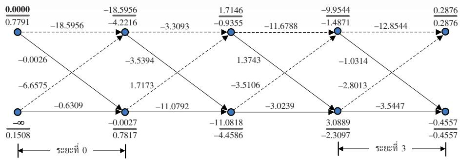  
รูปที่ 3.5 การคำนวณภายในอัลกอริทึม Log-MAP ในตัวอย่างที่ 3.3

ตัวอย่างที่ 3.3 จากตัวอย่างที่ 3.1 จงถอดรหัสข้อมูล $y _ { k }$ โดยใช้อัลกอริทึม Log-MAP และกำหนด ให้ข่าวสารอะพิริออริของบิตข้อมูล $a _ { k }$ คือ $\lambda _ { a } \left( a _ { k } \right) = \{ 1 , - 4 , 3 , - 2 \}$

วิธีทำ จากตัวอย่างที่ 3.1 อัลกอริทึม Log-MAP จะรับข้อมูล $y _ { k } = \{ 0 . 9 , - 0 . 2 , 0 . 3 , 0 . 6 \}$ และ $\lambda _ { a } \left( a _ { k } \right) = \{ 1 , - 4 , 3 , - 2 \}$ มาใช้ในการถอดรหัสข้อมูล เช่นเดียวกับวิธีการที่แสดงในตัวอย่างที่ 3.1 ซึ่งจะได้ค่าพารามิเตอร์ต่างๆ ของอัลกอริทึม Log-MAP ตามรูปที่ 3.5 เมื่อค่าที่อยู่ติดกับเส้นสาขา แต่ละเส้นคือค่า $\tilde { \gamma } _ { k } \left( u , q \right)$ และตัวเลขที่อยูติดกับโหนดของแต่ละสถานะแสดงถึงค่าเมตริกสถานะ $\hat { \alpha } _ { k } \left( u \right)$ และ $\hat { \beta } _ { k } \left( u \right)$ ในรูปเศษส่วน

$$
\frac { \hat { \alpha } _ { k } \left( u \right) } { \hat { \beta } _ { k } \left( u \right) }
$$

สำหรับแต่ละ $k \in \{ 0 , 1 , 2 , 3 \}$ และ $u \in \{ a , b \}$

จากค่าเมตริกสาขาและเมตริกสถานะดังแสดงในรูปที่ 3.5 ทำให้สามารถคำนวณหาค่า LLR แบบอะโพสเทอริออริของบิตข้อมูล $a _ { k }$ ตามสมการ (3.18) ซึ่งจะได้ว่า

$$
\left\{ \lambda _ { p } \left( a _ { 0 } \right) , \lambda _ { p } \left( a _ { 1 } \right) , \lambda _ { p } \left( a _ { 2 } \right) , \lambda _ { p } \left( a _ { 3 } \right) \right\} \approx \left\{ 2 3 . 6 0 , - 1 6 . 3 2 , 1 2 . 2 2 , - 1 . 4 9 \right\}
$$

และถอดรหัสบิตข้อมูลได้เป็น

$$
\left\{ \hat { a } _ { 0 } , \hat { a } _ { 1 } , \hat { a } _ { 2 } , \hat { a } _ { 3 } \right\} = \left\{ 1 , - 1 , 1 , - 1 \right\}
$$

ซึ่งตรงกับบิตข้อมูล $a _ { k }$ ข้อมูลด้วยอัลกอริทึม Log-MAP ตัวอย่างที่ 3.4 จากตัวอย่างที่ 3.2 จงถอดรหัสข้อมูล $y _ { k }$ โดยใช้อัลกอริทึม Log-MAP และกำหนด ให้ข่าวสารอะพิริออริของบิตข้อมูล $a _ { k }$ คือ $\lambda _ { a } \left( a _ { k } \right) = \{ - 1 , 2 , 1 , 2 , - 2 \}$

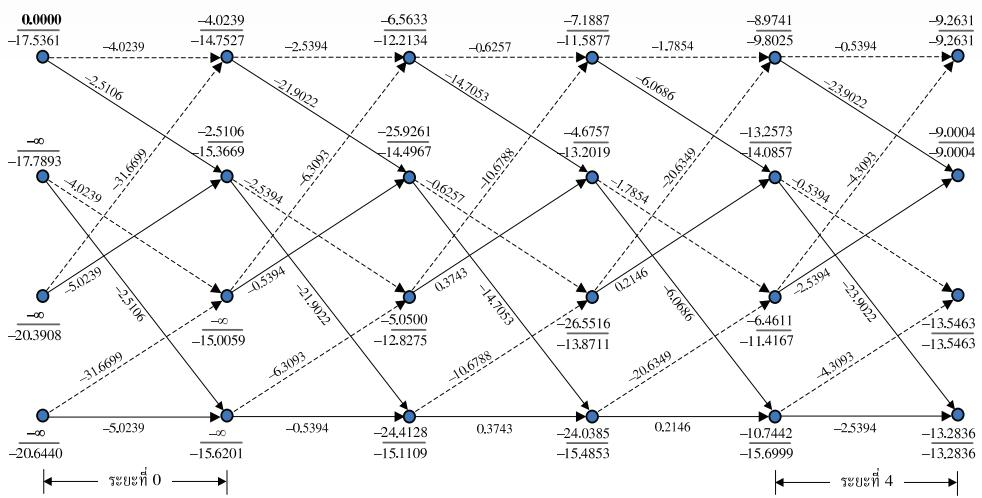  
รูปที่ 3.6 การคำนวณภายในอัลกอริทึม Log-MAP ในตัวอย่างที่ 3.4

วิธีทำ จากตัวอย่างที่ 3.2 อัลกอริทึม Log-MAP รับข้อมูล $y _ { k } = \{ 1 . 2 , - 0 . 7 , - 0 . 2 , 0 . 5 , - 0 . 7 \}$ และ $\lambda _ { a } \left( a _ { k } \right) = \{ - 1 , 2 , 1 , 2 , - 2 \}$ มาใช้ในการถอดรหัสข้อมูล ซึ่งจะได้ค่าพารามิเตอร์ต่างๆ ของ อัลกอริทึม Log-MAP ตามรูปที่ 3.6 เมื่อค่าที่อยู่ติดกับเส้นสาขาแต่ละเส้นคือค่า $\tilde { \gamma } _ { k } \left( u , q \right)$ และ ตัวเลขที่อยู่ติดกับโหนดของแต่ละสถานะแสดงถึงค่าเมตริกสถานะ $\hat { \alpha } _ { k } \left( u \right)$ และ $\hat { \beta } _ { k } \left( u \right)$ ในรูป เศษส่วน $\hat { \alpha } _ { k } \left( u \right) / \hat { \beta } _ { k } \left( u \right)$ สำหรับแต่ละ $k \in \{ 0 , 1 , 2 , 3 , 4 \}$ และ $u \in \{ a , \ b , \ c , \ d \}$

จากรูปที่ 3.6 ทำให้สามารถคำนวณหาค่า LLR แบบอะโพสเทอริออริของบิตข้อมูล $a _ { k }$ ตามสมการ (3.18) ซึ่งจะได้ว่า

$$
\left\{ \lambda _ { p } \left( a _ { 0 } \right) , \lambda _ { p } \left( a _ { 1 } \right) , \lambda _ { p } \left( a _ { 2 } \right) , \lambda _ { p } \left( a _ { 3 } \right) , \lambda _ { p } \left( a _ { 4 } \right) \right\} \approx \left\{ 0 . 8 9 9 , - 2 1 . 6 4 6 , 0 . 8 9 8 , - 8 . 5 6 6 , 0 . 5 2 5 \right\}
$$

และถอดรหัสบิตข้อมูลได้เป็น

$$
\left\{ \hat { a } _ { 0 } , \hat { a } _ { 1 } , \hat { a } _ { 2 } , \hat { a } _ { 3 } , \hat { a } _ { 4 } \right\} = \left\{ 1 , - 1 , 1 , 1 , 1 \right\}
$$

ซึ่งตรงกับบิตข้อมูล $a _ { k }$ ข้อมูลด้วยอัลกอริทึม Log-MAP

## 3.4 อัลกอริทึม SOVA

อัลกอริทึมวีเทอร์บิแบบซอฟต์หรือเรียกสั้นๆ ว่าอัลกอริทึม SOVA (soft output Viterbi algorithm) [19] เป็นอัลกอริทึมที่สามารถให้ข้อมูลเอาต์พุตเป็นค่า LLR ของบิตข้อมูลอินพุตได้เช่นเดียว กับอัลกอริทึม MAP (หรือ BCJR), Max-Log-MAP และ Log-MAP โดยทั่วไปอัลกอริทึม SOVA จะมีสมรรถนะเทียบเท่ากับอัลกอริทึม Max-Log-MAP แต่มีความซับซ้อนน้อยกว่า [39] จึงทำให้ อัลกอริทึม รอVA เป็นที่นิยมใช้งานในหลายๆงานประยุกต์ รวมถึงฮาร์ดดิสก์ไดรฟรุ่นใหม่ๆ ที่ใช้ ระบบการถอดรหัสข้อมูลแบบวนซำด้วย

หมายเหตุ ผู้อ่านควรทำความเข้าใจหลักการทำงานของอัลกอริทีมวีเทอร์บิ (ดูบทที่ 4 ในหนังสือ [10]) ก่อนศึกษาหลักการทำงานของอัลกอริทึม รOVA เพื่อให้สามารถเข้าใจอัลกอริทึม รOVA ไดง่ายยิงขึ้น

อัลกอริทีม ร0VA จะทำงานคล้ายกับอัลกอริทึมวีเทอร์บิ [13] เพียงแต่มีข้อแตกต่างที่ สำคัญอยู่สองประการคือ

1) อัลกอริทึม รoVA ใช้เมตริกสาขาที่ถูกปรับปรุง (modified branch metric) ที่รวมผลกระทบ ของความน่าจะเป็นอะพิริออริ (a priori probability) ของบิตข้อมูลอินพุต

2) อัลกอริทึม SOVA ให้ข้อมูลเอาต์พุตแบบซอฟต์ (soft oนtpนt) ที่เป็นตัวบอกถึงความน่าเชื่อถือ (reliability) ของการตัดสินใจของบิตข้อมูลแต่ละบิต

พิจารณาแบบจำลองช่องสัญญาณในรูปที่ 2.10 เมตริกสาขาของอัลกอริทึ่มวีเทอร์บิในระยะที่k (k-th รtage) ของการเปลี่ยนสถานะจากสถานะ u ที่เวลา kไปยังสถานะ q ที่เวลา $k + 1$ นั่นคือ $\rho _ { k } \left( u , q \right)$ มีค่าเท่ากับ [10, 13]

$$
{ \rho } _ { k } \left( u , q \right) = { \ln } \left( p \left( { y } _ { k } \mid { a } _ { k } \right) \right) = { \ln } \left( \frac { 1 } { \sqrt { 2 \pi { \sigma } ^ { 2 } } } \right) - \frac { 1 } { 2 { \sigma } ^ { 2 } } { \left| y _ { k } - \hat { r } \left( u , q \right) \right| } ^ { 2 }\tag{3.21}
$$

เมื่อ $\hat { r } ( u , q )$ คือข้อมูลเอาต์พุตของช่องสัญญาณที่สอดคล้องกับการเปลี่ยนสถานะ $( u , \ q )$ ตาม แผนภาพเทรลลิส และ $\sigma ^ { 2 }$ คือความแปรปรวนของสัญญาณรบกวน $n _ { k }$

ความน่าจะเป็นอะพิริออริของบิตข้อมูลอินพุต $a _ { k }$ สามารถใส่เข้าไปในเมตริกสาขาได้ตาม สมการ (3.10) ดังนั้นเมตริกสาขาที่ใช้ในอัลกอริทึม S0VA จะมีค่าเท่ากับ

$$
\widetilde { \gamma } _ { k } \left( u , q \right) = \ln \left( p \left( y _ { k } ; a _ { k } \right) \right) = \ln \left( \frac { 1 } { \sqrt { 2 \pi \sigma ^ { 2 } } } \right) - \frac { 1 } { 2 \sigma ^ { 2 } } \left| y _ { k } - \widehat { r } \left( u , q \right) \right| ^ { 2 } + \frac { \hat { a } \left( u , q \right) \lambda _ { a } \left( a _ { k } \right) } { 2 }\tag{3.22}
$$

สู เมื่อ $p \left( y _ { k } ; a _ { k } \right) = p \left( y _ { k } \mid a _ { k } \right) p \left( a _ { k } \right) , \hat { a } \left( u , q \right)$ คือข้อมูลอินพุตของช่องสัญญาณที่สอดคล้องกับการ เปลี่ยนสถานะ (u, q), และ $\lambda _ { a } \left( a _ { k } \right)$ คือค่าความน่าจะเป็นอะพิรืออริของบิตข้อมูลอินพุต $a _ { k }$

อัลกอริทึม รOVA จะค้นหาเส้นทางที่มีค่าเมตริกสูงสุดตามแผนภาพเทรลลิส เมื่อเมตริก เส้นทาง (path metric) ที่สถานะ q ณ เวลา k + 1 มีค่าเท่ากับผลรวมของเมตริกสาขาในสมการ (3.22) นั่นคือ

$$
\Phi _ { k + 1 } \left( q \right) = \sum _ { i = 0 } ^ { k } \tilde { \gamma } _ { i }\tag{3.23}
$$

เมื่อ $\widetilde { \gamma } _ { i }$ คือเมตริกสาขา ณ เวลา i ที่สอดคล้องกับ "เส้นทางที่ยังมีชีวิตอยู่ (survivor path)"ที่ มาถึงสถานะ q ณ เวลา k + 1 ดังนั้นอัลกอริทึม ร0VA จะทำงานเหมือนกับอัลกอริที่มวีเทอร์บิ ในการเลือกลำดับข้อมูลอินพุต (หรือค่าประมาณของลำดับข้อมูลอินพุต $\hat { a } _ { k } )$ ตามเส้นทางที่มีค่า เมตริกเส้นทางสูงสุดซึ่งเรียกว่า "เส้นทาง ML (maximum-likelihood)" หรือเส้นทางควรจะเป็น e สูงสุด เพียงแต่อัลกอริทึม ร0VA จะใช้เมตริกสาขาในสมการ (3.22) นอกจากนี้อัลกอริทึม รOVA ยังให้ค่า LLR ของบิตข้อมูลแต่ละบิดได้ ซึ่งเป็นค่าที่บ่งบอกถึงความน่าเชื่อถือของบิตข้อมูลว่าควร มีค่าเป็นอะไรและมีความน่าเชื่อถือมากน้อยเพียงใด

## 3.4.1 การหาค่า LLR ของบิตข้อมูล

อัลกอริทึม รOVA สามารถหาค่า LLR ของบิตข้อมูลแต่ละบิตได้ดังนี้ พิจารณาแผนภาพเทรลลิส ในระยะที่ k ในรูปที่ 3.7 เมตริกเส้นทางที่สถานะ q ณ เวลา k + 1 นั่นคือ $\Phi _ { k + 1 } \left( q \right)$ หาได้จาก

$$
\Phi _ { k + 1 } \left( q \right) = \ln \left( p \left( \mathbf { y } _ { 0 } ^ { k } ; \mathbf { a } _ { 0 } ^ { k } \right) \right)\tag{3.24}
$$

เมื่อ ซื่ $\mathbf { y } _ { 0 } ^ { k } = \left[ y _ { 0 } , y _ { 1 } , \ldots , y _ { k } \right]$ คือลำดับข้อมูลที่ต้องการถอดรหัสตั้งแต่เวลาที่0 ถึงเวลา k และ $\mathbf { a } _ { 0 } ^ { k } = \mathbf { \Phi }$ $\left[ a _ { 0 } , a _ { 1 } , \ldots , a _ { k } \right]$ คือลำดับข้อมูลอินพุตตั้งแต่เวลาที่0 ถึงเวลา k ที่สอดคล้องกับ $\mathbf { y } _ { 0 } ^ { k }$ สมการ (3.24) จัดรูปใหม่ได้เป็น

$$
p \left( \mathbf { y } _ { 0 } ^ { k } : \mathbf { a } _ { 0 } ^ { k } \right) = e ^ { \Phi _ { k + 1 } ( q ) }\tag{3.25}
$$

ข้อมูลเอาต์พุตของอัลกอริทึม รOVA ที่เป็นตัวบ่งถึงความน่าเชื่อถือของการตัดสินใจบิต ข้อมูล (สำหรับรหัสแบบไบนารี) สามารถหาได้ดังนี้ จากรูปที่ 3.7 จะพบว่ามีเส้นทางการเปลี่ยน สถานะ 2 เส้นทางที่มาถึงสถานะ q ณ เวลา k + 1 นั้นคือ (u, q) และ (s, q) ซึ่งมีเมตริกเส้นทาง $\Phi _ { k + 1 } ^ { ( 1 ) } \left( q \right)$ และ $\Phi _ { k + 1 } ^ { ( 2 ) } \left( q \right)$ ตามลำดับ ถ้าสมมุติให้ $\Phi _ { k + 1 } ^ { ( 1 ) } \left( q \right) > \Phi _ { k + 1 } ^ { ( 2 ) } \left( q \right)$ แสดงว่าเส้นทาง (1) เป็น เส้นทางการเปลี่ยนสถานะที่ดีสุดที่มาถึงสถานะ qณ เวลา $k + 1$ ดังนันอัลกอริทึม SOVA จะ เลือกเส้นทาง (1) ให้เป็นส่วนหนึ่งของเส้นทางที่ยังมีชีวิตอยู่ที่มาถึงสถานะ q ณ เวลา $k + 1$ นั่นคือ ${ \bf S } _ { k + 1 } \left( q \right)$

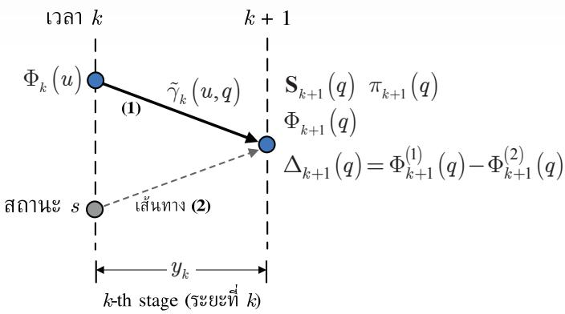  
รูปที่ 3.7 แผนภาพเทรลลิสสำหรับอธิบายอัลกอริทึม รOVA

ถ้านิยามผลต่างของเมตริกเส้นทาง (path metric difference) ให้มีค่าเท่ากับ

$$
\Delta _ { k + 1 } \left( q \right) = \Phi _ { k + 1 } ^ { \left( 1 \right) } \left( q \right) - \Phi _ { k + 1 } ^ { \left( 2 \right) } \left( q \right)\tag{3.26}
$$

ซึ่งจะได้ว่า $\Delta _ { k + 1 } \left( q \right) \geq 0$ เสมอ ดังนั้นความน่าจะเป็นของการตัดสินใจที่ถูกต้อง (correct decision) สามารถหาได้จาก [19, 40]

$$
\mathrm { P r } \big [ \mathrm { c o r r e c t ~ d e c i s i o n ~ a t } \Psi _ { k + 1 } = q \big ] = \frac { e ^ { \Phi _ { k + 1 } ^ { ( 1 ) } \left( q \right) } } { e ^ { \Phi _ { k + 1 } ^ { ( 1 ) } \left( q \right) } + e ^ { \Phi _ { k + 1 } ^ { ( 2 ) } \left( q \right) } } = \frac { e ^ { \Delta _ { k + 1 } \left( q \right) } } { 1 + e ^ { \Delta _ { k + 1 } \left( q \right) } }\tag{3.27}
$$

เมื่อ $\mathrm { P r } [ x ]$ คือความน่าจะเป็นของ x และค่า LLR ของการตัดสินใจที่ถูกต้องมีค่าเท่ากับ

$$
\mathrm { L L R } = \ln \left( \frac { \mathrm { P r } \big [ \mathrm { c o r r e c t ~ d e c i s i o n ~ a t } \Psi _ { k + 1 } = q \big ] } { 1 - \mathrm { P r } \big [ \mathrm { c o r r e c t ~ d e c i s i o n ~ a t } \Psi _ { k + 1 } = q \big ] } \right) = \Delta _ { k + 1 } ( q )\tag{3.28}
$$

ซึ่งหมายความว่าผลต่างของเมตริกเส้นทางของเส้นทางที่ได้มาผสานกัน (merge) ในอัลกอริทึม วีเทอร์บิจะมีค่าเท่ากับค่า LLR ของความน่าจะเป็นของการตัดสินใจที่ถูกต้อง

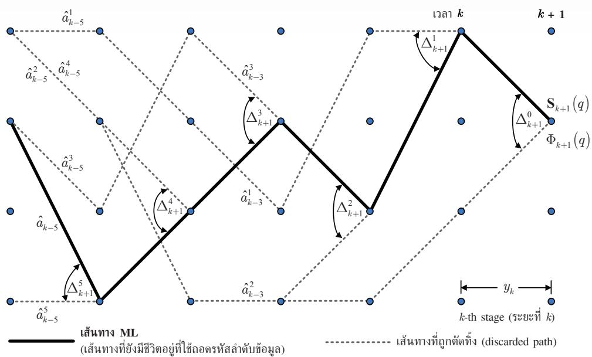  
รูปที่ 3.8 แผนภาพเทรลลิสพร้อมกับผลต่างของเมตริกเส้นทางและบิตข้อมูลสำหรับอัลกอริทึม รOVA

ในทางปฏิบัติอัลกอริทึมวีเทอร์บิจะตัดสินใจบิตข้อมูลที่เวลา k นั่นคือ $\hat { a } _ { k }$ หลังจากที่เวลา ผ่านไป 8T หน่วย เมื่อ 8T คือความลึกการถอดรหัส (decoding depth) และ T คือคาบเวลาของ บิต ซึ่งโดยทั่วไปจะใช้ $\ S \geq 5 ( \nu + 1 )$ [32] เมื่อ ν คือหน่วยความจำของช่องสัญญาณ ดังนั้นที่เวลา k (หรือระยะที่k) อัลกอริทึมวีเทอร์บิจะถอดรหัสบิตข้อมูลที่เวลา $k - \delta$ นั่นคือ $\hat { a } _ { k - \delta }$ พิจารณา แผนภาพเทรลลิสในรูปที่ 3.8 สำหรับ $\delta = 5$ โดยเส้นทางที่ยังมีชีวิตอยู่(แสดงด้วยเส้นทึ่บสีดำ) ขู ที่มาถึงสถานะ q ณ เวลา k + 1 คือ ${ \bf S } _ { k + 1 } \left( q \right)$ และมีเมตริกเส้นทางเท่ากับ $\Phi _ { k + 1 } \left( q \right)$ นอกจากนี้ รูปที่ 3.8 ยังแสดง "เส้นทางที่ถูกตัดทิ้ง (discarded path)" (แสดงด้วยเส้นปะสีเทา) ซึ่งมีทั้งหมด 8+1 เส้นทาง ถ้ากำหนดให้ $\Delta _ { k } ^ { d }$ คือผลต่างของเมตริกเส้นทางระหว่างเส้นทางที่ยังมีชีวิตอยู่และ เส้นทางที่ถูกตัดทิ้ง ณ เวลาที่ผ่านไปแล้ว d หน่วยจากเวลา k เมื่อ d = 0, 1, ., 8 โดยเส้นทาง ที่ถูกตัดทิ้ง ณ เวลา k - d จะเรียกว่า "เส้นทางที่ d (d-th path)" นอกจากนี้ถ้าให้ $\hat { a } _ { k - \delta }$ คือบิต ข้อมูลอินพุตที่สอดคล้องกับเส้นทาง ML ณ เวลา k - 8 (หรือบิตข้อมูลทีอัลกอริทึมวีเทอร์บิจะ ทำการถอดรหัสที่เวลา k) และ $\hat { a } _ { k - } ^ { d }$ คือบิตข้อมูลอินพุตที่สอดคล้องกับเส้นทางทีd (เส้นทางที่ถูก ส ตัดทิง) ณ เวลา k - i เมือ i คือเลขจำนวนเต็ม

ถ้าบิตข้อมูล $\hat { a } _ { k - \delta } ^ { d }$ บนเส้นทางที่d (เส้นทางที่ถูกตัดทิ้ง) มีค่าเท่ากับบิตข้อมูล $\hat { a } _ { k - \delta }$ แสดงว่าระบบจะไม่เกิดข้อผิดพลาด ถ้าอัลกอริทึมวีเทอร์บิเลือกเส้นทางที่ถูกตัดทิ้งเป็นเส้นทางที่ยัง มีชีวิตอยู ดังนั้นในกรณีนี้ความน่าเชื่อถือของการตัดสินใจบิตข้อมูลมีค่าเท่ากับค่าอนันต์ (inกfinity)

อย่างไรก็ตามถ้า $\hat { a } _ { k - 8 } ^ { d } \neq \hat { a } _ { k - 8 }$ แสดงว่ามีข้อผิดพลาดของบิตข้อมูลเกิดขึ้น ณ เวลา $k - \delta$ ในเส้นทาง ที่d (เส้นทางที่ถูกตัดทิ้ง) ซึ่งจะนิยามโดย

$$
\hat { e } _ { { k - \delta } } ^ { d } = \hat { a } _ { { k - \delta } } \oplus \hat { a } _ { { k - \delta } } ^ { d }\tag{3.29}
$$

เมื่อ $\hat { a } _ { k - \delta } \in \left\{ \pm 1 \right\} , \hat { a } _ { k - \delta } ^ { d } \in \left\{ \pm 1 \right\}$ , และ  คือตัวดำเนินการบวกในฟีลด์ไบนารีหรือ GF(2) โดยที่ GF ย่อมาจาก Galois field ที่มีเอกลักษณ์การบวกเท่ากับ 1 นั้นคือ [40]

$$
\begin{array} { r l r l } { { 1 } \oplus 1 = 1 } & { { } 1 \oplus - 1 = - 1 } & { - 1 \oplus 1 = - 1 } & { { } - 1 \oplus - 1 = 1 } \end{array}\tag{3.30}
$$

ในทำนองเดียวกันกับสมการ (3.28) จะได้ว่าค่า LLR ของข้อผิดพลาดของบิตจะมีค่าเท่ากับ $\Delta _ { k } ^ { d }$ เพราะฉะนันเมื่อรวมทั้งสองกรณีจะพบว่า ค่า LLR ของข้อผิดพลาดของบิตข้อมูล ณ เวลา $k - \delta$ ในเส้นทางที่d (เส้นทางที่ถูกตัดทิ้ง) มีค่าเท่ากับ

$$
\lambda \Big ( \hat { e } _ { k - \delta } ^ { d } \Big ) = \ln \left( \frac { p \Big ( \hat { e } _ { k - \delta } ^ { d } = 1 \Big ) } { p \Big ( \hat { e } _ { k - \delta } ^ { d } = - 1 \Big ) } \right) = \left\{ \infty , \mathrm { ~ i f ~ } \hat { a } _ { k - \delta } = \hat { a } _ { k - \delta } ^ { d } \right.\tag{3.31}
$$

ในทางปฏิบัติแต่ละเส้นทางที่ถูกตัดทิ้งจะให้ร่องรอยหรือหลักฐาน (evidence)เกี่ยวกับ ความน่าเชื่อถือที่บิตข้อมูล $\hat { a } _ { k - \delta }$ จะถูกถอดรหัสได้อย่างถูกต้อง ดังนั้นข้อผิดพลาดรวมที่เป็นผล มาจากเส้นทางที่ถูกตัดทิ้งที่เป็นไปได้ทั้งหมดสำหรับ $\hat { a } _ { k - \delta }$ หาได้จาก

$$
\hat { e } _ { k - \delta } = \sum _ { d = 0 } ^ { \delta } \oplus \hat { e } _ { k - \delta } ^ { d } = \hat { e } _ { k - \delta } ^ { 0 } \oplus \hat { e } _ { k - \delta } ^ { 1 } \oplus \ldots \oplus \hat { e } _ { k - \delta } ^ { \delta }\tag{3.32}
$$

เพราะฉะนั้นค่า LLR ของบิตข้อมล $\hat { a } _ { k - \delta }$ เขียนได้เป็น [40]

$$
\lambda \left( \hat { a } _ { \boldsymbol { k } - \delta } \right) = \hat { a } _ { \boldsymbol { k } - \delta } \lambda \left( \hat { e } _ { \boldsymbol { k } - \delta } \right) = \hat { a } _ { \boldsymbol { k } - \delta } \lambda \left( \sum _ { \boldsymbol { d } = 0 } ^ { \delta } \oplus \hat { e } _ { \boldsymbol { k } - \delta } ^ { \boldsymbol { d } } \right)\tag{3.33}
$$

โดยที่ $\hat { a } _ { k - 8 } \in \{ \pm 1 \}$ เป็นตัวกำหนดเครื่องหมายของค่า LLR (ซึ่งเป็นค่าประมาณของบิตข้อมูลที อัลกอริทึมวีเทอร์บิจะทำการถอดรหัส) และ $\lambda \left( \hat { e } _ { k - \delta } \right) \geq 0$ เป็นตัวกำหนดความน่าเชือถือของ $\hat { a } _ { k - \delta }$ ว่ามีค่ามากน้อยเพียงใด กล่าวคือถ้า $\lambda \left( \hat { e } _ { k - \delta } \right)$ มีค่ามาก ก็แสดงว่าบิตข้อมูล $\hat { a } _ { k - \delta }$ ที่อัลกอริทึม วีเทอร์บิถอดรหัสออกมามีความถูกต้องมากเช่นกัน (และในทางกลับกัน)

ถ้านิยามพีชคณิตของฟังก์ชันควรจะเป็นแบบลอการิทึม [40] ดังนี้

$$
\lambda ( x _ { 1 } ) \boxplus \lambda ( x _ { 2 } ) \triangleq \lambda ( x _ { 1 } \oplus x _ { 2 } )\tag{3.34}
$$

เมื่อ $x _ { 1 }$ และ $x _ { 2 }$ คือตัวแปรสุ่มแบบไบนารีที่เป็นสมาชิกของ {-1, 1} และ  คือตัวดำเนินการทาง พีชคณิตของค่า LLR ซึ่งมีความสัมพันธ์คือ

$$
\lambda \left( x \right) \boxplus \infty = \lambda \left( x \right) \quad \quad \lambda \left( x \right) \boxplus - \infty = - \lambda \left( x \right) \quad \quad \lambda \left( x \right) \boxplus 0 = 0
$$

โดยที่ $\infty$ หมายถึงมีความน่าเชื่อถือสูงมาก (infinite reliability), —∞ หมายถึงไม่มีความน่าเชื่อถือ (totally unreliable), และ 0 หมายถึงความน่าเชื่อถือมีความคลุมเครือ (ambiguous reliability)

อาศัยสมการ (3.34) เพราะฉะนั้นค่า LLR ของบิตข้อมูล $\hat { a } _ { k - \delta }$ ในสมการ (3.33) จัดรูป ใหม่ได้เป็น

$$
\begin{array} { r l r } {  { \lambda ( \hat { a } _ { k - \delta } ) = \hat { a } _ { k - \delta } \lambda ( \sum _ { d = 0 } ^ { \delta } \oplus \hat { e } _ { k - \delta } ^ { d } ) = \hat { a } _ { k - \delta } \sum _ { d = 0 } ^ { \delta } \mu \lambda ( \hat { e } _ { k - \delta } ^ { d } ) } } \\ & { } & \\ & { } & { = \hat { a } _ { k - \delta } \{ \lambda ( \hat { e } _ { k - \delta } ^ { 0 } ) \boxplus \lambda ( \hat { e } _ { k - \delta } ^ { 1 } ) \boxplus \ldots \boxplus \lambda ( \hat { e } _ { k - \delta } ^ { \delta } ) \} } \end{array}\tag{3.35}
$$

จากสมการ (3.31) และอาศัยเอกลักษณ์ของนิยามพีชคณิตของฟังก์ชันควรจะเป็นแบบลอการิทึม ดังนันถ้าสมการ (3.35) หาผลรวมเฉพาะค่า d ที่ทำให้ $\hat { a } _ { k - 8 } ^ { d } \neq \hat { a } _ { k - 8 }$ ก็จะได้ว่า [40]

$$
\lambda \left( \hat { a } _ { k - \delta } \right) = \hat { a } _ { k - \delta } \sum _ { d = 0 } ^ { \delta } \boxed { \begin{array} { r l r } { \boxed { \hat { a } _ { k - \delta } } } & { { } } & { d } \\ { \end{array} } }\tag{3.36}
$$

ในทำนองเดียวกันอาศัยเอกลักษณ์ของนิยามพีชคณิตของฟังก์ชันควรจะเป็นแบบลอการิทึม [40] สมการ (3.36) สามารถประมาณค่าได้เป็น

$$
\lambda \left( \hat { a } _ { k - \delta } \right) \approx \hat { a } _ { k - \delta } \left\{ \operatorname* { m i n } _ { { d \in \left\{ 0 , 1 , \ldots , \delta \right\} } } \Delta _ { k } ^ { d } \right\}\tag{3.37}
$$

นั่นคือความน่าเชื่อถือของบิตข้อมูล $\hat { a } _ { k - \delta }$ ขึ้นอยูกับผลต่างของเมตริกเส้นทาง $\Delta _ { k } ^ { d }$ ที่มีค่าน้อยสุด ตามเส้นทางที่ยังมีชีวิตอยู่ ดังนั้นเครื่องหมายของ $\lambda \left( \hat { a } _ { k - \delta } \right)$ ในสมการ (3.37) คือค่าประมาณของ บิตข้อมูล $\hat { a } _ { k - \delta }$ และขนาดของ $\lambda \left( \hat { a } _ { k - \delta } \right)$ คือค่าความน่าเชื่อถือของบิตข้อมูลที่ถูกถอดรหัส

## 3.4.2 ข้อสังเกตของอัลกอริทึม SOVA

จากสมการ (3.37) จะเห็นได้ว่าค่า LLR ของบิตข้อมูลจะขึ้นกับผลต่างของเมตริกเส้นทางตามที แสดงในสมการ (3.26) นันคือ $\Delta _ { k } \left( q \right) = \Phi _ { k } ^ { \left( 1 \right) } \left( q \right) - \Phi _ { k } ^ { \left( 2 \right) } \left( q \right)$ โดยที่ $\Phi _ { k } ^ { \left( i \right) } \left( q \right)$ สำหรับ $i = \{ 1 , ~ 2 \}$ คือผลรวมของเมตริกสาขาตามสมการ (3.23) เมื่อเมตริกสาขา $\tilde { \gamma } _ { k } \left( u , q \right)$ หาได้จากสมการ (3.22)

อย่างไรก็ตามเพื่อลดความชับซ้อนในการคำนวณหาผลต่างของเมตริกเส้นทาง $\Delta _ { k } \left( q \right)$ อัลกอริทึม รOVA สามารถใช้เมตริกสาขาที่อยู่ในรูป

$$
\widetilde { \gamma } _ { k } \left( u , q \right) \approx - \frac { 1 } { 2 \sigma ^ { 2 } } \big | y _ { k } - \widehat { r } \left( u , q \right) \big | ^ { 2 } + \frac { \widehat { a } \left( u , q \right) \lambda _ { a } \left( a _ { k } \right) } { 2 }\tag{3.38}
$$

ได้โดยไม่กระทบต่อสมรรถนะการทำงานของอัลกอริทึม รOVA เนื่องจากเวลาที่คำนวณหาค่าผลต่าง ของเมตริกเส้นทางในสมการ (3.26) ก็ยังคงให้ผลลัพธ์เท่าเดิม

## 3.4.3 สรุปขั้นตอนการทำงานของอัลกอริทึม ร0VA

กำหนดให้ $\pi _ { k + 1 } \left( q \right)$ คือตัวนำหน้า (predecessor) ที่สถานะ q ณ เวลา $k + 1$ ซึ่งจะเก็บค่าสถานะ ก่อนหน้า (ณ เวลา k) ที่ทำให้เกิดการเปลี่ยนสถานะที่ดีสุดมายังสถานะ q ณ เวลา $k + 1$ โดย การเปลียนสถานะนีจะถือเป็นส่วนหนึงของเส้นทางที่ยังมีชีวิตอยู ${ \bf S } _ { k + 1 } \left( q \right)$ ตัวอย่างเช่น พิจารณา แผนภาพเทรลลิสในรูปที่ 3.7 สมมุติว่าเส้นทาง (1) เป็นเส้นทางที่ดีสุดที่ทำให้ $\Phi _ { k + 1 } \left( q \right)$ มีค่าสูงสุด ดังนั้นจะได้ว่า $\pi _ { k + 1 } \left( q \right) = u$ นั่นคือสถานะ น เป็นสถานะก่อนหน้าซึ่งทำให้เกิดเปลี่ยนสถานะที่ดี สร สุดมายังสถานะ q ณ เวลา k + 1 ดังนั้นหลักการทำงานของอัลกอริทึม ร0VA สรุปเป็นขันตอน ต่างๆ ได้ตามรูปที่ 3.9

ตัวอย่างที่ 3.5 จากตัวอย่างที่ 2.4 จงใช้อัลกอริทึม ร0VA ในการถอดรหัสข้อมูล $y _ { k }$ โดยกำหนด ให้ $\lambda _ { a } \left( a _ { k } \right) = \{ - 1 , 2 , 1 , 2 \}$ และความลึกการถอดรหัส $\ S = 3$

วิธีทำ จากตัวอย่างที่ 2.4 ข้อมูลที่ต้องการให้ใช้อัลกอริทึม รOVA ตรวจหาคือ

$$
y _ { k } = \{ y _ { 0 } , ~ y _ { 1 } , ~ y _ { 2 } , ~ y _ { 3 } \} = \{ 0 . 9 , ~ - 0 . 2 , ~ 0 . 3 , ~ 0 . 6 \}
$$

และแผนภาพเทรลลิสของช่องสัญญาณ $H \left( D \right) = 1 + 0 . 5 D$ แสดงในรูปที่ 2.13 ซึ่งมีสองสถานะ ญ   
คือสถานะ (a) และสถานะ (b) ดังนันการถอดรหัสข้อมูลของอัลกอริทึม รOVA มีขันตอนการ   
ทำงานดังนี้

อัลกอริทึม SOVA   
การถอดรหัสข้อมูลแบบฮาร์ด (เหมือนขั้นตอนของอัลกอริทึมวีเทอร์บิ [1]   
1. กำหนดค่าเริ่มต้นของเมตริกเส้นทาง $\Phi _ { 0 } ( u ) = 0$ สำหรับทุกค่า $u \in \{ 0 , 1 , . . . , Q - 1 \}$   
2. สำหรับ $k = 0 , 1 , . . . , L + \nu - 1 + \delta$ เมื่อ 8 คือความลึกการถอดรหัส   
กำหนดให้ข้อมูลที่จะทำการถอดรหัส $y _ { k } = 0$ สำหรับ $k \geq L + \nu$   
สำหรับ $q = 0 , 1 , . . . , Q - 1$   
คำนวณหาค่า $\tilde { \gamma } _ { k } \left( u , q \right)$ ตามสมการ (3.38) สำหรับทุกสถานะ u ที่ทำให้ (u, q) เป็นจริง   
คำนวณหาค่า $\Phi _ { k + 1 } \left( q \right)$ ที่สอดคล้องกับการเปลี่ยนสถานะที่ดีสุด ตามสมการ (3.23)   
คำนวณและบันทึกค่าผลต่างของเมตริกเส้นทาง $\Delta _ { k + 1 } \left( q \right)$ ตามสมการ (3.26)   
บันทึกตัวนำหน้า $\pi _ { k + 1 } \left( q \right)$ (ใช้ในการหาเส้นทางที่ d หรือเส้นทางทีถูกตัดทิ้ง)   
บันทึกเส้นทางที่ยังมีชีวิตอยู ${ \bf S } _ { k + 1 } \left( q \right)$   
(สิ้นสุดการวนซ้ำของ q)   
(สิ้นสุดการวนซ้ำของ k)   
3. ถอดรหัสลำดับข้อมูลอินพุต $\hat { \mathbf { a } } _ { 0 } ^ { L - 1 }$ ตามเส้นทาง ML (เส้นทางที่ยังมีชีวิตอยูที่มีค่า $\Phi _ { L + \nu + \delta }$ สูงสุด)   
การถอดรหัสข้อมูลแบบซอฟต์ (การหาค่า LLR)   
4. กำหนดค่าเริ่มต้นของขนาดของค่า LLR ให้มีค่าเท่ากับ $\left| \lambda ( \hat { a } _ { k } ) \right| = + \infty$ สำหรับ $k = 0 , 1 , . . . , L - 1$   
5. สำหรับ $k = \delta , \delta + 1 , . . . , L - 1 + \delta$   
สำหรับ $d = 0 , 1 , \ldots , \delta$   
เปรียบเทียบบิตข้อมูล $\hat { a } _ { k - \delta }$ ที่ถอดรหัสได้ตามเส้นทาง ML กับบิตข้อมูล $\hat { a } _ { k - 8 } ^ { d }$   
ถอดรหัสได้ตามเส้นทางเส้นทางที่ d (เส้นทางที่ถูกตัดทิ้ง)   
ถ้า $\hat { a } _ { k - 8 } ^ { d } \neq \hat { a } _ { k - 8 }$ ให้ปรับปรุงขนาดของค่า LLR ตามความสัมพันธ์ดังนี้   
$\left| \lambda \left( \hat { a } _ { k - \delta } \right) \right| = \operatorname* { m i n } \left\{ \left|  \wedge \left( \hat { a } _ { k - \delta } \right) \right| , \Delta _ { k + 1 } ^ { d } \right\}$   
(สิ้นสุดการวนซ้ำของ d)   
ถอดรหัสค่า LLR แบบอะโพสเทอริออริของบิตข้อมูล $a _ { k - \delta }$ จาก   
$\lambda _ { p } \left( \hat { a } _ { k - \delta } \right) = \hat { a } _ { k - \delta } \left| \lambda \left( \hat { a } _ { k - \delta } \right) \right|$   
(สิ้นสุดการวนซ้ำของ k)

รูปที่ 3.9 ขั้นตอนการทำงานของอัลกอริทึม SOVA [19, 40]

1. กำหนดค่าเริ่มต้นของเมตริกเส้นทาง $\Phi _ { 0 } \left( u \right) = 0$ สำหรับทุกสถานะ $\boldsymbol { u } = \{ a , \ b \}$

2. ระยะที่0 ถึง 6 (สำหรับ $k = 0 , 1 , . . . , 6 )$ ให้ทำการการถอดรหัสข้อมูลแบบฮาร์ดเหมือน อัลกอริทึมวีเทอร์บิตามขั้นตอนในรูปที่ 3.9 โดยระหว่างขั้นตอนการการถอดรหัสข้อมูลก็ให้ บันทึกค่าผลต่างของเมตริกเส้นทาง $\Delta _ { k + 1 } \left( q \right)$ และสถานะก่อนหน้า $\pi _ { k + 1 } \left( q \right)$ สำหรับ $q =$ $\{ a , ~ b \}$ ดังแสดงในรูปที่ 3.10 (ก) เมื่อตัวเลขที่อยู่ตรงโหนดของแต่ละสถานะแสดงถึงค่าผลต่าง ของเมตริกเส้นทาง $\Delta _ { k + 1 } \left( q \right)$ , ตัวอักษรทีอยูในวงเล็บแสดงถึงค่าสถานะก่อนหน้า $\pi _ { k + 1 } \left( q \right)$ และเส้นลูกศรที่ลากผ่านแต่ละโหนดคือเส้นทาง ML ที่มีเมตริกเส้นทางสูงสุด นั้นคือ $\Phi _ { 7 } \left( a \right) >$ $\Phi _ { 7 } \left( b \right)$ โดยที่ลูกศรเส้นทึบแทนบิตข้อมูลอินพุต $a _ { k } = 1$ และลูกศรเส้นปะแทนบิตข้อมูลอินพุต $a _ { k } = - 1$ ดังนั้นอัลกอริทึม SOVA จะถอดรหัสข้อมูลแบบฮาร์ดได้เป็น

$$
\left\{ \hat { a } _ { 0 } , \hat { a } _ { 1 } , \hat { a } _ { 2 } \hat { a } _ { 3 } \right\} = \left\{ 1 , - 1 , 1 , 1 \right\}
$$

เมื่อบิตสุดท้ายไม่มีอยู่จริงในระบบ แต่เป็นผลลัพธ์ทีเกิดจากการทำคอนโวลูชันระหว่างข้อมูล อินพุตและช่องสัญญาณ

การถอดรหัสข้อมูลแบบซอฟต์ (สำหรับความลึกการถอดรหัส $\delta = 3 )$

3. ระยะที่ 3 (เมื่อ k = 3) เพื่อหาค่า $\lambda _ { p } \left( a _ { 0 } \right)$ จากข้อมูลที่ถอดรหัสได้ในขั้นตอนที่1 จะได้ว่า $\hat { a } _ { k - \delta } = \hat { a } _ { 0 } = 1$ รูปที่ 3.10 (ข) แสดงเส้นทางที่d (เส้นทางที่ถูกตัดทิ้ง) สำหรับ $d = \{ 0 , 1$ $\ldots , \delta \}$ พร้อมทั้งบิตข้อมูล $\hat { a } _ { k - \delta } ^ { d }$ และผลต่างของเมตริกเส้นทาง $\Delta _ { k + 1 } ^ { d }$ ที่สอดคล้องกับเส้นทาง ที่d ในกรณีนี้จะได้ว่า $\left\{ \hat { a } _ { 0 } ^ { 0 } , \hat { a } _ { 0 } ^ { 1 } , \hat { a } _ { 0 } ^ { 2 } \right\} \neq \hat { a } _ { 0 }$ ดังนั้นขนาดของค่า LLR ของบิตข้อมูล $a _ { 0 }$ มีค่า เท่ากับ

$$
\left| \lambda \left( \hat { a } _ { 0 } \right) \right| = \operatorname* { m i n } \left\{ + \infty , \Delta _ { 4 } ^ { 0 } , \Delta _ { 4 } ^ { 1 } , \Delta _ { 4 } ^ { 2 } \right\} = 4 . 2 8 3 2
$$

และค่า LLR ของบิตข้อมูล $a _ { 0 }$ มีค่าเท่ากับ ${ \hphantom { - } } \lambda \left( { { { \hat { a } } } _ { 0 } } \right) = { { \hat { a } } _ { 0 } } \left| \lambda \left( { { { \hat { a } } } _ { 0 } } \right) \right| = ( 1 ) ( 4 . 2 8 3 2 ) = 4 . 2 8 3 2$

4. ระยะที่ 4 (เมื่อ $k = 4 )$ เพื่อหาค่า $\lambda _ { p } \left( a _ { 1 } \right)$ จากข้อมูลที่ลอดรหัสได้ในขั้นตอนที่ 1 จะได้ว่า $\hat { a } _ { 1 } = - 1 \underset { \mathbf { \hat { \boldsymbol { q } } } } { \mathbf { \boldsymbol { \hat { \boldsymbol { 1 } } } } } \overset { \mathbf { d } } { \boldsymbol { \hat { \boldsymbol { n } } } }$ 3.10 (ค) แสดงเส้นทางที่d (เส้นทางที่ถูกตัดทิ้ง) พร้อมทั้งบิตข้อมูล $\hat { a } _ { 1 } ^ { d }$ และ ผลต่างของเมตริกเส้นทาง $\Delta _ { 5 } ^ { d }$ ที่สอดคล้องกับเส้นทางที่ d ในกรณีนี้จะได้ว่า $\left\{ \hat { a } _ { 1 } ^ { 1 } , \hat { a } _ { 1 } ^ { 2 } \right\} \neq \hat { a } _ { 1 }$ ดังนั้นขนาดของค่า LLR ของบิตข้อมูล $a _ { 1 }$ มีค่าเท่ากับ

$$
\left| \lambda ( \hat { a } _ { 1 } ) \right| = \operatorname* { m i n } \left\{ + \infty , \Delta _ { 5 } ^ { 1 } , \Delta _ { 5 } ^ { 2 } \right\} = 4 . 2 8 3 2
$$

และค่า LLR ของบิตข้อมูล $a _ { 1 }$ มีค่าเท่ากับ $\lambda \left( { { \hat { a } } _ { 1 } } \right) = { { \hat { a } } _ { 1 } } \left| \lambda \left( { { \hat { a } } _ { 1 } } \right) \right| = ( - 1 ) \left( 4 . 2 8 3 2 \right) = - 4 . 2 8 3 2$

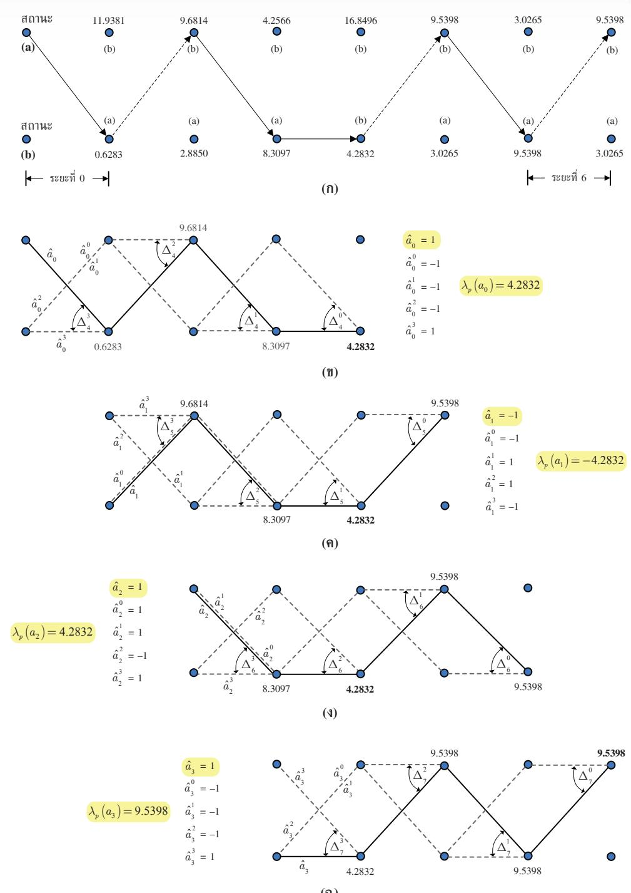  
รูปที่ 3.10 ขั้นตอนการถอดรหัสข้อมูลของอัลกอริทึม ร0VA ในตัวอย่างที่ 3.5

5.ระยะที่ 5 (เมื่อ $k = 5 )$ เพื่อหาค่า $\lambda _ { p } \left( a _ { 2 } \right)$ จากข้อมูลที่ถอดรหัสได้ในขั้นตอนที่1 จะได้ว่า $\hat { a } _ { 2 } = 1$ รูปที่ 3.10 () แสดงเส้นทางที่d (เส้นทางที่ถูกตัดทิ้ง) พร้อมทั้งบิตข้อมูล $\hat { a } _ { 2 } ^ { d }$ และ ผลต่างของเมตริกเส้นทาง $\Delta _ { 6 } ^ { d }$ ที่สอดคล้องกับเส้นทางที่ d ในกรณีนี้จะได้ว่า $\left\{ \hat { a } _ { 2 } ^ { 2 } \right\} \neq \hat { a } _ { 2 }$ ดังนั้นขนาดของค่า LLR ของบิตข้อมูล $a _ { 2 }$ มีค่าเท่ากับ

$$
\left| \lambda \left( \hat { a } _ { 2 } \right) \right| = \operatorname* { m i n } \left\{ + \infty , \Delta _ { 6 } ^ { 2 } \right\} = 4 . 2 8 3 2
$$

และค่า LLR ของบิตข้อมูล $a _ { 2 }$ มีค่าเท่ากับ ${ \hphantom { - } } \lambda \left( { { { \hat { a } } } _ { 2 } } \right) = { { \hat { a } } _ { 2 } } \left| \lambda \left( { { { \hat { a } } } _ { 2 } } \right) \right| = { \left( 1 \right) } { \left( { 4 . 2 8 3 2 } \right) } = 4 . 2 8 3 2$

6. ระยะที่ 6 (เมื่อ $k = 6 )$ เพื่อหาค่า $\lambda _ { p } \left( a _ { 3 } \right)$ จากข้อมูลที่ถอดรหัสได้ในขั้นตอนที่1 จะได้ว่า $\hat { a } _ { 3 } = 1$ รูปที่ 3.10 (ฉ) แสดงเส้นทางที่ d (เส้นทางที่ถูกตัดทิ้ง) พร้อมทั้งบิตข้อมูล $\hat { a } _ { 3 } ^ { d }$ และ ผลต่างของเมตริกเส้นทาง $\Delta _ { 7 } ^ { d }$ ที่สอดคล้องกับเส้นทางที่ d ในกรณีนี้จะได้ว่า $\left\{ \hat { a } _ { 3 } ^ { 0 } , \hat { a } _ { 3 } ^ { 1 } , \hat { a } _ { 3 } ^ { 2 } \right\}$ $\neq \hat { a } _ { 3 }$ ดังนั้นขนาดของค่า LLR ของบิตข้อมูล $a _ { 3 }$ มีค่าเท่ากับ

$$
\left| { \lambda \left( { { \hat { a } } _ { 3 } } \right) } \right| = \operatorname* { m i n } \left\{ + \infty , \Delta _ { 7 } ^ { 0 } , \Delta _ { 7 } ^ { 1 } , \Delta _ { 7 } ^ { 2 } \right\} = 9 . 5 3 9 8
$$

และค่า LLR ของบิตข้อมูล ${ \mathrm { a } } _ { 3 }$ มีค่าเท่ากับ $\lambda \left( { { \hat { a } } _ { 3 } } \right) = { { \hat { a } } _ { 3 } } \left| \lambda \left( { { \hat { a } } _ { 3 } } \right) \right| = ( 1 ) ( 9 . 5 3 9 8 ) = 9 . 5 3 9 8$

เพราะฉะนั้นอัลกอริทึม SOVA จะให้ค่า LLR แบบอะโพสเทอริออริของบิตข้อมูล $a _ { k }$ เท่ากับ

$$
\left\{ \Lambda _ { p } \left( a _ { 0 } \right) , \Lambda _ { p } \left( a _ { 1 } \right) , \Lambda _ { p } \left( a _ { 2 } \right) , \Lambda _ { p } \left( a _ { 3 } \right) \right\} \approx \left\{ 4 . 2 8 3 2 , - 4 . 2 8 3 2 , 4 . 2 8 3 2 , 9 . 5 3 9 8 \right\}
$$

และถอดรหัสบิตข้อมูลได้เป็น

$$
\left\{ \hat { a } _ { 0 } , \hat { a } _ { 1 } , \hat { a } _ { 2 } , \hat { a } _ { 3 } \right\} = \left\{ 1 , - 1 , 1 , 1 \right\}
$$

ซึ่งตรงกับบิตข้อมูล $a _ { k }$ ที่ส่งมาจากวงจรภาคส่ง (บิตสุดท้ายไม่มือยู่จริงในระบบ แต่เป็นผลลัพธ์ที่ เกิดจากการทำคอนโวลูชันระหว่างข้อมูลอินพุตและช่องสัญญาณ) แสดงว่าไม่มีข้อผิดพลาดเกิดขึ้น จากการถอดรหัสข้อมูลด้วยอัลกอริทึม รOVA

ตัวอย่างที่ 3.6 จากตัวอย่างที่ 2.5 จงใช้อัลกอริทึม ร0VA ในการถอดรหัสข้อมูล $y _ { k }$ โดยกำหนด ให้ $\lambda _ { a } \left( a _ { k } \right) = \{ - 1 , 1 , 2 , - 1 , 1 \}$ และความลึกการถอดรหัส $\ S = 3$

วิธีทำ จากตัวอย่างที่ 2.5 ข้อมูลที่ต้องการให้ใช้อัลกอริทึม SOVA ตรวจหาคือ

$$
y _ { k } = \{ y _ { 0 } , ~ y _ { 1 } , ~ y _ { 2 } , ~ y _ { 3 } , ~ y _ { 4 } \} = \{ 1 . 2 , ~ - 0 . 7 , ~ - 0 . 2 , ~ 0 . 5 , ~ - 0 . 7 \}
$$

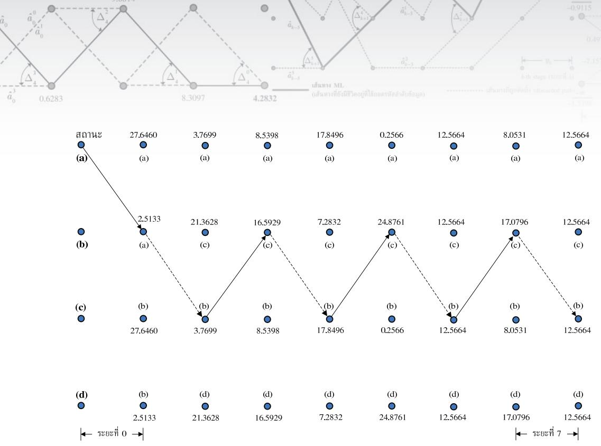  
รูปที่ 3.11 ขั้นตอนการถอดรหัสข้อมูลของอัลกอริทึม ร0VA ในตัวอย่างที่ 3.6

และมีแผนภาพเทรลลิสของช่องสัญญาณ $H ( D ) = 1 - D ^ { 2 }$ ตามรูปี่ 2.15 ซึ่มีทั้งหมดสื่สถานะ คือ สถานะ (a), (b), (c) และ (d)

จากนั้นทำการถอดรหัสข้อมูลโดยใช้อัลกอริทึม ร0VA เช่นเดียวกับวิธีการที่อธิบายใน ตัวอย่างที่ 3.5 ก็จะได้ผลต่างของเมตริกเส้นทาง $\Delta _ { k + 1 } \left( q \right)$ และสถานะก่อนหน้า $\pi _ { k + 1 } \left( q \right)$ สำหรับ $k = \{ 0 , 1 , . . . , 7 \}$ และ $q = \{ a , \ b , \ c , \ d \}$ ดังแสดงในรูปที่ 3.11 โดยที่เส้นลูกศรที่ลากผ่านแต่ละ โหนดคือเส้นทาง ML ที่มีเมตริกเส้นทางสูงสุด (เมื่อลูกศรเส้นทึบแทนบิตข้อมูลอินพุต $a _ { k } = 1$ และลูกศรเส้นปะแทนบิตข้อมูลอินพุต $a _ { k } = - 1 )$ จากข้อมูลที่ให้มาในรูปที่ 3.11 ทำให้สามารถ คำนวณหาค่า LLR แบบอะโพสเทอริออริของบิตข้อมูล $a _ { k }$ ตามสมการ (3.37) ซึ่งจะได้ว่า

$$
\left\{ \lambda _ { p } \left( a _ { 0 } \right) , \lambda _ { p } \left( a _ { 1 } \right) , \lambda _ { p } \left( a _ { 2 } \right) , \lambda _ { p } \left( a _ { 3 } \right) , \lambda _ { p } \left( a _ { 4 } \right) \right\} \approx \left\{ 1 6 . 5 9 , - 1 7 . 8 5 , 2 4 . 8 8 , - 1 2 . 5 7 , 1 7 . 0 8 \right\}
$$

และถอดรหัสบิตข้อมูลได้เป็น

$$
\left\{ \hat { a } _ { 0 } , \hat { a } _ { 1 } , \hat { a } _ { 2 } , \hat { a } _ { 3 } , \hat { a } _ { 4 } \right\} = \left\{ 1 , - 1 , 1 , - 1 , 1 \right\}
$$

ซึ่งตรงกับบิตข้อมูล $a _ { k }$ ที่ส่งมาจากวงจรภาคส่ง (สองบิตสุดท้ายไม่มีอยู่จริงในระบบ แต่เป็นผลลัพธ์ ที่เกิดจากการทำคอนโวลูชันระหว่างข้อมูลอินพุตและช่องสัญญาณ) แสดงว่าไม่มีข้อผิดพลาดเกิดขึ้น จากการถอดรหัสข้อมูลด้วยอัลกอริทึม รOVA

## 3.5 อัลnอริทึม Bi-Directional SOVA

อัลกอริทึม รOVA ที่อธิบายในหัวข้อที่ 3.4 มีขั้นตอนการทำงานที่ค่อนข้างชับซ้อนซึ่งอาจทำให้ ยากต่อการทำความเข้าใจ ในหัวข้อนี้จะอธิบายหลักการทำงานของอัลกอริทึม รอVA อีกรูปแบบ หนึ่งที่เรียกว่า "อัลกอริทึม SOVA แบบสองทิศทาง (bi-directional SOVA)" [41, 42] ซึ่งจะให้ ค่า LLR ของบิตข้อมูลใกล้เคียงกับอัลกอริทึม รOVA และง่ายต่อการนำไปใช้งานจริง

พิจารณาแบบจำลองของช่องสัญญาณในรูปที่ 2.10 อัลกอริทึม ร0VA จะให้ข้อมูล เอาต์พุตเป็นค่า LLR แบบอะโพสเทอริออริของบิตข้อมูล $a _ { k }$ ตามสมการ (2.23) นั่นคือ

$$
\lambda _ { p } \left( a _ { k } \right) = \ln \left( { \frac { \operatorname* { P r } \left[ a _ { k } = 1 \mid \mathbf { y } \right] } { \operatorname* { P r } \left[ a _ { k } = - 1 \mid \mathbf { y } \right] } } \right)\tag{3.39}
$$

เมื่อ $a _ { k } \in \{ - 1 , 1 \}$ คือข้อมูลอินพุตของช่องสัญญาณ, $\mathbf { y } = [ y _ { 0 } , \ y _ { 1 } , \ . . . , \ y _ { L + \nu - 1 } ]$ คือลำดับข้อมูล ที่ต้องการถอดรหัสข้อมูล, L คือความยาวของลำดับข้อมูลอินพุต, และ ν คือหน่วยความจำของ ช่องสัญญาณ

อัลกอริทึม SOVA แบบสองทิศทางจะอาศัยแผนภาพเทรลลิสในการถอดรหัสข้อมูลอินพุต ของช่องสัญญาณ โดยจะเลือกลำดับข้อมูลอินพุต $\mathbf { a } = [ a _ { 0 } , \ a _ { 1 } , \ . . . , \ a _ { L - 1 } ]$ ตามเส้นทางที่มีเมตริก เส้นทางสูงสุด (maximนm path metric) หรือเส้นทาง ML เมื่อเมตริกเส้นทางที่มาถึงสถานะ q ณ เวลา k + 1 หาได้จากสมการ (3.24) นั่นคือ

$$
\Phi _ { k + 1 } \left( q \right) = \ln \left( p \left( \mathbf { y } _ { 0 } ^ { k } ; \mathbf { a } _ { 0 } ^ { k } \right) \right)\tag{3.40}
$$

ซึ่งก็คือผลรวมของเมตริกสาขาตามเส้นทางที่ยังมีชีวิตอยูที่มาถึงสถานะ q ณ เวลา $k + 1$ โดยที่ เมตริกสาขาที่สอดคล้องกับการเปลี่ยนสถานะ $( u , \ q )$ ที่ระยะ k หาได้จากสมการ (3.38) นั่นคือ

$$
\widetilde { \gamma } _ { k } \left( u , q \right) = \ln \left( p \left( y _ { k } ; a _ { k } \right) \right) \approx - \frac { 1 } { 2 \sigma ^ { 2 } } { \left| y _ { k } - \widehat { r } \left( u , q \right) \right| } ^ { 2 } + \frac { \hat { a } \left( u , q \right) \lambda _ { a } \left( a _ { k } \right) } { 2 }\tag{3.41}
$$

จากกฎของเบส์ (Bayes' rule) จะได้ว่า

$$
p \left( \mathbf { a } \mid \mathbf { y } \right) = { \frac { p \left( \mathbf { a } ; \mathbf { y } \right) } { p \left( \mathbf { y } \right) } } { = { \frac { p \left( \mathbf { y } \mid \mathbf { a } \right) p \left( \mathbf { a } \right) } { p \left( \mathbf { y } \right) } } }\tag{3.42}
$$

เนื่องจาก $p ( \mathbf { y } )$ ถือว่าเป็นค่าคงตัวซึ่งไม่เกี่ยวข้องกับการตัดสินใจเลือกเส้นทางที่ยังมีชีวิตอยู่ของ อัลกอริทีมวีเทอร์บิ ดังนั้นอาศัยสมการ (3.25) จะได้ว่าความน่าจะเป็นของการเลือกเส้นทาง ML เป็นสัดส่วนกับ

$$
p \left( \mathbf { a } \mid \mathbf { y } \right) \sim \exp \left\{ \Phi _ { L + \nu } ^ { \mathrm { m a x } } \right\}\tag{3.43}
$$

เมื่อ $\Phi _ { L + \nu } ^ { \mathrm { m a x } }$ คือเมตริกเส้นทางที่มีค่าสูงสุดตามเส้นทาง ML ณ เวลา $L + \nu$ นั่นคือค่าประมาณ ของลำดับข้อมูลอินพุต $\hat { \mathbf { a } } = \left[ \hat { a } _ { 0 } , \hat { a } _ { 1 } , . . . , \hat { a } _ { L - 1 } \right]$ จะถูกถอดรหัสตามเส้นทาง ML $\ddot { \textmd { 1 } }$

ถ้ากำหนดให้ $\Phi _ { k } ^ { c }$ คือเมตริกเส้นทางที่มีค่าสูงสุดของเส้นทางที่มีบิตข้อมูล $a _ { k } ^ { c }$ ตรงข้ามกับ บิตข้อมูล $\hat { a } _ { k }$ ของเส้นทาง ML ที่เวลา k ดังนั้นถ้าบิตข้อมูลของเส้นทาง ML ที่เวลา k มีค่าเท่ากับ $\hat { a } _ { k } = 1$ จะได้ว่า "บิตข้อมูลตรงข้าม (complementary bit)" คือ $a _ { k } ^ { c } = - 1$ ซึ่งจะได้ว่า

$$
p \left( a _ { k } = 1 | \mathbf { y } \right) \sim \exp \left\{ \Phi _ { L + \nu } ^ { \mathrm { m a x } } \right\} \qquad \mathsf { L i Q } _ { \mathbf { e } } ^ { \mathrm { e } } \qquad p \left( a _ { k } = 0 | \mathbf { y } \right) \sim \exp \left\{ \Phi _ { k + 1 } ^ { c } \right\}\tag{3.44}
$$

และอัตราส่วนของความน่าจะเป็นทั้งสองในสมการ (3.44) หรือค่า LLR แบบอะโพสเทอริออริของ บิตข้อมูล $a _ { k }$ มีค่าเท่ากับ

$$
\ln \left\{ { \frac { p \left( a _ { k } = 1 | \mathbf { y } \right) } { p \left( a _ { k } = - 1 | \mathbf { y } \right) } } \right\} \sim \ln \left\{ { \frac { e ^ { \Phi _ { L + \nu } ^ { \operatorname* { m a x } } } } { e ^ { \Phi _ { k + 1 } ^ { c } } } } \right\} = e ^ { \Phi _ { L + \nu } ^ { \operatorname* { m a x } } } - e ^ { \Phi _ { k + 1 } ^ { c } }\tag{3.45}
$$

กำหนดให้ $\Phi _ { k + 1 } ^ { ( 1 ) }$ คือเมตริกเส้นทางที่มีค่าสูงสุดสำหรับทุกเส้นทางที่มี $a _ { k } = 1$ และ $\Phi _ { k + 1 } ^ { ( - 1 ) }$ คือเมตริกเส้นทางที่มีค่าสูงสุดสำหรับทุกเส้นทางที่มี $a _ { k } = - 1$ ให้พิจารณาสองกรณีต่อไปนี้

1) ถ้าบิตข้อมูลที่ถอดรหัสตามเส้นทาง ML ที่เวลา k คือ $\hat { a } _ { k } = 1$ แสดงว่าบิตข้อมูลตรงข้ามคือ $^ { - 1 }$ ดังนั้น $\Phi _ { k + 1 } ^ { ( 1 ) } = \Phi _ { L + \nu } ^ { \mathrm { m a x } }$ และ $\Phi _ { k + 1 } ^ { ( - 1 ) } = \Phi _ { k + 1 } ^ { c }$ ซึ่งจะได้ว่าค่า LLR ของบิตข้อมูล $a _ { k }$ ในกรณี นี้มีค่าเท่ากับ

$$
\ln \left\{ \frac { p \left( a _ { k } = 1 | \mathbf { y } \right) } { p \left( a _ { k } = - 1 | \mathbf { y } \right) } \right\} \sim \ln \left( \frac { e ^ { \Phi _ { L + \nu } ^ { \mathrm { m a x } } } } { e ^ { \Phi _ { k + 1 } ^ { c } } } \right) = \Phi _ { L + \nu } ^ { \mathrm { m a x } } - \Phi _ { k + 1 } ^ { c } = \Phi _ { k + 1 } ^ { ( 1 ) } - \Phi _ { k + 1 } ^ { ( - 1 ) }\tag{3.46}
$$

2) ถ้าบิตข้อมูลที่ถอดรหัสตามเส้นทาง ML ที่เวลา k คือ $\hat { a } _ { k } = - 1$ แสดงว่าบิตข้อมูลตรงข้ามคือ 1 ดังนั้น $\Phi _ { k + 1 } ^ { ( - 1 ) } = \Phi _ { L + \nu } ^ { \mathrm { m a x } }$ และ $\Phi _ { k + 1 } ^ { ( 1 ) } = \Phi _ { k + 1 } ^ { c }$ ซึ่งจะได้ว่าค่า LLR ของบิตข้อมูล $a _ { k }$ ในกรณีนี้ ญีนี้ มีค่าเท่ากับ

$$
\ln \left\{ \frac { p \big ( a _ { k } = 1 | \mathbf { y } \big ) } { p \big ( a _ { k } = - 1 | \mathbf { y } \big ) } \right\} \sim \ln \left( \frac { e ^ { \Phi _ { k + 1 } ^ { c } } } { e ^ { \Phi _ { L + \nu } ^ { \mathrm { m a x } } } } \right) = \Phi _ { k + 1 } ^ { c } - \Phi _ { L + \nu } ^ { \mathrm { m a x } } = \Phi _ { k + 1 } ^ { ( 1 ) } - \Phi _ { k + 1 } ^ { ( - 1 ) }\tag{3.47}
$$

สมการ (3.46) และ (3.47) แสดงให้เห็นว่าไม่ว่าค่าประมาณของบิตข้อมูล $a _ { k }$ ตามเส้นทาง ML จะมีค่าเท่าใด ค่า LLR แบบอะโพสเทอริออริของของบิตข้อมูล $a _ { k }$ จะมีค่าเท่ากับ

$$
\lambda _ { p } \left( a _ { k } \right) = \ln \left\{ \frac { p \left( a _ { k } = 1 \mid \mathbf { y } \right) } { p \left( a _ { k } = - 1 \mid \mathbf { y } \right) } \right\} \sim \Phi _ { k + 1 } ^ { ( 1 ) } - \Phi _ { k + 1 } ^ { ( - 1 ) }\tag{3.48}
$$

นั่นคือค่า LLR ของบิตข้อมูล $a _ { k }$ มีค่าเท่ากับผลต่างระหว่างเมตริกเส้นทางสูงสุดทีสอดคล้องกับ ทุกเส้นทางที่มี $a _ { k } = 1$ และเมตริกเส้นทางสูงสุดที่สอดคล้องกับทุกเส้นทางที่มี $a _ { k } = - 1$ โดยที่ ขนาดของ LLR หรือ $\left| \lambda _ { p } \left( a _ { k } \right) \right|$ เป็นตัวบ่งถึงความน่าเชื่อถือของบิตข้อมูลที่ถูกถอดรหัส และ เครืองหมายของ LLR บอกให้ทราบถึงค่าประมาณของบิตข้อมูล $a _ { k }$ นั่นคือ

$$
\hat { a } _ { k } = \left\{ \begin{array} { l l } { - 1 , } & { \mathrm { i f } \ \lambda _ { p } \left( a _ { k } \right) \le 0 } \\ { 1 , } & { \mathrm { i f } \ \lambda _ { p } \left( a _ { k } \right) > 0 } \end{array} \right.\tag{3.49}
$$

## 3.5.1 การหาค่า LLR ของบิตข้อมูล

หลักทำงานของอัลกอริทึม รOVA แบบสองทิศทางแบ่งออกเป็น 2 ขั้นตอน คือ

2 1) ถอดรหัสข้อมูลตามขั้นตอนของอัลกอริทึมวีเทอร์บิ เพื่อหาค่าประมาณของลำดับข้อมูลอินพุต $\left[ \hat { a } _ { 0 } , \hat { a } _ { 1 } , . . . , \hat { a } _ { { L - 1 } } \right]$ ที่สอดคล้องกับเส้นทาง ML ซึ่งเป็นเส้นทางที่มีเมตริกเส้นทางสูงสุดที่เวลา $k + \nu$ นั่นคือ $\Phi _ { L + \nu } ^ { \mathrm { m a x } }$ จากนั้นให้บันทึกค่า $\Phi _ { L + \nu } ^ { \mathrm { m a x } }$ และเมตริกเส้นทาง $\Phi _ { k } \left( u \right)$ สำหรับทุกเวลา k และทุกสถานะ u = {0, 1, ..., Q − 1}

2) ถอดรหัสข้อมูลแบบย้อนกลับ (backพard decoding) ตามแผนภาพเทรลลิสเดิม (เหมือน การทำงานของอัลกอริทึมวีเทอร์บิในขั้นตอนที่หนึ่ง) ดังแสดงในรูปที่ 3.12 เพื่อหาค่าเมตริก สาขา $\tilde { \gamma } _ { k } ^ { b } \left( \Psi _ { k } = u , \Psi _ { k + 1 } = q \right)$ หรือเขียนสั้นๆ ว่า $\tilde { \gamma } _ { k } ^ { b } \left( u , q \right)$ ตามสมการ (3.41) และเมตริก เส้นทาง $\Phi _ { k } ^ { b } \left( u \right)$ ตั้งแต่เวลา $k = L + \nu$ ถึง $k = 0$ โดยที่เมตริกเส้นทางหาได้ดังนี้ [41, 42]

$$
\Phi _ { k } ^ { b } \left( u \right) = \operatorname* { m a x } _ { \forall q } \left\{ \tilde { \gamma } _ { k } ^ { b } \left( u , q \right) + \Phi _ { k + 1 } ^ { b } \left( q \right) \right\}\tag{3.50}
$$

เมื่อกำหนดค่าเริ่มต้นของเมตริกสาขา $\Phi _ { L + \nu } ^ { b } \left( q \right) = 0$ สำหรับทุกสถานะ q จากนั้นให้บันทึก ค่า $\tilde { \gamma } _ { k } ^ { b } \left( u , q \right)$ และ $\Phi _ { k } ^ { b } \left( u \right)$ สำหรับทุกเวลา k และทุกสถานะ น และ q ที่ทำให้การเปลี่ยน สถานะ $\left( u , q \right) \equiv \left( \psi _ { k } = u , \psi _ { k + 1 } = q \right)$ เป็นจริงตามแผนภาพเทรลลิส เพื่อใช้ในการหาค่า LLR ของบิตข้อมูลอินพุต

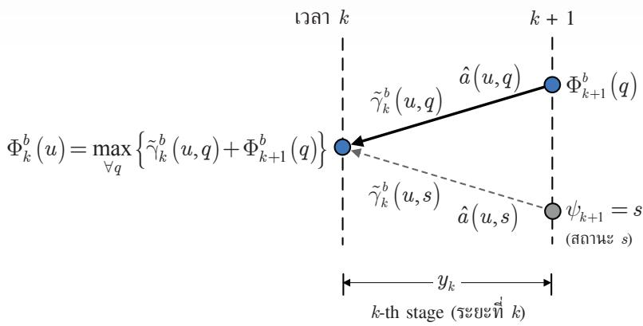  
รูปที่ 3.12 แผนภาพเทรลลิสสำหรับการถอดรหัสข้อมูลแบบย้อนกลับ

หมายเหตุ เมตริกสาขา $\tilde { \gamma } _ { k } \left( u , q \right)$ ที่ได้จากการคำนวณในขั้นตอนที่หนึ่งจะมีค่าเท่ากับเมตริก สาขา $\tilde { \gamma } _ { k } ^ { b } \left( u , q \right)$ ที่ได้จากการคำนวณแบบย้อนกลับในขั้นตอนที่สองเสมอ นอกจากนี้ระหว่าง การถอดรหัสข้อมูลแบบย้อนกลับในแต่ละช่วงเวลา k ก็สามารถคำนวณหาค่า LLR ของบิต ข้อมูลอินพุต $a _ { k }$ ได้ทันที่ จะได้ไม่ต้องบันทึกค่า $\tilde { \gamma } _ { k } ^ { b } \left( u , q \right)$ และ $\boldsymbol { \Phi } _ { k } ^ { b } \left( \boldsymbol { u } \right)$ สำหรับทุกเวลา k และ ทุกสถานะ น และ $q$ เพื่อลดจำนวนหน่วยความจำที่ต้องใช้ในอัลกอริทึม รOVA แบบสอง ทิศทาง (ดูขั้นตอนการทำงานของอัลกอริทึม รOVA แบบสองทิศทางในรูปที่ 3.13)

หลังจากที่ได้ทำการถอดรหัสข้อมูลในขั้นตอนที่หนึงแล้ว ก็จะได้ค่า $\left[ \hat { a } _ { 0 } , \hat { a } _ { 1 } , . . . , \hat { a } _ { { L - 1 } } \right]$ $\Phi _ { L + \nu } ^ { \mathrm { m a x } }$ และ $\Phi _ { k } \left( u \right)$ สำหรับทุก k และ น จากนันให้คำนวณหาค่าเมตริกเส้นทางที่มีค่าสูงสุดของ ด น บิตข้อมูลตรงข้าม $a _ { k } ^ { c }$ ซึ่งหาได้จาก [41, 42]

$$
\Phi _ { k + 1 } ^ { c } = \operatorname* { m a x } _ { \forall \left( u , q \right) , \hat { a } \left( u , q \right) \neq \hat { a } _ { k } } \left\{ \Phi _ { k } \left( u \right) + \widetilde { \gamma } _ { k } ^ { b } \left( u , q \right) + \Phi _ { k + 1 } ^ { b } \left( q \right) \right\}\tag{3.51}
$$

สำหรับทุกการเปลี่ยนสถานะ (u, q) ที่มีบิตข้อมูล $\hat { a } \left( u , q \right) \neq \hat { a } _ { k }$ ดังนั้นค่า LLR แบบอะโพสเทอริ ออริของของบิตข้อมูล $a _ { k }$ หาได้จากสมการ (3.48) นั่นคือ

$$
\lambda _ { p } \left( a _ { k } \right) = \Phi _ { k + 1 } ^ { ( 1 ) } - \Phi _ { k + 1 } ^ { ( - 1 ) }\tag{3.52}
$$

โดยที่ถ้าบิตข้อมูลที่ถอดรหัสได้ตามเส้นทาง ML ที่เวลา k คือ $\hat { a } _ { k } = 1$ ก็กำหนดให้ $\Phi _ { k + 1 } ^ { ( 1 ) } = \Phi _ { L + \nu } ^ { \mathrm { m a x } }$ และ $\Phi _ { k + 1 } ^ { ( - 1 ) } = \Phi _ { k + 1 } ^ { c }$ ในทางกลับกันถ้าบิตข้อมูลที่ถอดรหัสได้ตามเส้นทาง ML ที่เวลา k คือ $\hat { a } _ { k } =$ –1 ก็กำหนดให้ $\Phi _ { k + 1 } ^ { ( - 1 ) } = \Phi _ { L + \nu } ^ { \mathrm { m a x } }$ และ $\Phi _ { k + 1 } ^ { ( 1 ) } = \Phi _ { k + 1 } ^ { c }$

## 3.5.2 สรุปขันตอนการทำงานของอัลกอริทึม รOVA แบบสองทิศทาง หลักการทำงานของอัลกอริทึม รOVA สรุปเป็นขั้นตอนต่างๆ ได้ตามรูปที่ 3.13

ตัวอย่างที่ 3.7 จากตัวอย่างที่ 2.4 จงใช้อัลกอริทึม SOVA แบบสองทิศทางในการถอดรหัสข้อมูล $y _ { k }$ โดยกำหนดให้ $\lambda _ { a } \left( a _ { k } \right) = \{ - 1 , 2 , 1 , 2 \}$

วิธีทำ จากตัวอย่างที่ 2.4 ข้อมูลที่ต้องการให้ใช้อัลกอริทึม SOVA แบบสองทิศทางตรวจหาคือ

$$
y _ { k } = \{ y _ { 0 } , ~ y _ { 1 } , ~ y _ { 2 } , ~ y _ { 3 } \} = \{ 0 . 9 , ~ - 0 . 2 , ~ 0 . 3 , ~ 0 . 6 \}
$$

และแผนภาพเทรลลิสของช่องสัญญาณ $H ( D ) = 1 + 0 . 5 D$ แสดงในรูปที่ 2.13 ซึ่งมีสองสถานะ   
คือสถานะ (a) และสถานะ (b) ดังนันการถอดรหัสข้อมูลของอัลกอริทึม รOVA แบบสองทิศทาง   
มีขันตอนการทำงานดังนี้

1. กำหนดค่าเริ่มต้นของเมตริกเส้นทาง $\Phi _ { 0 } \left( u \right) = 0$ สำหรับทุกสถานะ $u = \{ a , ~ b \}$

2. ระยะที่0 ถึง 3 (สำหรับ $k = 0 , 1 , 2 , 3 )$ ให้ทำการการถอดรหัสข้อมูลแบบฮาร์ดเหมือน   
อัลกอริทึมวีเทอร์บิ [1] ตามขั้นตอนในรูปที่ 3.14 เมื่อค่าที่อยู่ติดกับเส้นสาขาแต่ละเส้นคือค่า   
2   
$\tilde { \gamma } _ { k } \left( u , q \right)$ ที่สอดคล้องกับการเปลี่ยนสถานะ (u, q) นันๆ และตัวเลขที่อยู่ตรงโหนดของแต่ละ   
สถานะแสดงถึงค่าเมตริกเส้นทางแบบข้างหน้า $\Phi _ { k } \left( u \right)$ และแบบย้อนกลับ $\Phi _ { k } ^ { b } \left( u \right)$ ในรูปเศษ   
ส่วนดังนี้

$$
\frac { \Phi _ { k } \left( u \right) } { \Phi _ { k } ^ { b } \left( u \right) }
$$

สำหรับแต่ละ $k \in \{ 0 , 1 , 2 , 3 \}$ และ $u \in \{ a , b \}$ นอกจากนี้เส้นลูกศรที่ลากผ่านแต่ละโหนด คือเส้นทาง ML (เส้นสีเทา) ทีมีเมตริกเส้นทางสูงสุด นันคือ $\Phi _ { 4 } ^ { \mathrm { m a x } } = - 3 . 4 5 5 8$ โดยที่ลูกศร เส้นทึบแทนบิตข้อมูลอินพุต $a _ { k } = 1$ และลูกศรเส้นปะแทนบิตข้อมูลอินพุต $a _ { k } = - 1$ ดังนั้น อัลกอริทึม รOVA แบบสองทิศทางจะถอดรหัสข้อมูลแบบฮาร์ดได้เป็น

$$
\left\{ \hat { a } _ { 0 } , \hat { a } _ { 1 } , \hat { a } _ { 2 } \hat { a } _ { 3 } \right\} = \left\{ 1 , - 1 , 1 , 1 \right\}
$$

อัลกอริทึม SOVA แบบสองทิศทาง   
การถอดรหัสข้อมูลแบบฮาร์ด (เหมือนกับขั้นตอนของอัลกอริทึมวีเทอร์บิ [1])   
1. กำหนดค่าเริ่มต้นของเมตริกเส้นทาง $\Phi _ { 0 } ( u ) = 0$ สำหรับทุกสถานะ $u \in \{ 0 , 1 , . . . , Q - 1 \}$   
2. สำหรับ $k = 0 , 1 , . . . , L + \nu - 1$   
สำหรับ $q = 0 , 1 , . . . , Q - 1$   
คำนวณหาค่า $\tilde { \gamma } _ { k } \left( u , q \right)$ ตามสมการ (3.41) สำหรับทุกสถานะ $u$ ที่ทำให้ $( u , \ q )$ เป็นจริง   
คำนวณหาค่า $\Phi _ { k + 1 } \left( q \right)$ ที่สอดคล้องกับการเปลี่ยนสถานะที่ดีสุด ตามสมการ (3.23)   
บันทึกค่า $\Phi _ { k + 1 } \left( q \right)$ และเส้นทางที่ยังมีชีวิตอยู ${ \bf S } _ { k + 1 } \left( q \right)$   
(สิ้นสุดการวนซ้ำของ $q )$   
(สิ้นสุดการวนซ้ำของ k)   
3. ถอดรหัสลำดับข้อมูลอินพุต $\hat { \mathbf { a } } = \left[ \hat { a } _ { 0 } , \hat { a } _ { 1 } , \dots , \hat { a } _ { L - 1 } \right]$ ที่สอดคล้องเส้นทางที่ยังมีชีวิตอยู่ที่มีค่า $\Phi _ { L + \nu }$   
สูงสุด นั่นคือ $\Phi _ { L + \nu } ^ { \mathrm { m a x } }$ และบันทึกค่า $\Phi _ { L + \nu } ^ { \mathrm { m a x } }$   
การคำนวณแบบย้อนกลับเพื่อการหาค่า LLR   
4. กำหนดค่าเริ่มต้นของเมตริกเส้นทาง $\Phi _ { L + \nu } ^ { b } ( q ) = 0$ สำหรับทุกสถานะ $q \in \left\{ 0 , 1 , . . . , Q - 1 \right\}$   
5. สำหรับ $k = L + \nu - 1 , . . . , 1 , 0$   
สำหรับ $u = 0 , 1 , . . . , Q - 1$   
คำนวณหาค่า $\tilde { \gamma } _ { k } ^ { b } \left( u , q \right)$ ตามสมการ (3.41) สำหรับทุกสถานะ $q$ ที่ทำให้ $( u , \ q )$ เป็นจริง   
คำนวณหาค่า $\Phi _ { k } ^ { b } \left( u \right)$ ตามสมการ (3.50)   
บันทึกค่า $\boldsymbol { \Phi } _ { k } ^ { b } \left( \boldsymbol { u } \right)$   
(สิ้นสุดการวนซ้ำของ u)   
คำนวณหาค่าเมตริกเส้นทางที่มีค่าสูงสุดของบิตข้อมูลตรงข้าม $a _ { k } ^ { c } \neq \hat { a } _ { k }$ ตามสมการ (3.51)   
คำนวณหาค่า LLR แบบอะโพสเทอริออริของบิตข้อมูล $a _ { k }$ ตามสมการ (3.52)   
(สิ้นสุดการวนซ้ำของ k)  
รูปที่ 3.13 ขั้นตอนการทำงานของอัลกอริทึม SOVA แบบสองทิศทาง [41, 42]

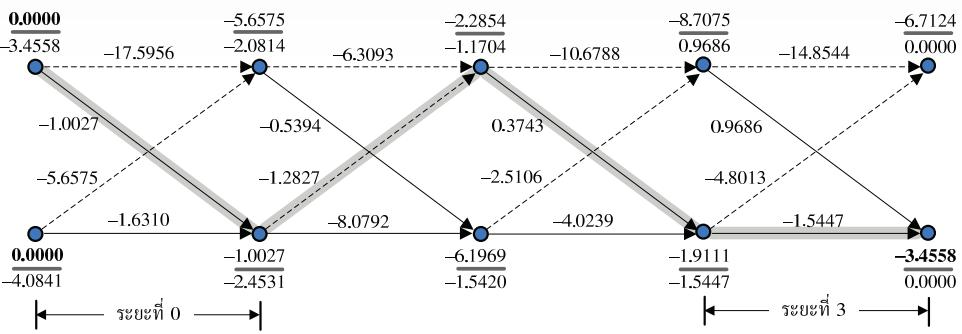  
รูปที่ 3.14 ขั้นตอนการถอดรหัสข้อมูลของอัลกอริทึม SOVA แบบสองทิศทางในตัวอย่างที่ 3.7

ซึ่งตรงกับบิตข้อมูล $a _ { k }$ ที่ส่งมาจากวงจรภาคส่ง (บิตสุดท้ายไม่มีอยู่จริงในระบบ แต่เป็นผลลัพธ์ ที่เกิดจากการทำคอนโวลูชันระหว่างข้อมูลอินพุตและช่องสัญญาณ) แสดงว่าไม่มีข้อผิดพลาด เกิดขึ้นจากการถอดรหัสข้อมูลด้วยอัลกอริทึม SOVA แบบสองทิศทาง

## การคำนวณแบบย้อนกลับ

3. กำหนดค่าเริ่มต้นของเมตริกเส้นทางแบบย้อนกลับ $\Phi _ { 4 } ^ { b } \left( u \right) = 0$ สำหรับทุกสถานะ $\boldsymbol { u } = \{ a , b \}$

4.ระยะที่ 3 (เมื่อ $k = 3 )$ คำนวณหาค่าเมตริกสาขา $\tilde { \gamma } _ { 3 } ^ { b } \left( u , q \right)$ และปรับปรุงเมตริกเส้นทางแบบ ย้อนกลับ $\Phi _ { 3 } ^ { b } \left( u \right)$ ให้ครบทุกสถานะ ก็จะได้ผลลัพธ์ตามที่แสดงในรูปที่ 3.14 เนื่องจากบิตข้อมูล ตามเส้นทาง ML ณ เวลา $k = 3$ คือ $\hat { a } _ { 3 } = 1$ ดังนั้นเมตริกเส้นทางที่มีค่าสูงสุดของบิตข้อมูล ตรงข้าม $a _ { 3 } ^ { c } = - 1$ หาได้จากสมการ (3.51) นั่นคือ

$$
\begin{array} { l } { { \Phi _ { 4 } ^ { c } = \underset { \forall \left( u , q \right) , \hat { a } \left( u , q \right) \neq \hat { a } _ { 3 } } { \operatorname* { m a x } } \left\{ \left( \Phi _ { 3 } \left( a \right) + \tilde { \gamma } _ { 3 } ^ { b } \left( a , a \right) + \Phi _ { 4 } ^ { b } \left( a \right) \right) , \mathrm { ~ } \left( \Phi _ { 3 } \left( b \right) + \tilde { \gamma } _ { 3 } ^ { b } \left( b , a \right) + \Phi _ { 4 } ^ { b } \left( a \right) \right) \right\} } } \\ { { \mathrm { ~ } } } \\ { { \mathrm { ~ } = \underset { \forall \left( u , q \right) , \hat { a } \left( u , q \right) \neq 1 } { \operatorname* { m a x } } \left\{ \left( - 8 . 7 0 7 5 - 1 4 . 8 5 4 4 + 0 \right) , \mathrm { ~ } \left( - 1 . 9 1 1 1 - 4 . 8 0 1 3 + 0 \right) \right\} } } \\ { { \mathrm { ~ } } } \\ { { \mathrm { ~ } = - 6 . 7 1 2 4 } } \end{array}
$$

ดังนั้นค่า LLR แบบอะโพสเทอริออริของของบิตข้อมูล $a _ { 3 }$ หาได้จากสมการ (3.48) นั้นคือ

$$
\lambda _ { p } \left( a _ { 3 } \right) = \Phi _ { 4 } ^ { ( 1 ) } - \Phi _ { 4 } ^ { ( - 1 ) } = \Phi _ { 4 } ^ { \mathrm { m a x } } - \Phi _ { 4 } ^ { c } = \left( - 3 . 4 5 5 8 \right) - \left( - 6 . 7 1 2 4 \right) = 3 . 2 5 6 6
$$

5.ระยะที่ 2 (เมื่อ $k = 2 )$ คำนวณหาค่าเมตริกสาขา $\tilde { \gamma } _ { 2 } ^ { b } \left( u , q \right)$ และปรับปรุงเมตริกเส้นทางแบบ ย้อนกลับ $\Phi _ { 2 } ^ { b } \left( u \right)$ ให้ครบทุกสถานะ ก็จะได้ผลลัพธ์ตามที่แสดงในรูปที่ 3.14 เนื่องจากบิตข้อมูล

ตามเส้นทาง ML ณ เวลา $k = 2$ คือ $\hat { a } _ { 2 } = 1$ ดังนั้นเมตริกเส้นทางที่มีค่าสูงสุดของบิตข้อมูล ตรงข้าม $a _ { 2 } ^ { c } = - 1$ หาได้จากสมการ (3.51) นั่นคือ

$$
\begin{array} { l } { { \Phi _ { 3 } ^ { c } = \underset { \forall \left( u , q \right) , \hat { a } \left( u , q \right) \neq \hat { a } _ { 2 } } { \operatorname* { m a x } } \left\{ \left( \Phi _ { 2 } \left( a \right) + \tilde { \gamma } _ { 2 } ^ { b } \left( a , a \right) + \Phi _ { 3 } ^ { b } \left( a \right) \right) , \ \left( \Phi _ { 2 } \left( b \right) + \tilde { \gamma } _ { 2 } ^ { b } \left( b , a \right) + \Phi _ { 3 } ^ { b } \left( a \right) \right) \right\} } } \\ { { \mathrm { } } } \\ { { \mathrm { } = \underset { \forall \left( u , q \right) , \hat { a } \left( u , q \right) \neq 1 } { \operatorname* { m a x } } \left\{ \left( - 2 . 2 8 5 4 - 1 0 . 6 7 8 8 + 0 . 9 6 8 6 \right) , \ \left( - 6 . 1 9 6 9 - 2 . 5 1 0 6 + 0 . 9 6 8 6 \right) \right\} } } \\ { { \mathrm { } } } \\ { { \mathrm { } = - 7 . 7 3 8 9 } } \end{array}
$$

ดังนั้นค่า e $\lambda _ { p } \left( a _ { 2 } \right)$ หาได้จากสมการ (3.48) นั่นคือ e

$$
\lambda _ { p } \left( a _ { 2 } \right) = \Phi _ { 3 } ^ { ( 1 ) } - \Phi _ { 3 } ^ { ( - 1 ) } = \Phi _ { 4 } ^ { \operatorname* { m a x } } - \Phi _ { 3 } ^ { c } = \left( - 3 . 4 5 5 8 \right) - \left( - 7 . 7 3 8 9 \right) = 4 . 2 8 3 2
$$

6. ระยะที่ 1 และ 0 (เมื่อ k = 1 และ 0) ทำการคำนวณเช่นเดียวกับในขั้นตอนที่ 4 และ $^ { 5 }$ ก็จะ ได้เมตริกเส้นทางที่มีค่าสูงสุดของบิตข้อมูลตรงข้าม $a _ { 1 } ^ { c } = 1$ และ $a _ { 0 } ^ { c } = - 1$ เท่ากับ

$$
\Phi _ { 2 } ^ { c } = - 7 . 7 3 8 9 \quad \quad \mathfrak { u } \mathfrak { a } _ { \mathfrak { e } } ^ { \omega } \quad \Phi _ { 1 } ^ { c } = - 7 . 7 3 8 9
$$

ดังนั้นค่า $\lambda _ { p } \left( a _ { 1 } \right)$ และ $\lambda _ { p } \left( a _ { 1 } \right)$ มีค่าเท่ากับ

$$
\lambda _ { p } \left( a _ { 1 } \right) = \Phi _ { 2 } ^ { ( 1 ) } - \Phi _ { 2 } ^ { ( - 1 ) } = \Phi _ { 2 } ^ { c } - \Phi _ { 4 } ^ { \operatorname* { m a x } } = \left( - 7 . 7 3 8 9 \right) - \left( - 3 . 4 5 5 8 \right) = - 4 . 2 8 3 2
$$

$$
\lambda _ { p } \left( a _ { 0 } \right) = \Phi _ { 1 } ^ { ( 1 ) } - \Phi _ { 1 } ^ { ( - 1 ) } = \Phi _ { 4 } ^ { \mathrm { m a x } } - \Phi _ { 1 } ^ { c } = \left( - 3 . 4 5 5 8 \right) - \left( - 7 . 7 3 8 9 \right) = 4 . 2 8 3 2
$$

เพราะฉะนั้นอัลกอริทึม SOVA แบบสองทิศทางจะให้ค่า LLR แบบอะโพสเทอริออริของบิตข้อมูล 2 $a _ { k }$ เท่ากับ

$$
\left\{ \lambda _ { p } \left( a _ { 0 } \right) , \lambda _ { p } \left( a _ { 1 } \right) , \lambda _ { p } \left( a _ { 2 } \right) , \lambda _ { p } \left( a _ { 3 } \right) \right\} \approx \left\{ 4 . 2 8 3 2 , - 4 . 2 8 3 2 , 4 . 2 8 3 2 , 3 . 2 5 6 6 \right\}
$$

ตัวอย่างที่ 3.8 จากแบบจำลองช่องสัญญาณในรูปที่ 2.10 ถ้ากำหนดให้ลำดับข้อมูลอินพุต $a _ { k } \ =$ {1, 1, −1}, ช่องสัญญาณ $H ( D ) = 1 - D ^ { 2 }$ , สัญญาณรบกวน $n _ { k } = \{ 0 . 2 , 0 . 3 , - 0 . 2 , 0 . 5 , 0 . 3 \}$ จงใช้อัลกอริทึม SOVA แบบสองทิศทาง ในการถอดรหัสข้อมูล $y _ { k }$ โดยกำหนดให้ $\lambda _ { a } \left( a _ { k } \right) = \{ - 1$ 1, 2, −1, 1} และความแปรปรวนของ $n _ { k }$ เท่ากับ $\sigma ^ { 2 } = 1 / \left( 2 \pi \right)$

วิธีทำ ข้อมูลที่ต้องการให้ใช้อัลกอริทึม SOVA แบบสองทิศทางตรวจหาคือ

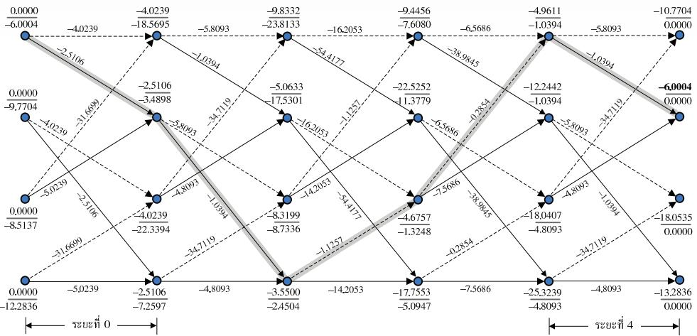  
รูปที่ 3.15 ขั้นตอนการถอดรหัสข้อมูลของอัลกอริทึม ร0VA ในตัวอย่างที่ 3.8

$$
y _ { k } = a _ { k } * h _ { k } + n _ { k } = \{ 1 . 2 , 1 . 3 , - 2 . 2 , - 1 . 5 , 1 . 3 \}
$$

และมีแผนภาพเทรลลิสของช่องสัญญาณ $H ( D ) = 1 - D ^ { 2 }$ ตามรูปที่ 2.15 ซึ่งมีทั้งหมดสี่สถานะ คือ สถานะ (a), (b), (c) และ (d)

จากนันทำการถอดรหัสข้อมูลโดยใช้อัลกอริทึม รOVA แบบสองทิศทางเช่นเดียวกับวิธี การที่อธิบายในตัวอย่างที่ 3.7 ก็จะได้เมตริกสาขา $\widetilde { \gamma } _ { k } \left( u , q \right)$ , เมตริกเส้นทางแบบข้างหน้า $\Phi _ { k } \left( u \right)$ และแบบย้อนกลับ $\boldsymbol { \Phi } _ { k } ^ { b } \left( \boldsymbol { u } \right)$ ตามรูปที่3.15 นอกจากนี้เส้นลูกศรที่ลากผ่านแต่ละโหนดคือเส้นทาง ML (เส้นสีเทา) ที่มีเมตริกเส้นทางสูงสุด $\Phi _ { 4 } ^ { \mathrm { m a x } } = - 6 . 0 0 0 4$ โดยที่ลูกศรเส้นทึบแทนบิตข้อมูล อินพุต $a _ { k } = 1$ และลูกศรเส้นปะแทนบิตข้อมูลอินพุต $a _ { k } = - 1$ ดังนั้นอัลกอริทึม SOVA แบบ สองทิศทางจะถอดรหัสข้อมูลแบบฮาร์ดได้เป็น

$$
\left\{ \hat { a } _ { 0 } , \hat { a } _ { 1 } , \hat { a } _ { 2 } , \hat { a } _ { 3 } , \hat { a } _ { 4 } \right\} = \left\{ 1 , 1 , - 1 , - 1 , 1 \right\}
$$

ซึ่งตรงกับบิตข้อมูล $a _ { k }$ ข้อมูลด้วยอัลกอริทึม รOVA แบบสองทิศทาง

ในการหาค่า LLR ของบิตข้อมูล $a _ { k }$ อัลกอริทึม รOVA แบบสองทิศทางจะเริ่มต้นหา เมตริกเส้นทางที่มีค่าสูงสุด $\Phi _ { k + 1 } ^ { c }$ ของบิตข้อมูลตรงข้าม $\left\{ a _ { 0 } ^ { c } , a _ { 1 } ^ { c } , a _ { 2 } ^ { c } , a _ { 3 } ^ { c } , a _ { 4 } ^ { c } \right\} = \left\{ - 1 , - 1 , 1 , 1 , - 1 \right\}$ ซึ่งมีค่าเท่ากับ

$$
\left\{ \Phi _ { 1 } ^ { c } , \Phi _ { 2 } ^ { c } , \Phi _ { 3 } ^ { c } , \Phi _ { 4 } ^ { c } , \Phi _ { 5 } ^ { c } \right\} = \left\{ - 2 2 . 5 9 3 4 , - 1 7 . 0 5 3 5 , - 2 2 . 8 5 0 0 , - 1 3 . 2 8 3 6 , - 1 0 . 7 7 0 4 \right\}
$$

ตารางที่ 3.1 ความชับซ้อนของวงจรตรวจหาแบบซอฟต์แบบต่างๆ ที่ต้องใช้เพื่อถอดรหัสข้อมูลหนึ่งบิต
<table><tr><td rowspan=2 colspan=1>วงจรตรวจหาแบบซอฟต์</td><td rowspan=1 colspan=2>จำนวนตัวดำเนินการทางคณิตศาสตร์ (ต่อหนึ่งบิต)</td></tr><tr><td rowspan=1 colspan=1>การบวก</td><td rowspan=1 colspan=1>การคูณ</td></tr><tr><td rowspan=1 colspan=1>BCJR (หรือ MAP)</td><td rowspan=1 colspan=1>14Q − 3</td><td rowspan=1 colspan=1>22Q + 1</td></tr><tr><td rowspan=1 colspan=1>Max-Log-MAP</td><td rowspan=1 colspan=1>24Q</td><td rowspan=1 colspan=1>12Q</td></tr><tr><td rowspan=1 colspan=1>Log-MAP</td><td rowspan=1 colspan=1>32Q -4</td><td rowspan=1 colspan=1>12Q</td></tr><tr><td rowspan=1 colspan=1>SOVA [35]</td><td rowspan=1 colspan=1> $7 { \cal Q } + \frac { \delta ^ { 2 } + 9 \delta + 9 } { 2 } + 1$ </td><td rowspan=1 colspan=1>6Q + 1</td></tr><tr><td rowspan=1 colspan=1>Bi-directional SOVA</td><td rowspan=1 colspan=1>17Q + 1</td><td rowspan=1 colspan=1>12Q</td></tr></table>

3.6 XtWE

เพราะฉะนันอัลกอริทึม ร0VA แบบสองทิศทางจะให้ค่า $\lambda _ { p } \left( a _ { k } \right)$ เท่ากับ e

$$
\left\{ \setminus _ { p } \left( a _ { 0 } \right) , \setminus _ { p } \left( a _ { 1 } \right) , \setminus _ { p } \left( a _ { 2 } \right) , \setminus _ { p } \left( a _ { 3 } \right) , \setminus _ { p } \left( a _ { 4 } \right) \right\} \approx \left\{ 1 6 . 5 9 3 , 1 1 . 0 5 3 , - 1 6 . 8 5 , - 7 . 2 8 3 2 , 4 . 7 6 9 9 \right\}
$$

## 3.6 ความซับซ้อนของวงจรตรวจหาแบบซอฟต์

ในที่นี้การเปรียบเทียบความซับซ้อนของวงจรตรวจหาแบบซอฟต์ทั้งหมดที่อธิบายในบทที่ 2 และ 3 สรี จะพิจารณาจากจำนวนตัวดำเนินการบวก (additioก operator) และตัวดำเนินการคูณ (multiplication operator) ที่ต้องใช้เพื่อถอดรหัสข้อมูลหนึ่งบิต โดยอาศัยเกณฑ์ในการพิจารณาดังนี้

ตัวดำเนินการเลือก/การเปรียบเทียบ/การหาค่าสูงสุด /การตัดสินใจแบบฮาร์ด 1 ตัว มีความ ซับซ้อนเทียบเท่ากับตัวดำเนินการบวก 1 ตัว

ตัวดำเนินการบวกและการลบมีความชับซ้อนเท่ากัน ในขณะที่ตัวดำเนินการคูณและการหารมี ความซับซ้อนเท่ากัน

• ฟังก์ชันคณิตศาสตร์ต่างๆ เช่น ฟังก์ชันลอการิทึมธรรมชาติ, ฟังก์ชันเลขชี้กำลัง, ฟังก์ชันหาค่า สัมบูรณ์, และฟังก์ชันแก้ไขข้อผิดพลาดในสมการ (3.16) สามารถหาค่าได้ โดยใช้ตารางค้นหา (10ok-up table) เพราะฉะนั้นในที่นี้จะไม่นับเป็นความซับซ้อนของวงจรตรวจหา

ตารางที่ 3.1 แสดงความซับซ้อนของวงจรตรวจหาแบบซอฟต์แบบต่างๆ ที่ต้องใช้เพื่อถอด รหัสข้อมูลหนึ่งบิต11 เมื่อ $Q \ = \ 2 ^ { \mathrm { v } }$ จำนวนสถานะในแผนภาพเทรลลิส (trellis state) และ v คือ จำนวนหน่วยความจำของทาร์เก็ตที่ใช้สร้างแผนภาพเทรลลิส นอกจากนี้ตารางที่ 3.2 และ 3.3 ได้ยก ตัวอย่างวิธีการนับจำนวนตัวดำเนินการทางคณิตศาสตร์ต่างๆ ของอัลกอริทึม BดJR และ Max-Log-MAP เพื่อเป็นแนวทางให้ผู้อ่านทราบวิธีการนับจำนวนตัวดำเนินการในตารางที่ $3 . 1 ^ { 1 3 }$

ตารางที่ 3.2 ความชับซ้อนของอัลกอริทึม BCJR ที่ต้องใช้เพื่อถอดรหัสข้อมูลหนึ่งบิต
<table><tr><td rowspan=2 colspan=1>BCJR (หรือ MAP)</td><td rowspan=1 colspan=2>จำนวนตัวดำเนินการทางคณิตศาสตร์ (ต่อหนึ่งบิต)</td></tr><tr><td rowspan=1 colspan=1>การบวก</td><td rowspan=1 colspan=1>การคูณ</td></tr><tr><td rowspan=1 colspan=1> $\Upsilon _ { k } \left( u , q \right)$ ในสมการ (2.29) ทั้งการเวียนเกิดแบบข้างหน้าและแบบย้อนกลับ[12</td><td rowspan=1 colspan=1>8ด</td><td rowspan=1 colspan=1>120</td></tr><tr><td rowspan=1 colspan=1> $\alpha _ { k + 1 } \left( q \right)$ ในสมการ (2.14)</td><td rowspan=1 colspan=1>ดู</td><td rowspan=1 colspan=1>2Q</td></tr><tr><td rowspan=1 colspan=1> ${ \beta } _ { k } \left( u \right)$ ในสมการ (2.16)</td><td rowspan=1 colspan=1>Q</td><td rowspan=1 colspan=1>2Q</td></tr><tr><td rowspan=1 colspan=1>นอร์มอลไลเซชัน $\alpha _ { k } \left( u \right)$ ในสมการ (2.30)</td><td rowspan=1 colspan=1>Q-1</td><td rowspan=1 colspan=1>ด</td></tr><tr><td rowspan=1 colspan=1>นอร์มอลไลเซชัน ${ \beta } _ { k } \left( u \right)$ ในสมการ (2.30)</td><td rowspan=1 colspan=1>Q-1</td><td rowspan=1 colspan=1>ค</td></tr><tr><td rowspan=1 colspan=1>ค่า LLR $\lambda _ { p } \left( a _ { k } \right)$ ในสมการ (2.24)</td><td rowspan=1 colspan=1>2(Q − 1)</td><td rowspan=1 colspan=1>4Q + 1</td></tr><tr><td rowspan=1 colspan=1>การตัดสินใจแบบฮาร์ดของข้อมูลหนึ่งบิต</td><td rowspan=1 colspan=1>1</td><td rowspan=1 colspan=1>0</td></tr><tr><td rowspan=1 colspan=1>รวม</td><td rowspan=1 colspan=1>14Q - 3</td><td rowspan=1 colspan=1>22Q + 1</td></tr></table>

ตารางที่ 3.3 ความชับซ้อนของอัลกอริทึม Max-Log-MAP ที่ต้องใช้เพื่อถอดรหัสข้อมูลหนึ่งบิต
<table><tr><td rowspan=2 colspan=1>MAX-LOG-MAP</td><td rowspan=1 colspan=3>จำนวนตัวดำเนินการทางคณิตศาสตร์ (ต่อหนึ่งบิต)</td></tr><tr><td rowspan=1 colspan=1>การบวก</td><td rowspan=1 colspan=1>การคูณ</td><td rowspan=1 colspan=1>การหาค่าสูงสุด</td></tr><tr><td rowspan=1 colspan=1> $\tilde { \gamma } _ { k } \left( u , q \right)$ ในสมการ (3.10) ทั้งการเวียนเกิดแบบข้างหน้าและแบบย้อนกลับ</td><td rowspan=1 colspan=1>12@</td><td rowspan=1 colspan=1>12ด</td><td rowspan=1 colspan=1>o</td></tr><tr><td rowspan=1 colspan=1> $\tilde { \alpha } _ { k + 1 } \left( q \right)$ ในสมการ (3.12)</td><td rowspan=1 colspan=1>2Q</td><td rowspan=1 colspan=1>0</td><td rowspan=1 colspan=1>ด</td></tr><tr><td rowspan=1 colspan=1> $\widetilde { \beta } _ { k } \left( u \right)$ ในสมการ (3.14)</td><td rowspan=1 colspan=1>2Q</td><td rowspan=1 colspan=1>0</td><td rowspan=1 colspan=1>ด</td></tr><tr><td rowspan=1 colspan=1>ค่า LLR $\lambda _ { p } \left( a _ { k } \right)$ ในสมการ (3.9)</td><td rowspan=1 colspan=1>4Q + 1</td><td rowspan=1 colspan=1>0</td><td rowspan=1 colspan=1>2(Q − 1)</td></tr><tr><td rowspan=1 colspan=1>การตัดสินใจแบบฮาร์ดของข้อมูลหนึ่งบิต</td><td rowspan=1 colspan=1>1</td><td rowspan=1 colspan=1>0</td><td rowspan=1 colspan=1>0</td></tr><tr><td rowspan=1 colspan=1>รวม</td><td rowspan=1 colspan=1>20Q + 2</td><td rowspan=1 colspan=1>12Q</td><td rowspan=1 colspan=1>4Q − 2</td></tr></table>

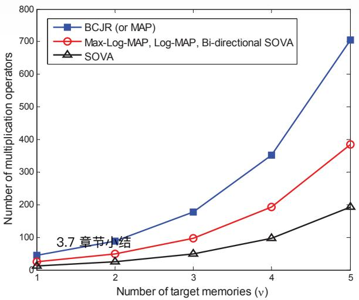  
รูปที่ 3.16 เปรียบเทียบจำนวนตัวดำเนินการคูณของวงจรตรวจหาแบบซอฟต์แบบต่างๆ (ต่อหนึ่งบิต)

ในทางปฏิบัติตัวดำเนินการคูณถือว่ามีความชับซ้อนมากกว่าตัวดำเนินการบวก เมื่อนำไป สร้างเป็นวงจรอิเล็กทรอนิกส์ เพราะฉะนั้นในที่นี้จะพิจารณาเฉพาะจำนวนตัวดำเนินการคูณในการ เปรียบเทียบความซับซ้อนของวงจรตรวจหาแบบซอฟต์แบบต่างๆ (ต่อหนึ่งบิต) ตามที่แสดงในรูปที่ 3.16 ซึ่งจะพบว่าอัลกอริทึม BCJR มีความซับซ้อนมากสุด โดยเฉพาะอย่างยิ่งเมื่อทาร์เก็ตที่ใช้มี หน่วยความจำจำนวนมาก สำหรับอัลกอริทึม Max-Log-MAP, Log-MAP และ Bi-directional SOVA มีความซับซ้อนเท่ากัน และอัลกอริทึม รOVA มีความซับซ้อนน้อยสุด ดังนั้นจึงเป็นเหตุผล ว่าทำไมอัลกอริทึม ร0VA จึงได้ถูกนำมาใช้จริงในระบบการถอดรหัสแบบวนซ้ำของงานประยุกต์ ต่างๆ (รวมทั้งในฮาร์ดดิสก์ไดรฟ์) มากกว่าอัลกอริทึม BตJR อย่างไรก็ตามถ้าพิจารณาตารางที่3.1 ในภาพรวมจะพบว่า อัลกอริทึ่มที่มีความซับซ้อนมากสุดคือ BCJR รองลงมาคือ Log-MAP, Max-Log-MAP, Bi-directional SOVA, และ SOVA ตามลำดับ

## 3.7 สรุปท้ายบท

องค์ประกอบที่สำคัญของระบบการถอดรหัสแบบวนซ้ำก็คือ วงจรตรวจหาแบบซอฟต์และวงจร ถอดรหัสแบบซอฟต์ ซึ่งจะทำหน้าที่แลกเปลี่ยนข่าวสารแบบซอฟต์ระหว่างกัน เพื่อช่วยให้ระบบมี สมรรถนะดียิ่งขึ้นในแต่ละรอบของการวนซ้ำ อัลกอริทึม BCJR เป็นอัลกอริทึมแบบ MAP ที่ สามารถนำมาสร้างเป็นวงจรตรวจหาแบบซอฟต์และวงจรถอดรหัสแบบซอฟต์ได้ โดยรับประกันได้ ว่าบิตข้อมูลแต่ละบิตที่ถอดรหัสได้จะเป็นบิตข้อมูลที่ดีสุด (หรือมีข้อผิดพลาดน้อยสุด) อย่างไรก็ตาม อัลกอริทึม BCJR มีความซับซ้อนมาก จึงไม่นิยมนำมาใช้จริงในระบบการถอดรหัสแบบวนซ้ำของ งานประยุกต์ต่างๆ

ดังนั้นบทนี้จึงได้อธิบายแนวคิดและหลักการทำงานของอัลกอริทึมที่เหมือน MAP แบบ ต่างๆ ได้แก่ Max-Log-MAP, Log-MAP, SOVA, และ Bi-directional SOVA ซึ่งมีสมssถนะ ใกล้เคียงกับอัลกอริทึม BCJR แต่มีความซับซ้อนน้อยกว่า (ตามตารางที่ 3.1) โดยเฉพาะอย่างยิ่ง อัลกอริทึม รOVA ซึ่งถือว่ามีความซับซ้อนน้อยสุด แต่มีสมรรถนะใกล้เคียงกับอัลกอริทึม BCJR เมื่อนำไปใช้งานในระบบการถอดรหัสแบบวนซ้ำของงานประยุกต์ต่างๆ (ดูตัวอย่างในหัวข้อที่ 4.6.2) เพราะฉะนั้นในปัจจุบันจึงได้นิยมนำอัลกอริทึม รOVA ไปใช้ในระบบการถอดรหัสแบบวนซ้ำของ งานประยุกต์ต่างๆ รวมทั้งในฮาร์ดดิสก์ไดรฟด้วย

## 3.8 แบบฝึกหัดท้ายบท

1. จงอธิบายความแตกต่างของอัลกอริทึม BCJR, Max-Log-MAP, Log-MAP, SOVA และ Bi-directional SOVA

2. จากแบบจำลองช่องสัญญาณในรูปที่ 2.10 ถ้ากำหนดให้ลำดับข้อมูลอินพุต $a _ { k } = \{ 1 , 1 , - 1 \}$ ช่องสัญญาณ $H ( D ) = 1 - D$ , สัญญาณรบกวน $n _ { k } = \{ - 0 . 2 , - 0 . 3 , 0 . 2 , 0 . 1 \}$ ซึ่งมีความ แปรปรวนเท่ากับ $\sigma ^ { 2 } = 1 / \left( 2 \pi \right)$ จงถอดรหัสข้อมูล $y _ { k }$ โดยใช้อัลกอริทึม Max-Log-MAP และกำหนดให้ข่าวสารอะพิรืออริ

2.1) ${ \lambda } _ { a } \left( a _ { k } \right) = \{ 0 , 0 , 0 , 0 \}$

2.2) $\lambda _ { a } \left( a _ { k } \right) = \{ 4 , 6 , - 2 , 0 \}$

2.3) $\lambda _ { a } \left( a _ { k } \right) = \{ - 4 , - 6 , 2 , 0 \}$

3.จากแบบฝึกหัดท้ายบทข้อที่ 2 จงถอดรหัสข้อมูล $y _ { k }$ โดยใช้อัลกอริทึม BCJR

4.จากแบบฝึกหัดท้ายบทข้อที่ 2 จงถอดรหัสข้อมูล $y _ { k }$ โดยใช้อัลกอริทึม Log-MAP

5. จากแบบฝึกหัดท้ายบทข้อที่ 2 จงถอดรหัสข้อมูล $y _ { k }$ โดยใช้อัลกอริทึม รOVA เมื่อกำหนดให้ ความลึกการถอดรหัสเท่ากับ

5.1) $\delta = 1$
5.2) $\delta = 3$

5.3) \u0c40\u0e1b\u0e23\u0e35\u0e22\u0e1a\u0e40\u0e17\u0e35\u0e22\u0e1a\u0e41\u0e25\u0e30\u0e2d\u0e18\u0e34\u0e1a\u0e32\u0e22\u0e1c\u0e25\u0e25\u0e31\u0e1e\u0e18\u0e4c\u0e17\u0e35\u0e48\u0e44\u0e14\u0e49\u0e08\u0e32\u0e01\u0e01\u0e32\u0e23\u0e15\u0e23\u0e27\u0e08\u0e08\u0e31\u0e1a\u0e43\u0e19\u0e02\u0e49\u0e2d 5.1 \u0e41\u0e25\u0e30 5.2

6. \u0e08\u0e32\u0e01\u0e41\u0e1a\u0e1a\u0e1d\u0e36\u0e01\u0e2b\u0e31\u0e14\u0e17\u0e49\u0e32\u0e22\u0e1a\u0e17\u0e02\u0e49\u0e2d\u0e17\u0e35\u0e48 2 \u0e08\u0e07\u0e16\u0e2d\u0e14\u0e23\u0e2b\u0e31\u0e2a\u0e02\u0e49\u0e2d\u0e21\u0e39\u0e25 $y_k$ \u0e42\u0e14\u0e22\u0e43\u0e0a\u0e49\u0e2d\u0e31\u0e25\u0e01\u0e2d\u0e23\u0e34\u0e17\u0e36\u0e21 Bi-directional SOVA

7. \u0e08\u0e07\u0e40\u0e1b\u0e23\u0e35\u0e22\u0e1a\u0e40\u0e17\u0e35\u0e22\u0e1a\u0e41\u0e25\u0e30\u0e2d\u0e18\u0e34\u0e1a\u0e32\u0e22\u0e1c\u0e25\u0e25\u0e31\u0e1e\u0e18\u0e4c\u0e17\u0e35\u0e48\u0e44\u0e14\u0e49\u0e08\u0e32\u0e01\u0e01\u0e32\u0e23\u0e15\u0e23\u0e27\u0e08\u0e08\u0e31\u0e1a\u0e43\u0e19\u0e02\u0e49\u0e2d\u0e17\u0e35\u0e48 2 \u0e40\u0e21\u0e37\u0e48\u0e2d\u0e43\u0e0a\u0e49\u0e2d\u0e31\u0e25\u0e01\u0e2d\u0e23\u0e34\u0e17\u0e36\u0e21 (BCJR, Max-Log-MAP, Log-MAP, SOVA \u0e41\u0e25\u0e30 Bi-directional SOVA) \u0e42\u0e14\u0e22\u0e43\u0e0a\u0e49\u0e04\u0e48\u0e32\u0e02\u0e49\u0e2d\u0e21\u0e39\u0e25\u0e40\u0e1a\u0e37\u0e49\u0e2d\u0e07\u0e15\u0e49\u0e19 \u0e40\u0e2b\u0e21\u0e37\u0e2d\u0e19\u0e01\u0e31\u0e1a\u0e02\u0e49\u0e2d 2

8. \u0e08\u0e32\u0e01\u0e41\u0e1a\u0e1a\u0e08\u0e33\u0e25\u0e2d\u0e07\u0e0a\u0e48\u0e2d\u0e07\u0e2a\u0e31\u0e0d\u0e0d\u0e32\u0e19\u0e43\u0e19\u0e23\u0e39\u0e1b\u0e17\u0e35\u0e48 2.10 \u0e16\u0e49\u0e32\u0e01\u0e33\u0e2b\u0e19\u0e14\u0e43\u0e2b\u0e49\u0e25\u0e33\u0e14\u0e31\u0e1a\u0e02\u0e49\u0e2d\u0e21\u0e39\u0e25\u0e34\u0e19\u0e1e\u0e38\u0e15 $a_k = \{ 1, 1, -1 \}$, \u0e0a\u0e48\u0e2d\u0e07\u0e2a\u0e31\u0e0d\u0e0d\u0e32\u0e19 $H(D) = 1 - 2D + D^2$, \u0e2a\u0e31\u0e0d\u0e0d\u0e32\u0e19\u0e23\u0e1a\u0e01\u0e27\u0e19 $n_k = \{ 0.1, -0.2, 0.2, 0.5, -0.2 \}$ \u0e0b\u0e36\u0e48\u0e07\u0e21\u0e35\u0e04\u0e27\u0e32\u0e21\u0e41\u0e1b\u0e23\u0e1b\u0e23\u0e32\u0e27\u0e19\u0e40\u0e17\u0e48\u0e32\u0e01\u0e31\u0e1a $\sigma^2 = 1/(2\pi)$ \u0e08\u0e07\u0e16\u0e2d\u0e14\u0e23\u0e2b\u0e31\u0e2a\u0e02\u0e49\u0e2d\u0e21\u0e39\u0e25 $y_k$ \u0e42\u0e14\u0e22\u0e43\u0e0a\u0e49\u0e2d\u0e31\u0e25\u0e01\u0e2d\u0e23\u0e34\u0e17\u0e36\u0e21 Max-Log-MAP \u0e41\u0e25\u0e30\u0e01\u0e33\u0e2b\u0e19\u0e14\u0e43\u0e2b\u0e49\u0e02\u0e48\u0e32\u0e27\u0e2a\u0e32\u0e23\u0e40\u0e1a\u0e37\u0e49\u0e2d\u0e07\u0e15\u0e49\u0e19

8.1) $\lambda_a(a_k) = \{ 0, 0, 0, 0, 0 \}$

8.2) $\lambda_a(a_k) = \{ 2, 4, -4, 0, 0 \}$

8.3) $\lambda_a(a_k) = \{ -2, -4, 4, 0, 0 \}$

8.4) \u0e40\u0e1b\u0e23\u0e35\u0e22\u0e1a\u0e40\u0e17\u0e35\u0e22\u0e1a\u0e41\u0e25\u0e30\u0e2d\u0e18\u0e34\u0e1a\u0e32\u0e22\u0e1c\u0e25\u0e25\u0e31\u0e1e\u0e18\u0e4c\u0e17\u0e35\u0e48\u0e44\u0e14\u0e49\u0e08\u0e32\u0e01\u0e01\u0e32\u0e23\u0e15\u0e23\u0e27\u0e08\u0e08\u0e31\u0e1a\u0e43\u0e19\u0e02\u0e49\u0e2d 8.1 \u0e16\u0e36\u0e07 8.3

9. \u0e08\u0e32\u0e01\u0e41\u0e1a\u0e1a\u0e1d\u0e36\u0e01\u0e2b\u0e31\u0e14\u0e17\u0e49\u0e32\u0e22\u0e1a\u0e17\u0e02\u0e49\u0e2d\u0e17\u0e35\u0e48 8 \u0e08\u0e07\u0e16\u0e2d\u0e14\u0e23\u0e2b\u0e31\u0e2a\u0e02\u0e49\u0e2d\u0e21\u0e39\u0e25 $y_k$ \u0e42\u0e14\u0e22\u0e43\u0e0a\u0e49\u0e2d\u0e31\u0e25\u0e01\u0e2d\u0e23\u0e34\u0e17\u0e36\u0e21 BCJR

10. \u0e08\u0e32\u0e01\u0e41\u0e1a\u0e1a\u0e1d\u0e36\u0e01\u0e2b\u0e31\u0e14\u0e17\u0e49\u0e32\u0e22\u0e1a\u0e17\u0e02\u0e49\u0e2d\u0e17\u0e35\u0e48 8 \u0e08\u0e07\u0e16\u0e2d\u0e14\u0e23\u0e2b\u0e31\u0e2a\u0e02\u0e49\u0e2d\u0e21\u0e39\u0e25 $y_k$ \u0e42\u0e14\u0e22\u0e43\u0e0a\u0e49\u0e2d\u0e31\u0e25\u0e01\u0e2d\u0e23\u0e34\u0e17\u0e36\u0e21 Log-MAP

11. \u0e08\u0e32\u0e01\u0e41\u0e1a\u0e1a\u0e1d\u0e36\u0e01\u0e2b\u0e31\u0e14\u0e17\u0e49\u0e32\u0e22\u0e1a\u0e17\u0e02\u0e49\u0e2d\u0e17\u0e35\u0e48 8 \u0e08\u0e07\u0e16\u0e2d\u0e14\u0e23\u0e2b\u0e31\u0e2a\u0e02\u0e49\u0e2d\u0e21\u0e39\u0e25 $y_k$ \u0e42\u0e14\u0e22\u0e43\u0e0a\u0e49\u0e2d\u0e31\u0e25\u0e01\u0e2d\u0e23\u0e34\u0e17\u0e36\u0e21 SOVA \u0e40\u0e21\u0e37\u0e48\u0e2d\u0e01\u0e33\u0e2b\u0e19\u0e14\u0e43\u0e2b\u0e49\u0e04\u0e27\u0e32\u0e21\u0e25\u0e36\u0e01\u0e01\u0e32\u0e23\u0e16\u0e2d\u0e14\u0e23\u0e2b\u0e31\u0e2a\u0e40\u0e17\u0e48\u0e32\u0e01\u0e31\u0e1a

11.1) $\delta = 1$

11.2) $\delta = 3$

11.3) \u0e40\u0e1b\u0e23\u0e35\u0e22\u0e1a\u0e40\u0e17\u0e35\u0e22\u0e1a\u0e41\u0e25\u0e30\u0e2d\u0e18\u0e34\u0e1a\u0e32\u0e22\u0e1c\u0e25\u0e25\u0e31\u0e1e\u0e18\u0e4c\u0e17\u0e35\u0e48\u0e44\u0e14\u0e49\u0e08\u0e32\u0e01\u0e01\u0e32\u0e23\u0e15\u0e23\u0e27\u0e08\u0e08\u0e31\u0e1a\u0e43\u0e19\u0e02\u0e49\u0e2d 8.1 \u0e41\u0e25\u0e30 8.2

12. \u0e08\u0e32\u0e01\u0e41\u0e1a\u0e1a\u0e1d\u0e36\u0e01\u0e2b\u0e31\u0e14\u0e17\u0e49\u0e32\u0e22\u0e1a\u0e17\u0e02\u0e49\u0e2d\u0e17\u0e35\u0e48 8 \u0e08\u0e07\u0e16\u0e2d\u0e14\u0e23\u0e2b\u0e31\u0e2a\u0e02\u0e49\u0e2d\u0e21\u0e39\u0e25 $y_k$ \u0e42\u0e14\u0e22\u0e43\u0e0a\u0e49\u0e2d\u0e31\u0e25\u0e01\u0e2d\u0e23\u0e34\u0e17\u0e36\u0e21 Bi-directional SOVA

13. \u0e08\u0e07\u0e40\u0e1b\u0e23\u0e35\u0e22\u0e1a\u0e40\u0e17\u0e35\u0e22\u0e1a\u0e41\u0e25\u0e30\u0e2d\u0e18\u0e34\u0e1a\u0e32\u0e22\u0e1c\u0e25\u0e25\u0e31\u0e1e\u0e18\u0e4c\u0e17\u0e35\u0e48\u0e44\u0e14\u0e49\u0e08\u0e32\u0e01\u0e01\u0e32\u0e23\u0e15\u0e23\u0e27\u0e08\u0e08\u0e31\u0e1a\u0e43\u0e19\u0e02\u0e49\u0e2d\u0e17\u0e35\u0e48 8 \u0e40\u0e21\u0e37\u0e48\u0e2d\u0e43\u0e0a\u0e49\u0e2d\u0e31\u0e25\u0e01\u0e2d\u0e23\u0e34\u0e17\u0e36\u0e21 (BCJR, Max-Log-MAP, Log-MAP, SOVA \u0e41\u0e25\u0e30 Bi-directional SOVA) \u0e42\u0e14\u0e22\u0e43\u0e0a\u0e49\u0e04\u0e48\u0e32\u0e02\u0e49\u0e2d\u0e21\u0e39\u0e25\u0e40\u0e1a\u0e37\u0e49\u0e2d\u0e07\u0e15\u0e49\u0e19\u0e40\u0e2b\u0e21\u0e37\u0e2d\u0e19\u0e01\u0e31\u0e1a\u0e02\u0e49\u0e2d 8
