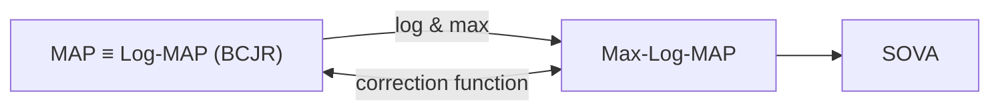

# บทที่ 3

# วงจรตรวจหาแบบซอฟต์

ระบบการประมวลผลสัญญาณของฮาร์ดดิสก์ไดรฟ์ในปัจจุบันเริ่มมีการนำระบบการถอดรหัสแบบ วนซ้ำมาใช้ในการถอดรหัสข้อมูล โดยองค์ประกอบหลักที่สำคัญในระบบการถอดรหัสแบบวนซ้ำ ก็คือวงจรตรวจหาแบบซอฟต์ (soft detector) และวงจรถอดรหัสแบบซอฟต์ (soft decoder) ซึ่ง จะทำหน้าที่แลกเปลี่ยนข่าวสารแบบซอฟต์ (รoft informatioท) ระหว่างกัน เพื่อช่วยให้สมรรถนะ ของระบบดีมากขึ้นในแต่ละรอบของการวนซ้ำ จากที่กล่าวมาในบทที่ 2 อัลกอริทึม BCJR [18] เป็นอัลกอริทึมอะโพสเทอริออริสูงสุด (MAP: maximum a posterior) และเหมาะที่สุด (optimal) ในการหาค่าประมาณของสถานะหรือข้อมูลเอาต์พุตของกระบวนการมาร์คอฟ (Markov process) ดังนันในช่วงแรกทีมีการคิดค้นระบบการถอดรหัสแบบวนซำ [3] จึงได้นำอัลกอริทึ่ม BCJR มาใช้ สร้างวงจรตรวจหาแบบซอฟต์และวงจรถอดรหัสแบบซอฟต์

ถึงแม้ว่าการคำนวณหาเมตริกสถานะ (state metric) ในอัลกอริทึม BCJR จะมีลักษณะ เป็นแบบเวียนเกิด (recursive) ซึ่งทำให้ง่ายในการถอดรหัสข้อมูล อย่างไรก็ตามอัลกอริทึม BCJR ไม่นิยมนำไปใช้จริงในชิปประมวลสัญญาณของหลายๆ งานประยุกต์ เพราะใช้ทรัพยากรในการ คำนวณสูง (เช่น จำนวนตัวดำเนินการบวกและการคูณ) และใช้ฟังก์ชันแบบไม่เป็นเชิงเส้นในการ คำนวณ (เช่น ฟังก์ชันเลขชี้กำลัง) รวมทั้งมีความอ่อนไหวต่อค่าความแปรปรวนของสัญญาณรบกวน ในระบบ [23, 24] ดังนั้นนักวิจัยจึงได้พัฒนาอัลกอริทึมที่เหมือน MAP (MAP-like algorithm) ที่ทำงานในโดเมนลอการิทึม (1ogarithm domain) ซึ่งสามารถแก้ปัญหาเรื่องการคำนวณเชิงตัวเลข และมีความซับซ้อนน้อยกว่ามาก เมื่อเที่ยบกับอัลกอริทึม BCJR

ในบทนี้จะอธิบายหลักการทำงานของอัลกอริทึ่มที่เหมือน MAP เหล่านี้ ซึ่งได้แก่ Max-Log-MAP [23, 24, 38, 39], Log-MAP [23, 24], และ SOVA (soft-output Viterbi algorithm) [19, 42] ซึ่งมีสมรรถนะใกล้เคียงหรือเทียบเท่าอัลกอริทึม BCJR พร้อมทั้งแสดงสมรรถนะและ เปรียบเทียบความซับซ้อนของอัลกอริทึมต่างๆ ทั้งหมด


<details>
<summary>flowchart</summary>


</details>

รูปที่ 3.1 ความสัมพันธ์ของ MAP, Log-MAP, Max-Log-MAP, และ SOVA

# 3.1 บทนำ

วงจรตรวจหาวีเทอร์บิ (Viterb detector) [10, 13] เป็นวงจรตรวจหาแบบควรจะเป็นสูงสุดหรือ วงจรตรวจหาแบบ ML (maximนm-likelihood) โดยข้อมูลเอาต์พุตทีได้จะเป็นค่าประมาณของลำดับ ข้อมูลที่ต้องการตรวจหา หรืออาจกล่าวได้ว่าวงจรตรวจหาแบบ ML จะทำให้ข้อผิดพลาดของลำดับ ข้อมูลมีค่าน้อยสุด แต่ไม่ได้รับประกันว่าบิตข้อมูลแต่ละบิตที่อยู่ในลำดับข้อมูลนั้นเป็นบิตข้อมูลที ดีสุด นั้นคือวงจรตรวจหาแบบ ML ไม่ได้ทำให้บิตข้อมูลแต่ละบิตมีข้อผิดพลาดน้อยสุด นอกจากนี้ วงจรตรวจหาวีเทอร์บิไม่สามารถนำมาใช้ในระบบการถอดรหัสแบบวนซ้ำได้ เพราะระบบนี้จะมีการ แลกเปลี่ยนข่าวสารแบบซอฟต์ (หรือความน่าเชื่อถือของบิตข้อมูล) ระหว่างวงจรตรวจหาแบบ SIS0 (soft input soft output) และวงจรถอดรหัสแบบ SISO

อัลกอริทึม BCJR เป็นอัลกอริทึมแบบ MAP ที่ได้ถูกนำมาใช้ในระบบการถอดรหัสแบบ วนซ้ำในช่วงแรก อย่างไรก็ตามอัลกอริทึม BCJR มีข้อจำกัดในการนำไปใช้จริงในชิปประมวลผล สัญญาณของหลายๆ งานประยุกต์ ดังนั้นนักวิจัยจึงได้พัฒนาอัลกอริทึม Max-Log-MAP และ SOVA ซึ่งมีสมรรถนะใกล้เคียงกับอัลกอริทึม BCJR จากนั้นในเวลาต่อมาจึงได้พัฒนาอัลกอริทึม Log-MAP ที่มีสมรรถนะเทียบเท่ากับอัลกอริทึม BCJR แต่มีความซับซ้อนน้อยกว่ามาก จึงทำให้ สามารถนำไปใช้จริงในชิปประมวลผลสัญญาณได้ รูปที่ 3.1 แสดงความสัมพันธ์ของอัลกอริทึมแบบ MAP และอัลกอริทึมที่เหมือน MAP

# 3.2 อัลกอริทึม MAX-LOG-MAP

อัลกอริทึม Max-Log-MAP [23, 24, 38, 39] พัฒนามาจากอัลกอริทึม BCJR โดยอาศัยฟังก์ชัน ค่าสูงสุด (maximum function) และฟังก์ชันลอการิทึม (logarithm function) โดยมีจุดประสงค์ หลักเพื่อให้สามารถนำมาใช้จริงในทางปฏิบัติได้ (นั่นคือใช้ในชิปประมวลผลสัญญาณได้) และยังคง มีสมรรถนะใกล้เคียงกับอัลกอริทึม BCJR โดยทั่วไปอัลกอริทึม Max-Log-MAP จะถือว่าเป็น อัลกอริทึมเหมาะที่สุดแบบรอง (รนbอวtทลl) ซึ่งให้ข้อมูลเอาต์พุตแบบซอฟต์ที่มีคุณภาพด้อยกว่า ข้อมูลเอาต์พุตแบบซอฟต์ของอัลกอริทึม BCJR

จากแบบจำลองช่องสัญญาณและสมการต่างๆ ของอัลกอริทึม BดมR ในหัวข้อที่ 2.2 การทำให้อัลกอริทึม Max-Log-MAP อยูในรูปที่ง่ายต่อการนำไปใช้งานจริงจะอาศัยเอกลักษณ์ ของลอการิทึมที่ว่า $x _ { i } = e ^ { \ln ( x _ { i } ) }$ และสูตรการประมาณค่าลอการิทึม [24]

$$
\ln \left(e ^ {x _ {1}} + e ^ {x _ {2}} + \dots + e ^ {x _ {n}}\right) \approx \max _ {i \in \{1, \dots , n \}} \left(x _ {i}\right) \tag {3.1}
$$

เมื่อ $x _ { i }$ คือเลขจำนวนจริง และ ท คือเลขจำนวนเต็มบวก ดังนั้นค่า LLR ของบิตข้อมูล $a _ { k }$ ในสมการ (2.24) จัดรูปใหม่ได้เป็น

$$
\lambda_ {p} \left(a _ {k}\right) = \ln \left(\sum_ {(u, q) \in S _ {1}} \alpha_ {k} (u) \gamma_ {k} (u, q) \beta_ {k + 1} (q)\right) - \ln \left(\sum_ {(u, q) \in S _ {- 1}} \alpha_ {k} (u) \gamma_ {k} (u, q) \beta_ {k + 1} (q)\right) \tag {3.2}
$$

พิจารณาพจน์แรกทางด้านขวามือของสมการ (3.2) จะได้

$$
\ln \left(\sum_ {(u, q) \in S _ {1}} \alpha_ {k} (u) \gamma_ {k} (u, q) \beta_ {k + 1} (q)\right) = \ln \left(\sum_ {(u, q) \in S _ {1}} e ^ {\ln \left(\alpha_ {k} (u) \gamma_ {k} (u, q) \beta_ {k + 1} (q)\right)}\right)
$$

$$
= \ln \left(\sum_ {(u, q) \in S _ {1}} e ^ {\ln \left(\alpha_ {k} (u)\right) + \ln \left(\gamma_ {k} (u, q)\right) + \ln \left(\beta_ {k + 1} (q)\right)}\right)
$$

$$
= \ln \left(\sum_ {(u, q) \in S _ {1}} e ^ {\tilde {\alpha} _ {k} (u) + \tilde {\gamma} _ {i _ {k}} (u, q) + \tilde {\beta} _ {k + 1} (q)}\right) \tag {3.3}
$$

เมื่อ

$$
\tilde {\gamma} _ {k} (u, q) = \ln \left(\gamma_ {k} (u, q)\right) \tag {3.4}
$$

$$
\tilde {\alpha} _ {k} (u) = \ln \left(\alpha_ {k} (u)\right) \tag {3.5}
$$

$$
\tilde {\beta} _ {k + 1} (q) = \ln \left(\beta_ {k + 1} (q)\right) \tag {3.6}
$$

จากสมการ (3.1) ทำให้ประมาณค่าสมการ (3.3) ได้เป็น

$$
\ln \left(\sum_ {(u, q) \in S _ {1}} \alpha_ {k} (u) \gamma_ {k} (u, q) \beta_ {k + 1} (q)\right) \approx \max _ {(u, q) \in S _ {1}} \left(\tilde {\alpha} _ {k} (u) + \tilde {\gamma} _ {k} (u, q) + \tilde {\beta} _ {k + 1} (q)\right) \tag {3.7}
$$

ในทำนองเดียวกันพจน์ที่สองทางด้านขวามือของสมการ (3.2) จะได้ว่า

$$
\ln \left(\sum_ {(u, q) \in S _ {- 1}} \alpha_ {k} (u) \gamma_ {k} (u, q) \beta_ {k + 1} (q)\right) \approx \max _ {(u, q) \in S _ {- 1}} \left(\tilde {\alpha} _ {k} (u) + \tilde {\gamma} _ {k} (u, q) + \tilde {\beta} _ {k + 1} (q)\right) \tag {3.8}
$$

แทนค่าสมการ (3.7) และ (3.8) ลงในสมการ (3.2) จะได้ค่า LLR ของบิตข้อมูล $a _ { k }$ สำหรับ อัลกอริทึม Max-Log-MAP มีค่าเท่ากับ

$$
\lambda_ {p} \left(a _ {k}\right) \approx \max _ {(u, q) \in S _ {1}} \left(\tilde {\alpha} _ {k} (u) + \tilde {\gamma} _ {k} (u, q) + \tilde {\beta} _ {k + 1} (q)\right) - \max _ {(u, q) \in S _ {- 1}} \left(\tilde {\alpha} _ {k} (u) + \tilde {\gamma} _ {k} (u, q) + \tilde {\beta} _ {k + 1} (q)\right) \tag {3.9}
$$

การหาค่า $\tilde { \gamma } _ { k } \left( u , q \right)$ ในสมการ (3.4)

ใส่ฟังก์ชันลอการิทึมธรรมชาติทั้งสองข้างของสมการ (2.29) จะได้เมตริกสาขาใหม่คือ

$$
\tilde {\gamma} _ {k} (u, q) = \ln \left(\frac {1}{\sqrt {2 \pi \sigma^ {2}}}\right) - \frac {1}{2 \sigma^ {2}} \left| y _ {k} - \hat {r} (u, q) \right| ^ {2} + \frac {\hat {a} (u , q) \lambda_ {a} (a _ {k})}{2} \tag {3.10}
$$

การหาค่า $\tilde { \alpha } _ { k } \left( u \right)$ ในสมการ (3.5)

ใส่ฟังก์ชันลอการิทึมทั้งสองข้างของสมการ (2.14) จะได้

$$
\begin{array}{l} \tilde {\alpha} _ {k + 1} (q) = \ln \left(\alpha_ {k + 1} (q)\right) = \ln \left(\sum_ {u = 0} ^ {Q - 1} \gamma_ {k} (u, q) \alpha_ {k} (u)\right) = \ln \left(\sum_ {u = 0} ^ {Q - 1} e ^ {\ln \left(\gamma_ {k} (u, q) \alpha_ {k} (u)\right)}\right) \\ = \ln \left(\sum_ {u = 0} ^ {Q - 1} e ^ {\ln \left(\gamma_ {k} (u, q)\right) + \ln \left(\alpha_ {k} (u)\right)}\right) \\ = \ln \left(\sum_ {u = 0} ^ {Q - 1} e ^ {\tilde {\gamma} _ {k} (u, q) + \tilde {\alpha} _ {k} (u)}\right) \tag {3.11} \\ \end{array}
$$

จากสมการ (3.1) ทำให้ประมาณค่าสมการ (3.11) ได้เป็น

$$
\tilde {\alpha} _ {k + 1} (q) \approx \max _ {\forall u} \left(\tilde {\gamma} _ {k} (u, q) + \tilde {\alpha} _ {k} (u)\right) \tag {3.12}
$$

สำหรับทุกสถานะ q ที่ทำให้การเปลี่ยนสถานะ (u, ) ในแผนภาพเทรลลิสเป็นจริง

การหาค่า $\widetilde { \beta } _ { k + 1 } \left( q \right)$ ในสมการ (3.6)

ใส่ฟังก์ชันลอการิทึมทั้งสองข้างของสมการ (2.16) จะได้

$$
\begin{array}{l} \tilde {\beta} _ {k} (u) = \ln (\beta_ {k} (u)) = \ln \left(\sum_ {q = 0} ^ {Q - 1} \beta_ {k + 1} (q) \gamma_ {k} (u, q)\right) = \ln \left(\sum_ {q = 0} ^ {Q - 1} e ^ {\ln (\beta_ {k + 1} (q) \gamma_ {k} (u, q))}\right) \\ = \ln \left(\sum_ {q = 0} ^ {Q - 1} e ^ {\ln \left(\beta_ {k + 1} (q)\right) + \ln \left(\gamma_ {k} (u, q)\right)}\right) \\ = \ln \left(\sum_ {q = 0} ^ {Q - 1} e ^ {\tilde {\beta} _ {k + 1} (q) + \tilde {\gamma} _ {k} (u, q)}\right) \tag {3.13} \\ \end{array}
$$

ในทำนองเดียวกันจากสมการ (3.1) ทำให้ประมาณค่าสมการ (3.13) ได้เป็น

$$
\tilde {\beta} _ {k} (u) \approx \max _ {\forall q} \left(\tilde {\beta} _ {k + 1} (q) + \tilde {\gamma} _ {k} (u, q)\right) \tag {3.14}
$$

สำหรับทุกสถานะ น ที่ทำให้การเปลี่ยนสถานะ (น, ) เป็นจริงในแผนภาพเทรลลิส

# 3.2.1 สรุปขั้นตอนการทำงานของอัลกอริทึม Max-Log-MAP

อัลกอริทึม Max-Log-MAP มีขั้นตอนการทำงานต่างๆ เหมือนกับอัลกอริทึม BCJR ในรูปที่ 2.12 เพียงแต่อัลกอริทึม Max-Log-MAP จะใช้สมการ (3.9) ในการหาค่า LLR ของบิตข้อมูล $a _ { k }$ โดยที่ พารามิเตอร์ $\widetilde { \gamma } _ { k } \left( u , q \right) , \widetilde { \alpha } _ { k } \left( u \right)$ และ $\tilde { \beta } _ { k + 1 } \mathopen { } \mathclose \bgroup \left( q \aftergroup \egroup \right)$ หาได้จากสมการ (3.10), (3.12) และ (3.14) ตาม ลำดับ รูปที่ 3.2 สรุปขั้นตอนการทำงานของอัลกอริทึม Max-Log-MAP

หมายเหตุ การนำอัลกอริทึม Max-Log-MAP ในรูปที่ 3.2 ไปใช้งานจริงในทางปฏิบัติ ไม่จำเป็นต้อง ทำการนอร์มอลไลเซชัน (normalization) ค่าเมตริกสถานะ $\tilde { \alpha } _ { k } \left( u \right)$ และ $\tilde { \beta } _ { k } \left( u \right)$ สำหรับทุกสถานะ น และทุกเวลา k เช่นเดียวกับที่ทำในอัลกอริทึม BCJR เพราะอัลกอริทึม Max-Log-MAP จะไม่ พบปัญหาเรื่องน้อยเกินเก็บเชิงตัวเลข (numerical underflow)

# อัลกอริทึม Max-Log-MAP

1. กำหนดค่าเริ่มต้นเมตริกสถานะ $\left[ \tilde { \alpha } _ { 0 } \left( 0 \right) , \tilde { \alpha } _ { 0 } \left( 1 \right) , . . . , \tilde { \alpha } _ { 0 } \left( Q - 1 \right) \right] = \left[ 0 , - \infty , . . . , - \infty \right]$

2. การเวียนเกิดแบบข้างหน้า (forward recursion)

$$
\begin{array}{l} \text {   สำหรับ   } k = 0, 1, \dots , L + \nu - 1 \\ \text {   สำหรับ   } q = 0, 1, \dots , Q - 1 \\ \text {   จำนวนหาค่า   } \tilde {\gamma} _ {k} (u, q) \text {   ตามสมการ   (3.10)   สำหรับทุก   } u \text {   ที่ทำให้   } (u, q) \text {   เป็นจริง   } \\ \text {   จำนวนหาค่า   } \tilde {\alpha} _ {k + 1} (q) \text {   ตามสมการ   } \tag {3.12} \\ (\text {   (  } \text {   ）   } q) \\ (\text {   (ลีนสุดการวันชําของ   } k) \\ \end{array}
$$

3. กำหนดค่าเริ่มต้นเมตริกสถานะ10 $\left[ \widetilde { \beta } _ { L + \nu } \left( 0 \right) , \widetilde { \beta } _ { L + \nu } \left( 1 \right) , . . . , \widetilde { \beta } _ { L + \nu } \left( Q - 1 \right) \right] = \left[ 0 , - \infty , . . . , - \infty \right]$

4. การเวียนเกิดแบบย้อนกลับ (backward recursion)

$$
\begin{array}{l} \text {   สำหรับ   } k = L + \nu - 1, L + \nu - 2, \dots , 0 \\ \text {   สำหรับ   } u = 0, 1, \dots , Q - 1 \\ \text {   จำนวนหาค่า   } \tilde {\gamma} _ {k} (u, q) \text {   ตามสมการ   (3.10)   สำหรับทุก   } q \text {   ที่ทำให้   } (u, q) \text {   เป็นจริง   } \\ \text {   จำนวนหาค่า   } \tilde {\beta} _ {k} (u) \text {   ตามสมการ   } (3. 1 4) \\ (\text {   (สิ้นสุดการวันชําของ   } u) \\ \text {   จำนวนหาค่า   } \lambda_ {p} \left(a _ {k}\right) \text {   ตามสมการ   } (3. 9) \\ \text {   ตัดสินใจหาค่า   } a _ {k} \text {   ตามสมการ   } (2. 2 5) \\ (\text {   (  } \text {   ）   } \text {   ）   } \\ \end{array}
$$

# $\mathfrak { J } \mathfrak { l } \dot { \mathfrak { n } }$ 3.2 ขั้นตอนการทำงานของอัลกอริทึม Max-Log-MAP

ตัวอย่างที่ 3.1 จากตัวอย่างที่ 2.4 จงแสดงขั้นตอนการถอดรหัสข้อมูล $y _ { k }$ โดยใช้อัลกอริทีม Max-Log-MAP และกำหนดให้ข่าวสารอะพิริออริของบิตข้อมูล $a _ { k }$ คือ ${ \lambda } _ { a } \left( a _ { k } \right) = \{ 2 , - 2 , 2 , 0 \}$

วิธีทำ จากตัวอย่างที่ 2.4 ข้อมูลที่ต้องการให้ใช้อัลกอริทึม Max-Log-MAP ตรวจหาคือ

$$
y _ {k} = \{y _ {0}, y _ {1}, y _ {2}, y _ {3} \} = \{0. 9, - 0. 2, 0. 3, 0. 6 \}
$$

และแผนภาพเทรลลิสของช่องสัญญาณ $H ( D ) = 1 + 0 . 5 D$ แสดงในรูปที่ 2.13 ซึ่งมีสองสถานะ คือสถานะ (a) และสถานะ (b) ดังนันการถอดรหัสข้อมูลของอัลกอริทึม Max-Log-MAP มีขันตอน การทำงานดังนี้

1. กำหนดค่าเริ่มต้นของเมตริกสถานะ $\tilde { \alpha } _ { 0 } \left( a \right) = 0$ และ $\tilde { \alpha } _ { 0 } \left( b \right) = - \infty$

# การเวียนเกิดแบบข้างหน้า

2. ระยะที่ 0 (เมื่อ k = 0) อัลกอริทึม Max-Log-MAP รับข้อมูล $y _ { 0 } = 0 . 9$ และ $\textstyle \bigwedge _ { a } \left( a _ { 0 } \right) = 2$ มาใช้คำนวณหาเมตริกสาขา $\tilde { \gamma } _ { 0 } \left( u , q \right)$ ตามสมการ (3.10) สำหรับทุกค่า น และ q ที่ทำให้ การเปลี่ยนสถานะ (u, q) เป็นจริงตามแผนภาพเทรลลิสในรูปที่ 2.13 ซึ่งจะได้

$$
\tilde {\gamma} _ {0} (a, a) = 0 - \pi | 0. 9 - (- 1. 5) | ^ {2} + \frac {(- 1) (2)}{2} \approx - 1 9. 0 9 5 6
$$

$$
\tilde {\gamma} _ {0} (b, a) = 0 - \pi \left| 0. 9 - (- 0. 5) \right| ^ {2} + \frac {(- 1) (2)}{2} \approx - 7. 1 5 7 5
$$

$$
\tilde {\gamma} _ {0} (a, b) = 0 - \pi | 0. 9 - (0. 5) | ^ {2} + \frac {(+ 1) (2)}{2} \approx 0. 4 9 7 3
$$

$$
\tilde {\gamma} _ {0} (b, b) = 0 - \pi | 0. 9 - (1. 5) | ^ {2} + \frac {(+ 1) (2)}{2} \approx - 0. 1 3 0 9
$$

เนื่องจาก $\sigma ^ { 2 } = 1 / \left( 2 \pi \right)$ จากนั้นทำการปรับค่าเมตริกสถานะตามสมการ (3.12) ดังนี้ c

$$
\begin{array}{l} \tilde {\alpha} _ {1} (a) = \max \left\{\tilde {\alpha} _ {0} (a) + \tilde {\gamma} _ {0} (a, a), \tilde {\alpha} _ {0} (b) + \tilde {\gamma} _ {0} (b, a) \right\} \\ = \max \left\{0 + (- 1 9. 0 9 5 6), - \infty + (- 7. 1 5 7 5) \right\} = - 1 9. 0 9 5 6 \\ \end{array}
$$

$$
\tilde {\alpha} _ {1} (b) = \max \left\{\tilde {\alpha} _ {0} (a) + \tilde {\gamma} _ {0} (a, b), \tilde {\alpha} _ {0} (b) + \tilde {\gamma} _ {0} (b, b) \right\}
$$

$$
= \max \left\{0 + (0. 4 9 7 3), - \infty + (- 0. 1 3 0 9) \right\} = 0. 4 9 7 3
$$

3. ระยะที่ 1 (เมื่อ k = 1) อัลกอริทึม Max-Log-MAP รับข้อมูล $y _ { 1 } = - 0 . 2$ และ $\textstyle \bigwedge _ { a } { \bigl ( } a _ { 1 } { \bigr ) } = - 2$ มาใช้คำนวณหาเมตริกสาขาทั้งหมดดังนี้

$$
\tilde {\gamma} _ {1} (a, a) = 0 - \pi \left| - 0. 2 - (- 1. 5) \right| ^ {2} + \frac {(- 1) (- 2)}{2} \approx - 4. 3 0 9 3
$$

$$
\tilde {\gamma} _ {1} (b, a) = 0 - \pi \left| - 0. 2 - (- 0. 5) \right| ^ {2} + \frac {(- 1) (- 2)}{2} \approx 0. 7 1 7 3
$$

$$
\tilde {\gamma} _ {1} (a, b) = 0 - \pi \left| - 0. 2 - (0. 5) \right| ^ {2} + \frac {(+ 1) (- 2)}{2} \approx - 2. 5 3 9 4
$$

$$
\tilde {\gamma} _ {1} (b, b) = 0 - \pi | - 0. 2 - (1. 5) | ^ {2} + \frac {(+ 1) (- 2)}{2} \approx - 1 0. 0 7 9 2
$$

จากนั้นทำการปรับค่าเมตริกสถานะ $\tilde { \alpha } _ { 2 } \left( a \right)$ และ $\tilde { \alpha } _ { 2 } \left( b \right)$ ดังนี้

$$
\begin{array}{l} \tilde {\alpha} _ {2} (a) = \max \left\{\tilde {\alpha} _ {1} (a) + \tilde {\gamma} _ {1} (a, a), \tilde {\alpha} _ {1} (b) + \tilde {\gamma} _ {1} (b, a) \right\} \\ = \max \left\{\left(- 1 9. 0 9 5 6\right) + (- 4. 3 0 9 3), (0. 4 9 7 3) + (0. 7 1 7 3) \right\} = 1. 2 1 4 6 \\ \end{array}
$$

$$
\begin{array}{l} \tilde {\alpha} _ {2} (b) = \max \left\{\tilde {\alpha} _ {1} (a) + \tilde {\gamma} _ {1} (a, b), \tilde {\alpha} _ {1} (b) + \tilde {\gamma} _ {1} (b, b) \right\} \\ = \max \left\{(- 1 9. 0 9 5 6) + (- 2. 5 3 9 4), (0. 4 9 7 3) + (- 1 0. 0 7 9 2) \right\} = - 9. 5 8 1 9 \\ \end{array}
$$

4. ระยะที่ 2 และ 3 (เมื่อ $k = \{ 2 , 3 \} )$ อัลกอริทึม Max-Log-MAP รับข้อมูล {y2, $y _ { 3 } \} = \{ 0 . 3 { } _ { \begin{array} { c } { { \Omega } } \end{array} }$ 0.6} และ $\left\{ \lambda _ { a } \left( a _ { 2 } \right) , \lambda _ { a } \left( a _ { 3 } \right) \right\} = \left\{ 2 , 0 \right\}$ มาใช้คำนวณหาเมตริกสาขาทั้งหมดและปรับค่าเมตริก สถานะ $\tilde { \alpha } _ { k + 1 } \left( q \right)$ สำหรับ $q \in \{ a , b \}$ เช่นเดียวกันกับวิธีการทีอธิบายในขันตอนที 2 และ 3 ซึ่งจะได้ค่า $\widetilde { \gamma } _ { k } \left( u , q \right)$ และ $\tilde { \alpha } _ { k + 1 } \left( q \right)$ ตามที่แสดงในรูปที่ 3.3 โดยค่าที่อยู่ติดกับเส้นสาขาแต่ละ เส้นคือค่า $\tilde { \gamma } _ { k } \left( u , q \right)$ ที่สอดคล้องกับการเปลี่ยนสถานะ $( u , \ q )$ นั้นๆ และตัวเลขที่อยู่ตรงโหนด ของแต่ละสถานะแสดงถึงค่าเมตริกสถานะ $\tilde { \alpha } _ { k } \left( u \right)$ และ $\tilde { \beta } _ { k } \left( u \right)$ ในรูปเศษส่วนดังนี้

$$
\frac {\tilde {\alpha} _ {k} (u)}{\tilde {\beta} _ {k} (u)}
$$

สำหรับแต่ละ $k \in \{ 0 , 1 , 2 , 3 \}$ และ $u \in \{ a , b \}$ นันคือเมื่อสิ้นสุดการทำงานในช่วงการเวียน เกิดแบบข้างหน้า (forward recursion) ก็จะได้

$$
\tilde {\alpha} _ {4} (a) = - 1. 7 1 2 4 \quad \text { และ } \quad \tilde {\alpha} _ {4} (b) = - 0. 4 5 5 8
$$

5. กำหนดค่าเริ่มต้นของเมตริกสถานะ $\tilde { \beta } _ { 4 } \left( u \right) = \tilde { \alpha } _ { 4 } \left( u \right)$ สำหรับ $u \in \{ a , b \}$ นั่นคือ

$$
\tilde {\beta} _ {4} (a) = - 1. 7 1 2 4 \quad \text { และ } \quad \tilde {\beta} _ {4} (b) = - 0. 4 5 5 8
$$


<details>
<summary>radar</summary>

| Position | Value |
|---|---|
| 1 | 0.0000 |
| 2 | -0.9115 |
| 3 | -19.0956 |
| 4 | -19.0956 |
| 5 | -6.0372 |
| 6 | -4.3093 |
| 7 | 1.2146 |
| 8 | -2.1262 |
| 9 | -11.1788 |
| 10 | -9.9642 |
| 11 | -0.4872 |
| 12 | -13.8544 |
| 13 | -1.7124 |
| 14 | -1.7124 |
| 15 | -1.5398 |
| 16 | -0.4973 |
| 17 | -7.1575 |
| 18 | -0.1309 |
| 19 | 0.4973 |
| 20 | -1.4088 |
| 21 | -10.0792 |
| 22 | -9.5819 |
| 23 | -3.4978 |
| 24 | -3.5239 |
| 25 | -3.8013 |
| 26 | 2.0889 |
| 27 | -3.0005 |
| 28 | -2.5447 |
| 29 | -0.4558 |
| 30 | -0.4558 |
| 31 | -0.4558 |
| 32 | -0.4558 |
| 33 | -0.4558 |
| 34 | -0.4558 |
| 35 | -0.4558 |
| 36 | -0.4558 |
| 37 | -0.4558 |
| 38 | -0.4558 |
| 39 | -0.4558 |
| 40 | -0.4558 |
| 41 | -0.4558 |
| 42 | -0.4558 |
| 43 | -0.4558 |
| 44 | -0.4558 |
| 45 | -0.4558 |
| 46 | -0.4558 |
| 47 | -0.4558 |
| 48 | -0.4558 |
| 49 | -0.4558 |
| 50 | -0.4558 |
| 51 | -0.4558 |
| 52 | -0.4558 |
| 53 | -0.4558 |
| 54 | -0.4558 |
| 55 | -0.4558 |
| 56 | -0.4558 |
| 57 | -0.4558 |
| 58 | -0.4558 |
| 59 | -0.4558 |
| 60 | -0.4558 |
| 61 | -0.4558 |
| 62 | -0.4558 |
| 63 | -0.4558 |
| 64 | -0.4558 |
| 65 | -0.4558 |
| 66 | -0.4558 |
| 67 | -0.4558 |
| 68 | -0.4558 |
| 69 | -0.4558 |
| 70 | -0.4558 |
| 71 | -0.4558 |
| 72 | -0.4558 |
| 73 | -0.4558 |
| 74 | -0.4558 |
| 75 | -0.4558 |
| 76 | -0.4558 |
| 77 | -0.4558 |
| 78 | -0.4558 |
| 79 | -0.4558 |
| 80 | -0.4558 |
| 81 | -0.4558 |
| 82 | -0.4558 |
| 83 | -0.4558 |
| 84 | -0.4558 |
| 85 | -0.4558 |
| 86 | -0.4558 |
| 87 | -0.4558 |
| 88 | -0.4558 |
| 89 | -0.4558 |
| 90 | -0.4558 |
| 91 | -0.4558 |
| 92 | -0.4558 |
| 93 | -0.4558 |
| 94 | -0.4558 |
| 95 | -0.4558 |
| 96 | -0.4558 |
| 97 | -0.4558 |
| 98 | -0.4558 |
| 99 | -0.4558 |
| 100 | -0.4558 |
</details>

รูปที่ 3.3 การคำนวณภายในอัลกอริทึม Max-Log-MAP ในตัวอย่างที่ 3.1

# การเวียนเกิดแบบย้อนกลับ

6. ระยะที่ 3 (เมื่อ k = 3) อัลกอริทึม Max-Log-MAP รับข้อมูล y3 = 0.6 และ $\textstyle \bigwedge _ { a } \left( a _ { 3 } \right) = 0$ มาใช้คำนวณหาเมตริกสาขาทั้งหมดก็จะได้ น

$$
\tilde {\gamma} _ {3} (a, a) = 0 - \pi | 0. 6 - (- 1. 5) | ^ {2} + \frac {(- 1) (0)}{2} \approx - 1 3. 8 5 4 4
$$

$$
\tilde {\gamma} _ {3} (b, a) = 0 - \pi | 0. 6 - (- 0. 5) | ^ {2} + \frac {(- 1) (0)}{2} \approx - 3. 8 0 1 3
$$

$$
\tilde {\gamma} _ {3} (a, b) = 0 - \pi | 0. 6 - (0. 5) | ^ {2} + \frac {(+ 1) (0)}{2} \approx - 0. 0 3 1 4
$$

$$
\tilde {\gamma} _ {3} (b, b) = 0 - \pi | 0. 6 - (1. 5) | ^ {2} + \frac {(+ 1) (0)}{2} \approx - 2. 5 4 4 7
$$

จากนั้นทำการปรับค่าเมตริกสถานะ $\beta _ { 3 } \left( a \right)$ และ $\beta _ { 3 } \left( b \right)$ ดังนี้

$$
\begin{array}{l} \tilde {\beta} _ {3} (a) = \max \left\{\tilde {\gamma} _ {3} (a, a) + \tilde {\beta} _ {4} (a), \tilde {\gamma} _ {3} (a, b) \tilde {\beta} _ {4} (b) \right\} \\ = \max \left\{(- 1 3. 8 5 4 4) + (- 1. 7 1 2 4), (- 0. 0 3 1 4) + (- 0. 4 5 5 8) \right\} = - 0. 4 8 7 2 \\ \end{array}
$$

$$
\begin{array}{l} \tilde {\beta} _ {3} (b) = \max \left\{\tilde {\gamma} _ {3} (b, a) + \tilde {\beta} _ {4} (a), \tilde {\gamma} _ {3} (b, b) \tilde {\beta} _ {4} (b) \right\} \\ = \max \left\{(- 3. 8 0 1 3) + (- 1. 7 1 2 4), (- 2. 5 4 4 7) + (- 0. 4 5 5 8) \right\} = - 3. 0 0 0 5 \\ \end{array}
$$

จากนั้นทำการคำนวณหาค่า $\lambda _ { p } \left( a _ { 3 } \right)$ ตามสมการ (3.9) นั่นคือ

$$
\begin{array}{l} \lambda_ {p} \left(a _ {3}\right) \approx \max \left\{\left(\tilde {\alpha} _ {3} (a) + \tilde {\gamma} _ {3} (a, b) + \tilde {\beta} _ {4} (b)\right), \left(\tilde {\alpha} _ {3} (b) + \tilde {\gamma} _ {3} (b, b) + \tilde {\beta} _ {4} (b)\right) \right\} \\ - \max \left\{\left(\tilde {\alpha} _ {3} (a) + \tilde {\gamma} _ {3} (a, a) + \tilde {\beta} _ {4} (a)\right), \left(\tilde {\alpha} _ {3} (b) + \tilde {\gamma} _ {3} (b, a) + \tilde {\beta} _ {4} (a)\right) \right\} \\ = \max \left\{\left(- 9. 9 6 4 2 - 0. 0 3 1 4 - 0. 4 5 5 8\right), \left(2. 0 8 8 9 - 2. 5 4 4 7 - 0. 4 5 5 8\right) \right\} \\ - \max \left\{\left(- 9. 9 6 4 2 - 1 3. 8 5 4 4 - 1. 7 1 2 4\right), \left(2. 0 8 8 9 - 3. 8 0 1 3 - 1. 7 1 2 4\right) \right\} \\ = (- 0. 9 1 1 6) - (- 3. 4 2 4 8) = 2. 5 1 3 2 \\ \end{array}
$$

เนืองจาก $\lambda _ { p } \left( a _ { 3 } \right) > 0$ ดังนันอัลกอริทึม Max-Log-MAP จะถอดรหัสข้อมูลเป็น $\hat { a } _ { 3 } = + 1$

7. ระยะที่ 2 (เมื่อ $k = 2 )$ อัลกอริทึม Max-Log-MAP รับข้อมูล $y _ { 2 } = 0 . 3$ และ $\textstyle \bigwedge _ { a } \left( a _ { 2 } \right) = 2$ มาใช้คำนวณหาเมตริกสาขาทั้งหมดก็จะได้

$$
\tilde {\gamma} _ {2} (a, a) = 0 - \pi | 0. 3 - (- 1. 5) | ^ {2} + \frac {(- 1) (2)}{2} \approx - 1 1. 1 7 8 8
$$

$$
\tilde {\gamma} _ {2} (b, a) = 0 - \pi | 0. 3 - (- 0. 5) | ^ {2} + \frac {(- 1) (2)}{2} \approx - 3. 0 1 0 6
$$

$$
\tilde {\gamma} _ {2} (a, b) = 0 - \pi | 0. 3 - (0. 5) | ^ {2} + \frac {(+ 1) (2)}{2} \approx 0. 8 7 4 3
$$

$$
\tilde {\gamma} _ {2} (b, b) = 0 - \pi | 0. 3 - (1. 5) | ^ {2} + \frac {(+ 1) (2)}{2} \approx - 3. 5 2 3 9
$$

จากนั้นทำการปรับค่าเมตริกสถานะ $\tilde { \beta } _ { 2 } \left( a \right)$ และ $\tilde { \beta } _ { 2 } \left( b \right)$ ดังนี้

$$
\begin{array}{l} \tilde {\beta} _ {2} (a) = \max \left\{\tilde {\gamma} _ {2} (a, a) + \tilde {\beta} _ {3} (a), \tilde {\gamma} _ {2} (a, b) \tilde {\beta} _ {3} (b) \right\} \\ = \max \left\{(- 1 1. 1 7 8 8) + (- 0. 4 8 7 2), (0. 8 7 4 3) + (- 3. 0 0 0 5) \right\} = - 2. 1 2 6 2 \\ \end{array}
$$

$$
\begin{array}{l} \tilde {\beta} _ {2} (b) = \max \left\{\tilde {\gamma} _ {2} (b, a) + \tilde {\beta} _ {3} (a), \tilde {\gamma} _ {2} (b, b) \tilde {\beta} _ {3} (b) \right\} \\ = \max \left\{(- 3. 0 1 0 6) + (- 0. 4 8 7 2), (- 3. 5 2 3 9) + (- 3. 0 0 0 5) \right\} = - 3. 4 9 7 8 \\ \end{array}
$$

จากนั้นทำการคำนวณหาค่า $\lambda _ { p } \left( a _ { 2 } \right)$ ตามสมการ (3.9) นั่นคือ

$$
\lambda_ {p} (a _ {2}) \approx \max \left\{\left(\tilde {\alpha} _ {2} (a) + \tilde {\gamma} _ {2} (a, b) + \tilde {\beta} _ {3} (b)\right), \left(\tilde {\alpha} _ {2} (b) + \tilde {\gamma} _ {2} (b, b) + \tilde {\beta} _ {3} (b)\right) \right\}
$$

$$
- \max \left\{\left(\tilde {\alpha} _ {2} (a) + \tilde {\gamma} _ {2} (a, a) + \tilde {\beta} _ {3} (a)\right), \left(\tilde {\alpha} _ {2} (b) + \tilde {\gamma} _ {2} (b, a) + \tilde {\beta} _ {3} (a)\right) \right\}
$$

$$
= \max \left\{\left(1. 2 1 4 6 + 0. 8 7 4 3 - 3. 0 0 0 5\right), \left(- 9. 5 8 1 9 - 3. 5 2 3 9 - 3. 0 0 0 5\right) \right\}
$$

$$
- \max \left\{\left(1. 2 1 4 6 - 1 1. 1 7 8 8 - 0. 4 8 7 2\right), \left(- 9. 5 8 1 9 - 3. 0 1 0 6 - 0. 4 8 7 2\right) \right\}
$$

$$
= (- 0. 9 1 1 6) - (- 1 0. 4 5 1) = 9. 5 3 9 4
$$

เนื่องจาก $\lambda _ { p } \left( a _ { 2 } \right) > 0$ ดังนั้นอัลกอริทึม Max-Log-MAP จะถอดรหัสข้อมูลได้เป็น $\hat { a } _ { 2 } = + 1$

8. ระยะที่ 1 และ 0 (เมื่อ $k = \{ 1 , 0 \} )$ อัลกอริทึม Max-Log-MAP รับข้อมูล $\{ y _ { 1 } , \ y _ { 0 } \} = \{ - 0 . 2 , \quad$ 0.9} และ $\left\{ \lambda _ { a } \left( a _ { 0 } \right) , \lambda _ { a } \left( a _ { 1 } \right) \right\} = \left\{ 2 , - 2 \right\}$ มาใช้คำนวณหาเมตริกสาขาทั้งหมดและปรับค่าเมตริก ญ สถานะ $\tilde { \beta } _ { k } \left( u \right)$ สำหรับ $u \in \{ a , b \}$ เช่นเดียวกันกับวิธีการที่อธิบายในขั้นตอนที่ 6 และ 7 ก็จะ ได้ค่า $\widetilde { \gamma } _ { k } \left( u , q \right)$ และ $\tilde { \beta } _ { k } \left( u \right)$ ตามที่แสดงในรูปที่ 3.3 ดังนั้นเมื่อสิ้นสุดการเวียนเกิดแบบย้อน กลับจะได้

$$
\lambda_ {p} \left(a _ {0}\right) = 2 4. 2 2 1 \quad \text { และ } \quad \lambda_ {p} \left(a _ {1}\right) = - 1 2. 1 6 8
$$

นั้นคืออัลกอริทึม Max-Log-MAP จะถอดรหัสบิตข้อมูล $a _ { 0 }$ และ $a _ { 1 }$ ได้เป็น $\hat { a } _ { 0 } = + 1$ และ $\hat { a } _ { 1 } = - 1$

9. เมื่อสิ้นสุดการทำงาน อัลกอริทึม Max-Log-MAP จะให้ค่า LLR แบบอะโพสเทอริออริของ บิตข้อมูล $a _ { k }$ คือ $\left\{ \lambda _ { p } \left( a _ { 0 } \right) , \lambda _ { p } \left( a _ { 1 } \right) , \lambda _ { p } \left( a _ { 2 } \right) , \lambda _ { p } \left( a _ { 3 } \right) \right\} \approx \left\{ 2 4 . 2 2 , - 1 2 . 1 7 , 9 . 5 4 , 2 . 5 1 \right\}$ และ ถอดรหัสบิตข้อมูลได้เป็น $\left\{ \hat { a } _ { 0 } , \hat { a } _ { 1 } , \hat { a } _ { 2 } , \hat { a } _ { 3 } \right\} = \left\{ 1 , - 1 , 1 , 1 \right\}$ (บิตสุดท้ายไม่มีอยู่จริงในระบบ แต่ เป็นผลลัพธ์ที่เกิดจากการทำคอนโวลูชัน) ซึ่งตรงกับบิตข้อมูล $\{ a _ { k } \}$ ที่ส่งมาจากวงจรภาคส่ง แสดงว่าไม่มีข้อผิดพลาดเกิดขึ้นจากการถอดรหัสข้อมูลด้วยอัลกอริทึม Max-Log-MAP

ตัวอย่างที่ 3.2 จากตัวอย่างที่ 2.5 จงถอดรหัสข้อมูล $y _ { k }$ โดยใช้อัลกอริทึม Max-Log-MAP และ กำหนดให้ข่าวสารอะพิริออริของบิตข้อมูล $a _ { k }$ คือ $\lambda _ { a } \left( a _ { k } \right) = \{ 1 , - 1 , 2 , 1 , - 1 \}$

วิธีทำ จากตัวอย่างที่ 25 ข้อมูลที่ต้องการไให้ใช้อัลกอริทึม Max-Log-MAP ตรวจหาคือ

$$
y _ {k} = \left\{y _ {0}, y _ {1}, y _ {2}, y _ {3}, y _ {4} \right\} = \{1. 2, - 0. 7, - 0. 2, 0. 5, - 0. 7 \}
$$

  
รูปที่ 34 การคำนวณภายในอัลกอริทึม Max-Log-MAP ในตัวอย่างที่ 3.2

และมีแผนภาพเทรลลิสของช่องสัญญาณ $H ( D ) = 1 - D ^ { 2 }$ ตามรูปที่ 2.15 ซึ่งมีทั้งหมดสี่สถานะ คือ สถานะ (a), (b), (c) และ (d)

จากนันทำการถอดรหัสข้อมูลโดยใช้อัลกอริทึม Max-Log-MAP เช่นเดียวกับวิธีการที อธิบายในตัวอย่างที่ 3.1 ก็จะได้ค่าเมตริกสาขาและเมตริกสถานะดังแสดงในรูปที่ 3.4 เมื่อค่าที่อยู ติดกับเส้นสาขาแต่ละเส้นคือค่า $\tilde { \gamma } _ { k } \left( u , q \right)$ และตัวเลขที่อยูติดกับโหนดของแต่ละสถานะแสดงถึง ค่าเมตริกสถานะ $\tilde { \alpha } _ { k } \left( u \right)$ และ $\tilde { \beta } _ { k } \left( u \right)$ ในรูปเศษส่วน $\tilde { \alpha } _ { k } \left( u \right) / \tilde { \beta } _ { k } \left( u \right)$ สำหรับแต่ละ $k \in \{ 0 , 1$ $\ldots , 4 \}$ และ $u \in \{ a , \ b , \ c , \ d \}$

จากค่าเมตริกสาขาและเมตริกสถานะดังแสดงในรูปที่ 3.4 ทำให้สามารถคำนวณหาค่า LLR แบบอะโพสเทอริออริของบิตข้อมูล $a _ { k }$ ตามสมการ (3.9) ซึ่งจะได้ว่า

$$
\left\{\lambda_ {p} \left(a _ {0}\right), \lambda_ {p} \left(a _ {1}\right), \lambda_ {p} \left(a _ {2}\right), \lambda_ {p} \left(a _ {3}\right), \lambda_ {p} \left(a _ {4}\right) \right\} \approx \left\{7. 2 8, - 2 6. 6 5, 7. 2 8, - 1 0. 5 7, 5. 5 4 \right\}
$$

และถอดรหัสบิตข้อมูลได้เป็น

$$
\left\{\hat {a} _ {0}, \hat {a} _ {1}, \hat {a} _ {2}, \hat {a} _ {3}, \hat {a} _ {4} \right\} = \left\{1, - 1, 1, - 1, 1 \right\}
$$

ซึ่งตรงกับบิตข้อมูล $a _ { k }$ ที่ส่งมาจากวงจรภาคส่ง (สองบิตสุดท้ายไม่มีอยู่จริงในระบบ แต่เป็นผลลัพธ์ ที่เกิดจากการทำคอนโวลูชันระหว่างข้อมูลอินพุตและช่องสัญญาณ) แสดงว่าไม่มีข้อผิดพลาดเกิดขึ้น จากการถอดรหัสข้อมูลด้วยอัลกอริทึม Max-Log-MAP

# 3.2.2 ข้อสังเกตของอัลกอริทึม Max-Log-MAP

จากที่กล่าวมาข้างต้นอัลกอริทึม Max-Log-MAP จะทำการประมาณค่าเมตริกสถานะ $\alpha _ { k } \left( u \right)$ และ $\beta _ { k + 1 } \left( q \right)$ ของอัลกอริทึม BCJR โดยใช้ฟังก์ชันค่าสูงสุดตามสมการ (3.1) ดังนั้นอัลกอริทึม Max-Log-MAP จะเผชิญกับข้อผิดพลาดจากการประมาณค่า (approximation error) อย่างหลีกเลียง ไม่ได้ และเนื่องจากเมตริกสถานะทั้งสองถูกคำนวณแบบเวียนเกิดทุกช่วงเวลา จึงทำให้ข้อผิดพลาด จากการประมาณค่าแพร่กระจาย (propagate) ไปตลอดทั้งลำดับข้อมูล y

โดยทั่วไปเมื่ออัลกอริทึม Max-Log-MAP ทำงานที่ระดับ SNR สูง ก็จะพบปัญหาเรื่อง ข้อผิดพลาดจากการประมาณค่าน้อย อย่างไรก็ตามอัลกอริทึม Max-Log-MAP จะทำงานได้ไม่ดี เมื่อทำงานที่ระดับ รNR ตำ (เพราะข้อผิดพลาดจากการประมาณค่ามีความรุนแรงใกล้เคียงกับ สัญญาณรบกวนในระบบ [24] และเผชิญกับปัญหาเรื่องการแพร่กระจายของข้อผิดพลาดจากการ ประมาณค่า) ถึงแม้ว่าอัลกอริทึม Max-Log-MAP จะมีความซับซ้อนน้อยกว่าอัลกอริทึม BCJR แต่ก็มีสมรรถนะด้อยกว่าอัลกอริทึม BCJR มาก ดังนั้นในการตัดสินใจว่าจะเลือกอัลกอริทีมไดมา ใช้งาน ผู้ใช้จะต้องประนีประนอมระหว่างความชับซ้อนและสมรรถนะที่ยอมรับได้ อย่างไรก็ตาม หัวข้อที่ 3.3 จะอธิบายอัลกอริทึม Log-MAP ซึ่งพัฒนามาจากอัลกอริทึม Max-Log-MAP โดยมี สมรรถนะเทียบเท่ากับอัลกอริที่ม BดJR แต่มีความความซับซ้อนน้อยกว่ามาก

# 3.3 อัลกอริทึม LOG-MAP

เนื่องจากอัลกอริทึม Max-Log-MAP ใช้สมการ (3.1) ในการประมาณค่าพารามิเตอร์ต่างๆ ของ อัลกอริทึม BตJR จึงทำให้เผชิญกับปัญหาเรื่องข้อผิดพลาดจากการประมาณค่า ซึ่งส่งผลให้มี สมรรถนะด้อยกว่าอัลกอริทึม BCมR อย่างไรก็ตามข้อผิดพลาดจากการประมาณค่าในสมการ (3.1) สามารถแก้ไขได้โดยใช้ฟังก์ชันลอการิทึมจาโคเบียน (Jacobian 1ogarithm) [24, 38] นั้นคือ (ดู พิสูจน์ได้ในภาคผนวก ก)

$$
\begin{array}{l} \ln \left(e ^ {x _ {1}} + e ^ {x _ {2}}\right) = \max \left(x _ {1}, x _ {2}\right) + \ln \left(1 + e ^ {- \left| x _ {1} - x _ {2} \right|}\right) \\ = \max \left(x _ {1}, x _ {2}\right) + f _ {c} \left(\left| x _ {1} - x _ {2} \right|\right) \tag {3.15} \\ \end{array}
$$

เมื่อ $f _ { c } \left( \left. x _ { 1 } - x _ { 2 } \right. \right) = \ln \left( 1 + e ^ { - \left. x _ { 1 } - x _ { 2 } \right. } \right)$ คือฟังก์ชันแก้ไขข้อผิดพลาด (correction function)

นอกจากนีเพือให้ง่ายต่อการอธิบายหลักการทำงานของอัลกอริทึม Log-MAP จะนิยาม ขู้4ี ฟังก์ชันค่าสูงสุดแบบใหม่ดังนี้

$$
\max ^ {*} \left(x _ {1}, x _ {2}\right) = \max \left(x _ {1}, x _ {2}\right) + f _ {c} \left(\left| x _ {1} - x _ {2} \right|\right) \tag {3.16}
$$

ดังนั้นค่า In $\left( e ^ { x _ { 1 } } + e ^ { x _ { 2 } } + . . . + e ^ { x _ { n } } \right)$ ในสมการ (3.1) สามารถหาค่าที่ถูกต้องได้ดังนี้ สมมุติว่าทราบค่า x ซึ่งมีค่าเท่ากับ $x = \ln \left( e ^ { x _ { 1 } } + e ^ { x _ { 2 } } + . . . + e ^ { x _ { n - 1 } } \right) = \ln ( \Delta )$ เมื่อ $\Delta = e ^ { x _ { 1 } } + e ^ { x _ { 2 } } + . . . + e ^ { x _ { n - 1 } } = e ^ { x }$ เพราะฉะนั้นจะได้ว่า

$$
\begin{array}{l} \ln \left(e ^ {x _ {1}} + e ^ {x _ {2}} + \dots + e ^ {x _ {n - 1}} + e ^ {x _ {n}}\right) = \ln \left(\Delta + e ^ {x _ {n}}\right) = \ln \left(e ^ {\ln (\Delta)} + e ^ {x _ {n}}\right) \\ = \max \left(\ln (\Delta), x _ {n}\right) + f _ {c} \left(\left| \ln (\Delta) - x _ {n} \right|\right) \\ = \max \left(x, x _ {n}\right) + f _ {c} \left(\left| x - x _ {n} \right|\right) \\ = \max ^ {*} (x, x _ {n}) \tag {3.17} \\ \end{array}
$$

การทำงานของอัลกอริทึม Log-MAP จะเหมือนกับอัลกอริทึม Max-Log-MAP เพียงแต่ จะประมาณค่าพารามิเตอร์ต่างๆ ของอัลกอริทึม BCJR โดยอาศัยสมการ (3.16) และ (3.17) แทน สมการ (3.1) ดังนันจากสมการ (3.9) อัลกอริทึม Log-MAP จะคำนวณหาค่า LLR ของบิตข้อมูล $a _ { k }$ ดังนี้

$$
\lambda_ {k} = \max _ {(u, q) \in S _ {1}} ^ {*} \left(\hat {\alpha} _ {k} (u) + \tilde {\gamma} _ {k} (u, q) + \hat {\beta} _ {k + 1} (q)\right) - \max _ {(u, q) \in S _ {- 1}} ^ {*} \left(\hat {\alpha} _ {k} (u) + \tilde {\gamma} _ {k} (u, q) + \hat {\beta} _ {k + 1} (q)\right) \tag {3.18}
$$

โดยที่เมตริกสาขา $\tilde { \gamma } _ { k } \left( u , q \right)$ หาได้จากสมการ (3.10) และ

$$
\hat {\alpha} _ {k + 1} (q) = \max _ {\forall u} ^ {*} \left(\tilde {\gamma} _ {k} (u, q) + \hat {\alpha} _ {k} (u)\right) \tag {3.19}
$$

$$
\hat {\beta} _ {k} (u) = \max _ {\forall q} ^ {*} \left(\hat {\beta} _ {k + 1} (q) + \tilde {\gamma} _ {k} (u, q)\right) \tag {3.20}
$$

ในทางปฏิบัติอัลกอริทึม Log-MAP จะมีสมรรถนะเทียบเท่ากับอัลกอริทึม BCJR แต่ใช้ทรัพยากร ในการคำนวณน้อยกว่า รวมทั้งมีความอ่อนไหวต่อค่าความแปรปรวนของสัญญาณรบกวนน้อยกว่า อัลกอริทึม BCJR อย่างไรก็ตามถึงแม้ว่าอัลกอริทึม Log-MAP จะมีสมรรถนะดีกว่าอัลกอริทึม Max-Log-MAP แต่ก็มีความซับซ้อนมากกว่า เพราะฉะนั้นในการตัดสินใจว่าจะเลือกอัลกอริทึ่มใด มาใช้งาน ผู้ใช้จะต้องประนีประนอมระหว่างความซับซ้อนและสมรรถนะที่ยอมรับได้

  
รูปที่ 3.5 การคำนวณภายในอัลกอริทึม Log-MAP ในตัวอย่างที่ 3.3

ตัวอย่างที่ 3.3 จากตัวอย่างที่ 3.1 จงถอดรหัสข้อมูล $y _ { k }$ โดยใช้อัลกอริทึม Log-MAP และกำหนด ให้ข่าวสารอะพิริออริของบิตข้อมูล $a _ { k }$ คือ $\lambda _ { a } \left( a _ { k } \right) = \{ 1 , - 4 , 3 , - 2 \}$

วิธีทำ จากตัวอย่างที่ 3.1 อัลกอริทึม Log-MAP จะรับข้อมูล $y _ { k } = \{ 0 . 9 , - 0 . 2 , 0 . 3 , 0 . 6 \}$ และ $\lambda _ { a } \left( a _ { k } \right) = \{ 1 , - 4 , 3 , - 2 \}$ มาใช้ในการถอดรหัสข้อมูล เช่นเดียวกับวิธีการที่แสดงในตัวอย่างที่ 3.1 ซึ่งจะได้ค่าพารามิเตอร์ต่างๆ ของอัลกอริทึม Log-MAP ตามรูปที่ 3.5 เมื่อค่าที่อยู่ติดกับเส้นสาขา แต่ละเส้นคือค่า $\tilde { \gamma } _ { k } \left( u , q \right)$ และตัวเลขที่อยูติดกับโหนดของแต่ละสถานะแสดงถึงค่าเมตริกสถานะ $\hat { \alpha } _ { k } \left( u \right)$ และ $\hat { \beta } _ { k } \left( u \right)$ ในรูปเศษส่วน

$$
\frac {\hat {\alpha} _ {k} (u)}{\hat {\beta} _ {k} (u)}
$$

สำหรับแต่ละ $k \in \{ 0 , 1 , 2 , 3 \}$ และ $u \in \{ a , b \}$

จากค่าเมตริกสาขาและเมตริกสถานะดังแสดงในรูปที่ 3.5 ทำให้สามารถคำนวณหาค่า LLR แบบอะโพสเทอริออริของบิตข้อมูล $a _ { k }$ ตามสมการ (3.18) ซึ่งจะได้ว่า

$$
\left\{\lambda_ {p} \left(a _ {0}\right), \lambda_ {p} \left(a _ {1}\right), \lambda_ {p} \left(a _ {2}\right), \lambda_ {p} \left(a _ {3}\right) \right\} \approx \left\{2 3. 6 0, - 1 6. 3 2, 1 2. 2 2, - 1. 4 9 \right\}
$$

และถอดรหัสบิตข้อมูลได้เป็น

$$
\left\{\hat {a} _ {0}, \hat {a} _ {1}, \hat {a} _ {2}, \hat {a} _ {3} \right\} = \left\{1, - 1, 1, - 1 \right\}
$$

$a _ { k }$ ข้อมูลด้วยอัลกอริทึม Log-MAP ตัวอย่างที่ 34 จากตัวอย่างที่ 3.2 จงถอดรหัสข้อมูล $y _ { k }$ โดยใช้อัลกอริทึม Log-MAP และกำหนด ให้ข่าวสารอะพิริออริของบิตข้อมูล $a _ { k }$ คือ $\lambda _ { a } \left( a _ { k } \right) = \{ - 1 , 2 , 1 , 2 , - 2 \}$


<details>
<summary>radar</summary>

| Node | Value |
|---|---|
| 0 | 0.0000 |
| 1 | -17.5361 |
| 2 | -4.0239 |
| 3 | -4.0239 |
| 4 | -14.7527 |
| 5 | -2.5394 |
| 6 | -6.5633 |
| 7 | -12.2134 |
| 8 | -0.6257 |
| 9 | -7.1887 |
| 10 | -11.5877 |
| 11 | -1.7854 |
| 12 | -4.6757 |
| 13 | -13.2019 |
| 14 | -1.7854 |
| 15 | -20.5349 |
| 16 | -13.2573 |
| 17 | -14.0857 |
| 18 | -0.5394 |
| 19 | -4.393 |
| 20 | -8.9741 |
| 21 | -9.8025 |
| 22 | -0.5394 |
| 23 | -23.9022 |
| 24 | -9.2631 |
| 25 | -9.2631 |
| 26 | -13.5463 |
| 27 | -13.5463 |
| 28 | -13.2836 |
| 29 | -13.2836 |
| 30 | -10.7442 |
| 31 | -2.5394 |
| 32 | -2.5394 |
| 33 | -15.6201 |
| 34 | -5.0239 |
| 35 | -3.16699 |
| 36 | -15.0059 |
| 37 | -6.3093 |
| 38 | -0.5394 |
| 39 | -24.4128 |
| 40 | -15.1109 |
| 41 | 0.3743 |
| 42 | -24.0385 |
| 43 | -15.4853 |
| 44 | 0.2146 |
| 45 | -20.6349 |
| 46 | -11.4167 |
| 47 | -2.5394 |
| 48 | -23.9022 |
| 49 | -4.3093 |
| 50 | -13.5463 |
| 51 | -13.5463 |
| 52 | -13.2836 |
| 53 | -13.2836 |
| 54 | -13.2836 |
| 55 | -13.2836 |
| 56 | -13.2836 |
| 57 | -13.2836 |
| 58 | -13.2836 |
| 59 | -13.2836 |
| 60 | -13.2836 |
| 61 | -13.2836 |
| 62 | -13.2836 |
| 63 | -13.2836 |
| 64 | -13.2836 |
| 65 | -13.2836 |
| 66 | -13.2836 |
| 67 | -13.2836 |
| 68 | -13.2836 |
| 69 | -13.2836 |
| 70 | -13.2836 |
| 71 | -13.2836 |
| 72 | -13.2836 |
| 73 | -13.2836 |
| 74 | -13.2836 |
| 75 | -13.2836 |
| 76 | -13.2836 |
| 77 | -13.2836 |
| 78 | -13.2836 |
| 79 | -13.2836 |
| 80 | -13.2836 |
| 81 | -13.2836 |
| 82 | -13.2836 |
| 83 | -13.2836 |
| 84 | -13.2836 |
| 85 | -13.2836 |
| 86 | -13.2836 |
| 87 | -13.2836 |
| 88 | -13.2836 |
| 89 | -13.2836 |
| 90 | -13.2836 |
| 91 | -13.2836 |
| 92 | -13.2836 |
| 93 | -13.2836 |
| 94 | -13.2836 |
| 95 | -13.2836 |
| 96 | -13.2836 |
| 97 | -13.2836 |
| 98 | -13.2836 |
| 99 | -13.2836 |
| 100 | -13.2836 |
</details>

รูปที่ 3.6 การคำนวณภายในอัลกอริทึม Log-MAP ในตัวอย่างที่ 3.4

วิธีทำ จากตัวอย่างที่ 3.2 อัลกอริทึม Log-MAP รับข้อมูล $y _ { k } = \{ 1 . 2 , - 0 . 7 , - 0 . 2 , 0 . 5 , - 0 . 7 \}$ และ $\lambda _ { a } \left( a _ { k } \right) = \{ - 1 , 2 , 1 , 2 , - 2 \}$ มาใช้ในการถอดรหัสข้อมูล ซึ่งจะได้ค่าพารามิเตอร์ต่างๆ ของ อัลกอริทึม Log-MAP ตามรูปที่ 3.6 เมื่อค่าที่อยูติดกับเส้นสาขาแต่ละเส้นคือค่า $\tilde { \gamma } _ { k } \left( u , q \right)$ และ ตัวเลขที่อยูติดกับโหนดของแต่ละสถานะแสดงถึงค่าเมตริกสถานะ $\hat { \alpha } _ { k } \left( u \right)$ และ $\hat { \beta } _ { k } \left( u \right)$ ในรูป เศษส่วน $\hat { \alpha } _ { k } \left( u \right) / \hat { \beta } _ { k } \left( u \right)$ สำหรับแต่ละ $k \in \{ 0 , 1 , 2 , 3 , 4 \}$ และ $u \in \{ a , b , c ,$ d}

จากรูปที่ 3.6 ทำให้สามารถคำนวณหาค่า LLR แบบอะโพสเทอริออริของบิตข้อมูล $a _ { k }$ ตามสมการ (3.18) ซึ่งจะได้ว่า

$$
\left\{\lambda_ {p} \left(a _ {0}\right), \lambda_ {p} \left(a _ {1}\right), \lambda_ {p} \left(a _ {2}\right), \lambda_ {p} \left(a _ {3}\right), \lambda_ {p} \left(a _ {4}\right) \right\} \approx \left\{0. 8 9 9, - 2 1. 6 4 6, 0. 8 9 8, - 8. 5 6 6, 0. 5 2 5 \right\}
$$

และถอดรหัสบิตข้อมูลได้เป็น

$$
\left\{\hat {a} _ {0}, \hat {a} _ {1}, \hat {a} _ {2}, \hat {a} _ {3}, \hat {a} _ {4} \right\} = \left\{1, - 1, 1, 1, 1 \right\}
$$

$a _ { k }$ ข้อมูลด้วยอัลกอริทึม Log-MAP

# 3.4 อัลกอริทึม SOVA

e อัลกอริที่มวีเทอร์บิแบบซอฟต์หรือเรียกสั้นๆ ว่าอัลกอริทึม SOVA (soft output Viterbi algorithm) [19] เป็นอัลกอริทึ่มที่สามารถให้ข้อมูลเอาต์พุตเป็นค่า LLR ของบิตข้อมูลอินพุตได้เช่นเดียว กับอัลกอริทึม MAP (หรือ BCJR), Max-Log-MAP และ Log-MAP โดยทั่วไปอัลกอริทึม SOVA จะมีสมรรถนะเทียบเท่ากับอัลกอริทึม Max-Log-MAP แต่มีความซับซ้อนน้อยกว่า [39] จึงทำให้ อัลกอริทึม รVA เป็นที่นิยมใช้งานในหลายๆ งานประยุกต์ รวมถึงฮาร์ดดิสก์ไดรฟรุ่นใหม่ๆ ที่ใช้ ระบบการถอดรหัสข้อมูลแบบวนซำด้วย

หมายเหตุ ผู้อ่านควรทำความเข้าใจหลักการทำงานของอัลกอริทึมวีเทอร์บิ (ดูบทที่ 4 ในหนังสือ [10]) ก่อนศึกษาหลักการทำงานของอัลกอริทึม รOVA เพื่อให้สามารถเข้าใจอัลกอริทึม รOVA ไดง่ายยิงขึ้น

อัลกอริทึม ร0VA จะทำงานคล้ายกับอัลกอริทึมวีเทอร์บิ [13] เพียงแต่มีข้อแตกต่างที่ สำคัญอยู่สองประการคือ

1) อัลกอริทึม รoVA ใช้เมตริกสาขาทีถูกปรับปรุง (modified branch metric) ที่รวมผลกระทบ ของความน่าจะเป็นอะพิริออริ (a priori probability) ของบิตข้อมูลอินพุต   
2) อัลกอริทึม รOVA ให้ข้อมูลเอาต์พุตแบบซอฟต์ (soft oนtpนt) ที่เป็นตัวบอกถึงความน่าเชื่อถือ (reliability) ของการตัดสินใจของบิตข้อมูลแต่ละบิต

พิจารณาแบบจำลองช่องสัญญาณในรูปที่ 2.10 เมตริกสาขาของอัลกอริทึ่มวีเทอร์บิในระยะที่k (k-th รtagอ) ของการเปลี่ยนสถานะจากสถานะ u ที่เวลา k ไปยังสถานะ qที่เวลา $k + 1$ นั่นคือ $\rho _ { k } \left( u , q \right)$ มีค่าเท่ากับ [10, 13]

$$
\rho_ {k} (u, q) = \ln \left(p \left(y _ {k} \mid a _ {k}\right)\right) = \ln \left(\frac {1}{\sqrt {2 \pi \sigma^ {2}}}\right) - \frac {1}{2 \sigma^ {2}} \left| y _ {k} - \hat {r} (u, q) \right| ^ {2} \tag {3.21}
$$

เมื่อ $\hat { r } ( u , q )$ คือข้อมูลเอาต์พุตของช่องสัญญาณที่สอดคล้องกับการเปลี่ยนสถานะ $( u , \ q )$ ตาม แผนภาพเทรลลิส และ $\sigma ^ { 2 }$ คือความแปรปรวนของสัญญาณรบกวน $n _ { k }$

ความน่าจะเป็นอะพิรืออริของบิตข้อมูลอินพุต $a _ { k }$ สามารถใส่เข้าไปในเมตริกสาขาได้ตาม สมการ (3.10) ดังนั้นเมตริกสาขาที่ใช้ในอัลกอริทึม ร0VA จะมีค่าเท่ากับ

$$
\tilde {\gamma} _ {k} (u, q) = \ln \left(p \left(y _ {k}; a _ {k}\right)\right) = \ln \left(\frac {1}{\sqrt {2 \pi \sigma^ {2}}}\right) - \frac {1}{2 \sigma^ {2}} \left| y _ {k} - \hat {r} (u, q) \right| ^ {2} + \frac {\hat {a} (u , q) \lambda_ {a} \left(a _ {k}\right)}{2} \tag {3.22}
$$

เมื่อ $p \left( y _ { k } ; a _ { k } \right) = p \left( y _ { k } \mid a _ { k } \right) p \left( a _ { k } \right) , \hat { a } \left( u , q \right)$ คือข้อมูลอินพุตของช่องสัญญาณที่สอดคล้องกับการ เปลี่ยนสถานะ (u, q), และ $\lambda _ { a } \left( a _ { k } \right)$ คือค่าความน่าจะเป็นอะพิรืออริของบิตข้อมูลอินพุต $a _ { k }$

อัลกอริทึม รOVA จะค้นหาเส้นทางที่มีค่าเมตริกสูงสุดตามแผนภาพเทรลลิส เมื่อเมตริก เส้นทาง (path metric) ที่สถานะ q ณ เวลา k + 1 มีค่าเท่ากับผลรวมของเมตริกสาขาในสมการ (3.22) นั่นคือ

$$
\Phi_ {k + 1} (q) = \sum_ {i = 0} ^ {k} \tilde {\gamma} _ {i} \tag {3.23}
$$

เมื่อ $\widetilde { \gamma } _ { i }$ คือเมตริกสาขา ณ เวลา i ที่สอดคล้องกับ "เส้นทางที่ยังมีชีวิตอยู่(survivor path)"ที่ มาถึงสถานะ q ณ เวลา k + 1 ดังนั้นอัลกอริทึม รOVA จะทำงานเหมือนกับอัลกอริทึมวีเทอร์บิ ในการเลือกลำดับข้อมูลอินพุต (หรือค่าประมาณของลำดับข้อมูลอินพุต $\hat { a } _ { k } )$ ตามเส้นทางที่มีค่า เมตริกเส้นทางสูงสุดซึ่งเรียกว่า"เส้นทาง ML (maximum-likelihood)" หรือเส้นทางควรจะเป็น e สูงสุด เพียงแต่อัลกอริทึม ร0VA จะใช้เมตริกสาขาในสมการ (3.22) นอกจากนี้อัลกอริทึม รOVA 9 น ยังให้ค่า LLR ของบิตข้อมูลแต่ละบิตได้ ซึ่งเป็นค่าที่บ่งบอกถึงความน่าเชื่อถือของบิตข้อมูลว่าควร มีค่าเป็นอะไรและมีความน่าเชื่อถือมากน้อยเพียงใด

# 3.4.1 การหาค่า LLR ของบิตข้อมูล

อัลกอริทึม รOVA สามารถหาค่า LLR ของบิตข้อมูลแต่ละบิตได้ดังนี้ พิจารณาแผนภาพเทรลลิส ในระยะที่ k ในรูปที่ 3.7 เมตริกเส้นทางที่สถานะ q ณ เวลา k + 1 นั่นคือ $\Phi _ { k + 1 } \left( q \right)$ หาได้จาก

$$
\Phi_ {k + 1} (q) = \ln \left(p \left(\mathbf {y} _ {0} ^ {k}; \mathbf {a} _ {0} ^ {k}\right)\right) \tag {3.24}
$$

เมื่อ $\mathbf { y } _ { 0 } ^ { k } = \left[ y _ { 0 } , y _ { 1 } , \ldots , y _ { k } \right]$ คือลำดับข้อมูลที่ต้องการถอดรหัสตั้งแต่เวลาที่ 0 ถึงเวลา k และ $\mathbf { a } _ { 0 } ^ { k } = \mathbf { \Phi }$ $\left[ a _ { 0 } , a _ { 1 } , \ldots , a _ { k } \right]$ คือลำดับข้อมูลอินพุตตั้งแต่เวลาที่ 0 ถึงเวลา k ที่สอดคล้องกับ $\mathbf { y } _ { 0 } ^ { k }$ สมการ (3.24) จัดรูปใหม่ได้เป็น

$$
p \left(\mathbf {y} _ {0} ^ {k}; \mathbf {a} _ {0} ^ {k}\right) = e ^ {\Phi_ {k + 1} (q)} \tag {3.25}
$$

ข้อมูลเอาต์พุตของอัลกอริทึม รOVA ที่เป็นตัวบ่งถึงความน่าเชื่อถือของการตัดสินใจบิต ข้อมูล (สำหรับรหัสแบบไบนารี) สามารถหาได้ดังนี้ จากรูปที่ 3.7 จะพบว่ามีเส้นทางการเปลี่ยน สถานะ 2 เส้นทางที่มาถึงสถานะ q ณ เวลา k + 1 นั้นคือ (u, q) และ (s, q) ซึ่งมีเมตริกเส้นทาง $\Phi _ { k + 1 } ^ { ( 1 ) } \left( q \right)$ และ $\Phi _ { k + 1 } ^ { ( 2 ) } \left( q \right)$ ตามลำดับ ถ้าสมมุติให้ $\Phi _ { k + 1 } ^ { ( 1 ) } \left( q \right) > \Phi _ { k + 1 } ^ { ( 2 ) } \left( q \right)$ แสดงว่าเส้นทาง (1) เป็น ซ เส้นทางการเปลี่ยนสถานะที่ดีสุดที่มาถึงสถานะ q ณ เวลา $k + 1$ ดังนั้นอัลกอริทึม SOVA จะ เลือกเส้นทาง (1) ให้เป็นส่วนหนึ่งของเส้นทางที่ยังมีชีวิตอยู่ที่มาถึงสถานะ q ณ เวลา $k + 1$ นั่นคือ ${ \bf S } _ { k + 1 } \left( q \right)$


<details>
<summary>text_image</summary>

เวลา k
k + 1
Φₖ(u)
(1)
γ̃ₖ(u,q)
Sₖ₊₁(q) πₖ₊₁(q)
Φₖ₊₁(q)
Δₖ₊₁(q) = Φₖ₊₁⁽¹⁾(q) - Φₖ₊₁⁽²⁾(q)
สถานะ s
เส้นทาง (2)
yₖ
k-th stage (ระยะที่ k)
</details>

รูปที่ 3.7 แผนภาพเทรลลิสสำหรับอธิบายอัลกอริทึม SOVA

ถ้านิยามผลต่างของเมตริกเส้นทาง (path metric difference) ให้มีค่าเท่ากับ

$$
\Delta_ {k + 1} (q) = \Phi_ {k + 1} ^ {(1)} (q) - \Phi_ {k + 1} ^ {(2)} (q) \tag {3.26}
$$

ซึ่งจะได้ว่า $\Delta _ { k + 1 } \left( q \right) \geq 0$ เสมอ ดังนั้นความน่าจะเป็นของการตัดสินใจที่ถูกต้อง (correct decision) สามารถหาได้จาก [19, 40]

$$
\operatorname * {P r} \left[ \text { correct   decision   at } \psi_ {k + 1} = q \right] = \frac {e ^ {\Phi_ {k + 1} ^ {(1)} (q)}}{e ^ {\Phi_ {k + 1} ^ {(1)} (q)} + e ^ {\Phi_ {k + 1} ^ {(2)} (q)}} = \frac {e ^ {\Delta_ {k + 1} (q)}}{1 + e ^ {\Delta_ {k + 1} (q)}} \tag {3.27}
$$

เมื่อ $\mathrm { P r } [ x ]$ คือความน่าจะเป็นของ x และค่า LLR ของการตัดสินใจที่ถูกต้องมีค่าเท่ากับ

$$
\mathrm{LLR} = \ln \left(\frac {\operatorname* {P r} \left[ \text { correct   decision   at } \psi_ {k + 1} = q \right]}{1 - \operatorname* {P r} \left[ \text { correct   decision   at } \psi_ {k + 1} = q \right]}\right) = \Delta_ {k + 1} (q) \tag {3.28}
$$

ซึ่งหมายความว่าผลต่างของเมตริกเส้นทางของเส้นทางที่ได้มาผสานกัน (merge) ในอัลกอริทึม วีเทอร์บิจะมีค่าเท่ากับค่า LLR ของความน่าจะเป็นของการตัดสินใจที่ถูกต้อง


<details>
<summary>flowchart</summary>

```mermaid
graph TD
    A["Start State k"] -->|Δk+1| B["Δk+1"]
    B -->|Δk+1| C["Δk+1"]
    C -->|Δk+1| D["Δk+1"]
    D -->|Δk+1| E["Δk+1"]
    E -->|Δk+1| F["Δk+1"]
    F -->|Δk+1| G["Δk+1"]
    G -->|Δk+1| H["Δk+1"]
    H -->|Δk+1| I["Δk+1"]
    I -->|Δk+1| J["Δk+1"]
    J -->|Δk+1| K["Δk+1"]
    K -->|Δk+1| L["Δk+1"]
    L -->|Δk+1| M["Δk+1"]
    M -->|Δk+1| N["Δk+1"]
    N -->|Δk+1| O["Δk+1"]
    O -->|Δk+1| P["Δk+1"]
    P -->|Δk+1| Q["Δk+1"]
    Q -->|Δk+1| R["Δk+1"]
    R -->|Δk+1| S["Δk+1"]
    S -->|Δk+1| T["Δk+1"]
    T -->|Δk+1| U["Δk+1"]
    U -->|Δk+1| V["Δk+1"]
    V -->|Δk+1| W["Δk+1"]
    W -->|Δk+1| X["Δk+1"]
    X -->|Δk+1| Y["Δk+1"]
    Y -->|Δk+1| Z["Δk+1"]
    Z -->|Δk+1| AA["Δk+1"]
    AA -->|Δk+1| AB["Δk+1"]
    AB -->|Δk+1| AC["Δk+1"]
    AC -->|Δk+1| AD["Δk+1"]
    AD -->|Δk+1| AE["Δk+1"]
    AE -->|Δk+1| AF["Δk+1"]
    AF -->|Δk+1| AG["Δk+1"]
    AG -->|Δk+1| AH["Δk+1"]
    AH -->|Δk+1| AI["Δk+1"]
    AI -->|Δk+1| AJ["Δk+1"]
    AJ -->|Δk+1| AK["Δk+1"]
    AK -->|Δk+1| AL["Δk+1"]
    AL -->|Δk+1| AM["Δk+1"]
    AM -->|Δk+1| AN["Δk+1"]
    AN -->|Δk+1| AO["Δk+1"]
    AO -->|Δk+1| AP["Δk+1"]
    AP -->|Δk+1| AQ["Δk+1"]
    AQ -->|Δk+1| AR["Δk+1"]
    AR -->|Δk+1| AS["Δk+1"]
    AS -->|Δk+1| AT["Δk+1"]
    AT -->|Δk+1| AU["Δk+1"]
    AU -->|Δk+1| AV["Δk+1"]
    AV -->|Δk+1| AW["Δk+1"]
    AW -->|Δk+1| AX["Δk+1"]
    AX -->|Δk+1| AY["Δk+1"]
    AY -->|Δk+1| AZ["Δk+1"]
    AZ -->|Δk+1| BA["Δk+1"]
    BA -->|Δk+1| BB["Δk+1"]
    BB -->|Δk+1| BC["Δk+1"]
    BC -->|Δk+1| BD["Δk+1"]
    BD -->|Δk+1| BE["Δk+1"]
    BE -->|Δk+1| BF["Δk+1"]
    BF -->|Δk+1| BG["Δk+1"]
    BG -->|Δk+1| BH["Δk+1"]
    BH -->|Δk+1| BI["Δk+1"]
    BI -->|Δk+1| BJ["Δk+1"]
    BJ -->|Δk+1| BK["Δk+1"]
    BK -->|Δk+1| BL["Δk+1"]
    BL -->|Δk+1| BM["Δk+1"]
    BM -->|Δk+1| BN["Δk+1"]
    BN -->|Δk+1| BO["Δk+1"]
    BO -->|Δk+1| BP["Δk+1"]
    BP -->|Δk+1| BQ["Δk+1"]
    BQ -->|Δk+1| BR["Δk+1"]
    BR -->|Δk+1| BS["Δk+1"]
    BS -->|Δk+1| BT["Δk+1"]
    BT -->|Δk+1| BU["Δk+1"]
    BU -->|Δk+1| BV["Δk+1"]
    BV -->|Δk+1| BW["Δk+1"]
    BW -->|Δk+1| BX["Δk+1"]
    BX -->|Δk+1| BY["Δk+1"]
    BY -->|Δk+1| BZ["Δk+1"]
    BZ -->|Δk+1| CA["Δk+1"]
    CA -->|Δk+1| CB["Δk+1"]
    CB -->|Δk+1| CC["Δk+1"]
    CC -->|Δk+1| CD["Δk+1"]
    CD -->|Δk+1| CE["Δk+1"]
    CE -->|Δk+1| CF["Δk+1"]
    CF -->|Δk+1| CG["Δk+1"]
    CG -->|Δk+1| CH["Δk+1"]
    CH -->|Δk+1| CI["Δk+1"]
    CI -->|Δk+1| CJ["Δk+1"]
    CJ -->|Δk+1| CK["Δk+1"]
    CK -->|Δk+1| CL["Δk+1"]
    CL -->|Δk+1| CM["Δk+1"]
    CM -->|Δk+1| CN["Δk+1"]
    CN -->|Δk+1| CO["Δk+1"]
    CO -->|Δk+1| CP["Δk+1"]
    CP -->|Δk+1| CK["Δk+1"]
    CK -->|Δk+1| CL["Δk+1"]
    CL -->|Δk+1| CO["Δk+1"]
    CO -->|Δk+1| CP["Δk+1"]
    CP -->|Δk+1| CL["Δk+1"]
    CL -->|Δk+1| CO["Δk+1"]
    CO -->|Δk+1| CL["Δk+1"]
    CL -->|Δk+1| CO["Δk+1"]
    CO -->|Δk+1| CL["Δk+1"]
    CL -->|Δk+1| CO["Δk+1"]
    CL -->|Δk+1| CL["Δk+1"]
    CL -->|Δk+1| CO["Δk+1"]
    CL -->|Δk+1| CL["Δk+1"]
    CL -->|Δk+1| CO["Δk+1"]
    CL -->|Δk+1| CL["Δk+1"]
    CL -->|Δk+1| CO["Δk+1"]
    CL -->|Δj| CL["Δk+1"]
    CL -->|Δj| CL["Δk+1"]
    CL -->|Δj| CL["Δk+1"]
    CL -->|Δj| CL["Δk+1"]
    CL -->|Δj| CL["Δk+1"]
    CL -->|Δj| CL["Δk+1"]
    CL -->|Δj| CL["Δk+1"]
    CL -->|Δj| CL["CL+1"]
    CL -->|Δj| CL["Δk+1"]
    CL -->|Δj| CL["Δk+1"]
    CL -->|Δj| CL["Δk+1"]
    CL -->|Δj| CL["Δk+1"]
    CL -->|Δj| CL["Δk+1"]
    CL -->|Δj| CL["Δk+1"]
    CL -->|Δj| CL["Δk+2"]
    CL -->|Δj| CL["Δk+1"]
    CL -->|Δj| CL["Δk+1"]
    CL -->|Δj| CL["Δk+1"]
    CL -->|Δj| CL["Δk+1"]
    CL -->|Δj| CL["Δk+1"]
    CL -->|Δj| CL["Δk+1"]
    CL -->|Δj| CL["Δk+1"]
    
    style CL+1 fill:#f9f,stroke:#333,stroke-width:2px
    style CL+1 fill:#ccf,stroke:#333,stroke-width:2px
    style CL+1 fill:#cfc,stroke:#333,stroke-width:2px
    style CL+1 fill:#fcc,stroke:#333,stroke-width:2px
    style CL+1 fill:#cff,stroke:#333,stroke-width:2px
    style CL+1 fill:#ffc,stroke:#333,stroke-width:2px
    style CL+1 fill:#cfc,stroke:#333,stroke-width:2px
    style CL+1 fill:#fcc,stroke:#333,stroke-width:2px
    style CL+1 fill:#ffc,stroke:#333,stroke-width:2px
    style CL+1 fill:#cfc,stroke:#333,stroke-width:2px
    style CL+1 fill:#fcc,stroke:#333,stroke-width:2px
    style CL+1 fill:#ffc,stroke:#333,stroke-width:2px
    note right of CL+1: k-th stage (ระยะที่ k)
    note right of CL+1: Δk+1
    note right of CL+1: Δk+1
    note right of CL+1: Δk+1
    note right of CL+1: Δk+1
    note right of CL+1: Δk+1
    note right of CL+1: Δk+1
    note right of CL+1: Δk+1
    note right of CL+1: Δk+1
    note right of CL+1:Δk+1
    note right of CL+1:Δk+1
    note right of CL+1:Δk+1
    note right of CL+1:Δk+1
    note right of CL+1:Δk+1
    note right of CL+1:Δk+1
    note right of CL+1:Δk+1
    note right of CL+1:Δk+1
    note right of CF
    note right of CL+1:Δk+1
    note right of CL+1:Δk+1
    note right of CL+1:Δk+1
    note right of CL+1:Δk+1
    note right of CL+1:Δk+1
    note right of CL+1:Δk+1
    note right of CL+1:Δk+1
    note right of CL+1
    note right of CL+1:Δk+1
    note right of CL+1:Δk+1
    note right of CL+1:Δk+1
    note right of CL+1:Δk+1
    note right of CL+1:Δk+1
    note right of CL+1:Δk+1
    note right of CL+1:Δk+1
    note right of CL-1
    note right of CL-1
    note right of CL-1
    note right of CL-1
    note right of CL-1
    note right of CL-1
    note right of CL-1
    note right of CL-1
    note right of CL-1
    note right of CL-1
    note right of CL-1
    note right of CL-1
    note right of CL-1
    Note right of CL-1
    note right of CL-1
    note right of CL-1
    note right of CL-1
    note right of CL-1
    note right of CL-1
    note right of CL-1
    note right of CL-1
    note right of CL-1
    note right of CL-1
    note right of CL-1
    note right of CL-1
    note right of CL+1
    note right of CL+1
    note right of CL+1
    note right of CL+1
    note right of CL+1
    note right of CL+1
    note right of CL+1
    note right of CL+1
    note right of CL+1
    note right of CL+1
    note right of CL+1
    note right of CL+1
    note right of CL+1
    Note right of CL+1
    note right of CL+1
    note right of CL+1
    note right of CL+1
    note right of CL+1
    note right of CL+1
    note right of CL+1
    note right of CL+1
    note right of CL+1
    note right of CL+1
    note right of CL+1
    note right of CL+1
    note right of CL-1
    note right of CL-1
    note right of CL-1
    note right of CL-1
    note right of CL-1
    note right of CL-1
    note right of CL-1
    note right of CL-1
    note right of CL-1
    note right of CL-1
    note right of CL-1
    note right of CL-1
```
</details>

รูปที่ 3.8 แผนภาพเทรลลิสพร้อมกับผลต่างของเมตริกเส้นทางและบิตข้อมูลสำหรับอัลกอริทึม SOVA

ในทางปฏิบัติอัลกอริทีึมวีเทอร์บิจะตัดสินใจบิตข้อมูลที่เวลา k นั่นคือ $\hat { a } _ { k }$ หลังจากที่เวลา ผ่านไป $\delta T$ หน่วย เมื่อ 8T คือความลึกการถอดรหัส (decoding depth) และ T คือคาบเวลาของ บิต ซึ่งโดยทั่วไปจะใช้ $\ S \geq 5 ( \nu + 1 )$ [32] เมื่อ V คือหน่วยความจำของช่องสัญญาณ ดังนั้นที่เวลา k (หรือระยะที่k) อัลกอริทึมวีเทอร์บิจะถอดรหัสบิตข้อมูลที่เวลา $k - \delta$ นั่นคือ $\hat { a } _ { k - \delta }$ พิจารณา แผนภาพเทรลลิสในรูปที่ 3.8 สำหรับ $\delta = 5$ โดยเส้นทางที่ยังมีชีวิตอยู่(แสดงด้วยเส้นทึบสีดำ) ที่มาถึงสถานะ q ณ เวลา $k + 1$ คือ ${ \bf S } _ { k + 1 } \left( q \right)$ และมีเมตริกเส้นทางเท่ากับ $\Phi _ { k + 1 } \left( q \right)$ นอกจากนี้ รูปที่ 3.8 ยังแสดง "เส้นทางที่ถูกตัดทิ้ง (discarded path)" (แสดงด้วยเส้นปะสีเทา) ซึ่งมีทั้งหมด $\delta + 1$ เส้นทาง ถ้ากำหนดให้ $\Delta _ { k } ^ { d }$ คือผลต่างของเมตริกเส้นทางระหว่างเส้นทางที่ยังมีชีวิตอยู่และ เส้นทางที่ถูกตัดทิง ณ เวลาที่ผ่านไปแล้ว d หน่วยจากเวลา k เมือ d = 0, 1, ., 8 โดยเส้นทาง ที่ถูกตัดทิ้ง ณ เวลา $k - d$ จะเรียกว่า "เส้นทางที่d (d-th path)" นอกจากนี้ถ้าให้ $\hat { a } _ { k - \delta }$ คือบิต ข้อมูลอินพุตทีสอดคล้องกับเส้นทาง ML ณ เวลา $k - \delta$ (หรือบิตข้อมูลทีอัลกอริทีึมวีเทอร์บิจะ ทำการถอดรหัสที่เวลา k) และ $\hat { a } _ { k - } ^ { d }$ คือบิตข้อมูลอินพุที่สอดคล้องกับเส้นทางที่ d (เส้นทางที่ถูก $\stackrel { \omega } { \boldsymbol { \Theta } } \stackrel { \partial } { \boldsymbol { \Theta } } \tilde { \boldsymbol { \mathcal { W } } } )$ ณ เวลา $k - i$ เมื่อ i คือเลขจำนวนเต็ม

ถ้าบิตข้อมูล $\hat { a } _ { k - \delta } ^ { d }$ บนเส้นทางที่ d (เส้นทางที่ถูกตัดทิ้ง) มีค่าเท่ากับบิตข้อมูล $\hat { a } _ { k - \delta }$ แสดงว่าระบบจะไม่เกิดข้อผิดพลาด ถ้าอัลกอริทึมวีเทอร์บิเลือกเส้นทางที่ถูกตัดทิ้งเป็นเส้นทางที่ยัง มีชีวิตอยู ดังนั้นในกรณีนี้ความน่าเชื่อถือของการตัดสินใจบิตข้อมูลมีค่าเท่ากับค่าอนันต์ (infinity)

อย่างไรก็ตามถ้า $\hat { a } _ { k - 8 } ^ { d } \neq \hat { a } _ { k - 8 }$ แสดงว่ามีข้อผิดพลาดของบิตข้อมูลเกิดขึ้น ณ เวลา $k - \delta$ ในเส้นทาง ที่d (เส้นทางที่ถูกตัดทิ้ง) ซึ่งจะนิยามโดย

$$
\hat {e} _ {k - \delta} ^ {d} = \hat {a} _ {k - \delta} \oplus \hat {a} _ {k - \delta} ^ {d} \tag {3.29}
$$

เมื่อ $\hat { a } _ { k - \delta } \in \left\{ \pm 1 \right\} , \hat { a } _ { k - \delta } ^ { d } \in \left\{ \pm 1 \right\}$ , และ ( คือตัวดำเนินการบวกในฟีลด์ไบนารีหรือ GF(2) โดยที่ GF ย่อมาจาก Galois field ที่มีเอกลักษณ์การบวกเท่ากับ 1 นั้นคือ [40]

$$
1 \oplus 1 = 1 \quad 1 \oplus - 1 = - 1 \quad - 1 \oplus 1 = - 1 \quad - 1 \oplus - 1 = 1 \tag {3.30}
$$

ในทำนองเดียวกันกับสมการ (3.28) จะได้ว่าค่า LLR ของข้อผิดพลาดของบิตจะมีค่าเท่ากับ $\Delta _ { k } ^ { d }$ เพราะฉะนั้นเมื่อรวมทั้งสองกรณีจะพบว่า ค่า LLR ของข้อผิดพลาดของบิตข้อมูล ณ เวลา k−8 ในเส้นทางที่d (เส้นทางที่ถูกตัดทิ้ง) มีค่าเท่ากับ

$$
\lambda \left(\hat {e} _ {k - \delta} ^ {d}\right) = \ln \left(\frac {p \left(\hat {e} _ {k - \delta} ^ {d} = 1\right)}{p \left(\hat {e} _ {k - \delta} ^ {d} = - 1\right)}\right) = \left\{ \begin{array}{l l} \infty , & \text { if } \hat {a} _ {k - \delta} = \hat {a} _ {k - \delta} ^ {d} \\ \Delta_ {k} ^ {d} & \text { if } \hat {a} _ {k - \delta} \neq \hat {a} _ {k - \delta} ^ {d} \end{array} \right. \tag {3.31}
$$

ในทางปฏิบัติแต่ละเส้นทางที่ถูกตัดทิ้งจะให้ร่องรอยหรือหลักฐาน (evideทce) เกี่ยวกับ ความน่าเชื่อถือที่บิตข้อมูล $\hat { a } _ { k - \delta }$ จะถูกถอดรหัสได้อย่างถูกต้อง ดังนั้นข้อผิดพลาดรวมที่เป็นผล มาจากเส้นทางที่ถูกตัดทิ้งที่เป็นไปได้ทั้งหมดสำหรับ $\hat { a } _ { k - \delta }$ หาได้จาก

$$
\hat {e} _ {k - \delta} = \sum_ {d = 0} ^ {\delta} \oplus \hat {e} _ {k - \delta} ^ {d} = \hat {e} _ {k - \delta} ^ {0} \oplus \hat {e} _ {k - \delta} ^ {1} \oplus \dots \oplus \hat {e} _ {k - \delta} ^ {\delta} \tag {3.32}
$$

เพราะฉะนั้นค่า LLR ของบิตข้อมูล $\hat { a } _ { k - \delta }$ เขียนได้เป็น [40]

$$
\lambda \left(\hat {a} _ {k - \delta}\right) = \hat {a} _ {k - \delta} \lambda \left(\hat {e} _ {k - \delta}\right) = \hat {a} _ {k - \delta} \lambda \left(\sum_ {d = 0} ^ {\delta} \oplus \hat {e} _ {k - \delta} ^ {d}\right) \tag {3.33}
$$

โดยที่ $\hat { a } _ { k - 8 } \in \{ \pm 1 \}$ เป็นตัวกำหนดเครื่องหมายของค่า LLR (ซึ่งเป็นค่าประมาณของบิตข้อมูลที อัลกอริทึมวีเทอร์บิจะทำการถอดรหัส) และ $\lambda \left( \hat { e } _ { k - \delta } \right) \geq 0$ เป็นตัวกำหนดความน่าเชื่อถือของ $\hat { a } _ { k - \delta }$ ว่ามีค่ามากน้อยเพียงใด กล่าวคือถ้า $\lambda \left( \hat { e } _ { k - \delta } \right)$ มีค่ามาก ก็แสดงว่าบิตข้อมูล $\hat { a } _ { k - \delta }$ ที่อัลกอริทึม ซ วีเทอร์บิถอดรหัสออกมามีความถูกต้องมากเช่นกัน (และในทางกลับกัน)

ถ้านิยามพีชคณิตของฟังก์ชันควรจะเป็นแบบลอการิทึม [40] ดังนี้

$$
\lambda \left(x _ {1}\right) \boxplus \lambda \left(x _ {2}\right) \triangleq \lambda \left(x _ {1} \oplus x _ {2}\right) \tag {3.34}
$$

-ซ เมื่อ $x _ { 1 }$ และ $x _ { 2 }$ คือตัวแปรสุ่มแบบไบนารีทีเป็นสมาชิกของ {–1, 1} และ  คือตัวดำเนินการทาง พีชคณิตของค่า LLR ซึ่งมีความสัมพันธ์คือ

$$
\lambda (x) \boxplus \infty = \lambda (x) \quad \lambda (x) \boxplus - \infty = - \lambda (x) \quad \lambda (x) \boxplus 0 = 0
$$

โดยที่ $\infty$ หมายถึงมีความน่าเชื่อถือสูงมาก (infinite reliability), —∞ หมายถึงไม่มีความน่าเชื่อถือ (totally unreliable), และ 0 หมายถึงความน่าเชื่อถือมีความคลุมเครือ (ambiguous reliability)

อาศัยสมการ (3.34) เพราะฉะนั้นค่า LLR ของบิตข้อมูล $\hat { a } _ { k - \delta }$ ในสมการ (3.33) จัดรูป ใหม่ได้เป็น

$$
\begin{array}{l} \lambda \left(\hat {a} _ {k - \delta}\right) = \hat {a} _ {k - \delta} \lambda \left(\sum_ {d = 0} ^ {\delta} \oplus \hat {e} _ {k - \delta} ^ {d}\right) = \hat {a} _ {k - \delta} \sum_ {d = 0} ^ {\delta} \boxplus \lambda \left(\hat {e} _ {k - \delta} ^ {d}\right) \\ = \hat {a} _ {k - \delta} \left\{\lambda \left(\hat {e} _ {k - \delta} ^ {0}\right) \boxplus \lambda \left(\hat {e} _ {k - \delta} ^ {1}\right) \boxplus \dots \boxplus \lambda \left(\hat {e} _ {k - \delta} ^ {\delta}\right) \right\} \tag {3.35} \\ \end{array}
$$

จากสมการ (3.31) และอาศัยเอกลักษณ์ของนิยามพีชคณิตของฟังก์ชันควรจะเป็นแบบลอการิทึม ดังนั้นถ้าสมการ (3.35) หาผลรวมเฉพาะค่า d ที่ทำให้ $\hat { a } _ { k - 8 } ^ { d } \neq \hat { a } _ { k - 8 }$ ก็จะได้ว่า [40]

$$
\lambda \left(\hat {a} _ {k - \delta}\right) = \hat {a} _ {k - \delta} \sum_ {d = 0} ^ {\delta} \boxplus \Delta_ {k} ^ {d} \tag {3.36}
$$

ในทำนองเดียวกันอาศัยเอกลักษณ์ของนิยามพีชคณิตของฟังก์ชันควรจะเป็นแบบลอการิทึม [40] สมการ (3.36) สามารถประมาณค่าได้เป็น

$$
\lambda \left(\hat {a} _ {k - \delta}\right) \approx \hat {a} _ {k - \delta} \left\{\min _ {d \in \{0, 1, \dots , \delta \}} \Delta_ {k} ^ {d} \right\} \tag {3.37}
$$

นั่นคือความน่าเชื่อถือของบิตข้อมูล $\hat { a } _ { k - \delta }$ ขึ้นอยู่กับผลต่างของเมตริกเส้นทาง $\Delta _ { k } ^ { d }$ ที่มีค่าน้อยสุด ตามเส้นทางที่ยังมีชีวิตอยู่ ดังนั้นเครื่องหมายของ $\lambda \left( \hat { a } _ { k - \delta } \right)$ ในสมการ (3.37) คือค่าประมาณของ บิตข้อมูล $\hat { a } _ { k - \delta }$ และขนาดของ $\lambda \left( \hat { a } _ { k - \delta } \right)$ คือค่าความน่าเชื่อถือของบิตข้อมูลที่ถูกถอดรหัส

# 3.4.2 ข้อสังเกตของอัลกอริทึม SOVA

จากสมการ (3.37) จะเห็นได้ว่าค่า LLR ของบิตข้อมูลจะขึ้นกับผลต่างของเมตริกเส้นทางตามที แสดงในสมการ (3.26) นั่นคือ $\Delta _ { k } \left( q \right) = \Phi _ { k } ^ { \left( 1 \right) } \left( q \right) - \Phi _ { k } ^ { \left( 2 \right) } \left( q \right)$ โดยที่ $\Phi _ { k } ^ { \left( i \right) } \left( q \right)$ สำหรับ $i = \{ 1 , ~ 2 \}$ คือผลรวมของเมตริกสาขาตามสมการ (3.23) เมื่อเมตริกสาขา $\tilde { \gamma } _ { k } \left( u , q \right)$ หาได้จากสมการ (3.22)

อย่างไรก็ตามเพื่อลดความชับซ้อนในการคำนวณหาผลต่างของเมตริกเส้นทาง $\Delta _ { k } \left( q \right)$ อัลกอริทึม รOVA สามารถใช้เมตริกสาขาที่อยู่ในรูป

$$
\tilde {\gamma} _ {k} (u, q) \approx - \frac {1}{2 \sigma^ {2}} \left| y _ {k} - \hat {r} (u, q) \right| ^ {2} + \frac {\hat {a} (u , q) \lambda_ {a} (a _ {k})}{2} \tag {3.38}
$$

ได้โดยไม่กระทบต่อสมรรถนะการทำงานของอัลกอริทึม รOVA เนื่องจากเวลาที่คำนวณหาค่าผลต่าง ของเมตริกเส้นทางในสมการ (3.26) ก็ยังคงให้ผลลัพธ์เท่าเดิม

# 3.4.3 สรุปขั้นตอนการทำงานของอัลกอริทึม รOVA

กำหนดให้ $\pi _ { k + 1 } \left( q \right)$ คือตัวนำหน้า (predecessor) ที่สถานะ q ณ เวลา $k + 1$ ซึ่งจะเก็บค่าสถานะ ก่อนหน้า (ณ เวลา k) ที่ทำให้เกิดการเปลี่ยนสถานะที่ดีสุดมายังสถานะ q ณ เวลา $k + 1$ โดย การเปลี่ยนสถานะนี้จะถือเป็นส่วนหนึ่งของเส้นทางที่ยังมีชีวิตอยู่ ${ \bf S } _ { k + 1 } \left( q \right)$ ตัวอย่างเช่น พิจารณา แผนภาพเทรลลิสในรูปที่ 3.7 สมมุติว่าเส้นทาง (1) เป็นเส้นทางที่ดีสุดที่ทำให้ $\Phi _ { k + 1 } \left( q \right)$ มีค่าสูงสุด ดังนั้นจะได้ว่า $\pi _ { k + 1 } \left( q \right) = u$ นั่นคือสถานะ น เป็นสถานะก่อนหน้าซึ่งทำให้เกิดเปลี่ยนสถานะที่ดี สุดมายังสถานะ q ณ เวลา k + 1 ดังนันหลักการทำงานของอัลกอริทึม ร0VA สรุปเป็นขันตอน ต่างๆ ได้ตามรูปที่ 3.9

ตัวอย่างที่ 3.5 จากตัวอย่างที่ 24 จงใช้อัลกอริทึม SOVA ในการถอดรหัสข้อมูล $y _ { k }$ โดยกำหนด ให้ $\lambda _ { a } \left( a _ { k } \right) = \{ - 1 , 2 , 1 , 2 \}$ และความลึกการถอดรหัส 8 =3

วิธีทำ จากตัวอย่างที่ 2.4 ข้อมูลที่ต้องการให้ใช้อัลกอริทึม SOVA ตรวจหาคือ

$$
y _ {k} = \{y _ {0}, y _ {1}, y _ {2}, y _ {3} \} = \{0. 9, - 0. 2, 0. 3, 0. 6 \}
$$

และแผนภาพเทรลลิสของช่องสัญญาณ $H \left( D \right) = 1 + 0 . 5 D$ แสดงในรูปที่ 2.13 ซึ่งมีสองสถานะ คือสถานะ (a) และสถานะ (b) ดังนั้นการถอดรหัสข้อมูลของอัลกอริทึม รOVA มีขั้นตอนการ ทำงานดังนี้

# อัลกอริทึม SOVA

# การถอดรหัสข้อมูลแบบฮาร์ด (เหมือนขั้นตอนของอัลกอริทึมวีเทอร์บิ [1]

1. กำหนดค่าเริ่มต้นของเมตริกเส้นทาง $\Phi _ { 0 } ( u ) = 0$ สำหรับทุกค่า $u \in \{ 0 , 1 , . . . , Q - 1 \}$   
2. สำหรับ $k = 0 , 1 , . . . , L + \nu - 1 + \delta$ เมื่อ 8 คือความลึกการถอดรหัส   
กำหนดให้ข้อมูลที่จะทำการถอดรหัส $y _ { k } = 0$ สำหรับ $k \geq L + \nu$   
สำหรับ $q = 0 , 1 , . . . , Q - 1$   
คำนวณหาค่า $\tilde { \gamma } _ { k } \left( u , q \right)$ ตามสมการ (3.38) สำหรับทุกสถานะ u ที่ทำให้ (u, q) เป็นจริง   
คำนวณหาค่า $\Phi _ { k + 1 } \left( q \right)$ ที่สอดคล้องกับกรเปลี่ยนสถานะที่ดีสุด ตามสมการ (3.23)   
คำนวณและบันทึกค่าผลต่างของเมตริกเส้นทาง $\Delta _ { k + 1 } \left( q \right)$ ตามสมการ (3.26)   
บันทึกตัวนำหน้า $\pi _ { k + 1 } \left( q \right)$ (ใช้ในการหาเส้นทางที่ d หรือเส้นทางที่ถูกตัดทิ้ง)   
บันทึกเส้นทางที่ยังมีชีวิตอยู ${ \bf S } _ { k + 1 } \left( q \right)$   
(สิ้นสุดการวนซ้ำของ q)   
(สิ้นสุดการวนซ้ำของ k)

3. ถอดรหัสลำดับข้อมูลอินพุต $\hat { \mathbf { a } } _ { 0 } ^ { L - 1 }$ ตามสนทาง ML (เสันทางี่ยังมีชีิตอยู่ทีมีค่า $\Phi _ { L + \nu + \delta }$ สูงสุด)

# การถอดรหัสข้อมูลแบบซอฟต์ (การหาค่า LLR)

4. กำหนดค่าเริ่มต้นของขนาดของค่า LLR ให้มีค่าเท่ากับ $\left| \lambda ( \hat { a } _ { k } ) \right| = + \infty$ สำหรับ $k = 0 , 1 , . . . , L - 1$

5. สำหรับ $k = \delta , \delta + 1 , . . . , L - 1 + \delta$

สำหรับ $d = 0 , 1 , \ldots , \delta$

เปรียบเทียบบิตข้อมูล $\hat { a } _ { k - \delta }$ ที่ถอดรหัสได้ตามเส้นทาง ML กับบิตข้อมูล $\hat { a } _ { k - \delta } ^ { d }$ V ถอดรหัสได้ตามเส้นทางเส้นทางที่d (เส้นทางที่ถูกตัดทิ้ง)

ถ้า $\hat { a } _ { k - 8 } ^ { d } \neq \hat { a } _ { k - 8 }$ ให้ปรับปรุงขนาดของค่า LLR ตามความสัมพันธ์ดังนี้

$$
\left| \lambda \left(\hat {a} _ {k - \delta}\right) \right| = \min \left\{\left| \lambda \left(\hat {a} _ {k - \delta}\right) \right|, \Delta_ {k + 1} ^ {d} \right\}
$$

(สิ้นสุดการวนซ้ำของ d)

ถอดรหัสค่า LLR แบบอะโพสเทอริออริของบิตข้อมูล $a _ { k - \delta }$ จาก

$$
\lambda_ {p} \left(\hat {a} _ {k - \delta}\right) = \hat {a} _ {k - \delta} \left| \lambda \left(\hat {a} _ {k - \delta}\right) \right|
$$

(สิ้นสุดการวนซ้ำของ k)

รูปที่ 3.9 ขั้นตอนการทำงานของอัลกอริทึม SOVA [19, 40]

1. กำหนดค่าเริ่มต้นของเมตริกเส้นทาง $\Phi _ { 0 } \left( u \right) = 0$ สำหรับทุกสถานะ $\boldsymbol { u } = \{ a , \ b \}$

2. ระยะที่ 0 ถึง 6 (สำหรับ k = 0, 1, ., 6) ให้ทำการการถอดรหัสข้อมูลแบบฮาร์ดเหมือน อัลกอริทึมวีเทอร์บิตามขั้นตอนในรูปที่ 3.9 โดยระหว่างขั้นตอนการการถอดรหัสข้อมูลก็ให้ บันทึกค่าผลต่างของเมตริกเส้นทาง $\Delta _ { k + 1 } \left( q \right)$ และสถานะก่อนหน้า $\pi _ { k + 1 } \left( q \right)$ สำหรับ $q =$ $\{ a , ~ b \}$ ดังแสดงในรูปที่ 3.10 (ก) เมื่อตัวเลขที่อยู่ตรงโหนดของแต่ละสถานะแสดงถึงค่าผลต่าง ของเมตริกเส้นทาง $\Delta _ { k + 1 } \left( q \right)$ , ตัวอักษรที่อยู่ในวงเล็บแสดงถึงค่าสถานะก่อนหน้า $\pi _ { k + 1 } \left( q \right)$ และเส้นลูกศรที่ลากผ่านแต่ละโหนดคือเส้นทาง ML ที่มีเมตริกเส้นทางสูงสุด นั้นคือ $\Phi _ { 7 } \left( a \right) >$ $\Phi _ { 7 } \left( b \right)$ โดยที่ลูกศรเส้นทึบแทนบิตข้อมูลอินพุต $a _ { k } = 1$ และลูกศรเส้นปะแทนบิตข้อมูลอินพุต $a _ { k } = - 1$ ดังนั้นอัลกอริทึม รOVA จะถอดรหัสข้อมูลแบบฮาร์ดได้เป็น

$$
\left\{\hat {a} _ {0}, \hat {a} _ {1}, \hat {a} _ {2} \hat {a} _ {3} \right\} = \left\{1, - 1, 1, 1 \right\}
$$

เมื่อบิตสุดท้ายไม่มีอยู่จริงในระบบ แต่เป็นผลลัพธ์ทีเกิดจากการทำคอนโวลูชันระหว่างข้อมูล อินพุตและช่องสัญญาณ

การถอดรหัสข้อมูลแบบซอฟต์ (สำหรับความลึกการถอดรหัส $\delta = 3 )$

3. ระยะที่ 3 (เมื่อ k = 3) เพื่อหาค่า $\lambda _ { p } \left( a _ { 0 } \right)$ จากข้อมูลที่ถอดรหัสได้ในขั้นตอนที่1 จะได้ว่า $\hat { a } _ { k - \delta } = \hat { a } _ { 0 } = 1$ รูปที่ 3.10 (ข) แสดงเส้นทางที่ d (เส้นทางที่ถูกตัดทิ้ง) สำหรับ $d = \{ 0 , 1$ - $\ldots , \delta \}$ พร้อมทั้งบิตข้อมูล $\hat { a } _ { k - \delta } ^ { d }$ และผลต่างของเมตริกเส้นทาง $\Delta _ { k + 1 } ^ { d }$ ที่สอดคล้องกับเส้นทาง ที่ d ในกรณีนี้จะได้ว่า e $\left\{ \hat { a } _ { 0 } ^ { 0 } , \hat { a } _ { 0 } ^ { 1 } , \hat { a } _ { 0 } ^ { 2 } \right\} \neq \hat { a } _ { 0 }$ ดังนั้นขนาดของค่า LLR ของบิตข้อมูล มีค่า $a _ { 0 }$ เท่ากับ

$$
\left| \lambda \left(\hat {a} _ {0}\right) \right| = \min \left\{+ \infty , \Delta_ {4} ^ {0}, \Delta_ {4} ^ {1}, \Delta_ {4} ^ {2} \right\} = 4. 2 8 3 2
$$

และค่า LLR ของบิตข้อมูล $a _ { 0 }$ มีค่าเท่ากับ ${ \hphantom { - } } \lambda \left( { { { \hat { a } } } _ { 0 } } \right) = { { \hat { a } } _ { 0 } } \left| \lambda \left( { { { \hat { a } } } _ { 0 } } \right) \right| = ( 1 ) ( 4 . 2 8 3 2 ) = 4 . 2 8 3 2$

4.ระยะที่ 4 (เมื่อ $k = 4 )$ เพื่อหาค่า $\lambda _ { p } \left( a _ { 1 } \right)$ จากข้อมูลที่ลอดรหัสได้ในขั้นตอนที่ 1 จะได้ว่า $\hat { a } _ { 1 } = - 1 \underset { \mathbf { \hat { \boldsymbol { q } } } } { \mathbf { \boldsymbol { \hat { \boldsymbol { 1 } } } } } \overset { \mathbf { d } } { \boldsymbol { \hat { \boldsymbol { n } } } }$ 3.10 (ค) แสดงเส้นทางที่ d (เส้นทางที่ถูกตัดทิ้ง) พร้อมทั้งบิตข้อมูล $\hat { a } _ { 1 } ^ { d }$ และ ผลต่างของเมตริกเส้นทาง $\Delta _ { 5 } ^ { d }$ ที่สอดคล้องกับเส้นทางที่ a ในกรณีนี้จะได้ว่า $\left\{ \hat { a } _ { 1 } ^ { 1 } , \hat { a } _ { 1 } ^ { 2 } \right\} \neq \hat { a } _ { 1 }$ ดังนั้นขนาดของค่า LLR ของบิตข้อมูล $a _ { 1 }$ มีค่าเท่ากับ

$$
\left| \lambda \left(\hat {a} _ {1}\right) \right| = \min \left\{+ \infty , \Delta_ {5} ^ {1}, \Delta_ {5} ^ {2} \right\} = 4. 2 8 3 2
$$

และค่า LLR ของบิตข้อมูล $a _ { 1 }$ มีค่าเท่ากับ $\lambda \left( { { \hat { a } } _ { 1 } } \right) = { { \hat { a } } _ { 1 } } \left| \lambda \left( { { \hat { a } } _ { 1 } } \right) \right| = ( - 1 ) \left( 4 . 2 8 3 2 \right) = - 4 . 2 8 3 2$


<details>
<summary>line</summary>

| Point | Series (a) | Series (b) |
|---|---|---|
| (a) | 11.9381 | 11.9381 |
| (b) | 0.6283 | 0.6283 |
| (a) | 9.6814 | 9.6814 |
| (b) | 4.2566 | 4.2566 |
| (a) | 8.3097 | 8.3097 |
| (b) | 4.2832 | 4.2832 |
| (a) | 3.0265 | 3.0265 |
| (b) | 9.5398 | 9.5398 |
| (a) | 3.0265 | 3.0265 |
| (b) | 9.5398 | 9.5398 |
</details>


<details>
<summary>other</summary>

| State | Value |
|---|---|
| a₀ | 0.6283 |
| a₀' | 0.6283 |
| a₀' | 0.6283 |
| a₀' | 0.6283 |
| a₀' | 0.6283 |
| a₀' | 0.6283 |
| a₀' | 0.6283 |
| a₀' | 0.6283 |
| a₀' | 0.6283 |
</details>


<details>
<summary>other</summary>

| Node | Edge Weight (Δ₅) | Edge Width (Δ₅) | Edge Length (a₁) |
|---|---|---|---|
| 1 | 0.0 | 0.0 | 0.0 |
| 2 | 0.0 | 0.0 | 0.0 |
| 3 | 0.0 | 0.0 | 0.0 |
| 4 | 0.0 | 0.0 | 0.0 |
| 5 | 0.0 | 0.0 | 0.0 |
| 6 | 0.0 | 0.0 | 0.0 |
| 7 | 0.0 | 0.0 | 0.0 |
| 8 | 0.0 | 0.0 | 0.0 |
| 9 | 0.0 | 0.0 | 0.0 |
| 10 | 0.0 | 0.0 | 0.0 |
| 11 | 0.0 | 0.0 | 0.0 |
| 12 | 0.0 | 0.0 | 0.0 |
| 13 | 0.0 | 0.0 | 0.0 |
| 14 | 0.0 | 0.0 | 0.0 |
| 15 | 0.0 | 0.0 | 0.0 |
| 16 | 0.0 | 0.0 | 0.0 |
| 17 | 0.0 | 0.0 | 0.0 |
| 18 | 0.0 | 0.0 | 0.0 |
| 19 | 0.0 | 0.0 | 0.0 |
| 20 | 0.0 | 0.0 | 0.0 |
| 21 | 0.0 | 0.0 | 0.0 |
| 22 | 0.0 | 0.0 | 0.0 |
| 23 | 0.0 | 0.0 | 0.0 |
| 24 | 0.0 | 0.0 | 0.0 |
| 25 | 0.0 | 0.0 | 0.0 |
| 26 | 0.0 | 0.0 | 0.0 |
| 27 | 0.0 | 0.0 | 0.0 |
| 28 | 0.0 | 0.0 | 0.0 |
| 29 | 0.0 | 0.0 | 0.0 |
| 30 | 0.0 | 0.0 | 0.0 |
| 31 | 0.0 | 0.0 | 0.0 |
| 32 | 0.0 | 0.0 | 0.0 |
| 33 | 0.0 | 0.0 | 0.0 |
| 34 | 0.0 | 0.0 | 0.0 |
| 35 | 0.0 | 0.0 | 0.0 |
| 36 | 0.0 | 0.0 | 0.0 |
| 37 | 0.0 | 0.0 | 0.0 |
| 38 | 0.0 | 0.0 | 0.0 |
| 39 | 0.0 | 0.0 | 0.0 |
| 40 | 0.0 | 0.0 | 0.0 |
| 41 | 0.0 | 0.0 | 0.0 |
| 42 | 0.0 | 0.0 | 0.0 |
| 43 | 0.0 | 0.0 | 0.0 |
| 44 | 0.0 | 0.0 | 0.0 |
| 45 | 0.0 | 0.0 | 0.0 |
| 46 | 0.0 | 0.0 | 0.0 |
| 47 | 0.0 | 0.0 | 0.0 |
| 48 | 0.0 | 0.0 | 0.0 |
| 49 | 0.0 | 0.0 | 0.0 |
| 50 | 0.0 | 0.0 | 0.0 |
| 51 | 0.0 | 0.0 | 0.0 |
| 52 | 0.0 | 0.0 | 0.0 |
| 53 | 0.0 | 0.0 | 0.0 |
| 54 | 0.0 | 0.0 | 0.0 |
| 55 | 0.0 | 0.0 | 0.0 |
| 56 | 0.0 | 0.0 | 0.0 |
| 57 | 0.0 | 0.0 | 0.0 |
| 58 | 0.0 | 0.0 | 0.0 |
| 59 | 0.0 | 0.0 | 0.0 |
| 60 | 0.0 | 0.0 | 0.0 |
| 61 | 0.0 | 0.0 | 0.0 |
| 62 | 0.0 | 0.0 | 0.0 |
| 63 | 0.0 | 0.0 | 0.0 |
| 64 | 0.0 | 0.0 | 0.0 |
| 65 | 0.0 | 0.0 | 0.0 |
| 66 | 0.0 | 0.0 | 0.0 |
| 67 | 0.0 | 0.0 | 0.0 |
| 68 | 0.0 | 0.0 | 0.0 |
| 69 | 0.0 | 0.0 | 0.0 |
| 70 | 0.0 | 0.0 | 0.0 |
| 71 | 0.0 | 0.0 | 0.0 |
| 72 | 0.0 | 0.0 | 0.0 |
| 73 | 0.0 | 0.0 | 0.0 |
| 74 | 0.0 | 0.0 | 0.0 |
| 75 | 0.0 | 0.0 | 0.0 |
| 76 | 0.0 | 0.0 | 0.0 |
| 77 | 0.0 | 0.0 | 0.0 |
| 78 | 0.0 | 0.0 | 0.0 |
| 79 | 0.0 | 0.0 | 0.0 |
| 80 | 0.0 | 0.0 | 0.0 |
| 81 | 0.0 | 0.0 | 0.0 |
| 82 | 0.0 | 0.0 | 0.0 |
| 83 | 0.0 | 0.0 | 0.0 |
| 84 | 0.0 | 0.0 | 0.0 |
| 85 | 0.0 | 0.0 | 0.0 |
| 86 | 0.0 | 0.0 | 0.0 |
| 87 | 0.0 | 0.0 | 0.0 |
| 88 | 0.0 | 0.0 | 0.0 |
| 89 | 0.0 | 0.0 | 0.0 |
| 90 | 0.0 | 0.0 | 0.0 |
| 91 | 0.0 | 0.0 | 0.0 |
| 92 | 0.0 | 0.0 | 0.0 |
| 93 | 0.0 | 0.0 | 0.0 |
| 94 | 0.0 | 0.0 | 0.0 |
| 95 | 0.0 | 0.0 | 0.0 |
| 96 | 0.0 | 0.0 | 0.0 |
| 97 | 0.0 | 0.0 | 0.0 |
| 98 | 0.0 | 0.0 | 0.0 |
| 99 | 0.0 | 0.0 | 0.0 |
| 100 | 0.0 | 0.0 | 0.0 |
</details>


<details>
<summary>other</summary>

| Node | Value |
|---|---|
| 1 | 9.5398 |
| 2 | 9.5398 |
| 3 | 4.2832 |
| 4 | 4.2832 |
| 5 | 8.3097 |
| 6 | 8.3097 |
| 7 | 4.2832 |
| 8 | 4.2832 |
| 9 | 4.2832 |
| 10 | 4.2832 |
| 11 | 4.2832 |
| 12 | 4.2832 |
| 13 | 4.2832 |
| 14 | 4.2832 |
| 15 | 4.2832 |
| 16 | 4.2832 |
| 17 | 4.2832 |
| 18 | 4.2832 |
| 19 | 4.2832 |
| 20 | 4.2832 |
| 21 | 4.2832 |
| 22 | 4.2832 |
| 23 | 4.2832 |
| 24 | 4.2832 |
| 25 | 4.2832 |
| 26 | 4.2832 |
| 27 | 4.2832 |
| 28 | 4.2832 |
| 29 | 4.2832 |
| 30 | 4.2832 |
| 31 | 4.2832 |
| 32 | 4.2832 |
| 33 | 4.2832 |
| 34 | 4.2832 |
| 35 | 4.2832 |
| 36 | 4.2832 |
| 37 | 4.2832 |
| 38 | 4.2832 |
| 39 | 4.2832 |
| 40 | 4.2832 |
| 41 | 4.2832 |
| 42 | 4.2832 |
| 43 | 4.2832 |
| 44 | 4.2832 |
| 45 | 4.2832 |
| 46 | 4.2832 |
| 47 | 4.2832 |
| 48 | 4.2832 |
| 49 | 4.2832 |
| 50 | 4.2832 |
| 51 | 4.2832 |
| 52 | 4.2832 |
| 53 | 4.2832 |
| 54 | 4.2832 |
| 55 | 4.2832 |
| 56 | 4.2832 |
| 57 | 4.2832 |
| 58 | 4.2832 |
| 59 | 4.2832 |
| 60 | 4.2832 |
| 61 | 4.2832 |
| 62 | 4.2832 |
| 63 | 4.2832 |
| 64 | 4.2832 |
| 65 | 4.2832 |
| 66 | 4.2832 |
| 67 | 4.2832 |
| 68 | 4.2832 |
| 69 | 4.2832 |
| 70 | 4.2832 |
| 71 | 4.2832 |
| 72 | 4.2832 |
| 73 | 4.2832 |
| 74 | 4.2832 |
| 75 | 4.2832 |
| 76 | 4.2832 |
| 77 | 4.2832 |
| 78 | 4.2832 |
| 79 | 4.2832 |
| 80 | 4.2832 |
| 81 | 4.2832 |
| 82 | 4.2832 |
| 83 | 4.2832 |
| 84 | 4.2832 |
| 85 | 4.2832 |
| 86 | 4.2832 |
| 87 | 4.2832 |
| 88 | 4.2832 |
| 89 | 4.2832 |
| 90 | 4.2832 |
| 91 | 4.2832 |
| 92 | 4.2832 |
| 93 | 4.2832 |
| 94 | 4.2832 |
| 95 | 4.2832 |
| 96 | 4.2832 |
| 97 | 4.2832 |
| 98 | 4.2832 |
| 99 | 4.2832 |
| 100 | 4.2832 |
</details>


<details>
<summary>text_image</summary>

â₃ = 1
â₃⁰ = -1
â₃¹ = -1
â₃² = -1
â₃³ = 1
â₃⁰
â₃¹
â₃²
â₃³
â₃⁰
â₃¹
â₃²
â₃³
â₃⁰
â₃¹
â₃²
â₃³
â₃⁰
â₃¹
â₃²
â₃³
â₃⁰
â₃¹
â₃²
â₃³
â₃⁰
â₃¹
â₃₂
â₃¹
â₃²
â₃³
â₃⁰
â₃¹
â₃²
â₃³
â₃⁰
â₃¹
â₃²
â₃³
â₃⁰
â₃¹
â₃²
â₃³
â₃⁰
â₃¹
â₃²
â₃³
</details>

รูปที่ 3.10 ขั้นตอนการถอดรหัสข้อมูลของอัลกอริทึม SOVA ในตัวอย่างที่ 3.5

5.ระยะที่ 5 (เมื่อ $k = 5 )$ เพื่อหาค่า $\lambda _ { p } \left( a _ { 2 } \right)$ จากข้อมูลที่ลอดรหัสได้ในขั้นตอนที่ 1 จะได้ว่า $\hat { a } _ { 2 } = 1$ รูปที่ 3.10 () แสดงเส้นทางที่d (เส้นทางที่ถูกตัดทิ้ง) พร้อมทั้งบิตข้อมูล $\hat { a } _ { 2 } ^ { d }$ และ ผลต่างของเมตริกเส้นทาง $\Delta _ { 6 } ^ { d }$ ที่สอดคล้องกับเส้นทางที่a ในกรณีนี้จะได้ว่า $\left\{ \hat { a } _ { 2 } ^ { 2 } \right\} \neq \hat { a } _ { 2 }$ ดังนั้นขนาดของค่า LLR ของบิตข้อมูล $a _ { 2 }$ มีค่าเท่ากับ

$$
\left| \lambda \left(\hat {a} _ {2}\right) \right| = \min \left\{+ \infty , \Delta_ {6} ^ {2} \right\} = 4. 2 8 3 2
$$

และค่า LLR ของบิตข้อมูล $a _ { 2 }$ มีค่าเท่ากับ ${ \hphantom { - } } \lambda \left( { { { \hat { a } } } _ { 2 } } \right) = { { \hat { a } } _ { 2 } } \left| \lambda \left( { { { \hat { a } } } _ { 2 } } \right) \right| = { \left( 1 \right) } { \left( { 4 . 2 8 3 2 } \right) } = 4 . 2 8 3 2$

6. ระยะที่ 6 (เมื่อ $k = 6 )$ เพื่อหาค่า $\lambda _ { p } \left( a _ { 3 } \right)$ จากข้อมูลที่อดรหัสได้ในขั้นตอนที่ 1 จะได้ว่า $\hat { a } _ { 3 } = 1$ รูปที่ 3.10 (ฉ) แสดงเส้นทางที่ d (เส้นทางที่ถูกตัดทิ้ง) พร้อมทั้งบิตข้อมูล $\hat { a } _ { 3 } ^ { d }$ และ ผลต่างของเมตริกเส้นทาง $\Delta _ { 7 } ^ { d }$ ที่สอดคล้องกับเส้นทางที่ d ในกรณีนี้ะได้ว่า $\left\{ \hat { a } _ { 3 } ^ { 0 } , \hat { a } _ { 3 } ^ { 1 } , \hat { a } _ { 3 } ^ { 2 } \right\}$ $\neq \hat { a } _ { 3 }$ ดังนั้นขนาดของค่า LLR ของบิตข้อมูล $a _ { 3 }$ มีค่าเท่ากับ

$$
\left| \lambda \left(\hat {a} _ {3}\right) \right| = \min \left\{+ \infty , \Delta_ {7} ^ {0}, \Delta_ {7} ^ {1}, \Delta_ {7} ^ {2} \right\} = 9. 5 3 9 8
$$

และค่า LLR ของบิตข้อมูล ${ \mathrm { a } } _ { 3 }$ มีค่าเท่ากับ $\lambda \left( { { \hat { a } } _ { 3 } } \right) = { { \hat { a } } _ { 3 } } \left| \lambda \left( { { \hat { a } } _ { 3 } } \right) \right| = ( 1 ) ( 9 . 5 3 9 8 ) = 9 . 5 3 9 8$ เพราะฉะนั้นอัลกอริทึม SOVA จะให้ค่า LLR แบบอะโพสเทอริออริของบิตข้อมูล $a _ { k }$ เท่ากับ

$$
\left\{\lambda_ {p} \left(a _ {0}\right), \lambda_ {p} \left(a _ {1}\right), \lambda_ {p} \left(a _ {2}\right), \lambda_ {p} \left(a _ {3}\right) \right\} \approx \left\{4. 2 8 3 2, - 4. 2 8 3 2, 4. 2 8 3 2, 9. 5 3 9 8 \right\}
$$

และถอดรหัสบิตข้อมูลได้เป็น

$$
\left\{\hat {a} _ {0}, \hat {a} _ {1}, \hat {a} _ {2}, \hat {a} _ {3} \right\} = \left\{1, - 1, 1, 1 \right\}
$$

ซึ่งตรงกับบิตข้อมูล $a _ { k }$ ที่ส่งมาจากวงจรภาคส่ง (บิตสุดท้ายไม่มือยู่จริงในระบบ แต่เป็นผลลัพธ์ที่ เกิดจากการทำคอนโวลูชันระหว่างข้อมูลอินพุตและช่องสัญญาณ) แสดงว่าไม่มีข้อผิดพลาดเกิดขึ้น จากการถอดรหัสข้อมูลด้วยอัลกอริทึม รOVA

ตัวอย่างที่ 3.6 จากตัวอย่างที่ 2.5 จงใช้อัลกอริทึม SOVA ในการถอดรหัสข้อมูล $y _ { k }$ โดยกำหนด ให้ $\lambda _ { a } \left( a _ { k } \right) = \{ - 1 , 1 , 2 , - 1 , 1 \}$ และความลึกการถอดรหัส $\ S = 3$

วิธีทำ จากตัวอย่างที่ 2.5 ข้อมูลที่ต้องการให้ใช้อัลกอริทึม SOVA ตรวจหาคือ

$$
y _ {k} = \left\{y _ {0}, y _ {1}, y _ {2}, y _ {3}, y _ {4} \right\} = \{1. 2, - 0. 7, - 0. 2, 0. 5, - 0. 7 \}
$$


<details>
<summary>scatter</summary>

| Series | Row 1 | Row 2 | Row 3 | Row 4 | Row 5 | Row 6 | Row 7 | Row 8 | Row 9 | Row 10 |
| :--- | :--- | :--- | :--- | :--- | :--- | :--- | :--- | :--- | :--- | :--- |
| (a) | 27.6460 | 2.5133 | 21.3628 | 16.5929 | 7.2832 | 24.8761 | 12.5664 | 17.0796 | 12.5664 | |
| (b) | 2.5133 | 21.3628 | 16.5929 | 7.2832 | 24.8761 | 12.5664 | 17.0796 | 12.5664 | 12.5664 | |
| (c) | 27.6460 | 3.7699 | 8.5398 | 17.8496 | 0.2566 | 12.5664 | 8.0531 | 12.5664 | 12.5664 | |
| (d) | 2.5133 | 21.3628 | 16.5929 | 7.2832 | 24.8761 | 12.5664 | 17.0796 | 12.5664 | 12.5664 | |
</details>

รูปที่ 3.11 ขั้นตอนการถอดรหัสข้อมูลของอัลกอริทึม ร0VA ในตัวอย่างที่ 3.6

และมีแผนภาพเทรลลิสของช่องสัญญาณ $H ( D ) = 1 - D ^ { 2 }$ ตามรูปที่ 2.15 ซึ่งมีทั้งหมดสี่สถานะ คือ สถานะ (a), (b), (c) และ (d)

จากนั้นทำการถอดรหัสข้อมูลโดยใช้อัลกอริทึม รOVA เช่นเดียวกับวิธีการที่อธิบายใน ตัวอย่างที่ 3.5 ก็จะได้ผลต่างของเมตริกเส้นทาง $\Delta _ { k + 1 } \left( q \right)$ และสถานะก่อนหน้า $\pi _ { k + 1 } \left( q \right)$ สำหรับ k = {0, 1, ., 7} และ q = {a, b, c, d} ดังแสดงในรูปที่ 3.11 โดยที่เส้นลูกศรที่ลากผ่านแต่ละ โหนดคือเส้นทาง ML ที่มีเมตริกเส้นทางสูงสุด (เมื่อลูกศรเส้นทึบแทนบิตข้อมูลอินพุต $a _ { k } = 1$ และลูกศรเส้นปะแทนบิตข้อมูลอินพุต $a _ { k } = - 1 )$ จากข้อมูลที่ให้มาในรูปที่ 3.11 ทำให้สามารถ คำนวณหาค่า LLR แบบอะโพสเทอริออริของบิตข้อมูล $a _ { k }$ ตามสมการ (3.37) ซึ่งจะได้ว่า

$$
\left\{\lambda_ {p} \left(a _ {0}\right), \lambda_ {p} \left(a _ {1}\right), \lambda_ {p} \left(a _ {2}\right), \lambda_ {p} \left(a _ {3}\right), \lambda_ {p} \left(a _ {4}\right) \right\} \approx \left\{1 6. 5 9, - 1 7. 8 5, 2 4. 8 8, - 1 2. 5 7, 1 7. 0 8 \right\}
$$

และถอดรหัสบิตข้อมูลได้เป็น

$$
\left\{\hat {a} _ {0}, \hat {a} _ {1}, \hat {a} _ {2}, \hat {a} _ {3}, \hat {a} _ {4} \right\} = \left\{1, - 1, 1, - 1, 1 \right\}
$$

ซึ่งตรงกับบิตข้อมูล aที่ส่งมาจากวงจรภาคส่ง (สองบิตสุดท้ายไม่มีอยู่จริงในระบบ แต่เป็นผลลัพธ์ $a _ { k }$ ที่เกิดจากการทำคอนโวลูชันระหว่างข้อมูลอินพุตและช่องสัญญาณ) แสดงว่าไม่มีข้อผิดพลาดเกิดขึ้น จากการถอดรหัสข้อมูลด้วยอัลกอริทึม รOVA

# 3.5 อัลกอริทึม Bi-Directional SOVA

อัลกอริทึม รOVA ที่อธิบายในหัวข้อที่ 3.4 มีขั้นตอนการทำงานที่ค่อนข้างซับซ้อนซึงอาจทำให้ ยากต่อการทำความเข้าใจ ในหัวข้อนี้จะอธิบายหลักการทำงานของอัลกอริทึม ร0VA อีกรูปแบบ หนึ่งที่เรียกว่า "อัลกอริทึม SOVA แบบสองทิศทาง (bi-directional SOVA)" [41, 42] ซึ่งจะให้ ค่า LLR ของบิตข้อมูลใกล้เคียงกับอัลกอริทึม รOVA และง่ายต่อการนำไปใช้งานจริง

พิจารณาแบบจำลองของช่องสัญญาณในรูปที่ 2.10 อัลกอริทึม ร0VA จะให้ข้อมูล เอาต์พุตเป็นค่า LLR แบบอะโพสเทอริออริของบิตข้อมูล $a _ { k }$ ตามสมการ (2.23) นั่นคือ

$$
\lambda_ {p} \left(a _ {k}\right) = \ln \left(\frac {\operatorname * {P r} \left[ a _ {k} = 1 \mid \mathbf {y} \right]}{\operatorname * {P r} \left[ a _ {k} = - 1 \mid \mathbf {y} \right]}\right) \tag {3.39}
$$

เมื่อ $a _ { k } \in \{ - 1 , 1 \}$ คือข้อมูลอินพุตของช่องสัญญาณ, $\mathbf { y } = [ y _ { 0 } , \ y _ { 1 } , \ . . . , \ y _ { L + \nu - 1 } ]$ คือลำดับข้อมูล ที่ต้องการถอดรหัสข้อมูล, L คือความยาวของลำดับข้อมูลอินพุต, และ ν คือหน่วยความจำของ ช่องสัญญาณ

อัลกอริทึม SOVA แบบสองทิศทางจะอาศัยแผนภาพเทรลลิสในการถอดรหัสข้อมูลอินพุต ของช่องสัญญาณ โดยจะเลือกลำดับข้อมูลอินพุต $\mathbf { a } = [ a _ { 0 } , \ a _ { 1 } , \ . . . , \ a _ { L - 1 } ]$ ตามเส้นทางที่มีเมตริก เส้นทางสูงสุด (maximum path metric) หรือเส้นทาง ML เมื่อเมตริกเส้นทางที่มาถึงสถานะ q ณ เวลา k + 1 หาได้จากสมการ (3.24) นั่นคือ

$$
\Phi_ {k + 1} (q) = \ln \left(p \left(\mathbf {y} _ {0} ^ {k}; \mathbf {a} _ {0} ^ {k}\right)\right) \tag {3.40}
$$

ซึ่งก็คือผลรวมของเมตริกสาขาตามเส้นทางที่ยังมีชีวิตอยู่ที่มาถึงสถานะ q ณ เวลา $k + 1$ โดยที่ เมตริกสาขาที่สอดคล้องกับการเปลี่ยนสถานะ $( u , \ q )$ ที่ระยะ k หาได้จากสมการ (3.38) นั่นคือ

$$
\tilde {\gamma} _ {k} (u, q) = \ln \left(p \left(y _ {k}; a _ {k}\right)\right) \approx - \frac {1}{2 \sigma^ {2}} \left| y _ {k} - \hat {r} (u, q) \right| ^ {2} + \frac {\hat {a} (u , q) \lambda_ {a} \left(a _ {k}\right)}{2} \tag {3.41}
$$

จากกฎของเบส์ (Bayes'rule) จะได้ว่า

$$
p (\mathbf {a} \mid \mathbf {y}) = \frac {p (\mathbf {a} ; \mathbf {y})}{p (\mathbf {y})} = \frac {p (\mathbf {y} \mid \mathbf {a}) p (\mathbf {a})}{p (\mathbf {y})} \tag {3.42}
$$

เนื่องจาก $p ( \mathbf { y } )$ ถือว่าเป็นค่าคงตัวซึ่งไม่เกี่ยวข้องกับการตัดสินใจเลือกเส้นทางที่ยังมีชีวิตอยู่ของ อัลกอริทีมวีเทอร์บิ ดังนั้นอาศัยสมการ (3.25) จะได้ว่าความน่าจะเป็นของการเลือกเส้นทาง ML เป็นสัดส่วนกับ

$$
p (\mathbf {a} \mid \mathbf {y}) \sim \exp \left\{\Phi_ {L + \nu} ^ {\max} \right\} \tag {3.43}
$$

เมื่อ qmax $\Phi _ { L + \nu } ^ { \mathrm { m a x } }$ คือเมตริกเส้นทางที่มีค่าสูงสุดตามเส้นทาง ML ณ เวลา $L + \nu$ นั่นคือค่าประมาณ ของลำดับข้อมูลอินพุต $\hat { \mathbf { a } } = \left[ \hat { a } _ { 0 } , \hat { a } _ { 1 } , . . . , \hat { a } _ { L - 1 } \right]$ จะถูกถอดรหัสตามเส้นทาง ML $\ddot { \textmd { 1 } }$

ถ้ากำหนดให้ $\Phi _ { k } ^ { c }$ คือเมตริกเส้นทางที่มีค่าสูงสุดของเส้นทางที่มีบิตข้อมูล $a _ { k } ^ { c }$ ตรงข้ามกับ บิตข้อมูล $\hat { a } _ { k }$ ของเส้นทาง ML ที่เวลา k ดังนั้นถ้าบิตข้อมูลของเส้นทาง ML ที่เวลา k มีค่าเท่ากับ $\hat { a } _ { k } = 1$ จะได้ว่า "บิตข้อมูลตรงข้าม (complementary bit)" คือ $a _ { k } ^ { c } = - 1$ ซึ่งจะได้ว่า

$$
p \left(a _ {k} = 1 \mid \mathbf {y}\right) \sim \exp \left\{\Phi_ {L + \nu} ^ {\max} \right\} \quad \text {   ↔   } \quad p \left(a _ {k} = 0 \mid \mathbf {y}\right) \sim \exp \left\{\Phi_ {k + 1} ^ {c} \right\} \tag {3.44}
$$

และอัตราส่วนของความน่าจะเป็นทั้งสองในสมการ (3.44) หรือค่า LLR แบบอะโพสเทอริออริของ บิตข้อมูล $a _ { k }$ มีค่าเท่ากับ

$$
\ln \left\{\frac {p \left(a _ {k} = 1 \mid \mathbf {y}\right)}{p \left(a _ {k} = - 1 \mid \mathbf {y}\right)} \right\} \sim \ln \left\{\frac {e ^ {\Phi_ {L + \nu} ^ {\max}}}{e ^ {\Phi_ {k + 1} ^ {c}}} \right\} = e ^ {\Phi_ {L + \nu} ^ {\max}} - e ^ {\Phi_ {k + 1} ^ {c}} \tag {3.45}
$$

กำหนดให้ $\Phi _ { k + 1 } ^ { ( 1 ) }$ คือเมตริกเส้นทางที่มีค่าสูงสุดสำหรับทุกเส้นทางที่มี $a _ { k } = 1$ และ Φ(−1) $\Phi _ { k + 1 } ^ { ( - 1 ) }$ คือเมตริกเส้นทางที่มีค่าสูงสุดสำหรับทุกเส้นทางที่มีak = −1 ให้พิจารณาสองกรณีต่อไปนี้ $a _ { k } = - 1$

1) ถ้าบิตข้อมูลที่ถอดรหัสตามเส้นทาง ML ที่เวลา k คือ $\hat { a } _ { k } = 1$ แสดงว่าบิตข้อมูลตรงข้ามคือ $^ { - 1 }$ ดังนั้น $\Phi _ { k + 1 } ^ { ( 1 ) } = \Phi _ { L + \nu } ^ { \mathrm { m a x } }$ Φmax และ φ(−1) $\Phi _ { k + 1 } ^ { ( - 1 ) } = \Phi _ { k + 1 } ^ { c }$ = Φ c ซึ่งจะได้ว่าค่า LLR ของบิตข้อมูล $a _ { k }$ ในกรณี นี้มีค่าเท่ากับ รู ดี

$$
\ln \left\{\frac {p \left(a _ {k} = 1 \mid \mathbf {y}\right)}{p \left(a _ {k} = - 1 \mid \mathbf {y}\right)} \right\} \sim \ln \left(\frac {e ^ {\Phi_ {L + \nu} ^ {\max}}}{e ^ {\Phi_ {k + 1} ^ {c}}}\right) = \Phi_ {L + \nu} ^ {\max} - \Phi_ {k + 1} ^ {c} = \Phi_ {k + 1} ^ {(1)} - \Phi_ {k + 1} ^ {(- 1)} \tag {3.46}
$$

2) ถ้าบิตข้อมูลทีถอดรหัสตามเส้นทาง ML ที่เวลา k คือ $\hat { a } _ { k } = - 1$ แสดงว่าบิตข้อมูลตรงข้ามคือ 1 ดังนั้น $\Phi _ { k + 1 } ^ { ( - 1 ) } = \Phi _ { L + \nu } ^ { \mathrm { m a x } }$ = Φ max $\Phi _ { k + 1 } ^ { ( 1 ) } = \Phi _ { k + 1 } ^ { c }$ ท และ 0 $a _ { k }$ มีค่าเท่ากับ

$$
\ln \left\{\frac {p \left(a _ {k} = 1 \mid \mathbf {y}\right)}{p \left(a _ {k} = - 1 \mid \mathbf {y}\right)} \right\} \sim \ln \left(\frac {e ^ {\Phi_ {k + 1} ^ {c}}}{e ^ {\Phi_ {L + \nu} ^ {\max}}}\right) = \Phi_ {k + 1} ^ {c} - \Phi_ {L + \nu} ^ {\max} = \Phi_ {k + 1} ^ {(1)} - \Phi_ {k + 1} ^ {(- 1)} \tag {3.47}
$$

สมการ (3.46) และ (3.47) แสดงให้เห็นว่าไม่ว่าค่าประมาณของบิตข้อมูล $a _ { k }$ ตามเส้นทาง ML จะมีค่าเท่าใด ค่า LLR แบบอะโพสเทอริออริของของบิตข้อมูล $a _ { k }$ จะมีค่าเท่ากับ

$$
\lambda_ {p} \left(a _ {k}\right) = \ln \left\{\frac {p \left(a _ {k} = 1 \mid \mathbf {y}\right)}{p \left(a _ {k} = - 1 \mid \mathbf {y}\right)} \right\} \sim \Phi_ {k + 1} ^ {(1)} - \Phi_ {k + 1} ^ {(- 1)} \tag {3.48}
$$

นั่นคือค่า LLR ของบิตข้อมูล $a _ { k }$ มีค่าเท่ากับผลต่างระหว่างเมตริกเส้นทางสูงสุดที่สอดคล้องกับ ทุกเส้นทางที่มี $a _ { k } = 1$ และเมตริกเส้นทางสูงสุดที่สอดคล้องกับทุกเส้นทางที่มี $a _ { k } = - 1$ โดยที่ ขนาดของ LLR หรือ $\left| \lambda _ { p } \left( a _ { k } \right) \right|$ เป็นตัวบ่งถึงความน่าเชื่อถือของบิตข้อมูลที่ถูกถอดรหัส และ เครื่องหมายของ LLR บอกให้ทราบถึงค่าประมาณของบิตข้อมูล $a _ { k }$ นั่นคือ

$$
\hat {a} _ {k} = \left\{ \begin{array}{l l} - 1, & \text { if } \lambda_ {p} (a _ {k}) \leq 0 \\ 1, & \text { if } \lambda_ {p} (a _ {k}) > 0 \end{array} \right. \tag {3.49}
$$

# 3.5.1 การหาค่า LLR ของบิตข้อมูล

หลักทำงานของอัลกอริทึม SOVA แบบสองทิศทางแบ่งออกเป็น 2 ขั้นตอน คือ

1) ถอดรหัสข้อมูลตามขั้นตอนของอัลกอริทึมวีเทอร์บิ เพื่อหาค่าประมาณของลำดับข้อมูลอินพุต $\left[ \hat { a } _ { 0 } , \hat { a } _ { 1 } , . . . , \hat { a } _ { { L - 1 } } \right]$ ที่สอดคล้องกับเส้นทาง ML ซึ่งเป็นเส้นทางที่มีเมตริกเส้นทางสูงสุดที่เวลา $k + \nu$ นั่นคือ $\Phi _ { L + \nu } ^ { \mathrm { m a x } }$ จากนั้นให้บันทึกค่า $\Phi _ { L + \nu } ^ { \mathrm { m a x } }$ และเมตริกเส้นทาง $\Phi _ { k } \left( u \right)$ สำหรับทุกเวลา k และทุกสถานะ u = {0, 1, ..., Q − 1}   
2) ถอดรหัสข้อมูลแบบย้อนกลับ (backward decoding) ตามแผนภาพเทรลลิสเดิม (เหมือน การทำงานของอัลกอริทึมวีเทอร์บิในขั้นตอนที่หนึ่ง) ดังแสดงในรูปที่ 3.12 เพื่อหาค่าเมตริก สาขา $\tilde { \gamma } _ { k } ^ { b } \left( \Psi _ { k } = u , \Psi _ { k + 1 } = q \right)$ หรือเขียนสั้นๆ ว่า $\tilde { \gamma } _ { k } ^ { b } \left( u , q \right)$ ตามสมการ (3.41) และเมตริก เส้นทาง $\Phi _ { k } ^ { b } \left( u \right)$ ตั้งแต่เวลา $k = L + \nu$ ถึง k = 0 โดยที่เมตริกเส้นทางหาได้ดังนี้ [41, 42]

$$
\Phi_ {k} ^ {b} (u) = \max _ {\forall q} \left\{\tilde {\gamma} _ {k} ^ {b} (u, q) + \Phi_ {k + 1} ^ {b} (q) \right\} \tag {3.50}
$$

เมื่อกำหนดค่าเริ่มต้นของเมตริกสาขา $\Phi _ { L + \nu } ^ { b } \left( q \right) = 0$ สำหรับทุกสถานะ q จากนั้นให้บันทึก ค่า $\tilde { \gamma } _ { k } ^ { b } \left( u , q \right)$ และ $\Phi _ { k } ^ { b } \left( u \right)$ สำหรับทุกเวลา k และทุกสถานะ น และ q ที่ทำให้การเปลี่ยน สถานะ $\left( u , q \right) \equiv \left( \psi _ { k } = u , \psi _ { k + 1 } = q \right)$ เป็นจริงตามแผนภาพเทรลลิส เพื่อใช้ในการหาค่า LLR ของบิตข้อมูลอินพุต


<details>
<summary>text_image</summary>

เวลา k
k + 1
Φ_k^b(u) = max_{\forall q} {̃γ_k^b(u,q) + Φ_{k+1}^b(q)}
\hat{γ}_k^b(u,q)
\hat{γ}_k^b(u,s)
\hat{a}(u,s)
\psi_{k+1} = s
(สถานะ s)
y_k
k-th stage (ระยะเวลาที่ k)
</details>

รูปที่ 3.12 แผนภาพเทรลลิสสำหรับการถอดรหัสข้อมูลแบบย้อนกลับ

หมายเหตุเมตริกสาขา $\tilde { \gamma } _ { k } \left( u , q \right)$ ที่ได้จากการคำนวณในขั้นตอนที่หนึ่งจะมีค่าเท่ากับเมตริก สาขา $\tilde { \gamma } _ { k } ^ { b } \left( u , q \right)$ ที่ได้จากการคำนวณแบบย้อนกลับในขั้นตอนที่สองเสมอ นอกจากนี้ระหว่าง การถอดรหัสข้อมูลแบบย้อนกลับในแต่ละช่วงเวลา k ก็สามารถคำนวณหาค่า LLR ของบิต ข้อมูลอินพุต $a _ { k }$ ได้ทันที่ จะได้ไม่ต้องบันทึกค่า $\tilde { \gamma } _ { k } ^ { b } \left( u , q \right)$ และ $\boldsymbol { \Phi } _ { k } ^ { b } \left( \boldsymbol { u } \right)$ สำหรับทุกเวลา k และ ทุกสถานะ น และ $q$ เพื่อลดจำนวนหน่วยความจำที่ต้องใช้ในอัลกอริทึม SOVA แบบสอง ทิศทาง (ดูขั้นตอนการทำงานของอัลกอริทึม รOVA แบบสองทิศทางในรูปที่ 3.13)

หลังจากที่ได้ทำการถอดรหัสข้อมูลในขั้นตอนที่หนึ่งแล้ว ก็จะได้ค่า $\left[ \hat { a } _ { 0 } , \hat { a } _ { 1 } , . . . , \hat { a } _ { { L - 1 } } \right]$ - max $\Phi _ { L + \nu } ^ { \mathrm { m a x } }$ และ $\Phi _ { k } \left( u \right)$ สำหรับทุก k และ น จากนันให้คำนวณหาค่าเมตริกเส้นทางที่มีค่าสูงสุดของ บิตข้อมูลตรงข้าม $a _ { k } ^ { c }$ ซึ่งหาได้จาก [41, 42]

$$
\Phi_ {k + 1} ^ {c} = \max _ {\forall (u, q), \hat {a} (u, q) \neq \hat {a} _ {k}} \left\{\Phi_ {k} (u) + \tilde {\gamma} _ {k} ^ {b} (u, q) + \Phi_ {k + 1} ^ {b} (q) \right\} \tag {3.51}
$$

สำหรับทุกการเปลี่ยนสถานะ (u, q) ที่มีบิตข้อมูล $\hat { a } \left( u , q \right) \neq \hat { a } _ { k }$ ดังนั้นค่า LLR แบบอะโพสเทอริ ออริของของบิตข้อมูล $a _ { k }$ หาได้จากสมการ (3.48) นั้นคือ

$$
\lambda_ {p} \left(a _ {k}\right) = \Phi_ {k + 1} ^ {(1)} - \Phi_ {k + 1} ^ {(- 1)} \tag {3.52}
$$

โดยที่ลาบิตข้อมูที่อดรหัสได้ตามเสันทาง ML ที่เลา คือ $\hat { a } _ { k } = 1$ ก็กำหนดให้ $\Phi _ { k + 1 } ^ { ( 1 ) } = \Phi _ { L + \nu } ^ { \mathrm { m a x } }$ และ $\Phi _ { k + 1 } ^ { ( - 1 ) } = \Phi _ { k + 1 } ^ { c }$ ในทางกลับกันถ้าบิตข้อมูที่อดรหัสได้ตามเส้นทาง ML ที่เวลา คือ $\hat { a } _ { k } =$ −1 ก็กำหนดให้ Φ(c−1 $\Phi _ { k + 1 } ^ { ( - 1 ) } = \Phi _ { L + \nu } ^ { \mathrm { m a x } }$ และ $\Phi _ { k + 1 } ^ { ( 1 ) } = \Phi _ { k + 1 } ^ { c }$

# 3.5.2 สรุปขั้นตอนการทำงานของอัลกอริทึม ร0VA แบบสองทิศทาง

หลักการทำงานของอัลกอริทึม รOVA สรุปเป็นขั้นตอนต่างๆ ได้ตามรูปที่ 3.13

ตัวอย่างที่ 3.7 จากตัวอย่างที่ 2.4 จงใช้อัลกอริทึม S0VA แบบสองทิศทางในการถอดรหัสข้อมูล $y _ { k }$ โดยกำหนดให้ $\lambda _ { a } \left( a _ { k } \right) = \{ - 1 , 2 , 1 , 2 \}$

วิธีทำ จากตัวอย่างที่ 2.4 ข้อมูลที่ต้องการให้ใช้อัลกอริทึม SOVA แบบสองทิศทางตรวจหาคือ

$$
y _ {k} = \left\{y _ {0}, y _ {1}, y _ {2}, y _ {3} \right\} = \left\{0. 9, - 0. 2, 0. 3, 0. 6 \right\}
$$

และแผนภาพเทรลลิสของช่องสัญญาณ $H ( D ) = 1 + 0 . 5 D$ แสดงในรูปที่ 2.13 ซึ่งมีสองสถานะ คือสถานะ (a) และสถานะ (b) ดังนันการถอดรหัสข้อมูลของอัลกอริทึม รOVA แบบสองทิศทาง มีขันตอนการทำงานดังนี้

1. กำหนดค่าเริ่มต้นของเมตริกเส้นทาง $\Phi _ { 0 } \left( u \right) = 0$ สำหรับทุกสถานะ $u = \{ a , ~ b \}$   
2. ระยะที่ 0 ถึง 3 (สำหรับ $k = 0 , 1 , 2 , 3 )$ ให้ทำการการถอดรหัสข้อมูลแบบฮาร์ดเหมือน อัลกอริทึมวีเทอร์บิ [1] ตามขั้นตอนในรูปที่ 3.14 เมื่อค่าที่อยู่ติดกับเส้นสาขาแต่ละเส้นคือค่า $\tilde { \gamma } _ { k } \left( u , q \right)$ ที่สอดคล้องกับการเปลี่ยนสถานะ (u, q) นั้นๆ และตัวเลขที่อยู่ตรงโหนดของแต่ละ สถานะแสดงถึงค่าเมตริกเส้นทางแบบข้างหน้า $\Phi _ { k } \left( u \right)$ และแบบย้อนกลับ $\Phi _ { k } ^ { b } \left( u \right)$ ในรูปเศษ ส่วนดังนี้

$$
\frac {\Phi_ {k} (u)}{\Phi_ {k} ^ {b} (u)}
$$

สำหรับแต่ละ $k \in \{ 0 , 1 , 2 , 3 \}$ และ $u \in \{ a , b \}$ นอกจากนี้เส้นลูกศรที่ลากผ่านแต่ละโหนด คือเส้นทาง ML (เส้นสีเทา) ที่มีเมตริกเส้นทางสูงสุด นั่นคือ $\Phi _ { 4 } ^ { \mathrm { m a x } } = - 3 . 4 5 5 8$ โดยที่ลูกศร เส้นทึบแทนบิตข้อมูลอินพุต $a _ { k } = 1$ และลูกศรเส้นปะแทนบิตข้อมูลอินพุต $a _ { k } = - 1$ ดังนั้น อัลกอริทึม รOVA แบบสองทิศทางจะถอดรหัสข้อมูลแบบฮาร์ดได้เป็น

$$
\left\{\hat {a} _ {0}, \hat {a} _ {1}, \hat {a} _ {2} \hat {a} _ {3} \right\} = \left\{1, - 1, 1, 1 \right\}
$$

# อัลกอริทึม SOVA แบบสองทิศทาง

# การถอดรหัสข้อมูลแบบฮาร์ด (เหมือนกับขั้นตอนของอัลกอริทึมวีเทอร์บิ [1]

1. กำหนดค่าเริ่มต้นของเมตริกเส้นทาง $\Phi _ { 0 } ( u ) = 0$ สำหรับทุกสถานะ $u \in \{ 0 , 1 , . . . , Q - 1 \}$   
2. สำหรับ $k = 0 , 1 , . . . , L + \nu - 1$

$$
\text {   สำหรับ   } q = 0, 1, \dots , Q - 1
$$

คำนวณหาค่า $\tilde { \gamma } _ { k } \left( u , q \right)$ ตามสมการ (3.41) สำหรับทุกสถานะ $u$ ที่ทำให้ $( u , \ q )$ เป็นจริง

คำนวณหาค่า $\Phi _ { k + 1 } \left( q \right)$ ที่สอดคล้องกับการเปลี่ยนสถานะที่ดีสุด ตามสมการ (3.23)

บันทึกค่า $\Phi _ { k + 1 } \left( q \right)$ และเส้นทางที่ยังมีชีวิตอยู ${ \bf S } _ { k + 1 } \left( q \right)$

(สิ้นสุดการวนซ้ำของ $q )$

(สิ้นสุดการวนซ้ำของ k)

3. ถอดรหัสลำดับข้อมูลอิพุต $\hat { \mathbf { a } } = \left[ \hat { a } _ { 0 } , \hat { a } _ { 1 } , \dots , \hat { a } _ { L - 1 } \right]$ ที่สอดคล้องเส้นทางที่ยงมีชีวิตอยูี่ค่า $\Phi _ { L + \nu }$

สูงสุด นั่นคือ qmax $\Phi _ { L + \nu } ^ { \mathrm { m a x } }$ $\Phi _ { L + \nu } ^ { \mathrm { m a x } }$

# การคำนวณแบบย้อนกลับเพื่อการหาค่า LLR

4. กำหนดค่าเริ่มต้นของเมตริกเส้นทาง $\Phi _ { L + \nu } ^ { b } ( q ) = 0$ สำหรับทุกสถานะ $q \in \left\{ 0 , 1 , . . . , Q - 1 \right\}$   
5. สำหรับ $k = L + \nu - 1 , . . . , 1 , 0$

$$
\text {   สำหรับ   } u = 0, 1, \dots , Q - 1
$$

คำนวณหาค่า $\tilde { \gamma } _ { k } ^ { b } \left( u , q \right)$ ตามสมการ (3.41) สำหรับทุกสถานะ $q$ ที่ทำให้ $( u , \ q )$ เป็นจริง

คำนวณหาค่า $\Phi _ { k } ^ { b } \left( u \right)$ ตามสมการ (3.50)

บันทึกค่า $\boldsymbol { \Phi } _ { k } ^ { b } \left( \boldsymbol { u } \right)$

(สิ้นสุดการวนซ้ำของ u)

คำนวณหาค่าเมตริกเส้นทางที่มีค่าสูงสุดของบิตข้อมูลตรงข้าม $a _ { k } ^ { c } \neq \hat { a } _ { k }$ ตามสมการ (3.51)

คำนวณหาค่า LLR แบบอะโพสเทอริออริของบิตข้อมูล $a _ { k }$ ตามสมการ (3.52)

(สิ้นสุดการวนซ้ำของ k)

รูปที่ 3.13 ขั้นตอนการทำงานของอัลกอริทึม SOVA แบบสองทิศทาง [41, 42]

<details>
<summary>radar</summary>

| 级域 | 0.0000 | -3.4558 | -17.5956 | -5.6575 | -2.0814 | -6.3093 | -2.2854 | -1.1704 | -10.6788 | -8.7075 | -14.8544 | -6.7124 |
|------|--------|---------|----------|---------|---------|---------|---------|---------|----------|---------|----------|---------|
| 0    | 0.0000 | -4.0841 | -1.6310  | -1.0027 | -2.4531 | -8.0792 | -2.5106 | -6.1969 | -1.5420  | -4.8013 | -1.5447  | -3.4558 |
| 3    | 0.0000 | -4.0841 | -1.6310  | -1.0027 | -2.4531 | -8.0792 | -2.5106 | -6.1969 | -1.5420  | -4.8013 | -1.5447  | -3.4556 |
</details>

รูปที 3.14 ขั้นตอนการถอดรหัสข้อมูลของอัลกอริทึม SOVA แบบสองทิศทางในตัวอย่างที่ 3.7

ซึ่งตรงกับบิตข้อมูล $a _ { k }$ ที่ส่งมาจากวงจรภาคส่ง (บิตสุดท้ายไม่มีอยู่จริงในระบบ แต่เป็นผลลัพธ์ ที่เกิดจากการทำคอนโวลูชันระหว่างข้อมูลอินพุตและช่องสัญญาณ) แสดงว่าไม่มีข้อผิดพลาด เกิดขึ้นจากการถอดรหัสข้อมูลด้วยอัลกอริทึม SOVA แบบสองทิศทาง

# การคำนวณแบบย้อนกลับ

3.กำหนดค่าเริ่มต้นของเมตริกเส้นทางแบบย้อนกลับ $\Phi _ { 4 } ^ { b } \left( u \right) = 0$ สำหรับทุกสถานะ $\boldsymbol { u } = \{ a , b \}$   
4.ระยะที่ 3 (เมื่อ $k = 3 )$ คำนวณหาค่าเมตริกสาขา $\tilde { \gamma } _ { 3 } ^ { b } \left( u , q \right)$ และปรับปรุงเมตริกเส้นทางแบบ ย้อนกลับ $\Phi _ { 3 } ^ { b } \left( u \right)$ ให้ครบทุกสถานะ ก็จะได้ผลลัพธ์ตามที่แสดงในรูปที่ 3.14 เนื่องจากบิตข้อมูล ตามเส้นทาง ML ณ เวลา $k = 3$ คือ $\hat { a } _ { 3 } = 1$ ดังนั้นเมตริกเส้นทางที่มีค่าสูงสุดของบิตข้อมูล ตรงข้าม $a _ { 3 } ^ { c } = - 1$ หาได้จากสมการ (3.51) นั่นคือ

$$
\Phi_ {4} ^ {c} = \max _ {\forall (u, q), \hat {a} (u, q) \neq \hat {a} _ {3}} \left\{\left(\Phi_ {3} (a) + \tilde {\gamma} _ {3} ^ {b} (a, a) + \Phi_ {4} ^ {b} (a)\right), \left(\Phi_ {3} (b) + \tilde {\gamma} _ {3} ^ {b} (b, a) + \Phi_ {4} ^ {b} (a)\right) \right\}
$$

$$
= \max _ {\forall (u, q), \hat {a} (u, q) \neq 1} \left\{\left(- 8. 7 0 7 5 - 1 4. 8 5 4 4 + 0\right), \left(- 1. 9 1 1 1 - 4. 8 0 1 3 + 0\right) \right\}
$$

$$
= - 6. 7 1 2 4
$$

ดังนั้นค่า LLR แบบอะโพสเทอริออริของของบิตข้อมูล $a _ { 3 }$ หาได้จากสมการ (3.48) นั่นคือ

$$
\lambda_ {p} \left(a _ {3}\right) = \Phi_ {4} ^ {(1)} - \Phi_ {4} ^ {(- 1)} = \Phi_ {4} ^ {\max} - \Phi_ {4} ^ {c} = (- 3. 4 5 5 8) - (- 6. 7 1 2 4) = 3. 2 5 6 6
$$

5.ระยะที่ 2 (เมื่อ $k = 2 )$ คำนวณหาค่าเมตริกสาขา $\tilde { \gamma } _ { 2 } ^ { b } \left( u , q \right)$ และปรับปรุงเมตริกเส้นทางแบบ ย้อนกลับ $\Phi _ { 2 } ^ { b } \left( u \right)$ ให้ครบทุกสถานะ ก็จะได้ผลลัพธ์ตามที่แสดงในรูปที่ 3.14 เนื่องจากบิตข้อมูล ตามเส้นทาง ML ณ เวลา $k = 2$ คือ $\hat { a } _ { 2 } = 1$ ดังนั้นเมตริกเส้นทางที่มีค่าสูงสุดของบิตข้อมูล ตรงข้าม $a _ { 2 } ^ { c } = - 1$ หาได้จากสมการ (3.51) นั่นคือ

$$
\begin{array}{l} \Phi_ {3} ^ {c} = \max _ {\forall (u, q), \hat {a} (u, q) \neq \hat {a} _ {2}} \left\{\left(\Phi_ {2} (a) + \tilde {\gamma} _ {2} ^ {b} (a, a) + \Phi_ {3} ^ {b} (a)\right), \left(\Phi_ {2} (b) + \tilde {\gamma} _ {2} ^ {b} (b, a) + \Phi_ {3} ^ {b} (a)\right) \right\} \\ = \max _ {\forall (u, q), \hat {a} (u, q) \neq 1} \left\{\left(- 2. 2 8 5 4 - 1 0. 6 7 8 8 + 0. 9 6 8 6\right), \left(- 6. 1 9 6 9 - 2. 5 1 0 6 + 0. 9 6 8 6\right) \right\} \\ = - 7. 7 3 8 9 \\ \end{array}
$$

ดังนั้นค่า $\lambda _ { p } \left( a _ { 2 } \right)$ หาได้จากสมการ (3.48) นั้นคือ

$$
\lambda_ {p} \left(a _ {2}\right) = \Phi_ {3} ^ {(1)} - \Phi_ {3} ^ {(- 1)} = \Phi_ {4} ^ {\max} - \Phi_ {3} ^ {c} = (- 3. 4 5 5 8) - (- 7. 7 3 8 9) = 4. 2 8 3 2
$$

6. ระยะที่1 และ 0 (เมื่อ $k = 1$ และ 0) ทำการคำนวณเช่นเดียวกับในขั้นตอนที่ 4 และ $^ { 5 }$ ก็จะ ได้เมตริกเส้นทางที่มีค่าสูงสุดของบิตข้อมูลตรงข้าม $a _ { 1 } ^ { c } = 1$ และ $a _ { 0 } ^ { c } = - 1$ เท่ากับ

$$
\Phi_ {2} ^ {c} = - 7. 7 3 8 9 \quad \text { และ } \quad \Phi_ {1} ^ {c} = - 7. 7 3 8 9
$$

ดังนั้นค่า $\lambda _ { p } \left( a _ { 1 } \right)$ และ $\lambda _ { p } \left( a _ { 1 } \right)$ มีค่าเท่ากับ

$$
\lambda_ {p} \left(a _ {1}\right) = \Phi_ {2} ^ {(1)} - \Phi_ {2} ^ {(- 1)} = \Phi_ {2} ^ {c} - \Phi_ {4} ^ {\max} = (- 7. 7 3 8 9) - (- 3. 4 5 5 8) = - 4. 2 8 3 2
$$

$$
\lambda_ {p} \left(a _ {0}\right) = \Phi_ {1} ^ {(1)} - \Phi_ {1} ^ {(- 1)} = \Phi_ {4} ^ {\max} - \Phi_ {1} ^ {c} = (- 3. 4 5 5 8) - (- 7. 7 3 8 9) = 4. 2 8 3 2
$$

เพราะฉะนันอัลกอริทึม SOVA แบบสองทิศทางจะให้ค่า LLR แบบอะโพสเทอริออริของบิตข้อมูล $a _ { k }$ เท่ากับ

$$
\left\{\lambda_ {p} \left(a _ {0}\right), \lambda_ {p} \left(a _ {1}\right), \lambda_ {p} \left(a _ {2}\right), \lambda_ {p} \left(a _ {3}\right) \right\} \approx \left\{4. 2 8 3 2, - 4. 2 8 3 2, 4. 2 8 3 2, 3. 2 5 6 6 \right\}
$$

ตัวอย่างที่ 3.8 จากแบบจำลองช่องสัญญาณในรูปที่ 2.10 ถ้ากำหนดให้ลำดับข้อมูลอินพุต $a _ { k } \ =$ {1, 1, −1}, ช่องสัญญาณ $H ( D ) = 1 - D ^ { 2 }$ , สัญญาณรบกวน $n _ { k } = \{ 0 . 2 , 0 . 3 , - 0 . 2 , 0 . 5 , 0 . 3 \}$ จงใช้อัลกอริทึม SOVA แบบสองทิศทาง ในการถอดรหัสข้อมูล $y _ { k }$ โดยกำหนดให้ $\lambda _ { a } \left( a _ { k } \right) = \{ - 1$ - 1, 2, −1, 1} และความแปรปรวนของ $n _ { k }$ เท่ากับ $\sigma ^ { 2 } = 1 / \left( 2 \pi \right)$

วิธีทำ ข้อมูลที่ต้องการให้ใช้อัลกอริทึม SOVA แบบสองทิศทางตรวจหาคือ


<details>
<summary>radar</summary>

| Position | Value |
|---|---|
| 1 | 0.0000 |
| 1 | -6.0004 |
| 1 | -4.0239 |
| 1 | -4.0239 |
| 1 | -18.5695 |
| 1 | -5.8093 |
| 1 | -9.8332 |
| 1 | -23.8133 |
| 1 | -9.4456 |
| 1 | -7.6080 |
| 1 | -6.5686 |
| 1 | -4.9611 |
| 1 | -1.0394 |
| 1 | -5.8093 |
| 1 | -10.7704 |
| 1 | 0.0000 |
| 2 | 0.0000 |
| 2 | -9.7704 |
| 2 | -4.0239 |
| 2 | -31.6999 |
| 2 | -2.5106 |
| 2 | -2.5106 |
| 2 | -3.4898 |
| 2 | -25.8093 |
| 2 | -34.7119 |
| 2 | -4.8093 |
| 2 | -1.0394 |
| 2 | -4.8093 |
| 2 | -22.3394 |
| 2 | -34.7119 |
| 2 | -4.8093 |
| 2 | -22.3394 |
| 2 | -3.5500 |
| 2 | -2.4504 |
| 2 | -14.2053 |
| 2 | -12.527 |
| 2 | -1.3248 |
| 2 | -4.6757 |
| 2 | -7.5686 |
| 2 | -38.0045 |
| 2 | -1.0394 |
| 2 | -18.0407 |
| 2 | -4.8093 |
| 2 | -34.7119 |
| 2 | -25.3239 |
| 2 | -4.8093 |
| 2 | -17.7553 |
| 2 | -5.0947 |
| 2 | -7.5686 |
| 2 | -17.553 |
| 2 | -5.0947 |
| 2 | -14.2053 |
| 2 | -12.527 |
| 2 | -1.3248 |
| 2 | -4.6757 |
| 2 | -7.5686 |
| 2 | -38.0045 |
| 2 | -1.0394 |
| 2 | -18.0407 |
</details>

รูปที่ 3.15 ขั้นตอนการถอดรหัสข้อมูลของอัลกอริทึม SOVA ในตัวอย่างที่ 3.8

$$
y _ {k} = a _ {k} * h _ {k} + n _ {k} = \{1. 2, 1. 3, - 2. 2, - 1. 5, 1. 3 \}
$$

และมีแผนภาพเทรลลิสของช่องสัญญาณ $H ( D ) = 1 - D ^ { 2 }$ ตามรูปที่ 2.15 ซึ่งมีทั้งหมดสี่สถานะ คือ สถานะ (a), (b), (c) และ (d)

จากนันทำการถอดรหัสข้อมูลโดยใช้อัลกอริทึม รOVA แบบสองทิศทางเช่นเดียวกับวิธี การที่อธิบายในตัวอย่างที่ 3.7 ก็จะได้เมตริกสาขา $\widetilde { \gamma } _ { k } \left( u , q \right)$ , เมตริกเส้นทางแบบข้างหน้า $\Phi _ { k } \left( u \right)$ และแบบย้อนกลับ $\boldsymbol { \Phi } _ { k } ^ { b } \left( \boldsymbol { u } \right)$ ตามรูปที่ 3.15 นอกจากนี้เส้นลูกศรที่ลากผ่านแต่ละโหนดคือเส้นทาง ML (เส้นสีเทา) ที่มีเมตริกเส้นทางสูงสุด $\Phi _ { 4 } ^ { \mathrm { m a x } } = - 6 . 0 0 0 4$ โดยที่ลูกศรเส้นทึบแทนบิตข้อมูล e อินพุต $a _ { k } = 1$ และลูกศรเส้นปะแทนบิตข้อมูลอินพุต $a _ { k } = - 1$ ดังนันอัลกอริทึม SOVA แบบ สองทิศทางจะถอดรหัสข้อมูลแบบฮาร์ดได้เป็น

$$
\left\{\hat {a} _ {0}, \hat {a} _ {1}, \hat {a} _ {2}, \hat {a} _ {3}, \hat {a} _ {4} \right\} = \left\{1, 1, - 1, - 1, 1 \right\}
$$

ซึ่งตรงกับบิตข้อมูล $a _ { k }$ ที่ส่งมาจากวงจรภาคส่ง แสดงว่าไม่มีข้อผิดพลาดเกิดขึ้นจากการถอดรหัส ข้อมูลด้วยอัลกอริทึม SOVA แบบสองทิศทาง

ในการหาค่า LLR ของบิตข้อมูล $a _ { k }$ อัลกอริทึม รOVA แบบสองทิศทางจะเริ่มต้นหา เมตริกเส้นทางที่มีค่าสูงสุด $\Phi _ { k + 1 } ^ { c }$ ของบิตข้อมูลตรงข้าม $\left\{ a _ { 0 } ^ { c } , a _ { 1 } ^ { c } , a _ { 2 } ^ { c } , a _ { 3 } ^ { c } , a _ { 4 } ^ { c } \right\} = \left\{ - 1 , - 1 , 1 , 1 , - 1 \right\}$ ซึ่งมีค่าเท่ากับ

$$
\left\{\Phi_ {1} ^ {c}, \Phi_ {2} ^ {c}, \Phi_ {3} ^ {c}, \Phi_ {4} ^ {c}, \Phi_ {5} ^ {c} \right\} = \left\{- 2 2. 5 9 3 4, - 1 7. 0 5 3 5, - 2 2. 8 5 0 0, - 1 3. 2 8 3 6, - 1 0. 7 7 0 4 \right\}
$$

ตารางที่ 3.1 ความซับซ้อนของวงจรตรวจหาแบบซอฟต์แบบต่างๆ ที่ต้องใช้เพื่อถอดรหัสข้อมูลหนึ่งบิต

<table><tr><td rowspan="2">วงจรตรวจหาแบบซอฟต์</td><td colspan="2">จํานวนตัวดำเนินการทางคณิตศาสตร์ (ต่อหนึ่งบิต)</td></tr><tr><td>การบวก</td><td>การคูณ</td></tr><tr><td>BCJR (หรือ MAP)</td><td> $14Q - 3$ </td><td> $22Q + 1$ </td></tr><tr><td>Max-Log-MAP</td><td> $24Q$ </td><td> $12Q$ </td></tr><tr><td>Log-MAP</td><td> $32Q - 4$ </td><td> $12Q$ </td></tr><tr><td>SOVA [35]</td><td> $7Q + \frac{\delta^{2} + 9\delta + 9}{2} + 1$ </td><td> $6Q + 1$ </td></tr><tr><td>Bi-directional SOVA</td><td> $17Q + 1$ </td><td> $12Q$ </td></tr></table>

# 3.6 \$XWEE

เพราะฉะนั้นอัลกอริทึม SOVA แบบสองทิศทางจะให้ค่า $\lambda _ { p } \left( a _ { k } \right)$ เท่ากับ

$$
\left\{\lambda_ {p} \left(a _ {0}\right), \lambda_ {p} \left(a _ {1}\right), \lambda_ {p} \left(a _ {2}\right), \lambda_ {p} \left(a _ {3}\right), \lambda_ {p} \left(a _ {4}\right) \right\} \approx \left\{1 6. 5 9 3, 1 1. 0 5 3, - 1 6. 8 5, - 7. 2 8 3 2, 4. 7 6 9 9 \right\}
$$

# 3.6 ความซับซ้อนของวงจรตรวจหาแบบซอฟต์

ในที่นี้การเปรียบเทียบความซับซ้อนของวงจรตรวจหาแบบซอฟต์ทั้งหมดที่อธิบายในบทที่ 2 และ 3 สรี จะพิจารณาจากจำนวนตัวดำเนินการบวก (additioก operator) และตัวดำเนินการคูณ (mutiplication operator) ที่ต้องใช้เพื่อถอดรหัสข้อมูลหนึ่งบิต โดยอาศัยเกณฑ์ในการพิจารณาดังนี้

ตัวดำเนินการเลือก/การเปรียบเทียบ/การหาค่าสูงสุด /การตัดสินใจแบบฮาร์ด 1 ตัว มีความ ซับซ้อนเทียบเท่ากับตัวดำเนินการบวก 1 ตัว   
ตัวดำเนินการบวกและการลบมีความชับซ้อนเท่ากัน ในขณะที่ตัวดำเนินการคูณและการหารมี ความซับซ้อนเท่ากัน   
• ฟังก์ชันคณิตศาสตร์ต่างๆ เช่น ฟังก์ชันลอการิทึมธรรมชาติ, ฟังก์ชันเลขชี้กำลัง, ฟังก์ชันหาค่า สัมบูรณ์, และฟังก์ชันแก้ไขข้อผิดพลาดในสมการ (3.16) สามารถหาค่าได้ โดยใช้ตารางค้นหา (10ok-up table) เพราะฉะนั้นในที่นี้จะไม่นับเป็นความซับซ้อนของวงจรตรวจหา

ตารางที่ 3.1 แสดงความชับซ้อนของวงจรตรวจหาแบบซอฟต์แบบต่างๆ ที่ต้องใช้เพื่อถอด รหัสข้อมูลหนึ่งบิต11 เมื่อ $Q \ = \ 2 ^ { \mathrm { v } }$ จำนวนสถานะในแผนภาพเทรลลิส (rellis state) และ v คือ จำนวนหน่วยความจำของทาร์เก็ตที่ใช้สร้างแผนภาพเทรลลิส นอกจากนี้ตารางที่ 3.2 และ 3.3 ได้ยก ตัวอย่างวิธีการนับจำนวนตัวดำเนินการทางคณิตศาสตร์ต่างๆ ของอัลกอริทึม BดJR และ Max-Log-MAP เพื่อเป็นแนวทางให้ผู้อ่านทราบวิธีการนับจำนวนตัวดำเนินการในตารางที่ 3.113 $3 . 1 ^ { 1 3 }$

ตารางที่ 3.2 ความซับซ้อนของอัลกอริทึม BCJR ที่ต้องใช้เพื่อถอดรหัสข้อมูลหนึ่งบิต 

<table><tr><td rowspan="2">BCJR (หรือ MAP)</td><td colspan="2">จํานวนตัวたําเนินการทางคณิตศาสตร์ (ต่อหนึ่งบิต)</td></tr><tr><td>การบวก</td><td>การคูณ</td></tr><tr><td> $\gamma_{k}(u,q)$  ในสมการ (2.29) ทั้งการเวียนเกิดแบบซ้างหน้าและแบบย้อนกลับ $^{12}$ </td><td>8Q</td><td>12Q</td></tr><tr><td> $\alpha_{k+1}(q)$  ในสมการ (2.14)</td><td>Q</td><td>2Q</td></tr><tr><td> $\beta_{k}(u)$  ในสมการ (2.16)</td><td>Q</td><td>2Q</td></tr><tr><td>นอร์มอลไลเซซัน  $\alpha_{k}(u)$  ในสมการ (2.30)</td><td>Q-1</td><td>Q</td></tr><tr><td>นอร์มอลไลเซซัน  $\beta_{k}(u)$  ในสมการ (2.30)</td><td>Q-1</td><td>Q</td></tr><tr><td>ต่ํา LLR  $\lambda_{p}(a_{k})$  ในสมการ (2.24)</td><td>2(Q-1)</td><td>4Q+1</td></tr><tr><td>การตัดสินใจแบบฮาร์ตของข้อมูลหนึ่งบิต</td><td>1</td><td>0</td></tr><tr><td>รวม</td><td>14Q-3</td><td>22Q+1</td></tr></table>

ตารางที่ 3.3 ความชับซ้อนของอัลกอริทึม Max-Log-MAP ที่ต้องใช้เพื่อถอดรหัสข้อมูลหนึ่งบิต 

<table><tr><td rowspan="2">MAX-LOG-MAP</td><td colspan="3">จํานวนตัวตําเนินการทางคณิตศาสตร์ (ต่อหนึ่งบิต)</td></tr><tr><td>การบวก</td><td>การดูณ</td><td>การหาค่าสูงสุด</td></tr><tr><td> $\tilde{\gamma}_{k}(u,q)$  ในสมการ (3.10) ทั้งการเวียนเกิดแบบข้างหน้าและแบบข้อนกลับ</td><td>12Q</td><td>12Q</td><td>0</td></tr><tr><td> $\tilde{\alpha}_{k+1}(q)$  ในสมการ (3.12)</td><td>2Q</td><td>0</td><td>Q</td></tr><tr><td> $\tilde{\beta}_{k}(u)$  ในสมการ (3.14)</td><td>2Q</td><td>0</td><td>Q</td></tr><tr><td>ค่า LLR  $\lambda_{p}(a_{k})$  ในสมการ (3.9)</td><td>4Q + 1</td><td>0</td><td>2(Q - 1)</td></tr><tr><td>การตัดสินใจแบบฮาร์ตของข้อมูลหนึ่งบิต</td><td>1</td><td>0</td><td>0</td></tr><tr><td>รวม</td><td>20Q + 2</td><td>12Q</td><td>4Q - 2</td></tr></table>


<details>
<summary>line</summary>

| Number of target memories (v) | BCJR (or MAP) | Max-Log-MAP, Log-MAP, Bi-directional SOVA | SOVA |
|---|---|---|---|
| 1 | 40 | 20 | 10 |
| 2 | 100 | 50 | 20 |
| 3 | 180 | 100 | 40 |
| 4 | 350 | 200 | 100 |
| 5 | 710 | 390 | 200 |
3.7 章节小结
</details>

รูปที่ 3.16 เปรียบเทียบจำนวนตัวดำเนินการคูณของวงจรตรวจหาแบบซอฟต์แบบต่างๆ (ต่อหนึ่งบิต)

ในทางปฏิบัติตัวดำเนินการคูณถือว่ามีความชับซ้อนมากกว่าตัวดำเนินการบวก เมื่อนำไป สร้างเป็นวงจรอิเล็กทรอนิกส์ เพราะฉะนั้นในที่นี้จะพิจารณาเฉพาะจำนวนตัวดำเนินการคูณในการ เปรียบเที่ยบความซับซ้อนของวงจรตรวจหาแบบซอฟต์แบบต่างๆ (ต่อหนึ่งบิต) ตามที่แสดงในรูปที 3.16 ซึ่งจะพบว่าอัลกอริทึม BCJR มีความซับซ้อนมากสุด โดยเฉพาะอย่างยิ่งเมื่อทาร์เก็ตที่ใช้มี หน่วยความจำจำนวนมาก สำหรับอัลกอริทึม Max-Log-MAP, Log-MAP และ Bi-directional รOVA มีความซับซ้อนเท่ากัน และอัลกอริทึม รOVA มีความซับซ้อนน้อยสุด ดังนั้นจึงเป็นเหตุผล ว่าทำไมอัลกอริทึม ร0VA จึงได้ถูกนำมาใช้จริงในระบบการถอดรหัสแบบวนซ้ำของงานประยุกต์ ต่างๆ (รวมทั้งในฮาร์ดดิสก์ไดรฟ์) มากกว่าอัลกอริทึม BตมR อย่างไรก็ตามถ้าพิจารณาตารางที่ 3.1 ในภาพรวมจะพบว่า อัลกอริทึมที่มีความซับซ้อนมากสุดคือ BCJR รองลงมาคือ Log-MAP, Max-Log-MAP, Bi-directional SOVA, และ SOVA ตามลำดับ

# 3.7 สรุปท้ายบท

องค์ประกอบที่สำคัญของระบบการถอดรหัสแบบวนซ้ำก็คือ วงจรตรวจหาแบบซอฟต์และวงจร ถอดรหัสแบบซอฟต์ ซึ่งจะทำหน้าที่แลกเปลี่ยนข่าวสารแบบซอฟต์ระหว่างกัน เพื่อช่วยให้ระบบมี สมรรถนะดียิ่งขึ้นในแต่ละรอบของการวนซ้ำ อัลกอริทึม BCJR เป็นอัลกอริทึมแบบ MAP ที่ สามารถนำมาสร้างเป็นวงจรตรวจหาแบบซอฟต์และวงจรถอดรหัสแบบซอฟต์ได้ โดยรับประกันได้ ว่าบิตข้อมูลแต่ละบิตที่ถอดรหัสได้จะเป็นบิตข้อมูลที่ดีสุด (หรือมีข้อผิดพลาดน้อยสุด) อย่างไรก็ตาม ญ อัลกอริทึม BCมR มีความซับซ้อนมาก จึงไม่นิยมนำมาใช้จริงในระบบการถอดรหัสแบบวนซ้ำของ งานประยุกต์ต่างๆ

ดังนั้นบทนี้จึงได้อธิบายแนวคิดและหลักการทำงานของอัลกอริทึมที่เหมือน MAP แบบ ต่างๆ ได้แก่ Max-Log-MAP, Log-MAP, SOVA, และ Bi-directional SOVA ซึ่งมีสมssรถนะ ใกล้เคียงกับอัลกอริทึม BCJR แต่มีความซับซ้อนน้อยกว่า (ตามตารางที่ 3.1) โดยเฉพาะอย่างยิ่ง อัลกอริทึม รOVA ซึ่งถือว่ามีความซับซ้อนน้อยสุด แต่มีสมรรถนะใกล้เคียงกับอัลกอริทึม BCJR เมื่อนำไปใช้งานในระบบการถอดรหัสแบบวนซ้ำของงานประยุกต์ต่างๆ (ดูตัวอย่างในหัวข้อที่ 4.6.2) เพราะฉะนั้นในปัจจุบันจึงได้นิยมนำอัลกอริทึม ร0VA ไปใช้ในระบบการถอดรหัสแบบวนซ้ำของ งานประยุกต์ต่างๆ รวมทั้งในฮาร์ดดิสก์ไดรฟ์ด้วย

# 3.8 แบบฝึกหัดท้ายบท

1. จงอธิบายความแตกต่างของอัลกอริทึม BCJR, Max-Log-MAP, Log-MAP, SOVA และ Bi-directional SOVA   
2. จากแบบจำลองช่องสัญญาณในรูปที่ 2.10 ถ้ากำหนดให้ลำดับข้อมูลอินพุต $a _ { k } = \{ 1 , 1 , - 1 \}$ - ช่องสัญญาณ $H ( D ) = 1 - D$ , สัญญาณรบกวน $n _ { k } = \{ - 0 . 2 , - 0 . 3 , 0 . 2 , 0 . 1 \}$ ซึ่งมีความ แปรปรวนเท่ากับ $\sigma ^ { 2 } = 1 / \left( 2 \pi \right)$ จงถอดรหัสข้อมูล $y _ { k }$ โดยใช้อัลกอริทึม Max-Log-MAP และกำหนดให้ข่าวสารอะพิริออริ

2.1) ${ \lambda } _ { a } \left( a _ { k } \right) = \{ 0 , 0 , 0 , 0 \}$   
2.2) $\lambda _ { a } \left( a _ { k } \right) = \{ 4 , 6 , - 2 , 0 \}$   
2.3) $\lambda _ { a } \left( a _ { k } \right) = \{ - 4 , - 6 , 2 , 0 \}$   
2.4) เปรียบเที่ยบและอธิบายผลลัพธ์ที่ได้จากการถอดรหัสข้อมูลในข้อที่ 2.1 – 2.3

3.จากแบบฝึกหัดท้ายบทข้อที่ 2 จงถอดรหัสข้อมูล $y _ { k }$ โดยใช้อัลกอริทึม BCJR   
4. จากแบบฝึกหัดท้ายบทข้อที่ 2 จงถอดรหัสข้อมูล $y _ { k }$ โดยใช้อัลกอริทึ่ม LOog-MAP   
5. จากแบบฝึกหัดท้ายบทข้อที่ 2 จงถอดรหัสข้อมูล $y _ { k }$ โดยใช้อัลกอริทึม รOVA เมื่อกำหนดให้ ความลึกการถอดรหัสเท่ากับ

5.1) $\delta = 1$

5.2) $\delta = 3$   
5.3) เปรียบเทียบและอธิบายผลลัพธ์ที่ได้จากการถอดรหัสข้อมูลในข้อที่ 5.1 และ 5.2 c

6. จากแบบฝึกหัดท้ายบทข้อที่ 2 จงถอดรหัสข้อมูล $y _ { k }$ โดยใช้อัลกอริทึม Bi-directional SOVA   
7. จงเปรียบเทียบและอธิบายผลลัพธ์ที่ได้จากการถอดรหัสข้อมูลของระบบสื่อสารในข้อที่ 2 เมื่อ ทุกอัลกอริทึม (BCJR, Max-Log-MAP, Log-MAP, SOVA และ Bi-directional SOVA) ใช้ข่าวสารอะพิริออริ $\lambda _ { a } \left( a _ { k } \right)$ เท่ากัน   
8. จากแบบจำลองช่องสัญญาณในรูปที่ 2.10 ถ้ากำหนดให้ลำดับข้อมูลอินพุต $a _ { k } = \{ 1 , 1 , - 1 \}$ - ช่องสัญญาณ $H ( D ) = 1 + 2 D + D ^ { 2 }$ , สัญญาณรบกวน $n _ { k } = \{ 0 . 1 , - 0 . 2 , 0 . 2 , 0 . 5 , - 0 . 2 \}$ จงถอดรหัสข้อมูล $y _ { k }$ โดยใช้อัลกอริทึม Max-Log-MAP และกำหนดให้ข่าวสารอะพิริออริ

8.1) ${ \lambda } _ { a } \left( a _ { k } \right) = \{ 0 , 0 , 0 , 0 , 0 \}$   
8.2) $\lambda _ { a } \left( a _ { k } \right) = \{ 2 , 4 , - 4 , 0 , 0 \}$   
8.3) $\lambda _ { a } \left( a _ { k } \right) = \{ - 2 , - 4 , 4 , 0 , 0 \}$   
8.4) เปรียบเทียบและอธิบายผลลัพธ์ที่ได้จากการถอดรหัสข้อมูลในข้อที่ 3.1 – 3.3

9.จากแบบฝึกหัดท้ายบทข้อที่ 8 จงถอดรหัสข้อมูล $y _ { k }$ โดยใช้อัลกอริทึม BCJR   
10. จากแบบฝึกหัดท้ายบทข้อที่ 8 จงถอดรหัสข้อมูล $y _ { k }$ โดยใช้อัลกอริทึม Log-MAP   
11. จากแบบฝึกหัดท้ายบทข้อที่ 8 จงถอดรหัสข้อมูล $y _ { k }$ โดยใช้อัลกอริทึม รOVA เมื่อกำหนดให้ ความลึกการถอดรหัสเท่ากับ

11.1) δ = 1   
11.2) δ = 3   
ย6ล่า น 11.3) เปรียบเทียบและอธิบายผลลัพธ์ทีได้จากการถอดรหัสข้อมูลในข้อที 8.1 และ 8.2

12. จากแบบฝึกหัดท้ายบทข้อที่ 8 จงถอดรหัสข้อมูล $y _ { k }$ โดยใช้อัลกอริทึม Bi-directional SOVA   
13. จงเปรียบเทียบและอธิบายผลลัพธ์ที่ได้จากการถอดรหัสข้อมูลของระบบสื่อสารในข้อที่ 8 เมื่อ ทุกอัลกอริทึม (BCJR, Max-Log-MAP, Log-MAP, SOVA และ Bi-directional SOVA) ใช้ข่าวสารอะพิริออริ $\lambda _ { a } \left( a _ { k } \right)$ เท่ากัน

