<details>
<summary>radar</summary>

| 级域 | 0.0000 | -3.4558 | -17.5956 | -5.6575 | -2.0814 | -6.3093 | -2.2854 | -1.1704 | -10.6788 | -8.7075 | -14.8544 | -6.7124 |
|------|--------|---------|----------|---------|---------|---------|---------|---------|----------|---------|----------|---------|
| 0    | 0.0000 | -4.0841 | -1.6310  | -1.0027 | -2.4531 | -8.0792 | -2.5106 | -6.1969 | -1.5420  | -4.8013 | -1.5447  | -3.4558 |
| 3    | 0.0000 | -4.0841 | -1.6310  | -1.0027 | -2.4531 | -8.0792 | -2.5106 | -6.1969 | -1.5420  | -4.8013 | -1.5447  | -3.4556 |
</details>

รูปที 3.14 ขั้นตอนการถอดรหัสข้อมูลของอัลกอริทึม SOVA แบบสองทิศทางในตัวอย่างที่ 3.7

ซึ่งตรงกับบิตข้อมูล $a _ { k }$ ที่ส่งมาจากวงจรภาคส่ง (บิตสุดท้ายไม่มีอยู่จริงในระบบ แต่เป็นผลลัพธ์ ที่เกิดจากการทำคอนโวลูชันระหว่างข้อมูลอินพุตและช่องสัญญาณ) แสดงว่าไม่มีข้อผิดพลาด เกิดขึ้นจากการถอดรหัสข้อมูลด้วยอัลกอริทึม SOVA แบบสองทิศทาง

# การคำนวณแบบย้อนกลับ

3.กำหนดค่าเริ่มต้นของเมตริกเส้นทางแบบย้อนกลับ $\Phi _ { 4 } ^ { b } \left( u \right) = 0$ สำหรับทุกสถานะ $\boldsymbol { u } = \{ a , b \}$   
4.ระยะที่ 3 (เมื่อ $k = 3 )$ คำนวณหาค่าเมตริกสาขา $\tilde { \gamma } _ { 3 } ^ { b } \left( u , q \right)$ และปรับปรุงเมตริกเส้นทางแบบ ย้อนกลับ $\Phi _ { 3 } ^ { b } \left( u \right)$ ให้ครบทุกสถานะ ก็จะได้ผลลัพธ์ตามที่แสดงในรูปที่ 3.14 เนื่องจากบิตข้อมูล ตามเส้นทาง ML ณ เวลา $k = 3$ คือ $\hat { a } _ { 3 } = 1$ ดังนั้นเมตริกเส้นทางที่มีค่าสูงสุดของบิตข้อมูล ตรงข้าม $a _ { 3 } ^ { c } = - 1$ หาได้จากสมการ (3.51) นั่นคือ

$$
\Phi_ {4} ^ {c} = \max _ {\forall (u, q), \hat {a} (u, q) \neq \hat {a} _ {3}} \left\{\left(\Phi_ {3} (a) + \tilde {\gamma} _ {3} ^ {b} (a, a) + \Phi_ {4} ^ {b} (a)\right), \left(\Phi_ {3} (b) + \tilde {\gamma} _ {3} ^ {b} (b, a) + \Phi_ {4} ^ {b} (a)\right) \right\}
$$

$$
= \max _ {\forall (u, q), \hat {a} (u, q) \neq 1} \left\{\left(- 8. 7 0 7 5 - 1 4. 8 5 4 4 + 0\right), \left(- 1. 9 1 1 1 - 4. 8 0 1 3 + 0\right) \right\}
$$

$$
= - 6. 7 1 2 4
$$

ดังนั้นค่า LLR แบบอะโพสเทอริออริของของบิตข้อมูล $a _ { 3 }$ หาได้จากสมการ (3.48) นั่นคือ

$$
\lambda_ {p} \left(a _ {3}\right) = \Phi_ {4} ^ {(1)} - \Phi_ {4} ^ {(- 1)} = \Phi_ {4} ^ {\max} - \Phi_ {4} ^ {c} = (- 3. 4 5 5 8) - (- 6. 7 1 2 4) = 3. 2 5 6 6
$$

5.ระยะที่ 2 (เมื่อ $k = 2 )$ คำนวณหาค่าเมตริกสาขา $\tilde { \gamma } _ { 2 } ^ { b } \left( u , q \right)$ และปรับปรุงเมตริกเส้นทางแบบ ย้อนกลับ $\Phi _ { 2 } ^ { b } \left( u \right)$ ให้ครบทุกสถานะ ก็จะได้ผลลัพธ์ตามที่แสดงในรูปที่ 3.14 เนื่องจากบิตข้อมูล ตามเส้นทาง ML ณ เวลา $k = 2$ คือ $\hat { a } _ { 2 } = 1$ ดังนั้นเมตริกเส้นทางที่มีค่าสูงสุดของบิตข้อมูล ตรงข้าม $a _ { 2 } ^ { c } = - 1$ หาได้จากสมการ (3.51) นั่นคือ

$$
\begin{array}{l} \Phi_ {3} ^ {c} = \max _ {\forall (u, q), \hat {a} (u, q) \neq \hat {a} _ {2}} \left\{\left(\Phi_ {2} (a) + \tilde {\gamma} _ {2} ^ {b} (a, a) + \Phi_ {3} ^ {b} (a)\right), \left(\Phi_ {2} (b) + \tilde {\gamma} _ {2} ^ {b} (b, a) + \Phi_ {3} ^ {b} (a)\right) \right\} \\ = \max _ {\forall (u, q), \hat {a} (u, q) \neq 1} \left\{\left(- 2. 2 8 5 4 - 1 0. 6 7 8 8 + 0. 9 6 8 6\right), \left(- 6. 1 9 6 9 - 2. 5 1 0 6 + 0. 9 6 8 6\right) \right\} \\ = - 7. 7 3 8 9 \\ \end{array}
$$

ดังนั้นค่า $\lambda _ { p } \left( a _ { 2 } \right)$ หาได้จากสมการ (3.48) นั้นคือ

$$
\lambda_ {p} \left(a _ {2}\right) = \Phi_ {3} ^ {(1)} - \Phi_ {3} ^ {(- 1)} = \Phi_ {4} ^ {\max} - \Phi_ {3} ^ {c} = (- 3. 4 5 5 8) - (- 7. 7 3 8 9) = 4. 2 8 3 2
$$

6. ระยะที่1 และ 0 (เมื่อ $k = 1$ และ 0) ทำการคำนวณเช่นเดียวกับในขั้นตอนที่ 4 และ $^ { 5 }$ ก็จะ ได้เมตริกเส้นทางที่มีค่าสูงสุดของบิตข้อมูลตรงข้าม $a _ { 1 } ^ { c } = 1$ และ $a _ { 0 } ^ { c } = - 1$ เท่ากับ

$$
\Phi_ {2} ^ {c} = - 7. 7 3 8 9 \quad \text { และ } \quad \Phi_ {1} ^ {c} = - 7. 7 3 8 9
$$

ดังนั้นค่า $\lambda _ { p } \left( a _ { 1 } \right)$ และ $\lambda _ { p } \left( a _ { 1 } \right)$ มีค่าเท่ากับ

$$
\lambda_ {p} \left(a _ {1}\right) = \Phi_ {2} ^ {(1)} - \Phi_ {2} ^ {(- 1)} = \Phi_ {2} ^ {c} - \Phi_ {4} ^ {\max} = (- 7. 7 3 8 9) - (- 3. 4 5 5 8) = - 4. 2 8 3 2
$$

$$
\lambda_ {p} \left(a _ {0}\right) = \Phi_ {1} ^ {(1)} - \Phi_ {1} ^ {(- 1)} = \Phi_ {4} ^ {\max} - \Phi_ {1} ^ {c} = (- 3. 4 5 5 8) - (- 7. 7 3 8 9) = 4. 2 8 3 2
$$

เพราะฉะนันอัลกอริทึม SOVA แบบสองทิศทางจะให้ค่า LLR แบบอะโพสเทอริออริของบิตข้อมูล $a _ { k }$ เท่ากับ

$$
\left\{\lambda_ {p} \left(a _ {0}\right), \lambda_ {p} \left(a _ {1}\right), \lambda_ {p} \left(a _ {2}\right), \lambda_ {p} \left(a _ {3}\right) \right\} \approx \left\{4. 2 8 3 2, - 4. 2 8 3 2, 4. 2 8 3 2, 3. 2 5 6 6 \right\}
$$

ตัวอย่างที่ 3.8 จากแบบจำลองช่องสัญญาณในรูปที่ 2.10 ถ้ากำหนดให้ลำดับข้อมูลอินพุต $a _ { k } \ =$ {1, 1, −1}, ช่องสัญญาณ $H ( D ) = 1 - D ^ { 2 }$ , สัญญาณรบกวน $n _ { k } = \{ 0 . 2 , 0 . 3 , - 0 . 2 , 0 . 5 , 0 . 3 \}$ จงใช้อัลกอริทึม SOVA แบบสองทิศทาง ในการถอดรหัสข้อมูล $y _ { k }$ โดยกำหนดให้ $\lambda _ { a } \left( a _ { k } \right) = \{ - 1$ - 1, 2, −1, 1} และความแปรปรวนของ $n _ { k }$ เท่ากับ $\sigma ^ { 2 } = 1 / \left( 2 \pi \right)$

วิธีทำ ข้อมูลที่ต้องการให้ใช้อัลกอริทึม SOVA แบบสองทิศทางตรวจหาคือ


<details>
<summary>radar</summary>

| Position | Value |
|---|---|
| 1 | 0.0000 |
| 1 | -6.0004 |
| 1 | -4.0239 |
| 1 | -4.0239 |
| 1 | -18.5695 |
| 1 | -5.8093 |
| 1 | -9.8332 |
| 1 | -23.8133 |
| 1 | -9.4456 |
| 1 | -7.6080 |
| 1 | -6.5686 |
| 1 | -4.9611 |
| 1 | -1.0394 |
| 1 | -5.8093 |
| 1 | -10.7704 |
| 1 | 0.0000 |
| 2 | 0.0000 |
| 2 | -9.7704 |
| 2 | -4.0239 |
| 2 | -31.6999 |
| 2 | -2.5106 |
| 2 | -2.5106 |
| 2 | -3.4898 |
| 2 | -25.8093 |
| 2 | -34.7119 |
| 2 | -4.8093 |
| 2 | -1.0394 |
| 2 | -4.8093 |
| 2 | -22.3394 |
| 2 | -34.7119 |
| 2 | -4.8093 |
| 2 | -22.3394 |
| 2 | -3.5500 |
| 2 | -2.4504 |
| 2 | -14.2053 |
| 2 | -12.527 |
| 2 | -1.3248 |
| 2 | -4.6757 |
| 2 | -7.5686 |
| 2 | -38.0045 |
| 2 | -1.0394 |
| 2 | -18.0407 |
| 2 | -4.8093 |
| 2 | -34.7119 |
| 2 | -25.3239 |
| 2 | -4.8093 |
| 2 | -17.7553 |
| 2 | -5.0947 |
| 2 | -7.5686 |
| 2 | -17.553 |
| 2 | -5.0947 |
| 2 | -14.2053 |
| 2 | -12.527 |
| 2 | -1.3248 |
| 2 | -4.6757 |
| 2 | -7.5686 |
| 2 | -38.0045 |
| 2 | -1.0394 |
| 2 | -18.0407 |
</details>

รูปที่ 3.15 ขั้นตอนการถอดรหัสข้อมูลของอัลกอริทึม SOVA ในตัวอย่างที่ 3.8

$$
y _ {k} = a _ {k} * h _ {k} + n _ {k} = \{1. 2, 1. 3, - 2. 2, - 1. 5, 1. 3 \}
$$

และมีแผนภาพเทรลลิสของช่องสัญญาณ $H ( D ) = 1 - D ^ { 2 }$ ตามรูปที่ 2.15 ซึ่งมีทั้งหมดสี่สถานะ คือ สถานะ (a), (b), (c) และ (d)

จากนันทำการถอดรหัสข้อมูลโดยใช้อัลกอริทึม รOVA แบบสองทิศทางเช่นเดียวกับวิธี การที่อธิบายในตัวอย่างที่ 3.7 ก็จะได้เมตริกสาขา $\widetilde { \gamma } _ { k } \left( u , q \right)$ , เมตริกเส้นทางแบบข้างหน้า $\Phi _ { k } \left( u \right)$ และแบบย้อนกลับ $\boldsymbol { \Phi } _ { k } ^ { b } \left( \boldsymbol { u } \right)$ ตามรูปที่ 3.15 นอกจากนี้เส้นลูกศรที่ลากผ่านแต่ละโหนดคือเส้นทาง ML (เส้นสีเทา) ที่มีเมตริกเส้นทางสูงสุด $\Phi _ { 4 } ^ { \mathrm { m a x } } = - 6 . 0 0 0 4$ โดยที่ลูกศรเส้นทึบแทนบิตข้อมูล e อินพุต $a _ { k } = 1$ และลูกศรเส้นปะแทนบิตข้อมูลอินพุต $a _ { k } = - 1$ ดังนันอัลกอริทึม SOVA แบบ สองทิศทางจะถอดรหัสข้อมูลแบบฮาร์ดได้เป็น

$$
\left\{\hat {a} _ {0}, \hat {a} _ {1}, \hat {a} _ {2}, \hat {a} _ {3}, \hat {a} _ {4} \right\} = \left\{1, 1, - 1, - 1, 1 \right\}
$$

ซึ่งตรงกับบิตข้อมูล $a _ { k }$ ที่ส่งมาจากวงจรภาคส่ง แสดงว่าไม่มีข้อผิดพลาดเกิดขึ้นจากการถอดรหัส ข้อมูลด้วยอัลกอริทึม SOVA แบบสองทิศทาง

ในการหาค่า LLR ของบิตข้อมูล $a _ { k }$ อัลกอริทึม รOVA แบบสองทิศทางจะเริ่มต้นหา เมตริกเส้นทางที่มีค่าสูงสุด $\Phi _ { k + 1 } ^ { c }$ ของบิตข้อมูลตรงข้าม $\left\{ a _ { 0 } ^ { c } , a _ { 1 } ^ { c } , a _ { 2 } ^ { c } , a _ { 3 } ^ { c } , a _ { 4 } ^ { c } \right\} = \left\{ - 1 , - 1 , 1 , 1 , - 1 \right\}$ ซึ่งมีค่าเท่ากับ

$$
\left\{\Phi_ {1} ^ {c}, \Phi_ {2} ^ {c}, \Phi_ {3} ^ {c}, \Phi_ {4} ^ {c}, \Phi_ {5} ^ {c} \right\} = \left\{- 2 2. 5 9 3 4, - 1 7. 0 5 3 5, - 2 2. 8 5 0 0, - 1 3. 2 8 3 6, - 1 0. 7 7 0 4 \right\}
$$

ตารางที่ 3.1 ความซับซ้อนของวงจรตรวจหาแบบซอฟต์แบบต่างๆ ที่ต้องใช้เพื่อถอดรหัสข้อมูลหนึ่งบิต

<table><tr><td rowspan="2">วงจรตรวจหาแบบซอฟต์</td><td colspan="2">จํานวนตัวดำเนินการทางคณิตศาสตร์ (ต่อหนึ่งบิต)</td></tr><tr><td>การบวก</td><td>การคูณ</td></tr><tr><td>BCJR (หรือ MAP)</td><td> $14Q - 3$ </td><td> $22Q + 1$ </td></tr><tr><td>Max-Log-MAP</td><td> $24Q$ </td><td> $12Q$ </td></tr><tr><td>Log-MAP</td><td> $32Q - 4$ </td><td> $12Q$ </td></tr><tr><td>SOVA [35]</td><td> $7Q + \frac{\delta^{2} + 9\delta + 9}{2} + 1$ </td><td> $6Q + 1$ </td></tr><tr><td>Bi-directional SOVA</td><td> $17Q + 1$ </td><td> $12Q$ </td></tr></table>

# 3.6 \$XWEE

เพราะฉะนั้นอัลกอริทึม SOVA แบบสองทิศทางจะให้ค่า $\lambda _ { p } \left( a _ { k } \right)$ เท่ากับ

$$
\left\{\lambda_ {p} \left(a _ {0}\right), \lambda_ {p} \left(a _ {1}\right), \lambda_ {p} \left(a _ {2}\right), \lambda_ {p} \left(a _ {3}\right), \lambda_ {p} \left(a _ {4}\right) \right\} \approx \left\{1 6. 5 9 3, 1 1. 0 5 3, - 1 6. 8 5, - 7. 2 8 3 2, 4. 7 6 9 9 \right\}
$$

# 3.6 ความซับซ้อนของวงจรตรวจหาแบบซอฟต์

ในที่นี้การเปรียบเทียบความซับซ้อนของวงจรตรวจหาแบบซอฟต์ทั้งหมดที่อธิบายในบทที่ 2 และ 3 สรี จะพิจารณาจากจำนวนตัวดำเนินการบวก (additioก operator) และตัวดำเนินการคูณ (mutiplication operator) ที่ต้องใช้เพื่อถอดรหัสข้อมูลหนึ่งบิต โดยอาศัยเกณฑ์ในการพิจารณาดังนี้

ตัวดำเนินการเลือก/การเปรียบเทียบ/การหาค่าสูงสุด /การตัดสินใจแบบฮาร์ด 1 ตัว มีความ ซับซ้อนเทียบเท่ากับตัวดำเนินการบวก 1 ตัว   
ตัวดำเนินการบวกและการลบมีความชับซ้อนเท่ากัน ในขณะที่ตัวดำเนินการคูณและการหารมี ความซับซ้อนเท่ากัน   
• ฟังก์ชันคณิตศาสตร์ต่างๆ เช่น ฟังก์ชันลอการิทึมธรรมชาติ, ฟังก์ชันเลขชี้กำลัง, ฟังก์ชันหาค่า สัมบูรณ์, และฟังก์ชันแก้ไขข้อผิดพลาดในสมการ (3.16) สามารถหาค่าได้ โดยใช้ตารางค้นหา (10ok-up table) เพราะฉะนั้นในที่นี้จะไม่นับเป็นความซับซ้อนของวงจรตรวจหา

ตารางที่ 3.1 แสดงความชับซ้อนของวงจรตรวจหาแบบซอฟต์แบบต่างๆ ที่ต้องใช้เพื่อถอด รหัสข้อมูลหนึ่งบิต11 เมื่อ $Q \ = \ 2 ^ { \mathrm { v } }$ จำนวนสถานะในแผนภาพเทรลลิส (rellis state) และ v คือ จำนวนหน่วยความจำของทาร์เก็ตที่ใช้สร้างแผนภาพเทรลลิส นอกจากนี้ตารางที่ 3.2 และ 3.3 ได้ยก ตัวอย่างวิธีการนับจำนวนตัวดำเนินการทางคณิตศาสตร์ต่างๆ ของอัลกอริทึม BดJR และ Max-Log-MAP เพื่อเป็นแนวทางให้ผู้อ่านทราบวิธีการนับจำนวนตัวดำเนินการในตารางที่ 3.113 $3 . 1 ^ { 1 3 }$

ตารางที่ 3.2 ความซับซ้อนของอัลกอริทึม BCJR ที่ต้องใช้เพื่อถอดรหัสข้อมูลหนึ่งบิต 

<table><tr><td rowspan="2">BCJR (หรือ MAP)</td><td colspan="2">จํานวนตัวたําเนินการทางคณิตศาสตร์ (ต่อหนึ่งบิต)</td></tr><tr><td>การบวก</td><td>การคูณ</td></tr><tr><td> $\gamma_{k}(u,q)$  ในสมการ (2.29) ทั้งการเวียนเกิดแบบซ้างหน้าและแบบย้อนกลับ $^{12}$ </td><td>8Q</td><td>12Q</td></tr><tr><td> $\alpha_{k+1}(q)$  ในสมการ (2.14)</td><td>Q</td><td>2Q</td></tr><tr><td> $\beta_{k}(u)$  ในสมการ (2.16)</td><td>Q</td><td>2Q</td></tr><tr><td>นอร์มอลไลเซซัน  $\alpha_{k}(u)$  ในสมการ (2.30)</td><td>Q-1</td><td>Q</td></tr><tr><td>นอร์มอลไลเซซัน  $\beta_{k}(u)$  ในสมการ (2.30)</td><td>Q-1</td><td>Q</td></tr><tr><td>ต่ํา LLR  $\lambda_{p}(a_{k})$  ในสมการ (2.24)</td><td>2(Q-1)</td><td>4Q+1</td></tr><tr><td>การตัดสินใจแบบฮาร์ตของข้อมูลหนึ่งบิต</td><td>1</td><td>0</td></tr><tr><td>รวม</td><td>14Q-3</td><td>22Q+1</td></tr></table>

ตารางที่ 3.3 ความชับซ้อนของอัลกอริทึม Max-Log-MAP ที่ต้องใช้เพื่อถอดรหัสข้อมูลหนึ่งบิต 

<table><tr><td rowspan="2">MAX-LOG-MAP</td><td colspan="3">จํานวนตัวตําเนินการทางคณิตศาสตร์ (ต่อหนึ่งบิต)</td></tr><tr><td>การบวก</td><td>การดูณ</td><td>การหาค่าสูงสุด</td></tr><tr><td> $\tilde{\gamma}_{k}(u,q)$  ในสมการ (3.10) ทั้งการเวียนเกิดแบบข้างหน้าและแบบข้อนกลับ</td><td>12Q</td><td>12Q</td><td>0</td></tr><tr><td> $\tilde{\alpha}_{k+1}(q)$  ในสมการ (3.12)</td><td>2Q</td><td>0</td><td>Q</td></tr><tr><td> $\tilde{\beta}_{k}(u)$  ในสมการ (3.14)</td><td>2Q</td><td>0</td><td>Q</td></tr><tr><td>ค่า LLR  $\lambda_{p}(a_{k})$  ในสมการ (3.9)</td><td>4Q + 1</td><td>0</td><td>2(Q - 1)</td></tr><tr><td>การตัดสินใจแบบฮาร์ตของข้อมูลหนึ่งบิต</td><td>1</td><td>0</td><td>0</td></tr><tr><td>รวม</td><td>20Q + 2</td><td>12Q</td><td>4Q - 2</td></tr></table>


<details>
<summary>line</summary>

| Number of target memories (v) | BCJR (or MAP) | Max-Log-MAP, Log-MAP, Bi-directional SOVA | SOVA |
|---|---|---|---|
| 1 | 40 | 20 | 10 |
| 2 | 100 | 50 | 20 |
| 3 | 180 | 100 | 40 |
| 4 | 350 | 200 | 100 |
| 5 | 710 | 390 | 200 |
3.7 章节小结
</details>

รูปที่ 3.16 เปรียบเทียบจำนวนตัวดำเนินการคูณของวงจรตรวจหาแบบซอฟต์แบบต่างๆ (ต่อหนึ่งบิต)

ในทางปฏิบัติตัวดำเนินการคูณถือว่ามีความชับซ้อนมากกว่าตัวดำเนินการบวก เมื่อนำไป สร้างเป็นวงจรอิเล็กทรอนิกส์ เพราะฉะนั้นในที่นี้จะพิจารณาเฉพาะจำนวนตัวดำเนินการคูณในการ เปรียบเที่ยบความซับซ้อนของวงจรตรวจหาแบบซอฟต์แบบต่างๆ (ต่อหนึ่งบิต) ตามที่แสดงในรูปที 3.16 ซึ่งจะพบว่าอัลกอริทึม BCJR มีความซับซ้อนมากสุด โดยเฉพาะอย่างยิ่งเมื่อทาร์เก็ตที่ใช้มี หน่วยความจำจำนวนมาก สำหรับอัลกอริทึม Max-Log-MAP, Log-MAP และ Bi-directional รOVA มีความซับซ้อนเท่ากัน และอัลกอริทึม รOVA มีความซับซ้อนน้อยสุด ดังนั้นจึงเป็นเหตุผล ว่าทำไมอัลกอริทึม ร0VA จึงได้ถูกนำมาใช้จริงในระบบการถอดรหัสแบบวนซ้ำของงานประยุกต์ ต่างๆ (รวมทั้งในฮาร์ดดิสก์ไดรฟ์) มากกว่าอัลกอริทึม BตมR อย่างไรก็ตามถ้าพิจารณาตารางที่ 3.1 ในภาพรวมจะพบว่า อัลกอริทึมที่มีความซับซ้อนมากสุดคือ BCJR รองลงมาคือ Log-MAP, Max-Log-MAP, Bi-directional SOVA, และ SOVA ตามลำดับ

# 3.7 สรุปท้ายบท

องค์ประกอบที่สำคัญของระบบการถอดรหัสแบบวนซ้ำก็คือ วงจรตรวจหาแบบซอฟต์และวงจร ถอดรหัสแบบซอฟต์ ซึ่งจะทำหน้าที่แลกเปลี่ยนข่าวสารแบบซอฟต์ระหว่างกัน เพื่อช่วยให้ระบบมี สมรรถนะดียิ่งขึ้นในแต่ละรอบของการวนซ้ำ อัลกอริทึม BCJR เป็นอัลกอริทึมแบบ MAP ที่ สามารถนำมาสร้างเป็นวงจรตรวจหาแบบซอฟต์และวงจรถอดรหัสแบบซอฟต์ได้ โดยรับประกันได้ ว่าบิตข้อมูลแต่ละบิตที่ถอดรหัสได้จะเป็นบิตข้อมูลที่ดีสุด (หรือมีข้อผิดพลาดน้อยสุด) อย่างไรก็ตาม ญ อัลกอริทึม BCมR มีความซับซ้อนมาก จึงไม่นิยมนำมาใช้จริงในระบบการถอดรหัสแบบวนซ้ำของ งานประยุกต์ต่างๆ

ดังนั้นบทนี้จึงได้อธิบายแนวคิดและหลักการทำงานของอัลกอริทึมที่เหมือน MAP แบบ ต่างๆ ได้แก่ Max-Log-MAP, Log-MAP, SOVA, และ Bi-directional SOVA ซึ่งมีสมssรถนะ ใกล้เคียงกับอัลกอริทึม BCJR แต่มีความซับซ้อนน้อยกว่า (ตามตารางที่ 3.1) โดยเฉพาะอย่างยิ่ง อัลกอริทึม รOVA ซึ่งถือว่ามีความซับซ้อนน้อยสุด แต่มีสมรรถนะใกล้เคียงกับอัลกอริทึม BCJR เมื่อนำไปใช้งานในระบบการถอดรหัสแบบวนซ้ำของงานประยุกต์ต่างๆ (ดูตัวอย่างในหัวข้อที่ 4.6.2) เพราะฉะนั้นในปัจจุบันจึงได้นิยมนำอัลกอริทึม ร0VA ไปใช้ในระบบการถอดรหัสแบบวนซ้ำของ งานประยุกต์ต่างๆ รวมทั้งในฮาร์ดดิสก์ไดรฟ์ด้วย

# 3.8 แบบฝึกหัดท้ายบท

1. จงอธิบายความแตกต่างของอัลกอริทึม BCJR, Max-Log-MAP, Log-MAP, SOVA และ Bi-directional SOVA   
2. จากแบบจำลองช่องสัญญาณในรูปที่ 2.10 ถ้ากำหนดให้ลำดับข้อมูลอินพุต $a _ { k } = \{ 1 , 1 , - 1 \}$ - ช่องสัญญาณ $H ( D ) = 1 - D$ , สัญญาณรบกวน $n _ { k } = \{ - 0 . 2 , - 0 . 3 , 0 . 2 , 0 . 1 \}$ ซึ่งมีความ แปรปรวนเท่ากับ $\sigma ^ { 2 } = 1 / \left( 2 \pi \right)$ จงถอดรหัสข้อมูล $y _ { k }$ โดยใช้อัลกอริทึม Max-Log-MAP และกำหนดให้ข่าวสารอะพิริออริ

2.1) ${ \lambda } _ { a } \left( a _ { k } \right) = \{ 0 , 0 , 0 , 0 \}$   
2.2) $\lambda _ { a } \left( a _ { k } \right) = \{ 4 , 6 , - 2 , 0 \}$   
2.3) $\lambda _ { a } \left( a _ { k } \right) = \{ - 4 , - 6 , 2 , 0 \}$   
2.4) เปรียบเที่ยบและอธิบายผลลัพธ์ที่ได้จากการถอดรหัสข้อมูลในข้อที่ 2.1 – 2.3

3.จากแบบฝึกหัดท้ายบทข้อที่ 2 จงถอดรหัสข้อมูล $y _ { k }$ โดยใช้อัลกอริทึม BCJR   
4. จากแบบฝึกหัดท้ายบทข้อที่ 2 จงถอดรหัสข้อมูล $y _ { k }$ โดยใช้อัลกอริทึ่ม LOog-MAP   
5. จากแบบฝึกหัดท้ายบทข้อที่ 2 จงถอดรหัสข้อมูล $y _ { k }$ โดยใช้อัลกอริทึม รOVA เมื่อกำหนดให้ ความลึกการถอดรหัสเท่ากับ

5.1) $\delta = 1$

5.2) $\delta = 3$   
5.3) เปรียบเทียบและอธิบายผลลัพธ์ที่ได้จากการถอดรหัสข้อมูลในข้อที่ 5.1 และ 5.2 c

6. จากแบบฝึกหัดท้ายบทข้อที่ 2 จงถอดรหัสข้อมูล $y _ { k }$ โดยใช้อัลกอริทึม Bi-directional SOVA   
7. จงเปรียบเทียบและอธิบายผลลัพธ์ที่ได้จากการถอดรหัสข้อมูลของระบบสื่อสารในข้อที่ 2 เมื่อ ทุกอัลกอริทึม (BCJR, Max-Log-MAP, Log-MAP, SOVA และ Bi-directional SOVA) ใช้ข่าวสารอะพิริออริ $\lambda _ { a } \left( a _ { k } \right)$ เท่ากัน   
8. จากแบบจำลองช่องสัญญาณในรูปที่ 2.10 ถ้ากำหนดให้ลำดับข้อมูลอินพุต $a _ { k } = \{ 1 , 1 , - 1 \}$ - ช่องสัญญาณ $H ( D ) = 1 + 2 D + D ^ { 2 }$ , สัญญาณรบกวน $n _ { k } = \{ 0 . 1 , - 0 . 2 , 0 . 2 , 0 . 5 , - 0 . 2 \}$ จงถอดรหัสข้อมูล $y _ { k }$ โดยใช้อัลกอริทึม Max-Log-MAP และกำหนดให้ข่าวสารอะพิริออริ

8.1) ${ \lambda } _ { a } \left( a _ { k } \right) = \{ 0 , 0 , 0 , 0 , 0 \}$   
8.2) $\lambda _ { a } \left( a _ { k } \right) = \{ 2 , 4 , - 4 , 0 , 0 \}$   
8.3) $\lambda _ { a } \left( a _ { k } \right) = \{ - 2 , - 4 , 4 , 0 , 0 \}$   
8.4) เปรียบเทียบและอธิบายผลลัพธ์ที่ได้จากการถอดรหัสข้อมูลในข้อที่ 3.1 – 3.3

9.จากแบบฝึกหัดท้ายบทข้อที่ 8 จงถอดรหัสข้อมูล $y _ { k }$ โดยใช้อัลกอริทึม BCJR   
10. จากแบบฝึกหัดท้ายบทข้อที่ 8 จงถอดรหัสข้อมูล $y _ { k }$ โดยใช้อัลกอริทึม Log-MAP   
11. จากแบบฝึกหัดท้ายบทข้อที่ 8 จงถอดรหัสข้อมูล $y _ { k }$ โดยใช้อัลกอริทึม รOVA เมื่อกำหนดให้ ความลึกการถอดรหัสเท่ากับ

11.1) δ = 1   
11.2) δ = 3   
ย6ล่า น 11.3) เปรียบเทียบและอธิบายผลลัพธ์ทีได้จากการถอดรหัสข้อมูลในข้อที 8.1 และ 8.2

12. จากแบบฝึกหัดท้ายบทข้อที่ 8 จงถอดรหัสข้อมูล $y _ { k }$ โดยใช้อัลกอริทึม Bi-directional SOVA   
13. จงเปรียบเทียบและอธิบายผลลัพธ์ที่ได้จากการถอดรหัสข้อมูลของระบบสื่อสารในข้อที่ 8 เมื่อ ทุกอัลกอริทึม (BCJR, Max-Log-MAP, Log-MAP, SOVA และ Bi-directional SOVA) ใช้ข่าวสารอะพิริออริ $\lambda _ { a } \left( a _ { k } \right)$ เท่ากัน

# บทที C รหัสแอลดีพีซี

รหัสตรวจสอบภาวะคู่หรือคีแบบความหนาแน่นตำ (LDPC: low-density parity-check) หรือ เรียกสั้นๆ ว่า “รหัสแอลดีพีซี" [17] ได้รับการยอมรับว่าเป็นรหัสแก้ไขข้อผิดพลาด (ECC: errorcorrection code) ที่ดีสุดในปัจจุบัน [2, 5] เพราะมีสมรรถนะเข้าไกล้ขีดจำกัดของแชนนอน (Shลททon limit) [25] มากกว่ารหัส ECC ชนิดอื่น ซึ่งในปัจจุบันได้มีการนำรหัสแอลดีพีซีมาใช้ในหลายๆ งานประยุกต์ รวมทั้งในฮาร์ดดิสก์ไดรฟ์ด้วย

เนืองจากรหัสแอลดีพีซีถือว่าเป็นรหัสบล็อกเชิงเส้น (linear block code) ประเภทหนึ่ง ดังนันบทนีจะเริมต้นด้วยการกล่าวถึงพืนฐานของรหัสบล็อกเชิงเส้น จากนันก็จะเน้นไปที่หลักการ น ค ทำงานของรหัสแอลดีพีซี เพือให้ผู้อ่านเข้าใจถึงขันตอนการเข้ารหัสและถอดรหัสแอลดีพีซี พร้อม ทั้งแสดงสมรรถนะของอีควอไลเซอร์แบบเทอร์โบ (หรือการถอดรหัสแบบวนซ้ำ) ที่ใช้ในระบบการ ประมวลผลสัญญาณของฮาร์ดดิสก์ไดรฟ์ในปัจจุบัน ซึ่งเป็นการทำงานร่วมกันระหว่างวงจรตรวจหา แบบซอฟต์และวงจรถอดรหัสแอลดีพีซี

# 4.1 บทนำ

ในหัวข้อนี้จะกล่าวถึงหลักการทำงานของรหัสบล็อกเชิงเส้น พร้อมทั้งอธิบายการเข้ารหัสและถอด รหัสบล็อกเชิงเส้นเพื่อเป็นพื้นฐานในการศึกษารหัสแอลดีพีซีในหัวข้อต่อไป

# 4.1.1 รหัสบล็อกเชิงเส้น

รหัสบล็อกเชิงเส้นแบบ (N, K) คือรหัสช่องสัญญาณที่แปลงบิตข่าวสาร (messรage bit) จำนวน K บิตให้เป็นคำรหัส (codeword) ขนาด N บิต ถ้าให้ $\mathbf { m } = [ m _ { 1 } , m _ { 2 } , . . . , m _ { K } ]$ คือเวกเตอร์ของ บิตข่าวสารที่ถูกเข้ารหัสเพื่อให้ได้เป็นคำรหัส $\mathbf { c } = [ c _ { 1 } , \ c _ { 2 } , \ . . . , \ c _ { N } ]$ ตามรูปที่ 4.1 โดยบิตส่วนเกิน

$$
\begin{array}{c} \text {codeword} \\ \left[ c _ {1}, c _ {2}, c _ {3}, \dots , c _ {N} \right] = \boxed { \begin{array}{c c} \text {message bits} & \text {parity bits} \\ \left[ m _ {1}, m _ {2}, m _ {3}, \dots , m _ {K} \right] & \left[ p _ {1}, p _ {2}, \dots , p _ {N - K} \right] \end{array} } \\ \xleftarrow {} K \text {   位   } \xrightarrow {} N - K \text {   位   } \xrightarrow {} \end{array}
$$

รูปที่ 4.1 โครงสร้างของรหัสบล็อกเชิงเส้นแบบ (N, K)

ที่เพิ่มขึ้นมาจำนวน N - K บิต จะเรียกว่า "บิตพาริตี (parity bit)" หรือเขียนในรูปของเวกเตอร์ $\mathbf { p } = [ p _ { 1 } , p _ { 2 } , . . . , p _ { N - K } ]$ ซึ่งเป็นส่วนที่ช่วยให้วงจรภาครับสามารถตรวจหาข้อผิดพลาดได้ และถ้า บิตพาริตีมีจำนวนมากเพียงพอก็อาจทำให้สามารถแก้ไขข้อผิดพลาด (error correction) ของข้อมูล ให้ถูกต้องได้ด้วย

รหัสบล็อกเชิงเส้นจะทำการเข้าและถอดรหัสข้อมูลทีละบล็อก โดยขนาดของบล็อกข้อมูล จะขึนอยู่กับลักษณะของแต่ละงานประยุกต์ ซึ่งอัตราส่วนของจำนวนบิตข่าวสารต่อจำนวนบิตของ คำรหัสจะเรียกว่า "อัตรารหัส (code rate)" R ซึ่งนิยามโดย

$$
R = \frac {K}{N} \tag {4.1}
$$

เมื่อ $0 < R \leq 1$ เสมอ สำหรับฮาร์ดดิสก์ไดรฟ์จะต้องการรหัสที่มีอัตรารหัสเข้าใกล้ค่า 1 เพื่อลด การสูญเสียพื้นที่ในสื่อบันทึกที่ต้องใช้เกบบิตพาริดี [43]

# 4.1.2 เมทริกซ์ตัวกำเนิด

พิจารณาบิตข่าวสาร $\mathbf { m } = [ m _ { 1 } , \ m _ { 2 } , \ . . . , \ m _ { K } ]$ ขนาด $1 \times K ( \stackrel { \cdot } { \ V } \Vdash \stackrel { \cdot \circ } { \ P } \ 0 \ 1 $ แนวนอนและ $K { \mathfrak { u } } { \mathfrak { u } } { \mathfrak { d } } { \mathfrak { Q } } ^ { \upsilon } )$ รหัสบล็อกเชิงเส้นแบบ (N, K) สร้างได้โดยการนำบิตข่าวสาร m มาคูณกับเมทริกซ์ตัวกำเนิด G (ที่มีสมาชิกเป็นเลข 0 หรือเลข 1) เท่านั้น ขนาด $K \times N$ ซึ่งอยูในรูป [2]

$$
\mathbf {G} _ {K \times N} = \left[ \mathbf {I} _ {K \times K} \mid \mathbf {P} _ {K \times (N - K)} \right] = \left[ \begin{array}{c c c c c c c c} 1 & 0 & \dots & 0 & p _ {1, 1} & p _ {1, 2} & \dots & p _ {1, (N - K)} \\ 0 & 1 & \dots & 0 & p _ {2, 1} & p _ {2, 2} & \dots & p _ {2, (N - K)} \\ \vdots & \vdots & \ddots & \vdots & \vdots & \vdots & \ddots & \vdots \\ 0 & 0 & \dots & 1 & p _ {K, 1} & p _ {K, 2} & \dots & p _ {K, (N - K)} \end{array} \right] \tag {4.2}
$$

เมื่อ I คือเมทริกซ์เอกลักษณ์ขนาด $K { \times } K$ และ P คือเมทริกซ์พาริตีขนาด $K { \times } ( N { - } K )$ ที่สอดคล้อง กับบิตพาริดีในคำรหัส ซึ่งจะได้ผลลัพธ์เป็นคำรหัส $\mathbf { c } = [ c _ { 1 } , \ c _ { 2 } , \ . . . , \ c _ { N } ]$ ขนาด 1×N นั่นคือ

$$
\mathbf {c} = \mathbf {m} \mathbf {G} = \left[ \begin{array}{l l l l l l l l} m _ {1} & m _ {2} & \dots & m _ {K} & p _ {1} & p _ {2} & \dots & p _ {N - K} \end{array} \right] \tag {4.3}
$$

สมการ (4.3) แสดงให้เห็นว่ามีบิตข่าวสาร m ปรากฏอยูภายในคำรหัส c ซึงรหัสแบบนีจะเรียกว่า “รหัสแบบมีระบบ (systematic code)" [2]

ตัวอย่างที่ 4.1 จงเข้ารหัสข้อมูล m = [101] และ m = [110] เมื่อกำหนดให้เมทริกซ์ตัวกำเนิด G มีค่าเท่ากับ

$$
\mathbf {G} = \left[ \begin{array}{c c c c c c} 1 & 0 & 0 & 1 & 1 & 0 \\ 0 & 1 & 0 & 0 & 1 & 1 \\ 0 & 0 & 1 & 1 & 0 & 1 \end{array} \right] \tag {4.4}
$$

วิธีทำ เมทริกซ์ตัวกำเนิด G นี้จะใช้เข้ารหัสบิตข้อมูลครั้งละ 3 บิต นั่นคือ m = [m1 m2 m3] เพราะฉะนั้นคำรหัสที่ได้จากการเข้ารหัสด้วยเมทริกซ์ G คือ

$$
\begin{array}{l} \mathbf {c} = \mathbf {m} \mathbf {G} = \left[ \begin{array}{l l l} m _ {1} & m _ {2} & m _ {3} \end{array} \right] \left[ \begin{array}{c c c c c c} 1 & 0 & 0 & 1 & 1 & 0 \\ 0 & 1 & 0 & 0 & 1 & 1 \\ 0 & 0 & 1 & 1 & 0 & 1 \end{array} \right] \\ = \left[ \begin{array}{c c c c c c} m _ {1} & m _ {2} & m _ {3} & m _ {1} \oplus m _ {3} & m _ {1} \oplus m _ {2} & m _ {2} \oplus m _ {3} \end{array} \right] \\ \end{array}
$$

เมื่อ  คือตัวดำเนินการบวกแบบมอดุโลสอง (modulo-2 addition) หรือการทำ XOR (exclusive OR) ดังนั้นถ้า m = [101] จะได้ c = [101011] และถ้า m = [110] จะได้ c = [110101] เป็นต้น

# 4.1.3 เมทริกซ์พาริตีเช็ก

รหัสบล็อกเชิงเส้นแบบ (N, K) ยังสามารถถูกกำหนดด้วยเมทริกซ์ตรวจสอบภาวะคู่หรือดี่ (paritycheck matrix) หรือเรียกสั้นๆ ว่า "เมทริกซีพาริตีเช็ก" H ขนาด (N - K)×N ได้ ซึ่งต้องสอดคล้อง กับความสัมพันธ์ดังนี้

$$
\mathbf {H} \mathbf {G} ^ {\mathrm{T}} = \mathbf {0} \tag {4.5}
$$

ดังนั้นสำหรับคำรหัสใดๆ จะได้ว่า

$$
\mathbf {H} \mathbf {c} ^ {\mathrm{T}} = \mathbf {H} \mathbf {G} ^ {\mathrm{T}} \mathbf {m} ^ {\mathrm{T}} = \mathbf {0} \tag {4.6}
$$

เสมอ นอกจากนี้ยังพบว่าสมาชิกในแต่ละแนวนอนของเมทริกซ์ H ก็คือสมการพาริตีเช็ก (paritycheck equation) ซึ่งเป็นตัวกำหนดความสัมพันธ์ของบิตข้อมูล $\boldsymbol { c } _ { i } \left( { i = 1 , 2 , . . . , N } \right)$ ในคำรหัส โดยทั่วไปล้าเมทริกซ์ตัวกำเนิด G อยู่ในรูปแบบมีระบบ (systematiด form) ตามสมการ (4.2) ดังนันเมทริกซ์พาริตีเช็กจะมีค่าเท่ากับ

$$
\mathbf {H} _ {(N - K) \times N} = \left[ \mathbf {P} ^ {\mathrm{T}} \mid \mathbf {I} _ {(N - K) \times (N - K)} \right] \tag {4.7}
$$

เมื่อ $( . ) ^ { \mathrm { T } }$ คือเครื่องหมายเมทริกซัสลับเปลี่ยน (transpose matrix) เช่นเมทริกซ์ตัวกำเนิด G ใน สมการ (4.4) จัดให้อยูในรูปของเมทริกซ์ H ได้คือ

$$
\mathbf {H} = \left[ \begin{array}{c c c c c c} 1 & 0 & 1 & 1 & 0 & 0 \\ 1 & 1 & 0 & 0 & 1 & 0 \\ 0 & 1 & 1 & 0 & 0 & 1 \end{array} \right] \tag {4.8}
$$

# 4.1.4 ระยะทางน้อยสุดของรหัส

การวัดสมรรถนะของรหัสบล็อกเชิงเส้นจะใช้นำหนักแฮมมิง (Hamming พeight) ของคำรหัสซึง นิยามโดย

$$
w _ {H} (\mathbf {c}) = \text {   จำนวนบิตที่มีค่าเท่ากับ   } 1 \text {   ภายในคำรหัส   } \mathbf {c} \tag {4.9}
$$

เช่นถ้า $\mathbf { c } = 1 0 0 1 0 0$ จะได้ $w _ { H } \left( \left[ 1 0 0 1 0 0 \right] \right) = 2$ เป็นต้น และระยะทางแฮมมิง (Hamming distance) ระหว่าง $\mathbf { c } _ { 1 }$ และ $\mathbf { c } _ { 2 }$ จะนิยามโดย

$$
d _ {H} \left(\mathbf {c} _ {1}, \mathbf {c} _ {2}\right) = w _ {H} \left(\mathbf {c} _ {1} - \mathbf {c} _ {2}\right) = \sum_ {i = 0} ^ {N - 1} \left(c _ {1, i} \neq c _ {2, i}\right) \tag {4.10}
$$

ตัวอย่างเช่นถ้า $\mathbf { c } _ { 1 } = 1 1 0 0 1 1$ และ ${ \bf c } _ { 2 } = 0 0 0 1 1 1$ จะได้ระยะทางแฮมมิง $d _ { H } \left( \mathbf { c } _ { 1 } , \mathbf { c } _ { 2 } \right) = 3$

ถ้าให้รหัส c มีทั้งหมด $2 ^ { k }$ คำรหัส ระยะทางแฮมมิงที่น้อยสุดระหว่างคำรหัสจะเรียกกัน ทั่วไปว่าระยะทางน้อยสุด (minimum distance) ของรหัส หรือ $d _ { \mathrm { m i n } }$ ซึ่งนิยามโดย

$$
d _ {\min} = \min _ {i \neq j} \left\{d _ {H} \left(\mathbf {c} _ {i}, \mathbf {c} _ {j}\right) \right\} \tag {4.11}
$$

เมื่อ $\{ i , j \} = 0 , 1 , . . . , 2 ^ { k } - 1$ ดังนั้นเมื่อทราบระยะทางน้อยสุด $d _ { \mathrm { m i n } }$ ก็จะทำให้ทราบว่ารหัสบล็อก เชิงเส้นนี้มีความสามารถในการแก้ไข (correct) ข้อผิดพลาดเป็นจำนวน t บิต เมื่อ

$$
t = \frac {\left| d _ {\min} - 1 \right|}{2} \tag {4.12}
$$

และมีความสามารถตรวจหา (detect) ข้อผิดพลาดได้จำนวน e บิต เมื่อ

$$
e = d _ {\min} - 1 \tag {4.13}
$$

นอกจากนี้ระยะทางน้อยสุดของรหัส $d _ { \mathrm { m i n } }$ ยังสามารถหาได้โดยตรงจากเมทริกซ์ตัวกำเนิด G และเมทริกซ์พาริตีเช็ก H ดังนี้ ระยะทางน้อยสุดของรหัสมีค่าเท่ากับ

น้ำหนักแฮมมิงน้อยสุดของสมาชิกในแนวนอนของเมทริกซ์ G   
• จำนวนแนวตั้งน้อยสุดของเมทริกซ์ H ที่บวกกันแบบมอดุโลสองแล้วได้ผลลัพธ์เป็นศูนย์

# 4.1.5การถอดรหัสบล็อกเชิงเส้น

ในทางปฏิบัติวิธีที่ใช้ในการถอดรหัสบล็อกเชิงเส้นคือ "การถอดรหัสแบบซินโดรม (รyทdrome decoding)"[2] เมื่อเวกเตอร์ซินโดรม s นิยามโดย

$$
\mathbf {s} = \mathbf {H r} ^ {\mathrm{T}} \tag {4.14}
$$

เมื่อ $\mathbf { r } = \mathbf { c } \oplus \mathbf { e } = [ r _ { 0 } , \ r _ { 1 } , \ . . . , \ r _ { N - 1 } ]$ คือเวกเตอร์ของข้อมูลที่ต้องการถอดรหัส, c คือเวกเตอร์ ของคำรหัส, $\mathbf { e } = [ e _ { 0 } , \ e _ { 1 } , \ . . . , \ e _ { N ^ { - 1 } } ]$ คือเวกเตอร์ของข้อผิดพลาดโดยที่ $e _ { i } \in \{ 0 , 1 \}$ และ $e _ { i } = 1$ หมายถึงคำรหัสบิตที่ i มีข้อผิดพลาด $( e _ { i } = 0$ หมายถึงคำรหัสบิตที่i ไม่มีข้อผิดพลาด) จากนั้น แทนค่า $\mathbf { r } = \mathbf { c } \oplus$ e ลงในสมการ (4.14) ก็จะได้

$$
\begin{array}{l} \mathbf {s} = \mathbf {H} (\mathbf {c} \oplus \mathbf {e}) ^ {\mathrm{T}} = \mathbf {H} \mathbf {c} ^ {\mathrm{T}} \oplus \mathbf {H} \mathbf {e} ^ {\mathrm{T}} \\ = \mathbf {H e} ^ {\mathrm{T}} \tag {4.15} \\ \end{array}
$$

นั่นคือค่าซินโดรมจะขึ้นอยู่กับเวกเตอร์ของข้อผิดพลาด € เพราะฉะนั้นลำดับข้อมูลทีไม่มีข้อผิดพลาด (นั่นคือ $\mathbf { r } = \mathbf { c } )$ จะมีค่าซินโดรมเท่ากับศูนย์เสมอ

โดยทั่วไปการถอดรหัสบล็อกเชิงเส้นจะอาศัยตารางค้นหา (lo0k-up table) [2] ซึ่งเป็น ญ ตารางที่แสดงความสัมพันธ์ระหว่างค่าซินโดรมและเวกเตอร์ e ตามสมการ (4.15) ดังนั้นเมื่อวงจร ภาครับต้องการถอดรหัสลำดับข้อมูล r ก็จะนำลำดับข้อมูล r มาคำนวณหาค่าซินโดรมตามสมการ (4.14) จากนั้นก็หาเวกเตอร์ e ที่สอดคล้องกับค่าซินโดรมทีได้จากตารางค้นหา ซึ่งเมื่อได้เวกเตอร์ e ที่ต้องการแล้ว ก็ทำการถอดรหัสลำดับข้อมูล r จาก

$$
\hat {\mathbf {c}} = \mathbf {r} \oplus \mathbf {e} \tag {4.16}
$$

นั่นคือวิธีการถอดรหัสข้อมูลนี้สามารถช่วยแก้ไขข้อผิดพลาดที่เกิดขึ้นภายในลำดับข้อมูล r ได้โดย อัตโนมัติ อย่างไรก็ตามการถอดรหัสแบบซินโดรมจะใช้งานได้ดีกับระบบที่ใช้คำรหัสที่มีความยาว น้อยและข้อผิดพลาดที่เกิดขึ้นในแต่ละคำรหัสมีจำนวนน้อย

เนื่องจากระบบการประมวลผลสัญญาณของฮาร์ดดิสก์ไดรฟ์จะทำการเข้ารหัสและถอดรหัส ข้อมูลครั้งละหนึ่งเซกเตอร์ (หรือ 4096 บิต) ดังนั้นถ้าบิตข่าวสารมีความยาว k = 4096 บิต จะได้ ว่าคำรหัสที่เป็นไปได้ทั้งหมดมีจำนวน 24096แบบ ซึ่งเมื่อนำไปสร้างตารางค้นหาสำหรับค่าซินโดรม ที่เป็นไปได้ทั้งหมด ก็จะได้ตารางค้นหาที่มีขนาดใหญ่มาก (นำมาใช้จริงในทางปฏิบัติไม่ได้) ฉะนั้น การถอดรหัสแบบซินโดรมจึงไม่สามารถนำมาใช้จริงในฮาร์ดดิสก์ไดรฟ์ได้

# 4.2 พื้นฐานของรหัสแอลดีพีซี

รหัสแอลดีพีซี (LDPC) เป็นรหัสบล็อกเชิงเส้นประเภทหนึ่งที่ถูกกำหนดด้วยเมทริกซ์พาริตีเช็กที่ มีจำนวนเลข 1 น้อยมาก เมื่อเทียบกับขนาดของเมทริกซ์พาริตีเช็ก เพื่อให้มีระยะทางน้อยสุด (dmin) ของรหัสสูง รหัสแอลดีพีซีถูกคิดค้นโดย Gallager [17] ในปี ค.ศ. 1960 ณ Massachusetts Institute of Technology (MIT) ประเทศสหรัฐอเมริกา อย่างไรก็ตามในช่วงแรกนี้รหัสแอลดีพีซีไม่ได้รับ ความสนใจเท่าที่ควร เนื่องจากมีข้อจำกัดทางด้านการคำนวณ จากนั้นในปี ค.ศ. 1981 Taททer [44] ได้นำเสนอการใช้กราฟแทนเนอร์ (Tanner graph) แสดงความสัมพันธ์ที่เกิดขึ้นจากการเข้ารหัส ข้อมูล และสามารถนำมาใช้ช่วยในการถอดรหัสข้อมูลให้ง่ายขึ้นได้ด้วย และในปี ค.ศ. 1990 Mackey และ Neal [45] พบว่ารหัสแอลดีพีซีมีสมรรถนะการทำงานที่เข้าใกล้ขีดจำกัดของแชนนอนมากกว่า รหัสเทอร์โบ [3] จึงทำให้รหัสแอลดีพีซีเริ่มกลับมาเป็นที่สนใจอย่างแพร่หลายอีกครั้งหนึ่ง ซึ่งใน แอลดีพีซีมาใช้ในหลายๆ งานประยุกต์ รวมทั้งในฮาร์ดดิสก์ไดรฟ์ด้วย

รหัสแอลดีพีซีคือรหัสพาริตีเช็ก (parity-check code) ที่ถูกกำหนดด้วยเมทริกซ์พาริตีเช็ก H แบบมากเลขศูนย์14 (sparse matrix) [17] ขนาด M×N โดยคำรหัส c จะมีความยาว N บิต ญ และคำรหัสทั้งหมดต้องสอดคล้องกับสมการพาริตีเช็กตามสมการ (4.6) จำนวน M สมการ โดยทั่วไปรหัสแอลดีพีซีแบ่งออกเป็นสองประเภทหลักคือ

รหัสแอลดีพีซีปรกติ (regular LDPC code) จะมีการกระจายตัวของเลขหนึ่งในเมทริกซ์ H เป็น แบบคงที่ เหมือนกับรหัสแอลดีพีซีของ Gallลger [17] นั้นคือแต่ละแนวนอนของเมทริกซ์ H จะมีจำนวนเลขหนึ่งเท่ากันทุกแนวนอน และแต่ละแนวตั้งของเมทริกซ์ H จะมีจำนวนเลขหนึ่ง เท่ากันทุกแนวตั้ง   
รหัสแอลดีพีซีไม่สม่ำเสมอ (irregนlar LDPC code) [46] จะมีการกระจายตัวของเลขหนึ่งเป็น แบบไม่คงที่ ซึ่งโดยทั่วไปจะมีสมรรถนะดีกว่ารหัสแอลดีพีซีปรกติ

เพื่อให้ง่ายสำหรับการอธิบายหลักการทำงานของรหัสแอลดีพีซี ในที่นี้จะพิจารณาเฉพาะกรณีที่ แนวนอนทั้งหมดในเมทริกซ์ H เป็นอิสระต่อกันแบบเชิงเส้น (linearly independent) ซึ่งจะทำให้ บิตข่าวสารที่ใช้ในการเข้ารหัสมีความยาวเท่ากับ K = N - M บิต [4, 17]

# 4.2.1 รหัสแอลดีพีซีปรกติ

รหัสแอลดีพีซีปรกติแบบ (, k) หมายถึงรหัสแอลดีพีซีที่ถูกกำหนดด้วยเมทริกซ์พาริตีเช็ก H ขนาด M×N ที่มีเลขหนึ่งจำนวน ตัวในแต่ละแนวตั้ง และมีเลขหนึ่งจำนวน k ตัวในแต่ละแนวนอน เมื่อ j < k และ {j, k} << N ซึ่งหมายความว่าสมการพาริตีเช็กทุกสมการจะสัมพันธ์กับข้อมูลจำนวน k บิต และข้อมูลแต่ละบิตจะสัมพันธ์กับสมการพาริตีเช็กจำนวน  สมการเสมอ ดังนั้นเมทริกซ์ H จะมีเลขหนึ่งทั้งหมดเป็นจำนวน Mk = Nj ตัว15และถ้าสมมุติว่าแนวนอนทั้งหมดในเมทริกซ์ H เป็นอิสระต่อกันแบบเชิงเส้น ก็จะได้ว่าอัตรารหัสสำหรับรหัสแอลดีพีซีปรกติมีค่าเท่ากับ

$$
R = 1 - \frac {M}{N} = 1 - \frac {j}{k} \tag {4.17}
$$

โดยที่ $j < k$ เนื่องจาก $R \leq 1$ เสมอ

ในการเลือกพารามิเตอร์ต่างๆ (M, N, j และ k) ที่ใช้กับรหัสแอลดีพีซีปรกติแบบ (j, k) จะอาศัยความสัมพันธ์ที่ว่า Mk = Nj ดังนั้นจึงต้องเลือกพารามิเตอร์ N, j และ k ที่ทำให้

$$
M = \frac {N j}{k} \tag {4.18}
$$

เป็นเลขจำนวนเต็มเท่านั้น เช่น รหัสแอลดีพีซีปรกติแบบ (3, 4) จะต้องใช้กับระบบที่มี N = 1000 หรือ 1004 แต่ไม่สามารถใช้กับระบบที่มี N = 1002 ได้ เป็นต้น หรือรหัสแอลดีพีซีปรกติแบบ (2, 4) ที่มีเมทริกซ์พาริตีเช็ก H คือ

$$
\mathbf {H} _ {5 \times 1 0} = \left[ \begin{array}{c c c c c c c c c c} 1 & 1 & 1 & 1 & 0 & 0 & 0 & 0 & 0 & 0 \\ 1 & 0 & 0 & 0 & 1 & 1 & 1 & 0 & 0 & 0 \\ 0 & 1 & 0 & 0 & 1 & 0 & 0 & 1 & 1 & 0 \\ 0 & 0 & 1 & 0 & 0 & 1 & 0 & 1 & 0 & 1 \\ 0 & 0 & 0 & 1 & 0 & 0 & 1 & 0 & 1 & 1 \end{array} \right] \tag {4.19}
$$

จะได้ว่า M = 5 และ N = 10 ซึ่งสอดคล้องกับสมการ (4.18) ดังนั้นรหัสแอลดีพีซีนี้จะใช้เข้ารหัส บิตข่าวสารขนาด 10 - 5 = 5 บิต และได้คำรหัสขนาด 10 บิต

เมทริกซ์พาริตีเช็ก H ในสมการ (4.19) บอกให้ทราบถึงความสัมพันธ์ระหว่างสมการ พาริตีเช็กและบิตข้อมูล โดยแต่ละแนวนอนของเมทริกซ์ H จะเรียกว่า "โหนดเช็ก (check node)" และแต่ละแนวตั้งจะเรียกว่า "โหนดบิต (bit กอde)" เพราะฉะนันจะได้สมการพาริตีเช็กของแต่ละ โหนดเช็กดังนี้

$\int \limits _ { \Delta A B G } \sin ^ { \alpha } \pi \stackrel { \sim } { \cap } \pi ^ { \alpha } 1 \frac { c } { \sin \alpha } 1$ $c _ { 1 } + c _ { 2 } + c _ { 3 } + c _ { 4 } = 0$ (4.20)

โหนดเช็กตัวที่ 2 $c _ { 1 } + c _ { 5 } + c _ { 6 } + c _ { 7 } = 0$ (4.21)

โหนดเช็กตัวที่ 3 $c _ { 2 } + c _ { 5 } + c _ { 8 } + c _ { 9 } = 0$ (4.22)

โหนดเช็กตัวที่ 4 $c _ { 3 } + c _ { 6 } + c _ { 8 } + c _ { 1 0 } = 0$ (4.23)

$\int \limits _ { \Delta } \eta d \theta ( \theta ( \theta _ { 1 } ) ) \sin ^ { 2 } \theta ( \theta _ { 2 } ) d \theta = 5$ $c _ { 4 } + c _ { 7 } + c _ { 9 } + c _ { 1 0 } = 0$ (4.24)

รหัสพาริตีเช็กสามารถถูกกำหนดด้วยกราฟแทนเนอร์ (Tanner graph) [44, 50] ได้ซึ่งเป็นการแทน เมทริกซีพาริดีเช็ก H ขนาด M×N โดยที่กราฟแทนเนอร์จะมี N โหนดบิต (หนึ่งโหนดต่อหนึ่งบิต) และมี M โหนดเช็ก (หนึ่งโหนดต่อหนึ่งสมการพาริตีเช็ก) ในที่นี้จะใช้สัญลักษณ์วงกลม 0 แทน โหนดบิต และใช้สัญลักษณ์สี่เหลี่ยม แทนโหนดเช็ก เมื่อโหนดเช็กจะเชื่อมต่อกับโหนดบิตที่ เกี่ยวข้องกับสมการพาริตีเช็กของโหนดเช็กนั้น หรือกล่าวอีกนัยหนึ่งคือเส้นเชื่อม (edge) ระหว่าง โหนดเช็กลำดับที่m กับโหนดบิตลำดับที่n จะเกิดขึ้นก็ต่อเมื่อ $h _ { m , n } = 1$ นอกจากนี้กราฟแทนเนอร์ อาจเรียกว่า "กราฟสองส่วน (bipartite graph)" เพราะภายในกราฟมีโหนดเพียงสองแบบเท่านั้น (นั่นคือโหนดบิตและโหนดเช็ก) และไม่มีเส้นเชื่อมระหว่างโหนดชนิดเดียวกัน รูปที่ 4.2 แสดงกราฟ แทนเนอร์สำหรับรหัสแอลดีพีซีปรกติแบบ (j, k) = (2, 4) ที่มีเมทริกซ์พาริตีเช็ก H ตามสมการ (4.19) ซึ่งจะพบว่าแต่ละโหนดบิตมีเส้นเชื่อมจำนวน 2 เส้น (สอดคล้องกับ j = 2) และแต่ละโหนด 2 เช็กมีเส้นเชื่อมจำนวน 4 เส้น (สอดคล้องกับ k = 4) นอกจากนี้ยังพบว่ากราฟแทนเนอร์ สอดคล้องกับสมการพาริตีเช็กทั้งหมดตามสมการ (4.20) - (4.24) เช่นกัน


<details>
<summary>flowchart</summary>

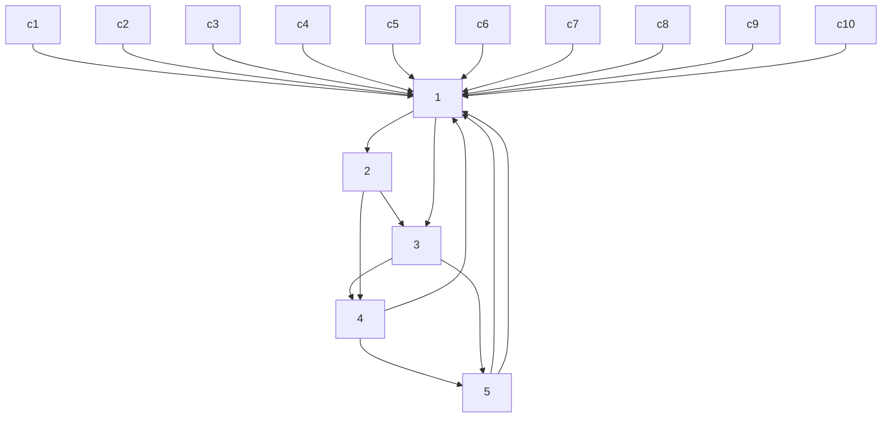
</details>

รูปที่ 4.2 กราฟแทนเนอร์สำหรับรหัสแอลดีพีชีปรกติแบบ (2, 4) ที่มีเมทริกซ์ H ตามสมการ (4.19)

# 4.2.2 รหัสแอลดีพีซีไม่สม่ำเสมอ

รหัสแอลดีพีซีไม่สม่ำเสมอได้ถูกพัฒนาขึ้นมาในปี ค.ศ. 2001 โดย Richardson [46] โดยที่เมทริกซ์ พาริตีเช็ก H ขนาด M×N จะมีการกระจายตัวของเลขหนึ่งเป็นแบบไม่คงที่ นั่นคือจำนวนเลขหนึ่ง ในแต่ละแนวนอนและแต่ละแนวตั้งไม่จำเป็นต้องมีค่าเท่ากัน

ในทางปฏิบัติรหัสแอลดีพีชีไม่สม่ำเสมอจะถูกกำหนดด้วยพหุนามการแจกแจงระดับขั้น (degree distribนtion polynomial) ซึ่งบอกให้ทราบถึงจำนวนของเส้นเชื่อมของแต่ละโหนด พหุนาม การแจกแจงระดับขั้นของโหนดบิตมีค่าเท่ากับ $\rho ( x ) = \sum _ { i } \rho _ { i } x ^ { i }$ เมื่อ $\rho _ { i }$ คือจำนวนของโหนดบิต ที่มีระดับขั้นเท่ากับ i ในทำนองเดียวกันพหุนามการแจกแจงระดับขั้นของโหนดเช็กจะมีค่าเท่ากับ $\xi ( x ) = \sum _ { i } \xi _ { i } x ^ { i }$ เมื่อ $\xi _ { i }$ คือจำนวนของโหนดเช็กที่มีระดับขั้นเท่ากับ i

นอกจากนีสมรรถนะของรหัสแอลดีพีซีทีเป็นฟังก์ชันของการแจกแจงระดับขันของโหนด เช็กและของโหนดบิตสามารถถูกทำนายได้โดยใช้ทฤษฎีวิวัฒนาการของความหนาแน่น (density evolนtiอก) [48] ซึ่งจะติดตามความหนาแน่นของความน่าจะเป็นของข่าวสารที่ส่งผ่านระหว่างโหนด เช็กและโหนดบิด โดยทั่วไปถ้าระบบทำงานที่ระดับ รNR สูงเพียงพอ จะพบว่าค่าเฉลี่ยของความ หนาแน่นมีค่าเข้าใกล้ค่าอนันต์ เมื่อจำนวนรอบของการถอดรหัสภายในวงจรถอดรหัสแอลดีพีซี เพิ่มขึ้น ซึ่งหมายความว่าวงจรถอดรหัสมีความมั่นใจสูงที่จะถอดรหัสข้อมูลได้อย่างถูกต้อง ในทาง ตรงกันข้ามถ้าระบบทำงานที่ระดับ รNR ต่ำๆ ค่าเฉลี่ยของความหนาแน่นจะลู่เข้าสู่ค่าคงตัวใดๆ ซึ่งหมายความว่าวงจรถอดรหัสแอลดีพีซีมีข้อบกพร่องในการถอดรหัสข้อมล ดังนันค่า รNR ทีเป็น เส้นแบ่งขอบเขตของสมรรถนะของรหัสแอลดีพีซี(ระหว่างดีกับไม่ดี) จะเรียกว่าขีดเริ่มเปลี่ยน (threshold)"สำหรับสมรรถนะของรหัส ดังนั้นรหัสแอลดีพีซีไม่สม่ำเสมอถูกออกแบบมาเพื่อให้ ค่าขีดเริ่มเปลี่ยนนี้เข้าใกล้ขีดจำกัดความจุของแชนนอน (Shannon capacity) [25] ให้มากที่สุด (มากกว่ารหัสแอลดีพีซีปรกติ) [49]


<details>
<summary>flowchart</summary>

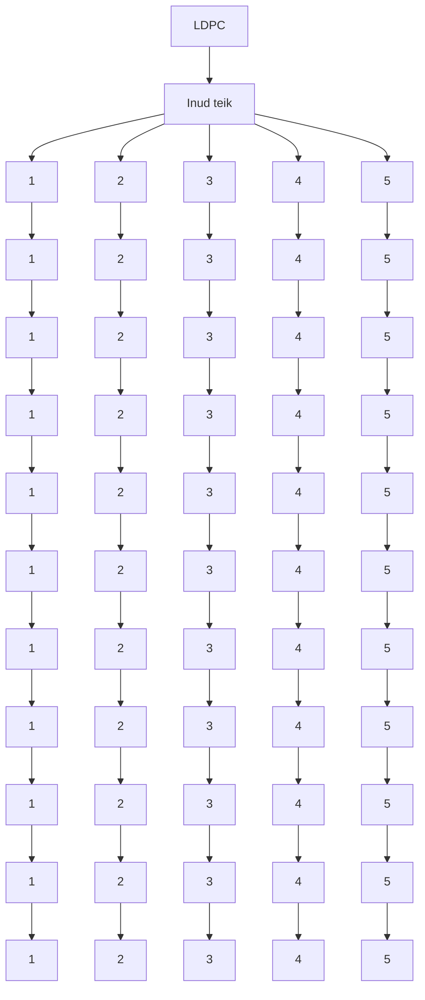
</details>


<details>
<summary>flowchart</summary>


</details>

รูปที่ 4.3 กราฟแทนเนอร์สำหรับรหัสแฮมมิงแบบ (7, 4) ในตัวอย่างที่ 4.2   
4.2.3 XX# Et

ตัวอย่างที่ 4.2 พิจารณารหัสแฮมมิงแบบ (7, 4) ที่มีเมทริกซ์ตัวกำเนิดเท่ากับ

$$
\mathbf {G} = \left[ \begin{array}{c c c c c c c} 1 & 0 & 0 & 0 & 1 & 0 & 1 \\ 0 & 1 & 0 & 0 & 1 & 1 & 1 \\ 0 & 0 & 1 & 0 & 1 & 1 & 0 \\ 0 & 0 & 0 & 1 & 0 & 1 & 1 \end{array} \right] \tag {4.25}
$$

จงหาเมทริกซ์พาริตีเซ็ก H และวาดกราฟแทนเนอร์ของเมทริกซ์ H ที่ได้

วิธีทำ เนื่องจากเมทริกซ์ G มีโครงสร้างตามสมการ (4.2) ดังนั้นจึงสามารถหาเมทริกซ์ H ได้ จากสมการ (4.7) ดังนี้

$$
\mathbf {H} = \left[ \begin{array}{c c c c c c c} 1 & 1 & 1 & 0 & 1 & 0 & 0 \\ 0 & 1 & 1 & 1 & 0 & 1 & 0 \\ 1 & 1 & 0 & 1 & 0 & 0 & 1 \end{array} \right] \tag {4.26}
$$

และมีกราฟแทนเนอร์ตามรูปที่ 4.3 จากเมทริกซ์ H ในสมการ (4.26) จะพบว่ารหัสแฮมมิงแบบ (7, 4) สามารถนำมาใช้เป็นรหัสแอลดีพีซีไม่สมำเสมอได้

# 4.2.3 กฎของไฮเพอร์โบลิกแทนเจนต์

ถ้าให้ $\mathbf { c } = [ c _ { 1 } , \ c _ { 2 } , \ . . . , \ c _ { n } ]$ คือเวกเตอร์ของบิตข้อมูลจำนวน ท บิต เมื่อ $c _ { i } \in \{ 0 , 1 \}$ และนิยาม ฟังก์ชันพาริตี (parity function) $\Phi ( \mathbf { c } ) \in \{ 0 , 1 \}$ ดังนี้

$$
\Phi (\mathbf {c}) = c _ {1} \oplus c _ {2} \oplus \dots \oplus c _ {n} \tag {4.27}
$$

โดยที่  คือตัวดำเนินการบวกแบบมอดุโลสอง, Φ(c) = 0 หรือพาริตีคู่ (even parity) เมื่อเวกเตอร์ c มีผลรวมของเลขหนึ่งเป็นจำนวนคู่ และ A(c) =1 หรือพาริตีดี่ (odd parity) เมื่อเวกเตอร์ c มีผลรวมของเลขหนึ่งเป็นจำนวนดี่ นอกจากนี้จะนิยามค่า LLR แบบอะพิรืออริ (a priori LLR) ของฟังก์ชันพาริตี A(c) ให้มีค่าเท่ากับ

$$
\lambda_ {\Phi (\mathbf {c})} = \log \left(\frac {\operatorname* {P r} \left[ \Phi (\mathbf {c}) = 1 \right]}{\operatorname* {P r} \left[ \Phi (\mathbf {c}) = 0 \right]}\right) \tag {4.28}
$$

ซึ่งจะได้ว่า

$$
\Phi (\mathbf {c}) = \left\{ \begin{array}{l l} 1, & \text { if } \lambda_ {\Phi (\mathbf {c})} \geq 0 \\ 0, & \text { if } \lambda_ {\Phi (\mathbf {c})} <   0 \end{array} \right. \tag {4.29}
$$

ดังนั้นถ้าสมมตว่าบิตข้อมูลทั้งหมดเป็นอิสระต่อกัน จะได้ว่าค่า $\lambda _ { \Phi ( \mathbf { c } ) }$ เป็นไปตามกฎของ ไฮเพอร์โบลิกแทนเจนต์ (tanh rule) ดังนี้ [51, 52]

$$
\tanh \left(\frac {- \lambda_ {\Phi (\mathbf {c})}}{2}\right) = \prod_ {i = 1} ^ {n} \tanh \left(\frac {- \lambda_ {i}}{2}\right) \tag {4.30}
$$

(ดูภาคผนวก ข สำหรับคำอธิบาย) เมื่อ $\lambda _ { i } = \log \left( \operatorname* { P r } \ [ c _ { i } = 1 ] / \operatorname* { P r } \ [ c _ { i } = 0 ] \right)$ จากนั้นแก้สมการ (4.30) ก็จะได้

$$
\lambda_ {\Phi (\mathfrak {c})} = - 2 \tanh ^ {- 1} \left\{\prod_ {i = 1} ^ {n} \tanh \left(\frac {- \lambda_ {i}}{2}\right) \right\} \tag {4.31}
$$

หรือจัดให้อยู่ในอีกรูปแบบหนึ่งได้คือ

$$
\lambda_ {\Phi (\mathfrak {c})} = - \prod_ {i = 1} ^ {n} \operatorname{sign} \left(- \lambda_ {i}\right) \times f \left(\sum_ {i = 1} ^ {n} f \left(\left| \lambda_ {i} \right|\right)\right) \tag {4.32}
$$

(ดูภาคผนวก ค สำหรับคำอธิบาย) โดยที่

$$
f (x) = \log \left(\frac {e ^ {x} + 1}{e ^ {x} - 1}\right) = - \log \left(\tanh \left(\frac {x}{2}\right)\right) \tag {4.33}
$$


<details>
<summary>flowchart</summary>


</details>


<details>
<summary>line</summary>

| x | f(x) |
|---|------|
| 0 | 3.0  |
| 1 | 1.0  |
| 2 | 0.5  |
| 3 | 0.2  |
</details>

รูปที่ 4.4 ฟังก์ชัน f(x) ในสมการ (4.33)

ในทางปฏิบัติสมการ (4.32) นิยมนำมาใช้สร้างเป็นฮาร์ดแวร์มากกว่าสมการ (4.30) หรือ (4.31) เพราะใช้เพียงผลรวม (ธsummation) แทนที่จะใช้ผลคูณ (product) ของข้อมูลจำนวน ท พจน์ อย่างไรก็ตามสมการ (4.30) นิยมใช้ในการวิเคราะห์สมรรถนะของวงจรถอดรหัสแอลดีพีซี นอกจากนี้ ฟังก์ชัน $f ( x )$ ในสมการ (4.33) มีคุณสมบัติที่น่าสนใจคือ $f ( x )$ เป็นฟังก์ชันบวกและมีค่าลดลง อย่างสม่ำเสมอสำหรับ $x > 0$ โดยที่ $f \left( 0 \right) = \infty$ และ $f ( \infty ) = 0$ ดังแสดงในรูปที่ 4.4 นอกจากนี้ $f ( x )$ ยังมีตัวผกผัน (inverse) ด้วย นั้นคือ $f ( f ( x ) ) = x$ สำหรับทุกค่า $x > 0$

กำหนดให้ $\hat { \mathbf { c } } = \left[ \hat { c } _ { 1 } , \hdots , \hat { c } _ { n } \right]$ คือค่าประมาณของ c ที่เป็นไปได้มากสุด โดยที่ $\hat { c } _ { i } = 1$ เมื่อ $\lambda _ { i } \geq 0$ และ $\hat { c } _ { i } = 0$ เมื่อ $\lambda _ { i } < 0$ ดังนั้นเรื่องหมายของ $\lambda _ { \Phi ( \mathbf { c } ) }$ ซึ่งเป็นตัวระบุค่าที่เป็นไปได้มากสุด ของฟังก์ชันพาริตี Φ(c) จะถูกกำหนดด้วย Φ(๕) ตามความสัมพันธ์ดังนี้ $\Phi ( \mathbf { c } )$ $\Phi ( { \hat { \mathbf { c } } } )$

$$
\operatorname{sign} \left(\lambda_ {\Phi (\mathfrak {c})}\right) = - \prod_ {i = 1} ^ {n} \operatorname{sign} \left(- \lambda_ {i}\right) = - (- 1) ^ {\Phi (\hat {\mathfrak {c}})} = (- 1) ^ {\Phi (\hat {\mathfrak {c}}) + 1} \tag {4.34}
$$

ซึ่งบอกให้ทราบว่า $\Phi ( \mathbf { c } )$ จะเป็นพาริตีคู่ ก็ต่อเมื่อจำนวนของ $\lambda _ { i } \geq 0$ เป็นเลขคู่16 และ $\Phi ( \mathbf { c } )$ จะเป็น พาริติดี ก็ต่อเมื่อจำนวนของ $\lambda _ { i } \geq 0$ เป็นเลขี่ นอกจากนี้ขนาดของ $\lambda _ { \Phi ( \mathbf { c } ) }$ จะเป็นตัววัดความน่าเชื่อถือ ของค่าพาริตี $\Phi ( \mathbf { c } )$ ที่คำนวณได้ ซึ่งหาได้จาก

$$
\left| \lambda_ {\Phi (\mathfrak {c})} \right| = f \left(\sum_ {i} f \left(\left| \lambda_ {i} \right|\right)\right) \tag {4.35}
$$

ถ้าสมมุติว่าบิตข้อมูลตัวที่ k ของ $\textbf { c } ( \widetilde { \boldsymbol { \mathscr { n } } } \widetilde { \boldsymbol { \mathfrak { I } } } \widetilde { \boldsymbol { \mathfrak { p } } } \ \boldsymbol { c } _ { k } )$ มีความน่าจะเป็นที่จะเป็น 1 และ 0 เท่ากัน จะได้ว่า $\lambda _ { k } = 0$ ดังนั้นพจน์ที่ k ในผลรวม $\sum _ { i } f \left( \left| \lambda _ { i } \right| \right)$ ก็จะมีค่าเป็นค่าอนันต์ ซึ่งส่งผลให้ผลรวมทั้งหมด ในสมการ (4.35) มีค่าเป็นค่าอนันต์ด้วย

เนื่องจาก f (∞) = 0 ดังนั้นค่า λxq(e) $f ( \infty ) = 0$ $\lambda _ { \Phi ( \mathbf { c } ) }$ ในสมการ (4.32) จะมีค่าเท่ากับศูนย์เสมอ ถ้ามีบิต ข้อมูลใดมีค่า $\lambda _ { i } = 0$ ทั้งนี้เป็นเพราะว่าถ้ามีบิตข้อมูลเพียงหนึ่งบิดที่มีความน่าจะเป็นที่จะเป็น 1 และ 0 เท่ากัน ก็จะทำให้ค่าพาริตีของเวกเตอร์ข้อมูล C มีความน่าจะเป็นที่จะเป็น 1 และ 0 เท่ากัน ด้วย (โดยไม่ต้องคำนึ่งถึงบิตอื่นๆ) ดังนั้นถ้ามีบิตข้อมูลใดมีความน่าเชื่อถือน้อยสุดเมื่อเทียบกับบิต ข้อมูลอื่นๆ ผลรวมในสมการ (4.35) จะขึ้นอยู่กับค่า $f \left( \left| \lambda _ { \operatorname* { m i n } } \right| \right)$ เมื่อ $\left| { \lambda _ { \operatorname* { m i n } } } \right| = \operatorname* { m i n } _ { i } \left\{ \left| \lambda _ { i } \right| \right\}$ ซึ่งทำให้ สมการ (4.35) ลดรูปได้เป็น

$$
\left| \lambda_ {\Phi (\mathfrak {c})} \right| = f \left(\sum_ {i} f \left(\left| \lambda_ {i} \right|\right)\right) \approx f \left(f \left(\left| \lambda_ {\min} \right|\right)\right) = \left| \lambda_ {\min} \right| \tag {4.36}
$$

แทนค่าสมการ (4.36) ลงในสมการ (4.32) จะได้

$$
\lambda_ {\Phi (\mathfrak {c})} = (- 1) ^ {\Phi (\hat {\mathfrak {c}}) + 1} \left| \lambda_ {\min} \right| \tag {4.37}
$$

โดยสรุปแล้วในการหาค่า λp(c) $\lambda _ { \Phi ( \mathbf { c } ) }$ สามารถใช้ได้ทั้งสมการ (4.31) หรือ (4.32) อย่างไรก็ตามถ้าต้องการ ลดความซับซ้อนของอัลกอริทึมการถอดรหัสข้อมูล ก็สามารถใช้สมการ (4.37) แทนได้

# 4.3 การเข้ารหัสแอลดีพีซี

พิจารณารหัสแบบมีระบบ [2] ซึ่งจะเข้ารหัสข้อมูล $\mathbf { m } = [ m _ { 1 } , \ m _ { 2 } , \ . . . , \ m _ { K } ]$ จำนวน K บิต แล้วได้ คำรหัส $\mathbf { c } = [ c _ { 1 } , \ c _ { 2 } , \ . . . , \ c _ { N } ]$ จำนวน N บิต โดยมีโครงสร้างตามสมการ (4.3) นั่นคือ

$$
\mathbf {c} = \left[ \mathbf {m} \mid \mathbf {p} \right] = \left[ m _ {1} m _ {2} \dots m _ {K} p _ {1} p _ {2} \dots p _ {N - K} \right] \tag {4.38}
$$

โดยที่ $\mathbf { p } = [ p _ { 1 } , p _ { 2 } , . . . , p _ { N - K } ]$ คือบิตพาริตีจำนวน $N - K$ บิต ดังนั้นเมื่อใช้รหัสแบบมีระบบ สิ่งที่ ต้องทำในการเข้ารหัสข้อมูลก็คือการหาค่าบิตพาริตี p และเมื่อได้ค่า p แล้ว ก็นำมาต่อเข้ากับข้อมูล m ตามสมการ (4.38) ก็จะได้คำรหัส c ตามที่ต้องการ

โดยทั่วไปรหัสแอลดีพีซีจะถูกกำหนดด้วยเมทริกซ์พาริตีเช็ก H ขนาด M×N ดังนั้นใน หัวข้อนี้จะแสดงการหาบิตพาริตี p จากเมทริกซ์ H ดังนี้ หลังจากที่ได้เมทริกซ์ H ที่ต้องการแล้ว ก็จะอาศัยความสัมพันธ์ตามสมการ (4.6) ในการหาค่า p นั้นคือ

$$
\mathbf {H} \mathbf {c} ^ {\mathrm{T}} = \mathbf {0} _ {M \times 1} \tag {4.39}
$$

เมื่อ ${ \bf 0 } _ { M \times 1 }$ คือเวกเตอร์ค่าศูนย์ขนาด M×1 ถ้าจัดเมทริกซ์ H ให้อยู่ในรูป

$$
\mathbf {H} = \left[ \mathbf {H} _ {1} \mid \mathbf {H} _ {2} \right] \tag {4.40}
$$

เมื่อ $\mathbf { H } _ { 1 }$ มีขนาด M×K และ $\mathbf { H } _ { 2 }$ มีขนาด $M { \times } ( N - K )$ ดังนั้นแทนค่าสมการ (4.38) และ (4.40) ลงในสมการ (4.39) จะได้

$$
\left[ \begin{array}{l l} \mathbf {H} _ {1} & \mathbf {H} _ {2} \end{array} \right] \left[ \begin{array}{l} \mathbf {m} ^ {\mathrm{T}} \\ \mathbf {p} ^ {\mathrm{T}} \end{array} \right] = \mathbf {0}
$$

$$
\mathbf {H} _ {1} \mathbf {m} ^ {\mathrm{T}} + \mathbf {H} _ {2} \mathbf {p} ^ {\mathrm{T}} = \mathbf {0}
$$

$$
\mathbf {p} ^ {\mathrm{T}} = \left(\mathbf {H} _ {2}\right) ^ {- 1} \mathbf {H} _ {1} \mathbf {m} ^ {\mathrm{T}} \quad (\text    ๘๐๑๑๑๑๑๑๑๑๑๑๑๑๑๑๑๑๑๑๑๑๑๑๑๑๑๑๑๑๑๑๑๑๑๑๑๑๑๑๑๑๑๑๑๑๑๑๑๑๑๑๐๑๑๑๑๑๑๑๑๑๑๑๑๑๑๑๑๑๑๑๑๑๑๑๑๑๑๑๑๑๑๑๑๑๑๑๑๑๑๑๑๑๑๑๑๑๑๑๑๐๐๑๑๑๑๑๑๑๑๑๑๑๑๑๑๑๑๑๑๑๑๑๑๑๑๑๑๑๑๑๑๑๑๑๑๑๑๑๑๑๑๑๑๑๑๑๑๑๑๓๑๑๑๑๑๑๑๑๑๑๑๑๑๑๑๑๑๑๑๑๑๑๑๑๑๑๑๑๑๑๑๑๑๑๑๑๑๑๑๑๑๑๑๑๑๑๑๑๑๓๐๑๑๑๑๑๑๑๑๑๑๑๑๑๑๑๑๑๑๑๑๑๑๑๑๑๑๑๑๑๑๑๑๑๑๑๑๑๑๑๑๑๑๑๑๑๑๑๑๒๑๑๑๑๑๑๑๑๑๑๑๑๑๑๑๑๑๑๑๑๑๑๑๑๑๑๑๑๑๑๑๑๑๑๑๑๑๑๑๑๑๑๑๑๑๑๑๑๑๒๒๑๑๑๑๑๑๑๑๑๑๑๑๑๑๑๑๑๑๑๑๑๑๑๑๑๑๑๑๑๑๑๑๑๑๑๑๑๑๑๑๑๑๑๑๑๑๑๑๒๓๑๑๑๑๑๑๑๑๑๑๑๑๑๑๑๑๑๑๑๑๑๑๑๑๑๑๑๑๑๑๑๑๑๑๑๑๑๑๑๑๑๑๑๑๑๑๑๑๐๓๑๑๑๑๑๑๑๑๑๑๑๑๑๑๑๑๑๑๑๑๑๑๑๑๑๑๑๑๑๑๑๑๑๑๑๑๑๑๑๑๑๑๑๑๑๑๑๑๓๓๑๑๑๑๑๑๑๑๑๑๑๑๑๑๑๑๑๑๑๑๑๑๑๑๑๑๑๑๑๑๑๑๑๑๑๑๑๑๑๑๑๑๑๑๑๑๑๑๒๔๑๑๑๑๑๑๑๑๑๑๑๑๑๑๑๑๑๑๑๑๑๑๑๑๑๑๑๑๑๑๑๑๑๑๑๑๑๑๑๑๑๑๑๑๑๑๑๑๑๏๑๑๑๑๑๑๑๑๑๑๑๑๑๑๑๑๑๑๑๑๑๑๑๑๑๑๑๑๑๑๑๑๑๑๑๑๑๑๑๑๑๑๑๑๑๑๑๑๑๔๑๑๑๑๑๑๑๑๑๑๑๑๑๑๑๑๑๑๑๑๑๑๑๑๑๑๑๑๑๑๑๑๑๑๑๑๑๑๑๑๑๑๑๑๑๑๑๑๐๒๑๑๑๑๑๑๑๑๑๑๑๑๑๑๑๑๑๑๑๑๑๑๑๑๑๑๑๑๑๑๑๑๑๑๑๑๑๑๑๑๑๑๑๑๑๑๑๑๐๔๑๑๑๑๑๑๑๑๑๑๑๑๑๑๑๑๑๑๑๑๑๑๑๑๑๑๑๑๑๑๑๑๑๑๑๑๑๑๑๑๑๑๑๑๑๑๑๑๒๏๑๑๑๑๑๑๑๑๑๑๑๑๑๑๑๑๑๑๑๑๑๑๑๑๑๑๑๑๑๑๑๑๑๑๑๑๑๑๑๑๑๑๑๑๑๑๑๑๒๐๑๑๑๑๑๑๑๑๑๑๑๑๑๑๑๑๑๑๑๑๑๑๑๑๑๑๑๑๑๑๑๑๑๑๑๑๑๑๑๑๑๑๑๑๑๑๑๑๏๓๑๑๑๑๑๑๑๑๑๑๑๑๑๑๑๑๑๑๑๑๑๑๑๑๑๑๑๑๑๑๑๑๑๑๑๑๑๑๑๑๑๑๑๑๑๑๑๑๏๐๑๑๑๑๑๑๑๑๑๑๑๑๑๑๑๑๑๑๑๑๑๑๑๑๑๑๑๑๑๑๑๑๑๑๑๑๑๑๑๑๑๑๑๑๑๑๑๑๔๐๑๑๑๑๑๑๑๑๑๑๑๑๑๑๑๑๑๑๑๑๑๑๑๑๑๑๑๑๑๑๑๑๑๑๑๑๑๑๑๑๑๑๑๑๑๑๑๑๙๑๑๑๑๑๑๑๑๑๑๑๑๑๑๑๑๑๑๑๑๑๑๑๑๑๑๑๑๑๑๑๑๑๑๑๑๑๑๑๑๑๑๑๑๑๑๑๑๑๙๒๑๑๑๑๑๑๑๑๑๑๑๑๑๑๑๑๑๑๑๑๑๑๑๑๑๑๑๑๑๑๑๑๑๑๑๑๑๑๑๑๑๑๑๑๑๑๑๑๓๒๑๑๑๑๑๑๑๑๑๑๑๑๑๑๑๑๑๑๑๑๑๑๑๑๑๑๑๑๑๑๑๑๑๑๑๑๑๑๑๑๑๑๑๑๑๑๑๑๏๒๑๑๑๑๑๑๑๑๑๑๑๑๑๑๑๑๑๑๑๑๑๑๑๑๑๑๑๑๑๑๑๑๑๑๑๑๑๑๑๑๑๑๑๑๑๑๑๑๔๒๑๑๑๑๑๑๑๑๑๑๑๑๑๑๑๑๑๑๑๑๑๑๑๑๑๑๑๑๑๑๑๑๑๑๑๑๑๑๑๑๑๑๑๑๑๑๑๑๙๓๑๑๑๑๑๑๑๑๑๑๑๑๑๑๑๑๑๑๑๑๑๑๑๑๑๑๑๑๑๑๑๑๑๑๑๑๑๑๑๑๑๑๑๑๑๑๑๑๔๓๑๑๑๑๑๑๑๑๑๑๑๑๑๑๑๑๑๑๑๑๑๑๑๑๑๑๑๑๑๑๑๑๑๑๑๑๑๑๑๑๑๑๑๑๑๑๑๑๙๔๑๑๑๑๑๑๑๑๑๑๑๑๑๑๑๑๑๑๑๑๑๑๑๑๑๑๑๑๑๑๑๑๑๑๑๑๑๑๑๑๑๑๑๑๑๑๑๑๓๔๑๑๑๑๑๑๑๑๑๑๑๑๑๑๑๑๑๑๑๑๑๑๑๑๑๑๑๑๑๑๑๑๑๑๑๑๑๑๑๑๑๑๑๑๑๑๑๑๔๔๑๑๑๑๑๑๑๑๑๑๑๑๑๑๑๑๑๑๑๑๑๑๑๑๑๑๑๑๑๑๑๑๑๑๑๑๑๑๑๑๑๑๑๑๑๑๑๑๏๔๑๑๑๑๑๑๑๑๑๑๑๑๑๑๑๑๑๑๑๑๑๑๑๑๑๑๑๑๑๑๑๑๑๑๑๑๑๑๑๑๑๑๑๑๑๑๑๑๙๐๑๑๑๑๑๑๑๑๑๑๑๑๑๑๑๑๑๑๑๑๑๑๑๑๑๑๑๑๑๑๑๑๑๑๑๑๑๑๑๑๑๑๑๑๑๑๑๑๘๑๑๑๑๑๑๑๑๑๑๑๑๑๑๑๑๑๑๑๑๑๑๑๑๑๑๑๑๑๑๑๑๑๑๑๑๑๑๑๑๑๑๑๑๑๑๑๑๑๘๒๑๑๑๑๑๑๑๑๑๑๑๑๑๑๑๑๑๑๑๑๑๑๑๑๑๑๑๑๑๑๑๑๑๑๑๑๑๑๑๑๑๑๑๑๑๑๑๑๘๓๑๑๑๑๑๑๑๑๑๑๑๑๑๑๑๑๑๑๑๑๑๑๑๑๑๑๑๑๑๑๑๑๑๑๑๑๑๑๑๑๑๑๑๑๑๑๑๑๘๔๑๑๑๑๑๑๑๑๑๑๑๑๑๑๑๑๑๑๑๑๑๑๑๑๑๑๑๑๑๑๑๑๑๑๑๑๑๑๑๑๑๑๑๑๑๑๑๑๘๕๑๑๑๑๑๑๑๑๑๑๑๑๑๑๑๑๑๑๑๑๑๑๑๑๑๑๑๑๑๑๑๑๑๑๑๑๑๑๑๑๑๑๑๑๑๑๑๑๑๗๑๑๑๑๑๑๑๑๑๑๑๑๑๑๑๑๑๑๑๑๑๑๑๑๑๑๑๑๑๑๑๑๑๑๑๑๑๑๑๑๑๑๑๑๑๑๑๑๑๖๑๑๑๑๑๑๑๑๑๑๑๑๑๑๑๑๑๑๑๑๑๑๑๑๑๑๑๑๑๑๑๑๑๑๑๑๑๑๑๑๑๑๑๑๑๑๑๑๑๕๑๑๑๑๑๑๑๑๑๑๑๑๑๑๑๑๑๑๑๑๑๑๑๑๑๑๑๑๑๑๑๑๑๑๑๑๑๑๑๑๑๑๑๑๑๑๑๑๒๕๑๑๑๑๑๑๑๑๑๑๑๑๑๑๑๑๑๑๑๑๑๑๑๑๑๑๑๑๑๑๑๑๑๑๑๑๑๑๑๑๑๑๑๑๑๑๑๑๓๕๑๑๑๑๑๑๑๑๑๑๑๑๑๑๑๑๑๑๑๑๑๑๑๑๑๑๑๑๑๑๑๑๑๑๑๑๑๑๑๑๑๑๑๑๑๑๑๑๐๙๑๑๑๑๑๑๑๑๑๑๑๑๑๑๑๑๑๑๑๑๑๑๑๑๑๑๑๑๑๑๑๑๑๑๑๑๑๑๑๑๑๑๑๑๑๑๑๑๒๖๑๑๑๑๑๑๑๑๑๑๑๑๑๑๑๑๑๑๑๑๑๑๑๑๑๑๑๑๑๑๑๑๑๑๑๑๑๑๑๑๑๑๑๑๑๑๑๑๒๚๑๑๑๑๑๑๑๑๑๑๑๑๑๑๑๑๑๑๑๑๑๑๑๑๑๑๑๑๑๑๑๑๑๑๑๑๑๑๑๑๑๑๑๑๑๑๑๑๑๚๑๑๑๑๑๑๑๑๑๑๑๑๑๑๑๑๑๑๑๑๑๑๑๑๑๑๑๑๑๑๑๑๑๑๑๑๑๑๑๑๑๑๑๑๑๑๑๑๒๘๑๑๑๑๑๑๑๑๑๑๑๑๑๑๑๑๑๑๑๑๑๑๑๑๑๑๑๑๑๑๑๑๑๑๑๑๑๑๑๑๑๑๑๑๑๑๑๑๒๙๑๑๑๑๑๑๑๑๑๑๑๑๑๑๑๑๑๑๑๑๑๑๑๑๑๑๑๑๑๑๑๑๑๑๑๑๑๑๑๑๑๑๑๑๑๑๑๑๐๏๑๑๑๑๑๑๑๑๑๑๑๑๑๑๑๑๑๑๑๑๑๑๑๑๑๑๑๑๑๑๑๑๑๑๑๑๑๑๑๑๑๑๑๑๑๑๑๑๐๘๑๑๑๑๑๑๑๑๑๑๑๑๑๑๑๑๑๑๑๑๑๑๑๑๑๑๑๑๑๑๑๑๑๑๑๑๑๑๑๑๑๑๑๑๑๑๑๑๐๚๑๑๑๑๑๑๑๑๑๑๑๑๑๑๑๑๑๑๑๑๑๑๑๑๑๑๑๑๑๑๑๑๑๑๑๑๑๑๑๑๑๑๑๑๑๑๑๑๐๜๑๑๑๑๑๑๑๑๑๑๑๑๑๑๑๑๑๑๑๑๑๑๑๑๑๑๑๑๑๑๑๑๑๑๑๑๑๑๑๑๑๑๑๑๑๑๑๑๑๜๑๑๑๑๑๑๑๑๑๑๑๑๑๑๑๑๑๑๑๑๑๑๑๑๑๑๑๑๑๑๑๑๑๑๑๑๑๑๑๑๑๑๑๑๑๑๑๑๒๗๑๑๑๑๑๑๑๑๑๑๑๑๑๑๑๑๑๑๑๑๑๑๑๑๑๑๑๑๑๑๑๑๑๑๑๑๑๑๑๑๑๑๑๑๑๑๑๑๒๜๑๑๑๑๑๑๑๑๑๑๑๑๑๑๑๑๑๑๑๑๑๑๑๑๑๑๑๑๑๑๑๑๑๑๑๑๑๑๑๑๑๑๑๑๑๑๑๑๐๖๑๑๑๑๑๑๑๑๑๑๑๑๑๑๑๑๑๑๑๑๑๑๑๑๑๑๑๑๑๑๑๑๑๑๑๑๑๑๑๑๑๑๑๑๑๑๑๑๐๕๑๑๑๑๑๑๑๑๑๑๑๑๑๑๑๑๑๑๑๑๑๑๑๑๑๑๑๑๑๑๑๑๑๑๑๑๑๑๑๑๑๑๑๑๑๑๑๑๔๏๑๑๑๑๑๑๑๑๑๑๑๑๑๑๑๑๑๑๑๑๑๑๑๑๑๑๑๑๑๑๑๑๑๑๑๑๑๑๑๑๑๑๑๑๑๑๑๑๓๏๑๑๑๑๑๑๑๑๑๑๑๑๑๑๑๑๑๑๑๑๑๑๑๑๑๑๑๑๑๑๑๑๑๑๑๑๑๑๑๑๑๑๑๑๑๑๑๑๔๘๑๑๑๑๑๑๑๑๑๑๑๑๑๑๑๑๑๑๑๑๑๑๑๑๑๑๑๑๑๑๑๑๑๑๑๑๑๑๑๑๑๑๑๑๑๑๑๑๓๘๑๑๑๑๑๑๑๑๑๑๑๑๑๑๑๑๑๑๑๑๑๑๑๑๑๑๑๑๑๑๑๑๑๑๑๑๑๑๑๑๑๑๑๑๑๑๑๑๔๕๑๑๑๑๑๑๑๑๑๑๑๑๑๑๑๑๑๑๑๑๑๑๑๑๑๑๑๑๑๑๑๑๑๑๑๑๑๑๑๑๑๑๑๑๑๑๑๑๏๘๑๑๑๑๑๑๑๑๑๑๑๑๑๑๑๑๑๑๑๑๑๑๑๑๑๑๑๑๑๑๑๑๑๑๑๑๑๑๑๑๑๑๑๑๑๑๑๑๏๙๑๑๑๑๑๑๑๑๑๑๑๑๑๑๑๑๑๑๑๑๑๑๑๑๑๑๑๑๑๑๑๑๑๑๑๑๑๑๑๑๑๑๑๑๑๑๑๑๓๙๑๑๑๑๑๑๑๑๑๑๑๑๑๑๑๑๑๑๑๑๑๑๑๑๑๑๑๑๑๑๑๑๑๑๑๑๑๑๑๑๑๑๑๑๑๑๑๑๔๙๑๑๑๑๑๑๑๑๑๑๑๑๑๑๑๑๑๑๑๑๑๑๑๑๑๑๑๑๑๑๑๑๑๑๑๑๑๑๑๑๑๑๑๑๑๑๑๑๏๏๑๑๑๑๑๑๑๑๑๑๑๑๑๑๑๑๑๑๑๑๑๑๑๑๑๑๑๑๑๑๑๑๑๑๑๑๑๑๑๑๑๑๑๑๑๑๑๑๏๖๑๑๑๑๑๑๑๑๑๑๑๑๑๑๑๑๑๑๑๑๑๑๑๑๑๑๑๑๑๑๑๑๑๑๑๑๑๑๑๑๑๑๑๑๑๑๑๑๓๖๑๑๑๑๑๑๑๑๑๑๑๑๑๑๑๑๑๑๑๑๑๑๑๑๑๑๑๑๑๑๑๑๑๑๑๑๑๑๑๑๑๑๑๑๑๑๑๑๔๖๑๑๑๑๑๑๑๑๑๑๑๑๑๑๑๑๑๑๑๑๑๑๑๑๑๑๑๑๑๑๑๑๑๑๑๑๑๑๑๑๑๑๑๑๑๑๑๑๏๕๑๑๑๑๑๑๑๑๑๑๑๑๑๑๑๑๑๑๑๑๑๑๑๑๑๑๑๑๑๑๑๑๑๑๑๑๑๑๑๑๑๑๑๑๑๑๑๑๘๘๑๑๑๑๑๑๑๑๑๑๑๑๑๑๑๑๑๑๑๑๑๑๑๑๑๑๑๑๑๑๑๑๑๑๑๑๑๑๑๑๑๑๑๑๑๑๑๑๘๚๑๑๑๑๑๑๑๑๑๑๑๑๑๑๑๑๑๑๑๑๑๑๑๑๑๑๑๑๑๑๑๑๑๑๑๑๑๑๑๑๑๑๑๑๑๑๑๑๓๚๑๑๑๑๑๑๑๑๑๑๑๑๑๑๑๑๑๑๑๑๑๑๑๑๑๑๑๑๑๑๑๑๑๑๑๑๑๑๑๑๑๑๑๑๑๑๑๑๔๚๑๑๑๑๑๑๑๑๑๑๑๑๑๑๑๑๑๑๑๑๑๑๑๑๑๑๑๑๑๑๑๑๑๑๑๑๑๑๑๑๑๑๑๑๑๑๑๑๏๚๑๑๑๑๑๑๑๑๑๑๑๑๑๑๑๑๑๑๑๑๑๑๑๑๑๑๑๑๑๑๑๑๑๑๑๑๑๑๑๑๑๑๑๑๑๑๑๑๘๐๑๑๑๑๑๑๑๑๑๑๑๑๑๑๑๑๑๑๑๑๑๑๑๑๑๑๑๑๑๑๑๑๑๑๑๑๑๑๑๑๑๑๑๑๑๑๑๒๚๒๑๑๑๑๑๑๑๑๑๑๑๑๑๑๑๑๑๑๑๑๑๑๑๑๑๑๑๑๑๑๑๑๑๑๑๑๑๑๑๑๑๑๑๑๑๑๑๑๗๒๚๑๑๑๑๑๑๑๑๑๑๑๑๑๑๑๑๑๑๑๑๑๑๑๑๑๑๑๑๑๑๑๑๑๑๑๑๑๑๑๑๑๑๑๑๑๑๑๒๚๔๑๑๑๑๑๑๑๑๑๑๑๑๑๑๑๑๑๑๑๑๑๑๑๑๑๑๑๑๑๑๑๑๑๑๑๑๑๑๑๑๑๑๑๑๑๑๑๑๗๔๑๑๑
$$

เนื่องจาก $\mathbf { H } _ { 2 }$ เป็นเมทริกซ์จัตุรัสจึงสามารถหาค่าผกผันได้ (เนื่องจาก M = N − K)

ตัวอย่างที่ 4.3 จากตัวอย่างที่ 4.1 จงเข้ารหัสข้อมูล m = [101] และ m = [110] โดยใช้เมทริกซ์ พาริตีเช็ก H ซึ่งสอดคล้องกับเมทริกซ์ตัวกำเนิด G ในสมการ (4.4)

วิธีทำ อาศัยสมการ (4.7) ทำให้สามารถหาเมทริกซ์ H ได้จากเมทริกซ์ G ดังนี้

$$
\mathbf {H} = \left[ \begin{array}{l l} \mathbf {H} _ {1} & \mathbf {H} _ {2} \end{array} \right] = \left[ \begin{array}{c c c c c c} 1 & 0 & 1 & 1 & 0 & 0 \\ 1 & 1 & 0 & 0 & 1 & 0 \\ 0 & 1 & 1 & 0 & 0 & 1 \end{array} \right]
$$

ดังนั้นบิตพาริตีสำหรับ m = [101] หาได้จากสมการ (4.41) นั่นคือ

$$
\mathbf {p} ^ {\mathrm{T}} = \left[ \begin{array}{c c c} 1 & 0 & 0 \\ 0 & 1 & 0 \\ 0 & 0 & 1 \end{array} \right] ^ {- 1} \left[ \begin{array}{c c c} 1 & 0 & 1 \\ 1 & 1 & 0 \\ 0 & 1 & 1 \end{array} \right] \left[ \begin{array}{c} 1 \\ 0 \\ 1 \end{array} \right] = \left[ \begin{array}{c} 0 \\ 1 \\ 1 \end{array} \right]
$$

เพราะฉะนัน c = [m p] = [101011] ซึ่งก็ตรงกับผลลัพธ์ที่ได้ในต้วอย่างที 4.1 ซี 0 6ล่ป พ

ในทำนองเดียวกันบิตพาริตีสำหรับ m = [110] หาได้โดย

$$
\mathbf {p} ^ {\mathrm{T}} = \left[ \begin{array}{c c c} 1 & 0 & 0 \\ 0 & 1 & 0 \\ 0 & 0 & 1 \end{array} \right] ^ {- 1} \left[ \begin{array}{c c c} 1 & 0 & 1 \\ 1 & 1 & 0 \\ 0 & 1 & 1 \end{array} \right] \left[ \begin{array}{c} 1 \\ 1 \\ 0 \end{array} \right] = \left[ \begin{array}{c} 1 \\ 0 \\ 1 \end{array} \right]
$$

เพราะฉะน้น c = [m p] = [110101] ซึ่งก็รงกับผลลัพธ์ทีได้ในตัวอย่างที่ 4.1 เช่นกัน

ตัวอย่างที่ 4.3 แสดงให้เห็นว่าการเข้ารหัสแอลดีพีซีสำหรับรหัสแบบมีระบบสามารถทำได้ โดยการหาค่าบิตพาริตี p ตามสมการ (4.41) จากนั้นก็แทนค่าลงในสมการ (4.38) ก็จะได้คำรหัส c ตามที่ต้องการ สำหรับสมการ (4.39) จะใช้ในการตรวจสอบความถูกต้องของคำรหัสที่ได้

# 4.4 การถอดรหัสแอลดีพีซี

การเข้ารหัสแอลดีพีซีมีผลทำให้ข้อมูลแต่ละบิตมีความสัมพันธ์กันตามโครงสร้างของเมทริกซ์พาริตี 6 e เช็ก H ดังนั้นการถอดรหัสแอลดีพีชีก็จะอาศัยความสัมพันธ์เหล่านี้มาช่วยในการถอดรหัสข้อมูล โดยทั่วไปรหัสแอลดีพีซีจะถูกถอดรหัสด้วยอัลกอริทึมการผ่านข่าวสาร17 (MPA: meรsรage passing algorithm) หรือในที่นี้จะเรียกสั้นๆ ว่า "อัลกอริทึ่ม MP"[4, 17] โดยเริ่มต้นจากการสร้างสมการ e พาริตีเซ็กจากเมทริกซ์ H แล้วก็เขียนเป็นกราฟแทนเทอร์ จากนั้นก็ทำการถอดรหัสบิตข้อมูลตาม ขันตอนของอัลกอริทึม MP

# 4.4.1 พื้นจฐานในการถอดรหัสแอลดีพีซี

พิจารณาช่องสัญญาณในรูปที่ 4.5 เมื่อลำดับข้อมูลอินพุต $m _ { n } \in \{ 0 , 1 \}$ จำนวน K บิต ถูกเข้ารหัส ด้วยรหัสแอลดีพีซีปรกติแบบ (j, k) ทำให้ได้เป็นคำรหัส $c _ { n } \in \{ 0 , 1 \}$ จำนวน N บิต จากนั้นก็ส่ง เข้าไปในวงจรเข้าคู (mapper) เพื่อแปลงเป็นลำดับข้อมูล $s _ { n } \in \{ \pm 1 \}$ ดังนั้นสัญญาณที่วงจรภาครับ ได้รับคือ

$$
r _ {n} = s _ {n} + w _ {n} \tag {4.42}
$$


<details>
<summary>flowchart</summary>

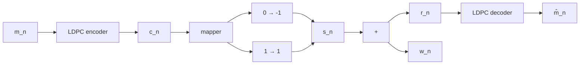
</details>

รูปที่ 4.5 ช่องสัญญาณ AGพN ที่มีการเข้าและถอดรหัสแอลดีพีซี

เมื่อ $s _ { n } = 2 c _ { n } - 1$ คือข้อมูลเอาต์พุตของช่องสัญญาณ, $w _ { n }$ คือสัญญาณรบกวนเกาสสีขาวแบบบวก (AWGN) ที่มีค่าเฉลี่ยเท่ากับศูนย์และความแปรปรวนเท่ากับ $\sigma ^ { 2 }$ หรือเขียนเป็นสัญลักษณ์ได้คือ $w _ { n } \sim \mathcal N \big ( 0 , \sigma ^ { 2 } \big )$ จากนั้นวงจรถอดรหัสแอลดีพีซีจะต้องถอดรหัสข้อมูล $r _ { n }$ เพื่อให้ได้ผลลัพธ์เป็น ค่าประมาณของข้อมูลอินพุต $m _ { n }$ (หรือ $\hat { m } _ { n } )$ ที่ทำให้มีข้อผิดพลาดน้อยสุด

ในที่นี้จะพิจารณาเฉพาะกรณีที่รหัสแอลดีพีซีที่ใช้เป็นรหัสแบบมีระบบ (systematic code) ซึ่งทำให้คำรหัสที่ได้มีโครงสร้างตามสมการ (4.3) นั่นคือค่า $m _ { i } = c _ { i }$ สำหรับ $1 \leq i \leq K$ ถ้าให้ m $\mathbf { \Omega } = [ m _ { 1 } , \ m _ { 2 } , \ . . . , \ m _ { K } ]$ คือลำดับข้อมูลอินพุต, $\mathbf { c } = [ c _ { 1 } , \ c _ { 2 } , \ . . . , \ c _ { N } ]$ คือคำรหัส, และ $\mathbf { r } = [ r _ { 1 } , ~ r _ { 2 }$ $\dots , \ r _ { N } ]$ คือเวกเตอร์ของข้อมูลที่วงจรภาครับได้รับ ดังนั้นวงจรภาครับแบบอะโพสเทอริออริสูงสุด (MAP: maximum a posteriori) จะตัดสินใจเลือกค่า $c$ ที่ทำให้ความน่าจะเป็นอะโพสเทอริออริ (APP: a posteriori probability) หรือ $\operatorname* { P r } [ c _ { n } = c \mid \mathbf { r } ]$ มีค่าสูงสุดสำหรับแต่ละเวลา ท นันคือวงจร ภาครับแบบ MAP จะคำนวณหาค่า LLR แบบอะโพสเทอริออริ $\lambda _ { n }$ จาก

$$
\lambda_ {n} = \log \left(\frac {\operatorname* {P r} \left[ c _ {n} = 1 \mid \mathbf {r} \right]}{\operatorname* {P r} \left[ c _ {n} = 0 \mid \mathbf {r} \right]}\right) = \log \left(\frac {\operatorname* {P r} \left[ c _ {n} = 1 \mid r _ {n} ; \mathbf {r} _ {i \neq n} \right]}{\operatorname* {P r} \left[ c _ {n} = 0 \mid r _ {n} ; \mathbf {r} _ {i \neq n} \right]}\right) \tag {4.43}
$$

และทำการตัดสินใจ $\hat { c } _ { n } = 1$ เมื่อ $\lambda _ { n } \geq 0$ และ $\hat { c } _ { n } = 0$ เมื่อ $\lambda _ { n } < 0$ โดยที่พารามิเตอร์ ${ \bf r } _ { i \neq n }$ คือ เวกเตอร์ของลำดับข้อมูลที่วงจรภาครับได้รับทั้งหมด ยกเว้นข้อมูลตัวที่ $i = n$

อาศัยกฎของเบส์ ตัวเศษในสมการ (4.43) สามารถจัดรูปใหม่ได้เป็น

$$
\begin{array}{l} \operatorname * {P r} \left[ c _ {n} = 1 \mid r _ {n}; \mathbf {r} _ {i \neq n} \right] = \frac {p \left(r _ {n} ; c _ {n} = 1 ; \mathbf {r} _ {i \neq n}\right)}{p \left(r _ {n} ; \mathbf {r} _ {i \neq n}\right)} \\ = \frac {p \left(r _ {n} \mid c _ {n} = 1 ; \mathbf {r} _ {i \neq n}\right) p \left(c _ {n} = 1 ; \mathbf {r} _ {i \neq n}\right)}{p \left(r _ {n} \mid \mathbf {r} _ {i \neq n}\right) p \left(\mathbf {r} _ {i \neq n}\right)} \\ = \frac {p \left(r _ {n} \mid c _ {n} = 1\right) \operatorname* {P r} \left[ c _ {n} = 1 \mid \mathbf {r} _ {i \neq n} \right]}{p \left(r _ {n} \mid \mathbf {r} _ {i \neq n}\right)} \tag {4.44} \\ \end{array}
$$

โดยที่ $p { \big ( } r _ { n } | c _ { n } = c { \big ) }$ คือฟังก์ชันความหนาแน่นความน่าจะเป็นแบบมีเงื่อนไข (conditioกลl probability density function) ของข้อมูล $r _ { n }$ เมื่อกำหนดบิตข้อมูล $c _ { n } = c \in \{ 0 , 1 \}$ มาให้ และสมการ (4.44) มาจากความจริงที่ว่าถ้ากำหนด $c _ { n }$ มาให้ ค่า $r _ { n }$ จะเป็นอิสระจาก ${ \bf r } _ { i \neq n }$ ในทำนองเดียวกัน ตัวส่วนในสมการ (4.43) ก็สามารถจัดรูปใหม่เหมือนสมการ (4.44) ได้เป็น

$$
\operatorname * {P r} \left[ c _ {n} = 0 \mid r _ {n}; \mathbf {r} _ {i \neq n} \right] = \frac {p \left(r _ {n} \mid c _ {n} = 0\right) \operatorname * {P r} \left[ c _ {n} = 0 \mid \mathbf {r} _ {i \neq n} \right]}{p \left(r _ {n} \mid \mathbf {r} _ {i \neq n}\right)} \tag {4.45}
$$

แทนค่าสมการ (4.44) และ (4.45) ลงในสมการ (4.43) จะได้

$$
\begin{array}{l} \lambda_ {n} = \log \left(\frac {p \left(r _ {n} \mid c _ {n} = 1\right) \operatorname * {P r} \left[ c _ {n} = 1 \mid \mathbf {r} _ {i \neq n} \right]}{p \left(r _ {n} \mid c _ {n} = 0\right) \operatorname * {P r} \left[ c _ {n} = 0 \mid \mathbf {r} _ {i \neq n} \right]}\right) \\ = \log \left(\frac {p \left(r _ {n} \mid c _ {n} = 1\right)}{p \left(r _ {n} \mid c _ {n} = 0\right)}\right) + \log \left(\frac {\operatorname* {P r} \left[ c _ {n} = 1 \mid \mathbf {r} _ {i \neq n} \right]}{\operatorname* {P r} \left[ c _ {n} = 0 \mid \mathbf {r} _ {i \neq n} \right]}\right) (4.46) \\ = \frac {2}{\sigma^ {2}} r _ {n} + \log \left(\frac {\operatorname* {P r} \left[ c _ {n} = 1 \mid \mathbf {r} _ {i \neq n} \right]}{\operatorname* {P r} \left[ c _ {n} = 0 \mid \mathbf {r} _ {i \neq n} \right]}\right) (4.47) \\ \end{array}
$$

เมื่อ

$$
p \left(r _ {n} \mid c _ {n}\right) = \frac {1}{\sqrt {2 \pi \sigma^ {2}}} \exp \left(\frac {- \left(r _ {n} - 2 c _ {n} + 1\right) ^ {2}}{2 \sigma^ {2}}\right) \tag {4.48}
$$

คือความน่าจะเป็นของตัวแปรสุ่มที่มีการแจกแจงแบบเกาส์เซียน สมการ (4.47) บอกให้ทราบว่า พจน์แรกทางด้านขวามือคือ "ข่าวสารอินทรินซิก (intrinรic information)"ซึ่งมาจากข้อมูลที่วงจร ภาครับได้รับตัวที่n (นันคือ $r _ { n } )$ และพจน์สองทางด้านขวามือคือ "ข่าวสารเอกซ์ทรินซิก (extrinsic information)" ของบิตข้อมูลตัวที่n (นั่นคือ $c _ { n } )$ ซึ่งได้มาจากข้อมูลทั้งหมดที่วงจรภาครับได้รับ (ยกเว้นข้อมูลตัวที่ ท) นอกจากนี้จะเห็นได้ว่าข่าวสารอินทรินซิกเป็นสัดส่วนกับข้อมูลที่วงจรภาครับ ได้รับตัวที่n หรือ $r _ { n }$ โดยค่าคงตัว $2 / \sigma ^ { 2 }$ จะเรียกว่าความน่าเชื่อถือของช่องสัญญาณ (channel reliability) [51]

ตัวอย่างที่ 4.4 พิจารณาช่องสัญญาณสมมาตรแบบไบนารี (BSC: binary symmetric channel) ในรูปที่ 4.6 จงแสดงว่าค่า LLR แบบอะโพสเทอริออริของช่องสัญญาณเป็นไปตามสมการ (4.47)


<details>
<summary>flowchart</summary>

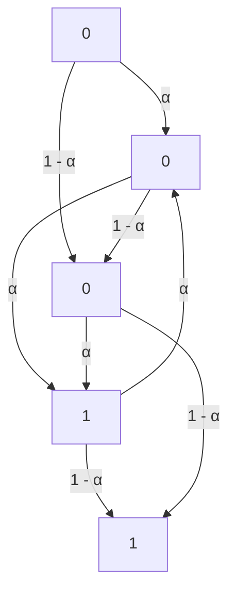
</details>

รูปที่ 4.6 ช่องสัญญาณสมมาตรแบบไบนารี (BSC)

ยกเว้นความน่าเชื่อถือของช่องสัญญาณจะมีค่าเท่ากับ 1og $\left( \left( 1 - \alpha \right) / \alpha \right)$ แทนที่จะเป็น $2 / \sigma ^ { 2 }$ เมื่อ α คือความน่าจะเป็นตัดข้าม (crossover probability)

วิธีทำ จากช่องสัญญาณในรูปที่ 4.6 จะได้ว่า $p \big ( r _ { n } = 0 \mid c _ { n } = 0 \big ) = 1 - \alpha , p \big ( r _ { n } = 0 \mid c _ { n } = 1 \big )$ $= \alpha , p \big ( r _ { n } = 1 | c _ { n } = 0 \big ) = \alpha$ , และ $p \big ( r _ { n } = 1 | c _ { n } = 1 \big ) = 1 - \alpha$ ดังนั้นจะได้ว่า

$$
\begin{array}{l} p \left(r _ {n} \mid c _ {n} = 1\right) = \sum_ {i = \{0, 1 \}} (i) p \left(r _ {n} = i \mid c _ {n} = 1\right) \\ = (0) p \left(r _ {n} = 0 \mid c _ {n} = 1\right) + (1) p \left(r _ {n} = 1 \mid c _ {n} = 1\right) = 1 - \alpha \\ \end{array}
$$

และ

$$
\begin{array}{l} p \left(r _ {n} \mid c _ {n} = 0\right) = \sum_ {i = \{0, 1 \}} (i) p \left(r _ {n} = i \mid c _ {n} = 0\right) \\ = (0) p \left(r _ {n} = 0 \mid c _ {n} = 0\right) + (1) p \left(r _ {n} = 1 \mid c _ {n} = 0\right) = \alpha \\ \end{array}
$$

เพราะฉะนั้นค่า LLR แบบอะโพสเทอริออริ $\lambda _ { n }$ ของช่องสัญญาณ BSC มีค่าตามสมการ (4.46) โดยที่ข่าวสารอินทรินซิก $\lambda _ { n } ^ { \mathrm { { i n t } } }$ มีค่าเท่ากับ

$$
\lambda_ {n} ^ {\text { int }} = \log \left(\frac {p \left(r _ {n} \mid c _ {n} = 1\right)}{p \left(r _ {n} \mid c _ {n} = 0\right)}\right) = \log \left(\frac {1 - \alpha}{\alpha}\right)
$$

สมการ (4.43) สามารถจัดให้อยู่ในรูปที่ใช้งานง่ายขึ้นได้ดังนี้ ให้พิจารณากราฟแทนเนอร์ ของรหัสแอลดีพีซีปรกติแบบ (j, k) สำหรับโหนดบิตตัวที่ n ตามรูปที่ 4.7 ซึ่งจะพบว่าโหนดบิตตัวที ท จะเชื่อมต่อกับโหนดเช็กจำนวน $j$ โหนด (หมายเลข 1 ถึง $\hat { \jmath } )$ และแต่ละโหนดเช็กก็จะเชื่อมต่อกับ โหนดบิตอื่นๆ เป็นจำนวน $k - 1$ โหนด นอกจากนี้กำหนดให้ $\mathbf { c } \left( i \right) = \left[ c _ { i , 2 } , c _ { i , 3 } , . . . , c _ { i , k } \right]$ คือเซตของ โหนดบิตทั้งหมดจำนวน $k - 1$ โหนด (ยกเว้นโหนดบิตตัวที่n) ที่ชื่อมต่อกับโหนดเช็กตัวที่i เมื่อ $i = \{ 1 , 2 , . . . , j \}$ ดังนั้นรูปที่ 4.7 บอกให้ทราบว่าค่า $c _ { n }$ จะขึ้นกับค่าพาริตีของ $\mathbf { c } ( 1 ) , \mathbf { c } ( 2 ) , \ldots , \mathbf { c } ( j )$ หรือ $\Phi _ { } ( \mathbf { c } _ { } ( i ) )$ ดังนี้


<details>
<summary>flowchart</summary>

Diagram illustrating hierarchical relationships between nodes c(n), c(1), c(2), c(j) and their connections to nodes 1, 2, j, with legend indicating '自在ดบิต' (blue) and '自在ดเช็ก' (yellow).
</details>

รูปที่ 4.7 กราฟแทนเนอร์ของรหัสแอลดีพีซีปรกติแบบ (, k) มื่อพิจารณา ณ โหนดบิตตัวที่ ท

$$
c _ {n} = \left\{ \begin{array}{l l} 1, & \text { if } \Phi (\mathbf {c} (1)) = \Phi (\mathbf {c} (2)) = \dots = \Phi (\mathbf {c} (j)) = 1 \\ 0, & \text { if } \Phi (\mathbf {c} (1)) = \Phi (\mathbf {c} (2)) = \dots = \Phi (\mathbf {c} (j)) = 0 \end{array} \right. \tag {4.49}
$$

ทั้งนี้เพื่อให้สมการพาริตีเช็กทุกสมการ (i สมการ) มีค่าเท่ากับศูนย์ตามความสัมพันธ์ ย.อี้ี $\mathbf { H } \mathbf { c } ^ { \mathrm { T } } = \mathbf { 0 }$ ในสมการ (4.6) นอกจากนี้เพื่อให้ง่ายต่อการอธิบายอัลกอริทึมการถอดรหัสแอลดีพีซีในหัวข้อต่อไป จะนำกราฟแทนเนอร์ในรูปที่ 4.7 มาจัดรูปใหม่ได้เป็นกราฟรูปที่ 4.8

# 4.4.2 วัฏจักรของรหัสแอลดีพีซี

วัฏจักร (cycle) หมายถึงเส้นทางเดินภายในกราฟที่มีจุดเริ่มต้นและจุดสิ้นสุดเป็นโหนดบิตเดียวกัน โดยความยาวของวัฎจักร (cycle length) มีค่าเท่ากับจำนวนเส้นเชื่อมทั้งหมดที่ทำให้เกิดเป็นวัฎจักร เนื่องจากกราฟแทนเนอร์เป็นกราฟสองส่วน (bipลrtite graph) จึงทำให้ความยาวน้อยสุดของวัฎจักร18 มีค่าเท่ากับ 4 ตามที่แสดงด้วยเส้นปะในรูปที่4.8 อย่างไรก็ตามถ้าไม่มีเส้นปะในกราฟ ก็จะทำให้ กราฟไม่มีวัฏจักร (cycle-free) ซึ่งกราฟที่ไม่มีวัฏจักรจะเรียกว่า "แผนภาพต้นไม้ (tree diagram)" นอกจากนี้กราฟที่ไม่มีวัฏจักรมีคุณสมบัติที่น่าสนใจดังนี้


<details>
<summary>flowchart</summary>


</details>


<details>
<summary>flowchart</summary>

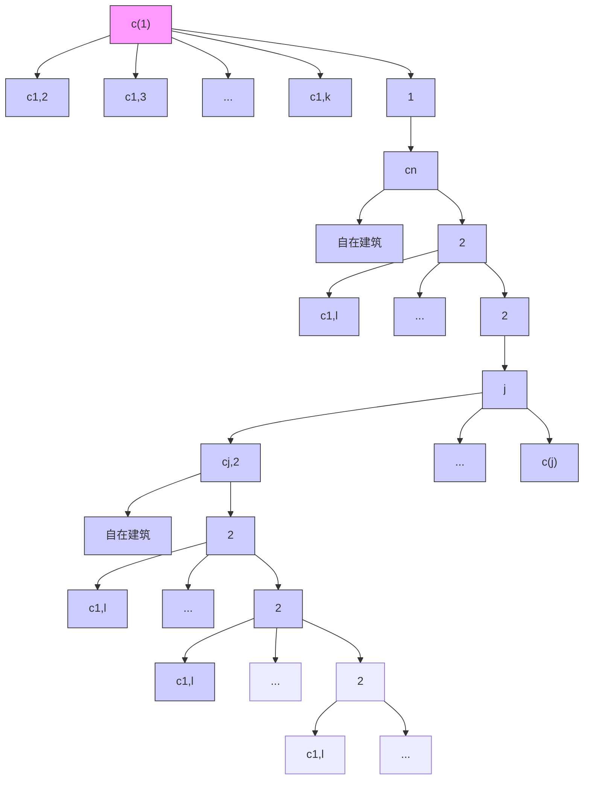
</details>

รูปที่ 4.8 กราฟของรหัสแอลดีพีชีปรกติแบบ (J, k) ที่ได้จากการนำรูปที่ 4.7 มาจัดรูปใหม่ [4]

1) การตัดทิ้งเส้นเชื่อมใดๆ จะทำให้เกิดเป็นกราฟย่อย (sนbgraph) สองกราฟที่แยกจากกัน   
2) มีเส้นทางเพียงเส้นทางเดียว (unique path) ที่เดินผ่านโหนดบิตหนึ่งไปยังอีกโหนดบิตหนึ่ง   
3) ทุกโหนดบิตที่เชื่อมต่อถึงโหนดบิต $c _ { n }$ จะต้องผ่านเส้นเชื่อมที่ต่อกับโหนดบิต $c _ { n }$ เพียงเส้นเชื่อม ญ เดียวเท่านัน   
4) ถ้าให้โหนดบิต $c _ { j }$ และ $c _ { k }$ เชื่อมต่อกับโหนดบิต $c _ { n }$ ผ่านทางเส้นเชื่อมที่แตกต่างกัน ดังนั้นจะได้ ว่าโหนดบิต $c _ { j }$ และ $c _ { k }$ จะเป็นอิสระต่อกันแบบมีเงื่อนไข (conditionally independent) เมื่อ ไม่พิจารณาบิตข้อมูลตัวที่n นั้นคือ

$$
\operatorname * {P r} \left[ c _ {j}; c _ {k} \mid \mathbf {r} _ {i \neq n} \right] = \operatorname * {P r} \left[ c _ {j} \mid \mathbf {r} _ {i \neq n} \right] \times \operatorname * {P r} \left[ c _ {j} \mid \mathbf {r} _ {i \neq n} \right] \tag {4.50}
$$

นอกจากนี้วัฎจักรที่เกิดขึ้นในรหัสแอลดีพีซีสามารถพิจารณาได้จากเมทริกซ์พาริตีเช็ก H ขนาด M×N เช่นกัน กล่าวคือเมทริกซ์ H จะมีวัฎจักรที่มีความยาวเท่ากับ 4 ก็ต่อเมื่อตำแหน่งของ เลขหนึ่งในเมทริกซ์ H มีลักษณะเป็นวงปิด (close l00p) ตามความสัมพันธ์ดังนี้

$$
\left[ h _ {i, j}, h _ {i, b}, h _ {a, b}, h _ {a, j} \right] \tag {4.51}
$$

เมื่อ -ซ $h _ { { _ r , c } }$ คือตำแหน่งของเลขหนึ่งในแนวนอนที่ r และแนวตั้งที่ c ของเมทริกซ์ H, {i, a} {1, 2, ..., M}, และ {, $b \} \in \ \{ 1 , \ 2 , \ . . . , \ N \}$ หรืออาจกล่าวได้ว่าวัฏจักรที่มีความยาวเท่ากับ 4 ในเมทริกซ์ H คือวงปิดของเลขหนึ่งที่มีการใช้แนวนอนและแนวตั้งร่วมกันเท่ากับสองแนวนอน และสองแนวตั้ง ตัวอย่างเช่น พิจารณารหัสแอลดีพีซีปรกติแบบ (2, 4) ที่มีเมทริกซ์พาริตีเช็ก H เท่ากับ

$$
\mathbf {H} _ {5 \times 1 0} = \left[ \begin{array}{c c c c c c c c c c} \tilde {1} & 1 & 1 & \tilde {1} & 0 & 0 & 0 & 0 & 0 & 0 \\ 0 & 0 & 0 & 0 & \hat {1} & 1 & \hat {1} & 0 & 1 & 0 \\ 0 & 1 & 0 & 0 & \hat {1} & 0 & \hat {1} & 1 & 0 & 0 \\ 0 & 0 & 1 & 0 & 0 & 1 & 0 & 1 & 0 & 1 \\ \tilde {1} & 0 & 0 & \tilde {1} & 0 & 0 & 0 & 0 & 1 & 1 \end{array} \right] \tag {4.52}
$$

ซึ่งจะพบว่าเมทริกซ์ H มีวัฎจักรที่มีความยาวเท่ากับ 4 จำนวนสองวัฎจักรคือ วัฏจักรที่หนึ่ง ณ ตำแหน่งของ 1 ที่มีวงปิดคือ $\left[ h _ { 1 , 1 } , h _ { 1 , 4 } , h _ { 5 , 4 } , h _ { 5 , 1 } \right]$ และวัฏจักรที่สอง ณ ตำแหน่งของ 1 ที่มีวงปิด คือ $\left[ h _ { 2 , 5 } , h _ { 2 , 7 } , h _ { 3 , 7 } , h _ { 3 , 5 } \right]$ อย่างไรก็ตามเมทริกซ์ H ในสมการ (4.8) และ (4.19) ไม่มีวัฏจักร

สาเหตุทีรหัสแอลดีพีซีทีดีจะต้องไม่มีวัฎจักรทีมีความยาวเท่ากับ 4 เพราะว่าวัฏจักรทีมี ความยาวเท่ากับ 4 เป็นวัฏจักรที่เกิดขึ้นง่ายสุดในเมทริกซ์ H นอกจากนี้อัลกอริทึมการถอดรหัส แอลดีพีซีจะอาศัยหลักการของความน่าจะเป็นในการส่งผ่านข่าวสารระหว่างโหนดบิตและโหนดเช็ก โดยความน่าจะเป็นของแต่ละเหตุการณ์จะต้องเป็นอิสระต่อกัน ดังนั้นถ้ามีวัฏจักรเกิดขึ้นในเมทริกซ์ H ก็จะทำให้ความน่าจะเป็นในการส่งผ่านข่าวสารไม่เป็นอิสระต่อกัน ซึ่งส่งผลให้สมรรถนะของการ ถอดรหัสข้อมูลด้อยลงมาก (ดูผลการทดลองในรูปที่ 4.18)

# 4.4.3 การหาค่า LLR ของบิตข้อมูล

พิจารณาเมทริกซ์พาริตีเช็ก H ขนาด M×N ของรหัสแอลดีพีซีปรกติแบบ (i, k) ซึ่งทำให้ทราบว่า มีเงื่อนไขบังคับของสมการพาริตีเช็กจำนวน  สมการ จากสมการ (4.49) จะได้ว่าบิตข้อมูล $c _ { n }$ ค่าเท่ากับค่าพาริตีของเวกเตอร์ข้อมูล c(i) นั้นคือ $c _ { n } = \Phi { \bigl ( } \mathbf { c } ( i ) { \bigr ) }$ สำหรับ $i = \{ 1 , 2 , . . . , j \}$ ดังนั้น สมการ (4.43) เขียนใหม่ได้เป็น

$$
\lambda_ {n} = \frac {2}{\sigma^ {2}} r _ {n} + \log \left(\frac {\operatorname * {P r} \left[ \Phi (\mathbf {c} (i)) = 1 \text {   for   } i = 1 , 2 , \dots , j \mid \mathbf {r} _ {i \neq n} \right]}{\operatorname * {P r} \left[ \Phi (\mathbf {c} (i)) = 0 \text {   for   } i = 1 , 2 , \dots , j \mid \mathbf {r} _ {i \neq n} \right]}\right) \tag {4.53}
$$

ถ้าสมมุติว่าเมทริกซ์ H ไม่มีวัฏจักร ดังนั้นเมื่อกำหนด ${ \bf r } _ { i \neq n }$ (นั่นคือข้อมูลที่วงจรภาครับได้รับทั้งหมด ยกเว้นข้อมูลตัวที่ n) มาให้ จะได้ว่า $\mathbf { c } ( 1 ) , \mathbf { c } ( 2 ) , \ldots , \mathbf { c } ( j )$ เป็นอิสระต่อกันแบบมีเงื่อนไข และสมาชิก ภายใน c(i) ก็เป็นอิสระต่อกันแบบมีเงื่อนไขด้วยเช่นกัน ดังนั้นสมการ (4.53) ลดรูปได้เป็น

$$
\begin{array}{l} \lambda_ {n} = \frac {2}{\sigma^ {2}} r _ {n} + \log \left(\frac {\prod_ {i = 1} ^ {j} \operatorname* {P r} \left[ \Phi (\mathbf {c} (i)) = 1 \mid \mathbf {r} _ {i \neq n} \right]}{\prod_ {i = 1} ^ {j} \operatorname* {P r} \left[ \Phi (\mathbf {c} (i)) = 0 \mid \mathbf {r} _ {i \neq n} \right]}\right) \\ = \frac {2}{\sigma^ {2}} r _ {n} + \sum_ {i = 1} ^ {j} \log \left(\frac {\operatorname* {P r} \left[ \Phi (\mathbf {c} (i)) = 1 \mid \mathbf {r} _ {i \neq n} \right]}{\operatorname* {P r} \left[ \Phi (\mathbf {c} (i)) = 0 \mid \mathbf {r} _ {i \neq n} \right]}\right) \\ = \frac {2}{\sigma^ {2}} r _ {n} + \sum_ {i = 1} ^ {j} \lambda_ {\Phi (\mathbf {c} (i))} \tag {4.54} \\ \end{array}
$$

$\lambda _ { \Phi ( \mathbf { c } ( i ) ) }$ คือค่า LLR ของค่าพาริตี $\Phi \big ( \mathbf { c } ( i ) \big )$ เนื่องจากบิตข้อมูลแต่ละบิตเป็นอิสระต่อกันแบบมี เงื่อนไข จึงทำให้ค่า λx(e(i)) $\lambda _ { \Phi ( \mathbf { c } ( i ) ) }$ แต่ละค่าสอดคล้องกับกฎของไฮเพอร์โบลิกแทนเจนต์ตามสมการ (4.31) ดังนั้นถ้ากำหนดให้

$$
\lambda_ {i, l} = \log \left(\frac {\operatorname * {P r} \left[ c _ {i , l} = 1 \mid \mathbf {r} _ {i \neq n} \right]}{\operatorname * {P r} \left[ c _ {i , l} = 0 \mid \mathbf {r} _ {i \neq n} \right]}\right) \tag {4.55}
$$

โดยที่ $c _ { i , l }$ คือสมาชิกตัวที่ I ในเวกเตอร์ c(i) สำหรับ $l = \{ 2 , 3 , . . . , k \}$ จากนั้นแทนค่าสมการ (4.31) ลงในสมการ (4.54) จะได้

$$
\lambda_ {n} = \frac {2}{\sigma^ {2}} r _ {n} - 2 \sum_ {i = 1} ^ {j} \tanh ^ {- 1} \left\{\prod_ {l = 2} ^ {k} \tanh \left(\frac {- \lambda_ {i , l}}{2}\right) \right\} \tag {4.56}
$$


<details>
<summary>flowchart</summary>

```mermaid
graph TD
    A[" "] -->|a| B[" "]
    A -->|b| C[" "]
    A -->|c| D[" "]
    C -->|d| E[" "]
    style A fill:#f9f,stroke:#333
    style B fill:#ccf,stroke:#333
    style C fill:#cfc,stroke:#333
    style D fill:#fcc,stroke:#333
    note right of A "โหนดบัต"
    note right of C "a+b+c"
    note right of D "a+b+c"
```
</details>


<details>
<summary>text_image</summary>

a
b
c
d
±f(f(|a|)+f(|b|)+f(|c|))
ไหนดเช็ก
</details>

รูปที่ 4.9 การทำงานของโหนดบิตและโหนดเช็ก

หรือจัดให้อยูในอีกรูปแบบหนึ่งได้คือ (เปรียบเทียบสมการ (4.31) และ (4.32))

$$
\lambda_ {n} = \frac {2}{\sigma^ {2}} r _ {n} - \sum_ {i = 1} ^ {j} \left\{\prod_ {l = 2} ^ {k} \operatorname{sign} \left(- \lambda_ {i, l}\right) \times f \left(\sum_ {l = 2} ^ {k} f \left(\left| \lambda_ {i, l} \right|\right)\right) \right\} \tag {4.57}
$$

โดยที่ $f \bigl ( x \bigr ) = - \log \bigl ( \operatorname { t a n h } \bigl ( x / 2 \bigr ) \bigr )$ ตามที่นิยามในสมการ (4.33) นอกจากนี้ถ้าต้องการลดความ ซับซ้อนของอัลกอริทึมการถอดรหัสข้อมูล ก็สามารถอาศัยสมการ (4.36) เพื่อประมาณค่าสมการ (4.57) ไใหม่ได้เป็น

$$
\lambda_ {n} \approx \frac {2}{\sigma^ {2}} r _ {n} - \sum_ {i = 1} ^ {j} \left\{\prod_ {l = 2} ^ {k} \operatorname{sign} \left(- \lambda_ {i, l}\right) \times \min _ {l = \{2, \dots , k \}} \left| \lambda_ {i, l} \right| \right\} \tag {4.58}
$$

จากรูปที่ 4.8 ทำให้สามารถอธิบายความหมายของสมการ (4.54) ได้ดังนี้ โหนดบิต $c _ { i , l }$ ส่งข่าวสาร $\lambda _ { i , l }$ ไปยังโหนดเช็กตัวที่  และโหนดเช็กตัวที่i จะรวบรวมข่าวสารที่เข้ามาจำนวน $k - 1$ ข่าวสารจากโหนดบิตอื่นๆ ที่อยูภายใน c(i) (ยกเว้นโหนดบิต $c _ { n } )$ เพื่อคำนวณหาค่า LLR แบบ อะโพสเทอริออริ Xp() $\lambda _ { \Phi ( \mathbf { c } ( i ) ) }$ สำหรับค่าพาริตีของโหนดเช็กตัวที่i จากนั้นก็ส่งผลลัพธ์ที่คำนวณได้ไปยัง โหนดบิตตัวที่ n และสุดท้ายโหนดบิตตัวที่ n ก็จะคำนวณหาค่า $\lambda _ { n }$ ตามสมการ (4.54) นั้นคือหา ผลรวมของค่า $\left( 2 / \sigma ^ { 2 } \right) r _ { n }$ และข่าวสารทั้งหมดที่เข้ามาที่โหนดบิตตัวที่ n นอกจากนี้รูปที่ 4.9 แสดง การทำงานของโหนดบิตและโหนดเช็ก เมื่อ $f \left( x \right) = \operatorname { t a n h } \left( - x / 2 \right)$ ซึ่งจะเห็นได้ว่าการคำนวณของ โหนดบิตจะใช้เพียงผลรวม (ธนmmation) ในขณะที่การคำนวณของโหนดเช็กค่อนข้างซับซ้อนเพราะ ต้องใช้ฟังก์ชัน f (x)

ตัวอย่างที่ 4.5 พิจารณากราฟแทนเนอร์ในรูปที่ 4.10 ที่มีโหนดบิตจำนวนสี่โหนดเชื่อมต่อกับโหนด เช็กจำนวนหนึ่งโหนด (โหนดบิตทั้งสี่จะต้องสอดคล้องกับสมการพาริตีเช็กที่โหนดเช็ก) เมื่อกำหนด


<details>
<summary>flowchart</summary>


</details>


<details>
<summary>flowchart</summary>

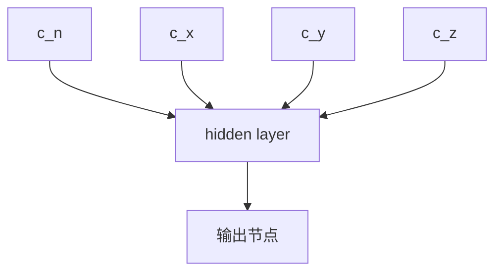
</details>

$$
\operatorname * {P r} \left[ c _ {x} = 1 \mid \mathbf {r} _ {i \neq n} \right] = 0. 9 1
$$

$$
\operatorname * {P r} \left[ c _ {y} = 1 \mid \mathbf {r} _ {i \neq n} \right] = 0. 9 9
$$

$$
\operatorname * {P r} \left[ c _ {z} = 1 \mid \mathbf {r} _ {i \neq n} \right] = 0. 0 0 1
$$

# รูปที่ 4.10 การหาฟังก์ชันพาริตีของกราฟแทนเนอร์ในตัวอย่างที่ 4.5

ความน่าจะเป็นอะโพสเทอริออริของบิตข้อมูล $\{ c _ { x } , \ c _ { y } , \ c _ { z } \}$ มาให้ และข้อมูลที่วงจรภาครับได้รับคือ $r _ { n } = ( 2 c _ { n } - 1 ) + w _ { n } = 1 . 5$ เมื่อ $w _ { n }$ คือสัญญาณรบกวน AพGN ที่มีค่าเฉลี่ยเท่ากับศูนย์และค่า ความแปรปรวนเท่ากับ $\sigma ^ { 2 } = 0 . 5$ นั่นคือ $w _ { n } \sim \mathcal { N } \big ( 0 , \sigma ^ { 2 } \big )$ จงคำนวณหาค่า LLR แบบอะโพสเทอริ ออริของบิตข้อมูล $c _ { n }$ โดยใช้สมการ (4.56) – (4.58)

วิธีทำในการส่งผ่านข่าวสารไปให้โหนดบิต $c _ { n }$ โหนดเช็กจะรวบรวมข่าวสารที่ส่งมาจากโหนดบิต e $\{ x , ~ y , ~ z \}$ เพื่อคำนวณหาข่าวสารเอกซ์ทรินซิก จากนั้นจะส่งผลลัพธ์ที่ได้ไปให้โหนดบิต $c _ { n }$ เพื่อหา ค่า LLR แบบอะโพสเทอริออริของบิตข้อมูลตัวที่ n เนื่องจากโจทย์กำหนด $\operatorname* { P r } [ c _ { l } = 1 | \mathbf { r } _ { i \neq n } ]$ สำหรับ $l = \{ x , ~ y , ~ z \}$ มาให้ จึงทำให้สามารถหาค่าข่าวสารเอกซ์ทรินซิกที่โหนดบิต $\{ x , ~ y , ~ z \}$ จะส่งไปให้ กับโหนดบิต $c _ { n }$ ตามสมการ (4.55) ได้ดังนี้

$$
\lambda_ {x} = \log \left(\frac {\operatorname* {P r} \left[ c _ {x} = 1 \mid \mathbf {r} _ {l \neq n} \right]}{\operatorname* {P r} \left[ c _ {x} = 0 \mid \mathbf {r} _ {l \neq n} \right]}\right) = \log \left(\frac {0 . 9 1}{0 . 0 9}\right) \approx 2. 3
$$

$$
\lambda_ {y} = \log \left(\frac {\operatorname* {P r} \left[ c _ {y} = 1 \mid \mathbf {r} _ {i \neq n} \right]}{\operatorname* {P r} \left[ c _ {y} = 0 \mid \mathbf {r} _ {i \neq n} \right]}\right) = \log \left(\frac {0 . 9 9}{0 . 0 1}\right) \approx 4. 6
$$

$$
\lambda_ {z} = \log \left(\frac {\operatorname* {P r} \left[ c _ {z} = 1 \mid \mathbf {r} _ {i \neq n} \right]}{\operatorname* {P r} \left[ c _ {z} = 0 \mid \mathbf {r} _ {i \neq n} \right]}\right) = \log \left(\frac {0 . 0 0 1}{0 . 9 9 9}\right) \approx - 6. 9
$$

เพราะว่า $\operatorname* { P r } \ [ c _ { l } = 0 \vert \mathbf { r } _ { i \neq n } ] = 1 - \operatorname* { P r } \ [ c _ { l } = 1 \vert \mathbf { r } _ { i \neq n } ]$ จากนั้นแทนค่า $r _ { n } = 1 . 5 , \sigma ^ { 2 } = 0 . 5 , \updownarrow k \Updownarrow _ { \nu } ^ { \alpha } \lambda _ { x } , \lambda _ { y }$ $\lambda _ { z }$ ลงในสมการ (4.56) จะได้

$$
\begin{array}{l} \lambda_ {n} = \frac {2}{0 . 5} (1. 5) - 2 \tanh ^ {- 1} \left\{\prod_ {l = \{x, y, z \}} \tanh \left(\frac {- \lambda_ {l}}{2}\right) \right\} \\ = 6 - 2 \tanh ^ {- 1} \left\{\tanh \left(\frac {- 2 . 3}{2}\right) \times \tanh \left(\frac {- 4 . 6}{2}\right) \times \tanh \left(\frac {6 . 9}{2}\right) \right\} \\ = 6 - 2 \tanh ^ {- 1} \left\{(- 0. 8 1 7 8) \times (- 0. 9 8 0 1) \times (0. 9 9 8 0) \right\} \\ = 6 - (2. 1 9 7) = 3. 8 0 3 \\ \end{array}
$$

นอกจากนี้ยังสามารถหาค่า $\lambda _ { n }$ ได้จากสมการ (4.57) ได้ดังนี้

$$
\begin{array}{l} \lambda_ {n} = \frac {2}{0 . 5} (1. 5) - \left\{\prod_ {l = \{x, y, z \}} \operatorname{sign} \left(- \lambda_ {l}\right) \times f \left(\sum_ {l = \{x, y, z \}} f \left(\left| \lambda_ {l} \right|\right)\right) \right\} \\ = 6 - \left\{(- 1) (- 1) (1) \times f \left(f \left(\left| \lambda_ {x} \right|\right) + f \left(\left| \lambda_ {y} \right|\right) + f \left(\left| \lambda_ {z} \right|\right)\right) \right\} \\ = 6 - \left\{f (f (| 2. 3 |) + f (| 4. 6 |) + f (| - 6. 9 |)) \right\} \\ = 6 - f (0. 2 0 1 2 + 0. 0 2 0 1 + 0. 0 0 2 0) \\ = 6 - (2. 1 9 7) = 3. 8 0 3 \\ \end{array}
$$

ซึ่งมีค่าเท่ากับการหาคำตอบโดยใช้สมการ (4.56) ตามที่แสดงในข้างต้น อย่างไรก็ตามถ้าต้องการลด ความซับซ้อนในการคำนวณหาค่า $\lambda _ { n }$ ก็สามารถใช้สมการ (4.58) ได้ดังนี้

$$
\lambda_ {n} = \frac {2}{0 . 5} (1. 5) - \left\{\prod_ {l = \{x, y, z \}} \operatorname{sign} \left(- \lambda_ {l}\right) \times \min _ {l = \{x, y, z \}} \left| \lambda_ {l} \right| \right\}
$$

$$
= 6 - \left\{(- 1) (- 1) (1) \times | 2. 3 | \right\}
$$

$$
= 6 - 2. 3 = 3. 7
$$

ซึ่งมีค่าใกล้เคียงกับผลัพธ์ที่ได้จากสมการ (4.56) และ (457)

# 4.4.4 อัลกอริทึมการผ่านข่าวสาร

$c _ { i , l }$ $c _ { n }$ พาริตีเช็กเดียวกัน อย่างไรก็ตามเมื่อกำหนดเงื่อนไขว่า $\left\{ \mathbf { r } _ { i \neq n } \right\}$ มาให้ ก็จะทำให้ $c _ { i , l }$ เป็นอิสระจาก $c _ { n }$ นอกจากนี้ถ้าตัดทิ้งข้อมูลตัวที่ n ที่วงจรภาครับได้รับ (นั่นคือ $r _ { n } )$ ก็จะทำให้ข้อมูลตัวอื่นๆ หรือ $\left\{ \mathbf { r } _ { i \neq n } \right\}$ ที่ผ่านโหนดบิต $c _ { n }$ ถูกตัดทั้งไปด้วย ดังนั้นการตัดทิ้งข้อมูล $r _ { n }$ ก็เปรียบเสมือนกับการตัด เส้นเชื่อมทั้งหมดที่เชื่อมต่อกับโหนดบิต $c _ { n }$ ซึ่งทำให้เกิดเป็นกราฟย่อยจำนวน $j$ กราฟ และเนื่องจาก กราฟทังหมดไม่มีส่วนร่วมกัน (diรูอiทt) จึงสามารถพิจารณาได้ว่ากราฟย่อยแต่ละกราฟเป็นอิสระต่อ กัน ซึ่งทำให้มีเฉพาะบิตข้อมูล $c _ { i , l }$ ที่จะถูกนำมาใช้ในการคำนวณหาค่า $\lambda _ { i , l }$

อัลกอริทึมการผ่านข่าวสาร (หรืออัลกอริทึม MP) เป็นเทคนิคการถอดรหัสข้อมูลที่ง่าย โดยอาศัยการส่งผ่านข่าวสารจากโหนดหนึ่งไปยังอีกโหนดหนึ่งตามเส้นทางในกราฟแทนเนอร์ โดย แต่ละโหนด (โหนดบิตและโหนดเช็ก) จะทำหน้าที่เป็นหน่วยประมวลผลที่เป็นอิสระต่อกัน ซึ่งจะ รับข่าวสารที่ส่งเข้ามาทางเส้นเชื่อมทุกเส้น ทำการคำนวณ และส่งผลลัพธ์ที่ได้กลับไปยังเส้นเชื่อม เหล่านัน นอกจากนีถ้ากราฟไม่มีวัฎจักร (yle-free) อัลกอริทึม MP จะเป็นอัลกอริทึมแบบ เวียนเกิด (recursive algorithm) ที่มีผลลัพธ์ลู่เข้าสู่ค่า LLR แบบอะโพสเทอริออริจริงตามที่นิยาม ในสมการ (4.43) หลังจากการทำงานแบบวนซ้ำ (iterative) ภายในอัลกอริทึม MP ผ่านไปเป็น จำนวนรอบที่จำกัด อย่างไรก็ตามรหัสที่ดี (g0อd code) ส่วนใหญ่จะมีวัฎจักรภายในกราฟแทนเนอร์ ซึ่งถ้าใช้อัลกอริทึม MP ในการถอดรหัสข้อมูล ก็จะทำให้ผลลัพธ์ที่ได้เป็นแบบเหมาะที่สุดแบบรอง (sub-optimal) โดยสรุปแล้วถึงแม้ว่ารหัสแอลดีพีซีจะมีวัฎจักร การใช้อัลกอริทึม MP ในการถอด รหัสข้อมูลก็ยังคงให้สมรรถนะที่ค่อนข้างดีและมีความซับซ้อนน้อยมาก (เมื่อเที่ยบกับรหัสอื่นๆ)

วงจรถอดรหัสแอลดีพีซีที่ใช้อัลกอริทึม MP (หรือวงจรถอดรหัสแบบ MP) สำหรับรหัส ไบนารีที่มีเมทริกซ์พาริตีเช็ก H ขนาด M×N สามารถสรุปเป็นขั้นตอนการทำงานได้ดังนี้ กำหนดให้ $\mathcal { M } _ { n } = \{ \ : m \colon h _ { m , n } = 1 \}$ คือเซตของโหนดเช็กทั้งหมดที่เช่อมต่อกับโหนดบิตตัวที่ n และ $\mathcal { N } _ { m } = \{ n \}$ $h _ { m , n } = 1 \}$ คือเซตของโหนดบิตทั้งหมดที่เชื่อมต่อกับโหนดเช็กตัวที่ $m$ โดยที่สำหรับรหัสแอลดีพีซี ปรกติแบบ (j, k) จะได้ว่า ${ \mathcal { M } } _ { n }$ มีจำนวนสมาชิกเท่ากับ j ตัวสำหรับทุก ท และ $\mathcal { N } _ { m }$ มีจำนวนสมาชิก เท่ากับ k ตัวสำหรับทุก m นอกจากนี้ถ้าให้ $u _ { m  n } ^ { ( l ) }$ คือข่าวสารที่ส่งจากโหนดเช็กตัวที่ m ไปยังโหนด บิตตัวที่ n ณ การวนซ้ำรอบที่1 และให้ $\lambda _ { n } ^ { ( l ) }$ คือค่า LLR แบบอะโพสเทอริออริของบิตข้อมูลตัวที n ณ การวนซ้ำรอบที่ 1 เพราะฉะนั้นวงจรถอดรหัสแบบ MP มีขั้นตอนการทำงานตามรูปที่ 4.11

ตัวอย่างที่ 4.6 พิจารณาช่องสัญญาณ AGพN ในรูปที่ 4.5 เมื่อบิตข้อมูลอินพุต $m \in \{ 0 , 1 \}$ และ รหัสแอลดีพีซีที่ใช้มีเมทริกซ์ตัวกำเนิดคือ $\mathbf { G } = [ 1 \ 1 \ 1 ] = [ 1 \ | \ \mathbf { P } ]$ เมื่อ P = [1 1] คือเมทริกซ์พาริตี

# อัลกอริทึมการผ่านข่าวสาร (MP: Massage Passing)

1. กำหนดให้เมทริกซ์พาริตีเช็ก H ขนาด M×N (นั่นคือ M โหนดเช็ก และ N โหนดบิต)   
2. กำหนดค่าเริ่มต้น

$$
u _ {m \rightarrow n} ^ {(0)} = 0 \quad \text {   สำหรับทุกค่า   } m \in \{1, 2, \dots , M \} \text {   และ   } n \in \mathcal {N} _ {m}
$$

$$
\lambda_ {n} ^ {(0)} = \left(2 / \sigma^ {2}\right) r _ {n} \quad \text {   สำหรับทุกค่า   } n \in \{1, 2, \dots , N \}
$$

3.สำหรับ $l = 1 , 2 , . . . , l _ { \mathrm { m a x } }$ เมื่อ $l _ { \mathrm { m a x } }$ คือจำนวนรอบของการวนซ้ำที่ต้องการ)

การปรับปรุงโหนดเช็ก (check-node update)

สำหรับ $m \in \{ 1 , 2 , . . . , M \}$ และ $\boldsymbol { n } \in \mathcal { N } _ { m }$

$$
u _ {m \rightarrow n} ^ {(l)} = - 2 \tanh ^ {- 1} \left\{\prod_ {i \in \mathcal {N} _ {m} \backslash \{n \}} \tanh \left(\frac {- \left(\lambda_ {i} ^ {(l - 1)} - u _ {m \rightarrow i} ^ {(l - 1)}\right)}{2}\right)\right\} \tag {4.59}
$$

(สิ้นสุดการวนซ้ำของ m)

การปรับปรุงโหนดบิต (bit-node update)

สำหรับ $n \in \{ 1 , 2 , . . . , N \}$

$$
\lambda_ {n} ^ {(l)} = \frac {2}{\sigma^ {2}} r _ {n} + \sum_ {m \in \mathcal {M} _ {n}} u _ {m \rightarrow n} ^ {(l)} \tag {4.60}
$$

(สิ้นสุดการวนซ้ำของ ท)

(สิ้นสุดการวนซ้ำของ l)

4. ถอดรหัสลำดับข้อมูลอินพุตจากความสัมพันธ์ต่อไปนี้ (ใช้ได้เฉพาะรหัสแบบมีระบบเท่านั้น)

$$
\hat {m} _ {i} = \left\{ \begin{array}{l l} 1, & \text { if } \lambda_ {i} ^ {(l _ {\max})} \geq 0 \\ 0, & \text { if } \lambda_ {i} ^ {(l _ {\max})} <   0 \end{array} \right. \tag {4.61}
$$

สำหรับ $i \in \left\{ 1 , 2 , . . . , N - M \right\}$ เมื่อ $N - M = K$ คือจำนวนของบิตข้อมูลอินพุต (ดรูรูปที่ 4.1)

รูปที่ 4.11 ขั้นตอนการทำงานของอัลกอริทึม MP สำหรับการถอดรหัสแอลดีพีซี [4, 17]


<details>
<summary>flowchart</summary>


</details>


<details>
<summary>flowchart</summary>

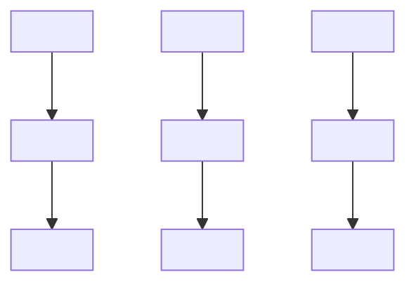
</details>

$$
\pmb {\lambda} ^ {(0)} = \frac {2}{\sigma^ {2}} \left[ \begin{array}{c} r _ {1} \\ r _ {2} \\ r _ {3} \end{array} \right] = L _ {c} \left[ \begin{array}{c} r _ {1} \\ r _ {2} \\ r _ {3} \end{array} \right]
$$

รูปที่ 4.12 กราฟแทนเนอร์ที่ใช้ในการถอดรหัสข้อมูลในตัวอย่างที่ 4.6

ดังนั้นสัญญาณที่วงจรภาครับได้รับคือ 0

$$
\left[ \begin{array}{c} r _ {1} \\ r _ {2} \\ r _ {3} \end{array} \right] = s \left[ \begin{array}{c} 1 \\ 1 \\ 1 \end{array} \right] + \left[ \begin{array}{c} w _ {1} \\ w _ {2} \\ w _ {3} \end{array} \right]
$$

โดยที่ $s \in \{ \pm 1 \}$ และ $w _ { n } \sim \mathcal { N } \big ( 0 , \sigma ^ { 2 } \big )$ คือสัญญาณรบกวน AWGN จงหาค่า LLR แบบอะโพส เทอริออริ $\boldsymbol { \lambda } = \left[ \lambda _ { 1 } , \lambda _ { 2 } , \lambda _ { 3 } \right] ^ { \mathrm { T } }$ เมื่อ $\lambda _ { n } = \log \left( \operatorname* { P r } \ [ c _ { n } = 1 | \mathbf { r } ] / \operatorname* { P r } \ [ c _ { n } = 0 | \mathbf { r } ] \right)$ สำหรับ $n = \{ 1 , 2 , 3 \}$ เมื่อสิ้นสุดการวนซ้ำรอบที่ 2 นั่นคือหาค่า $\lambda _ { n } ^ { ( 2 ) }$

วิธีทำ จากสมการ (4.7) เมทริกซ์ G ที่กำหนดมาจะมีเมทริกซ์พาริตีเซ็ก H คือ

$$
\mathbf {H} = \left[ \mathbf {P} ^ {\mathrm{T}} \mid \mathbf {I} \right] = \left[ \begin{array}{c c c} 1 & 1 & 0 \\ 1 & 0 & 1 \end{array} \right]
$$

อาศัยเทคนิคการกำจัดแบบเกาส์เซียน (Gaussian elimination) [53] ทำให้สามารถจัดรูปเมทริกซ์ H ใหม่ได้เป็น

$$
\mathbf {H} = \left[ \begin{array}{c c c} 1 & 1 & 0 \\ 0 & 1 & 1 \end{array} \right]
$$

ซึ่งแสดงให้เป็นกราฟแทนเนอร์ได้ตามรูปที่ 4.12 โดยที่ค่า $\lambda _ { n }$ หาได้จากสมการ (4.47) นั่นคือ

$$
\lambda_ {n} = L _ {c} r _ {n} + \log \left(\frac {\operatorname * {P r} \left[ c _ {n} = 1 \mid \mathbf {r} _ {i \neq n} \right]}{\operatorname * {P r} \left[ c _ {n} = 0 \mid \mathbf {r} _ {i \neq n} \right]}\right) \tag {4.62}
$$

เมื่อ $L _ { c } = 2 / \sigma ^ { 2 }$ คือความน่าเชื่อถือของช่องสัญญาณ รูปที่ 4.13 การส่งผ่านข่าวสาร (ก) จากโหนดบิตไปยังโหนดเช็ก และ (ข) จากโหนดเช็กไปยังโหนดบิต เมื่อ สิ้นสุดการวนซ้ำรอบที่ 1


<details>
<summary>flowchart</summary>

```mermaid
graph TD
    A["Lc r1"] --> B["○"]
    B --> C["Lc r1"]
    C --> D["□"]
    D --> E["Lc r2"]
    E --> F["○"]
    F --> G["Lc r2"]
    G --> H["□"]
    H --> I["Lc r3"]
    I --> J["○"]
    J --> K["Lc r3"]
    K --> L["□"]
    L --> M["Lc r2"]
    M --> N["□"]
    N --> O["Lc r3"]
    O --> P["○"]
    P --> Q["Lc r3"]
    Q --> R["□"]
    R --> S["Lc r2"]
    S --> T["□"]
    T --> U["Lc r3"]
    U --> V["○"]
    V --> W["Lc r3"]
    W --> X["□"]
    X --> Y["Lc r2"]
    Y --> Z["□"]
    Z --> AA["Lc r3"]
    AA --> AB["○"]
    AB --> AC["Lc r3"]
    AC --> AD["□"]
```
</details>

(ก)


<details>
<summary>flowchart</summary>

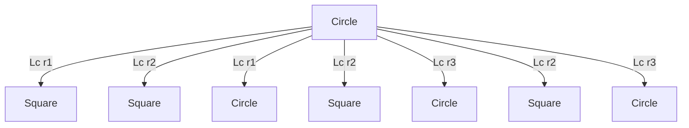
</details>

(ข)

ค่า LLR แบบอะโพสเทอริออริ $\boldsymbol { \lambda } = \left[ \lambda _ { 1 } , \lambda _ { 2 } , \lambda _ { 3 } \right] ^ { \mathrm { T } }$ สามารถหาได้จากอัลกอริทึม MP ตาม รูปที่ 4.11 ดังต่อไปนี้ กำหนดค่าเริ่มต้นของ

$$
\boldsymbol {\lambda} ^ {(0)} = \left[ \begin{array}{c} \lambda_ {1} ^ {(0)} \\ \lambda_ {2} ^ {(0)} \\ \lambda_ {3} ^ {(0)} \end{array} \right] = L _ {c} \left[ \begin{array}{c} r _ {1} \\ r _ {2} \\ r _ {3} \end{array} \right]
$$

รอบที่ 1 $( \mathbf { 1 } ^ { \mathrm { s t } }$ iteration)

โหนดบิตแต่ละโหนดจะส่งข่าวสาร $\lambda _ { n } ^ { ( 0 ) }$ ไปยังโหนดเช็กตามที่แสดงในรูปที่ 4.13 (0) จากนั้นโหนด เช็กแต่ละโหนดจะนำข่าวสารทีได้รับมาคำนวณตามสมการ (4.59) แล้วก็ส่งผลลัพธ์กลับไปยังโหนด บิตตามที่แสดงในรูปที่ 4.13 (ข) หลังจากนั้นโหนดบิตจะนำข่าวสารที่ได้รับทั้งหมดมาคำนวณตาม สมการ (4.60) ซึ่งจะได้ว่าค่า $\lambda _ { n } ^ { ( 1 ) }$ ของบิตข้อมูลตัวที่ n เมื่อ n = {1, 2, 3} มีค่าเท่ากับ

$$
\boldsymbol {\lambda} ^ {(1)} = \left[ \begin{array}{c} \lambda_ {1} ^ {(1)} \\ \lambda_ {2} ^ {(1)} \\ \lambda_ {3} ^ {(1)} \end{array} \right] = L _ {c} \left[ \begin{array}{c} r _ {1} + r _ {2} \\ r _ {1} + r _ {2} + r _ {3} \\ r _ {2} + r _ {3} \end{array} \right]
$$

รอบที่ 2 $( 2 ^ { \mathbf { n d } }$ iteration)

ในทำนองเดียวกันโหนดบิตแต่ละโหนดจะส่งข่าวสารไปยังโหนดเช็กตามที่แสดงในรูปที่ 4.14 (ก) จากนั้นโหนดเช็กแต่ละโหนดจะนำข่าวสารทีได้รับมาคำนวณตามสมการ (4.59) แล้วก็ส่งผลลัพธ์ กลับไปยังโหนดบิตตามที่แสดงในรูปที่ 4.14 (ข) หลังจากนั้นโหนดบิตจะนำข่าวสารทีได้รับทั้งหมด มาคำนวณตามสมการ (4.60) ซึ่งจะได้ว่าค่า $\lambda _ { n } ^ { ( 2 ) }$ ของบิตข้อมูลตัวที่ n มีค่าเท่ากับ


<details>
<summary>flowchart</summary>

```mermaid
graph TD
    A["LDPC"] --> B["Number of iterations 1"]
    A --> C["Number of iterations 2"]
    A --> D["Number of iterations 3"]
    A --> E["Number of iterations 4"]
    A --> F["Number of iterations 5"]
    B --> G["Neural Network Diagram"]
    C --> G
    D --> G
    E --> G
    F --> G
    G --> H["Output Node 1"]
    G --> I["Output Node 2"]
    G --> J["Output Node 3"]
    G --> K["Output Node 4"]
    G --> L["Output Node 5"]
    H --> M["Output Node 1"]
    H --> N["Output Node 2"]
    H --> O["Output Node 3"]
    H --> P["Output Node 4"]
    H --> Q["Output Node 5"]
    I --> R["Output Node 1"]
    I --> S["Output Node 2"]
    I --> T["Output Node 3"]
    I --> U["Output Node 4"]
    I --> V["Output Node 5"]
    J --> W["Output Node 1"]
    J --> X["Output Node 2"]
    J --> Y["Output Node 3"]
    J --> Z["Output Node 4"]
    J --> AA["Output Node 5"]
    K --> AB["Output Node 1"]
    K --> AC["Output Node 2"]
    K --> AD["Output Node 3"]
    K --> AE["Output Node 4"]
    K --> AF["Output Node 5"]
    L --> AG["Output Node 1"]
    L --> AH["Output Node 2"]
    L --> AI["Output Node 3"]
    L --> AJ["Output Node 4"]
    L --> AK["Output Node 5"]
    M --> AL["Output Node 1"]
    M --> AM["Output Node 2"]
    M --> AN["Output Node 3"]
    M --> AO["Output Node 4"]
    M --> AP["Output Node 5"]
    N --> AQ["Output Node 1"]
    N --> AR["Output Node 2"]
    N --> AS["Output Node 3"]
    N --> AT["Output Node 4"]
    N --> AU["Output Node 5"]
    O --> AV["Output Node 1"]
    O --> AW["Output Node 2"]
    O --> AX["Output Node 3"]
    O --> AY["Output Node 4"]
    O --> AZ["Output Node 5"]
    P --> BA["Output Node 1"]
    P --> BB["Output Node 2"]
    P --> BC["Output Node 3"]
    P --> BD["Output Node 4"]
    P --> BE["Output Node 5"]
    Q --> BF["Output Node 1"]
    Q --> BG["Output Node 2"]
    Q --> BH["Output Node 3"]
    Q --> BI["Output Node 4"]
    Q --> BJ["Output Node 5"]
    AA --> BK["Output Node 1"]
    AA --> BL["Output Node 2"]
    AA --> BM["Output Node 3"]
    AA --> BN["Output Node 4"]
    AA --> BO["Output Node 5"]
    AB --> BP["Output Node 1"]
    AB --> BQ["Output Node 2"]
    AB --> BR["Output Node 3"]
    AB --> BS["Output Node 4"]
    AB --> BT["Output Node 5"]
    AC --> BU["Output Node 1"]
    AC --> BV["Output Node 2"]
    AC --> BW["Output Node 3"]
    AC --> BX["Output Node 4"]
    AC --> BY["Output Node 5"]
    AD --> BZ["Output Node 1"]
    AD --> CA["Output Node 2"]
    AD --> CB["Output Node 3"]
    AD --> CC["Output Node 4"]
    AD --> CD["Output Node 5"]
    AE --> CE["Output Node 1"]
    AE --> CF["Output Node 2"]
    AE --> CG["Output Node 3"]
    AE --> CH["Output Node 4"]
    AE --> CI["Output Node 5"]
    AD --> CJ["Output Node 1"]
    AD --> CK["Output Node 2"]
    AD --> CL["Output Node 3"]
    AD --> CM["Output Node 4"]
    AD --> CN["Output Node 5"]
    AD --> CO["Output Node 1"]
    AD --> CP["Output Node 2"]
    AD --> CQ["Output Node 3"]
    AD --> CR["Output Node 4"]
    AD --> CS["Output Node 5"]
```
</details>


<details>
<summary>flowchart</summary>

```mermaid
graph TD
    A["Lc r1"] --> B["○"]
    B --> C["Lc r1"]
    C --> D["Square"]
    E["Lc r2"] --> F["○"]
    F --> G["Lc (r1 + r2)"]
    G --> H["Square"]
    I["Lc r3"] --> J["○"]
    J --> K["Lc r3"]
    K --> L["Square"]
    B -->|Lc (r2 + r3)| F
    F -->|Lc (r1 + r2)| H
```
</details>

(ก)


<details>
<summary>flowchart</summary>

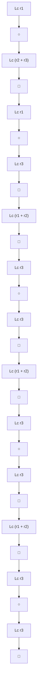
</details>

(ข)

รูปที่ 4.14 การส่งผ่านข่าวสาร (ก) จากโหนดบิตไปยังโหนดเช็ก และ (ข) จากโหนดเช็กไปยังโหนดบิต เมื่อ สิ้นสุดการวนซ้ำรอบที่ 2

$$
\boldsymbol {\lambda} ^ {(2)} = \left[ \begin{array}{l} \lambda_ {1} ^ {(2)} \\ \lambda_ {2} ^ {(2)} \\ \lambda_ {3} ^ {(2)} \end{array} \right] = L _ {c} \left[ \begin{array}{l} r _ {1} + r _ {2} + r _ {3} \\ r _ {1} + r _ {2} + r _ {3} \\ r _ {1} + r _ {2} + r _ {3} \end{array} \right] \tag {4.63}
$$

ซึ่งก็คือค่า LLR แบบอะโพสเทอริออริของบิตข้อมูล $\{ c _ { 1 } , c _ { 2 } , c _ { 3 } \}$ เมื่อสิ้นสุดการวนซ้ำรอบที่ 2 นั่นเอง นอกจากนี้ถ้าให้อัลกอริทึม MP ทำงานต่อไปอีก ก็จะพบว่าค่า $\lambda ^ { ( l ) } = \lambda ^ { ( 2 ) }$ สำหรับ $l > 2$ นั่นคือ อัลกอริทึม MP เข้าสูสถานะคงตัว (steady state) แล้ว

ตัวอย่างที่ 4.6 สามารถหาคำตอบได้อีกวิธีหนึ่งดังนี้ จากสมการ (4.43) จะได้ว่าค่า LLR แบบอะโพสเทอริออริของบิตข้อมูล $c _ { n }$ สำหรับ $n = \{ 1 , 2 , 3 \}$ มีค่าเท่ากับ (อาศัยกฎของเบส์)

$$
\lambda_ {n} = \log \left(\frac {p (\mathbf {r} \mid c _ {n} = 1) \operatorname* {P r} \left[ c _ {n} = 1 \right] / p (\mathbf {r})}{p (\mathbf {r} \mid c _ {n} = 0) \operatorname* {P r} \left[ c _ {n} = 0 \right] / p (\mathbf {r})}\right) \tag {4.64}
$$

เมื่อ ${ \bf r } = \left[ r _ { 1 } , r _ { 2 } , r _ { 3 } \right] ^ { \mathrm { T } }$ ถ้าสมมุติว่า $\mathrm { P r } \big [ c _ { n } = 1 \big ] = \mathrm { P r } \big [ c _ { n } = 0 \big ] = 0 . 5$ ดังนั้นสมการ (4.64) จะลดรูป ได้เป็น

$$
\begin{array}{l} \lambda_ {n} = \log \left(\frac {p (\mathbf {r} \mid c _ {n} = 1)}{p (\mathbf {r} \mid c _ {n} = 0)}\right) \\ = \log \left(\frac {C \exp \left(- \frac {1}{2 \sigma^ {2}} \left| \mathbf {r} - \left[ 1 1 1 \right] ^ {\mathrm{T}} \right| ^ {2}\right)}{C \exp \left(- \frac {1}{2 \sigma^ {2}} \left| \mathbf {r} + \left[ 1 1 1 \right] ^ {\mathrm{T}} \right| ^ {2}\right)}\right) \\ \end{array}
$$

$$
\begin{array}{l} = \frac {1}{2 \sigma^ {2}} \left\{2 \left(r _ {1} + r _ {2} + r _ {3}\right) + 2 \left(r _ {1} + r _ {2} + r _ {3}\right) \right\} \\ = \frac {2}{\sigma^ {2}} \left(r _ {1} + r _ {2} + r _ {3}\right) \\ \end{array}
$$

ซึ่งมีค่าเท่ากับผลลัพธ์ที่ได้ในสมการ (4.63) เมื่อ $C = 1 / \sqrt { 2 \pi \sigma ^ { 2 } }$ ดังนั้นจึงสรุปได้ว่าถ้ารหัสแอลดีพีซี ไม่มีวัฏจักร อัลกอริทึม MP จะลูเข้าสู่ค่าที่ถูกต้อง เมื่อจำนวนรอบของการวนซ้ำเพิ่มขึ้นเรื่อยๆ

ตัวอย่างที่ 4.7 พิจารณาช่องสัญญาณ AGพN ในรูปที่ 4.5 เมื่อบิตข้อมูลอินพุต m = [101] และ รหัสแอลดีพีชีที่ใช้มีเมทริกซ์ตัวกำเนิด G ตามสมการ (4.4) โดยที่สัญญาณรบกวนในระบบมีค่า เท่ากับ $\mathbf { w } = [ - 0 . 5 , 0 . 8 , - 0 . 5 , 0 . 5 , 0 . 5 , - 0 . 5 ]$ และมีความแปรปรวนเท่ากับ $\sigma ^ { 2 } = 0 . 5$ จงหาค่า LLR แบบอะโพสเทอริออริ $\boldsymbol { \mathtt { \lambda } } = \left[ \lambda _ { 1 } , \lambda _ { 2 } , \lambda _ { 3 } , \lambda _ { 4 } , \lambda _ { 5 } , \lambda _ { 6 } \right] ^ { \mathrm { T } }$ เมื่อสิ้นสุดการวนซ้ำรอบที่ 3

วิธีทำ จากตัวอย่างที่ 4.1 เมื่อ m = [101] ก็จะได้ $\mathbf { c } = [ 1 0 1 0 1 1 ]$ ดังนั้นสัญญาณที่วงจรถอดรหัส แอลดีพีซีได้รับคือ

$$
\mathbf {r} = (2 \mathbf {c} - 1) + \mathbf {w} = [ r _ {1}, r _ {2}, r _ {3}, r _ {4}, r _ {5}, r _ {6} ] = [ 0. 5, - 0. 2, 0. 5, - 0. 5, 1. 5, 0. 5 ]
$$

เนื่องจากเมทริกซ์ตัวกำเนิด G ตามสมการ (4.4) อยูในรูปแบบมีระบบ (systematiด form) จึงทำ ให้สามารถหาเมทริกซ์พาริตีเซ็ก H ได้ตามสมการ (4.7) นั่นคือ

$$
\mathbf {H} = \left[ \begin{array}{c c c c c c} 1 & 0 & 1 & 1 & 0 & 0 \\ 1 & 1 & 0 & 0 & 1 & 0 \\ 0 & 1 & 1 & 0 & 0 & 1 \end{array} \right]
$$

วงจรถอดรหัสจะใช้เมทริกซ์ H นี้ในการถอดรหัสลำดับข้อมูล r ซึ่งมีการแลกเปลี่ยนข่าวสารแบบ ซอฟต์ตามกราฟแทนเนอร์ในรูปที่ 4.15 โดยในแต่ละรอบของการวนซ้ำ โหนดเช็กและโหนดบิตจะ $u _ { m  n } ^ { ( l ) }$ และ $\lambda _ { n } ^ { ( l ) }$ ตามสมการ (4.59) และ (4.60) ตามลำดับ เมือ 1 คือรอบของ

รอบที่ 1 $( \mathbf { 1 } ^ { \mathrm { s t } }$ iteration)

โหนดเช็กจะส่งข่าวสารแบบซอฟต์ $u _ { m  n } ^ { ( 1 ) }$ จากโหนดเช็ก m ไปยังโหนดบิต ท ดังนี้

$$
\left[ u _ {1 \rightarrow 1} ^ {(1)}, u _ {1 \rightarrow 3} ^ {(1)}, u _ {1 \rightarrow 4} ^ {(1)} \right] = \left[ 1. 3 2 5 0, 1. 3 2 5 0, - 1. 3 2 5 0 \right]
$$


<details>
<summary>flowchart</summary>


</details>


<details>
<summary>flowchart</summary>

```mermaid
graph TD
    A["1"] --> B["1"]
    A --> C["2"]
    A --> D["3"]
    A --> E["4"]
    A --> F["5"]
    A --> G["6"]
    B --> H["1"]
    C --> I["2"]
    D --> J["3"]
    E --> K["4"]
    F --> L["5"]
    G --> M["6"]
    N["1"] --> O["2"]
    N --> P["3"]
    N --> Q["4"]
    N --> R["5"]
    N --> S["6"]
    T["1"] --> U["2"]
    T --> V["3"]
    T --> W["4"]
    T --> X["5"]
    T --> Y["6"]
    Z["1"] --> AA["2"]
    Z --> AB["3"]
    Z --> AC["4"]
    Z --> AD["5"]
    Z --> AE["6"]
    AF["1"] --> AG["2"]
    AF --> AH["3"]
    AF --> AI["4"]
    AF --> AJ["5"]
    AF --> AK["6"]
    AL["1"] --> AM["2"]
    AL --> AN["3"]
    AL --> AO["4"]
    AL --> AP["5"]
    AL --> AQ["6"]
    AR["1"] --> AS["2"]
    AR --> AT["3"]
    AR --> AU["4"]
    AR --> AV["5"]
    AR --> AW["6"]
    AX["1"] --> AY["2"]
    AX --> AZ["3"]
    AX --> BA["4"]
    AX --> BB["5"]
    AX --> BC["6"]
    BD["1"] --> BE["2"]
    BD --> BF["3"]
    BD --> BG["4"]
    BD --> BH["5"]
    BD --> BI["6"]
    BJ["1"] --> BK["2"]
    BJ --> BL["3"]
    BJ --> BM["4"]
    BJ --> BN["5"]
    BJ --> BO["6"]
    BP["1"] --> BQ["2"]
    BP --> BR["3"]
    BP --> BS["4"]
    BP --> BT["5"]
    BP --> BU["6"]
    BV["1"] --> BW["2"]
    BV --> BX["3"]
    BV --> BY["4"]
    BV --> BZ["5"]
    BV --> CA["6"]
    CB["1"] --> CC["2"]
    CB --> CD["3"]
    CB --> CE["4"]
    CB --> CF["5"]
    CB --> BG["6"]
    BH --> BH
    BI --> BI
    BJ --> BJ
    BK --> BK
    BL --> BK
    BM --> BM
    BN --> BN
    BO --> BO
    BP --> BP
    BZ --> BZ
    BW --> BW
    BX --> BX
    BY --> BY
    BZ --> BZ
    BJ --> BJ
    BK --> BK
    BB --> BB
    BC --> BC
    BW --> BW
    BX --> BW
    BY --> BW
    BZ --> BW
    BH --> BH
    BI --> BI
    BJ --> BJ
    BK --> BK
    BB --> BK
    BC --> BC
    BW --> BC
    BX --> BC
    BY --> BC
    BZ --> BC
    BH --> BH
    BI --> BI
    BJ --> BJ
    BK --> BK
    BB --> BK
    BC --> BK
    BW --> BK
    BX --> BK
    BY --> BK
    BZ --> BK
    BH --> BK
    BI --> BK
    BJ --> BK
    BK --> BK
    BH --> BK
    BI --> BK
    BZ --> BK
    BH --> BK
    BI --> BK
    BJ --> BK
    BK --> BK
    BH --> BK
    BI --> BK
    BZ --> BK
    BH --> BK
    BI --> BK
    BJ --> BK
    BK --> BK
    BH --> BK
    BI --> BK
    BZ --> BK
    BH --> BK
    BI --> BK
    BJ --> BK
    BK --> BH
    BH --> BH
    BI --> BK
    BJ --> BK
    BK --> BH
    BH --> BH
    BI --> BK
    BJ --> BK
    BK --> BH
    BH --> BH
    BI --> BK
    BJ --> BK
    BK --> BH
    BH --> BH
    BI --> BK
    BJ --> BK
    BK --> BH
    BH --> BH
    BI --> BK
    BJ --> BK
    BK --> BH
    BH --> BK
    BI --> BK
    BJ --> BK
    BK --> BH
    BH --> BH
    BI --> BK
    BJ --> BK
    BK --> BH
    BH --> BH
    BI --> BK
    BJ --> BK
    BK --> BH
    BH --> BH
    BI --> BK
    BJ --> BK
    BK --> BH
    BH --> BH
    BI --> BK
    BJ --> BK
    BK --> Bh
    BH --> BK
    BH --> BM
    BH --> BN
    BH --> BO
    BH --> BP
    BH --> BP
    BH --> BN
    BH --> BO
    BH --> BP
    BH --> BN
    BH --> BN
    BH --> BN
    BH --> BN
    BH --> BN
    BH --> BN
    BH --> BN
    BH --> BN
    BH --> BN
    BH --> BN
    BH --> BN
    BH --> BN
    BH --> BN
    BH --> BN
    BH --> BN
    BH --> BN
    BH --> BN
    BH --> BN
    BH --> BN
    BH --> BN
    BH --> BZ
    BH --> BN
    BH --> BN
    BH --> BN
    BH --> BN
    BH --> BN
    BH --> BN
    BH --> BN
    BH --> BN
    BH --> BN
    BH --> BN
    BH --> BN
    BH --> BN
    BH --> BN
    BH --> BN
    BH --> BN
    BH --> BN
    BH --> BN
    BH --> BN
    BH --> BN
    BH --> BO
    BH --> BN
    BH --> BN
    BH --> BN
    BH --> BN
    BH --> BN
    BH --> BN
    BH --> BN
    BH --> BN
    BH --> BN
    BH --> BN
    BH --> BN
    BH --> BN
    BH --> BN
    BH --> BN
    BH --> BN
    BH --> BN
    BH --> BN
    BH --> BN
    BH --> BN
    BH --> RN
    BH --> RN
    BH --> RN
    BH --> RN
    BH --> RN
    BH --> RN
    BH --> RN
    BH --> RN
    BH --> RN
    BH --> RN
    BH --> RN
    BH --> RN
    BH --> RN
    BH --> RN
    BH --> RN
    BH --> RN
    BH --> RN
    BH --> RN
    BH --> RN
    BH --> RN
    BH --> BN
    BH --> BN
    BH --> BN
    BH --> BN
    BH --> BN
    BH --> BN
    BH --> BN
    BH --> BN
    BH --> BN
    BH --> BN
    BH --> BN
    BH --> BN
    BH --> BN
    BH --> BN
    BH --> BN
    BH --> BN
    BH --> BN
    BH --> BN
    BH --> BN
    BH --> DN
    BH --> DN
    BH --> DN
    BH --> DN
    BH --> DN
    BH --> DN
    BH --> DN
    BH --> DN
    BH --> DN
    BH --> DN
    BH --> DN
    BH --> DN
    BH --> DN
    BH --> DN
    BH --> DN
    BH --> DN
    BH --> DN
    BH --> DN
    BH --> DN
    BH --> DN
    BH --> BN
    BH --> BN
    BH --> BN
    BH --> BN
    BH --> BN
    BH --> BN
    BH --> BN
    BH --> BN
    BH --> BN
    BH --> BN
    BH --> BN
    BH --> BN
    BH --> BN
    BH --> BN
    BH --> BN
    BH --> BN
    BH --> BN
    BH --> BN
    BH --> BN
    BH --> BR
    BH --> BR
    BH --> BR
    BH --> BR
    BH --> BR
    BH --> BR
    BH --> BR
    BH --> BR
    BH --> BR
    BH --> BR
    BH --> BR
    BH --> BR
    BH --> BR
    BH --> BR
    BH --> BR
    BH --> BR
    BH --> BR
    BH --> BR
    BH --> BR
    BH --> BR
    BH --> BN
    BH --> BN
    BH --> BN
    BH --> BN
    BH --> BN
    BH --> BN
    BH --> BN
    BH --> BN
    BH --> BN
    BH --> BN
    BH --> BN
    BH --> BN
    BH --> BN
    BH --> BN
    BH --> BN
    BH --> BN
    BH --> BN
    BH --> BN
    BH --> BN
    BH --> N
    BH --> BN
    BH --> BN
    BH --> BN
    BH --> BN
    BH --> BN
    BH --> BN
    BH --> BN
    BH --> BN
    BH --> BN
    BH --> BN
    BH --> BN
    BH --> BN
    BH --> BN
    BH --> BN
    BH --> BN
    BH --> BN
    BH --> BN
    BH --> BN
    BH --> BN
    BH --> BH
    BH --> BN
    BH --> BN
    BH --> BN
    BH --> BN
    BH --> BN
    BH --> BN
    BH --> BN
    BH --> BN
    BH --> BN
    BH --> BN
    BH --> BN
    BH --> BN
    BH --> BN
    BH --> BN
    BH --> BN
    BH --> BN
    BH --> BN
    BH --> BN
    BH --> BN
    BH --> PN
    BH --> PN
    BH --> PN
    BH --> PN
    BH --> PN
    BH --> PN
    BH --> PN
    BH --> PN
    BH --> PN
    BH --> PN
    BH --> PN
    BH --> PN
    BH --> PN
    BH --> PN
    BH --> PN
    BH --> PN
    BH --> PN
    BH --> PN
    BH --> PN
    BH --> PN
    BH --> BN
    BH --> BN
    BH --> BN
    BH --> BN
    BH --> BN
    BH --> BN
    BH --> BN
    BH --> BN
    BH --> BN
    BH --> BN
    BH --> BN
    BH --> BN
    BH --> BN
    BH --> BN
    BH --> BN
    BH --> BN
    BH --> BN
    BH --> BN
    BH --> BN
    BH --> BP
    BH --> BP
    BH --> BP
    BH --> BP
    BH --> BP
    BH --> BP
    BH --> BP
    BH --> BP
    BH --> BP
    BH --> BP
    BH --> BP
    BH --> BP
    BH --> BP
    BH --> BP
    BH --> BP
    BH --> BP
    BH --> BP
    BH --> BP
    BH --> BP
    BH --> BP
    BH --> BN
    BH --> BN
    BH --> BN
    BH --> BN
    BH --> BN
    BH --> BN
    BH --> BN
    BH --> BN
    BH --> BN
    BH --> BN
    BH --> BN
    BH --> BN
    BH --> BN
    BH --> BN
    BH --> BN
    BH --> BN
    BH --> BN
    BH --> BN
    BH --> BZ
    BH = BN
    BH --> BN
    BH --> BN
    BH --> BN
    BH --> BN
    BH --> BN
    BH --> BN
    BH --> BN
    BH --> BN
    BH --> BN
    BH --> BN
    BH --> BN
    BH --> BN
    BH --> BN
    BH --> BN
    BH --> BN
    BH --> BN
    BH --> BN
    BH --> BN
    BH --> BN
    BH = BN
    BH --> BN
    BH --> BN
    BH --> BN
    BH --> BN
    BH --> BN
    BH --> BN
    BH --> BN
    BH --> BN
    BH --> BN
    BH --> BN
    BH --> BN
    BH --> BN
    BH --> BN
    BH --> BN
    BH --> BN
    BH --> BN
    BH --> BN
    BH --> BN
    BH --> BZ
    Bh --> BN
    BH --> BN
    BH --> BN
    BH --> BN
    BH --> BN
    BH --> BN
    BH --> BN
    BH --> BN
    BH --> BN
    BH --> BN
    BH --> BN
    BH --> BN
    BH --> BN
    BH --> BN
    BH --> BN
    BH --> BN
    BH --> BN
    BH --> BN
    BH --> BN
    BH --> BN
    Bh --> BN
    Bh --> BN
    Bh --> BN
    Bh --> BN
    Bh --> BN
    Bh --> BN
    Bh --> BN
    Bh --> BN
    Bh --> BN
    Bh --> BN
    Bh --> BN
    Bh --> BN
    Bh --> BN
    Bh --> BN
    Bh --> BN
    Bh --> BN
    Bh --> BN
    Bh --> BN
    Bh --> BN
    Bh --> BN
    BH --> BN
    BH --> BN
    BH --> BN
    BH --> BN
    BH --> BN
    BH --> BN
    BH --> BN
    BH --> BN
    BH --> BN
    BH --> BN
    BH --> BN
    BH --> BN
    BH --> BN
    BH --> BN
    BH --> BN
    BH --> BN
    BH --> BN
    BH --> BN
    BH --> BZ
```
```
</details>

$\mathfrak { F } ^ { \mathrm { { u } } \mathrm { \frac { d } { \mathfrak { n } } } }$ 4.15 กราฟแทนเนอร์ของเมทริหซีพาริตีเช็กในตัวอย่างที่ 4.7

$$
\left[ u _ {2 \rightarrow 1} ^ {(1)}, u _ {2 \rightarrow 2} ^ {(1)}, u _ {2 \rightarrow 5} ^ {(1)} \right] = \left[ 0. 7 9 5 6, - 1. 9 8 2 2, 0. 5 9 5 8 \right]
$$

$$
\left[ u _ {3 \rightarrow 2} ^ {(1)}, u _ {3 \rightarrow 3} ^ {(1)}, u _ {3 \rightarrow 6} ^ {(1)} \right] = \left[ - 1. 3 2 5 0, 0. 5 9 5 8, 0. 5 9 5 8 \right]
$$

และโหนดบิต ท จะคำนวณค่า LLR $\lambda _ { n } ^ { ( 1 ) }$ ได้เท่ากับ

$$
\left[ \lambda_ {1} ^ {(1)}, \lambda_ {2} ^ {(1)}, \lambda_ {3} ^ {(1)}, \lambda_ {4} ^ {(1)}, \lambda_ {5} ^ {(1)}, \lambda_ {6} ^ {(1)} \right] = \left[ 4. 1 2 0 6, - 4. 1 0 7 2, 3. 9 2 0 8, - 3. 3 2 5, 6. 5 9 5 8, 2. 5 9 5 8 \right]
$$

รอบที่ $2 \mathbf { \Omega } ( 2 ^ { \mathbf { n d } }$ iteration)

โหนดเช็กจะส่งข่าวสารแบบซอฟต์ $u _ { m  n } ^ { ( 2 ) }$ จากโหนดเช็ก m ไปยังโหนดบิต ท ดังนี้ ดังขี้

$$
\left[ u _ {1 \rightarrow 1} ^ {(2)}, u _ {1 \rightarrow 3} ^ {(2)}, u _ {1 \rightarrow 4} ^ {(2)} \right] = \left[ 1. 5 7 1 0, 1. 6 3 5 8, - 2. 0 0 2 1 \right]
$$

$$
\left[ u _ {2 \rightarrow 1} ^ {(2)}, u _ {2 \rightarrow 2} ^ {(2)}, u _ {2 \rightarrow 5} ^ {(2)} \right] = \left[ 2. 1 0 4 8, - 3. 2 5 8 5, 1. 8 6 6 0 \right]
$$

$$
\left[ u _ {3 \rightarrow 2} ^ {(2)}, u _ {3 \rightarrow 3} ^ {(2)}, u _ {3 \rightarrow 6} ^ {(2)} \right] = \left[ - 1. 7 6 9 2, 1. 6 3 1 7, 2. 3 2 6 3 \right]
$$

และโหนดบิต ท จะคำนวณค่า LLR $\lambda _ { n } ^ { ( 2 ) }$ ได้เท่ากับ

$$
\left[ \lambda_ {1} ^ {(2)}, \lambda_ {2} ^ {(2)}, \lambda_ {3} ^ {(2)}, \lambda_ {4} ^ {(2)}, \lambda_ {5} ^ {(2)}, \lambda_ {6} ^ {(2)} \right] = \left[ 5. 6 7 5 8, - 5. 8 2 7 6, 5. 2 6 7 5, - 4. 0 0 2 1, 7. 8 6 6, 4. 3 2 6 3 \right]
$$

รอบที่ 3 $( 3 ^ { \mathrm { r d } }$ iteration)

โหนดเช็กจะส่งข่าวสารแบบซอฟต์ $u _ { m  n } ^ { ( 3 ) }$ จากโหนดเช็ก m ไปยังโหนดบิต ท ดังนี้

$$
\left[ u _ {1 \rightarrow 1} ^ {(3)}, u _ {1 \rightarrow 3} ^ {(3)}, u _ {1 \rightarrow 4} ^ {(3)} \right] = \left[ 1. 8 2 4 9, 1. 8 8 7 2, - 3. 1 4 7 8 \right]
$$

$$
\left[ u _ {2 \rightarrow 1} ^ {(3)}, u _ {2 \rightarrow 2} ^ {(3)}, u _ {2 \rightarrow 5} ^ {(3)} \right] = \left[ 2. 5 3 7 5, - 3. 4 8 6 7, 2. 2 5 8 6 \right]
$$

$$
\left[ u _ {3 \rightarrow 2} ^ {(3)}, u _ {3 \rightarrow 3} ^ {(3)}, u _ {3 \rightarrow 6} ^ {(3)} \right] = \left[ - 1. 8 2 5 6, 1. 8 8 2 2, 3. 1 3 2 3 \right]
$$

และโหนดบิต ท จะคำนวณค่า LLR $\lambda _ { n } ^ { ( 3 ) }$ ได้เท่ากับ

$$
\left[ \lambda_ {1} ^ {(3)}, \lambda_ {2} ^ {(3)}, \lambda_ {3} ^ {(3)}, \lambda_ {4} ^ {(3)}, \lambda_ {5} ^ {(3)}, \lambda_ {6} ^ {(3)} \right] = \left[ 6. 3 6 2 4, - 6. 1 1 2 2, 5. 7 6 9 4, - 5. 1 4 7 8, 8. 2 5 8 6, 5. 1 3 2 3 \right]
$$

ดังนันเมื่อสินสุดการวนรอบทีสอง วงจรถอดรหัสแอลดีพีซีก็จะถอดรหัสบิตข้อมูลตาม สมการ (4.61) ซึ่งจะได้ผลลัพธ์เป็น

$$
\hat {\mathbf {m}} = \left[ \begin{array}{c c c} \hat {m} _ {1} & \hat {m} _ {2} & \hat {m} _ {3} \end{array} \right] = \left[ \begin{array}{c c c} 1 & 0 & 1 \end{array} \right]
$$

ด ซึงตรงกับบิตข้อมูลอินพุต m = [101] แสดงว่าไม่มีข้อผิดพลาดเกิดขึ้นในระบบ นอกจากนียัง สังเกตเห็นว่า ถ้าระบบทำงานในสภาวะปกติ (สัญญาณรบกวนไม่รุนแรง) ค่า LLR $\lambda _ { n } ^ { ( l ) }$ ในแต่ละ รอบของการวนซ้ำจะมีค่าเพิ่มขึ้นเรื่อยๆ ซึ่งหมายความว่าความน่าเชื่อถือของบิตข้อมูลที่ถอดรหัสได้ คูซี จะมีความถกต้องมากยิงขึ้น

# 4.5 การสร้างเมทริกซ์พาริตีเช็ก

ในทางปฏิบัติสมรรถนะของรหัสแอลดีพีซีจะขึ้นกับเมทริกซ์พาริตีเช็ก H ซึ่งควรมีลักษณะแบบสุ่ม ให้มากที่สุดและไม่มีวัฏจักร งานวิจัยต่างๆ [4, 5, 8, 17, 54, 55] ทางด้านรหัสแอลดีพีซีจะเน้นไป ที่การสร้างเมทริกซ์ H ดังนั้นในหัวข้อนี้จะอธิบายการสร้างเมทริกซ์ H แบบง่ายๆ เพื่อเป็นพื้นฐาน ให้กับผู้สนใจในการพัฒนางานทางด้านรหัสแอลดีพีซีในอนาคต

# 4.5.1 รหัสแอลดีพีซีปรกติ

เมทริกซ์พาริตีเช็ก H สำหรับรหัสแอลดีพีซีปรกติแบบ (j, k) ขนาด M ×N สามารถสร้างได้จาก เมทริกซ์พาริตีเซ็ก $\mathbf { H } _ { 0 }$ ขนาด $L \times N$ เมื่อ $L = N / k = M / j$ ซึ่งมีค่าเท่ากับ

$$
\mathbf {H} _ {0} = \left[ \begin{array}{c c c c c} \underbrace {1 1 \dots 1} _ {k} & \mathbf {0} & \mathbf {0} & \dots & \mathbf {0} \\ \mathbf {0} & \underbrace {1 1 \dots 1} _ {k} & \mathbf {0} & \dots & \mathbf {0} \\ \vdots & \ddots & \ddots & \ddots & \vdots \\ \mathbf {0} & \dots & \mathbf {0} & \underbrace {1 1 \dots 1} _ {k} & \mathbf {0} \\ \mathbf {0} & \dots & \mathbf {0} & \mathbf {0} & \underbrace {1 1 \dots 1} _ {k} \end{array} \right] _ {L \times N} \tag {4.65}
$$

เมื่อ $\mathbf { 0 } = \left[ 0 0 \ldots 0 \right]$ คือเวกเตอร์ศูนย์ขนาด 1×k สมการ (4.65) บอกให้ทราบว่าข้อมูลในแนวนอนที่ m จะมีสมาชิกเป็นเลข 1 ณ ตำแหน่งของแนวตั้งที่ $( m - 1 ) k + 1$ ถึง mk และแนวตั้งอื่นๆ จะมี สมาชิกเป็นเลข 0 ในทางปฏิบัติเมทริกซ์ $\mathbf { H } _ { 0 }$ สามารถใช้กับรหัสแอลดีพีซีปรกติแบบ (1, k) โดย สมการพาริตีเช็กแต่ละสมการจะสัมพันธ์กับข้อมูลจำนวน k บิต และข้อมูลแต่ละบิตจะสัมพันธ์กับ สมการพาริตีเช็กเพียงหนึ่งสมการเท่านั้น อย่างไรก็ตามสมรรถนะของรหัสแอลดีพีซีที่ใช้เมทริกซ์ $\mathbf { H } _ { 0 }$ จะไม่ดี เนื่องจากเมทริกซ์ $\mathbf { H } _ { 0 }$ จะไม่อิสระต่อกันแบบเชิงเส้น (linearly dependent) เช่นคำรหัส 0000...0 และ 1100...0 ถือว่าเป็นคำรหัสที่ถูกต้องเหมือนกัน ดังนั้นรหัสนี้จะมีระยะทางน้อยสุด เท่ากับ $d _ { \operatorname* { m i n } } = 2$

โดยทั่วไปเมทริกซ์ H สำหรับรหัสแอลดีพีซีปรกติแบบ (j, k) ขนาด M×N สร้างได้จาก การนำเอาเมทริกซ์ $\mathbf { H } _ { 0 }$ ที่มีการเรียงสับเปลี่ยน (permutation) ข้อมูลในแนวตั้งมาวางต่อกันดังนี้

$$
\mathbf {H} = \left[ \begin{array}{c} \pi_ {1} \left(\mathbf {H} _ {0}\right) \\ \pi_ {2} \left(\mathbf {H} _ {0}\right) \\ \vdots \\ \pi_ {j} \left(\mathbf {H} _ {0}\right) \end{array} \right] _ {M \times N} \tag {4.66}
$$

เมื่อ $\pi _ { i } \left( \mathbf { H } _ { 0 } \right)$ คือเมทริกซ์ที่มีการเรียงสับเปลี่ยนข้อมูลในแนวดั้งของเมทริกซ์ $\mathbf { H } _ { 0 }$ สำหรับ $i = \{ 1$ - $2 , . . . , j \}$ อย่างไรก็ตามในทางปฏิบัติเมทริกซ์ $\mathbf { H } _ { 0 }$ สามารถเป็นเมทริกซ์รูปแบบอืนก็ได้ เช่น

$$
\mathbf {H} _ {0} = \left[ \begin{array}{l l l l l} \mathbf {I} & \mathbf {I} & \mathbf {I} & \dots & \mathbf {I} \end{array} \right] _ {L \times N} \tag {4.67}
$$

เมื่อ 1 คือเมทริกซ์เอกลักษณ์ขนาด LXL และ $L = N / k$

การเรียงสับเปลี่ยนที่ดีควรทำให้เมทริกซ์ H มีระยะทางน้อยสุดของรหัส $d _ { \operatorname* { m i n } } > 2$ โดยทั่วไป การออกแบบการเรียงสับเปลี่ยนจำนวน  แบบ (แต่ละแบบมีความยาว N ตัว) เป็นสิ่งที่ท้าทาย อย่างไรก็ตาม Gallager [17] ได้แสดงให้เห็นว่าการเรียงสับเปลี่ยนแบบสุ่มแท้ (pure random) จะทำให้ได้เมทริกซ์ H ที่ดีสุด ซึ่งส่งผลให้สมรรถนะของรหัสแอลดีพีซีมีค่าสูงสุด

ตัวอย่างที่ 4.8 พิจารณารหัสแอลดีพีซีปรกติแบบ (3, 4) ขนาด 15×20 ต่อไปนี้ [17]

$$
\mathbf {H} = \left[ \begin{array}{c c c c c c c c c c c c c c c c c c c c} 1 & 1 & 1 & 1 & 0 & 0 & 0 & 0 & 0 & 0 & 0 & 0 & 0 & 0 & 0 & 0 & 0 & 0 & 0 & 0 \\ 0 & 0 & 0 & 0 & 1 & 1 & 1 & 1 & 0 & 0 & 0 & 0 & 0 & 0 & 0 & 0 & 0 & 0 & 0 & 0 \\ 0 & 0 & 0 & 0 & 0 & 0 & 0 & 0 & 1 & 1 & 1 & 1 & 0 & 0 & 0 & 0 & 0 & 0 & 0 & 0 \\ 0 & 0 & 0 & 0 & 0 & 0 & 0 & 0 & 0 & 0 & 0 & 1 & 1 & 1 & 1 & 0 & 0 & 0 & 0 \\ 0 & 0 & 0 & 0 & 0 & 0 & 0 & 0 & 0 & 0 & 0 & 0 & 0 & 0 & 0 & 1 & 1 & 1 & 1 \\ \hline 1 & 0 & 0 & 0 & 1 & 0 & 0 & 0 & 1 & 0 & 0 & 0 & 1 & 0 & 0 & 0 & 0 & 0 & 0 & 0 \\ 0 & 1 & 0 & 0 & 0 & 1 & 0 & 0 & 0 & 1 & 0 & 0 & 0 & 0 & 0 & 0 & 1 & 0 & 0 & 0 \\ 0 & 0 & 1 & 0 & 0 & 0 & 1 & 0 & 0 & 0 & 0 & 0 & 0 & 1 & 0 & 0 & 0 & 1 & 0 & 0 \\ 0 & 0 & 0 & 1 & 0 & 0 & 0 & 0 & 0 & 0 & 1 & 0 & 0 & 0 & 1 & 0 & 0 & 0 & 1 & 0 \\ 0 & 0 & 0 & 0 & 0 & 0 & 0 & 1 & 0 & 0 & 0 & 1 & 0 & 0 & 0 & 1 & 0 & 0 & 0 & 1 \\ \hline 1 & 0 & 0 & 0 & 0 & 1 & 0 & 0 & 0 & 0 & 0 & 1 & 0 & 0 & 0 & 0 & 0 & 1 & 0 & 0 \\ 0 & 1 & 0 & 0 & 0 & 0 & 1 & 0 & 0 & 0 & 1 & 0 & 0 & 0 & 0 & 1 & 0 & 0 & 0 & 0 \\ 0 & 0 & 1 & 0 & 0 & 0 & 0 & 1 & 0 & 0 & 0 & 0 & 1 & 0 & 0 & 0 & 0 & 0 & 1 & 0 \\ 0 & 0 & 0 & 1 & 0 & 0 & 0 & 0 & 1 & 0 & 0 & 0 & 0 & 1 & 0 & 0 & 1 & 0 & 0 & 0 \\ 0 & 0 & 0 & 0 & 1 & 0 & 0 & 0 & 0 & 1 & 0 & 0 & 0 & 0 & 1 & 0 & 0 & 0 & 0 & 1 \end{array} \right] \tag {4.68}
$$

โดยเส้นตรงในแนวนอนสองเส้นจะเป็นตัวแบ่งเมทริกซ์ $\mathbf { H } _ { 0 }$ และเมทริกซ์อีกสองเมทริกซ์เกิดจาก การเรียงสับเปลี่ยนของเมทริกซ์ $\mathbf { H } _ { 0 }$ ตามสมการ (4.66) เมื่อ $\pi _ { 1 } = \left\{ 1 2 3 4 5 \ldots 2 0 \right\}$ $\pi _ { 2 } =$ {1 5 9 13 2 6 10 17 3 7 14 18 4 11 15 19 8 12 16 20} และ $\pi _ { 3 } = \left\{ 1 \ 5 9 1 3 1 7 2 6 1 0 1 4 1 8 \right.$ 73 11 15 19 8 16 4 12 20} เมทริกซ์ H ในสมการ (4.68) แสดงให้เห็นว่าแต่ละแนวตั้งมีเลข 1 จำนวน $j = 3$ ตัว และแต่ละแนวนอนมีเลข 1 จำนวน $k = 4 ~ \mathrm { \textQ } \mathrm { \text Q }$ นอกจากนี้ยังพบว่าข้อมูลใน แนวนอนที่ 10 คือผลรวม (แบบมอดุโลสอง) ของข้อมูลในแนวนอนที่ 1 ถึง 9 และข้อมูลในแนว นอนที่15 คือผลรวมของข้อมูลในแนวนอนที่1 ถึง 5 และข้อมูลในแนวนอนที่11 ถึง 14 ซึ่ง หมายความว่าข้อมูลในแนวนอนที่ 10 และ 15 ไม่อิสระต่อกันแบบเชิงเส้นกับข้อมูลในแนวนอน อื่นๆ ดังนั้นเมทริกซ์ H จะมีเพียงข้อมูลในแนวนอนเพียง 13 แนวนอนเท่านั้นที่เป็นอิสระต่อกัน แบบเชิงเส้น หรือกล่าวได้ว่าค่าลำดับชั้น (raทk) ของเมทริกซ์ H จะเท่ากับ 13 และรหัสแอลดีพีซีนี้ จะใช้เข้ารหัสข้อมูลครั้งละ $K = 2 0 \mathrm { ~ - ~ } 1 3 = 7$ บิต และมีอัตรารหัสเท่ากับ $R = K / N = 0 . 3 5$

ในทางปฏิบัติเมทริกซ์ H ในสมการ (4.68) สามารถลดรูปได้เป็นเมทริกซ์ H โดยการ ตัดทิ้งข้อมูลในแนวนอนที่10 และ 15 ซึ่งยังคงให้ผลลัพธ์เป็นคำรหัสที่เหมือนกับเมทริกซ์ H เพราะว่า $\mathbf { c H } ^ { \mathrm { T } } = \mathbf { 0 }$ ก็ต่อเมื่อ $\mathbf { c } \tilde { \mathbf { H } } ^ { \mathrm { T } } = \mathbf { 0 }$ เท่านั้น เนื่องจากเมทริกซ์ H มีจำนวนเลข 1 ในแต่ละ แนวนอน/แนวตั้งไม่เท่ากันทุกแนวนอน/แนวตั้ง จึงทำให้เมทริกซ์ H ไม่สอดคล้องกับคุณสมบัติ ของเมทริกซ์แอลดีพีซีปรกติ อย่างไรก็ตามในที่นี้จะสนใจเฉพาะเมทริกซ์ H ที่สอดคล้องกับคุณสมบัติ ของเมทริกซ์แอลดีพีซีปรกติ ถึงแม้ว่าแต่ละแนวนอนจะไม่เป็นอิสระต่อกันก็ตาม

# 4.5.2 รหัสแอลดีพีซีแบบแถวลำดับ

รหัสแอลดีพีซีแบบแถวลำดับ (array LDPC code) ได้ถูกพัฒนาขึ้นโดย Fan [54] ในปี ค.ศ. 2000 โดยเมทริกซ์พาริตีเช็ก H จะมีโครงสร้างเป็นแบบแถวลำดับ จึงช่วยแก้ปัญหาเรื่องความซับซ้อนใน การสร้างเมทริกซ์ H ได้ นอกจากนี้ยังพบว่ารหัสแอลดีพีซีแบบแถวลำดับมีสมรรถนะทีใกล้เคียงกับ รหัสแอลดีพีซีที่มีเมทริกซ์ H เป็นแบบสุ่ม

สำหรับรหัสแอลดีพีซีแบบแถวลำดับจะถูกกำหนดด้วยพารามิเตอร์สามตัวคือ จำนวนเฉพาะ p และจำนวนเต็ม {j, k} ≤ p และเมทริกซ์ H จะมีขนาดเท่ากับ jp×kp ซึ่งมีโครงสร้างดังนี้

$$
\mathbf {H} _ {(j p \times k p)} = \left[ \begin{array}{c c c c c} \mathbf {I} & \mathbf {I} & \mathbf {I} & \mathbf {I} & \mathbf {I} \\ \mathbf {I} & \boldsymbol {\alpha} & \boldsymbol {\alpha} ^ {2} & \dots & \boldsymbol {\alpha} ^ {k - 1} \\ \mathbf {I} & \boldsymbol {\alpha} ^ {2} & \boldsymbol {\alpha} ^ {4} & \dots & \boldsymbol {\alpha} ^ {2 (k - 1)} \\ \vdots & \vdots & \vdots & \ddots & \vdots \\ \mathbf {I} & \boldsymbol {\alpha} ^ {j - 1} & \boldsymbol {\alpha} ^ {2 (j - 1)} & \dots & \boldsymbol {\alpha} ^ {(j - 1) (k - 1)} \end{array} \right] \tag {4.69}
$$

โดยที่ $j$ และ k คือจำนวนเลข 1 ในแต่ละแนวตั้งและแนวนอนของเมทริกซ์ H ตามลำดับ และ 1 คือเมทริกซ์เอกลักษณ์ขนาด $p \times p ,$ a คือเมทริกซ์การเรียงสับเปลี่ยน (permutation matrix) ขนาด pxp ซึงแทนการเลือนวน (cyclic รhift) ของเมทริกซ์ I ไปทางซ้ายหรือขวาจำนวนหนึงครัง นันคือ

$$
\boldsymbol {\alpha} = \left[ \begin{array}{c c c c c} 0 & 1 & 0 & 0 & 0 \\ 0 & 0 & 1 & 0 & 0 \\ 0 & 0 & 0 & 1 & 0 \\ 0 & 0 & 0 & 0 & 1 \\ 1 & 0 & 0 & 0 & 0 \end{array} \right] \quad \mathcal {W} _ {\tilde {S} \tilde {O}} ^ {\tilde {S} \tilde {O}} \quad \boldsymbol {\alpha} = \left[ \begin{array}{c c c c c} 0 & 0 & 0 & 0 & 1 \\ 1 & 0 & 0 & 0 & 0 \\ 0 & 1 & 0 & 0 & 0 \\ 0 & 0 & 1 & 0 & 0 \\ 0 & 0 & 0 & 1 & 0 \end{array} \right] \tag {4.70}
$$

และเลขชี้กำลังของ α แสดงถึงจำนวนครั้งของการเลื่อนวนของเมทริกซ์ a สมการ (4.69) แสดงให้ 2 เห็นว่าเมทริกซ์ H ยังคงมีการกระจายตัวของเลข 1 เป็นแบบคงที่ ดังนั้นรหัสแอลดีพีซีแบบแถว ลำดับจึงถือว่าเป็นรหัสแอลดีปรกติ (regular LDPC code)

ตัวอย่างเช่นการสร้างเมทริกซ์ a ขนาด 5×5 จากเมทริกซ์เอกลักษณ์ด้วยวิธีการเลื่อนวน และมีคุณสมบัติที่สำคัญดังนี้

$$
\mathbf {I} = \left[ \begin{array}{c c c c c} 1 & 0 & 0 & 0 & 0 \\ 0 & 1 & 0 & 0 & 0 \\ 0 & 0 & 1 & 0 & 0 \\ 0 & 0 & 0 & 1 & 0 \\ 0 & 0 & 0 & 0 & 1 \end{array} \right]
$$

$$
\boldsymbol {\alpha} = \left[ \begin{array}{c c c c c} 0 & 1 & 0 & 0 & 0 \\ 0 & 0 & 1 & 0 & 0 \\ 0 & 0 & 0 & 1 & 0 \\ 0 & 0 & 0 & 0 & 1 \\ 1 & 0 & 0 & 0 & 0 \end{array} \right]
$$

$$
\boldsymbol {\alpha} ^ {2} = \left[ \begin{array}{c c c c c} 0 & 0 & 1 & 0 & 0 \\ 0 & 0 & 0 & 1 & 0 \\ 0 & 0 & 0 & 0 & 1 \\ 1 & 0 & 0 & 0 & 0 \\ 0 & 1 & 0 & 0 & 0 \end{array} \right]
$$

$$
\boldsymbol {\alpha} ^ {3} = \left[ \begin{array}{c c c c c} 0 & 0 & 0 & 1 & 0 \\ 0 & 0 & 0 & 0 & 1 \\ 1 & 0 & 0 & 0 & 0 \\ 0 & 1 & 0 & 0 & 0 \\ 0 & 0 & 1 & 0 & 0 \end{array} \right] \quad \boldsymbol {\alpha} ^ {4} = \left[ \begin{array}{c c c c c} 0 & 0 & 0 & 0 & 1 \\ 1 & 0 & 0 & 0 & 0 \\ 0 & 1 & 0 & 0 & 0 \\ 0 & 0 & 1 & 0 & 0 \\ 0 & 0 & 0 & 1 & 0 \end{array} \right] \quad \boldsymbol {\alpha} ^ {5} = \left[ \begin{array}{c c c c c} 1 & 0 & 0 & 0 & 0 \\ 0 & 1 & 0 & 0 & 0 \\ 0 & 0 & 1 & 0 & 0 \\ 0 & 0 & 0 & 1 & 0 \\ 0 & 0 & 0 & 0 & 1 \end{array} \right]
$$

สาเหตุที่เมทริกซ์ a มีชื่อว่าเมทริกซ์การเรียงสับเปลี่ยนเป็นเพราะว่า เมื่อนำเมทริกซ์ a ไปคูณกับ เมทริกซ์ใดๆ แล้ว ผลลัพธ์ที่ได้ก็คือเมทริกซ์เดิมที่ถูกการเรียงสับเปลี่ยนใหม่ (สลับตำแหน่งข้อมูล แต่ละแนวตั้ง) นอกจากนี้เมทริกซ์การเรียงสับเปลี่ยนแบบผกผัน $\mathbf { q } ^ { - 1 }$ จะมีค่าเท่ากับ ${ \bf { u } } ^ { \mathrm { { T } } }$ เมื่อ $( . ) ^ { \mathrm { T } }$ คือตัวดำเนินการสลับเปลี่ยน (transpose operator)

สำหรับรหัสแอลดีพีซีแบบแถวลำดับที่มีพารามิเตอร์ $( j , k , p )$ จะได้ว่าข้อมูลอินพุตมีจำนวน $K = N - M = ( k - j ) p$ บิต, บิตพาริตีมีจำนวน $M = j p$ บิต, คำรหัสมีจำนวน $N = k p$ บิต, และ อัตรารหัสมีค่าเท่ากับ $1 - \left( j p - j + 1 \right) / { p ^ { 2 } }$ อย่างไรก็ตามเนื่องจากเมทริกซ์ H ในสมการ (4.66) และ (4.69) ไม่ได้อยู่ในรูปแบบมีระบบ (systematic form) ตามสมการ (4.7) การเข้ารหัสข้อมูล จึงต้องนำเมทริกซ์ H มาจัดให้อยูในรูปแบบมีระบบก่อน โดยอาศัยเทคนิคการกำจัดแบบเกาส์เซียน (Gaussian elimiทation)[53] จากนันจึงใช้ขันตอนการเข้ารหัสข้อมูลตามที่อธิบายในหัวข้อที่ 4.3 นอกจากนี้ Fan [54] ยังได้แสดงให้เห็นว่ารหัสแถวลำดับไม่มีวัฏจักรที่มีความยาวเท่ากับ 4 และ สามารถใช้อัลกอริทึม MP (รูปที่ 4.11) ในการถอดรหัสข้อมูลได้เหมือนกับรหัสแอลดีพีซีปรกติ ตามที่อธิบายในหัวข้อที่ 4.6.1 ดังนั้นโดยสรุปแล้วงานวิจัยของ Fan ได้ช่วยแก้ปัญหาข้อด้อยของ รหัสแอลดีพีซีในเรื่องของการสร้างเมทริกซ์ H จากการสุ่มข้อมูลเลข {0, 1}, การควบคุมจำนวน ญ เลข 1 ในแต่ละแนวนอนและแนวตั้ง, และการหลีกเลี่ยงวัฏจักรที่มีความยาวเท่ากับ 4

# 4.5.3 รหัสแอลดีพีซีแบบแถวลำดับที่ถูกปรับปรุง

งานวิจัยของ Richลrdรอท[46] ได้กล่าวว่าการเพิ่มสมรรถนะของการเข้ารหัสและการทำให้การ เข้ารหัสมีความซับซ้อนแบบเชิงเส้น สามารถทำได้โดยการจัดรูปให้เมทริกซ์พาริตีเช็ก H มีลักษณะ เป็นรูปร่างสามเหลี่ยม ดังนั้น Eleftherioน [55] จึงได้นำเสนอรหัสแอลดีพีซีแบบใหม่ในปี ค.ศ. 2002 ที่ชื่อว่า "“รหัสแอลดีพีซีแบบแถวลำดับที่ถูกปรับปรุง (MAC: modified array code)" โดย อาศัยวิธีการเลื่อนวน (cycliด รhift) นอกจากนี้รหัสแอลดีพีซีแบบแถวลำดับที่ถูกปรับปรุงจะถูก กำหนดด้วยพารามิเตอร์ (i, k, p) เหมือนกับรหัสแอลดีพีซีแบบแถวลำดับ โดยที่เมทริกซ์ H จะมี ขนาดเท่ากับ p×kp และมีโครงสร้างดังนี้

$$
\mathbf {H} _ {(j p \times k p)} = \left[ \begin{array}{c c c c c c c c} \mathbf {I} & \mathbf {I} & \dots & \mathbf {I} & \mathbf {I} & \mathbf {I} & \dots & \mathbf {I} \\ \mathbf {0} & \mathbf {I} & \boldsymbol {\alpha} & \dots & \boldsymbol {\alpha} ^ {j - 2} & \boldsymbol {\alpha} ^ {j - 1} & \dots & \boldsymbol {\alpha} ^ {k - 2} \\ \mathbf {0} & \mathbf {0} & \mathbf {I} & \dots & \boldsymbol {\alpha} ^ {2 (j - 3)} & \boldsymbol {\alpha} ^ {2 (j - 2)} & \dots & \boldsymbol {\alpha} ^ {2 (k - 3)} \\ \vdots & \vdots & \vdots & \ddots & \vdots & \vdots & \ddots & \vdots \\ \mathbf {0} & \mathbf {0} & \mathbf {0} & \dots & \mathbf {I} & \boldsymbol {\alpha} ^ {(j - 1)} & \dots & \boldsymbol {\alpha} ^ {(j - 1) (k - j)} \end{array} \right] \tag {4.71}
$$

เมื่อ 0 คือเมทริกซ์ศูนย์ขนาด p×p และ a คือเมทริกซ์การเรียงสับเปลี่ยน สังเกตจะพบว่ารูปแบบ สามเหลี่ยมในเมทริกซ์ H มีผลทำให้การกระจายตัวของเลข 1 เปลี่ยนจากแบบคงที่เป็นแบบไม่คงที ดังนั้นรหัสแอลดีพีซีแบบแถวลำดับที่ถูกปรับปรุงจึงถือว่าเป็นรหัสแอลดีไม่สม่ำเสมอ (irregular LDPC code)

สำหรับรหัสแอลดีพีซีแบบแถวลำดับที่ถูกปรับปรุงที่มีพารามิเตอร์ $( j , k , p )$ จะได้ว่าข้อมูล อินพุตมีจำนวน $K = { \mathit { \left( k - j \right) } } p$ บิต, บิตพาริตีมีจำนวน $M = j p$ บิต, คำรหัสมีจำนวน $N = k p$ บิต, และอัตรารหัสมีค่าเท่ากับ $\left( 1 - j / k \right)$ นอกจากนี้ยังพบว่าเมทริกซ์ H ในสมการ (4.71) ไม่มีวัฎจักรที่ มีความยาวเท่ากับ 4, สามารถใช้อัลกอริทึม MP ในการถอดรหัสข้อมูลได้เหมือนกับรหัสแอลดีพีซี ปรกติตามที่อธิบายในหัวข้อที่ 4.6.1, และมีสมรรถนะดี (มีพื้นข้อผิดพลาดต่ำ) เทียบเท่ากับรหัส แอลดีพีซีที่ใช้เมทริกซ์ H แบบสุ่ม

การเข้ารหัสข้อมูลของรหัสแอลดีพีซีแบบแถวลำดับทีถูกปรับปรุงจะง่ายกว่าการเข้ารหัส ข้อมูลของรหัสแอลดีพีซีแบบแถวลำดับ เพราะว่าเมทริกซ์ H ในสมการ (4.71) มีลักษณะเป็นรูป สามเหลียม นันคือเริมต้นให้จัดรปคำรหัสใหม่เป็น

$$
\mathbf {c} = \left[ \mathbf {p} \mid \mathbf {m} \right] \tag {4.72}
$$

เมื่อ p คือเวกเตอร์ของบิตพาริตีจำนวน $M = j p$ บิต และ m คือเวกเตอร์ของบิตข้อมูลจำนวน $K =$ $N - M = { \bigl ( } k - j { \bigr ) } p$ บิต จากนั้นแทนค่า c จากสมการ (4.72) ลงในสมการ (4.6) จะได้

$$
\mathbf {H} _ {(M \times N)} \left[ \frac {\mathbf {p}}{\mathbf {m}} \right] ^ {\mathrm{T}} = \mathbf {0} _ {(M \times 1)} ^ {\mathrm{T}} \tag {4.73}
$$

ซึ่งผลที่ได้คือความซับซ้อนในการเข้ารหัสจะลดลงอย่างมาก เมื่อเทียบกับขั้นตอนการเข้ารหัสข้อมูล ที่อธิบายในหัวข้อที่ 4.3 เนื่องจากการหาค่าพาริตีบิด p ไม่จำเป็นต้องหาค่าเมทริกซ์ผกผันตามที่ใช้ ในสมการ (4.41)

ตัวอย่างเช่นถ้ากำหนดให้ $j = 3 , k = 5 , p = 3$ และให้เมทริกซ์การเรียงสับเปลี่ยนมีค่า เท่ากับ

$$
\boldsymbol {\alpha} = \left[ \begin{array}{l l l} 0 & 0 & 1 \\ 1 & 0 & 0 \\ 0 & 1 & 0 \end{array} \right] \quad \boldsymbol {\alpha} ^ {2} = \left[ \begin{array}{l l l} 0 & 1 & 0 \\ 0 & 0 & 1 \\ 1 & 0 & 0 \end{array} \right] \quad \boldsymbol {\alpha} ^ {3} = \left[ \begin{array}{l l l} 1 & 0 & 0 \\ 0 & 1 & 0 \\ 0 & 0 & 1 \end{array} \right] \quad \boldsymbol {\alpha} ^ {4} = \left[ \begin{array}{l l l} 0 & 0 & 1 \\ 1 & 0 & 0 \\ 0 & 1 & 0 \end{array} \right]
$$

เพราะฉะนั้นเมทริกซ์ H ขนาด 9×15 จะมีโครงสร้างดังนี้

$$
\mathbf {H} = \left[ \begin{array}{c c c c c} \mathbf {I} & \mathbf {I} & \mathbf {I} & \mathbf {I} & \mathbf {I} \\ \mathbf {0} & \mathbf {I} & \boldsymbol {\alpha} & \boldsymbol {\alpha} ^ {2} & \boldsymbol {\alpha} ^ {3} \\ \mathbf {0} & \mathbf {0} & \mathbf {I} & \boldsymbol {\alpha} ^ {2} & \boldsymbol {\alpha} ^ {4} \end{array} \right] = \left[ \begin{array}{c c c c c c c c c c c c c c c} 1 & 0 & 0 & 1 & 0 & 0 & 1 & 0 & 0 & 1 & 0 & 0 & 1 & 0 & 0 \\ 0 & 1 & 0 & 0 & 1 & 0 & 0 & 1 & 0 & 0 & 1 & 0 & 0 & 1 & 0 \\ 0 & 0 & 1 & 0 & 0 & 1 & 0 & 0 & 1 & 0 & 0 & 1 & 0 & 0 & 1 \\ 0 & 0 & 0 & 1 & 0 & 0 & 0 & 0 & 1 & 0 & 1 & 0 & 1 & 0 & 0 \\ 0 & 0 & 0 & 0 & 1 & 0 & 1 & 0 & 0 & 0 & 0 & 1 & 0 & 1 & 0 \\ 0 & 0 & 0 & 0 & 0 & 1 & 0 & 1 & 0 & 1 & 0 & 0 & 0 & 0 & 1 \\ 0 & 0 & 0 & 0 & 0 & 0 & 1 & 0 & 0 & 0 & 1 & 0 & 0 & 0 & 1 \\ 0 & 0 & 0 & 0 & 0 & 0 & 0 & 1 & 0 & 0 & 0 & 1 & 1 & 0 & 0 \\ 0 & 0 & 0 & 0 & 0 & 0 & 0 & 0 & 1 & 1 & 0 & 0 & 0 & 1 & 0 \end{array} \right] \tag {4.74}
$$

จากสมการ (4.72) คำรหัสจะมีค่าเท่ากับ

$$
\mathbf {c} = \left[ \mathbf {p} \mid \mathbf {m} \right] = \left[ p _ {1} p _ {2} p _ {3} \dots p _ {9} m _ {1} m _ {2} m _ {3} \dots m _ {6} \right] \tag {4.75}
$$

1 -ซ ค่าพาริตีบิต p หาได้จากสมการ (4.73) นั้นคือเมื่อทำการคูณเมทริกซ์ H และคำรหัส c แล้ว ก็จะได้ ล7 สมการพาริตีเช็กทั้งหมด M = 9 สมการดังนี้

$$
p _ {1} + p _ {4} + p _ {7} + m _ {1} + m _ {4} = 0 \tag {4.76}
$$

$$
p _ {2} + p _ {5} + p _ {8} + m _ {2} + m _ {5} = 0 \tag {4.77}
$$

$$
p _ {3} + p _ {6} + p _ {9} + m _ {3} + m _ {6} = 0 \tag {4.78}
$$

$$
p _ {4} + p _ {9} + m _ {2} + m _ {4} = 0 \tag {4.79}
$$

$$
p _ {5} + p _ {7} + m _ {3} + m _ {5} = 0 \tag {4.80}
$$

$$
p _ {6} + p _ {8} + m _ {1} + m _ {6} = 0 \tag {4.81}
$$

$$
p _ {7} + m _ {2} + m _ {6} = 0 \tag {4.82}
$$

$$
p _ {8} + m _ {3} + m _ {4} = 0 \tag {4.83}
$$

$$
p _ {9} + m _ {1} + m _ {5} = 0 \tag {4.84}
$$

ดังนั้นเมื่อกำหนดบิตข้อมูล m มาให้ ก็สามารถหาค่า p ได้อาศัยสมการเหล่านี้ (ซึ่งเป็นการบวก แบบมอดุโลสอง) โดยเริ่มจากสมการสุดท้ายหรือสมการ (4.84) ก่อนเพื่อหาค่าบิตพาริตี $p _ { 9 }$ จากนั้น ก็แก้สมการ (4.83) เพื่อหาค่าบิตพาริตี $p _ { 8 }$ ทำเช่นนี้ไปจนถึงสมการ (4.76) ก็จะได้บิตพาริตี p ครบ ปี่ พ ตามที่ต้องการ

ตัวอย่างที่ 4.9 จากเมทริกซ์พาริตีเช็ก H ในสมการ (4.74) จงเข้ารหัสข้อมูล m = [110011] และ m = [011010]

วิธีทำ เมทริกซ์ H นี้จะใช้เข้ารหัสข้อมูลอินพุตทีละ 6 บิต และให้บิตพาริตีจำนวน 9 บิด ซึ่งหา ได้จากสมการ (4.76) - (4.84) นั่นคือ

$$
\text { ถ้า   } \mathbf {m} = [ 1 1 0 0 1 1 ] \text {   จะได้ปิตพาริตีเท่ากับ   } \mathbf {p} = [ 0 1 1 1 1 0 0 0 0 ] \text {   และคารหัสตื่อ   } \mathbf {c} = [ \mathbf {p} \mid \mathbf {m} ]
$$

$$
\text { ถ้า   } \mathbf {m} = [ 0 1 1 0 1 0 ] \text {   จะได้ปิตพาริตีเท่ากับ   } \mathbf {p} = [ 1 0 1 0 1 1 1 1 1 ] \text {   และคารหัสตือ   } \mathbf {c} = [ \mathbf {p} \mid \mathbf {m} ]
$$

# 4.5.4 ข้อสังเกต

จากที่กล่าวมาในข้างต้นรหัสแอลดีพีซีเป็นรหัสแก้ไขข้อผิดพลาด (ECC) ที่มีสมรรถนะดีสุดตั้งแต่ อดีตจนถึงปัจจบัน เนืองจากมีสมรรถนะการทำงานที่เข้าใกล้ขีดจำกัดของแชนนอนมากกว่ารหัส ECC อื่นๆ [4] โดยสมรรถนะของรหัสแอลดีพีซีจะขึ้นอยู่กับโครงสร้างของเมทริกซ์พาริตีเช็ก H (ควรมีลักษณะเป็นแบบสุ่มให้มากที่สุด) และความยาวของข้อมูลที่จะเข้ารหัส (หรือค่า K) กล่าวคือ รหัสแอลดีพีซีจะมีสมรรถนะสูงสุด19 เมื่อ K → ∞0 [4, 17] ซึ่งมีผลทำให้เมทริกซ์ H มีขนาดใหญ่ มากเช่นกัน ดังนั้นสาเหตุที่งานประยุกต์ต่างๆ ในอดีตไม่สามารถใช้งานรหัสแอลดีพีซีได้ เป็นเพราะ ว่าต้องใช้ชิปประมวลผลที่มีหน่วยความจำขนาดใหญ่เพื่อเก็บเมทริกซ์ H ซึ่งมีราคาสูงมาก (ไม่คุ้มค่า กับการลงทุน)

อย่างไรก็ตามหลังจากปี ค.ศ. 2000 เมื่อ Fan [54] ได้นำเสนอการสร้างเมทริกซ์ H แบบ แถวลำดับ ซึ่งถือว่าเป็นเมทริกซ์ H เชิงโครงสร้าง (structured H matrix) ที่มีสมรรถนะใกล้เคียง กับรหัสแอลดีพีซีที่ใช้เมทริกซ์ H แบบสุ่ม และสามารถช่วยแก้ปัญหาเรื่องความซับซ้อนในการสร้าง เมทริกซ์ H ได้ นอกจากนี้ยังสามารถนำไปใช้งานจริงในงานประยุกต์ต่างๆ ได้ เพราะชิปประมวลผล