# บทที่

## รหัสแอลดีพีซี

รหัสตรวจสอบภาวะคู่หรือคีแบบความหนาแน่นตำ (LDPC: low-density parity-check) หรือ เรียกสั้นๆ ว่า “รหัสแอลดีพีซี" [17] ได้รับการยอมรับว่าเป็นรหัสแก้ไขข้อผิดพลาด (ECC: errorcorrection code) ที่ดีสุดในปัจจุบัน [2, 5] เพราะมีสมรรถนะเข้าไกล้ขีดจำกัดของแชนนอน (Shลททon limit) [25] มากกว่ารหัส ECC ชนิดอื่น ซึ่งในปัจจุบันได้มีการนำรหัสแอลดีพีซีมาใช้ในหลายๆ งานประยุกต์ รวมทั้งในฮาร์ดดิสก์ไดรฟ์ด้วย

เนื่องจากรหัสแอลดีพีซีถือว่าเป็นรหัสบล็อกเชิงเส้น (linear block code) ประเภทหนึง ป ne ดังนันบทนีจะเริมต้นด้วยการกล่าวถึงพืนฐานของรหัสบล็อกเชิงเส้น จากนันก็จะเน้นไปที่หลักการ ทำงานของรหัสแอลดีพีซี เพื่อให้ผู้อ่านเข้าใจถึงขั้นตอนการเข้ารหัสและถอดรหัสแอลดีพีซี พร้อม ทั้งแสดงสมรรถนะของอีควอไลเซอร์แบบเทอร์โบ (หรือการถอดรหัสแบบวนซ้ำ) ที่ใช้ในระบบการ ประมวลผลสัญญาณของฮาร์ดดิสก์ไดรฟ์ในปัจจุบัน ซึ่งเป็นการทำงานร่วมกันระหว่างวงจรตรวจหา แบบซอฟต์และวงจรถอดรหัสแอลดีพีซี

## 4.1 บทนำ

ในหัวข้อนี้จะกล่าวถึงหลักการทำงานของรหัสบล็อกเชิงเส้น พร้อมทั้งอธิบายการเข้ารหัสและถอด รหัสบล็อกเชิงเส้นเพื่อเป็นพื้นฐานในการศึกษารหัสแอลดีพีซีในหัวข้อต่อไป

## 4.1.1 รหัสบล็อกเชิงเส้น

รหัสบล็อกเชิงเส้นแบบ (N, K) คือรหัสช่องสัญญาณที่แปลงบิตข่าวสาร (message bit) จำนวน K บิตให้เป็นคำรหัส (codeword) ขนาด N บิต ถ้าให้ $\mathbf { m } = [ m _ { 1 } , m _ { 2 } , . . . , m _ { K } ]$ คือเวกเตอร์ของ บิตข่าวสารที่ถูกเข้ารหัสเพื่อให้ได้เป็นคำรหัส $\mathbf { c } = [ c _ { 1 } , \ c _ { 2 } , \ . . . , \ c _ { N } ]$ ตามรูปที่ 4.1 โดยบิตส่วนเกิน ที่เพิ่มขึ้นมาจำนวน $N - K$ บิต จะเรียกว่า "บิตพาริตี (parity bit)" หรือเขียนในรูปของเวกเตอร์ $\mathbf { p } = [ p _ { 1 } , p _ { 2 } , . . . , p _ { N - K } ]$ ซึ่งเป็นส่วนที่ช่วยให้วงจรภาครับสามารถตรวจหาข้อผิดพลาดได้ และถ้า บิตพาริตีมีจำนวนมากเพียงพอก็อาจทำให้สามารถแก้ไขข้อผิดพลาด (error correction) ของข้อมูล ให้ถูกต้องได้ด้วย


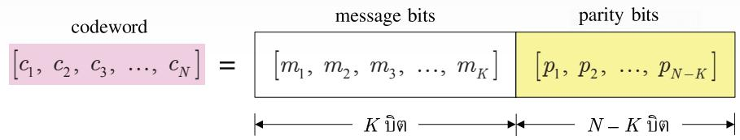  
รูปที่ 4.1 โครงสร้างของรหัสบล็อกเชิงเส้นแบบ (N, K)

รหัสบล็อกเชิงเส้นจะทำการเข้าและถอดรหัสข้อมูลทีละบล็อก โดยขนาดของบล็อกข้อมูล จะขึ้นอยู่กับลักษณะของแต่ละงานประยุกต์ ซึ่งอัตราส่วนของจำนวนบิตข่าวสารต่อจำนวนบิตของ คำรหัสจะเรียกว่า "อัตรารหัส (code rate)" R ซึ่งนิยามโดย

$$
R = { \frac { K } { N } }\tag{4.1}
$$

เมื่อ $0 < R \leq 1$ เสมอ สำหรับฮาร์ดดิสก์ไดรฟ์จะต้องการรหัสที่มีอัตรารหัสเข้าใกล้ค่า 1 เพื่อลด การสูญเสียพื้นที่ในสื่อบันทึกที่ต้องใช้เกบบิตพาริตี [43]

## 4.1.2 เมทริกซ์ตัวกำเนิด

พิจารณาบิตข่าวสาร $\mathbf { m } = [ m _ { 1 } , \ m _ { 2 } , \ . . . , \ m _ { K } ]$ ขนาด $1 \times K ( \stackrel { \cdot } { \ V } \Vdash \stackrel { \cdot \circ } { \ P } \ 0 \ 1 $ แนวนอนและ $K { \mathfrak { u } } { \mathfrak { u } } { \mathfrak { d } } { \mathfrak { Q } } ^ { \upsilon } )$ รหัสบล็อกเชิงเส้นแบบ (N, K) สร้างได้โดยการนำบิตข่าวสาร m มาคูณกับเมทริกซ์ตัวกำเนิด G (ที่มีสมาชิกเป็นเลข 0 หรือเลข 1) เท่านั้น ขนาด $K \times N$ ซึ่งอยู่ในรูป [2]

$$
\mathbf { G } _ { K \times N } = \left[ \mathbf { I } _ { K \times K } \mid \mathbf { P } _ { K \times ( N - K ) } \right] = \left[ { \begin{array} { c c c c c c c c c } { 1 } & { 0 } & { \cdots } & { 0 } & { p _ { 1 , 1 } } & { p _ { 1 , 2 } } & { \cdots } & { p _ { 1 , ( N - K ) } } \\ { 0 } & { 1 } & { \cdots } & { 0 } & { p _ { 2 , 1 } } & { p _ { 2 , 2 } } & { \cdots } & { p _ { 2 , ( N - K ) } } \\ { \vdots } & { \vdots } & { \ddots } & { \vdots } & { \vdots } & { \vdots } & { \ddots } & { \vdots } \\ { 0 } & { 0 } & { \cdots } & { 1 } & { p _ { K , 1 } } & { p _ { K , 2 } } & { \cdots } & { p _ { K , ( N - K ) } } \end{array} } \right]\tag{4.2}
$$

เมื่อ I คือเมทริกซ์เอกลักษณ์ขนาด $K { \times } K$ และ P คือเมทริกซ์พาริตีขนาด $K { \times } ( N { - } K )$ ที่สอดคล้อง กับบิตพาริตีในคำรหัส ซึ่งจะได้ผลลัพธ์เป็นคำรหัส $\mathbf { c } = [ c _ { 1 } , \ c _ { 2 } , \ . . . , \ c _ { N } ]$ ขนาด $1 \times N$ นั่นคือ

$$
\mathbf { c } = \mathbf { m } \mathbf { G } = \left[ m _ { 1 } \ m _ { 2 } \ \dots \ m _ { K } \ p _ { 1 } \ p _ { 2 } \ \dots \ p _ { N - K } \right]\tag{4.3}
$$

สมการ (4.3) แสดงให้เห็นว่ามีบิตข่าวสาร m ปรากฏอยูภายในคำรหัส c ซึ่งรหัสแบบนี้จะเรียกว่า “รหัสแบบมีระบบ (systematic code)" [2]

ตัวอย่างที่ 41 จงเข้ารหัสข้อมูล m = [101] และ $\mathbf { m } = [ 1 1 0 ]$ เมื่อกำหนดให้เมทริกซ์ตัวกำเนิด G มีค่าเท่ากับ

$$
\mathbf { G } = { \left[ \begin{array} { l l l l l l } { 1 } & { 0 } & { 0 } & { 1 } & { 1 } & { 0 } \\ { 0 } & { 1 } & { 0 } & { 0 } & { 1 } & { 1 } \\ { 0 } & { 0 } & { 1 } & { 1 } & { 0 } & { 1 } \end{array} \right] }\tag{4.4}
$$

วิธีทำ เมทริกซ์ตัวกำเนิด G นี้จะใช้เข้ารหัสบิตข้อมูลครั้งละ 3 บิต นั้นคือ m = [m1 m2 m3] เพราะฉะนั้นคำรหัสที่ได้จากการเข้ารหัสด้วยเมทริกซ์ G คือ

$$
\begin{array} { c } { \mathbf { c = m G = } \left[ m _ { 1 } \ m _ { 2 } \ m _ { 3 } \right] \left[ \begin{array} { l l l l l l } { 1 } & { 0 } & { 0 } & { 1 } & { 1 } & { 0 } \\ { 0 } & { 1 } & { 0 } & { 0 } & { 1 } & { 1 } \\ { 0 } & { 0 } & { 1 } & { 1 } & { 0 } & { 1 } \end{array} \right] } \\ { \mathbf = } \left[ m _ { 1 } \ m _ { 2 } \ m _ { 3 } \ m _ { 1 } \oplus m _ { 3 } \ m _ { 1 } \oplus m _ { 2 } \ m _ { 2 } \ \oplus m _ { 3 } \right]  \end{array}
$$

เมื่อ  คือตัวดำเนินการบวกแบบมอดุโลสอง (modulo-2 addition) หรือการทำ XOR (exclusive OR) ดังนั้นถ้า m = [101] จะได้ $\mathbf { c } = [ 1 0 1 0 1 1 ]$ และถ้า m = [110] จะได้ c = [110101] เป็นต้น

## 4.1.3 เมทริกซ์พาริตีเซ็ก

รหัสบล็อกเชิงเส้นแบบ (N, K) ยังสามารถถูกกำหนดด้วยเมทริกซ์ตรวจสอบภาวะคู่หรือดี่ (paritycheck matrix) หรือเรียกสันๆ ว่า '"เมทริกซ์พาริตีเช็ก" H ขนาด $( N - K ) { \times } N$ ได้ ซึ่งต้องสอดคล้อง กับความสัมพันธุ์ดังนี้

$$
\mathbf { H } \mathbf { G } ^ { \mathrm { T } } = \mathbf { 0 }\tag{4.5}
$$

ดังนั้นสำหรับคำรหัสใดๆ จะได้ว่า

$$
\mathbf { H } \mathbf { c } ^ { \mathrm { T } } = \mathbf { H } \mathbf { G } ^ { \mathrm { T } } \mathbf { m } ^ { \mathrm { T } } = \mathbf { 0 }\tag{4.6}
$$


เสมอ นอกจากนี้ยังพบว่าสมาชิกในแต่ละแนวนอนของเมทริกซ์ H ก็คือสมการพาริตีเช็ก (paritycheck equation) ซึ่งเป็นตัวกำหนดความสัมพันธ์ของบิตข้อมูล $\boldsymbol { c } _ { i } \left( { i = 1 , 2 , . . . , N } \right)$ ในคำรหัส โดยทั่วไปล้าเมทริกซ์ตัวกำเนิด G อยู่ในรูปแบบมีระบบ (systematic form) ตามสมการ (4.2) ดังนันเมทริกซ์พาริตีเช็กจะมีค่าเท่ากับ

$$
{ \mathbf { H } } _ { ( N - K ) \times N } = \Bigl [ { \mathbf { P } } ^ { \mathrm { { T } } } \mid { \mathbf { I } } _ { ( N - K ) \times ( N - K ) } \Bigr ]\tag{4.7}
$$

เมื่อ $( . ) ^ { \mathrm { T } }$ คือเครื่องหมายเมทริกซ์สลับเปลี่ยน (tranรpose matrix) เช่นเมทริกซ์ตัวกำเนิด G ใน สมการ (4.4) จัดให้อยูในรูปของเมทริกซ์ H ได้คือ

$$
\mathbf { H } = { \left[ \begin{array} { l l l l l l l } { 1 } & { 0 } & { 1 } & { 1 } & { 0 } & { 0 } \\ { 1 } & { 1 } & { 0 } & { 0 } & { 1 } & { 0 } \\ { 0 } & { 1 } & { 1 } & { 0 } & { 0 } & { 1 } \end{array} \right] }\tag{4.8}
$$

## 4.1.4 ระยะทางน้อยสุดของรหัส

การวัดสมรรถนะของรหัสบล็อกเชิงเส้นจะใช้น้ำหนักแฮมมิง (Hamming พeight) ของคำรหัสซึ่ง นิยามโดย

$$
w _ { H } ( \mathbf { c } ) \ = \mathring { \mathfrak { q } } { \eta } { \eta } \mathfrak { k } \mathfrak { j } \mathfrak { k } \mathring { \mathfrak { q } } \mathring { \eta } \mathfrak { k } \mathring { \mathfrak { q } } \mathring { \eta } { \eta } \mathfrak { k } \mathring { \mathfrak { t } } { \eta } \ \mathring { \eta } { \ } 1 \ \mathring { \eta } { \eta } \mathfrak { k } \mathring { \mathfrak { q } } \mathring { \eta } \mathfrak { k } \mathring { \mathfrak { q } } \ \mathbf { c }\tag{4.9}
$$

เช่นถ้า $\mathbf { c } = 1 0 0 1 0 0$ จะได้ $w _ { H } \left( \left[ 1 0 0 1 0 0 \right] \right) = 2$ เป็นต้น และระยะทางแฮมมิง (Hamming distance) ระหว่าง $\mathbf { c } _ { 1 }$ และ $\mathbf { c } _ { 2 }$ จะนิยามโดย

$$
d _ { H } \left( \mathbf { c } _ { 1 } , \mathbf { c } _ { 2 } \right) = w _ { H } \left( \mathbf { c } _ { 1 } - \mathbf { c } _ { 2 } \right) = \sum _ { i = 0 } ^ { N - 1 } \left( c _ { 1 , i } \neq c _ { 2 , i } \right)\tag{4.10}
$$

ตัวอย่างเช่นถ้า $\mathbf { c } _ { 1 } = 1 1 0 0 1 1$ และ ${ \bf c } _ { 2 } = 0 0 0 1 1 1$ จะได้ระยะทางแฮมมิง $d _ { H } \left( \mathbf { c } _ { 1 } , \mathbf { c } _ { 2 } \right) = 3$

ถ้าให้รหัส c มีทั้งหมด $2 ^ { k }$ คำรหัส ระยะทางแฮมมิงที่น้อยสุดระหว่างคำรหัสจะเรียกกัน ทั่วไปว่าระยะทางน้อยสุด (minimum distance) ของรหัส หรือ $d _ { \mathrm { m i n } }$ ซึ่งนิยามโดย

$$
d _ { \operatorname* { m i n } } = \operatorname* { m i n } _ { i \neq j } \left\{ d _ { H } \left( \mathbf { c } _ { i } , \mathbf { c } _ { j } \right) \right\}\tag{4.11}
$$

เมื่อ $\{ i , j \} = 0 , 1 , . . . , 2 ^ { k } - 1$ ดังนั้นเมือทราบระยะทางน้อยสุด $d _ { \mathrm { m i n } }$ ก็จะทำให้ทราบว่ารหัสบล็อก เชิงเส้นนี้มีความสามารถในการแก้ไข (correct) ข้อผิดพลาดเป็นจำนวน t บิต เมื่อ

$$
t = \frac { \left| d _ { \operatorname* { m i n } } - 1 \right| } { 2 }\tag{4.12}
$$

และมีความสามารถตรวจหา (detect) ข้อผิดพลาดได้จำนวน e บิต เมื่อ

$$
e = d _ { \mathrm { m i n } } - 1\tag{4.13}
$$

นอกจากนี้ระยะทางน้อยสดของรหัส $d _ { \mathrm { m i n } }$ ยังสามารถหาได้โดยตรงจากเมทริกซ์ตัวกำเนิด G และเมทริกซ์พาริตีเช็ก H ดังนี้ ระยะทางน้อยสุดของรหัสมีค่าเท่ากับ

น้ำหนักแฮมมิงน้อยสุดของสมาชิกในแนวนอนของเมทริกซ์G

จำนวนแนวตั้งน้อยสุดของเมทริกซ์ H ที่บวกกันแบบมอดุโลสองแล้วได้ผลลัพธ์เป็นศูนย์

## 4.1.5 การถอดรหัสบล็อกเชิงเส้น

ในทางปฏิบัติวิธีที่ใช้ในการถอดรหัสบล็อกเชิงเส้นคือ "การถอดรหัสแบบซินโดรม (รyndrome decoding)"[2] เมื่อเวกเตอร์ซินโดรม s นิยามโดย

$$
\mathbf { s } = \mathbf { H r } ^ { \mathrm { T } }\tag{4.14}
$$

เมื่อ $\mathbf { r } = \mathbf { c } \oplus \mathbf { e } = [ r _ { 0 } , \ r _ { 1 } , \ . . . , \ r _ { N - 1 } ]$ คือเวกเตอร์ของข้อมูลที่ต้องการถอดรหัส, c คือเวกเตอร์ ของคำรหัส, $\mathbf { e } = [ e _ { 0 } , \ e _ { 1 } , \ . . . , \ e _ { N ^ { - 1 } } ]$ คือเวกเตอร์ของข้อผิดพลาดโดยที่ $e _ { i } \in \{ 0 , 1 \}$ และ $e _ { i } = 1$ หมายถึงคำรหัสบิตที่i มีข้อผิดพลาด $( e _ { i } = 0$ หมายถึงคำรหัสบิตที่ ไม่มีข้อผิดพลาด) จากนั้น แทนค่า $\mathbf { r } = \mathbf { c } \oplus$ e ลงในสมการ (4.14) ก็จะได้

$$
{ \begin{array} { l } { \mathbf { s } = \mathbf { H ( \mathbf { c } \boldsymbol { \oplus } \mathbf { e } ) } ^ { \mathrm { T } } = \mathbf { H c } ^ { \mathrm { T } } \oplus \mathbf { H e } ^ { \mathrm { T } } } \\ { \mathbf { \simeq } } \\ { \mathbf { = H e } ^ { \mathrm { T } } } \end{array} }\tag{4.15}
$$

2 (นั่นคือ $\mathbf { r } = \mathbf { c } )$ จะมีค่าซินโดรมเท่ากับศูนย์เสมอ

โดยทั่วไปการถอดรหัสบล็อกเชิงเส้นจะอาศัยตารางค้นหา (lo0k-up table) [2] ซึ่งเป็น ญ ตารางที่แสดงความสัมพันธ์ระหว่างค่าซินโดรมและเวกเตอร์ e ตามสมการ (4.15) ดังนั้นเมื่อวงจร ภาครับต้องการถอดรหัสลำดับข้อมูล r ก็จะนำลำดับข้อมูล r มาคำนวณหาค่าซินโดรมตามสมการ (4.14) จากนั้นก็หาเวกเตอร์ e ที่สอดคล้องกับค่าซินโดรมที่ได้จากตารางค้นหา ซึงเมื่อได้เวกเตอร์ e ที่ต้องการแล้ว ก็ทำการถอดรหัสลำดับข้อมูล r จาก


$$
\hat { \mathbf { c } } = \mathbf { r } \oplus \mathbf { e }\tag{4.16}
$$

นั่นคือวิธีการถอดรหัสข้อมูลนี้สามารถช่วยแก้ไขข้อผิดพลาดที่เกิดขึ้นภายในลำดับข้อมูล r ได้โดย   
อัตโนมัติ อย่างไรก็ตามการถอดรหัสแบบซินโดรมจะใช้งานได้ดีกับระบบที่ใช้คำรหัสที่มีความยาว De   
น้อยและข้อผิดพลาดทีเกิดขึนในแต่ละคำรหัสมีจำนวนน้อย

เนื่องจากระบบการประมวลผลสัญญาณของฮาร์ดดิสก์ไดรฟ์จะทำการเข้ารหัสและถอดรหัส ข้อมูลครั้งละหนึ่งเซกเตอร์ (หรือ 4096 บิต) ดังนั้นถ้าบิตข่าวสารมีความยาว k = 4096 บิต จะได้ ว่าคำรหัสที่เป็นไปได้ทั้งหมดมีจำนวน 24096 แบบ ซึ่งเมื่อนำไปสร้างตารางค้นหาสำหรับค่าซินโดครม ที่เป็นไปได้ทั้งหมด ก็จะได้ตารางค้นหาที่มีขนาดใหญ่มาก (นำมาใช้จริงในทางปฏิบัติไม่ได้) ฉะนั้น การถอดรหัสแบบซินโดรมจึงไม่สามารถนำมาใช้จริงในฮาร์ดดิสก์ไดรฟ์ได้

## 4.2 พื้นฐานของรหัสแอลดีพีซี

รหัสแอลดีพีซี (LDPC) เป็นรหัสบล็อกเชิงเส้นประเภทหนึ่งที่ถูกกำหนดด้วยเมทริกซ์พาริตีเช็กที มีจำนวนเลข 1 น้อยมาก เมื่อเทียบกับขนาดของเมทริกซ์พาริตีเช็ก เพื่อให้มีระยะทางน้อยสุด $( d _ { \mathrm { m i n } } )$ ของรหัสสูง รหัสแอลดีพีซีถูกคิดค้นโดย Gallager [17] ในปี ค.ศ. 1960 ณ Massachusetts Institute of Techทology (MIT) ประเทศสหรัฐอเมริกา อย่างไรก็ตามในช่วงแรกนี้รหัสแอลดีพีซีไม่ได้รับ ความสนใจเท่าที่ควร เนื่องจากมีข้อจำกัดทางด้านการคำนวณ จากนั้นในปี ค.ศ. 1981 Tanทer [44] ได้นำเสนอการใช้กราฟแทนเนอร์ (Tanทer graph) แสดงความสัมพันธ์ที่เกิดขึ้นจากการเข้ารหัส ข้อมูล และสามารถนำมาใช้ช่วยในการถอดรหัสข้อมูลให้ง่ายขึ้นได้ด้วย และในปี ค.ศ. 1990 Mackey และ Neal [45] พบว่ารหัสแอลดีพีซีมีสมรรถนะการทำงานที่เข้าใกล้ขีดจำกัดของแชนนอนมากกว่า รหัสเทอร์โบ [3] จึงทำให้รหัสแอลดีพีซีเริ่มกลับมาเป็นที่สนใจอย่างแพร่หลายอีกครั้งหนึ่ง ซึ่งใน ครั้งนี้ก็มันใจได้ว่ารหัสแอลดีพีชีจะไม่ถูกลืมอีกอย่างแน่นอน เพราะในปัจุบันได้มีการนำรหัส แอลดีพีซีมาใช้ในหลายๆ งานประยุกต์ รวมทั้งในฮาร์ดดิสก์ไดรฟ์ด้วย

รหัสแอลดีพีซีคือรหัสพาริตีเช็ก (parity-check code) ที่ถูกกำหนดด้วยเมทริกซ์พาริตีเช็ก H แบบมากเลขศูนย์14 (sparse matrix) [17] ขนาด M×N โดยคำรหัส c จะมีความยาว N บิต และคำรหัสทังหมดต้องสอดคล้องกับสมการพาริตีเช็กตามสมการ (4.6) จำนวน Mสมการ โดยทั่วไปรหัสแอลดีพีซีแบ่งออกเป็นสองประเภทหลักคือ

รหัสแอลดีพีซีปรกติ (regular LDPC code) จะมีการกระจายตัวของเลขหนึ่งในเมทริกซ์ H เป็น แบบคงที่ เหมือนกับรหัสแอลดีพีซีของ Gallลger [17] นั้นคือแต่ละแนวนอนของเมทริกซ์ H จะมีจำนวนเลขหนึ่งเท่ากันทุกแนวนอน และแต่ละแนวตั้งของเมทริกซ์ H จะมีจำนวนเลขหนึ่ง เท่ากันทุกแนวตั้ง

รหัสแอลดีพีซีไม่สม่ำเสมอ (irregular LDPC code) [46] จะมีการกระจายตัวของเลขหนึ่งเป็น แบบไม่คงที่ ซึ่งโดยทั่วไปจะมีสมรรถนะดีกว่ารหัสแอลดีพีซีปรกติ

เพื่อให้ง่ายสำหรับการอธิบายหลักการทำงานของรหัสแอลดีพีซี ในที่นี้จะพิจารณาเฉพาะกรณีที แนวนอนทั้งหมดในเมทริกซ์ H เป็นอิสระต่อกันแบบเชิงเส้น (linearly independent) ซึ่งจะทำให้ บิตข่าวสารที่ใช้ในการเข้ารหัสมีความยาวเท่ากับ K = N - M บิต [4, 17]

## 4.2.1 รหัสแอลดีพีซีปรกติ

รหัสแอลดีพีซีปรกติแบบ (j, k) หมายถึงรหัสแอลดีพีซีที่ถูกกำหนดด้วยเมทริกซ์พาริตีเช็ก H ขนาด M×N ที่มีเลขหนึ่งจำนวน j ตัวในแต่ละแนวตั้ง และมีเลขหนึ่งจำนวน k ตัวในแต่ละแนวนอน เมื่อ j < k และ {j, k} << N ซึ่งหมายความว่าสมการพาริตีเช็กทุกสมการจะสัมพันธ์กับข้อมูลจำนวน k บิต และข้อมูลแต่ละบิตจะสัมพันธ์กับสมการพาริตีเช็กจำนวน  สมการเสมอ ดังนั้นเมทริกซ์ H จะมีเลขหนึงทังหมดเป็นจำนวน $M k = N j \stackrel { \circ } { \boldsymbol { \nabla } } \boldsymbol { \mathfrak { d } } \boldsymbol { \mathfrak { d } } ^ { 1 5 }$ และถ้าสมมติว่าแนวนอนทั่งหมดในเมทริกซ์ H เป็นอิสระต่อกันแบบเชิงเส้น ก็จะได้ว่าอัตรารหัสสำหรับรหัสแอลดีพีซีปรกติมีค่าเท่ากับ

$$
R = 1 - \frac { M } { N } = 1 - \frac { j } { k }\tag{4.17}
$$

โดยที่ $j < k$ เนืองจาก $R \leq 1$ เสมอ

ในการเลือกพารามิเตอร์ต่างๆ (M, N, j และ k) ที่ใช้กับรหัสแอลดีพีซีปรกติแบบ (j, k) จะอาศัยความสัมพันธุ์ที่ว่า Mk = Nj ดังนั้นจึงต้องเลือกพารามิเตอร์ N, j และ k ที่ทำให้

$$
M = \frac { N j } { k }\tag{4.18}
$$

เป็นเลขจำนวนเต็มเท่านั้น เช่น รหัสแอลดีพีซีปรกติแบบ (3, 4) จะต้องใช้กับระบบที่มี N = 1000 หรือ 1004 แต่ไม่สามารถใช้กับระบบที่มี N = 1002 ได้ เป็นต้น หรือรหัสแอลดีพีซีปรกติแบบ (2, 4) ที่มีเมทริกซ์พาริตีเช็ก H คือ

$$
\mathbf { H } _ { 5 \times 1 0 } = { \left[ \begin{array} { l l l l l l l l l l l } { 1 } & { 1 } & { 1 } & { 1 } & { 0 } & { 0 } & { 0 } & { 0 } & { 0 } & { 0 } \\ { 1 } & { 0 } & { 0 } & { 0 } & { 1 } & { 1 } & { 1 } & { 0 } & { 0 } & { 0 } \\ { 0 } & { 1 } & { 0 } & { 0 } & { 1 } & { 0 } & { 0 } & { 1 } & { 1 } & { 0 } \\ { 0 } & { 0 } & { 1 } & { 0 } & { 0 } & { 1 } & { 0 } & { 1 } & { 0 } & { 1 } \\ { 0 } & { 0 } & { 0 } & { 1 } & { 0 } & { 0 } & { 1 } & { 0 } & { 1 } & { 0 } & { 1 } \end{array} \right] }\tag{4.19}
$$

จะได้ว่า M = 5 และ N = 10 ซึ่งสอดคล้องกับสมการ (4.18) ดังนั้นรหัสแอลดีพีซีนี้จะใช้เข้ารหัส บิตข่าวสารขนาด 10 - 5 = 5 บิต และได้คำรหัสขนาด 10 บิต

เมทริกซ์พาริตีเช็ก H ในสมการ (4.19) บอกให้ทราบถึงความสัมพันธ์ระหว่างสมการ พาริตีเซ็กและบิตข้อมูล โดยแต่ละแนวนอนของเมทริกซ์ H จะเรียกว่า "โหนดเช็ก (check node)" และแต่ละแนวตังจะเรียกว่า "โหนดบิต (bit กอde)" เพราะฉะนันจะได้สมการพาริตีเช็กของแต่ละ โหนดเช็กดังนี้

โหนดเช็กตัวที่ 1

$$
c _ { 1 } + c _ { 2 } + c _ { 3 } + c _ { 4 } = 0\tag{4.20}
$$

โหนดเช็กตัวที่ 2

$$
c _ { 1 } + c _ { 5 } + c _ { 6 } + c _ { 7 } = 0\tag{4.21}
$$

โหนดเช็กตัวที่ 3

$$
c _ { 2 } + c _ { 5 } + c _ { 8 } + c _ { 9 } = 0\tag{4.22}
$$

โหนดเช็กตัวที่ 4

$$
c _ { 3 } + c _ { 6 } + c _ { 8 } + c _ { 1 0 } = 0\tag{4.23}
$$

โหนดเช็กตัวที่ 5

$$
c _ { 4 } + c _ { 7 } + c _ { 9 } + c _ { 1 0 } = 0\tag{4.24}
$$

รหัสพาริตีเช็กสามารถถูกกำหนดด้วยกราฟแทนเนอร์ (Taททer graph) [44, 50] ได้ซึ่งเป็นการแทน เมทริกซีพาริดีเช็ก H ขนาด M×N โดยที่กราฟแทนเนอร์จะมี N โหนดบิต (หนึ่งโหนดต่อหนึ่งบิต) และมี M โหนดเช็ก (หนึ่งโหนดต่อหนึ่งสมการพาริตีเช็ก) ในที่นี้จะใช้สัญลักษณ์วงกลม 0 แทน โหนดบิต และใช้สัญลักษณ์สี่เหลี่ยม แทนโหนดเช็ก เมื่อโหนดเช็กจะเชื่อมต่อกับโหนดบิตที เกี่ยวข้องกับสมการพาริตีเช็กของโหนดเช็กนั้น หรือกล่าวอีกนัยหนึ่งคือเส้นเชื่อม (edge) ระหว่าง โหนดเช็กลำดับที่ m กับโหนดบิตลำดับที่ n จะเกิดขึ้นก็ต่อเมื่อ $h _ { m , n } = 1$ นอกจากนี้กราฟแทนเนอร์ อาจเรียกว่า "กราฟสองส่วน (bipartite graph)" เพราะภายในกราฟมีโหนดเพียงสองแบบเท่านั้น ซ (นั่นคือโหนดบิตและโหนดเช็ก) และไม่มีเส้นเชื่อมระหว่างโหนดชนิดเดียวกัน รูปที่ 4.2 แสดงกราฟ แทนเนอร์สำหรับรหัสแอลดีพีซีปรกติแบบ (, k) = (2, 4) ที่มีเมทริกซ์พาริตีเช็ก H ตามสมการ (4.19) ซึ่งจะพบว่าแต่ละโหนดบิตมีเส้นเชื่อมจำนวน 2 เส้น (สอดคล้องกับ j = 2) และแต่ละโหนด เช็กมีเส้นเชื่อมจำนวน 4 เส้น (สอดคล้องกับ k = 4) นอกจากนี้ยังพบว่ากราฟแทนเนอร์ สอดคล้องกับสมการพาริตีเช็กทั้งหมดตามสมการ (4.20) - (4.24) เช่นกัน

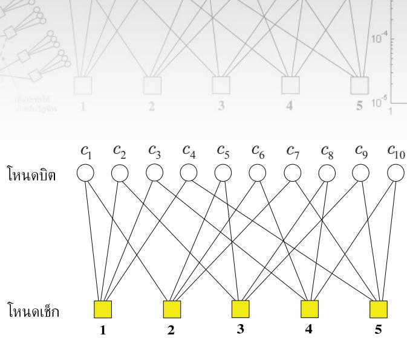  
รูปที่ 4.2 กราฟแทนเนอร์สำหรับรหัสแอลดีพีซีปรกติแบบ (2, 4) ที่มีเมทริกซ์ H ตามสมการ (4.19)

## 4.2.2 รหัสแอลดีพีซีไม่สม่ำเสมอ

รหัสแอลดีพีซีไม่สม่ำเสมอได้ถูกพัฒนาขึ้นมาในปี ค.ศ. 2001 โดย Richardson [46] โดยที่เมทริกซ์ พาริตีเช็ก H ขนาด M×N จะมีการกระจายตัวของเลขหนึ่งเป็นแบบไม่คงที่ นั่นคือจำนวนเลขหนึ่ง ในแต่ละแนวนอนและแต่ละแนวตั้งไม่จำเป็นต้องมีค่าเท่ากัน

ในทางปฏิบัติรหัสแอลดีพีซีไม่สม่ำเสมอจะถูกกำหนดด้วยพหุนามการแจกแจงระดับขั้น (degree distribution polynomial) ซึ่งบอกให้ทราบถึงจำนวนของเส้นเชื่อมของแต่ละโหนด พหุนาม การแจกแจงระดับขันของโหนดบิตมีค่าเท่ากับ $\rho ( x ) = \sum _ { i } \rho _ { i } x ^ { i }$ เมื่อ $\rho _ { i }$ คือจำนวนของโหนดบิต ที่มีระดับขั้นเท่ากับ i ในทำนองเดียวกันพหุนามการแจกแจงระดับขั้นของโหนดเช็กจะมีค่าเท่ากับ $\xi ( x ) = \sum _ { i } \xi _ { i } x ^ { i }$ เมื่อ ซี $\xi _ { i }$ คือจำนวนของโหนดเช็กที่มีระดับขั้นเท่ากับ i

นอกจากนี้สมรรถนะของรหัสแอลดีพีซีที่เป็นฟังก์ชันของการแจกแจงระดับขั้นของโหนด เช็กและของโหนดบิตสามารถถูกทำนายได้โดยใช้ทฤษฎีวิวัฒนาการของความหนาแน่น (density evoในtoก) [48] ซึ่งจะติดตามความหนาแน่นของความน่าจะเป็นของข่าวสารที่ส่งผ่านระหว่างโหนด เช็กและโหนดบิต โดยทั่วไปถ้าระบบทำงานที่ระดับ รNR สูงเพียงพอ จะพบว่าค่าเฉลี่ยของความ หนาแน่นมีค่าเข้าใกล้ค่าอนันต์ เมื่อจำนวนรอบของการถอดรหัสภายในวงจรถอดรหัสแอลดีพีซี เพิ่มขึ้น ซึ่งหมายความว่าวงจรถอดรหัสมีความมั่นใจสูงที่จะถอดรหัสข้อมูลได้อย่างถูกต้อง ในทาง ตรงกันข้ามถ้าระบบทำงานที่ระดับ รNR ต่ำๆ ค่าเฉลี่ยของความหนาแน่นจะลู่เข้าสู่ค่าคงตัวใดๆ ซึ่งหมายความว่าวงจรถอดรหัสแอลดีพีซีมีข้อบกพร่องในการถอดรหัสข้อมูล ดังนั้นค่า รNR ที่เป็น เส้นแบ่งขอบเขตของสมรรถนะของรหัสแอลดีพีซี(ระหว่างดีกับไม่ดี) จะเรียกว่า ขีดเริ่มเปลี่ยน (thresรhold)"สำหรับสมรรถนะของรหัส ดังนั้นรหัสแอลดีพีซีไม่สมำเสมอถูกออกแบบมาเพื่อให้ ค่าขีดเริ่มเปลี่ยนนี้เข้าใกล้ขีดจำกัดความจุของแชนนอน (Shaทnon capacity) [25] ให้มากที่สุด (มากกว่ารหัสแอลดีพีซีปรกติ) [49]

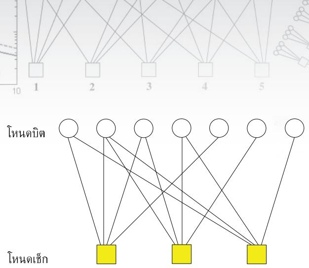  
รูปที่ 4.3 กราฟแทนเนอร์สำหรับรหัสแฮมมิงแบบ (7, 4) ในตัวอย่างที่ 4.2 4.2.3 XX#Et

ตัวอย่างที่ 4.2 พิจารณารหัสแฮมมิงแบบ (7, 4) ที่มีเมทริกซ์ตัวกำเนิดเท่ากับ

$$
\mathbf { G } = { \left[ \begin{array} { l l l l l l l } { 1 } & { 0 } & { 0 } & { 0 } & { 1 } & { 0 } & { 1 } \\ { 0 } & { 1 } & { 0 } & { 0 } & { 1 } & { 1 } & { 1 } \\ { 0 } & { 0 } & { 1 } & { 0 } & { 1 } & { 1 } & { 0 } \\ { 0 } & { 0 } & { 0 } & { 1 } & { 0 } & { 1 } & { 1 } \end{array} \right] }\tag{4.25}
$$

จงหาเมทริกซ์พาริตีเซ็ก H และวาดกราฟแทนเนอร์ของเมทริกซ์ H ที่ได้

วิธีทำ เนื่องจากเมทริกซ์ G มีโครงสร้างตามสมการ (4.2) ดังนั้นจึงสามารถหาเมทริกซ์ H ได้ จากสมการ (4.7) ดังนี้

$$
\mathbf { H } = { \left[ \begin{array} { l l l l l l l } { 1 } & { 1 } & { 1 } & { 0 } & { 1 } & { 0 } & { 0 } \\ { 0 } & { 1 } & { 1 } & { 1 } & { 0 } & { 1 } & { 0 } \\ { 1 } & { 1 } & { 0 } & { 1 } & { 0 } & { 0 } & { 1 } \end{array} \right] }\tag{4.26}
$$

และมีกราฟแทนเนอร์ตามรูปที่ 4.3 จากเมทริกซ์ H ในสมการ (4.26) จะพบว่ารหัสแฮมมิงแบบ (7, 4) สามารถนำมาใช้เป็นรหัสแอลดีพีซีไม่สม่ำเสมอได้

## 4.2.3 กฎของไฮเพอร์โบลิกแทนเจนต์

ถ้าให้ $\mathbf { c } = [ c _ { 1 } , \ c _ { 2 } , \ . . . , \ c _ { n } ]$ คือเวกเตอร์ของบิตข้อมูลจำนวน ท บิต เมือ $c _ { i } \in \{ 0 , 1 \}$ และนิยาม ฟังก์ชันพาริตี (parity function) $\Phi ( \mathbf { c } ) \in \{ 0 , 1 \}$ ดังน

$$
\Phi ( \mathbf { c } ) = c _ { 1 } \oplus c _ { 2 } \oplus . . . \oplus c _ { n }\tag{4.27}
$$

โดยที่  คือตัวดำเนินการบวกแบบมอดุโลสอง, $\Phi ( \mathbf { c } ) = 0$ หรือพาริตีคู่ (even parity) เมื่อเวกเตอร์ c มีผลรวมของเลขหนึ่งเป็นจำนวนคู่ และ $\Phi ( \mathbf { c } ) = 1$ หรือพาริตีดี่ (odd parity) เมื่อเวกเตอร์ c มีผลรวมของเลขหนึงเป็นจำนวนดี นอกจากนีจะนิยามค่า LLR แบบอะพิริออริ (a priori LLR) ของฟังก์ชันพาริตี A(c) ให้มีค่าเท่ากับ

$$
\lambda _ { \Phi ( \mathbf { c } ) } = \log \left( \frac { \mathrm { P r } \big [ \Phi \big ( \mathbf { c } \big ) = 1 \big ] } { \mathrm { P r } \big [ \Phi \big ( \mathbf { c } \big ) = 0 \big ] } \right)\tag{4.28}
$$

ซึ่งจะได้ว่า

$$
\Phi ( \mathbf { c } ) = \left\{ \begin{array} { l l } { 1 , } & { \mathrm { i f } \lambda _ { \Phi ( \mathbf { c } ) } \geq 0 } \\ { 0 , } & { \mathrm { i f } \lambda _ { \Phi ( \mathbf { c } ) } < 0 } \end{array} \right.\tag{4.29}
$$

ดังนั้นถ้าสมมุติว่าบิตข้อมูลทั้งหมดเป็นอิสระต่อกัน จะได้ว่าค่า $\lambda _ { \Phi ( \mathbf { c } ) }$ เป็นไปตามกฎของ ไฮเพอร์โบลิกแทนเจนต์ (tanh rule) ดังนี้ [51, 52]

$$
\operatorname { t a n h } \left( { \frac { - \lambda _ { \Phi ( \mathbf { c } ) } } { 2 } } \right) = \prod _ { i = 1 } ^ { n } \operatorname { t a n h } \left( { \frac { - \lambda _ { i } } { 2 } } \right)\tag{4.30}
$$

(ดูภาคผนวก ข สำหรับคำอธิบาย) เมื่อ $\lambda _ { i } = \log \left( \operatorname* { P r } \ [ c _ { i } = 1 ] / \operatorname* { P r } \ [ c _ { i } = 0 ] \right)$ จากนั้นแก้สมการ (4.30) ก็จะได้

$$
\lambda _ { \Phi ( \mathbf { c } ) } = - 2 \operatorname { t a n h } ^ { - 1 } \left\{ \prod _ { i = 1 } ^ { n } \operatorname { t a n h } \left( { \frac { - \lambda _ { i } } { 2 } } \right) \right\}\tag{4.31}
$$

หรือจัดให้อยู่ในอีกรูปแบบหนึ่งได้คือ

$$
\lambda _ { \Phi ( \mathbf { c } ) } = - \prod _ { i = 1 } ^ { n } \mathrm { s i g n } \left( - \lambda _ { i } \right) \times f \left( \sum _ { i = 1 } ^ { n } f \left( \left| \lambda _ { i } \right| \right) \right)\tag{4.32}
$$

(ดูภาคผนวก ค สำหรับคำอธิบาย) โดยที่

$$
f \left( x \right) = \log \left( \frac { e ^ { x } + 1 } { e ^ { x } - 1 } \right) = - \log \left( \operatorname { t a n h } \left( \frac { x } { 2 } \right) \right)\tag{4.33}
$$

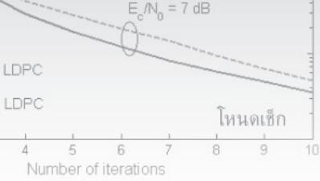

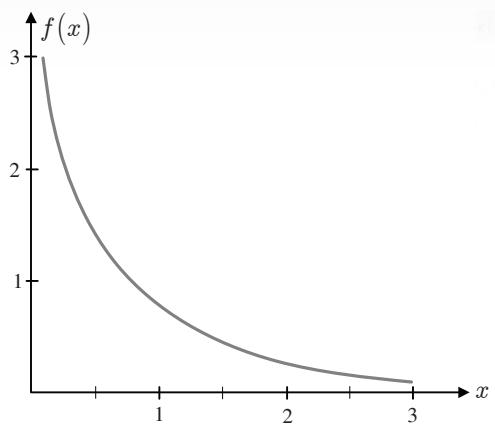  
รูปที่ 4.4 ฟังก์ชัน f(x) ในสมการ (4.33)

ในทางปฏิบัติสมการ (4.32) นิยมนำมาใช้สร้างเป็นฮาร์ดแวร์มากกว่าสมการ (4.30) หรือ (4.31) เพราะใช้เพียงผลรวม (summation) แทนที่จะใช้ผลคูณ (product) ของข้อมูลจำนวน ท พจน์ อย่างไรก็ตามสมการ (4.30) นิยมใช้ในการวิเคราะห์สมรรถนะของวงจรถอดรหัสแอลดีพีซี นอกจากนี้ ฟังก์ชัน $f ( x )$ ในสมการ (4.33) มีคุณสมบัติที่นาสนใจคือ $f ( x )$ เป็นฟังก์ชันบวกและมีค่าลดลง อย่างสมำเสมอสำหรับ $x > 0$ โดยที่ $f \left( 0 \right) = \infty$ และ $f ( \infty ) = 0$ ดังแสดงในรูปที่ 4.4 นอกจากนี้ $f ( x )$ ยังมีตัวผกผัน (inverse) ด้วย นั้นคือ $f ( f ( x ) ) = x$ สำหรับทุกค่า $x > 0$

กำหนดให้ $\hat { \mathbf { c } } = \left[ \hat { c } _ { 1 } , \hdots , \hat { c } _ { n } \right]$ คือค่าประมาณของ c ที่เป็นไปได้มากสุด โดยที่ $\hat { c } _ { i } = 1$ เมื่อ $\lambda _ { i } \geq 0$ และ $\hat { c } _ { i } = 0$ เมื่อ $\lambda _ { i } < 0$ ดังนั้นเครื่องหมายของ $\lambda _ { \Phi ( \mathbf { c } ) }$ ซึ่งเป็นตัวระบุค่าที่เป็นไปได้มากสุด ของฟังก์ชันพาริตี $\Phi ( \mathbf { c } )$ จะถูกกำหนดด้วย $\Phi ( { \hat { \mathbf { c } } } )$

$$
\mathrm { s i g n } \Big ( \lambda _ { \Phi ( \mathbf { c } ) } \Big ) = - \prod _ { i = 1 } ^ { n } \mathrm { s i g n } \big ( - \lambda _ { i } \big ) = - \big ( - 1 \big ) ^ { \Phi ( \hat { \mathbf { c } } ) } = \big ( - 1 \big ) ^ { \Phi ( \hat { \mathbf { c } } ) + 1 }\tag{4.34}
$$

ซึ่งบอกให้ทราบว่า $\Phi ( \mathbf { c } )$ จะเป็นพาริตีคู่ ก็ต่อเมื่อจำนวนของ $\lambda _ { i } \geq 0$ เป็นเลขคู่16 และ $\Phi ( \mathbf { c } )$ จะเป็น พาริตีคี่ ก็ต่อเมื่อจำนวนของ $\lambda _ { i } \geq 0$ เป็นเลขคี่ นอกจากนี้ขนาดของ $\lambda _ { \Phi ( \mathbf { c } ) }$ จะเป็นตัววัดความน่าเชื่อถือ ของค่าพาริตี $\Phi ( \mathbf { c } )$ ที่คำนวณได้ ซึ่งหาได้จาก 1พ

$$
\left| \lambda _ { \Phi ( \mathbf { c } ) } \right| = f \bigl ( \sum _ { i } f \bigl ( \bigl | \lambda _ { i } \bigr | \bigr ) \bigr )\tag{4.35}
$$

ถ้าสมมุติว่าบิตข้อมูลตัวที่ k ของ c (หรือ $c _ { k } )$ มีความน่าจะเป็นที่จะเป็น 1 และ 0 เท่ากัน จะได้ว่า $\lambda _ { k } = 0$ ดังนั้นพจน์ที่ k ในผลรวม $\sum _ { i } f \left( \left| \lambda _ { i } \right| \right)$ ก็จะมีค่าเป็นค่าอนันต์ ซึ่งส่งผลให้ผลรวมทั้งหมด ในสมการ (4.35) มีค่าเป็นค่าอนันต์ด้วย

เนืองจาก สู $f ( \infty ) = 0$ ดังนันค่า 0 $\lambda _ { \Phi ( \mathbf { c } ) }$ ในสมการ (4.32) จะมีค่าเท่ากับศูนย์เสมอ ถ้ามีบิต ยรู้ ข้อมูลใดมีค่า $\lambda _ { i } = 0$ ทังนี้เป็นเพราะว่าถ้ามีบิตข้อมูลเพียงหนึงบิตที่มีความน่าจะเป็นที่จะเป็น 1 และ 0 เท่ากัน ก็จะทำให้ค่าพาริตีของเวกเตอร์ข้อมูล C มีความน่าจะเป็นที่จะเป็น 1 และ 0 เท่ากัน ด้วย (โดยไม่ต้องคำนึงถึงบิตอื่นๆ) ดังนั้นถ้ามีบิตข้อมูลใดมีความน่าเชื่อถือน้อยสุดเมื่อเทียบกับบิต ข้อมูลอื่นๆ ผลรวมในสมการ (4.35) จะขึ้นอยู่กับค่า $f \left( \left| \lambda _ { \operatorname* { m i n } } \right| \right)$ เมื่อ $\left| { \lambda _ { \operatorname* { m i n } } } \right| = \operatorname* { m i n } _ { i } \left\{ \left| \lambda _ { i } \right| \right\}$ ซึ่งทำให้ สมการ (4.35) ลดรูปได้เป็น

$$
\left| \lambda _ { \Phi ( \mathbf { c } ) } \right| = f \left( \sum _ { i } f \left( \left| \lambda _ { i } \right| \right) \right) \approx f \left( f \left( \left| \lambda _ { \operatorname* { m i n } } \right| \right) \right) = \left| \lambda _ { \operatorname* { m i n } } \right|\tag{4.36}
$$

แทนค่าสมการ (4.36) ลงในสมการ (4.32) จะได้

$$
\begin{array} { r } { \lambda _ { \Phi ( \mathbf { c } ) } = \left( - 1 \right) ^ { \Phi ( \hat { \mathbf { c } } ) + 1 } \left| \lambda _ { \operatorname* { m i n } } \right| } \end{array}\tag{4.37}
$$

โดยสรุปแล้วในการหาค่า $\lambda _ { \Phi ( \mathbf { c } ) }$ สามารถใช้ได้ทั้งสมการ (4.31) หรือ (4.32) อย่างไรก็ตามถ้าต้องการ ลดความซับซ้อนของอัลกอริทึมการถอดรหัสข้อมูล ก็สามารถใช้สมการ (4.37) แทนได้

## 4.3การเข้ารหัสแอลดีพีซี

พิจารณารหัสแบบมีระบบ [2] ซึ่งจะเข้ารหัสข้อมูล $\mathbf { m } = [ m _ { 1 } , \ m _ { 2 } , \ . . . , \ m _ { K } ]$ จำนวน K บิต แล้วได้ คำรหัส $\mathbf { c } = [ c _ { 1 } , \ c _ { 2 } , \ . . . , \ c _ { N } ]$ จำนวน N บิต โดยมีโครงสร้างตามสมการ (4.3) นั้นคือ

$$
\mathbf { c } = [ \mathbf { m } \mid \mathbf { p } ] = \left[ m _ { 1 } \ m _ { 2 } \ \dots \ m _ { K } \ p _ { 1 } \ p _ { 2 } \ \dots \ p _ { N - K } \right]\tag{4.38}
$$

โดยที่ $\mathbf { p } = [ p _ { 1 } , p _ { 2 } , . . . , p _ { N - K } ]$ คือบิตพาริตีจำนวน $N - K$ บิต ดังนั้นเมื่อใช้รหัสแบบมีระบบ สิ่งที่ ต้องทำในการเข้ารหัสข้อมูลก็คือการหาค่าบิตพาริตี p และเมื่อได้ค่า p แล้ว ก็นำมาต่อเข้ากับข้อมูล m ตามสมการ (4.38) ก็จะได้คำรหัส c ตามทีต้องการ


โดยทั่วไปรหัสแอลดีพีซีจะถูกกำหนดด้วยเมทริกซ์พาริตีเช็ก H ขนาด M×N ดังนั้นใน หัวข้อนี้จะแสดงการหาบิตพาริตี p จากเมทริกซ์ H ดังนี้ หลังจากทีได้เมทริกซ์ H ที่ต้องการแล้ว ก็จะอาศัยความสัมพันธ์ตามสมการ (4.6) ในการหาค่า p นั้นคือ

$$
\mathbf { H } \mathbf { c } ^ { \mathrm { T } } = \mathbf { 0 } _ { M \times 1 }\tag{4.39}
$$

เมื่อ ${ \bf 0 } _ { M \times 1 }$ คือเวกเตอร์ค่าศูนย์ขนาด M×1 ถ้าจัดเมทริกซ์ H ให้อยู่ในรูป

$$
\mathbf { H } = \left[ \mathbf { H } _ { 1 } \mid \mathbf { H } _ { 2 } \right]\tag{4.40}
$$

เมื่อ $\mathbf { H } _ { 1 }$ มีขนาด M×K และ $\mathbf { H } _ { 2 }$ มีขนาด $M { \times } ( N - K )$ ดังนันแทนค่าสมการ (4.38) และ (4.40) ลงในสมการ (4.39) จะได้

$$
\left[ \mathbf { H } _ { 1 } ~ \mathbf { H } _ { 2 } \right] { \left[ \begin{array} { l } { \mathbf { m } ^ { \mathrm { T } } } \\ { \mathbf { p } ^ { \mathrm { T } } } \end{array} \right] } = \mathbf { 0 }
$$

$$
\mathbf { H } _ { 1 } \mathbf { m } ^ { \mathrm { T } } + \mathbf { H } _ { 2 } \mathbf { p } ^ { \mathrm { T } } = \mathbf { 0 }
$$

$$
\begin{array} { r l } { \mathbf { p } ^ { \mathrm { T } } = \left( \mathbf { H } _ { 2 } \right) ^ { - 1 } \mathbf { H } _ { 1 } \mathbf { m } ^ { \mathrm { T } } } & { { } ( \mathfrak { A } \ni \mathfrak { Q } _ { \mathbf { q } } ^ { \mathrm { T } } \widehat { \mathbf { q } } \widehat { } \widehat { } \widehat { } \mathfrak { A } \widehat { } \mathfrak { Q } \mathfrak { q } ) } \end{array}\tag{4.41}
$$

เนื่องจาก $\mathbf { H } _ { 2 }$ เป็นเมทริกซ์จัตรัสจึงสามารถหาค่าผกผันได้ (เนื่องจาก M = N - K)

ตัวอย่างที่ 4.3 จากตัวอย่างที่ 4.1 จงเข้ารหัสข้อมูล m = [101] และ m = [110] โดยใช้เมทริกซ์ พาริตีเช็ก H ซึ่งสอดคล้องกับเมทริกซ์ตัวกำเนิด G ในสมการ (4.4)

วิธีทำ อาศัยสมการ (4.7) ทำให้สามารถหาเมทริกซ์ H ได้จากเมทริกซ์ G ดังนี้

$$
\mathbf { H } = \left[ \mathbf { H } _ { 1 } \ \mathbf { H } _ { 2 } \right] = \left[ { 1 } \begin{array} { l l l } { 1 } & { 0 } & { 1 } \\ { 1 } & { 1 } & { 0 } \\ { 0 } & { 1 } & { 1 } \end{array} \right] \left[ \begin{array} { l l l } { 1 } & { 0 } & { 0 } \\ { 0 } & { 1 } & { 0 } \\ { 0 } & { 0 } & { 1 } \end{array} \right]
$$

ดังนั้นบิตพาริตีสำหรับ m = [101] หาได้จากสมการ (4.41) นั้นคือ e

$$
\mathbf { p } ^ { \mathrm { { T } } } = { \left[ \begin{array} { l l l } { 1 } & { 0 } & { 0 } \\ { 0 } & { 1 } & { 0 } \\ { 0 } & { 0 } & { 1 } \end{array} \right] } ^ { - 1 } { \left[ \begin{array} { l l l } { 1 } & { 0 } & { 1 } \\ { 1 } & { 1 } & { 0 } \\ { 0 } & { 1 } & { 1 } \end{array} \right] } { \left[ \begin{array} { l } { 1 } \\ { 0 } \\ { 1 } \end{array} \right] } = { \left[ \begin{array} { l } { 0 } \\ { 1 } \\ { 1 } \end{array} \right] }
$$

เพราะฉะนัน $\mathbf { c } = [ \mathbf { m \nabla p } ] = [ 1 0 1 \mathbf { 0 1 1 } ]$ ซึ่งก็ตรงกับผลลัพธ์ที่ได้ในตัวอย่างที่ 4.1 ในทำนองเดียวกันบิตพาริตีสำหรับ $\mathbf { m } = [ 1 1 0 ]$ หาได้โดย

$$
\mathbf { p } ^ { \mathrm { { T } } } = { \left[ \begin{array} { l l l } { 1 } & { 0 } & { 0 } \\ { 0 } & { 1 } & { 0 } \\ { 0 } & { 0 } & { 1 } \end{array} \right] } ^ { - 1 } { \left[ \begin{array} { l l l } { 1 } & { 0 } & { 1 } \\ { 1 } & { 1 } & { 0 } \\ { 0 } & { 1 } & { 1 } \end{array} \right] } { \left[ \begin{array} { l } { 1 } \\ { 1 } \\ { 0 } \end{array} \right] } = { \left[ \begin{array} { l } { 1 } \\ { 0 } \\ { 1 } \end{array} \right] }
$$

เพราะฉะนั้น $\mathbf { c } = [ \mathbf { m \nabla p } ] = [ 1 1 0 1 0 1 ]$ ซึ่งก็ตรงกับผลลัพธ์ที่ได้ในตัวอย่างที่ 4.1 เช่นกัน

ตัวอย่างที่ 4.3 แสดงให้เห็นว่าการเข้ารหัสแอลดีพีซีสำหรับรหัสแบบมีระบบสามารถทำได้ โดยการหาค่าบิตพาริตี p ตามสมการ (4.41) จากนั้นก็แทนค่าลงในสมการ (4.38) ก็จะได้คำรหัส c ตามที่ต้องการ สำหรับสมการ (4.39) จะใช้ในการตรวจสอบความถูกต้องของคำรหัสที่ได้

## 4.4 การถอดรหัสแอลดีพีซี

การเข้ารหัสแอลดีพีซีมีผลทำให้ข้อมูลแต่ละบิตมีความสัมพันธ์กันตามโครงสร้างของเมทริกซ์พาริตี เช็ก H ดังนั้นการถอดรหัสแอลดีพีซีก็จะอาศัยความสัมพันธ์เหล่านี้มาช่วยในการถอดรหัสข้อมูล โดยทั่วไปรหัสแอลดีพีซีจะถูกถอดรหัสด้วยอัลกอริทึมการผ่านข่าวสาร17 (MPA: meรsage passing algorithm) หรือในที่นี้จะเรียกสั้นๆ ว่า "อัลกอริทึม MP"[4, 17] โดยเริ่มต้นจากการสร้างสมการ พาริตีเช็กจากเมทริกซ์ H แล้วก็เขียนเป็นกราฟแทนเทอร์ จากนั้นก็ทำการถอดรหัสบิตข้อมูลตาม ขันตอนของอัลกอริทึม MP

## 4.4.1 พื้นฐานในการถอดรหัสแอลดีพีซี

พิจารณาช่องสัญญาณในรูปที่ 4.5 เมื่อลำดับข้อมูลอินพุต $m _ { n } \in \{ 0 , 1 \}$ จำนวน K บิต ถูกเข้ารหัส ด้วยรหัสแอลดีพีซีปรกติแบบ (, k) ทำให้ได้เป็นคำรหัส $c _ { n } \in \{ 0 , 1 \}$ จำนวน N บิต จากนั้นก็ส่ง เข้าไปในวงจรเข้าคู่ (mapper) เพื่อแปลงเป็นลำดับข้อมูล $s _ { n } \in \{ \pm 1 \}$ ดังนั้นสัญญาณที่วงจรภาครับ ได้รับคือ

$$
r _ { n } = s _ { n } + w _ { n }\tag{4.42}
$$

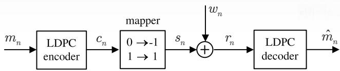  
รูปที่ 4.5 ช่องสัญญาณ AGพN ที่มีการเข้าและถอดรหัสแอลดีพีซี

เมื่อ $s _ { n } = 2 c _ { n } - 1$ คือข้อมูลเอาต์พุตของช่องสัญญาณ, $w _ { n }$ คือสัญญาณรบกวนเกาส์สีขาวแบบบวก (AพGN) ที่มีค่าเฉลี่ยเท่ากับศูนย์และความแปรปรวนเท่ากับ $\sigma ^ { 2 }$ หรือเขียนเป็นสัญลักษณ์ได้คือ $w _ { n } \sim \mathcal N \big ( 0 , \sigma ^ { 2 } \big )$ จากนันวงจรถอดรหัสแอลดีพีซีจะต้องถอดรหัสข้อมูล $r _ { n }$ เพื่อให้ได้ผลลัพธ์เป็น ค่าประมาณของข้อมูลอินพุต $m _ { n }$ (หรือ $\hat { m } _ { n } )$ ที่ทำให้มีข้อผิดพลาดน้อยสุด

ในที่นี้จะพิจารณาเฉพาะกรณีที่รหัสแอลดีพีซีที่ใช้เป็นรหัสแบบมีระบบ (systematic code) ซึ่งทำให้คำรหัสที่ได้มีโครงสร้างตามสมการ (4.3) นั่นคือค่า $m _ { i } = c _ { i }$ สำหรับ $1 \leq i \leq K$ ถ้าให้ m $\mathbf { \Omega } = [ m _ { 1 } , \ m _ { 2 } , \ . . . , \ m _ { K } ]$ คือลำดับข้อมูลอินพุต, $\mathbf { c } = [ c _ { 1 } , \ c _ { 2 } , \ . . . , \ c _ { N } ]$ คือคำรหัส, และ $\mathbf { r } = [ r _ { 1 } , ~ r _ { 2 }$ $\dots , \ r _ { N } ]$ คือเวกเตอร์ของข้อมูลที่วงจรภาครับได้รับ ดังนั้นวงจรภาครับแบบอะโพสเทอริออริสูงสุด (MAP: maximum a posteriori) จะตัดสินใจเลือกค่า $c$ ที่ทำให้ความน่าจะเป็นอะโพสเทอริออริ (APP: a posteriori probability) หรือ $\operatorname* { P r } [ c _ { n } = c \mid \mathbf { r } ]$ มีค่าสูงสุดสำหรับแต่ละเวลา ท นันคือวงจร ภาครับแบบ MAP จะคำนวณหาค่า LLR แบบอะโพสเทอริออริ $\lambda _ { n }$ จาก

$$
\lambda _ { n } = \log \left( \frac { \mathrm { P r } \left[ c _ { n } = 1 \mid \mathbf { r } \right] } { \mathrm { P r } \left[ c _ { n } = 0 \mid \mathbf { r } \right] } \right) { = } \log \left( \frac { \mathrm { P r } \left[ c _ { n } = 1 \mid r _ { n } ; \mathbf { r } _ { i \neq n } \right] } { \mathrm { P r } \left[ c _ { n } = 0 \mid r _ { n } ; \mathbf { r } _ { i \neq n } \right] } \right)\tag{4.43}
$$

และทำการตัดสินใจ $\hat { c } _ { n } = 1$ เมื่อ $\lambda _ { n } \geq 0$ และ $\hat { c } _ { n } = 0$ เมื่อ $\lambda _ { n } < 0$ โดยที่พารามิเตอร์ ${ \bf r } _ { i \neq n }$ คือ เวกเตอร์ของลำดับข้อมูลที่วงจรภาครับได้รับทั้งหมด ยกเว้นข้อมูลตัวที $i = n$ อาศัยกฎของเบส์ ตัวเศษในสมการ (4.43) สามารถจัดรูปใหม่ได้เป็น

$$
\begin{array} { r l } & { \mathrm { P r } \big [ c _ { n } = 1 \big | r _ { n } ; \mathbf { r } _ { i \neq n } \big ] = \frac { p \big ( r _ { n } ; c _ { n } = 1 ; \mathbf { r } _ { i \neq n } \big ) } { p \big ( r _ { n } ; \mathbf { r } _ { i \neq n } \big ) } } \\ & { \qquad = \frac { p \big ( r _ { n } | c _ { n } = 1 ; \mathbf { r } _ { i \neq n } \big ) p \big ( c _ { n } = 1 ; \mathbf { r } _ { i \neq n } \big ) } { p \big ( r _ { n } | \mathbf { r } _ { i \neq n } \big ) p \big ( \mathbf { r } _ { i \neq n } \big ) } } \\ & { \qquad = \frac { p \big ( r _ { n } | c _ { n } = 1 \big ) \mathrm { P r } \big [ c _ { n } = 1 | \mathbf { r } _ { i \neq n } \big ] } { p \big ( r _ { n } | \mathbf { r } _ { i \neq n } \big ) } } \end{array}\tag{4.44}
$$

โดยที่ $p { \big ( } r _ { n } | c _ { n } = c { \big ) }$ คือฟังก์ชันความหนาแน่นความน่าจะเป็นแบบมีเงื่อนไข (conditioกลl probability density function) ของข้อมูล $r _ { n }$ เมื่อกำหนดบิตข้อมูล $c _ { n } = c \in \{ 0 , 1 \}$ มาให้ และสมการ (4.44) มาจากความจริงที่ว่าถ้ากำหนด $c _ { n }$ มาให้ ค่า $r _ { n }$ จะเป็นอิสระจาก ${ \bf r } _ { i \neq n }$ ในทำนองเดียวกัน ตัวส่วนในสมการ (4.43) ก็สามารถจัดรูปใหม่เหมือนสมการ (4.44) ได้เป็น

$$
\operatorname* { P r } \bigl [ c _ { n } = 0 \mid r _ { n } ; \mathbf { r } _ { i \neq n } \bigr ] = \frac { p \left( r _ { n } \mid c _ { n } = 0 \right) \operatorname* { P r } \bigl [ c _ { n } = 0 \mid \mathbf { r } _ { i \neq n } \bigr ] } { p \left( r _ { n } \mid \mathbf { r } _ { i \neq n } \right) }\tag{4.45}
$$

แทนค่าสมการ (4.44) และ (4.45) ลงในสมการ (4.43) จะได้

$$
\begin{array} { r l } & { \lambda _ { n } = \log \left( \frac { p \left( r _ { n } \mid c _ { n } = 1 \right) \operatorname* { P r } \left[ c _ { n } = 1 \mid \mathbf { r } _ { i \neq n } \right] } { p \left( r _ { n } \mid c _ { n } = 0 \right) \operatorname* { P r } \left[ c _ { n } = 0 \mid \mathbf { r } _ { i \neq n } \right] } \right) } \\ & { \quad = \log \left( \frac { p \left( r _ { n } \mid c _ { n } = 1 \right) } { p \left( r _ { n } \mid c _ { n } = 0 \right) } \right) + \log \left( \frac { \operatorname* { P r } \left[ c _ { n } = 1 \mid \mathbf { r } _ { i \neq n } \right] } { \operatorname* { P r } \left[ c _ { n } = 0 \mid \mathbf { r } _ { i \neq n } \right] } \right) } \end{array}\tag{4.46}
$$

$$
= { \frac { 2 } { \sigma ^ { 2 } } } r _ { n } + \log \left( { \frac { \operatorname* { P r } \left[ c _ { n } = 1 \mid \mathbf { r } _ { i \neq n } \right] } { \operatorname* { P r } \left[ c _ { n } = 0 \mid \mathbf { r } _ { i \neq n } \right] } } \right)\tag{4.47}
$$

ซี เมื่อ

$$
p \left( r _ { n } \mid c _ { n } \right) = { \frac { 1 } { { \sqrt { 2 \pi \sigma ^ { 2 } } } } } \exp \left( { \frac { - \left( r _ { n } - 2 c _ { n } + 1 \right) ^ { 2 } } { 2 \sigma ^ { 2 } } } \right)\tag{4.48}
$$

คือความน่าจะเป็นของตัวแปรสุ่มที่มีการแจกแจงแบบเกาส์เซียน สมการ (4.47) บอกให้ทราบว่า พจน์แรกทางด้านขวามือคือ "ข่าวสารอินทรินซิก (intriกnรic information)"ซึ่งมาจากข้อมูลที่วงจร ภาครับได้รับตัวที่ n (นั่นคือ $r _ { n } )$ และพจน์สองทางด้านขวามือคือ "ข่าวสารเอกซ์ทรินซิก (extrinsic information)" ของบิตข้อมูลตัวที่ n (นั่นคือ $c _ { n } )$ ซึ่งได้มาจากข้อมูลทั้งหมดที่วงจรภาครับได้รับ (ยกเว้นข้อมูลตัวที่ n) นอกจากนี้จะเห็นได้ว่าข่าวสารอินทรินซิกเป็นสัดส่วนกับข้อมูลที่วงจรภาครับ ได้รับตัวที่n หรือ $r _ { n }$ โดยค่าคงตัว $2 / \sigma ^ { 2 }$ จะเรียกว่าความน่าเชื่อถือของช่องสัญญาณ (channel reliability) [51]

ตัวอย่างที่4.4 พิจารณาช่องสัญญาณสมมาตรแบบไบนารี (BรC: binary symmetric channel) ในรูปที่ 4.6 จงแสดงว่าค่า LLR แบบอะโพสเทอริออริของช่องสัญญาณเป็นไปตามสมการ (4.47)

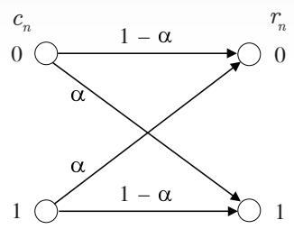  
รูปที่ 4.6 ช่องสัญญาณสมมาตรแบบไบนารี (BSC)

ยกเว้นความน่าเชื่อถือของช่องสัญญาณจะมีค่าเท่ากับ 1og $\left( \left( 1 - \alpha \right) / \alpha \right)$ แทนที่จะเป็น $2 / \sigma ^ { 2 }$ เมื่อ α คือความน่าจะเป็นตัดข้าม (crossover probability)

วิธีทำจากช่องสัญญาณในรูปที่ 4.6 จะได้ว่า $p \big ( r _ { n } = 0 \mid c _ { n } = 0 \big ) = 1 - \alpha , p \big ( r _ { n } = 0 \mid c _ { n } = 1 \big )$ $= \alpha , p \big ( r _ { n } = 1 | c _ { n } = 0 \big ) = \alpha$ , และ $p \big ( r _ { n } = 1 | c _ { n } = 1 \big ) = 1 - \alpha$ ดังนั้นจะได้ว่า

$$
\begin{array} { c l c r } { { \displaystyle p \big ( r _ { n } \mid c _ { n } = 1 \big ) = \sum _ { i = \{ 0 , 1 \} } \big ( i \big ) p \big ( r _ { n } = i \mid c _ { n } = 1 \big ) } }  \\ { { } } & { { } } \\ { { } } & { { = \big ( 0 \big ) p \big ( r _ { n } = 0 \mid c _ { n } = 1 \big ) + \big ( 1 \big ) p \big ( r _ { n } = 1 \mid c _ { n } = 1 \big ) = 1 - \alpha } } \end{array}
$$

และ

$$
\begin{array} { l } { { p \left( r _ { n } \mid c _ { n } = 0 \right) = \displaystyle \sum _ { i = \{ 0 , 1 \} } \left( i \right) p \left( r _ { n } = i \mid c _ { n } = 0 \right) } } \\ { { \ } } \\ { { \ = \left( 0 \right) p \left( r _ { n } = 0 \mid c _ { n } = 0 \right) + \left( 1 \right) p \left( r _ { n } = 1 \mid c _ { n } = 0 \right) = \alpha } } \end{array}
$$

เพราะฉะนันค่า LLR แบบอะโพสเทอริออริ $\lambda _ { n }$ ของช่องสัญญาณ BSC มีค่าตามสมการ (4.46) โดยที่ข่าวสารอินทรินซิก $\lambda _ { n } ^ { \mathrm { { i n t } } }$ มีค่าเท่ากับ

$$
\lambda _ { n } ^ { \mathrm { i n t } } = \log \left( \frac { p \big ( r _ { n } \mid c _ { n } = 1 \big ) } { p \big ( r _ { n } \mid c _ { n } = 0 \big ) } \right) = \log \left( \frac { 1 - \alpha } { \alpha } \right)
$$

สมการ (4.43) สามารถจัดให้อยู่ในรูปที่ใช้งานง่ายขึ้นได้ดังนี้ ให้พิจารณากราฟแทนเนอร์ ของรหัสแอลดีพีซีปรกติแบบ (i, k) สำหรับโหนดบิตตัวที่ n ตามรูปที่4.7 ซึ่งจะพบว่าโหนดบิตตัวที ท จะเชื่อมต่อกับโหนดเช็กจำนวน $j$ โหนด (หมายเลข 1 ถึง $\hat { \jmath } )$ และแต่ละโหนดเช็กก็จะเชื่อมต่อกับ โหนดบิตอื่นๆ เป็นจำนวน $k - 1$ โหนด นอกจากนี้กำหนดให้ $\mathbf { c } \left( i \right) = \left[ c _ { i , 2 } , c _ { i , 3 } , . . . , c _ { i , k } \right]$ คือเซตของ โหนดบิตทั้งหมดจำนวน $k - 1$ โหนด (ยกเว้นโหนดบิตตัวที่ n) ที่เชื่อมต่อกับโหนดเช็กตัวที่ i เมื่อ $i = \{ 1 , 2 , . . . , j \}$ ดังนั้นรูปที่ 4.7 บอกให้ทราบว่าค่า $c _ { n }$ จะขึนกับค่าพาริตีของ $\mathbf { c } ( 1 ) , \mathbf { c } ( 2 ) , \ldots , \mathbf { c } ( j )$ หรือ $\Phi _ { } ( \mathbf { c } _ { } ( i ) )$ ดังนี้

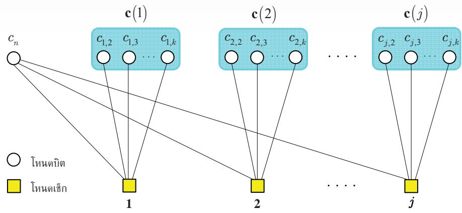  
รูปที่ 4.7 กราฟแทนเนอร์ของรหัสแอลดีพีซีปรกติแบบ (, k) เมื่อพิจารณา ณ โหนดบิตตัวที่ n

$$
c _ { n } = { \left\{ \begin{array} { l l } { 1 , } & { { \mathrm { i f ~ } } \Phi \left( \mathbf { c } \left( 1 \right) \right) = \Phi \left( \mathbf { c } \left( 2 \right) \right) = \ldots = \Phi \left( \mathbf { c } \left( j \right) \right) = 1 } \\ { 0 , } & { { \mathrm { i f ~ } } \Phi \left( \mathbf { c } \left( 1 \right) \right) = \Phi \left( \mathbf { c } \left( 2 \right) \right) = \ldots = \Phi \left( \mathbf { c } \left( j \right) \right) = 0 } \end{array} \right. }\tag{4.49}
$$

ทั้งนี้เพื่อให้สมการพาริดีเช็กทุกสมการ (j สมการ) มีค่าเท่ากับศูนย์ตามความสัมพันธ์ $\mathbf { H } \mathbf { c } ^ { \mathrm { T } } = \mathbf { 0 }$ ในสมการ (4.6) นอกจากนี้เพื่อให้ง่ายต่อการอธิบายอัลกอริทึมการถอดรหัสแอลดีพีซีในหัวข้อต่อไป จะนำกราฟแทนเนอร์ในรูปที่4.7 มาจัดรูปใหม่ได้เป็นกราฟรูปที่ 4.8

## 4.4.2 วัฏจักรของรหัสแอลดีพีซี

วัฏจักร (cycle) หมายถึงเส้นทางเดินภายในกราฟที่มีจุดเริ่มต้นและจุดสิ้นสุดเป็นโหนดบิตเดียวกัน โดยความยาวของวัฎจักร (cycle length) มีค่าเท่ากับจำนวนเส้นเชื่อมทั้งหมดที่ทำให้เกิดเป็นวัฏจักร เนื่องจากกราฟแทนเนอร์เป็นกราฟสองส่วน (bipลrนite graph) จึงทำให้ความยาวน้อยสุดของวัฎจักร18 มีค่าเท่ากับ 4 ตามที่แสดงด้วยเส้นปะในรูปที่ 4.8 อย่างไรก็ตามถ้าไม่มีเส้นปะในกราฟ ก็จะทำให้ กราฟไม่มีวัฏจักร (cycle-free) ซึ่งกราฟที่ไม่มีวัฏจักรจะเรียกว่า "แผนภาพต้นไม้ (tree diagram)" นอกจากนี้กราฟที่ไม่มีวัฎจักรมีคุณสมบัติที่น่าสนใจดังนี้

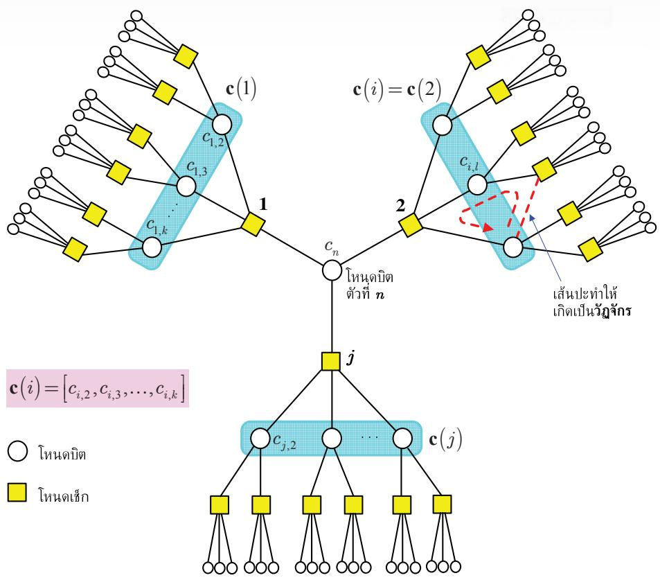  
รูปที่ 4.8 กราฟของรหัสแอลดีพีชีปรกติแบบ (J, k) ที่ได้จากการนำรูปที่ 4.7 มาจัดรูปใหม่ [4]

1) การตัดทิ้งเส้นเชื่อมใดๆ จะทำให้เกิดเป็นกราฟย่อย (sนbgraph) สองกราฟที่แยกจากกัน

2) มีเส้นทางเพียงเส้นทางเดียว (นniqนe path) ที่เดินผ่านโหนดบิตหนึ่งไปยังอีกโหนดบิตหนึ่ง

3) ทุกโหนดบิตที่เชื่อมต่อถึงโหนดบิต $c _ { n }$ จะต้องผ่านเส้นเชือมที่ต่อกับโหนดบิต $c _ { n }$ เพียงเส้นเชื่อม เดียวเท่านัน

4) ถ้าให้โหนดบิต $c _ { j }$ และ $c _ { k }$ เชื่อมต่อกับโหนดบิต $c _ { n }$ ผ่านทางเส้นเชื่อมที่แตกต่างกัน ดังนั้นจะได้ ว่าโหนดบิต $c _ { j }$ และ $c _ { k }$ จะเป็นอิสระต่อกันแบบมีเงื่อนไข (conditionally independent) เมื่อ ไม่พิจารณาบิตข้อมูลตัวที่ n นั่นคือ

$$
\operatorname* { P r } \ \Bigl [ c _ { j } ; c _ { k } \mid \mathbf { r } _ { i \neq n } \Bigr ] = \operatorname* { P r } \Bigl [ c _ { j } \mid \mathbf { r } _ { i \neq n } \Bigr ] \times \operatorname* { P r } \Bigl [ c _ { j } \mid \mathbf { r } _ { i \neq n } \Bigr ]\tag{4.50}
$$

นอกจากนี้วักจักรที่เกิดขึ้นในรหัสแอลดีพีซีสามารถพิจารณาได้จากเมทริกซ์พาริดีเช็ก H ขนาด M×N เช่นกัน กล่าวคือเมทริกซ์ H จะมีวัฎจักรที่มีความยาวเท่ากับ 4 ก็ต่อเมื่อตำแหน่งของ เลขหนึ่งในเมทริกซ์ H มีลักษณะเป็นวงปิด (close 100p) ตามความสัมพันธ์ดังนี้

$$
\left[ h _ { i , j } , h _ { i , b } , h _ { a , b } , h _ { a , j } \right]\tag{4.51}
$$

เมื่อ $h _ { { _ r , c } }$ คือตำแหน่งของเลขหนึ่งในแนวนอนที่r และแนวตั้งที่ c ของเมทริกซ์ H, {i, a} {1, 2, .., M}, และ {j, $b \} \in \ \{ 1 , \ 2 , \ . . . , \ N \}$ หรืออาจกล่าวได้ว่าวัฎจักรที่มีความยาวเท่ากับ 4 ในเมทริกซ์ H คือวงปิดของเลขหนึ่งที่มีการใช้แนวนอนและแนวตั้งร่วมกันเท่ากับสองแนวนอน และสองแนวตั้ง ตัวอย่างเช่น พิจารณารหัสแอลดีพีซีปรกติแบบ (2, 4) ที่มีเมทริกซ์พาริตีเช็ก H เท่ากับ

$$
\mathbf { H } _ { \scriptscriptstyle 5 \times 1 0 } = \left[ \begin{array} { l l l l l l l l l l } { \tilde { 1 } } & { 1 } & { 1 } & { \tilde { 1 } } & { 0 } & { 0 } & { 0 } & { 0 } & { 0 } & { 0 } \\ { 0 } & { 0 } & { 0 } & { 0 } & { \hat { 1 } } & { 1 } & { \hat { 1 } } & { 0 } & { 1 } & { 0 } \\ { 0 } & { 1 } & { 0 } & { 0 } & { \hat { 1 } } & { 0 } & { \hat { 1 } } & { 1 } & { 0 } & { 0 } \\ { 0 } & { 0 } & { 1 } & { 0 } & { 0 } & { 1 } & { 0 } & { 1 } & { 0 } & { 1 } \\ { \tilde { 1 } } & { 0 } & { 0 } & { \tilde { 1 } } & { 0 } & { 0 } & { 0 } & { 0 } & { 1 } & { 1 } \end{array} \right]\tag{4.52}
$$

ซึ่งจะพบว่าเมทริกซ์ H มีวัฎจักรที่มีความยาวเท่ากับ 4 จำนวนสองวัฎจักรคือ วัฏจักรที่หนึ่ง ณ ตำแหน่งของ 1 ที่มีวงปิดคือ $\left[ h _ { 1 , 1 } , h _ { 1 , 4 } , h _ { 5 , 4 } , h _ { 5 , 1 } \right]$ และวัฎจักรทีสอง ณ ตำแหน่งของ 1 ที่มีวงปิด คือ $\left[ h _ { 2 , 5 } , h _ { 2 , 7 } , h _ { 3 , 7 } , h _ { 3 , 5 } \right]$ อย่างไรก็ตามเมทริกซ์ H ในสมการ (4.8) และ (4.19) ไม่มีวัฎจักร

สาเหตุที่รหัสแอลดีพีชีที่ดีจะต้องไม่มีวัฎจักรที่มีความยาวเท่ากับ 4 เพราะว่าวัฏจักรที่มี ความยาวเท่ากับ 4 เป็นวัฏจักรที่เกิดขึ้นง่ายสุดในเมทริกซ์ H นอกจากนี้อัลกอริทึมการถอดรหัส แอลดีพีซีจะอาศัยหลักการของความน่าจะเป็นในการส่งผ่านข่าวสารระหว่างโหนดบิตและโหนดเช็ก โดยความน่าจะเป็นของแต่ละเหตุการณ์จะต้องเป็นอิสระต่อกัน ดังนั้นถ้ามีวัฏจักรเกิดขึ้นในเมทริกซ์ H ก็จะทำให้ความน่าจะเป็นในการส่งผ่านข่าวสารไม่เป็นอิสระต่อกัน ซึ่งส่งผลให้สมรรถนะของการ ถอดรหัสข้อมูลด้อยลงมาก (ดูผลการทดลองในรูปที่ 4.18)

## 4.4.3 การหาค่า LLR ของบิตข้อมูล

พิจารณาเมทริกซ์พาริตีเช็ก H ขนาด M×N ของรหัสแอลดีพีซีปรกติแบบ (j, k) ซึ่งทำให้ทราบว่า มีเงื่อนไขบังคับของสมการพาริตีเช็กจำนวน j สมการ จากสมการ (4.49) จะได้ว่าบิตข้อมูล $c _ { n }$ มี


ค่าเท่ากับค่าพาริตีของเวกเตอร์ข้อมูล c(i) นั้นคือ $c _ { n } = \Phi { \bigl ( } \mathbf { c } ( i ) { \bigr ) }$ สำหรับ $i = \{ 1 , 2 , . . . , j \}$ ดังนั้น สมการ (4.43) เขียนใหม่ได้เป็น

$$
\lambda _ { n } = \frac { 2 } { \sigma ^ { 2 } } r _ { n } + \log \left( \frac { \mathrm { P r } \Big [ \Phi \left( \mathbf { c } \left( i \right) \right) = 1 \mathrm { ~ f o r ~ } i = 1 , 2 , . . . , j \mid \mathbf { r } _ { i \neq n } \Big ] } { \mathrm { P r } \Big [ \Phi \left( \mathbf { c } \left( i \right) \right) = 0 \mathrm { ~ f o r ~ } i = 1 , 2 , . . . , j \mid \mathbf { r } _ { i \neq n } \Big ] } \right)\tag{4.53}
$$

ถ้าสมมุติว่าเมทริกซ์ H ไม่มีวัฎจักร ดังนั้นเมื่อกำหนด ${ \bf r } _ { i \neq n }$ (นั่นคือข้อมูลที่วงจรภาครับได้รับทั้งหมด ยกเว้นข้อมูลตัวที่n) มาให้จะได้ว่า $\mathbf { c } ( 1 ) , \mathbf { c } ( 2 ) , \ldots , \mathbf { c } ( j )$ เป็นอิสระต่อกันแบบมีเงื่อนไข และสมาชิก ภายใน $\mathbf { c } ( i )$ ก็เป็นอิสระต่อกันแบบมีเงื่อนไขด้วยเช่นกัน ดังนั้นสมการ (4.53) ลดรูปได้เป็น

$$
\lambda _ { n } = \frac { 2 } { \sigma ^ { 2 } } r _ { n } + \log \left( \frac { \prod _ { i = 1 } ^ { j } \operatorname* { P r } \left[ \Phi \left( \mathbf { c } \left( i \right) \right) = 1 \mid \mathbf { r } _ { i \neq n } \right] } { \prod _ { i = 1 } ^ { j } \operatorname* { P r } \left[ \Phi \left( \mathbf { c } \left( i \right) \right) = 0 \mid \mathbf { r } _ { i \neq n } \right] } \right)
$$

$$
= \frac { 2 } { \sigma ^ { 2 } } r _ { n } + \sum _ { i = 1 } ^ { j } \log \left( \frac { \mathrm { P r } \Big [ \Phi \big ( \mathbf { c } \left( i \right) \Big ) = 1 \mid \mathbf { r } _ { i \neq n } \Big ] } { \mathrm { P r } \Big [ \Phi \big ( \mathbf { c } \left( i \right) \Big ) = 0 \mid \mathbf { r } _ { i \neq n } \Big ] } \right)
$$

$$
= { \frac { 2 } { \sigma ^ { 2 } } } r _ { n } + \sum _ { i = 1 } ^ { j } \lambda _ { \Phi ( \mathbf { c } ( i ) ) }\tag{4.54}
$$

เมื่อ $\lambda _ { \Phi ( \mathbf { c } ( i ) ) }$ คือค่า LLR ของค่าพาริตี $\Phi \big ( \mathbf { c } ( i ) \big )$ เนืองจากบิตข้อมูลแต่ละบิตเป็นอิสระต่อกันแบบมี เงื่อนไข จึงทำให้ค่า $\lambda _ { \Phi ( \mathbf { c } ( i ) ) }$ แต่ละค่าสอดคล้องกับกฎของไฮเพอร์โบลิกแทนเจนต์ตามสมการ (4.31) ดังนั้นถ้ากำหนดให้

$$
\lambda _ { i , l } = \log \left( \frac { \operatorname* { P r } \left[ c _ { i , l } = 1 | \mathbf { r } _ { i \neq n } \right] } { \operatorname* { P r } \left[ c _ { i , l } = 0 | \mathbf { r } _ { i \neq n } \right] } \right)\tag{4.55}
$$

โดยที่ $c _ { i , l }$ คือสมาชิกตัวที่ 1 ในเวกเตอร์ $\mathbf { c } ( i )$ สำหรับ $l = \{ 2 , 3 , . . . , k \}$ จากนั้นแทนค่าสมการ (4.31) ลงในสมการ (4.54) จะได้

$$
\lambda _ { n } = \frac { 2 } { \sigma ^ { 2 } } r _ { n } - 2 \sum _ { i = 1 } ^ { j } \operatorname { t a n h } ^ { - 1 } \left\{ \prod _ { l = 2 } ^ { k } \operatorname { t a n h } \left( \frac { - \lambda _ { i , l } } { 2 } \right) \right\}\tag{4.56}
$$

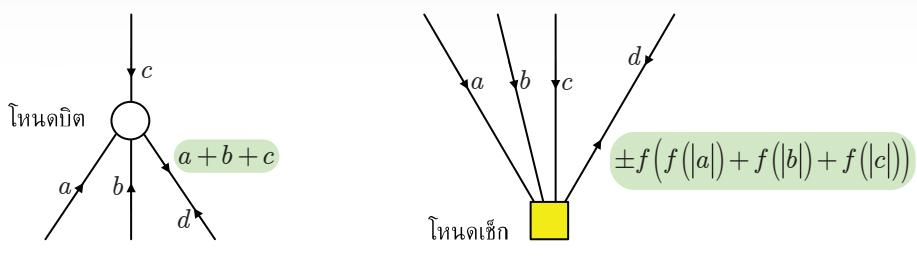  
รูปที่ 4.9 การทำงานของโหนดบิตและโหนดเช็ก

หรือจัดให้อยู่ในอีกรูแบบหนึ่งด้คือ (ปรียบเทียบสมการ (4.31) และ (4.32)

$$
\lambda _ { n } = \frac { 2 } { \sigma ^ { 2 } } r _ { n } - \sum _ { i = 1 } ^ { j } \left\{ \prod _ { l = 2 } ^ { k } \mathrm { s i g n } \left( - \lambda _ { i , l } \right) \times f \left( \sum _ { l = 2 } ^ { k } f \left( \left| \lambda _ { i , l } \right| \right) \right) \right\}\tag{4.57}
$$

โดยที่ $f \bigl ( x \bigr ) = - \log \bigl ( \operatorname { t a n h } \bigl ( x / 2 \bigr ) \bigr )$ ตามที่นิยามในสมการ (4.33) นอกจากนี้ ถ้ำต้องการลดความ ซับซ้อนของอัลกอริทึมการถอดรหัสข้อมูล ก็สามารถอาศัยสมการ (4.36) เพื่อประมาณค่าสมการ (4.57) ใหม่ได้เป็น

$$
\lambda _ { n } \approx \frac { 2 } { \sigma ^ { 2 } } r _ { n } - \sum _ { i = 1 } ^ { j } \left\{ \prod _ { l = 2 } ^ { k } \mathrm { s i g n } \left( - \lambda _ { i , l } \right) \times \operatorname* { m i n } _ { l = \left\{ 2 , \ldots , k \right\} } \left. \lambda _ { i , l } \right. \right\}\tag{4.58}
$$

จากรูปที่ 4.8 ทำให้สามารถอธิบายความหมายของสมการ (4.54) ได้ดังนี้ โหนดบิต $c _ { i , l }$ ส่งข่าวสาร $\lambda _ { i , l }$ ไปยังโหนดเช็กตัวที่ i และโหนดเช็กตัวที่ i จะรวบรวมข่าวสารที่เข้ามาจำนวน $k - 1$ ข่าวสารจากโหนดบิตอื่นๆ ที่อยู่ภายใน c(i) (ยกเว้นโหนดบิต $c _ { n } )$ เพื่อคำนวณหาค่า LLR แบบ อะโพสเทอริออริ $\lambda _ { \Phi ( \mathbf { c } ( i ) ) }$ สำหรับค่าพาริตีของโหนดเช็กตัวที่i จากนั้นก็ส่งผลลัพธ์ที่คำนวณได้ไปยัง $\lambda _ { n }$ ผลรวมของค่า $\left( 2 / \sigma ^ { 2 } \right) r _ { n }$ และข่าวสารทั้งหมดที่เข้ามาที่โหนดบิตตัวที่ n นอกจากนี้รูปที่ 4.9 แสดง การทำงานของโหนดบิตและโหนดเช็ก เมื่อ $f \left( x \right) = \operatorname { t a n h } \left( - x / 2 \right)$ ซึ่งจะเห็นได้ว่าการคำนวณของ โหนดบิตจะใช้เพียงผลรวม (ธนmmation) ในขณะที่การคำนวณของโหนดเช็กค่อนข้างซับซ้อนเพราะ ต้องใช้ฟังก์ชัน f (x)

ตัวอย่างที่ 4.5 พิจารณากราฟแทนเนอร์ในรูปที่ 4.10 ที่มีโหนดบิตจำนวนสี่โหนดเชื่อมต่อกับโหนด เช็กจำนวนหนึ่งโหนด (โหนดบิตทั้งสี่จะต้องสอดคล้องกับสมการพาริตีเช็กที่โหนดเช็ก) เมื่อกำหนด ความน่าจะเป็นอะโพสเทอริออริของบิตข้อมูล $\{ c _ { x } , \ c _ { y } , \ c _ { z } \}$ มาให้ และข้อมูลที่วงจรภาครับได้รับคือ $r _ { n } = ( 2 c _ { n } - 1 ) + w _ { n } = 1 . 5$ เมื่อ $w _ { n }$ คือสัญญาณรบกวน AพGN ที่มีค่าเฉลี่ยเท่ากับศูนย์และค่า ความแปรปรวนเท่ากับ $\sigma ^ { 2 } = 0 . 5$ นั่นคือ $w _ { n } \sim \mathcal { N } \big ( 0 , \sigma ^ { 2 } \big )$ จงคำนวณหาค่า LLR แบบอะโพสเทอริ ออริของบิตข้อมูล $c _ { n }$ โดยใช้สมการ (4.56) - (4.58)

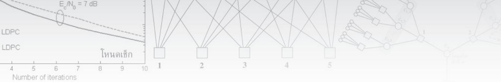

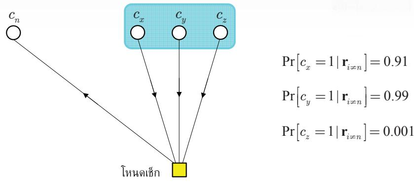  
รูปที่ 4.10 การหาฟังก์ชันพาริตีของกราฟแทนเนอร์ในตัวอย่างที่ 4.5

วิธีทำ ในการส่งผ่านข่าวสารไปให้โหนดบิต $c _ { n }$ โหนดเช็กจะรวบรวมข่าวสารที่ส่งมาจากโหนดบิต $\{ x , ~ y , ~ z \}$ เพื่อคำนวณหาข่าวสารเอกซ์ทรินซิก จากนั้นจะส่งผลลัพธ์ที่ได้ไปให้โหนดบิต $c _ { n }$ เพือหา ซู ค่า LLR แบบอะโพสเทอริออริของบิตข้อมูลตัวที่ ท เนื่องจากโจทย์กำหนด $\operatorname* { P r } [ c _ { l } = 1 | \mathbf { r } _ { i \neq n } ]$ สำหรับ $l = \{ x , \ y ,$ z} มาให้ จึงทำให้สามารถหาค่าข่าวสารเอกซ์ทรินซิกที่โหนดบิต $\{ x , ~ y , ~ z \}$ จะส่งไปให้ $c _ { n }$

$$
\lambda _ { x } = \log \left( \frac { \mathrm { P r } \left[ c _ { x } = 1 | \mathbf { r } _ { l \neq n } \right] } { \mathrm { P r } \left[ c _ { x } = 0 | \mathbf { r } _ { l \neq n } \right] } \right) = \log \left( \frac { 0 . 9 1 } { 0 . 0 9 } \right) \approx 2 . 3
$$

$$
\lambda _ { y } = \log \left( { \frac { \operatorname* { P r } \left[ c _ { y } = 1 \mid \mathbf { r } _ { i \neq n } \right] } { \operatorname* { P r } \left[ c _ { y } = 0 \mid \mathbf { r } _ { i \neq n } \right] } } \right) = \log \left( { \frac { 0 . 9 9 } { 0 . 0 1 } } \right) \approx 4 . 6
$$

$$
\lambda _ { z } = \log \left( \frac { \mathrm { P r } \left[ c _ { z } = 1 | \mathbf { r } _ { i \neq n } \right] } { \mathrm { P r } \left[ c _ { z } = 0 | \mathbf { r } _ { i \neq n } \right] } \right) = \log \left( \frac { 0 . 0 0 1 } { 0 . 9 9 9 } \right) \approx - 6 . 9
$$

เพราะว่า $\operatorname* { P r } \ [ c _ { l } = 0 \vert \mathbf { r } _ { i \neq n } ] = 1 - \operatorname* { P r } \ [ c _ { l } = 1 \vert \mathbf { r } _ { i \neq n } ]$ จากนันแทนค่า $r _ { n } = 1 . 5 , \sigma ^ { 2 } = 0 . 5 ,$ และ $\lambda _ { x } , \lambda _ { y }$ $\lambda _ { z }$ ลงในสมการ (4.56) จะได้

$$
\begin{array} { l } { { \displaystyle \lambda _ { n } = \frac { 2 } { 0 . 5 } ( 1 . 5 ) - 2 \operatorname { t a n h } ^ { - 1 } \left\{ \prod _ { l = \lfloor \nu _ { S } , s \rfloor \neq \atop l = \lfloor \nu _ { S } , s \rfloor } \operatorname { t a n h } \left( \frac { - \lambda _ { l } } { - 2 } \right) \right\} } } \\ { { \displaystyle \ } } \\ { { \displaystyle = 6 - 2 \operatorname { t a n h } ^ { - 1 } \left\{ \operatorname { t a n h } \left( \frac { - 2 . 3 } { 2 } \right) \times \operatorname { t a n h } \left( \frac { - 4 . 6 } { 2 } \right) \times \operatorname { t a n h } \left( \frac { 6 . 9 } { 2 } \right) \right\} } } \\ { { \displaystyle \ = 6 - 2 \operatorname { t a n h } ^ { - 1 } \left\{ \left( - 0 . 8 1 7 8 \right) \times \left( - 0 . 9 8 0 1 \right) \times \left( 0 . 9 9 8 0 \right) \right\} } } \\ { { \displaystyle \ = 6 - \left( 2 . 1 9 7 \right) = 3 . 8 0 3 } } \end{array}
$$

นี้ะ ได้จากสมการ (4.57) ได้ดังน้ นอกจากนียังสามารถหาค่า $\lambda _ { n }$

$$
\begin{array} { r l } & { \lambda _ { \mathrm { s } } = \frac { 2 } { 0 . 5 } ( 1 . 5 ) - \{ \underset { i = \{ - 1 , \ldots , \infty , i \} } { \prod } \sin ( - \lambda ) \times f \{ \underset { i = \{ - 2 , \ldots , c \} } { \sum } f \{ \lfloor \lambda _ { \mathrm { s } } \rfloor \} \} \} } \\ & { = 6 - \{ - 1 \} ( - 1 ) ( 1 ) \times f ( f \{ \lfloor \lambda _ { \mathrm { s } } \rfloor \} + f \{ \lfloor \lambda _ { \mathrm { s } } \rfloor \} + f \{ \lfloor \lambda _ { \mathrm { s } } \rfloor \} ) \} } \\ & { = 6 - \{ f \{ f \{ 2 \{ 2 , 3 \} \} + f \{ 4 . 6 \} \} + f \{ - 6 . 9 \} \} \} } \\ & { = 6 - f ( 0 . 2 0 1 2 + 0 . 0 2 0 1 + 0 . 0 2 0 ) } \\ & { = 6 - ( 2 . 1 9 7 ) = 3 . 8 0 3 } \end{array}
$$

ซึ่งมีค่าเท่ากับการหาคำตอบโดยใช้สมการ (4.56) ตามที่แสดงในข้างต้น อย่างไรก็ตามถ้าต้องการลด ความซับซ้อนในการคำนวณหาค่า $\lambda _ { n }$ ก็สามารถใช้สมการ (4.58) ได้ดังนี้

$$
\begin{array} { l } { \displaystyle \lambda _ { n } = \frac { 2 } { 0 . 5 } \big ( 1 . 5 \big ) - \Bigg \{ \prod _ { l = \{ x , y , z \} } \mathrm { s i g n } \big ( - \lambda _ { l } \big ) \times \operatorname* { m i n } _ { l = \{ x , y , z \} } \big | \lambda _ { l } \Bigg | \Bigg \} } \\ { \displaystyle = 6 - \big \{ \big ( - 1 \big ) \big ( - 1 \big ) \big ( 1 \big ) \times \big | 2 . 3 \big | \big \} } \\ { \displaystyle = 6 - 2 . 3 = 3 . 7 } \end{array}
$$

ซึ่งมีค่าใกล้เคียงกับผลลัพธ์ที่ได้จากสมการ (4.56) และ (4.57)

## 4.4.4 อัลกอริทึมการผ่านข่าวสาร

รูปที่ 4.8 แสดงให้เห็นว่าโหนดบิต $c _ { i , l }$ จะขึ้นอยู่กับ $c _ { n }$ เนื่องจากโหนดบิตทั้งสองเชื่อมต่อกับสมการ พาริตีเช็กเดียวกัน อย่างไรก็ตามเมื่อกำหนดเงือนไขว่า $\left\{ \mathbf { r } _ { i \neq n } \right\}$ มาให้ ก็จะทำให้ $c _ { i , l }$ เป็นอิสระจาก $c _ { n }$ นอกจากนี้ถ้าตัดทิ้งข้อมูลตัวที่ ท ที่วงจรภาครับได้รับ (นั่นคือ $r _ { n } )$ ก็จะทำให้ข้อมูลตัวอื่นๆ หรือ $\left\{ \mathbf { r } _ { i \neq n } \right\}$ ที่ผ่านโหนดบิต $c _ { n }$ ถูกตัดทิ้งไปด้วย ดังนั้นการตัดทิ้งข้อมูล ญ $r _ { n }$ ก็เปรียบเสมือนกับการตัด เส้นเชื่อมทั้งหมดที่เชื่อมต่อกับโหนดบิต $c _ { n }$ ซึ่งทำให้เกิดเป็นกราฟย่อยจำนวน $j$ กราฟ และเนื่องจาก กราฟทั้งหมดไม่มีส่วนร่วมกัน (diรอทt) จึงสามารถพิจารณาได้ว่ากราฟย่อยแต่ละกราฟเป็นอิสระต่อ กัน ซึ่งทำให้มีเฉพาะบิตข้อมูล $c _ { i , l }$ ที่จะถูกนำมาใช้ในการคำนวณหาค่า $\lambda _ { i , l }$

อัลกอริทึมการผ่านข่าวสาร (หรืออัลกอริทึม MP) เป็นเทคนิคการถอดรหัสข้อมูลที่ง่าย โดยอาศัยการส่งผ่านข่าวสารจากโหนดหนึ่งไปยังอีกโหนดหนึ่งตามเส้นทางในกราฟแทนเนอร์ โดย แต่ละโหนด (โหนดบิตและโหนดเช็ก) จะทำหน้าที่เป็นหน่วยประมวลผลที่เป็นอิสระต่อกัน ซึ่งจะ รับข่าวสารที่ส่งเข้ามาทางเส้นเชื่อมทุกเส้น ทำการคำนวณ และส่งผลลัพธ์ที่ได้กลับไปยังเส้นเชื่อม นี้   
เหล่านั้น นอกจากนี้ถ้ากราฟไม่มีวัฎจักร (cyle-free) อัลกอริทึม MP จะเป็นอัลกอริทึมแบบ เวียนเกิด (recursive algorithm)ที่มีผลลัพธ์ลู่เข้าสู่ค่า LLR แบบอะโพสเทอริออริจริงตามที่นิยาม ในสมการ (4.43) หลังจากการทำงานแบบวนซ้ำ (iteraลtive) ภายในอัลกอริทึม MP ผ่านไปเป็น จำนวนรอบที่จำกัด อย่างไรก็ตามรหัสที่ดี (good code) ส่วนใหญ่จะมีวัฎจักรภายในกราฟแทนเนอร์ ซึ่งถ้าใช้อัลกอริทึม MP ในการถอดรหัสข้อมูล ก็จะทำให้ผลลัพธ์ทีได้เป็นแบบเหมาะที่สุดแบบรอง (sub-optimลl) โดยสรุปแล้วถึงแม้ว่ารหัสแอลดีพีซีจะมีวัฎจักร การใช้อัลกอริทึม MP ในการถอด รหัสข้อมูลก็ยังคงให้สมรรถนะที่ค่อนข้างดีและมีความซับซ้อนน้อยมาก (เมื่อเที่ยบกับรหัสอื่นๆ)

วงจรถอดรหัสแอลดีพีซีที่ใช้อัลกอริทึม MP (หรือวงจรถอดรหัสแบบ MP) สำหรับรหัส ไบนารีที่มีเมทริกซ์พาริตีเช็ก H ขนาด M×N สามารถสรุปเป็นขั้นตอนการทำงานได้ดังนี้ กำหนดให้ $\mathcal { M } _ { n } = \{ \ : m \colon h _ { m , n } = 1 \}$ คือเซตของโหนดเช็กทั้งหมดที่เชื่อมต่อกับโหนดบิตตัวที่ n และ ซี่พ่ $\mathcal { N } _ { m } = \{ n \}$ $h _ { m , n } = 1 \}$ คือเซตของโหนดบิตทั้งหมดที่เชื่อมต่อกับโหนดเช็กตัวที่ $m$ โดยที่สำหรับรหัสแอลดีพีซี ปรกติแบบ (i, k) จะได้ว่า ${ \mathcal { M } } _ { n }$ มีจำนวนสมาชิกเท่ากับ j ตัวสำหรับทุก n และ $\mathcal { N } _ { m }$ มีจำนวนสมาชิก เท่ากับ k ตัวสำหรับทุกm นอกจากนี้ถ้าให้ รู้อ้าให้ $u _ { m  n } ^ { ( l ) }$ คือข่าวสารที่ส่งจากโหนดเช็กตัวที่m ไปยังโหนด บิตตัวที่n ณ การวนซ้ำรอบที่1 และให้ $\lambda _ { n } ^ { ( l ) }$ คือค่า LLR แบบอะโพสเทอริออริของบิตข้อมูลตัวที ท ณ การวนซ้ำรอบที่ 1 เพราะฉะนั้นวงจรถอดรหัสแบบ MP มีขั้นตอนการทำงานตามรูปที่ 4.11

ตัวอย่างที่ 4.6 พิจารณาช่องสัญญาณ AGพN ในรูปที่ 4.5 เมื่อบิตข้อมูลอินพุต $m \in \{ 0 , 1 \}$ และ รหัสแอลดีพีซีที่ใช้มีเมทริกซ์ตัวกำเนิดคือ $\mathbf { G } = [ 1 \ 1 \ 1 ] = [ 1 \ | \ \mathbf { P } ]$ เมื่อ P = [1 1] คือเมทริกซ์พาริตี รูปที่ 4.11 ขั้นตอนการทำงานของอัลกอริทึม MP สำหรับการถอดรหัสแอลดีพีซี [4, 17]

```latex
อัลกอริทึมการผ่านข่าวสาร (MP: Massage Passing)
1. กำหนดให้เมทริกซ์พาริตีเช็ก H ขนาด M×N (นั่นคือ M โหนดเช็ก และ N โหนดบิต)
2. กำหนดค่าเริ่มต้น
$u _ { m  n } ^ { ( 0 ) } = 0$ สำหรับทุกค่า $m \in \{ 1 , 2 , . . . , M \}$ และ $\boldsymbol { n } \in \mathcal { N } _ { m }$
$\lambda _ { n } ^ { ( 0 ) } = \left( 2 / \sigma ^ { 2 } \right) r _ { n }$ สำหรับทุกค่า $n \in \{ 1 , 2 , . . . , N \}$
3. สำหรับ $l = 1 , 2 , . . . , l _ { \mathrm { m a x } }$ (เมื่อ $l _ { \mathrm { m a x } }$ คือจำนวนรอบของการวนซ้ำที่ต้องการ)
การปรับปรุงโหนดเช็ก (check-node update)
สำหรับ $m \in \{ 1 , 2 , . . . , M \}$ และ $\boldsymbol { n } \in \mathcal { N } _ { m }$
$u _ { m  n } ^ { ( l ) } = - 2 \operatorname { t a n h } ^ { - 1 } \{ \prod _ { \substack { i \in \mathcal { N } _ { m } \backslash \{ n \} } } \operatorname { t a n h } ( \frac { - ( \lambda _ { i } ^ { ( l - 1 ) } - u _ { m  i } ^ { ( l - 1 ) } ) } { 2 } ) \}$ (4.59)
(สิ้นสุดการวนซ้ำของ m)
การปรับปรุงโหนดบิต (bit-node update)
สำหรับ $n \in \{ 1 , 2 , . . . , N \}$
$\lambda _ { n } ^ { ( l ) } = \frac { 2 } { \sigma ^ { 2 } } r _ { n } + \sum _ { m \in \mathcal { M } _ { n } } u _ { m  n } ^ { ( l ) }$ (4.60)
(สิ้นสุดการวนซ้ำของ n)
(สิ้นสุดการวนซ้ำของ l)
4. ถอดรหัสลำดับข้อมูลอินพุตจากความสัมพันธ์ต่อไปนี้ (ใช้ได้เฉพาะรหัสแบบมีระบบเท่านั้น)
$\hat { m } _ { i } = \left\{ \begin{array} { l l } { 1 , } & { \mathrm { i f } ~ \lambda _ { i } ^ { ( l _ { \operatorname* { m a x } } ) } \ge 0 } \\ { 0 , } & { \mathrm { i f } ~ \lambda _ { i } ^ { ( l _ { \operatorname* { m a x } } ) } < 0 } \end{array} \right.$ (4.61)
สำหรับ $i \in \left\{ 1 , 2 , . . . , N - M \right\}$ เมื่อ $N - M = K$ คือจำนวนของบิตข้อมูลอินพุต (ดูรูปที่ 4.1)
```

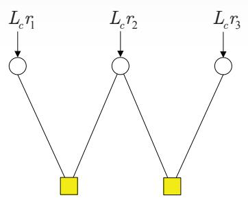

$$
\lambda ^ { ( 0 ) } = \frac { 2 } { \sigma ^ { 2 } } \binom { r _ { 1 } } { r _ { 2 } } = L _ { c } \binom { r _ { 1 } } { r _ { 2 } }
$$

รูปที่ 4.12 กราฟแทนเนอร์ที่ใช้ในการถอดรหัสข้อมูลในตัวอย่างที่ 4.6

ดังนันสัญญาณที่วงจรภาครับได้รับคือ

$$
\begin{array} { c } { { \left[ r _ { 1 } \right] } } \\ { { \left[ r _ { 2 } \right] = s \left[ 1 + \left[ w _ { 2 } \right] \right. } } \\ { { \left. r _ { 3 } \right] } } \end{array}
$$

โดยที่ $s \in \{ \pm 1 \}$ และ $w _ { n } \sim \mathcal { N } \big ( 0 , \sigma ^ { 2 } \big )$ คือสัญญาณรบกวน AพGN จงหาค่า LLR แบบอะโพส เทอริออริ $\boldsymbol { \lambda } = \left[ \lambda _ { 1 } , \lambda _ { 2 } , \lambda _ { 3 } \right] ^ { \mathrm { T } }$ เมื่อ $\lambda _ { n } = \log \left( \operatorname* { P r } \ [ c _ { n } = 1 | \mathbf { r } ] / \operatorname* { P r } \ [ c _ { n } = 0 | \mathbf { r } ] \right)$ สำหรับ $n = \{ 1 , 2 , 3 \}$ เมื่อสิ้นสุดการวนซ้ำรอบที่ 2 นั่นคือหาค่า $\lambda _ { n } ^ { ( 2 ) }$

วิธีทำ จากสมการ (4.7) เมทริกซ์ G ที่กำหนดมาจะมีเมทริกซ์พาริตีเซ็ก H คือ

$$
\mathbf { H } = \left[ \mathbf { P } ^ { \mathrm { T } } \mid \mathbf { I } \right] = \left[ 1 \ \mathbf { \Lambda } ^ { 1 } \ \mathbf { \Lambda } ^ { 0 } \right]
$$

อาศัยเทคนิคการกำจัดแบบเกาส์เซียน (Gauรsรiaท elimination)[53] ทำให้สามารถจัดรูปเมทริกซ์ H ใหม่ได้เป็น

$$
\mathbf { H } = { \left[ \begin{array} { l l l } { 1 } & { 1 } & { 0 } \\ { 0 } & { 1 } & { 1 } \end{array} \right] }
$$

ซึ่งแสดงให้เป็นกราฟแทนเนอร์ได้ตามรูปที่ 4.12 โดยที่ค่า $\lambda _ { n }$ หาได้จากสมการ (4.47) นั่นคือ

$$
\lambda _ { n } = L _ { c } r _ { n } + \log \left( \frac { \mathrm { P r } \left[ c _ { n } = 1 | \mathbf { r } _ { i \neq n } \right] } { \mathrm { P r } \left[ c _ { n } = 0 | \mathbf { r } _ { i \neq n } \right] } \right)\tag{4.62}
$$

เมื่อ $L _ { c } = 2 / \sigma ^ { 2 }$ คือความน่าเชื่อถือของช่องสัญญาณ

(ก)

(ข)  
รูปที4.13 การส่งผ่านข่าวสาร (ก) จากโหนดบิตไปยังโหนดเช็ก และ (ข) จากโหนดเช็กไปยังโหนดบิต เมื่อ สิ้นสุดการวนซ้ำรอบที่ 1

ค่า LLR แบบอะโพสเทอริออริ $\boldsymbol { \lambda } = \left[ \lambda _ { 1 } , \lambda _ { 2 } , \lambda _ { 3 } \right] ^ { \mathrm { T } }$ สามารถหาได้จากอัลกอริทึม MP ตาม รูปที่ 4.11 ดังต่อไปนี้ กำหนดค่าเริ่มต้นของ

$$
\pmb { \lambda } ^ { ( 0 ) } = \left[ \lambda _ { 2 } ^ { ( 0 ) } \right] = L _ { c } \left[ r _ { 1 } \right]
$$

## รอบที่ 1 $( \mathbf { 1 } ^ { \mathrm { s t } }$ iteration)

โหนดบิตแต่ละโหนดจะส่งข่าวสาร $\lambda _ { n } ^ { ( 0 ) }$ ไปยังโหนดเช็กตามที่แสดงในรูปที่ 4.13 (ก) จากนั้นโหนด เช็กแต่ละโหนดจะนำข่าวสารที่ได้รับมาคำนวณตามสมการ (4.59) แล้วก็ส่งผลลัพธ์กลับไปยังโหนด บิตตามที่แสดงในรูปที่ 4.13 (ข) หลังจากนั้นโหนดบิตจะนำข่าวสารที่ได้รับทั้งหมดมาคำนวณตาม สมการ (4.60) ซึ่งจะได้ว่าค่า $\lambda _ { n } ^ { ( 1 ) }$ ของบิตข้อมูลตัวที่n เมื่อ n = {1, 2, 3} มีค่าเท่ากับ

$$
\pmb { \lambda } ^ { ( 1 ) } = \left[ \lambda _ { 2 } ^ { ( 1 ) } \right] = L _ { c } \left[ r _ { 1 } + r _ { 2 } \right]
$$

## รอบที่ 2 $( 2 ^ { \mathbf { n d } }$ iteration)

ในทำนองเดียวกันโหนดบิตแต่ละโหนดจะส่งข่าวสารไปยังโหนดเช็กตามที่แสดงในรูปที่ 4.14 (ก) จากนั้นโหนดเช็กแต่ละโหนดจะนำข่าวสารทีได้รับมาคำนวณตามสมการ (4.59) แล้วก็ส่งผลลัพธ์ กลับไปยังโหนดบิตตามที่แสดงในรูปที่ 4.14 (ข) หลังจากนั้นโหนดบิตจะนำข่าวสารที่ได้รับทั้งหมด มาคำนวณตามสมการ (4.60) ซึ่งจะได้ว่าค่า $\lambda _ { n } ^ { ( 2 ) }$ ของบิตข้อมูลตัวที่n มีค่าเท่ากับ

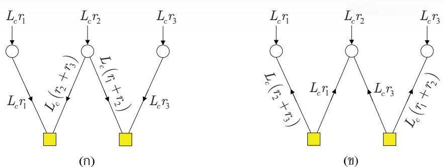  
รูปที่ 4.14 การส่งผ่านข่าวสาร (ก) จากโหนดบิตไปยังโหนดเช็ก และ (ข) จากโหนดเช็กไปยังโหนดบิต เมื่อ สิ้นสุดการวนซ้ำรอบที่ 2

$$
\lambda ^ { ( 2 ) } = \left[ \lambda _ { 2 } ^ { ( 2 ) } \right] = L _ { c } \left[ r _ { 1 } + r _ { 2 } + r _ { 3 } \right]\tag{4.63}
$$

ซึ่งก็คือค่า LLR แบบอะโพสเทอริออริของบิตข้อมูล $\{ c _ { 1 } , c _ { 2 } , c _ { 3 } \}$ เมื่อสิ้นสุดการวนซ้ำรอบที่ 2 นั่นเอง นอกจากนีถ้าให้อัลกอริทึม MP ทำงานต่อไปอีก ก็จะพบว่าค่า $\lambda ^ { ( l ) } = \lambda ^ { ( 2 ) }$ สำหรับ $l > 2$ นันคือ อัลกอริทึม MP เข้าสูสถานะคงตัว (steady state) แล้ว

ตัวอย่างที่ 4.6 สามารถหาคำตอบได้อีกวธีหนึ่งดังนี้ จากสมการ (4.43) จะได้ว่าค่า LLR แบบอะโพสเทอริออริของบิตข้อมูล $c _ { n }$ สำหรับ $n = \{ 1 , 2 , 3 \}$ มีค่าเท่ากับ (อาศัยกฎของเบส์)

$$
\lambda _ { n } = \log \left( \frac { p \left( \mathbf { r } \mid c _ { n } = 1 \right) \mathrm { P r } \left[ c _ { n } = 1 \right] / p \left( \mathbf { r } \right) } { p \left( \mathbf { r } \mid c _ { n } = 0 \right) \mathrm { P r } \left[ c _ { n } = 0 \right] / p \left( \mathbf { r } \right) } \right)\tag{4.64}
$$

เมื่อ ${ \bf r } = \left[ r _ { 1 } , r _ { 2 } , r _ { 3 } \right] ^ { \mathrm { T } }$ ถ้าสมมุติว่า $\mathrm { P r } \big [ c _ { n } = 1 \big ] = \mathrm { P r } \big [ c _ { n } = 0 \big ] = 0 . 5$ ดังนันสมการ (4.64) จะลดรูป ได้เป็น

$$
\begin{array} { r l } & { \lambda _ { n } = \log \left( \frac { p \left( \mathbf { r } \mid c _ { n } = 1 \right) } { p \left( \mathbf { r } \mid c _ { n } = 0 \right) } \right) } \\ & { \quad = \log \left( \frac { C \exp \left( - \displaystyle \frac { 1 } { 2 \sigma ^ { 2 } } \Big | \mathbf { r } - \big [ 1 1 1 \big ] ^ { \mathrm { T } } \Big | ^ { 2 } \right) } { C \exp \left( - \displaystyle \frac { 1 } { 2 \sigma ^ { 2 } } \Big | \mathbf { r } + \big [ 1 1 1 \big ] ^ { \mathrm { T } } \Big | ^ { 2 } \right) } \right) } \end{array}
$$

$$
\begin{array} { l } { { \displaystyle = \frac { 1 } { 2 \sigma ^ { 2 } } \big \{ 2 \big ( r _ { 1 } + r _ { 2 } + r _ { 3 } \big ) + 2 \big ( r _ { 1 } + r _ { 2 } + r _ { 3 } \big ) \big \} } } \\ { { \displaystyle = \frac { 2 } { \sigma ^ { 2 } } \big ( r _ { 1 } + r _ { 2 } + r _ { 3 } \big ) } } \end{array}
$$

ซึ่งมีค่าเท่ากับผลลัพธ์ที่ได้ในสมการ (4.63) เมื่อ $C = 1 / \sqrt { 2 \pi \sigma ^ { 2 } }$ ดังนั้นจึงสรุปได้ว่าถ้ารหัสแอลดีพีซี ไม่มีวัฏจักร อัลกอริทึม MP จะลู่ข้าสู่ค่าที่ถูกต้อง เมื่อจำนวนรอบของการวนซ้ำเพิ่มขึ้นเรื่อยๆ

ตัวอย่างที่ 4.7 พิจารณาช่องสัญญาณ AGพN ในรูปที่ 4.5 เมื่อบิตข้อมูลอินพุต $\mathbf { m } = [ 1 0 1 ]$ และ รหัสแอลดีพีชีที่ใช้มีเมทริกซ์ตัวกำเนิด G ตามสมการ (4.4) โดยที่สัญญาณรบกวนในระบบมีค่า เท่ากับ $\mathbf { w } = [ - 0 . 5 , 0 . 8 , - 0 . 5 , 0 . 5 , 0 . 5 , - 0 . 5 ]$ และมีความแปรปรวนเท่ากับ $\sigma ^ { 2 } = 0 . 5$ จงหาค่า LLR แบบอะโพสเทอริออริ $\boldsymbol { \mathtt { \lambda } } = \left[ \lambda _ { 1 } , \lambda _ { 2 } , \lambda _ { 3 } , \lambda _ { 4 } , \lambda _ { 5 } , \lambda _ { 6 } \right] ^ { \mathrm { T } }$ เมื่อสินสดการวนซำรอบที3 ญ

วิธีทำ จากตัวอย่างที่ 4.1 เมื่อ m = [101] ก็จะได้ $\mathbf { c } = [ 1 0 1 0 1 1 ]$ ดังนั้นสัญญาณที่วงจรถอดรหัส แอลดีพีซีได้รับคือ

$$
\mathbf { r } = ( 2 \mathbf { c } - 1 ) + \mathbf { w } = [ r _ { 1 } , ~ r _ { 2 } , ~ r _ { 3 } , ~ r _ { 4 } , ~ r _ { 5 } , ~ r _ { 6 } ] = [ 0 . 5 , ~ - 0 . 2 , ~ 0 . 5 , ~ - 0 . 5 , ~ 1 . 5 , ~ 0 . 5 ]
$$

เนื่องจากเมทริกซ์ตัวกำเนิด G ตามสมการ (4.4) อยูในรูปแบบมีระบบ (systematiด form) จึงทำ ให้สามารถหาเมทริกซ์พาริตีเช็ก H ได้ตามสมการ (4.7) นั้นคือ

$$
\mathbf { H } = { \left[ \begin{array} { l l l l l l l } { 1 } & { 0 } & { 1 } & { 1 } & { 0 } & { 0 } \\ { 1 } & { 1 } & { 0 } & { 0 } & { 1 } & { 0 } \\ { 0 } & { 1 } & { 1 } & { 0 } & { 0 } & { 1 } \end{array} \right] }
$$

วงจรถอดรหัสจะใช้เมทริกซ์ H นี้ในการถอดรหัสลำดับข้อมูล r ซึ่งมีการแลกเปลี่ยนข่าวสารแบบ ซอฟต์ตามกราฟแทนเนอร์ในรปที่ 4.15 โดยในแต่ละรอบของการวนซ้ำ โหนดเช็กและโหนดบิตจะ มีการคำนวณค่า $u _ { m  n } ^ { ( l ) }$ และ $\lambda _ { n } ^ { ( l ) }$ ตามสมการ (4.59) และ (4.60) ตามลำดับ เมือ 1 คือรอบของ การวนซ้ำ ซึ่งได้ผลลัพธ์ดังนี้

## รอบที่1 $( \mathbf { 1 } ^ { \mathrm { s t } }$ iteration)

โหนดเช็กจะส่งข่าวสารแบบซอฟต์ $u _ { m  n } ^ { ( 1 ) }$ จากโหนดเช็ก mา ไปยังโหนดบิต ท ดังนี้

$$
[ u _ { 1  1 } ^ { ( 1 ) } , u _ { 1  3 } ^ { ( 1 ) } , u _ { 1  4 } ^ { ( 1 ) } ] = [ 1 . 3 2 5 0 , 1 . 3 2 5 0 , - 1 . 3 2 5 0 ]
$$

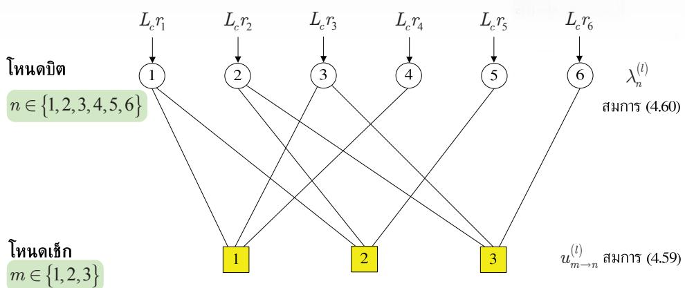  
รูปที่ 4.15 กราฟแทนเนอร์ของเมทริหซ์พาริตีเช็กในตัวอย่างที่ 4.7

$$
[ u _ { 2  1 } ^ { ( 1 ) } , u _ { 2  2 } ^ { ( 1 ) } , u _ { 2  5 } ^ { ( 1 ) } ] = [ 0 . 7 9 5 6 , \ - 1 . 9 8 2 2 , \ 0 . 5 9 5 8 ]
$$

$$
[ u _ { 3  2 } ^ { ( 1 ) } , u _ { 3  3 } ^ { ( 1 ) } , u _ { 3  6 } ^ { ( 1 ) } ] = [ - 1 . 3 2 5 0 , \ 0 . 5 9 5 8 , \ 0 . 5 9 5 8 \ ]
$$

และโหนดบิต ท จะคำนวณค่า LLR $\lambda _ { n } ^ { ( 1 ) }$ ได้เท่ากับ

$$
\left[ \lambda _ { 1 } ^ { ( 1 ) } , \lambda _ { 2 } ^ { ( 1 ) } , \lambda _ { 3 } ^ { ( 1 ) } , \lambda _ { 4 } ^ { ( 1 ) } , \lambda _ { 5 } ^ { ( 1 ) } , \lambda _ { 6 } ^ { ( 1 ) } \right] = \left[ 4 . 1 2 0 6 , \ - 4 . 1 0 7 2 , \ 3 . 9 2 0 8 , \ - 3 . 3 2 5 , \ 6 . 5 9 5 8 , \ 2 . 5 9 5 8 \right]
$$

## รอบที่ $2 \mathbf { \Omega } ( 2 ^ { \mathbf { n d } }$ iteration)

โหนดเช็กจะส่งข่าวสารแบบซอฟต์ $u _ { m  n } ^ { ( 2 ) }$ จากโหนดเช็ก m ไปยังโหนดบิต ท ดังนี้

$$
[ u _ { 1  1 } ^ { ( 2 ) } , u _ { 1  3 } ^ { ( 2 ) } , u _ { 1  4 } ^ { ( 2 ) } ] = [ 1 . 5 7 1 0 , 1 . 6 3 5 8 , - 2 . 0 0 2 1 ]
$$

$$
[ u _ { 2  1 } ^ { ( 2 ) } , u _ { 2  2 } ^ { ( 2 ) } , u _ { 2  5 } ^ { ( 2 ) } ] = [ 2 . 1 0 4 8 , - 3 . 2 5 8 5 , 1 . 8 6 6 0 ]
$$

$$
[ u _ { 3  2 } ^ { ( 2 ) } , u _ { 3  3 } ^ { ( 2 ) } , u _ { 3  6 } ^ { ( 2 ) } ] = [ - 1 . 7 6 9 2 , 1 . 6 3 1 7 , 2 . 3 2 6 3 ]
$$

และโหนดบิต ท จะคำนวณค่า LLR $\lambda _ { n } ^ { ( 2 ) }$ ได้เท่ากับ

$$
\begin{array} { r l } & { \left[ \lambda _ { 1 } ^ { ( 2 ) } , \lambda _ { 2 } ^ { ( 2 ) } , \lambda _ { 3 } ^ { ( 2 ) } , \lambda _ { 4 } ^ { ( 2 ) } , \lambda _ { 5 } ^ { ( 2 ) } , \lambda _ { 6 } ^ { ( 2 ) } \right] = \left[ 5 . 6 7 5 8 , \ - 5 . 8 2 7 6 , \ 5 . 2 6 7 5 , \ - 4 . 0 0 2 1 , \ 7 . 8 6 6 , \ 4 . 3 2 6 3 \right] } \end{array}
$$

## รอบที่ 3 $( 3 ^ { \mathrm { r d } }$ iteration)

โหนดเช็กจะส่งข่าวสารแบบซอฟต์ $u _ { m  n } ^ { ( 3 ) }$ จากโหนดเช็ก m ไปยังโหนดบิต ท ดังนี้

$$
[ u _ { 1  1 } ^ { ( 3 ) } , u _ { 1  3 } ^ { ( 3 ) } , u _ { 1  4 } ^ { ( 3 ) } ] = [ 1 . 8 2 4 9 , 1 . 8 8 7 2 , - 3 . 1 4 7 8 ]
$$

$$
[ u _ { 2  1 } ^ { ( 3 ) } , u _ { 2  2 } ^ { ( 3 ) } , u _ { 2  5 } ^ { ( 3 ) } ] = [ 2 . 5 3 7 5 , \ - 3 . 4 8 6 7 , \ 2 . 2 5 8 6 ]
$$

$$
[ u _ { 3  2 } ^ { ( 3 ) } , u _ { 3  3 } ^ { ( 3 ) } , u _ { 3  6 } ^ { ( 3 ) } ] = [ - 1 . 8 2 5 6 , 1 . 8 8 2 2 , 3 . 1 3 2 3 ]
$$

และโหนดบิต ท จะคำนวณค่า LLR $\lambda _ { n } ^ { ( 3 ) }$ ได้เท่ากับ

$$
\begin{array} { r } { \left[ \lambda _ { 1 } ^ { ( 3 ) } , \lambda _ { 2 } ^ { ( 3 ) } , \lambda _ { 3 } ^ { ( 3 ) } , \lambda _ { 4 } ^ { ( 3 ) } , \lambda _ { 5 } ^ { ( 3 ) } , \lambda _ { 6 } ^ { ( 3 ) } \right] = \left[ 6 . 3 6 2 4 , \ - 6 . 1 1 2 2 , \ 5 . 7 6 9 4 , \ - 5 . 1 4 7 8 , 8 . 2 5 8 6 , \ 5 . 1 3 2 3 \right] } \end{array}
$$

ดังนั้นเมื่อสิ้นสุดการวนรอบที่สอง วงจรถอดรหัสแอลดีพีซีก็จะถอดรหัสบิตข้อมูลตาม สมการ (4.61) ซึ่งจะได้ผลลัพธ์เป็น

$$
\hat { \mathbf { m } } = \left[ \hat { m } _ { 1 } \ \hat { m } _ { 2 } \ \hat { m } _ { 3 } \right] = \left[ 1 \ 0 \ 1 \right]
$$

ซึ่งตรงกับบิตข้อมูลอินพุต m = [10 1] แสดงว่าไม่มีข้อผิดพลาดเกิดขึ้นในระบบ นอกจากนี้ยัง   
สังเกตเห็นว่า ถ้าระบบทำงานในสภาวะปกติ (สัญญาณรบกวนไม่รุนแรง) ค่า LLR $\lambda _ { n } ^ { ( l ) }$ ในแต่ละ   
รอบของการวนซ้ำจะมีค่าเพิ่มขึ้นเรื่อยๆ ซึ่งหมายความว่าความน่าเชื่อถือของบิตข้อมูลที่ถอดรหัสได้ อีิ่เชี้   
จะมีความถูกต้องมากยิงขึ้น

## 4.5 การสร้างเมทริกซ์พาริตีเช็ก

ในทางปฏิบัติสมรรถนะของรหัสแอลดีพีซีจะขึ้นกับเมทริกซ์พาริตีเช็ก H ซึ่งควรมีลักษณะแบบสุ่ม ให้มากที่สุดและไม่มีวัจักร งานวิจัยต่างๆ [4, 5, 8, 17, 54, 55] ทางด้านรหัสแอลดีพีซีจะเน้นไป ที่การสร้างเมทริกซ์ H ดังนั้นในหัวข้อนี้จะอธิบายการสร้างเมทริกซ์ H แบบง่ายๆ เพื่อเป็นพื้นฐาน ให้กับผู้สนใจในการพัฒนางานทางด้านรหัสแอลดีพีซีในอนาคต

## 4.5.1 รหัสแอลดีพีซีปรกติ

เมทริกซ์พาริตีเช็ก H สำหรับรหัสแอลดีพีซีปรกติแบบ (j, k) ขนาด $M \times N$ สามารถสร้างได้จาก เมทริกซ์พาริตีเช็ก $\mathbf { H } _ { 0 }$ ขนาด $L \times N$ เมื่อ $L = N / k = M / j$ ซึ่งมีค่าเท่ากับ

$$
\mathbf { H } _ { 0 } = \left[ \begin{array} { c c c c c c } { \underbrace { 1 \dots 1 } _ { k } } & { \mathbf { 0 } } & { \mathbf { 0 } } & { \cdots } & { \mathbf { 0 } } \\ { \mathbf { 0 } } & { \underbrace { 1 1 \dots 1 } _ { k } } & { \mathbf { 0 } } & { \cdots } & { \mathbf { 0 } } \\ { \vdots } & { \ddots } & { \ddots } & { \ddots } & { \vdots } \\ { \mathbf { 0 } } & { \dots } & { \mathbf { 0 } } & { \underbrace { 1 1 \dots 1 } _ { k } } & { \mathbf { 0 } } \\ { \mathbf { 0 } } & { \dots } & { \mathbf { 0 } } & { \mathbf { 0 } } & { \underbrace { 1 1 \dots 1 } _ { k } } \end{array} \right] _ { L \times N }\tag{4.65}
$$

สู ด เมื่อ $\mathbf { 0 } = \left[ 0 0 \ldots 0 \right]$ คือเวกเตอร์ศูนย์ขนาด 1×k สมการ (4.65) บอกให้ทราบว่าข้อมูลในแนวนอนที่ $( m - 1 ) k + 1$ ถึงmk และแนวตั้งอื่นๆ จะมี สมาชิกเป็นเลข 0 ในทางปฏิบัติเมทริกซ์ $\mathbf { H } _ { 0 }$ สามารถใช้กับรหัสแอลดีพีซีปรกติแบบ (1, k) โดย สมการพาริตีเช็กแต่ละสมการจะสัมพันธ์กับข้อมูลจำนวน k บิต และข้อมูลแต่ละบิตจะสัมพันธ์กับ สมการพาริตีเช็กเพียงหนึ่งสมการเท่านั้น อย่างไรก็ตามสมรรถนะของรหัสแอลดีพีซีที่ใช้เมทริกซ์ $\mathbf { H } _ { 0 }$ จะไม่ดี เนื่องจากเมทริกซ์ $\mathbf { H } _ { 0 }$ จะไม่อิสระต่อกันแบบเชิงเส้น (linearly dependent) เช่นคำรหัส 0000..0 และ 1100...0 ถือว่าเป็นคำรหัสที่ถูกต้องเหมือนกัน ดังนั้นรหัสนี้จะมีระยะทางน้อยสุด เท่ากับ $d _ { \operatorname* { m i n } } = 2$

โดยทั่วไปเมทริกซ์ H สำหรับรหัสแอลดีพีซีปรกติแบบ (j, k) ขนาด M×N สร้างได้จาก การนำเอาเมทริกซ์ $\mathbf { H } _ { 0 }$ ที่มีการเรียงสับเปลี่ยน (permutation) ข้อมูลในแนวตั้งมาวางต่อกันดังนี้

$$
\mathbf { H } = { \left[ \begin{array} { l } { \pi _ { 1 } \left( \mathbf { H } _ { 0 } \right) } \\ { \pi _ { 2 } \left( \mathbf { H } _ { 0 } \right) } \\ { \vdots } \\ { \pi _ { j } \left( \mathbf { H } _ { 0 } \right) } \end{array} \right] } _ { M \times N }\tag{4.66}
$$

เมื่อ $\pi _ { i } \left( \mathbf { H } _ { 0 } \right)$ คือเมทริกซ์ที่มีการเรียงสับเปลี่ยนข้อมูลในแนวตั้งของเมทริกซ์ $\mathbf { H } _ { 0 }$ สำหรับ $i = \{ 1$ 2, ., j} อย่างไรก็ตามในทางปฏิบัติเมทริกซ์ $\mathbf { H } _ { 0 }$ สามารถเป็นเมทริกซ์รูปแบบอื่นก็ได้ เช่น

$$
\mathbf { H } _ { 0 } = \left[ \mathbf { I } \textbf { I I } \cdots \textbf { I } \right] _ { L \times N }\tag{4.67}
$$

เมื่อ 1 คือเมทริกซ์เอกลักษณ์ขนาด LXL และ $L = N / k$

การเรียงสับเปลี่ยนที่ดีควรทำให้เมทริกซ์ H มีระยะทางน้อยสุดของรหัส $d _ { \operatorname* { m i n } } > 2$ โดยทั่วไป การออกแบบการเรียงสับเปลี่ยนจำนวน  แบบ (แต่ละแบบมีความยาว N ตัว) เป็นสิ่งที่ท้าทาย อย่างไรก็ตาม Gallager [17] ได้แสดงให้เห็นว่าการเรียงสับเปลี่ยนแบบสุ่มแท้ (pure random) จะทำให้ได้เมทริกซ์ H ที่ดีสุด ซึ่งส่งผลให้สมรรถนะของรหัสแอลดีพีซีมีค่าสูงสุด

ตัวอย่างที่ 4.8 พิจารณารหัสแอลดีพีซีปรกติแบบ (3, 4) ขนาด 15×20 ต่อไปนี้ [17]

$$
\begin{array} { r } { | | \begin{array} { l l l l l l l l l l l l l l l l l l l l l l l l l } { 1 } & { 1 } & { 1 } & { 1 } & { 0 } & { 0 } & { 0 } & { 0 } & { 0 } & { 0 } & { 0 } & { 0 } & { 0 } & { 0 } & { 0 } & { 0 } & { 0 } & { 0 } & { 0 } & { 0 } & { 0 } & { 0 } \\ { 0 } & { 0 } & { 0 } & { 1 } & { 1 } & { 1 } & { 0 } & { 0 } & { 0 } & { 0 } & { 0 } & { 0 } & { 0 } & { 0 } & { 0 } & { 0 } & { 0 } & { 0 } & { 0 } & { 0 } & { 0 } & { 0 } \\ { 0 } & { 0 } & { 0 } & { 0 } & { 1 } & { 1 } & { 1 } & { 0 } & { 0 } & { 0 } & { 0 } & { 0 } & { 0 } & { 0 } & { 0 } & { 0 } & { 0 } & { 0 } & { 0 } & { 0 } & { 0 } \\ { 0 } & { 0 } & { 0 } & { 0 } & { 0 } & { 0 } & { 0 } & { 0 } & { 1 } & { 1 } & { 0 } & { 1 } & { 0 } & { 0 } & { 0 } & { 0 } & { 0 } & { 0 } & { 0 } & { 0 } \\ { 0 } & { 0 } & { 0 } & { 0 } & { 0 } & { 0 } & { 0 } & { 0 } & { 0 } & { 0 } & { 0 } & { 0 } & { 0 } & { 1 } & { 0 } & { 0 } & { 0 } & { 0 } & { 0 } & { 0 } \\ { 0 } & { 0 } & { 0 } & { 0 } & { 0 } & { 0 } & { 0 } & { 0 } & { 0 } & { 0 } & { 0 } & { 0 } & { 0 } & { 0 } & { 1 } & { 1 } & { 1 } & { 1 } & { 1 } \end{array} | } \\  | \begin{array} { l } { 0 } { 0 } \\ { 1 } & { 0 } & { 0 } & { 0 } & { 0 } & { 0 } & { 0 } &  0  \end{array} \end{array}\tag{4.68}
$$

โดยเส้นตรงในแนวนอนสองเส้นจะเป็นตัวแบ่งเมทริกซ์ $\mathbf { H } _ { 0 }$ และเมทริกซ์อีกสองเมทริกซ์เกิดจาก การเรียงสับเปลี่ยนของเมทริกซ์ $\mathbf { H } _ { 0 }$ ตามสมการ (4.66) เมื่อ $\pi _ { 1 } = \left\{ 1 2 3 4 5 \ldots 2 0 \right\}$ $\pi _ { 2 } =$ (1 59 13 2 6 10 17 3 7 14 18 4 11 15 19 8 12 16 20} และ $\pi _ { 3 } = \left\{ 1 \ 5 9 1 3 1 7 2 6 1 0 1 4 1 8 \right.$ 73 11 15 19 8 16 4 12 20} เมทริกซ์ H ในสมการ (4.68) แสดงให้เห็นว่าแต่ละแนวตั้งมีเลข 1 จำนวน $j = 3$ ตัว และแต่ละแนวนอนมีเลข 1 จำนวน $k = 4 ~ \mathrm { \textQ } \mathrm { \text Q }$ นอกจากนี้ยังพบว่าข้อมูลใน แนวนอนที่ 10 คือผลรวม (แบบมอดุโลสอง) ของข้อมูลในแนวนอนที่ 1 ถึง 9 และข้อมูลในแนว นอนที่15 คือผลรวมของข้อมูลในแนวนอนที่1 ถึง 5 และข้อมูลในแนวนอนที่11 ถึง 14 ซึ่ง หมายความว่าข้อมูลในแนวนอนที่10 และ 15 ไม่อิสระต่อกันแบบเชิงเส้นกับข้อมูลในแนวนอน อื่นๆ ดังนั้นเมทริกซ์ H จะมีเพียงข้อมูลในแนวนอนเพียง 13 แนวนอนเท่านั้นที่เป็นอิสระต่อกัน แบบเชิงเส้น หรือกล่าวได้ว่าค่าลำดับชั้น (raทk) ของเมทริกซ์ H จะเท่ากับ 13 และรหัสแอลดีพีซีนี้ จะใช้เข้ารหัสข้อมูลครั้งละ $K = 2 0 \mathrm { ~ - ~ } 1 3 = 7$ บิต และมีอัตรารหัสเท่ากับ $R = K / N = 0 . 3 5$

ในทางปฏิบัติเมทริกซ์ H ในสมการ (4.68) สามารถลดรูปได้เป็นเมทริกซ์ H โดยการ ตัดทิ้งข้อมูลในแนวนอนที่10 และ 15 ซึ่งยังคงให้ผลลัพธ์เป็นคำรหัสที่เหมือนกับเมทริกซ์ H เพราะว่า $\mathbf { c H } ^ { \mathrm { T } } = \mathbf { 0 }$ ก็ต่อเมื่อ $\mathbf { c } \tilde { \mathbf { H } } ^ { \mathrm { T } } = \mathbf { 0 }$ เท่านั้น เนื่องจากเมทริกซ์ H มีจำนวนเลข 1 ในแต่ละ แนวนอน/แนวตั้งไม่เท่ากันทุกแนวนอน/แนวตั้ง จึงทำให้เมทริกซ์ π ไม่สอดคล้องกับคุณสมบัติ ของเมทริกซ์แอลดีพีซีปรกติ อย่างไรก็ตามในที่นี้จะสนใจเฉพาะเมทริกซ์ H ที่สอดคล้องกับคุณสมบัติ ของเมทริกซ์แอลดีพีซีปรกติ ถึงแม้ว่าแต่ละแนวนอนจะไม่เป็นอิสระต่อกันก็ตาม

Number of iterations

## 4.5.2 รหัสแอลดีพีซีแบบแถวลำดับ

รหัสแอลดีพีซีแบบแถวลำดับ (array LDPC code) ได้ถูกพัฒนาขึ้นโดย Fan [54] ในปี ค.ศ. 2000 โดยเมทริกซ์พาริตีเช็ก H จะมีโครงสร้างเป็นแบบแถวลำดับ จึงช่วยแก้ปัญหาเรื่องความซับซ้อนใน การสร้างเมทริกซ์ H ได้ นอกจากนี้ยังพบว่ารหัสแอลดีพีซีแบบแถวลำดับมีสมรรถนะที่ไกล้เคียงกับ รหัสแอลดีพีซีที่มีเมทริกซ์ H เป็นแบบสุ่ม

สำหรับรหัสแอลดีพีซีแบบแถวลำดับจะถูกกำหนดด้วยพารามิเตอร์สามตัวคือ จำนวนเฉพาะ p และจำนวนเต็ม $\{ j , k \} \le p$ และเมทริกซ์ H จะมีขนาดเท่ากับ jp×kp ซึ่งมีโครงสร้างดังนี้

$$
\mathbf { H } _ { ( j p \times k p ) } = \left[ \begin{array} { l l l l l } { \mathbf { I } } & { \mathbf { I } } & { \mathbf { I } } & { \mathbf { I } } & { \mathbf { I } } \\ { \mathbf { I } } & { \mathbf { \boldsymbol { a } } } & { \mathbf { \boldsymbol { a } } ^ { 2 } } & { \cdots } & { \mathbf { \boldsymbol { a } } ^ { k - 1 } } \\ { \mathbf { I } } & { \mathbf { \boldsymbol { a } } ^ { 2 } } & { \mathbf { \boldsymbol { a } } ^ { 4 } } & { \cdots } & { \mathbf { \boldsymbol { a } } ^ { 2 ( k - 1 ) } } \\ { \vdots } & { \vdots } & { \vdots } & { \ddots } & { \vdots } \\ { \mathbf { I } } & { \mathbf { \boldsymbol { a } } ^ { j - 1 } } & { \mathbf { \boldsymbol { a } } ^ { 2 ( j - 1 ) } } & { \cdots } & { \mathbf { \boldsymbol { a } } ^ { ( j - 1 ) ( k - 1 ) } } \end{array} \right]\tag{4.69}
$$

โดยที่ $j$ และ k คือจำนวนเลข 1 ในแต่ละแนวตั้งและแนวนอนของเมทริกซ์ H ตามลำดับ และ 1 คือเมทริกซ์เอกลักษณ์ขนาด $p \times p ,$ aคือเมทริกซ์การเรียงสับเปลี่ยน (permutation matrix) ขนาด pxp ซึ่งแทนการเลื่อนวน (cyclic รhift) ของเมทริกซ์ 1 ไปทางซ้ายหรือขวาจำนวนหนึ่งครั้ง นั่นคือ

$$
\mathbf { a } = { \left[ \begin{array} { l l l l l } { 0 } & { 1 } & { 0 } & { 0 } & { 0 } \\ { 0 } & { 0 } & { 1 } & { 0 } & { 0 } \\ { 0 } & { 0 } & { 0 } & { 1 } & { 0 } \\ { 0 } & { 0 } & { 0 } & { 0 } & { 1 } \\ { 1 } & { 0 } & { 0 } & { 0 } & { 0 } \end{array} \right] }
$$

หรือ

$$
\mathbf { a } = { \left[ \begin{array} { l l l l l } { 0 } & { 0 } & { 0 } & { 0 } & { 1 } \\ { 1 } & { 0 } & { 0 } & { 0 } & { 0 } \\ { 0 } & { 1 } & { 0 } & { 0 } & { 0 } \\ { 0 } & { 0 } & { 1 } & { 0 } & { 0 } \\ { 0 } & { 0 } & { 0 } & { 1 } & { 0 } \end{array} \right] }\tag{4.70}
$$

และเลขชี้กำลังของ a แสดงถึงจำนวนครั้งของการเลื่อนวนของเมทริกซ์  สมการ (4.69) แสดงให้ เห็นว่าเมทริกซ์ H ยังคงมีการกระจายตัวของเลข 1 เป็นแบบคงที่ ดังนั้นรหัสแอลดีพีซีแบบแถว ลำดับจึงถือว่าเป็นรหัสแอลดีปรกติ (regular LDPC code)

ตัวอย่างเช่นการสร้างเมทริกซ์ a ขนาด 5×5 จากเมทริกซ์เอกลักษณ์ด้วยวิธีการเลื่อนวน และมีคุณสมบัติที่สำคัญดังนี้

$$
\mathbf { I } = { \left[ \begin{array} { l l l l l } { 1 } & { 0 } & { 0 } & { 0 } & { 0 } \\ { 0 } & { 1 } & { 0 } & { 0 } & { 0 } \\ { 0 } & { 0 } & { 1 } & { 0 } & { 0 } \\ { 0 } & { 0 } & { 0 } & { 1 } & { 0 } \\ { 0 } & { 0 } & { 0 } & { 0 } & { 1 } \end{array} \right] }
$$

$$
\mathbf { a } = { \left[ \begin{array} { l l l l l } { 0 } & { 1 } & { 0 } & { 0 } & { 0 } \\ { 0 } & { 0 } & { 1 } & { 0 } & { 0 } \\ { 0 } & { 0 } & { 0 } & { 1 } & { 0 } \\ { 0 } & { 0 } & { 0 } & { 0 } & { 1 } \\ { 1 } & { 0 } & { 0 } & { 0 } & { 0 } \end{array} \right] }
$$

$$
\mathbf { q } ^ { 2 } = { \left[ \begin{array} { l l l l l } { 0 } & { 0 } & { 1 } & { 0 } & { 0 } \\ { 0 } & { 0 } & { 0 } & { 1 } & { 0 } \\ { 0 } & { 0 } & { 0 } & { 0 } & { 1 } \\ { 1 } & { 0 } & { 0 } & { 0 } & { 0 } \\ { 0 } & { 1 } & { 0 } & { 0 } & { 0 } \end{array} \right] }
$$

$$
\mathbf { a } ^ { 3 } = [ { \begin{array} { c c c c c } { 0 } & { 0 } & { 0 } & { 1 } & { 0 } \\ { 0 } & { 0 } & { 0 } & { 0 } & { 1 } \\ { 1 } & { 0 } & { 0 } & { 0 } & { 0 } \\ { 0 } & { 1 } & { 0 } & { 0 } & { 0 } \\ { 0 } & { 0 } & { 1 } & { 0 } & { 0 } \end{array} } \qquad \mathbf { a } ^ { 4 } = [ { \begin{array} { c c c c c } { 0 } & { 0 } & { 0 } & { 0 } & { 1 } \\ { 1 } & { 0 } & { 0 } & { 0 } & { 0 } \\ { 0 } & { 1 } & { 0 } & { 0 } & { 0 } \\ { 0 } & { 0 } & { 1 } & { 0 } & { 0 } \\ { 0 } & { 0 } & { 0 } & { 1 } & { 0 } \end{array} } ] \qquad \mathbf { a } ^ { 5 } = [ { \begin{array} { c c c c c } { 1 } & { 0 } & { 0 } & { 0 } & { 0 } \\ { 0 } & { 1 } & { 0 } & { 0 } & { 0 } \\ { 0 } & { 0 } & { 1 } & { 0 } & { 0 } \\ { 0 } & { 0 } & { 0 } & { 1 } & { 0 } \end{array} } ]
$$

สาเหตุที่เมทริกซ์ a มีชื่อว่าเมทริกซ์การเรียงสับเปลี่ยนเป็นเพราะว่า เมื่อนำเมทริกซ์ a ไปคูณกับ เมทริกซ์ใดๆ แล้ว ผลลัพธ์ที่ได้ก็คือเมทริกซ์เดิมที่ถูกการเรียงสับเปลี่ยนใหม่ (สลับตำแหน่งข้อมูล แต่ละแนวตั้ง) นอกจากนี้เมทริกซ์การเรียงสับเปลี่ยนแบบผกผัน $\mathbf { q } ^ { - 1 }$ จะมีค่าเท่ากับ ${ \bf { u } } ^ { \mathrm { { T } } }$ เมื่อ $( . ) ^ { \mathrm { T } }$ คือตัวดำเนินการสลับเปลี่ยน (transpose operator)

สำหรับรหัสแอลดีพีซีแบบแถวลำดับทีมีพารามิเตอร์ $( j , k , p )$ จะได้ว่าข้อมูลอินพุตมีจำนวน $K = N - M = ( k - j ) p$ บิต, บิตพาริตีมีจำนวน $M = j p$ บิต, คำรหัสมีจำนวน $N = k p$ บิต, และ อัตรารหัสมีค่าเท่ากับ $1 - \left( j p - j + 1 \right) / { p ^ { 2 } }$ อย่างไรก็ตามเนื่องจากเมทริกซ์ H ในสมการ (4.66) และ (4.69) ไม่ได้อยูในรูปแบบมีระบบ (systematic form) ตามสมการ (4.7) การเข้ารหัสข้อมูล จึงต้องนำเมทริกซ์ H มาจัดให้อยูในรูปแบบมีระบบก่อน โดยอาศัยเทคนิคการกำจัดแบบเกาส์เซียน (Gaussian elimiทation) [53] จากนันจึงใช้ขันตอนการเข้ารหัสข้อมูลตามที่อธิบายในหัวข้อที่ 4.3 ญ นอกจากนี้ Fan [54] ยังได้แสดงให้เห็นว่ารหัสแถวลำดับไม่มีวัฏจักรที่มีความยาวเท่ากับ 4 และ สามารถใช้อัลกอริทึม MP (รูปที่ 4.11) ในการถอดรหัสข้อมูลได้เหมือนกับรหัสแอลดีพีซีปรกติ 1 น ตามที่อธิบายในหัวข้อที่ 4.6.1 ดังนั้นโดยสรุปแล้วงานวิจัยของ Fan ได้ช่วยแก้ปัญหาข้อด้อยของ รหัสแอลดีพีซีในเรื่องของการสร้างเมทริกซ์ H จากการสุ่มข้อมูลเลข {0, 1}, การควบคุมจำนวน ญ เลข 1 ในแต่ละแนวนอนและแนวตั้ง, และการหลีกเลี่ยงวัฏจักรที่มีความยาวเท่ากับ 4

## 4.5.3 รหัสแอลดีพีซีแบบแถวลำดับที่ถูกปรับปรุง

งานวิจัยของ Richลrdรoท [46] ได้กล่าวว่าการเพิ่มสมรรถนะของการเข้ารหัสและการทำให้การ เข้ารหัสมีความซับซ้อนแบบเชิงเส้น สามารถทำได้โดยการจัดรูปให้เมทริกซ์พาริตีเช็ก H มีลักษณะ เป็นรูปร่างสามเหลี่ยม ดังนั้น Eleftherioน [55] จึงได้นำเสนอรหัสแอลดีพีซีแบบใหม่ในปี ค.ศ. 2002 ที่ชื่อว่า “รหัสแอลดีพีซีแบบแถวลำดับที่ถูกปรับปรุง (MAC: modified array code)" โดย อาศัยวิธีการเลื่อนวน (cycic รhift) นอกจากนี้รหัสแอลดีพีซีแบบแถวลำดับที่ถูกปรับปรุงจะถูก กำหนดด้วยพารามิเตอร์ (, k, p) เหมือนกับรหัสแอลดีพีซีแบบแถวลำดับ โดยที่เมทริกซ์ H จะมี ขนาดเท่ากับp×kp และมีโครงสร้างดังนี้


$$
\mathbf { H } _ { ( j p \times k p ) } = { \left[ \begin{array} { l l l l l l l l } { \mathbf { I } } & { \mathbf { I } } & { \cdots } & { \mathbf { I } } & { \mathbf { I } } & { \mathbf { I } } & { \cdots } & { \mathbf { I } } \\ { \mathbf { 0 } } & { \mathbf { I } } & { \mathbf { a } } & { \cdots } & { \mathbf { a } ^ { j - 2 } } & { \mathbf { a } ^ { j - 1 } } & { \cdots } & { \mathbf { a } ^ { k - 2 } } \\ { \mathbf { 0 } } & { \mathbf { 0 } } & { \mathbf { I } } & { \cdots } & { \mathbf { a } ^ { 2 ( j - 3 ) } } & { \mathbf { a } ^ { 2 ( j - 2 ) } } & { \cdots } & { \mathbf { a } ^ { 2 ( k - 3 ) } } \\ { \vdots } & { \vdots } & { \vdots } & { \ddots } & { \vdots } & { \vdots } & { \ddots } & { \vdots } \\ { \mathbf { 0 } } & { \mathbf { 0 } } & { \mathbf { 0 } } & { \cdots } & { \mathbf { I } } & { \mathbf { a } ^ { ( j - 1 ) } } & { \cdots } & { \mathbf { a } ^ { ( j - 1 ) ( k - j ) } } \end{array} \right] }\tag{4.71}
$$

เมื่อ 0 คือเมทริกซัศนย์ขนาด $p { \times } p$ และ a คือเมทริกซ์การเรียงสับเปลี่ยน สังเกตจะพบว่ารูปแบบ สามเหลี่ยมในเมทริกซ์ H มีผลทำให้การกระจายตัวของเลข 1 เปลี่ยนจากแบบคงที่เป็นแบบไม่คงที ดังนั้นรหัสแอลดีพีซีแบบแถวลำดับที่ถูกปรับปรุงจึงถือว่าเป็นรหัสแอลดีไม่สมำเสมอ (irregular LDPC code)

สำหรับรหัสแอลดีพีซีแบบแถวลำดับที่ถูกปรับปรุงที่มีพารามิเตอร์ $( j , k , p )$ จะได้ว่าข้อมูล อินพุตมีจำนวน $K = { \mathit { \left( k - j \right) } } p$ บิต, บิตพาริตีมีจำนวน $M = j p$ บิต, คำรหัสมีจำนวน $N = k p$ บิต, และอัตรารหัสมีค่าเท่ากับ $\left( 1 - j / k \right)$ นอกจากนี้ยังพบว่าเมทริกซ์ H ในสมการ (4.71) ไม่มีวัฎจักรที่ มีความยาวเท่ากับ 4, สามารถใช้อัลกอริทึม MPในการถอดรหัสข้อมูลได้เหมือนกับรหัสแอลดีพีซี ปรกติตามที่อธิบายในหัวข้อที่ 4.6.1, และมีสมรรถนะดี (มีพื้นข้อผิดพลาดต่ำ) เทียบเท่ากับรหัส แอลดีพีซีที่ใช้เมทริกซ์ H แบบสุ่ม

การเข้ารหัสข้อมูลของรหัสแอลดีพีซีแบบแถวลำดับทีถูกปรับปรุงจะง่ายกว่าการเข้ารหัส ข้อมูลของรหัสแอลดีพีซีแบบแถวลำดับ เพราะว่าเมทริกซ์ H ในสมการ (4.71) มีลักษณะเป็นรูป สามเหลียม นันคือเริมต้นให้จัดรปคำรหัสใหม่เป็น

$$
\mathbf { c } = \left[ \mathbf { p } \left| \mathbf { m } \right| \right]\tag{4.72}
$$

เมื่อ p คือเวกเตอร์ของบิตพาริตีจำนวน $M = j p$ บิต และ m คือเวกเตอร์ของบิตข้อมูลจำนวน $K =$ $N - M = { \bigl ( } k - j { \bigr ) } p$ บิต จากนั้นแทนค่า c จากสมการ (4.72) ลงในสมการ (4.6) จะได้

$$
\mathbf { H } _ { ( M \times N ) } \left[ \frac { \mathbf { p } } { \mathbf { m } } \right] ^ { \mathrm { T } } = \mathbf { 0 } ^ { \mathrm { T } } { } _ { ( M \times 1 ) }\tag{4.73}
$$

ซึ่งผลที่ได้คือความซับซ้อนในการเข้ารหัสจะลดลงอย่างมาก เมื่อเทียบกับขั้นตอนการเข้ารหัสข้อมูล ที่อธิบายในหัวข้อที่ 4.3 เนื่องจากการหาค่าพาริดีบิด P ไม่จำเป็นต้องหาค่าเมทริกซ์ผกผันตามที่ใช้ 3ื0 น ในสมการ (4.41)

ตัวอย่างเช่นถ้ากำหนดให้ $j = 3 , k = 5 , p = 3$ และให้เมทริกซ์การเรียงสับเปลี่ยนมีค่า เท่ากับ

Number of iterations

$$
\mathbf { a } = { \left[ \begin{array} { l l l } { 0 } & { 0 } & { 1 } \\ { 1 } & { 0 } & { 0 } \\ { 0 } & { 1 } & { 0 } \end{array} \right] } \qquad \mathbf { a } ^ { 2 } = { \left[ \begin{array} { l l l } { 0 } & { 1 } & { 0 } \\ { 0 } & { 0 } & { 1 } \\ { 1 } & { 0 } & { 0 } \end{array} \right] } \qquad \mathbf { a } ^ { 3 } = { \left[ \begin{array} { l l l } { 1 } & { 0 } & { 0 } \\ { 0 } & { 1 } & { 0 } \\ { 0 } & { 0 } & { 1 } \end{array} \right] } \qquad \mathbf { a } ^ { 4 } = { \left[ \begin{array} { l l l } { 0 } & { 0 } & { 1 } \\ { 1 } & { 0 } & { 0 } \\ { 0 } & { 1 } & { 0 } \end{array} \right] }
$$

เพราะฉะนั้นเมทริกซ์ H ขนาด 9×15 จะมีโครงสร้างดังนี้

$$
\scriptstyle \mathbf { H } = { \left[ \begin{array} { l l l l l l l l l l l l l l l l } { 1 } & { 0 } & { 0 } & { 1 } & { 0 } & { 0 } & { 1 } & { 0 } & { 0 } & { 1 } & { 0 } & { 0 } & { 1 } & { 0 } & { 0 } & { 0 } & { 0 } \\ { 0 } & { 1 } & { 0 } & { 0 } & { 1 } & { 0 } & { 0 } & { 1 } & { 0 } & { 0 } & { 1 } & { 0 } & { 0 } & { 1 } & { 0 } \\ { 0 } & { 0 } & { 1 } & { 0 } & { 0 } & { 1 } & { 0 } & { 0 } & { 1 } & { 0 } & { 0 } & { 1 } & { 0 } & { 0 } & { 1 } \\ { 0 } & { 0 } & { 0 } & { 0 } & { 0 } & { 0 } & { 0 } & { 0 } & { 1 } & { 0 } & { 0 } & { 0 } & { 1 } & { 0 } & { 0 } & { 0 } \\ { 0 } & { 1 } & { 0 } & { 0 } & { 0 ^ { 2 } } & { 0 ^ { 3 } } \\ { 0 } & { 0 } & { 1 } & { 0 } & { 0 ^ { 4 } } & { 0 ^ { 4 } } & { 0 ^ { 4 } } \\ { 0 } & { 0 } & { 0 } & { 1 } & { 0 } & { 0 } & { 0 } & { 1 } & { 0 } & { 1 } & { 0 } & { 0 } & { 0 } & { 1 } & { 0 } & { 1 } \\ { 0 } & { 0 } & { 1 } & { 0 } & { 0 } & { 0 } & { 0 } & { 0 } & { 1 } & { 0 } & { 1 } & { 0 } & { 0 } & { 0 } & { 0 } & { 1 } \end{array} \right] }\tag{4.74}
$$

จากสมการ (4.72) คำรหัสจะมีค่าเท่ากับ

$$
\mathbf { c } = [ \mathbf { p } \ | \ \mathbf { m } ] = \left[ p _ { 1 } \ p _ { 2 } \ p _ { 3 } \ \hdots \ p _ { 9 } \ m _ { 1 } \ m _ { 2 } \ m _ { 3 } \ \hdots \ m _ { 6 } \ \right]\tag{4.75}
$$

ค่าพาริตีบิต p หาได้จากสมการ (4.73) นั่นคือเมื่อทำการคูณเมทริกซ์ H และคำรหัส c แล้ว ก็จะได้ สมการพาริตีเช็กทั้งหมด M = 9 สมการดังนี้

$$
p _ { 1 } + p _ { 4 } + p _ { 7 } + m _ { 1 } + m _ { 4 } = 0\tag{4.76}
$$

$$
p _ { 2 } + p _ { 5 } + p _ { 8 } + m _ { 2 } + m _ { 5 } = 0\tag{4.77}
$$

$$
p _ { 3 } + p _ { 6 } + p _ { 9 } + m _ { 3 } + m _ { 6 } = 0\tag{4.78}
$$

$$
p _ { 4 } + p _ { 9 } + m _ { 2 } + m _ { 4 } = 0\tag{4.79}
$$

$$
p _ { 5 } + p _ { 7 } + m _ { 3 } + m _ { 5 } = 0\tag{4.80}
$$

$$
p _ { 6 } + p _ { 8 } + m _ { 1 } + m _ { 6 } = 0\tag{4.81}
$$

$$
p _ { 7 } + m _ { 2 } + m _ { 6 } = 0\tag{4.82}
$$

$$
p _ { 8 } + m _ { 3 } + m _ { 4 } = 0\tag{4.83}
$$

เล่ม 3: การออกแบบวงจรภาครับขั้นสูง Volume Ill : Advanced Receiver Design

$$
p _ { 9 } + m _ { 1 } + m _ { 5 } = 0\tag{4.84}
$$

ดังนั้นเมื่อกำหนดบิตข้อมูล m มาให้ ก็สามารถหาค่า P ได้อาศัยสมการเหล่านี้ (ซึ่งเป็นการบวก แบบมอดุโลสอง) โดยเริ่มจากสมการสุดท้ายหรือสมการ (4.84) ก่อนเพื่อหาค่าบิตพาริตี $p _ { 9 }$ จากนั้น ก็แก้สมการ (4.83) เพื่อหาค่าบิตพาริตี $p _ { 8 }$ ทำเช่นนี้ไปจนถึงสมการ (4.76) ก็จะได้บิตพาริตี p ครบ ตามที่ต้องการ  
ตัวอย่างที่ 4.9 จากเมทริกซ์พาริตีเช็ก H ในสมการ (4.74) จงเข้ารหัสข้อมูล m = [110011] และ   
m = [011010]   
วิธีทำ เมทริกซ์ H นี้จะใช้เข้ารหัสข้อมูลอินพุตทีละ 6 บิต และให้บิตพาริตีจำนวน 9 บิดต ซึ่งหา   
ได้จากสมการ (4.76) - (4.84) นั่นคือ   
ถ้า m = [110011] จะได้บิตพาริตีเท่ากับ p = [011110000] และคำรหัสคือ c = [p Im]   
ถ้า m = [011010] จะได้บิตพาริตีเท่ากับ p = [101011111] และคำรหัสคือ c = [p Im]

## 4.5.4 ข้อสังเกต

จากที่กล่าวมาในข้างต้นรหัสแอลดีพีซีเป็นรหัสแก้ไขข้อผิดพลาด (ECC) ที่มีสมรรถนะดีสุดตั้งแต่ อดีตจนถึงปัจจุบัน เนื่องจากมีสมรรถนะการทำงานที่เข้าใกล้ขีดจำกัดของแชนนอนมากกว่ารหัส ECC อื่นๆ [4] โดยสมรรถนะของรหัสแอลดีพีซีจะขึ้นอยู่กับโครงสร้างของเมทริกซ์พาริตีเช็ก H (ควรมีลักษณะเป็นแบบสุ่มให้มากที่สุด) และความยาวของข้อมูลที่จะเข้ารหัส (หรือค่า K) กล่าวคือ รหัสแอลดีพีซีจะมีสมรรถนะสูงสุด19 เมื่อ K → ∞0 [4, 17] ซึ่งมีผลทำให้เมทริกซ์ H มีขนาดใหญ่ มากเช่นกัน ดังนั้นสาเหตุที่งานประยุกต์ต่างๆ ในอดีตไม่สามารถใช้งานรหัสแอลดีพีซีได้ เป็นเพราะ ว่าต้องใช้ชิปประมวลผลที่มีหน่วยความจำขนาดใหญ่เพื่อเก็บเมทริกซ์ H ซึ่งมีราคาสูงมาก (ไม่คุ้มค่า กับการลงทุน)

อย่างไรก็ตามหลังจากปี ค.ศ. 2000 เมื่อ Fan [54] ได้นำเสนอการสร้างเมทริกซ์ H แบบ แถวลำดับ ซึ่งถือว่าเป็นเมทริกซ์ H เชิงโครงสร้าง (structured H matrix) ที่มีสมรรถนะใกล้เคียง กับรหัสแอลดีพีซีที่ใช้เมทริกซ์ H แบบสุ่ม และสามารถช่วยแก้ปัญหาเรื่องความซับซ้อนในการสร้าง เมทริกซ์ H ได้ นอกจากนี้ยังสามารถนำไปใช้งานจริงในงานประยุกต์ต่างๆ ได้ เพราะชิปประมวลผล ไม่ต้องเก็บค่าเมทริกซ์ H ทั้งหมด เพียงแต่จัดเก็บเฉพาะลักษณะโครงสร้างของเมทริกซ์ H และ เมทริกซ์การเรียงสับเปลี่ยน a เท่านั้น จึงทำให้ปริมาณหน่วยความจำที่ต้องใช้ในชิปประมวลผล ลดลงอย่างมาก ดังนั้นหลังจากปี ค.ศ. 2000 เป็นต้นมา งานวิจัยทางด้านรหัสแอลดีพีซีจะเน้นไปที การพัฒนาเมทริกซ์ H เชิงโครงสร้าง โดยมีวัตถุประสงค์เพื่อให้เมทริกซ์ H มีลักษณะเป็นเมทริกซ์ สุ่มให้มากที่สุด และมีขั้นตอนการเข้ารหัส/ถอดรหัสที่ง่ายขึ้น ตัวอย่างเช่น ในหัวข้อที่ 4.5.3 ได้ อธิบายแอลดีพีซีแบบแถวลำดับที่ถูกปรับปรุง (MAC) ซึ่งพัฒนาโดย Eleftherioน [55] ในปี ค.ศ. 2002 สำหรับผู้สนใจที่ต้องการศึกษารายละเอียดเกี่ยวกับรหัสแอลดีพีซีที่ใช้ในระบบประมวลผล สัญญาณของฮาร์ดดิสก์ไดรฟิสามารถดูได้จาก [5, 8]

เพราะฉะนั้นสาเหตุที่ฮาร์ดดิสก์ไดรฟ์ไม่ได้นำรหัสแอลดีพีซีมาใช้งานในอดีตเป็นเพราะว่า ระบบการประมวลผลสัญญาณของฮาร์ดดิสก์ไดรฟ์จะต้องเขียนและอ่านข้อมูลครั้งละหนึ่งเซกเตอร์ (4096 บิต หรือ 4 กิโลไบต์) ซึ่งมีผลทำให้เมทริกซ์ H มีขนาดใหญ่มาก (สำหรับรหัสแอลดีพีซีที่มี อัตรารหัสมากกว่า 0.9) นั้นคือชิปช่องสัญญาณอ่าน (read-chanทel chip) จะมีราคาสูงมาก ซึ่งไม่ คุมค่ากับการลงทุนเมื่อเทียบกับสมรรถนะของระบบที่เพิ่มขึ้น อย่างไรก็ตามหลังจากทีได้มีการพัฒนา ร่ท เมทริกซ์ H เชิงโครงสร้างตั้งแต่ปี ค.ศ. 2000 เป็นต้นมา ก็เริ่มส่งผลให้ฮาร์ดดิสก์ไดรฟรุ่นใหม่ๆ ในปัจจุบันสามารถนำรหัสแอลดีพีซีมาใช้จริงในชิปช่องสัญญาณอ่านได้ โดยจะนำรหัสแอลดีพีซีมา ใช้สำหรับการถอดรหัสแบบวนซ้ำ (iterative decoding) ซึ่งเป็นการทำงานร่วมกันระหว่างวงจร ตรวจหา รOVA และวงจรถอดรหัสแอลดีพีซี

## 4.6 ผลการทดลอง

ในหัวข้อนี้จะทดสอบสมรรถนะของรหัสแอลดีพีชีที่ใช้ในช่องสัญญาณ AWGN และช่องสัญญาณ 4ท ฮาร์ดดิสก์ไดรฟัทีใช้เทคนิคการถอดรหัสแบบวนซำ เพือแสดงความสามารถของรหัสแอลดีพีซี

## 4.6.1 ช่องสัญญาณ AพGN

พิจารณาช่องสัญญาณ AพGN ในรูปที่ 4.5 เมื่อรหัสแอลดีพีซีที่ใช้คือรหัสแอลดีพีซีแบบแถวลำดับ ที่ถูกปรับปรุง (MAC) ที่มีเมทริกซ์พาริตีเช็ก H ขนาด 9×15 ตามสมการ (4.74) นั่นคือรหัสแอล ดีพีซีนี้จะเข้ารหัสข้อมูลอินพุตครั้งละ 6 บิตและให้คำรหัสขนาด 15 บิต (บิตพาริตีมีจำนวน 9 บิต) นอกจากนีค่าอัตราส่วนกำลังของสัญญาณต่อกำลังของสัญญาณรบกวน (รทR) นิยามโดย

$$
\mathrm { S N R } = 1 0 \log _ { 1 0 } \left( \frac { E _ { b } } { N _ { 0 } } \right)\tag{4.85}
$$

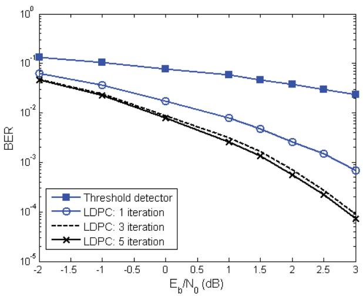  
รูปที่ 4.16 สมรรถนะของระบบในรูปที่ 4.5 เมื่อวงจรถอดรหัสแอลดีพีชีทำงานที่การวนซ้ำในรอบต่างๆ

โดยที่ $E _ { b } = 1$ คือพลังงานของบิตข้อมูลอินพุตหนึ่งบิต, $N _ { 0 } / 2$ คือความหนาแน่นสเปกตรัมกำลัง แบบสองด้าน (two-sided power spectral density) ของสัญญาณsบกวน $w _ { n } \sim \mathcal { N } \big ( 0 , \sigma ^ { 2 } \big )$ $\sigma ^ { 2 } = N _ { 0 } / \left( 2 T \right)$ , และ T คือคาบเวลาของข้อมูลอินพุตบิต $m _ { n }$ นอกจากนี้ค่าอัตราข้อผิดพลาด ของบิต (BER: bit-error rate) ของแต่ละ SNR หาได้จากการส่งข้อมูลอินพุตหลายๆ บล็อก (บล็อกละ 6 บิต) เข้าไปในระบบ จนกระทั่งวงจรถอดรหัสข้อมูลตรวจพบข้อผิดพลาดที่เกิดขึ้นได้ รวมไม่น้อยกว่า 1000 บิต

รูปที่ 4.16 แสดงสมรรถนะของระบบเมื่อวงจรถอดรหัสแอลดีพีซีทำงาน ณ การวนซ้ำใน รอบต่างๆ เมื่อเส้นกราฟที่ชื่อว่า "Threshold detector" หมายถึงวงจรถอดรหัสข้อมูลที่ใช้ในรูปที่ 4.5 จะเปลี่ยนจากวงจรถอดรหัสแอลดีพีซีเป็นวงจรตรวจหาขีดเริ่มเปลี่ยนที่มีกฎการตัดสินใจคือ

$$
{ \hat { m } } _ { n } = \left\{ { \begin{array} { l l } { 1 , } & { { \mathrm { i f } } \ r _ { n } \geq 0 } \\ { 0 , } & { { \mathrm { i f } } \ r _ { n } < 0 } \end{array} } \right.\tag{4.86}
$$

สำหรับ $n = \{ 1 , 2 , . . . , 6 \}$ จากรูปจะพบว่าวงจรถอดรหัสแอลดีพีซีมีสมรรถนะดีกว่าวงจรตรวจหา ขีดเริ่มเปลี่ยนมาก โดยเฉพาะอย่างยิ่งเมื่อจำนวนรอบของการวนซ้ำ (iteratioก) ภายในวงจรถอดรหัส แอลดีพีซีเพิ่มขึ้น อย่างไรก็ตามเมื่อจำนวนรอบของการวนซ้ำเพิ่มขึ้นจนถึงระดับหนึ่ง ก็จะพบว่า สมรรถนะของวงจรถอดรหัสแอลดีพีซีเริ่มที่จะคงที่ (ในที่นี้จะเห็นว่าสมรรถนะของวงจรถอดรหัส แอลดีพีซีในรอบที่ 3 และ 5 มีค่าใกล้เคียงกัน) ข้อสรุปนี้สามารถยืนยันได้โดยการวาดกราฟแสดง ค่า BER ในแต่ละรอบของการวนซ้ำ ณ ค่า รNR ต่างๆ ตามที่แสดงในรูปที่ 4.17 ซึ่งพบว่าหลังจาก การวนซ้ำในรอบที่ 4 สมรรถนะของวงจรถอดรหัสแอลดีพีซีจะเริ่มมีคงที่ ซึ่งปรากฏการณ์นี้เรียกว่า ระบบเกิดพื้นข้อผิดพลาด20 (error floor)

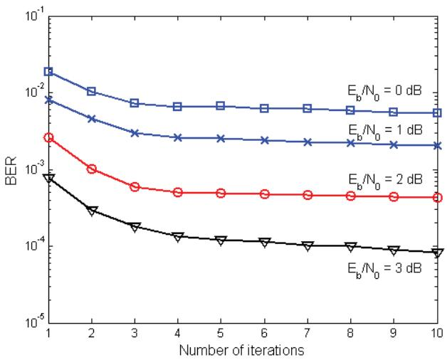  
รูปที่ 4.17 สมรรถนะของวงจรถอดรหัสแอลดีพีซี ณ การวนซ้ำในรอบต่างๆ

ในส่วนต่อไปนี้จะเปรียบเทียบสมรรถนะของรหัสแอลดีพีซีที่ใช้เมทริกซ์พาริตีเซ็ก H แบบ มีวัฏจักรและแบบไม่มีวัฏจักร โดยในที่นี้จะทำการแก้ไขเมทริกซ์ H ในสมการ (4.74) ให้มีวัฏจักร จำนวน 2 วัฏจักรดังนี้

$$
\begin{array} { r }  \tilde { \mathbf { H } } = [ \begin{array} { l l l l l l l l l l l l l l } { 1 } & { 0 } & { 0 } & { 1 } & { 0 } & { 0 } & { \tilde { 1 } } & { 0 } & { 0 } & { \tilde { 1 } } & { 0 } & { 0 } & { 1 } & { 0 } & { 0 } \\ { 0 } & { 1 } & { 0 } & { 0 } & { 1 } & { 0 } & { 0 } & { 1 } & { 0 } & { 0 } & { \tilde { 1 } } & { 0 } & { 0 } & { \tilde { 1 } } & { 0 } \\ { 0 } & { 0 } & { 1 } & { 0 } & { 0 } & { 1 } & { 0 } & { 0 } & { 1 } & { 0 } & { 0 } & { 1 } & { 0 } & { 0 } & { 1 } \\ { 0 } & { 0 } & { 0 } & { 1 } & { 0 } & { 0 } & { 0 } & { 0 } & { 0 } & { 1 } & { 0 } & { 0 } & { 1 } & { 0 } & { 0 } \\ { 0 } & { 0 } & { 0 } & { 0 } & { 1 } & { 0 } & { 0 } & { 0 } & { 0 } & { 1 } & { 0 } & { 1 } & { 0 } & { 1 } & { 0 } \\ { 0 } & { 0 } & { 0 } & { 0 } & { 0 } & { 1 } & { 0 } & { 0 } & { 0 } & { \tilde { 1 } } & { 0 } & { 0 } & { 1 } & { 0 } & { 0 } \\ { 0 } & { 0 } & { 0 } & { 0 } & { 0 } & { 1 } & { 0 } & { 1 } & { 0 } & { 0 } & { 0 } & { 0 } & { 0 } & { 0 } & { 1 } \\ { 0 } & { 0 } & { 0 } & { 0 } & { 0 } & { 1 } & { 0 } & { 0 } & { 0 } & { 0 } & { \tilde { 1 } } & { 0 } & { 0 } & { \tilde { 1 } } \\ { 0 } & { 0 } & { 0 } & { 0 } & { 0 } & { 0 } & { 1 } & { 0 } & { 0 } & { 0 } & { 1 } &  1  \end{array} \end{array}\tag{4.87}
$$

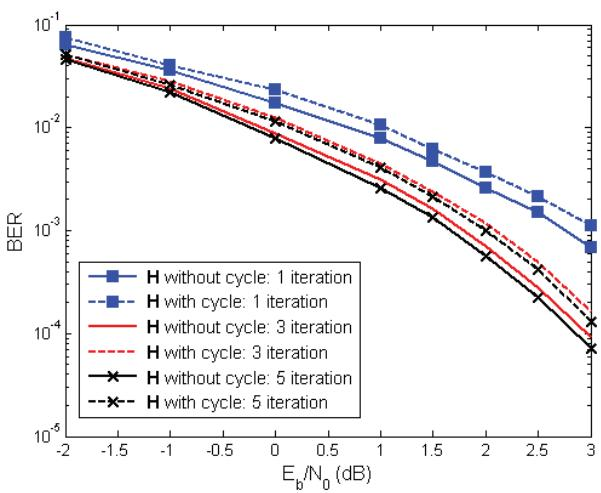  
รูปที่ 4.18 เปรียบเทียบสมรรถนะของรหัสแอลดีพีชี่ใช้เมทริกซ์ H แบบมีวัฏจักรและแบบไม่มีวัฏจักร

เมื่อ 1 และ 1 แสดงตำแหน่งที่เมทริกซ์ H เกิดวัฏจักร รูปที่ 4.18 เปรียบเทียบสมรรถนะของรหัส แอลดีพีซีที่ใช้เมทริกซ์ H แบบมีวัฏจักรและแบบไม่มีวัฏจักร โดยที่เส้นทึบคือเมทริกซ์ H แบบไม่มี วัฏจักร และเส้นปะคือเมทริกซ์ H แบบมีวัฏจักร ซึ่งเห็นได้ชัดเจนว่ารหัสแอลดีพีซีที่ใช้เมทริกซ์ H แบบไม่มีวัฏจักรให้สมรรถนะดีกว่ารหัสแอลดีพีชีที่ใช้เมทริกซ์ H แบบมีวัฏจักรในทุกรอบของการ วนซ้ำ ดังนั้นรหัสแอลดีพีซีที่ดีไม่ควรใช้เมทริกซ์ H ที่มีวัฏจักร [4, 5]

## 4.6.2 ช่องสัญญาณแบบวนซ้ำ

ในส่วนนี้จะแสดงสมรรถนะของอีควอไลเซอร์แบบเทอร์โบที่อธิบายในหัวข้อที่ 2.4 ซึ่งเป็นเทคนิค การถอดรหัสแบบวนซ้ำ โดยอาศัยการทำงานร่วมกันระหว่างวงจรตรวจหาแบบซอฟต์และวงจร ถอดรหัสแอลดีพีซีตามที่แสดงในรูปที่ 4.19 โดยที่รหัสแอลดีพีชีที่ใช้คือรหัสแอลดีพีซีแบบแถว ลำดับที่ถูกปรับปรุง (MAต) ที่มีเมทริกซ์พาริตีเช็ก H ตามสมการ (4.71) โดยใช้พารามิเตอร์ $j = 4$ e   
k = 40 และ $p = 1 0 3$ นั่นคือรหัสแอลดีพีซีนี้จะเข้ารหัสข้อมูลอินพุตครั้งละ (40 - 3)×103 = 3708 บิต และให้คำรหัสขนาด 40×103 = 4120 บิต (มีบิตพาริตีจำนวน 4120 - 3708 = 412 บิต) ซึ่ง จะได้ว่ารหัสแอลดีพีซีนี้มีอัตรารหัส $R = K / N = 0 . 9$

จากรูปที่ 4.19 ข่าวสาร $m _ { n } \in \{ 0 , 1 \}$ ที่มีคาบเวลาของบิตเท่ากับ T ขนาด 3708 บิต ถูกส่งเข้าวงจรเข้ารหัสแอลดีพีซีและวงจรเข้าคู่ทำให้ได้เป็นลำดับข้อมูล $s _ { n } \in \{ \pm 1 \}$ ขนาด 4120 บิต จากนั้นลำดับข้อมูล $s _ { n }$ จะถูกส่งผ่านช่องสัญญาณที่มีฟังก์ชันถ่ายโอน $H \left( D \right) = \sum _ { i = 0 } ^ { 2 } h _ { i } D ^ { i } =$ $1 + 2 D + D ^ { 2 }$ โดยที่ D คือตัวดำเนินการหน่วงเวลาหนึ่งหน่วย ทำให้ได้เป็นสัญญาณอ่านกลับ

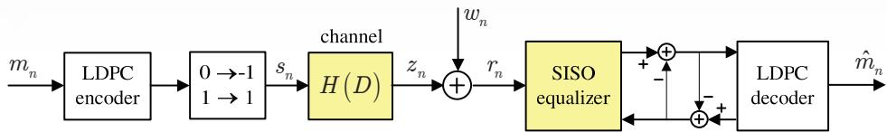  
รูปที่ 4.19 แบบจำลองช่องสัญญาณที่ใช้ระบบการถอดรหัสแบบวนซ้ำ

$$
r _ { n } = s _ { n } * h _ { n } + w _ { n }\tag{4.88}
$$

เมื่อ $h _ { n }$ คือค่าสัมประสิทธิ์ตัวที่ n ของช่องสัญญาณ, \* คือตัวดำเนินการคอนโวลูชัน, และ $w _ { n }$ คือ สัญญาณรบกวนเกาส์สีขาวแบบบวกที่มีค่าเฉลี่ยเท่ากับศูนย์และค่าความแปรปรวนเท่ากับ N/(2T) จากนั้นลำดับข้อมูล $r _ { n }$ ก็จะถูกทำการถอดรหัสแบบวนซ้ำซึ่งมีการแลกเปลี่ยนข่าวสารแบบซอฟต์ ระหว่าง "รเร0 eqนลlizer" (นั้นคือวงจรตรวจหาแบบซอฟต์แบบต่างๆ ตามที่อธิบายในบทที่ 3) และวงจรถอดรหัสแอลดีพีซีที่มีการวนซ้ำภายในอัลกอริทึม MP จำนวน 3 รอบ นอกจากนี้ค่า SNR ที่ใช้สำหรับระบบที่ถูกเข้ารหัส (coded system) จะนิยามโดย

$$
\frac { E _ { c } } { N _ { 0 } } { = } 1 0 \log _ { 1 0 } \left( \frac { \sum _ { i } \left| h _ { i } \right| ^ { 2 } } { N _ { 0 } R } \right)\tag{4.89}
$$

เมื่อ $E _ { c } = 1$ คือพลังงานของบิตข้อมูลที่ถูกเข้ารหัสหนึ่งบิต และค่า BER ของแต่ละ SNR ได้มา จากการส่งข้อมูลอินพุตหลายๆ บล็อก (บล็อกละ 3708 บิต) เข้าไปในระบบ จนกระทั่งวงจรถอดรหัส แอลดีพีซีตรวจพบข้อผิดพลาดที่เกิดขึ้นได้รวมไม่น้อยกว่า 1000 บิดต หลังจากระบบทำงานแบบ วนซ้ำผ่านไปในรอบที่ 5

รูปที่ 4.20 และรูปที่ 4.21 เปรียบเทียบสมรรถนะของวงจรตรวจหา BCJR และ SOVA   
ที่ทำงานร่วมกับวงจรถอดรหัสแอลดีพีซี ในรูปของค่า BER และอัตราข้อผิดพลาดของเซกเตอร์21   
(SER: sector-error rate) โดยที"0.5 iteration" หมายถึงสมรรถนะของระบบที่ด้านขาออกของ   
วงจรตรวจหาแบบซอฟต์ในรอบแรก (ก่อนส่งผลลัพธ์ไปยังวงจรถอดรหัสแอลดีพีซี) จากรูปจะพบว่า - ซ   
ระบบมีสมรรถนะดีขึ้นเมื่อจำนวนรอบของการถอดรหัสแบบวนซ้ำเพิ่มขึ้น และระบบที่ใช้วงจรตรวจหา   
BCJR มีสมรรถนะดีกว่าระบบที่ใช้วงจรตรวจหา รOVA ทั้งนี้เป็นเพราะว่าอัลกอริทึม BCJR จะให้   
ค่า LLR บิตข้อมูลที่มีคุณภาพมากกว่าอัลกอริทีม รOVA (ตามที่อธิบายในบทที่3) นอกจากนี้

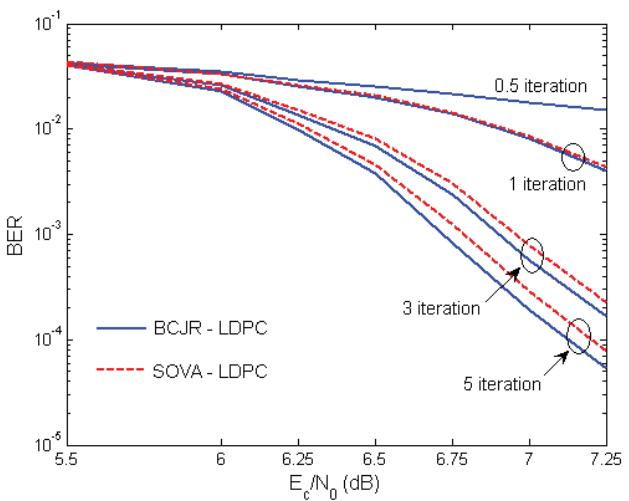  
รูปที่ 4.20 เปรียบเทียบสมรรถนะของวงจรตรวจหา BCJR และ SOVA ในรูปของค่า BER

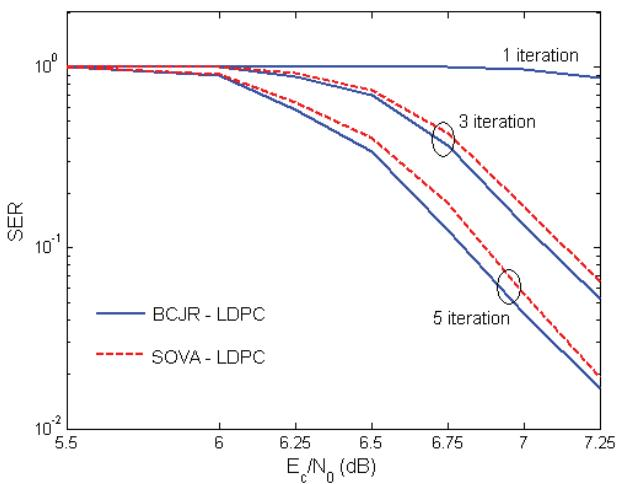  
รูปที่ 4.21 เปรียบเทียบสมรรถนะของวงจรตรวจหา BCJR และ S0OVA ในรูปของค่า SER

เส้นกราฟ 0.5 iteratioท" ยังสามารถใช้แทนสมรรถนะของระบบที่ไม่ถูกเข้ารหัส (uncoded รystem) ได้ด้วย ซึ่งทำให้เห็นว่าระบบที่ถูกเข้ารหัสจะมีสมรรถนะดีกว่าระบบที่ไม่ถูกเข้ารหัสเสมอ ดังนั้นจึง สรุปได้ว่าระบบการถอดรหัสแบบวนซ้ำสามารถช่วยเพิ่มสมรรถนะของระบบให้ดียิ่งขึ้นได้

รูปที่ 4.22 เปรียบเทียบสมรรถนะของวงจรตรวจหา BCJR และ รOVA ณ การวนซ้ำใน รอบต่างๆ ซึ่งแสดงให้เห็นว่าระบบที่ใช้วงจรตรวจหา BCIR มีสมรรถนะดีกว่าระบบที่ใช้วงจรตรวจหา

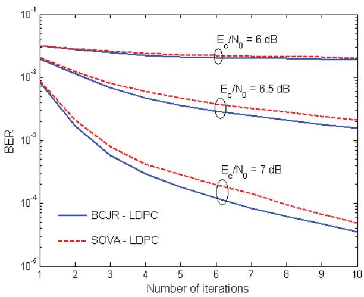  
รูปที่ 4.22 สมรรถนะของวงจรถอดรหัสแอลดีพีซี ณ การวนซ้ำในรอบต่างๆ

SOVA ในทุกรอบของการวนซ้ำ ในทำนองเดียวกันเมื่อจำนวนรอบของการถอดรหัสแบบวนซ้ำ De สร์   
เพิ่มขึน ก็จะทำให้ระบบมีสมรรถนะที่ดีขึนเสมอ

## 4.7 สรุปท้ายบท

รหัสแอลดีพีซี (LDPC: low-density parity-check) คือรหัสแก้ไขข้อผิดพลาดที่ดีสุดในปัจจุบัน [2, 5, 8] ซึ่งได้มีการนำใช้งานจริงในหลายๆ งานประยุกต์ รวมทั้งในฮาร์ดดิสก์ไดรฟด้วย

เนื่องจากรหัสแอลดีพีซีเป็นรหัสบล็อกเชิงเส้นประเภทหนึ่ง ดังนั้นในบทนี้จึงเริ่มต้นด้วย การอธิบายขั้นตอนการเข้ารหัสและถอดรหัสของรหัสบล็อกเชิงเส้น รวมทั้งความหมายของเมทริกซ์ ตัวกำเนิดและเมทริกซ์พาริตีเช็ก จากนั้นจึงได้อธิบายพื้นฐานของรหัสแอลดีพีซี และแสดงรายละเอียด ของการเข้ารหัสและถอดรหัสแอลดีพีซี โดยจากการทดลองพบว่าสมรรถนะของรหัสแอลดีพีซีจะขึน อยู่กับเมทริกซ์พาริตีเช็กที่ใช้ ซึ่งในหัวข้อที่ 4.5 ก็ได้แสดงตัวอย่างการสร้างเมทริกซ์พาริตีเช็กแบบ ต่างๆ โดยเมทริกซ์พาริตีเช็กที่ดีจะต้องไม่วัฎจักรที่มีความยาวเท่ากับ 4 และควรมีการกระจายตัวของ เลข 1 (ภายในเมทริกซ์พาริตีเช็ก) เป็นแบบสุ่มให้มากที่สุด เพื่อให้รหัสแอลดีพีซีมีสมรรถนะสูงสุด [17] นอกจากนี้ยังได้แสดงตัวอย่างการนำรหัสแอลดีพีซีไปใช้ในระบบการถอดรหัสแบบวนซ้ำของ 2 ช่องสัญญาณฮาร์ดดิสก์ไดรฟ์ ซึงผลการทดลองแสดงให้เห็นว่าการถอดรหัสแบบวนซ้ำสามารถช่วย เพิ่มสมรรถนะของระบบให้ดียิ่งขึ้นได้ โดยระบบมีสมรรถนะดีขึ้นเมื่อจำนวนรอบของการถอดรหัส แบบวนซำเพิ่มขื่น

## 4.8 แบบฝึกหัดท้ายบท

1.จงอธิบายความหมายของข่าวสารอินทรินซิกและข่าวสารเอกซ์ทรินซิก

2. จงอธิบายหลักการถอดรหัสแบบซินโดรมในหัวข้อ 4.1.5 พร้อมทั้งยกตัวอย่างการคำนวณ

3. กำหนดให้รหัสแอลดีพีซีมีเมทริกซ์ตัวกำเนิด $\mathbf { G } = \left[ \begin{array} { l l l l l } { 1 } & { 0 } & { 1 } & { 1 } & { 0 } \\ { 0 } & { 1 } & { 1 } & { 0 } & { 1 } \end{array} \right]$ จงหาเมทริกซัพาริติเช็ก H และวาดกราฟแทนเนอร์ของเมทริกซ์ H

4. จงเข้ารหัสข้อมูล m = [1101] และ m = [1011] โดยใช้เมทริกซีพาริตีเช็ก H ซึ่งสอดคล้อง กับเมทริกซ์ตัวกำเนิด G ในสมการ (4.25)

5. จากเมทริกซ์พาริตีเช็ก H ในสมการ (4.74) จงเข้ารหัสข้อมูล m = [101011] และ m = [111010]

6. จากแบบจำลองช่องสัญญาณในรูปที่ 4.5 ถ้ากำหนดให้บิตข้อมูลอินพุต $m _ { n } = \{ 1 , 1 , 0 \}$ ,รหัส แอลดีพีชีที่ใช้มีเมทริกซ์ตัวกำเนิด G ตามสมการ (4.4), สัญญาณรบกวน $w _ { n } = \{ 0 . 2 , 0 . 3$ —0.1, –0.2, 0.5, −0.4} และมีความแปรปรวนเท่ากับ $\sigma ^ { 2 } = 0 . 5$ จงหาค่า LLR แบบอะโพส เทอริออริ $\left\{ \lambda _ { 1 } , \lambda _ { 2 } , \lambda _ { 3 } , \lambda _ { 4 } , \lambda _ { 5 } , \lambda _ { 6 } \right\}$ เมื่อสิ้นสุดการวนซ้ำรอบที่ 3

7.จากแบบจำลองช่องสัญญาณในรูปที่ 4.19 ถ้ากำหนดให้ลำดับข้อมูลอินพุต $m _ { n } = \{ 1 , 1 \}$ , รหัส แอลดีพีชีที่ใช้มีเมทริกซ์ตัวกำเนิด

$$
\mathbf { G } = \left[ { \begin{array} { l l l l l } { 1 } & { 0 } & { 1 } & { 1 } & { 0 } \\ { 0 } & { 1 } & { 1 } & { 0 } & { 1 } \end{array} } \right] ,
$$

ช่องสัญญาณ $H ( D ) = 1 + D .$ สัญญาณรบกวน $w _ { n } = \{ 0 . 3 , - 0 . 2 , 0 . 1 , 0 . 2 , - 0 . 4 , - 0 . 5 \}$ และมีความแปรปรวนเท่ากับ $\sigma ^ { 2 } = 0 . 5$ จงถอดรหัสลำดับข้อมูล $r _ { n }$ โดยใช้อีควอไลเซอร์แบบ เทอร์โบเมื่อสิ้นสุดการวนซ้ำรอบที่ 3 โดยที่วงจรถอดรหัสแอลดีพีซีที่ใช้มีการวนซ้ำภายใน อัลกอริทึม MP จำนวน 3 รอบ และอีควอไลเซอร์แบบ รเร0 ที่ใช้สร้างมาจาก

7.1) อัลกอริทึม BCJR

7.2) อัลกอริทึม Max-Log-MAP

7.3) อัลกอริทึม Log-MAP

7.4) อัลกอริทึม SOVA