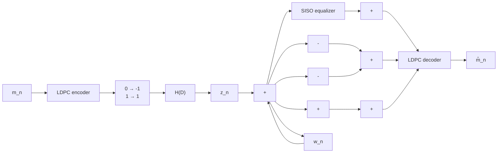
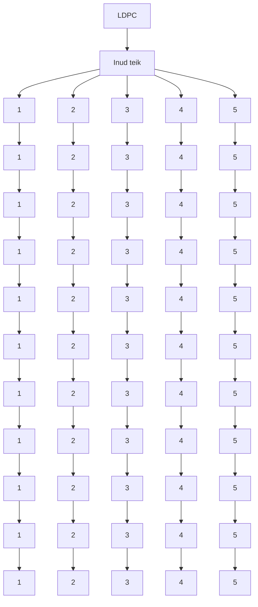
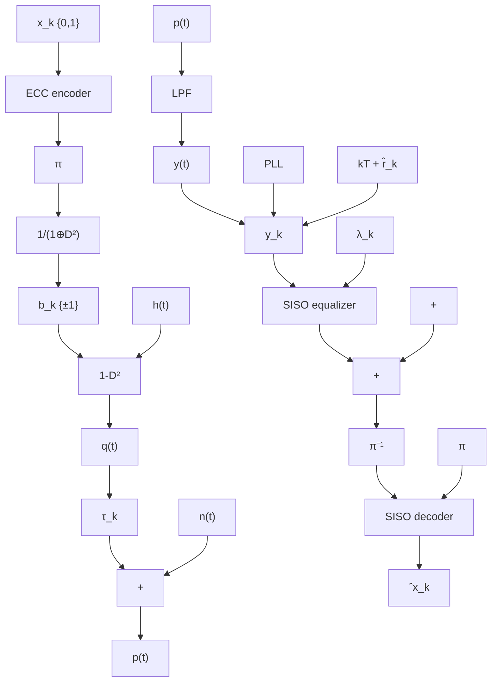
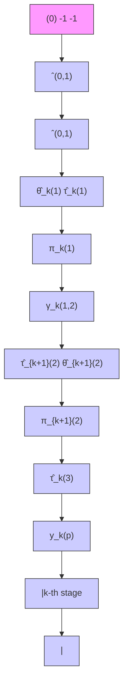
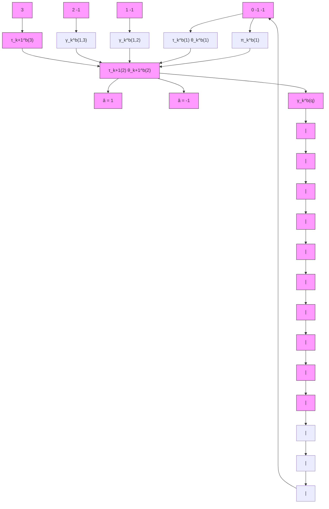

ไม่ต้องเก็บค่าเมทริกซ์ H ทั้งหมด เพียงแต่จัดเก็บเฉพาะลักษณะโครงสร้างของเมทริกซ์ H และ เมทริกซ์การเรียงสับเปลี่ยน  เท่านั้น จึงทำให้ปริมาณหน่วยความจำที่ต้องใช้ในชิปประมวลผล ลดลงอย่างมาก ดังนั้นหลังจากปี ค.ศ. 2000 เป็นต้นมา งานวิจัยทางด้านรหัสแอลดีพีซีจะเน้นไปที การพัฒนาเมทริกซ์ H เชิงโครงสร้าง โดยมีวัตถฤุประสงค์เพื่อให้เมทริกซ์ H มีลักษณะเป็นเมทริกซ์ สุ่มให้มากที่สุด และมีขั้นตอนการเข้ารหัส/ถอดรหัสที่ง่ายขึ้น ตัวอย่างเช่น ในหัวข้อที่4.5.3 ได้ อธิบายแอลดีพีซีแบบแถวลำดับที่ถูกปรับปรุง (MAC) ซึ่งพัฒนาโดย Eleftherioน [55] ในปี ค.ศ. 2002 สำหรับผู้สนใจที่ต้องการศึกษารายละเอียดเกี่ยวกับรหัสแอลดีพีชีที่ใช้ในระบบประมวลผล สัญญาณของฮาร์ดดิสก์ไดรฟิสามารถดูได้จาก [5, 8]

เพราะฉะนั้นสาเหตุที่ฮาร์ดดิสก์ไดรฟ์ไม่ได้นำรหัสแอลดีพีซีมาใช้งานในอดีตเป็นเพราะว่า ซ ระบบการประมวลผลสัญญาณของฮาร์ดดิสก์ไดรฟ์จะต้องเขียนและอ่านข้อมูลครั้งละหนึ่งเซกเตอร์ (4096 บิต หรือ 4 กิโลไบต์) ซึ่งมีผลทำให้เมทริกซ์ H มีขนาดใหญ่มาก (สำหรับรหัสแอลดีพีซีที่มี อัตรารหัสมากกว่า 0.9) นั้นคือชิปช่องสัญญาณอ่าน (read-chanทel chip) จะมีราคาสูงมาก ซึ่งไม่ คุมค่ากับการลงทุนเมื่อเทียบกับสมรรถนะของระบบที่เพิ่มขึ้น อย่างไรก็ตามหลังจากทีได้มีการพัฒนา ร่ท เมทริกซ์ H เชิงโครงสร้างตั้งแต่ปี ค.ศ. 2000 เป็นต้นมา ก็เริ่มส่งผลให้ฮาร์ดดิสก์ไดรฟรุ่นใหม่ๆ ในปัจจุบันสามารถนำรหัสแอลดีพีซีมาใช้จริงในชิปช่องสัญญาณอ่านได้ โดยจะนำรหัสแอลดีพีซีมา ใช้สำหรับการถอดรหัสแบบวนซ้ำ (iterative decoding) ซึ่งเป็นการทำงานร่วมกันระหว่างวงจร ตรวจหา รOVA และวงจรถอดรหัสแอลดีพีซี

# 4.6 ผลการทดลอง

ในหัวข้อนี้จะทดสอบสมรรถนะของรหัสแอลดีพีซีที่ใช้ในช่องสัญญาณ AพGN และช่องสัญญาณ ฮาร์ดดิสก์ไดรฟ์ที่ใช้เทคนิคการถอดรหัสแบบวนซ้ำ เพื่อแสดงความสามารถของรหัสแอลดีพีซี e

# 4.6.1 ช่องสัญญาณ AพGN

พิจารณาช่องสัญญาณ AพGN ในรูปที่ 4.5 เมื่อรหัสแอลดีพีซีที่ใช้คือรหัสแอลดีพีซีแบบแถวลำดับ ที่ถูกปรับปรุง (MAC) ที่มีเมทริกซ์พาริตีเช็ก H ขนาด 9×15 ตามสมการ (4.74) นั่นคือรหัสแอล ดีพีซีนี้จะเข้ารหัสข้อมูลอินพุตครั้งละ 6 บิตและให้คำรหัสขนาด 15 บิต (บิตพาริตีมีจำนวน 9 บิต) นอกจากนีค่าอัตราส่วนกำลังของสัญญาณต่อกำลังของสัญญาณรบกวน (รทR) นิยามโดย

$$
\mathrm{SNR} = 1 0 \log_ {1 0} \left(\frac {E _ {b}}{N _ {0}}\right) \tag {4.85}
$$


<details>
<summary>flowchart</summary>

Diagram illustrating the convergence behavior of LDPC and Inud te็ก systems over iterations, with nodes 1-5 and associated error rates.
</details>


<details>
<summary>line</summary>

| E_b/N_0 (dB) | Threshold detector | LDPC: 1 iteration | LDPC: 3 iteration | LDPC: 5 iteration |
| ------------ | ------------------ | ----------------- | ----------------- | ----------------- |
| -2.0         | 0.1                | 0.05              | 0.03              | 0.02              |
| -1.5         | 0.08               | 0.04              | 0.02              | 0.01              |
| -1.0         | 0.06               | 0.03              | 0.01              | 0.005             |
| -0.5         | 0.04               | 0.02              | 0.005             | 0.002             |
| 0.0          | 0.03               | 0.01              | 0.002             | 0.001             |
| 0.5          | 0.02               | 0.005             | 0.001             | 0.0005            |
| 1.0          | 0.015              | 0.003             | 0.0005            | 0.0002            |
| 1.5          | 0.01               | 0.002             | 0.0003            | 0.0001            |
| 2.0          | 0.008              | 0.001             | 0.0002            | 0.00005           |
| 2.5          | 0.006              | 0.0005            | 0.0001            | 0.00002           |
| 3.0          | 0.004              | 0.0003            | 0.00005           | 0.00001           |
</details>

รูปที่ 4.16 สมรรถนะของระบบในรูปที่ 4.5 เมื่อวงจรถอดรหัสแอลดีพีชีทำงานที่การวนซ้ำในรอบต่างๆ

โดยที่ $E _ { b } = 1$ คือพลังงานของบิตข้อมูลอินพุตหนึ่งบิต, $N _ { 0 } / 2$ คือความหนาแน่นสเปกตรัมกำลัง แบบสองด้าน (two-sided power spectral density) ของสัญญาณsบกวน $w _ { n } \sim \mathcal { N } \big ( 0 , \sigma ^ { 2 } \big )$ $\sigma ^ { 2 } = N _ { 0 } / \left( 2 T \right)$ , และ T คือคาบเวลาของข้อมูลอินพุตบิต $m _ { n }$ นอกจากนี้ค่าอัตราข้อผิดพลาด ของบิต (BER: bit-error rate) ของแต่ละ SNR หาได้จากการส่งข้อมูลอินพุตหลายๆ บล็อก (บล็อกละ 6 บิต) เข้าไปในระบบ จนกระทั่งวงจรถอดรหัสข้อมูลตรวจพบข้อผิดพลาดที่เกิดขึ้นได้ ท รวมไม่น้อยกว่า 1000 บิต

รูปที่ 4.16 แสดงสมรรถนะของระบบเมื่อวงจรถอดรหัสแอลดีพีซีทำงาน ณ การวนซ้ำใน รอบต่างๆ เมื่อเส้นกราฟที่ชื่อว่า "Threshold detector" หมายถึงวงจรถอดรหัสข้อมูลที่ใช้ในรูปที่ 4.5 จะเปลี่ยนจากวงจรถอดรหัสแอลดีพีซีเป็นวงจรตรวจหาขีดเริ่มเปลี่ยนที่มีกฎการตัดสินใจคือ

$$
\hat {m} _ {n} = \left\{ \begin{array}{l l} 1, & \text { if } r _ {n} \geq 0 \\ 0, & \text { if } r _ {n} <   0 \end{array} \right. \tag {4.86}
$$

สำหรับ $n = \{ 1 , 2 , . . . , 6 \}$ จากรูปจะพบว่าวงจรถอดรหัสแอลดีพีซีมีสมรรถนะดีกว่าวงจรตรวจหา ขีดเริ่มเปลี่ยนมาก โดยเฉพาะอย่างยิ่งเมื่อจำนวนรอบของการวนซ้ำ (iteratioท) ภายในวงจรถอดรหัส แอลดีพีซีเพิ่มขึ้น อย่างไรก็ตามเมื่อจำนวนรอบของการวนซ้ำเพิ่มขึ้นจนถึงระดับหนึ่ง ก็จะพบว่า สมรรถนะของวงจรถอดรหัสแอลดีพีซีเริ่มที่จะคงที่ (ในที่นี้จะเห็นว่าสมรรถนะของวงจรถอดรหัส แอลดีพีซีในรอบที่ 3 และ 5 มีค่าไกล้เคียงกัน) ข้อสรุปนี้สามารถยืนยันได้โดยการวาดกราฟแสดง ค่า BER ในแต่ละรอบของการวนซ้ำ ณ ค่า รNR ต่างๆ ตามที่แสดงในรูปที่ 4.17 ซึ่งพบว่าหลังจาก การวนซ้ำในรอบที่ 4 สมรรถนะของวงจรถอดรหัสแอลดีพีซีจะเริมมีคงที่ ซึ่งปรากฏการณ์นี้เรียกว่า ระบบเกิดพื้นข้อผิดพลาด20 (error floor)


<details>
<summary>line</summary>

| Number of iterations | E_b/N_0 = 0 dB | E_b/N_0 = 1 dB | E_b/N_0 = 2 dB | E_b/N_0 = 3 dB |
| -------------------- | -------------- | -------------- | -------------- | -------------- |
| 1                    | 0.01           | 0.005          | 0.002          | 0.001          |
| 2                    | 0.008          | 0.004          | 0.001          | 0.0005         |
| 3                    | 0.006          | 0.003          | 0.0008         | 0.0003         |
| 4                    | 0.005          | 0.0025         | 0.0006         | 0.0002         |
| 5                    | 0.0045         | 0.002          | 0.0005         | 0.00015        |
| 6                    | 0.004          | 0.0018         | 0.00045        | 0.0001         |
| 7                    | 0.0038         | 0.0016         | 0.0004         | 0.00008        |
| 8                    | 0.0036         | 0.0015         | 0.00038        | 0.00007        |
| 9                    | 0.0035         | 0.0014         | 0.00035        | 0.00006        |
| 10                   | 0.0034         | 0.0013         | 0.00033        | 0.00005        |
</details>

รูปที่ 4.17 สมรรถนะของวงจรถอดรหัสแอลดีพีซี ณ การวนซ้ำในรอบต่างๆ

ในส่วนต่อไปนี้จะเปรียบเทียบสมรรถนะของรหัสแอลดีพีซีที่ใช้เมทริกซ์พาริตีเซ็ก H แบบ มีวัฏจักรและแบบไม่มีวัฏจักร โดยในที่นี้จะทำการแก้ไขเมทริกซ์ H ในสมการ (4.74) ให้มีวัฏจักร จำนวน 2 วัฏจักรดังนี้

$$
\tilde {\mathbf {H}} = \left[ \begin{array}{c c c c c c c c c c c c c c c} 1 & 0 & 0 & 1 & 0 & 0 & \tilde {1} & 0 & 0 & \tilde {1} & 0 & 0 & 1 & 0 & 0 \\ 0 & 1 & 0 & 0 & 1 & 0 & 0 & 1 & 0 & 0 & \hat {1} & 0 & 0 & \hat {1} & 0 \\ 0 & 0 & 1 & 0 & 0 & 1 & 0 & 0 & 1 & 0 & 0 & 1 & 0 & 0 & 1 \\ 0 & 0 & 0 & 1 & 0 & 0 & 0 & 0 & 1 & 0 & 1 & 0 & 1 & 0 & 0 \\ 0 & 0 & 0 & 0 & 1 & 0 & \tilde {1} & 0 & 0 & \tilde {1} & 0 & 1 & 0 & 1 & 0 \\ 0 & 0 & 0 & 0 & 0 & 1 & 0 & 1 & 0 & 0 & 0 & 0 & 0 & 0 & 1 \\ 0 & 0 & 0 & 0 & 0 & 0 & 1 & 0 & 0 & 0 & \hat {1} & 0 & 0 & \hat {1} & 1 \\ 0 & 0 & 0 & 0 & 0 & 0 & 0 & 1 & 0 & 0 & 0 & 1 & 1 & 0 & 0 \\ 0 & 0 & 0 & 0 & 0 & 0 & 0 & 0 & 1 & 1 & 0 & 0 & 0 & 0 & 0 \end{array} \right] \tag {4.87}
$$


<details>
<summary>flowchart</summary>


</details>


<details>
<summary>line</summary>

| E_b/N_0 (dB) | H without cycle: 1 iteration | H with cycle: 1 iteration | H without cycle: 3 iteration | H with cycle: 3 iteration | H without cycle: 5 iteration | H with cycle: 5 iteration |
| ------------ | ---------------------------- | ------------------------- | ---------------------------- | ------------------------- | ---------------------------- | ------------------------- |
| -2.0         | 0.1                          | 0.1                       | 0.1                          | 0.1                       | 0.1                          | 0.1                       |
| -1.5         | 0.05                         | 0.05                      | 0.05                         | 0.05                      | 0.05                         | 0.05                      |
| -1.0         | 0.02                         | 0.02                      | 0.02                         | 0.02                      | 0.02                         | 0.02                      |
| -0.5         | 0.01                         | 0.01                      | 0.01                         | 0.01                      | 0.01                         | 0.01                      |
| 0.0          | 0.005                        | 0.005                     | 0.005                        | 0.005                     | 0.005                        | 0.005                     |
| 0.5          | 0.002                        | 0.002                     | 0.002                        | 0.002                     | 0.002                        | 0.002                     |
| 1.0          | 0.001                        | 0.001                     | 0.001                        | 0.001                     | 0.001                        | 0.001                     |
| 1.5          | 0.0005                       | 0.0005                    | 0.0005                       | 0.0005                    | 0.0005                       | 0.0005                    |
| 2.0          | 0.0002                       | 0.0002                    | 0.0002                       | 0.0002                    | 0.0002                       | 0.0002                    |
| 2.5          | 0.0001                       | 0.0001                    | 0.0001                       | 0.0001                    | 0.0001                       | 0.0001                    |
| 3.0          | 0.00005                      | 0.00005                   | 0.00005                      | 0.00005                   | 0.00005                      | 0.00005                   |
</details>

รูปที่ 4.18 เปรียบเทียบสมรรถนะของรหัสแอลดีพีชีที่ใช้เมทริกซ์ H แบบมีวัฏจักรและแบบไม่มีวัฏจักร

เมื่อ 1 และ 1 แสดงตำแหน่งที่เมทริกซ์ H เกิดวัฏจักร รูปที่ 4.18 เปรียบเทียบสมรรถนะของรหัส แอลดีพีซีที่ใช้เมทริกซ์ H แบบมีวัฏจักรและแบบไม่มีวัฏจักร โดยที่เส้นทึบคือเมทริกซ์ H แบบไม่มี วัฏจักร และเส้นปะคือเมทริกซ์ H แบบมีวัฏจักร ซึ่งเห็นได้ชัดเจนว่ารหัสแอลดีพีซีที่ใช้เมทริกซ์ H แบบไม่มีวัฏจักรให้สมรรถนะดีกว่ารหัสแอลดีพีชีที่ใช้เมทริกซ์ H แบบมีวัฏจักรในทุกรอบของการ วนซ้ำ ดังนั้นรหัสแอลดีพีซีที่ดีไม่ควรใช้เมทริกซ์ H ที่มีวัฏจักร [4, 5] ซ

# 4.6.2 ช่องสัญญาณแบบวนซ้ำ

ในส่วนนี้จะแสดงสมรรถนะของอีควอไลเซอร์แบบเทอร์โบที่อธิบายในหัวข้อที่ 2.4 ซึ่งเป็นเทคนิค การถอดรหัสแบบวนซ้ำ โดยอาศัยการทำงานร่วมกันระหว่างวงจรตรวจหาแบบซอฟต์และวงจร ถอดรหัสแอลดีพีซีตามที่แสดงในรูปที่ 4.19 โดยที่รหัสแอลดีพีชีที่ใช้คือรหัสแอลดีพีซีแบบแถว ลำดับที่ถูกปรับปรุง (MAต) ที่มีเมทริกซ์พาริตีเช็ก H ตามสมการ (4.71) โดยใช้พารามิเตอร์ $j = 4$ e k = 40 และ p = 103 นั่นคือรหัสแอลดีพีซีนี้จะเข้ารหัสข้อมูลอินพุตครั้งละ (40 - 3)×103 = 3708 บิต และให้คำรหัสขนาด 40×103 = 4120 บิต (มีบิตพาริตีจำนวน 4120 - 3708 = 412 บิต) ซึ่ง จะได้ว่ารหัสแอลดีพีซีนี้มีอัตรารหัส $R = K / N = 0 . 9$

จากรูปที่ 4.19 ข่าวสาร $m _ { n } \in \{ 0 , 1 \}$ ที่มีคาบเวลาของบิตเท่ากับ T ขนาด 3708 บิต ถูกส่งเข้าวงจรเข้ารหัสแอลดีพีซีและวงจรเข้าคู่ทำให้ได้เป็นลำดับข้อมูล $s _ { n } \in \{ \pm 1 \}$ ขนาด 4120 บิต จากนั้นลำดับข้อมูล $s _ { n }$ จะถูกส่งผ่านช่องสัญญาณที่มีฟังก์ชันถ่ายโอน $H \left( D \right) = \sum _ { i = 0 } ^ { 2 } h _ { i } D ^ { i } =$ $1 + 2 D + D ^ { 2 }$ โดยที่ D คือตัวดำเนินการหน่วงเวลาหนึ่งหน่วย ทำให้ได้เป็นสัญญาณอ่านกลับ


<details>
<summary>flowchart</summary>


</details>

รูปที่ 4.19 แบบจำลองช่องสัญญาณที่ใช้ระบบการถอดรหัสแบบวนซ้ำ

$$
r _ {n} = s _ {n} * h _ {n} + w _ {n} \tag {4.88}
$$

สู ซ เมื่อ $h _ { n }$ คือค่าสัมประสิทธ์ตัวที่ n ของช่องสัญญาณ, \* คือตัวดำเนินการคอนโวลูชัน, และ $w _ { n }$ คือ สัญญาณรบกวนเกาส์สีขาวแบบบวกที่มีค่าเฉลี่ยเท่ากับศูนย์และค่าความแปรปรวนเท่ากับ $N _ { 0 } / ( 2 T )$ จากนันลำดับข้อมูล $r _ { n }$ ก็จะถูกทำการถอดรหัสแบบวนซำซึงมีการแลกเปลียนข่าวสารแบบซอฟต์ ระหว่าง "รเร0 eqนลlizer" (นั่นคือวงจรตรวจหาแบบซอฟต์แบบต่างๆ ตามที่อธิบายในบทที่ 3) และวงจรถอดรหัสแอลดีพีซีที่มีการวนซ้ำภายในอัลกอริทึม MP จำนวน 3 รอบ นอกจากนี้ค่า SNR ที่ใช้สำหรับระบบที่ถูกเข้ารหัส (coded system) จะนิยามโดย

$$
\frac {E _ {c}}{N _ {0}} = 1 0 \log_ {1 0} \left(\frac {\sum_ {i} \left| h _ {i} \right| ^ {2}}{N _ {0} R}\right) \tag {4.89}
$$

เมื่อ $E _ { c } = 1$ คือพลังงานของบิตข้อมูลที่ถูกเข้ารหัสหนึ่งบิต และค่า BER ของแต่ละ SNR ได้มา 1 จากการส่งข้อมูลอินพุตหลายๆ บล็อก (บล็อกละ 3708 บิต) เข้าไปในระบบ จนกระทั่งวงจรถอดรหัส แอลดีพีชีตรวจพบข้อผิดพลาดที่เกิดขึ้นได้รวมไม่น้อยกว่า 1000 บิด หลังจากระบบทำงานแบบ วนซ้ำผ่านไปในรอบที่ 5

รูปที่ 4.20 และรูปที่ 4.21 เปรียบเทียบสมรรถนะของวงจรตรวจหา BCJR และ รOVA ที่ทำงานร่วมกับวงจรถอดรหัสแอลดีพีซี ในรูปของค่า BER และอัตราข้อผิดพลาดของเซกเตอร์21 (SER: sector-error rate) โดยที $^ { 6 6 } 0 . 5$ iteration"หมายถึงสมรรถนะของระบบที่ด้านขาออกของ วงจรตรวจหาแบบซอฟต์ในรอบแรก (ก่อนส่งผลลัพธ์ไปยังวงจรถอดรหัสแอลดีพีซี) จากรูปจะพบว่า ระบบมีสมรรถนะดีขึนเมื่อจำนวนรอบของการถอดรหัสแบบวนซำเพิ่มขึน และระบบที่ใช้วงจรตรวจหา BCJR มีสมรรถนะดีกว่าระบบที่ใช้วงจรตรวจหา รOVA ทั้งนี้เป็นเพราะว่าอัลกอริที่ม BCJR จะให้ ค่า LLR บิตข้อมูลที่มีคุณภาพมากกว่าอัลกอริทึม รOVA (ตามที่อธิบายในบทที่3) นอกจากนี้ เส้นกราฟ "0.5 iteratioท" ยังสามารถใช้แทนสมรรถนะของระบบที่ไม่ถูกเข้ารหัส (uncoded รystem) ได้ด้วย ซึ่งทำให้เห็นว่าระบบที่ถูกเข้ารหัสจะมีสมรรถนะดีกว่าระบบที่ไม่ถูกเข้ารหัสเสมอ ดังนั้นจึง สรุปได้ว่าระบบการถอดรหัสแบบวนซ้ำสามารถช่วยเพิ่มสมรรถนะของระบบให้ดียิ่งขึ้นได้


<details>
<summary>flowchart</summary>


</details>


<details>
<summary>line</summary>

| E_c/N_0 (dB) | BCJR - LDPC (0.5 iteration) | SOVA - LDPC (0.5 iteration) | BCJR - LDPC (1 iteration) | SOVA - LDPC (1 iteration) | BCJR - LDPC (3 iteration) | SOVA - LDPC (3 iteration) | BCJR - LDPC (5 iteration) | SOVA - LDPC (5 iteration) |
| ------------ | --------------------------- | --------------------------- | ------------------------- | ------------------------- | ------------------------- | ------------------------- | ------------------------- | ------------------------- |
| 5.5          | ~0.05                       | ~0.05                       | ~0.05                     | ~0.05                     | ~0.05                     | ~0.05                     | ~0.05                     | ~0.05                     |
| 6.0          | ~0.02                       | ~0.02                       | ~0.02                     | ~0.02                     | ~0.02                     | ~0.02                     | ~0.02                     | ~0.02                     |
| 6.5          | ~0.01                       | ~0.01                       | ~0.01                     | ~0.01                     | ~0.01                     | ~0.01                     | ~0.01                     | ~0.01                     |
| 7.0          | ~0.005                      | ~0.005                      | ~0.005                    | ~0.005                    | ~0.005                    | ~0.005                    | ~0.005                    | ~0.005                    |
| 7.25         | ~0.002                      | ~0.002                      | ~0.002                    | ~0.002                    | ~0.002                    | ~0.002                    | ~0.002                    | ~0.002                    |
</details>

รูปที่ 4.20 เปรียบเทียบสมรรถนะของวงจรตรวจหา BCJR และ SOVA ในรูปของค่า BER


<details>
<summary>line</summary>

| E_c/N_0 (dB) | BCJR - LDPC (1 iteration) | SOVA - LDPC (1 iteration) | BCJR - LDPC (3 iterations) | SOVA - LDPC (3 iterations) | BCJR - LDPC (5 iterations) | SOVA - LDPC (5 iterations) |
| ------------ | ------------------------- | ------------------------- | -------------------------- | -------------------------- | -------------------------- | -------------------------- |
| 5.5          | 1.0                       | 1.0                       | 1.0                        | 1.0                        | 1.0                        | 1.0                        |
| 6.0          | 1.0                       | 1.0                       | 1.0                        | 1.0                        | 1.0                        | 1.0                        |
| 6.5          | 1.0                       | 0.8                       | 0.8                        | 0.6                        | 0.6                        | 0.4                        |
| 7.0          | 1.0                       | 0.4                       | 0.4                        | 0.2                        | 0.2                        | 0.1                        |
| 7.5          | 1.0                       | 0.2                       | 0.2                        | 0.1                        | 0.1                        | 0.05                       |
| 8.0          | 1.0                       | 0.1                       | 0.1                        | 0.05                       | 0.05                       | 0.02                       |
| 8.5          | 1.0                       | 0.05                      | 0.05                       | 0.02                       | 0.02                       | 0.01                       |
| 9.0          | 1.0                       | 0.02                      | 0.02                       | 0.01                       | 0.01                       | 0.005                      |
| 9.5          | 1.0                       | 0.01                      | 0.01                       | 0.005                      | 0.005                      | 0.002                      |
| 10.0         | 1.0                       | 0.005                     | 0.005                      | 0.002                      | 0.002                      | 0.001                      |
</details>

รูปที่ 4.21 เปรียบเทียบสมรรถนะของวงจรตรวจหา BCJR และ SOVA ในรูปของค่า SER

รูปที่ 4.22 เปรียบเทียบสมรรถนะของวงจรตรวจหา BCJR และ รOVA ณ การวนซ้ำใน รอบต่างๆ ซึ่งแสดงให้เห็นว่าระบบที่ใช้วงจรตรวจหา BCJR มีสมรรถนะดีกว่าระบบที่ใช้วงจรตรวจหา รOVA ในทุกรอบของการวนซ้ำ ในทำนองเดียวกันเมื่อจำนวนรอบของการถอดรหัสแบบวนซ้ำ เพิ่มขึ้น ก็จะทำให้ระบบมีสมรรถนะที่ดีขึ้นเสมอ 0 น


<details>
<summary>line</summary>

| Number of iterations | BCJR - LDPC (Ec/N0 = 6 dB) | SOVA - LDPC (Ec/N0 = 6 dB) | BCJR - LDPC (Ec/N0 = 6.5 dB) | SOVA - LDPC (Ec/N0 = 6.5 dB) | BCJR - LDPC (Ec/N0 = 7 dB) | SOVA - LDPC (Ec/N0 = 7 dB) |
|----------------------|-----------------------------|-----------------------------|------------------------------|------------------------------|-----------------------------|-----------------------------|
| 1                    | ~0.02                       | ~0.02                       | ~0.02                        | ~0.02                        | ~0.02                       | ~0.02                       |
| 2                    | ~0.015                      | ~0.015                      | ~0.015                       | ~0.015                       | ~0.01                       | ~0.01                       |
| 3                    | ~0.01                       | ~0.01                       | ~0.01                        | ~0.01                        | ~0.005                      | ~0.005                      |
| 4                    | ~0.008                      | ~0.008                      | ~0.008                       | ~0.008                       | ~0.003                      | ~0.003                      |
| 5                    | ~0.006                      | ~0.006                      | ~0.006                       | ~0.006                       | ~0.002                      | ~0.002                      |
| 6                    | ~0.005                      | ~0.005                      | ~0.005                       | ~0.005                       | ~0.001                      | ~0.001                      |
| 7                    | ~0.004                      | ~0.004                      | ~0.004                       | ~0.004                       | ~0.0008                     | ~0.0008                     |
| 8                    | ~0.003                      | ~0.003                      | ~0.003                       | ~0.003                       | ~0.0006                     | ~0.0006                     |
| 9                    | ~0.0025                     | ~0.0025                     | ~0.0025                      | ~0.0025                      | ~0.0005                     | ~0.0005                     |
| 10                   | ~0.002                      | ~0.002                      | ~0.002                       | ~0.002                       | ~0.0004                     | ~0.0004                     |
</details>

รูปที่ 4.22 สมรรถนะของวงจรถอดรหัสแอลดีพีซี ณ การวนซ้ำในรอบต่างๆ

# 4.7 สรุปท้ายบท

รหัสแอลดีพีซี (LDPC: low-density parity-check) คือรหัสแก้ไขข้อผิดพลาดที่ดีสุดในปัจจุบัน [2, 5, 8] ซึ่งได้มีการนำใช้งานจริงในหลายๆ งานประยุกต์ รวมทั้งในฮาร์ดดิสก์ไดรฟ์ด้วย

เนื่องจากรหัสแอลดีพีซีเป็นรหัสบล็อกเชิงเส้นประเภทหนึ่ง ดังนั้นในบทนี้จึงเริ่มต้นด้วย การอธิบายขันตอนการเข้ารหัสและฤอดรหัสของรหัสบล็อกเชิงเส้น รวมทั่งความหมายของเมทริกซ์ ตัวกำเนิดและเมทริกซ์พาริตีเช็ก จากนันจึงได้อธิบายพืนฐานของรหัสแอลดีพีซี และแสดงรายละเอียด ของการเข้ารหัสและถอดรหัสแอลดีพีซี โดยจากการทดลองพบว่าสมรรถนะของรหัสแอลดีพีซีจะขึ้น อยู่กับเมทริกซ์พาริตีเช็กที่ใช้ ซึ่งในหัวข้อที่ 4.5 ก็ได้แสดงตัวอย่างการสร้างเมทริกซ์พาริตีเช็กแบบ ต่างๆ โดยเมทริกซ์พาริตีเช็กที่ดีจะต้องไม่วัฏจักรที่มีความยาวเท่ากับ 4 และควรมีการกระจายตัวของ เลข 1 (ภายในเมทริกซ์พาริตีเช็ก) เป็นแบบสุ่มให้มากที่สุด เพื่อให้รหัสแอลดีพีซีมีสมรรถนะสูงสุด [17] นอกจากนี้ยังได้แสดงตัวอย่างการนำรหัสแอลดีพีซีไปใช้ในระบบการถอดรหัสแบบวนซ้ำของ ช่องสัญญาณฮาร์ดดิสก์ไดรฟ์ ซึงผลการทดลองแสดงให้เห็นว่าการถอดรหัสแบบวนซ้ำสามารถช่วย เพิ่มสมรรถนะของระบบให้ดียิ่งขึ้นได้ โดยระบบมีสมรรถนะดีขึ้นเมื่อจำนวนรอบของการถอดรหัส 2 แบบวนซำเพิ่มขิน

# 4.8 แบบฝึกหัดท้ายบท

1.จงอธิบายความหมายของข่าวสารอินทรินซิกและข่าวสารเอกซ์ทรินซิก   
2. จงอธิบายหลักการถอดรหัสแบบซินโดรมในหัวข้อ 4.1.5 พร้อมทั้งยกตัวอย่างการคำนวณ   
3. กำหนดให้รหัสแอลดีพีซีมีเมทริกซ์ตัวกำเนิด G $\mathbf { G } = \left[ \begin{array} { l l l l l } { 1 } & { 0 } & { 1 } & { 1 } & { 0 } \\ { 0 } & { 1 } & { 1 } & { 0 } & { 1 } \end{array} \right]$ จงหาเมทริกซิพาริติเช็ก 2 a H และวาดกราฟแทนเนอร์ของเมทริกซ์ H   
4. จงเข้ารหัสข้อมูล m = [1101] และ m = [1011] โดยใช้เมทริกซ์พาริตีเช็ก H ซึ่งสอดคล้อง กับเมทริกซ์ตัวกำเนิด G ในสมการ (4.25)   
5. จากเมทริกซ์พาริตีเช็ก H ในสมการ (4.74) จงเข้ารหัสข้อมูล m = [101011] และ m = [111010]   
6. จากแบบจำลองช่องสัญญาณในรูปที่ 4.5 ถ้ากำหนดให้บิตข้อมูลอินพุต $m _ { n } = \{ 1 , 1 , 0 \}$ , รหัส แอลดีพีชีที่ใช้มีเมทริกซ์ตัวกำเนิด G ตามสมการ (4.4), สัญญาณรบกวน $w _ { n } = \{ 0 . 2 , 0 . 3$ s −0.1, −0.2, 0.5, −0.4} และมีความแปรปรวนเท่ากับ $\sigma ^ { 2 } = 0 . 5$ จงหาค่า LLR แบบอะโพส เทอริออริ $\left\{ \lambda _ { 1 } , \lambda _ { 2 } , \lambda _ { 3 } , \lambda _ { 4 } , \lambda _ { 5 } , \lambda _ { 6 } \right\}$ เมื่อสิ้นสุดการวนซ้ำรอบที่ 3   
7.จากแบบจำลองช่องสัญญาณในรูปที่ 4.19 ถ้ากำหนดให้ลำดับข้อมูลอินพุต $m _ { n } = \{ 1 , 1 \}$ , รหัส แอลดีพีชีที่ใช้มีเมทริกซ์ตัวกำเนิด

$$
\mathbf {G} = \left[ \begin{array}{c c c c c} 1 & 0 & 1 & 1 & 0 \\ 0 & 1 & 1 & 0 & 1 \end{array} \right],
$$

ช่องสัญญาณ $H ( D ) = 1 + D .$ ,สัญญาณรบกวน $w _ { n } = \{ 0 . 3 , - 0 . 2 , 0 . 1 , 0 . 2 , - 0 . 4 , - 0 . 5 \}$ และมีความแปรปรวนเท่ากับ $\sigma ^ { 2 } = 0 . 5$ จงถอดรหัสลำดับข้อมูล $r _ { n }$ โดยใช้อีควอไลเซอร์แบบ เทอร์โบเมื่อสิ้นสุดการวนซ้ำรอบที่ 3 โดยที่วงจรถอดรหัสแอลดีพีซีที่ใช้มีการวนซ้ำภายใน อัลกอริทึม MP จำนวน 3 รอบ และอีควอไลเซอร์แบบ SIร0 ที่ใช้สร้างมาจาก

7.1) อัลกอริทึม BCJR   
7.2) อัลกอริทึม Max-Log-MAP   
7.3) อัลกอริทึม Log-MAP   
7.4) อัลกอริทึม รOVA

# บทที่ 5

# การประยุกต์ใช้งานการถอดรหัสแบบวนซ้ำ

ในบทนี้จะแสดงตัวอย่างการนำเทคนิคการถอดรหัสแบบวนซ้ำมาประยุกต์ใช้ในการแก้ปัญหาเรื่อง การเข้าจังหวะ (รynchronization) วงจรชักตัวอย่างกับของสัญญาณแอนะล็อกทีได้รับ และเรื่อง การแก้ไขความขรุขระเชิงความร้อน (TA: therทal aรperity) ที่พบในระบบการประมวลผลสัญญาณ ของฮาร์ดดิสก์ไดรฟ์ ซึ่งมีผลช่วยทำให้ฮาร์ดดิสก์ไดรฟ์มีสมรรถนะและความน่าเชื่อถือเพิ่มขึ้น

# 5.1 ไทมมิ่งริดัฟเวอรีแบบวนซ้ำ

จากที่กล่าวในบทที่ 2 ของ [10] ไทมมิ่งริดัฟเวอรี (timing recovery) ทำหน้าที่ในการเข้าจังหวะ วงจรชักตัวอย่าง (sampler) กับสัญญาณแอนะล็อกทีได้รับ เพื่อให้ได้ข้อมูลแซมเปิล (sample) ที ดีสุดออกมา ก่อนส่งข้อมูลแซมเปิลเหล่านั้นไปประมวลผลในขั้นตอนต่อไป เช่น ส่งไปยังอีควอ ไลเซอร์ และวงจรถอดรหัส เป็นต้น ดังนั้นไทมมิ่งริดัฟเวอรีถือว่าเป็นองค์ประกอบที่มีความสำคัญ มากอย่างหนึ่งในระบบสื่อสารดิจิทัล เพราะถ้าวงจรชักตัวอย่างทำงานไม่ดี ก็จะทำให้ข้อมูลแซมเปิล ที่ได้ไม่มีคุณภาพ และเมื่อส่งข้อมูลแชมเปิลเหล่านี้ไปยังอีควอไลเซอร์และวงจรถอดรหัส ก็จะทำให้ ผลลัพธ์ที่ได้มีข้อผิดพลาดจำนวนมาก

โดยทั่วไปไทมมิ่งริดัฟเวอรีแบบที่ใช้กันทั่วไป (conventional timing recovery) ซึ่งอยู่บน พื้นฐานของวงจรเฟสล็อกลูป (PLL: phase-locked 10op) [11] สามารถทำงานได้อย่างมีประสิทธิภาพ เมื่อทำงานในสภาวะที่ค่าอัตราส่วนกำลังของสัญญาณต่อกำลังของสัญญาณรบกวน (รNR) สูง อย่างไรก็ตามเป็นที่ทราบกันว่ารหัสแก้ไขข้อผิดพลาด (ECC) เช่น รหัสเทอร์โบ [3] หรือรหัสแอล ดีพีซี (LDPC) [17] เป็นต้น มีอัตราขยายของการเข้ารหัส (coding gain) สูง จึงช่วยให้ระบบ สามารถทำงานที่ค่า รNR ต่ำๆ ได้อย่างน่าเชื่อถือ ดังนั้นรหัส EC จึงได้ถูกนำมาใช้ในหลายงาน ประยุกต์ เช่น โทรศัพท์เคลื่อนที่, ระบบสื่อสารผ่านดาวเทียม และฮาร์ดดิสก์ไดรฟ์ เป็นต้น ซึ่งผล พลอยได้ที่ตามมาจากการพัฒนานี้ก็คือ ระบบไทมมิ่งริคัฟเวอรีจะต้องทำงาน ณ ระดับค่า รNR ที่ น้อยกว่าที่เคยใช้งานในอดีต เพราะฉะนั้นระบบไทมมิงริคัฟเวอรีแบบที่ใช้กันทั่วไปที่ทำงานเป็น อิสระจากรหัส ECC จะทำงานได้ไม่ดี เมื่อทำงานที่ค่า รNR ต่ำ อย่างไรก็ตามในปัจจุบันนักวิจัยได้ มีการนำเสนอระบบไทมมิ่งริดัฟเวอรีที่สามารถทำงานที่ค่า รNR ต่ำๆ ได้อย่างมีประสิทธิภาพหลาย รูปแบบ [34–36, 56–59]

ในหัวข้อนี้จะอธิบายหลักการทำงานของไทมมิ่งริดัฟเวอรีแบบวนซ้ำที่อยู่บนพื้นฐานของ PSP (per-survivor processing) [60] ซึ่งเป็นเทคนิคในการประมาณค่าร่วมกันระหว่างลำดับข้อมูล ที่ต้องการถอดรหัสและพารามิเตอร์ที่ไม่ทราบค่า โดยเริ่มต้นจากการอธิบายหลักการทำงานของ ไทมมิ่งริดัฟเวอรีที่อยู่บนพื้นฐานของ PรP สำหรับช่องสัญญาณแบบผลตอบสนองบางส่วน (PR: partial response) [61] ที่ไม่ถูกเข้ารหัส (uncoded PR channel) ซึ่งในที่นี้จะเรียกว่า "เพอเซอร์ ไวเวอร์ไทมมิ่งริคัฟเวอรี (PS-TR: per-survivor timing recovery)" [62] ซึ่งเป็นการทำงานร่วมกัน ระหว่างไทมมิ่งริคัฟเวอรีและอีควอไลเซชันแบบควรจะเป็นสูงสุด (ML: maximนm likelihood) โดยสามารถสร้างขึ้นได้จากการนำวงจร PLL ใส่เข้าไปในแต่ละเส้นทางที่ยังมีชีวิตอยู่ (ธนrvivor path) ภายในอัลกอริที่มวีเทอร์บิ [13] โดยจากการทดลองพบว่าไทมมิ่งริคัฟเวอรีแบบ Pร-TR มี สมรรถนะดีกว่าไทมมิ่งริดัฟเวอรีแบบที่ใช้กันทั่วไป เมื่อทำงานในระบบที่มีจิตเตอร์ทางเวลา22 (timing jitter) สูง หรือทำงานในระบบที่ต้องการให้มีการลูเข้าเร็ว (fast convergence) นอกจากนี้ข้อดีของ ไทมมิ่งริคัฟเวอรีแบบ PS-TR ก็คือสามารถทำงานแบบเวลาจริง (real time) ได้

แนวคิดของไทมมิ่งริคัฟเวอรีแบบ Pร-TR สามารถนำมาใช้ร่วมกับวงจรถอดรหัส ECC เพื่อพัฒนาเป็น "เพอเซอร์ไวเวอร์ไทมมิ่งริคัฟเวอรีแบบวนซ้ำ (Pร-ITR: per-survivor iterative timing recovery)" [63, 64] ซึ่งเป็นการทำงานร่วมกันของไทมมิ่งริคัฟเวอรี อีควอไลเซชันแบบ ML และการถอดรหัส ECC โดยไทมมิ่งริคัฟเวอรีแบบ Pร-ITR จะมีสมรรถนะดีกว่าไทมมิ่งริคัฟเวอรี แบบ Pร-TR มาก แต่มีความซับซ้อนสูงและไม่สามารถทำงานแบบเวลาจริงได้ (ต้องประมวลผล แบบเป็นกลุ่ม (batch processing) เท่านั้น) ในทางปฏิบัติไทมมิ่งริคัฟเวอรีแบบ PS-ITR สร้างขึ้น ได้โดยการใส่กระบวนการไทมมิ่งริดัฟเวอรีเข้าไปในอัลกอริทึม BCJR [18] โดยอาศัยเทคนิด PSP ทำให้ได้เป็น "อีควอไลเซอร์ BCJR แบบเพอเซอร์ไวเวอร์ (per-survivor BCJR equalizer)" หรือ เรียกว่า "PรP-BCJR" [63] ซึ่งทำหน้าที่แลกเปลี่ยนข่าวสารแบบซอฟต์กับวงจรถอดรหัส ECC เช่นเดียวกับหลักการของอีควอไลเซชันแบบเทอร์โบ [21] ตามที่อธิบายในหัวข้อที่ 2.4 โดยจาก การทดลองพบว่าไทมมิ่งริคัฟเวอรีแบบ Pร-ITR มีสมรรถนะดีมาก เมื่อเทียบกับไทมมิ่งริคัฟเวอรี แบบวนซ้ำแบบอื่นๆ [35]

```mermaid
```mermaid
graph TD
    A["a_k<br>{±1}"] --> B["H(D)"]
    B --> C["r_k"]
    C --> D["q(t)"]
    D --> E["τ_k"]
    E --> F["+"]
    F --> G["p(t)"]
    G --> H["LPF"]
    H --> I["y(t)"]
    I --> J["Per-survivor timing recovery"]
    J --> K["â_k"]
    I --> L["t_k = kT + r̂_k"]
    L --> M["Symbol detector"]
    M --> N["z^-d"]
    N --> O["TED"]
    O --> P["Loop Filter"]
    P --> Q["ε̂_k"]
    Q --> R["VCO"]
    R --> S["Feedback to L"]
    S --> T["Per-survivor timing recovery"]
    T --> U["Viterbi detector"]
    U --> V["â_k"]
    T --> W["â_k"]
    W --> X["Feedback to L"]
    X --> Y["Per-survivor timing recovery"]
    Y --> Z["Symbol detector"]
    Z --> AA["TED"]
    AA --> AB["Loop Filter"]
    AB --> AC["ε̂_k"]
    AC --> AD["VCO"]
    AD --> AE["Loop Filter"]
    AE --> AF["Per-survivor timing recovery"]
    AF --> AG["Viterbi detector"]
    AG --> AH["â_k"]
    AH --> AI["Feedback to L"]
    AI --> AJ["Per-survivor timing recovery"]
    AJ --> AK["Symbol detector"]
    AK --> AL["TED"]
    AL --> AM["Loop Filter"]
    AM --> AN["ε̂_k"]
    AN --> AO["VCO"]
    AO --> AP["Loop Filter"]
    AP --> AQ["Per-survivor timing recovery"]
    AQ --> AR["Viterbi detector"]
    AR --> AS["â_k"]
    AS --> AT["Feedback to L"]
    AT --> AU["Per-survivor timing recovery"]
    AU --> AV["Symbol detector"]
    AV --> AW["TED"]
    AW --> AX["Loop Filter"]
    AX --> AY["ε̂_k"]
    AY --> AZ["VCO"]
    AZ --> BA["Loop Filter"]
    BA --> BB["Per-survivor timing recovery"]
    BB --> BC["Viterbi detector"]
    BC --> BD["â_k"]
    BD --> BE["Feedback to L"]
    BE --> BF["Per-survivor timing recovery"]
    BF --> BG["Symbol detector"]
    BG --> BH["TED"]
    BH --> BI["Loop Filter"]
    BI --> BJ["ε̂_k"]
    BJ --> BK["VCO"]
    BK --> BL["Loop Filter"]
    BL --> BM["Per-survivor timing recovery"]
    BM --> BN["Viterbi detector"]
    BN --> BO["â_k"]
    BO --> BP["Feedback to L"]
    BP --> BQ["Per-survivor timing recovery"]
    BQ --> BR["Viterbi detector"]
    BR --> BS["â_k"]
    BS --> BT["Feedback to L"]
    BT --> BU["Per-survivor timing recovery"]
    BU --> BV["Viterbi detector"]
    BV --> BW["â_k"]
    BW --> BX["Feedback to L"]
    BX --> BY["Per-survivor timing recovery"]
    BY --> BZ["Viterbi detector"]
    BZ --> CA["â_k"]
    CA --> CB["Feedback to L"]
    CB --> CC["Per-survivor timing recovery"]
    CC --> CD["Viterbi detector"]
    CD --> CE["â_k"]
    CE --> CF["Feedback to L"]
    CF --> CG["Per-survivor timing recovery"]
    CG --> CH["Viterbi detector"]
    CH --> CI["â_k"]
    CI --> CJ["Feedback to L"]
    CJ --> CK["Per-survivor timing recovery"]
    CK --> CL["Viterbi detector"]
    CL --> CM["â_k"]
    CM --> CN["Feedback to L"]
    CN --> CO["Per-survivor timing recovery"]
    CO --> CP["Viterbi detector"]
    CP --> CQ["â_k"]
    CQ --> CR["Feedback to L"]
    CR --> CS["Per-survivor timing recovery"]
    CS --> CT["Viterbi detector"]
    CT --> CU["â_k"]
    CU --> CV["Feedback to L"]
    CV --> CW["Per-survivor timing recovery"]
    CW --> CX["Viterbi detector"]
    CX --> CY["â_k"]
    CY --> CZ["Feedback to L"]
    CZ --> DA["Per-survivor timing recovery"]
    DA --> DW["Viterbi detector"]
    DW --> DA
    DA --> DX["Symbol detector"]
    DX --> DA
    DA --> DA
    DA --> DA
    DA --> DA
    DA --> DA
    DA --> DA
    DA --> DA
    DA --> DA
    DA --> DA
    DA --> DA
    DA --> DA
    DA --> DA
    DA --> DA
    DA --> DA
    DA --> DA
    DA --> DA
    DA --> DA
    DA --> DA
    DA --> DA
    DA --> DA
    DA --> DA
    D --> DB["Loop Filter"]
    DB --> DC["ε̂_k"]
    DC --> DC
    DC --> DC
    DC --> DC
    DC --> DC
    DC --> DC
    DC --> DC
    DC --> DC
    DC --> DC
    DC --> DC
    DC --> DC
    DC --> DC
    DC --> DC
    DC --> DC
    DC --> DC
    DC --> DC
    DC --> DC
    DC --> DC
    DC --> DC
    DC --> DC
    DC --> DC
    DC --> DC
```


<details>
<summary>flowchart</summary>


</details>

รูปที่ 5.1 แบบจำลองช่องสัญญาณอุดมคติและไทมมิ่งริคัฟเวอรีแบบทีใช้กันทั่วไป

# 5.1.1 แบบจำลองช่องสัญญาณ

พิจารณาแบบจำลองช่องสัญญาณอุดมคติในรูปที่ 5.1 ลำดับข้อมูลอินพุต $a _ { k } \in \{ \pm 1 \}$ ซึ่งมีคาบเวลา ของบิต T ถูกส่งผ่านไปยังช่องสัญญาณ $H ( D ) = \sum _ { k = 0 } ^ { \nu } h _ { k } D ^ { k }$ เมื่อ $h _ { k }$ คือค่าสัมประสิทธิ์ตัวที่ F ของช่องสัญญาณ, D คือตัวดำเนินการหน่วงเวลาหนึ่งหน่วย (unit delay Operator), และ v คือ หน่วยความจำของช่องสัญญาณ ดังนั้นสัญญาณอ่านกลับสามารถเขียนเป็นสมการได้คือ

$$
p (t) = \sum_ {k} r _ {k} q (t - k T - \tau_ {k}) + n (t) \tag {5.1}
$$

โดยที่ $r _ { k } = \ a _ { k } * h _ { k } = \sum _ { i } a _ { k - i } h _ { i }$ คือข้อมูลเอาต์พุตของช่องสัญญาณที่ปราศจากสัญญาณรบกวน, $q ( t ) = \sin ( \pi t / T ) / ( \pi t / T )$ คือฟังก์ชันซิงก์ (sinc function) [4], $\tau _ { k }$ คือออฟเซตทางเวลาที่ไม่ทราบค่า (unknown timing offset) ตัวที $k ,$ และ $n ( t )$ คือสัญญาณรบกวนเกาส์สีขาวแบบบวก (AพGN) ที่มีความหนาแน่นสเปกตรัมกำลังแบบสองด้านเท่ากับ $N _ { 0 } / 2$ ในหัวข้อนี้จะจำลองออฟเซตทางเวลา $\tau _ { k }$ ให้มีลักษณะเป็น "การเดินแบบสุ่ม23 (random พalk)" ซึ่งนิยามโดย [66]

$$
\tau_ {k + 1} = \tau_ {k} + w _ {k} \tag {5.2}
$$

เมื่อ $w _ { k }$ คือตัวแปรสุ่มเกาส์เซียนแบบ i.i.d. (independent and identically distributed) ที่มีค่าเฉลี่ย เท่ากับศูนย์และมีค่าความแปรปรวนเท่ากับ $\sigma _ { w } ^ { 2 }$ หรือเขียนแทนได้ด้วย $w _ { k } \sim \mathcal N \big ( 0 , \sigma _ { w } ^ { 2 } \big )$ โดยค่า $\sigma _ { w }$ จะเป็นตัวกำหนดระดับความรุนแรงของไทมมิ่งจิตเตอร์

ณ วงจรภาครับ สัญญาณอ่านกลับจะถูกส่งผ่านไปยังวงจรกรองผ่านต่ำ (LPF) ที่มีผล ตอบสนองอิมพัลส์เท่ากับ $q ( t ) / T$ นั่นคือมีความถี่ตัด (cut-off frequency) เท่ากับ 1/(2T) เพื่อ กำจัดสัญญาณรบกวนที่อยู่นอกแถบความถี่ จากนั้นจะทำการชักตัวอย่างสัญญาณที่เวลา $k T + \hat { \tau } _ { k }$ เพื่อทำให้ได้เป็นข้อมูลแซมเปิล

$$
\begin{array}{l} y _ {k} = y \left(k T + \hat {\tau} _ {k}\right) \\ = \sum_ {i} r _ {i} q \left(k T + \hat {\tau} _ {k} - i T - \tau_ {i}\right) + n _ {k} \tag {5.3} \\ \end{array}
$$

เมื่อ $\hat { \tau } _ { \boldsymbol { k } }$ คือค่าประมาณของ $\tau _ { k }$ หรือที่เรียกว่า "ออฟเซตทางเฟส (phase offset)" ตัวที่k ของการ ชักตัวอย่าง, $n _ { k } \sim \mathcal N \big ( 0 , \sigma _ { n } ^ { 2 } \big )$ คือสัญญาณรบกวน AWGN, และ $\sigma _ { n } ^ { 2 } = N _ { 0 } / \left( 2 T \right)$

# 5.1.2 ไทมมิ่งริดัฟเวอรีแบบที่ใช้กันทั่วไป

ในทางปฏิบัติไทมมิ่งริคัฟเวอรีแบบที่ใช้กันทั่วไปจะอยู่บนพื้นฐานของวงจรเฟสล็อกลูป (PLL) ซึ่ง ประกอบด้วยวงจรตรวจหาข้อผิดพลาดทางเวลา (TED: timing error detector), วงจรกรองลูป (loop filter), และวงจร VC0 (voltage-controlled oscillator) ตามทีแสดงในรูปที 5.1 โดยวงจร TED จะทำหน้าที่คำนวณหาค่าประมาณของข้อผิดพลาดทางเวลา $\varepsilon _ { k } = \tau _ { k } - \hat { \tau } _ { k }$ ซึ่งก็คือค่าความ ไม่ตรงกัน (miรaligทment)ระหว่างเฟสของสัญญาณอ่านกลับที่ได้รับกับเฟสของสัญญาณนาฬิกา ของวงจร PLL ในทางปฏิบัติวงจร TED มีหลายประเภท [11] ซึ่งโดยทั่วไปสมรรถนะของไทมมิ่ง ริคัฟเวอรีจะขึ้นอยู่กับคุณภาพของวงจร TED ในที่นี้จะพิจารณาเฉพาะวงจร TED แบบ Mueller and Mนller หรือเรียกว่า M&M TED [67] ซึ่งเป็นที่นิยมใช้งานในหลายๆ งานประยุกต์ โดยจะ คำนวณค่าประมาณของข้อผิดพลาดทางเวลาจาก

$$
\hat {\varepsilon} _ {k} = K _ {T} \left\{y _ {k} \hat {r} _ {k - 1} - y _ {k - 1} \hat {r} _ {k} \right\} \tag {5.4}
$$

โดยที่ $\hat { r } _ { k }$ คือค่าประมาณของ $r _ { k }$ ซึ่งได้มาจากวงจรตรวจหาสัญลักษณ์ (symbo1 detector), $K _ { T }$ คือ ค่าคงตัวที่ถูกใช้เพื่อทำให้มั่นใจได้ว่า $E \big [ \hat { \varepsilon } _ { k } \mid \varepsilon \big ] = \varepsilon$ เมื่อ SNR มีค่าสูง หรืออาจกล่าวได้ว่าค่า $K _ { T }$ ช่วยทำให้ความชันของเส้นโด้งรูปตัวเอส (S-curve) [11] มีค่าเท่ากับหนึ่ง ณ จุดกำเนิด, และ E[] คือตัวดำเนินการค่าคาดหมาย (expectation operator) จากสมการ (5.4) จะเห็นได้ว่าสมรรถนะ ของวงจร TED ขึ้นอยู่กับค่าตัดสินใจ $\hat { r } _ { k }$ ดังนั้นสมรรถนะของไทมมิ่งริคัฟเวอรีจะเป็นฟังก์ชันของ ความน่าเชื่อถือของค่าตัดสินใจและ รNR ที่ใช้ จึงเป็นเหตุผลว่าทำไมวงจรตรวจหาสัญลักษณ์ที่ใช้ ในไทมมิ่งริดัฟเวอรีคือวงจรตรวจหาวีเทอร์บิ [13] ที่มีปริมาณการหน่วงเวลาสำหรับการตัดสินใจ (decision delay) เท่ากับ dT หน่วย (เมื่อ d คือเลขจำนวนเต็มบวกที่มีค่าน้อย เช่น d = 4) แทน การใช้วงจรตรวจหาขีดเริ่มเปลี่ยนแบบหลายระดับ (multi-level threshold detector)[32]

จากนั้นค่าประมาณของข้อผิดพลาดทางเวลา $\hat { \varepsilon } _ { \scriptscriptstyle k }$ จะถูกส่งผ่านไปยังวงจรกรองลูปเพื่อกำจัด สัญญาณรบกวนที่แฝงอยูในสัญญาณข้อผิดพลาดทางเวลา และออฟเซตทางเฟสของการชักตัวอย่าง (sampling phase offset) ตัวลัดไป $\boldsymbol { \hat { \tau } } _ { k + 1 }$ ก็จะถูกปรับค่าด้วยวงจร PLL อันดับที่สอง (2nd-order PLL) ตามความสัมพันธุ์ดังนี้ [11]

$$
\hat {\theta} _ {k + 1} = \hat {\theta} _ {k} + \kappa \hat {\varepsilon} _ {k} \tag {5.5}
$$

$$
\hat {\tau} _ {k + 1} = \hat {\tau} _ {k} + \xi \hat {\varepsilon} _ {k} + \hat {\theta} _ {k + 1} \tag {5.6}
$$

เมื่อ $\widehat { \theta } _ { k }$ คือค่าประมาณของข้อผิดพลาดทางความถี่ (frequency error) [32], และ $\xi$ และ K คือ พารามิเตอร์ของวงจร PLL [11] ซึ่งเป็นตัวกำหนดแบนด์วิดท์ของลูป (1o0p bandพidth) และ อัตราการลู่เข้า (convergence rate) กล่าวคือถ้าพารามิเตอร์ของวงจร PLL มีค่ามาก แบนด์วิดท์ ของลูปก็จะกว้างซึ่งมีผลทำให้อัตราการลู่เข้าเร็วขึ้น แต่สัญญาณรบกวนที่เข้ามาในวงจร PLL ก็จะ มีมากเช่นกัน สำหรับในกรณีที่ระบบมีเฉพาะข้อผิดพลาดทางเฟสเท่านั้น วงจรภาครับอาจใช้งาน 9/ วงจร PLL อันดับที่หนึ่ง (1st-order PLL) แทนวงจร PLL อันดับที่สองก็ได้ โดยออฟเซตทางเฟส ของการชักตัวอย่างตัวลัดไปจะถูกปรับค่าตามความสัมพันธ์ต่อไปนี้ [11]

$$
\hat {\tau} _ {k + 1} = \hat {\tau} _ {k} + \xi \hat {\varepsilon} _ {k} \tag {5.7}
$$

ในทางปฏิบัติไทมมิ่งริคัฟเวอรีจะทำงานเป็น 2 ภาวะ (mode) คือ

1) ภาวะการได้มา (acqนiรitioก mode) จะทำงานในตอนเริ่มต้นของกระบวนการเข้าจังหวะด้วย ความช่วยเหลือของแบบข้อมูล (data pattern) ที่เรียกว่า “preamble"[32] เนื่องจากไทมมิ่ง ริคัฟเวอรีรู้แน่นอนแล้วว่า preamble มีลักษณะเป็นอย่างไร จึงทำให้สามารถทราบได้ว่าค่า $r _ { k }$ ที่ถูกต้องคือค่าอะไร เพราะฉะนั้นในช่วงภาวะการได้มานี้24 วงจร PLL จะใช้ค่า $\hat { r } _ { k } = r _ { k }$ ในการ คำนวณหาค่า $\hat { \varepsilon } _ { k }$ ตามสมการ (5.4) ซึ่งทำให้ได้ผลลัพธ์ที่ถูกต้อง ดังนั้นกระบวนการไทมมิ่ง ริดัฟเวอรีในช่วงนี้จึงมีความน่าเชื่อถือมาก โดยจุดประสงค์หลักของภาวะการได้มาก็คือ การหา ค่าเริ่มต้นของออฟเซตทางเฟสและออฟเซตทางความถี่ (frequency offset) ที่แฝงอยูในสัญญาณ แอนะล็อกที่จะทำการชักตัวอย่าง

2) ภาวะการติดตาม (racking mode) จะทำงานต่อจากภาวะการได้มา โดยในขั้นตอนนี้ค่า $\hat { r } _ { k }$ ที่ใช้ในการคำนวณหาค่า $\hat { \varepsilon } _ { k }$ ตามสมการ (5.4) จะได้มาจากวงจรตรวจหาสัญลักษณ์ที่ใช้ใน ไทมมิ่งริคัฟเวอรี (ซึ่งอาจมีคุณภาพไม่ดี เมื่อเทียบกับการใช้ค่า $r _ { k }$ จริง) ดังนั้นจุดประสงค์หลัก ของภาวะการติดตามก็คือ การแก้ไขและปรับปรุงค่าเริ่มต้นของออฟเซตทางเฟสและออฟเซต ทางความถีที่หาได้จากภาวะการได้มา

จะเห็นได้ว่าในช่วงภาวะการได้มา วงจร PLL ทราบแน่นอนว่า preลmble คืออะไร ดังนั้นวงจร PLL จึงสามารถใช้ค่า  และ K ที่มีค่ามากได้ เพื่อช่วยทำให้ไทมมิ่งริคัฟเวอรีมีอัตราการลู่เข้าที่รวดเร็ว อย่างไรก็ตามค่า  และ ห ที่ใช้ควรมีค่าลดลง เมื่อไทมมิ่งริคัฟเวอรีเข้าสู่ช่วงภาวะการติดตาม เพื่อ ลดผลกระทบของสัญญาณรบกวนที่จะเข้ามาในวงจร PLL [68] ดังนั้นการออกแบบค่าพารามิเตอร์ $\xi$ และ ห จะต้องประนี้ประนอมระหว่างแบนด์วิดท์ของลูปและอัตราการลู่ข้าวของวงจร PLL

# สมรรถนะของไทมมิ่งริคัฟเวอรีแบบที่ใช้กันทั่วไป

พิจารณาแบบจำลองช่องสัญญาณ PR4 ในรูปที่ 5.1 เมื่อ $H ( D ) = 1 - D ^ { 2 }$ และ $K _ { T } = 3 T / 1 6$ [56] ซึ่งเห็นได้ว่าไทมมิ่งริดัฟเวอรีและวงจรตรวจหาวีเทอร์บิทำงานแยกจากกันโดยอิสระ ดังนั้นสมรรถนะ ของระบบที่ไม่ถูกเข้ารหัส (uncoded รystem) จะขึ้นอยู่กับคุณภาพของไทมมิ่งริคัฟเวอรีเป็นหลัก นอกจากนี้ถ้ากำหนดให้วงจรตรวจหาสัญลักษณ์ที่ใช้ในไทมมิ่งริคัฟเวอรีเป็นวงจรตรวจหาขีดเริ่ม เปลี่ยนที่ไม่มีหน่วยความจำ (memoryless threshold detector) แบบ 3 ระดับ โดยมีระดับขีดเริ่ม เปลี่ยนที่ค่า $\pm 1$ นั่นคือ

$$
\hat {r} _ {k} = \left\{ \begin{array}{l l} 2, & \text { if   } y _ {k} > 1 \\ - 2, & \text { if   } y _ {k} <   - 1 \\ 0, & \text { else } \end{array} \right. \tag {5.8}
$$

สำหรับกระบวนการตรวจหาข้อมูล ลำดับข้อมูล $\{ y _ { k } \}$ จะถูกส่งไปยังวงจรตรวจหาวีเทอร์บิที่มีปริมาณ หน่วงเวลาสำหรับการตัดสินใจเท่ากับ 607 เพื่อหาลำดับข้อมูลอินพุตที่ควรจะเป็นสูงสุด นอกจากนี ค่าอัตราข้อผิดพลาดของบิต (BER) จะคำนวณโดยใช้ข้อมูลหลายเซกเตอร์ (เซกเตอร์ละ 4096 บิต) จนกระทั่งมีข้อผิดพลาดรวมกันไม่น้อยกว่า 1000 บิต เพื่อให้ผลลัพธ์ที่ได้มีความน่าเชื่อถือทางสถิติ

สำหรับระบบที่ไม่มีออฟเซตทางความถี่ วงจรภาครับสามารถใช้วงจร PLL อันดับที่หนึ่งได้ 2 ในกรณีนี้จะสมมุติให้ระบบมีการเข้าจังหวะในช่วงภาวะการได้มาแบบสมบูรณ์ (perfect acquisition) ซึ่งทำได้โดยการกำหนดให้ $\tau _ { 0 } = 0$ ในสมการ (5.2) เพื่อจะได้ไม่ต้องใช้ข้อมูล preamble รูปที่ 5.2 เปรียบเทียบสมรรถนะของระบบที่ใช้ไทมมิ่งริดัฟเวอรีแบบที่ใช้กันทั่วไป ณ ค่า $\sigma _ { w } / T$ ต่างๆ โดย ค่าพารามิเตอร์ ที่ใช้จะถูกออกแบบมาเพื่อให้สามารถติดตามการเปลี่ยนแปลงทางเฟสได้ภายใน


<details>
<summary>line</summary>

| E_b/N_0 (dB) | BER (σ_w/T = 0.1%) | BER (σ_w/T = 1%) |
| ------------ | ------------------ | ---------------- |
| 4            | ~0.05              | ~0.08            |
| 5            | ~0.02              | ~0.04            |
| 6            | ~0.008             | ~0.015           |
| 7            | ~0.003             | ~0.007           |
| 8            | ~0.001             | ~0.003           |
| 9            | ~0.0003            | ~0.001           |
| 10           | ~0.0001            | ~0.0003          |
</details>

รูปที่ 5.2 สมรรถนะของระบบไทมมิ่งริคัฟเวอรีแบบที่ใช้กันทั่วไป ณ ค่า $\sigma _ { w } / T$ ต่างๆ (เมื่อระบบไม่มีออฟเซต ทางความถี่)

100 บิต ตามที่ได้อธิบายในหัวข้อที่ 2.3.1 ของ [10] และค่า SNR ที่ใช้นิยามตามสมการ (4.85) $E _ { b } = \sum _ { k } \left| h _ { k } \right| ^ { 2 }$ $E _ { b } / N _ { 0 }$ และสมรรถนะของระบบจะด้อยลง เมื่อจิตเตอร์ทางเวลา $\sigma _ { w } / T$ มีความรุนแรงมากขึน

สำหรับระบบที่มีออฟเซตทางความถี่ วงจรภาครับจะต้องใช้วงจร PLL อันดับที่สองใน การจัดการกับออฟเซตทางความถี่ ในที่นี้จะพิจารณาระบบที่ทำงานในสภาวะปานกลาง นั้นคือมีค่า $\sigma _ { w } / T = 0 . 5 \%$ และออฟเซตทางความถี่เท่ากับ 0.2% ในทำนองเดียวกันพารามิเตอร์ $\xi$ และ ห ที่ใช้จะถูกออกแบบมาเพื่อให้สามารถติดตามการเปลี่ยนแปลงทางเฟสและทางความถี่ได้ภายใน C บิต ตามทีได้อธิบายในหัวข้อที่ 2.3.2 ของ [10] นอกจากนี้ จะพิจารณาเฉพาะกรณีที่วงจร PLL ใช้ ค่า $\xi$ และ K เดียวกันทั้งในช่วงภาวะการได้มาและภาวะการติดตาม โดยข้อมูลหนึ่งกลุ่มประกอบด้วย preamble จำนวน C บิต และบิตข่าวสารจำนวน 4096 บิต (รวม $C +$ 4096 บิต) รูปที่ 5.3 แสดง สมรรถนะของไทมมิ่งริคัฟเวอรีแบบที่ใช้กันทั่วไป เมื่อใช้พารามิเตอร์ของวงจร PLL ที่ออกแบบ สำหรับแต่ละ C โดยเส้นกราฟ "Perfect timing" หมายถึงไทมมิ่งริคัฟเวอรีแบบที่ใช้กันทั่วไปที่ใช้ $\hat { \tau } _ { k } = \tau _ { k }$ ในการชักตัวอย่างสัญญาณ ม(t) ซึ่งจะเห็นได้ว่าไทมมิ่งริดัฟเวอรีแบบที่ใช้กันทั่วไปทำงาน ได้ไม่ดี เมื่อทำงานในระบบที่ต้องการอัตราการลู่เข้าที่เร็ว (หรือเมื่อใช้งานกับค่าพารามิเตอร์ของวงจร PLL ที่ถูกออกแบบสำหรับ C น้อยๆ)

จากผลลัพธ์ที่แสดงในรูปที่ 5.2 และ 5.3 สรุปได้ว่าไทมมิ่งริคัฟเวอรีแบบที่ใช้กันทั่วไปจะ ทำงานได้ไม่ดี ถ้าระบบมีข้อผิดพลาดทางเวลามาก หรือเมื่อทำงานในระบบที่ต้องการอัตราการลู่เข้า ที่รวดเร็ว วิธีการแก้ไขปัญหาที่ง่ายที่สุดในการเพิ่มสมรรถนะของไทมมิ่งริคัฟเวอรีแบบที่ใช้กันทั่วไป ก็คือ การเปลี่ยนวงจรตรวจหาสัญลักษณ์ที่ใช้ในไทมมิ่งลูปจากวงจรตรวจหาขีดเริ่มเปลี่ยนแบบฮาร์ด (hard threshold detector) เป็นวงจรตรวจหาขีดเริ่มเปลี่ยนแบบซอฟต์ (soft threshold detector) [56] หรืออาจใช้วงจรตรวจหาวีเทอร์บิที่มีปริมาณหน่วงเวลาสำหรับการตัดสินใจ dT น้อยๆ ก็ได้ [32] อย่างไรก็ตามวิธีการที่กล่าวมาเหล่านี้สามารถช่วยเพิ่มสมรรถนะได้เพียงเล็กน้อยเท่านั้น [35] ดังนั้นไทมมิ่งริคัฟเวอรีแบบใหม่ที่มีสมรรถนะมากกว่าไทมมิ่งริคัฟเวอรีแบบที่ใช้กันทั่วไปจึงเป็นสิ่ง จำเป็นอย่างยิ่ง ในหัวข้อต่อไปจะนำเสนอการนำเทคนิด PรP มาใช้ในการพัฒนาไทมมิ่งริคัฟเวอรี รูปแบบใหม่ที่มีสมรรถนะดีกว่าไทมมิ่งริดัฟเวอรีแบบที่ใช้กันทั่วไป


<details>
<summary>line</summary>

| Eb/N0 (dB) | Perfect timing (C=50) | Perfect timing (C=100) | Perfect timing (C=256) | Conventional timing recovery with hard decision (C=50) | Conventional timing recovery with hard decision (C=100) | Conventional timing recovery with hard decision (C=256) |
| ---------- | --------------------- | ---------------------- | ---------------------- | ------------------------------------------------------ | ------------------------------------------------------ | ------------------------------------------------------ |
| 5.0        | 0.01                  | 0.05                   | 0.02                   | 0.5                                                    | 0.2                                                    | 0.1                                                    |
| 5.5        | 0.008                 | 0.04                   | 0.015                  | 0.4                                                    | 0.15                                                   | 0.08                                                   |
| 6.0        | 0.006                 | 0.03                   | 0.01                   | 0.3                                                    | 0.1                                                    | 0.06                                                   |
| 6.5        | 0.004                 | 0.02                   | 0.008                  | 0.25                                                   | 0.08                                                   | 0.04                                                   |
| 7.0        | 0.003                 | 0.015                  | 0.006                  | 0.2                                                    | 0.06                                                   | 0.03                                                   |
| 7.5        | 0.002                 | 0.01                   | 0.004                  | 0.15                                                   | 0.04                                                   | 0.02                                                   |
| 8.0        | 0.0015                | 0.008                  | 0.003                  | 0.1                                                    | 0.03                                                   | 0.015                                                  |
| 8.5        | 0.001                 | 0.006                  | 0.002                  | 0.08                                                   | 0.02                                                   | 0.01                                                   |
| 9.0        | 0.0008                | 0.004                  | 0.0015                 | 0.06                                                   | 0.015                                                  | 0.008                                                  |
| 9.5        | 0.0006                | 0.003                  | 0.001                  | 0.04                                                   | 0.01                                                   | 0.006                                                  |
| 10.0       | 0.0004                | 0.002                  | 0.0008                 | 0.02                                                   | 0.008                                                  | 0.004                                                  |
</details>

รูปที่ 5.3 สมรรถนะของระบบ สำหรับ $\sigma _ { w } / T = 0 . 5$ และออฟเซตทางความถี่ 0.2%

# 5.1.3 เพอเซอร์ไวเวอร์ไทมมิ่งริคัฟเวอรี

ในทางปฏิบัติสมรรถนะของไทมมิ่งริคัฟเวอรีแบบใช้กันทั่วไปจะขึ้นอยู่กับค่าตัดสินใจ $\left\{ \hat { r } _ { k } \right\}$ ที่ใช้ใน สมการ (5.4) เพราะฉะนั้นการเพิ่มสมรรถนะของไทมมิ่งริดัฟเวอรีทำได้โดยการใช้ค่า $\left\{ \hat { r } _ { k } \right\}$ ที่มี ความถูกต้อง น่าเชื่อถือ และไม่มีการหน่วงเวลา ซึ่งสามารถหาได้จากโครงสร้างของแผนภาพเทรลลิส (trelliร diลฐrลm)[13] กล่าวคือแต่ละการเปลี่ยนสถานะภายในแผนภาพเทรลลิสจะสอดคล้องกับ ค่า $\left\{ \hat { r } _ { k } \right\}$ ที่เป็นหนึ่งเดียว นั้นแสดงว่าจะมีอย่างน้อยหนึ่งการเปลี่ยนสถานะในแต่ละช่วงเวลาของ แผนภาพเทรลลิสที่ตรงกับค่าตัดสินใจที่ถูกต้อง ดังนั้นการใช้ค่า $\left\{ \hat { r } _ { k } \right\}$ ที่ถูกต้องจากแผนภาพ เทรลลิสในการปรับค่า $\hat { \tau } _ { k + 1 }$ จะสามารถช่วยเพิ่มสมรรถนะของไทมมิ่งริคัฟเวอรีได้ แนวคิดในการ นำข้อมูลที่แฝงอยู่ในแผนภาพเทรลลิสมาใช้ในการประมาณค่าพารามิเตอร์ที่ไม่ทราบค่า รู้จักกันใน ชื่อว่า "การประมวลผลแบบเพอเซอร์ไวเวอร์ (PSP: per-survivor processing)" [60] ซึ่งได้ถูก นำมาใช้ในหลายงานประยุกต์ เช่น การระบุช่องสัญญาณ (channel identification), การตรวจหา ลำดับข้อมูลควรจะเป็นสูงสุดแบบปรับค่าได้ (adaptive ML sequence detection), และการกู้เฟส และคลื่นพาห์ (phase/carrier recovery)

อาศัยแนวคิดของ PSP ทำให้ได้ไทมมิ่งริดัฟเวอรีแบบใหม่ที่เรียกว่า "เพอเซอร์ไวเวอร์ ไทมมิงริดัฟเวอรี (PS-TR: per-survivor timing recovery)" [62] หรือเรียกสั้นๆ ว่า "ไทมมิ่ง ริคัฟเวอรีแบบ Pร-TR" ซึ่งเป็นการทำงานร่วมกันระหว่างไทมมิ่งริคัฟเวอรีและวงจรตรวจหาวีเทอร์บิ ในทางปฏิบัติไทมมิ่งริดัฟเวอรีแบบ Pร-TR จะทำงานคล้ายกับอัลกอริทึมวีเทอร์บิ เพียงแต่มีขั้นตอน ไทมมิ่งริคัฟเวอรีเพิ่มเข้าไปในแต่ละสถานะของแผนภาพเทรลลิส (trelliร รtate) โดยแนวคิดที่สำคัญ ก็คือการชักตัวอย่างสัญญาณแอนะล็อกทีได้รับด้วยค่า $\hat { \tau } _ { k }$ ที่ต่างกัน ซึ่งสอดคล้องกับแต่ละการเปลี่ยน สถานะ นอกจากนี้แต่ละเส้นทางที่ยังมีชีวิตอยู (survivor path) จะมีวงจร PLL เป็นของตนเอง ประจำอยู่ในแต่ละสถานะ เพื่อใช้ในการปรับค่าออฟเซตทางเฟสของการชักตัวอย่างตัวถัดไป

# อัลกอริทึมของไทมมิ่งริคัฟเวอรีแบบ PS-TR

รูปที่ 5.4 แสดงอัลกอริทึมของไทมมิ่งริดัฟเวอรีแบบ PS-TR โดยบรรทัดที่ขึ้นต้นด้วยเครื่องหมาย ดอกจันทร์ (\*) เป็นขั้นตอนที่เพิ่มขึ้นมาจากอัลกอริที่มวีเทอร์บิ [62] ส่วนค่าคงตัว 3T/16 ใน ขั้นตอน (A-10) ใช้กับช่องสัญญาณ PR4 เท่านั้น สำหรับรายละเอียดของขั้นตอนการทำงานของ ไทมมิ่งริคัฟเวอรีแบบ PS-TR อธิบายได้ดังนี้

พิจารณาแผนภาพเทรลลิสของช่องสัญญาณ PR4 ในรูปที่ 5.5 ถ้าให้ $\Psi _ { k } = \left\{ a _ { k - 1 } a _ { k - 2 } \right\}$ แทนสถานะ (state) ณ เวลา k โดยมีจำนวนสถานะทั้งหมด $Q = 2 ^ { \mathrm { v } } = 4$ สถานะ (ซึ่งในที่นี้ระบุ สถานะ 0 ถึงสถานะ 3) เมื่อ v คือหน่วยความจำของช่องสัญญาณ PR4 ถ้ากำหนดให้ $\left( p , q \right)$ แทน การเปลี่ยนสถานะจากสถานะ p ไปยังสถานะ q และให้ $\pi _ { k } \left( p \right)$ คือตัวนำหน้า (predecessor) ที่ สถานะ p ณ เวลา k ซึ่งเก็บค่าสถานะก่อนหน้า (ณ เวลา k - 1) ที่ทำให้เกิดการเปลี่ยนสถานะที่ ดีสุดมายังสถานะ p ณ เวลา kโดยการเปลี่ยนสถานะนี้ถือเป็นส่วนหนึ่งของเส้นทางที่ยังมีชีวิตอยู่ $\mathbf { S } _ { k } \left( \boldsymbol { p } \right)$ นอกจากนี้ถ้าให้ $\hat { \tau } _ { \boldsymbol { k } } \left( \boldsymbol { p } \right)$ คือค่าออฟเซตทางเฟสของการชักตัวอย่างลำดับที่ k สำหรับสถานะ p ณ เวลา k ซึ่งจะถูกนำมาใช้ในการชักตัวอย่างสัญญาณ $y ( t )$ ในระยะที่ k (k-th stage) สำหรับ การเปลี่ยนสถานะที่ออกจากสถานะ p ณ เวลา k นั้นคือ $y _ { k } \left( p \right) = y \left( k T + \hat { \tau } _ { k } \left( p \right) \right)$ เมื่อ $y _ { k } \left( p \right)$ คือข้อมูลเอาต์พุตของการชักตัวอย่างลำดับที่ k ของสถานะ p ณ เวลา k นอกจากนี้ยังกำหนดให้ $\widehat { \theta } _ { k } \left( p \right)$ คือข้อผิดพลาดทางความถี่ลำดับที่ k ของสถานะ p ณ เวลา k ซึ่งจะถูกนำไปใช้ในการปรับ ค่า $\hat { \tau } _ { \boldsymbol { k } } \left( \boldsymbol { p } \right)$ ตามขั้นตอนที่ (A-12) ในรูปที่ 5.4

(A-1) Initialize Φ0(p) = 0 for p

\*(A-2) Initialize τ0(p) = 0 and $\hat { \theta } _ { 0 } ( p ) = 0$ for Vp

(A-3) For k = 0, 1, . . . , L + ν − 1

(A-4) For q = 0, 1, . . , Q − 1

\*A-5) $y _ { k } ( p ) = y ( k T + { \hat { \tau } } _ { k } ( p ) ) { \mathrm { ~ f o r ~ } } \forall p$

(A-6) $\rho _ { k } ( p , q ) = | y _ { k } ( p ) - \hat { r } ( p , q ) | ^ { 2 } \mathrm { f o r } \forall p$

(A-7) $\begin{array} { r } { \pi _ { k + 1 } ( q ) = \arg \operatorname* { m i n } _ { p } \{ \Phi _ { k } ( p ) + \rho _ { k } ( p , q ) \} } \end{array}$

(A-8) $\Phi _ { k + 1 } ( q ) = \Phi _ { k } ( \pi _ { k + 1 } ( q ) ) + \rho _ { k } ( \pi _ { k + 1 } ( q ) , q )$

(A-9) $\mathbf { S } _ { k + 1 } ( q ) = [ \mathbf { S } _ { k } ( \pi _ { k + 1 } ( q ) ) \ | \ \pi _ { k + 1 } ( q ) ]$

\*(A-10 $\begin{array} { r } { \hat { \epsilon } = \frac { 3 T } { 1 6 } \{ y _ { k } ( \pi _ { k + 1 } ( q ) ) \hat { r } ( \pi _ { k } ( \pi _ { k + 1 } ( q ) ) , \pi _ { k + 1 } ( q ) ) - y _ { k - 1 } ( \pi _ { k } ( \pi _ { k + 1 } ( q ) ) ) \hat { r } ( \pi _ { k + 1 } ( q ) , q ) \} } \end{array}$

\*A-11) $\hat { \theta } _ { k + 1 } ( q ) = \hat { \theta } _ { k } ( \pi _ { k + 1 } ( q ) ) + \kappa \hat { \epsilon }$

\*A- $\hat { \tau } _ { k + 1 } ( q ) = \hat { \tau } _ { k } ( \pi _ { k + 1 } ( q ) ) + \xi \hat { \epsilon } + \hat { \theta } _ { k + 1 } ( q )$

(A-13) End

(A-14) End

(A-15) Extract â from the survivor path that minimizes $\Phi _ { L + \nu }$

รูปที่ 5.4 อัลกอริทึมของไทมมิ่งริดัฟเวอรีแบบ PS-TR โดยบรรทัดที่ขึ้นต้นด้วยเครื่องหมาย \* เป็นขั้นตอน ที่เพิ่มขึ้นมาจากอัลกอริทึมวีเทอร์บิ [62]


<details>
<summary>flowchart</summary>

```mermaid
graph TD
    A["0 -1 -1"] -->|r̂(0,1)| B["1 -1"]
    B -->|πk(1) Φk(1)| C["1"]
    B -->|τ̂k(1) θ̂k(1)| D["1"]
    C -->|ρk(1,2)| E["2"]
    D -->|ρk(3,2)| F["3"]
    E -->|πk+1(2) Φk+1(2)| G["2"]
    F -->|τ̂k+1(2) θ̂k+1(2)| H["2"]
    G -->|yk(p)| I["3"]
    H -->|â=1| J["4"]
    I -->|â=-1| K["5"]
    style A fill:#f9f,stroke:#333
    style B fill:#f9f,stroke:#333
    style C fill:#f9f,stroke:#333
    style D fill:#f9f,stroke:#333
    style E fill:#f9f,stroke:#333
    style F fill:#f9f,stroke:#333
    style G fill:#f9f,stroke:#333
    style H fill:#f9f,stroke:#333
    style I fill:#f9f,stroke:#333
    style J fill:#f9f,stroke:#333
    style K fill:#f9f,stroke:#333
```
</details>

รูปที่ 5.5 แผนภาพเทรลลิสของช่องสัญญาณ PR4 ที่ใช้อธิบายการทำงานของไทมมิ่งริดัฟเวอรีแบบ PS-TR

พิจารณาระยะที่k ของแผนภาพเทรลลิส ซึ่งมีการเปลี่ยนสถานะสองเส้นทางมาถึงสถานะ (2) ณ เวลา $k + 1$ นันคือ (1, 2) และ (3, 2) เริ่มต้นจะทำการชักตัวอย่างสัญญาณ y(t) ด้วยการ ใช้ $\hat { \tau } _ { \boldsymbol { k } } \left( 1 \right)$ และ $\hat { \tau } _ { \boldsymbol { k } } \left( 3 \right)$ เพื่อให้ได้ $y _ { k } \left( 1 \right)$ และ $y _ { k } \left( 3 \right)$ ตามลำดับ จากนั้นจะคำนวณค่าเมตริกสาขา $\rho _ { k } \left( 1 , 2 \right)$ และ $\rho _ { k } \left( 3 , 2 \right)$ ตามขั้นตอน (A-6) โดยที่ $\hat { r } \left( p , q \right)$ คือข้อมูลเอาต์พุตของช่องสัญญาณที ปราศจากสัญญาณรบกวนซึ่งสอดคล้องกับ $\left( p , q \right)$ จากนั้นจะใช้ขั้นตอน (A-7) ในการเลือกสถานะ เริ่มต้นที่สอดคล้องกับการเปลี่ยนสถานะที่ดีสุดที่มาถึงสถานะ (2) ณ เวลา k + 1

สมมุติว่า (1,2) คือการเปลี่ยนสถานะที่ดีสุดที่มาถึงสถานะ (2) ณ เวลา k + 1 ซึ่งจะได้ $\pi _ { k + 1 } \left( 2 \right) = 1$ ให้ทำการปรับค่าเมตริกเส้นทางสำหรับสถานะ (2) ณ เวลา k + 1 หรือ $\Phi _ { k + 1 } \left( 2 \right)$ ตาม ขั้นตอน (A-8) และปรับค่าเส้นทางที่ยังมีชีวิตอยูที่มาถึงสถานะ (2) ณ เวลา k + 1 หรือ ${ \bf S } _ { k + 1 } \left( 2 \right)$ ตามขั้นตอน (A-9) จากนั้นจะใช้ข้อมูล $\mathbf { S } _ { k + 1 } \left( 2 \right)$ ในการปรับค่าออฟเชตทางเฟสของการชักตัวอย่าง ตัวถัดไป $\hat { \tau } _ { \boldsymbol { k } + 1 } \left( 2 \right)$ ตามขั้นตอน (A-10) ถึง (A-12) โดยที่ค่า $\hat { \tau } _ { k + 1 } \left( 2 \right)$ จะถูกนำไปใช้ในการชัก ตัวอย่างสัญญาณ $y ( t )$ ในระยะที่ $k + 1$ ของการเปลี่ยนสถานะที่ออกมาจากสถานะ (2) ณ เวลา k + 1 จากนั้นให้ทำตามขั้นตอนต่างๆ เหล่านี้กับสัญญาณ $y ( t )$ ที่ได้รับทั้งหมด เพื่อทำการถอดรหัส ลำดับข้อมูลจากเส้นทางที่ยังมีชีวิตอยู่ที่มีค่าเมตริกเส้นทางน้อยสุด

โดยสรุปแล้วอัลกอริทึมของไทมมิ่งริดัฟเวอรีแบบ PS-TR แตกต่างจากอัลกอริทึมวีเทอร์บิ ดังนี้ ไทมมิ่งริดัฟเวอรีแบบ PS-TR ต้องการหน่วยความจำสำหรับจัดเก็บข้อมูลต่างๆ ได้แก่ ออฟเซต ทางเฟสของการชักตัวอย่าง, ข้อผิดพลาดทางความถี, และข้อมูลเอาต์พุตที่ได้จากการชักตัวอย่าง อย่างไรก็ตามไทมมิ่งริคัฟเวอรีแบบ Pร-TR สามารถจัดเก็บเฉพาะข้อมูลในเวลาปัจจุบันและเวลา ก่อนหน้าเท่านัน เพื่อช่วยลดปริมาณหน่วยความจำที่ต้องใช้นอกจากนีจะเห็นได้ว่าไทมมิ่งริคัฟเวอรี แบบ PS-TR ต้องใช้วงจร PLL หนึ่งวงจรสำหรับแต่ละเส้นทางที่ยังมีชีวิตอยู25 (ซึ่งมีจำนวนเท่ากับ จำนวนสถานะทั้งหมด Q สถานะ) ดังนั้นสำหรับช่องสัญญาณ PR4 ซึ่งมี $Q = 4$ สถานะ ไทมมิ่ง ริคัฟเวอรีแบบ PS-TR จะใช้วงจร PLL 4 วงจร จึงทำให้มีความซับซ้อนมากกว่าไทมมิ่งริคัฟเวอรี แบบที่ใช้กันทั่วไปประมาณสี่เท่า

# สมรรถนะของไทมมิ่งริคัฟเวอรีแบบ PS-TR

พิจารณาแบบจำลองช่องสัญญาณในรูปที่ 5.1 เมื่อ $H ( D ) = 1 - D ^ { 2 }$ และสมมุติว่ามีภาวะการได้มา แบบสมบูรณ์ โดยการกำหนดให้ $\tau _ { 0 } = 0$ ในสมการ (5.2) เพื่อให้สามารถใช้วงจร PLL อันดับที หนึ่งได้


<details>
<summary>line</summary>

| σ_w/T (%) | Conventional timing recovery with hard decision (d = 0) | Conventional timing recovery with tentative decision (d = 4) | PS-TR (d = 0) | Genie-aided detector (d = 0) |
| --------- | -------------------------------------------------------- | ------------------------------------------------------------- | ------------- | --------------------------- |
| 0.1       | 9.25                                                     | 9.25                                                          | 9.25          | 9.25                        |
| 0.2       | 9.30                                                     | 9.30                                                          | 9.30          | 9.30                        |
| 0.3       | 9.35                                                     | 9.35                                                          | 9.35          | 9.35                        |
| 0.4       | 9.40                                                     | 9.40                                                          | 9.40          | 9.40                        |
| 0.5       | 9.45                                                     | 9.45                                                          | 9.45          | 9.45                        |
| 0.6       | 9.50                                                     | 9.50                                                          | 9.50          | 9.50                        |
| 0.7       | 9.60                                                     | 9.60                                                          | 9.60          | 9.60                        |
| 0.8       | 9.75                                                     | 9.75                                                          | 9.75          | 9.75                        |
| 0.9       | 10.00                                                    | 10.00                                                         | 10.00         | 10.00                       |
| 1.0       | 10.90                                                    | 10.90                                                         | 10.25         | 10.05                       |
</details>

รูปที่ 5.6 สมรรถนะของระบบไทมมิ่งริดัฟเวอรีแบบต่างๆ

รูปที่ 5.6 เปรียบเทียบสมรรถนะของระบบต่างๆ โดยที่เส้นแกน y บอกถึงปริมาณ $E _ { b } / N _ { 0 }$ (มีหน่วยเป็น dB) ที่ระบบต้องการเพื่อทำให้ระบบมี $\mathrm { B E R } = { 1 0 } ^ { - 4 }$ หรืออีกนัยหนึ่งก็คือเส้นแกน y บอกถึงกำลังงานที่วงจรภาคส่งต้องใช้ในการส่งข้อมูลเพื่อทำให้วงจรภาครับมี $\mathrm { B E R } = \mathrm { 1 0 } ^ { - 4 }$ และ พารามิเตอร์  แสดงถึงปริมาณหน่วงเวลาทั้งหมดที่เกิดขึ้นไทมมิ่งลูป (มีหน่วยเป็นคาบเวลาของบิต) นอกจากนี้เส้นกราฟ "Genie-aided detector" หมายถึงไทมมิ่งริคัฟเวอรีแบบทีใช้กันทั่วไปที่วงจร PLL ใช้ $\hat { r } _ { k } = r _ { k }$ สำหรับทุก k (ดูรูปที่ 5.1) ในการปรับค่าออฟเซตทางเฟสของการชักตัวอย่างตัว ถัดไป, และค่าตัดสินใจเบื้องต้นหรือ "tentative decision $( d = 4 ) ^ { \ ' }$ หมายถึงไทมมิ่งริดัฟเวอรีแบบ ที่ใช้กันทั่วไปที่วงจรตรวจหาสัญลักษณ์ที่ใช้ในไทมมิ่งลูปคือ วงจรตรวจหาวีเทอร์บิที่มีปริมาณหน่วง เวลาเท่ากับ 4T โดยค่าตัดสินใจเบื้องต้น $\hat { r } _ { k - d }$ หาได้จากการค้นหาแบบย้อนกลับตามเส้นทางที่ยัง มีชีวิตอยู่ที่มาถึงสถานะนั้นๆ

จากรูปที่ 5.6 พบว่าไทมิ่งริดัฟเวอรีแบบ PS-TR มีสมรรถนะดีกว่าไทมมิ่งริดัฟเวอรีแบบ ที่ใช้กันทั่วไปเพราะใช้ $E _ { b } / N _ { 0 }$ น้อยกว่า เพื่อทำให้ระบบมี BER $= { 1 0 } ^ { - 4 }$ เท่ากัน โดยเฉพาะอย่างยิ่ง เมื่อทำงานในระบบที่มีความรุนแรงของไทมมิ่งจิตเตอร์ $\sigma _ { w } / T$ สูงถึงแม้ว่าไทมมิ่งริคัฟเวอรีแบบที่ ใช้กันทั่วไปที่ใช้ค่าตัดสินใจแบบฮาร์ด (hard decision) ตามสมการ (5.8) ดูเหมือนจะมีสมรรถนะ ใกล้เคียงกับไทมมิ่งริดัฟเวอรีแบบที่ใช้กันทั่วไปที่ใช้ค่าตัดสินใจเบื้องต้น แต่จะไม่เป็นจริงเมื่อนำไปใช้ ในช่องสัญญาณที่มีความซับซ้อน (เช่น ช่องสัญญาณที่มีหน่วยความจำมาก) ดังนั้นจึงเป็นเหตุผลว่า ทำไมไทมมิ่งริดัฟเวอรีแบบที่ใช้กันทั่วไปที่ใช้งานจริงในทางปฏิบัติจึงนิยมใช้ค่าตัดสินใจเบื้องต้น [32]


<details>
<summary>line</summary>

| Eb/N0 (dB) | PS-TR (C=50) | PS-TR (C=100) | Conventional timing recovery with hard decision (d=0) (C=50) | Conventional timing recovery with tentative decision (d=4) (C=50) | Conventional timing recovery with hard decision (d=0) (C=100) | Conventional timing recovery with tentative decision (d=4) (C=0) | Conventional timing recovery with tentative decision (d=4) (C=100) |
| ---------- | ------------ | ------------- | ---------------------------------------------------------- | ---------------------------------------------------------- | ---------------------------------------------------------- | ---------------------------------------------------------- | ---------------------------------------------------------- |
| 5.0        | 0.1          | 0.01          | 0.1                                                        | 0.01                                                       | 0.1                                                        | 0.01                                                       | 0.01                                                       |
| 5.5        | 0.08         | 0.008         | 0.08                                                       | 0.008                                                      | 0.08                                                       | 0.008                                                      | 0.008                                                      |
| 6.0        | 0.06         | 0.006         | 0.06                                                       | 0.006                                                      | 0.06                                                       | 0.006                                                      | 0.006                                                      |
| 6.5        | 0.04         | 0.004         | 0.04                                                       | 0.004                                                      | 0.04                                                       | 0.004                                                      | 0.004                                                      |
| 7.0        | 0.03         | 0.003         | 0.03                                                       | 0.003                                                      | 0.03                                                       | 0.003                                                      | 0.003                                                      |
| 7.5        | 0.02         | 0.002         | 0.02                                                       | 0.002                                                      | 0.02                                                       | 0.002                                                      | 0.002                                                      |
| 8.0        | 0.015        | 0.0015        | 0.015                                                      | 0.0015                                                     | 0.015                                                      | 0.0015                                                     | 0.0015                                                     |
| 8.5        | 0.01         | 0.001         | 0.01                                                       | 0.001                                                      | 0.01                                                       | 0.001                                                      | 0.001                                                      |
| 9.0        | 0.008        | 0.0008        | 0.008                                                      | 0.0008                                                     | 0.008                                                      | 0.0008                                                     | 0.0008                                                     |
| 9.5        | 0.006        | 0.0006        | 0.006                                                      | 0.0006                                                     | 0.006                                                      | 0.0006                                                     | 0.0006                                                     |
| 10.0       | 0.004        | 0.0004        | 0.004                                                      | 0.0004                                                     | 0.004                                                      | 0.0004                                                     | 0.0004                                                     |
</details>

รูปที่ 5.7 สมรรถนะของไทมมิ่งริดัฟเวอรีแบบต่างๆ เมื่อใช้พารามิเตอร์ของ PLL ที่ถูกออกแบบสำหรับแต่ละ C

นอกจากนี้ยังพบว่าไทมมิ่งริคัฟเวอรีแบบ Pร-TR มีอัตราการลู่เข้าเร็วกว่าไทมมิ่งริดัฟเวอรี แบบที่ใช้กันทั่วไปตามที่แสดงในรูปที่ 5.7 ซึ่งเปรียบเทียบสมรรถนะของระบบต่างๆ ในสภาวะ ปานกลาง (เมื่อ $\sigma _ { w } / T = 0 . 5 \%$ และออฟเซตทางความถี่เท่ากับ 0.2%) โดยใช้พารามิเตอร์ของ PLL ที่ถูกออกแบบสำหรับแต่ละ C [10] จากรูปพบว่าไทมมิ่งริคัฟเวอรีแบบ PS-TR มีสมรรถนะดีกว่า ไทมมิ่งริดัฟเวอรีแบบที่ใช้กันทั่วไป เมื่อทำงานที่ค่า $E _ { b } / N _ { 0 }$ สูงโดยเฉพาะอย่างยิ่งเมื่อ C มีค่าน้อย (นั่นคือเมื่อระบบทำงานในสถาวะที่ต้องการการลู่เข้าที่รวดเร็ว)

# 5.1.4 เพอเซอร์ไวเวอร์ไทมมิ่งริดัฟเวอรีแบบวนซ้ำ

โดยทั่วไปปัญหาเรื่องกระบวนการเข้าจังหวะ (รynchronization) จะไม่ซับซ้อน ถ้าไทมมิ่งริคัฟเวอรี ทำงานเพียงลำพัง อย่างไรก็ตามวงจรภาครับที่ใช้งานจริงจะต้องทำกระบวนการของไทมมิ่งริคัฟเวอรี อีควอไลเซชัน และการถอดรหัส ECด เพื่อถอดรหัสข้อมูลออกมาใช้งาน นอกจากนี้ไทมมิ่งริคัฟ เวอรีที่ดีควรจะสามารถทำงานในสภาพแวดล้อมที่มีสัญญาณรบกวนต่างๆ รวมทั้งการแทรกสอด ระหว่างสัญลักษณ์ (ISI: intersymbol interference) ได้อย่างมีประสิทธิภาพ

จากที่กล่าวมาในบทที่ 2 และ 4 รหัส ECC เช่น รหัสเทอร์โบ [3] และรหัส LDPC [17] ช่วยให้ระบบสื่อสารดิจิทัลสามารถทำงานที่ค่า รNR ต่ำๆ ได้อย่างน่าเชื่อถือ ซึ่งหมายความว่าไทมมิ่ง ริดคัฟเวอรีที่ใช้ในระบบสื่อสารก็จะต้องทำงานที่ค่า รNR ต่ำกว่าปกติ ในทางปฏิบัติวงจรภาครับแบบ ที่ใช้กันทั่วไป (conventional receiver) จะทำกระบวนการไทมมิ่งริดัฟเวอรีและการถอดรหัส ECC แยกจากกันโดยอิสระ หรืออาจกล่าวได้ว่าไทมมิ่งริดัฟเวอรีไม่ได้ใช้ประโยชน์จากรหัส ECC มาช่วย ในการทำงาน จึงส่งผลทำให้ไทมมิ่งริดัฟเวอรีไม่สามารถทำงานได้อย่างมีประสิทธิภาพ เมื่อทำงาน ในระบบที่มีค่า SNR ต่ำ

ในทางทฤษฎีการประมาณค่าแบบ ML ร่วมกันระหว่างออฟเชตทางเวลาและบิตข่าวสาร ซึ่งเป็นการทำงานร่วมกันของไทมมิ่งริดัฟเวอรี อีควอไลเซชัน และการถอดรหัส ECด เป็นวิธีการ ที่ดีสุดในการแก้ปัญหาเรื่องไทมมิ่งริคัฟเวอรีแต่มีความซับซ้อนสูงมาก [69] อย่างไรก็ตาม Nayak, Barry, และ McLaนghlin [56] ได้นำเสนอวิธีการแก้ปัญหาเรืองไทมมิ่งริคัฟเวอรีที่มีสมรรถนะและ มีความซับซ้อนไกล้เคียงกับวงจรภาครับแบบที่ใช้กันทั่วไป ซึ่งในที่นี้จะเรียกว่า "วิธีการ NBM" โดยวิธีการนี้จะนำไทมิ่งริดัฟเวอรีเข้าไปแทรกในอีควอไลเซอร์แบบเทอร์โบ [21] เพื่อทำกระบวนการ ของไทมมิ่งริคัฟเวอรี อีควอไลเซชัน และการถอดรหัส ECด ร่วมกัน อย่างไรก็ตามวิธีการ NBM ยังต้องจำนวนรอบของการวนซ้ำ (iteratioก) หลายรอบ เพื่อให้ระบบมีสมรรถนะที่ดี โดยเฉพาะ อย่างยิ่งเมื่อระบบมีไทมมิ่งจิตเตอร์ที่รุนแรง

ในการเพิ่มสมรรถนะของวิธีการ NBM ไทมมิ่งริคัฟเวอรีแบบวนซ้ำที่เรียกว่า "เพอเซอร์ ไวเวอร์ไทมมิงริคัฟเวอรีแบบวนซ้ำ (PS-ITR: per-survivor iterative timing recovery)" จึงได้ถูก นำเสนอใน [63] ซึ่งสร้างได้โดยการนำแนวคิดของ PSP ไปประยุกต์ใช้กับอัลกอริทึม BCJR [18] ทำให้ได้เป็นมอดูล "PSP-BCJR" จากนั้นไทมมิ่งริคัฟเวอรีแบบ PS-ITR จะแลกเปลี่ยนข่าวสาร แบบซอฟต์ระหว่าง PรP-BCJR และวงจรถอดรหัส ECC

# แบบจำลองช่องสัญญาณ

พิจารณาแบบจำลองช่องสัญญาณ PR4 ที่ถูกเข้ารหัสในรูปที่ 5.8 เมื่อบิตข่าวสาร $x _ { k } \in \{ 0 , 1 \}$ ถูก ส่งไปยังวงจรเข้ารหัส ECC, วงจรอินเทอร์ลีฟเวอร์แบบสุ่ม S (S-random interleaver) [27] หรือ บล็อก $\pi$ , และวงจรเข้ารหัสก่อน (precoder) $1 / \left( 1 \oplus D ^ { 2 } \right)$ [10] จากนั้นจะถูกเข้าคู (mapping) ให้เป็นลำดับข้อมูล $b _ { k } \in \{ \pm 1 \}$ สัญญาณอ่านกลับ $p ( t )$ เขียนได้ตามสมการ (5.1) จะถูกส่งไปยัง วงจรกรองผ่านต่ำและถูกชักตัวอย่างสัญญาณที่เวลา $k T + \hat { \tau } _ { k }$ ทำให้ได้เป็นข้อมูลแซมเปิล $y _ { k }$ ตาม สมการ (5.3) นอกจากนี้ถ้าสมมุติว่าระบบมีภาวะการได้มาแบบสมบูรณ์ (ทำให้กำหนดค่า $\tau _ { 0 } = 0$ ในสมการ (5.2) ได้) และเนื่องจากในระบบไม่มีออฟเซตทางความถี่ จึงสามารถใช้วงจร PLL อันดับ ที่หนึ่งในการปรับค่าออฟเซตทางเฟสของการชักตัวอย่างตัวถัดไปดังนี้

$$
\hat {\tau} _ {k + 1} = \hat {\tau} _ {k} + K _ {T} \left\{y _ {k} \tilde {r} _ {k - 1} - y _ {k - 1} \tilde {r} _ {k} \right\} \tag {5.9}
$$

เมื่อ $K _ { T } = 3 T / 1 6$ สำหรับช่องสัญญาณ PR4 และ $\tilde { r } _ { k }$ คือค่าประมาณแบบซอฟต์ (soft estimate) ของ $r _ { k } \in \{ 0 , \pm 2 \}$ ซึ่งหาได้จาก [56]


<details>
<summary>flowchart</summary>


</details>

รูปที่ 5.8 แบบจำลองช่องสัญญาณ PR4 ที่ถูกเข้ารหัส และวงจรภาครับแบบที่ใช้กันทั่วไป

$$
\tilde {r} _ {k} = E \left[ r _ {k} \mid y _ {k} \right] = \frac {2 \sinh \left(2 y _ {k} / \sigma_ {n} ^ {2}\right)}{\cosh \left(2 y _ {k} / \sigma_ {n} ^ {2}\right) + e ^ {2 / \sigma_ {n} ^ {2}}} \tag {5.10}
$$

ในที่นี้จะใช้ค่าประมาณแบบซอฟต์ เพราะค่าประมาณแบบซอฟต์ให้สมรรถนะดีกว่าค่าประมาณแบบ ฮาร์ดในสมการ (5.8) [56]

ในวงจรภาครับแบบที่ใช้กันทั่วไป เมื่อไทมมิ่งริดัฟเวอรีแบบที่ใช้กันทั่วไปทำงานเสร็จก็จะ ส่งผลลัพธ์ที่ได้ไปยังอีควอไลเซอร์แบบเทอร์โบ (ดูรูปที่ 5.8) ซึ่งจะแลกเปลี่ยนข่าวสารแบบซอฟต์ ระหว่างอีควอไลเซอร์แบบ รIร0 (ใช้ถอดรหัสข้อมูลที่ผ่านช่องสัญญาณ PR4 แบบที่ถูกเข้ารหัส ก่อน) และวงจรถอดรหัสแบบ SIร0 (ใช้ถอดรหัสข้อมูลที่ผ่านวงจรเข้ารหัส ECC)

# อัลกอริทึม PSP-BCJR

PSP-BCJR สร้างได้โดยการนำไทมมิ่งริดัฟเวอรีเข้าไปทำงานร่วมกันกับอีควอไลเซอร์ BCJR (นั่น คือวงจรตรวจหาที่สร้างจากอัลกอริทึม BCJR) โดยอาศัยแนวคิดของ PSP โดยทั่วไปทำงานของ PSP-BดJR จะคล้ายกับไทมมิงริคัฟเวอรีแบบ PS-TR อย่างไรก็ตามออฟเซตทางเฟสของการชัก ตัวอย่างตัวถัดไป $\hat { \tau } _ { k + 1 }$ จะถูกปรับค่าในแต่ละสถานะทั้งสองทิศทาง (แบบข้างหน้าและแบบย้อนกลับ) ตามอัลกอริทึม BตJR โดยอาศัยข้อมูลจากเส้นทางการเปลี่ยนสถานะที่ดีสุดที่มาถึง ณ สถานะนั้น รูปที่ 5.9 แสดงอัลกอริทึม PSP-BCJR โดยบรรทัดที่ขึ้นต้นด้วยเครื่องหมายดอกจันทร์ (\*) เป็น ขั้นตอนที่เพิ่มขึ้นมาจากอัลกอริทึม BCJR ส่วนค่าคงตัว 3 T/16 ในขั้นตอน (B-9) และ (B-12) จะใช้กับช่องสัญญาณ PR4 เท่านั้น (ซึ่งสามารถรวมเข้ากับพารามิเตอร์ของวงจร PLL ได้เช่นกัน) สำหรับขั้นตอนการทำงานของ PรP-BCJR อธิบายได้ดังนี้

\*(B-1) Initialize τ0(p) = 0 and θ0(p) = 0 for ψp

$( \mathrm { B - 2 } ) \quad \mathrm { I n i t i a l i z e } \ [ \alpha _ { 0 } ( 0 ) \dots \alpha _ { 0 } ( Q - 1 ) ] = [ 1 0 \dots 0 ]$

(B-3) $\mathrm { F o r } \ k = 0 , 1 , \ldots , L + \nu - 1 \ [ \mathrm { F o r w a r d \ r e c u r s i o n } ]$

(B-4) $\mathrm { F o r } \ q = 0 , 1 , \ldots , Q - 1$

\*(B-5) $y _ { k } ( p ) = y ( k T + { \hat { \tau } } _ { k } ( p ) ) { \mathrm { ~ f o r ~ } } \forall p$

(B-6) $\begin{array} { r } { \gamma _ { k } ( p , q ) = \exp \left\{ - \frac { 1 } { 2 \sigma _ { n } ^ { 2 } } | y _ { k } ( p ) - \hat { r } ( p , q ) | ^ { 2 } + \frac { \hat { a } ( p , q ) \lambda _ { a } ( a _ { k } ) } { 2 } \right\} \mathrm { f o r } \forall p } \end{array}$

(B-7) $\begin{array} { r } { \alpha _ { k + 1 } ( q ) = \sum _ { p } \alpha _ { k } ( p ) \gamma _ { k } ( p , q ) } \end{array}$

\*(B-8) $\pi _ { k + 1 } ( q ) = { \mathrm { a r g } } \operatorname* { m a x } _ { p } \{ \alpha _ { k } ( p ) \gamma _ { k } ( p , q ) \}$

\*(B-9) $\begin{array} { r } { \hat { \epsilon } = \frac { 3 T } { 1 6 } \{ y _ { k } ( \pi _ { k + 1 } ( q ) ) \hat { r } ( \pi _ { k } ( \pi _ { k + 1 } ( q ) ) , \pi _ { k + 1 } ( q ) ) - y _ { k - 1 } ( \pi _ { k } ( \pi _ { k + 1 } ( q ) ) ) \hat { r } ( \pi _ { k + 1 } ( q ) , q ) \} } \end{array}$

\*B-1 $\hat { \theta } _ { k + 1 } ( q ) = \hat { \theta } _ { k } ( \pi _ { k + 1 } ( q ) ) + \kappa \hat { \epsilon }$

\*(B-11) $\hat { \tau } _ { k + 1 } ( q ) = \hat { \tau } _ { k } ( \pi _ { k + 1 } ( q ) ) + \xi \hat { \epsilon } + \hat { \theta } _ { k + 1 } ( q )$

(B-12) End

(B-13) End

\*(B-14) Initialize $\hat { \tau } _ { L + \nu } ^ { b } ( p ) = \hat { \tau } _ { L + \nu } ( p )$ and $\widehat { \theta } _ { L + \nu } ^ { b } ( p ) = \widehat { \theta } _ { L + \nu } ( p ) \mathrm { ~ f o r ~ } \forall p$

(B-15) $[ \beta _ { L + \nu } ( 0 ) \dots \beta _ { L + \nu } ( Q - 1 ) ] = [ 1 0 \dots 0 ]$

(B-16) $\mathrm { F o r ~ } k = L + \nu - 1 , L + \nu - 2 , \ldots , 0 [ \mathrm { B a c k w a r d ~ r e c u r s i o n } ]$

(B-17) $\mathrm { F o r } \ p = 0 , 1 , \dotsc , Q - 1$

\*(B-18) $y _ { k } ^ { b } ( q ) = y ( k T + \hat { \tau } _ { k + 1 } ^ { b } ( q ) ) \mathrm { ~ f o r ~ } \forall q$

(B-19) $\begin{array} { r } { \gamma _ { k } ^ { b } ( p , q ) = \exp \left\{ - \frac { 1 } { 2 \sigma _ { n } ^ { 2 } } | y _ { k } ^ { b } ( q ) - \hat { r } ( p , q ) | ^ { 2 } + \frac { \hat { a } ( p , q ) \lambda _ { a } ( a _ { k } ) } { 2 } \right\} \mathrm { f o r } \forall q } \end{array}$

(B-20) $\begin{array} { r } { \beta _ { k } ( p ) = \sum _ { q } \gamma _ { k } ^ { b } ( p , q ) \beta _ { k + 1 } ( q ) } \end{array}$

\*(B-21) $\pi _ { k } ^ { b } ( p ) = \arg \operatorname* { m a x } _ { q } \{ \gamma _ { k } ^ { b } ( p , q ) \beta _ { k + 1 } ( q ) \}$

\*(B-22) $\begin{array} { r } { \hat { \epsilon } = \frac { 3 T } { 1 6 } \{ y _ { k } ^ { b } ( \pi _ { k } ^ { b } ( p ) ) \hat { r } ( \pi _ { k } ^ { b } ( p ) , \pi _ { k + 1 } ^ { b } ( \pi _ { k } ^ { b } ( p ) ) ) - y _ { k + 1 } ^ { b } ( \pi _ { k + 1 } ^ { b } ( \pi _ { k } ^ { b } ( p ) ) ) \hat { r } ( p , \pi _ { k } ^ { b } ( p ) ) \} } \end{array}$

\*(B-23) $\hat { \theta } _ { k } ^ { b } ( p ) = \hat { \theta } _ { k + 1 } ^ { b } ( \pi _ { k } ^ { b } ( p ) ) + \kappa \hat { \epsilon }$

\*(B-24) $\hat { \tau } _ { k } ^ { b } ( p ) = \hat { \tau } _ { k + 1 } ^ { b } ( \pi _ { k } ^ { b } ( p ) ) + \xi \hat { \epsilon } + \hat { \theta } _ { k } ^ { b } ( p )$

\*(B-25) $\hat { \tau } _ { k } ^ { b } ( p ) = \{ \hat { \tau } _ { k } ^ { b } ( p ) + \hat { \tau } _ { k } ( p ) \} / 2 \mathrm { i f } | \hat { \tau } _ { k } ^ { b } ( p ) - \hat { \tau } _ { k } ( p ) | > \Delta$

(B-26) End

(B-27) $\begin{array} { r } { \lambda _ { p } ( a _ { k } ) = \log \left\{ \frac { \sum _ { \{ p , q ; \mathfrak { a } ( p , q ) = + 1 \} } \alpha _ { k } ( p ) \gamma _ { k } ^ { b } ( p , q ) \beta _ { k + 1 } ( q ) } { \sum _ { \{ p , q ; \mathfrak { a } ( p , q ) = - 1 \} } \alpha _ { k } ( p ) \gamma _ { k } ^ { b } ( p , q ) \beta _ { k + 1 } ( q ) } \right\} } \end{array}$

(B-28) End

รูปที่ 5.9 อัลกอริทึม PSP-BCJR โดยที่บรรทัดที่ขึ้นต้นด้วยเครื่องหมาย \* เป็นขั้นตอนที่เพิ่มขึ้นมาจาก ปี่ค อัลกอริทึม BCJR


<details>
<summary>flowchart</summary>


</details>

รูปที่ 5.10 แผนภาพเทรลลิสที่ช้อธิบายการทำงานของอัลกอริทึม PSP-BCJR ในช่วงการเวียนเกิดแบบ ข้างหน้า

# การเวียนเกิดแบบข้างหน้า (forward recursion)

พิจารณาแผนภาพเทรลลิสของช่องสัญญาณ PR4 ในรูปที่ 5.10 ถ้าให้ $\Psi _ { k } = \left\{ b _ { k - 1 } b _ { k - 2 } \right\}$ แทน สถานะ ณ เวลา k โดยมีจำนวนทั้งหมด $Q = 2 ^ { \mathrm { v } } = 4$ สถานะ (เริ่มจากสถานะ 0 ถึงสถานะ 3) เมื่อ $\nu = 2$ คือหน่วยความจำของช่องสัญญาณ PR4 ที่มีการเข้ารหัสก่อน กำหนดให้ $\left( p , q \right)$ แทน การเปลี่ยนสถานะจากสถานะ p ไปยังสถานะ q และให้ $\pi _ { k } \left( p \right)$ คือตัวนำหน้าที่สถานะ p ณ เวลา k ซึ่งเก็บค่าสถานะก่อนหน้า (ณ เวลา $k - 1 )$ ที่ทำให้เกิดการเปลี่ยนสถานะที่ดีสุดมายังสถานะ p ณ เวลา k นอกจากนี้ถ้าให้ $\hat { \tau } _ { \boldsymbol { k } } \left( \boldsymbol { p } \right)$ คือค่าออฟเซตทางเฟสของการชักตัวอย่างลำดับที่ k สำหรับสถานะ p ณ เวลา k ซึ่งจะถูกนำมาใช้ในการชักตัวอย่างสัญญาณ $y ( t )$ ในระยะที่ k (k-th stage) สำหรับ การเปลี่ยนสถานะที่ออกจากสถานะ p ณ เวลา k นั้นคือ $y _ { k } \left( p \right) = y \left( k T + \hat { \tau } _ { k } \left( p \right) \right)$ เมื่อ $y _ { k } \left( p \right)$ คือข้อมูลเอาต์พุตของการชักตัวอย่างลำดับที่ k ของสถานะ p ณ เวลา k และให้ $\widehat { \theta } _ { k } \left( p \right)$ คือข้อผิด พลาดทางความถี่ลำดับที่ k ของสถานะ p ณ เวลา k ซึ่งจะถูกนำไปใช้ในการปรับค่า $\hat { \tau } _ { \boldsymbol { k } } \left( \boldsymbol { p } \right)$ ตาม ขั้นตอนที่ (B-11) ในรูปที่ 5.9

พิจารณาระยะที่ k ของแผนภาพเทรลลิส ซึ่งมีการเปลี่ยนสถานะสองเส้นทางมาถึงสถานะ (2) ณ เวลา $k + 1$ นั่นคือ (1,2) และ (3,2) เริ่มต้นจะทำการชักตัวอย่างสัญญาณ $y ( t )$ ด้วยการใช้ $\hat { \tau } _ { \boldsymbol { k } } \left( 1 \right)$ และ $\hat { \tau } _ { \boldsymbol { k } } \left( 3 \right)$ เพื่อให้ได้ $y _ { k } \left( 1 \right)$ และ $y _ { k } \left( 3 \right)$ ตามลำดับ จากนั้นจะคำนวณค่าเมตริก $\gamma _ { k } \left( 1 , 2 \right)$ และ $\gamma _ { k } \left( 3 , 2 \right)$ ตามขั้นตอน (B-6) เมื่อ $\hat { a } \left( p , q \right)$ คือค่าประมาณของข้อมูลเอาต์พุตของวงจรเข้ารหัส ก่อน (precoder) ที่สอดคล้องกับ $\left( p , q \right)$ และ ${ \lambda } _ { a } \left( a _ { k } \right)$ คือค่า LLR แบบอะพิรืออริของ $a _ { k }$ จากนั้น จะใช้ชั้นตอน (B-7) ในการปรับค่า $\alpha _ { k } \left( 2 \right)$

สถานะเริ่มต้นที่สอดคล้องกับการเปลี่ยนสถานะที่ดีสุดที่มาถึงสถานะ (2) ณ เวลา $k + 1$ จะถูกเลือกตามขั้นตอน (B-8) สมมุติว่า (1,2) คือการเปลี่ยนสถานะที่ดีสุดที่มาถึงสถานะ (2) ณ เวลา $k + 1$ ซึ่งจะได้ $\pi _ { k + 1 } \left( 2 \right) = 1$ จากนั้นทำการปรับค่าออฟเซตทางเฟสของการชักตัวอย่างตัวลัดไป $\hat { \tau } _ { \boldsymbol { k } + 1 } \left( 2 \right)$ ตามขั้นตอน (B-9) - (B-11) โดยค่า $\hat { \tau } _ { \boldsymbol { k } + 1 } \left( 2 \right)$ จะถูกนำไปใช้ในการชักตัวอย่างสัญญาณ $y ( t )$ ในระยะที่ $k + 1$ ของการเปลี่ยนสถานะที่ออกมาจากสถานะ (2) ณ เวลา $k + 1$

# การเวียนเกิดแบบย้อนกลับ (backward recursion)

กระบวนการปรับค่าทางเวลาในทิศทางย้อนกลับมีวัตถุประสงค์เพื่อปรับปรุงคุณภาพของข้อมูลแซมเปิล $\{ y _ { k } \}$ ให้ดีมากขึ้น ซึ่งจะส่งผลให้คุณภาพของค่าเมตริกสาขาดีขึ้นด้วย รูปที่ 5.11 แสดงแผนภาพ เทรลลิสที่ใช้อธิบายการทำงานของอัลกอริทึม PรP-BCJR ในช่วงการเวียนเกิดแบบย้อนกลับ โดย ในที่นีได้นิยามเส้นทาง "การเปลี่ยนสถานะแบบย้อนกลับ (backward transition)" ในแผนภาพ เทรลลิสซึ่งแสดงด้วยเส้นลูกศรสีเทา ถ้ากำหนดให้ $\pi _ { k + 1 } ^ { b } \left( q \right)$ คือตัวตามหลัง (successor) ที่สถานะ q ณ เวลา $k + 1$ ซึ่งเก็บค่าสถานะก่อนหน้า (ณ เวลา $k + 2 )$ ที่ทำให้เกิดการเปลี่ยนสถานะแบบ ย้อนกลับที่ดีสุดมายังสถานะ q ณ เวลา $k + 1$ นอกจากนี้ถ้าให้ $\hat { \tau } _ { k + 1 } ^ { b } \left( q \right)$ คือค่าออฟเซตทางเฟส ของการชักตัวอย่างแบบย้อนกลับลำดับที่ k สำหรับสถานะ q ณ เวลา $k + 1$ ซึ่งจะถูกนำมาใช้ใน การชักตัวอย่างสัญญาณ $y ( t )$ ในระยะที่ k ในช่วงการทำงานแบบย้อนกลับ นั่นคือ $y _ { k } ^ { b } \left( q \right) =$ 25 $ \phantom { }   ( k T + \hat { T } _ { k + 1 } ^ { b } ( q ) )$ และให้ $\hat { \theta } _ { k + 1 } ^ { b } \left( q \right)$ คือข้อผิดพลาดทางความถี่แบบย้อนกลับลำดับที่ k ของสถานะ q ณ เวลา $k + 1$ ซึ่งจะถูกนำไปใช้ในการปรับค่า $\hat { \tau } _ { k + 1 } ^ { b } \left( q \right)$ ตามขั้นตอนที่ (B-24) ในรูปที่ 5.9

พิจารณาแผนภาพเทรลลิสในรูปที่ 5.11 ในระยะที่k ซึ่งมีการเปลี่ยนสถานะแบบย้อนกลับ สองเส้นทางมาถึงสถานะ (1) ณ เวลา k นันคือ (1,2) และ (1,3) เริมต้นจะทำการชักตัวอย่าง สัญญาณ $y \left( t \right)$ ด้วยการใช้ $\hat { \tau } _ { k + 1 } ^ { b } \left( 2 \right)$ และ $\hat { \tau } _ { k + 1 } ^ { b } \left( 3 \right)$ เพื่อให้ได้ $y _ { k } ^ { b } \left( 2 \right)$ และ $y _ { k } ^ { b } \left( 3 \right)$ ตามลำดับ จากนั้น ก็คำนวณค่าเมตริก $\gamma _ { k } ^ { b } \left( 1 , 2 \right)$ และ $\gamma _ { k } ^ { b } \left( 1 , 3 \right)$ ตามขั้นตอน (B-19) และปรับค่า $\beta _ { k } \left( 1 \right)$ ตามขั้นตอน (B-20) ในทำนองเดียวกันสถานะเริ่มต้นที่สอดคล้องกับการเปลี่ยนสถานะแบบย้อนกลับที่ดีสุดที มาถึงสถานะ (1) ณ เวลา k จะถูกเลือกตามขั้นตอน (B-21) สมมุติว่า (1,2) คือการเปลี่ยนสถานะ แบบย้อนกลับที่ดีสุดที่มาถึงสถานะ (1) ณ เวลา k ซึ่งจะได้ $\pi _ { k } ^ { b } \left( 1 \right) = 2$ จากนั้นทำการปรับค่าออฟเซต ทางเฟสของการชักตัวอย่างแบบย้อนกลับตัวถัดไป $\hat { \tau } _ { k } ^ { b } \left( 1 \right)$ ตามขั้นตอน (B-22) - (B-24) โดยค่า $\hat { \tau } _ { k } ^ { b } \left( 1 \right)$ จะถูกนำไปใช้ในการชักตัวอย่างสัญญาณ $y \left( t \right)$ ในระยะที่ $k - 1$ ของการเปลี่ยนสถานะแบบ ย้อนกลับที่ออกมาจากสถานะ (1) ณ เวลา k สุดท้ายทำการคำนวณหาค่า LLR ของ $a _ { k }$ นั่นคือ


<details>
<summary>flowchart</summary>


</details>

รูปที่ 5.11 แผนภาพเทรลลิสที่ช้อธิบายการทำงานของอัลกอริทึม PSP-BCJR ในช่วงการเวียนเกิดแบบ ย้อนกลับ

นี้สี $\lambda _ { p } \left( a _ { k } \right)$ ตามขั้นตอน (B-27) นอกจากนี้เพื่อเลี่ยงการเกิดไซเคิลสลิป26 (cycle clip) [10, 11] เมื่อ $\hat { \tau } _ { k } ^ { b } \left( 1 \right)$ เริ่มมีค่าแตกต่างจาก $\hat { \tau } _ { \boldsymbol { k } } \left( 1 \right)$ ในที่นี้ได้เสนอการแก้ปัญหาโดยการหาค่าเฉลี่ยระหว่าง $\hat { \tau } _ { k } ^ { b } \left( 1 \right)$ และ $\hat { \tau } _ { \boldsymbol { k } } \left( 1 \right)$ ตามขั้นตอน (B-25) เมื่อ $\Delta$ คือค่าขีดเริ่มเปลี่ยน (threshold) ที่ยอมให้ $\hat { \tau } _ { k } ^ { b } \left( 1 \right)$ มีค่าต่าง ไปจาก $\hat { \tau } _ { \boldsymbol { k } } \left( 1 \right)$ โดยในทีนิ้จะใช้ $\Delta = 0 . 1 T$ เพราะต้องการรักษาให้ $\left\{ \hat { \tau } _ { k } ^ { b } \right\}$ มีค่าใกล้เคียงกับ $\left\{ \hat { \tau } _ { k } \right\}$ .

# สมรรถนะของไทมมิ่งริคัฟเวอรีแบบ PS-ITR

ไทมมิ่งริดัฟเวอรีแบบ PS-ITR สร้างได้จากการตัดทิ้งวงจร PLL ในรูปที่ 5.8 และแทนอีควอไลเซอร์ แบบ SISO ด้วยมอดูล PSP-BCJR

พิจารณาระบบที่ถูกเข้ารหัส (coded system) ที่มีอัตรารหัสเท่ากับ 8/9 ซึ่งบล็อกข้อมูลที มีจำนวน 3636 บิต ถูกเข้ารหัสด้วยวงจรเข้ารหัสคอนโวลูชันแบบมีระบบเวียนเกิด (RรC: recursive systematic convolutional encoder)ที่มีพหุนามตัวกำเนิดคือ $\left[ 1 , \frac { 1 \oplus D \oplus D ^ { 3 } \oplus D ^ { 4 } } { 1 \oplus D \oplus D ^ { 4 } } \right]$ และมีอัตรารหัส ญ เท่ากับ $1 / 2$ จากนั้นก็จะถูกส่งเข้าไปยังวงจรเจาะ (puncturer) [2] เพื่อเพิ่มอัตรารหัสจาก 1/2 เป็น 8/9 โดยตัดบิตพาริตีจำนวน 7 บิตแรกทิ้งในทุกๆ 8 บิต เพื่อทำให้ได้เป็นลำดับข้อมูลขนาด 4095 บิตต่อหนึ่งเซกเตอร์ จากนั้นจึงส่งต่อไปยังวงจรอินเทอร์ลีฟเวอร์แบบสุ่ม S ที่มี $S = 1 6$ ก็จะได้ เป็นลำดับข้อมูล $a _ { k }$ นอกจากนี้อีควอไลเซอร์แบบ SIร0 และวงจรถอดรหัสแบบ Sเร0 สร้างโดย อัลกอริทึม BCJR ส่วนค่าพารามิเตอร์ของวงจร PLL ที่ใช้ในไทมมิ่งริดัฟเวอรีแบบต่างๆ จะถูก ออกแบบเพื่อทำให้รากกำลังสองเฉลี่ยของข้อผิดพลาดทางเวลา $\sigma _ { \varepsilon } = \sqrt { E \Big [ \big ( \tau _ { k } - \hat { \tau } _ { k } \big ) ^ { 2 } \Big ] }$ มีค่าน้อยสุด ณ ระดับ $E _ { b } / N _ { 0 } = 5$ dB และค่า BER แต่ละค่าได้มาจากการส่งข้อมูลอินพุตดเข้าไปในระบบหลายๆ เซกเตอร์ จนกระทั่งมีข้อผิดพลาดเกิดขึ้นรวมไม่น้อยกว่า 100 เซกเตอร์ ณ การวนซ้ำในรอบที่100

รูปที่ 5.12 (a) เปรียบเทียบสมรรถนะของไทมมิ่งริคัฟเวอรีแบบต่างๆ ณ $\sigma _ { w } / T = 0 . 5 \%$ ซึ่งหมายถึงความน่าจะเป็นที่จะเกิดไซเคิลสลิปในระบบมีน้อย นอกจากนี้ตัวเลขที่อยู่ในวงเล็บแสดง จำนวนรอบของการวนซ้ำที่ใช้เพื่อทำให้เกิดเส้นกราฟแต่ละเส้น โดยเส้นกราฟ "Perfec timing" หมายถึงวงจรภาครับแบบที่ใช้กันทั่วไปซึ่งใช้ $\hat { \tau } _ { k } = \tau _ { k }$ ในการชักตัวอย่างสัญญาณ $y ( t )$ ในขณะที่ เส้นกราฟ"Genie-aided receiver"หมายถึงวงจรภาครับแบบที่ใช้กันทั่วไปซึ่งวงจร PLL จะใช้ค่า ตัดสินใจที่ถูกต้องทั้งหมด $( \hat { r } _ { k } = r _ { k } )$ ในการปรับค่าออฟเซตทางเฟสของการชักตัวอย่างตัวถัดไป ดังนั้นวงจรภาครับแบบ Geทe-ลidd จึงทำหน้าที่เสมือนเป็นเกณฑ์เปรียบเทียบสมรรถนะสำหรับ ไทมมิ่งริคัฟเวอรีทุกแบบที่ทำงานโดยใช้วงจร PLL จากรูปจะพบว่าไทมมิ่งริคัฟเวอรีแบบ Pร-ITR มีสมรรถนะดีกว่าวิธีการ NBM เล็กน้อย ณ การวนซ้ำในรอบที่ 50 และทั้งสองแบบนี้มีสมรรถนะ ดีกว่าวงจรภาครับแบบที่ใช้กันทั่วไป27ประมาณ 0.45 dB ณ $\mathrm { B E R } = 1 0 ^ { - 5 }$ นอกจากนี้ไทมมิ่งริคัฟ เวอรีแบบ Pร-ITR มีสมรรถนะใกล้เคียงกับวงจรภาครับแบบ Geทie-aided และมีสมรรถนะด้อย กว่า "Perfect timing" เพียง 0.35 dB ณ BER = 10-5 $\mathrm { B E R } = \mathrm { 1 0 } ^ { - 5 }$

ในส่วนต่อไปจะพิจารณาระบบที่มี $\sigma _ { w } / T = 1 \%$ ซึ่งหมายถึงความน่าจะเป็นที่จะเกิดไซเคิล สลิปในระบบมีมาก รูปที่ 5.12 (b) เปรียบเทียบสมรรถนะของไทมมิ่งริคัฟเวอรีแบบต่างๆ ณ $\sigma _ { w } / T = 1 \%$ ซึ่งพบว่าไทมมิ่งริดัฟเวอรีแบบ PS-ITR มีสมรรถนะดีกว่าวิธีการ NBM ค่อนข้างมาก และทั้งสองแบบก็มีสมรรถนะดีกว่าวงจรภาครับแบบที่ใช้กันทั่วไปมาก ในทำนองเดียวกันไทมมิ่ง ริคัฟเวอรีแบบ PS-ITR มีสมรรถนะใกล้เคียงกับวงจรภาครับแบบ Genie-aided และมีสมรรถนะ ด้อยกว่า "Perfect timing" เพียง 0.35 dB ณ $\mathrm { B E R } = \mathrm { 1 0 } ^ { - 5 }$

สาเหตุที่ไทมมิ่งริดัฟเวอรีแบบ PS-ITR มีสมรรถนะดีกว่าวิธีการ NBM โดยเฉพาะอย่างยิ่ง เมื่อ $\sigma _ { w } / T$ มีค่ามาก เป็นเพราะว่าไทมมิ่งริดัฟเวอรีแบบ Pร-ITR สามารถแก้ไขไซเคิลสลิปได้อย่าง อัตโนมัติและรวดเร็วมากกว่าวิธีการ NBM ซึ่งอธิบายได้ด้วยรูปที่ 5.13 ซึ่งแสดงค่าประมาณของ ออฟเซตทางเฟส $\hat { \tau } _ { k }$ ที่ได้จากไทมมิ่งริคัฟเวอรีแบบ PS-ITR และวิธีการ NBM ของข้อมูลสองเซกเตอร์ ที่ต่างกัน เมื่อเส้นกราฟสีเทาแสดงออฟเซตทางเวลาจริง $\tau _ { k }$ ที่เกิดขึ้นในระบบ จากรูปที่ 5.13 (a) พบว่าวิธีการ NBM ต้องใช้การวนซ้ำมากกว่า 150 รอบในการแก้ไขไซเคิลสลิป และไทมมิ่งริคัฟเวอรี แบบ PS-ITR ใช้การวนซ้ำเพียง 1 รอบเท่านั้น ในขณะที่จากรูปที่ 5.13 (b) พบว่าวิธีการ NBM ต้องใช้การวนซ้ำประมาณ 50 รอบในการแก้ไขไซเคิลสลิป และไทมมิ่งริคัฟเวอรีแบบ Pร-ITR ใช้ การวนซ้ำเพียง 5 รอบเท่านั้น ดังนั้นไทมมิ่งริคัฟเวอรีแบบ Pร-เTR จึงเหมาะสำหรับการนำมาใช้ ในระบบที่มีอัตราการเกิดไซเคิลสลิปสูง เช่น ระบบที่มีความรุนแรงของสัญญาณรบกวนมาก


<details>
<summary>line</summary>

| E_b/N_0 (dB) | Conventional receiver (1, 100) | NBM scheme (50, 100) | Genie-aided receiver (50) | Perfect timing (50) | Per-survivor iterative timing recovery (50) |
| ------------ | ------------------------------ | --------------------- | ------------------------- | ------------------- | ------------------------------------------ |
| 4.0          | 0.1                            | 0.1                   | 0.1                       | 0.1                 | 0.1                                        |
| 4.25         | 0.05                           | 0.05                  | 0.05                      | 0.05                | 0.05                                       |
| 4.5          | 0.02                           | 0.02                  | 0.02                      | 0.02                | 0.02                                       |
| 4.75         | 0.01                           | 0.01                  | 0.01                      | 0.01                | 0.01                                       |
| 5.0          | 0.005                          | 0.005                 | 0.005                     | 0.005               | 0.005                                      |
| 5.25         | 0.002                          | 0.002                 | 0.002                     | 0.002               | 0.002                                      |
| 5.5          | 0.001                          | 0.001                 | 0.001                     | 0.001               | 0.001                                      |
| 5.75         | 0.0005                         | 0.0005                | 0.0005                    | 0.0005              | 0.0005                                     |
| 6.0          | 0.0002                         | 0.0002                | 0.0002                    | 0.0002              | 0.0002                                     |
</details>


<details>
<summary>line</summary>

| E_b/N_0 (dB) | Conventional receiver (1, 100) | NBM scheme (50, 100) | Per-survivor iterative timing recovery (20, 50) | Genie-aided receiver (50) | Perfect timing (50) |
| ------------ | ------------------------------- | --------------------- | ----------------------------------------------- | ------------------------- | ------------------- |
| 4.0          | 0.1                             | 0.1                   | 0.1                                             | 0.1                       | 0.1                 |
| 4.25         | 0.08                            | 0.08                  | 0.08                                            | 0.08                      | 0.08                |
| 4.5          | 0.06                            | 0.06                  | 0.06                                            | 0.06                      | 0.06                |
| 4.75         | 0.04                            | 0.04                  | 0.04                                            | 0.04                      | 0.04                |
| 5.0          | 0.02                            | 0.02                  | 0.02                                            | 0.02                      | 0.02                |
| 5.25         | 0.01                            | 0.01                  | 0.01                                            | 0.01                      | 0.01                |
| 5.5          | 0.005                           | 0.005                 | 0.005                                           | 0.005                     | 0.005               |
| 5.75         | 0.002                           | 0.002                 | 0.002                                           | 0.002                     | 0.002               |
| 6.0          | 0.001                           | 0.001                 | 0.001                                           | 0.001                     | 0.001               |
</details>

รูปที่ 5.12 เปรียบเทียบสมรรถนะของระบบต่างๆ เมื่อ (a) $\sigma _ { w } / T = 0 . 5 \%$ และ (b) $\sigma _ { w } / T = 1 \%$ [34]


<details>
<summary>line</summary>

| Time (bit periods) | TA signal | readback amplitude | TA-affected readback signal |
| ------------------ | --------- | ------------------ | --------------------------- |
| 0                  | 0         | 0                  | 0                           |
| 500                | 0         | 0                  | 0                           |
| 1000               | 0         | 0                  | 0                           |
| 1500               | 0         | 0                  | 0                           |
| 2000               | 0         | 0                  | 0                           |
| 2500               | 0         | 0                  | 0                           |
| 3000               | 0         | 0                  | 0                           |
| 3500               | 0         | 0                  | 0                           |
| 4000               | 0         | 0                  | 0                           |
</details>


<details>
<summary>line</summary>

| Time | NBM scheme (T) | Per-survivor iterative timing recovery (T) |
|------|----------------|---------------------------------------------|
| 0    | 0.0T           | 0.0T                                        |
| 500  | 0.4T           | -0.6T                                       |
| 1000 | 0.8T           | -0.4T                                       |
| 1500 | 0.6T           | -0.2T                                       |
| 2000 | 0.8T           | 0.0T                                        |
| 2500 | 0.6T           | 0.2T                                        |
| 3000 | 0.4T           | 0.4T                                        |
| 3500 | 0.8T           | 0.6T                                        |
| 4000 | 0.6T           | 0.8T                                        |
</details>

(a) Time (in bit periods)


<details>
<summary>line</summary>

| x    | Actual τ | Per-survivor iterative timing recovery |
| ---- | -------- | -------------------------------------- |
| 0    | 0.0T     | 0.0T                                   |
| 500  | 0.5T     | 0.2T                                   |
| 1000 | 1.0T     | 0.5T                                   |
| 1500 | 1.5T     | 0.0T                                   |
| 2000 | 1.8T     | 0.3T                                   |
| 2500 | 2.0T     | 0.5T                                   |
| 3000 | 2.2T     | 0.7T                                   |
| 3500 | 2.3T     | 0.9T                                   |
| 4000 | 2.5T     | 1.0T                                   |
</details>

(b) Time (in bit periods)   
รูปที่ 5.13 การแก้ไขไซเคิลสลิปของข้อมูลสองเซกเตอร์ที่ต่างกัน $( E _ { b } / N _ { 0 } = 5 $ dB และ $\sigma _ { w } / T = 1 \% )$

# ความซับซ้อนและสมรรถนะของระบบ

ถึงแม้ว่าไทมมิ่งริคัฟเวอรีแบบ Pร-ITR จะมีสมรรถนะดีกว่าวงจรภาครับแบบที่ใช้กันทั่วไปและวิธีการ NBM โดยเฉพาะอย่างยิ่งเมื่อ $\sigma _ { w } / T$ มีค่ามาก แต่ไทมมิ่งริคัฟเวอรีแบบ PS-ITR มีความซับซ้อน สูงมาก ดังนั้นการเปรียบเทียบสมรรถนะของระบบต่างๆ เมื่อทุกระบบมีความซับซ้อน (complexity) เท่ากันจึงเป็นสิ่งที่น่าสนใจ โดยในที่นี้จะพิจารณาความชับซ้อนในรูปของจำนวนตัวดำเนินการบวก (addition operator) และตัวดำเนินการคูณ (multiplication operator)

ตารางที่ 5.1 ความซับซ้อนของวงจรภาครับ (เมื่อรวมความซับซ้อนของวงจรถอดรหัสแบบ SIร0) [35]

<table><tr><td rowspan="2">วงจรภาครับ</td><td colspan="3">จํานวนตัวตําเนินการทางคณิตศาสตร์ (ต่อหนึ่งบิต)</td></tr><tr><td>การบวก</td><td>การคูณ</td><td>รวม</td></tr><tr><td>Conventional receiver</td><td>86 + 330N</td><td>27 + 595N</td><td>113 + 925N</td></tr><tr><td>NBM</td><td>416N</td><td>622N</td><td>1038N</td></tr><tr><td>PS-ITR</td><td>1010N</td><td>787N</td><td>1797N</td></tr><tr><td>Genie-aided</td><td>85 + 330N</td><td>24 + 595N</td><td>109 + 925N</td></tr><tr><td>Perfect timing</td><td>83 + 330N</td><td>21 + 595N</td><td>104 + 925N</td></tr></table>

จากที่ได้ศึกษาใน [34, 35] ความซับซ้อนของวงจรภาครับแต่ละแบบ (เมื่อรวมความซับซ้อน ของวงจรถอดรหัสแบบ รIร0) สามารถแสดงได้ในตารางที่ 5.1 เมื่อ N คือจำนวนรอบของการ วนซ้ำ ถ้าสมมุติว่าตัวดำเนินการบวกและตัวดำเนินการคูณมีความซับซ้อนเท่ากัน และเทคโนโลยี ในปัจจุบันสามารถรองรับความซับซ้อนรวมของไทมมิ่งริดัฟเวอรีแบบ PS-ITR ที่ทำงานครบ 5 รอบ ดังนั้นจากตารางที่ 5.1 พบว่าไทมมิ่งริคัฟเวอรีแบบ Pร-ITR ที่ทำงานครบ 5 รอบจะมีความ ซับซ้อน (จำนวนรวมของตัวดำเนินการบวกและการคูณ) เท่ากับวงจรภาครับแบบที่ใช้กันทั่วไปที่ ทำงาน 10 รอบ, วิธีการ NBM ที่ทำงาน 9 รอบ, วงจรภาครับแบบ Ginie-aided ที่ทำงาน 10 รอบ, และวงจรภาครับแบบ Perfect timing ที่ทำงาน 10 รอบ รูปที่ 5.14 เปรียบเทียบสมรรถนะของ ระบบต่างๆ เมื่อทุกระบบมีความซับซ้อนเท่ากันและ $\sigma _ { w } / T = 1 \%$ ซึ่งจะพบว่าไทมมิ่งริคัฟเวอรีแบบ PS-ITR ยังคงมีสมรรถนะดีกว่าวงจรภาครับแบบที่ใช้กันทั่วไปและวิธีการ NBM ทั้งนี้เป็นเพราะว่า ไทมมิ่งริคัฟเวอรีแบบ Pร-ITR สามารถแก้ไขไซเคิลสลิปได้อย่างรวดเร็วและมีประสิทธิภาพ

# การประยุกต์ใช้งานในช่องสัญญาณฮาร์ดดิสก์ไดรฬ์

พิจารณาแบบจำลองช่องสัญญาณในรูปที่ 5.8 โดยเพิ่มบล็อก $\Delta t _ { k }$ เข้าไประหว่างบล็อก $h ( t )$ และ $\tau _ { k }$ เมื่อกำหนดให้ $h ( t ) = \{ g ( t ) - g ( t - T ) \} / 2$ โดยที่ $g ( t )$ คือสัญญาณพัลส์เปลี่ยนสถานะของระบบ การบันทึกแบบแนวตั้งตามสมการ (1.3) ดังนั้นสัญญาณอ่านกลับสามารถเขียนได้เป็น [35]

$$
p (t) = \sum_ {k} b _ {k} \left\{g (t - k T - \Delta t _ {k} - \tau_ {k}) - g (t - (k + 1) T - \Delta t _ {k + 1} - \tau_ {k}) \right\} + n (t) \tag {5.11}
$$

เมื่อ $\Delta t _ { k }$ คือสัญญาณรบกวนจิตเตอร์ของสื่อบันทึก (media jitter noise) ซึ่งถูกจำลองให้มีลักษณะ เป็นการเลื่อนแบบสุ่ม (ณ ตำแหน่งที่มีการเปลี่ยนสถานะของสภาพความเป็นแม่เหล็กในสื่อบันทึก) ที่มีฟังก์ชันความหนาแน่นความน่าจะเป็นแบบเกาส์เซียนที่มีค่าเฉลี่ยเท่ากับศูนย์และความแปรปรวน เท่ากับ $\left| \left( b _ { k } - b _ { k - 1 } \right) / 2 \right| \sigma _ { j } ^ { 2 }$ และถูกจำกัดให้มีค่าไม่เกิน T/2 โดยที่ $\sigma _ { j }$ จะถูกกำหนดเป็นจำนวน เปอร์เซ็นต์ของบิตเซลล์ $T$ และ $| x |$ คือค่าสัมบูรณ์ของ x นอกจากนี้จะใส่วงจรอีควอไลเซอร์แบบ เชิงเส้นเข้าไปอยู่ระหว่างวงจรชักตัวอย่างและอีควอไลเซอร์แบบ รเร0 เพื่อทำหน้าที่ปรับรูปร่างของ สัญญาณอ่านกลับที่ได้รับให้เป็นไปตามทาร์เก็ต (target) ที่ต้องการ โดยที่ทาร์เก็ตและวงจรอีควอ ไลเซอร์จะถูกออกแบบบนพื้นฐานของแนวคิดการทำให้ข้อผิดพลาดกำลังสองเฉลี่ยมีค่าน้อยสุด (MMSE: minimum mean-squared error) [10, 14] ซึ่งทาร์เก็ตทีได้นี้จะนำมาใช้สร้างแผนภาพ เทรลลิสที่ใช้ในอีควอไลเซอร์แบบ SIS0


<details>
<summary>line</summary>

| E_b/N_0 (dB) | Conventional receiver (10) | NBM scheme (9) | Perfect timing (10) | Genie-aided receiver (10) |
| ------------ | -------------------------- | -------------- | ------------------- | ------------------------- |
| 4.00         | 0.1                        | 0.1            | 0.05                | 0.05                      |
| 4.25         | 0.08                       | 0.08           | 0.03                | 0.03                      |
| 4.50         | 0.06                       | 0.06           | 0.01                | 0.01                      |
| 4.75         | 0.04                       | 0.04           | 0.005               | 0.005                     |
| 5.00         | 0.02                       | 0.02           | 0.002               | 0.002                     |
| 5.25         | 0.01                       | 0.01           | 0.001               | 0.001                     |
| 5.50         | 0.005                      | 0.005          | 0.0005              | 0.0005                    |
| 5.75         | 0.002                      | 0.002          | 0.0002              | 0.0002                    |
| 6.00         | 0.001                      | 0.001          | 0.0001              | 0.0001                    |
</details>

รูปที่ 5.14 เปรียบเทียบสมรรถนะของระบบต่างๆ เมื่อทุกระบบมีความชับซ้อนเท่ากันและ $\sigma _ { w } / T = 1 \%$

ในการทดลองจะใช้ค่า SNR (มีหน่วยเป็น dB) ซึ่งนิยามโดย

$$
\mathrm{SNR} = 1 0 \log_ {1 0} \left(\frac {V _ {p} ^ {2}}{\sigma_ {n} ^ {2}}\right) \tag {5.12}
$$

เมื่อ $V _ { p }$ คือค่าแอมพลิจูดสูงสุดของสัญญาณพัลส์การเปลี่ยนสถานะเอกเทศ (iรอlated traทรition pulse) และ $\sigma _ { n } ^ { 2 } = N _ { 0 } / \left( 2 T \right)$ คือกำลังงานของสัญญาณรบกวน ท(t) นอกจากนี้ข้อมูลหนึ่งเซกเตอร์ ประกอบด้วย preamble จำนวน 256 บิต และข้อมูลอินพุตจำนวน 4096 บิต โดยที่preamble จะถูกใส่เข้าไปในลำดับข้อมูล $b _ { k }$ ก่อนส่งผลลัพธ์ที่ได้เข้าไปในช่องสัญญาณ h(t) ในขณะที่ ณ วงจร ซ ภาครับ preลmble นี้จะถูกตัดทิ้งที่ด้านขาออกของวงจรอีควอไลเซอร์แบบเชิงเส้น ก่อนส่งผลลัพธ์ ที่ได้ไปยังอีควอไลเซอร์แบบเทอร์โบ นอกจากนี้ยังสมมุติว่าในระบบไม่มีองค์ประกอบของออฟเซต


<details>
<summary>line</summary>

| SNR (dB) | Conventional receiver (1, 30) | Perfect timing | Per-survivor iterative timing recovery (10, 30) | NBM scheme (10, 30) |
| -------- | ----------------------------- | -------------- | ----------------------------------------------- | ------------------- |
| 14.00    | 0.1                           | 0.1            | 0.1                                             | 0.1                 |
| 14.25    | 0.05                          | 0.05           | 0.05                                            | 0.05                |
| 14.50    | 0.02                          | 0.02           | 0.02                                            | 0.02                |
| 14.75    | 0.01                          | 0.01           | 0.01                                            | 0.01                |
| 15.00    | 0.005                         | 0.005          | 0.005                                           | 0.005               |
| 15.25    | 0.002                         | 0.002          | 0.002                                           | 0.002               |
| 15.50    | 0.001                         | 0.001          | 0.001                                           | 0.001               |
| 15.75    | 0.0005                        | 0.0005         | 0.0005                                          | 0.0005              |
| 16.00    | 0.0002                        | 0.0002         | 0.0002                                          | 0.0002              |
</details>

รูปที่ 5.15 เปรียบเทียบสมรรถนะของระบบต่างๆ สำหรับช่องสัญญาณการบันทึกแบบแนวตั้ง ณ $\mathrm { N D } = 2 .$ $\sigma _ { j } / T = 3 \% , \sigma _ { w } / T = 0 . 5 \%$ , และออฟเซตทางความถีเท่ากับ 0.4%

9 ทางความถี่หลังจากอีควอไลเซอร์แบบเทอร์โบทำงานครบการวนซ้ำหนึ่งรอบ ซึ่งหมายความว่าวิธีการ NBM และไทมมิ่งริดัฟเวอรีแบบ Pร-ITR สามารถใช้วงจร PLL อันดับที่หนึ่งในการปรับแต่งข้อมูล แซมเปิลได้ หลังจากทำงานครบการวนซ้ำหนึ่งรอบ

พิจารณาช่องสัญญาณการบันทึกแบบแนวตั้งที่ $\mathrm { N D } = 2 , \sigma _ { j } / T = 3 \% , \sigma _ { w } / T = 0 . 5 \%$ และออฟเซตทางความถี่เท่ากับ 0.4% ระบบจะใช้ทาร์เก็ตที่มี 3 แท็ปและอีควอไลเซอร์ที่มี 21 แท็ป ซึ่งถูกออกแบบ ณ ค่า SNR ที่ทำให้เกิด $\mathrm { B E R } = { 1 0 } ^ { - 5 }$ โดยทาร์เก็ตที่ได้คือ $H ( D ) = 1 + 1 . 1 4 8 D +$ $0 . 4 7 5 D ^ { 2 }$ นอกจากนี้จะใช้แบบจำลองเชิงเส้นของวงจร PLL อันดับที่สอง [10, 11] ในการออกแบบ ค่าพารามิเตอร์ของ PLL ให้สามารถติดตามการเปลี่ยนแปลงของเฟสและความถีได้ทันภายใน 256 บิต โดยค่าพารามิเตอร์ของ PLL ที่ได้จะถูกนำมาใช้ทั้งช่วงภาวะการได้มาและช่วงภาวะการติดตาม

รูปที่ 5.15 เปรียบเทียบสมรรถนะของระบบต่างๆ ซึ่งจะพบว่าไทมมิ่งริคัฟเวอรีแบบ PS-ITR มีสมรรถนะดีกว่าวงจรภาครับแบบที่ใช้กันทั่วไปและวิธีการ NBM โดยเฉพาะอย่างยิ่งที่ค่า SNR สูงๆ กล่าวคือไทมมิ่งริคัฟเวอรีแบบ Pร-ITR มีสมรรถนะดีกว่าวิธีการ NBM ประมาณ 1 dB เมื่อทำงานครบ 10 รอบ ณ ค่า $\mathrm { B E R } = \mathrm { 1 0 } ^ { - 4 }$ อย่างไรก็ตามไทมมิ่งริคัฟเวอรีแบบ PS-ITR ยังคงมี สมรรถนะด้อยกว่าระบบ Perfect timing มาก ทั้งนี้อาจเป็นเพราะว่าระบบเผชิญกับออฟเซตทาง ความถี่ที่รุนแรง ในส่วนต่อไปจะทำการเปรียบเทียบสมรรถนะของระบบต่างๆ เมื่อทุกระบบมีความ สู่ส ซับซ้อนเท่ากัน (พิจารณาจากจำนวนตัวดำเนินการบวกและตัวดำเนินการคูณ) ตามทีได้ศึกษาใน [35] ความซับซ้อนของวงจรภาครับแต่ละแบบ (เมื่อรวมความซับซ้อนของอีควอไลเซอร์แบบเชิงเส้น)

ตารางที่ 5.2 ความซับซ้อนของวงจรภาครับ (เมื่อรวมความซับซ้อนของอีควอไลเซอร์แบบเชิงเส้น) [35]

<table><tr><td rowspan="2">วงจรภาครับ</td><td colspan="3">จํานวนตัวดำเนินการทางคณิตศาสตร์ (ต่อหนึ่งบัต)</td></tr><tr><td>การบวก</td><td>การคูณ</td><td>รวม</td></tr><tr><td>Conventional receiver</td><td> $106 + 330N$ </td><td> $48 + 595N$ </td><td> $154 + 925N$ </td></tr><tr><td>NBM</td><td> $436N$ </td><td> $643N$ </td><td> $1079N$ </td></tr><tr><td>PS-ITR</td><td> $1170N$ </td><td> $955N$ </td><td> $2125N$ </td></tr><tr><td>Perfect timing</td><td> $103 + 330N$ </td><td> $42 + 595N$ </td><td> $145 + 925N$ </td></tr></table>


<details>
<summary>line</summary>

| SNR (dB) | Conventional receiver (10) | NBM scheme (8) | Per-survivor iterative timing recovery (4) |
| -------- | -------------------------- | -------------- | ------------------------------------------ |
| 14.0     | 0.1                        | 0.1            | 0.1                                        |
| 14.5     | 0.01                       | 0.01           | 0.01                                       |
| 15.0     | 0.001                      | 0.001          | 0.0001                                     |
| 15.5     | 0.0001                     | 0.0001         | 0.000001                                   |
| 16.0     | 0.00001                    | 0.00001        | 0.0000001                                  |
</details>

รูปที่ 5.16 เปรียบเทียบสมรรถนะของระบบต่างๆ เมื่อทุกระบบมีความซับซ้อนเท่ากัน

แสดงในตารางที่ 5.2 เมื่อ N คือจำนวนรอบของการวนซ้ำ ในทำนองเดียวกันจะสมมุติว่าตัวดำเนิน การบวกและตัวดำเนินการคูณมีความซับซ้อนเท่ากัน และเทคโนโลยีในปัจจุบันสามารถรองรับ ความซับซ้อนรวมของไทมมิ่งริคัฟเวอรีแบบ Pร-ITR ที่ทำงานครบ 4 รอบ ซึ่งถือว่ามีความซับซ้อน เท่ากับวงจรภาครับแบบที่ใช้กันทั่วไปที่ทำงาน 10 รอบ, วิธีการ NBM ที่ทำงาน 8 รอบ, และวงจร ภาครับแบบ Perfect timing ที่ทำงาน 10 รอบ รูปที่ 5.16 เปรียบเทียบสมรรถนะของระบบต่างๆ เมื่อทุกระบบมีความชับซ้อนเท่ากัน ถึงแม้ว่าไทมมิ่งริดัฟเวอรีแบบ PS-ITR ดูเหมือนจะมีสมรรถนะ ด้อยกว่าวิธีการ NBM เมื่อ รNR มีค่าน้อย แต่จะพบว่าไทมมิ่งริคัฟเวอรีแบบ PS-ITR มีสมรรถนะ สูงกว่าวิธีการ NBM มากเมื่อ รNR มีค่ามาก นั่นคือเมื่อระบบทำงาน ณ ระดับ รNR ที่สูงเพียงพอ ไทมมิ่งริคัฟเวอรีแบบ Pร-เTR จะสามารถทำงานได้อย่างมีประสิทธิภาพโดยใช้การวนซ้ำไม่กี่รอบ

ดังนั้น ณ ระดับความซับซ้อนที่น้อยถึงปานกลาง ไทมมิ่งริคัฟเวอรีแบบ Pร-ITR ถือว่ามีสมรรถนะ ดีกว่าวงจรภาครับแบบที่ใ้กันทั่วไปและวิธีการ NBM โดยเฉพาะอย่างยิ่งเมื่อ รNR มีค่าสูง ทั้งนี้ เป็นเพราะว่าไทมมิ่งริคัฟเวอรีแบบ Pร-ITR สามารถแก้ไขไซเคิลสลิปได้อย่างมีประสิทธิภาพและ รวดเร็วมากกว่าวิธีการอื่นๆ

# สรุปและข้อเสนอแนะ

จากที่กล่าวมาในหัวข้อที่ 5.1 จะเห็นได้ว่าการนำเทคนิคการถอดรหัสแบบวนซ้ำมาประยุกต์ใช้ร่วมกับ ไทมมิ่งริดัฟเวอรีทำให้ได้เป็นวงจรภาครับรูปแบบใหม่ที่เรียกว่าไทมิ่งริดัฟเวอรีแบบ Pร-ITR ซึ่ง แลกเปลียนข่าวสารแบบซอฟต์ระหว่าง PรP-BCJR และวงจรถอดรหัส ECC โดยจากการทดลอง พบว่าไทมมิ่งริคัฟเวอรีแบบ Pร-ITR มีสมรรถนะดีกว่าวงจรภาครับแบบที่ใช้กันทั่วไปและวิธีการ NBM แต่ก็มีความซับซ้อนสูงมาก (เนื่องมาจากมอดูล PรP-BCJR)

งานวิจัยใน [65] ได้นำเสนอวิธีการลดความซับซ้อนของไทมมิ่งริคัฟเวอรีแบบ PS-ITR โดยการนำแนวคิดของ PSP มาประยุกต์ใช้กับอัลกอริทึม ร0VA [19] ทำให้ได้เป็นอีควอไลเซอร์ SOVA แบบเพอเซอร์ไวเวอร์ (per-survivor SOVA equalizer) หรือเรียกว่า 'PSP-SOVA" [65] จากนั้นเพอเซอร์ไวเวอร์ไทมมิ่งริดัฟเวอรีแบบวนซ้ำที่มีความซับซ้อนน้อย (RC-PS-ITR: reducedcomplexity per-survivor iterative timing recovery) จะแลกเปลียนข่าวสารแบบซอฟต์ระหว่าง PSP-SOVA และวงจรถอดรหัส ECC เช่นเดียวกับไทมมิ่งริคัฟเวอรีแบบ PS-ITR ซึ่งใช้ PSP-สู BCJR โดยจากการทดลองพบว่า [65] เมื่อความซับซ้อนของระบบถูกจำกัดให้อยูในระดับน้อยถึง ปานกลาง ไทมมิ่งริคัฟเวอรีแบบ RC-Pร-ITR จะมีสมรรถนะดีกว่าไทมมิ่งริคัฟเวอรีแบบ Pร-ITR และไทมมิ่งริคัฟเวอรีทั้งสองแบบนี้ก็ยังคงมีสมรรถนะสูงกว่าไทมมิ่งริคัฟเวอรีแบบที่ใช้กันทั่วไป ค่อนข้างมาก ผู้สนใจสามารถศึกษารายละเอียดของขั้นตอนการทำงานของไทมมิ่งริคัฟเวอรีแบบ RC-PS-ITR ได้จาก [35, 65]

# 5.2 การลดผลกระทบของความขรุขระเชิงความร้อนแบบวนซำ

ในกระบวนการอ่านข้อมูลของอุปกรณ์ฮาร์ดดิสก์ไดร์ฟ หัวอ่านแบบ MR (magneto-reรiรtive) จะ ทำการตรวจจับการเปลี่ยนแปลงของฟลักซ์แม่เหล็ก (magnetic fนx) ที่เกิดขึ้น ณ บริเวณที่มีการ เปลี่ยนแปลงสถานะของสนามแม่เหล็กของบิตข้อมูลที่ถูกเขียนเข้าไปในสื่อบันทึกซึงเป็นผลทำให้ ได้เป็นสัญญาณพัลส์การเปลี่ยนสถานะ (traทรtioก pนlse) ที่ด้านขาออกของหัวอ่าน ดังนั้นเมื่อ สู หัวอ่านเคลื่อนที่เข้ามาชนกับความขรุขระ (aรperty) บนพืนผิวของสื่อบันทึ่กที่เกิดจากอนุภาคหรือ สิ่งแปลกปลอมเข้าไปฝังบนผิวของสื่อบันทึก ก็ทำให้เกิดสัญญาณแรงดันไฟฟ้าชั่วขณะ (transient voltage) มาผสมกับสัญญาณอ่านกลับ ซึ่งส่งผลให้เส้นเชื่อมฐาน (baรeline) ของสัญญาณอ่านกลับ มีค่าเปลี่ยนไปตามลักษณะของสัญญาณ TA (thermal asperity) โดยสัญญาณแรงดันไฟฟ้าชั่วขณะ ที่พิมขึ้นมาี้เรียกกันทั่วไปว่า "สัญญาณ TA" [70]

โดยทั่วไปสัญญาณ TA เป็นสัญญาณที่มีความถี่ต่ำ, แอมพลิจูดสูงสุดประมาณ 2–3 เท่า สี่: ของแอมพลิจูดสูงสุดของสัญญาณอ่านกลับ, ช่วงเวลาเพิ่มระดับ (rise time) ประมาณ 60 – 150 นาโนวินาที ที่มีลักษณะการเพิ่มระดับแบบเชิงเส้น, และช่วงเวลาลดระดับ (decay time) ประมาณ 1 – 5 ไมโครวินาที ที่มีลักษณะการลดระดับแบบเลขชี้กำลัง (exponential decay) [70] ในทาง ปฏิบัติสัญญาณ TA จะส่งผลทำให้เกิดข้อผิดพลาดเป็นจำนวนมากซึ่งเกินขีดความสามารถของรหัส ECC ที่จะจัดการได้ โดยทั่วไปกระบวนการผลิตฮาร์ดดิสก์ไดร์ฟมีขั้นตอนการตรวจหาความขรุขระ ที่เกิดขึ้นบนสื่อบันทึก โดยเมื่อพบความขรุขระบนสื่อบันทึก ก็จะทำเครื่องหมาย ณ ตำแหน่งที่มี ความขรุขระดังกล่าว เพื่อไม่ให้หัวเขียนมาบันทึกข้อมูล ณ ตำแหน่งนั้น อย่างไรก็ตามขั้นตอนนี้ ไม่สามารถทำได้ครบทุกตำแหน่งที่มีความขรุขระเกิดขึ้น28 [71] ดังนั้นเทคนิคการตรวจหาและแก้ไข TA จึงเป็นสิ่งจำเป็นอย่างยิ่งสำหรับระบบการบันทึกข้อมูลเชิงแม่เหล็ก

ผลกระทบที่เกิดจาก TA เป็นปัญหาที่สำคัญมากในฮาร์ดดิสก์ไดร์ฟ เพราะอาจมีผลทำให้ ไทมมิ่งริคัฟเวอรีเกิดการสูญเสียการเข้าจังหวะ หรือทำให้เกิดการอ่านข้อมูลข้ามแทร็ก (off-track) ดังนั้นถ้าไม่มีการลดผลกระทบของ TA ก็จะทำให้สมรรถนะของระบบด้อยลงมาก และทำให้เกิด ข้อผิดพลาดเป็นจำนวนมากในหนึ่งเซ็กเตอร์ได้ นอกจากนี้เมื่อฮาร์ดดิสก์ไดร์ฟมีความจุสูงขึ้น ก็มี ผลทำให้ระยะห่างระหว่างหัวอ่านและสื่อบันทึก (fly height) น้อยลงยิ่งขึ้น (ปัจจุบันน้อยกว่า 10 นาโนเมตร) ซึ่งหมายความว่าโอกาสที่หัวอ่านจะเคลื่อนที่มาชนกับอนุภาคใดๆ บนสื่อบันทึกก็มี ความเป็นไปได้สูงมากขึ้น เพราะฉะนั้นการแก้ไขปัญหาเรื่อง TA จึงเป็นสิ่งที่ต้องคำนึงถึงอย่างมาก สำหรับฮาร์ดดิสก์ไดร์ฟรุ่นใหม่ที่มีความจุข้อมูลสูง

ในปัจจุบันงานวิจัยที่เกี่ยวกับเทคนิคการตรวจหาและแก้ไข TA มีจำนวนมาก เนื่องจาก สัญญาณอ่านกลับที่ไม่มีผลกระทบของสัญญาณ TA จะมีค่าเฉลี่ยของสัญญาณอ่านกลับ (หรือ เส้นเชื่อมฐาน) มีค่าเท่ากับศูนย์ เพราะฉะนั้น Klaaรsen และ Peppen [72] ได้นำเสนอเทคนิคการ ตรวจหาการเกิดของสัญญาณ TA โดยใช้เทคนิคการหาขีดเริ่มเปลี่ยน (threshold-based approach) ซึ่งจะเปรียบเที่ยบสัญญาณอ่านกลับและค่าเฉลี่ยของสัญญาณอ่านกลับ จากนั้นก็ทำการลดผลกระทบ ของ TA โดยการนำสัญญาณอ่านกลับไปผ่านวงจรกรองผ่านสูง ในขณะที่ Dorfmลn และ Wolf [73] ได้เสนอเทคนิคการลดผลกระทบของ TA โดยการนำสัญญาณอ่านกลับไปผ่านวงจรกรอง (1 – D) เมื่อ D คือตัวดำเนินการหน่วงเวลาหนึ่งหน่วย ซึ่งเมื่อนำเทคนิคนี้ไปทดลองกับช่องสัญญาณการ บันทึกแบบแนวนอน (longitudinal recording) ที่ใช้ทาร์เก็ต EPR4 พบว่าสมรรถนะของระบบดี ขึ้นมาก แต่ก็ยังคงมีปัญหาเกี่ยวกับสหสัมพันธ์ของสัญญาณรบกวนที่เกิดขึ้นในระบบ ซึ่งต่อมาได้ มีการปรับปรุงสมรรถนะโดยรวมทั้งหมดของเทคนิคนี้โดยอาศัยวงจรทำนายสัญญาณรบกวน (noise predictor) ใน [74] อย่างไรก็ตามเทคนิคที่นำเสนอใน [73, 74] ไม่เหมาะที่จะนำมาใช้ในช่องสัญญาณ การบันทึกแบบแนวตั้ง เนื่องจากช่องสัญญาณการบันทึกแบบแนวตั้งมีองค์ประกอบไฟฟ้ากระแสตรง มาก ดังนั้นสำหรับช่องสัญญาณการบันทึกแบบแนวตั้ง Erdeท และ Kนrtaร [71] ได้นำเสนอวิธีการ ลดผลกระทบของสัญญาณ TA โดยอาศัยวงจรกรองผ่านต่ำและวงจรกรองผ่านสูง ในขณะที่ Mathew และ Thiaล [75] ได้เสนอวิธีการตรวจหาและแก้ไข TA แบบง่ายที่ไม่ซับซ้อนโดยการหาค่าเฉลี่ยของ สัญญาณอ่านกลับเพื่อนำมาใช้ในการตรวจหาตำแหน่งการเกิด TA จากนั้นการแก้ไข TA ทำได้ โดยการนำค่าเฉลี่ยที่ได้มาลบออกจากสัญญาณอ่านกลับที่มีผลกระทบของ TA ก็จะได้สัญญาณ อ่านกลับที่มีผลกระทบของ TA น้อยลง อย่างไรก็ตามสัญญาณ TA ที่สร้างขึ้นมาโดยวิธีนี้ยังไม่ดี -ท เท่าที่ควร เพราะฉะนัน Kovintavewat และ Koonkarnkhai [76] ได้เสนอเทคนิคการประมาณค่า สัญญาณ TA โดยใช้เทคนิคการปรับเส้นโด้งที่เหมาะสม (curve fitting technique) เพื่อใช้ในการ สร้างสัญญาณ TA ขึ้นมาใหม่ ซึ่งวิธีนี้มีสมรรถนะดีกว่าเทคนิคแบบที่ใช้กันทั่วไปมาก นอกจากนี้ ยังมีความทนทานต่อการเปลี่ยนแปลงของแอมพลิจูดสูงสุดของสัญญาณ TA ด้วย

ในหัวข้อนี้จะแสดงวิธีการนำเทคนิคการถอดรหัสแบบวนซ้ำมาประยุกต์ใช้ร่วมกับอัลกอริทึม ตรวจหาและแก้ไข TA ที่นำเสนอใน [76] ทำให้ได้เป็น 'วิธีการลดผลกระทบของ TA แบบวนซ้ำ" (iterative TA รนppreรsรion) [77] ซึ่งเป็นการทำงานร่วมกันระหว่างกระบวนการตรวจหาและแก้ไข TA และอีควอไลเซซันแบบเทอร์โบ โดยจากผลการทดลองพบว่าวิธีการลดผลกระทบของ TA แบบ วนซ้ำมีสมรรถนะดีกว่าวงจรภาครับแบบที่ใช้กันทั่วไป (ซึ่งทำกระบวนการตรวจหาและแก้ไข TA และอีควอไลเซชันแบบเทอร์โบแยกจากกันอย่างอิสระ) ค่อนข้างมาก

# 5.2.1 แบบจำลองช่องสัญญาณ

รูปที่ 5.17 แสดงแบบจำลองช่องสัญญาณที่ถูกเข้ารหัส เมื่อ $\begin{array} { r } { H \big ( D \big ) = \sum _ { k } h _ { k } D ^ { k } = 1 + 2 D + D ^ { 2 } } \end{array}$ คือช่องสัญญาณแบบ PR2 ลำดับข้อมูล $x _ { k } \in \{ 0 , 1 \}$ จะถูกส่งเข้าวงจรเข้ารหัส LDPC และถูก เข้าคู(mapping) ทำให้ได้เป็นลำดับข้อมูล $a _ { k } \in \{ \pm 1 \}$ ที่มีคาบเวลาของบิตเท่ากับ T เพราะฉะนั้น สัญญาณอ่านกลับ p(t) เขียนเป็นสมการคณิตศาสตร์ได้คือ

$$
p (t) = \sum_ {k} r _ {k} s (t - k T) + n (t) + u (t) \tag {5.13}
$$

โดยที่ $r _ { k } = a _ { k } * h _ { k } \in \{ 0 , \pm 2 , \pm 4 \}$ คือข้อมูลเอาต์พุตของช่องสัญญาณที่ปราศจากสัญญาณรบกวน, \*คือตัวดำเนินการคอนโวลูชัน, $s ( t ) = \sin ( \pi t / T ) / ( \pi t / T )$ คือสัญญาณพัลส์ในควิตส์อุดมคติ [16], ท(t) คือสัญญาณรบกวน AพGN ที่มีความหนาแน่นสเปกตรัมกำลังแบบสองข้าง $N _ { 0 } / 2 .$ , และ u(t) คือสัญญาณ TA


<details>
<summary>flowchart</summary>

```mermaid
graph TD
    A["x_k"] --> B["LPDC encoder"]
    B --> C["a_k"]
    C --> D["H(D)"]
    D --> E["r_k"]
    E --> F["s(t)"]
    F --> G["+"]
    G --> H["u(t)"]
    H --> I["LPF"]
    I --> J["y(t)"]
    J --> K["y_k"]
    K --> L["t_k = kT"]
    L --> M["+"]
    M --> N["LPDF"]
    N --> O["y(t)"]
    O --> P["+"]
    P --> Q["LPDF"]
    Q --> R["+"]
    R --> S["LPDF"]
    S --> T["+"]
    T --> U["LPDF"]
    U --> V["+"]
    V --> W["LPDF"]
    W --> X["+"]
    X --> Y["LPDF"]
    Y --> Z["+"]
    Z --> AA["LPDF"]
    AA --> AB["+"]
    AB --> AC["LPDF"]
    AC --> AD["+"]
    AD --> AE["LPDF"]
    AE --> AF["+"]
    AF --> AG["LPDF"]
    AG --> AH["+"]
    AH --> AI["LPDF"]
    AI --> AJ["+"]
    AJ --> AK["LPDF"]
    AK --> AL["+"]
    AL --> AM["LPDF"]
    AM --> AN["+"]
    AN --> AO["LPDF"]
    AO --> AP["+"]
    AP --> AQ["LPDF"]
    AQ --> AR["+"]
    AR --> AS["LPDF"]
    AS --> AT["+"]
    AT --> AU["LPDF"]
    AU --> AV["+"]
    AV --> AW["LPDF"]
    AW --> AX["+"]
    AX --> AY["LPDF"]
    AY --> AZ["+"]
    AZ --> BA["LPDF"]
    BA --> BB["+"]
    BB --> BC["LPDF"]
    BC --> BD["+"]
    BD --> BE["LPDF"]
    BE --> BF["+"]
    BF --> BG["LPDF"]
    BG --> BH["+"]
    BH --> BI["LPDF"]
    BI --> BJ["+"]
    BJ --> BK["LPDF"]
    BK --> BL["+"]
    BL --> BM["LPDF"]
    BM --> BN["+"]
    BN --> BO["LPDF"]
    BO --> BP["+"]
    BP --> BQ["LPDF"]
    BQ --> BR["+"]
    BR --> BS["LPDF"]
    BS --> BT["+"]
    BT --> BU["LPDF"]
    BU --> BV["+"]
    BV --> BW["LPDF"]
    BW --> BX["+"]
    BX --> BY["LPDF"]
    BY --> BZ["+"]
    BZ --> CA["LPDF"]
    CA --> CB["+"]
    CB --> CC["LPDF"]
    CC --> CD["+"]
    CD --> CE["LPDF"]
    CE --> CF["+"]
    CF --> CG["LPDF"]
    CG --> CH["+"]
    CH --> CI["LPDF"]
    CI --> CJ["+"]
    CJ --> CK["LPDF"]
    CK --> CR["+"]
    CR --> CS["LPDF"]
    CS --> CT["+"]
    CT --> CU["LPDF"]
    CU --> CV["+"]
    CV --> CW["LPDF"]
    CW --> CX["+"]
    CX --> CY["LPDF"]
    CY --> CZ["+"]
    CZ --> DA["LPDF"]
    DA --> DB["+"]
    DB --> DC["LPDF"]
    DC --> DD["+"]
    DD --> DE["LPDF"]
    DE --> DF["+"]
    DF --> DG["LPDF"]
    DG --> DH["+"]
    DH --> DI["LPDF"]
    DI --> DJ["+"]
    DJ --> DK["LPDF"]
    DK --> DL["+"]
    DL --> DJ
    DJ --> DJ
    DK --> DJ
    style A fill:#f9f,stroke:#333
    style B fill:#ccf,stroke:#333
    style C fill:#cfc,stroke:#333
    style D fill:#fcc,stroke:#333
    style E fill:#cff,stroke:#333
    style F fill:#ffc,stroke:#333
    style G fill:#fcc,stroke:#333
    style H fill:#fcc,stroke:#333
    style I fill:#fcc,stroke:#333
    style J fill:#fcc,stroke:#333
    style K fill:#fcc,stroke:#333
    style L fill:#fcc,stroke:#333
    style M fill:#fcc,stroke:#333
    style N fill:#fcc,stroke:#333
    style O fill:#fcc,stroke:#333
    style P fill:#fcc,stroke:#333
    style Q fill:#fcc,stroke:#333
    style R fill:#fcc,stroke:#333
    style S fill:#fcc,stroke:#333
    style T fill:#fcc,stroke:#333
    style U fill:#fcc,stroke:#333
    style V fill:#fcc,stroke:#333
    style W fill:#fcc,stroke:#333
    style X fill:#fcc,stroke:#333
    style Y fill:#fcc,stroke:#333
    style Z fill:#fcc,stroke:#333
    style AA fill:#fcc,stroke:#333
    style AB fill:#fcc,stroke:#333
    style AC fill:#fcc,stroke:#333
    style AD fill:#fcc,stroke:#333
    style AE fill:#fcc,stroke:#333
    style AF fill:#fcc,stroke:#333
    style AG fill:#fcc,stroke:#333
    style AH fill:#fcc,stroke:#333
    style AI fill:#fcc,stroke:#333
    style AJ fill:#fcc,stroke:#333
    style AK fill:#fcc,stroke:#333
    style AL fill:#fcc,stroke:#333
    style AM fill:#fcc,stroke:#333
    style AN fill:#fcc,stroke:#333
    style AO fill:#fcc,stroke:#333
    style AP fill:#fcc,stroke:#333
    style AQ fill:#fcc,stroke:#333
    style AR fill:#fcc,stroke:#333
    style AS fill:#fcc,stroke:#333
    style AT fill:#fcc,stroke:#333
    style AU fill:#fcc,stroke:#333
    style AV fill:#fcc,stroke:#333
    style AW fill:#fcc,stroke:#333
    style AX fill:#fcc,stroke:#333
    style AY fill:#fcc,stroke:#333
    style AZ fill:#fcc,stroke:#333
    style BA fill:#fcc,stroke:#333
    style BB fill:#fcc,stroke:#333
    style BC fill:#fcc,stroke:#333
    style BD fill:#fcc,stroke:#333
    style BE fill:#fcc,stroke:#333
    style BF fill:#fcc,stroke:#333
    style BG fill:#fcc,stroke:#333
    style BH fill:#fcc,stroke:#333
    style BI fill:#fcc,stroke:#333
    style BJ fill:#fcc,stroke:#333
    style BK fill:#fcc,stroke:#333
    style BL fill:#fcc,stroke:#333
    style BM fill:#fcc,stroke:#333
    style BN fill:#fcc,stroke:#333
    style BO fill:#fcc,stroke:#333
    style BP fill:#fcc,stroke:#333
    style BQ fill:#fcc,stroke:#333
    style BRQ fill:#fcc,stroke:#333
    style CA fill:#fcc,stroke:#333
    style CB fill:#fcc,stroke:#333
    style CC fill:#fcc,stroke:#333
    style DD fill:#fcc,stroke:#333
    style DE fill:#fcc,stroke:#333
    style BFQ fill:#fcc,stroke:#333
    style BGQ fill:#fcc,stroke:#333
    style BHQ fill:#fcc,stroke:#333
    style BIQ fill:#fcc,stroke:#333
    style BJQ fill:#fcc,stroke:#333
    style BKQ fill:#fcc,stroke:#333
    style BLQ fill:#fcc,stroke:#333
    style CAQ fill:#fcc,stroke:#333
    style BQX fill:#fcc,stroke:#333
    style ACQ fill:#fcc,stroke:#333
    style ADQ fill:#fcc,stroke:#333
    style AEQ fill:#fcc,stroke:#333
    style AFQ fill:#fcc,stroke:#333
    style AGQ fill:#fcc,stroke:#333
    style AHQ fill:#fcc,stroke:#333
    style AIQ fill:#fcc,stroke:#333
    style AJQ fill:#fcc,stroke:#333
    style AKQ fill:#fcc,stroke:#333
    style ALQ fill:#fcc,stroke:#333
    style AMQ fill:#fcc,stroke:#333
    style ANQ fill:#fcc,stroke:#333
    style AOQ fill:#fcc,stroke:#333
    style APQ fill:#fcc,stroke:#333
    style AQX fill:#fcc,stroke:#333
    style ARQ fill:#fcc,stroke:#333
    style ASQ fill:#fcc,stroke:#333
    style ATQ fill:#fcc,stroke:#333
    style AUQ fill:#fcc,stroke:#333
    style AVQ fill:#fcc,stroke:#333
    style AWQ fill:#fcc,stroke:#333
    style AXQ fill:#fcc,stroke:#333
    style AYQ fill:#fcc,stroke:#333
    style AZQ fill:#fcc,stroke:#333
    style BAQ fill:#fcc,stroke:#333
    style BBQ fill:#fcc,stroke:#333
    style BCQ fill:#fcc,stroke:#333
    style BDQ fill:#fcc,stroke:#333
    style BEQ fill:#fcc,stroke:#333
    style BFQ fill:#fcc,stroke:#333
    style BGQ fill:#fcc,stroke:#333
    style BHQ fill:#fcc,stroke:#333
    style BIQ fill:#fcc,stroke:#333
    style BJQ fill:#fcc,stroke:#333
    style BKQ fill:#fcc,stroke:#333
    style BLQ fill#FF,stroke:#333
    style BMQ fill:#fcc,stroke:#333
    style BNQ fill:#fcc,stroke:#333
    style BOQ fill:#fcc,stroke:#333
    style BPQ fill:#fcc,stroke:#333
    style BQX fill:#fcc,stroke:#333
    style BQY fill:#fcc,stroke:#333
    style BQZ fill:#fcc,stroke:#333
    style BQXZ fill:#fcc,stroke:#333
    style BQYZ fill:#fcc,stroke:#333
    style BQXZ fill:#fcc,stroke:#333
    style BQYZZ fill:#fcc,stroke:#333
    style BQXZZ fill:#fcc,stroke:#333
    style BQYZZZ fill:#fcc,stroke:#333
    style BQXZZZ fill:#fcc,stroke:#333
    style BQYZZZZ fill:#fcc,stroke:#333
    style BQXZZZZ fill:#fcc,stroke:#333
    style BQYZZZZZ fill:#fcc,stroke:#333
    style BQXZZZZZ fill:#fcc,stroke:#333
    style BQYZZZZZZ fill:#fcc,stroke:#333
    style BQXZZZZZZ fill:#fcc,stroke:#333
    style BQYZZZZZZZ fill:#fcc,stroke:#333
    style BQXZZZZZZZ fill:#fcc,stroke:#333
    style BQYZZZZZZZ fill:#fcc,stroke:#333
    style BQXZZZZZZZ fill:#fcc,stroke:#333
    style BQYZZZZZZZ fill:#fcc,stroke:#333
    style BQXZZZZZZZ fill:#fcc,stroke#FF
    style BQYZZZZZZZ fill:#fcc,stroke:#333
    style BQXZZZZZZZ fill:#fcc,stroke:#333
    style BQYZZZZZZZ fill:#fcc,stroke:#333
    style BQXZZZZZZZ fill:#fcc,stroke:#333
    style BQYZZZZZ2Z fill:#f9f,stroke:#333
    style ACQ fill:#f9f,stroke:#333
    style ADQ fill:#f9f,stroke:#333
    style AEQ fill:#f9f,stroke:#333
    style AFQ fill:#f9f,stroke:#333
    style AGQ fill:#f9f,stroke:#333
    style AHQ fill:#f9f,stroke:#333
    style AIQ fill:#f9f,stroke:#333
    style AJQ fill:#f9f,stroke:#333
    style AKQ fill:#f9f,stroke:#333
    style ALQ fill:#f9f,stroke:#333
    style AMQ fill:#f9f,stroke:#333
    style ANQ fill:#f9f,stroke:#333
    style AOQ fill:#f9f,stroke:#333
    style APQ fill:#f9f,stroke:#333
    style AQX fill:#f9f,stroke:#333
    style ARX fill:#f9f,stroke:#333
    style ASX fill:#f9f,stroke:#333
    style ATX fill:#f9f,stroke:#333
    style AUX fill:#f9f,stroke:#333
    style AVX fill:#f9f,stroke:#333
    style AWX fill:#f9f,stroke:#333
    style AXX fill:#f9f,stroke:#333
    style AYX fill:#f9f,stroke:#333
    style AZX fill:#f9f,stroke:#333
    style BAX fill:#f9f,stroke:#333
    style BBX fill:#f9f,stroke:#333
    style BCX fill:#f9f,stroke:#333
    style BDX fill:#f9f,stroke:#333
    style BEX fill:#f9f,stroke:#333
    style BFX fill:#f9f,stroke:#333
    style BGX fill:#f9f,stroke:#333
    style BHX fill:#f9f,stroke:#333
    style BIX fill:#f9f,stroke:#333
    style BJX fill:#f9f,stroke:#333
    style BCX fill:#f9f,stroke:#333
    style ADX fill:#f9f,stroke:#333
    style AEX fill:#f9f,stroke:#333
    style AFX fill:#f9f,stroke:#333
    style AGX fill:#f9f,stroke:#333
    style AHX fill:#f9f,stroke:#333
    style AIX fill:#f9f,stroke:#333
    style AJX fill:#f9f,stroke:#333
    style AKX fill:#f9f,stroke:#333
    style ALX fill:#f9f,stroke:#333
    style AMX fill:#f9f,stroke:#333
    style ANX fill:#f9f,stroke:#333
    style AOX fill:#f9f,stroke:#333
    style APX fill:#f9f,stroke:#333
    style AVX fill:#f9f,stroke:#333
    style AWX fill:#f9f,stroke:#333
    style AXX fill:#f9f,stroke:#333
    style AYX fill:#f9f,stroke:#333
    style AZX fill:#f9f,stroke:#333
    style BAX fill#FF,stroke:#333
    style BBX fill:#f9f,stroke:#333
    style BCX fill:#f9f,stroke:#333
    style ADX fill:#f9f,stroke:#333
    style AEX fill:#f9f,stroke:#333
    style AFX fill:#f9f,stroke:#333
    style AGX fill:#f9f,stroke:#333
    style AHX fill:#fff,stroke:#333
    style AIX fill:#fff,stroke:#333
    style AJX fill:#fff,stroke:#333
    style AKX fill:#fff,stroke:#333
    style ALX fill:#fff,stroke:#333
    style AMX fill:#fff,stroke:#333
    style ANX fill:#fff,stroke:#333
    style AOX fill:#fff,stroke:#333
    style APX fill:#fff,stroke:#333
    style AVX fill:#fff,stroke:#333
    style AWX fill:#fff,stroke:#333
    style AXX fill:#fff,stroke:#333
    style AZX fill:#fff,stroke:#333
    style BAX fill:#fff,stroke:#333
    style BBX fill:#fff,stroke:#333
    style ACX fill:#fff,stroke:#333
    style ADX fill:#fff,stroke:#333
    style AEX fill:#fff,stroke:#333
    style AFX fill:#fff,stroke:#333
    style AGX fill:#fff,stroke:#333
    style AHX fill:#fff,stroke:#333
    style AIX fill:#fff,stroke:#333
    style AJX fill:#fff,stroke:#333
    style AKX fill:#fff,stroke:#333
    style ALX fill:#fff,stroke:#333
    style AMX fill:#fff,stroke:#333
    style ANX fill:#fff, stroke:#333
    style AOX fill:#fff,stroke:#333
    style APX fill:#fff,stroke:#333
    style AVX fill:#fff,stroke:#333
    style AWX fill:#fff,stroke:#333
    style AXX fill:#fff,stroke:#333
    style AZX fill:#fff,stroke:#333
    style BAX fill:#fff,stroke:#f9f,stroke-width:2px
    style BBX fill:#fff,stroke:#333
    style ACX fill:#fff,stroke:#333
    style ADX fill:#fff,stroke:#333
    style AEX fill:#fff,stroke:#333
    style AFX fill:#fff,stroke:#333
    style AGX fill:#fff,stroke:#333
    style AHX fill:#fff,stroke:#333
```
</details>

รูปที่ 5.17 แบบจำลองช่องสัญญาณ พร้อมทั้งวิธีการลดผลกระทบของ TA แบบวนซ้ำ

ณ วงจรภาครับ สัญญาณอ่านกลับจะถูกกรองด้วยวงจรกรองผ่านต่ำอุดมคติ (ideลl LPF) ที่มีผลตอบสนองอิมพัลส์เท่ากับ $s ( t ) / T$ เพื่อกำจัดสัญญาณรบกวนที่อยู่นอกแถบความถี่จากนั้น ก็จะถูกทำการชักตัวอย่างสัญญาณด้วยอัตราเร็ว 500 เมกะบิตต่อวินาที [75] โดยสมมุติว่ามีการเข้า จังหวะอย่างสมบูรณ์ ลำดับข้อมูล yที่ได้จะถูกส่งต่อไปยังวงจรตรวจหาและแก้ไข TA เพื่อให้ได้ $y _ { k }$ เป็นลำดับข้อมูล $z _ { k }$ ที่มีผลกระทบจาก TA ลดลง

สำหรับวงจรภาครับแบบที่ใช้กันทั่วไปซึ่งใช้การถอดรหัสแบบวนซ้ำ (นั้นคือรูปที่ 5.17 จะ ไม่มีบล็อก "Soft decisioท" และเส้นลูกศรสีเทา) โดยเมื่อทำการลดผลกระทบจาก TA แล้ว ลำดับ ข้อมูล $z _ { k }$ จะถูกส่งเข้าไปยังอีควอไลเซอร์แบบเทอร์โบซึ่งจะทำการแลกเปลี่ยนข้อมูลระหว่างอีควอ ไลเซอร์ SOVA (นั่นคือวงจรตรวจหาที่สร้างจากอัลกอริทึม S0VA) [19] และวงจรถอดรหัส LDPC [17] และจะทำการส่งข่าวสารแบบซอฟต์ $\{ \lambda _ { k } \}$ กลับไปยังอีควไลเซอร์ รอVA อีกครั้ง ตามจำนวน รอบของการวนซ้ำที่กำหนดไว้ ก่อนจะให้ผลลัพธ์เป็นค่าประมาณของลำดับข้อมูล $\hat { x } _ { k }$ เพราะฉะนั้น จะเห็นได้ว่าวงจรภาครับแบบที่ใช้กันทั่วไปจะไม่มีการใช้ประโยชน์จากข่าวสารแบบซอฟต์มาช่วยลด ผลกระทบจาก TA

# 5.2.2 แบบจำลองสัญญาณ TA

ในส่วนนี้จะอธิบายแบบจำลองสัญญาณ TA ที่นิยมใช้กันทั่วไปซึ่งนำเสนอโดย Stupp et al. [70] เนื่องจากมีความสอดคล้องกับสัญญาณที่ได้จากหัวอ่านของฮาร์ดดิสก์ไดร์ฟ รูปที่ 5.18 แสดงแบบ จำลองของสัญญาณ TA ซึ่งมีช่วงเวลาเพิ่มระดับอย่างรวดเร็วและมีช่วงเวลาลดระดับอย่างช้าๆ แบบ เลขชี้กำลัง โดยสามารถเขียนให้อยู่ในรูปของสมการคณิตศาสตร์ได้คือ [75]


<details>
<summary>line</summary>

| Time Segment         | Signal Type              | Annotation                     |
|----------------------|--------------------------|--------------------------------|
| Start                | TA occurrence             | Rise time                       |
| Peak                 | TA-affected (TA-affected) | (TA-affected) readback signal |
| Rise Time            | TA event                  | Tf (decay time)                |
| End                  | readback amplitude       | (TA-affected) readback signal |
</details>

รูปที่ 5.18 แบบจำลองสัญญาณ TA

$$
u (t) = \left\{ \begin{array}{l l} A _ {0} t / T _ {r}, & 0 \leq t \leq T _ {r} \\ A _ {0} \exp \left(- \left(t - T _ {r}\right) / T _ {d}\right), & T _ {r} <   t \leq T _ {f} \end{array} \right. \tag {5.14}
$$

โดยที่ $A _ { 0 } = \mu \sum _ { k } | h _ { k } |$ คือแอมพลิจูดสูงสุดของสัญญาณ TA, $\mu$ คือตัวประกอบค่าสูงสุด (peak factor), $T _ { r }$ คือช่วงเวลาเพิ่มระดับ, $T _ { d }$ คือค่าคงตัวของการลดระดับ, และ $T _ { f }$ คือช่วงเวลาการเกิด สัญญาณ TA ทั้งหมดซึ่งในที่นี้กำหนดให้ $T _ { f } = \ T _ { r } + 4 T _ { d }$ เมื่อช่วงเวลาลดระดับมีค่าเท่ากับ $4 T _ { d }$ ซึ่งเพียงพอที่จะทำให้แอมพลิจูดของสัญญาณ TA ลดลงเหลือเพียง 1.8% ของแอมพลิจูดสูงสุดของ สัญญาณ TA

# 5.2.3 วิธีการตรวจหาและแก้ไข TA

ในหนังสือนี้จะพิจารณาเฉพาะวิธีการตรวจหาและแก้ไข TA ที่อยู่บนพื้นฐานของเทคนิคการปรับ เส้นโค้งที่เหมาะสมที่นำเสนอใน [76] เพราะไม่ซับซ้อน ทนทานต่อการเปลี่ยนแปลงของแอมพลิจูด สูงสุดของสัญญาณ TA และมีสมรรถนะดีกว่าวิธีการที่นำเสนอใน [75] โดยการตรวจหาการเกิด ของ TA จะอาศัยหลักการที่ว่าเมื่อ TA เกิดขึ้นในระบบจะทำให้ค่าเฉลี่ยของสัญญาณอ่านกลับ (หรือเส้นเชื่อมฐาน) มีค่าไม่เท่ากับค่าศูนย์ ซึ่งค่าเฉลี่ยนี้หาได้จาก [75]

$$
q _ {k} = \frac {1}{L} \sum_ {i = k - \gamma} ^ {k + \gamma} y _ {i} \tag {5.15}
$$

เมื่อ I คือความกว้างของหน้าต่างที่ใช้หาค่าเฉลี่ย (เป็นเลขจำนวนเต็มคี่), $\gamma = ( L - 1 ) / 2 .$ , และ $y _ { i }$ คือแซมเปิลข้อมูลตัวที่ i ของสัญญาณอ่านกลับ โดยจะมีการตรวจพบการเกิดขึ้นของ TA ในระบบ 2 ก็ต่อเมื่อ $q _ { k } \ge \Gamma$ เมื่อ F คือค่าขีดเริ่มเปลี่ยน (threshold value)

หลังจากที่มีการตรวจพบสัญญาณ TA กระบวนการตรวจหา TA ก็จะหยุดทำงาน จากนัน จะเริ่มกระบวนการแก้ไข TA เป็นระยะเวลา $T _ { f }$ เพื่อหาค่าประมาณของสัญญาณ TA นั่นคือ ${ \hat { u } } ( t )$ โดยใช้เทคนิคการปรับเส้นโด้งที่เหมาะสมแบบกำลังสองน้อยสุด (least รqนare) และข้อมูล $\{ \boldsymbol { q } _ { k } \}$ [76] ในการประมาณค่าสัญญาณ TA ในช่วงเวลาเพิ่มระดับและช่วงเวลาลดระดับดังรายละเอียดต่อไปนี้

# การประมาณค่าสัญญาณ TA ในช่วงเวลาเพิ่มระดับ

เมื่อมีการตรวจพบการเกิดของสัญญาณ TA ก็จะทำการเก็บแซมเปิลข้อมูลของค่าเฉลี่ย $\{ \boldsymbol { q } _ { k } \}$ ตั้งแต่ ตำแหน่งที่ตรวจพบ TA จนถึงค่าสูงสุดของ $q _ { k }$ เพื่อใช้ในการประมาณค่าสัญญาณ TA ในช่วงเวลา เพิ่มระดับ โดยใช้วิธีการปรับเส้นโคด้งที่เหมาะสมแบบเชิงเส้นซึ่งมีรูปสมการคือ

$$
\hat {u} _ {r} (t) = a t + b \tag {5.16}
$$

เมื่อ $\hat { u } _ { r } \left( t \right)$ คือค่าประมาณของสัญญาณ TA ในช่วงเวลาเพิ่มระดับ และ {a, b} คือค่าสัมประสิทธิ ของสมการเชิงเส้นที่เป็นเลขจำนวนจริงซึงหาได้จากการแก้สมการ

$$
\left[ \begin{array}{c c} \sum_ {i = 1} ^ {m} t _ {i} ^ {2} & \sum_ {i = 1} ^ {m} t _ {i} \\ \sum_ {i = 1} ^ {m} t _ {i} & m \end{array} \right] \left[ \begin{array}{c} a \\ b \end{array} \right] = \left[ \begin{array}{c} \sum_ {i = 1} ^ {m} t _ {i} q _ {i} \\ \sum_ {i = 1} ^ {m} q _ {i} \end{array} \right] \tag {5.17}
$$

เมื่อ $q _ { i } = q ( i T )$ คือค่าเฉลี่ยลำดับที่ i ของสัญญาณอ่านกลับ, $t _ { i }$ คือเวลาที่สอดคล้องกับ $q _ { i } ,$ และ m คือจำนวนแซมเปิลที่ใช้ในการประมาณค่า TA ในช่วงเวลาเพิ่มระดับ

# การประมาณค่าสัญญาณ TA ในช่วงเวลาลดระดับ

การประมาณค่าสัญญาณ TA ในช่วงเวลาลดระดับจะช้แซมเปิลข้อมูล $q _ { k }$ ตั้งแต่ $q _ { j }$ ไปจนถึง $q _ { j + 4 T _ { d } }$ เมื่อ $j$ คือตำแหน่งค่าสูงสุดของ $\{ \boldsymbol { q } _ { k } \}$ โดยที่การประมาณค่าสัญญาณ TA ในช่วงเวลาลดระดับนี้ จะใช้เทคนิคการปรับเส้นโด้งที่เหมาะสมแบบเลขชี้กำลังที่มีรูปสมการคือ [76]

$$
\hat {u} _ {d} (t) = A e ^ {B t} \tag {5.18}
$$