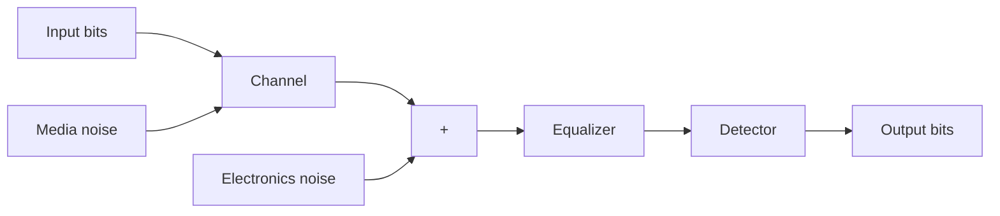

เมื่อ $\hat { u } _ { d } \left( t \right)$ คือค่าประมาณของสัญญาณ TA ในช่วงเวลาลดระดับ และ {A, B} คือค่าสัมประสิทธิ ของสมการ (5.18) ที่เป็นเลขจำนวนจริง โดยค่าสัมประสิทธิ์ A หาได้จาก $A = \exp ( Z )$ เมื่อ

$$
Z = \frac {\sum_ {i = 1} ^ {n} \left(t _ {i} ^ {2} q _ {i}\right) \sum_ {i = 1} ^ {n} \left(q _ {i} \ln q _ {i}\right) - \sum_ {i = 1} ^ {n} \left(t _ {i} q _ {i}\right) \sum_ {i = 1} ^ {n} \left(t _ {i} q _ {i} \ln q _ {i}\right)}{\sum_ {i = 1} ^ {n} \left(q _ {i}\right) \sum_ {i = 1} ^ {n} \left(t _ {i} ^ {2} q _ {i}\right) - \left(\sum_ {i = 1} ^ {n} \left(t _ {i} ^ {2} q _ {i}\right)\right) ^ {2}} \tag {5.19}
$$

และค่าค่าสัมประสิทธิ์ B หาได้จาก

$$
B = \frac {\sum_ {i = 1} ^ {n} \left(q _ {i}\right) \sum_ {i = 1} ^ {n} \left(t _ {i} q _ {i} \ln q _ {i}\right) - \sum_ {i = 1} ^ {n} \left(t _ {i} q _ {i}\right) \sum_ {i = 1} ^ {n} \left(q _ {i} \ln q _ {i}\right)}{\sum_ {i = 1} ^ {n} \left(q _ {i}\right) \sum_ {i = 1} ^ {n} \left(t _ {i} ^ {2} q _ {i}\right) - \left(\sum_ {i = 1} ^ {n} \left(t _ {i} ^ {2} q _ {i}\right)\right) ^ {2}} \tag {5.20}
$$

เมื่อ n คือจำนวนแซมเปิลของ $\{ \boldsymbol { q } _ { k } \}$ ที่ใช้ในการประมาณค่าของสัญญาณ TA ในช่วงเวลาลดระดับ โดยที่การประมาณค่าของสัญญาณ TA ในช่วงลดระดับจะสิ้นสุดก็ต่อเมื่อ $\hat { u } _ { d } \left( t \right) < 0 . 0 1$

# การแก้ไข TA

หลังจากที่ได้ค่าประมาณของสัญญาณ TA ในแต่ละส่วนแล้ว ก็ให้นำมารวมกันเป็นค่าประมาณของ สัญญาณ TA นั่นคือ ü(t) ตามสมการต่อไปนี้

$$
\hat {u} (t) = \left\{ \begin{array}{l l} \hat {u} _ {r} (t), & T _ {y} \leq t \leq \hat {T} _ {p} \\ \hat {u} _ {d} (t), & \hat {T} _ {p} \leq t \leq \hat {T} _ {f} \end{array} \right. \tag {5.21}
$$

โดยที่ $T _ { y }$ คือเวลาที่ตรวจพบสัญญาณ TA, $\hat { T } _ { p }$ คือเวลาเมื่อแซมเปิล $\{ \boldsymbol { q } _ { k } \}$ มีค่าสูงสุด, และ $\hat { T } _ { f }$ คือ ค่าประมาณช่วงเวลาของสัญญาณ TA ดังนั้นสัญญาณอ่านกลับที่มีผลกระทบของ TA น้อยลงหา ได้จาก

$$
z _ {k} = \left\{ \begin{array}{l l} y _ {k} - \hat {u} _ {k}, & \text { if   TA   is   present } \\ y _ {k}, & \text { if   TA   is   absent } \end{array} \right., \tag {5.22}
$$

เมื่อ $\hat { u } _ { k } = \hat { u } ( k T )$ คือค่าประมาณของสัญญาณ TA ลำดับที่ k จากนั้นวงจรภาครับแบบที่ใช้กัน ทั่วไปก็จะส่งลำดับข้อมูล $z _ { k }$ ไปยังอีควอไลเซอร์แบบเทอร์โบซึ่งจะแลกเปลี่ยนข่าวสารระหว่างอีควอ ไลเซอร์ S0VA [19] และวงจรถอดรหัส LDPC [17] ตามจำนวนรอบที่ต้องการ

# 5.2.4 วิธีการตรวจหาและแก้ไข TA แบบวนซ้ำ

ในทางปฏิบัติวงจรภาครับแบบที่ใช้กันทั่วไปจะทำกระบวนการตรวจหาและแก้ไข TA โดยไม่ได้ใช้ ประโยชน์จากรหัส ECC จึงทำให้มีสมรรถนะไม่ดี เมื่อทำงานที่ค่า SNR ต่ำ ดังนั้นเพื่อให้ระบบ สามารถทำงานที่ค่า SNR ต่ำได้อย่างมีประสิทธิภาพ Kovintavewat และ Koonkarnkhai [77] จึงได้นำเสนอ 'วิธีการตรวจหาและแก้ไข TA แบบวนซ้ำ" เมื่อวงจรตรวจหาและแก้ไข TA, อีควอ ไลเซอร์แบบ รOVA, และวงจรถอดรหัส LDPC จะแลกเปลี่ยนข่าวสารร่วมกันตามที่แสดงในรูปที่ 5.17 ซึ่งสามารถอธิบายขั้นตอนการทำงานได้ดังนี้

ถ้ากำหนดให้ครั้งแรกที่วงจรถอดรหัส LDPC ให้ข้อมูลเอาต์พุตในรูปข่าวสารแบบซอฟต์ $\lambda _ { k }$ ออกมา เรียกว่า "การวนซ้ำรอบที่หนึ่ง (first iteration)" ดังนั้นวิธีการที่นำเสนอจะมีขั้นตอน การทำงานในรอบแรกของการวนซ้ำเหมือนกับวงจรภาครับที่ใช้กันทั่วไป นั่นคือสัญญาณเอาต์พุต ของวงจรชักตัวอย่าง $\{ y _ { k } \}$ จะถูกส่งเข้าไปยังวงจรตรวจหาและแก้ไข TA (ที่อธิบายในหัวข้อที่ 5.2.3) ทำให้ได้เป็นลำดับข้อมูล $\{ z _ { k } \}$ ซึ่งจะถูกส่งต่อไปยังอีควอไลเซอร์แบบเทอร์โบ หลังจากการวนซ้ำ รอบที่หนึ่งเสร็จ ข่าวสารแบบซอฟต์ $\{ \lambda _ { k } \}$ จะถูกส่งกลับไปยังวงจรตรวจหาและแก้ไข TA และ อีควอไลเซอร์แบบเทอร์โบ (ดูรูปที่ 5.17) เพื่อนำไปใช้ในการหาค่าประมาณแบบซอฟต์ของลำดับ ข้อมูล $\{ r _ { k } \}$ [77] นั่นคือ $\left\{ \widetilde { r } _ { k } \right\}$ เมื่อ (ดูภาคผนวก ง)

$$
\tilde {r} _ {k} = E \left[ r _ {k} \mid \lambda_ {k} \right] = \frac {C _ {1} + C _ {2} + C _ {3}}{2 \cosh \left(\lambda_ {k} / 2\right) \cosh \left(\lambda_ {k - 1} / 2\right) \cosh \left(\lambda_ {k - 2} / 2\right)} \tag {5.23}
$$

โดยที่ $E [ . ]$ คือตัวดำเนินการคาดหมาย, $C _ { 1 } = 2 \sinh \bigl ( \bigl ( \lambda _ { k } + \lambda _ { k - 1 } + \lambda _ { k - 2 } \bigr ) / 2 \bigr ) , C _ { 2 } = \sinh \bigl ( \bigl ( \lambda _ { k } +$ $\lambda _ { k - 1 } - \lambda _ { k - 2 } \big ) / 2 \big )$ , และ $C _ { 3 } = \sinh \left( \left( - \lambda _ { k } + \lambda _ { k - 1 } + \lambda _ { k - 2 } \right) / 2 \right)$

ในการวนซ้ำรอบที่สองขึ้นไป วิธีการที่นำเสนอจะนำลำดับข้อมูล $\left\{ \widetilde { r } _ { k } \right\}$ ที่ได้จากสมการ (5.23) ไปลบออกจากสัญญาณอ่านกลับ $\{ y _ { k } \}$ ทำให้ได้ $c _ { k } = y _ { k } - \tilde { r } _ { k }$ นั่นคือถ้า $\left\{ \widetilde { r } _ { k } \right\}$ มีค่าเท่ากับ $\{ r _ { k } \}$ ก็ $\{ c _ { k } \}$ $1 9 ^ { \circ } \mathbb { 1 } \mathbb { 2 } ^ { 9 }$ $c _ { k }$ เข้ากระบวนการตรวจหาและแก้ไข $\mathrm { T A }$ ใหม่อีกครั้ง ซึ่งทำให้เทคนิคการประมาณค่าสัญญาณ TA 2 ด้วยเทคนิคการปรับเส้นโคด้งที่เหมาะสมแบบกำลังสองน้อยสุด [76] ในแต่ละรอบของการวนซ้ำ ทำงานได้อย่างมีประสิทธิภาพมากขึ้น นั่นคือทำให้ลำดับข้อมูล $\{ z _ { k } \}$ ที่ได้มีคุณภาพดีขึ้น ซึ่งก็จะ ส่งผลให้อีควอไลเซอร์แบบเทอร์โบทำงานได้ดีขึ้นตามไปด้วย ดังนั้นจะเห็นได้ว่าอีควอไลเซอร์แบบ เทอร์โบได้ประโยชน์จากลำดับข้อมูล $\{ z _ { k } \}$ ที่มีคุณภาพมากขึ้น และวงจรตรวจหาและแก้ไข TA ก็ ได้ประโยชน์จากค่าตัดสินใจแบบซอฟต์ $\left\{ \widetilde { r } _ { k } \right\}$ ที่มีคุณภาพมากขึ้นเช่นกัน

จากที่อธิบายในข้างต้นพบว่าวิธีการที่นำเสนอ [77] ก็คืออีควอไลเซอร์แบบเทอร์โบแบบ ที่ใช้กันทั่วไปเพียงแต่มีขั้นตอนการลดผลกระทบของ TA แทรกเข้าไปในแต่ละรอบของการวนซ้ำ ซึ่งผลลัพธ์ที่ได้ก็คือ สัญญาณอ่านกลับจะมีผลกระทบของ TA ลดลง เมื่อจำนวนรอบของการวนซ้ำ เพิ่มขึ้น ในทางปฏิบัติวงจรตรวจหาและแก้ไข TA มีความซับซ้อนน้อยมากเมื่อเทียบกับอีควอไลเซอร์ แบบเทอร์โบ ดังนั้นอาจกล่าวได้ว่าวิธีการที่นำเสนอมีความซับซ้อนรวมใกล้เคียงกับวงจรภาครับแบบ ที่ใช้กันทั่วไป จึงทำให้สามารถมาใช้งานจริงในระบบการประมวลผลสัญญาณของฮาร์ดดิสก์ไดรฟ์ได้

# 5.2.5 ผลการทดลอง

พิจารณาแบบจำลองช่องสัญญาณในรูปที่ 5.17 โดยที่ลำดับข้อมูลอินพุต $\{ x _ { k } \}$ จำนวน 3640 บิต ถูกเข้ารหัสด้วยรหัส LDPC ปรกติแบบ (3, 27) ที่มีอัตรารหัสเท่ากับ 8/9 [17, 77] ทำให้เป็น ลำดับข้อมูล $\{ a _ { k } \}$ จำนวน 4095 บิต เมื่อเมทริกซ์พาริตีเช็กในแต่ละหลักมีเลขหนึ่งจำนวน 3 ตัว และในแต่ละแถวมีเลขหนึ่งจำนวน 27 ตัว โดยการถอดรหัส LDPC จะใช้อัลกอริทึมการผ่านข่าวสาร (Message-Passing) ที่มีการวนซำภายในจำนวน 3 รอบ [17]

ในการจำลองระบบจะกำหนดให้หนึ่งเซ็กเตอร์มีข้อมูลจำนวน 4095 บิต และมีผลกระทบ จาก TA เกิดขึ้นที่ ณ ตำแหน่งบิตที่ 1000T ของทุกเซ็กเตอร์ โดยที่สัญญาณ TA มีพารามิเตอร์ $\mu = 2 , T _ { r } = 6 0$ นาโนวินาที, และ $T _ { d } = 0 . 5$ ไมโครวินาที ซึ่งทำให้ได้จำนวนแซมเปิลทั้งหมดของ สัญญาณ TA เท่ากับ $T _ { f } = 1 0 3 0 T$ ซึ่งถือว่าเป็นกรณีที่ด้อยสุด (เพorst case) ในกรณีนี้ถ้าไม่มี การลดผลกระทบจาก TA ก็จะทำให้เกิดข้อผิดพลาดจำนวนมาก นอกจากนีในการคำนวณค่า BER จะใช้ข้อมูลจำนวน 10000 เซ็กเตอร์หรือมีข้อผิดพลาดเกิดขึ้นอย่างน้อย 1000 บิต ซึ่งจะเรียกว่า "BER given $\mathrm { T A } ^ { \dag \mathfrak { s } }$ และค่า SNR ที่ใช้นิยามตามสมการ (4.85) เมื่อ $E _ { b } = \sum _ { k } \left| h _ { k } \right| ^ { 2 }$ สำหรับช่อง สัญญาณ PR2 กระบวนการตรวจหา TA จะใช้ $L = 5 1$ ในการหาค่า $\{ \boldsymbol { q } _ { k } \}$ และ $\Gamma = 2 . 8$ (ซึ่งถูก ออกแบบจากระบบที่ไม่ถูกเข้ารหัส ณ ค่า $E _ { b } / N _ { 0 } = 1 0 . 7$ dB เพื่อทำให้เกิด BER น้อยสุดที่ด้าน ขาออกของอีควอไลเซอร์ รOVA) ในการตรวจหา TA

รูปที่ 5.19 เปรียบเทียบสมรรถนะของระบบต่างๆ ณ การวนซ้ำในรอบที่สิบ เมื่อ 'No TA" ส คือสมรรถนะของระบบที่ไม่มี TA, "With $\mathrm { T A } ^ { \dag \mathfrak { s } }$ คือสมรรถนะของระบบที่ไม่มีการลดผลกระทบของ TA, "Conventional" คือวงจรภาครับแบบที่ใช้กันทั่วไป, "Proposed" คือวงจรภาครับที่นำเสนอ ตามที่อธิบายในหัวข้อที่ 5.2.4, และ "Traiทed" คือวงจรภาครับที่นำเสนอซึ่งใช้ $\tilde { r } _ { k } = r _ { k }$ ในการลด ผลกระทบของ TA จากรูปเห็นได้ชัดเจนว่าถ้าระบบที่ไม่มีกระบวนการตรวจหาและแก้ไข TA จะมี สมรรถนะด้อยมาก ในขณะที่"Proposed" มีสมรรถนะดีกว่า "Conventional" แต่มีสมรรถนะ ด้อยกว่า "Trained" และ No TA" เพียง 0.6 dB และ 0.8 dB ตามลำดับ ณ ระดับ $\mathrm { B E R } = 1 0 ^ { - 4 }$ นอกจากนี้รูปที่5.20 เปรียบเทียบสมรรถนะของ "Proposed" และ "Conventional" ในรูปของ อัตราข้อผิดพลาดของเซกเตอร์ (SER: sector-error rate) เทียบกับจำนวนรอบของการวนซ้ำ ซึ่ง จะพบว่าเมื่ออีควอไลเซชันแบบเทอร์โบสามารถช่วยเพิ่มสมรรถนะของวงจรภาครับแบบที่ใช้กันทั่วไป ได้จนถึงรอบที่หกของการวนซ้ำ จากนั้นระบบจะเผชิญกับปัญหาเรื่องพื้นข้อผิดพลาด (errr floor)

line

| Time (bit periods) | TA signal | readback amplitude | TA-affected readback signal |
| ------------------ | --------- | ------------------ | --------------------------- |
| 0                  | 0         | 0                  | 0                           |
| 500                | 0         | 0                  | 0                           |
| 1000               | 0         | 0                  | 0                           |
| 1500               | 0         | 0                  | 0                           |
| 2000               | 0         | 0                  | 0                           |
| 2500               | 0         | 0                  | 0                           |
| 3000               | 0         | 0                  | 0                           |
| 3500               | 0         | 0                  | 0                           |
| 4000               | 0         | 0                  | 0                           |

line

| Eb/N0 (dB) | 10 iterations | Conventional | Proposed | Trained |
| ---------- | ------------- | ------------ | -------- | ------- |
| 5.25       | 0.1           | 0.1          | 0.1      | 0.1     |
| 5.5        | 0.05          | 0.05         | 0.05     | 0.05    |
| 5.75       | 0.02          | 0.02         | 0.02     | 0.02    |
| 6.0        | 0.01          | 0.01         | 0.01     | 0.01    |
| 6.25       | 0.005         | 0.005        | 0.005    | 0.005   |
| 6.5        | 0.002         | 0.002        | 0.002    | 0.002   |
| 6.75       | 0.001         | 0.001        | 0.001    | 0.001   |
| 7.0        | 0.0005        | 0.0005       | 0.0005   | 0.0005  |
| 7.25       | 0.0002        | 0.0002       | 0.0002   | 0.0002  |
| 7.5        | 0.0001        | 0.0001       | 0.0001   | 0.0001  |

รูปที่ 5.19 สมรรถนะของระบบต่างๆ ณ การวนซ้ำในรอบที่สิบ

line

| Number of iterations | Conventional 6 dB | Conventional 7 dB | Proposed 6 dB | Proposed 7 dB |
| -------------------- | ----------------- | ----------------- | ------------- | ------------- |
| 2                    | 1.0               | 1.0               | 1.0           | 1.0           |
| 4                    | 0.1               | 0.1               | 0.1           | 0.1           |
| 6                    | 0.05              | 0.05              | 0.05          | 0.05          |
| 8                    | 0.02              | 0.02              | 0.02          | 0.02          |
| 10                   | 0.01              | 0.01              | 0.01          | 0.01          |
| 12                   | 0.005             | 0.005             | 0.005         | 0.005         |
| 14                   | 0.002             | 0.002             | 0.002         | 0.002         |
| 16                   | 0.001             | 0.001             | 0.001         | 0.001         |
| 18                   | 0.0005            | 0.0005            | 0.0005        | 0.0005        |
| 20                   | 0.0002            | 0.0002            | 0.0002        | 0.0002        |

รูปที่ 5.20 อัตราข้อผิดพลาดของเซกเตอร์ (SER) เทียบกับจำนวนรอบของการวนซ้ำ

line

| Number of iterations | 6 dB  | 6.5 dB | 7 dB  | 7.5 dB |
| -------------------- | ----- | ------ | ----- | ------ |
| 2                    | -8.0  | -8.0   | -8.0  | -8.0   |
| 4                    | -10.0 | -12.0  | -18.0 | -20.0  |
| 6                    | -12.0 | -16.0  | -24.0 | -28.0  |
| 8                    | -14.0 | -18.0  | -26.0 | -30.0  |
| 10                   | -16.0 | -20.0  | -28.0 | -32.0  |
| 12                   | -18.0 | -21.0  | -29.0 | -33.0  |
| 14                   | -19.0 | -22.0  | -30.0 | -34.0  |
| 16                   | -20.0 | -23.0  | -31.0 | -35.0  |
| 18                   | -21.0 | -24.0  | -32.0 | -36.0  |
| 20                   | -22.0 | -25.0  | -33.0 | -37.0  |

รูปที่ 5.21 ค่า MSE ที่เกิดจากวงจรภาครับที่นำเสนอ ณ ค่า $E _ { b } / N _ { 0 }$ ต่างๆ

ในทางตรงกันข้ามวงจรภาครับที่นำเสนอหรือ "Propoรed" ยังคงให้สมรรถนะที่ดีขึ้นเรื่อยๆ ตาม จำนวนรอบของการวนซ้ำที่เพิ่มขึ้น ซึ่งหมายความว่าค่าประมาณของสัญญาณ TA หรือ $\hat { u } ( t )$ ที่ ได้จากเทคนิคการปรับเส้นโด้งที่เหมาะสมแบบกำลังสองน้อยสุด [76] มีคุณภาพดีขึ้น ซึ่งส่งผลให้ ค่าตัดสินใจแบบซอฟต์ $\left\{ \widetilde { r } _ { k } \right\}$ มีคุณภาพดีขึ้นเรื่อยๆ ในแต่ละรอบของการวนซ้ำ ผลสรุปนี้สามารถ ยืนยันได้จากการวาดกราฟแสดงข้อผิดพลาดกำลังสองเฉลี่ย (MSE: mean-squared error) ระหว่าง สัญญาณ TA จริง $u ( t )$ และ $\hat { u } ( t )$ ตามรูปที่ 5.21 โดยที่

$$
\mathrm{MSE} = 1 0 \log_ {1 0} \left(\frac {1}{T _ {f}} \sum_ {k = T _ {y}} ^ {T _ {y} + T _ {f}} \left\{u (k T) - \hat {u} (k T) \right\} ^ {2}\right) \tag {5.24}
$$

มีหน่วยเป็น dB และ $T _ { y }$ คือเวลาที่ตรวจพบสัญญาณ TA จากรูปเห็นได้ชัดเจนว่าความไม่สอดคล้อง ระหว่าง $u ( t )$ และ ${ \hat { u } } ( t )$ ลดลงเมื่อจำนวนรอบของการวนซำเพิ่มขึน ดังนันจึงเป็นเหตุผลว่าทำไม "Proposed" จึงมีสมรรถนะดีกว่า "Coกventioทal"โดยเฉพาะอย่างยิ่งเมื่อจำนวนรอบของการวนซ้ำ มีค่ามาก

นอกจากนี้รูปที่ 5.22 เปรียบเทียบสมรรถนะของระบบต่างๆ ที่เป็นฟังก์ชันของตัวประกอบ ค่าสูงสุด ณ การวนซ้ำในรอบที่สิบและ $E _ { b } / N _ { 0 } = 6 . 6 5$ dB เมื่อสมรรถนะของระบบที่ไม่มี TA หรือ 'No $\mathrm { T A } ^ { \prime \prime }$ มีค่า $\mathrm { B E R } = \mathrm { 1 0 } ^ { - 5 }$ ในทำนองเดียวกันระบบจะมีสมรรถนะด้อยมาก ถ้าระบบไม่มีกระบวน การตรวจหาและแก้ไข TA นอกจากนี้สมรรถนะของระบบแบบที่ใช้กันทั่วไปในรอบที่หนึ่งมีค่าคงที ซึ่งสอดคล้องกับข้อสรุปของระบบที่ใช้เทคนิคการปรับเส้นโคด้งที่เหมาะสมแบบกำลังสองน้อยสุดที่ว่า ระบบจะมีความทนทานต่อการเปลี่ยนแปลงค่าแอมพลิจูดสูงสุดของสัญญาณ TA [76] จากรูปจะ เห็นได้ว่าระบบต่างๆ มีค่า BER ค่อนข้างสูง ทั้งนี้เป็นเพราะว่าสัญญาณ TA ที่ใส่เข้าไปในระบบ ถือว่าเป็นสัญญาณ TA ที่ค่อนข้างรุนแรง กล่าวคือข้อมูลแต่ละเซกเตอร์มี TA เกิดขึ้นหนึ่งครั้ง ซึ่งมีแอมพลิจูดสูงและมีช่วงเวลาลดระดับที่ยาวนาน อย่างไรก็ตาม "Propoรed"ยังคงให้สมรรถนะ ที่ดีกว่า "Conveทtioทal" สำหรับทุกค่าแอมพลิจูดสูงสุดของสัญญาณ TA

line

| Peak factor (μ) | With TA (10 iterations) | 1 iteration | 10 iterations | Conventional | Proposed (10 iterations) |
| --------------- | ------------------------ | ----------- | ------------- | ------------ | ------------------------ |
| 1.5             | 0.1                      | 0.01        | 0.005         | 0.005        | 0.001                    |
| 2.0             | 0.1                      | 0.01        | 0.005         | 0.005        | 0.001                    |
| 2.5             | 0.1                      | 0.01        | 0.005         | 0.005        | 0.001                    |
| 3.0             | 0.1                      | 0.01        | 0.005         | 0.005        | 0.001                    |

รูปที่ 522 สมรรถนะของระบบในรูป BER สำหรับระดับความรุนแรงของสัญญาณ TA ต่างๆ

# 5.2.6 สรุปผลการทดลอง

ความขรุขระเชิงความร้อนหรือ TA ที่เกิดขึ้นในฮาร์ดดิสก์ไดรฟ์จะส่งผลให้สมรรถนะรวมของระบบ ด้อยลงมาก ในที่นี้ได้อธิบายเทคนิคการปรับเส้นโคด้งที่เหมาะสมแบบกำลังสองน้อยสุด [76] เพื่อใช้ ลดผลกระทบของ TA ที่พบในสัญญาณอ่านกลับ โดยวิธีการตรวจหาการเกิด TA จะอยู่บนพื้นฐาน ของการหาขีดเริ่มเปลี่ยน และวิธีการแก้ไขผลกระทบที่เกิดจาก TA ทำได้โดยการหาค่าเฉลี่ยของ สัญญาณอ่านกลับ แล้วใช้เทคนิคการปรับเส้นโด้งที่เหมาะสมแบบเชิงเส้นและแบบเลขชี้กำลังเพื่อ หาค่าประมาณของสัญญาณ TA จากนั้นจึงนำค่าประมาณของสัญญาณ TA ที่ได้มาลบออกจาก สัญญาณอ่านกลับ ก็จะได้สัญญาณอ่านกลับที่มีผลกระทบของ TA น้อยลง

ในทางปฏิบัติวงจรภาครับแบบที่ใช้กันทั่วไป (ซึ่งทำกระบวนการตรวจหาและแก้ไข TA และอีควอไลเซชันแบบเทอร์โบแยกจากกันโดยอิสระ) จะไม่สามารถทำงานได้ดี เมื่อ รNR มีค่าน้อย ดังนั้นในหัวข้อนีได้อธิบายวิธีการลดผลกระทบของ TA แบบวนซ้ำ [77] ซึ่งเป็นการทำงานร่วมกัน 20 น ระหว่างกระบวนการตรวจหาและแก้ไข TA และอีควอไลเซชันแบบเทอร์โบ โดยในแต่ละรอบของ การวนซ้ำ วิธีการลดผลกระทบของ TA แบบวนซ้ำจะใช้ค่าตัดสินใจแบบซอฟต์ที่ได้จากวงจรถอด รหัส LDPC มาช่วยเพิ่มสมรรถนะการทำงานของอัลกอริทึมตรวจหาและแก้ไข TA [76] เพื่อให้ ได้สัญญาณอ่านกลับที่มีคุณภาพดีขึ้น ซึ่งก็จะส่งผลทำให้อีควอไลเซอร์แบบเทอร์โบสามารถทำงาน ได้อย่างมีประสิทธิภาพมากขึ้นในรอบถัดไป ผลการทดลองแสดงให้เห็นว่าวิธีการลดผลกระทบของ TA แบบวนซ้ำมีสมรรถนะดีกว่าวงจรภาครับแบบที่ใช้กันทั่วไป โดยเฉพาะอย่างยิ่งเมื่อจำนวนรอบ ซ ของการวนซ้ำเพิ่มขึ้น นอกจากนี้วิธีการลดผลกระทบของ TA แบบวนซ้ำนี้ถือว่ามีความซับซ้อน ใกล้เคียงกับวงจรภาครับแบบที่ใช้กันทั่วไป จึงทำให้สามารถนำมาใช้งานจริงในระบบการประมวลผล สัญญาณของฮาร์ดดิสก์ไดรฟ์ได้

# 5.3 สรุปท้ายบท

ในบทนี้ได้อธิบายวิธีการนำเทคนิคการถอดรหัสแบบวนซ้ำมาประยุกต์ใช้ร่วมกับไทมมิ่งริดัฟเวอรี โยอาศัยเทคนิด PSP ทำให้ได้เป็นวงจรภาครับรูปแบบใหม่ที่เรียกว่าไทมมิ่งริดัฟเวอรีแบบ PS-ITR ซึ่งจะแลกเปลี่ยนข่าวสารแบบซอฟต์ระหว่าง PรP-BCJR และวงจรถอดรหัส ECC โดยจากการ ทดลองพบว่าเมื่อระบบมีความรุนแรงของไทมมิ่งจิตเตอร์มาก ไทมมิ่งริคัฟเวอรีแบบ Pร-ITR จะมี สมรรถนะดีกว่าวงจรภาครับแบบที่ใช้กันทั่วไปและวิธีการ NBM มาก (แต่ก็มีความซับซ้อนสูง) อย่างไรก็ตามในบทนี้ยังแสดงให้เห็นว่าเมื่อความชับซ้อนของระบบถูกจำกัดให้อยูในระดับน้อยถึง ปานกลาง ไทมมิ่งริคัฟเวอรีแบบ Pร-ITR ก็ยังคงมีสมรรถนะดีกว่าไทมมิ่งริคัฟเวอรีแบบที่ใช้กัน ทั่วไปและวิธีการ NBM จึงทำให้สามารถนำมาใช้งานจริงในระบบการประมวลผลสัญญาณของ ฮาร์ดดิสก์ไดรฟ์ได้

ยี้ผงได้อ สู นอกจากนี้ยังได้อธิบายวิธีการนำเทคนิคการถอดรหัสแบบวนซ้ำมาใช้แก้ปัญหาเรื่องความ ขรุขระเชิงความร้อน (TA) ทำให้ได้เป็นวิธีการลดผลกระทบของ TA แบบวนซ้ำ ซึ่งเป็นการทำงาน ร่วมกันระหว่างกระบวนการตรวจหาและแก้ไข TA และอีควอไลเซชันแบบเทอร์โบ โดยจากผลการ ทดลองพบว่าวิธีการลดผลกระทบของ TA แบบวนซ้ำมีสมรรถนะดีกว่าวงจรภาครับแบบที่ใช้กัน ทั่วไป (ที่ทำกระบวนการตรวจหาและแก้ไข TA และอีควอไลเซชันแบบเทอร์โบเป็นอิสระต่อกัน) - สู ซ โดยเฉพาะอย่างยิ่งเมื่อจำนวนรอบของการวนซ้ำเพิ่มขึ้น นอกจากนี้วิธีการลดผลกระทบของ TA แบบวนซ้ำนี้ยังมีความซับซ้อนใกล้เคียงกับวงจรภาครับแบบทีใช้กันทั่วไป จึงทำให้สามารถนำมาใช้ งานจริงในระบบการประมวลผลสัญญาณของฮาร์ดดิสก์ไดรฟ์ได้เช่นกัน

# 5.4 แบบฝึกหัดท้ายบท

1. จงอธิบายหลักการทำงานของไทมมิ่งริดัฟเวอรีแบบ PS-TR และ PS-ITR   
2. จากแบบจำลองช่องสัญญาณ PR4 ในรูปที่ 5.1 เมื่อ $H ( D ) = 1 - D ^ { 2 }$ จงพิสูจน์ว่าไทมมิ่งริคดัฟ เวอรีแบบ PS-TR จะใช้ค่า $K _ { T } = 3 T / 1 6$ ในสมการ (5.4)   
3. จากแบบจำลองช่องสัญญาณ PR2 ในรูปที่ 5.1 เมื่อ $H ( D ) = 1 + 2 D + D ^ { 2 }$ จงหาค่า $K _ { T }$ -ชร ต้องใช้ในไทมมิ่งริดัฟเวอรีแบบ PS-TR ตามสมการ (5.4)   
4.จงพิสูจน์ค่าประมาณแบบซอฟต์ $\tilde { r } _ { k }$ ในสมการ (5.10)   
5. จากแบบจำลองช่องสัญญาณ PR2 ในรูปที่ 5.1 เมื่อ $H ( D ) = 1 + 2 D + D ^ { 2 }$ จงหาค่าประมาณ แบบซอฟต์ $\tilde { r } _ { k } = E \big [ r _ { k } \mid y _ { k } \big ]$ ของช่องสัญญาณ PR2   
6. จงอธิบายหลักการทำงานของ PSP-BCJR และ PSP-SOVA   
ป 7. จงอธิบายหลักการทำงานของวิธีการลดผลกระทบของ TA แบบวนซำ   
8. จากแบบจำลองช่องสัญญาณ PR4 ในรูปที่ 5.7 เมื่อ $H ( D ) = 1 - D ^ { 2 }$ จงหาค่าประมาณแบบ ซอฟต์ $\tilde { r } _ { k } = E \big [ r _ { k } | \lambda _ { k } \big ]$ ช่องสัญญาณ PR4

# บทที 6

# เทคโนโลยี BPMR

ความต้องการของพื้นที่ในการจัดเก็บข้อมูลเพิ่มมากขึ้นเรื่อยๆ ฮาร์ดดิสก์ไดรฟ์ในปัจจุบันจะใช้สื่อ บันทึกที่เคลือบด้วยฟิล์มบางของสารแม่เหล็กซึ่งประกอบด้วยเกรนเชิงแม่เหล็ก30 (magnetด grain) ขนาดเล็กในระดับนาโนเมตร โดยแต่ละเกรนจะมีสภาพความเป็นแม่เหล็ก (magทetizatioก) ไปใน ซ ทิศทางที่แตกต่างกัน ดังนั้นการบันทึกข้อมูลจะอาศัยสนามแม่เหล็กจากหัวเขียน (พrite head) 0 เพื่อทำให้เกรนหลายๆ เกรนมีสภาพความเป็นแม่เหล็กไปในทิศทางที่ต้องการ (ขนานหรือตั้งฉาก กับระนาบของสื่อบันทึก) โดยทั่วไปการเพิ่มความหนาแน่นเชิงพื้นที่ (areal denรity) หรือความจุ ข้อมูลทำได้โดยการลดขนาดของเกรนให้เล็กลง อย่างไรก็ตามการลดขนาดของเกรนเพื่อเพิ่มความ หนาแน่นเชิงพื้นที่มีแนวโน้มที่จะทำได้ยากขึ้น เพราะเกรนที่มีขนาดเล็กมากเกินไปจะไม่มีเสถียรภาพ 5 น ในการเก็บข้อมูล เนื่องจากพลังงานความร้อนจากภายนอกจะทำให้สภาพความเป็นแม่เหล็กของ เกรนมีทิศทางเปลี่ยนไปได้ง่าย (ทำให้บิตข้อมูล "0" เปลี่ยนเป็น "1" หรือในทางตรงกันข้าม) ซึ่ง ปรากฎการณ์นี้เรียกว่า "ขีดจำกัดซูเปอร์พาราแมกเนติก31 (super-paramagnetic limit)" [1, 43] หรือขีดจำกัดความหนาแน่นเชิงพื้นที่

ดังนั้นเทคโนโลยีใหม่ที่สามารถจัดเก็บข้อมูลได้มากกว่าเทคโนโลยีการบันทึกข้อมูลแบบที ใช้ในปัจจุบัน (นั่นคือแบบแนวตั้ง) จึงเป็นสิ่งจำเป็นอย่างยิ่งในอนาคต เช่น เทคโนโลยี HAMR (heat assisted magnetic recording) [78], เnคlulaยี BPMR (bit-patterned magnetic recording) [79], และเทคโนโลยี TDMR (two-dimensional magnetic recording) [80] เป็นต้น ซึ่ง เทคโนโลยีเหล่านี้สามารถจัดเก็บข้อมูลได้มากกว่า 1 เทระบิตต่อตารางนิ้ว (terabitร/in2 หรือ Tb/in2)

text_image

ลื่อบันทึก
(ก)
(ข)
หมายเหตุ ● เกรนเชิงแม่เหล็กของบิต 1 ● เกรนเชิงแม่เหล็กของบิต 0

รูปที่ 6.1 ลักษณะของสื่อบันทึกที่มี (ก) เกรนเชิงแม่เหล็กขนาดใหญ่ และ (ข) เกรนเชิงแม่เหล็กขนาดเล็ก

ในบทนี้จะอธิบายเฉพาะพื้นฐานและหลักการทำงานของเทคโนโลยี BPMR พร้อมทั้งสรุป ภาพรวมของงานวิจัยต่างๆ ที่ผ่านมาที่เกี่ยวข้องกับเทคโนโลยี BPMR เพื่อให้ผู้อ่านสามารถใช้เป็น จุดเริ่มต้นในการทำวิจัยทางด้านระบบการประมวลผลสัญญาณของเทคโนโลยี BPMR ได้

# 6.1 บทนำ

ในระบบการบันทึกเชิงแม่เหล็ก สมรรถนะของระบบในรูปของอัตราข้อผิดพลาดของบิต (BER: biterror rate) จะขึ้นอยู่กับค่าอัตราส่วนกำลังของสัญญาณต่อกำลังของสัญญาณรบกวน (รNR: signalto-noise ratio) ซึ่งในทางปฏิบัติค่า รNR ในสัญญาณอ่านกลับจะสัมพันธุ์กับจำนวนเกรนต่อบิต เซลล์ (bit cel) หรือข้อมูลหนึ่งบิต โดยทั่วไปสัญญาณรบกวนการเปลี่ยนสถานะ (traทรtioท noise) ถือว่าเป็นสัญญาณรบกวนหลักที่พบมากในระบบการบันทึกแบบแนวตั้ง [79] ซึ่งความรุนแรงของ ขู้ซู้ สัญญาณรบกวนการเปลี่ยนสถานะนี้ขึ้นอยู่กับการเปลี่ยนแปลงแบบซิกแซก (zig-zag traทรition) ณ บริเวณรอยต่อที่เป็นขอบเขตของแต่ละบิตเซลล์ โดยการเปลี่ยนแปลงแบบซิกแซกจะมีความ รุนแรงเมื่อเกรนแต่ละเกรนมีขนาดใหญ่ (และรุนแรงน้อยเมื่อเกรนมีขนาดเล็ก) ดังแสดงในรูปที่ 6.1 ดังนั้นถ้าสื่อบันทึกที่ใช้ประกอบด้วยเกรนขนาดใหญ่จำนวนมาก ก็จะส่งผลทำให้ระบบต้องเผชิญ กับบัญหาเรื่องสัญญาณรบกวนการเปลี่ยนสถานะที่รุนแรง เพราะฉะนั้นสื่อบันทึกที่สร้างจากเกรน ขนาดเล็กจึงเป็นสิ่งที่จำเป็นอย่างยิ่ง และหนึ่งบิตเซลล์ก็ควรประกอบด้วยเกรนขนาดเล็กจำนวนมาก เพียงพอเพื่อให้ระบบมีค่า รNR ตามที่ต้องการ

โดยทั่วไปการเพิ่มความจุข้อมูลของฮาร์ดดิสก์ไดรฟ์ทำได้โดยการลดขนาดของบิตข้อมูลให้ เล็กลง แต่ยังคงรักษาระดับ รNR ให้เท่าเดิม หรือกล่าวอีกนัยหนึ่งคือการลดขนาดของเกรนให้ เล็กลง แต่ยังคงมีจำนวนเกรนต่อหนึ่งบิตเซลล์คงเดิม อย่างไรก็ตามขนาดของเกรนไม่ควรเล็กเกินไป เพราะพลังงานความร้อนจากภายนอกจะสามารถเปลี่ยนทิศทางสภาพความเป็นแม่เหล็กของเกรน ได้ (ทำให้ไม่มีเสถียรภาพในการจัดเก็บข้อมูล) นั่นคือทำให้เกิดปัญหาเรื่องซูเปอร์พาราแมกเนติก [1, 43] ซึ่งเป็นขีดจำกัดที่ทำให้เทคโนโลยีการบันทึกเชิงแม่เหล็กที่ใช้ในปัจจุบันไม่สามารถเพิ่ม ความหนาแน่นเชิงพื้นที่ได้มากกว่า 1 $\mathrm { T b } / \mathrm { i n } ^ { 2 }$ ในทางปฏิบัติปัญหาเรื่องซูเปอร์พาราแมกเนติก สามารถป้องกันได้โดยการใช้สื่อบันทึกที่มีค่าอัตราส่วน [1, 43]

$$
\frac {K _ {u} V}{k _ {B} T} \geq \beta \tag {6.1}
$$

เมื่อ $K _ { u }$ คือค่าสัมประสิทธิ์แอนไอโซทรอปีแบบแกนเดี่ยวของวัสดุ, V คือปริมาตรของเกรนที่ใช้ เก็บข้อมูลหนึ่งบิต, $k _ { B }$ คือค่าคงตัวโบลตซ์แมน (Boltzmann's constant) มีค่าเท่ากับ $1 . 3 8 \times 1 0 ^ { - 2 3 }$ จูลต่อเคลวิน (joules per kelvin),T คืออุณหฎูมิสัมบูรณ์มีหน่วยเป็นเคลวิน, และ β คือจำนวน เต็มบวกที่มีค่ามากๆ เช่น $\beta = 6 0$ เป็นต้น เนื่องจากค่า $k _ { B } T$ เป็นค่าคงตัว ดังนั้นเพื่อชดเชยปริมาตร ของเกรนที่ลดลง สื่อบันทึกจะต้องใช้สารแม่เหล็กที่มีค่า $K _ { u }$ สูงมากขึ้น ซึ่งผลที่ตามมาก็คือหัวเขียน จะต้องใช้สนามแม่เหล็กที่มีความเข้มสูงมากในการเขียนบิตข้อมูลลงไปจัดเก็บในสื่อบันทึกได้อย่างมี เสถียรภาพ ปัญหานี้แก้ไขได้โดยใช้เทคโนโลยี HAMR [78] (ดูรายละเอียดในบทที่ 8) แต่อย่างไร ก็ตามสื่อบันทึกที่ใช้ในปัจจุบัน (ที่เคลือบด้วยฟิล์มบางของสารแม่เหล็ก) ก็กำลังจะถึงขีดจำกัดของ การจัดเก็บข้อมูลในอนาคตอันใกล้นี้

เทคโนโลยี BPMR ถือว่าเป็นเทคโนโลยีที่สามารถเพิ่มความหนาแน่นเชิงพื้นที่ได้มากกว่า 1 Tb/in2 และไม่มีปัญหาเรื่องขีดจำกัดซูเปอร์พาราแมกเนติก [79] โดยเทคโนโลยี BPMR จะใช้ สื่อบันทึกที่มีการทำแบบ (patterned media) หรือสื่อบันทึกที่มีรูปแบบแน่นอน ซึ่งสร้างจากสาร แม่เหล็กที่มีโดเมนแม่เหล็กเดี่ยว (single magnetic domain) หรือมีลักษณะเป็นไอแลนด์เชิง แม่เหล็ก (magnetic island) ขนาดนาโนเมตร เรียงตัวกันบนแผ่นรองรับที่ทำมาจากวัสดุทีไม่เป็น แม่เหล็ก (non-magnetic material) อย่างเป็นระเบียบและมีระยะห่างสม่ำเสมอ โดยทิศทางของ สภาพความเป็นแม่เหล็กของไอแลนด์อาจจะขนานหรือตั้งฉากกับแผ่นรองรับก็ได้ รูปที่ 6.2 แสดง ตัวอย่างการจัดเก็บข้อมูลในสื่อบันทึกของเทคโนโลยี BPMR

เนื่องจากไอแลนด์เชิงแม่เหล็กขนาดนาโนแบบเอกเทศ (isolated nano-scale magnetic islands) ที่ถูกล้อมรอบด้วยวัสดุที่ไม่เป็นแม่เหล็กจะทำหน้าที่เป็นแบบ "โดเมนเดี่ยว (single domain)" หรือทำหน้าที่เสมือนเป็นไอแล่นด์แบบเกรนเดียว32 ดังนั้นการใช้เกรนขนาดเล็กจำนวนมากต่อหนึ่ง บิตข้อมูลจึงเป็นสิ่งที่ไม่จำเป็นสำหรับเทคโนโลยี BPMR นั่นคือไอแลนด์หนึ่งไอแลนด์อาจสร้างจาก เกรนเพียงเกรนเดียวก็ได้ นอกจากนี้การใช้ไอแลนด์เชิงแม่เหล็กแบบโดเมนเดี่ยวยังสามารถจัดการ กับปัญหาเรื่องขีดจำกัดซูเปอร์พาราแมกเนติก และช่วยลดปัญหาเรื่องสัญญาณรบกวนการเปลี่ยน สถานะได้อีกด้วย [81]

text_image

Technical diagram illustrating track alignment and timing parameters in a track system, with labeled tracks and timing intervals.

text_image

สื่อบันทึก
6.2 BPMR技术演进
บิตเชลล
ไอแลนด์เชิงแม่เหล็ก
แบบโตเมนตี่ยว
แทรกข้อมูล

รูปที่ 6.2 ลักษณะการจัดเก็บข้อมูลในสื่อบันทึกของเทคโนโลยี BPMR

ในเทคโนโลยี BPMR ตำแหน่งของไอแลนด์ทั้งหมดจะถูกกำหนดไว้เรียบร้อยแล้วตั้งแต่ ขั้นตอนการทำแบบ (หรือการสร้าง) ของสื่อบันทึก จึงทำให้มีข้อดีจำนวนมากเมื่อนำมาใช้งานจริง เช่น ลดปัญหาเรื่องสัญญาณรบกวนการเปลี่ยนสถานะ, กำจัดปัญหาเรื่องการเลื่อนบิตแบบไม่เป็น เชิงเส้น (nonlinear bit shift),ทำให้กระบวนการกู้ข้อมูลง่ายขึน, และทำให้กระบวนการติดตาม (tracking) ที่ใช้ในระบบเซอร์โว (servo system) ง่ายขึ้น [81, 82] เป็นต้น

# 6.2 วิวัฒนาการของเทคโนโลยี BPMR

หัวข้อนี้จะกล่าวถึงวิวัฒนาการของเทคโนโลยี BPMR ตั้งแต่เริ่มแรกจนถึงปัจจุบัน เพื่อให้ผู้อ่าน ทราบถึงงานวิจัยด้านต่างๆ ที่น่าสนใจที่มีส่วนช่วยทำให้เทคโนโลยี BPMR สามารถนำมาใช้งานจริง ในอนาคตอันไใกล้นี้ได้

# 6.2.1 สื่อบันทึก

ในช่วงแรกงานวิจัยทางด้านเทคโนโลยี BPMR จะเน้นไปที่การพัฒนาหรือการสร้างสื่อบันทึกที่มี การทำแบบ แนวคิดในการทำแบบของสื่อบันทึกเริ่มมาตั้งแต่ปี ค.ศ. 1963 [83] โดยมีการเสนอให้ ใช้ "แทร็กที่มีการทำแบบ (paterทed track)" เพื่อลดปัญหาที่เกิดจากสัญญาณรบกวนและกระบวน การติดตามในระบบเซอร์โว จากนั้นในปี ค.ศ. 1987 ก็ได้มีการศึกษาคุณสมบัติของการใช้ "แทร็ก แบบแคบ33 (narrow tracks)" [84] และได้ทำการศึกษาและทดลองบันทึกข้อมูลลงในสื่อบันทึกที่ มีการทำแบบขนาดนาโนในปี ค.ศ. 1991 [85]

text_image

strömันทึก
การหมุน
ของแผ่นดิสก์
ไอนสนด์
(บิตข้อมูล)

รูปที่ 6.3 ระบบ BPMR แบบแผ่นหมุน

ตั้งแต่ปี ค.ศ. 1991 เป็นต้นมา งานวิจัยทางด้านสื่อบันทึกที่มีการทำแบบได้เน้นไปที่การ สร้างและการศึกษาคุณสมบัติของสื่อบันทึก โดยเทคโนโลยีต่างๆ ได้ถูกพัฒนาขึ้นมาเพื่อใช้สร้าง สื่อบันทึกที่สามารถจัดเก็บข้อมูลได้มาก เช่น นาโนลิโทกราฟี (nano lithography), การจัดเรียง ตัวเอง (self-assembly), ลิโทกราฟีด้วยลำอิเล็กตsอน (electron beam lithography), และลิโท กราฟีด้วยการกดพิมพ์ระดับนาโน (nano-imprint lithography) เป็นต้น ผู้สนใจทางด้านการสร้าง สื่อบันทึกที่มีการทำแบบสามารถศึกษารายละเอียดเพิ่มเติมได้จาก [86 – 89]

# 6.2.2 ระบบการบันทึกเชิงแม่เหล็กสำหรับ BPMR

โดยทั่วไประบบการบันทึกเชิงแม่เหล็กแบบ BPMR แบ่งออกได้เป็น 2 ประเภทหลักคือ ระบบ BPMR แบบแผ่นหมุน (spinning-disk system) และระบบ BPMR แบบโพรบ (probe-based system) [90] ดังแสดงในรูปที 6.3 และ 6.4 ตามลำดับ

text_image

MUX
MUX
x
y
z

รูปที่ 6.4 ระบบ BPMR แบบโพรบ [90]

รูปที่ 6.3 แสดงระบบ BPMR แบบแผ่นหมุนที่ใช้หัวแม่เหล็กแบบ MR (magnetoresistive) ร่วมกับสื่อบันทึกที่มีการทำแบบ ซึ่งมีลักษณะการทำงานคล้ายกับระบบการบันทึกแบบ แนวตั้งที่ใช้กันในปัจจุบัน ดังนั้นเทคโนโลยีต่างๆ ที่ใช้ในระบบการบันทึกแบบแนวตั้งจึงสามารถ นำมาประยุกต์ใช้กับระบบ BPMR แบบแผ่นหมุนนี้ได้ อย่างไรก็ตามกระบวนการเข้าจังหวะ (synchronizลtอท) ระหว่างตำแหน่งของหัวแม่เหล็กและตำแหน่งของไอแลนด์ที่จะทำการเขียนหรืออ่าน ข้อมูลในระบบ BPMR จะแตกต่างจากกระบวนการเข้าจังหวะที่ใช้ในระบบการบันทึกแบบแนวตั้ง ค่อนข้างมาก [91] งานวิจัยใน [91, 92] ได้ศึกษากระบวนการเขียนข้อมูลในระบบ BPMR ซึ่ง แสดงให้เห็นว่าสนามไฟฟ้าเขียน (พrite field) จำเป็นอย่างยิ่งที่จะต้องเข้าจังหวะกับตำแหน่งของ ไอแลนด์ที่ต้องการเขียนบิตข้อมูลลงไป กล่าวคือเมื่อหัวเขียนเคลื่อนที่มาอยูณ ตำแหน่งจุดศูนย์กลาง ของไอแลนด์ สนามไฟฟ้าเขียนต้องถูกป้อนเข้าไปในไอแลนด์ทันที่ภายในระยะเวลาที่กำหนดให้ เท่านั้น [16, 93, 94] ดังนั้นกระบวนการเข้าจังหวะที่ใช้ในระบบ BPMR ต้องการความเที่ยงตรง สูงมากกว่าระบบการบันทึกแบบแนวตั้ง นอกจากนี้วิธีในการเข้าจังหวะการเขียนอีกวิธีหนึ่งซึ่งใช้ งานได้ดีก็คือ "การอ่านในขณะเขียน (read while write)" [90] มิฉะนั้นอาจก่อให้เกิดปัญหา ข้อผิดพลาดในการเขียน (พritten-in error) [91, 95] ซึ่งมีผลทำให้บิตข้อมูลที่ต้องการเขียนเข้าไป ในไอแลนด์เกิดปัญหา34เรื่อง การแทนที่ (sub-stitution), การตัด (deletion) และการแทรก (insertion) นอกจากนี้งานวิจัยใน [96] ได้ศึกษาแบบข้อมูล (data pattern) ที่ใช้ในระบบเซอร์โว พบว่าการใช้สื่อบันทึกที่มีการทำแบบจะช่วยทำให้สามารถใช้แบบข้อมูลที่ซับซ้อนในระบบเซอร์โวได้ ซึ่งมีผลทำให้ความแปรปรวนของสัญญาณข้อผิดพลาดของตำแหน่ง (PES: position error signal) ลดลงอย่างมากในระบบ BPMR

ระบบการบันทึกเชิงแม่เหล็กสำหรับ BPMR อีกแบบหนึ่งก็คือ ระบบ BPMR แบบโพรบ ตามรูปที่ 6.4 โดยหัวแม่เหล็กหลายๆ หัวจะถูกติดตั้งอยู่บนระนาบที่เคลือนที่อยู่เหนือสื่อบันทึก จากนั้นการเขียนข้อมูลทำได้โดยการป้อนสนามแม่เหล็กเข้าไปยังตำแหน่งของไอแลนด์ที่ต้องการ โดยสนามแม่เหล็กที่ป้อนเข้าไปจะต้องไม่ไปรบกวนไอแลนด์ตำแหน่งอื่นๆ ในทำนองเดียวกันการ อ่านข้อมูลทำได้โดยการใช้วิธีการที่เหมือนกับวิธี MFM (magnetic force microscope) [97] โดย หัวแม่เหล็กจะตรวจหาเพียงว่าไอแลนด์นั้นมีสถานะของสภาพความเป็นแม่เหล็กในทิศทางที่พุ่งขึ้น หรือพุ่งลงเท่านั้น นอกจากนี้การอ่านข้อมูลในระบบ BPMR แบบโพรบยังสามารถทำได้โดยการวัด สนามแม่เหล็กโดยตรงจากไอแลนด์ โดยการใช้หัวอ่านแบบ MR ขนาดจิ้วหรือโพรบเชิงแสง (Optical probe) เป็นต้น

ระบบ BPMR จะใช้งานได้ดีก็ต่อเมื่อระบบมีค่า SNR ที่เพียงพอ ถึงแม้ว่าการใช้ไอแลนด์ เชิงแม่เหล็กแบบโดเมนเดี่ยวสามารถช่วยลดผลกระทบที่เกิดจากสัญญาณรบกวนการเปลี่ยนสถานะ และการเลื่อนบิตแบบไม่เป็นเชิงเส้น [81, 82] แต่ความไม่สมบูรณ์ในการสร้างสื่อบันทึกจะทำให้ เกิดสัญญาณรบกวนสื่อบันทึก (media noise) รูปแบบใหม่[98, 99] ซึ่งมีผลทำให้สมรรถนะของ ระบบ BPMR ลดลงอย่างมาก [100] ซึ่งจากการศึกษาพบว่าสัญญาณรบกวนสื่อบันทึ่กนี้เกิดจาก การผันผวนแปรผัน (fนctนลtioท) ของขนาดและตำแหน่งของไอแลนด์เชิงแม่เหล็ก [99 – 103]

# 6.2.3 การประมวลผลสัญญาณในระบบ BPMR

ในช่วงแรกของการพัฒนาระบบการประมวลผลสัญญาณในระบบ BPMR นักวิจัยจะเน้นไปที่ระบบ BPMR แบบแผ่นหมุน ซึ่งมีลักษณะการทำงานคล้ายกับระบบการบันทึกข้อมูลแบบที่ใช้กันทั่วไป (นันคือแบบแนวนอนและแบบแนวตั้ง) ดังนันช่องสัญญาณอ่านของระบบ BPMR จึงสามารถ จำลองเป็นแผนภาพบล็อกแบบง่ายได้ตามรูปที่ 6.5 [10] ซึ่งประกอบด้วยช่องสัญญาณ (chลททel), อีควอไลเซอร์แบบผลตอบสนองบางส่วน (partial-response equalizer), และวงจรตรวจหาวีเทอร์บิ (Viterbi detector) [13]

งานวิจัยทางด้านช่องสัญญาณอ่านของระบบ BPMR ได้เริ่มต้นในปี ค.ศ. 1998 [102] โดยใช้ช่องสัญญาณผลตอบสนองบางส่วนควรจะเป็นสูงสุด (PRML: partial-response maximumlikelihออd) ในการวัดสมรรถนะของระบบ BPMR โดยใช้ไอแลนด์ที่มีสภาพความเป็นแม่เหล็ก แบบแuวuอน (longitudinal magnetization) จากนันงานวิจัยใน [81, 100, 101] ได้ศึกษา กระบวนการอ่านของระบบ BPMR ที่ใช้สื่อบันทึกสำหรับไอแลนด์ที่มีสภาพความเป็นแม่เหล็ก แบบแนวนอน นอกจากนี้งานวิจัยใน [100, 101] ได้ศึกษาช่องสัญญาณอ่านของระบบ BPMR ที่ใช้ e สื่อบันทึกสำหรับไอแลนด์ที่มีสภาพความเป็นแม่เหล็กแบบแนวตั้ง (perpendicนlar magnetization) โดยสัญญาณอ่านกลับ (readback signal) จะถูกจำลองจากแนวคิดแบบสองมิติของการคำนวณ อินทิกรัลการตอบสนอง (reciprocity integral)

flowchart

รูปที่ 6.5 แผนภาพบล็อกแบบง่ายสำหรับช่องสัญญาณอ่านของระบบ BPMR

เพื่อให้แบบจำลองของสัญญาณอ่านกลับมีความถูกต้องมากยิ่งขึ้น งานวิจัยใน [104] ได้ เสนอแนวคิดแบบสามมิติของการคำนวณอินทิกรัลการตอบสนองเพื่อประมาณค่าผลตอบสนอง สัญญาณพัลส์ (pulse reรponรe) ของระบบ BPMR และได้ทำการศึกษาผลกระทบของรูปทรงของ ไอแลนด์ (iรland geometry) ที่มีต่อผลตอบสนองสัญญาณพัลส์นี้ ซึ่งพบว่าผลตอบสนองสัญญาณ พัลส์ของระบบ BPMR จะขึ้นอยู่กับขนาดและรูปร่างของไอแลนด์ค่อนข้างมาก นอกจากนี้งานวิจัย ใน [105, 106] ได้ศึกษาผลกระทบของรูปทรงของไอแลนด์ต่อสมรรถนะของช่องสัญญาณอ่านใน รูปของอัตราข้อผิดพลาดของบิต (BER) โดยงานวิจัยนี้ได้ใช้การคำนวณอินทิกรัลการตอบสนอง แบบสามมิติ (3D reciprocity integral) ในการประมาณค่าผลตอบสนองสัญญาณพัลส์ของระบบ BPMR และสัญญาณอ่านกลับที่ได้จากหัวอ่านเกิดจากการซ้อนทับเชิงเส้น (linear superpoรition) ของผลตอบสนองสัญญาณพัลส์ของแทร็กหลัก (main track) และแทร็กข้างเคียง (adjacent track) หรืออาจกล่าวได้ว่าสัญญาณอ่านกลับที่ได้จากหัวอ่านมีผลกระทบที่เกิดจากแทร็กข้างเคียงหรือที่ เรียกว่า "การแทรกสอดระหว่างแทร็ก (ITI: inter-track interference)" ซึงจากการทดลองพบว่า การแทรกสอดระหว่างแทร็กมีผลทำให้สมรรถนะของระบบ BPMR ด้อยลงมาก อย่างไรก็ตาม การลดผลกระทบของการแทรกสอดระหว่างแทร็กสามารถทำได้โดยการใช้อีควอไลเซอร์สองมิติ (2D equalizer) [107] และวงจรตรวจหาวีเทอร์บิสองมิติ (2D Viterbi detector) [108, 109] ใน การตรวจหาข้อมูล (ดรายละเอียดในบทที 7)

นอกจากนี้ปัญหาเรื่องออฟเซ็ตของหัวอ่าน (read head offset) หรือแทร็กมิสเรจิสเตรชัน (TMR: track mis-registration) รวมทั้งความไม่แน่นอนของไอแลนด์เชิงแม่เหล็กในสื่อบันทึกก็มี ผลทำให้สมรรถนะของระบบ BPMR ลดลงด้วย [110] โดยทั่วไประบบ BPMR ที่ใช้สื่อบันทึกที่มี ไอแลนด์เชิงแม่เหล็กเรียงตัวแบบกริดเฮกซะโกนัล (hexagonal grid) จะมีสมรรถนะดีกว่าระบบ BPMR ที่ใช้สื่อบันทึกที่มีไอแลนด์เชิงแม่เหล็กเรียงตัวแบบกริดมุมฉาก (rectangular grid) เพราะว่า การเรียงตัวแบบกริดเฮกซะโกนัลจะทำให้ไอแลนด์ของแทร็กที่อยู่ติดกันมีระยะห่างมากกว่าการเรียง ตัวแบบกริดมุมฉากสำหรับระยะแทร็ก35(track pitch)ที่เท่ากัน จึงส่งผลให้การแทรกสอดระหว่าง แทร็กลดลง รูปที่ 6.6 แสดงลักษณะการเรียงตัวของไอแลนด์เชิงแม่เหล็กแบบกริดมุมฉากและแบบ กริดเฮกซะโกนัล

text_image

Grid of gray squares with dotted lines, possibly representing a pattern or mapping exercise

(ก)

text_image

Diagram showing a grid of gray squares arranged in rows and columns, with ellipses indicating continuation.

(ข)   
รูปที่ 6.6 การเรียงตัวของไอแลนด์เชิงแม่เหล็กแบบ (ก) กริดมุมฉาก และ (ข) กริดเฮกซะโกนัล

สัญญาณรบกวนสื่อบันทึก (media ทoise) ในระบบการบันทึกแบบ BPMR จะแตกต่าง จากระบบการบันทึกแบบที่ใช้กันทั่วไป กล่าวคือระบบ BPMR จะไม่มีปัญหาเรื่องสัญญาณรบกวน การเปลี่ยนสถานะ (transition noise) หรือการเลื่อนบิตแบบไม่เชิงเส้น (nonlinear bit shift) เพราะว่าบิตข้อมูลถูกจัดเก็บในกลุ่มไอแลนด์เชิงแม่เหล็กแบบโดเมนเดี่ยว และตำแหน่งของกลุ่ม ไอแลนด์เชิงแม่เหล็กก็ถูกกำหนดไว้อย่างแน่นอน อย่างไรก็ตามสัญญาณรบกวนสื่อบันทึกในระบบ BPMR จะเกิดจากความไม่สมบูรณ์ในการผลิตกรรม (fabrication imperfection) ซึ่งมีผลทำให้เกิด ความผันผวนของตำแหน่ง ขนาด ความสูง และรูปร่าง ของแต่ละไอแลนด์ โดยสัญญาณรบกวน สื่อบันทึกนี้ถือเป็นสัญญาณรบกวนหลักที่พบในระบบ BPMR ซึ่งจะทำให้สมรรถนะของระบบ ด้อยลงอย่างมาก [102, 110, 111]

งานวิจัยต่างๆ ที่กล่าวมาข้างต้นจะอยู่บนสมมุติฐานที่ว่าหัวแม่เหล็ก (หัวอ่านและหัวเขียน) มีขนาดที่เหมาะสมกับขนาดของไอแลนด์เชิงแม่เหล็กในระบบ BPMR อย่างไรก็ตามหัวแม่เหล็กทีใช้ ในปัจจุบันจะมีขนาดใหญ่กว่าขนาดของไอแลนด์ค่อนข้างมาก36 งานวิจัยใน [112] ได้นำเสนอการ ใช้หัวแม่เหล็กที่มีขนาดใหญ่กว่าไอแลนด์เชิงแม่เหล็กสำหรับระบบ BPMR ในยุคเริ่มต้นตามที่แสดง ในรูปที่ 6.7 นอกจากนี้ยังได้เสนอแบบจำลองช่องสัญญาณอ่านสำหรับ "หลายไอแลนด์ต่อหนึ่ง หัวอ่าน (multiple islands per read head)" โดยสัญญาณอ่านกลับจะเป็นฟังก์ชันของสภาพความ เป็นแม่เหล็กของบิตข้อมูลในแทร็กที่ติดกันสามแทร็ก (แทร็กบน แทร็กหลัก และแทร็กล่าง) นั้นคือ แทร็กบนและแทร็กล่างเป็นสาเหตุของการแทรกสอดระหว่างแทร็ก (IT) อย่างไรก็ตามวงจรภาครับ จะทำหน้าที่ในการถอดรหัสข้อมูลของแทร็กหลักเท่านั้น (ไม่สามารถถอดรหัสข้อมูลในแทร็กบน และแทร็กล่างได้ เพราะแบบข้อมูลหลายแบบที่เกิดจากแทร็กทั้งสามแทร็กอาจทำให้ได้เป็นสัญญาณ อ่านกลับแบบเดียวกันได้ [108] จึงทำให้ยากต่อการถอดรหัสข้อมูลทั้งสามแทร็กได้อย่างถูกต้อง)

text_image

Technical diagram illustrating track alignment and timing parameters in a track system, with labeled tracks and timing intervals.

text_image

MR read element
... ... ... ... ... ... ... ... ... ... ... ... ... ... ... ... ... ... ... ... ... ... ... ... ... ... ... ... ... ... ... ... ... ... ... ... ... ... ... ... ... ... ... ... ... ... ... ... ... ... ... ... ... ... ... ... ... ... ... ... ... ... ... ... ... ... ... ... ... ... ... ... ... ... ... ... ... ... ... ... ... ... ... ... ... ... ... ... ... ... ... ... ... ... ... ... ... ... ... ... ... ...
... ... ... ... ... ... ... ... ... ... ... ... ... ... ... ... ... ... ... ... ... ... ... ... ... ... ... ... ... ... ... ... ... ... ... ... ... ... ... ... ... ... ... ... ... ... ... ... ... ... ... ... ... ... ... ... ... ... ... ... ... ... ... ... ... ... ... ... ... ... ... ... ... ... ... ... ... ... ... ... ... ... ... ... ... ... ... ... ... ... ... ... ... ... ... ... ... ... ... ...
...
... ... ... ... ... ... ... ... ... ... ... ... ... ... ... ... ... ... ... ... ... ... ... ... ... ... ... ... ... ... ... ... ... ... ... ... ... ... ... ... ... ... ... ... ... ... ... ... ... ... ... ... ... ... ... ... ... ... ... ... ... ... ... ... ... ... ... ... ... ... ... ... ... ... ... ... ... ... ... ... ... ... ... ... ... ... ... ... ... ... ... ... ... ... ... ... ... ... ...

รูปที่ 6.7 ระบบ BPMR ที่ใช้หัวอ่านแบบ MR ขนาดใหญ่

# 6.3 ผลตอบสนองสัญญาณพัลส์ของระบบ BPMR

ระบบการบันทึกแบบแนวตั้งที่ใช้ในปัจจุบัน ระยะแทร็ก (track pitch) มีค่ามากกว่าคาบเวลาของบิต (bit period) ค่อนข้างมาก จึงทำให้ไม่มีปัญหาเรื่องการแทรกสอดระหว่างแทร็ก (ITI) อย่างไรก็ตาม ถ้าต้องการให้ระบบ BPMR มีความหนาแน่นเชิงพื้นที่มากกว่าหรือเท่ากับ 1 Tb/in2 แต่ละไอแลนด์ เชิงแม่เหล็กต้องมีระยะห่างระหว่างกันไม่เกิน 25 นาโนเมตร (nm) ดังนั้นระบบ BPMR จะต้อง มีระยะแทร็กใกล้เคียงกับคาบเวลาของบิต จึงทำให้ต้องเผชิญกับปัญหาเรื่องการแทรกสอดระหว่าง สัญลักษณ์ (IS1) และ ITI ซึ่งเรียกรวมกันว่า "การแทรกสอดแบบสองมิติ (2D interference)"

นอกจากนี้การเกิดสัญญาณรบกวนสื่อบันทึกในระบบ BPMR จะแตกต่างจากในระบบ การบันทึกแบบแนวตั้ง [113] กล่าวคือสัญญาณรบกวนสื่อบันทึกในระบบ BPMR เป็นผลมาจาก ความผันผวนของขนาดและตำแหน่งของไอแลนด์เชิงแม่เหล็กในสองทิศทางคือ แนวตามแทร็ก และแนวขวางแทร็ก ซึ่งมีผลทำให้ "สัญญาณพัลส์ตามแทร็ก (along-track pulse)" และ "โพรไฟล์ ขวางแทร็ก (croรs-track profile)" เปลี่ยนแปลงไป ในทางปฏิบัติการแทรกสอดแบบสองมิติและ สัญญาณรบกวนสือบันทึกจะมีผลกระทบอย่างมากต่อสมรรถนะของระบบ BPMR ในรูปของอัตรา ข้อผิดพลาดของบิต [110, 114]

ในหัวข้อนี้จะอธิบายการสร้างผลตอบสนองสัญญาณพัลส์แบบสองมิติของช่องสัญญาณ BPMR เพื่อนำมาใช้ในการจำลองการแทรกสอดแบบสองมิติและสัญญาณรบกวนสื่อบันทึกที่ เหมือนจริงกับที่พบในระบบ BPMR โดยในการสร้างผลตอบสนองสัญญาณพัลส์แบบสองมิตินี้จะ อาศัยการคำนวณอินทิกรัลการตอบสนองแบบสามมิติ (3D reciprocity integral) เทียบกับศักย์ 2 (poteทtia1) ของหัวอ่านแบบ MR [108] จากนันจะทำการศึกษาผลกระทบของรูปทรงของหัวอ่าน และไอแลนด์ที่มีต่อผลตอบสนองสัญญาณพัลส์แบบสองมิตินี้

# 6.3.1 การจำลองผลตอบสนองสัญญาณพัลส์แบบสองมิติ

การจำลองผลตอบสนองสัญญาณพัลส์แบบสองมิติในหัวข้อนี้จะอยู่บนสมมุติฐานของสื่อบันทึก เชิงแม่เหล็กแบบแนวตั้ง (perpendicular magnetic media) และหัวอ่านแบบ MR เท่านั้น

สำหรับหัวอ่านแบบ MR แรงดันไฟฟ้าอ่านกลับ (readback voltage) จะเป็นสัดส่วนกับ ฟลักซ์สัญญาณ (signal flux) ที่ใส่เข้าไปในชิ้นส่วน MR (MR element) ณ บริเวณพื้นผิวของ ABS (air-bearing surface) ซึ่งเขียนเป็นสมการคณิตศาสตร์ได้คือ

$$
V _ {M R} (x, z) = C \phi (x, z) \tag {6.2}
$$

เมื่อ C คือค่าคงตัว, $V _ { M R }$ คือแรงดันไฟฟ้าอ่านกลับ, $\phi$ คือฟลักซ์สัญญาณ, x คือทิศทางในแนว ตามแทร็ก, และ z คือทิศทางในแนวขวางแทร็ก รูปที่ 6.8 แสดงรูปทรงของหัวอ่านแบบ MR และ ไอแลนด์เชิงแม่เหล็กแบบจัตุรัส (square island) เมื่อ a คือความยาวของไอแลนด์, 8 คือความสูง ของไอแลนด์, d คือระยะบินของหัวอ่าน (fly height), g คือความกว้างของช่องว่าง (gap) ระหว่าง ฉนวน (shield) และชิ้นส่วน MR, W คือความกว้างของชึ้นส่วน MR, และ t คือความหนาของ ซึ้นส่วน MR

อาศัยหลักการตอบสนอง (reciprocity principle) ฟลักซ์สัญญาณที่ใส่เข้าไปในชิ้นส่วน MR ณ บริเวณพื้นผิวของ ABS สามารถเขียนได้เป็น [108]

$$
\phi (x, z) = \mu_ {0} \int_ {- \infty} ^ {\infty} \int_ {d} ^ {d + \delta} \int_ {- \infty} ^ {\infty} \frac {H _ {y} \left(x ^ {\prime} , y ^ {\prime} , z ^ {\prime}\right)}{i} M _ {y} \left(x ^ {\prime} - x, y ^ {\prime}, z ^ {\prime} - z\right) d x ^ {\prime} d y ^ {\prime} d z ^ {\prime} \tag {6.3}
$$

เมื่อ $\mu _ { 0 }$ คือสภาพให้ซึมผ่านได้ (permeability) ของปริภูมิเสรี (free space), i คือกระแสในขดลวด จินตภาพ (imaginary coil), $H _ { y }$ คือสนามของหัวอ่านที่เกิดจากขดลวดจินตภาพ, $M _ { y } ( x , y , z )$ คือ สภาพความเป็นแม่เหล็กของสื่อบันทึก (medium magnetization), และ y คือทิศทางในแนวตั้งฉาก กับสื่อบันทึกตามรูปที่ 6.8 เนื่องจากสนามแม่เหล็ก (mลgทetic field) คือเกรเดียนต์ของศักย์แม่เหล็ก (magnetic potential) ดังนั้นสำหรับสภาพความเป็นแม่เหล็กแบบแนวตั้ง อินทิกรัลการตอบสนอง สามารถแสดงให้อยูในรูปของศักย์สนามแม่เหล็ก (magnetic field potential) นั้นคือ $\Psi \left( x , y , z \right)$

text_image

shield
MR element
shield
g
d
island
M_y
δ
a
z
x
y
t

รูปที่ 6.8 รูปทรงของหัวอ่านแบบ MR และไอแลนด์เชิงแม่เหล็ก

$$
\phi (x, z) = \frac {\mu_ {0}}{i} \int_ {- \infty} ^ {\infty} \int_ {d} ^ {d + \delta} \int_ {- \infty} ^ {\infty} \frac {\partial \Psi (x ^ {\prime} , y ^ {\prime} , z ^ {\prime})}{\partial y ^ {\prime}} M _ {y} (x ^ {\prime} - x, y ^ {\prime}, z ^ {\prime} - z) d x ^ {\prime} d y ^ {\prime} d z ^ {\prime} \tag {6.4}
$$

หรือ

$$
\phi (x, z) = \frac {\mu_ {0}}{i} \int_ {- \infty} ^ {\infty} \int_ {d} ^ {d + \delta} \int_ {- \infty} ^ {\infty} \Psi \left(x ^ {\prime}, y ^ {\prime}, z ^ {\prime}\right) \left[ \frac {\partial M _ {y} \left(x ^ {\prime} - x , y ^ {\prime} , z ^ {\prime} - z\right)}{\partial y ^ {\prime}} \right] d x ^ {\prime} d y ^ {\prime} d z ^ {\prime} \tag {6.5}
$$

หลักการตอบสนองบอกให้ทราบว่าฟลักซ์สัญญาณสามารถแสดงให้อยูในรูปของการทำคอนโวลูชัน ระหว่างศักย์สนามแม่เหล็กของหัวอ่านแบบ MR และประจุแม่เหล็กของสื่อบันทึก (medนm magnetic charge) [43]

งานวิจัยใน [43, 114, 115] แสดงให้เห็นว่าศักย์แม่เหล็กที่พิกัด (x, y, z) ใดๆ เหนือ พื้นผิวของหัวอ่านมีค่าเท่ากับ

$$
\Psi (x, y, z) = \frac {y}{2 \pi} \int_ {- \infty} ^ {\infty} \int_ {- \infty} ^ {\infty} \frac {\Psi_ {s} \left(x ^ {\prime} , y ^ {\prime}\right)}{\left[ \left(x - x ^ {\prime}\right) ^ {2} + y ^ {2} + \left(z - z ^ {\prime}\right) ^ {2} \right] ^ {3 / 2}} d x ^ {\prime} d y ^ {\prime} \tag {6.6}
$$

surface_3d

| Along-track (x) | Cross-track (z) | Value |
| ---------------- | ---------------- | ----- |
| 0                | 0                | 0.0   |
| 5                | 0                | 0.1   |
| 10               | 0                | 0.2   |
| 0                | 10               | 0.0   |
| -5               | 10               | 0.1   |
| -10              | 10               | 0.2   |
| -15              | 10               | 0.3   |
| -20              | 10               | 0.4   |
| -25              | 10               | 0.5   |
| -30              | 10               | 0.6   |
| -35              | 10               | 0.7   |
| -40              | 10               | 0.8   |
| -45              | 10               | 0.9   |
| -50              | 10               | 1.0   |
| -55              | 10               | 0.9   |
| -60              | 10               | 0.8   |
| -65              | 10               | 0.7   |
| -70              | 10               | 0.6   |
| -75              | 10               | 0.5   |
| -80              | 10               | 0.4   |
| -85              | 10               | 0.3   |
| -90              | 10               | 0.2   |
| -95              | 10               | 0.1   |
| -100             | 10               | 0.0   |
| -105             | 10               | 0.1   |
| -110             | 10               | 0.2   |
| -115             | 10               | 0.3   |
| -120             | 10               | 0.4   |
| -125             | 10               | 0.5   |
| -130             | 10               | 0.6   |
| -135             | 10               | 0.7   |
| -140             | 10               | 0.8   |
| -145             | 10               | 0.9   |
| -150             | 10               | 1.0   |
| -155             | 10               | 0.9   |
| -160             | 10               | 0.8   |
| -165             | 10               | 0.7   |
| -170             | 10               | 0.6   |
| -175             | 10               | 0.5   |
| -180             | 10               | 0.4   |
| -185             | 10               | 0.3   |
| -190             | 10               | 0.2   |
| -195             | 10               | 0.1   |
| -200             | 10               | 0.0   |
| -205             | 10               | 0.1   |
| -210             | 10               | 0.2   |
| -215             | 10               | 0.3   |
| -220             | 10               | 0.4   |
| -225             | 10               | 0.5   |
| -230             | 10               | 0.6   |
| -235             | 10               | 0.7   |
| -240             | 10               | 0.8   |
| -245             | 10               | 0.9   |
| -250             | 10               | 1.0   |
| -255             | 10               | 0.9   |
| -260             | 10               | 0.8   |
| -265             | 10               | 0.7   |
| -270             | 10               | 0.6   |
| -275             | 10               | 0.5   |
| -280             | 10               | 0.4   |
| -285             | 10               | 0.3   |
| -290             | 10               | 0.2   |
| -295             | 10               | 0.1   |
| -300             | 10               | 0.0   |
| -305             | 10               | 0.1   |
| -310             | 10               | 0.2   |
| -315             | 10               | 0.3   |
| -320             | 10               | 0.4   |
| -325             | 10               | 0.5   |
| -330             | 10               | 0.6   |
| -335             | 10               | 0.7   |
| -340             | 10               | 0.8   |
| -345             | 10               | 0.9   |
| -350             | 10               | 1.0   |
| -355             | 10               | 0.9   |
| -360             | 10               | 0.8   |
| -365             | 10               | 0.7   |
| -370             | 10               | 0.6   |
| -375             | 10               | 0.5   |
| -380             | 10               | 0.4   |
| -385             | 10               | 0.3   |
| -390             | 10               | 0.2   |
| -395             | 10               | 0.1   |
| -400             | 10               | 0.0   |
| -405             | 10               | 0.1   |
| -410             | 10               | 0.2   |
| -415             | 10               | 0.3   |
| -420             | 10               | 0.4   |
| -425             | 10               | 0.5   |
| -430             | 10               | 0.6   |
| -435             | 10               | 0.7   |
| -440             | 10               | 0.8   |
| -445             | 10               | 0.9   |
| -450             | 10               | 1.0   |
| -455             | 10               | 0.9   |
| -460             | 10               | 0.8   |
| -465             | 10               | 0.7   |
| -470             | 10               | 0.6   |
| -475             | 10               | 0.5   |
| -480             | 10               | 0.4   |
| -485             | 10               | 0.3   |
| -490             | 10               | 0.2   |
| -495             | 10               | 0.1   |
| -500             | 10               | 0.0   |
| -505             | 10               | 0.1   |
| -510             | 10               | 0.2   |
| -515             | 10               | 0.3   |
| -520             | 10               | 0.4   |
| -525             | 10               | 0.5   |
| -530             | 10               | 0.6   |
| -535             | 10               | 0.7   |
| -540             | 10               | 0.8   |
| -545             | 10               | 0.9   |
| -550             | 10               | 1.0   |
| -555             | 10               | 0.9   |
| -560             | 10               | 0.8   |
| -565             | 10               | 0.7   |
| -570             | 10               | 0.6   |
| -575             | 10               | 0.5   |
| -580             | 10               | 0.4   |
| -585             | 10               | 0.3   |
| -590             | 10               | 0.2   |
| -595             | 10               | 0.1   |
| -600             | 10               | 0.0   |
| -605             | 10               | 0.1   |
| -610             | 10               | 0.2   |
| -615             | 10               | 0.3   |
| -620             | 10               | 0.4   |
| -625             | 10               | 0.5   |
| -630             | 10               | 0.6   |
| -635             | 10               | 0.7   |
| -640             | 10               | 0.8   |
| -645             | 10               | 0.9   |
| -650             | 10               | 1.0   |
| -655             | 10               | 0.9   |
| -660             | 10               | 0.8   |
| -665             | 10               | 0.7   |
| -670             | 10               | 0.6   |
| -675             | 10               | 0.5   |
| -680             | 10               | 0.4   |
| -685             | 10               | 0.3   |
| -690             | 10               | 0.2   |
| -695             | 10               | 0.1   |
| -700             | 10               | 0.0   |
| -705             | 10               | 0.1   |
| -710             | 10               | 0.2   |
| -715             | 10               | 0.3   |
| -720             | 10               | 0.4   |
| -725             | 10               | 0.5   |
| -730             | 10               | 0.6   |
| -735             | 10               | 0.7   |
| -740             | 10               | 0.8   |
| -745             | 10               | 0.9   |
| -750             | 10               | 1.0   |
| -755             | 10               | 0.9   |
| -760             | 10               | 0.8   |
| -765             | 10               | 0.7   |
| -770             | 10               | 0.6   |
| -775             | 10               | 0.5   |
| -780             | 10               | 0.4   |
| -785             | 10               | 0.3   |
| -790             | 10               | 0.2   |
| -795             | 10               | 0.1   |
| -800             | 10               | 0.0   |
| -805             | 10               | 0.1   |
| -810             | 10               | 0.2   |
| -815             | 10               | 0.3   |
| -820             | 10               | 0.4   |
| -825             | 10               | 0.5   |
| -830             | 10               | 0.6   |
| -835             | 10               | 0.7   |
| -840             | 10               | 0.8   |
| -845             | 10               | 0.9   |
| -850             | 10               | 1.0   |
| -855             | 10               | 0.9   |
| -860             | 10               | 0.8   |
| -865             | 10               | 0.7   |
| -870             | 10               | 0.6   |
| -875             | 10               | 0.5   |
| -880             | 10               | 0.4   |
| -885             | 10               | 0.3   |
| -890             | 10               | 0.2   |
| -895             | 10               | 0.1   |
| -900             | 10               | 0.0   |
| -905             | 10               | 0.1   |
| -910             | 10               | 0.2   |
| -915             | 10               | 0.3   |
| -920             | 10               | 0.4   |
| -925             | 10               | 0.5   |
| -930             | 10               | 0.6   |
| -935             | 10               | 0.7   |
| -940             | 10               | 0.8   |
| -945             | 10               | 0.9   |
| -950             | 10               | 1.0   |
| -955             | 10               | 0.9   |
| -960             | 10               | 0.8   |
| -965             | 10               | 0.7   |
| -970             | 10               | 0.6   |
| -975             | 10               | 0.5   |
| -980             | 10               | 0.4   |
| -985             | 10               | 0.3   |
| -990             | 10               | 0.2   |
| -995             | 10               | 0.1   |
| -1000            | 10               | 0.0   |

รูปที่ 6.9 ศักย์แม่เหล็กบนพื้นผิวของหัวอ่านแบบ MR ที่มี t = 4 nm, W = 20 nm, และ g = 10 nm

เมื่อ $\Psi _ { s }$ คือศักย์แม่เหล็กบนพื้นผิว (SMP: surface magnetic potential) ของหัวอ่าน โดยที่ศักย์ แม่เหล็กบนพื้นผิวสำหรับครึ่งหนึ่งของความกว้างของชิ้นส่วน MR หาได้จาก [115]

$$
\Psi_ {s} ^ {\text { half }} = 1 - \left(\frac {1}{\pi}\right) \arctan \left(\frac {\sqrt {2} \sqrt {K - 1 + \exp \left(\frac {2 \pi z}{\tilde {g}}\right) \cos \left(\frac {2 \pi x}{\tilde {g}}\right)}}{1 - K}\right) \tag {6.7}
$$

เมื่อ

$$
K = \sqrt {1 - 2 \exp \left(\frac {2 \pi z}{\tilde {g}}\right) \cos \left(\frac {2 \pi x}{\tilde {g}}\right) + \exp \left(\frac {4 \pi z}{\tilde {g}}\right)}
$$

และ $\tilde { g }$ คือระยะห่างระหว่างฉนวนทั้งสอง (shield-to-shield spacing) ซึ่งจากในกรณีนี้จะได้ว่า $\tilde { g } \approx 2 g$ (ดูรูปที่ 6.8) รูปที่ 6.9 แสดงศักย์แม่เหล็กบนพื้นผิว (SMP) ของหัวอ่านแบบ MR ที่มี t = 4 nm, W = 20 nm, และ $g = 1 0$ ทm และรูปที่ 6.10 แสดงรูปคอนทัวร์ของ SMP $\ddot { \textmd { 1 } }$

หมายเหตุ ศักย์แม่เหล็กบนพื้นผิว I ของหัวอ่านในรูปที่ 6.9 หาได้ดังนี้ เริ่มต้นให้หาค่า $\Psi _ { s } ^ { \mathrm { h a l f } }$ จากสมการ (6.7) สำหรับ $- \tilde { g } / 2 \le x \le \tilde { g } / 2$ และ $- W / 2 \le z \le W / 2$ โดยค่า halfที่ได้นี้เป็น เพียงครึ่งส่วนของIเท่านั้น ดังนั้นถ้าสมมุติว่า Iมีความสมมาตร อีกครึ่งส่วนของIก็คือ ส่วนที่เป็นภาพสะท้อนของ Ihalf ซึ่งเมื่อนำเอา Ihaf และส่วนที่เป็นภาพสะท้อนของ Ihalf มา ประกบกัน ก็จะได้เป็นค่า I ซึ่งมีลักษณะเป็นเมทริกซ์ที่มีสมาชิกส่วนใหญ่ในแถวกลางเป็นค่าหนึ่ง สน (ซึ่งแสดงถึงค่าศักย์แม่เหล็กบนหัวอ่าน) เนื่องจากศักย์แม่เหล็กบนหัวอ่านมีค่าเท่ากับหนึ่งเสมอ ดังนั้นให้ทำสำเนาข้อมูลในแถวกลางนี้ แล้วแทรกเพิ่มเข้าไปในเมทริกซ์รอบแถวกลางเดิมหลายๆ แถวตามจำนวนที่สอดคล้องกับความหนาของชึ้นส่วน MR

contour

| Cross-track (z) | Along-track (x) | Value |
| --------------- | --------------- | ----- |
| -10             | 0               | 1     |
| 10              | 0               | 0.8   |
| 10              | 5               | 0.6   |
| 10              | 10              | 0.4   |
| 10              | 10              | 0.3   |
| 10              | 10              | 0.2   |
| 10              | 10              | 0.1   |

รูปที่ 6.10 รูปคอนทัวร์ของศักย์แม่เหล็กบนพื้นผิว (SMP) ของหัวอ่านแบบ MR ในรูปที่ 6.9

ศักย์แม่เหล็กในสมการ (6.6) สามารถหาได้จากค่า รMP ในสมการ (6.7) โดยใช้อินทิกรัล เชิงตัวเลข (numerical integral) นอกจากนี้ในการจำลองชั้น SUL (soft magnetic underlayer) ของสื่อบันทึกแบบแนวตั้ง จะสมมุติว่าชั้น รบL เป็นแบบสมบูรณ์ที่มีความหนาเป็นค่าอนันต์ ถ้าให้ หัวอ่านมีภาพสมบูรณ์ (perfect image) จะได้ว่าฟังก์ชันความไวรวม (total sensitivity function) ประกอบด้วยฟังก์ชันความไวของหัวอ่านและฟังก์ชันความไวของภาพหัวอ่าน (read-head's image) เมื่อเทียบกับขอบของชั้น SUL [116] ดังนั้นฟลักซ์แม่เหล็กรวมที่ใส่เข้าไปในชิ้นส่วน MR ที่พื้นผิว ของ ABร สามารถเขียนเป็นสมการคณิตศาสตร์ได้คือ

$$
\phi (x, z) = \frac {\mu_ {0}}{i} \int_ {- \infty} ^ {\infty} \int_ {d} ^ {d + \delta} \int_ {- \infty} ^ {\infty} \left\{\Psi_ {\text { total }} \left(x ^ {\prime}, y ^ {\prime}, z ^ {\prime}\right) \times \left[ \frac {\partial M _ {y} \left(x ^ {\prime} - x , y ^ {\prime} , z ^ {\prime} - z\right)}{\partial y ^ {\prime}} \right] \right\} d x ^ {\prime} d y ^ {\prime} d z ^ {\prime} \tag {6.8}
$$

text_image

d
δ
M
d + δ
z
x
y

รูปที่ 6.11 ระบบ BPMR ที่มีชั้น SUL

เมื่อ $\Psi _ { \mathrm { t o t a l } } = \Psi \big ( x ^ { \prime } , y ^ { \prime } , z ^ { \prime } \big ) + \Psi _ { \mathrm { i m a g e } } \big ( x ^ { \prime } , y ^ { \prime } , z ^ { \prime } \big )$ นอกจากนี้ถ้าสมมุติว่าไม่มีช่องว่างระหว่างชั้น SUL และสื่อบันทึก ก็จะได้ว่า $\Psi _ { \mathrm { i m a g e } } \left( x ^ { \prime } , y ^ { \prime } , z ^ { \prime } \right) = - \Psi \left( x ^ { \prime } , y = d + 2 \delta , z ^ { \prime } \right)$ ตามที่แสดงในรูปที่ 6.11 และถ้าสมมุติอีกว่าสภาพความเป็นแม่เหล็กแบบแนวตั้ง $M _ { y }$ เป็นแบบเอกรูป (uniform) ตามแนว ความหนาของไอแลนด์ดั้งแสดงในรูปที่ 6.12 (นั่นคืออนุพันธ์ของ $M _ { y }$ เมื่อเทียบกับ  ก็คือฟังก์ชัน อิมพัลส์สองฟังก์ชัน) ดังนันผลตอบสนองสัญญาณพัลส์หรือสัญญาณอ่านกลับที่ได้จากหัวอ่านที่มี จุดศูนย์กลางอยู่ที่พิกัด (0, 0) ที่เป็นผลมาจากไอแลนด์ที่มีจุดศูนย์กลางอยู่ที่พิกัด (x, y) สามารถ เขียนเป็นสมการคณิตศาสตร์ได้คือ

$$
V (x, z) = C \int_ {- \infty} ^ {\infty} \left\{M \left(x ^ {\prime} - x, y ^ {\prime}, z ^ {\prime} - z\right) \left[ \Psi \left(x ^ {\prime}, y ^ {\prime} = d, z ^ {\prime}\right) - \Psi \left(x ^ {\prime}, y ^ {\prime} = d + 2 \delta , z ^ {\prime}\right) \right] \right\} d x ^ {\prime} \tag {6.9}
$$

สู เมื่อ

$$
M (x, z) = \left\{ \begin{array}{l l} M (\text { media   magnetization }), & x, z \in \text { island } \\ 0, & \text { else } \end{array} \right. \tag {6.10}
$$

line

| y | M |
|---|---|
| d | M |
| d+δ | M |

รูปที่ 6.12 สภาพความเป็นแม่เหล็กของไอแลนด์เชิงแม่เหล็กในระบบ BPMR

สมการ (6.10) บอกให้ทราบว่าสภาพความเป็นแม่เหล็กแบบแนวตั้ง $M _ { y }$ มีค่าเท่ากับค่าคงตัว M เฉพาะบริเวณที่เป็นไอแลนด์ (นอกนั้นมีค่าเท่ากับศูนย์) เพราะฉะนั้นสมการ (6.9) สามารถจัดรูป ใหม่ได้คือ

$$
V (x, z) = \tilde {C} \int_ {x - a / 2} ^ {x + a / 2} \int_ {z - a / 2} ^ {z + a / 2} \left\{\Psi \left(x ^ {\prime}, d, z ^ {\prime}\right) - \Psi \left(x ^ {\prime}, d + 2 \delta , z ^ {\prime}\right) \right\} d x ^ {\prime} d z ^ {\prime} \tag {6.11}
$$

เมื่อ $\tilde { C } = C M$ คือค่าคงตัว สมการ (6.11) ทำให้สามารถสร้างผลตอบสนองสัญญาณพัลส์แบบ สองมิติ (2D pulse response) สำหรับรูปทรงของหัวอ่านและไอแลนด์เชิงแม่เหล็กลักษณะใดๆ ได้โดยง่าย รูปที่ 6.13 แสดงผลตอบสนองสัญญาณพัลส์แบบสองมิติสำหรับไอแลนด์ที่มีความยาว 11 นาโนเมตร (a = 11 nm), ความสูง 10 นาโนเมตร (δ = 10 nm), และระยะบิน 10 นาโนเมตร (d = 10 ทm) โดยใช้หัวอ่านแบบ MR ที่มีพารามิเตอร์ตามรูปที่ 6.9 และรูปที่ 6.14 แสดงรูป คอนทัวร์ของสัญญาณพัลส์แบบสองมิติในรูปที่ 6.13

ภาคตัดขวางของสัญญาณพัลส์แบบสองมิติในแนวตามแทร็ก (z = 0) เรียกว่า "ผลตอบ สนองสัญญาณพัลส์ตามแทร็ก (along-track pulse response)" และภาคตัดขวางของสัญญาณพัลส์ แบบสองมิติในแนวขวางแทร็ก (x = 0) จะเรียกว่า "โพรไฟล์ขวางแทร็ก (cross-track profile)" รูปที่ 6.15 แสดงผลตอบสนองสัญญาณพัลส์ตามแทร็กและโพรไฟล์ขวางแทร็กของสัญญาณพัลส์ แบบสองมิติในรูปที่ 6.13 จากรูปจะเห็นได้ว่าโพรไฟล์ขวางแทร็กมีความกว้างมากกว่าผลตอบสนอง สัญญาณพัลส์ตามแทร็ก ซึ่งหมายความว่าระบบ BPMR37 จะเผชิญกับการแทรกสอดระหว่างแทร็ก (ITI) ที่มีความรุนแรงมากกว่าการแทรกสอดระหว่างสัญลักษณ์ (Iร1) ถ้ากำหนดให้ $\mathrm { P W } _ { 5 0 }$ คือ ความกว้างของสัญญาณพัลส์วัด ณ ตำแหน่งที่สัญญาณพัลส์มีความสูงเป็นครึ่งหนึ่งของความสูง สูงสุด ดังนั้นรูปที่ 6.15 บอกให้ทราบว่า $\mathrm { P W } _ { 5 0 }$ ในแนวตามแทร็กมีค่าเท่ากับ 22.1 นาโนเมตร และ $\mathrm { P W } _ { 5 0 }$ ในแนวขวางแทร็กมีค่าเท่ากับ 30 นาโนเมตร

surface_3d

| Along-track (x) | Cross-track (z) | Value |
| ---------------- | ---------------- | ----- |
| 0                | 0                | 0.0   |
| 20               | 0                | 0.0   |
| 40               | 0                | 0.0   |
| 0                | 20               | 0.0   |
| 20               | 20               | 0.0   |
| 40               | 20               | 0.0   |
| 0                | 40               | 0.0   |
| 20               | 40               | 0.0   |
| 40               | 40               | 0.0   |

รูปที่ 6.13 ผลตอบสนองสัญญาณพัลส์แบบสองมิติ สำหรับไอแลนด์ที่มี a = 11 nm, 8 = 10 nm, และ d = 10 nm

contour

| Along-track (x) | Cross-track (z) | Value |
| --------------- | --------------- | ----- |
| 0               | 0               | 0.9   |
| 0               | 1               | 0.9   |
| 0               | 2               | 0.9   |
| 0               | 3               | 0.9   |
| 0               | 4               | 0.9   |
| 1               | 0               | 0.9   |
| 1               | 1               | 0.9   |
| 1               | 2               | 0.9   |
| 1               | 3               | 0.9   |
| 1               | 4               | 0.9   |
| 2               | 0               | 0.9   |
| 2               | 1               | 0.9   |
| 2               | 2               | 0.9   |
| 2               | 3               | 0.9   |
| 2               | 4               | 0.9   |
| 3               | 0               | 0.9   |
| 3               | 1               | 0.9   |
| 3               | 2               | 0.9   |
| 3               | 3               | 0.9   |
| 3               | 4               | 0.9   |

รูปที่ 6.14 รูปคอนทัวร์ของสัญญาณพัลส์แบบสองมิติในรูปที่ 6.13

หมายเหตุผลตอบสนองสัญญาณพัลส์แบบสองมิติของระบบ BPMR ที่นำเสนอในหัวข้อนี้ [108] จะเหมือนกับผลตอบสนองสัญญาณพัลส์ที่ถูกนำเสนอใน [110]

line

| nm  | Along-track pulse | Cross-track profile |
| --- | ----------------- | ------------------- |
| -40 | 0.0000            | 0.0000              |
| -30 | 0.0000            | 0.0000              |
| -20 | 0.1000            | 0.2000              |
| -10 | 0.6000            | 0.8000              |
| 0   | 1.0000            | 1.0000              |
| 10  | 0.6000            | 0.8000              |
| 20  | 0.1000            | 0.2000              |
| 30  | 0.0000            | 0.0000              |
| 40  | 0.0000            | 0.0000              |

รูปที่ 6.15 ผลตอบสนองสัญญาณพัลส์ตามแทร็ก (เส้นทึบ) และโพรไฟล์ขวางแทร็ก (เส้นปะ) ของสัญญาณ พัลส์แบบสองมิติในรูปที่ 6.13

# 6.3.2 ผลกระทบที่เกิดจากไอแลนด์และรูปทรงของหัวอ่าน

จากที่กล่าวมาในตอนต้นพบว่าผลตอบสนองสัญญาณพัลส์แบบสองมิติในระบบ BPMR จะขึ้นอยู กับลักษณะของไอแลนด์เชิงแม่เหล็ก (เช่น รูปร่างและขนาดของไอแลนด์) และรูปทรงของหัวอ่าน (เช่น ความกว้าง W และช่องว่าง $g )$ ดังนั้นหัวข้อนี้จะศึกษาผลกระทบของลักษณะของไอแลนด์ และรูปทรงของหัวอ่านที่มีต่อผลตอบสนองสัญญาณพัลส์แบบสองมิตินี้ โดยจะพิจารณาเฉพาะ ไอแลนด์แบบสี่เหลี่ยมจัตรัสและหัวอ่านแบบ MR เท่านั้น ซึ่งการศึกษานี้ช่วยทำให้ผู้อ่านเข้าใจถึง การเลือกค่าพารามิเตอร์ต่างๆ ที่ใช้ในระบบการบันทึ่กข้อมูลแบบ BPMR

รูปที่ 6.16 แสดงแอมพลิจูดที่ถูกทำให้เป็นบรรทัดฐาน (normalized amplitนde) ของ สัญญาณพัลส์ตามแทร็ก (ของแทร็กหลัก) ที่เป็นฟังก์ชันของความยาวของไอแลนด์ (เมื่อเทียบกับ แอมพลิจูดของสัญญาณพัลส์เมื่อความยาวของไอแลนด์เท่ากับ 13 กm) และรูปที่ 6.17 แสดงค่า $\mathrm { P W } _ { 5 0 }$ ในแนวตามแทร็ก (along-track) และในแนวขวางแทร็ก (cross-track) มีหน่วยเป็นนาโน เมตร ที่เป็นฟังก์ชันของความยาวของไอแลนด์ โดยสัญญาณพัลส์แบบสองมิติที่ใช้ในรูปที่ 6.16 และ 6.17 ได้มาจากไอแลนด์แบบสี่เหลี่ยมจัตรัสที่มีความสูงของไอแลนด์ $\delta = 1 0$ nm และระยะ บินของหัวอ่าน d = 10 nm และใช้หัวอ่านแบบ MR ที่มีความหนา t = 4 nm, ความกว้าง $W =$ 20 m, และความกว้างของช่องว่างระหว่างฉนวนและชึ้นส่วน MR เท่ากับ $g = 1 0$ nm

line

| Island length, a (nm) | Normalized amplitude |
| --------------------- | --------------------- |
| 5                     | 0.2                   |
| 7                     | 0.35                  |
| 9                     | 0.5                   |
| 11                    | 0.75                  |
| 13                    | 1.0                   |
| 15                    | 1.25                  |
| 17                    | 1.5                   |
| 19                    | 1.75                  |
| 21                    | 2.0                   |

รูปที่ 6.16 แอมพลิจูดที่ถูกทำให้เป็นบรรทัดฐานของสัญญาณพัลส์ตามแทร็กที่เป็นฟังก์ชันของความยาวของ ไอแลนด์ (เมื่อเทียบกับแอมพลิจูดของสัญญาณพัลส์เมื่อ a = 13 nm)

line

| Island length, a (nm) | Along-track PW₅₀ (nm) | Cross-track PW₅₀ (nm) |
| --------------------- | ---------------------- | ---------------------- |
| 5                     | 21.0                   | 29.5                   |
| 7                     | 21.2                   | 29.6                   |
| 9                     | 21.5                   | 29.7                   |
| 11                    | 22.0                   | 29.9                   |
| 13                    | 22.7                   | 30.2                   |
| 15                    | 23.5                   | 30.6                   |
| 17                    | 24.2                   | 31.0                   |
| 19                    | 25.2                   | 31.5                   |
| 21                    | 26.2                   | 32.0                   |

รูปที่ 6.17 $\mathrm { P W } _ { 5 0 }$ ที่เป็นฟังก์ชันของความยาวของไอแลนด์ (พารามิเตอร์ a)

จากรูปที่ 6.16 พบว่าแอมพลิจูดของสัญญาณพัลส์แบบสองมิติมีค่ามากขึ้น เมื่อความยาว ของไอแลนด์เพิ่มขึ้น ซึ่งหมายความว่าระบบ BPMR ที่ใช้ไอแลนด์ขนาดใหญ่จะมีผลทำให้กำลังของ สัญญาณอ่านกลับมีค่าสูงขึ้น (ซึ่งช่วยทำให้ง่ายต่อการถอดรหัสข้อมูล) อย่างไรก็ตามรูปที่ 6.17 บอก ให้ทราบว่าเมื่อไอแลนด์มีขนาดใหญ่ขึ้น ค่า $\mathrm { P W } _ { 5 0 }$ ในแนวตามแทร็กและในแนวขวางแทร็กก็จะมี ค่ามากขึ้น ซึ่งหมายความว่าระบบจะเผชิญกับปัญหาเรื่องการแทรกสอดระหว่างสัญลักษณ์ (IS1) และการแทรกสอดระหว่างแทร็ก (IT1) มากขึนด้วย ดังนันนักออกแบบระบบจะต้องประนีประนอม ระหว่างกำลังของสัญญาณอ่านกลับที่ต้องการและระดับความรุนแรงของ ISI และ ITI ที่ยอมรับได้ ตัวอย่างเช่น ถ้าต้องการให้ระบบ BPMR มีความหนาแน่นเชิงพื้นที่เท่ากับ 1 Tb/in2 ก็ควรมีคาบ เวลาของบิตและระยะแทร็กน้อยกว่า 25 ทm [108] และควรใช้ความยาวของไอแลนด์เท่ากับ 11 ทm หรือ 13 nm เพื่อให้มีระยะห่างระหว่างไอแลนด์เพียงพอ (มี IS1 และ ITI น้อย) และได้กำลังของ สัญญาณอ่านกลับที่เพียงพอสำหรับการถอดรหัสข้อมูล

line

| MR width, W (nm) | Along-track PW₅₀ (nm) | Cross-track PW₅₀ (nm) |
| ---------------- | ---------------------- | ---------------------- |
| 10               | 22.5                   | 23.0                   |
| 12               | 22.5                   | 24.0                   |
| 14               | 22.5                   | 25.5                   |
| 16               | 22.5                   | 27.0                   |
| 18               | 22.5                   | 28.5                   |
| 20               | 22.5                   | 30.0                   |
| 22               | 22.5                   | 31.5                   |
| 24               | 22.5                   | 33.0                   |
| 26               | 22.5                   | 34.5                   |
| 28               | 22.5                   | 36.0                   |
| 30               | 22.5                   | 37.5                   |

รูปที่ 6.18 $\mathrm { P W } _ { 5 0 }$ ที่เป็นฟังก์ชันของความกว้างของชิ้นส่วน MR (พารามิเตอร์ W)

รูปที่ 6.18 แสดงค่า $\mathrm { P W } _ { 5 0 }$ ในแนวตามแทร็กและในแนวขวางแทร็กที่เป็นฟังก์ชันของ ความกว้างของชึ้นส่วน MR (นั่นคือพารามิเตอร์ W) และรูปที่ 6.19 แสดงแอมพลิจูดที่ถูกทำให้ เป็นบรรทัดฐานของสัญญาณพัลส์ตามแทร็กที่เป็นฟังก์ชันของความกว้างของชิ้นส่วน MR (เทียบ กับแอมพลิจูดของสัญญาณพัลส์เมื่อความกว้างของชิ้นส่วน MR เท่ากับ 20 ทm) โดยสัญญาณ พัลส์แบบสองมิติที่ใช้ในรูปที่ 6.18 และ 6.19 ได้มาจากไอแลนด์แบบสี่เหลี่ยมจัตรัสที่มีความยาว ของไอแลนด์ $a = 1 3$ nm, ความสูงของไอแลนด์ 8 = 10 nm, และระยะบินของหัวอ่าน d = 10 m และใช้หัวอ่านแบบ MR ที่มีความหนา t = 4 ทm และความกว้างของช่องว่างระหว่างฉนวน และชิ้นส่วน MR เท่ากับ g = 10 nm

รูปที่ 6.18 แสดงให้เห็นว่าเมื่อความกว้างของชึ้นส่วน MR มีค่าเพิ่มขึ้น ค่า $\mathrm { P W } _ { 5 0 }$ ในแนว ตามแทร็กจะมีการเปลี่ยนแปลงอย่างช้าๆ ในขณะที่ค่า $\mathrm { P W } _ { 5 0 }$ ในแนวขวางแทร็กจะมีการเปลี่ยนแปลง อย่างรวดเร็ว ซึ่งหมายความว่าความกว้างของชึ้นส่วน MR มีผลกระทบต่อความรุนแรงของ ITI มากกว่า ISI นอกจากนี้รูปที่ 6.19 บอกให้ทราบว่าเมื่อความกว้างของชึ้นส่วน MR มีค่าเพิ่มขึ้น แอมพลิจูดของสัญญาณพัลส์แบบสองมิติจะมีค่าเพิ่มขึ้นอย่างช้าๆ และเริ่มลู่เข้าสู่ค่าคงตัว ดังนั้นถ้า ต้องการให้ระบบมี ITI น้อย ก็ควรใช้หัวอ่านแบบ MR ที่มีความกว้าง W น้อย อย่างไรก็ตามการ สร้างหัวอ่านที่มีความกว้างน้อยยังคงเป็นสิ่งที่ท้าทาย (สร้างยากและมีราคาแพง) ดังนั้นในยุคแรก ระบบ BPMR จะใช้ความกว้างของชิ้นส่วน MR ประมาณ 15 - 20 nm [108]

line

| MR width, W (nm) | Normalized amplitude |
| ---------------- | -------------------- |
| 10               | 0.72                 |
| 12               | 0.80                 |
| 14               | 0.86                 |
| 16               | 0.92                 |
| 18               | 0.96                 |
| 20               | 1.00                 |
| 22               | 1.03                 |
| 24               | 1.06                 |
| 26               | 1.08                 |
| 28               | 1.10                 |
| 30               | 1.12                 |

รูปที่ 6.19 แอมพลิจูดที่ถูกทำให้เป็นบรรทัดฐานของสัญญาณพัลส์ตามแทร็กที่เป็นฟังก์ชันของความกว้างของ ชิ้นส่วน MR (เมื่อเทียบกับแอมพลิจูดของสัญญาณพัลส์เมื่อ W = 20 nm)

ในทำนองเดียวกันรูปที่ 6.20 แสดงค่า $\mathrm { P W } _ { 5 0 }$ ในแนวตามแทร็กและในแนวขวางแทร็กที เป็นฟังก์ชันของความกว้างของช่องว่างระหว่างฉนวนและชึ้นส่วน MR (พารามิเตอร์ 9) และรูปที 6.21 แสดงแอมพลิจูดที่ถูกทำให้เป็นบรรทัดฐานของสัญญาณพัลส์ตามแทร็กที่เป็นฟังก์ชันของ ความกว้างของช่องว่างระหว่างฉนวนและชิ้นส่วน MR (เทียบกับแอมพลิจูดของสัญญาณพัลส์เมื่อ g = 10 ทm) โดยสัญญาณพัลส์แบบสองมิติที่ใช้ในรูปที่ 6.20 และ 6.21 ได้มาจากไอแลนด์แบบ สี่เหลี่ยมจัตุรัสที่มีความยาว a = 13 nm, ความสูง 8 = 10 nm, และระยะบินของหัวอ่าน d = 10 ทm และใช้หัวอ่านแบบ MR ที่มีความหนา t = 4 nm และความกว้างของชิ้นส่วน MR เท่ากับ W = 20 nm

จากรูปที่ 6.20 พบว่าเมื่อความกว้างของช่องว่างระหว่างฉนวนและชึ้นส่วน MR มีค่า เพิ่มขึ้น ค่า $\mathrm { P W } _ { 5 0 }$ ในแนวตามแทร็กและในแนวขวางแทร็กก็จะมีค่ามากขึ้นด้วย ซึ่งหมายความว่า ค่า ITI และ ISI สามารถถูกควบคุมได้ โดยการเปลี่ยนแปลงความกว้างของช่องว่างระหว่างฉนวน 9 และชิ้นส่วน MR นอกจากนี้รูปที่ 6.21 บอกให้ทราบว่าแอมพลิจูดของสัญญาณพัลส์แบบสองมิติ รูปที่ 6.20 $\mathrm { P W } _ { 5 0 }$ ที่เป็นฟังก์ชันของความกว้างของช่องว่างระหว่างฉนวนและชิ้นส่วน MR (พารามิเตอร์ $g )$

line

| Gap length, g (nm) | Along-track PW₅₀ (nm) | Cross-track PW₅₀ (nm) |
| ------------------ | ---------------------- | ---------------------- |
| 6                  | 21.0                   | 28.0                   |
| 8                  | 21.8                   | 29.2                   |
| 10                 | 22.8                   | 30.2                   |
| 12                 | 23.8                   | 31.0                   |
| 14                 | 25.0                   | 31.8                   |
| 16                 | 26.2                   | 32.2                   |
| 18                 | 27.8                   | 32.8                   |
| 20                 | 29.0                   | 33.2                   |

line

| Gap length, g (nm) | Normalized amplitude |
| ------------------ | -------------------- |
| 6                  | 0.77                 |
| 8                  | 0.89                 |
| 10                 | 1.00                 |
| 12                 | 1.09                 |
| 14                 | 1.17                 |
| 16                 | 1.23                 |
| 18                 | 1.29                 |
| 20                 | 1.33                 |

รูปที่ 6.21 แอมพลิจูดที่ถูกทำให้เป็นบรรทัดฐานของสัญญาณพัลส์ตามแทร็กที่เป็นฟังก์ชันของความกว้างของ ช่องว่างระหว่างฉนวนและชิ้นส่วน MR (เมื่อเทียบกับแอมพลิจูดของสัญญาณพัลส์เมื่อ g = 10 nm)

จะมีค่าเพิ่มขึ้น เมื่อความกว้างของช่องว่างระหว่างฉนวนและชึ้นส่วน MR มีค่ามากขึ้น (แต่ไม่ รวดเร็วเหมือนการเปลี่ยนแปลงของค่า $\mathrm { P W } _ { 5 0 }$ ในรูปที่ 6.20) อย่างไรก็ตามในทางปฏิบัติหัวอ่าน แบบ MR ที่ใช้ในระบบ BPMR จะมีความกว้างของช่องว่างระหว่างฉนวนและชิ้นส่วน MR ประมาณ 6 – 10 nm [108]

# 6.4 แบบจำลองของสัญญาณอ่านกลับในระบบ BPMR

โดยทั่วไปสัญญาณอ่านกลับในระบบการบันทึกข้อมูลเชิงแม่เหล็กจะได้มาจากการซ้อนทับเชิงเส้น (linear รนperpอรเoก)ของผลตอบสนองสัญญาณพัลส์ในแนวตามแทร็ก อย่างไรก็ตามสำหรับ ระบบ BPMR ที่มีความจุข้อมูลสูง ระยะห่างระหว่างไอแลนด์จะมีค่าน้อยมาก ดังนั้นผลกระทบที เกิดจากแทร็กข้างเคียง (adjacent track) จึงเป็นสิ่งที่หลีกเลี่ยงไม่ได้ จากรูปที่ 6.14 และ 6.15 จะ เห็นได้ว่าโพรไฟล์ขวางแทร็ก (croรs-track profle) มีความกว้างมากกว่าผลตอบสนองสัญญาณ พัลส์ตามแทร็ก (along-track pulse) เพราะฉะนั้นสัญญาณอ่านกลับของระบบ BPMR ที่รวม ผลกระทบที่เกิดจากแทร็กข้างเคียงจะได้มาจากการซ้อนทับเชิงเส้นของผลตอบสนองสัญญาณพัลส์ แบบสองมิติ (เทียบกับข้อมูลอินพุตแบบไบนารีแบบสองมิติ)

เนื่องจากตำแหน่งของไอแลนด์ (หรือบิตข้อมูล) ในระบบ BPMR ได้ถูกกำหนดไว้แล้ว ดังนั้นสัญญาณอ่านกลับจึงสามารถถูกแทนด้วยตำแหน่งของบิตข้อมูล (แทนที่จะเป็นดรรชนีเวลา) ให้พิจารณาไอแลนด์เชิงแม่เหล็กแบบจัตุรัสตามรูปที่ 6.6 (ก) จะได้ว่าสัญญาณอ่านกลับที่ต่อเนื่อง ทางเวลาสามารถเขียนเป็นสมการคณิตศาสตร์ได้คือ

$$
s (x) = \sum_ {m = - M} ^ {M} \sum_ {n = - N} ^ {N} a _ {m, n} P (- m T _ {z}, x - n T _ {x}) \tag {6.12}
$$

เมื่อ $P ( z , \ x )$ คือผลตอบสนองสัญญาณพัลส์แบบสองมิติ (ดูรูปที่ 6.13), x คือระยะทางในแนวตาม แทร็ก, z คือระยะทางในแนวขวางแทร็ก, $T _ { x }$ คือคาบเวลาของบิตในแนวตามแทร็ก, $T _ { z }$ คือระยะ แทร็ก, (2M + 1)T คือความกว้างของช่องสัญญาณในแนวขวางแทร็ก, (2N+ 1) $T _ { x }$ คือความยาว ของช่องสัญญาณในแนวตามแทร็ก, และ $a _ { m , n }$ คือข้อมูลไบนารีแบบสองมิติ จากสมการ (6.12) m = 0 สอดคล้องกับแทร็กหลักที่ได้จากหัวอ่านที่มีจุดศูนย์กลางอยู่ที่กึ่งกลางแทร็ก

รูปที่ 6.22 แสดงคาบเวลาของบิต $T _ { x }$ และระยะแทร็ก $T _ { z }$ ในระบบ BPMR โดยถ้า $T _ { x }$ และ $T _ { z }$ มีค่าน้อยก็จะทำให้ระบบมีความจุข้อมูลมากขึ้น แต่จะส่งผลให้ ISI และ ITI รุนแรงมาก ขึ้นตามไปด้วย โดยทั่วไปความหนาแน่นเชิงพื้นที่38ของระบบ BPMR คำนวณได้จาก39 [107]

$$
\text {   ความหนาแน่นเชิงพื้นที่   } \approx \frac {1 0 ^ {6}}{1 5 5 0 \left(T _ {x} T _ {z}\right)} \tag {6.13}
$$

text_image

แนวทางแทร็ก (cross-track)
แนวทางแทร็ก (along-track)
Tx = ค่าเวลาของบิต (bit period)
Tx = ระยะแทร็ก (track pitch)

รูปที่ 6.22 คาบเวลาของบิต (bit period) และระยะแทร็ก (track pitch)

มีหน่วยเป็นเทระบิตต่อตารางนิ้ว $( \mathrm { T b } / \mathrm { i n } ^ { 2 } )$ เมื่อ $T _ { x }$ และ $T _ { z }$ มีหน่วยเป็นนาโนเมตร (nm) ตัวอย่าง เช่นถ้ากำหนดให้ $T _ { x } = T _ { z }$ ระบบ BPMR ที่มีความหนาแน่นเชิงพื้นที่เท่ากับ 1 $\mathrm { T b } / \mathrm { i n } ^ { 2 }$ จะมี $T _ { x } =$ $T _ { z } \approx 2 5 . 4$ nm, ความหนาแน่นเชิงพื้นที่เท่ากับ 5 $\mathrm { T b } / \mathrm { i n } ^ { 2 }$ จะมี $T _ { x } = T _ { z } \approx 1 1 . 4$ nm, และความ หนาแน่นเชิงพื้นที่เท่ากับ 10 $\mathrm { T b } / \mathrm { i n } ^ { 2 }$ จะมี $T _ { x } = T _ { z } \approx 8$ nm

# 6.4.1 ค่าประมาณของสัญญาณพัลส์ BPMR

เนื่องจากผลตอบสนองสัญญาณพัลส์แบบสองมิติ $P ( z , \ x )$ หรือเรียกสั้นๆ ว่าสัญญาณพัลส์ BPMR ที่มีความละเอียดสูง (เพื่อให้สัญญาณอ่านกลับมีความถูกต้องและเหมือนกับสัญญาณจริงที่ได้จาก หัวอ่านให้มากสุด) สร้างได้ค่อนข้างยาก ดังนั้นเพื่อให้ง่ายต่อการวิเคราะห์ระบบ BMR งานวิจัย ใน [108] จึงได้ประมาณค่า (approximation) สัญญาณพัลส์ BPMR ให้เป็นสัญญาณพัลส์เกาส์ เซียนแบบสองมิติซึ่งเขียนเป็นสมการคณิตศาสตร์ได้คือ

$$
P (z, x) = A \exp \left\{- \frac {1}{2} \left(\frac {x ^ {2}}{W _ {x} ^ {2}} + \frac {z ^ {2}}{W _ {z} ^ {2}}\right) \right\} \tag {6.14}
$$

เมื่อ A คือแอมพลิจูดสูงสุดมีค่าเท่ากับ 1, $W _ { x } = \mathrm { P W } _ { 5 0 } ^ { \mathrm { a l o n g } } / 2 . 3 5 4 8$ และ $W _ { z } = \mathrm { P W } _ { 5 0 } ^ { \mathrm { c r o s s } }$ /2.3548 โดย $\mathrm { P W _ { 5 0 } ^ { a l o n g } }$ คือค่า $\mathrm { P W } _ { 5 0 }$ ของสัญญาณพัลส์ตามแทร็ก, $\mathrm { P W } _ { 5 0 } ^ { \mathrm { c r o s s } }$ คือค่า $\mathrm { P W } _ { 5 0 }$ ของโพรไฟล์ขวาง แทร็ก, และค่า 2.3548 คือค่าคงตัวของความสัมพันธ์ระหว่างค่า $\mathrm { P W } _ { 5 0 }$ และส่วนเบี่ยงเบนมาตรฐาน ของฟังก์ชันเกาส์เซียน [108]

รูปที่ 6.23 แสดงผลตอบสนองสัญญาณพัลส์เกาส์เซียนแบบสองมิติตามสมการ (6.14) ที่มี $\mathrm { P W } _ { 5 0 } ^ { \mathrm { a l o n g } } = 2 2 . 1$ nm และ $\mathrm { P W } _ { 5 0 } ^ { \mathrm { c r o s s } } = 3 0$ m ซึ่งมีรูปร่างคล้ายกับสัญญาณพัลส์ BPMR ใน

surface_3d

| Along-track (x) | Cross-track (z) | Value |
| --------------- | --------------- | ----- |
| -40             | -40             | 0.9   |
| -30             | -30             | 0.8   |
| -20             | -20             | 0.6   |
| -10             | -10             | 0.4   |
| 0               | 0               | 0.2   |
| 10              | 10              | 0.1   |
| 20              | 20              | 0.05  |
| 30              | 30              | 0.02  |
| 40              | 40              | 0.01  |

รูปที่ 6.23 ผลตอบสนองสัญญาณพัลส์เกาส์เซียนแบบสองมิติตามสมการ (6.14) ที่มี $\mathrm { P W } _ { 5 0 } ^ { \mathrm { a l o n g } } = 2 2 . 1$ nm และ $\mathrm { P W } _ { 5 0 } ^ { \mathrm { c r o s s } } = 3 0$ nm

line

| nm  | 2D BPMR pulse | 2D Gaussian pulse |
| --- | ------------- | ----------------- |
| -40 | 0.0           | 0.0               |
| -30 | 0.0           | 0.0               |
| -20 | 0.2           | 0.3               |
| -10 | 0.6           | 0.7               |
| 0   | 1.0           | 1.0               |
| 10  | 0.6           | 0.7               |
| 20  | 0.2           | 0.3               |
| 30  | 0.0           | 0.0               |
| 40  | 0.0           | 0.0               |

รูปที่ 6.24 เปรียบเทียบสัญญาณพัลส์ตามแทร็กและโพรไฟล์ขวางแทร็กของสัญญาณพัลส์ BPMR ในรูปที 6.13 (เส้นทึบ) และของสัญญาณพัลส์เกาส์เซียนแบบสองมิติตามสมการ (6.14) (เส้นปะ)   
รูปที่ 6.13 (เช่งมี $\mathrm { P W } _ { 5 0 } ^ { \mathrm { a l o n g } } = 2 2 . 1$ nm และ $\mathrm { P W } _ { 5 0 } ^ { \mathrm { c r o s s } } = 3 0$ nm) นอกจากนี้รูปที่ 6.24 เปรียบเทียบ สัญญาณพัลส์ตามแทร็กและโพรไฟล์ขวางแทร็กของสัญญาณพัลส์ BPMR ในรูปที่ 6.13 และของ

สัญญาณพัลส์เกาส์เซียนแบบสองมิติตามสมการ (6.14) (แสดงด้วยเส้นปะ) จากรูปที่ 6.24 พบว่า สัญญาณพัลส์ตามแทร็กและโพรไฟล์ขวางแทร็กของสัญญาณพัลส์ BPMR และของสัญญาณพัลส์ เกาสเซียนแบบสองมิติมีค่าใกล้เคียงกัน ดังนั้นสรุปได้ว่าสัญญาณพัลส์เกาส์เซียนแบบสองมิติใน สมการ (6.14) สามารถนำมาใช้ประมาณค่าสัญญาณพัลส์ BPMR ในรูปที่ 6.13 ได้ เพื่อให้ง่าย ต่อการวิเคราะห์ระบบ BPMR

# 6.4.2 ค่าประมาณของสัญญาณพัลส์ BPMR ที่มีสัญญาณรบกวนสื่อบันทึก

จากที่กล่าวมาในตอนต้น ช่องสัญญาณ BPMR สามารถลดปัญหาเรืองสัญญาณรบกวนการเปลี่ยน สถานะ (transition noise) และการเลื่อนบิตแบบไม่เป็นเชิงเส้น (nonlinear bit shift) อย่างไรก็ตาม สัญญาณรบกวนสื่อบันทึก (media noise) เป็นสิ่งที่หลีกเลี่ยงไม่ได้ในช่องสัญญาณ BPMR ซึ่งมี ผลให้สมรรถนะรวมของระบบลดลงมาก โดยต้นกำเนิดของสัญญาณรบกวนสื่อบันทึกมาจาก 5 สาเหตุหลักดังนี้ [108]

1) ความผันผวนของตำแหน่ง (location fใuctนation)ของแต่ละไอแลนด์ กล่าวคือเนื่องจากแต่ละ ไอแลนด์มีระยะห่างน้อยกว่า 25 นาโนเมตร จึงเป็นการยากที่ทำให้ทุกไอแลนด์มีระยะห่างเท่ากัน อย่างสมำเสมอ   
2) ความผันผวนของขนาด (size fuctนation) ของแต่ละไอแลนด์   
3) ความผันผวนของความสูง (height flนctนation) ของแต่ละไอแลนด์   
4) ความผันผวนของรูปร่าง (shape fluctuation) ของแต่ละไอแลนด์   
5) ความผันผวนของสภาพความเป็นแม่เหล็กอิ่มตัว (รaturation magnetization) เนื่องจากแต่ละ ไอแลนด์มีขนาดไม่แน่นอนจึงทำให้สภาพความเป็นแม่เหล็กของแต่ละไอแลนด์มีความอิ่มตัว ของแม่เหล็กที่ไม่เท่ากัน

อย่างไรก็ตามสัญญาณรบกวนสื่อบันทึกที่พบมากในระบบ BPMR [108] เกิดจากความ ผันผวนของตำแหน่งและขนาดของแต่ละไอแลนด์ดั้งแสดงในรูปที่ 6.25 ดังนั้นค่าประมาณของ สัญญาณพัลส์ BPMR ที่มีสัญญาณรบกวนสือบันทึกที่เกิดจากความผันผวนของตำแหน่งและขนาด ของไอแลนด์สามารถเขียนเป็นสมการคณิตศาสตร์ได้คือ [108]

$$
P (z, x) = \left(A + \Delta_ {A}\right) \exp \left\{- \frac {1}{2} \left[ \left(\frac {x + \Delta_ {x}}{c \left(W _ {x} + \Delta_ {W _ {x}}\right)}\right) ^ {2} + \left(\frac {z + \Delta_ {z}}{c \left(W _ {z} + \Delta_ {W _ {z}}\right)}\right) ^ {2} \right] \right\} \tag {6.15}
$$