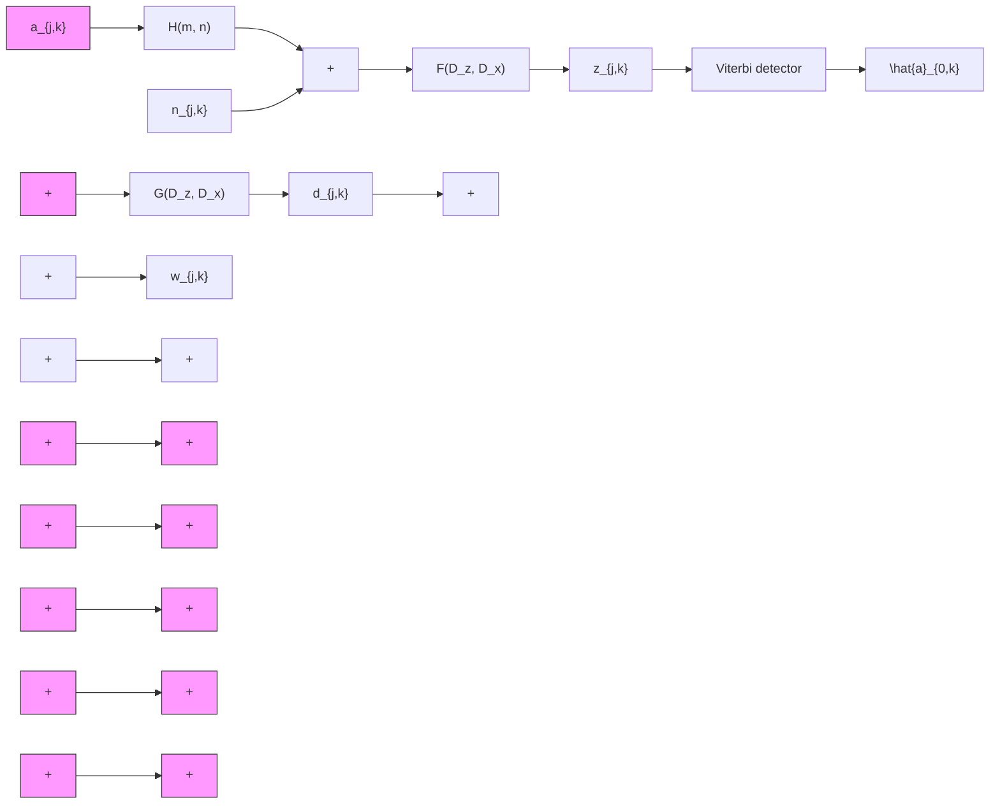
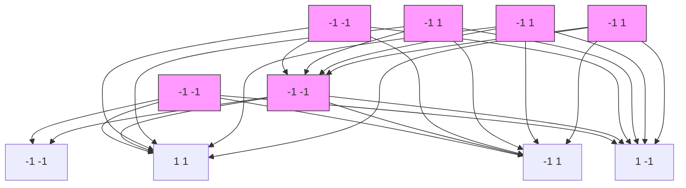
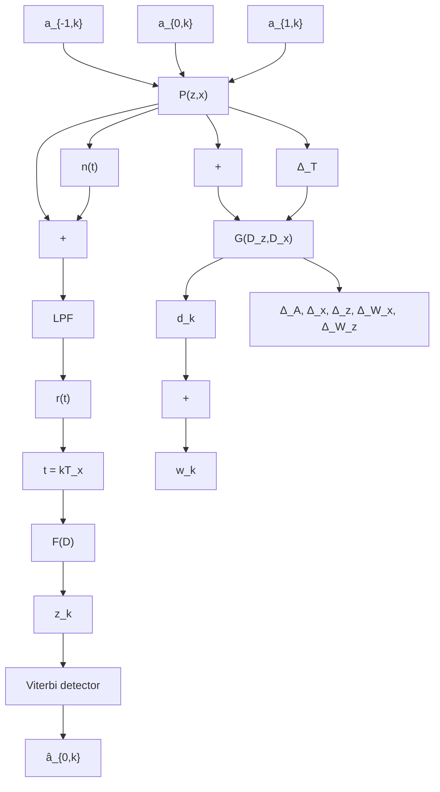
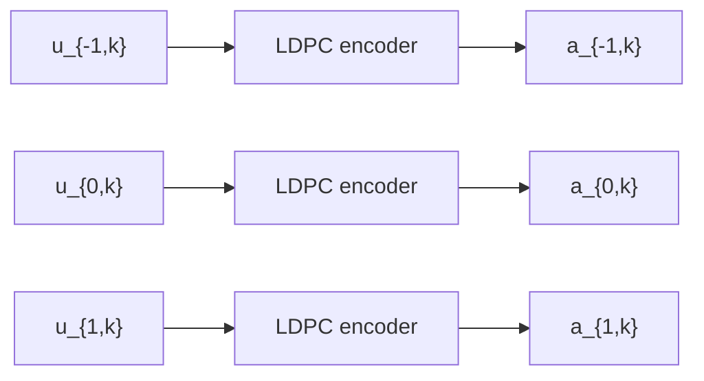
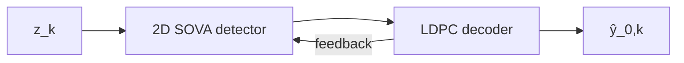

# บทที่ 7

# กรอกแบบทร์เก็ตและอีควอลเซอร์ สำหรับระบบ BPMR

เทคนิคผลตอบสนองบางส่วนควรจะเป็นสูงสุด (PRML: partial-response maximum-likelihood) [10, 27] เป็นเทคนิคหลักที่ใช้ในการตรวจสอบหาข้อมูลของระบบการบันทึกข้อมูลเชิงแม่เหล็กแบบต่างๆ เช่น แบบแนวนอน แบบแนวตั้ง และแบบ BPMR เพาะมีข้อดีคีอระบบจะไม่มีปัญหาเรื่องการขยายสัญญาณรบกวน (noise enhancement) และความชับช้อนของระบบก็ไม่มากเท่าใด

วงจรตรวจหา PRML เป็นการทำงานร่วมกันระหว่างอีควอไลเซอร์และวงจรตรวจหาวีเทอร์บิ [10, 13] ซึ่งสมรรถนะของวงจรตรวจหา PRML จะขึ้นอยู่กับความเหมาะสมของทาร์เก็ตและอีควอไลเซอร์ที่ใช้ในระบบ โดยอีควอไลเซอร์จะทำหน้าที่ปรับรูปร่างของสัญญาณให้เป็นไปตามทาร์เก็ตที่ต้องการ จากนั้นวงจรตรวจหาวีเทอร์บิชี่งสร้างจากทาร์เก็ตนี้จะทำหน้าที่ลอตรหัสข้อมูลนอกจากนี้การออกแบบทาร์เก็ตและอีควอไลเซอร์ที่ดื่งในระบบ BPMR ยังสามารถช่วยลดผลกระทบที่เกิดจาก ISI และ ITI ได้อีกต้วย

เนื่องจากช่องสัญญาณ BPMR มีผลกระทบจาก ITI ตั้งนี้นวงจรภาครับควรใช้วจรตรวจหาวีเทอร์บิสองมิติ (2D Viterbi detector) [108, 109] เพื่อให้ระบบมีสมรรถนะสูงสุด อย่างไรก็ตามวงจรตรวจหาวีเทอร์บิสองมิติมีความซับซ้อนสูงมาก ดังนั้น Nabavi [108] และ Karakulak [109] จึงได้นำเสนอวิธีการออกแบบทาร์เก็ตและอีควอไลเซอร์แบบต่างๆ เช่น ทาร์เก็ตหนึ่งมิติกับอีควอไลเซอร์หนึ่งมิติ, ทาร์เก็ตสองมิติกับอีควอไลเซอร์หนึ่งมิติ, และทาร์เก็ตสองมิติกับอีควอไลเซอร์สองมิติ เป็นต้น เพื่อให้สามารถใช้วจรตรวจหาวีเทอร์บิแบบทั่วไปได้ (นั่นคือวงจรตรวจหาวีเทอร์บิหนึ่งมิติตามที่อธิบายในบทที่ 4 ของ [10]) เพาะฉะนั้นในบทนี้จะอธิบายวิธีการออกแบบทาร์เก็ตและอีควอไลเซอร์แบบต่างๆ สำหรับระบบ BPMR พร้อมทั้งแสดงสมรรถนะของการ์เก็ตทั้งหมดตั้งต่อไปนี้

```mermaid
```mermaid
graph TD
    A["a_{-1,k}"] --> B["H(m, n)"]
    C["a_{0,k}"] --> B
    D["a_{1,k}"] --> B
    B --> E["+"]
    E --> F["r_k"]
    F --> G["F(D)"]
    G --> H["z_k"]
    H --> I["Viterbi detector"]
    I --> J["â_{0,k}"]
    K["a_{0,k}"] --> L["G(D)"]
    L --> M["d_k"]
    M --> N["+"]
    N --> O["w_k"]
    N --> P["+"]
    P --> Q["+"]
    Q --> R["+"]
    R --> S["+"]
    S --> T["+"]
    T --> U["+"]
    U --> V["+"]
    V --> W["+"]
    W --> X["+"]
    X --> Y["+"]
    Y --> Z["+"]
    Z --> AA["+"]
    AA --> AB["+"]
    AB --> AC["+"]
    AC --> AD["+"]
    AD --> AE["+"]
    AE --> AF["+"]
    AF --> AG["+"]
    AG --> AH["+"]
    AH --> AI["+"]
    AI --> AJ["+"]
    AJ --> AK["+"]
    AK --> AL["+"]
    AL --> AM["+"]
    AM --> AN["+"]
    AN --> AO["+"]
    AO --> AP["+"]
    AP --> AQ["+"]
    AQ --> AR["+"]
    AR --> AS["+"]
    AS --> AT["+"]
    AT --> AU["+"]
    AU --> AV["+"]
    AV --> AW["+"]
    AW --> AX["+"]
    AX --> AY["+"]
    AY --> AZ["+"]
    AZ --> BA["+"]
    BA --> BB["+"]
    BB --> BC["+"]
    BC --> BD["+"]
    BD --> BE["+"]
    BE --> BF["+"]
    BF --> BG["+"]
    BG --> BH["+"]
    BH --> BI["+"]
    BI --> BJ["+"]
    BJ --> BK["+"]
    BK --> BL["+"]
    BL --> BM["+"]
    BM --> BN["+"]
    BN --> BO["+"]
    BO --> BP["+"]
    BP --> BQ["+"]
    BQ --> BR["+"]
    BR --> BS["+"]
    BS --> BT["+"]
    BT --> BU["+"]
    BU --> BV["+"]
    BV --> BW["+"]
    BW --> BX["+"]
    BX --> BY["+"]
    BY --> BZ["+"]
    BZ --> CA["+"]
    CA --> CB["+"]
    CB --> CC["+"]
    CC --> CD["+"]
    CD --> CE["+"]
    CE --> CF["+"]
    CF --> CG["+"]
    CG --> CH["+"]
    CH --> CI["+"]
    CI --> CJ["+"]
    CJ --> CK["+"]
    CK --> CR["+"]
    CR --> CS["+"]
    CS --> CT["+"]
    CT --> CU["+"]
    CU --> CV["+"]
    CV --> CW["+"]
    CW --> CX["+"]
    CX --> CY["+"]
    CY --> CZ["+"]
    CZ --> DA["+"]
    DA --> DB["+"]
    DB --> DC["+"]
    DC --> DV["+"]
    DV --> DW["+"]
    DW --> DX["+"]
    DX --> DWB["+"]
    DWB --> DW["+"]
    DW --> DWC["+"]
    DW --> DWC
    DW --> DWD["+"]
    DW --> DWD
    DW --> DWE["+"]
    DW --> DWE
    DW --> DWF["+"]
    DW --> DWF
    DW --> DWG["+"]
    DW --> DWG
    DW --> DWH["+"]
    DW --> DWH
    DW --> DWI["+"]
    DW --> DWI
    DW --> DWJ["+"]
    DWJ --> DWJ
    DW --> DWK["+"]
    DWK --> DWK
    DW --> DWL["+"]
    DWL --> DWL
    DW --> DWM["+"]
    DWM --> DWM
    DW --> DWN["+"]
    DWN --> DWN
    DW --> DWO["+"]
    DWO --> DWO
    DW --> DWP["+"]
    DWP --> DWP
    DW --> DWQ["+"]
    DWQ --> DWQ
    DW --> DWR["+"]
    DWR --> DWR
    DW --> DWS["+"]
    DWS --> DWS
    DW --> DWT["+"]
    DWT --> DWT
    DW --> DWU["+"]
    DWU --> DWU
    DW --> DWV["+"]
    DWV --> DWV
    DW --> DWW["+"]
    DWW --> DWW
    DW --> DWX["+"]
    DWX --> DWX
    DW --> DWY["+"]
    DWY --> DWY
    DW --> DWZ["+"]
    DWZ --> DWZ
    DW --> DWY
    DWY --> DWY
    DW --> DWZ
    DWZ --> DWZ
    DW --> DWY
    DWY --> DWY
    DW --> DWZ
    DWZ --> DWZ
    DW --> DWY
    DWY --> DWY
    DW --> DWZ
    DWZ --> DWZ
    DW --> DWY
    DWY --> DWY
    DW --> DWZ
    DWZ --> DWZ
    DW --> DWY
    DWY --> DWY
    DN["Ch่องสัญญาณ H"] --> H
    DN --> G(D)
    DN --> G(D)
    DN --> G(D)
    DN --> G(D)
    DN --> G(D)
    DN --> G(D)
    DN --> G(D)
    DN --> G(D)
    DN --> G(D)
    DN --> G(D)
    DN --> G(D)
    DN --> G(D)
    DN --> G(D)
    DN --> G(D)
    DN --> G(D)
    DN --> G(D)
    DN --> G(D)
    DN --> W
    DN --> W
    DN --> W
    DN --> W
    DN --> W
    DN --> W
    DN --> W
    DN --> W
    DN --> W
    DN --> W
    DN --> W
    DN --> W
    DN --> W
    DN --> W
    DN --> W
    DN --> W
    DN --> W
    DN --> W
    DN --> W
    DN --> W
    DN --> W
```


<details>
<summary>flowchart</summary>


</details>

รูปที่ 7.1 แบบจำลองช่องสัญญาณสำหรับการออกแบบบทาร์เก็ตหนึ่งมิติและอีควอไลเซอร์หนึ่งมิติ [10]

# หมายเหตุ ในบทนี้

- ช่องสัญญาณ BPMR ที่ไม่ต่อเนื่องทางเวลาจะลูกกำหนดด้วยเมตริกซ์ H ซึ่งได้มาจากการซักตัวอย่าง (sampling) ผลตอบสนองสัญญาณพัลล์ส์แบบสองมิติ ณ เวลาที่เป็นจำนวนเท่าของคาบเวลาของบิต ( $T_x$ ) และระยะแทร็ก ( $T_z$ )   
- สัญญาณอ่านกลับที่ได้จากหัวอ่านจะมีผลกระทบของ ISI ที่มาจากข้อมูลเพียง 3 ค่าเวลาของ
บิต และมีผลกระทบของ ITI ที่มาจากข้อมูลเพียง 3 แทร็กเท่านนั้น นั่นตือเมทริกซ์ H จะมีขนาด
3×3 (นั่นคือ 3 แถวและ 3 แนวตั้ง) ตามสมการ (6.18)   
- การออกแบบทร์เก็ตและอีควอไลเซอร์ทุกแบบจะใช้วิธีการ “ข้อผิดพลาดกำลังสองเฉลี่ยน้อยสุด (MMSE: minimum mean-squared error)” [14] ซึ่งเป็นการทำให้อผิดพลาดกำลังสองเฉลี่ย (MSE) ระหว่างสัญญาณที่ต้านขาออกของอีควอไลเซอร์ $\{z_{k}\}$ และสัญญาณต้านขาออกของทร์เก็ต $\{d_{k}\}$ มีค่าน้อยสุด (ดูรูปที่ 7.1) ซึ่งวิธีการ MMSE นี้เป็นวิธีที่ง่ายและเหมาะสมำหรับการนำใช้งานจริงในทางปฏิบัติ

# 7.1 ทาร์เก็ตหนึ่งมิติและอีควอไลเซอร์หนึ่งมิติ

พิจารณาแบบจำลองช่องสัญญาณ BPMR ที่ไม่ต่อเนื่องทางเวลาสำหรับการออกแบบทร์เก็ตหนึ่งมิติและอีควอไลเซอร์หนึ่งมิติในรูปที่ 7.1 โดยที่ $\left\{a_{-1,k}, a_{0,k}, a_{1,k}\right\} \in \left\{\pm1\right\}$ คือลำดับข้อมูลอินพุตของแทรกับน แทรกกลาง และแทรกถ่าง ตามลำดับ จะถูกส่งเข้าไปยังช่องสัญญาณ H ทำให้ได้สัญญาณอ่านกลับ $r_{k}$ ชิ่งเขียนเป็นสมการคณิตศาสตร์ได้คือ

$$
r _ {k} = \sum_ {m = - 1} ^ {1} \sum_ {n = - 1} ^ {1} h _ {m, n} a _ {- m, k - n} + n _ {k} \tag {7.1}
$$

เมื่อ $h_{m,n}$ คือค่าสัมประสิทธิ์ของเมทริกซ์ H (ดูสมการ (6.18)) และ $n_{k}$ คือสัญญาณรบกวนเกลล์เซียนสีขาวแบบบวก (AWGN) ที่มีค่าเฉลี่ยเท่ากับศูนย์และความแปรปรวนเท่ากับ $\sigma^{2}$ นั่นคือ $n_{k} \sim \mathcal{N}(0, \sigma^{2})$ จากนั้น ณ วงจรภาครับ สัญญาณอ่านกลับ $r_{k}$ จะลูกส่งเข้าไปยังอีดวอลไลเซอร์ หนึ่งมิติ $F(D)$ เพื่อปรับรูปรางของสัญญาณอ่านกลับให้มีคุณสมบัติเป็นไปตามทาร์เก็ด $G(D)$ แล้วจึงส่งข้อมูลเอาต์พุตของอีดวอลไลเซอร์ $\{z_{k}\}$ เข้าไปในวงจรวงจรตรวจสอบทวีเทอร์บิแบบทั่วไปเพื่อหาค่าประมาณของลำดับข้อมูลของแทรกกลาง นั่นคือหาค่า $\hat{a}_{0,k}$

ถ้าสมมุติว่าผลกระทบที่เกิดจาก ITI ถือเป็นสัญญาณรบกวนประเภทหนึ่งที่เหมือนกับสัญญาณรบกวน $n_{k}$ ดังนั้นการออกแบบบทาร์เกตหนึ่งมิติและอีควอไลเซอร์หนึ่งมิติในหัวข้อนี้จะเหมือนกับการออกแบบบทาร์เกตและอีควอไลเซอร์ที่ใช้ในระบบการบันทึกข้อมูลแบบแนวตั้งตามที่อธิบายในบทที่ 3 ของ [10] ซึ่งสรุปได้ตั้งนี้ ถ้ากำหนดให้อีควอไลเซอร์ขนาด $N = 2K + 1$ แท้ป (เมื่อ K คือเลขจำนวนเต็มบวก) สามารถเขียนให้อยู่ในรูปสมการคณิตศาสตร์ในโตเมน D ได้คือ

$$
F (D) = \sum_ {k = - K} ^ {K} f _ {k} D ^ {k} \tag {7.2}
$$

เมื่อ D คือตัวดำเนินการหน่วงเวลา $T_{x}$ หน่วย ในทำงานองเดี่ยวกันทาร์เก็ตขนาด L = 3 แท้ป $^{44}$ ก็สามารถเขียนให้อยู่ในรูปของสมการคณิตศาสตร์ในโตเมน D ได้คือ

$$
G (D) = \sum_ {k = 0} ^ {2} g _ {k} D ^ {k} \tag {7.3}
$$

โดยที่ $f_{k}$ และ $g_{k}$ คือค่าสัมประสิทธิ์ลำดับที่ k ของอีควอไลเซอร์และทาร์เก็ต ตามลำดับ

จุดประสงค์ในการออกแบบบทาร์เก็ตด้วยวิธีการ MMSE ก็ต็จะทำการดำเนวณหาค่าสัมประสิทธิ์ของ $F(D)$ และ $H(D)$ ไปพร้อมกันในเวลาเดี่ยวกัน โดยการทำให้ค่า MSE ระหว่างข้อมูลเอาต์พุตของอีควอไลเซอร์ $z_{k}$ และข้อมูลเอาต์พุตของทาร์เก็ต $d_{k}$ มีค่าน้อยสุด หรือกล่าวอีกนัยหนึ่งคือค่าสัมประสิทธิ์ $f_{k}$ และ $g_{k}$ จะถูกเลือกเพื่อทำให้ค่า

$$
E \left[ w _ {k} ^ {2} \right] = E \left[ \left\{\left(r _ {k} * f _ {k}\right) - \left(a _ {0, k} * g _ {k}\right) \right\} ^ {2} \right] \tag {7.4}
$$

มีค่าน้อยสุด เมื่อ $w_{k}=z_{k}-d_{k}$ คือข้อผิดพลาดที่เกิดจากการออกแบบทาร์เก็ต, \* คือตัวดำเนินการ คอนโวลูชัน, และ $E[\cdot]$ คือตัวดำเนินการค่าคาดหมาย (expectation operator)

ถ้ากำหนดให้ $\mathbf{g} = [g_0 g_1 g_2]^{\mathrm{T}}$ คือเวกเตอร์แนวตั้งของทาร์เก็ต $G(D)$ และ $\mathbf{f} = [f_{-K} \ldots f_0 \ldots f_K]^{\mathrm{T}}$ คือเวกเตอร์แนวตั้งของอีควอไลเซอร์ $F(D)$ , $\mathbf{r}_k = [r_{k+K} \ldots r_k \ldots r_{k-K}]^{\mathrm{T}}$ คือเวกเตอร์แนวตั้งของสัญญาณอ่านกลับ, $\mathbf{a}_k = [a_{0,k} a_{0,k-1} a_{0,k-2}]^{\mathrm{T}}$ คือเวกเตอร์แนวตั้งของข้อมูลอินพุตในแทรกกลาง $\{a_{0,k}\}$ , และ $[\cdot]^{\mathrm{T}}$ คือเครื่องเมทริกซ์สลับเปลี่ยน (transpose matrix) ตั้งนั้นสมการ (7.4) สามารถเขียนให้อยู่ในรูปเมทริกซ์ได้ตั้งนี้

$$
\begin{array}{l} E \Big [ w ^ {2} \Big ] = E \Big [ \Big (\mathbf {f} ^ {\mathrm{T}} \mathbf {r} _ {k} - \mathbf {g} ^ {\mathrm{T}} \mathbf {a} _ {k} \Big) \Big (\mathbf {f} ^ {\mathrm{T}} \mathbf {r} _ {k} - \mathbf {g} ^ {\mathrm{T}} \mathbf {a} _ {k} \Big) ^ {\mathrm{T}} \Big ] \\ = \mathbf {f} ^ {\mathrm{T}} \mathbf {R} \mathbf {f} + \mathbf {g} ^ {\mathrm{T}} \mathbf {A} \mathbf {g} - 2 \mathbf {f} ^ {\mathrm{T}} \mathbf {P} \mathbf {g} \tag {7.5} \\ \end{array}
$$

เมื่อ $R = E \left[ r_{k} r_{k}^{T} \right]$ คือเมทริกซ์อัตสหล้มพันธิ์ (auto-correlation matrix) ขนาด $N \times N$ ของข้อมูล $\{ r_{k} \}$ , $A = E \left[ a_{k} a_{k}^{T} \right]$ คือเมทริกซ์อัตสหล้มพันธิ์ขนาด $L \times L$ ของข้อมูล $\{ a_{0,k} \}$ , $P = E \left[ r_{k} a_{k}^{T} \right]$ คือเมทริกซ์สหล้มพันธิ์ข้าม (cross-correlation matrix) ขนาด $N \times L$ ระหว่างข้อมูล $\{ r_{k} \}$ และ $\{ a_{0,k} \}$ , $N = 2K + 1$ คือจำนวนแท้ปของอีควอไลเซอร์, และ L = 3 คือจำนวนแท้ปของทาร์เก็ด โดยที่สมาชิก $(i, j)$ (แถวที่ i และแนวตั้งที่ j) ของเมทริกซ์ทั้งสามนี้คือ

$$
\mathbf {R} (i, j) = E \left[ \sum_ {k = 0} ^ {S - 1} r _ {k + K - i} r _ {k + K - j} \right], \quad 0 \leq i, j \leq 2 K \tag {7.6}
$$

$$
\mathbf {A} (i, j) = E \left[ \sum_ {k = 0} ^ {S - 1} a _ {0, k - i} a _ {0, k - j} \right], \quad 0 \leq i, j \leq L - 1 \tag {7.7}
$$

$$
\mathbf {P} (i, j) = E \left[ \sum_ {k = 0} ^ {S - 1} r _ {k + K - i} a _ {0, k - j} \right], \quad 0 \leq i \leq 2 K, \quad 0 \leq j \leq L - 1 \tag {7.8}
$$

เมื่อ S คือความยาว (หรือจำนวนบิต) ของลำดับข้อมูลอินพุต {a0,k}

การทำให้ค่า $E[w^{2}]$ ในสมการ (7.5) มีค่าน้อยสุดเมื่อเทียบกับ f และ g จะต้องมีการกำหนดเงื่อนไขบังคับ (constraint) เข้าไปในระหว่างกระบวนการทำให้มีค่าน้อยสุด (minimization process) เพื่อหลักเลี่ยงปัญหาที่จะได้ผลลัพธ์เป็น f = g = 0 ดังนั้นในที่นี้จะทำการประยุกต์ใช้เงื่อนไขบังคับแบบโมนิก (monic constraint) [10, 14] ในกรออกแบบทร์เก็ต ซึ่งจะกำหนดให้ ค่าสัมประสิทธิ์ของแท้ Packagingของทร์เก็ตมีค่าเท่ากับหนึ่ง (นั่นคือ $g_{1} = 1$ ) [108] ดังนั้นถ้าให้เวกเตอร์แนวตั้ง I = [0 1 0] $^{T}$ เพื่อนไขบังคับแบบโมนิกนี้สามารถเขียนให้อยู่ในรูปของ metทริกซ์ได้คือ I $^{T}$ g = 1 เพาะฉะนั้นกระบวนการในการออกแบบทร์เก็ตที่ใช้เงื่อนไขบังคับแบบโมนิกจะทำให้

ค่า MSE ในสมการ (7.5) มีค่าน้อยสุด โดยพยยามรักษาให้ค่า $I^{T}g = 1$ ตลอดเวลา นั่นคือ กระบวนการนี้จะทำให้ค่า

$$
E \left[ w ^ {2} \right] = \mathbf {f} ^ {\mathrm{T}} \mathbf {R} \mathbf {f} + \mathbf {g} ^ {\mathrm{T}} \mathbf {A} \mathbf {g} - 2 \mathbf {f} ^ {\mathrm{T}} \mathbf {P} \mathbf {g} - 2 \lambda \left(\mathbf {I} ^ {\mathrm{T}} \mathbf {g} - 1\right) \tag {7.9}
$$

มีค่าน้อยสุด เมื่อ λ คือตัวดูแลลกราหนึ่ง (Lagrange multiplier) ที่เป็นค่าสเกลาร์ การทำให้สมการ (7.9) มีค่าน้อยสุดทำได้โดยการหาอนุพันธ์ของสมการ (7.9) เทียบกับ f, g และ λ ตามลําดับ แล้วให้ผลลัพธ์เท่ากับศูนย์ ก็จะให้ค่าตอบคือ

$$
\lambda = \frac {1}{\mathbf {I} ^ {\mathrm{T}} \left(\mathbf {A} - \mathbf {P} ^ {\mathrm{T}} \mathbf {R} ^ {- 1} \mathbf {P}\right) ^ {- 1} \mathbf {I}} \tag {7.10}
$$

$$
\mathbf {g} = \lambda \left(\mathbf {A} - \mathbf {P} ^ {\mathrm{T}} \mathbf {R} ^ {- 1} \mathbf {P}\right) ^ {- 1} \mathbf {I} \tag {7.11}
$$

$$
\mathbf {f} = \mathbf {R} ^ {- 1} \mathbf {P} \mathbf {g} \tag {7.12}
$$

โดยค่า λ ก็คือค่า MMSE ที่ได้จากการออกแบบทร์เก็ตภายใต้เงื่อนไขบังคับนี้

หมายเหตุ สมการ (7.10) – (7.12) จะเหมือนกับสมการ (3.19) – (3.21) ของการออกแบบทร์เก็ตและอีควอลเซอร์ที่ใช้ในระบบการบันทึกเชิงแม่เหล็กแบบแนวตั้งตามที่อธิบายในหัวข้อที่ 3.2.1 ของ [10]

# 7.2 ทร์เก็ตสองมิติที่มีมุ่มเป็นศูนย์และอีควอไลเซอร์หนึ่งมิติ

โดยทั่วไปทาร์เก็ตหนึ่งมิติที่อธิบายในหัวข้อที่ 7.1 เหมาะสำหรับนำมาใช้งานในระบบ BPMR ที่มี ผลกระทบของ ITI น้อย (เช่น ความจุข้อมูล < 2 Tb/in²) แต่เมื่อระบบ BPMR มีผลกระทบของ ITI ปานกลาง (เช่น ความจุข้อมูล 2 ถึง 2.5 Tb/in²) ก็ควรเปลี่ยนมาใช้ทาร์เก็ตสองมิติ ในหัวข้อนนี้จะอธิบายวิธีการออกแบบทาร์เก็ตสองมิติที่มีมุมเป็นศูนย์ (zero-corner target) และอีควอไลเซอร์ หนึ่งมิติตามที่นำเสนอใน [109] ซึ่งสามารถแบ่งออกเป็น 2 กรณีตั้งนี้

# 7.2.1 เมื่อทราบช่องสัญญาณ H

พิจารณาแบบจำลองช่องสัญญาณสำหรับการออกแบบทาร์เกตสองมิติและอีควอไลเซอร์หนึ่งมิติในรูปที่ 7.2 [109] เมื่อ $\left\{a_{-1,k},a_{0,k},a_{1,k}\right\}\in\left\{\pm1\right\}$ คือลำดับข้อมูลอินพุตของแทรกบน แทรกกลาง และแทรกล่าง ตามลำดับ จะลูกส่งเข้าไปยังช่องสัญญาณ H ซึ่งลูกกำหนดด้วยสมการ (6.18) นั่นคือ

```mermaid
graph TD
    A["a_{-1,k}"] --> B["H_{-1}(D)"]
    C["a_{0,k}"] --> D["H_0(D)"]
    E["a_{1,k}"] --> F["H_1(D)"]
    B --> G["+"]
    D --> G
    F --> G
    G --> H["r_k"]
    H --> I["F(D)"]
    I --> J["z_k"]
    J --> K["Viterbi detector"]
    K --> L["â_{0,k}"]
    M["ทาร์เก็ด G"] --> N["G_{-1}(D)"]
    M --> O["G_0(D)"]
    M --> P["G_1(D)"]
    N --> Q["+"]
    O --> Q
    P --> Q
    Q --> R["d_k"]
    R --> S["+"]
    S --> T["w_k"]
    U["n_k"] --> G
    V["n_k"] --> G
    W["n_k"] --> G
    X["n_k"] --> G
    Y["n_k"] --> G
    Z["n_k"] --> G
    AA["n_k"] --> G
    AB["n_k"] --> G
    AC["n_k"] --> G
    AD["n_k"] --> G
    AE["n_k"] --> G
    AF["n_k"] --> G
    AG["n_k"] --> G
    AH["n_k"] --> G
    AI["n_k"] --> G
    AJ["n_k"] --> G
    AK["n_k"] --> G
    AL["n_k"] --> G
    AM["n_k"] --> G
    AN["n_k"] --> G
    AO["n_k"] --> G
    AP["n_k"] --> G
    AQ["n_k"] --> G
    AR["n_k"] --> G
    AS["n_k"] --> G
    AT["n_k"] --> G
    AU["n_k"] --> G
    AV["n_k"] --> G
    AW["n_k"] --> G
    AX["n_k"] --> G
    AY["n_k"] --> G
    AZ["n_k"] --> G
    BA["n_k"] --> G
    BB["n_k"] --> G
    BC["n_k"] --> G
    BD["n_k"] --> G
    BE["n_k"] --> G
    BF["n_k"] --> G
    BG["n_k"] --> G
    BH["n_k"] --> G
    BI["n_k"] --> G
    BJ["n_k"] --> G
    BK["n_k"] --> G
    BL["n_k"] --> G
    BM["n_k"] --> G
    BN["n_k"] --> G
    BO["n_k"] --> G
    BP["n_k"] --> G
    BQ["n_k"] --> G
    BR["n_k"] --> G
    BS["n_k"] --> G
    BT["n_k"] --> G
    BU["n_k"] --> G
    BV["n_k"] --> G
    BW["n_k"] --> G
    BX["n_k"] --> G
    BY["n_k"] --> G
    BZ["n_k"] --> G
    CA["n_k"] --> G
    CB["n_k"] --> G
    CC["n_k"] --> G
    DD["n_k"] --> G
    DE["n_k"] --> G
    DF["n_k"] --> G
    DG["n_k"] --> G
    DH["n_k"] --> G
    DI["n_k"] --> G
    DJ["n_k"] --> G
    DK["n_k"] --> G
    DL["n_k"] --> G
    DV["n_k"] --> G
    DW["n_k"] --> G
    DX["n_k"] --> G
    DXB["n_k"] --> G
    DXC["n_k"] --> G
    DXF["n_k"] --> G
    DXG["n_k"] --> G
    DXH["n_k"] --> G
    DXI["n_k"] --> G
    DXJ["n_k"] --> G
    DXK["n_k"] --> G
    DXL["n_k"] --> G
    DXM["n_k"] --> G
    DXN["n_k"] --> G
    DXO["n_k"] --> G
    DXP["n_k"] --> G
    DXQ["n_k"] --> G
    DXR["n_k"] --> G
    DXS["n_k"] --> G
    DXT["n_k"] --> G
    DXU["n_k"] --> G
    DXV["n_k"] --> G
    DXW["n_k"] --> G
    DXX["n_k"] --> G
    DXY["n_k"] --> G
    DXZ["n_k"] --> G
    DXYB["n_k"] --> G
    DXYC["n_k"] --> G
    DXYD["n_k"] --> G
    DXYE["n_k"] --> G
    DXYF["n_k"] --> G
    DXYG["n_k"] --> G
    DXYH["n_k"] --> G
    DXYI["n_k"] --> G
    DXYJ["n_k"] --> G
    DXYK["n_k"] --> G
    DXYL["n_k"] --> G
    DXYM["n_k"] --> G
    DXYN["n_k"] --> G
    DXYO["n_k"] --> G
    DXYP["n_k"] --> G
    DXYQ["n_k"] --> G
    DXYR["n_k"] --> G
    DXYS["n_k"] --> G
    DXYT["n_k"] --> G
    DXYU["n_k"] --> G
    DXYV["n_k"] --> G
    DXYW["n_k"] --> G
    DXYX["n_k"] --> G
    DXYY["n_k"] --> G
    DXYZ["n_k"] --> G
    DXYYB["n_k"] --> G
    DXYYC["n_k"] --> G
    DXYYD["n_k"] --> G
    DXYYE["n_k"] --> G
    DXYYF["n_k"] --> G
    DXYYG["n_k"] --> G
    DXYYH["n_k"] --> G
    DXYYI["n_k"] --> G
    DXYYJ["n_k"] --> G
    DXYYK["n_k"] --> G
    DXYYL["n_k"] --> G
    DXYYM["n_k"] --> G
    DXYYN["n_k"] --> G
    DXYYO["n_k"] --> G
    DXYYP["n_k"] --> G
    DXYYQ["n_k"] --> G
    DXYYR["n_k"] --> G
    DXYYS["n_k"] --> G
    DXYYT["n_k"] --> G
    DXYYU["n_k"] --> G
    DXYYV["n_k"] --> G
    DXYYW["n_k"] --> G
    DXYYX["n_k"] --> G
    DXYYY["n_k"] --> G
    DXYYZ["n_k"] --> G
    DXYYXN["n_k"] --> G
    DXYYYX["n_k"] --> G
    DXYYZX["n_k"] --> G
    DXYYXY["n_k"] --> G
    DXYYYY["X"] --> G
    DXYYXY["X"] --> G
    DXYYYX["X"] --> G
    DXYYYX["X"] --> G
    DXYYXY["X"] --> G
    DXYYXY["X"] --> G
    DXYYXY["X"] --> G
    DXYYXY["X"] --> G
    DXYYXY["X"] --> G
    DXYYXY["X"] --> G
    DXYYXY["X"] --> G
    DXYYXY["X"] --> G
    DXYYXY["X"] --> G
    DXYYXY["Y"] --> G
    DXYYXY["Y"] --> G
    DXYYXY["Y"] --> G
    DXYYXY["Y"] --> G
    DXYYXY["Y"] --> G
    DXYYXY["Y"] --> G
    DXYYXY["Y"] --> G
    DXYYXY["Y"] --> G
    DXYYXY["Y"] --> G
    DXYYXY["Y"]
    DXYYXY["Y"] --> G
    DXYYXY["Y"] --> G
    DXYYXY["Y"] --> G
    DXYYXY["Y"] --> G
    DXYYXY["Y"] --> G
    DXYYXY["Y"] --> G
    DXYYXY["Y"] --> G
    DXYYXY["Y"] --> G
    DXYYXY["Y"] --> G
```


<details>
<summary>flowchart</summary>


</details>

รูปที่ 7.2 แบบจำลองช่องสัญญาณสำหรับการออกแบบทาร์เก็ตสองมิติและอีควอลเซอร์หนึ่งมิติ [109]

$$
\mathbf {H} = \left[ \begin{array}{l} H _ {- 1} (D) \\ H _ {0} (D) \\ H _ {1} (D) \end{array} \right] = \left[ \begin{array}{l l l} h _ {- 1, - 1} & h _ {- 1, 0} & h _ {- 1, 1} \\ h _ {0, - 1} & h _ {0, 0} & h _ {0, 1} \\ h _ {1, - 1} & h _ {1, 0} & h _ {1, 1} \end{array} \right] \tag {7.13}
$$

เมื่อ $H_{-1}(D)$ , $H_{0}(D)$ และ $H_{1}(D)$ ตือผลตอบสนองของช่องสัญญาณในแทรกับน แทรกกลาง และแทรกล่าง ตามลำดับ ทำให้ได้สัญญาณอ่านกลับ $r_{k}$ ตามสมการ (6.19) นั้นคือ

$$
r _ {k} = \left(a _ {0, k} * h _ {0, k}\right) + \left(a _ {- 1, k} * h _ {- 1, k}\right) + \left(a _ {1, k} * h _ {1, k}\right) + n _ {k} \tag {7.14}
$$

โดยที่ $h_{m,k}$ คือค่าสัมประสิทธิ์ของเมทริกซ์ H สำหรับ $m \in \{-1, 0, 1\}$ และ $n_{k} \sim \mathcal{N}(0, \sigma^{2})$ คือสัญญาณรบกวน AWGN ที่มีค่าเฉลี่ยเท่ากับศูนย์และความแปรปรวนเท่ากับ $\sigma^{2}$ จากนั้น ณ วงจรภาครับ สัญญาณอ่านกลับ $r_{k}$ จะลูกส่งเข้าไปยังอีควอไลเซอร์หนึ่งมิติ $F(D)$ เพื่อปรับรูปร่างของสัญญาณอ่านกลับให้มีคุณสมบัติเป็นไปตามทาร์เก็ด $G_{m}(D)$ แล้วจึงส่งข้อมูลเอาต์พุตของอีควอไลเซอร์ $\{z_{k}\}$ เข้าไปในวงจรตรวจสอบวีเทอร์บิแบบที่ลูกปรับปรุง $^{45}$ (modified Viterbi detector) [108] เพื่อหาค่าประมาณของลำดับข้อมูลของแทรกกลาง $\{\hat{a}_{0,k}\}$
กรออกแบบทร์เก็ตและอีควอลเซอร์จะใช้วิธีการ MMSE โดยถ้ากำหนดให้อีควอลเซอร์ หนึ่งมิติ $F(D)$ มีจำนวน $N = 2K + 1$ แท้ปตามสมการ (7.2) และทร์เก็ตสองมิติขนาด $3 \times 3$ มีค่าเท่ากับ

$$
\mathbf {G} = \left[ \begin{array}{l} G _ {- 1} (D) \\ G _ {0} (D) \\ G _ {1} (D) \end{array} \right] = \left[ \begin{array}{l l l} g _ {- 1, 0} & g _ {- 1, 1} & g _ {- 1, 2} \\ g _ {0, 0} & g _ {0, 1} & g _ {0, 2} \\ g _ {1, 0} & g _ {1, 1} & g _ {1, 2} \end{array} \right] \tag {7.15}
$$

เมื่อ $G_{-1}(D)$ , $G_{0}(D)$ และ $G_{1}(D)$ คือผลตอบสนองของทาร์เก็ดในแทรกบน แทรกกลาง และ แทรกล่าง ตามลำ Pend, และ $g_{-1,0} = g_{1,0} = g_{-1,2} = g_{1,2} = 0$ สำหรับทาร์เก็ดสองมิติที่มีมุ่มเป็นศูนย์ $^{46}$

ใน才能够เดี่ยวกันลําให้ $f = [f_{-K}, \ldots, f_{0}, \ldots, f_{K}]^{T}$ คือเวกเตอร์แนวตั้งของอีควอไลเซอร์, $a_{k} = [a_{-1,k+K} a_{0,k+K} a_{1,k+K} \ldots a_{-1,k} a_{0,k} a_{1,k} \ldots a_{-1,k-K-2} a_{0,k-K-2} a_{1,k-K-2}]^{T}$ คือเวกเตอร์แนวตั้งที่มีสมาชิก $6K + 9$ ตัวของลําตับข้อมูลอินพุตทั้งสามแทร็ก, $n_{k} = [n_{k+K} \ldots n_{k} \ldots n_{k-K}]^{T}$ คือเวกเตอร์แนวตั้งที่มีสมาชิก $N = 2K + 1$ ตัวของสัญญาณรบกวน $n_{k}$ , และให้ $\tilde{H}$ คือเมตริกซี่ ช่องสัญญาณขนาด $N \times (6K + 9)$ ชื่งมีค่าเท่ากับ

$$
\tilde {\mathbf {H}} = \left[ \begin{array}{c c c c c c c c c c c c c c} h _ {- 1, - 1} & h _ {0, - 1} & h _ {1, - 1} & h _ {- 1, 0} & h _ {0, 0} & h _ {1, 0} & h _ {- 1, 1} & h _ {0, 1} & h _ {1, 1} & 0 & 0 & 0 & 0 & \dots \\ 0 & 0 & 0 & h _ {- 1, - 1} & h _ {0, - 1} & h _ {1, - 1} & h _ {- 1, 0} & h _ {0, 0} & h _ {1, 0} & h _ {- 1, 1} & h _ {0, 1} & h _ {1, 1} & 0 & \dots \\ \vdots & \vdots & \vdots & \vdots & \vdots & \vdots & \vdots & \vdots & \vdots & \vdots & \vdots & \vdots & \vdots & \ddots \end{array} \right] \tag {7.16}
$$

ตั้งนี้นลำตับข้อมูลเอาต์พุตของอีควอไลเซอร์สามารถเขียนให้อยู่ในรูปเมทริกซ์ได้คือ

$$
z _ {k} = \mathbf {f} ^ {\mathrm{T}} \left(\tilde {\mathbf {H}} \mathbf {a} _ {k} + \mathbf {n} _ {k}\right) = \mathbf {f} ^ {\mathrm{T}} \tilde {\mathbf {r}} _ {k} \tag {7.17}
$$

เมื่อ $\tilde{r}_{k} = \tilde{H}a_{k} + n_{k}$ คือเวกเตอร์แนวตั้งที่มีสมาชิก N ตัวของสัญญาณอ่านกลับ

นอกจากนี้ลำกำหนดให้ $u_{k} = [a_{0,k} a_{-1,k-1} a_{0,k-1} a_{1,k-1} a_{0,k-2}]^{T}$ คือเวกเตอร์แนวตั้งของลำดับข้อมูลอินพุตทั้งสามแทร็กที่สอดคล้องกับเวกเตอร์แนวตั้งของทาร์เก็ตที่มีมุมเป็นศูนย์ (เฉพาะสมาชิกที่มีค่าไม่เท่ากับค่าศูนย์) $g = [g_{0,0} g_{-1,1} g_{0,1} g_{1,1} g_{0,2}]^{T}$ ชึ่งทำให้ลำดับข้อมูลของทาร์เก็ต G มีค่าเท่ากับ

$$
d _ {k} = \mathbf {g} ^ {\mathrm{T}} \mathbf {u} _ {k} \tag {7.18}
$$

ดังนั้นผลต่างระหว่างข้อมูลเอาต์พุตของอีควอไลเซอร์ $z_{k}$ และข้อมูลเอาต์พุตของทาร์เก็ด $d_{k}$ คือ

$$
w _ {k} = z _ {k} - d _ {k} = \mathbf {f} ^ {\mathrm{T}} \tilde {\mathbf {r}} _ {k} - \mathbf {g} ^ {\mathrm{T}} \mathbf {u} _ {k} \tag {7.19}
$$

กรออกแบบทร์เก็ตและอีควอลเซอร์ด้วยวิธีการ MMSE จะเลือกค่าสัมประสิทธิ์ $f_{k}$ และ $g_{k}$ ที่ทำให้ค่าข้อผิดพลาดกำลังสองเฉลี่ย (MSE) นั่นคือ

$$
\begin{array}{l} E \Big [ w ^ {2} \Big ] = E \Big [ \big (z _ {k} - d _ {k} \big) ^ {2} \Big ] = E \Big [ \big (\mathbf {f} ^ {\mathrm{T}} \tilde {\mathbf {r}} _ {k} - \mathbf {g} ^ {\mathrm{T}} \mathbf {u} _ {k} \big) \big (\mathbf {f} ^ {\mathrm{T}} \tilde {\mathbf {r}} _ {k} - \mathbf {g} ^ {\mathrm{T}} \mathbf {u} _ {k} \big) ^ {\mathrm{T}} \Big ] \\ = \mathbf {f} ^ {\mathrm{T}} \tilde {\mathbf {R}} \mathbf {f} + \mathbf {g} ^ {\mathrm{T}} \mathbf {U} \mathbf {g} - 2 \mathbf {f} ^ {\mathrm{T}} \tilde {\mathbf {P}} \mathbf {g} \tag {7.20} \\ \end{array}
$$

มีค่าน้อยสุด เมื่อ $\tilde{R}=E\left[\tilde{r}_{k}\tilde{r}_{k}^{\mathrm{T}}\right]$ คือเมทริกซ์อัตสหส้มพันธ์ขนาด $N\times N$ , $U=E\left[u_{k}u_{k}^{\mathrm{T}}\right]$ คือเมทริกซ์อัตสหส้มพันธ์ขนาด $5\times5$ , และ $\tilde{P}=E\left[\tilde{r}_{k}u_{k}^{\mathrm{T}}\right]$ คือเมทริกซ์สหส้มพันธ์ข้ามขนาด $N\times5$

กรออกแบบทร์เก็ตด้วยวิธีการ MMSE จะใช้เงื่อนไขบังคับแบบโมนิกซึ่งจะกำหนดให้
ค่าสัมประสิทธิ์ของแท้ปศูนย์กลางของทร์เก็ตมีค่าเท่ากับหนึ่ง (นั้นคือ $g_{0,1} = 1$ ) [109] และถ้าให้
เวกเตอร์แนวตั้ง $I = [0\ 0\ 1\ 0\ 0]^{T}$ เงื่อนไขบังคับแบบโมนิกนี้จะเขียนให้อยู่ในรูปของเมตริกซีได้
คือ $I^{T}g = 1$ ดังนั้นกระบวนการในการออกแบบทร์เก็ตที่ใช้เงื่อนไขบังคับแบบโมนิกนี้จะทำให้ค่า
MSE ในสมการ (7.20) มีค่าน้อยสุด โดยพยายมรักษาให้ค่า $I^{T}g = 1$ ตลอดเวลา กล่าวคือการ
ออกแบบทร์เก็ตด้วยวิธีการ MMSE จะทำให้ค่า

$$
E \left[ w ^ {2} \right] = \mathbf {f} ^ {\mathrm{T}} \tilde {\mathbf {R}} \mathbf {f} + \mathbf {g} ^ {\mathrm{T}} \mathbf {U} \mathbf {g} - 2 \mathbf {f} ^ {\mathrm{T}} \tilde {\mathbf {P}} \mathbf {g} - 2 \lambda \left(\mathbf {I} ^ {\mathrm{T}} \mathbf {g} - 1\right) \tag {7.21}
$$

มีค่าน้อยสุด เมื่อ λ คือตัวดูณลลกราหน์ จากนั้นให้หาอนุพันธ์ของสมการ (7.21) เทียบกับ f, g และ λ ตามลำดับ แล้วให้ผลลัพธ์เท่ากับศูนย์ ก็จะได้caçãoตอบคือ

$$
\lambda = \frac {1}{\mathbf {I} ^ {\mathrm{T}} \left(\mathbf {U} - \tilde {\mathbf {P}} ^ {\mathrm{T}} \tilde {\mathbf {R}} ^ {- 1} \tilde {\mathbf {P}}\right) ^ {- 1} \mathbf {I}} \tag {7.22}
$$

$$
\mathbf {g} = \lambda \left(\mathbf {U} - \tilde {\mathbf {P}} ^ {\mathrm{T}} \tilde {\mathbf {R}} ^ {- 1} \tilde {\mathbf {P}}\right) ^ {- 1} \mathbf {I} \tag {7.23}
$$

$$
\mathbf {f} = \tilde {\mathbf {R}} ^ {- 1} \tilde {\mathbf {P}} \mathbf {g} \tag {7.24}
$$

โดยค่า λ ก็คือค่า MMSE ที่ได้จากการออกแบบทร์เก็ตภายใต้เงื่อนไขบังคับโมนิก สังเกตจะพบว่า
สมการ (7.22) – (7.24) จะคล้ายกับสมการ (7.10) – (7.12)

# 7.2.2 เมื่อไม่ทราบช่องสัญญาณ H

วิธีการออกแบบทร์เก็ตและอีควอลเซอร์ที่ได้อธิบายในหัวข้อที่ 7.2.1 ต้องใช้ช่องสัญญาณ H เพื่อหาค่า $r_{k}$ อย่างไรก็ตามระบบที่ใช้งานจริงในทางปฏิบัติจะไม่ทราบว่าช่องสัญญาณ H มีค่าเท่าใดแต่ยังคงสามารถหาค่าสัญญาณอ่านกลับ $r_{k}$ ได้ (ดูรูปที่ 7.2) ตั้งนั้นในที่นี้จะอธิบายการออกแบบทร์เก็ตสองมิติที่มีมุมเป็นศูนย์และอีควอลเซอร์หนึ่งมิติ โดยอาศัยสัญญาณอ่านกลับ $r_{k}$ ซึ่งมีสมรรถนะไกลเคียงกับการออกแบบทร์เก็ตในหัวข้อที่ 7.2.1

จากแบบจำลองช่องสัญญาณ BPMR ในรูปที่ 7.2 ข้อมูลเอาต์พุตของอีควอไลเซอร์มีค่าเท่ากับ $z_{k} = r_{k} * f_{k} = \mathbf{f}^{\mathrm{T}} \mathbf{r}_{k}$ เมื่อ $f = [f_{-K} \ldots f_{0} \ldots f_{K}]^{\mathrm{T}}$ คือเวกเตอร์แนวตั้งของอีควอไลเซอร์ที่มีสมาชิก $N = 2K + 1$ ตัว และ $r_{k} = [r_{k+K} \ldots r_{k} \ldots r_{k-K}]^{\mathrm{T}}$ คือเวกเตอร์แนวตั้งของสัญญาณอ่านกลับ ในทำงานเดียวกันถ้าให้ $g = [g_{0,0} g_{-1,1} g_{0,1} g_{1,1} g_{0,2}]^{\mathrm{T}}$ คือเวกเตอร์แนวตั้งของทาร์เก็ตที่มีมุมเป็นศูนย์ และ $u_{k} = [a_{0,k} a_{-1,k-1} a_{0,k-1} a_{1,k-1} a_{0,k-2}]^{\mathrm{T}}$ คือเวกเตอร์แนวตั้งของลำดับข้อมูลอินพุตทั้งสามแทร์กที่สอดคล้องกับเวกเตอร์ g เพาะฉะนั้นข้อมูลเอาต์พุตของทาร์เก็ตมีค่าเท่ากับ $d_{k} = g^{T} u_{k}$ ชิ่งทำให้ได้ว่าผลต่างระหว่างลำดับข้อมูล $z_{k}$ และลำดับข้อมูล $d_{k}$ คือ

$$
w _ {k} = z _ {k} - d _ {k} = \mathbf {f} ^ {\mathrm{T}} \mathbf {r} _ {k} - \mathbf {g} ^ {\mathrm{T}} \mathbf {u} _ {k} \tag {7.25}
$$

และค่าข้อผิดพลาดกำลังสองเฉลี่ย (MSE) มีค่าเท่ากับ

$$
E \left[ w ^ {2} \right] = E \left[ \left(z _ {k} - d _ {k}\right) ^ {2} \right] = \mathbf {f} ^ {\mathrm{T}} \mathbf {R} \mathbf {f} + \mathbf {g} ^ {\mathrm{T}} \mathbf {U} \mathbf {g} - 2 \mathbf {f} ^ {\mathrm{T}} \mathbf {P} \mathbf {g} \tag {7.26}
$$

เมื่อ $R = E\left[r_{k}r_{k}^{T}\right]$ คือเมทริกซ์อัตสหล้มพันธ์ขนาด $N \times N$ , $P = E\left[r_{k}u_{k}^{T}\right]$ คือเมทริกซ์สหล้มพันธ์ข้ามขนาด $N \times 5$ , และ $U = E\left[u_{k}u_{k}^{T}\right]$ คือเมทริกซ์อัตสหล้มพันธ์ขนาด $5 \times 5$

กรออกแบบทร์เก็ตและอีควอไลเซอร์ด้วยวิธีการ MMSE ที่ใช่เงื่อนไขบังคับแบบโมนิกจะพยายามทำให้ค่า MSE ในสมการ (7.26) มีค่าน้อยสุด โดยรักษาให้ค่า $I^{T}g = 1$ ตลอดเวลา เมื่อ $I = [0 0 1 0 0]^{T}$ (นั่นคือ $g_{0,1} = 1$ ) กล่าวคือกรออกแบบทร์เก็ตวิธีนี้จะทำให้ค่า

$$
E \left[ w ^ {2} \right] = \mathbf {f} ^ {\mathrm{T}} \mathbf {R} \mathbf {f} + \mathbf {g} ^ {\mathrm{T}} \mathbf {U} \mathbf {g} - 2 \mathbf {f} ^ {\mathrm{T}} \mathbf {P} \mathbf {g} - 2 \lambda \left(\mathbf {I} ^ {\mathrm{T}} \mathbf {g} - 1\right) \tag {7.27}
$$

มีค่าน้อยสุด เมื่อ λ คือตัวคูลลากaranจ์ จากนั้นให้หาอนุพันธ์ของสมการ (7.27) เที่ยบกับ f, g และ λ ตามลำทับ แล้วให้ผลลัพธ์เท่ากับศูนย์ ก็จะได้ค่าตอบเป็นไปตามสมการ (7.22) – (7.24) เพียงแต่เปลี่ยนค่า R เป็น R และเปลี่ยน P เป็น P เท่านั้น

# 7.3 ทร์เก็ตสองมิติแบบสมมาตรและอีควอลเซอร์หนึ่งมิติ

ในทางอุดมคติแล้ว (เมื่อระบบ BPMR ไม่มีลัญญาณรบกวนสื่อบันทึกและไม่มีปัญหาเรื่องความไม่เป็นเชิงเส้นต่างๆ เช่น แทรกมิสรเจิสเตอร์น) ผลตอบสนองสัญญาณฟัลล์แบบสองมิติที่ได้จากหัวอ่านจะมีลักษณะสมมาตร (symmetry) ตามที่แสดงในรูปที่ 6.13 และ 6.23 กล่าวคือสัญญาณฟัลล์ข้ามแทรก (across-track pulse) ของแทรกบนและของแทรกล่างจะมีค่าเท่ากัน $^{47}$ ในทางปฏิบัติเมื่อระบบ BPMR มีความจุข้อมูลสูงๆ หรือมีผลกระทบของ ITI มาก (เช่น ณ ความจุข้อมูล ≥ 3 Tb/in $^{2}$ ) ทาร์เก็ตสองมิติที่ควรนำมาใช้จะต้องมีค่าสัมประสิทธิ์ของทาร์เก็ตของแทรกบนและแทรกล่างไม่เท่ากับค่าศูนย์ เพื่อให้มีผลกระทบสนองเชิงความถี่เหมือนกับผลกระทบสนองของช่องสัญญาณ H ให้มากที่สุด ดังนั้นในหัวข้อนนี้จะอธิบายการออกแบบทาร์เก็ตสองมิติแบบสมมาตร [120] เพื่อใช้งานกับระบบ BPMR มีความจุข้อมูลสูงและไม่มีผลกระทบของแทรกมิสรเจิสเตอร์น (TMR)

กำหนดให้ทาร์เก็ตสองมิติแบบสมมาตรฐาน์นคือ $G_{-1}(D) = G_{1}(D)$ สามารถเขียนให้อยู่ในรูปเมทริกซ์ได้ตั้งนี้

$$
\mathbf {G} = \left[ \begin{array}{l} G _ {- 1} (D) \\ G _ {0} (D) \\ G _ {1} (D) \end{array} \right] = \left[ \begin{array}{l l l} g _ {- 1, 0} & g _ {- 1, 1} & g _ {- 1, 2} \\ g _ {0, 0} & g _ {0, 1} & g _ {0, 2} \\ g _ {- 1, 0} & g _ {- 1, 1} & g _ {- 1, 2} \end{array} \right] \tag {7.28}
$$

จากแบบจำลองช่องสัญญาณ BPMR ในรูปที่ 7.2 ข้อมูลเอาต์พุตของอีควอไลเซอร์มีค่าเท่ากับ $z_{k} = r_{k} * f_{k} = f^{T} r_{k}$ เมื่อ $f = [f_{-K} \ldots f_{0} \ldots f_{K}]^{T}$ คือเวกเตอร์แนวตั้งของอีควอไลเซอร์ที่มีสมาชิก N = 2K + 1 ตัว และ $r_{k} = [r_{k+K} \ldots r_{k} \ldots r_{k-K}]^{T}$ คือเวกเตอร์แนวตั้งของสัญญาณอ่านกลับ ใน ท่านองเตี่ยวกันถ้าให้ $g = [g_{-1,0} g_{0,0} g_{-1,1} g_{0,1} g_{-1,2} g_{0,2}]^{T}$ คือเวกเตอร์แนวตั้งของทาร์เก็ตแบบ สมมาตร และ $\mathbf{u}_{k} = [(a_{-1,k} + a_{1,k}) a_{0,k} (a_{-1,k-1} + a_{1,k-1}) a_{0,k-1} (a_{-1,k-2} + a_{1,k-2}) a_{0,k-2}]^{T}$ คือเวกเตอร์แนวตั้งของลําดับข้อมูลอินพุตที่สอดคล้องกับเวกเตอร์ g ดังนั้นข้อมูลเอาต์พุตของ ทาร์เก็ตมีค่าเท่ากับ $d_{k} = g^{T} u_{k}$ ซึ่งทำให้ไว้ว่าผลต่างระหว่าง $z_{k}$ และ $d_{k}$ คือ

$$
w _ {k} = z _ {k} - d _ {k} = \mathbf {f} ^ {\mathrm{T}} \mathbf {r} _ {k} - \mathbf {g} ^ {\mathrm{T}} \mathbf {u} _ {k} \tag {7.29}
$$

และค่าข้อผิดพลาดกำลังสองเฉลี่ย (MSE) มีค่าเท่ากับ

$$
E \left[ w ^ {2} \right] = E \left[ \left(z _ {k} - d _ {k}\right) ^ {2} \right] = \mathbf {f} ^ {\mathrm{T}} \mathbf {R} \mathbf {f} + \mathbf {g} ^ {\mathrm{T}} \mathbf {U} \mathbf {g} - 2 \mathbf {f} ^ {\mathrm{T}} \mathbf {P} \mathbf {g} \tag {7.30}
$$

เมื่อ $R = E\left[r_{k}r_{k}^{T}\right]$ คือเมทริกซ์อัตสหล้มพันธ์ขนาด $N \times N$ , $P = E\left[r_{k}u_{k}^{T}\right]$ คือเมทริกซ์สหล้มพันธ์
ข้ามขนาด $N \times 6$ , และ $U = E\left[u_{k}u_{k}^{T}\right]$ คือเมทริกซ์อัตสหล้มพันธ์ขนาด $6 \times 6$

กรออกแบบทร์เก็ตและอีควอลไลเซอร์ด้วยวิธีการ MMSE ที่ใช่เงื่อนไขบังคับแบบโมนิกจะพยายามทำให้ค่า MSE ในสมการ (7.30) มีค่าน้อยสุด โดยรักษาให้ค่า $I^{T}g = 1$ ตลอดเวลา เมื่อ $I = [0\ 0\ 0\ 1\ 0\ 0]^{T}$ (นั้นคือ $g_{0,1} = 1$ ) กล่าวคือกรออกแบบทร์เก็ตวิธีนี้จะทำให้ค่า

$$
E \left[ w ^ {2} \right] = \mathbf {f} ^ {\mathrm{T}} \mathbf {R} \mathbf {f} + \mathbf {g} ^ {\mathrm{T}} \mathbf {U} \mathbf {g} - 2 \mathbf {f} ^ {\mathrm{T}} \mathbf {P} \mathbf {g} - 2 \lambda \left(\mathbf {I} ^ {\mathrm{T}} \mathbf {g} - 1\right) \tag {7.31}
$$

มีค่าน้อยสุด เมื่อ λ คือตัวดูณลากaranน์ จากนั้นให้หาอนุพันธ์ของสมการ (7.31) เทียบกับ f, g และ λ ตามลำดับ แล้วให้ผลลัพธ์เท่ากับศูนย์ ก็จะได้caçãoตอบคือ

$$
\lambda = \frac {1}{\mathbf {I} ^ {\mathrm{T}} \left(\mathbf {U} - \mathbf {P} ^ {\mathrm{T}} \mathbf {R} ^ {- 1} \mathbf {P}\right) ^ {- 1} \mathbf {I}} \tag {7.32}
$$

$$
\mathbf {g} = \lambda \left(\mathbf {U} - \mathbf {P} ^ {\mathrm{T}} \mathbf {R} ^ {- 1} \mathbf {P}\right) ^ {- 1} \mathbf {I} \tag {7.33}
$$

$$
\mathbf {f} = \mathbf {R} ^ {- 1} \mathbf {P} \mathbf {g} \tag {7.34}
$$

เมื่อ λ ในสมการ (7.32) ก็ตือค่า MMSE ที่ได้จากการออกแบบทร์เก็ตภายใต้เงื่อนไขบังคับโมนิก

# 7.4 ทร์เก็ตสองมิติแบบอสมมาตรและอีควอไลเซอร์หนึ่งมิติ

ทาร์เก็ดสองมิติแบบสมมาตรไม่ควรนำใช้งานกับระบบ BPMR ที่มีปัญหาเรื่องความไม่เป็นเชิงเส้น (เช่น แทรกมิสรเจิสเตรชัน) เนื่องจากผลตอบสนองสัญญาณพัลส์แบบสองมิติที่ได้จากหัวอ่านจะมีลักษณะไม่สมมาตร ตั้งนั้นในที่นี้จะอธิบายกรออกแบบทาร์เก็ดสองมิติแบบอสมมาตร [120, 121] ตั้งนี้

ใน才能够เดี่ยวกันจากแบบจำลองช่องสัญญาณ BPMR ในรูปที่ 7.2 ข้อมูลเอาต์พุตของ อีควอไลเซอร์มีค่าเท่ากับ $z_{k} = r_{k} * f_{k} = f^{T} r_{k}$ เมื่อ $f = [f_{-K} \ldots f_{0} \ldots f_{K}]^{T}$ คือเวกเตอร์แนวตั้งของ อีควอไลเซอร์ที่มีสมาชิก $N = 2K + 1$ ตัว และ $r_{k} = [r_{k+K} \ldots r_{k} \ldots r_{k-K}]^{T}$ คือเวกเตอร์แนวตั้งของสัญญาณอ่านกลับ พิจารณาทาร์เก็ตสองมิติขนาด $3 \times 3$ ในสมการ (7.15) ถ้าให้ $g = [g_{-1,0} g_{0,0} g_{1,0} g_{-1,1} g_{0,1} g_{1,1} g_{-1,2} g_{0,2} g_{1,2}]^{T}$ คือเวกเตอร์แนวตั้งของทาร์เก็ตแบบอสมมาตร และ $u_{k} =$ $\left[a_{-1,k} a_{0,k} a_{1,k} a_{-1,k-1} a_{0,k-1} a_{1,k-1} a_{-1,k-2} a_{0,k-2} a_{1,k-2}\right]^{\mathrm{T}}$ คือเวกเตอร์แนวตั้งของลำดับ ข้อมูลอินพุตที่สอดคล้องกับเวกเตอร์ g ดังนั้นข้อมูลเอาต์พุตของทาร์เก็ตมีค่าเท่ากับ $d_{k}=\mathbf{g}^{\mathrm{T}}\mathbf{u}_{k}$ ซึ่งทำให้ได้ว่าผลต่างระหว่าง $z_{k}$ และ $d_{k}$ คือ

$$
w _ {k} = z _ {k} - d _ {k} = \mathbf {f} ^ {\mathrm{T}} \mathbf {r} _ {k} - \mathbf {g} ^ {\mathrm{T}} \mathbf {u} _ {k} \tag {7.35}
$$

และค่าข้อผิดพลาดกำลังสองเฉลี่ย (MSE) มีค่าเท่ากับ

$$
E \left[ w ^ {2} \right] = E \left[ \left(z _ {k} - d _ {k}\right) ^ {2} \right] = \mathbf {f} ^ {\mathrm{T}} \mathbf {R} \mathbf {f} + \mathbf {g} ^ {\mathrm{T}} \mathbf {U} \mathbf {g} - 2 \mathbf {f} ^ {\mathrm{T}} \mathbf {P} \mathbf {g} \tag {7.36}
$$

เมื่อ $R = E\left[r_{k}r_{k}^{\mathrm{T}}\right]$ คือเมทริกซ์อัตสหล้มพันธ์ขนาด $N \times N$ , $P = E\left[r_{k}u_{k}^{\mathrm{T}}\right]$ คือเมทริกซ์สหล้มพันธ์ข้ามขนาด $N \times 9$ , และ $U = E\left[u_{k}u_{k}^{\mathrm{T}}\right]$ คือเมทริกซ์อัตสหล้มพันธ์ขนาด $9 \times 9$

กรออกแบบทร์เก็ตและอีควอไลเซอร์ด้วยวิธีการ MMSE ที่ใช่เงื่อนไขบังดับแบบโมนิกจะพยายามทำให้ค่า MSE ในสมการ (7.36) มีค่าน้อยสุด โดยรักษาให้ค่า I $^{T}$ g = 1 ตลอดเวลา เมื่อ I = [0 0 0 0 1 0 0 0 0] $^{T}$ (นั่นคือ $g_{0,1}$ = 1) กล่าวคือกรออกแบบทร์เก็ตวิธีนี้จะทำให้ค่า

$$
E \left[ w ^ {2} \right] = \mathbf {f} ^ {\mathrm{T}} \mathbf {R} \mathbf {f} + \mathbf {g} ^ {\mathrm{T}} \mathbf {U} \mathbf {g} - 2 \mathbf {f} ^ {\mathrm{T}} \mathbf {P} \mathbf {g} - 2 \lambda \left(\mathbf {I} ^ {\mathrm{T}} \mathbf {g} - 1\right) \tag {7.37}
$$

มีค่าน้อยสุด เมื่อ λ คือตัวดูฉลากaranจ์ จากนั้นให้หาอนุพันธ์ของสมการ (7.37) เที่ยบกับ f, g และ λ ตามลำดับ แล้วให้ผลลัพธ์เท่ากับศูนย์ ก็จะได้ำตอบคือ

$$
\lambda = \frac {1}{\mathbf {I} ^ {\mathrm{T}} \left(\mathbf {U} - \mathbf {P} ^ {\mathrm{T}} \mathbf {R} ^ {- 1} \mathbf {P}\right) ^ {- 1} \mathbf {I}} \tag {7.38}
$$

$$
\mathbf {g} = \lambda \left(\mathbf {U} - \mathbf {P} ^ {\mathrm{T}} \mathbf {R} ^ {- 1} \mathbf {P}\right) ^ {- 1} \mathbf {I} \tag {7.39}
$$

$$
\mathbf {f} = \mathbf {R} ^ {- 1} \mathbf {P} \mathbf {g} \tag {7.40}
$$

เมื่อ λ ในสมการ (7.32) ก็คือค่า MMSE ที่ได้จากการออกแบบบทาร์เกตภายใต้เงื่อนไขบังคับโมนิก

# 7.5 ทาร์เก็ตสองมิติและอีควอลเซอร์สองมิติ

หัวข้อนี้จะอธิบายวิธีการลดผลกระทบของ ISI และ ITI โดยใช้ทาร์เก็ตสองมิติและอีควอไลเซอร์สองมิติซึ่งมีสมรรถนะตึกว่าการใช้อีควอไลเซอร์หนึ่งมิติ [108] นอกจากนี้ยังสามารถนำมาประยุกต์


<details>
<summary>flowchart</summary>


</details>

รูปที่ 7.3 แบบจำลองช่องสัญญาณสำหรับการออกแบบบทาร์เก็ตสองมิติและอีดาวไลเซอร์สองมิติ [108]

ใช้กับระบบจัดเก็บข้อมูลสองมิติแบบอื่นๆ ได้ด้วย เช่น ระบบจัดเก็บข้อมูลฮอโลกราฟี (holographic data storage system) [122], ระบบจัดเก็บเชิงแสงแบบสองมิติ (TwoDOS: 2D optical storage system) [123], หรือระบบจัดเก็บข้อมูลแบบแนวนอน/แนวตั้งแบบที่ใช้หัวอ่านหลายหัว (multi-read-head) [124, 125] เป็นต้น

รูปที่ 7.3 แสดงแบบจำลองช่องสัญญาณ BPMR ที่ใช้หัวอ่านหลายหัวในการอ่านข้อมูล สำหรับการออกแบบทหาร์เก็ตสองมิติและอีควอไลเซอร์สองมิติ เนื่องจากตําแหน่งของไอแลนต์ (หรือบิตข้อมูล) ให้ลูกกำหนดไว้อย่างแน่นอนแล้วในสื่อบันทึก ตั้งนั้นสัญญาณอ่านกลับจึงลูกกำหนดด้วยตําแหน่งของบิตข้อมูล (แทนที่จะเป็นตรรชนีเวลา) ถ้าให้พารามิเตอร์ j และ k แทนตําแหน่งของไอแลนต์ในแนวขวางแทรกและในแนวตามแทรกตามลำดับ โดยที่ j = 0 จะสอดคล้องกับแทรกกลาง จากรูปที่ 7.3 ลำดับข้อมูลอินพุต $a_{j,k} \in \{\pm 1\}$ จะลูกป้อนเข้าช่องสัญญาณ BPMR ที่มีผลตอบสนองสัญญาณพัลส์แบบสองมิติ $H(m,n)$ ทำให้ได้เป็นสัญญาณอ่านกลับ $r_{j,k}$ ชึ่งเขียนเป็นสมการคณิตศาสตร์ได้คือ

$$
r _ {j, k} = \sum_ {m} \sum_ {n} h _ {m, n} a _ {j - m, k - n} + n _ {j, k} \tag {7.41}
$$

เมื่อ $h_{m,n}$ คือค่าสัมประสิทธิ์ของช่องสัญญาณ $H(m,n)$ และ $n_{j,k}$ คือสัญญาณรบกวน AWGN ใน才能够เตี้ยวกัน ณ วงจรภาครับ สัญญาณอ่านกลับ $r_{j,k}$ จะถูกส่งเข้าไปยังอีควอลไลเซอร์สองมิติ $F(D_{z},D_{x})$ ที่มีรูปสมการคือ

$$
F \left(D _ {z}, D _ {x}\right) = \sum_ {m = - M} ^ {M} \sum_ {n = - K} ^ {K} f _ {m, n} D _ {z} ^ {m} D _ {x} ^ {n} \tag {7.42}
$$

เมื่อ $f_{m,n}$ คือค่าสัมประสิทธิ์ของ $F(D_{z},D_{x})$ , $\{M,K\}$ คือเลขจำนวนเต็มบวก, และ $D_{z}$ และ $D_{x}$ คือตัวเลื่อนหนึ่งหน่วย (unit shift) ในแนวทางแทร็กและในแนวทางมแทร็กตามลำดับ เพื่อบรับ คุณสมบัติของสัญญาณอ่านกลับให้เป็นไปตามทาร์เก็ตสองมิติ $G(D_{z},D_{x})$ ที่ต้องการ ซึ่งมีรูปสมการคือ

$$
G \left(D _ {z}, D _ {x}\right) = \sum_ {m = - L} ^ {L} \sum_ {n = 0} ^ {2 L} g _ {m, n} D _ {z} ^ {m} D _ {x} ^ {n} \tag {7.43}
$$

เมื่อ $g_{m,n}$ คือค่าสัมประสิทธิ์ของ $G(D_{z},D_{x})$ ตามลำดับ และ L คือเลขจำนวนเต็มบวก ก่อนจะส่งผลลัพธ์ที่ได้ไปยังวงจรตรวจหาวีเทอร์บิเพื่อหาค่าประมาณของลำดับข้อมูล $a_{0,k}$ (นั่นคือ $\hat{a}_{0,k}$ )

จุดประสงค์ของวงจรภาครับคือจะทำการตรวจหลากหลายดับข้อมูลเฉพาะของแทร็กกลาง (นั่นคือ j = 0) ดังนั้นในการออกแบบทร์เก็ตสองมิติและอีควอลเซอร์สองมิตินี้จะใช้เฉพาะข้อมูลเอาต์พุตของอีควอลเซอร์ของแทร็กกลางและข้อมูลเอาต์พุตของทร์เก็ตของแทร็กกลางเท่านั้น ซึ่งเซียนแทนด้วย $z_{0,k}$ และ $d_{0,k}$ ตามลำดับ เพราะจะนั้นถ้าให้ $F(D_{z}, D_{x})$ ในสมการ (7.42) มีรูปเมทริกซีขนาด $(2M+1) \times (2K+1)$ คือ

$$
\mathbf {F} = \left[ \begin{array}{c c c c c} f _ {- M, - K} & \dots & f _ {- M, 0} & \dots & f _ {- M, K} \\ \vdots & \vdots & \vdots & \vdots & \vdots \\ f _ {0, - K} & \dots & f _ {0, 0} & \dots & f _ {0, K} \\ \vdots & \vdots & \vdots & \vdots & \vdots \\ f _ {M, - K} & \dots & f _ {M, 0} & \dots & f _ {M, K} \end{array} \right] \tag {7.44}
$$

และให้ $G(D_{z}, D_{x})$ ในสมการ (7.43) มีรูปเมทริกซ์ขนาด $(2L+1) \times (2L+1)$ คือ

$$
\mathbf {G} = \left[ \begin{array}{c c c c c} g _ {- L, 0} & \dots & g _ {- L, L} & \dots & g _ {- L, 2 L} \\ \vdots & \vdots & \vdots & \vdots & \vdots \\ g _ {0, 0} & \dots & g _ {0, L} & \dots & g _ {0, 2 L} \\ \vdots & \vdots & \vdots & \vdots & \vdots \\ g _ {L, 0} & \dots & g _ {L, L} & \dots & g _ {L, 2 L} \end{array} \right] \tag {7.45}
$$

เมื่อ 2M+1 คือจำนวนหัวอ่าน, N = 2K+1 คือจำนวนแท้ปของอีควอไลเซอร์ในแต่ละแถว, และ 2L+1 คือจำนวนแท้ปของทาร์เก็ดในแต่ละแถว ตั้งนั้นจากแบบจำลองช่องสัญญาณ BPMR ในรูปที่ 7.3 ข้อมูลเอาต์พุตของอีควอไลเซอร์ของแทร์กลางมีค่าเท่ากับ

$$
z _ {k} = z _ {0, k} = \sum_ {m = - M} ^ {M} \sum_ {n = - K} ^ {K} f _ {m, n} r _ {- m, k - n} = \mathbf {f} ^ {\mathrm{T}} \mathbf {r} _ {k} \tag {7.46}
$$

ชีงเป็นการทำคอนโวลูชันแบบสองมิติ (2D convolution) ระหว่างข้อมูล $r_{j,k}$ และ $f_{m,n}$ เมื่อ f = $[f_{-M,-K} f_{-M,-K+1} \ldots f_{-M,K} f_{-M+1,-K} \ldots f_{0} \ldots f_{M,K-1} f_{M,K}]^{T}$ คือเวกเตอร์แนวตั้งของอีควอลเซอร์ (นั่นคื่อนำสมาชิกในแต่ละแถวของเมตริกซ์ F มาเรียงต่อกันเป็นเวกเตอร์ f) ที่มีสมาชิก $N(2M+1)$ ตัว และ $r_{k} = [r_{M,k+K} r_{M,k+K-1} \ldots r_{M,k-K} r_{M-1,k+K} \ldots r_{0,k} \ldots r_{-M,k-K+1} r_{-M,k-K}]^{T}$ คือเวกเตอร์แนวตั้งของสัญญาณอ่านกลับที่มีสอดคล้องกับเวกเตอร์ f ในทำงานเดี่ยวกันข้อมูลเอาต์พุตของทาร์เก็ดของแทร็กกลางมีค่าเท่ากับ

$$
d _ {k} = d _ {0, k} = \sum_ {m = - L} ^ {L} \sum_ {n = 0} ^ {2 L} g _ {m, n} a _ {- m, k - n} = \mathbf {g} ^ {\mathrm{T}} \mathbf {a} _ {k} \tag {7.47}
$$

เมื่อ $g = [g_{-L,0} \ g_{-L,1} \ \ldots \ g_{-L,2L} \ g_{-L+1,0} \ \ldots \ g_{0,L} \ \ldots \ g_{L,2L-1} \ g_{L,2L}]^{T}$ คือเวกเตอร์แนวตั้งของทาร์เก็ต (นั้นคือน้ำสมาชิกในแต่ละแถวของเมตริกซ์ G มาเรียงต่อกันเป็นเวกเตอร์ g) ที่มีสมาชิก $(2L+1)^{2}$ ตัว และ $a_{k} = [a_{L,k} \ a_{L,k-1} \ \ldots \ a_{L,k-2L} \ a_{L-1,k} \ \ldots \ a_{0,k-L} \ \ldots \ a_{-L,k-2L+1} \ a_{-L,k-2L}]^{T}$ คือเวกเตอร์แนวตั้งของลำดับข้อมูลอินพุตที่สอดคล้องกับเวกเตอร์ g ดังนั้นผลต่างระหว่างลำดับข้อมูล $z_{k}$ และลำดับข้อมูล $d_{k}$ มีค่าเท่ากับ

$$
w _ {k} = z _ {k} - d _ {k} = \mathbf {f} ^ {\mathrm{T}} \mathbf {r} _ {k} - \mathbf {g} ^ {\mathrm{T}} \mathbf {a} _ {k} \tag {7.48}
$$

และค่าข้อผิดพลาดกำลังสองเฉลี่ย (MSE) มีค่าเท่ากับ

$$
E \left[ w ^ {2} \right] = E \left[ \left(z _ {k} - d _ {k}\right) ^ {2} \right] = \mathbf {f} ^ {\mathrm{T}} \mathbf {R} \mathbf {f} + \mathbf {g} ^ {\mathrm{T}} \mathbf {A} \mathbf {g} - 2 \mathbf {f} ^ {\mathrm{T}} \mathbf {P} \mathbf {g} \tag {7.49}
$$

เมื่อ $R = E\left[r_{k}r_{k}^{\mathrm{T}}\right]$ คือเมทริกซ์อัตสหลัมพันธ์ของข้อมูล $r_{k}$ , $P = E\left[r_{k}a_{k}^{\mathrm{T}}\right]$ คือเมทริกซ์สหลัมพันธ์ข้ามของข้อมูล $r_{k}$ และ $a_{k}$ , และ $A = E\left[a_{k}a_{k}^{\mathrm{T}}\right]$ คือเมทริกซ์อัตสหลัมพันธ์ของข้อมูล $a_{k}$

กรออกแบบทร์เก็ตและอีควอลเซอร์ด้วยวิธีการ MMSE จะใช้เงื่อนไขบังคับแบบโมนิกนั่นคือ $g_{0,0} = 1$ (เพื่อหลีกเลี่ยงการได้ค่าตอบเป็น f = g = 0) นอกจากนี้เพื่อหลีกเลี่ยงการใช้งานวงจรตรวจสอบวีเทอร์บิสองมิติที่มีความซับซ้อนสูงมาก [108] จะทําการใส่เงื่อนไขบังคับอีกซ้อนหนึ่งให้กับ g โดยการทำให้ค่าสัมประสิทธิ์ของทร์เก็ตของแทรกซ้างเคียงหั้งหมดมีค่าเท่ากับศูนย์ (zero-ITI forcing constraint) เพื่อกําจัดผลกระทบของ ITI และทำให้สามารถใช้วงจรตรวจสอบวีเทอร์บิแบบทั่วไป $^{48}$ (หรือวงจรตรวจสอบวีเทอร์บิหนึ่งมิติ) ได้ ตัวอย่างของทร์เก็ต G ขนาด 3×3 (ความยาวของ ISI และ ITI เท่ากับ 3 หน่วย) ที่สอดคล้องกับเงื่อนไขบังคับทั้งสองข้อนี้ เช่น

$$
\mathbf {G} = \left[ \begin{array}{c c c} 0 & 0 & 0 \\ g _ {0, 0} & 1 & g _ {0, 2} \\ 0 & 0 & 0 \end{array} \right] \tag {7.50}
$$

ชิ่งเขียนให้อยู่ในรูปของเวกเตอร์ได้คือ

$$
\mathbf {g} = \left[ \begin{array}{l l l l l l l l l} 0 & 0 & 0 & g _ {0, 0} & 1 & g _ {0, 2} & 0 & 0 & 0 \end{array} \right] ^ {\mathrm{T}} \tag {7.51}
$$

เพราะฉะนั้นเงื่อนไขบังคับทั้งสองแบบสามารถเขียนเป็นสมการคณิตศาสตร์ไต่คือ

$$
\mathbf {E} ^ {\mathrm{T}} \mathbf {g} = \mathbf {I} \tag {7.52}
$$

โดยที่

$$
\mathbf {I} = \left[ \begin{array}{l l l l l l l} 1 & 0 & 0 & 0 & 0 & 0 & 0 \end{array} \right] ^ {\mathrm{T}} \tag {7.53}
$$

และ

$$
\mathbf {E} ^ {\mathrm{T}} = \left[ \begin{array}{c c c c c c c c c} 0 & 0 & 0 & 0 & 1 & 0 & 0 & 0 & 0 \\ 1 & 0 & 0 & 0 & 0 & 0 & 0 & 0 & 0 \\ 0 & 1 & 0 & 0 & 0 & 0 & 0 & 0 & 0 \\ 0 & 0 & 1 & 0 & 0 & 0 & 0 & 0 & 0 \\ 0 & 0 & 0 & 0 & 0 & 0 & 1 & 0 & 0 \\ 0 & 0 & 0 & 0 & 0 & 0 & 0 & 1 & 0 \\ 0 & 0 & 0 & 0 & 0 & 0 & 0 & 0 & 1 \end{array} \right] \tag {7.54}
$$

วิธีการ MMSE ที่ใช่เง่อนไขบังคับทั้งสองแบบจะพยยามทำให้ค่า MSE ในสมการ (7.49) มีค่าน้อยสุด โดยรักษาให้ $E^{T}g = I$ ตลอดเวลา กล่าวคือการออกแบบทาร์เกตวิธีนี้จะทำให้ค่า

$$
E \left[ w ^ {2} \right] = \mathbf {f} ^ {\mathrm{T}} \mathbf {R} \mathbf {f} + \mathbf {g} ^ {\mathrm{T}} \mathbf {A} \mathbf {g} - 2 \mathbf {f} ^ {\mathrm{T}} \mathbf {P} \mathbf {g} - 2 \boldsymbol {\lambda} ^ {\mathrm{T}} \left(\mathbf {E} ^ {\mathrm{T}} \mathbf {g} - \mathbf {I}\right) \tag {7.55}
$$

มีค่าน้อยสุด เมื่อ λ คือเวกเตอร์แนวตั้งที่มีสมาชิกเป็นตัวคูลลากราน์จํานวน 7 ตัว (สอดคล้อง กับจำนวนแถวของเมตริก์ E $^{T}$ ) จากนั้นให้หาอนุพันธ์ของสมการ (7.55) เทียบกับ f, g และ λ ตามลำดับ แล้วให้ผลลัพธ์เท่ากับเวกเตอร์ศูนย์ 的结果ได้ páตอบคือ

$$
\boldsymbol {\lambda} = \left(\mathbf {E} ^ {\mathrm{T}} \left(\mathbf {A} - \mathbf {P} ^ {\mathrm{T}} \mathbf {R} ^ {- 1} \mathbf {P}\right) ^ {- 1} \mathbf {E}\right) ^ {- 1} \mathbf {I} \tag {7.56}
$$


<details>
<summary>flowchart</summary>

```mermaid
```mermaid
graph LR
    A["a_{0,k}"] --> B["G(D)"]
    B --> C["d_k"]
    C --> D["+"]
    D --> E["r_k"]
    E --> F["â_{0,k}"]
    G["w_k ~ N(0,σ²)"] --> D
    H["ω_k"] --> D
    I["ω_k"] --> D
    J["ω_k"] --> D
    K["ω_k"] --> D
    L["ω_k"] --> D
    M["ω_k"] --> D
    N["ω_k"] --> D
    O["ω_k"] --> D
    P["ω_k"] --> D
    Q["ω_k"] --> D
    R["ω_k"] --> D
    S["ω_k"] --> D
    T["ω_k"] --> D
    U["ω_k"] --> D
    V["ω_k"] --> D
    W["ω_k"] --> D
    X["ω_k"] --> D
    Y["ω_k"] --> D
    Z["ω_k"] --> D
    AA["ω_k"] --> D
    AB["ω_k"] --> D
    AC["ω_k"] --> D
    AD["ω_k"] --> D
    AE["ω_k"] --> D
    AF["ω_k"] --> D
    AG["ω_k"] --> D
    AH["ω_k"] --> D
    AI["ω_k"] --> D
    AJ["ω_k"] --> D
    AK["ω_k"] --> D
    AL["ω_k"] --> D
    AM["ω_k"] --> D
    AN["ω_k"] --> D
    AO["ω_k"] --> D
    AP["ω_k"] --> D
    AQ["ω_k"] --> D
    AR["ω_k"] --> D
    AS["ω_k"] --> D
    AT["ω_k"] --> D
    AU["ω_k"] --> D
    AV["ω_k"] --> D
    AW["ω_k"] --> D
    AX["ω_k"] --> D
    AY["ω_k"] --> D
    AZ["ω_k"] --> D
    BA["ω_k"] --> D
    BB["ω_k"] --> D
    BC["ω_k"] --> D
    BD["ω_k"] --> D
    BE["ω_k"] --> D
    BF["ω_k"] --> D
    BG["ω_k"] --> D
    BH["ω_k"] --> D
    BI["ω_k"] --> D
    BJ["ω_k"] --> D
    BK["ω_k"] --> D
    BL["ω_k"] --> D
    BM["ω_k"] --> D
    BN["ω_k"] --> D
    BO["ω_k"] --> D
    BP["ω_k"] --> D
    BQ["ω_k"] --> D
    BR["ω_k"] --> D
    BS["ω_k"] --> D
    BT["ω_k"] --> D
    BU["ω_k"] --> D
    BV["ω_k"] --> D
    BW["ω_k"] --> D
    BX["ω_k"] --> D
    BY["ω_k"] --> D
    BZ["ω_k"] --> D
    CA["ω_k"] --> D
    CB["ω_k"] --> D
    CC["ω_k"] --> D
    CD["ω_k"] --> D
    CE["ω_k"] --> D
    CF["ω_k"] --> D
    DG["ω_k"] --> D
    DH["ω_k"] --> D
    DI["ω_k"] --> D
    DJ["ω_k"] --> D
    DK["ω_k"] --> D
    DL["ω_k"] --> D
    DV["ω_k"] --> D
    DW["ω_k"] --> D
    BX["ω_k"] --> D
    BY["ω_k"] --> D
    BZ["ω_k"] --> D
    BQ["ω_k"] --> D
    BZ["ω_k"] --> D
    BZ["ω_k"] --> D
    BZ["ω_k"] --> D
    BZ["ω_k"] --> D
    BZ["ω_k"] --> D
    BZ["ω_k"] --> D
    BZ["ω_k"] --> D
    BZ["ω_k"] --> D
    BZ["ω_k"] --> D
    BZ["ω_k"] --> D
    BQ["ω_k"] --> D
    BZ["ω_k"] --> D
    BZ["ω_k"] --> D
    BZ["ω_k"] --> D
    BZ["ω_k"] --> D
    BZ["ω_k"] --> D
    BZ["ω_k"] --> D
    BZ["ω_k"] --> D
    BQ["ω_k"] --> D
    BZ["ω_k"] --> D
    BQ["ω_k"] --> D
    BZ["ω_k"] --> D
    BZ["ω_k"] --> D
    BZ["ω_k"] --> D
    BZ["ω_k"] --> D
    BZ["ω_k"] --> D
    BZ["ω_k"] --> D
    BZ["ω_k"] --> D
    BZE["ω_k"] --> D
    BZT["ω_k"] --> D
    BZU["ω_k"] --> D
    BZV["ω_k"] --> D
    BZW["ω_k"] --> D
    BZX["ω_k"] --> D
    BZY["ω_k"] --> D
    BZZ["ω_k"] --> D
    BZX["ω_k"] --> D
    BZY["ω_k"] --> D
    BZX["ω_k"] --> D
    BZY["ω_k"] --> D
    BZX["ω_k"] --> D
    BZY["ω_k"] --> D
    BZX["ω_k"] --> D
    BZY["ω_k"] --> D
    BZX["ω_k"] --> D
    BZY["ω_k"] --> D
    BZX
    BZY
    BZX
    BZY
    BZX
    BZY
    BZX
    BZY
    BZX
    BZY
    BZX
    BZY
    BZX
    BZY
    BZX
    BZY
    BZX
    BZY
    BZX
    BZY
    BZX
    BZ Y
    BZY
    BZX
    BZY
    BZX
    BZY
    BZX
    BZY
    BZX
    BZY
    BZX
    BZY
    BZX
    BZY
    BZX
    BZY
    BZX
    BZY
    BZX
    BZY
    BZY
    BZX
    BZY
    BZY
    BZX
    BZY
    BZY
    BZX
    BZY
    BZY
    BZX
    BZY
    BZY
    BZX
    BZY
    BZY
    BZX
    BZY
    BZY
    BZY
    BZX
    BZY
    BZY
    BZX
    BZY
    BZY
    BZX
    BZY
    BZY
    BZX
    BZY
    BZY
    BZX
    BZY
    BZY
    BZX
    BZY
    BZ Y
    BZY
    BZY
    BZX
    BZY
    BZY
    BZX
    BZY
    BZY
    BZX
    BZY
    BZY
    BZX
    BZY
    BZY
    BZX
    BZY
    BZY
    BZX
    BZY
    BZX
    BZY
    BZX
    BZY
    BZY
    BZX
    BZY
    BZY
    BZX
    BZY
    BZY
    BZX
    BZY
    BZY
    BZX
    BZY
    BZ Y
    BZY
    BZY
    BZX
    BZ Y
    BZY
    BZY
    BZX
    BZY
    BZY
    BZX
    BZY
    BZY
    BZX
    BZY
    BZY
    BZX
    BZY
    BZY
    BZX
    BZY
    BZY
    BZX
    BZ Y
    BZY
    BZY
    BZX
    BZY
    BZY
    BZX
    BZY
    BZY
    BZX
    BZY
    BZY
    BZX
    BZY
    BZY
    BZX
    BZ Y
    BZY
    BZY
    BZX
    BZ Y
    BZY
    BZY
    BZX
    BZY
    BZY
    BZX
    BZY
    BZY
    BZX
    BZY
    BZY
    BZX
    BZY
    BZY
    BZY
    BZX
    BZY
    BZY
    BZY
    BZX
    BZY
    BZY
    BZY
    BZX
    BZY
    BZY
    BZY
    BZX
    BZY
    BZY
    BZY
    BZX
    BZ Y
    BZY
    BZY
    BZX
    BZY
    BZY
    BZX
    BZY
    BZY
    BZX
    BZY
    BZY
    BZX
    BZY
    BZY
    BZX
    BZ    BZY
    BZY
    BZY
    BZX
    BZY
    BZY
    BZX
    BZY
    BZY
    BZX
    BZY
    BZY
    BZX
    BZY
    BZY
    BZX
    BZY
    BZY
    BZX
    BZY<fcel>BZX
BZY
BZY
BZY
BZX
BZY
BZY
BZX
BZY
BZY
BZX
BZY
BZY
BZX
BZY
BZY
BZX
BZY
BZY
BZX
BZY
BZY
BZX
BZY
BZY
BZX
BZY
BZY
BZX
BZ Y
BZY
BZY
BZX
BZY
BZY
BZX
BZY
BZY
BZX
BZY
BZY
BZX
BZY
BZY
BZX
BZY
BZY
BZX
BZY
BZY
BZX
BZY
BZY
BZX
BZ    BZY
BZY
BZY
BZX
BZY
BZY
BZX
BZY
BZY
BZX
BZY
BZY
BZX
BZY
BZY
BZX
BZY
BZY
BZX
BZY
BZY
BZX
BZY
BZY
BZX
    BZY
    BZY
    BZX
    BZY
    BZY
    BZX
    BZY
    BZY
    BZX
    BZY
    BZY
    BZX
    BZY
    BZY
    BZX
    BZY
    BZY
    BZX
    BZY
    A
    B
    C
    D
    E
    F
    G
    H
    I
    J
    K
    L
    M
    N
    O
    P
    Q
    R
    S
    T
    U
    V
    W
    X
    Y
    Z
    AA
    AB
    AC
    AD
    AE
    AF
    AG
    AH
    AI
    AJ
    AK
    AL
    AM
    AN
    AO
    AP
    AQ
    AR
    AS
    AT
    AU
    AV
    AW
    AX
    AY
    AZ
    BA
    BB
    BC
    BD
    BE
    BF
    BG
    BH
    BI
    BJ
    BK
    BL
    BM
    BN
    BO
    BP
    BZ
    BA
    BB
    BC
    BD
    BE
    BF
    BG
    BH
    BI
    BJ
    BK
    BM
    BN
    BO
    BP
    BZ
    BA
    BB
    BC
    BD
    BE
    BF
    BG
    BH
    BI
    BJ
    BK
    BM
    BN
    BO
    BP
    BZ
    BA
    BB
    BC
    BD
    BE
    BF
    BG
    BH
    BI
    BJ
    BK
.    BZ
    BZ
    BZ
    BZ
    BZ
    BZ
    BZ
    BZ
    BZ
    BZ
    BZ
    BZ
    BZ
    BZ
    BZ
    BZ
    BZ
    BZ
    BZ
    BZ
    BZ
    BZ
    BZ
    BZ
    BZ
    BZ
```
</details>

รูปที่ 7.4 แบบจำลองช่องสัญญาณแบบสมมูล

$$
\mathbf {g} = \left(\mathbf {A} - \mathbf {P} ^ {\mathrm{T}} \mathbf {R} ^ {- 1} \mathbf {P}\right) ^ {- 1} \mathbf {E} \boldsymbol {\lambda} \tag {7.57}
$$

$$
\mathbf {f} = \mathbf {R} ^ {- 1} \mathbf {P} \mathbf {g} \tag {7.58}
$$

# 7.6 วงจรตรวจสอบหาวีเทอร์บิที่ใช้ในระบบ BPMR

หัวข้อนี้จะสรุปหลักการทำงานของจรตรวจหารีเทอร์บิแบบทั่วไป (หรือวงจรตรวจหารีเทอร์บิหนึ่งมิติ) และแบบสองมิติลักษณะต่างๆ ที่ใช้ในระบบ BPMR พร้อมทั้งแสดงความซับช้อนของจรตรวจหารีเทอร์บิแบบต่างๆ

# 7.6.1 วงจรตรวจสอบวีเทอร์บิหนึ่งมิติ

ในบที่ 4 ของ [10] ได้อธิบายหลักการทำงานโดยละเอียดของจรตรวจหาวีเทอร์บิแบบทั่วไป (หรือ วงจรตรวจหาวีเทอร์บิหนึ่งมิติ) ที่ใช้กับทาร์เก็ดหนึ่งมิติ ดังนั้นในที่นี้จะสรุปหลักการทำงานของจร ตรวจสอบหาวีเทอร์บิหนึ่งมิติ เพื่อเป็นแนวทางให้ผู้อ่านสามารถเข้าใจหลักการทำงานของจรตรวจหาวีเทอร์บิสองมิติได้ง่ายชั้น

ถ้าสมมุติว่าอีควอไลเซชันแบบสมบูรณ์ (perfect equalization) แบบจำลองในรูปที่ 7.1 จะลDRูปได้เป็นแบบจำลองช่องสัญญาณแบบสมมูลตามรูปที่ 7.4 เมื่อ $w_{k} \sim \mathcal{N}(0, \sigma^{2})$ คือสัญญาณ รบกวน AWGN ในทางปฏิบัติหลักการทำงานของจรตรวจหาวีเทอร์บิจะอยู่บนพื้นฐานของ แผนภาพเทรสลิส (trellis diagram) [13] โดยรูปที่ 7.5 จะนิยามสัญลักษณ์ต่างๆ ในแผนภาพ เทรลลิสตั้งนี้ $\Psi_{k} = \left[ a_{k} \quad a_{k-1} \quad \ldots \quad a_{k-\nu+1} \right]$ คือสถานะ (state) ณ เวลา k, $Q = \left| A \right|^{\nu}$ คือจำนวนสถานะ ทั้งหมดที่เป็นไปได้, $\left| A \right|$ คือจำนวนค่าที่เป็นไปได้ทั้งหมดของข้อมูลอินพุต, ν คือหน่วยความจำของ ช่องสัญญาณ (หรือทาร์เก็ต), และ (u, q) คือสัญลักษณ์ที่ใช้แทนการเปลี่ยนสถานะจากสถานะ u ไปยังสถานะ q


<details>
<summary>text_image</summary>

เวลา k
state u
(u, q)
state q
k + 1
ระยะที่ k
(k-th stage)
</details>

รูปที่ 7.5  Templeอธิบายแผนภาพแตรลลิส


<details>
<summary>flowchart</summary>

```mermaid
graph TD
    subgraph State
        direction LR
        A["0"] -->|0| B["1-1"]
        A -->|2| C["1-1"]
        B -->|2| D["0"]
        C -->|2| E["0"]
        D -->|2| F["1"]
        E -->|2| G["1"]
        F -->|2| H["1"]
        G -->|2| I["1"]
        H -->|2| J["1"]
        I -->|2| K["1"]
    end
    subgraph State
        direction LR
        L["0"] -->|0| M["1-1"]
        L -->|2| N["1-1"]
        M -->|2| O["0"]
        N -->|2| P["0"]
        O -->|2| Q["1"]
        P -->|2| R["1"]
        Q -->|2| S["1"]
        R -->|2| T["1"]
        S -->|2| U["1"]
        T -->|2| V["1"]
        U -->|2| W["1"]
        V -->|2| X["1"]
        W -->|2| Y["1"]
        X -->|2| Z["1"]
        Y -->|2| AA["1"]
        Z -->|2| AB["1"]
        AA -->|2| AC["1"]
        AB -->|2| AD["1"]
        AC -->|2| AE["1"]
        AD -->|2| AF["1"]
        AE -->|2| AG["1"]
        AF -->|2| AH["1"]
        AG -->|2| AI["1"]
        AH -->|2| AJ["1"]
        AI -->|2| AK["1"]
        AJ -->|2| AL["1"]
        AK -->|2| AM["1"]
        AL -->|2| AN["1"]
        AM -->|2| AO["1"]
        AN -->|2| AP["1"]
        AO -->|2| AQ["1"]
        AP -->|2| AR["1"]
        AQ -->|2| AS["1"]
        AR -->|2| AT["1"]
        AS -->|2| AU["1"]
        AT -->|2| AV["1"]
        AU -->|2| AW["1"]
        AV -->|2| AX["1"]
        AW -->|2| AY["1"]
        AX -->|2| AZ["1"]
        AY -->|2| BA["1"]
        AZ -->|2| BB["1"]
        BA -->|2| BC["1"]
        BB -->|2| BD["1"]
        BC -->|2| BE["1"]
        BD -->|2| BF["1"]
        BE -->|2| BG["1"]
        BF -->|2| BH["1"]
        BG -->|2| BI["1"]
        BH -->|2| BJ["1"]
        BI -->|2| BK["1"]
        BJ -->|2| BL["1"]
        BK -->|2| BM["1"]
        BL -->|2| BN["1"]
        BM -->|2| BO["1"]
        BN -->|2| BP["1"]
        BO -->|2| BQ["1"]
        BP -->|2| BR["1"]
        BQ -->|2| BS["1"]
        BR -->|2| BT["1"]
        BS -->|2| BU["1"]
        BT -->|2| BV["1"]
        BU -->|2| BW["1"]
        BV -->|2| BX["1"]
        BW -->|2| BY["1"]
        BX -->|2| BZ["1"]
        BY -->|2| CA["1"]
        CA -->|2| CB["1"]
        CB -->|2| CC["1"]
        CC -->|2| CD["1"]
        CD -->|2| CE["1"]
        CE -->|2| CF["1"]
        CF -->|2| CG["1"]
        CG -->|2| CH["1"]
        CH -->|2| CI["1"]
        CI -->|2| CJ["1"]
        CJ -->|2| CK["1"]
        CK -->|2| CR["1"]
        CR -->|2| CKC["1"]
        CKC -->|2| CKD["1"]
        CKD -->|2| CKE["1"]
        CKE -->|2| CKF["1"]
        CKF -->|2| CKG["1"]
        CKG -->|2| CKH["1"]
        CKH -->|2| CKI["1"]
        CKI -->|2| CKJ["1"]
        CKJ -->|2| CKK["1"]
        CKK -->|2| CKL["1"]
        CKL -->|2| CKM["1"]
        CKM -->|2| CKN["1"]
        CKN -->|2| CKO["1"]
        CKO -->|2| CKP["1"]
        CKP -->|2| CKQ["1"]
        CKQ -->|2| CKQC["1"]
        CKQC -->|2| CKQD["1"]
        CKQD -->|2| CKQE["1"]
        CKQE -->|2| CKQF["1"]
        CKQF -->|2| CKQG["1"]
        CKQG -->|2| CKQH["1"]
        CKQH -->|2| CKQI["1"]
        CKQI -->|2| CKQJ["1"]
        CKQJ -->|2| CKQK["1"]
        CKQK -->|2| CKQL["1"]
        CKQL -->|2| CKQM["1"]
        CKQM -->|2| CKQN["1"]
        CKQN -->|2| CKQO["1"]
        CKQO -->|2| CKQQ["1"]
        CKQQ -->|2| CKQQ["1"]
        CKQQ -->|2| CKQQ["1"]
        CKQQ -->|2| CKQQ["1"]
        CKQQ -->|2| CKQQ["1"]
        CKQQ -->|2| CKQQ["1"]
        CKQQ -->|2| CKQQ["1"]
        CKQQ -->|2| CKQQ["1"]
        CKQQ -->|\text{state}| CKQQ["1"]
        style State fill:#f9f,stroke:#333
        style A fill:#f9f,stroke:#333
        style B fill:#f9f,stroke:#333
        style C fill:#f9f,stroke:#333
        style D fill:#f9f,stroke:#333
        style E fill:#f9f,stroke:#333
        style F fill:#f9f,stroke:#333
        style G fill:#f9f,stroke:#333
        style H fill:#f9f,stroke:#333
        style I fill:#f9f,stroke:#333
        style J fill:#f9f,stroke:#333
        style K fill:#f9f,stroke:#333
        style L fill:#f9f,stroke:#333
        style M fill:#f9f,stroke:#333
        style N fill:#f9f,stroke:#333
        style O fill:#f9f,stroke:#333
        style P fill:#f9f,stroke:#333
        style Q fill:#f9f,stroke:#333
        style R fill:#f9f,stroke:#333
        style S fill:#f9f,stroke:#333
        style T fill:#f9f,stroke:#333
        style U fill:#f9f,stroke:#333
        style V fill:#f9f,stroke:#333
        style W fill:#f9f,stroke:#333
        style X fill:#f9f,stroke:#333
        style Y fill:#f9f,stroke:#333
        style Z fill:#f9f,stroke:#333
        style AA fill:#f9f,stroke:#333
        style AB fill:#f9f,stroke:#333
        style AC fill:#f9f,stroke:#333
        style AD fill:#f9f,stroke:#333
        style AE fill:#f9f,stroke:#333
        style AF fill:#f9f,stroke:#333
        style AG fill:#f9f,stroke:#333
        style AH fill:#f9f,stroke:#333
        style AI fill:#f9f,stroke:#333
        style AJ fill:#f9f,stroke:#333
        style AK fill:#f9f,stroke:#333
        style AL fill:#f9f,stroke:#333
        style AM fill:#f9f,stroke:#333
        style AN fill:#f9f,stroke:#333
        style AO fill:#f9f,stroke:#333
        style AP fill:#f9f,stroke:#333
        style AQ fill:#f9f,stroke:#333
        style AR fill:#f9f,stroke:#333
        style AS fill:#f9f,stroke:#333
        style AT fill:#f9f,stroke:#333
        style AU fill:#f9f,stroke:#333
        style AV fill:#f9f,stroke:#333
        style AW fill:#f9f,stroke:#333
        style AX fill:#f9f,stroke:#333
        style AY fill:#f9f,stroke:#333
        style AZ fill:#f9f,stroke:#333
        style BA fill:#f9f,stroke:#333
        style BB fill:#f9f,stroke:#333
        style BC fill:#f9f,stroke:#333
        style CC fill:#f9f,stroke:#333
        style DC fill:#f9f,stroke:#333
        style DCY fill:#f9f,stroke:#333
        style EY fill:#f9f,stroke:#333
        style ZY fill:#f9f,stroke:#333
        style AAY fill:#f9f,stroke:#333
        style AZY fill:#f9f,stroke:#333
        style BBY fill:#f9f,stroke:#333
        style ACY fill:#f9f,stroke:#333
        style ADY fill:#f9f,stroke:#333
        style AEY fill:#f9f,stroke:#333
        style AFY fill:#f9f,stroke:#333
        style AGY fill:#f9f,stroke:#333
        style AHY fill:#f9f,stroke:#333
        style AIY fill:#f9f,stroke:#333
        style AJY fill:#f9f,stroke:#333
        style AKY fill:#f9f,stroke:#333
        style ALY fill:#f9f,stroke:#333
        style AKY fill:#f9f,stroke:#333
        style ALY fill:#f9f,stroke:#333
        style AKY fill:#f9f,stroke:#333
        style ALY fill:#f9f,stroke:#333
        style AKY fill:#f9f,stroke:#333
        style ALY fill:#d9f9f9,stroke:#333
        style AKY fill:#f9f,stroke:#333
        style ALY fill:#f9f,stroke:#333
        style AKY fill:#f9f,stroke:#333
        style ALY fill:#f9f,stroke:#333
        style AKY fill:#f9f,stroke:#333
        style ALY fill:#f9f,stroke:#f9f
```
</details>

รูปที่ 7.6 แผนภาพทรลลิสของช่องสัญญาณ PR4, $H(D) = 1 - D^{2}$

รูปที่ 7.6 แสดงตัวอย่างแผนภาพเทรสิลสของช่องสัญญาณ PR4 นั่นคือ $G(D) = 1 - D^{2}$ ชี่งมี $Q = 2^{2} = 4$ สถานะ ที่แสดงด้วยสัญลักษณ์ (0), (1), (2) และ (3) เมื่อข้อมูลอินพุต $a_{0,k} \in \{\pm 1\}$ ในการทำงานของอัลกอริทีมวีเทอร์บิ สิ่งที่ต้องคำนวณในทุกช่วงเวลาคือ ค่าเมตริกสาขา (branch metric) ณ เวลา k ของการเปลี่ยนสถานะจากสถานะ u ไปยังสถานะ q นั่นคือ $\lambda_{k}(u,q)$ , ค่าเมตริกเส้นทาง (path metric) สำหรับสถานะ q ณ เวลา $k + 1$ นั่นคือ $\Phi_{k+1}(q)$ , และตัวนำหน้า (predecessor) สำหรับสถานะ q ณ เวลา $k + 1$ นั่นคือ $\pi_{k+1}(q)$ ชี่งจะเก็บค่าสถานะเริ่มต้นที่เป็น ผลทำให้เกิดเส้นทางการเปลี่ยนสถานะที่ตี้สุด (best transition) เช่น พิจารณาที่สถานะ (2) ณ เวลา $k + 1$ จะมีเส้นทางการเปลี่ยนสถานะ 2 เส้นทางคือ (1,2) และ (3,2) อัลกอริทีมวีเทอร์บิ เลือกเส้นทางที่ตี้สุดเพียงเส้นทางเตียวที่มาถึงสถานะ (2) ณ เวลา $k + 1$ ถ้าสมมุติว่าเส้นทาง (1,2) คือเส้นทางการเปลี่ยนสถานะที่ตี้สุด ก็จะได้ว่า $\pi_{k+1}(2) = 1$
วงจรตรวจหาที่ทำให้ความน่าจะเป็นของข้อผิดพลาดของลำดับข้อมูลมีค่าน้อยสุดคือ “วงจรตรวจหาลําดับที่ควรจะเป็นสูงสุด (MLSD: maximum-likelihood sequence detector)” [13] ชื่งสร้างไต้โดยใช้อลกอริที่มวีเทอร์บิจึงเรียกว่า “วงจรตรวจหาวีเทอร์บิ” จากแบบจำลองในรูปที่ 7.4 วงจรตรวจหาวีเทอร์บิจะเลือกลำดับข้อมูลอินพุต $a_{0,k}$ ที่ทำให้ความน่าจะเป็นของลำดับข้อมูล $r_{k}$ (หรือ r) เมื่อกำหนดลำดับข้อมูล $a_{0,k}$ (หรือ a) มาให้ นั่นคือ

$$
p (\mathbf {r} \mid \mathbf {a}) = \frac {1}{\left(\sqrt {2 \pi \sigma^ {2}}\right) ^ {S + \nu}} \exp \left\{- \frac {1}{2 \sigma^ {2}} \sum_ {k = 0} ^ {S + \nu} \left| r _ {k} - d _ {k} \right| ^ {2} \right\} \tag {7.59}
$$

มีค่ามากสุด โดยที่ S คือจำนวนบิตข้อมูลทั้งหมดของ $a_{0,k}$ จากนั้นใส่ลอการิทีมธรรมชาติ (natural logarithm) ทั้งสองข้างของสมการ (7.59) จะได้เป็น

$$
\ln \left\{p (\mathbf {r} \mid \mathbf {a}) \right\} = \ln \left\{\frac {1}{\left(\sqrt {2 \pi \sigma^ {2}}\right) ^ {S + \nu}} \right\} - \frac {1}{2 \sigma^ {2}} \sum_ {k = 0} ^ {S + \nu - 1} \left| r _ {k} - d _ {k} \right| ^ {2} \tag {7.60}
$$

สังเกตจะพบว่าการทำให้สมการ (7.60) มีค่ามากสุด มีผลเทียบเท่ากับการทำให้พจน์ที่สองทางต้าน
ขวามื้อของสมการ (7.60) มีค่าน้อยสุด เนื่องจากพจน์ที่หนึ่งเปรียบเสรมือนกับค่าคงตัว ดังนั้นวงจร
ตรวจสอบหาี่เทอร์บจะเลือกลำดับข้อมูลอินพุต $a_{0,k}$ ที่ทำให้เมตริก (metric)

$$
\sum_ {k = 0} ^ {S + \nu - 1} \left| r _ {k} - d _ {k} \right| ^ {2} \tag {7.61}
$$

มีค่าน้อยสุด ชิ่งทำได้โดยการค้นหาเส้นทาง (path) ที่มีค่าเมตริกน้อยสุดตามแผนภาพเทรสิส เมื่อ
เมตริกเส้นทางมีค่าเท่ากับผลรวมของเมตริกสาขา โดยที่เมตริกสาขาของการเปลี่ยนสถานะจากสถานะ
u ไปยังสถานะ q นิยามโดย

$$
\lambda_ {k} (u, q) = \left| r _ {k} - \hat {d} _ {k} (u, q) \right| ^ {2} \tag {7.62}
$$

เมื่อ $\hat{d}_{k}(u,q)$ คือข้อมูลเอาต์พุตของช่องสัญญาณที่สอดคล้องกับ $(u,q)$ และเมตริกเส้นทางสามารถหาได้จาก

$$
\Phi_ {k + 1} (q) = \sum_ {i = 0} ^ {k} \lambda_ {i} \tag {7.63}
$$

(A-1) กำหนดค่าเริ่มต้นของเมตริกเส้นทาง $\Phi_{0}(p)=0$ สำหรับทุกฯ สถานะ p

(A-2) For $k = 0, 1, \dots, S + \nu - 1$

(A-3) For $q = 0, 1, \dots, Q - 1$

(A-4) $\lambda_{k}(p,q) = \left|r_{k} - \hat{d}(p,q)\right|^{2}$ for $\forall p$

(A-5) $\pi_{k + 1}(q) = \arg \min_p\left\{\Phi_k(p) + \lambda_k(p,q)\right\}$

(A-6) $\Phi_{k + 1}(q) = \Phi_k(\pi_{k + 1}(q)) + \lambda_k(\pi_{k + 1}(q),q)$

(A-7) $\mathbf{S}_{k + 1}(q) = \left[\mathbf{S}_k\left(\pi_{k + 1}(q)\right)\mid \pi_{k + 1}(q)\right]$

(A-8) End

(A-9) End

(A-10) ถอดรหัสข้อมูลอินพุต $\hat{a}_{0,k}$ จากเส้นทางที่ยังมีชีวิตอยู่ที่มีค่า $\Phi_{S+\nu}$ น้อยที่สุด

# รูปที่ 7.7 ขั้นตอนการทำงานของอัลกอร์ที่มวีเทอร์บิหนึ่งมิติ [10]

รูปที่ 7.7 แสดงขั้นตอนการทำงานของอัลกอริทีมวีเทอร์บิ ตัวอย่างเช่น พิจารณารยะที่ k ของแผนภาพテーボลลิสในรูปที่ 7.6 จะพบว่ามีการเส้นทางการเปลี่ยนสถานะ 2 เส้นทางที่มาถึงสถานะ (2) ณ เวลา $k + 1$ นั่นคือ (1, 2) และ (3, 2) จากนั้นทำการคำนวณค่าเมตริกสาขาทั้ง 2 เส้นทาง นั่นคือ $\lambda_{k}(1,2)$ และ $\lambda_{k}(3,2)$ ตามขั้นตอนที่ (A-4) โดยสถานะเริ่มต้นที่สอดคล้องกับเส้นทาง การเปลี่ยนสถานะที่ตี่สุดที่มาถึงสถานะ (2) ณ เวลา $k + 1$ จะลูกเลือกตามขั้นตอนที่ (A-5) สมมุติว่า (1, 2) คือเส้นทางการเปลี่ยนสถานะที่ตี่สุด ก็จะได้ว่า $\pi_{k+1}(2) = 1$ จากนั้นปรับค่าเมตริกเส้นทางที่มาถึงสถานะ (2) ณ เวลา $k + 1$ นั่นคือ $\Phi_{k+1}(2)$ ตามขั้นตอนที่ (A-6) และปรับค่าเส้นทางที่ยังมีชีวิตอยู่ (survivor path) ที่มาถึงสถานะ (2) ณ เวลา $k + 1$ นั่นคือ $\mathbf{S}_{k+1}(2)$ ตามขั้นตอนที่ (A-7) ให้た่าตามขั้นตอนต่างๆ เหล่านี้ตามอัลกอริทีมวีเทอร์บิสำหรับล่าดับข้อมูล $\{r_{k}\}$ ที่ได้รับมา ทั้งหมด และขั้นตอนสุดท้ายคือการตัดสินใจหาค่าลําดับข้อมูล $\{a_{0,k}\}$ ที่ควรจะเป็นสูงสุด โดยเลือก จากเส้นทางที่ยังมีชีวิตอยู่ที่มีค่าเมตริกเส้นทาง ณ เวลา $S + v$ (หรือ $\Phi_{S+\nu}$ ) น้อยสุด

เนื่องจากวงจรตรวจหาวีเทอร์บิจะทำการประมวลผลลำดับข้อมูลทั้งหมดก่อนตัดสินใจว่าลำดับข้อมูลที่ได้รับควรจะเป็นลำดับข้อมูลอินพุตใดมากที่สุด ดังนั้นในทางปฏิบัติความซับซ้อนของจรตรวจหาวีเทอร์บิจะชั้นอยู่กับหลายปัจจัย ได้แก่ จำนวนค่าที่เป็นไปได้ทั้งหมดของข้อมูลอินพุต |A|，ความยาวของลำดับข้อมูลอินพุต S，และจำนวนหน่วยความจำของทาร์เก็ด ว สำหรับตัวอย่างการคำนวลของอัลกอร์ที่มวีเทอร์บิสามารถศึกษาได้จากบที่ 4 ของ [10]

# 7.6.2 วงจรตรวจสอบหาวีเทอร์บิสองมิติ

ในหัวข้อนี้จะใช้แบบจำลองช่องสัญญาณในรูปที่ 7.2 ในการอธิบายพื้นฐานการทำงานของจร
ตรวจสอบวีเทอร์บิสองมิติ โดยที่ข้อมูลอินพุตของทาร์เก็ตจะมี 3 แทร็ก (แทร็กบน แทร็กกลาง และ
แทร็กล่าง) และวงจรตรวจสอบวีเทอร์บิสองมิติจะถอดรัชช้อมูลเฉพาะข้อมูลอินพุตของแทร็กกลาง
เท่านั้น

โดยทั่วไปวงจรตรวจหาวีเทอร์บิสองมิติจะมีขึ้นตอนการทำงานคล้ายกับวงจรตรวจหาวีเทอร์บิหนึ่งมิติ $^{49}$ ตามที่อธิบายในหัวข้อที่ 7.6.1 เพียงแต่แผนภาพเทรสลิสที่ใช้ในวงจรตรวจหาวีเทอร์บิสองมิติอาจจะมีจำนวนสถานะ Q มากขึ้น, มีเส้นสาขามากกว่าหนึ่งเส้นในแต่และการเปลี่ยนสถานะจากสถานะ u ไปยังสถานะ q, และมีเส้นสาขามากกว่าสองเส้นที่วิ่งออกจากแต่ละสถานะ ดังนี้นวงจรตรวจหาวีเทอร์บิสองมิติแต่ละแบบจะมีความซับช้อนแตกต่างกัน โดยขึ้นอยู่กับจำนวนของสถานะและจำนวนเส้นสาขาทั้งหมดที่ใช้ในแต่ละระยะที่ k ของแผนภาพเทรสลิส ซึ่งอธิบายได้ตั้งต่อไปนี้

# 7.6.2.1 ทร์เก็ตสองมิติที่มีมุมเป็นศูนย์แบบสมมาตร

โดยหัวไปกรออกแบบทร์เก็ตสองมิติที่มีมุมเป็นศูนย์ตามที่อธิบายในหัวข้อที่ 7.2 เมื่อระบบไม่มีปัญหาเรื่องแทรกมิสรเจิสเตอร์ชัน (TMR) ผลลัพธ์ที่ได้ก็คือทร์เก็ตสองมิติ G ตามสมการ (7.15) ที่มีค่าสัมประสิทธิ์ $g_{-1,1}=g_{1,1}$ และ $g_{-1,0}=g_{1,0}=g_{-1,2}=g_{1,2}=0$ ตั้งนี้นในหัวข้อนนี้จะอธิบายพื้นฐานการทำงานของวงจรตรวจหาวีเทอร์บิที่สร้างจากทร์เก็ตสองมิติที่มีมุมเป็นศูนย์แบบสมมาตรถ้ากำหนดให้ทาร์เก็ตสองมิติที่มีมุมเป็นศูนย์แบบสมมาตรขนาด $3\times3$ มีค่าเท่ากับ

$$
\mathbf {G} = \left[ \begin{array}{l} G _ {- 1} (D) \\ G _ {0} (D) \\ G _ {1} (D) \end{array} \right] = \left[ \begin{array}{l l l} 0 & c & 0 \\ u & p & w \\ 0 & c & 0 \end{array} \right] \tag {7.64}
$$

ดังนั้นจากรูปที่ 7.2 จะได้ว่าข้อมูลเอาต์พุตของทาร์เกต้มีค่าเท่ากับ

$$
d _ {k} = c \left(a _ {- 1, k - 1} + a _ {1, k - 1}\right) + u \left(a _ {0, k}\right) + p \left(a _ {0, k - 1}\right) + w \left(a _ {0, k - 2}\right) \tag {7.65}
$$

รูปที่ 7.8 แสดงรายละเอียดของการเปลี่ยนสถานะในหนึ่งเส้นสาขาของแผนภาพแทรอลิสที่สร้างจากทาร์เก็ตสองมิติ G ในสมการ (7.64) โดยที่แต่ละสถานะ ณ เวลา k จะลูกกำหนดต้ายข้อมูล 2 ตัวคือ ข้อมูลอินพุตของแทร็กกลาง ณ เวลา k-2 และ k-1 (นั่นคือ $a_{0,k-2}$ และ $a_{0,k-1}$ )


<details>
<summary>flowchart</summary>

```mermaid
graph LR
    A["a_{0,k-1} a_{0,k-2}"] -->|a_{0,k-1}^k| B["a_{0,k} a_{0,k-1}"]
    A -->|a_{0,k-1}^k| C["a_{0,k-1} a_{k-1}"]
    A -->|a_{0,k-1}^k| D["a_{0,k-1} a_{k-1}"]
    C -->|a_{0,k-1}^k| E["a_{0,k-1} a_{k-1}"]
    D -->|a_{0,k-1}^k| F["a_{0,k-1} a_{k-1}"]
    style A fill:#f9f,stroke:#333
    style B fill:#f9f,stroke:#333
    style C fill:#f9f,stroke:#333
    style D fill:#f9f,stroke:#333
    style E fill:#f9f,stroke:#333
    style F fill:#f9f,stroke:#333
```
</details>

รูปที่ 7.8 การเปลี่ยนสถานะในหนึ่งเส้นสาขาของแผนภาพแทรลลิสที่สร้างจากทาร์เก็ตสองมิติที่มีมุ่มเป็นศูนย์
แบบสมมาตร

เพราะจะนั้นแผนภาพทรัลลิสที่สร้างจากทาร์เก็ตสองมิติที่มีมุมเป็นศูนย์แบบสมาคมตรวจสอบมีจำนวนสถานะทั้งหมดเท่ากับ $2 \times 2 = 4$ สถานะ $^{50}$ และแต่ละเส้นสาขาจะถูกำหนดด้วยสัญลักษณ์ x/y เมื่อ $x = \left[a_{-1,k-1} a_{0,k} a_{1,k-1}\right]$ คือข้อมูลอินพุตของทาร์เก็ต ณ เวลา k (ชีงประกอบด้วยข้อมูลอินพุตของแทร็กบน ณ เวลา k-1, ข้อมูลอินพุตของแทร็กกลาง ณ เวลา k, และข้อมูลอินพุตของแทร็กล่าง ณ เวลา k-1), และ $y = d_{k}$ คือข้อมูลเอาต์พุตของทาร์เก็ต ณ เวลา k ที่สอดคล้องกับการเปลี่ยนสถานะของเส้นสาขานั้น ดังนั้นแต่ละสถานะ ณ เวลา k จะมีจำนวนเส้นสาขาทั้งหมด $2 \times 2 \times 2 = 8$ เส้นสาขา โดยแบ่งออกเป็น 2 กลุ่ม (กลุ่มละ 4 เส้นสาขา) และแต่ละกลุ่มเส้นสาขาจะเดินทางไปยัง 2 สถานะที่แตกต่างกัน ณ เวลา $k + 1$

ถ้ากำหนดให้ $d_{k}^{1}$ และ $d_{k}^{2}$ คือข้อมูลเอาต์พุตของทาร์เก็ด ณ เวลา k ที่สอดคล้องกับข้อมูลเอาต์พุต $\left\{a_{-1,k-1}=+1, a_{1,k-1}=-1\right\}$ และ $\left\{a_{-1,k-1}=-1, a_{1,k-1}=+1\right\}$ ตามลำดับ ดังนั้นจาก สมการ (7.65) จะได้ว่า $d_{k}^{1}=d_{k}^{2}$ ซึ่งหมายความว่าในแต่ละกลุ่มเส้นสาขาจะมี 2 เส้นสาขา (จาก 4 เส้นสาขา) ที่มีข้อมูลเอาต์พุตของทาร์เก็ดเท่ากัน จึงทำให้สามารถลดจำนวนเส้นสาขาที่เดินออกจากสถานะ u ณ เวลา k ไปยังสถานะ q ณ เวลา $k+1$ เหลือเพียง 3 เส้นสาขา โดยที่แต่ละเส้นสาขาจะมีค่าข้อมูลเอาต์พุตของทาร์เก็ดเท่ากับ

$$
d _ {k} = \left\{ \begin{array}{l l} \left(g _ {0, k} * a _ {0, k}\right) + 2 c, & \text { if } a _ {- 1, k - 1} = a _ {1, k - 1} = 1 \\ \left(g _ {0, k} * a _ {0, k}\right), & \text { if } a _ {- 1, k - 1} \neq a _ {1, k - 1} \\ \left(g _ {0, k} * a _ {0, k}\right) - 2 c, & \text { if } a _ {- 1, k - 1} = a _ {1, k - 1} = - 1 \end{array} \right. \tag {7.66}
$$

เมื่อ \* คือตัว部分内容การคอนโวลูซัน, และ $g_{0,k}$ คือค่าสัมประสิทธิ์ของทาร์เก็ต $G_{0}(D)$ ที่สอดคล้อง กับข้อมูลอินพุตของแทร็กกลาง $a_{0,k}$ รูปที่ 7.9 แสดงแผนภาพเทรสลิสที่สร้างจากทาร์เก็ตสองมิต G ในสมการ (7.64) โดยงจรตรวจหาวีเทอร์บิที่ใช้แผนภาพเทรสิสน์ในการลอตรหัสข้อมูลจะเรียกว่า “งจรตรวจหาวีเทอร์บิสองมิติแบบที่ลูกปรับปรุง (modified 2D Viterbi detector)” [126] ซึ่งถือว่า มีความซับซ้อนน้อยสุด เมื่อเทียบกับงจรตรวจหาวีเทอร์บิสองมิติแบบอื่นๆ


<details>
<summary>flowchart</summary>


</details>

รูปที่ 7.9 แผนภาพทรัลลิสที่สร้างจากทาร์เก็ตสองมิติ G ในสมการ (7.64)

# 7.6.2.2 ทร์เก็ตสองมิติแบบสมมาตร

ในที่นี้ทาร์เก็ดสองมิติแบบสมาคมตรขนาด 3×3 ตามสมการ (7.28) จะหมายถึงทาร์เก็ดสองมิติ G
ที่มีค่าสัมประสิทธิ์ของแทรกบนและของแทรกล่างเท่ากัน นั่นคือ $g_{-1,0} = g_{1,0}$ , $g_{-1,1} = g_{1,1}$ และ $g_{-1,2} = g_{1,2}$ เพื่อให้ง่ายสำหรับการอธิบายจะกำหนดให้ทาร์เก็ดสองมิติแบบสมาคมตรมีค่าเท่ากับ

$$
\mathbf {G} = \left[ \begin{array}{l} G _ {- 1} (D) \\ G _ {0} (D) \\ G _ {1} (D) \end{array} \right] = \left[ \begin{array}{l l l} b & c & d \\ u & p & w \\ b & c & d \end{array} \right] \tag {7.67}
$$

ดังนี้นจากรูปที่ 7.2 จะได้ว่าข้อมูลเอาต์พุตของทาร์เกตมีค่าเท่ากับ

$$
\begin{array}{l} d _ {k} = b \left(a _ {- 1, k} + a _ {1, k}\right) + c \left(a _ {- 1, k - 1} + a _ {1, k - 1}\right) + d \left(a _ {- 1, k - 2} + a _ {1, k - 2}\right) \\ + u \left(a _ {0, k}\right) + p \left(a _ {0, k - 1}\right) + w \left(a _ {0, k - 2}\right) \tag {7.68} \\ \end{array}
$$

เนื่องจากระบบ BPMR ใช้ทาร์เก็ดสองมิติแบบสมาคมตร จึงทำให้สามารถนำข้อมูลอินพุตของแทร็ก บน $a_{1,k}$ และแทร็กล่าง $a_{1,k}$ มารวมกันได้ซึ่งมีค่าเท่ากับ


<details>
<summary>text_image</summary>

สถานะ u ณ เวลา k
\(\begin{bmatrix} (a_{-1,k-1} + a_{1,k-1}) \\ (a_{-1,k-2} + a_{1,k-2}) \\ a_{0,k-1} \\ a_{0,k-2} \end{bmatrix}\)
\(\begin{bmatrix} \left[ \begin{array}{c} (a_{-1,k} + a_{1,k}) \\ a_{0,k} \end{array} \right] / d_k \\ \text{เส้นสาขา} \end{bmatrix}\)
สถานะ q ณ เวลา k+1
\(\begin{bmatrix} (a_{-1,k} + a_{1,k}) \\ (a_{-1,k-1} + a_{1,k-1}) \\ a_{0,k} \\ a_{0,k-1} \end{bmatrix}\)
</details>

รูปที่ 7.10 การเปลี่ยนสถานะในหนึ่งเส้นสาขาของแผนภาพテーボลลิสที่สร้างจากทาร์เก็ตสองมิติแบบสมมาตร

$$
\left(a _ {- 1, k} + a _ {1, k}\right) = \left\{ \begin{array}{l l} - 2, & \text { if } a _ {- 1, k} = - 1 \text { and } a _ {1, k} = - 1 \\ 0, & \text { if } a _ {- 1, k} = - 1 \text { and } a _ {1, k} = + 1 \\ 0, & \text { if } a _ {- 1, k} = + 1 \text { and } a _ {1, k} = - 1 \\ + 2, & \text { if } a _ {- 1, k} = + 1 \text { and } a _ {1, k} = + 1 \end{array} \right. \tag {7.69}
$$

การนำข้อมูลอินพุตของทั้งสองแทร็กมาพิจารณารวมกันจะช่วยลดความซับช้อนของวงจร
ตรวจสอบหาวีเทอร์บิสองมิตได้ กล่าวคือรูปที่ 7.10 แสดงรายละเอียดของการเปลี่ยนสถานะในหนึ่ง
เส้นสาขาของแผนภาพเทรสลิสที่สร้างจากทาร์เก็บสองมิติแบบสมมาตร โดยที่แต่ละสถานะ ณ เวลา
k จะถูกำหนดด้วยข้อมูล 4 ตัวคือ ผลรวมของข้อมูลอินพุตของแทร็กบนและแทร็กล่าง ณ เวลา
k-2, ผลรวมของข้อมูลอินพุตของแทร็กบนและแทร็กล่าง ณ เวลา k-1, ข้อมูลอินพุตของแทร็ก
กลาง ณ เวลา k-2, และข้อมูลอินพุตของแทร็กกลาง ณ เวลา k-1 ดังนั้นแผนภาพเทรสลิสที่
สร้างจากทาร์เก็บสองมิติแบบสมมาตรจะมีจำนวนสถานะทั้งหมดเท่ากับ 3×3×2×2 = 36 สถานะ $^{51}$ และแต่ละสถานะ ณ เวลา k จะมีจำนวนเส้นสาขาทั้งหมด 3×2 = 6 เส้นสาขาที่เดินทางไปยัง 6
สถานะที่แตกต่างกัน ณ เวลา k+1 นอกจากนี้แต่ละเส้นสาขาจะถูกำหนดท้วยสัญลักษณ์ x/y
โดยที่ $x=\left[\left(a_{-1,k}+a_{1,k}\right)a_{0,k}\right]$ คือข้อมูลอินพุตของทาร์เก็บ ณ เวลา k, และ $y=d_{k}$ คือข้อมูล
เอาร์พุตของทาร์เก็บ ณ เวลา k ที่สอดคล้องกับการเปลี่ยนสถานะของเส้นสาขานี้

# 7.6.2.3 ทร์เก็ตสองมิติแบบอสมมาตร

ในที่นี้ทาร์เก็ตสองมิติแบบอสมมาตรขนาด 3×3 ตามสมการ (7.15) จะหมายถึงทาร์เก็ตสองมิติ G ที่มีค่าสัมประสิทธิ์ของแทรกบนและของแทรกกล่างไม่เท่ากัน นั่นคือ $G_{-1}(D) \neq G_{1}(D)$ ดังนั้น วงจรภาครับของระบบ BPMR จะต้องใช้วงจรตรวจสอบหาวีเทอร์บิสองมิติที่มีความซับช้อนมากสุด (full-complexity 2D Viterbi detector) ในการถอตรหัสข้อมูล รูปที่ 7.11 แสดงรายละเอียดของ


<details>
<summary>text_image</summary>

สถานะ u ณ เวลา k
a_{-1,k-1} a_{-1,k-2}
a_{0,k-1} a_{0,k-2}
a_{1,k-1} a_{1,k-2}
\left[ \begin{array}{c} a_{-1,k} \\ a_{0,k} \\ a_{1,k} \end{array} \right] / d_k
เส้นสาขา
สถานะ q ณ เวลา k+1
a_{-1,k} a_{-1,k-1}
a_{0,k} a_{0,k-1}
a_{1,k} a_{1,k-1}
</details>

รูปที่ 7.11 การเปลี่ยนสถานะในหน่งเส้นสาขาของแผนภาพ Terrалลิสที่สร้างจากทาร์เก็บต้องมัติแบบอสมมาตร

การเปลี่ยนสถานะในหนึ่งเส้นสาขาของแผนภาพテーボลลิสที่สร้างจากทาร์เก็บต้องมิติแบบอสมมาตรในหนึ่งจะถือว่าทาร์เก็บต้องมิติ G มีหน่วยความจำเท่ากับ ν = 2 หน่วย และรูปแบบของข้อมูลอินพุตที่เป็นไปได้ทั้งหมดมีจำนวน $\left|A\right| = 2 \times 2 \times 2 = 8$ แบบ $^{52}$ ตั้งนี้นแผนภาพテーボลลิสที่สร้างจากทาร์เก็บต้องมิติแบบอสมมาตรจะมีจำนวนสถานะทั้งหมด $\left|A\right|^{ν} = 8^{2} = 64$ โดยที่แต่ละสถานะ ณ เวลา k จะถูกำหนดต้วยข้อมูลอินพุตของทุกแทร็ก ณ เวลา k - 2 และ k - 1 ตามลําดับ และแต่ละสถานะ ณ เวลา k จะมีจำนวนเส้นสาขาทั้งหมด $2 \times 2 \times 2 = 8$ เส้นสาขาที่เดินทางไปยัง 8สถานะที่แตกต่างกัน ณ เวลา $k + 1$ นอกจากนี้แต่ละเส้นสาขาจะถูกำหนดต้วยสัญลักษณ์ x/y เมื่อ $x = \left[a_{-1,k} a_{0,k} a_{1,k}\right]$ คือข้อมูลอินพุตของทาร์เก็บ (มาจากแทร็กบน แทร็กกลาง และแทร็กล่าง) ณ เวลา k, และ $y = d_{k}$ คือข้อมูลเอาต์พุตของทาร์เก็บ ณ เวลา k ที่สอดคล้องกับการเปลี่ยนสถานะของเส้นสาขานนั้น

# 7.7 ผลการทดลอง

พิจารณาแบบจำลองช่องสัญญาณ BPMR ในรูปที่ 7.2 เมื่อนิยามให้อัตราส่วนกำลังของสัญญาณต่อกำลังของสัญญาณรบกวนมีค่าเท่ากับ

$$
\mathrm{SNR} = 1 0 \log_ {1 0} \left(\frac {1}{\sigma^ {2}}\right) \tag {7.70}
$$

มีหน่วยเป็นเดซิเบล (dB) โดยในที่นี้จะเปรียบเทียบสมรรถนะของระบบ 4 แบบตั้งนี้

\- ระบบที่ใช้ทาร์เก็ตหนึ่งมิติ (หัวข้อที่ 7.1) และใช้วงจรตรวจหาวีเทอร์บิหนึ่งมิติ (หัวข้อที่ 7.6.1) โดยจะเรียกระเบนี้ว่า “1D target”

- ระบบที่ใช้ทาร์เก็ดสองมิติที่มีมุ่มเป็นศูนย์ (หัวข้อที่ 7.2) และใช้วงจรตรวจหาวีเทอร์บิสองมิติ
แบบที่ลูกปรับปรุง (หัวข้อที่ 7.6.2.1) โดยจะเรียกระบบนี้ว่า “Zero-corner 2D target”   
- ระบบที่ใช้ทาร์เก็ดสองมิติแบบสมมาตร (หัวข้อที่ 7.3) และใช้วงจรตรวจหาวีเทอร์บิสองมิติ (หัวข้อที่ 7.6.2.2) โดยจะเรียกระบนี้ว่า “Symmetric 2D target”   
- ระบบที่ใช้ทาร์เก็ดสองมิติแบบอสมมาตร (หัวข้อที่ 7.4) และใช้วงจรตรวจหาวีเทอร์บิสองมิติ (หัวข้อที่ 7.6.2.3) โดยจะเรียกระบบนี้ว่า “Asymmetric 2D target”

และระบบทั้งหมดจะใช้อีดาวไลเซอร์หนึ่งมิติที่มีจำนวน 11 แท็บ (การเพิ่มจำนวนแท็บของอีควอไลเซอร์ไม่ทำให้สมรถนะของระบบดีขึ้นอย่างมีนัยสำคัญ [108])

พิจารณาระบบ BPMR ที่ใช้สื่อบันทึกที่สร้างต้ายไอแลนด์แบบสี่เหลี่ยมจัตุรัสที่มีความยาว $a = 11 \mathrm{~nm}$ , ความสูง $\delta = 10 \mathrm{~nm}$ , ระยะบินของหัวอ่าน $d = 10 \mathrm{~nm}$ , และใช้หัวอ่านแบบ MR ที่มีความหนา $t = 4 \mathrm{~nm}$ , ความกว้าง $W = 15 \mathrm{~nm}$ , และความกว้างของช่องว่างระหว่างฉนวนและ ชิ้นส่วน MR $g = 6 \mathrm{~nm}$ ชิ่งสอดคล้องกับผลตอบสนองสัญญาณพัลส์แบบสองมิติที่มี $\mathrm{PW}_{50}^{\mathrm{along}} = 19.8 \mathrm{~nm}$ และ $\mathrm{PW}_{50}^{\mathrm{cross}} = 24.8 \mathrm{~nm}$ [108] (ดูความหมายของพารามิเตอร์ต่างๆ ในรูปที่ 6.8) โดย ในที่นี้จะใช้สัญญาณพัลส์เการ์เซียนแบบสองมิติตามสมการ (6.14) ในการสร้างเมทริกซ์ช่องสัญญาณ H ณ ความจุข้อมูลต่างๆ สำหรับ $\mathrm{PW}_{50}^{\mathrm{along}}$ และ $\mathrm{PW}_{50}^{\mathrm{cross}}$ ที่กำหนดมาให้นั่นคือ ณ ความจุเท่ากับ $2 \mathrm{Tb} / \mathrm{in}^{2}$ จากสมการ (6.13) จะได้ $T_{x} = T_{z} \approx 18 \mathrm{~nm}$ และ

$$
\mathbf {H} _ {2 \mathrm{Tb} / \mathrm{in} ^ {2}} = \left[ \begin{array}{c c c c c} 2. 4 3 \times 1 0 ^ {- 5} & 0. 0 2 3 & 0. 2 3 2 & 0. 0 2 3 & 2. 4 3 \times 1 0 ^ {- 5} \\ 1 \times 1 0 ^ {- 4} & 0. 1 0 1 & 1 & 0. 1 0 1 & 1 \times 1 0 ^ {- 4} \\ 2. 4 3 \times 1 0 ^ {- 5} & 0. 0 2 3 & 0. 2 3 2 & 0. 0 2 3 & 2. 4 3 \times 1 0 ^ {- 5} \end{array} \right] \tag {7.71}
$$

ณ ความสูเท่ากับ 2.5 Tb/in² จากสมการ (6.13) จะได้ $T_{x} = T_{z} \approx 16$ nm และ

$$
\mathbf {H} _ {2. 5 \mathrm{Tb} / \mathrm{in} ^ {2}} = \left[ \begin{array}{c c c c c} 2. 2 6 \times 1 0 ^ {- 4} & 0. 0 5 2 & 0. 3 1 5 & 0. 0 5 2 & 2. 2 6 \times 1 0 ^ {- 4} \\ 7. 1 6 \times 1 0 ^ {- 4} & 0. 1 6 4 & 1 & 0. 1 6 4 & 7. 1 6 \times 1 0 ^ {- 4} \\ 2. 2 6 \times 1 0 ^ {- 4} & 0. 0 5 2 & 0. 3 1 5 & 0. 0 5 2 & 2. 2 6 \times 1 0 ^ {- 4} \end{array} \right] \tag {7.72}
$$

ณ ความจุเท่ากับ 3 Tb/in $^{2}$ จากสมการ (6.13) จะได้ $T_{x} = T_{z} \approx 14.5$ nm และ

$$
\mathbf {H} _ {3 \mathrm{Tb} / \mathrm{in} ^ {2}} = \left[ \begin{array}{c c c c c} 0. 0 0 1 0 & 0. 0 8 8 & 0. 3 8 8 & 0. 0 8 8 & 0. 0 0 1 0 \\ 0. 0 0 2 6 & 0. 2 2 6 & 1 & 0. 2 2 6 & 0. 0 0 2 6 \\ 0. 0 0 1 0 & 0. 0 8 8 & 0. 3 8 8 & 0. 0 8 8 & 0. 0 0 1 0 \end{array} \right] \tag {7.73}
$$

ณ ความฉูเท่ากับ 3.5 Tb/in $^{2}$ จากสมการ (6.13) จะได้ $T_{x} = T_{z} \approx 13.6$ nm และ


<details>
<summary>line</summary>

| SNR (dB) | 1D target | Zero-corner 2D target | Symmetric 2D target | Asymmetric 2D target |
| -------- | --------- | --------------------- | ------------------- | -------------------- |
| 10       | 0.01      | 0.01                  | 0.01                | 0.01                 |
| 12       | 0.005     | 0.005                 | 0.005               | 0.005                |
| 14       | 0.002     | 0.002                 | 0.002               | 0.002                |
| 16       | 0.001     | 0.001                 | 0.001               | 0.001                |
| 18       | 0.0005    | 0.0005                | 0.0005              | 0.0005               |
| 20       | 0.0002    | 0.0002                | 0.0002              | 0.0002               |
| 22       | 0.0001    | 0.0001                | 0.0001              | 0.0001               |
| 24       | 0.00005   | 0.00005               | 0.00005             | 0.00005              |
| 26       | 0.00002   | 0.00002               | 0.00002             | 0.00002              |
| 28       | 0.00001   | 0.00001               | 0.00001             | 0.00001              |
| 30       | 0.000005  | 0.000005              | 0.000005            | 0.000005             |
| 32       | 0.000002  | 0.000002              | 0.000002            | 0.000002             |
</details>

รูปที่ 7.12 สมรรถนะของระบบที่ใช้ทาร์เก็ดแบบต่างๆ

$$
\mathbf {H} _ {3. 5 \mathrm{Tb} / \mathrm{in} ^ {2}} = \left[ \begin{array}{c c c c c} 0. 0 0 2 3 & 0. 1 1 7 & 0. 4 3 4 & 0. 1 1 7 & 0. 0 0 2 3 \\ 0. 0 0 5 3 & 0. 2 7 0 & 1 & 0. 2 7 0 & 0. 0 0 5 3 \\ 0. 0 0 2 3 & 0. 1 1 7 & 0. 4 3 4 & 0. 1 1 7 & 0. 0 0 2 3 \end{array} \right] \tag {7.74}
$$

รูปที่ 7.12 เปรียบเทียบสมรรถนะของระบบที่ใช้ทาร์เก็ตแบบต่างๆ ซึ่งจะพบว่า ณ ความจุข้อมูลน้อยกว่าหรือเท่ากับ 2 Tb/in $^{2}$ ทุกระบบจะมีสมรรถนะที่ใกล้เคียงกัน (เนื่องจาก ITI ถือว่ามีความรุนแรงน้อย เมื่อเทียบกับความรุนแรงของ ISI) ดังนั้นในทางปฏิบัติเมื่อระบบ BPMR มีความจุข้อมูลไม่มาก (≤ 2 Tb/in $^{2}$ ) ก็ควรเลือกใช้งาน “1D target” เพื่อให้สามารถใช้วงจรตรวจหาวีเทอร์บิหนึ่งมิติที่มีความความซับซ้อนน้อยและยังคงให้สมรรถนะที่ค่อนข้างดี อย่างไรก็ตามเมื่อความจุข้อมูลเพิ่มขึ้น (> 2 Tb/in $^{2}$ ) ระบบที่ใช้ “1D target” เริ่มที่จะมีสมรรถนะด้อยลงเมื่อเทียบกับการใช้งานทาร์เก็ตสองมิติ (เนื่องจาก ITI มีความรุนแรงมากขึ้น) เพราะฉะนั้นเมื่อระบบ BPMRมีความจุข้อมูลสูง (≥ 2.5 Tb/in $^{2}$ ) ก็ควรเลือกใช้งานทาร์เก็ตสองมิติ เพราะสามารถลดผลกระทบที่เกิดจาก ITI ได้มากกว่าการใช้งานทาร์เก็ตหนึ่งมิติ จากรูปที่ 7.12 ยังพบว่าระบบที่ใช้ “Symmetric 2D target” และ “Asymmetric 2D target” จะมีสมรรถนะดีกว่าระบบที่ใช้ “Zero-corner 2D target” โดยเฉพาะอย่างยิ่งที่ความจุข้อมูลสูงๆ (≥ 3 Tb/in $^{2}$ ) ทั้งนี้เป็นเพราะว่าเมื่อ ITI อยู่ในระดับที่มีความรุนแรงมาก (สังเกตได้จากค่าสัมประสิทธิ์ของเมทริกซ์ H ในแถวที่หนึ่งและแถวที่สาม) การใช้งาน “Symmetric 2D target” หรือ “Asymmetric 2D target” สามารถลดผลกระทบของ ITI ได้ดีกว่าการใช้งาน “Zero-corner 2D target” นอกจากนี้ในการทดลองนี้ยังพบว่าระบบที่ใช้ “Symmetric 2D target” และ “Asymmetric 2D target” มีสมรรถนะเท่ากัน เนื่องจากผลตอบสนองของช่องสัญญาณ (หรือเมทริกซ์ H) เป็นแบบสมมาตร และระบบไม่มีผลกระทบของแทรกมิส เรจิสเตรชั่น จึงทำให้ค่าสัมประสิทธิ์ของทาร์เก็ตสองมิติแบบสมมาตรและแบบอสมมาตรที่ได้จากการออกแบบมีค่าใกล้เคียงกันมาก ซึ่งส่งผลให้ระบบมีสมรรถนะเท่ากัน

```mermaid
graph TD
    A["a_{-2,k}"] --> B["H(m, n)"]
    C["a_{-1,k}"] --> B
    D["a_{0,k}"] --> B
    E["a_{1,k}"] --> B
    F["a_{2,k}"] --> B
    B --> G["+"]
    G --> H["F(Dz, Dx)"]
    H --> I["z_k"]
    I --> J["Viterbi detector"]
    J --> K["â_{0,k}"]
    B --> L["+"]
    L --> M["G(Dz, Dx)"]
    M --> N["d_k"]
    N --> O["+"]
    O --> P["w_k"]
    P --> Q["+"]
    Q --> R["+"]
    R --> S["θ̂_{1,k}"]
    R --> T["θ_{1,k}"]
    R --> U["θ_{1,k}"]
    R --> V["θ_{1,k}"]
    R --> W["θ_{1,k}"]
    R --> X["θ_{1,k}"]
    R --> Y["θ_{1,k}"]
    R --> Z["θ_{1,k}"]
    R --> AA["θ_{1,k}"]
    R --> AB["θ_{1,k}"]
    R --> AC["θ_{1,k}"]
    R --> AD["θ_{1,k}"]
    R --> AE["θ_{1,k}"]
    R --> AF["θ_{1,k}"]
    R --> AG["θ_{1,k}"]
    R --> AH["θ_{1,k}"]
    R --> AI["θ_{1,k}"]
    R --> AJ["θ_{1,k}"]
    R --> AK["θ_{1,k}"]
    R --> AL["θ_{1,k}"]
    R --> AM["θ_{1,k}"]
    R --> AN["θ_{1,k}"]
    R --> AO["θ_{1,k}"]
    R --> AP["θ_{1,k}"]
    R --> AQ["θ_{1,k}"]
    R --> AR["θ_{1,k}"]
    R --> AS["θ_{1,k}"]
    R --> AT["θ_{1,k}"]
    R --> AU["θ_{1,k}"]
    R --> AV["θ_{1,k}"]
    R --> AW["θ_{1,k}"]
    R --> AX["θ_{1,k}"]
    R --> AY["θ_{1,k}"]
    R --> AZ["θ_{1,k}"]
    R --> BA["θ_{1,k}"]
    R --> BB["θ_{1,k}"]
    R --> BC["θ_{1,k}"]
    R --> BD["θ_{1,k}"]
    R --> BE["θ_{1,k}"]
    R --> BF["θ_{1,k}"]
    R --> BG["θ_{1,k}"]
    R --> BH["θ_{1,k}"]
    R --> BI["θ_{1,k}"]
    R --> BJ["θ_{1,k}"]
    R --> BK["θ_{1,k}"]
    R --> BL["θ_{1,k}"]
    R --> BM["θ_{1,k}"]
    R --> BN["θ_{1,k}"]
    R --> BO["θ_{1,k}"]
    R --> BP["θ_{1,k}"]
    R --> BQ["θ_{1,k}"]
    R --> BR["θ_{1,k}"]
    R --> BS["θ_{1,k}"]
    R --> BT["θ_{1,k}"]
    R --> BU["θ_{1,k}"]
    R --> BV["θ_{1,k}"]
    R --> BW["θ_{1,k}"]
    R --> BX["θ_{1,k}"]
    R --> BY["θ_{1,k}"]
    R --> BZ["θ_{1,k}"]
    R --> CA["θ_{1,k}"]
    R --> CB["θ_{1,k}"]
    R --> CC["θ_{1,k}"]
    R --> CD["θ_{1,k}"]
    R --> CE["θ_{1,k}"]
    R --> CF["θ_{1,k}"]
    R --> CG["θ_{1,k}"]
    R --> CH["θ_{1,k}"]
    R --> CI["θ_{1,k}"]
    R --> CJ["θ_{1,k}"]
    R --> CK["θ_{1,k}"]
    R --> CR["θ_{1,k}"]
    R --> CS["θ_{1,k}"]
    R --> CT["θ_{1,k}"]
    R --> CU["θ_{1,k}"]
    R --> CV["θ_{1,k}"]
    R --> CW["θ_{1,k}"]
    R --> CX["θ_{1,k}"]
    R --> CY["θ_{1,k}"]
    R --> CZ["θ_{1,k}"]
    R --> DA["θ_{1,k}"]
    R --> DB["θ_{1,k}"]
    R --> DC["θ_{1,k}"]
    R --> DD["θ_{1,k}"]
    R --> DE["θ_{1,k}"]
    R --> DF["θ_{1,k}"]
    R --> DG["θ_{1,k}"]
    R --> DH["θ_{1,k}"]
    R --> DI["θ_{1,k}"]
    R --> DJ["θ_{1,k}"]
    R --> DK["θ_{1,k}"]
    R --> DL["θ_{1,k}"]
    R --> DV["θ_{1,k}"]
    R --> DW["θ_{1,k}"]
    R --> DX["θ_{1,k}"]
    R --> DY["θ_{1,k}"]
    R --> DYD["θ_{1,k}"]
    R --> DYX["θ_{1,k}"]
    R --> DYXD["θ_{1,k}"]
    R --> DYX["θ_{1,k}"]
    R --> DYXD["θ_{1,k}"]
    R --> DYX["θ_{1,k}"]
    R --> DYXD["θ_{1,k}"]
    R --> DYX["θ_{1,k}"]
    R --> DYXD["θ_{1,k}"]
    R --> DYX["θ_{1,k}"]
    R --> DYXD["θ_{1,k}"]
```


<details>
<summary>flowchart</summary>


</details>

รูปที่ 7.13 แบบจำลองช่องสัญญาณ BPMR ที่ใช้ 3 หัวอ่าน สำหรับการออกแบบทาร์เก็ตสองมิติและอีควอไลเซอร์สองมิติ [108]

# 7.7.1 สมรรถนะของอีควอไลเซอร์สองมิติ

รูปที่ 7.13 แสดงแบบจำลองช่องสัญญาณ BPMR ที่ใช้ 3 หัวอ่าน สำหรับการออกแบบทาร์เก็ตสองมิติและอีควอไลเซอร์สองมิติตามที่อธิบายในหัวข้อที่ 7.5 (ตัดแปลงมาจากรูปที่ 7.3) โดยที่อีควอไลเซอร์สองมิติ F และทาร์เก็ตสองมิติ G เป็นไปตามสมการ (7.44) และ (7.45) ตามลำดับเมื่อ M = 1 และ L = 1 เนื่องจากอีควอไลเซอร์สองมิติ F ที่มี M = 1 จะทำงานโดยใช้สัญญาณอ่านกลับของ 3 แทร็กที่ติดกัน (นั่นคือ $r_{-1,k}$ , $r_{0,k}$ และ $r_{1,k}$ ) เพาะฉะนั้นในการสร้างสัญญาณอ่านกลับทั้ง 3 สัญญาณนี้จำเป็นต้องใช้ข้อมูลอินพุตจำนวน 5 แทร็ก (นั่นคือ $a_{-2,k}$ , $a_{-1,k}$ , $a_{0,k}$ , $a_{1,k}$ และ $a_{2,k}$ ) เพื่อให้สัญญาณอ่านกลับแต่ละสัญญาณเมี่ผลกระทบของ ITI

รูปที่ 7.14 เปรียบเทียบสมรรถนะของระบบ BPMR ที่ใช้อีควอลเซอร์หนึ่งมิติ (แบบที่ใช้อ “1D target” และ “Zero-corner 2D target”) และระบบ BPMR ที่ใช้ 3 หัวอ่านและใช้อีควอลเซอร์สองมิติ (ในที่นี้เรียกว่า “1D target with 2D-EQ”) โดยทาร์เก็ตสองมิติที่ใช้มีรูปแบบตามสมการ (7.50) ซึ่งลือว่าเป็นทาร์เก็ตหนึ่งมิติ (ใช้วจรตรวจทาวีเทอร์บิหนึ่งมิติได้) จากรูปพบว่าโดยทั่วไปเมื่อระบบใช้ทาร์เก็ตลักษณะเดียวกัน (ในที่นี้คือทาร์เก็ตหนึ่งมิติ) ระบบที่ใช้อีควอลเซอร์สองมิติจะมีสมรรถนะตีกว่าระบบที่ใช้อีควอลเซอร์หนึ่งมิติเสมอ โดยเฉพาะเมื่อความจุข้อมูลสูงๆ ทั้งนี้เป็น เพราะว่าอีควอไลเซอร์สองมิติสามารถปรับแต่งสัญญาณเพื่อให้ผลกระทบของ ITI ลดลงใต้กว่าอีควอไลเซอร์หนึ่งมิติ


<details>
<summary>line</summary>

| SNR (dB) | 1D target (with 1D-EQ) | Zero-corner 2D target (with 1D-EQ) | 1D target with 2D-EQ |
| -------- | ------------------------ | ---------------------------------- | --------------------- |
| 8        | 0.01                     | 0.01                               | 0.01                  |
| 10       | 0.005                    | 0.005                              | 0.005                 |
| 12       | 0.002                    | 0.002                              | 0.002                 |
| 14       | 0.001                    | 0.001                              | 0.001                 |
| 16       | 0.0005                   | 0.0005                             | 0.0005                |
| 18       | 0.0002                   | 0.0002                             | 0.0002                |
| 20       | 0.0001                   | 0.0001                             | 0.0001                |
| 22       | 0.00005                  | 0.00005                            | 0.00005               |
| 24       | 0.00002                  | 0.00002                            | 0.00002               |
| 26       | 0.00001                  | 0.00001                            | 0.00001               |
</details>

รูปที่ 7.14 สมรรถนะของระบบที่ใช้อีควอไลเซอร์หนึ่งมิติและสองมิติ

ถึงแม้ว่าอีควอไลเซอร์สองมิติจะมีสมรรถนะตีกว่าอีควอไลเซอร์หนึ่งมิติ แต่การใช้งานอีควอไลเซอร์สองมิติจำเป็นต้องใช้กับระบบที่มี 3 หัวอ่านซึ่งสร้างได้ยากในทางปฏิบัติ (โดยเฉพาะอย่างยิ่งถ้าน ntมาใช้กับระบบการบันทึกแบบแนวตั้งที่ใช้ในปัจจุบัน) อย่างไรก็ตามถ้าต้องการใช้อีควอไลเซอร์สองมิติกับระบบ BPMR ที่มีหัวอ่านเตียวก็สามารถทำได้ไม่ยาก โดยการใช้บัฟเฟอร์ (buffer หรือที่ฟักข้อมูล) เพื่อเก็บสัญญาณอ่านกลับ 3 สัญญาณ (นั่นคือระบบจะอ่านข้อมูล 3 ครั้ง) จากนั้นจึงนำสัญญาณอ่านกลับทั้ง 3 สัญญาณมาประมวลผลรวมกันโดยใช้อีควอไลเซอร์สองมิติ ทั้งนี้เป็นเพราะว่าไอแลนต์แต่ละไอแลนต์ในระบบ BPMR มี tapาแหน่งที่แน่นอนในสื่อบันทึก ดังนั้นการเข้าจังหวะ (synchronization) สัญญาณอ่านกลับทั้ง 3 สัญญาณจึงทำได้ไม่ยาก [108]

# 7.7.2 ผลกระทบของสัญญาณรบกวนสื่อบันทึกและแทรกมิสรเจิสเตรชั่น

ในส่วนนี้จะแสดงสมรรถนะของทาร์เก็ตสองมิติและอีควอไลเซอร์หนึ่งมิติในระบบ BPMR ที่มีผลกระทบของสัญญาณรบกวนสื่อบันทึก (media noise) และแทรกมิสรเจิสเตรชัน (TMR) ตามที่แสดงในรูปที่ 7.15 โดยใช้ช่องสัญญาณที่ต่อเนื่องทางเวลา $P(z,x)$ ในสมการ (6.15) เมื่อรวมผลกระทบของสัญญาณรบกวนสื่อบันทึก และใช้สมการ (6.21) เมื่อรวมผลกระทบของ TMR ในที่นี้สัญญาณอ่านกลับที่ได้จากหัวอ่านมีค่าเท่ากับ


<details>
<summary>flowchart</summary>


</details>

รูปที่ 7.15 แบบจำลองช่องสัญญาณ BPMR แบบหนึ่งหัวอ่านที่รวมผลกระทบของสัญญาณรบกวนสื่อบันทึก และแทร์กมิสเรจิสเตรชัน

$$
y (t) = \sum_ {m = - 1} ^ {1} \sum_ {n = - 1} ^ {1} a _ {m, n} P (- m T _ {z} - \Delta_ {T}, t - n T _ {x}) + n (t) \tag {7.75}
$$

เมื่อ $n(t)$ คือสัญญาณรบกวน AWGN ที่มีความหนาแน่นสนเบกตร์มกำลังแบบสองต้านเท่ากับ $N_{0}/2$ จากนี้นสัญญาณอ่านกลับ $y(t)$ จะถูกซักตัวอย่าง ณ เวลา $t = kT_{x}$ た่าให้ได้เป็นลําดับข้อมูล $r_{k}$ จากนี้นก็จะใช้ข้อมูลอินพุต $\{a_{m,k}\}$ และ $\{r_{k}\}$ ในการออกแบบอีควอไลเซอร์หนึ่งมิติขนาด 15 แท้ป และทาร์เก็ตสองมิติขนาด $3 \times 3$ แบบต่างๆ นอกจากนี้ค่า SNR ที่ใช้เป็นไปตามสมการ (7.70) เมื่อ $\sigma^{2} = N_{0}/(2T)$

รูปที่ 7.16 แสดงสมรรถนะของระบบที่ใช้ทาร์เก็ดแบบต่างๆ ณ ความรุนแรงของสัญญาณ รบกวนสื่อบันทึกระดับต่างๆ ที่ความจุ 3 Tb/in² เมื่อเส้นแกน y คือค่า SNR ที่ระบบต้องใช้เพื่อ ทำให้มี BER = 10⁻⁴ จากรูปพบว่าระบบที่ใช้ “1D target” มีสมรรถนะต้อยสุด ในขณะที่ระบบที่ ใช้ “Asymmetric 2D target” มีสมรรถนะตีสุด โดยเฉพาะอย่างยิ่งเมื่อสัญญาณรบกวนสื่อบันทึก มีความรุนแรงมาก ในทํานองเตียวกันรูปที่ 7.17 แสดงสมรรถนะของระบบที่ใช้ทาร์เก็ดแบบต่างๆ ณ ความรุนแรงของ TMR ระดับต่างๆ ที่ความจุ 3 Tb/in² ซึ่งพบว่าระบบที่ใช้ “Asymmetric 2D target” มีสมรรถนะตึกว่าระบบที่ใช้ทาร์เก็ดแบบอื่นๆ นอกจากนี้เมื่อ TMR มีความรุนแรงมาก ก็ จะส่งผลทำให้ช่องสัญญาณมีลักษณะไม่สมมาตรฐาน จึงทำให้ทาร์เก็ดแบบสมมาตรฐาน ด้อยกว่าทาร์เก็ดที่มีมุมเป็นศูนย์

# 7.7.3 สมรรถนะของระบบ BPMR แบบวนช้ำ

จากที่อธิบายในหัวข้อที่ 4.6.2 ระบบที่ใช้เทคนิคการลอตรหัสแบบวนซ้ำ (ซึ่งเป็นการทำงานร่วมกันระหว่างงจรตรวจหาแบบซอฟต์และวงจรลอตรหัสแอลดีฟีซี) [3, 21] สามารถช่วยเพิ่มสมรรถนะ


<details>
<summary>line</summary>

| Media noise amount (%) | 1D target | Zero-corner 2D target | Symmetric 2D target | Asymmetric 2D target |
| ---------------------- | --------- | --------------------- | ------------------- | -------------------- |
| 0                      | 29.0      | 26.0                  | 24.0                | 24.0                 |
| 0.5                    | 29.5      | 26.5                  | 24.5                | 24.5                 |
| 1                      | 30.0      | 27.0                  | 25.0                | 25.0                 |
| 1.5                    | 33.0      | 28.0                  | 26.0                | 26.0                 |
| 2                      | 44.0      | 30.0                  | 28.0                | 27.5                 |
| 2.5                    | 50.0      | 36.0                  | 33.0                | 32.0                 |
</details>

รูปที่ 7.16 สมรรถนะของระบบที่ใช้ทาร์เก็ดแบบต่างๆ ที่มีผลกระทบของสัญญาณรบกวนสื่อบันทึก


<details>
<summary>line</summary>

| TMR amount (%) | 1D target | Zero-corner 2D target | Symmetric 2D target | Asymmetric 2D target |
| -------------- | --------- | --------------------- | ------------------- | -------------------- |
| 0              | 29.0      | 26.0                  | 24.0                | 24.0                 |
| 5              | 30.0      | 26.5                  | 25.5                | 24.5                 |
| 10             | 32.0      | 27.0                  | 27.0                | 25.5                 |
| 15             | 35.0      | 28.0                  | 29.0                | 26.5                 |
| 20             | 38.0      | 29.0                  | 32.0                | 28.0                 |
</details>

รูปที่ 7.17 สมรรถนะของระบบที่ใช้ทาร์เก็ตแบบต่างๆ ที่มีผลกระทบของแทร์กมิสเรจิสเตรชัน

ของระบบได้ค่อนข้างมาก เมื่อเทียบกับระบบที่ไม่ใช้เทคนิคการลอตรหัสแบบวนช้า ดังนั้นในส่วนนี้จะแสดงสมรรถนะของระบบ BPMR ที่ใช้เทคนิคการลอตรหัสแบบวนช้านี้


<details>
<summary>flowchart</summary>


</details>

(ก) วงจรเข้ารหัส


<details>
<summary>flowchart</summary>


</details>

(ข) วงจรถอตรหัสแบบวนช้ำ

รูปที่ 7.18 (ก) วงจรเข้ารหัส และ (ข) วงจรลอตรหัส ที่ต่อเพิ่มเข้าไปในระบบ BPMR ในรูปที่ 7.2

เนื่องจากเทคนิคการลอตรหัสแบบวนซ้ำต้องใช้กับระบบที่ลูกเข้ารหัส (coded system) ตั้งนั้นระบบ BPMR ที่ไม่ลูกเข้ารหัส (uncoded system) ในรูปที่ 7.2 สามารถทำให้เป็นระบบที่ลูกเข้ารหัสได้โดยการเพิ่มวงจรเข้ารหัสและวงจรลอตรหัสที่แสดงในรูปที่ 7.18 เข้าไปในรูปที่ 7.2 นั่นคือ ณ วงจรภาคส่ง บิตข่าวสาร (message bits) ของแต่ละแทรกก $\{u_{m,k}\}$ สำหรับ $m \in \{0, \pm1\}$ จำนวน 3640 บิตต่อแทรกก ลูกเข้ารหัสต้วยรหัสแอลดีพีซีปกติแบบ (3, 27) ที่มีอัตรารหัสเท่ากับ 8/9 [17] ทำให้เป็นล่าตับข้อมูลของแต่ละแทรกก $\{a_{m,k}\}$ ขนาด 4095 บิตต่อแทรกก ตังแสดงในรูปที่ 7.18 (ก) เมื่อเมทริกซ์พาริตีเช็กในแต่ละหลักมีเลขหนึ่งจำนวน 3 ตัว และในแต่ละแถวมีเลขหนึ่งจำนวน 27 ตัว จากนั้นล่าตับข้อมูล $\{a_{m,k}\}$ ก็จะลูกป้อนเข้าช่องสัญญาณ H ตามรูปที่ 7.2 ในขณะที่ณ วงจรภาครับ ข้อมูลเอาต์พุตของอีควอไลเซอร์ $z_{k}$ ในรูปที่ 7.2 จะลูกป้อนเข้าไปในอีควอไลเซอร์ แบบเทอร์โบ [21] ตามที่แสดงในรูปที่ 7.18 (ข) ซึ่งเป็นการทำงานร่วมกันระหว่างวงจรตรวจหา SOVA แบบสองมิติ (2D-SOVA detector) [120] และวงจรลอตรหัสแอลดีพีซี โดยการลอตรหัสแอลดีพีซีจะอยู่บนพื้นฐานของอัลกอริทีมการผ่านช่าวสาร (Message-Passing) [17] ที่มีการวนช้ำภายในจำนวน 3 รอบ ก็จะได้เป็นค่าประมาณของบิตข่าวสารของแทรกกกลางหรือ $\hat{u}_{0,k}$ ตามที่ต้องการ

ในทางปฏิบัติวงจรตรวจหา 2D-SOVA ที่ใช้ที่นี้จะมีขึ้นตอนการทำงานเหมือนกับวงจรตรวจหา SOVA แบบสองทิศทาง (bi-directional SOVA) [42] ตามที่อธิบายในหัวข้อที่ 3.5 เพียงแต่แผนภาพเทรสลิสที่ใช้ในวงจรตรวจหา 2D-SOVA จะมีจำนวนสถานะ Q มากขึ้น, มีเส้นสาขามากกว่าสองเส้นที่วิ่งออกจากแต่ละสถานะ, หรือมีเส้นสาขามากกว่าหนึ่งเส้นในแต่ละการเปลี่ยนสถานะจากสถานะ u ไปยังสถานะ q (เหมือนกับแผนภาพเทรสลิสที่ใช้ในวงจรตรวจหา วีเทอร์บิสองมิติ) ซึ่งขึ้นอยู่กับลักษณะของทาร์เก็ตสองมิติที่ใช้ในระบบ อย่างไรก็ตามถ้าระบบ BPMR ใช้ทาร์เก็ตหนึ่งมิติ (1D target) อีควอไลเซอร์แบบเทอร์โบก็จะใช้วงจรตรวจหา SOVA [19, 42] (แบบปกติหรือแบบสองทิศทางก็ได้ ตามที่อธิบายในหัวข้อที่ 3.4 และ 3.5) แทนวงจรตรวจหา 2D-SOVA


<details>
<summary>line</summary>

| SNR (dB) | 1D target BER | Zero-corner 2D target BER | Symmetric 2D target BER |
| -------- | ------------- | ------------------------- | ----------------------- |
| 15       | ~0.05         | ~0.05                     | ~0.05                   |
| 20       | ~0.001        | ~0.001                    | ~0.001                  |
| 25       | ~0.0001       | ~0.0001                   | ~0.0001                 |
| 30       | ~0.00001      | ~0.00001                  | ~0.00001                |
| 35       | ~0.000001     | ~0.000001                 | ~0.000001               |
| 40       | ~0.0000001    | ~0.0000001                | ~0.0000001              |
</details>

รูปที่ 7.19 สมรรถนะของระบบ BPMR แบบวนช้ำที่ใช้ทาร์เก็ดแบบต่างๆ ณ การวนชํารอบที่ห้า

การทดลองต่อไปนี้จะเปรียบเทียบสมรรถนะของระบบ BPMR แบบวนช้ำที่ใช้ทาร์เก็ด 3 แบบคือ 1D target, Zero-corner 2D target, และ Symmetric 2D target โดยอีควอไลเซอร์ที่ใช้จะมีจำนวนแท็บเท่ากับ 15 แท็บ และค่า SNR จะนิยามโดย

$$
\mathrm{SNR} = 1 0 \log_ {1 0} \left(\frac {1}{R \sigma^ {2}}\right) \tag {7.76}
$$

มีหน่วยเป็นเตซิเบล (dB) เมื่อ $\sigma^{2}=N_{0}/(2T)$ และ R=8/9 คืออัตรารหัสแอลดีพีชี รูปที่ 7.19
ปรียบเทียบสมรรถนะของระบบ BPMR แบบวนช้ำที่ใช้ทาร์เก็ตแบบต่างๆ ณ การวนชํารอบที่ห้า
ซึ่งจะพบว่าระบบที่ใช้ “Symmetric 2D target” มีสมรรถนะดีกว่าระบบที่ใช้ “Zero-corner 2D target” และ “1D target” โดยเฉพาะอย่างยิ่งเมื่อความจุข้อมูลสูงๆ

# 7.8 สรุปท้ายบท

ในทางปฏิบัติวงจรตรวจหา PRML ยังสามารถนำมาใช้ในการตรวจหาข้อมูลของระบบ BPMR ได้ เช่นเตี้ยวกับระบบการบันทึกข้อมูลที่ใช้กันทั่วไปในปัจจุบัน อย่างไรก็ตามสมรรถนะของวงจรตรวจหา PRML จะขึ้นอยู่กับความเหมาะสมของทาร์เก็ตและอีควอลไลเซอร์ที่ใช้ในระบบ ดังนั้นในบทนี้จึง ได้อธิบายวิธีการออกแบบทาร์เก็ตหนึ่งมิติและสองมิติ และอีควอลไลเซอร์หนึ่งมิติและสองมิติ แบบ ต่างๆ สำหรับใช้งานในแต่ละสถานการณ์ ทั้งนี้เป็นเพราะว่าทาร์เก็ดและอีควอไลเซอร์ที่ดีสามารถ
ช่วยลดผลกระทบที่เกิดจาก ISI และ ITI ในระบบ BPMR ได้อย่างมีประสิทธิภาพ

จากการทดลองพบว่า “1D target” เหมาะสำหรับใช้ในระบบที่มีความจุข้อมูลน้อย ( $\leq 2.5$ Tb/in $^{2}$ ), “Zero-corner 2D target” เหมาะสำหรับใช้ในระบบที่มีความจุข้อมูลปานกลาง (2.5 – 3 Tb/in $^{2}$ ), และ “Symmetric 2D target” และ “Asymmetric 2D target” เหมาะสำหรับใช้ในกับระบบที่มีความจุข้อมูลสูงๆ ( $\geq 3$ Tb/in $^{2}$ ) นอกจากนี้ยังพบว่า “Symmetric 2D target” ไม่เหมาะสมสำหรับใช้ในระบบที่มีผลกระทบของแทรกมิสรเจิสเตอร์น และอีควอไลเซอร์สองมิติมีสมรรถนะดีกว่าอีควอไลเซอร์หนึ่งมิติ แต่ต้องใช้กับระบบที่มี 3 หัวอ่าน ซึ่งยังคงทำได้ยากในทางปฏิบัติ

# 7.9 แบบฝึกหัดท้ายบท

1. จงเขียนโปรแกรม SCILAB เพื่อออกแบบ

1.1) ทร์เกตหนึ่งมิติและอีควอไลเซอร์หนึ่งมิติ   
1.2) ทาร์เกตสองมิติที่มีมุ่มเป็นศูนย์และอีควอลเซอร์หนึ่งมิติ   
1.3) ทาร์เก็ตสองมิติแบบสมมาตรและอีควอไลเซอร์หนึ่งมิติ   
1.4) ทาร์เก็ดสองมิติแบบอสมมาตรและอีควอไลเซอร์หนึ่งมิติ   
1.5) ทาร์เก็ตสองมิติและอีควอไลเซอร์สองมิติ

2. จงเปรียบเทียบความแตกต่างระหว่างอีควอไลเซอร์หนึ่งมิติและอีควอไลเซอร์สองมิติ

3. จงวดแผนภาพเทรสิสโดยละเอียด (แสดงสถานะ เส้นสาขา และข้อมูลประจําเส้นสาขาทั้งหมด)
เมื่อข้อมูลอินพุตคือ {-1, 1} ของ

3.1) ทร์เก็ดสองมิติที่มี่มุ่มเป็นศูนย์แบบสมมาตรที่กำหนดโดยสมการ (7.64)   
3.2) ทาร์เก็ดสองมิติแบบสมมาตรที่กำหนดโดยสมการ (7.67)   
3.3) ทาร์เก็ดสองมิติแบบอสมมาตรที่กำหนดโดยสมการ (7.15)

4. จงอธิบายหลักการทำงานของวงจรตรวจหา 2D-SOVA โดยละเอียด พร้อมทั้งยกตัวอย่างการ ดํานวณ สำหรับ

4.1) ทาร์เก็ดสองมิติที่มีมุ่มเป็นศูนย์แบบสมมาตร   
4.2) ทาร์เก็ตสองมิติแบบสมมาตร

# บทที่ 8

# เทคโนโลยี HAMR

จากที่กล่าวในบที่ 6 เทคโนโลยี BPMR เป็นหนึ่งในหลายๆ เทคโนโลยีที่อาจจะนำมาใช้เพิ่มความจุข้อมูลในฮาร์ตดิสก์ไตรฟ์ให้ได้มากกว่า 1 Tb/in² [117] แต่ในปัจจุบันนักวิจัยกำลังแก้ไขปัญหาต่างๆ ที่เกี่ยวข้องกับการสร้างระบบ BPMR ชิ้นมาใช้งานจริง เช่น การสร้างสื่อบันทึกที่มีการทำแบบ (bit-patterned media), การแก้ปัญหาข้อผิดพลาดในการเขียน (written-in error) และอื่นๆ เพราะฉะนั้นจึงเป็นไปได้ว่าเทคโนโลยี BPMR อาจจะยังไม่น่ามาใช้งานได้จริงในฮาร์ตดิสก์ไตรฟ์ภายในระยะเวลาอันใกล้นี้

สำหรับในบทนี้จะกล่าวถึงพื้นฐานเทคโนโลยีการบันทึกเชิงแม่เหล็กที่ใช้ความร้อนเข้าช่วย $^{53}$ (HAMR: heat-assisted magnetic recording) หรือเรียกสั้นๆ ว่า “เทคโนโลยี HAMR” [78, 128, 129] ซึ่งถือเป็นอีกเทคโนโลยีหนึ่งที่กำลังเป็นที่สนใจของบริษัทผู้ผลิตฮาร์ตติสก์ไตรฟ์ทั่วโลกเพาะนอกจากช่วยเพิ่มความจุข้อมูลได้มากกว่า 1 Tb/in $^{2}$ แล้ว ยังสามารถนำมาใช้งานจริงในฮาร์ตติสก์ไตรฟ์ได้ภายในระยะเวลาอันไกลนี้ (คาดว่าจะนำมาใช้งานก่อนเทคโนโลยี BPMR) นอกจากนี้ในบทนี้จะอธิบายหลักการทำงานและแบบจำลองช่องสัญญาณของระบบ HAMR เพื่อให้ผู้อ่านทราบถึงประเด็นต่างๆ ที่เกี่ยวข้องกับการนำระบบ HAMR มาใช้งานจริง รวมทั้งแสดงตัวอย่างการจำลองระบบ HAMR แบบแนวนอน $^{54}$ (longitudinal HAMR system) และแบบแนวตั้ง(perpendicular HAMR system) [130 – 134] เพื่อศึกษาสมรรถนะของระบบ เมื่อเทียบกับ พารามิเตอร์ต่างๆ เช่น ทำแหน่งของเลเซอร์ ลักษณะของหัวเซียนและหัวอ่าน และคุณสมบัติทางแม่เหล็กของลื่อบันทึก เป็นต้น

# 8.1 บทนำ

การเพิ่มความจุข้อมูลของอาร์ตติสก์ไตรฟ์ทำได้โดยการลดพื้นที่ (หรือปริมาตร) การจัดเก็บข้อมูล หนึ่งบิดภายในสื่อบันทึก โดยทั่วไปสื่อบันทึกประกอบด้วยเกรนเชิงแม่เหล็กขนาดเล็กจำนวนมาก รวมตัวกันเป็นอนุผภาค (particle) ที่มีปริมาตร V โดยที่แต่ละเกรนจะมีค่าสัมประสิทธิ์แอนไอโซтроอปี แบบแกนเตี่ยว $K_{u}$ (uniaxial anisotropy coefficient) ซึ่งถ้า $K_{u}$ มีค่ามาก ก็จะทำให้ยากต่อการเปลี่ยนแปลงทิศทางสภาพความเป็นแม่เหล็ก (magnetization) ของบิดข้อมูล

ในทางปฏิบัติพลังงานแอนไอโซтроปีของแต่ละอนุภาคมีค่าเท่ากับ $E_{p} = K_{u} V$ ชึ่งใช้เป็นตัววัดเสถียรภาพของอนุภาค [43] กล่าวคือลํากาหนดให้พลังงานเชิงความร้อนที่เกิดขึ้นจากสภาพแวดล้อมมีค่าเท่ากับ $E_{T} = k_{B} T$ เมื่อ $k_{B}$ คือค่าคงตัวโบลตซ์แมน (Boltzmann's constant) มีค่าเท่ากับ $1.38 \times 10^{-23}$ จูลต่อเคลวิน (joules per Kelvin) และ T คืออุณหภูมิ (temperature) มีหน่วยเป็นเคลวิน ดังนั้นบิตข้อมูลที่เก็บอยู่ในสื่อบันทึกจะมีเสถียรภาพ ก็ต่อเมื่อ

$$
\frac {E _ {P}}{E _ {T}} = \frac {K _ {u} V}{k _ {B} T} \geq \beta \tag {8.1}
$$

เมื่อ β คือจำนวนเต็มบวกที่มีค่ามาก (เช่น β ≥ 60) โดยทั่วไปสมการ (8.1) จะบอกถึงชีดจำกัดของการเพิ่มความหนาแน่นเชิงพื้นที่ (areal density) หรือความจุข้อมูลของฮาร์ตติสก์ไตรฟ์ ซึ่งเรียกกัน ทั่วไปว่า “ชีดจำกัดซูเปอร์พาราแมนติก $^{55}$ (superparamagnetic limit)” [1, 43]

เนื่องจากค่า $k_{B}T$ ในสมการ (8.1) เป็นค่าคงตัว ดังนั้นวิธีการเพิ่มความจุข้อมูลโดยการลด ปริมาตร V จึงจำเป็นต้องใช้งานกับสื่อบันทึกที่มีค่า $K_{u}$ สูงมากขึ้น เพื่อให้ $K_{u}V$ มีค่าคงเติมและสอดคล้องกับสมการ (8.1) อย่างไรก็ตามในทางปฏิบัติค่า $K_{u}$ จะแปรผันตรงกับ “ค่าสภาพลบล้าง แม่เหล็ก $H_{c}$ (coercivity)” [43] ชิ่งหมายถึงปริมาณสนามแม่เหล็กที่ต้องใช่เพื่อทำให้สภาพความเป็นแม่เหล็กของบิตข้อมูลมีทิศทางเปลี่ยนแปลงไปในทิศตรงข้าม $^{56}$ เพราะจะนั้นเมื่อ $K_{u}$ มีค่ามาก ก็หมายความว่า $H_{c}$ มีค่ามากต้วย ชิ่งผลที่ตามมากคือหัวเขียนจะต้องใช้สนามแม่เหล็กที่มีความเข้ม สูงมาก (มากกว่าค่า $H_{c}$ ) ในการเขียนบิตข้อมูลลงไปจัดเก็บในสื่อบันทึกได้อย่างมีเสลียรภาพ นอกจากนี้วิธีการเพิ่มความจุข้อมูลโดยการลดปริมาตร V ก็ควรた่านึงถึงความเข้มของสนามแม่เหล็ก มากสุดที่หัวเขียนในปัจจุบันสามารถสร้างได้ด้วย เพราะจะเป็นตัวจำกัดค่ามากสุดของ $K_{u}$ (หรือ $H_{c}$ )