## 7.1 ทาร์เก็ตหนึ่งมิติและอีควอไลเซอร์หนึ่งมิติ

พิจารณาแบบจำลองช่องสัญญาณ BPMR ที่ไม่ต่อเนื่องทางเวลาสำหรับการออกแบบทาร์เก็ตหนึ่ง มิติและอีควอไลเซอร์หนึ่งมิติในรปที่ 7.1 โดยที่ $\left\{ { { a } _ { - 1 , k } } , { { a } _ { 0 , k } } , { { a } _ { 1 , k } } \right\} \in \left\{ \pm 1 \right\}$ คือลำดับข้อมูลอินพุต ของแทร็กบน แทร็กกลาง และแทร็กล่าง ตามลำดับ จะถูกส่งเข้าไปยังช่องสัญญาณ H ทำให้ได้ สัญญาณอ่านกลับ $r _ { k }$ ซึ่งเขียนเป็นสมการคณิตศาสตร์ได้คือ

$$
r _ { k } = \sum _ { m = - 1 } ^ { 1 } \sum _ { n = - 1 } ^ { 1 } h _ { m , n } a _ { - m , k - n } + n _ { k }\tag{7.1}
$$

เมื่อ $h _ { m , n }$ คือค่าสัมประสิทธิ์ของเมทริกซ์ H (ดูสมการ (6.18)) และ $n _ { k }$ คือสัญญาณรบกวนเกาส์ เซียนสีขาวแบบบวก (AพGN) ที่มีค่าเฉลี่ยเท่ากับศูนย์และความแปรปรวนเท่ากับ $\sigma ^ { 2 }$ นั่นคือ $n _ { k } \sim \mathcal N \left( 0 , \sigma ^ { 2 } \right)$ จากนั้น ณ วงจรภาครับ สัญญาณอ่านกลับ r จะถูกส่งเข้าไปยังอีควอไลเซอร์ $r _ { k }$ หนึ่งมิติ F(D) เพื่อปรับรูปร่างของสัญญาณอ่านกลับให้มีคุณสมบัติเป็นไปตามทาร์เก็ต G(D) แล้ว จึงส่งข้อมูลเอาต์พุตของอีควอไลเซอร์ $\{ z _ { k } \}$ เข้าไปในวงจรวงจรตรวจหาวีเทอร์บิแบบทั่วไปเพื่อหา ค่าประมาณของลำดับข้อมูลของแทร็กกลาง นั้นคือหาค่า $\hat { a } _ { 0 , k }$

6่ส ถ้าสมมุติว่าผลกระทบที่เกิดจาก ITI ถือเป็นสัญญาณรบกวนประเภทหนึ่งที่เหมือนกับ   
สัญญาณรบกวน $n _ { k }$ ดังนั้นการออกแบบทาร์เก็ตหนึ่งมิติและอีควอไลเซอร์หนึ่งมิติในหัวข้อนี้จะ O   
เหมือนกับการออกแบบทาร์เก็ตและอีควอไลเซอร์ที่ใช้ในระบบการบันทึกข้อมูลแบบแนวตั้งตามที   
อธิบายในบทที่ 3 ของ [10] ซึ่งสรุปได้ดังนี้ ถ้ากำหนดให้อีควอไลเซอร์ขนาด $N = 2 K + 1$ แท็ป   
(เมื่อ K คือเลขจำนวนเต็มบวก) สามารถเขียนให้อยูในรูปสมการคณิตศาสตร์ในโดเมน D ได้คือ

$$
F ( D ) = \sum _ { k = - K } ^ { K } f _ { k } D ^ { k }\tag{7.2}
$$

เมื่อ ซู $D$ คือตัวดำเนินการหน่วงเวลา $T _ { x }$ หน่วย ในทำนองเดียวกันทาร์เก็ตขนาด $L = 3 \ \mathrm { \textmu } \mathrm { \overset { \infty } { \overbrace { 1 } } \mathrm { \nabla } } \mathrm { \nabla } ^ { 4 4 }$ ก็สามารถเขียนให้อยูในรูปของสมการคณิตศาสตร์ในโดเมน $D$ ได้คือ

$$
G ( D ) = \sum _ { k = 0 } ^ { 2 } g _ { k } D ^ { k }\tag{7.3}
$$

โดยที่ $f _ { k }$ และ $g _ { k }$ คือค่าสัมประสิทธิลำดับที่ k ของอีควอไลเซอร์และทาร์เก็ต ตามลำดับ

จุดประสงค์ในการออกแบบทาร์เก็ตด้วยวิธีการ MMรE ก็คือจะทำการคำนวณหาค่า สัมประสิทธิ์ของ F(D) และ H(D) ไปพร้อมกันในเวลาเดียวกัน โดยการทำให้ค่า MSE ระหว่าง ข้อมูลเอาต์พุตของอีควอไลเซอร์ $z _ { k }$ และข้อมูลเอาต์พุตของทาร์เก็ต $d _ { k }$ มีค่าน้อยสุด หรือกล่าวอีก นัยหนึ่งคือค่าสัมประสิทธิ์ $f _ { k }$ และ $g _ { k }$ จะถูกเลือกเพื่อทำให้ค่า

$$
E \big [ w _ { k } ^ { 2 } \big ] = E \Big [ \Big \{ ( r _ { k } * f _ { k } \Big ) - \big ( a _ { 0 , k } * g _ { k } \Big ) \Big \} ^ { 2 } \Big ]\tag{7.4}
$$

มีค่าน้อยสุด เมื่อ $w _ { k } = z _ { k } - d _ { k }$ คือข้อผิดพลาดที่เกิดจากการออกแบบทาร์เก็ต, \* คือตัวดำเนินการ คอนโวลูชัน, และ E[] คือตัวดำเนินการค่าคาดหมาย (expectation Operator)

ถ้ากำหนดให้ $\mathbf { g } = \left[ g _ { 0 } \ g _ { 1 } \ g _ { 2 } \right] ^ { \mathrm { T } }$ คือเวกเตอร์แนวตังของทาร์เก็ต G(D) และ $\mathbf { f } = [ f _ { - K } \ldots$ $f _ { 0 } \ldots f _ { K } ] ^ { \mathrm { T } }$ คือเวกเตอร์แนวตั้งของอีควอไลเซอร์ F(D), $\mathbf { r } _ { k } = \left[ r _ { k + K } \ldots \ r _ { k } \ldots \ r _ { k - K } \right] ^ { \mathrm { T } }$ คือเวกเตอร์ 2 แนวตังของสัญญาณอ่านกลับ. $\mathbf { a } _ { k } = { [ a _ { 0 , k } ~ a _ { 0 , k - 1 } ~ a _ { 0 , k - 2 } ] } ^ { \mathrm { T } }$ คือเวกเตอร์แนวตั้งของข้อมูลอินพุตใน แทร็กกลาง $\{ a _ { 0 , k } \}$ , และ $[ \cdot ] ^ { \mathrm { T } }$ คือเครื่องเมทริกซ์สลับเปลี่ยน (transpose matrix) ดังนั้นสมการ (7.4) สามารถเขียนให้อยู่ในรูปเมทริกซ์ได้ดังนี้

$$
\begin{array} { r l } & { E \Big [ w ^ { 2 } \Big ] = E \Big [ \Big ( \mathbf { f } ^ { \mathrm { \scriptscriptstyle T } } \mathbf { r } _ { k } - \mathbf { g } ^ { \mathrm { \scriptscriptstyle T } } \mathbf { a } _ { k } \Big ) \Big ( \mathbf { f } ^ { \mathrm { \scriptscriptstyle T } } \mathbf { r } _ { k } - \mathbf { g } ^ { \mathrm { \scriptscriptstyle T } } \mathbf { a } _ { k } \Big ) ^ { \mathrm { \scriptscriptstyle T } } \Big ] } \\ & { \quad \quad \quad = \mathbf { f } ^ { \mathrm { \scriptscriptstyle T } } \mathbf { R } \mathbf { f } + \mathbf { g } ^ { \mathrm { \scriptscriptstyle T } } \mathbf { A } \mathbf { g } - 2 \mathbf { f } ^ { \mathrm { \scriptscriptstyle T } } \mathbf { P } \mathbf { g } } \end{array}\tag{7.5}
$$

เมื่อ $\mathbf { R } = E \left[ \mathbf { r } _ { k } \mathbf { r } _ { k } ^ { \mathrm { T } } \right]$ คือเมทริกซ์อัตสหสัมพันธ์ (auto-correlation matrix) ขนาด N×N ของข้อมูล $\{ r _ { k } \} , \ \mathbf { A } = E \Big [ \mathbf { a } _ { k } \mathbf { a } _ { k } ^ { \mathrm { T } } \Big ]$ คือเมทริกซ์อัตสหสัมพันธ์ขนาด $L \times L$ ของข้อมูล $\{ a _ { 0 , k } \}$ $\mathbf { P } = E \left[ \mathbf { r } _ { k } \mathbf { a } _ { k } ^ { \mathrm { T } } \right]$ คือ เมทริกซ์สหสัมพันธ์ข้าม (cross-correlation matrix) ขนาด N× L ระหว่างข้อมูล $\{ r _ { k } \}$ และ $\{ a _ { 0 , k } \}$ $N = 2 K + 1$ คือจำนวนแท็ปของอีควอไลเซอร์, และ $L = 3$ คือจำนวนแท็ปของทาร์เก็ต โดยที สมาชิก (i, ) (แถวที่i และแนวตั้งที่ $j )$ ของเมทริกซ์ทั้งสามนี้คือ

$$
\mathbf { R } \left( i , j \right) = E \left[ \sum _ { k = 0 } ^ { S - 1 } r _ { k + K - i } r _ { k + K - j } \right] , 0 \leq i , j \leq 2 K\tag{7.6}
$$

$$
\mathbf { A } \left( i , j \right) = E \left[ \sum _ { k = 0 } ^ { S - 1 } a _ { 0 , k - i } a _ { 0 , k - j } \right] , \quad 0 \leq i , j \leq L - 1\tag{7.7}
$$

$$
\mathbf { P } \left( i , j \right) = E \left[ \sum _ { k = 0 } ^ { S - 1 } r _ { k + K - i } a _ { 0 , k - j } \right] , 0 \leq i \leq 2 K , 0 \leq j \leq L - 1\tag{7.8}
$$

เมื่อ S คือความยาว (หรือจำนวนบิต) ของลำดับข้อมูอินพุต $\{ a _ { 0 , k } \}$

การทำให้ค่า $E [ \boldsymbol { w } ^ { 2 } ]$ ในสมการ (7.5) มีค่าน้อยสุดเมื่อเทียบกับ f และ g จะต้องมีการ กำหนดเงื่อนไขบังคับ (constraint) เข้าไปในระหว่างกระบวนการทำให้มีค่าน้อยสุด (minimization process) เพือหลีกเลียงปัญหาทีจะได้ผลลัพธ์เป็น $\mathbf { f } = \mathbf { g } = \mathbf { 0 }$ ดังนั้นในที่นี้จะทำการประยกต์ใช้ เงื่อนไขบังคับแบบโมนิก (monic constraint) [10, 14] ในการออกแบบทาร์เก็ต ซึ่งจะกำหนดให้ ค่าสัมประสิทธิ์ของแท็ปกลางของทาร์เก็ตมีค่าเท่ากับหนึ่ง (นั้นคือ $g _ { 1 } = 1 )$ [108] ดังนั้นถ้าให้ เวกเตอร์แนวตั้ง ${ \bf I } = \left[ 0 \mathrm { ~ 1 ~ 0 ~ } \right] ^ { \mathrm { T } }$ เงื่อนไขบังคับแบบโมนิกนี้สามารถเขียนให้อยู่ในรูปของเมทริกซ์ได้ คือ $\mathbf { I ^ { \mathrm { T } } g } = 1$ เพราะฉะนั้นกระบวนการในการออกแบบทาร์เก็ตที่ใช้เงื่อนไขบังคับแบบโมนิกจะทำให้ ค่า MรE ในสมการ (7.5) มีค่าน้อยสุด โดยพยายามรักษาให้ค่า $\mathbf { I } ^ { \mathrm { T } } \mathbf { g } \ = \ 1$ ตลอดเวลา นันคือ กระบวนการนี้จะทำให้ค่า

$$
E { \left[ w ^ { 2 } \right] } = \mathbf { f } ^ { \mathrm { T } } \mathbf { R } \mathbf { f } + \mathbf { g } ^ { \mathrm { T } } \mathbf { A } \mathbf { g } - 2 \mathbf { f } ^ { \mathrm { T } } \mathbf { P } \mathbf { g } - 2 \lambda { \left( \mathbf { I } ^ { \mathrm { T } } \mathbf { g } - 1 \right) }\tag{7.9}
$$

มีค่าน้อยสุด เมื่อ A คือตัวคูณลากรานจ์ (Lagrange multiplier) ที่เป็นค่าสเกลาร์ การทำให้สมการ (7.9) มีค่าน้อยสุดทำได้โดยการหาอนุพันธ์ของสมการ (7.9) เทียบกับ f, g และ A ตามลำดับ แล้ว ให้ผลลัพธ์เท่ากับศูนย์ ก็จะได้คำตอบคือ

$$
\lambda = { \frac { 1 } { \mathbf { I } ^ { \mathrm { T } } \left( \mathbf { A } - \mathbf { P } ^ { \mathrm { T } } \mathbf { R } ^ { - 1 } \mathbf { P } \right) ^ { - 1 } \mathbf { I } } }\tag{7.10}
$$

$$
\mathbf { g } = \lambda \Big ( \mathbf { A } - \mathbf { P } ^ { \mathrm { T } } \mathbf { R } ^ { - 1 } \mathbf { P } \Big ) ^ { - 1 } \mathbf { I }\tag{7.11}
$$

$$
\mathbf { f } = \mathbf { R } ^ { - 1 } \mathbf { P } \mathbf { g }\tag{7.12}
$$

โดยค่า A ก็คือค่า MMSE ที่ได้จากการออกแบบทาร์เก็ตภายใต้เงื่อนไขบังคับนี้

หมายเหตุ สมการ (7.10) - (7.12) จะเหมือนกับสมการ (3.19) - (3.21) ของการออกแบบทาร์เก็ตและ อีควอไลเซอร์ที่ใช้ในระบบการบันทึกเชิงแม่เหล็กแบบแนวตั้งตามที่อธิบายในหัวข้อที่ 3.2.1 ของ [10]

## 7.2 ทาร์เก็ตสองมิติที่มีมุมเป็นศูนย์และอีควอไลเซอร์หนึ่งมิติ

โดยทั่วไปทาร์เก็ตหนึ่งมิติที่อธิบายในหัวข้อที่ 7.1 เหมาะสำหรับนำมาใช้งานในระบบ BPMR ที่มี ผลกระทบของ ITI น้อย (เช่น ความจุข้อมูล < 2 Tb/in2) แต่เมื่อระบบ BPMR มีผลกระทบของ ITI ปานกลาง (เช่น ความจุข้อมูล 2 ถึง 2.5 T/in2) ก็ควรเปลี่ยนมาใช้ทาร์เก็ตสองมิติ ในหัวข้อนี้ จะอธิบายวิธีการออกแบบทาร์เก็ตสองมิติที่มีมุมเป็นศูนย์ (zero-corner target) และอีควอไลเซอร์ หนึ่งมิติตามที่นำเสนอใน [109] ซึ่งสามารถแบ่งออกเป็น 2 กรณีดังนี้ b

## 7.2.1 เมื่อทราบช่องสัญญาณ H

พิจารณาแบบจำลองช่องสัญญาณสำหรับการออกแบบทาร์เก็ตสองมิติและอีควอไลเซอร์หนึ่งมิติใน รูปที่ 7.2 [109] เมื่อ $\left\{ { { a } _ { - 1 , k } } , { { a } _ { 0 , k } } , { { a } _ { 1 , k } } \right\} \in \left\{ \pm 1 \right\}$ คือลำดับข้อมูลอินพุตของแทร็กบน แทร็กกลาง และแทร็กล่าง ตามลำดับ จะถูกส่งเข้าไปยังช่องสัญญาณ H ซึ่งถูกกำหนดด้วยสมการ (6.18) นั้นคือ

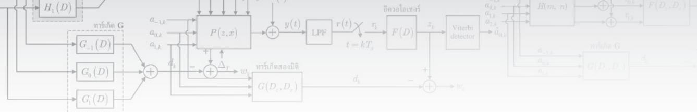

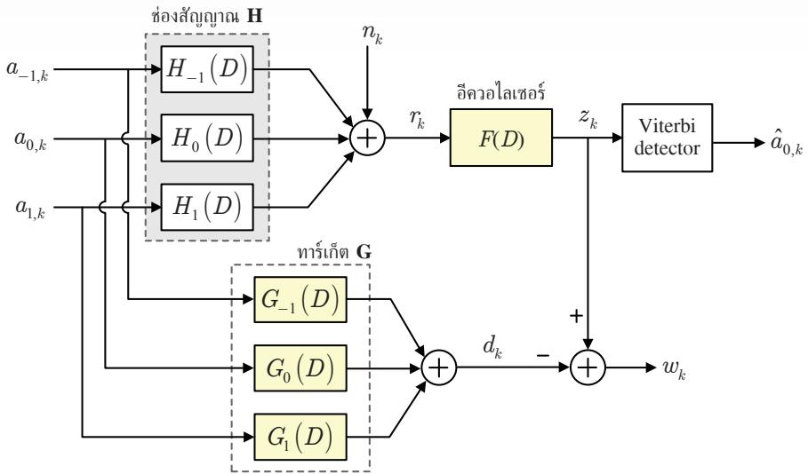  
รูปที่ 7.2 แบบจำลองช่องสัญญาณสำหรับการออกแบบทาร์เก็ตสองมิติและอีควอไลเซอร์หนึ่งมิติ [109]

$$
\begin{array} { r } { \mathbf { H } = \left[ H _ { - 1 } \left( D \right) \right] = \left[ h _ { - 1 , - 1 } \quad h _ { - 1 , 0 } \quad h _ { - 1 , 1 } \right] } \\ { H _ { 0 } \left( D \right) = \left[ h _ { 0 , - 1 } \quad h _ { 0 , 0 } \quad h _ { 0 , 1 } \right. } \\ { H _ { 1 } \left( D \right) \Big ] \quad \left[ h _ { 1 , - 1 } \quad h _ { 1 , 0 } \quad h _ { 1 , 1 } \right] } \end{array}\tag{7.13}
$$

เมื่อ $H _ { - 1 } ( D ) , H _ { 0 } ( D )$ และ $H _ { 1 } ( D )$ คือผลตอบสนองของช่องสัญญาณในแทร็กบน แทร็กกลาง และแทร็กล่าง ตามลำดับ ทำให้ได้สัญญาณอ่านกลับ $r _ { k }$ ตามสมการ (6.19) นั่นคือ

$$
r _ { k } = \left( a _ { 0 , k } * h _ { 0 , k } \right) + \left( a _ { - 1 , k } * h _ { - 1 , k } \right) + \left( a _ { 1 , k } * h _ { 1 , k } \right) + n _ { k }\tag{7.14}
$$

โดยที่ $h _ { m , k }$ คือค่าสัมประสิทธิ์ของเมทริกซ์ H สำหรับ $m \in \{ - 1 , 0 , 1 \}$ และ $n _ { k } \sim \mathcal N \left( 0 , \sigma ^ { 2 } \right)$ คือ สัญญาณรบกวน AพGN ทีมีค่าเฉลี่ยเท่ากับศูนย์และความแปรปรวนเท่ากับ $\sigma ^ { 2 }$ จากนั้น ณ วงจร ภาครับ สัญญาณอ่านกลับ r, จะถูกส่งเข้าไปยังอีควอไลเซอร์หนึ่งมิติ $r _ { k }$ $F ( D )$ เพื่อปรับรูปร่างของ สัญญาณอ่านกลับให้มีคุณสมบัติเป็นไปตามทาร์เก็ต $G _ { m } ( D )$ แล้วจึงส่งข้อมูลเอาต์พุตของอีควอ ไลเซอร์ $\{ z _ { k } \}$ เข้าไปในวงจรตรวจหาวีเทอร์บิแบบทีถูกปรับปรุง45 (modified Viterbi detector) [108] เพื่อหาค่าประมาณของลำดับข้อมูลของแทร็กกลาง $\{ \hat { a } _ { 0 , k } \}$

การออกแบบทาร์เก็ตและอีควอไลเซอร์จะใช้วิธีการ MMรE โดยถ้ากำหนดให้อีควอไลเซอร์ หนึ่งมิติ F(D) มีจำนวน $N = 2 K + 1$ แท็ปตามสมการ (7.2) และทาร์เก็ตสองมิติขนาด $3 \times 3$ มีค่า เท่ากับ

$$
\mathbf { G } = { \left[ \begin{array} { l } { G _ { - 1 } \left( D \right) } \\ { G _ { 0 } \left( D \right) } \\ { G _ { 1 } \left( D \right) } \end{array} \right] } = { \left[ \begin{array} { l l l } { g _ { - 1 , 0 } } & { g _ { - 1 , 1 } } & { g _ { - 1 , 2 } } \\ { g _ { 0 , 0 } } & { g _ { 0 , 1 } } & { g _ { 0 , 2 } } \\ { g _ { 1 , 0 } } & { g _ { 1 , 1 } } & { g _ { 1 , 2 } } \end{array} \right] }\tag{7.15}
$$

เมื่อ $G _ { - 1 } \left( D \right) , G _ { 0 } ( D )$ และ $G _ { 1 } ( D )$ คือผลตอบสนองของทาร์เก็ตในแทร็กบน แทร็กกลาง และ แทร็กล่าง ตามลำดับ, และ $g _ { - 1 , 0 } = g _ { 1 , 0 } = g _ { - 1 , 2 } = g _ { 1 , 2 } = 0$ สำหรับทาร์เก็ตสองมิติที่มีมุมเป็นศูนย์46

$$
\mathbf { f } = \left[ f _ { - K } , \ . . . , f _ { 0 } , \ . . . , f _ { K } \right] ^ { \mathrm { T } }
$$

$\mathbf { a } _ { k } = [ a _ { - 1 , k + K } ~ a _ { 0 , k + K } ~ a _ { 1 , k + K } ~ \dots ~ a _ { - 1 , k } ~ a _ { 0 , k } ~ a _ { 1 , k } ~ \dots ~ a _ { - 1 , k - K - 2 } ~ a _ { 0 , k - K - 2 } ~ a _ { 1 , k - K - 2 } ] ^ { \mathsf { T } }$ คือเวกเตอร์ แนวตังที่มีสมาชิก $6 K + 9$ ตัวของลำดับข้อมลอินพตทั้งสามแทร็ก, $\mathbf { n } _ { k } = \left[ n _ { k + K } \ . . . \ n _ { k } \ . . . \ n _ { k - K } \right] ^ { \mathrm { T } }$ คือเวกเตอร์แนวตั้งที่มีสมาชิก $N = 2 K + 1$ ตัวของสัญญาณรบกวน $n _ { k } ,$ และให้H คือเมทริกซ์ ช่องสัญญาณขนาด $N { \times } \left( 6 K { + } 9 \right)$ ซึ่งมีค่าเท่ากับ

$$
\tilde { \mathbf { H } } = \left[ { \begin{array} { c c c c c c c c c c c c c c } { h _ { - 1 , - 1 } } & { h _ { 0 , - 1 } } & { h _ { 1 , - 1 } } & { h _ { - 1 , 0 } } & { h _ { 0 , 0 } } & { h _ { 1 , 0 } } & { h _ { - 1 , 1 } } & { h _ { 0 , 1 } } & { h _ { 1 , 1 } } & { 0 } & { 0 } & { 0 } & { 0 } & { \cdots } \\ { 0 } & { 0 } & { 0 } & { h _ { - 1 , - 1 } } & { h _ { 0 , - 1 } } & { h _ { 1 , - 1 } } & { h _ { - 1 , 0 } } & { h _ { 0 , 0 } } & { h _ { 1 , 0 } } & { h _ { - 1 , 1 } } & { h _ { 0 , 1 } } & { h _ { 1 , 1 } } & { 0 } & { \cdots } \\ { \vdots } & { \vdots } & { \vdots } & { \vdots } & { \vdots } & { \vdots } & { \vdots } & { \vdots } & { \vdots } & { \vdots } & { \vdots } & { \vdots } & { \vdots } & { \vdots } \end{array} } \right]\tag{7.16}
$$

ดังนั้นลำดับข้อมูลเอาต์พุตของอีควอไลเซอร์สามารถเขียนให้อยู่ในรูปเมทริกซ์ได้คือ

$$
z _ { k } = \mathbf { f } ^ { \mathrm { T } } \left( \tilde { \mathbf { H } } \mathbf { a } _ { k } + \mathbf { n } _ { k } \right) = \mathbf { f } ^ { \mathrm { T } } \tilde { \mathbf { r } } _ { k }\tag{7.17}
$$

เมื่อ $\tilde { \mathbf { r } } _ { k } = \tilde { \mathbf { H } } \mathbf { a } _ { k } + \mathbf { n } _ { k }$

นอกจากนี้ถ้ากำหนดให้ $\mathbf { u } _ { k } = { [ a _ { 0 , k } \ a _ { - 1 , k - 1 } \ a _ { 0 , k - 1 } \ a _ { 1 , k - 1 } \ a _ { 0 , k - 2 } ] } ^ { \mathrm { T } }$ คือเวกเตอร์แนวตัง ของลำดับข้อมูลอินพุตทั้งสามแทร็กที่สอดคล้องกับเวกเตอร์แนวตั้งของทาร์เก็ตที่มีมุมเป็นศูนย์ (เฉพาะสมาชิกที่มีค่าไม่เท่ากับค่าศูนย์) $\mathbf { g } = \left[ g _ { 0 , 0 } \ g _ { - 1 , 1 } \ g _ { 0 , 1 } \ g _ { 1 , 1 } \ g _ { 0 , 2 } \right] ^ { \mathrm { T } }$ ซึ่งทำให้ลำดับข้อมูลของ ทาร์เก็ต G มีค่าเท่ากับ

$$
d _ { k } = \mathbf { g } ^ { \mathrm { T } } \mathbf { u } _ { k }\tag{7.18}
$$

ดังนั้นผลต่างระหว่างข้อมูลเอาต์พุตของอีควอไลเซอร์ $z _ { k }$ และข้อมูลเอาต์พุตของทาร์เก็ต $d _ { k }$ คือ

$$
\boldsymbol { w } _ { k } = \boldsymbol { z } _ { k } - \boldsymbol { d } _ { k } = \mathbf { f } ^ { \mathrm { T } } \tilde { \mathbf { r } } _ { k } - \mathbf { g } ^ { \mathrm { T } } \mathbf { u } _ { k }\tag{7.19}
$$

การออกแบบทาร์เก็ตและอีควอไลเซอร์ด้วยวิธีการ MMรE จะเลือกค่าสัมประสิทธิ $f _ { k }$ และ $g _ { k }$ ที่ทำให้ค่าข้อผิดพลาดกำลังสองเฉลี่ย (MSE) นั้นคือ

$$
\begin{array} { r l } & { E \Big [ w ^ { 2 } \Big ] = E \Big [ \big ( z _ { k } - d _ { k } \big ) ^ { 2 } \Big ] = E \Big [ \Big ( \mathbf { f } ^ { \mathrm { \scriptscriptstyle T } } \tilde { \mathbf { r } } _ { k } - \mathbf { g } ^ { \mathrm { \scriptscriptstyle T } } \mathbf { u } _ { k } \Big ) \Big ( \mathbf { f } ^ { \mathrm { \scriptscriptstyle T } } \tilde { \mathbf { r } } _ { k } - \mathbf { g } ^ { \mathrm { \scriptscriptstyle T } } \mathbf { u } _ { k } \Big ) ^ { \mathrm { \scriptscriptstyle T } } \Big ] } \\ & { \qquad = \mathbf { f } ^ { \mathrm { \scriptscriptstyle T } } \tilde { \mathbf { R } } \mathbf { f } + \mathbf { g } ^ { \mathrm { \scriptscriptstyle T } } \mathbf { U } \mathbf { g } - 2 \mathbf { f } ^ { \mathrm { \scriptscriptstyle T } } \tilde { \mathbf { P } } \mathbf { g } } \end{array}\tag{7.20}
$$

มีค่าน้อยสุด เมื่อ $\tilde { \mathbf { R } } = E \left[ \tilde { \mathbf { r } } _ { k } \tilde { \mathbf { r } } _ { k } ^ { \mathrm { T } } \right]$ คือเมทริกซ์อัตสหสัมพันธุ์ขนาด NxN, $\mathbf { U } = E \Big [ \mathbf { u } _ { k } \mathbf { u } _ { k } ^ { \mathrm { T } } \Big ]$ คือเมทริกซ์ อัตสหสัมพันธุ์ขนาด $5 \times 5$ , และ $\tilde { \mathbf { P } } = E \left[ \tilde { \mathbf { r } } _ { k } \mathbf { u } _ { k } ^ { \mathrm { T } } \right]$ คือเมทริกชัสหสัมพันธ์ข้ามขนาด $N { \times } 5$

การออกแบบทาร์เก็ตด้วยวิธีการ MMรE จะใช้เงื่อนไขบังคับแบบโมนิกซึ่งจะกำหนดให้ ค่าสัมประสิทธิ์ของแท็ปศูนย์กลางของทาร์เก็ตมีค่าเท่ากับหนึ่ง (นั่นคือ $g _ { 0 , 1 } = 1 )$ [109] และถ้าให้ เวกเตอร์แนวตัง ${ \bf I } = \left[ 0 \mathrm { ~ 0 ~ 1 ~ 0 ~ 0 ~ } \right] ^ { \mathrm { T } }$ เงื่อนไขบังคับแบบโมนิกนี้จะเขียนให้อยู่ในรูปของเมทริกซ์ได้ คือ $\mathbf { I ^ { \mathrm { T } } g } = 1$ ดังนั้นกระบวนการในการออกแบบทาร์เก็ตที่ใช้งื่อนไขบังคับแบบโมนิกนี้จะทำให้ค่า MSE ในสมการ (7.20) มีค่าน้อยสุด โดยพยายามรักษาให้ค่า $\mathbf { I ^ { \mathrm { T } } g } = 1$ ตลอดเวลา กล่าวคือการ ออกแบบทาร์เก็ตด้วยวิธีการ MMรE จะทำให้ค่า a

$$
E \Big [ w ^ { 2 } \Big ] = \mathbf { f } ^ { \mathrm { T } } \tilde { \mathbf { R } } \mathbf { f } + \mathbf { g } ^ { \mathrm { T } } \mathbf { U } \mathbf { g } - 2 \mathbf { f } ^ { \mathrm { T } } \tilde { \mathbf { P } } \mathbf { g } - 2 \lambda \Big ( \mathbf { I } ^ { \mathrm { T } } \mathbf { g } - 1 \Big )\tag{7.21}
$$

มีค่าน้อยสุด เมื่อ A คือตัวคูณลากรานจ์ จากนั้นให้หาอนุพันธ์ของสมการ (7.21) เทียบกับ f, g และ A ตามลำดับ แล้วให้ผลลัพธ์เท่ากับศูนย์ ก็จะได้คำตอบคือ

$$
\lambda = \frac { 1 } { \mathbf { I } ^ { \mathrm { T } } \left( \mathbf { U } - \tilde { \mathbf { P } } ^ { \mathrm { T } } \tilde { \mathbf { R } } ^ { - 1 } \tilde { \mathbf { P } } \right) ^ { - 1 } \mathbf { I } }\tag{7.22}
$$

$$
\mathbf { g } = \lambda \Big ( \mathbf { U } - \tilde { \mathbf { P } } ^ { \mathrm { T } } \tilde { \mathbf { R } } ^ { - 1 } \tilde { \mathbf { P } } \Big ) ^ { - 1 } \mathbf { I }\tag{7.23}
$$

$$
\mathbf { f } = \tilde { \mathbf { R } } ^ { - 1 } \tilde { \mathbf { P } } \mathbf { g }\tag{7.24}
$$

โดยค่า A ก็คือค่า MMรE ที่ได้จากการออกแบบทาร์เก็ตภายใต้เงื่อนไขบังคับโมนิก สังเกตจะพบว่า สมการ (7.22) - (7.24) จะคล้ายกับสมการ (7.10) - (7.12)

## 7.2.2 เมื่อไม่ทราบช่องสัญญาณ H

วิธีการออกแบบทาร์เก็ตและอีควอไลเซอร์ที่ได้อธิบายในหัวข้อที่ 7.2.1 ต้องใช้ช่องสัญญาณ H เพื่อ หาค่า $\tilde { \mathbf { r } } _ { k }$ อย่างไรก็ตามระบบที่ใช้งานจริงในทางปฏิบัติจะไม่ทราบว่าช่องสัญญาณ H มีค่าเท่าใด แต่ยังคงสามารถหาค่าสัญญาณอ่านกลับ $r _ { k }$ ได้ (ดูรูปที่ 7.2) ดังนั้นในที่นี้จะอธิบายการออกแบบ ทาร์เก็ตสองมิติที่มีมุมเป็นศูนย์และอีควอไลเซอร์หนึ่งมิติ โดยอาศัยสัญญาณอ่านกลับ $r _ { k }$ ซึ่งมี สมรรถนะใกล้เคียงกับการออกแบบทาร์เก็ตในหัวข้อที่ 7.2.1

จากแบบจำลองช่องสัญญาณ BPMR ในรูปที่ 7.2 ข้อมูลเอาต์พุตของอีควอไลเซอร์มีค่า เท่ากับ $z _ { k } = r _ { k } * f _ { k } = \mathbf { f } ^ { \mathrm { T } } \mathbf { r } _ { k }$ เมื่อ $\mathbf { f } = \left[ f _ { - K } \ldots f _ { 0 } \ldots f _ { K } \right] ^ { \mathrm { T } }$ คือเวกเตอร์แนวตั้งของอีควอไลเซอร์ที่ มีสมาชิก $N = 2 K + 1 \ \stackrel { \circ } { \cap } \ \stackrel { } { \partial }$ และ $\mathbf { r } _ { k } = \left[ r _ { k + K } \ldots \ r _ { k } \ldots \ r _ { k - K } \right] ^ { \mathrm { T } }$ คือเวกเตอร์แนวตั้งของสัญญาณ อ่านกลับ ในทำนองเดียวกันถ้าให้ $\mathbf { g } = \left[ g _ { 0 , 0 } \ g _ { - 1 , 1 } \ g _ { 0 , 1 } \ g _ { 1 , 1 } \ g _ { 0 , 2 } \right] ^ { \mathrm { T } }$ คือเวกเตอร์แนวตั้งของทาร์เก็ต ที่มีมุมเป็นศูนย์ และ $\mathbf { u } _ { k } = { [ a _ { 0 , k } \ a _ { - 1 , k - 1 } \ a _ { 0 , k - 1 } \ a _ { 1 , k - 1 } \ a _ { 0 , k - 2 } ] } ^ { \mathrm { T } }$ คือเวกเตอร์แนวตั้งของลำดับข้อมูล อินพุตทั้งสามแทร็กที่สอดคล้องกับเวกเตอร์ ฐ เพราะฉะนั้นข้อมูลเอาต์พุตของทาร์เก็ตมีค่าเท่ากับ $d _ { k } = \mathbf { g } ^ { \mathrm { T } } \mathbf { u } _ { k }$ ซึ่งทำให้ได้ว่าผลต่างระหว่างลำดับข้อมูล $z _ { k }$ และลำดับข้อมูล $d _ { k }$ คือ

$$
w _ { k } = z _ { k } - d _ { k } = \mathbf { f } ^ { \mathrm { T } } \mathbf { r } _ { k } - \mathbf { g } ^ { \mathrm { T } } \mathbf { u } _ { k }\tag{7.25}
$$

และค่าข้อผิดพลาดกำลังสองเฉลี่ย (MSE) มีค่าเท่ากับ

$$
E \Big [ w ^ { 2 } \Big ] = E \Big [ \big ( z _ { k } - d _ { k } \big ) ^ { 2 } \Big ] = \mathbf { f } ^ { \mathrm { T } } \mathbf { R } \mathbf { f } + \mathbf { g } ^ { \mathrm { T } } \mathbf { U } \mathbf { g } - 2 \mathbf { f } ^ { \mathrm { T } } \mathbf { P } \mathbf { g }\tag{7.26}
$$

เมื่อ $\mathbf { R } = E \left[ \mathbf { r } _ { k } \mathbf { r } _ { k } ^ { \mathrm { T } } \right]$ คือเมทริกช์อัตสหสัมพันธ์ขนาด N×N, $\mathbf { P } = E \Big [ \mathbf { r } _ { k } \mathbf { u } _ { k } ^ { \mathrm { T } } \Big ]$ คือเมทริกซัสหสัมพันธ์ ข้ามขนาด $N { \times } 5 ,$ , และ $\mathbf { U } = E \Big [ \mathbf { u } _ { k } \mathbf { u } _ { k } ^ { \mathrm { T } } \Big ]$ คือเมทริกซ์อัตสหสัมพันธ์ขนาด $5 \times 5$

การออกแบบทาร์เก็ตและอีควอไลเซอร์ด้วยวิธีการ MMรE ที่ใช้เงื่อนไขบังคับแบบโมนิก จะพยายามทำให้ค่า MSE ในสมการ (7.26) มีค่าน้อยสุด โดยรักษาให้ค่า $\mathbf { I ^ { \mathrm { T } } g } = 1$ ตลอดเวลา เมือ ${ \bf I } = \left[ 0 \mathrm { ~ 0 ~ 1 ~ 0 ~ 0 ~ } \right] ^ { \mathrm { T } }$ (นั่นคือ $g _ { 0 , 1 } = 1 )$ กล่าวคือการออกแบบทาร์เก็ตวิธีนี้จะทำให้ค่า

$$
E \Big [ \boldsymbol { w } ^ { 2 } \Big ] = \mathbf { f } ^ { \mathrm { ^ T } } \mathbf { R } \mathbf { f } + \mathbf { g } ^ { \mathrm { ^ T } } \mathbf { U } \mathbf { g } - 2 \mathbf { f } ^ { \mathrm { ^ T } } \mathbf { P } \mathbf { g } - 2 \lambda \Big ( \mathbf { I } ^ { \mathrm { ^ T } } \mathbf { g } - 1 \Big )\tag{7.27}
$$

มีค่าน้อยสุด เมื่อ A คือตัวคูณลากรานจ์ จากนั้นให้หาอนุพันธ์ของสมการ (7.27) เทียบกับ f, g และ A ตามลำดับ แล้วให้ผลลัพธ์เท่ากับศูนย์ ก็จะได้คำตอบเป็นไปตามสมการ (7.22) - (7.24) เพียงแต่เปลี่ยนค่า R เป็น R และเปลี่ยน P เป็น P เท่านั้น

## 7.3 ทาร์เก็ตสองมิติแบบสมมาตรและอีควอไลเซอร์หนึ่งมิติ

ในทางอุดมคติแล้ว (เมื่อระบบ BPMR ไม่มีสัญญาณรบกวนสื่อบันทึกและไม่มีปัญหาเรื่องความ ไม่เป็นเชิงเส้นต่างๆ เช่น แทร็กมิสเรจิสเตรชัน) ผลตอบสนองสัญญาณพัลส์แบบสองมิติที่ได้จาก หัวอ่านจะมีลักษณะสมมาตร (รymmetry) ตามที่แสดงในรูปที่ 6.13 และ 6.23 กล่าวคือสัญญาณ พัลส์ข้ามแทร็ก (across-track pulse) ของแทร็กบนและของแทร็กล่างจะมีค่าเท่ากัน47 ในทางปฏิบัติ เมื่อระบบ BPMR มีความจุข้อมูลสูงๆ หรือมีผลกระทบของ ITI มาก (เช่น ณ ความจุข้อมูล $\geq 3$ Tb/in2) ทาร์เก็ตสองมิติที่ควรนำมาใช้จะต้องมีค่าสัมประสิทธิ์ของทาร์เก็ตของแทร็กบนและแทร็ก ล่างไม่เท่ากับค่าศูนย์ เพื่อให้มีผลตอบสนองเชิงความถี่เหมือนกับผลตอบสนองของช่องสัญญาณ H ให้มากที่สุด ดังนั้นในหัวข้อนี้จะอธิบายการออกแบบทาร์เก็ตสองมิติแบบสมมาตร [120] เพื่อใช้ งานกับระบบ BPMR มีความจุข้อมูลสูงและไม่มีผลกระทบของแทร็กมิสเรจิสเตรชัน (TMR)

กำหนดให้ทาร์เก็ตสองมิติแบบสมมาตรนันคือ $G _ { - 1 } ( D ) = G _ { 1 } ( D )$ สามารถเขียนให้อยู่ใน รูปเมทริกซ์ได้ดังนี้

$$
\mathbf { G } = \left[ G _ { - 1 } ( D ) \right] = \left[ \begin{array} { c c c } { g _ { - 1 , 0 } } & { g _ { - 1 , 1 } } & { g _ { - 1 , 2 } } \\ { g _ { 0 , 0 } } & { g _ { 0 , 1 } } & { g _ { 0 , 2 } } \\ { g _ { - 1 , 0 } } & { g _ { - 1 , 1 } } & { g _ { - 1 , 2 } } \end{array} \right]\tag{7.28}
$$

จากแบบจำลองช่องสัญญาณ BPMR ในรูปที่ 7.2 ข้อมูลเอาต์พุตของอีควอไลเซอร์มีค่าเท่ากับ $z _ { k }$ $= r _ { k } * f _ { k } = \mathbf { f } ^ { \mathrm { T } } \mathbf { r } _ { k } \mathbf { \Psi } _ { \mathrm { \pmb { k } \alpha } } \mathbf { \Psi } _ { \mathrm { \pmb { k } \alpha } } = [ f _ { - K } \dots f _ { 0 } \dots f _ { K } ] ^ { \mathrm { T } }$ คือเวกเตอร์แนวตั้งของอีควอไลเซอร์ที่มีสมาชิก N $= 2 K + 1$ ตัว และ $\mathbf { r } _ { k } = \left[ r _ { k + K } \ldots \ r _ { k } \ldots \ r _ { k - K } \right] ^ { \mathrm { T } }$ คือเวกเตอร์แนวตั้งของสัญญาณอ่านกลับ ใน ทำนองเดียวกันถ้าให้ g = [g-1,0 g0,0 g-1,1 g0,1 ${ g _ { - 1 , 2 } } \ { g _ { 0 , 2 } } \mathrm { J } ^ { \mathrm { T } }$ คือเวกเตอร์แนวตังของทาร์เก็ตแบบ สมมาตร และ $\mathbf { u } _ { k } = [ ( a _ { - 1 , k } + a _ { 1 , k } ) ~ a _ { 0 , k } ~ ( a _ { - 1 , k - 1 } + a _ { 1 , k - 1 } ) ~ a _ { 0 , k - 1 } ~ ( a _ { - 1 , k - 2 } + a _ { 1 , k - 2 } ) ~ a _ { 0 , k - 2 } ] ^ { \mathrm { T } }$ คือเวกเตอร์แนวตั้งของลำดับข้อมูลอินพุตที่สอดคล้องกับเวกเตอร์ g ดังนั้นข้อมูลเอาต์พุตของ ทาร์เก็ตมีค่าเท่ากับ $d _ { k } = \mathbf { g } ^ { \mathrm { T } } \mathbf { u } _ { k }$ ซึ่งทำให้ได้ว่าผลต่างระหว่าง $z _ { k }$ และ $d _ { k }$ คือ

$$
w _ { k } = z _ { k } - d _ { k } = \mathbf { f } ^ { \mathrm { T } } \mathbf { r } _ { k } - \mathbf { g } ^ { \mathrm { T } } \mathbf { u } _ { k }\tag{7.29}
$$

$$
E { \left[ w ^ { 2 } \right] } = E { \left[ \left( z _ { k } - d _ { k } \right) ^ { 2 } \right] } = \mathbf { f } ^ { \mathrm { T } } \mathbf { R } \mathbf { f } + \mathbf { g } ^ { \mathrm { T } } \mathbf { U } \mathbf { g } - 2 \mathbf { f } ^ { \mathrm { T } } \mathbf { P } \mathbf { g }\tag{7.30}
$$

เมื่อ $\mathbf { R } = E \left[ \mathbf { r } _ { k } \mathbf { r } _ { k } ^ { \mathrm { T } } \right]$ คือเมทริกซ์อัตสหสัมพันธ์ขนาด N×N, $\mathbf { P } = E \left[ \mathbf { r } _ { k } \mathbf { u } _ { k } ^ { \mathrm { T } } \right]$ คือเมทริกซัสหสัมพันธ์ ข้ามขนาด $N \times 6 .$ และ $\mathbf { U } = E \Big [ \mathbf { u } _ { k } \mathbf { u } _ { k } ^ { \mathrm { T } } \Big ]$ คือเมทริกซ์อัตสหสัมพันธ์ขนาด $6 \times 6$

การออกแบบทาร์เก็ตและอีควอไลเซอร์ด้วยวิธีการ MMรE ที่ใช้เื่อนไขบังคับแบบโมนิก จะพยายามทำให้ค่า MรE ในสมการ (7.30) มีค่าน้อยสุด โดยรักษาให้ค่า $\mathbf { I ^ { \mathrm { T } } g } = 1$ ตลอดเวลา เมื่อ $\mathbf { I } = [ 0 \mathrm { ~ 0 ~ 0 ~ 1 ~ 0 ~ 0 } ] ^ { \mathrm { T } } \mathbf { \Gamma } ( \dot { \mathbb { W } } \mathbb { H } \ddot { \mathbb { P } } \mathbb { \ Q } _ { 0 , 1 } = 1 )$ กล่าวคือการออกแบบทาร์เก็ตวิธีนี้จะทำให้ค่า

$$
E \Big [ \boldsymbol { w ^ { 2 } } \Big ] = \mathbf { f } ^ { \mathrm { { T } } } \mathbf { R } \mathbf { f } + \mathbf { g } ^ { \mathrm { { T } } } \mathbf { U } \mathbf { g } - 2 \mathbf { f } ^ { \mathrm { { T } } } \mathbf { P } \mathbf { g } - 2 \lambda \Big ( \mathbf { I } ^ { \mathrm { { T } } } \mathbf { g } - 1 \Big )\tag{7.31}
$$

มีค่าน้อยสุด เมื่อ A คือตัวคูณลากรานจ์ จากนั้นให้หาอนุพันธ์ของสมการ (7.31) เทียบกับ f, g และ A ตามลำดับ แล้วให้ผลลัพธ์เท่ากับศูนย์ ก็จะได้คำตอบคือ

$$
\lambda = { \frac { 1 } { \mathbf { I } ^ { \mathrm { T } } \left( \mathbf { U } - \mathbf { P } ^ { \mathrm { T } } \mathbf { R } ^ { - 1 } \mathbf { P } \right) ^ { - 1 } \mathbf { I } } }\tag{7.32}
$$

$$
\mathbf { g } = \lambda \Big ( \mathbf { U } - \mathbf { P } ^ { \mathrm { T } } \mathbf { R } ^ { - 1 } \mathbf { P } \Big ) ^ { - 1 } \mathbf { I }\tag{7.33}
$$

$$
\mathbf { f } = \mathbf { R } ^ { - 1 } \mathbf { P } \mathbf { g }\tag{7.34}
$$

เมื่อ a ในสมการ (7.32) ก็คือค่า MSE ที่ไดจากรออกแบบทาร์เกตภายใต้เงือนไขบังคับโมนิก

## 7.4 ทาร์เก็ตสองมิติแบบอสมมาตรและอีควอไลเซอร์หนึ่งมิติ

ทาร์เก็ตสองมิติแบบสมมาตรไม่ควรนำมาใช้งานกับระบบ BPMR ที่มีปัญหาเรื่องความไม่เป็นเชิง เส้น (เช่น แทร็กมิสเรจิสเตรชัน) เนื่องจากผลตอบสนองสัญญาณพัลส์แบบสองมิติที่ได้จากหัวอ่าน จะมีลักษณะไม่สมมาตร ดังนั้นในที่นี้จะอธิบายการออกแบบทาร์เก็ตสองมิติแบบอสมมาตร [120, 121] ดังนี้

ในทำนองเดียวกันจากแบบจำลองช่องสัญญาณ BPMR ในรูปที่ 7.2 ข้อมูลเอาต์พุตของ อีควอไลเซอร์มีค่าเท่ากับ $z _ { k } = r _ { k } * f _ { k } = \mathbf { f } ^ { \mathrm { T } } \mathbf { r } _ { k } \ \mathbf { \downarrow } \mathbf { \downarrow } \Theta \ \mathbf { f } = [ f _ { - K } \ \dots \ f _ { 0 } \ \dots \ f _ { K } ] ^ { \mathrm { T } }$ คือเวกเตอร์แนวตั้งของ อีควอไลเซอร์ที่มีสมาชิก $N = 2 K + 1$ ตัว และ $\mathbf { r } _ { k } = \left[ r _ { k + K } \ldots \ r _ { k } \ldots \ r _ { k - K } \right] ^ { \mathrm { T } }$ คือเวกเตอร์แนวตั้ง ของสัญญาณอ่านกลับ พิจารณาทาร์เก็ตสองมิติขนาด $3 \times 3$ ในสมการ (7.15) ถ้าให้ $\mathbf { g } = \left[ g _ { - 1 , 0 } \right.$ g0,0 91,0 g-1,1 90,1 91,1 9-1,2 g0,2 91,2]T คือเวกเตอร์แนวตั้งของทาร์เก็ตแบบอสมมาตร และ ${ \bf u } _ { k } =$ ${ { \left[ { { a } _ { - 1 , k } } { { \ a } _ { 0 , k } } { { \ a } _ { 1 , k } } { { \ a } _ { - 1 , k - 1 } } { { \ a } _ { 0 , k - 1 } } { { \ a } _ { 1 , k - 1 } } { { \ a } _ { - 1 , k - 2 } } { { \ a } _ { 0 , k - 2 } } { { \ a } _ { 1 , k - 2 } } \right] } ^ { \mathrm { { T } } } }$ คือเวกเตอร์แนวตั้งของลำดับ ข้อมูลอินพุตที่สอดคล้องกับเวกเตอร์ g ดังนั้นข้อมูลเอาต์พุตของทาร์เก็ตมีค่าเท่ากับ $d _ { k } = \mathbf { g } ^ { \mathrm { T } } \mathbf { u } _ { k }$ ซึ่งทำให้ได้ว่าผลต่างระหว่าง $z _ { k }$ และ $d _ { k }$ คือ

$$
w _ { k } = z _ { k } - d _ { k } = \mathbf { f } ^ { \mathrm { T } } \mathbf { r } _ { k } - \mathbf { g } ^ { \mathrm { T } } \mathbf { u } _ { k }\tag{7.35}
$$

และค่าข้อผิดพลาดกำลังสองเฉลี่ย (MรE) มีค่าเท่ากับ

$$
E { \Big [ } w ^ { 2 } { \Big ] } = E { \Big [ } { \big ( } z _ { k } - d _ { k } { \big ) } ^ { 2 } { \Big ] } = \mathbf { f } ^ { \mathrm { T } } \mathbf { R } \mathbf { f } + \mathbf { g } ^ { \mathrm { T } } \mathbf { U } \mathbf { g } - 2 \mathbf { f } ^ { \mathrm { T } } \mathbf { P } \mathbf { g }\tag{7.36}
$$

เมื่อ $\mathbf { R } = E \left[ \mathbf { r } _ { k } \mathbf { r } _ { k } ^ { \mathrm { T } } \right]$ คือเมทริกซ์อัตสหสัมพันธ์ขนาด N×N, $\mathbf { P } = E \left[ \mathbf { r } _ { k } \mathbf { u } _ { k } ^ { \mathrm { T } } \right]$ คือเมทริกซ์สหสัมพันธ์ ข้ามขนาด $N \times 9 .$ , และ $\mathbf { U } = E \Big [ \mathbf { u } _ { k } \mathbf { u } _ { k } ^ { \mathrm { T } } \Big ]$ คือเมทริกซ์อัตสหสัมพันธ์ขนาด $9 \times 9$

การออกแบบทาร์เก็ตและอีควอไลเซอร์ด้วยวิธีการ MMรE ที่ใช้เงื่อนไขบังคับแบบโมนิก จะพยายามทำให้ค่า MรE ในสมการ (7.36) มีค่าน้อยสุด โดยรักษาให้ค่า $\mathbf { I ^ { \mathrm { T } } g } = 1$ ตลอดเวลา เมือ $\mathbf { I } = \left[ 0 \mathrm { ~ 0 ~ 0 ~ 0 ~ 0 ~ 1 ~ 0 ~ 0 ~ 0 ~ 0 ~ } \right] ^ { \mathrm { T } }$ (นั่นคือ $g _ { 0 , 1 } = 1 )$ กล่าวคือการออกแบบทาร์เก็ตวิธีนี้จะทำให้ค่า

$$
E \Big [ \boldsymbol { w } ^ { 2 } \Big ] = \mathbf { f } ^ { \mathrm { ^ T } } \mathbf { R } \mathbf { f } + \mathbf { g } ^ { \mathrm { ^ T } } \mathbf { U } \mathbf { g } - 2 \mathbf { f } ^ { \mathrm { ^ T } } \mathbf { P } \mathbf { g } - 2 \lambda \Big ( \mathbf { I } ^ { \mathrm { ^ T } } \mathbf { g } - 1 \Big )\tag{7.37}
$$

มีค่าน้อยสุด เมื่อ A คือตัวคูณลากรานจ์ จากนั้นให้หาอนุพันธ์ของสมการ (7.37) เทียบกับ f, g และ A ตามลำดับ แล้วให้ผลลัพธ์เท่ากับศูนย์ ก็จะได้คำตอบคือ

$$
\lambda = { \frac { 1 } { \mathbf { I } ^ { \mathrm { T } } \left( \mathbf { U } - \mathbf { P } ^ { \mathrm { T } } \mathbf { R } ^ { - 1 } \mathbf { P } \right) ^ { - 1 } \mathbf { I } } }\tag{7.38}
$$

$$
\mathbf { g } = \lambda \Big ( \mathbf { U } - \mathbf { P } ^ { \mathrm { T } } \mathbf { R } ^ { - 1 } \mathbf { P } \Big ) ^ { - 1 } \mathbf { I }\tag{7.39}
$$

$$
\mathbf { f } = \mathbf { R } ^ { - 1 } \mathbf { P } \mathbf { g }\tag{7.40}
$$

เมื่อ A ในสมการ (7.32) ก็คือค่า MMSE ที่ด้จากการออกแบบทาร์เก็ตภายใต้เงื่อนไขบังคับโมนิก

## 7.5 ทาร์เก็ตสองมิติและอีควอไลเซอร์สองมิติ

หัวข้อนี้จะอธิบายวิธีการลดผลกระทบของ ISI และ ITI โดยใช้ทาร์เก็ตสองมิติและอีควอไลเซอร์ สองมิติซึ่งมีสมรรถนะดีกว่าการใช้อีควอไลเซอร์หนึ่งมิติ [108] นอกจากนี้ยังสามารถนำมาประยุกต์ ใช้กับระบบจัดเก็บข้อมูลสองมิติแบบอื่นๆ ได้ด้วย เช่น ระบบจัดเก็บข้อมูลฮอโลกราฟี (holographic data storage system) [122], ระบบจัดเก็บเชิงแสงแบบสองมิติ (TwoDOS: 2D optical storage system) [123], หรือระบบจัดเก็บข้อมูลแบบแนวนอน/แนวตังแบบทีใช้หัวอ่านหลายหัว (multiread-head) [124, 125] เป็นต้น

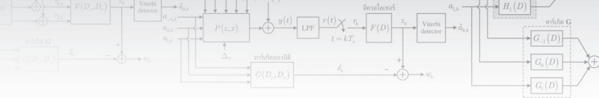

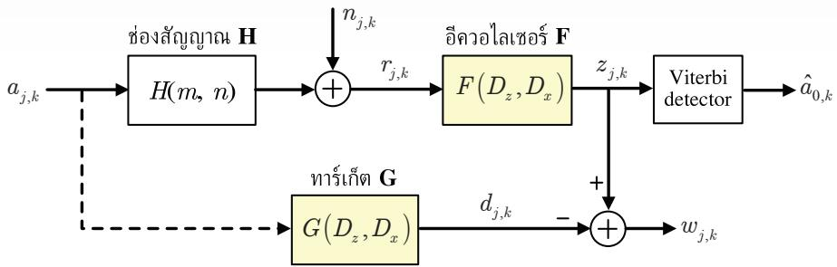  
รูปที่ 7.3 แบบจำลองช่องสัญญาณสำหรับการออกแบบทาร์เก็ตสองมิติและอีควอไลเซอร์สองมิติ [108]

รูปที่ 7.3 แสดงแบบจำลองช่องสัญญาณ BPMR ที่ใช้หัวอ่านหลายหัวในการอ่านข้อมูล สำหรับการออกแบบทาร์เก็ตสองมิติและอีควอไลเซอร์สองมิติ เนื่องจากตำแหน่งของไอแลนด์ (หรือ บิตข้อมูล) ได้ถูกกำหนดไว้อย่างแน่นอนแล้วในสื่อบันทึก ดังนั้นสัญญาณอ่านกลับจึงถูกกำหนด ด้วยตำแหน่งของบิตข้อมูล (แทนที่จะเป็นดรรชนีเวลา) ถ้าให้พารามิเตอร์ และ k แทนตำแหน่ง ของไอแลนด์ในแนวขวางแทร็กและในแนวตามแทร็กตามลำดับ โดยที่ $j = 0$ จะสอดคล้องกับ แทร็กกลาง จากรูปที่ 7.3 ลำดับข้อมูลอินพุต $a _ { j , k } \in \ \{ \pm 1 \}$ จะถูกป้อนเข้าช่องสัญญาณ BPMR ที มีผลตอบสนองสัญญาณพัลส์แบบสองมิติ $H ( m , n )$ ทำให้ได้เป็นสัญญาณอ่านกลับ $r _ { j , k }$ ซึ่งเขียน เป็นสมการคณิตศาสตร์ได้คือ

$$
r _ { j , k } = \sum _ { m } \sum _ { n } h _ { m , n } a _ { j - m , k - n } + n _ { j , k }\tag{7.41}
$$

เมื่อ $h _ { m , n }$ คือค่าสัมประสิทธิ์ของช่องสัญญาณ $H ( m , n )$ และ $n _ { j , k }$ คือสัญญาณรบกวน AWGN ในทำนองเดียวกัน ณ วงจรภาครับ สัญญาณอ่านกลับ $r _ { j , k }$ จะถูกส่งเข้าไปยังอีควอไลเซอร์ สองมิติ $F \left( D _ { z } , D _ { x } \right)$ ที่มีรูปสมการคือ

$$
F \bigl ( D _ { z } , D _ { x } \bigr ) = \sum _ { m = - M } ^ { M } \sum _ { n = - K } ^ { K } f _ { m , n } D _ { z } ^ { m } D _ { x } ^ { n }\tag{7.42}
$$

เมื่อ $f _ { m , n }$ คือค่าสัมประสิทธิ์ของ $F \left( D _ { z } , D _ { x } \right)$ ,{M, K}คือเลขจำนวนเต็มบวก, และ $D _ { z }$ และ $D _ { x }$ คือตัวเลื่อนหนึ่งหน่วย (นทit รhift) ในแนวขวางแทร็กและในแนวตามแทร็กตามลำดับ เพื่อปรับ

คุณสมบัติของสัญญาณอ่านกลับให้เป็นไปตามทาร์เก็ตสองมิติ $G ( D _ { z } , D _ { x } )$ ที่ต้องการ ซึ่งมีรูป สมการคือ

$$
G \left( D _ { z } , D _ { x } \right) = \sum _ { m = - L } ^ { L } \sum _ { n = 0 } ^ { 2 L } g _ { m , n } D _ { z } ^ { m } D _ { x } ^ { n }\tag{7.43}
$$

เมื่อ $g _ { m , n }$ คือค่าสัมประสิทธิ์ของ $G ( D _ { z } , D _ { x } )$ ตามลำดับ และ $L$ คือเลขจำนวนเต็มบวก ก่อนจะส่ง 64ืง น s ผลลัพธ์ที่ได้ไปยังวงจรตรวจหาวีเทอร์บิเพื่อหาค่าประมาณของลำดับข้อมูล $a _ { 0 , k }$ (นันคือ $\hat { a } _ { 0 , k } ^ { } )$

จุดประสงค์ของวงจรภาครับคือจะทำการตรวจหาลำดับข้อมูลเฉพาะของแทร็กกลาง (นั่นคือ $j = 0 )$ ดังนั้นในการออกแบบทาร์เก็ตสองมิติและอีควอไลเซอร์สองมิตินี้จะใช้เฉพาะข้อมูลเอาต์พุต ของอีควอไลเซอร์ของแทร็กกลางและข้อมูลเอาต์พุตของทาร์เก็ตของแทร็กกลางเท่านั้น ซึ่งเขียน แทนด้วย $z _ { 0 , k }$ และ $d _ { 0 , k }$ ตามลำดับ เพราะฉะนันถ้าให้ $F \left( D _ { z } , D _ { x } \right)$ ในสมการ (7.42) มีรูปเมทริกซ์ ขนาด $( 2 M { + } 1 ) \times ( 2 K { + } 1 )$ คือ

$$
\mathbf { F } = \left[ \begin{array} { c c c c c c } { f _ { - M , - K } } & { \cdots } & { f _ { - M , 0 } } & { \cdots } & { f _ { - M , K } } \\ { \vdots } & { \vdots } & { \vdots } & { \vdots } & { \vdots } \\ { f _ { 0 , - K } } & { \cdots } & { f _ { 0 , 0 } } & { \cdots } & { f _ { 0 , K } } \\ { \vdots } & { \vdots } & { \vdots } & { \vdots } & { \vdots } \\ { f _ { M , - K } } & { \cdots } & { f _ { M , 0 } } & { \cdots } & { f _ { M , K } } \end{array} \right]\tag{7.44}
$$

และให้ $G ( D _ { z } , D _ { x } )$ ในสมการ (7.43) มีรูปเมทริกซ์ขนาด $( 2 L + 1 ) \times ( 2 L + 1 )$ คือ

$$
\mathbf { G } = \left[ \begin{array} { c c c c c c } { g _ { - L , 0 } } & { \cdots } & { g _ { - L , L } } & { \cdots } & { g _ { - L , 2 L } } \\ { \vdots } & { \vdots } & { \vdots } & { \vdots } & { \vdots } \\ { g _ { 0 , 0 } } & { \cdots } & { g _ { 0 , L } } & { \cdots } & { g _ { 0 , 2 L } } \\ { \vdots } & { \vdots } & { \vdots } & { \vdots } & { \vdots } \\ { g _ { L , 0 } } & { \cdots } & { g _ { L , L } } & { \cdots } & { g _ { L , 2 L } } \end{array} \right]\tag{7.45}
$$

เมื่อ 2M+1 คือจำนวนหัวอ่าน, $N = 2 K { + } 1$ คือจำนวนแท็ปของอีควอไลเซอร์ในแต่ละแถว, และ 2L+1 คือจำนวนแท็ปของทาร์เก็ตในแต่ละแถว ดังนั้นจากแบบจำลองช่องสัญญาณ BPMR ใน รูปที่ 7.3 ข้อมูลเอาต์พุตของอีควอไลเซอร์ของแทร็กกลางมีค่าเท่ากับ

$$
z _ { k } = z _ { 0 , k } = \sum _ { m = - M } ^ { M } \sum _ { n = - K } ^ { K } f _ { m , n } r _ { - m , k - n } = \mathbf { f } ^ { \mathrm { T } } \mathbf { r } _ { k }\tag{7.46}
$$

ซึ่งเป็นการทำคอนโวลูชันแบบสองมิติ (2D convoในtion) ระหว่างข้อมูล $r _ { j , k }$ และ $f _ { m , n }$ เมื่อ $\mathbf { f } =$ $[ f _ { - M , - K } ~ f _ { - M , - K + 1 } ~ \dots ~ f _ { - M , K } ~ f _ { - M + 1 , - K } ~ \dots ~ f _ { 0 } ~ \dots ~ f _ { M , K - 1 } ~ f _ { M , K } ] ^ { \mathrm { T } }$ คือเวกเตอร์แนวตั้งของอีควอไลเซอร์ (นั่นคือนำสมาชิกในแต่ละแถวของเมทริกซ์ F มาเรียงต่อกันเป็นเวกเตอร์ f) ที่มีสมาชิก N(2M+1) ตัว และ $\mathbf { r } _ { k } = \left[ r _ { M , k + K } ~ r _ { M , k + K - 1 } ~ \ldots ~ r _ { M , k - K } ~ r _ { M - 1 , k + K } ~ \ldots ~ \ r _ { 0 , k } ~ \ldots ~ r _ { - M , k - K + 1 } ~ r _ { - M , k - K } \right] ^ { \mathrm { T } }$ คือเวกเตอร์ แนวตั้งของสัญญาณอ่านกลับที่มีสอดคล้องกับเวกเตอร์ f ในทำนองเดียวกันข้อมูลเอาต์พุตของ ทาร์เก็ตของแทร็กกลางมีค่าเท่ากับ

$$
d _ { k } = d _ { 0 , k } = \sum _ { m = - L } ^ { L } \sum _ { n = 0 } ^ { 2 L } g _ { m , n } a _ { - m , k - n } = \mathbf { g } ^ { \mathrm { { T } } } \mathbf { a } _ { k }\tag{7.47}
$$

เมื่อ ${ \bf g } = [ g _ { - L , 0 } \ g _ { - L , 1 } \ \dots \ g _ { - L , 2 L } \ g _ { - L + 1 , 0 } \ \dots \ g _ { 0 , L } \ \dots \ g _ { L , 2 L - 1 } \ g _ { L , 2 L } ] ^ { \mathrm { T } }$ คือเวกเตอร์แนวตั้งของทาร์เก็ต (นั่นคือนำสมาชิกในแต่ละแถวของเมทริกซ์ G มาเรียงต่อกันเป็นเวกเตอร์ ) ที่มีสมาชิก $\left( 2 L + 1 \right) ^ { 2 }$ ตัว และ $\mathbf { a } _ { k } = [ a _ { L , k } ~ a _ { L , k - 1 } ~ \ldots ~ a _ { L , k - 2 L } ~ a _ { L - 1 , k } ~ \ldots ~ a _ { 0 , k - L } ~ \ldots ~ a _ { - L , k - 2 L + 1 } ~ a _ { - L , k - 2 L } ] ^ { \mathrm { T } }$ คือเวกเตอร์ แนวตั้งของลำดับข้อมูลอินพุตที่สอดคล้องกับเวกเตอร์ g ดังนั้นผลต่างระหว่างลำดับข้อมูล $z _ { k }$ และ ลำดับข้อมูล $d _ { k }$ มีค่าเท่ากับ

$$
{ \boldsymbol { w } } _ { k } = z _ { k } - d _ { k } = \mathbf { f } ^ { \mathrm { T } } \mathbf { r } _ { k } - \mathbf { g } ^ { \mathrm { T } } \mathbf { a } _ { k }\tag{7.48}
$$

และค่าข้อผิดพลาดกำลังสองเฉลี่ย (MSE) มีค่าเท่ากับ

$$
E \big [ w ^ { 2 } \big ] = E \Big [ \big ( z _ { k } - d _ { k } \big ) ^ { 2 } \Big ] = \mathbf { f } ^ { \mathrm { T } } \mathbf { R } \mathbf { f } + \mathbf { g } ^ { \mathrm { T } } \mathbf { A } \mathbf { g } - 2 \mathbf { f } ^ { \mathrm { T } } \mathbf { P } \mathbf { g }\tag{7.49}
$$

เมื่อ $\mathbf { R } = E \left[ \mathbf { r } _ { k } \mathbf { r } _ { k } ^ { \mathrm { T } } \right]$ คือเมทริกซ์อัตสหสัมพันธ์ของข้อมูล $\mathbf { r } _ { k } , \ \mathbf { P } = E \left[ \mathbf { r } _ { k } \mathbf { a } _ { k } ^ { \mathrm { T } } \right]$ คือเมทริกซ์สหสัมพันธ์ ข้ามของข้อมูล $\mathbf { r } _ { k }$ และ ${ \bf a } _ { k } ,$ และ $\mathbf { A } = E { \left| \mathbf { a } _ { k } \mathbf { a } _ { k } ^ { \mathrm { T } } \right| }$ คือเมทริกซ์อัตสหสัมพันธ์ของข้อมูล ${ \bf a } _ { k }$

การออกแบบทาร์เก็ตและอีควอไลเซอร์ด้วยวิธีการ MMรE จะใช้เงื่อนไขบังคับแบบโมนิก นั่นคือ $g _ { 0 , 0 } = 1$ (เพื่อหลีกเลี่ยงการได้คำตอบเป็น $\mathbf { f } = \mathbf { g } = \mathbf { 0 } )$ นอกจากนี้เพื่อหลีกเลี่ยงการใช้งาน วงจรตรวจหาวีเทอร์บิสองมิติที่มีความซับซ้อนสูงมาก [108] จะทำการใส่เงื่อนไขบังคับอีกข้อหนึ่ง ให้กับ g โดยการทำให้ค่าสัมประสิทธิ์ของทาร์เก็ตของแทร็กข้างเคียงทั้งหมดมีค่าเท่ากับศูนย์ (zero-ITI forcing conรtraint) เพื่อกำจัดผลกระทบของ ITI และทำให้สามารถใช้วงจรตรวจหาวีเทอร์บิ แบบทั่วไป48 (หรือวงจรตรวจหาวีเทอร์บิหนึ่งมิติ) ได้ ตัวอย่างของทาร์เก็ต G ขนาด 3×3 (ความยาว ของ ISI และ ITI เท่ากับ 3 หน่วย) ที่สอดคล้องกับเงื่อนไขบังคับทั้งสองข้อนี้ เช่น

$$
\mathbf { G } = \left[ \begin{array} { c c c } { 0 } & { 0 } & { 0 } \\ { g _ { 0 , 0 } } & { 1 } & { g _ { 0 , 2 } } \\ { 0 } & { 0 } & { 0 } \end{array} \right]\tag{7.50}
$$

ซึ่งเขียนให้อยู่ในรูปของเวกเตอร์ได้คือ

$$
\mathbf { g } = \left[ 0 \mathrm { ~ 0 ~ 0 ~ } g _ { 0 , 0 } \mathrm { ~ 1 ~ } g _ { 0 , 2 } \mathrm { ~ 0 ~ 0 ~ 0 ~ } \right] ^ { \mathrm { T } }\tag{7.51}
$$

เพราะฉะนั้นเงื่อนไขบังคับทั้งสองแบบสามารถเขียนเป็นสมการคณิตศาสตร์ได้คือ ซู

$$
\mathbf { E } ^ { \mathrm { T } } \mathbf { g } = \mathbf { I }\tag{7.52}
$$

โดยที่

$$
\mathbf { I } = \left[ 1 \ 0 \ 0 \ 0 \ 0 \ 0 \ 0 \right] ^ { \mathrm { T } }\tag{7.53}
$$

และ

$$
\mathbf { E } ^ { \mathrm { T } } = \left[ \begin{array} { l l l l l l l l l } { 0 } & { 0 } & { 0 } & { 0 } & { 1 } & { 0 } & { 0 } & { 0 } & { 0 } \\ { 1 } & { 0 } & { 0 } & { 0 } & { 0 } & { 0 } & { 0 } & { 0 } & { 0 } \\ { 0 } & { 1 } & { 0 } & { 0 } & { 0 } & { 0 } & { 0 } & { 0 } & { 0 } \\ { 0 } & { 0 } & { 1 } & { 0 } & { 0 } & { 0 } & { 0 } & { 0 } & { 0 } \\ { 0 } & { 0 } & { 0 } & { 0 } & { 0 } & { 0 } & { 1 } & { 0 } & { 0 } \\ { 0 } & { 0 } & { 0 } & { 0 } & { 0 } & { 0 } & { 0 } & { 1 } & { 0 } \\ { 0 } & { 0 } & { 0 } & { 0 } & { 0 } & { 0 } & { 0 } & { 1 } & { 0 } \\ { 0 } & { 0 } & { 0 } & { 0 } & { 0 } & { 0 } & { 0 } & { 0 } & { 1 } \end{array} \right]\tag{7.54}
$$

วิธีการ MMSE ที่ใช้เงื่อนไขบังคับทั้งสองแบบจะพยายามทำให้ค่า MSE ในสมการ (7.49) มีค่าน้อยสุด โดยรักษาให้ $\mathbf { E } ^ { \mathrm { T } } \mathbf { g } = \mathrm { I }$ ตลอดเวลา กล่าวคือการออกแบบทาร์เก็ตวิธีนี้จะทำให้ค่า

$$
E \Big [ w ^ { 2 } \Big ] = \mathbf { f } ^ { \mathrm { T } } \mathbf { R } \mathbf { f } + \mathbf { g } ^ { \mathrm { T } } \mathbf { A } \mathbf { g } - 2 \mathbf { f } ^ { \mathrm { T } } \mathbf { P } \mathbf { g } - 2 \boldsymbol { \lambda } ^ { \mathrm { T } } \left( \mathbf { E } ^ { \mathrm { T } } \mathbf { g } - \mathbf { I } \right)\tag{7.55}
$$

มีค่าน้อยสุด เมื่อ 2 คือเวกเตอร์แนวตั้งที่มีสมาชิกเป็นตัวคูณลากรานจ์จำนวน 7 ตัว (สอดคล้อง กับจำนวนแลวของเมทริกซ์ $\mathbf { E } ^ { \mathrm { T } } )$ จากนั้นให้หาอนุพันธ์ของสมการ (7.55) เทียบกับ f, g และ ตามลำดับ แล้วให้ผลลัพธ์เท่ากับเวกเตอร์ศูนย์ ก็จะได้คำตอบคือ

$$
\pmb { \lambda } = \left( \mathbf { E } ^ { \mathrm { T } } \left( \mathbf { A } - \mathbf { P } ^ { \mathrm { T } } \mathbf { R } ^ { - 1 } \mathbf { P } \right) ^ { - 1 } \mathbf { E } \right) ^ { - 1 } \mathbf { I }\tag{7.56}
$$

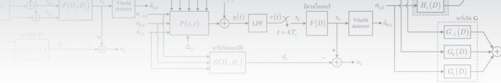

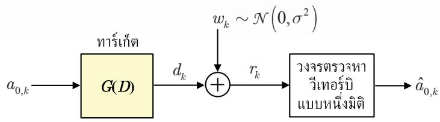  
รูปที่ 7.4 แบบจำลองช่องสัญญาณแบบสมมูล

$$
\mathbf { g } = \left( \mathbf { A } - \mathbf { P } ^ { \mathrm { T } } \mathbf { R } ^ { - 1 } \mathbf { P } \right) ^ { - 1 } \mathbf { E } \lambda\tag{7.57}
$$

$$
\mathbf { f } = \mathbf { R } ^ { - 1 } \mathbf { P } \mathbf { g }\tag{7.58}
$$

## 7.6 วงจรตรวจหาวีเทอร์บิที่ใช้ในระบบ BPMR

หัวข้อนี้จะสรุปหลักการทำงานของวงจรตรวจหาวีเทอร์บิแบบทั่วไป (หรือวงจรตรวจหาวีเทอร์บิหนึ่ง มิติ) และแบบสองมิติลักษณะต่างๆ ที่ใช้ในระบบ BPMR พร้อมทั้งแสดงความซับซ้อนของวงจร ตรวจหาวีเทอร์บิแบบต่างๆ

## 7.6.1 วงจรตรวจหาวีเทอร์บิหนึ่งมิติ

ในบทที่ 4 ของ [10] ได้อธิบายหลักการทำงานโดยละเอียดของวงจรตรวจหาวีเทอร์บิแบบทั่วไป (หรือ วงจรตรวจหาวีเทอร์บิหนึ่งมิติ) ที่ใช้กับทาร์เก็ตหนึ่งมิติ ดังนั้นในที่นี้จะสรุปหลักการทำงานของวงจร ตรวจหาวีเทอร์บิหนึ่งมิติ เพื่อเป็นแนวทางให้ผู้อ่านสามารถเข้าใจหลักการทำงานของวงจรตรวจหา วีเทอร์บิสองมิติได้ง่ายขึ้น

ถ้าสมมุติว่าอีควอไลเซชันแบบสมบูรณ์ (perfect equalization) แบบจำลองในรูปที่ 7.1 จะลดรูปได้เป็นแบบจำลองช่องสัญญาณแบบสมมูลตามรูปที่ 7.4 เมื่อ $w _ { k } \sim \mathcal N \big ( 0 , \sigma ^ { 2 } \big )$ คือสัญญาณ รบกวน AพGN ในทางปฏิบัติหลักการทำงานของวงจรตรวจหาวีเทอร์บิจะอยู่บนพื้นธฐานของ แผนภาพเทรลลิส (trelliร diagram) [13] โดยรูปที่ 7.5 จะนิยามสัญลักษณ์ต่างๆ ในแผนภาพ เทรลลิสดังนี้ $\Psi _ { k } = \left[ a _ { k } \ a _ { k - 1 } \ \dots \ a _ { k - \nu + 1 } \right]$ คือสถานะ (state) ณ เวลา k, $Q = \left| \mathcal { A } \right| ^ { \nu }$ คือจำนวนสถานะ ทั้งหมดที่เป็นไปได้, [A คือจำนวนค่าที่เป็นไปได้ทั้งหมดของข้อมูลอินพุต, v คือหน่วยความจำของ ช่องสัญญาณ (หรือทาร์เก็ต), และ (u, q) คือสัญลักษณ์ที่ใช้แทนการเปลี่ยนสถานะจากสถานะ น ไปยังสถานะ q

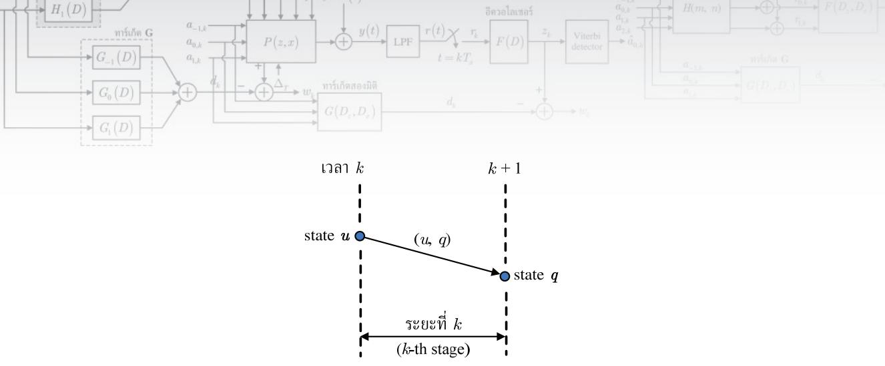  
รูปที่ 7.5 คำอธิบายแผนภาพเทรลลิส

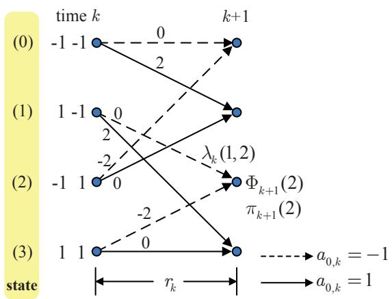  
รูปที่ 7.6 แผนภาพเทรลลิสของช่องสัญญาณ PR4, $H ( D ) = 1 - D ^ { 2 }$

รูปที่ 7.6 แสดงตัวอย่างแผนภาพเทรลลิสของช่องสัญญาณ PR4 นั่นคือ $G ( D ) = 1 - D ^ { 2 }$ ซึ่งมี $Q = 2 ^ { 2 } = 4$ สถานะ ที่แสดงด้วยสัญลักษณ์ (0), (1), (2) และ (3) เมื่อข้อมูลอินพุต $a _ { 0 , k } \in$ {±1} ในการทำงานของอัลกอริทึมวีเทอร์บิ สิ่งที่ต้องคำนวณในทุกช่วงเวลาคือ ค่าเมตริกสาขา (branch metric) ณ เวลา k ของการเปลี่ยนสถานะจากสถานะ น ไปยังสถานะ q นั้นคือ $\lambda _ { k } ( u , q )$ ค่าเมตริกเส้นทาง (path metric) สำหรับสถานะ q ณ เวลา k + 1 นั้นคือ $\Phi _ { k + 1 } ( q )$ , และตัวนำหน้า (predecessor) สำหรับสถานะ q ณ เวลา k + 1 นันคือ $\pi _ { k + 1 } ( q )$ ซึ่งจะเก็บค่าสถานะเริ่มต้นที่เป็น ผลทำให้เกิดเส้นทางการเปลี่ยนสถานะที่ดีสุด (best traทรitioก) เช่น พิจารณาที่สถานะ (2) ณ เวลา $k + 1$ จะมีเส้นทางการเปลียนสถานะ 2 เส้นทางคือ (1, 2) และ (3, 2) อัลกอริทึมวีเทอร์บิ 6 เลือกเส้นทางที่ดีสุดเพียงเส้นทางเดียวที่มาถึงสถานะ (2) ณ เวลา k+ 1 ถ้าสมมุติว่าเส้นทาง (1, 2) คือเส้นทางการเปลี่ยนสถานะที่ดีสุด ก็จะได้ว่า $\pi _ { k + 1 } ( 2 ) = 1$

วงจรตรวจหาที่ทำให้ความน่าจะเป็นของข้อผิดพลาดของลำดับข้อมูลมีค่าน้อยสุดคือ 'วงจร ตรวจหาลำดับที่ควรจะเป็นสูงสุด (MLsD: maximum-likelihood sequence detector)" [13] ซึ่ง สร้างได้โดยใช้อัลกอริทึมวีเทอร์บิจึงเรียกว่า "วงจรตรวจหาวีเทอร์บิ" จากแบบจำลองในรูปที่ 7.4 วงจรตรวจหาวีเทอร์บิจะเลือกลำดับข้อมูลอินพุต $a _ { 0 , k }$ ที่ทำให้ความน่าจะเป็นของลำดับข้อมูล $r _ { k }$ (หรือ r) เมื่อกำหนดลำดับข้อมูล $a _ { 0 , k }$ (หรือ a) มาให้ นั่นคือ

$$
p \left( \mathbf { r } \mid \mathbf { a } \right) = \frac { 1 } { \left( \sqrt { 2 \pi \sigma ^ { 2 } } \right) ^ { S + \nu } } \exp \left\{ - \frac { 1 } { 2 \sigma ^ { 2 } } { \sum _ { k = 0 } ^ { S + \nu } } { \left| r _ { k } - d _ { k } \right| } ^ { 2 } \right\}\tag{7.59}
$$

มีค่ามากสุด โดยที่ $S$ คือจำนวนบิตข้อมูลทั้งหมดของ $a _ { 0 , k }$ จากนั้นใส่ลอการิทึมธรรมชาติ (natural logarithm) ทังสองข้างของสมการ (7.59) จะได้เป็น

$$
\ln \left\{ p \left( \mathbf { r } \mid \mathbf { a } \right) \right\} = \ln \left\{ { \frac { 1 } { \left( { \sqrt { 2 \pi \sigma ^ { 2 } } } \right) ^ { S + \nu } } } \right\} - { \frac { 1 } { 2 \sigma ^ { 2 } } } \sum _ { k = 0 } ^ { S + \nu - 1 } \left| r _ { k } - d _ { k } \right| ^ { 2 }\tag{7.60}
$$

สังเกตจะพบว่าการทำให้สมการ (7.60) มีค่ามากสุด มีผลเที่ยบเท่ากับการทำให้พจน์ที่สองทางด้าน ขวามือของสมการ (7.60) มีค่าน้อยสุด เนื่องจากพจน์ที่หนึ่งเปรียบเสมือนกับค่าคงตัว ดังนั้นวงจร ตรวจหาวีเทอร์บิจะเลือกลำดับข้อมูลอินพุต $a _ { 0 , k }$ ที่ทำให้เมตริก (metric)

$$
\sum _ { k = 0 } ^ { S + \nu - 1 } \left| r _ { k } - d _ { k } \right| ^ { 2 }\tag{7.61}
$$

มีค่าน้อยสุด ซึ่งทำได้โดยการค้นหาเส้นทาง (path) ที่มีค่าเมตริกน้อยสุดตามแผนภาพเทรลลิส เมื่อ เมตริกเส้นทางมีค่าเท่ากับผลรวมของเมตริกสาขา โดยที่เมตริกสาขาของการเปลี่ยนสถานะจากสถานะ u ไปยังสถานะ $q$ นิยามโดย

$$
\lambda _ { k } \left( u , q \right) = \left| r _ { k } - \hat { d } _ { k } \left( u , q \right) \right| ^ { 2 }\tag{7.62}
$$

เมื่อ $\hat { d } _ { k } \left( u , q \right)$ คือข้อมูลเอาต์พุตของช่องสัญญาณที่สอดคล้องกับ (u, ) และเมตริกเส้นทางสามารถ ท บ   
หาได้จาก

$$
\Phi _ { k + 1 } \left( q \right) = \sum _ { i = 0 } ^ { k } \lambda _ { i }\tag{7.63}
$$

(A-1) กำหนดค่าเริ่มต้นของเมตริกเส้นทาง $\Phi _ { 0 } \left( p \right) = 0$ สำหรับทุกๆ สถานะ P   
(A-2) For $k = 0 , \ 1 , . . . , \ S + \nu - 1$   
(A-3) For $q = 0 , 1 , . . . , Q - 1$   
(A-4) $\lambda _ { k } \left( p , q \right) = \left| r _ { k } - \hat { d } \left( p , q \right) \right| ^ { 2 } \mathrm { f o r } \forall p$   
(A-5) $\begin{array} { r } { \pi _ { k + 1 } \left( q \right) = \arg \operatorname* { m i n } _ { p } \left\{ \Phi _ { k } \left( p \right) + \lambda _ { k } \left( p , q \right) \right\} } \end{array}$   
(A-6) $\Phi _ { k + 1 } \left( q \right) = \Phi _ { k } \left( \pi _ { k + 1 } \left( q \right) \right) + \lambda _ { k } \left( \pi _ { k + 1 } \left( q \right) , q \right)$   
(A-7) $\mathbf { S } _ { k + 1 } \left( q \right) = \left[ \mathbf { S } _ { k } \left( \pi _ { k + 1 } \left( q \right) \right) \ \middle \vert \ \pi _ { k + 1 } \left( q \right) \right]$   
(A-8) End   
(A-9) End   
(A-10) ถอดรหัสข้อมูลอินพุต $\hat { a } _ { 0 , k }$ จากเส้นทางที่ยังมีชีวิตอยู่ที่มีค่า $\Phi _ { S + \nu }$ น้อยที่สุด  
รูปที่ 7.7 ขึ้นตอนการทำงานของอัลกอริทึมวีเทอร์บิหนึ่งมิติ [10]

รูปที่ 7.7 แสดงขั้นตอนการทำงานของอัลกอริทึมวีเทอร์บิ ตัวอย่างเช่น พิจารณาระยะที่ k ของแผนภาพเทรลลิสในรูปที่ 7.6 จะพบว่ามีการเส้นทางการเปลี่ยนสถานะ 2 เส้นทางที่มาถึงสถานะ (2) ณ เวลา $k + 1$ นั่นคือ (1, 2) และ (3, 2) จากนั้นทำการคำนวณค่าเมตริกสาขาทั้ง 2 เส้นทาง นั่นคือ $\lambda _ { k } \left( 1 , 2 \right)$ และ $\lambda _ { k } \left( 3 , 2 \right)$ ตามขั้นตอนที่ (A-4) โดยสถานะเริ่มต้นที่สอดคล้องกับเส้นทาง การเปลี่ยนสถานะที่ดีสุดที่มาถึงสถานะ (2) ณ เวลา $k + 1$ จะถูกเลือกตามขั้นตอนที่ (A-5) สมมุติ ว่า (1, 2) คือเส้นทางการเปลี่ยนสถานะที่ดีสุด ก็จะได้ว่า $\pi _ { k + 1 } \left( 2 \right) = 1$ จากนั้นปรับค่าเมตริกเส้นทาง ที่มาถึงสถานะ (2) ณ เวลา k + 1 นั่นคือ $\Phi _ { k + 1 } ( 2 )$ ตามขั้นตอนที่ (A-6) และปรับค่าเส้นทางที่ ยังมีชีวิตอยู่(survivor path) ที่มาถึงสถานะ (2) ณ เวลา k + 1 นั้นคือ $\mathbf { S } _ { k + 1 } \left( 2 \right)$ ตามขั้นตอนที่ (A-7) ให้ทำตามขั้นตอนต่างๆ เหล่านี้ตามอัลกอริทึมวีเทอร์บิสำหรับลำดับข้อมูล $\{ r _ { k } \}$ ที่ได้รับมา ญ ทั้งหมด และขั้นตอนสุดท้ายคือการตัดสินใจหาค่าลำดับข้อมูล $\{ a _ { 0 , k } \}$ ที่ควรจะเป็นสูงสุด โดยเลือก จากเส้นทางที่ยังมีชีวิตอยู่ที่มีค่าเมตริกเส้นทาง ณ เวลา S +V (หรือ $\Phi _ { S + \nu } )$ น้อยสุด

เนื่องจากวงจรตรวจหาวีเทอร์บิจะทำการประมวลผลลำดับข้อมูลทั้งหมดก่อนตัดสินใจว่า ลำดับข้อมูลที่ได้รับควรจะเป็นลำดับข้อมูลอินพุตใดมากที่สุด ดังนั้นในทางปฏิบัติความชับซ้อนของ วงจรตรวจหาวีเทอร์บิจะขึ้นอยู่กับหลายปัจจัย ได้แก่ จำนวนค่าที่เป็นไปได้ทั้งหมดของข้อมูลอินพุต $| \mathcal { A } |$ , ความยาวของลำดับข้อมูลอินพุต S, และจำนวนหน่วยความจำของทาร์เก็ต v สำหรับตัวอย่าง การคำนวณของอัลกอริที่มวีเทอร์บิสามารถศึกษาได้จากบทที 4 ของ [10]

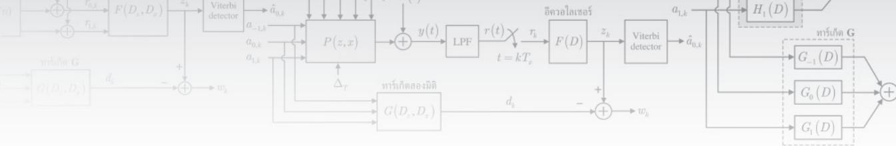

## 7.6.2 วงจรตรวจหาวีเทอร์บิสองมิติ

ในหัวข้อนี้จะใช้แบบจำลองช่องสัญญาณในรูปที่ 7.2 ในการอธิบายพื้นฐานการทำงานของวงจร ตรวจหาวีเทอร์บิสองมิติ โดยที่ข้อมูลอินพุตของทาร์เก็ตจะมี 3 แทร็ก (แทร็กบน แทร็กกลาง และ แทร็กล่าง) และวงจรตรวจหาวีเทอร์บิสองมิติจะถอดรหัสข้อมูลเฉพาะข้อมูลอินพุตของแทร็กกลาง เท่านัน

โดยทั่วไปวงจรตรวจหาวีเทอร์บิสองมิติจะมีขั้นตอนการทำงานคล้ายกับวงจรตรวจหาวีเทอร์บิ หนึ่งมิต49ตามที่อธิบายในหัวข้อที่ 7.6.1 เพียงแต่แผนภาพเทรลลิสที่ใช้ในวงจรตรวจหาวีเทอร์บิสอง มิติอาจจะมีจำนวนสถานะ Q มากขึ้น, มีเส้นสาขามากกว่าหนึ่งเส้นในแต่ละการเปลี่ยนสถานะจาก สถานะ น ไปยังสถานะ q, และมีเส้นสาขามากกว่าสองเส้นที่วิ่งออกจากแต่ละสถานะ ดังนั้นวงจร ตรวจหาวีเทอร์บิสองมิติแต่ละแบบจะมีความซับซ้อนแตกต่างกัน โดยขึ้นอยู่กับจำนวนของสถานะ และจำนวนเส้นสาขาทั้งหมดที่ใช้ในแต่ละระยะที่ k ของแผนภาพเทรลลิส ซึ่งอธิบายได้ดังต่อไปนี้

## 7.6.2.1 ทาร์เก็ตสองมิติที่มีมุมเป็นศูนย์แบบสมมาตร

โดยทั่วไปการออกแบบทาร์เก็ตสองมิติที่มีมุมเป็นศูนย์ตามที่อธิบายในหัวข้อที่ 7.2 เมื่อระบบไม่มี ปัญหาเรื่องแทร็กมิสเรจิสเตรชัน (TMR) ผลลัพธ์ที่ได้ก็คือทาร์เก็ตสองมิติ G ตามสมการ (7.15) ที่มีค่าสัมประสิทธิ $g _ { - 1 , 1 } = g _ { 1 , 1 }$ และ $g _ { - 1 , 0 } = g _ { 1 , 0 } = g _ { - 1 , 2 } = g _ { 1 , 2 } = 0$ ดังนั้นในหัวข้อนี้จะอธิบาย พื้นฐานการทำงานของวงจรตรวจหาวีเทอร์บิที่สร้างจากทาร์เก็ตสองมิติที่มีมุมเป็นศูนย์แบบสมมาตร ถ้ากำหนดให้ทาร์เก็ตสองมิติที่มีมุมเป็นศูนย์แบบสมมาตรขนาด 3 ×3 มีค่าเท่ากับ

$$
\mathbf { G } = { \left[ \begin{array} { l } { G _ { - 1 } ( D ) } \\ { G _ { 0 } ( D ) } \\ { G _ { 1 } ( D ) } \end{array} \right] } = { \left[ \begin{array} { l l l } { 0 } & { c } & { 0 } \\ { u } & { p } & { w } \\ { 0 } & { c } & { 0 } \end{array} \right] }\tag{7.64}
$$

ดังนั้นจากรูปที่ 7.2 จะได้ว่าข้อมูลเอาต์พุตของทาร์เก็ตมีค่าเท่ากับ

$$
d _ { k } = c { \left( a _ { - 1 , k - 1 } + a _ { 1 , k - 1 } \right) } + \ u \left( a _ { 0 , k } \right) + p { \left( a _ { 0 , k - 1 } \right) } + w { \left( a _ { 0 , k - 2 } \right) }\tag{7.65}
$$

รูปที่ 7.8 แสดงรายละเอียดของการเปลี่ยนสถานะในหนึ่งเส้นสาขาของแผนภาพเทรลลิสที สร้างจากทาร์เก็ตสองมิติ G ในสมการ (7.64) โดยที่แต่ละสถานะ ณ เวลา k จะถูกกำหนดด้วย ข้อมูล 2 ตัวคือ ข้อมูลอินพุตของแทร็กกลาง ณ เวลา k- 2 และ k- 1 (นั้นคือ $a _ { 0 , k - 2 }$ และ $a _ { 0 , k - 1 } )$

รูปที่7.8 การเปลี่ยนสถานะในหนึ่งเส้นสาขาของแผนภาพเทรลลิสที่สร้างจากทาร์เก็ตสองมิติที่มีมุมเป็นศูนย์ แบบสมมาตร

เพราะฉะนั้นแผนภาพเทรลลิสที่สร้างจากทาร์เก็ตสองมิติที่มีมุมเป็นศูนย์แบบสมมาตรจะมีจำนวน สถานะทังหมดเท่ากับ $2 \times 2 = 4$ สถานะ50 50 และแต่ละเส้นสาขาจะถูกกำหนดด้วยสัญลักษณ์ x /y เมื่อ $\textit { x } = \left[ a _ { - 1 , k - 1 } ~ a _ { 0 , k } ~ a _ { 1 , k - 1 } \right]$ คือข้อมูลอินพุตของทาร์เก็ต ณ เวลา k (ซึ่งประกอบด้วยข้อมูล อินพุตของแทร็กบน ณ เวลา k - 1, ข้อมูลอินพุตของแทร็กกลาง ณ เวลา k, และข้อมูลอินพุต ของแทร็กล่าง ณ เวลา k- 1), และ $y = d _ { k }$ คือข้อมูลเอาต์พุตของทาร์เก็ต ณ เวลา k ที่สอดคล้อง ญ   
กับการเปลี่ยนสถานะของเส้นสาขานั้น ดังนั้นแต่ละสถานะ ณ เวลา k จะมีจำนวนเส้นสาขาทั้งหมด $2 \times 2 \times 2 = 8$ เส้นสาขา โดยแบ่งออกเป็น 2 กลุ่ม (กลุ่มละ 4 เส้นสาขา) และแต่ละกลุ่มเส้นสาขา จะเดินทางไปยัง 2 สถานะที่แตกต่างกัน ณ เวลา $k + 1$

ถ้ากำหนดให้ $d _ { k } ^ { 1 }$ และ $d _ { k } ^ { 2 }$ คือข้อมูลเอาต์พุตของทาร์เก็ต ณ เวลา k ที่สอดคล้องกับข้อมูล เอาต์พุต $\left\{ a _ { - 1 , k - 1 } = + 1 , \ a _ { 1 , k - 1 } = - 1 \right\}$ และ $\left\{ a _ { - 1 , k - 1 } = - 1 , \ a _ { 1 , k - 1 } = + 1 \right\}$ ตามลำดับ ดังนันจาก สมการ (7.65) จะได้ว่า $d _ { k } ^ { 1 } = d _ { k } ^ { 2 }$ ซึ่งหมายความว่าในแต่ละกลุ่มเส้นสาขาจะมี 2 เส้นสาขา (จาก 4 เส้นสาขา) ที่มีข้อมูลเอาต์พุตของทาร์เก็ตเท่ากัน จึงทำให้สามารถลดจำนวนเส้นสาขาที่เดินออกจาก สถานะ  ณ เวลา k ไปยังสถานะ q ณ เวลา k + 1 เหลือเพียง 3 เส้นสาขา โดยที่แต่ละเส้นสาขา จะมีค่าข้อมูลเอาต์พตของทาร์เก็ตเท่ากับ

$$
d _ { k } = \left\{ \begin{array} { l l } { \left( g _ { 0 , k } \ast a _ { 0 , k } \right) + 2 c , } & { \mathrm { i f } a _ { - 1 , k - 1 } = a _ { 1 , k - 1 } = 1 } \\ { \qquad \mathrm { i f } a _ { - 1 , k - 1 } \neq a _ { 1 , k - 1 } } \\ { \qquad \left( g _ { 0 , k } \ast a _ { 0 , k } \right) - 2 c , } & { \mathrm { i f } a _ { - 1 , k - 1 } = a _ { 1 , k - 1 } = - 1 } \end{array} \right.\tag{7.66}
$$

เมื่อ \* คือตัวดำเนินการคอนโวลูชัน, และ $g _ { 0 , k }$ คือค่าสัมประสิทธิของทาร์เก็ต $G _ { 0 } ( D )$ ที่สอดคล้อง กับข้อมูลอินพุตของแทร็กกลาง $a _ { 0 , k }$ รูปที่ 7.9 แสดงแผนภาพเทรลลิสที่สร้างจากทาร์เก็ตสองมิติ G

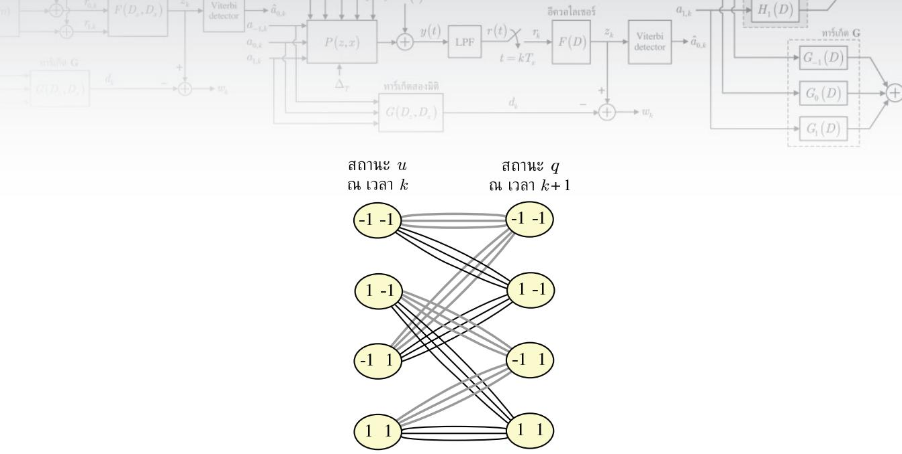  
รูปที่ 79 แผนภาพเทรลลิสที่สร้างจากทาร์เก็ตสองมิติ G ในสมการ (7.64)

ในสมการ (7.64) โดยวงจรตรวจหาวีเทอร์บิที่ใช้แผนภาพเทรลลิสนี้ในการถอดรหัสข้อมูลจะเรียกว่า วงจรตรวจหาวีเทอร์บิสองมิติแบบที่ถูกปรับปรุง (modified 2D Viterbi detector)"[126] ซึ่งถือว่า มีความซับซ้อนน้อยสุด เมื่อเทียบกับวงจรตรวจหาวีเทอร์บิสองมิติแบบอื่นๆ

## 7.6.2.2 ทาร์เก็ตสองมิติแบบสมมาตร

สู่รู้ ในที่นีทาร์เก็ตสองมิติแบบสมมาตรขนาด 3 × 3 ตามสมการ (7.28) จะหมายถึงทาร์เก็ตสองมิติ G ที่มีค่าสัมประสิทธ์ของแทร็กบนและของแทร็กล่างเท่ากัน นันคือ $g _ { - 1 , 0 } = g _ { 1 , 0 } , \ g _ { - 1 , 1 } = g _ { 1 , 1 }$ และ $g _ { - 1 , 2 } = g _ { 1 , 2 }$ เพื่อให้ง่ายสำหรับการอธิบายจะกำหนดให้ทาร์เก็ตสองมิติแบบสมมาตรมีค่าเท่ากับ

$$
\mathbf { G } = { \left[ \begin{array} { l } { G _ { - 1 } ( D ) } \\ { G _ { 0 } ( D ) } \\ { G _ { 1 } ( D ) } \end{array} \right] } = { \left[ \begin{array} { l l l } { b } & { c } & { d } \\ { u } & { p } & { w } \\ { b } & { c } & { d } \end{array} \right] }\tag{7.67}
$$

ดังนั้นจากรูปที่ 7.2 จะได้ว่าข้อมูลเอาต์พุตของทาร์เก็ตมีค่าเท่ากับ e a 2

$$
\begin{array} { l } { d _ { k } = b { \left( a _ { - 1 , k } + a _ { 1 , k } \right) } + c { \left( a _ { - 1 , k - 1 } + a _ { 1 , k - 1 } \right) } + d { \left( a _ { - 1 , k - 2 } + a _ { 1 , k - 2 } \right) } } \\ { \qquad + \ u { \left( a _ { 0 , k } \right) } + p { \left( a _ { 0 , k - 1 } \right) } + w { \left( a _ { 0 , k - 2 } \right) } } \end{array}\tag{7.68}
$$

เนื่องจากระบบ BPMR ใช้ทาร์เก็ตสองมิติแบบสมมาตร จึงทำให้สามารถนำข้อมูลอินพุตของแทร็ก บน $a _ { - 1 , k }$ และแทร็กล่าง a1 $a _ { 1 , k }$ มารวมกันได้ซึ่งมีค่าเท่ากับ

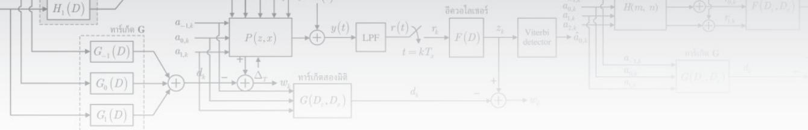

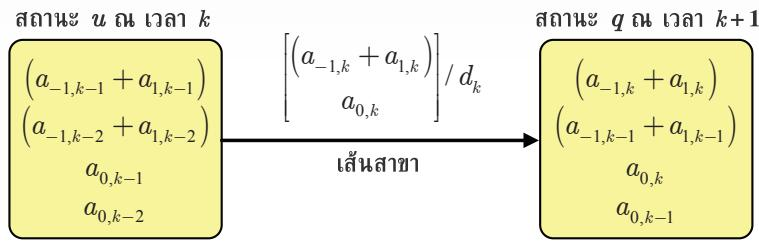  
รูปที่ 7.10 การเปลี่ยนสถานะในหนึ่งเส้นสาขาของแผนภาพเทรลลิสที่สร้างจากทาร์เก็ตสองมิติแบบสมมาตร

$$
\left( a _ { - 1 , k } + a _ { 1 , k } \right) = \left\{ \begin{array} { l l } { - 2 , } & { \mathrm { i f ~ } a _ { - 1 , k } = - 1 \mathrm { ~ a n d ~ } a _ { 1 , k } = - 1 } \\ { 0 , } & { \mathrm { i f ~ } a _ { - 1 , k } = - 1 \mathrm { ~ a n d ~ } a _ { 1 , k } = + 1 } \\ { 0 , } & { \mathrm { i f ~ } a _ { - 1 , k } = + 1 \mathrm { ~ a n d ~ } a _ { 1 , k } = - 1 } \\ { + 2 , } & { \mathrm { i f ~ } a _ { - 1 , k } = + 1 \mathrm { ~ a n d ~ } a _ { 1 , k } = + 1 } \end{array} \right.\tag{7.69}
$$

การนำข้อมูลอินพุตของทั่งสองแทร็กมาพิจารณารวมกันจะช่วยลดความซับซ้อนของวงจร ตรวจหาวีเทอร์บิสองมิติได้ กล่าวคือรูปที่ 7.10 แสดงรายละเอียดของการเปลี่ยนสถานะในหนึ่ง เส้นสาขาของแผนภาพเทรลลิสที่สร้างจากทาร์เก็ตสองมิติแบบสมมาตร โดยที่แต่ละสถานะ ณ เวลา k จะถูกกำหนดด้วยข้อมูล 4 ตัวคือ ผลรวมของข้อมูลอินพุตของแทร็กบนและแทร็กล่าง ณ เวลา $k - 2$ , ผลรวมของข้อมูลอินพุตของแทร็กบนและแทร็กล่าง ณ เวลา k - 1, ข้อมูลอินพุตของแทร็ก กลาง ณ เวลา $k - 2 .$ และข้อมลอินพตของแทร็กกลาง ณ เวลา k - 1 ดังนันแผนภาพเทรลลิสที สร้างจากทาร์เก็ตสองมิติแบบสมมาตรจะมีจำนวนสถานะทั้งหมดเท่ากับ $3 \times 3 \times 2 \times 2 = 3 6$ สถานะ51 และแต่ละสถานะ ณ เวลา k จะมีจำนวนเส้นสาขาทั้งหมด $3 \times 2 = 6$ เส้นสาขาที่เดินทางไปยัง 6 สถานะที่แตกต่างกัน ณ เวลา $k + 1$ นอกจากนีแต่ละเส้นสาขาจะถูกกำหนดด้วยสัญลักษณ์ 2 $x / y$ โดยที่ $x = \left[ \left( a _ { - 1 , k } + a _ { 1 , k } \right) a _ { 0 , k } \right]$ คือข้อมูลอินพุตของทาร์เก็ต ณ เวลา k, และ $y = d _ { k }$ คือข้อมูล เอาต์พุตของทาร์เก็ต ณ เวลา k ที่สอดคล้องกับการเปลี่ยนสถานะของเส้นสาขานั้น

## 7.6.2.3 ทาร์เก็ตสองมิติแบบอสมมาตร

ในที่นี้ทาร์เก็ตสองมิติแบบอสมมาตรขนาด $3 \times 3$ ตามสมการ (7.15) จะหมายถึงทาร์เก็ตสองมิติ G ที่มีค่าสัมประสิทธ์ของแทร็กบนและของแทร็กล่างไม่เท่ากัน นันคือ $G _ { - 1 } ( D ) \ne G _ { 1 } ( D )$ ดังนั้น วงจรภาครับของระบบ BPMR จะต้องใช้วงจรตรวจหาวีเทอร์บิสองมิติที่มีความซับซ้อนมากสุด (full-complexity 2D Viterbi detector) ในการถอดรหัสข้อมูล รูปที 7.11 แสดงรายละเอียดของ การเปลี่ยนสถานะในหนึ่งเส้นสาขาของแผนภาพเทรลลิสที่สร้างจากทาร์เก็ตสองมิติแบบอสมมาตร ในที่นี้จะถือว่าทาร์เก็ตสองมิติ G มีหน่วยความจำเท่ากับ $\nu = 2$ หน่วย และรูปแบบของข้อมูล อินพุตที่เป็นไปได้ทั้งหมดมีจำนวน $\left| \mathcal { A } \right| = 2 \times 2 \times 2 = 8$ แบบ52 ดังนั้นแผนภาพเทรลลิสที่สร้างจาก e ทาร์เก็ตสองมิติแบบอสมมาตรจะมีจำนวนสถานะทั้งหมด $\left| \mathcal { A } \right| ^ { \nu } = 8 ^ { 2 } = 6 4$ โดยที่แต่ละสถานะ ณ เวลา k จะถูกกำหนดด้วยข้อมูลอินพุตของทุกแทร็ก ณ เวลา k - 2 และ $k - 1$ ตามลำดับ และ แต่ละสถานะ ณ เวลา k จะมีจำนวนเส้นสาขาทังหมด $2 \times 2 \times 2 = 8$ เส้นสาขาที่เดินทางไปยัง 8 สถานะที่แตกต่างกัน ณ เวลา k + 1 นอกจากนี้แต่ละเส้นสาขาจะถูกกำหนดด้วยสัญลักษณ์ x /y เมื่อ $x = \left[ a _ { - 1 , k } ~ a _ { 0 , k } ~ a _ { 1 , k } \right]$ คือข้อมูลอินพุตของทาร์เก็ต (มาจากแทร็กบน แทร็กกลาง และแทร็ก ล่าง) ณ เวลาk, และ $y = d _ { k }$ คือข้อมูลเอาต์พุตของทาร์เก็ต ณ เวลา  ที่สอดคล้องกับการเปลี่ยน สถานะของเส้นสาขานัน

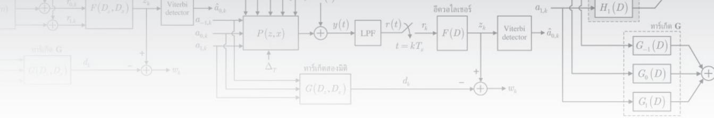

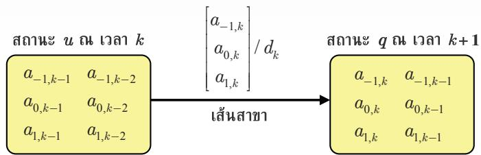  
รูปที่ 7.11 การเปลี่ยนสถานะในหนึ่งเส้นสาขาของแผนภาพเทรลลิสที่สร้างจากทาร์เก็ตสองมิติแบบอสมมาตร

## 7.7 ผลการทดลอง

พิจารณาแบบจำลองช่องสัญญาณ BPMR ในรูปที่ 7.2 เมื่อนิยามให้อัตราส่วนกำลังของสัญญาณ ต่อกำลังของสัญญาณรบกวนมีค่าเท่ากับ

$$
\mathrm { S N R } = 1 0 \log _ { 1 0 } \left( { \frac { 1 } { \sigma ^ { 2 } } } \right)\tag{7.70}
$$

มีหน่วยเป็นเดซิเบล (4B) โดยในที่น้จะเปรียบเทียบสมรรถนะของระบบ 4 แบบดังนี้

ระบบที่ใช้ทาร์เก็ตหนึ่งมิติ (หัวข้อที่ 7.1) และใช้วงจรตรวจหาวีเทอร์บิหนึ่งมิติ (หัวข้อที่ 7.6.1) โดยจะเรียกระบบนี้ว่า $^ { 6 6 } 1 \mathrm { D }$ target"

ระบบที่ใช้ทาร์เก็ตสองมิติที่มีมุมเป็นศูนย์ (หัวข้อที่ 7.2) และใช้วงจรตรวจหาวีเทอร์บิสองมิติ แบบที่ถูกปรับปรุง (หัวข้อที่ 7.6.2.1) โดยจะเรียกระบบนี้ว่า "Zero-corner 2D target"

ระบบที่ใช้ทาร์เก็ตสองมิติแบบสมมาตร (หัวข้อที่ 7.3) และใช้วงจรตรวจหาวีเทอร์บิสองมิติ (หัวข้อที่ 7.6.2.2) โดยจะเรียกระบบนี้ว่า "Symmetric 2D target"

ระบบที่ใช้ทาร์เก็ตสองมิติแบบอสมมาตร (หัวข้อที่ 7.4) และใช้วงจรตรวจหาวีเทอร์บิสองมิติ (หัวข้อที่ 7.6.2.3) โดยจะเรียกระบบนี้ว่า "Asymmetric 2D target"

และระบบทั้งหมดจะใช้อีควอไลเซอร์หนึ่งมิติที่มีจำนวน 11 แท็ป (การเพิ่มจำนวนแท็ปของอีควอ ไลเซอร์ไม่ทำให้สมรรถนะของระบบดีขึ้นอย่างมีนัยสำคัญ [108]

พิจารณาระบบ BPMR ที่ใช้สื่อบันทึกที่สร้างด้วยไอแลนด์แบบสี่เหลี่ยมจัตุรัสที่มีความยาว a = 11 nm, ความสูง 8 = 10 nm, ระยะบินของหัวอ่าน d = 10 nm, และใช้หัวอ่านแบบ MR ที่มีความหนา t = 4 ทm, ความกว้าง $W = 1 5$ nm, และความกว้างของช่องว่างระหว่างฉนวนและ ซึ้นส่วน MR $g = 6$ ทm ซึ่งสอดคล้องกับผลตอบสนองสัญญาณพัลส์แบบสองมิติที่มี $\mathrm { P W _ { 5 0 } ^ { a l o n g } = }$ 19.8 nm และ $\mathrm { P W } _ { 5 0 } ^ { \mathrm { c r o s s } } = 2 4 . 8$ ทm [108] (ดูความหมายของพารามิเตอร์ต่างๆ ในรูปที 6.8) โดย ในที่นี้จะใช้สัญญาณพัลส์เกาส์เซียนแบบสองมิติตามสมการ (6.14) ในการสร้างเมทริกซ์ช่องสัญญาณ H ณ ความจุข้อมูลต่างๆ สำหรับ $\mathrm { P W _ { 5 0 } ^ { a l o n g } }$ และ $\mathrm { P W } _ { 5 0 } ^ { \mathrm { c r o s s } }$ ที่กำหนดมาให้ นั้นคือ ณ ความจุเท่ากับ $2 ~ { \mathrm { T b } } / { \mathrm { i n } } ^ { 2 }$ จากสมการ (6.13) จะได้ $T _ { x } = \ T _ { z } \approx 1 8$ nm และ

$$
\mathbf { H } _ { _ { 2 \mathrm { \tiny \mathrm { ~ T b / i n } ^ { 2 } } } } = \left[ { \begin{array} { c c c c c } { 2 . 4 3 \times 1 0 ^ { - 5 } } & { 0 . 0 2 3 } & { 0 . 2 3 2 } & { 0 . 0 2 3 } & { 2 . 4 3 \times 1 0 ^ { - 5 } } \\ { 1 \times 1 0 ^ { - 4 } } & { 0 . 1 0 1 } & { 1 } & { 0 . 1 0 1 } & { 1 \times 1 0 ^ { - 4 } } \\ { 2 . 4 3 \times 1 0 ^ { - 5 } } & { 0 . 0 2 3 } & { 0 . 2 3 2 } & { 0 . 0 2 3 } & { 2 . 4 3 \times 1 0 ^ { - 5 } } \end{array} } \right]\tag{7.71}
$$

ณ ความจุเท่ากับ 2.5 $\mathrm { T b } / \mathrm { i n } ^ { 2 }$ จากสมการ (6.13) จะได้ $T _ { x } = \ T _ { z } \approx 1 6$ nm และ

$$
\mathbf { H } _ { _ { 2 . 5 \times \mathrm { T b } / \mathrm { i n } ^ { 2 } } } = \left[ \begin{array} { c c c c c } { 2 . 2 6 \times 1 0 ^ { - 4 } } & { 0 . 0 5 2 } & { 0 . 3 1 5 } & { 0 . 0 5 2 } & { 2 . 2 6 \times 1 0 ^ { - 4 } } \\ { 7 . 1 6 \times 1 0 ^ { - 4 } } & { 0 . 1 6 4 } & { 1 } & { 0 . 1 6 4 } & { 7 . 1 6 \times 1 0 ^ { - 4 } } \\ { 2 . 2 6 \times 1 0 ^ { - 4 } } & { 0 . 0 5 2 } & { 0 . 3 1 5 } & { 0 . 0 5 2 } & { 2 . 2 6 \times 1 0 ^ { - 4 } } \end{array} \right]\tag{7.72}
$$

ณ ความจุเท่ากับ 3 $\mathrm { T b } / \mathrm { i n } ^ { 2 }$ จากสมการ (6.13) จะได้ $T _ { x } = \ T _ { z } \approx 1 4 . 5$ nm และ

$$
\mathbf { H } _ { _ { 3  { 2 b / i n ^ { 2 } } } } = \left[ \begin{array} { c c c c c c } { 0 . 0 0 1 0 } & { 0 . 0 8 8 } & { 0 . 3 8 8 } & { 0 . 0 8 8 } & { 0 . 0 0 1 0 } \\ { 0 . 0 0 2 6 } & { 0 . 2 2 6 } & { 1 } & { 0 . 2 2 6 } & { 0 . 0 0 2 6 } \\ { 0 . 0 0 1 0 } & { 0 . 0 8 8 } & { 0 . 3 8 8 } & { 0 . 0 8 8 } & { 0 . 0 0 1 0 } \end{array} \right]\tag{7.73}
$$

ณ ความจุเท่ากับ 3.5 $\mathrm { T b } / \mathrm { i n } ^ { 2 }$ จากสมการ (6.13) จะได้ $T _ { x } = \ T _ { z } \approx 1 3 . 6$ nm และ

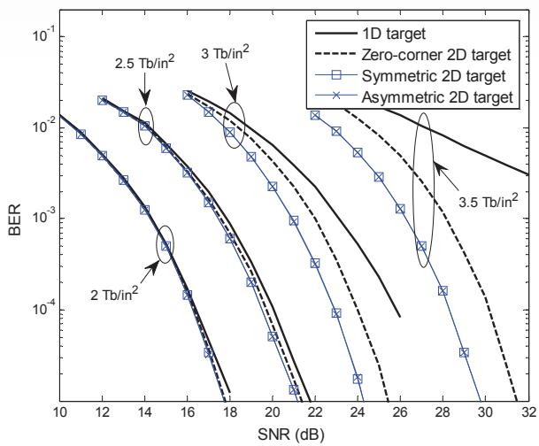  
รูปที่ 7.12 สมรรถนะของระบบที่ใช้ทาร์เก็ตแบบต่างๆ

$$
\mathbf { H } _ { 3 . 5 \mathrm { T b / i n ^ { 2 } } } = { \left[ \begin{array} { l l l l } { 0 . 0 0 2 3 } & { 0 . 1 1 7 } & { 0 . 4 3 4 } & { 0 . 1 1 7 } & { 0 . 0 0 2 3 } \\ { 0 . 0 0 5 3 } & { 0 . 2 7 0 } & { 1 } & { 0 . 2 7 0 } & { 0 . 0 0 5 3 } \\ { 0 . 0 0 2 3 } & { 0 . 1 1 7 } & { 0 . 4 3 4 } & { 0 . 1 1 7 } & { 0 . 0 0 2 3 } \end{array} \right] }\tag{7.74}
$$

รูปที่ 7.12 เปรียบเทียบสมรรถนะของระบบที่ใช้ทาร์เก็ตแบบต่างๆ ซึ่งจะพบว่า ณ ความจุ ข้อมูลน้อยกว่าหรือเท่ากับ $2 \ \mathrm { T b } / \mathrm { i n } ^ { 2 }$ ทุกระบบจะมีสมรรถนะที่ไกล้เคียงกัน (เนื่องจาก ITI ถือว่า มีความรุนแรงน้อย เมื่อเทียบกับความรุนแรงของ ISI) ดังนั้นในทางปฏิบัติเมื่อระบบ BPMR มี ความจุข้อมูลไม่มาก $( \leq 2 ~ { \mathrm { T b } } / { \mathrm { i n } } ^ { 2 } )$ ก็ควรเลือกใช้งาน $^ { 6 6 } 1 \mathrm { D }$ target" เพื่อให้สามารถใช้วงจรตรวจหา วีเทอร์บิหนึ่งมิติที่มีความความชับซ้อนน้อยและยังคงให้สมรรถนะที่ค่อนข้างดี อย่างไรก็ตามเมื่อ 6 ธ ความจุข้อมูลเพิ่มขึ้น $( > 2 ~ \mathrm { T b } / \mathrm { i n } ^ { 2 } )$ ระบบที่ใช้ $^ { 6 6 } 1 \mathrm { D }$ target" เริ่มที่จะมีสมรรถนะด้อยลงเมื่อเทียบ กับการใช้งานทาร์เก็ตสองมิติ (เนื่องจาก ITI มีความรุนแรงมากขึ้น) เพราะฉะนั้นเมื่อระบบ BPMR มีความจุข้อมูลสูง $( \geq 2 . 5 \ \mathrm { T b } / \mathrm { i n } ^ { 2 } )$ ก็ควรเลือกใช้งานทาร์เก็ตสองมิติ เพราะสามารถลดผลกระทบ ที่เกิดจาก ITI ได้มากกว่าการใช้งานทาร์เก็ตหนึ่งมิติ จากรูปที่ 7.12 ยังพบว่าระบบที่ใช้ "Symmetric 2D target" และ "Asymmetric 2D target" จะมีสมรรถนะดีกว่าระบบที่ใช้"Zero-corner 2D target" โดยเฉพาะอย่างยิ่งที่ความจุข้อมูลสูงๆ $( \geq 3 { \mathrm { ~ T b } } / { \mathrm { i n } } ^ { 2 } )$ ทั้งนี้เป็นเพราะว่าเมื่อ ITI อยู่ในระดับ ที่มีความรุนแรงมาก (สังเกตได้จากค่าสัมประสิทธิ์ของเมทริกซ์ H ในแถวที่หนึ่งและแถวที่สาม) การใช้งาน "Symmetric 2D target" หรือ "Asymmetric 2D target" สามารถลดผลกระทบของ ITI ได้ดีกว่าการใช้งาน "Zero-corner 2D target" นอกจากนี้ในการทดลองนี้ยังพบว่าระบบที่ใช้ "Symmetric 2D target" และ Asymmetric 2D target"มีสมรรถนะเท่ากัน เนืองจากผลตอบสนอง ของช่องสัญญาณ (หรือเมทริกซ์ H) เป็นแบบสมมาตร และระบบไม่มีผลกระทบของแทร็กมิส เรจิสเตรชัน จึงทำให้ค่าสัมประสิทธิ์ของทาร์เก็ตสองมิติแบบสมมาตรและแบบอสมมาตรที่ได้จาก การออกแบบมีค่าใกล้เคียงกันมาก ซึ่งส่งผลให้ระบบมีสมรรถนะเท่ากัน

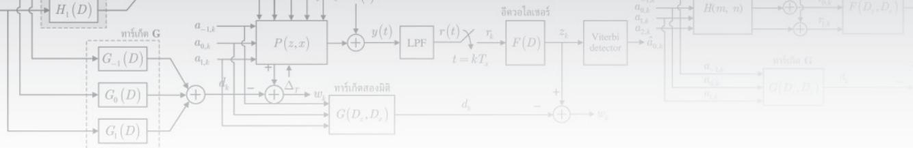

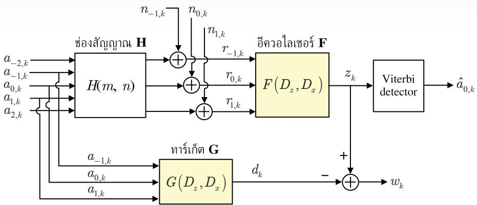  
รูปที่ 7.13 แบบจำลองช่องสัญญาณ BPMR ที่ใช้ 3 หัวอ่าน สำหรับการออกแบบทาร์เก็ตสองมิติและอีควอ ไลเซอร์สองมิติ [108]

## 7.7.1 สมรรถนะของอีควอไลเซอร์สองมิติ

รูปที่ 7.13 แสดงแบบจำลองช่องสัญญาณ BPMR ที่ใช้ 3 หัวอ่าน สำหรับการออกแบบทาร์เก็ต สองมิติและอีควอไลเซอร์สองมิติตามที่อธิบายในหัวข้อที่ 7.5 (ดัดแปลงมาจากรูปที่ 7.3) โดยที อีควอไลเซอร์สองมิติ F และทาร์เก็ตสองมิติ G เป็นไปตามสมการ (7.44) และ (7.45) ตามลำดับ เมื่อ $M = 1$ และ $L = 1$ เนื่องจากอีควอไลเซอร์สองมิติ F ที่มี $M = 1$ จะทำงานโดยใช้สัญญาณ อ่านกลับของ 3 แทร็กที่ติดกัน (นั่นคือ $r _ { - 1 , k } , \ r _ { 0 , k }$ และ $r _ { 1 , k } )$ เพราะฉะนั้นในการสร้างสัญญาณ อ่านกลับทั้ง 3 สัญญาณนี้จำเป็นต้องใช้ข้อมูลอินพุตจำนวน 5 แทร็ก (นั่นคือ $a _ { - 2 , k } , \ a _ { - 1 , k } , \ a _ { 0 , k }$ $a _ { 1 , k }$ และ $a _ { 2 , k } )$ เพื่อให้สัญญาณอ่านกลับแต่ละสัญญาณมีผลกระทบของ ITI

รูปที่ 7.14 เปรียบเทียบสมรรถนะของระบบ BPMR ที่ใช้อีควอไลเซอร์หนึ่งมิติ (แบบที่ใช้ "1D target" และ 'Zero-corner 2D target") และระบบ BPMR ที่ใช้ 3 หัวอ่านและใช้อีควอไลเซอร์ สองมิติ (ในที่นี้เรียกว่า "1D target with 2D-EQ") โดยทาร์เก็ตสองมิติที่ใช้มีรูปแบบตามสมการ (7.50) ซึ่งถือว่าเป็นทาร์เก็ตหนึ่งมิติ (ไช้วงจรตรวจหาวีเทอร์บิหนึ่งมิติได้) จากรูปพบว่าโดยทั่วไป เมื่อระบบใช้ทาร์เก็ตลักษณะเดียวกัน (ในที่นี้คือทาร์เก็ตหนึ่งมิติ) ระบบที่ใช้อีควอไลเซอร์สองมิติ จะมีสมรรถนะดีกว่าระบบที่ใช้อีควอไลเซอร์หนึ่งมิติเสมอ โดยเฉพาะเมื่อความจุข้อมูลสูงๆ ทั้งนี้เป็น เพราะว่าอีควอไลเซอร์สองมิติสามารถปรับแต่งสัญญาณเพื่อให้ผลกระทบของ ITI ลดลงได้ดีกว่า อีควอไลเซอร์หนึ่งมิติ

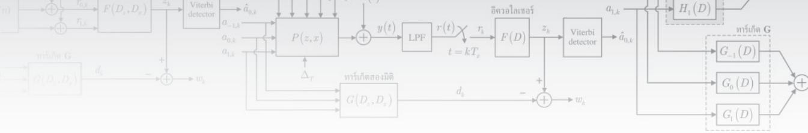

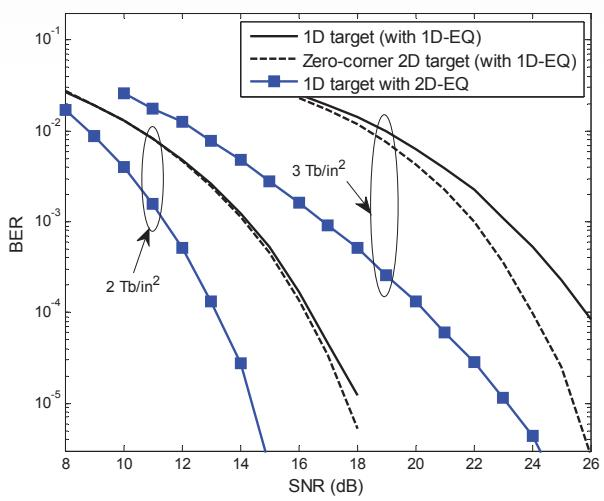  
รูปที่ 7.14 สมรรถนะของระบบที่ใช้อีควอไลเซอร์หนึ่งมิติและสองมิติ

ถึงแม้ว่าอีควอไลเซอร์สองมิติจะมีสมรรถนะดีกว่าอีควอไลเซอร์หนึ่งมิติ แต่การใช้งาน อีควอไลเซอร์สองมิติจำเป็นต้องใช้กับระบบที่มี 3 หัวอ่านซึ่งสร้างได้ยากในทางปฏิบัติ (โดยเฉพาะ อย่างยิ่งถ้านำมาใช้กับระบบการบันทึกแบบแนวตั้งที่ใช้ในปัจจุบัน) อย่างไรก็ตามถ้าต้องการใช้อีควอ ไลเซอร์สองมิติกับระบบ BPMR ที่มีหัวอ่านเดียวก็สามารถทำได้ไม่ยาก โดยการใช้บัฟเฟอร์ (buffer หรือที่พักข้อมูล) เพื่อเก็บสัญญาณอ่านกลับ 3 สัญญาณ (นั่นคือระบบจะอ่านข้อมูล 3 ครั้ง) จากนั้น จึงนำสัญญาณอ่านกลับทั้ง 3 สัญญาณมาประมวลผลรวมกันโดยใช้อีควอไลเซอร์สองมิติ ทั้งนี้เป็น เพราะว่าไอแลนด์แต่ละไอแลนด์ในระบบ BPMR มีตำแหน่งที่แน่นอนในสื่อบันทึก ดังนั้นการเข้า จังหวะ (synchronization) สัญญาณอ่านกลับทั้ง 3 สัญญาณจึงทำได้ไม่ยาก [108]

## 7.7.2 ผลกระทบของสัญญาณรบกวนสื่อบันทึกและแทร็กมิสเรจิสเตรชัน

ในส่วนนี้จะแสดงสมรรถนะของทาร์เก็ตสองมิติและอีควอไลเซอร์หนึ่งมิติในระบบ BPMR ที่มี ผลกระทบของสัญญาณรบกวนสื่อบันทึก (media ทoise) และแทร็กมิสเรจิสเตรชัน (TMR) ตาม ที่แสดงในรูปที่ 7.15 โดยใช้ช่องสัญญาณที่ต่อเนื่องทางเวลา $P ( z , x )$ ในสมการ (6.15) เมื่อรวม ผลกระทบของสัญญาณรบกวนสื่อบันทึก และใช้สมการ (6.21) เมื่อรวมผลกระทบของ TMR ใน ที่นี้สัญญาณอ่านกลับที่ได้จากหัวอ่านมีค่าเท่ากับ

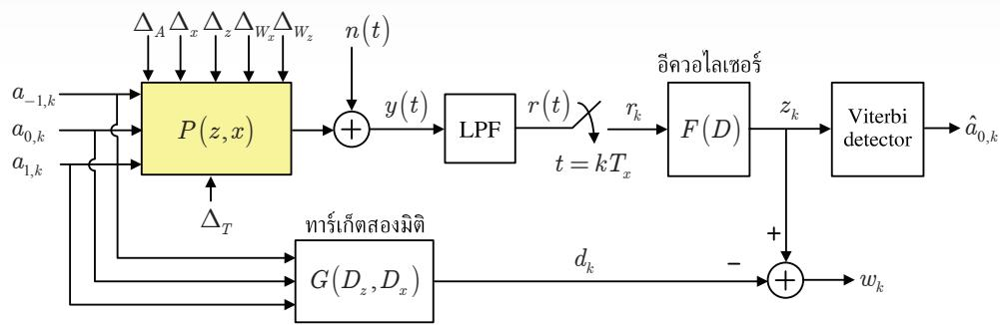  
รูปที่ 7.15 แบบจำลองช่องสัญญาณ BPMR แบบหนึ่งหัวอ่านที่รวมผลกระทบของสัญญาณรบกวนสื่อบันทึก และแทร็กมิสเรจิสเตรชัน

$$
y \left( t \right) = \sum _ { m = - 1 } ^ { 1 } \sum _ { n = - 1 } ^ { 1 } a _ { m , n } P \left( - m T _ { z } - \Delta _ { T } , t - n T _ { x } \right) + n \left( t \right)\tag{7.75}
$$

เมื่อ $n ( t )$ คือสัญญาณรบกวน AพGN ที่มีความหนาแน่นสเปกตรัมกำลังแบบสองด้านเท่ากับ $N _ { 0 } / 2$ จากนั้นสัญญาณอ่านกลับ $y ( t )$ จะถูกชักตัวอย่าง ณ เวลา $t = k T _ { x }$ ทำให้ได้เป็นลำดับข้อมูล $r _ { k }$ จากนั้นก็จะใช้ข้อมูลอินพุต $\{ a _ { m , k } \}$ และ $\{ r _ { k } \}$ ในการออกแบบอีควอไลเซอร์หนึ่งมิติขนาด 15 แท็ป และทาร์เก็ตสองมิติขนาด $3 \times 3$ แบบต่างๆ นอกจากนี้ค่า SNR ที่ใช้เป็นไปตามสมการ (7.70) เมื่อ $\sigma ^ { 2 } = N _ { 0 } / ( 2 T )$

รูปที่ 7.16 แสดงสมรรถนะของระบบที่ใช้ทาร์เก็ตแบบต่างๆ ณ ความรุนแรงของสัญญาณ รบกวนสื่อบันทึกระดับต่างๆ ที่ความจุ 3 Th/in2 เมื่อเส้นแกน y คือค่า รNR ที่ระบบต้องใช้เพื่อ ทำให้มี $\mathrm { B E R } = \mathrm { 1 0 } ^ { - 4 }$ จากรูปพบว่าระบบที่ใช้ "1D tareะt" มีสมรรถนะด้อยสุด ในขณะที่ระบบที ใช้ "Asymmetric 2D target" มีสมรรถนะดีสุด โดยเฉพาะอย่างยิ่งเมื่อสัญญาณรบกวนสื่อบันทึก มีความรุนแรงมาก ในทำนองเดียวกันรูปที่ 7.17 แสดงสมรรถนะของระบบที่ใช้ทาร์เก็ตแบบต่างๆ ณ ความรุนแรงของ TMR ระดับต่างๆ ที่ความจุ 3 Tb/in2 ซึ่งพบว่าระบบที่ใช้ "Asymmetric 2D target" มีสมรรถนะดีกว่าระบบที่ใช้ทาร์เก็ตแบบอื่นๆ นอกจากนี้เมื่อ TMR มีความรุนแรงมาก ก็ จะส่งผลทำให้ช่องสัญญาณมีลักษณะไม่สมมาตรมากขึ้น จึงทำให้ทาร์เก็ตแบบสมมาตรมีสมรรถนะ ด้อยกว่าทาร์เก็ตที่มีมุมเป็นศูนย์

## 7.7.3 สมรรถนะของระบบ BPMR แบบวนซำ

จากที่อธิบายในหัวข้อที่ 4.6.2 ระบบที่ใช้เทคนิคการถอดรหัสแบบวนซ้ำ (ซึ่งเป็นการทำงานร่วมกัน ระหว่างวงจรตรวจหาแบบซอฟต์และวงจรถอดรหัสแอลดีพีซี) [3, 21] สามารถช่วยเพิ่มสมรรถนะ

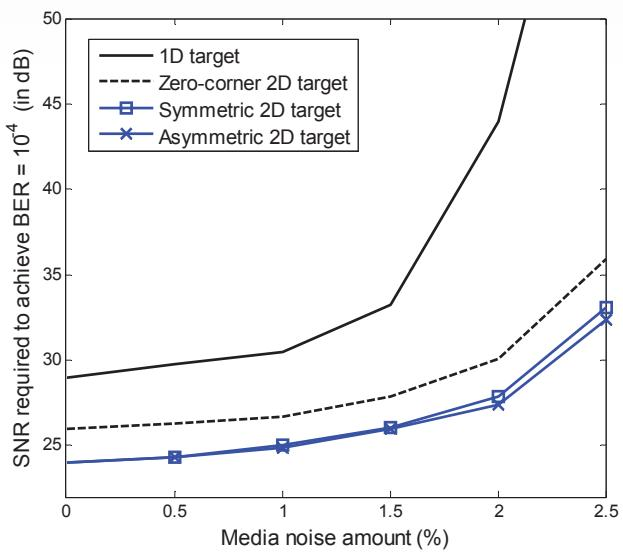  
รูปที่ 7.16 สมรรถนะของระบบที่ใช้ทาร์เก็ตแบบต่างๆ ที่มีผลกระทบของสัญญาณรบกวนสื่อบันทึก

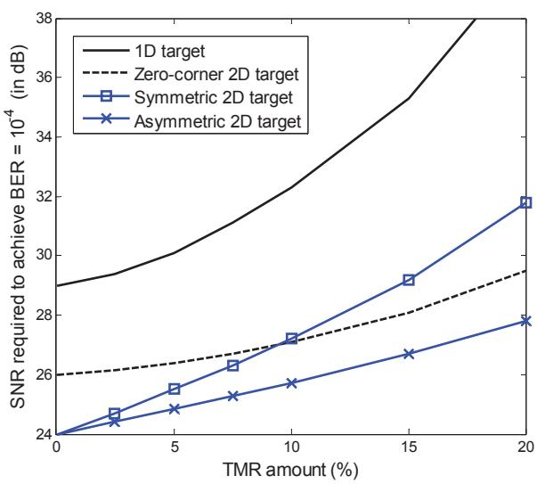  
รูปที่ 7.17 สมรรถนะของระบบที่ใช้ทาร์เก็ตแบบต่างๆ ที่มีผลกระทบของแทร็กมิสเรจิสเตรชัน  
ของระบบได้ค่อนข้างมาก เมื่อเทียบกับระบบทีไม่ใช้เทคนิคการถอดรหัสแบบวนซ้ำ ดังนั้นในส่วนนี้ ซี จะแสดงสมรรถนะของระบบ BPMR ที่ใช้เทคนิคการถอดรหัสแบบวนซำนี

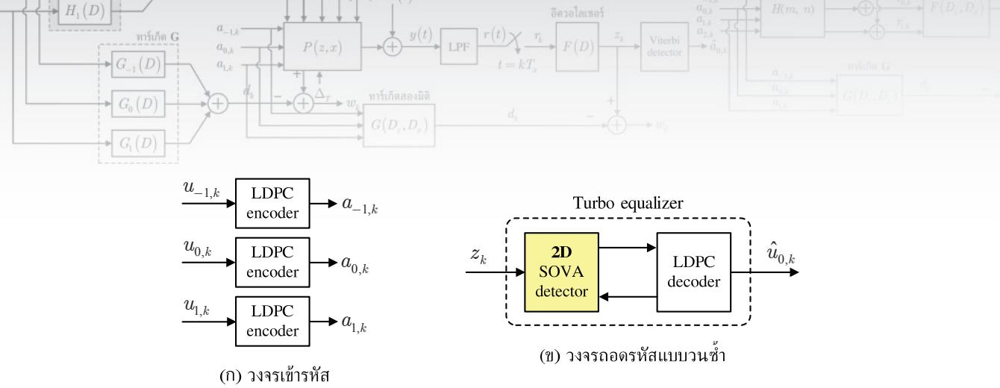  
รูปที่ 7.18 (0) วงจรเข้ารหัส และ (ข) วงจรถอดรหัส ที่ต่อเพิ่มเข้าไปในระบบ BPMR ในรูปที่ 7.2

เนื่องจากเทคนิคการถอดรหัสแบบวนซ้ำต้องใช้กับระบบที่ถูกเข้ารหัส (coded system) ดังนั้นระบบ BPMR ที่ไม่ถูกเข้ารหัส (uncoded system) ในรูปที่ 7.2 สามารถทำให้เป็นระบบที ถูกเข้ารหัสได้โดยการเพิ่มวงจรเข้ารหัสและวงจรถอดรหัสที่แสดงในรูปที่ 7.18 เข้าไปในรูปที่ 7.2 นั้นคือ ณ วงจรภาคส่ง บิตข่าวสาร (message bits) ของแต่ละแทร็ก $\{ u _ { m , k } \}$ สำหรับ $m \in \{ 0 , \pm 1 \}$ จำนวน 3640 บิตต่อแทร็ก ถูกเข้ารหัสด้วยรหัสแอลดีพีซีปรกติแบบ (3, 27) ที่มีอัตรารหัสเท่ากับ 8/9 [17] ทำให้เป็นลำดับข้อมูลของแต่ละแทร็ก $\{ a _ { m , k } \}$ ขนาด 409ร บิตต่อแทร็ก ดังแสดงในรูปที 7.18 (ก) เมื่อเมทริกซ์พาริตีเช็กในแต่ละหลักมีเลขหนึ่งจำนวน 3 ตัว และในแต่ละแถวมีเลขหนึ่ง จำนวน 27 ตัว จากนันลำดับข้อมูล $\{ a _ { m , k } \}$ ก็จะถูกป้อนเข้าช่องสัญญาณ H ตามรูปที่ 7.2 ในขณะที ณ วงจรภาครับ ข้อมูลเอาต์พุตของอีควอไลเซอร์ $z _ { k }$ ในรูปที่ 7.2 จะถูกป้อนเข้าไปในอีควอไลเซอร์ แบบเทอร์โบ [21] ตามที่แสดงในรูปที่ 7.18 (ข) ซึ่งเป็นการทำงานร่วมกันระหว่างวงจรตรวจหา SOVA แบบสองมิติ (2D-S0VA detector) [120] และวงจรถอดรหัสแอลดีพีซี โดยการถอดรหัส แอลดีพีซีจะอยู่บนพื้นฐานของอัลกอริทึ่มการผ่านข่าวสาร (Meรรage-Passing) [17] ที่มีการวนซ้ำ ภายในจำนวน 3 รอบ ก็จะได้เป็นค่าประมาณของบิตข่าวสารของแทร็กกลางหรือ $\hat { u } _ { 0 , k }$ ตามที่ต้องการ

ตรวจหา รOVA แบบสองทิศทาง (bi-directional รOVA) [42] ตามที่อธิบายในหัวข้อที่ 3.5 เพียงแต่แผนภาพเทรลลิสที่ใช้ในวงจรตรวจหา 2D-ร0VA จะมีจำนวนสถานะ Q มากขึ้น, มีเส้น สาขามากกว่าสองเส้นที่วิ่งออกจากแต่ละสถานะ, หรือมีเส้นสาขามากกว่าหนึ่งเส้นในแต่ละการ เปลี่ยนสถานะจากสถานะ น ไปยังสถานะ $q$ (เหมือนกับแผนภาพเทรลลิสที่ใช้ในวงจรตรวจหา วีเทอร์บิสองมิติ) ซึ่งึ้นอยู่กับลักษณะของทาร์เก็ตสองมิติที่ใช้ในระบบ อย่างไรก็ตามถ้าระบบ BPMR ใช้ทาร์เก็ตหนึ่งมิติ (1D target) อีควอไลเซอร์แบบเทอร์โบก็จะใช้วงจรตรวจหา SOVA [19, 42] (แบบปรกติหรือแบบสองทิศทางก็ได้ ตามที่อธิบายในหัวข้อที่ 3.4 และ 3.5) แทนวงจรตรวจหา 2D-SOVA

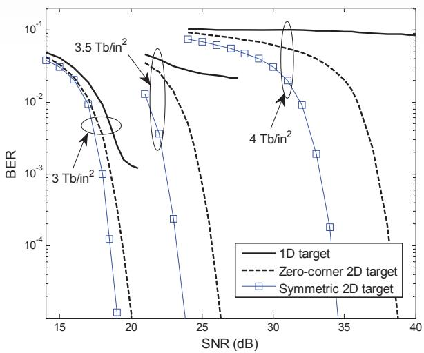  
รูปที่ 7.19 สมรรถนะของระบบ BPMR แบบวนซ้ำที่ใช้ทาร์เก็ตแบบต่างๆ ณ การวนซ้ำรอบที่ห้า

การทดลองต่อไปนี้จะเปรียบเทียบสมรรถนะของระบบ BPMR แบบวนซ้ำที่ใช้ทาร์เก็ต 3 แบบคือ 1D target, Zero-corner 2D target, และ Symmetric 2D target โดยอีควอไลเซอร์ที่ใช้ จะมีจำนวนแท็ปเท่ากับ 15 แท็ป และค่า รNR จะนิยามโดย

$$
\mathrm { S N R } = 1 0 \log _ { 1 0 } \left( \frac { 1 } { R \sigma ^ { 2 } } \right)\tag{7.76}
$$

มีหน่วยเป็นเดซิเบล (dB) เมื่อ $\sigma ^ { 2 } = N _ { 0 } / ( 2 T )$ และ R= 8/9 คืออัตรารหัสแอลดีพีซี รูปที่ 7.19 เปรียบเทียบสมรรถนะของระบบ BPMR แบบวนซ้ำที่ใช้ทาร์เก็ตแบบต่างๆ ณ การวนซ้ำรอบที่ห้า ซึ่งจะพบว่าระบบที่ใช้ "Symmetric 2D target" มีสมรรถนะดีกว่าระบบที่ใช้ "Zero-corner 2D target" และ "1D target" โดยเฉพาะอย่างยิ่งเมื่อความจุข้อมูลสูงๆ

## 7.8 สรุปท้ายบท

ในทางปฏิบัติวงจรตรวจหา PRML ยังสามารถนำมาใช้ในการตรวจหาข้อมูลของระบบ BPMR ได้ เช่นเดียวกับระบบการบันทึกข้อมูลที่ใช้กันทั่วไปในปัจจุบัน อย่างไรก็ตามสมรรถนะของวงจรตรวจหา PRML จะขึ้นอยู่กับความเหมาะสมของทาร์เก็ตและอีควอไลเซอร์ที่ใช้ในระบบ ดังนั้นในบทนี้จึง ได้อธิบายวิธีการออกแบบทาร์เก็ตหนึ่งมิติและสองมิติ และอีควอไลเซอร์หนึ่งมิติและสองมิติ แบบ ต่างๆ สำหรับใช้งานในแต่ละสถานการณ์ ทั้งนี้เป็นเพราะว่าทาร์เก็ตและอีควอไลเซอร์ที่ดีสามารถ ช่วยลดผลกระทบที่เกิดจาก ISI และ ITI ในระบบ BPMR ได้อย่างมีประสิทธิภาพ

จากการทดลองพบว่า "1D target" เหมาะสำหรับใช้ในระบบที่มีความจุข้อมูลน้อย (≤ 2.5 Tb/in2), "Zero-corner 2D target" เหมาะสำหรับใช้ในระบบที่มีความจุข้อมูลปานกลาง (2.5 – 3 Tb/in2), และ"Symmetric 2D target" และ "Asymmetric 2D target" เหมาะสำหรับใช้ในกับ ระบบที่มีความจุข้อมูลสูงๆ (≥ 3 Tb/in2) นอกจากนี้ยังพบว่า "Symmetric 2D target" ไม่เหมาะ สำหรับใช้ในระบบที่มีผลกระทบของแทร็กมิสเรจิสเตรชัน และอีควอไลเซอร์สองมิติมีสมรรถนะ ดีกว่าอีควอไลเซอร์หนึ่งมิติ แต่ต้องใช้กับระบบที่มี 3 หัวอ่าน ซึ่งยังคงทำได้ยากในทางปฏิบัติ

## 7.9 แบบฝึกหัดท้ายบท

1. จงเขียนโปรแกรม SCILAB เพื่ออกแบบ

1.1) ทาร์เก็ตหนึ่งมิติและอีควอไลเซอร์หนึ่งมิติ

1.2) ทาร์เก็ตสองมิติที่มีมุมเป็นศูนย์และอีควอไลเซอร์หนึ่งมิติ

1.3) ทาร์เก็ตสองมิติแบบสมมาตรและอีควอไลเซอร์หนึ่งมิติ

1.4) ทาร์เก็ตสองมิติแบบอสมมาตรและอีควอไลเซอร์หนึ่งมิติ

1.5) ทาร์เก็ตสองมิติและอีควอไลเซอร์สองมิติ

2. จงเปรียบเทียบความแตกต่างระหว่างอีควอไลเซอร์หนึ่งมิติและอีควอไลเซอร์สองมิติ

3.จงวาดแผนภาพเทรลลิสโดยละเอียด (แสดงสถานะ เส้นสาขา และข้อมูลประจำเส้นสาขาทั้งหมด) เมื่อข้อมูลอินพุตคือ {-1, 1} ของ

3.1) ทาร์เก็ตสองมิติที่มีมุมเป็นศูนย์แบบสมมาตรที่กำหนดโดยสมการ (7.64)

3.2) ทาร์เก็ตสองมิติแบบสมมาตรที่กำหนดโดยสมการ (7.67)

3.3) ทาร์เก็ตสองมิติแบบอสมมาตรที่กำหนดโดยสมการ (7.15)

4. จงอธิบายหลักการทำงานของวงจรตรวจหา 2D-รOVA โดยละเอียด พร้อมทั้งยกตัวอย่างการ คำนวณ สำหรับ

4.1) ทาร์เก็ตสองมิติที่มีมุมเป็นศูนย์แบบสมมาตร

4.2) ทาร์เก็ตสองมิติแบบสมมาตร

# บทที่ 8 เทคโนโลยี HAMR

จากที่กล่าวในบทที่ 6 เทคโนโลยี BPMR เป็นหนึ่งในหลายๆ เทคโนโลยีที่อาจจะนำมาใช้เพิ่มความจุ ข้อมูลในฮาร์ดดิสก์ไดรฟ์ให้ได้มากกว่า 1 Tb/in2 [117] แต่ในปัจจุบันนักวิจัยกำลังแก้ไขปัญหา ต่างๆ ที่เกี่ยวข้องกับการสร้างระบบ BPMR ขึ้นมาใช้งานจริง เช่น การสร้างสื่อบันทึกที่มีการทำแบบ (bit-patterned media), การแก้ปัญหาข้อผิดพลาดในการเขียน (written-in error) และอื่นๆ เพราะ ฉะนั้นจึงเป็นไปได้ว่าเทคโนโลยี BPMR อาจจะยังไม่นำมาใช้งานได้จริงในฮาร์ดดิสก์ไดรฟ์ภายใน ระยะเวลาอันใกล้นี้

สำหรับในบทนี้จะก่าวถึงพื้นฐานเทคโนโลยีการบันทึกเิงแ่เหล็กทีใช้ความร้นเข้าช่วย53 4 (HAMR: heat-assisted magnetic recording) หรือเรียกสั้นๆ ว่า "เทคโนโลยี HAMR" [78, 128, 129] ซึ่งถือเป็นอีกเทคโนโลยีหนึ่งที่กำลังเป็นที่สนใจของบริษัทผู้ผลิตฮาร์ดดิสก์ไดรฟ์ทั่วโลก เพราะนอกจากช่วยเพิ่มความจุข้อมูลได้มากกว่า 1 Tอ/in2 แล้ว ยังสามารถนำมาใช้งานจริงในฮาร์ด ดิสก์ไดรฟ์ได้ภายในระยะเวลาอันใกล้นี้ (คาดว่าจะนำมาใช้งานก่อนเทคโนโลยี BPMR) นอกจากนี้ ในบทนี้จะอธิบายหลักการทำงานและแบบจำลองช่องสัญญาณของระบบ HAMR เพื่อให้ผู้อ่าน ทราบถึงประเด็นต่างๆที่เกี่ยวข้องกับการนำระบบ HAMR มาใช้งานจริง รวมทั้งแสดงตัวอย่าง การจำลองระบบ HAMR แบบแนวนอน54 (longitudinal HAMR system) และแบบแนวตั้ง (perpendicular HAMR system) [130 – 134] เพือศึกษาสมรรถนะของระบบ เมือเทียบกับ พารามิเตอร์ต่างๆ เช่น ตำแหน่งของเลเซอร์ ลักษณะของหัวเขียนและหัวอ่าน และคุณสมบัติทาง แม่เหล็กของสือบันทึก เป็นต้น

## 8.1 บทนำ

การเพิ่มความจุข้อมูลของฮาร์ดดิสก์ไดรฟ์ทำได้โดยการลดพื้นที่ (หรือปริมาตร) การจัดเก็บข้อมูล หนึ่งบิตภายในสื่อบันทึก โดยทั่วไปสื่อบันทึกประกอบด้วยเกรนเชิงแม่เหล็กขนาดเล็กจำนวนมาก รวมตัวกันเป็นอนุภาค (pลrticle) ที่มีปริมาตร V โดยที่แต่ละเกรนจะมีค่าสัมประสิทธิ์แอนไอโซทรอปี แบบแกนเดียว $K _ { u }$ (uniaxial anisotropy coefficient) ซึ่งถ้า $K _ { u }$ มีค่ามาก ก็จะทำให้ยากต่อการ เปลี่ยนแปลงทิศทางสภาพความเป็นแม่เหล็ก (magnetization) ของบิตข้อมูล

ในทางปฏิบัติพลังงานแอนไอโซทรอปีของแต่ละอนุภาคมีค่าเท่ากับ $E _ { p } = K _ { u } V$ ซึ่งใช้ เป็นตัววัดเสถียรภาพของอนุภาค [43] กล่าวคือถ้ากำหนดให้พลังงานเชิงความร้อนที่เกิดขึ้นจาก สภาพแวดล้อมมีค่าเท่ากับ $E _ { T } = k _ { B } T$ เมื่อ $k _ { B }$ คือค่าคงตัวโบลตซ์แมน (Boltzmann's constant) มีค่าเท่ากับ $1 . 3 8 \times 1 0 ^ { - 2 3 }$ จูลต่อเคลวิน (joules per Kelvin) และ $T$ คืออุณหภูมิ (temperature) มีหน่วยเป็นเคลวิน ดังนั้นบิตข้อมูลที่เก็บอยูในสื่อบันทึกจะมีเสถียรภาพ ก็ต่อเมื่อ

$$
\frac { E _ { P } } { E _ { T } } = \frac { K _ { u } V } { k _ { B } T } \ge \beta\tag{8.1}
$$

เมื่อ $\beta$ คือจำนวนเต็มบวกที่มีค่ามาก (เช่น $\beta \ge 6 0 )$ โดยทั่วไปสมการ (8.1) จะบอกถึงขีดจำกัดของ การเพิ่มความหนาแน่นเชิงพื้นที่ (areal deกรity) หรือความจุข้อมูลของฮาร์ดดิสก์ไดรฟ์ ซึ่งเรียกกัน ทั่วไปว่า "ขีดจำกัดซูเปอร์พาราแมกเนด์ $\widehat { \vartheta } \widetilde { 1 } \widetilde { 1 } ^ { 5 5 }$ (superparamagnetic limit)" [1, 43]

เนื่องจากค่า $k _ { B } T$ ในสมการ (8.1) เป็นค่าคงตัว ดังนั้นวิธีการเพิ่มความจุข้อมูลโดยการลด ปริมาตร V จึงจำเป็นต้องใช้งานกับสื่อบันทึกที่มีค่า $K _ { u }$ สูงมากขึ้น เพื่อให้ $K _ { u } V$ มีค่าคงเดิมและ สอดคล้องกับสมการ (8.1) อย่างไรก็ตามในทางปฏิบัติค่า $K _ { u }$ จะแปรผันตรงกับ "ค่าสภาพลบล้าง แม่เหล็ก $H _ { c }$ (coercivity)" [43] ซึ่งหมายถึงปริมาณสนามแม่เหล็กที่ต้องใช้เพื่อทำให้สภาพความ เป็นแม่เหล็กของบิตข้อมูลมีทิศทางเปลี่ยนแปลงไปในทิศตรงข้าม56 เพราะฉะนั้นเมื่อ $K _ { u }$ มีค่ามาก ก็หมายความว่า $H _ { c }$ มีค่ามากด้วย ซึ่งผลที่ตามมาก็คือหัวเขียนจะต้องใช้สนามแม่เหล็กที่มีความเข้ม สูงมาก (มากกว่าค่า $H _ { c } )$ ในการเขียนบิตข้อมูลลงไปจัดเก็บในสื่อบันทึกได้อย่างมีเสถียรภาพ นอกจากนีวิธีการเพิ่มความจุข้อมูลโดยการลดปริมาตร V ก็ควรคำนึ่งถึงความเข้มของสนามแม่เหล็ก มากสุดที่หัวเขียนในปัจจุบันสามารถสร้างได้ด้วย เพราะจะเป็นตัวจำกัดค่ามากสุดของ $K _ { u }$ (หรือ $H _ { c } )$

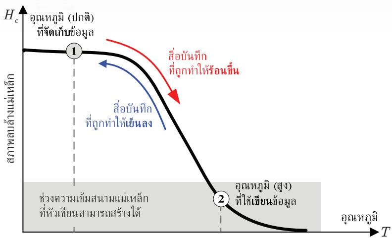  
รูปที่ 8.1 กระบวนการเขียนข้อมูลของระบบ HAMR

ที่ระบบสามารถรองรับได้ ดังนั้นอาจสรุปได้ว่าความหนาแน่นเชิงพื้นที่สูงสุดของเทคโนโลยีการบันทึก 2 ปุ่ป นๆ แบบแนวตั้งที่ใช้ในฮาร์ดดิสก์ไดรฟ์ปัจจุบันจะถูกกำหนดด้วยปัจจัยที่สำคัญสองอย่างคือ ขีดจำกัด ซูเปอร์พาราแมกเนติก และความเข้มของสนามแม่เหล็กมากสุดที่หัวเขียนสามารถสร้างได้

## 8.2 หลักการเขียนข้อมูลของระบบ HAMR

เทคโนโลยี HAMR ถือเป็นเทคโนโลยีหนึ่งที่สามารถช่วยเพิ่มความหนาแน่นเชิงพื้นที่ได้มากกว่า ขีดจำกัดของเทคโนโลยีการบันทึกแบบแนวตั้งที่กำลังใช้ในฮาร์ดดิสก์ไดรฟ์ปัจจุบัน โดยเทคโนโลยี HAMR อาศัยประโยชน์ของความจริงที่ว่า "สภาพลบล้างแม่เหล็ก H, จะแปรผกผันกับอุณหภูมิ" ตามที่แสดงในรูปที่ 8.1 กล่าวคือค่าสภาพลบล้างแม่เหล็กของสื่อบันทึกจะลดลง เมื่อสื่อบันทึ่กนั้น ถูกทำให้มีอุณหภูมิสูง (หรือถูกทำให้ร้อน) และในทางกลับกัน

ถ้ากำหนดให้ "บริเวณ A" คือบริเวณที่ต้องการจะเขียนบิตข้อมูลลงไปจัดเก็บในสื่อบันทึก   
ดังนั้นกระบวนการเขียนข้อมูลในระบบ HAMR สามารถอธิบายได้ดังนี้ เริ่มต้นบริเวณ A จะมี ญ   
อุณหภูมิปกติ (หรืออุณหภูมิห้อง) ณ ตำแหน่งหมายเลข 1 ในรูปที่ 8.1 ึ่งมีค่า H, สูง จากนั้น   
ระบบ HAMR จะทำการเพิ่มความร้อนให้กับบริเวณ A เช่น การใช้แสงเลเซอร์ยิงเข้าไปตรงบริเวณ A   
ก็จะทำให้บริเวณ A มีอุณหภูมิสูงขึ้นเรื่อยๆ จนมาถึง ณ ตำแหน่งหมายเลข 2 ซึ่งมีค่า H, น้อยกว่า   
ความเข้มของสนามแม่เหล็กที่หัวเขียนสามารถสร้างได้ (จึงทำให้เขียนบิตข้อมูลเข้าไปในบริเวณ A   
ได้ง่าย โดยใช้ความเข้มของสนามแม่เหล็กไม่มาก) จากนั้นก็ทำการเขียนบิตข้อมูลเข้าไปในบริเวณ A

และเมื่อเขียนบิตข้อมูลเสร็จเรียบร้อยแล้ว ระบบ HAMR จะทำให้บริเวณ A เย็นตัวลงอย่างรวดเร็ว จนกลับเข้าสู่อุณหภูมิปกติ ณ ตำแหน่งหมายเลข 1 ที่มีค่า H สูง ซึ่งมีผลทำให้บิตข้อมูลที่เขียน เข้าไปจัดเก็บในบริเวณ A มีเสถียรภาพสูง (ไม่มีปัญหาเรื่องขีดจำกัดซูเปอร์พาราแมกเนติก)

โดยทั่วไปเทคโนโลยี HAMR จะต้องถูกนำมาใช้ร่วมกับระบบการบันทึกเชิงแม่เหล็กแบบ ที่ใช้กันทั่วไป57 เพื่อเพิ่มความจุข้อมูลให้มากกว่าเดิมหลายเท่า [128, 129] โดยกระบวนการเขียน ข้อมูลลงไปจัดเก็บในสื่อบันทึกจะเป็นไปตามที่อธิบายข้างต้น แต่สำหรับกระบวนการอ่านและการ ถอดรหัสข้อมูล จะยังคงเหมือนกับที่ใช้อยูในระบบการบันทึกเชิงแม่เหล็กแบบที่ใช้กันทั่วไป (นั้นคือ ยังคงใช้หัวอ่านและวงจรภาครับแบบเดิมที่ใช้ในฮาร์ดดิสก์ไดรฟ์ปัจจุบัน) เพราะฉะนั้นจะเห็นได้ว่า หลักการทำงานของเทคโนโลยี HAMR ดูเหมือนง่าย แต่ในทางปฏิบัติการนำเทคโนโลยี HAMR มาใช้งานจริงจะต้องรอส่วนประกอบอื่นๆ ที่กำลังพัฒนาอยู่ในขณะนี้ เช่น ระบบนำส่งแสง (light delivery system), หัวเขียนแบบ thermo-magnetic, ส่วนต่อประสานระหว่างหัวเขียนและจาน บันทึก (head-disk interface), และระบบทำความเย็น (cooling system) ที่สามารถทำให้บริเวณ ที่เขียนบิตข้อมูลลงไปในสื่อบันทึกมีอุณหภูมิลดลงอย่างรวดเร็ว (ภายใน 1 นาโนวินาที [132]) เป็นต้น [128, 135] อย่างไรก็ตามการออกแบบส่วนประกอบต่างๆ เหล่านี้เพื่อให้ระบบมีสมรรถนะ สูงสุดยังจะต้องคำนึงถึงการหาค่าเหมาะที่สุด (optiทization) ในภาพรวมของทั้งระบบด้วย

## 8.3 พื้นฐานแบบจำลองวิลเลียม-คอมสต็อกเชิงความร้อน

แบบจำลองวิลเลียม-คอมสต็อก (Williams-Comstock model) [136] เป็นแบบจำลองเชิงวิเคราะห์ ที่ใช้อธิบายลักษณะเฉพาะของการเปลี่ยนสถานะ58 (tranรition characteristics) ที่เกิดจากการเขียน บิตข้อมูลลงไปจัดเก็บในสื่อบันทึกของระบบการบันทึกเชิงแม่เหล็กแบบแนวนอน อย่างไรก็ตาม ในปี ค.ศ. 2004 Raนรch et al. [131] ได้นำเสนอวิธีการรวมผลกระทบที่เกิดจากความร้อนหรือ เกรเดียนต์เชิงความร้อน (thermal gradient) เข้าไปในแบบจำลองนี้ เพื่อใช้หาลักษณะเฉพาะของ การเปลี่ยนสถานะของระบบ HAMR แบบแนวนอน โดยแบบจำลองใหม่ที่ได้จะเรียกว่า "แบบจำลอง วิลเลียม-คอมสต็อกเชิงความร้อน (thermal Williams-Comstock model)" ซึงทำให้ทราบถึงผล กระทบของการทำให้สื่อบันทึกมีอุณหภูมิสูงขึ้นที่มีต่อสภาพลบล้างแม่เหล็ก H และสภาพแม่เหล็ก ตกค้าง (remanent magnetization) M, [43, 137] ในสือบันทึก

ในหัวข้อนี้จะอธิบายหลักการทำงานของแบบจำลองวิลเลียม-คอมสต็อกเชิงความร้อน เพื่อให้ผู้อ่านทราบถึงกลไกต่างๆ ที่เกี่ยวข้องกับการพัฒนาแบบจำลองนี้ขึ้นมา รวมทั้งสามารถนำไป ใช้จำลองระบบ (simนlatioก) เพื่อศึกษาลักษณะเฉพาะด้านต่างๆ ของระบบ HAMR

## 8.3.1 โพรไฟล์อุณหภูมิ

4ู่สี ในระบบ HAMR เมื่อสื่อบันทึกถูกทำให้ร้อนด้วยเลเซอร์ สภาพลบล้างแม่เหล็ก $H _ { c }$ ของสื่อบันทึก จะมีลักษณะการกระจายแบบเกาส์เซียน (Gauรsรiลท distribนtion) และถ้าสื่อบันทึกไม่มีการเคลื่อนที่ อุณหภูมิในจานบันทึก $T ( x )$ ก็จะมีลักษณะการกระจายแบบเกาส์เซียนเช่นกัน หรือมีโพรไฟล์ อุณหภูมิ (temperature profile) เท่ากับ

$$
T \left( \boldsymbol { x } \right) = T _ { \mathrm { p e a k } } \exp \left( - \frac { r ^ { 2 } } { 2 \sigma _ { t } ^ { 2 } } \right) + 3 0 0\tag{8.2}
$$

มีหน่วยเป็นเคลวิน (K: kelvin) เมื่อ $T _ { \mathrm { p e a k } }$ คืออุณหภูมิสูงสุดที่ใช้มีหน่วยเป็นองศาเซลเซียส $( ^ { \circ } \mathrm { C } )$ r คือระยะทางจากจุดศูนย์กลางของโพรไฟล์อุณหภูมิไปยังตำแหน่งที่สนใจมีหน่วยเป็นนาโนเมตร (nm), ${ \sigma } _ { t } = \mathrm { F W H M } / 2 . 3 5$ FWHM (full width half max) คือความกว้างของโพรไฟล์อุณหภูมิ ณ ตำแหน่งที่อุณหภูมิมีค่าเป็นครึ่งหนึงของอุณหภูมิสูงสุดมีหน่วยเป็นนาโนเมตร [131], และ 300 คือค่าอุณหภูมิห้องมีหน่วยเป็นเคลวิน นอกจากนี้ถ้ากำหนดให้จุดศูนย์กลางของโพรไฟล์อุณหภูมิ อยู่ที่จุดกำเนิด ณ ตำแหน่ง (0, 0) ในระบบพิกัดคาร์ทีเซียน (Cartesian coordinate system) ก็ จะได้ว่า $r ^ { 2 } = x ^ { 2 } + z ^ { 2 }$ โดยที่ x และ z คือทิศทางในแนวตามแทร็ก (along-track) และทิศทางใน แนวขวางแทร็ก (cross-track) ตามลำดับ ดังนั้นสมการ (8.2) เขียนใหม่ได้เป็น

$$
T ( x ) = T _ { \mathrm { p e a k } } \exp \left( - \frac { z ^ { 2 } } { 2 \sigma _ { t } ^ { 2 } } \right) \exp \left( - \frac { x ^ { 2 } } { 2 \sigma _ { t } ^ { 2 } } \right) + 3 0 0\tag{8.3}
$$

รูปที่ 8.2 แสดงโพรไฟล์อุณหภูมิที่ได้จากสมการ (8.3) สำหรับ $\sigma _ { t } = 3 8 2$ nm และ $T _ { \mathrm { p e a k } } = 2 0 0 ^ { \circ } \mathrm { C }$ ซึ่งแสดงให้เห็นถึงลักษณะการกระจายของอุณหภูมิทั้งในแนวตามแทร็กและในแนวขวางแทร็ก อย่างไรก็ตามล้าไม่พิจารณาการกระจายของอุณหภู่มิในแนวขวางแทร็ก ก็จะได้ว่าการกระจาย ของอุณหฎูมิบนสื่อบันทึกในแนวตามแทร็กมีค่าเท่ากับ

$$
T \left( x \right) = T _ { \mathrm { w r i t e } } \exp \left( - \frac { \left( x - c \right) ^ { 2 } } { 2 \sigma _ { t } ^ { 2 } } \right) + 3 0 0\tag{8.4}
$$

  
รูปที่ 8.2 โพรไฟล์อุณหภูมิที่ได้จากสมการ (8.3) สำหรับ $\sigma _ { t } = 3 8 2$ nm และ $T _ { \mathrm { p e a k } } = 2 0 0 ~ ^ { \circ } \mathrm { C }$

เมื่อ c คือตำแหน่งในแนวตามแทร็ก ณ จุดศูนย์กลางของโพรไฟล์อุณหภูมิเมื่อเทียบกับจุดกำเนิด หรือจุดอ้างอิง (มีหน่วยเป็นนาโนเมตร) และ $T _ { \mathrm { w r i t e } }$ คืออุณหภูมิในขณะที่กำลังเขียนบิตข้อมูลลงไป ในสื่อบันทึก ซึ่งสัมพันธ์กับอุณหภูมิสูงสุดดังนี้

$$
T _ { \mathrm { w r i t e } } = T _ { \mathrm { p e a k } } \exp \biggl ( - \frac { z _ { 0 } ^ { 2 } } { 2 \sigma _ { t } ^ { 2 } } \biggr )\tag{8.5}
$$

โดยที่ $z _ { \mathrm { 0 } }$ คือตำแหน่งในแนวขวางแทร็กที่มีอุณหภูมิเท่ากับ $T _ { \mathrm { w r i t e } }$

หมายเหตุการวิเคราะห์ระบบ HAMR โดยใช้แบบจำลองวิลเลียม-คอมสต็อกเชิงความร้อนจะทำ การแบ่งแต่ละแทร็กออกเป็นหลายๆ แทร็กย่อย (ธub-track) หรือบางครั้งเรียกว่า "ไมโครแทร็ก (microtrack)" [130] ซึ่งในกรณีนี้ค่า $T _ { \mathrm { w r i t e } }$ จะหมายถึงอุณหภูมิของแต่ละไมโครแทร็กที่มีจุด ศูนย์กลางอยู่ที่ตำแหน่ง $z _ { 0 }$ (ศึกษารายละเอียดเกี่ยวกับแบบจำลองไมโครแทร็กที่ใช้ในระบบ HAMR ได้ในหัวข้อที่ 8.6)

## 8.3.2 ลูปฮิสเทอรีซิส

ลูปฮิสเทอรีซิส (Hyรtereรis loop) [1, 43] เป็นกราฟที่แสดงความสัมพันธ์ระหว่างสภาพความเป็น แม่เหล็กของสื่อบันทึก M และสนามแม่เหล็กรวมที่ใช้ (total magnetic field) $H _ { \mathrm { t o t } }$ กล่าวคือลูป ฮิสเทอรีซิสบอกให้ทราบว่าระบบจะต้องป้อนสนามแม่เหล็กเข้าไปในสื่อบันทึกเป็นปริมาณเท่าใด จึงจะทำให้บิตข้อมูลสามารถถูกจัดเก็บในสื่อบันทึกได้อย่างมีเสถียรภาพ ในทางปฏิบัติสื่อบันทึกที ใช้ในระบบการบันทึกเชิงแม่เหล็กแบบที่ใช้กันทั่วไปสามารถนิยามด้วยลูปฮิสเทอรีซิสเพียงลูปเดียว เนื่องจากทุกตำแหน่งบนสื่อบันทึกมีคุณสมบัติทางแม่เหล็กเหมือนกัน (มีค่าสภาพลบล้างแม่เหล็ก $H _ { c }$ เท่ากัน และถือว่ามีอุณหภูมิเท่ากัน) ดังนั้นการเขียนข้อมูลทำได้โดยระบบจะต้องป้อนสนาม แม่เหล็กรวม $H _ { \mathrm { t o t } }$ ให้มีค่ามากกว่าค่า $H _ { c }$ ของสื่อบันทึก เพื่อให้บิตข้อมูลถูกจัดเก็บในสื่อบันทึกได้ อย่างมีเสถียรภาพ และทำให้บริเวณที่เขียนบิตข้อมูลลงไปนั้นมีค่าสภาพความเป็นแม่เหล็กเท่ากับ $M _ { r }$ (หรือสภาพแม่เหล็กตกค้าง) ตามที่กำหนดโดยลูปฮิสเทอรีซิส

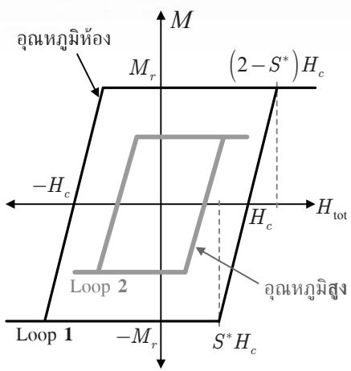  
(ก)

  
(ข)  
รูปที่ 8.3 (ก) ลูปฮิสเทอรีซิสหรือลูป M-H ณ อุณหภูมิปกติ (หรือ L00p 1) และอุณหภูมิสูง (หรือ Loop 2), และ (ข) ลูป M-h หรือลูป M-H ที่ถูกนอร์มอลไลซ์ด้วยค่าสัมบูรณ์ $\mid H _ { c } \mid$ ทำให้ได้เป็นสนามประสิทธิผล โดยสมมุติว่าค่า M และ h แปรผันตามอุณหภูมิ

อย่างไรก็ตามในระหว่างกระบวนการเขียนของระบบ HAMR สื่อบันทึกจะถูกทำให้ร้อน ด้วยเลเซอร์ที่ติดกับหัวเขียน ก่อนที่จะเขียนบิตข้อมูลลงไปจัดเก็บในสื่อบันทึก จากนั้นสื่อบันทึก ก็จะถูกทำให้เย็นตัวลงอย่างรวดเร็วจนมีอุณหภูมิห้อง ดังนั้นลูปฮิสเทอรีซิสที่ใช้อธิบายกระบวน การเขียนในระบบ HAMR จะมีสองลูปคือ L0op 1 และ Loop 2 ตามที่แสดงในรูปที่ 8.3 (ก) โดยที่ L00p 1 คือลูปฮิสเทอรีซิสของสื่อบันทึก ณ อุณหภูมิห้อง และ Lo0p 2 คือลูปฮิสเทอรีซิส ของสื่อบันทึกที่ถูกทำให้ร้อน (มีอุณหภูมิสูงกว่าอุณหภูมิห้องมาก) จากรูปที่ 8.3 (ก) จะพบว่าสื่อ บันทึกที่มีอุณหภูมิสูง ก็จะมีค่า $H _ { c }$ และ $M _ { r }$ ลดลง ซึ่งมีผลให้ระบบสามารถใช้สนามแม่เหล็กรวม $H _ { \mathrm { t o t } }$ ไม่มากในการเขียนบิตข้อมูลลงไปจัดเก็บในสื่อบันทึก

(0)  
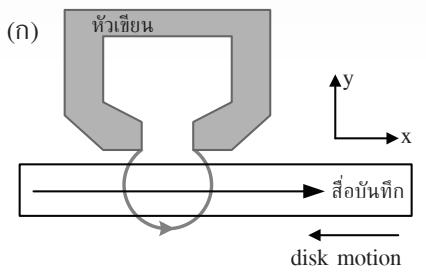

  
รูปที่ 8.4 กระบวนการเขียนข้อมูลแม่เหล็กแบบแนวนอน และตำแหน่งการเปลี่ยนสถานะ $x _ { 0 }$

## 8.3.3 แบบจำลองวิลเลียม-คอมสต็อก

พิจารณากระบวนการเขียนของระบบการบันทึกแบบแนวนอนในรูปที่ 8.4 เมื่อสื่อบันทึกเคลื่อนที ไปทางด้านซ้าย (ทิศทาง -X), เส้นลูกศรในสื่อบันทึกแสดงทิศทางของสภาพแม่เหล็กตกค้าง $M _ { r }$ และเส้นลูกศรที่ออกมาจากหัวเขียนแสดงทิศทางของสนามแม่เหล็กที่หัวเขียนสร้างขึน (applied magnetic filed) $H _ { h }$ โดยรูปที่ 8.4 (ก) แสดงการเริ่มต้นของระบบที่มีค่า $M _ { r }$ และ $H _ { h }$ ไปในทิศทาง +x จากนั้นเมื่อหัวเขียนมีการเปลี่ยนทิศทางของสนามแม่เหล็กไปในทิศทางตรงข้ามหรือ -x ตาม รูปที่ 8.4 (ข) ก็ทำให้เกิดการเปลี่ยนสถานะของสภาพความเป็นแม่เหล็ก (จาก +M, เป็น -M) ในสื่อบันทึก ณ ตำแหน่ง $x _ { 0 }$ ที่อยู่ทางด้านซ้ายของสนามเขียน และเมื่อสื่อบันทึกเคลื่อนที่ห่าง ออกไปจากหัวเขียนมากขึ้นตามรูปที่ 8.4 (ค) ก็จะทำให้การเปลี่ยนสถานะที่เกิดขึ้นในรูปที่ 8.4 (ข) ถูกจัดเก็บในสื่อบันทึก ณ ตำแหน่ง $x _ { 0 }$ คงเดิม

ในระหว่างที่มีการเปลี่ยนสถานะของสภาพความเป็นแม่เหล็กเกิดขึ้นในสื่อบันทึก สนาม แม่เหล็กรวม $H _ { \mathrm { t o t } }$ ที่ใช้เพื่อให้สามารถเขียนบิตข้อมูลลงไปจัดเก็บในสื่อบันทึกได้อย่างมีเสถียรภาพ ต้องมีค่าเท่ากับ

$$
H _ { \mathrm { t o t } } \left( x \right) = H _ { h } \left( x \right) + H _ { d } \left( x \right)\tag{8.6}
$$

โดยที่ $H _ { h }$ คือสนามแม่เหล็กของหัวเขียน (head field) และ $H _ { d }$ คือสนามลบล้างสภาพแม่เหล็ก (demลgnetizatioก feld) เนื่องจากสภาพความเป็นแม่เหล็กของสื่อบันทึกจะขึ้นอยู่กับสนามแม่เหล็ก รวม $H _ { \mathrm { t o t } }$ ด้วย เพราะฉะนั้นการกระจายของสภาพความเป็นแม่เหล็ก ณ ตำแหน่ง x ใดๆ ในแนว ตามแทร็กสามารถหาได้โดยการแก้สมการต่อไปนี้

$$
M \left( x \right) = M \left[ H _ { \mathrm { t o t } } \left( x \right) \right] = M \left[ H _ { h } \left( x \right) + H _ { d } \left( x \right) \right]\tag{8.7}
$$

นอกจากนี้สนามลบล้างสภาพแม่เหล็ก $H _ { d }$ ก็จะขึ้นอยู่กับสภาพความเป็นแม่เหล็กในสมการ (8.7) ด้วยเช่นกัน ดังนั้นการแก้สมการ (8.7) ต้องทำด้วยวิธีการแบบวนซ้ำ (iterative method) เท่านั้น อย่างไรก็ตาม Williamร และ Comstock [136] พบว่าอนุพันธ์ของสมการ (8.7) ณ ตำแหน่งจุด ศูนย์กลางการเปลี่ยนสถานะ (tranรitioก center) $x _ { 0 }$ สามารถหาคำตอบได้ นั้นคืออนุพันธ์ของ สมการ (8.7) ณ ตำแหน่ง x0 เมื่อพิจารณากรณีที่ $x _ { 0 }$ $H _ { \mathrm { t o t } } = H _ { c }$ (เป็นเงื่อนไขที่ทำให้สามารถเขียน บิตข้อมูลลงไปจัดเก็บในสื่อบันทึกได้อย่างมีเสถียรภาพ) จะมีค่าเท่ากับ

$$
 \frac { d M ( x ) } { d x } | _ { x _ { 0 } } = \frac { d M ( H ) } { d H _ { \mathrm { t o t } } } | _ { H _ { c } }  \frac { d H _ { \mathrm { t o t } } ( x ) } { d x } | _ { x _ { 0 } } = \frac { d M ( H ) } { d H _ { \mathrm { t o t } } } | _ { H _ { c } } [  \frac { d H _ { h } ( x ) } { d x } | _ { x _ { 0 } } +  \frac { d H _ { d } ( x ) } { d x } | _ { x _ { 0 } } ]\tag{8.8}
$$

ซึ่งเรียกว่า "สมการความชันของวิลเลียม-คอมสต็อก (Wiliams-Comstock slope equation)" [130]

ในทางปฏิบัติถ้าสมมุติให้การเปลี่ยนสถานะของสภาพความเป็นแม่เหล็ก (magทะtization transition) ในสื่อบันทึกเป็นแบบฟังก์ชันอาร์กแทนเจนต์ (arctangent) ก็จะทำให้สามารถแสดง ค่าเกรเดียนต์สภาพความเป็นแม่เหล็ก (magnetization gradient) และค่าเกรเดียนต์สนามลบล้าง สภาพแม่เหล็ก (demagnetization field gradient) ให้อยูในรูปสมการเชิงวิเคราะห์ที่ขึ้นกับตัวแปร ตัวเดียวที่เรียกว่า "พารามิเตอร์การเปลี่ยนสถานะ a (traทรitioก parameter)" นอกจากนี้เกรเดียนต์ สนามแม่เหล็กของหัวเขียนและเกรเดียนต์สภาพความเป็นแม่เหล็ก (เทียบกับ $H _ { \mathrm { t o t } } )$ ก็หาได้จาก สมการสนามแม่เหล็กของหัวเขียนแบบ Karดvist [138] และลูป M-H ของสือบันทึก ตามลำดับ ดังนั้นสมมุติฐานต่างๆ เหล่านี้จะช่วยให้สามารถแก้สมการ (8.8) เพื่อหาค่า a ได้ ซึ่งค่า a นี้จะรวม ปัจจัยทั้งหมดที่เกี่ยวข้องกับกระบวนการเขียนของระบบ HAMR

## 8.3.4 แบบจำลองวิลเลียม-คอมสต็อกเชิงความร้อน

แบบจำลองของวิลเลียม-คอมสต็อก [136] ในสมการ (8.8) จะใช้กับลูปฮิสเทอรีซิสเพียงลูปเดียว โดยสมมุติว่าทุกตำแหน่งบนสื่อบันทึกมีคุณสมบัติทางแม่เหล็กเหมือนกัน (และมีอุณหภูมิเท่ากัน)

อย่างไรก็ตามสำหรับระบบ HAMR เมื่อสื่อบันทึกถูกทำให้ร้อน คุณสมบัติทางแม่เหล็ก ณ ตำแหน่ง ต่างๆ บนสื่อบันทึกจะถูกอธิบายด้วยลูปฮิสเทอรีซิสที่แตกต่างกันดังแสดงในรูปที่ 8.3 (ก) ตัวอย่าง เช่น ตำแหน่ง $x = 0$ ทm (สมมุติว่าเป็นตำแหน่งจุดศูนย์กลางของโพรไฟล์อุณหภูมิ) จะมีอุณหภูมิ สูงกว่าตำแหน่ง $x = 5 0$ nm นั้นแสดงว่า Lo0p 1 จะใช้อธิบายคุณสมบัติทางแม่เหล็กของตำแหน่ง ซี $x = 5 0$ nm และ L0op 2 ใช้อธิบายคุณสมบัติทางแม่เหล็กของตำแหน่ง $x = 0$ nmดังนั้นเพื่อ หลีกเลี่ยงปัญหาการใช้ลูปฮิสเทอรีซิสที่แตกต่างกัน ในที่นี้จะทำการนอร์มอลไลซ์ลูปฮิสเทอรีซิส ในรูปที่ 8.3 (0) ด้วยขนาดของค่าสภาพลบล้างแม่เหล็ก $H _ { c }$ เมื่อค่า $H _ { c }$ ขึ้นอยู่กับตำแหน่งในแนว ตามแทร็ก x และอุณหภูมิ $T ( x )$ ทำให้ได้เป็นค่าสนามประสิทธิผล (effective field) คือ

$$
h \big ( x \big ) = \frac { H _ { \mathrm { t o t } } \big ( x \big ) } { \Big | H _ { c } \big ( T \big ( x \big ) \big ) \Big | }\tag{8.9}
$$

ตามรูปที่ 8.3 (ข) นั่นคือสนามประสิทธิผล $h ( x )$ จะเป็นฟังก์ชันของสนามแม่เหล็กรวมที่ใช้ $H _ { \mathrm { t o t } } ( x )$ และค่าสภาพลบล้างแม่เหล็กที่ขึนอยู่กับอุณหภูมิ $H _ { c } \left( T ( x ) \right)$ นอกจากนี้ค่าสภาพแม่เหล็กตกค้าง M, (T) ก็จะขึ้นอยู่กับอุณหภูมิด้วยเช่นกัน โดยจะสมมุติว่าค่า M, (T) ไม่มีการลดทอนในระหว่าง การเขียนบิตข้อมูล นั้นคือการให้ความร้อนกับสือบันทึกถือเป็นกระบวนการผันกลับได้ (reversible process) ซึ่งเมื่อสื่อบันทึกเย็นตัวลงจนถึงอุณหภูมิห้อง ก็จะทำให้สื่อบันทึ่กมีค่าสภาพความเป็น แม่เหล็กเหมือนเดิมอย่างไม่ผิดเพี้ยน

ลูป M-h ในรูปที่ 8.3 (ข) ยังบอกให้ทราบว่าสภาพลบล้างแม่เหล็กมีค่าเท่ากับ 1 เสมอ ณ จุดที่มีการเปลี่ยนแปลงสภาพความเป็นแม่เหล็ก และสื่อบันทึกจะมีสภาพความเป็นแม่เหล็กอิ่มตัว ณ ตำแหน่งที่มีค่าสนามประสิทธิผลเท่ากับ $h = ( 2 - \mathcal { S } ^ { * } )$ เมื่อ $S ^ { * }$ คือความเป็นจัตุรัสของสภาพ ลบล้างแม่เหล็ก (coercivity squareness) หรือความชันของลูป M-H [130] นอกจากนี้สมการ (8.9) ยังบอกให้ทราบถึงกลไลการเขียนบิตข้อมูลลงไปจัดเก็บในสื่อบันทึก 2 แบบคือ ถ้ากำหนดสภาพ ลบล้างแม่เหล็ก $H _ { c }$ มาให้ ดังนั้นสื่อบันทึกจะถูกทำให้อิ่มตัวได้ (เขียนบิตข้อมูลสำเร็จ) ก็ต่อเมื่อ ระบบใช้สนามแม่เหล็กรวมเป็นปริมาณ $H _ { \mathrm { t o t } } = \left( 2 - S ^ { * } \right) H _ { c }$ ในทางกลับกันถ้ากำหนดสนามแม่เหล็ก รวม $H _ { \mathrm { t o t } }$ มาให้ ดังนั้นระบบจะต้องให้ความร้อนกับสื่อบันทึกเพื่อทำให้สภาพลบล้างแม่เหล็กมีค่า น้อยกว่า $H _ { c } = H _ { \mathrm { t o t } } / \left( 2 - S ^ { \ast } \right)$ จึงจะทำให้สื่อบันทึกอิ่มตัวได้

การรวมผลกระทบของอุณหภูมิเข้าไปในแบบจำลองของวิลเลียม-คอมสต็อกจะเริ่มต้นจาก การเขียนสมการ (8.7) ให้อยู่ในรูปของสนามประสิทธิผล h ดังนี้

$$
M \left( x \right) = M \left[ h _ { \mathrm { t o t } } \left( x \right) \right]\tag{8.10}
$$

จากนั้นหาอนุพันธ์ของสมการ (8.10) ณ ตำแหน่งจุดศูนย์กลางการเปลี่ยนสถานะ $x _ { 0 }$ เมื่อ $H _ { \mathrm { t o t } } = H _ { c }$ และอุณหฎูมิของสื่อบันทึกมีค่าเท่ากับ $T _ { 0 } = T \bigl ( x _ { 0 } \bigr )$ ก็จะได้

$$
 \frac { d M ( x ) } { d x } | _ { x _ { 0 } } = \frac { d M ( h ) } { d h } | _ { H _ { c } ( T _ { 0 } ) } \frac { d h ( x ) } { d x } _ { x _ { 0 } }\tag{8.11}
$$

เนื่องจากความชั้นของลูป M−-h ในรูปที่ 8.3 (ข) มีค่าเท่ากับ

$$
 \frac { d M ( h ) } { d h } | _ { H _ { c } ( T _ { 0 } ) } = \frac { M _ { r } ( T _ { 0 } ) } { ( 1 - S ^ { * } ( T _ { 0 } ) ) } = \frac { H _ { c } ( T _ { 0 } ) d M ( H ) } { d H _ { \mathrm { t o t } } } | _ { H _ { c } ( T _ { 0 } ) }\tag{8.12}
$$

และอนุพันธ์ของค่าสนามประสิทธิผล $h$ ในสมการ (8.9) ณ ตำแหน่งจุดศูนย์กลางการเปลี่ยนสถานะ $x _ { 0 }$ มีค่าเท่ากับ

$$
\begin{array} { c } { { \displaystyle \frac { d h \left( x \right) } { d x } = \frac { 1 } { H _ { c } \left( T _ { 0 } \right) } \frac { d H _ { h } \left( x \right) } { d x } \Bigg \vert _ { x _ { 0 } } + \frac { 1 } { H _ { c } \left( T _ { 0 } \right) } \frac { d H _ { d } \left( x \right) } { d x } \Bigg \vert _ { x _ { 0 } } } } \\ { { \displaystyle - \frac { d H _ { h } \left( x _ { 0 } \right) + d H _ { d } \left( x _ { 0 } \right) } { H _ { c } ^ { 2 } \left( T _ { 0 } \right) } \frac { d H _ { c } \left( T \right) } { d T } \Bigg \vert _ { T _ { 0 } } \frac { d T \left( x \right) } { d x } \Bigg \vert _ { x _ { 0 } } } } \end{array}\tag{8.13}
$$

เมื่อ $H _ { \mathrm { t o t } } \left( x _ { 0 } \right) = H _ { h } \left( x _ { 0 } \right) + H _ { d } \left( x _ { 0 } \right)$ ในทางปฏิบัติค่าสนามแม่เหล็กรวมจะมีค่าเท่ากับค่าสภาพลบ ล้างแม่เหล็ก ณ จุดศูนย์กลางการเปลี่ยนสถานะ $x _ { 0 }$ นั่นเคือ $H _ { h } \left( x _ { 0 } \right) + H _ { d } \left( x _ { 0 } \right) = H _ { c } \left( T _ { 0 } \right)$ ดังนั้นน สมการ (8.13) จัดรปใหม่ได้เป็น

$$
 \frac { d h ( x ) } { d x } | _ { x _ { 0 } } = \frac { 1 } { H _ { c } ( T _ { 0 } ) } [ \frac { d H _ { h } ( x ) } { d x } | _ { x _ { 0 } } +  \frac { d H _ { d } ( x ) } { d x } | _ { x _ { 0 } } -  \frac { d H _ { c } ( T ) } { d T } | _ { T _ { 0 } }  \frac { d T ( x ) } { d x } | _ { x _ { 0 } } ]\tag{8.14}
$$

แทนค่าสมการ (8.12) และ (8.14) ลงในสมการ (8.11) ก็จะได้ "สมการความชันของวิลเลียม- คอมสต็อกเชิงความร้อน (thermal Williams-Comstock slope equation)" ดังนี้

$$
\frac { d M ( x ) } { d x } \Bigg \vert _ { x _ { 0 } } = \frac { d M \left( H \right) } { d H _ { \mathrm { t o t } } } \Bigg \vert _ { H _ { c } ( T _ { 0 } ) } \Bigg [ \frac { d H _ { h } \left( x \right) } { d x } \Bigg \vert _ { x _ { 0 } } + \frac { d H _ { d } \left( x \right) } { d x } \Bigg \vert _ { x _ { 0 } } - \frac { d H _ { c } \left( T \right) } { d T } \Bigg \vert _ { T _ { 0 } } \frac { d T \left( x \right) } { d x } \Bigg \vert _ { x _ { 0 } } \Bigg ]\tag{8.15}
$$

ซึ่งคล้ายกับสมการความชันของวิลเลียม-คอมสต็อกในสมการ (8.8) เพียงแต่เพิ่มพจน์สุดท้ายที เกี่ยวข้องกับความร้อน $\left( d H _ { c } / d T \times d T / d x \right)$ เข้ามาเท่านั้น

ในทางปฏิบัติพฤติกรรมของการเปลี่ยนสถานะทางแม่เหล็ก (magทetiด traทรition) สามารถ ถูกอธิบายได้อย่างสมบูรณ์ด้วยพารามิเตอร์ 2 ตัวคือ ตำแหน่งจุดศูนย์กลางการเปลี่ยนสถานะ $x _ { 0 }$ และความยาวของการเปลี่ยนสถานะ (traทรitiอก leทgth) โดยจุดศูนย์กลางการเปลี่ยนสถานะ x0 ก็คือตำแหน่งที่สภาพความเป็นแม่เหล็กในสื่อบันทึกมีการเปลี่ยนแปลงทิศทางของสนามแม่เหล็ก ซึ่งเกิดขึ้นเมื่อสนามแม่เหล็กรวม $H _ { \mathrm { t o t } } = H _ { h } + H _ { d }$ มีค่าเท่ากับค่าสภาพลบล้างแม่เหล็ก $H _ { c }$ ของ สื่อบันทึก ดังนั้นจุดศูนย์กลางการเปลี่ยนสถานะ $x _ { 0 }$ จะเป็นคำตอบของสมการต่อไปนี้

$$
H _ { c } \left( x \right) = H _ { h } \left( x \right) + H _ { d } \left( x \right)\tag{8.16}
$$

โดยทั่วไปการเปลี่ยนสถานะของสภาพความเป็นแม่เหล็กในสื่อบันทึกจะถูกนิยามให้มีลักษณะเป็น ฟังก์ชันอาร์กแทนเจนต์ดังนี้

$$
M \left( x \right) = \frac { 2 M _ { r } \left( T \left( x \right) \right) } { \pi } \tan ^ { - 1 } \left( \frac { x - x _ { 0 } } { a } \right)\tag{8.17}
$$

เมื่อ a คือพารามิเตอร์การเปลี่ยนสถานะ (tranรitioก parameter) และ πa คือความยาวของการ เปลี่ยนสถานะ

จุดประสงค์หลักของแบบจำลองวิลเลียม-คอมสต็อกเชิงความร้อนก็คือการหาค่า a และ x0 ของการเปลี่ยนสถานะของสภาพความเป็นแม่เหล็กที่เกิดขึ้นในสื่อบันทึก โดยพารามิเตอร์การ เปลี่ยนสถานะ a หาได้จากการแก้สมการ (8.15) และจุดศูนย์กลางการเปลี่ยนสถานะ $x _ { 0 }$ หาได้จาก การแก้สมการ (8.16) แต่เนืองจากสนามลบล้างสภาพแม่เหล็ก $H _ { d }$ จะขึนอยู่กับค่า $x _ { 0 }$ และ a ดังนั้น จากสมการ (8.15) และ (8.16) พบว่าค่า $x _ { 0 }$ และ a จะมีความสัมพันธ์ต่อกัน จึงทำให้แก้สมการ (8.15) และ (8.16) ได้ค่อนข้างยาก อย่างไรก็ตามถ้าสมมุติว่าจุดรับความร้อน (thermal รpot) ของ เลเซอร์ที่ใช้ให้ความร้อนกับสื่อบันทึกมีขนาดใหญ่ ก็จะทำให้สามารถแก้สมการ (8.15) และ (8.16) ได้โดยง่าย [130] กล่าวคือจุดรับความร้อนที่มีขนาดใหญ่จะมีผลให้เกรเดียนต์เชิงความร้อน dT/ dx มีขนาดเล็ก จึงทำให้สามารถละทิ้งค่า $H _ { d }$ ในการคำนวณหาค่า $x _ { 0 }$ ได้ (เพราะค่า $x _ { 0 }$ จะเป็นอิสระจาก ค่า a) นอกจากนี้สมการเกรเดียนต์สนามลบล้างสภาพแม่เหล็กก็จะอยู่ในรูปที่ง่าย ซึ่งช่วยให้แก้ สมการ (8.15) ได้ง่ายเช่นกัน อย่างไรก็ตามถ้าจุดรับความร้อนมีขนาดเล็ก ก็จะไม่สามารถละทิ้งค่า $H _ { d }$ ในการคำนวณหาค่า $x _ { 0 }$ ได้ ดังนั้นการแก้สมการ (8.15) และ (8.16) ต้องทำด้วยวิธีการแบบ วนซ้ำ นั้นคือในรอบแรกของการวนซ้ำ ให้สุ่มค่า a ขึ้นมาหนึ่งค่า แล้วคำนวณหาค่า $x _ { 0 }$ ด้วยสมการ (8.16) จากนั้นแทนค่า $x _ { 0 }$ ลงในสมการ (8.15) เพื่อหาค่า a ก็ถือว่าสิ้นสุดการคำนวณในรอบที่หนึ่ง หลังจากนั้นให้ทำตามขั้นตอนเหล่านี้สำหรับการวนซ้ำในรอบต่อๆ ไป จนกระทั่งค่า $x _ { 0 }$ และ a ที่ ได้จากการคำนวณลู่เข้า (converge) สู่ค่าคงตัวที่ต้องการ

ในทางปฏิบัติแบบจำลองวิลเลียม-คอมสต็อกเชิงความร้อนสามารถนำมาประยุกต์ใช้ได้ทั้ง ระบบ HAMR แบบแนวนอน [130] และระบบ HAMR แบบแนวตั้ง [139] ทั้งนี้เป็นเพราะว่า การเปลียนสถานะของสภาพความเป็นแม่เหล็กยังคงมีลักษณะเป็นฟังก์ชันอาร์กแทนเจนตตาม สมการ (8.17) โดยไม่สนใจว่าทิศทางของสภาพความเป็นแม่เหล็กจะเป็นแบบแนวนอนหรือแบบ ซ ซู แนวตั้ง นอกจากนี้การแก้สมการความชันของวิลเลียม-คอมสต็อกเชิงความร้อนในสมการ (8.15) ต้องอาศัยค่าสนามแม่เหล็กของหัวเขียน $H _ { h }$ และสนามลบล้างสภาพแม่เหล็ก $H _ { d }$ ด้วย ในหัวข้อ ต่อไปจะอธิบายวิธีการหาค่าคำตอบของสมการ (8.15) และ (8.16)

## 8.4 ระบบ HAMR แบบแนวนอน

การหาคำตอบของสมการความชันของวิลเลียม-คอมสต็อกเชิงความร้อนของระบบ HAMR แบบ แนวนอนจำเป็นต้องทราบค่าอนุพันธ์ของพจน์ต่างๆ ในสมการ (8.15) ซึ่งหาได้ดังนี้ [130]

## 8.4.1 การหาค่า dM(x) / dx

การเปลี่ยนสถานะของสภาพความเป็นแม่เหล็ก $M ( x )$ สำหรับระบบ HAMR แบบแนวนอนจะถูก กำหนดด้วยสมการ (8.17) โดยรูปที่ 8.5 แสดงผลกระทบของอุณหภูมิ $T _ { \mathrm { p e a k } }$ และการปรับแนว (alignment) c ที่มีต่อค่า M(x) เมื่อใช้ $\sigma _ { t } = 3 8 2$ nm, $x _ { 0 } = 0$ nm, $a = 2 7$ nm, $M _ { r } ( x ) = - 3 0 0 T ( x )$ + 300000 แอมแปร์ต่อเมตร (A/m), T(x) คือโพรไฟล์อุณหภูมิตามสมการ (8.4), c คือระยะห่าง ระหว่างจุดศูนย์กลางของโพรไฟล์อุณหภูมิและจุดศูนย์กลางการเปลี่ยนสถานะ $x _ { 0 } .$ และ $T _ { \mathrm { w r i t e } } =$ $T _ { \mathrm { p e a k } }$ (นั้นคือพิจารณาที่ตำแหน่ง $z _ { 0 } = 0 )$

จากรูปที่ 8.5 เส้นปะ $( T _ { \mathrm { p e a k } } = 0 \ ^ { \circ } \mathrm { C }$ และ c = 0 nm) แสดงสื่อบันทึ่กที่มีอุณหฎูมิ $0 ~ ^ { \circ } \mathrm { C }$ (สมมุติว่าเป็นสภาวะปกติที่ยังไม่มีการให้ความร้อนกับสื่อบันทึก) และจุดศูนย์กลางของโพรไฟล์ อุณหภูมิอยู่ในแนวเดียวกันกับตำแหน่ง $x _ { 0 }$ (นั่นคือ $c = 0$ nm) ซึ่งในกรณีนี้ค่า M(x) มีลักษณะ เป็นแบบปฏิสมมาตร (anti-symmetric) รอบตำแหน่ง $x _ { 0 }$ และมีค่าเท่ากับศูนย์ที่ตำแหน่ง $x _ { 0 }$ จากนั้น ถ้าใช้เลเซอร์ที่ม $T _ { \mathrm { p e a k } } = 4 0 0 ~ ^ { \circ } \mathrm { C }$ เพื่อให้ความร้อนกับสื่อบันทึก (นั้นคือเส้นขีดยาวที่มี $T _ { \mathrm { p e a k } } =$ $4 0 0 ~ ^ { \circ } \mathrm { C }$ และ $c = 0$ nm) ก็จะทำให้สภาพความเป็นแม่เหล็กลดลง และเนื่องจากจุดศูนย์กลาง ของโพรไฟล์อุณหภูมิอยู่ในแนวเดียวกันกับตำแหน่ง $x _ { 0 }$ จึงทำให้การลดลงของค่า M(x) เป็นแบบ สมมาตรเช่นเดิม สุดท้ายเส้นทึบ $( T _ { \mathrm { p e a k } } = 4 0 0 \ { } ^ { \circ } { \bf C }$ และ $c = 3 0 0 ~ \mathrm { n m } )$ แสดงค่า M(x) เมื่อจุด ศูนย์กลางของโพรไฟล์อุณหภูมิถูกเลื่อนไปทางด้านขวาของตำแหน่ง $x _ { 0 }$ เป็นระยะทาง 300 m ซึ่งพบว่าการลดลงของค่า $M ( x )$ จะไม่สมมาตรรอบตำแหน่ง $x _ { 0 }$ และเนื่องจากสื่อบันทึกทางด้านขวา ของตำแหน่ง $x _ { 0 }$ มีความร้อนมากกว่าทางด้านซ้าย จึงทำให้สภาพความเป็นแม่เหล็กทางด้านขวาของ ตำแหน่ง $x _ { 0 }$ มีค่าน้อยกว่าทางด้านซ้าย (พิจารณาจากค่าสัมบูรณ์ของ M(x))

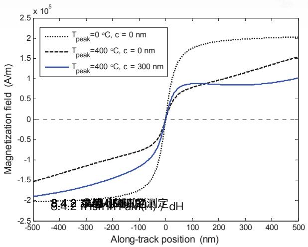  
รูปที่ 8.5 ผลกระทบของอุณหภูมิ $T _ { \mathrm { p e a k } }$ และการปรับแนว c ที่มีต่อสภาพความเป็นแม่เหล็ก $M ( x )$

aซ นอกจากนี้เกรเดียนต์สภาพความเป็นแม่เหล็กหาได้จากการหาอนุพันธ์ของสมการ (8.17) ซึ่งมีค่าเท่ากับ

$$
\frac { d M \left( x \right) } { d x } = \frac { 2 M _ { r } \left( T \left( x \right) \right) } { \pi } \frac { a } { \left( x - x _ { 0 } \right) ^ { 2 } + a ^ { 2 } } + \frac { 2 } { \pi } \tan ^ { - 1 } \left( \frac { x - x _ { 0 } } { a } \right) \frac { d M _ { r } \left( T \right) } { d T } \Bigg \vert _ { T \left( x \right) } \frac { d T \left( x \right) } { d x }\tag{8.18}
$$

และเกรเดียนต์สภาพความเป็นแม่เหล็ก ณ จุดศูนย์กลางการเปลี่ยนสถานะ $x = x _ { 0 }$ จะมีค่าเท่ากับ

$$
\left. \frac { d M ( x ) } { d x } \right| _ { x _ { 0 } } = \frac { 2 M _ { r } \left( T _ { 0 } \right) } { \pi a }\tag{8.19}
$$

เมื่อ $T _ { 0 } = T ( x _ { 0 } )$ คืออุณหฎูมิในสื่อบันทึก ณ ตำแหน่ง $x _ { 0 }$

## 8.4.2 การหาค่า dM(H)/ dH

อนุพันธ์ของสภาพความเป็นแม่เหล็กเทียบกับสนามแม่เหล็กรวม $H _ { \mathrm { t o t } }$ เมื่อพิจารณาที่สภาพลบล้าง แม่เหล็ก $H _ { c }$ ณ ตำแหน่ง $x _ { 0 }$ ที่มีอุณหภูมิ $T _ { 0 }$ สามารถหาได้จากสมการ (8.12) นั่นคือ

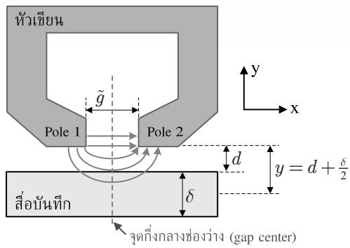  
รูปที่ .6 หัวเขียนรสื่อันึก พละนชังแรแม่เหลกขอรบบการบันทึกแบแนวนอน

$$
\left. \frac { d M \left( H \right) } { d H _ { \mathrm { t o t } } } \right| _ { H _ { c } \left( T _ { 0 } \right) } = \left| \frac { M _ { r } \left( T _ { 0 } \right) } { \left( 1 - S ^ { * } \left( T _ { 0 } \right) \right) H _ { c } \left( T _ { 0 } \right) } \right|\tag{8.20}
$$

สมการ (8.12) นั่นคือถึงแม้ว่าการเปลี่ยนสถานะที่เขียนลงไปในสื่อบันทึกจะมีทิศทางเหมือนหรือ ตรงกันข้ามกับทิศทางของสภาพลบล้างแม่เหล็ก ก็ยังสามารถใช้สมการ (8.20) ได้ โดยสมการ (8.20) มีค่าเป็นบวกเสมอ เพราะความชันของลูป M-H ในรูปที่ 8.3 เป็นบวกเสมอเช่นกัน

## 8.4.3 การหาค่า $d H _ { h } /$ dx

สำหรับระบบการบันทึกแบบแนวนอน สื่อบันทึกจะถูกทำให้มีสภาพความเป็นแม่เหล็กไปในทิศทาง ตามแนวนอน (หรือขนานกับจานบันทึก) รูปที่ 8.6 แสดงหัวเขียน สื่อบันทึก และเส้นแรงแม่เหล็ก ของระบบการบันทึกแบบแนวนอน โดยสนามแม่เหล็กของหัวเขียนจะเดินทางจากโพลที่ 1 ไปยัง โพลที่ 2 ซึ่งมีผลทำให้ทิศทางของสภาพความเป็นแม่เหล็กในสื่อบันทึกมีทิศทางในแนวนอนด้วย เช่นกัน ถ้าสมมุติให้หัวเขียนมีความกว้างและความยาวเป็นค่าอนันต์ แต่มีความกว้างของช่องว่าง9 (gap width หรือ shield-to-shield spacing) จำกัด ก็จะได้ว่าสนามแม่เหล็กของหัวเขียนที่นำเสนอ โดย Karlqvist [138] หรือเรียกว่า "สนามแม่เหล็กของหัวเขียนแบบ Karlqvist" ในแนวขนานกับ จานบันทึกมีค่าเท่ากับ

$$
H _ { x } \left( x , y \right) = \frac { H _ { 0 } } { \pi } \left[ \tan ^ { - 1 } \left( \frac { x + \tilde { g } / 2 } { y } \right) - \tan ^ { - 1 } \left( \frac { x - \tilde { g } / 2 } { y } \right) \right]\tag{8.21}
$$

และในแนวตังฉากกับจานบันทึกมีค่าเท่ากับ

  
รูปที่ 8.7 สนามแม่เหล็กของหัวเขียนแบบ Karlqvist ของระบบ HAMR แบบแนวนอนตามสมการ (8.21)

$$
H _ { y } \left( x , y \right) = - \frac { H _ { 0 } } { 2 \pi } \ln \left( \frac { \left( x + \tilde { g } / 2 \right) ^ { 2 } + y ^ { 2 } } { \left( x - \tilde { g } / 2 \right) ^ { 2 } + y ^ { 2 } } \right)\tag{8.22}
$$

เมื่อ $H _ { 0 }$ คือสนามแม่เหล็กของหัวเขียนที่อยู่ในช่องว่าง (gap filed) มีหน่วยเป็น A/m อย่างไรก็ตาม สื่อบันทึกที่ใช้ในระบบการบันทึกแบบแนวนอนจะมีความไว (รenรitivity) ต่อสนามแม่เหล็กของ หัวเขียนในแนวขนานกับจานบันทึก $H _ { x } ( x , y )$ เท่านัน (ดูรูปที 8.3) เพราะฉะนันระบบ HAMR แบบแนวนอนจะไม่พิจารณา $H _ { y } ( x , y )$ ในการคำนวณหาค่า $d H _ { h } /$ dx

เนื่องจากแบบจำลองวิลเลียม-คอมสต็อกเชิงความร้อนจะพิจารณาเฉพาะสนามแม่เหล็ก ณ จุดกึ่งกลางของความหนาของสื่อบันทึก ดังนั้นถ้าให้ 8 คือความหนาของสื่อบันทึก และ d คือ ระยะบิน (fly height)หรือระยะทางจากหัวเขียนมายังพื้นผิวของสื่อบันทึ่ก ก็จะได้ว่าสนามแม่เหล็ก ของหัวเขียน $H _ { h } ( x ) = H _ { x } ( x , y )$ จะต้องถูกพิจารณาที่ตำแหน่ง $y = d + \delta / 2$ ตามรูปที่ 8.6 โดยรูปที่ 8.7 แสดงสนามแม่เหล็กของหัวเขียนแบบ Karโญvist ในแนวขนานกับจานบันทึก สำหรับ $H _ { 0 } =$ 800 kA/m, $\tilde { g } = 3 0 0$ nm, $y = 5 0$ nm, และ $x = 0$ คือจุดกึงกลางช่องว่าง 9

หาอนุพันธ์ของสมการ (8.21) ณ จุดศูนย์กลางการเปลี่ยนสถานะ $x = x _ { 0 }$ ก็จะได้ [131]

$$
\left. \frac { d H _ { h } \left( x \right) } { d x } \right| _ { x _ { 0 } } = - \frac { Q \tilde { H } \left( T _ { 0 } \right) } { y }\tag{8.23}
$$